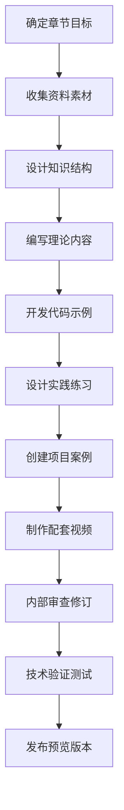
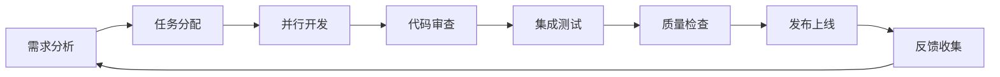

# Python智能体开发教材PDCA编写计划

## 一、Plan（计划阶段）- 教材编写总体规划

### 1.1 项目目标与愿景

**总体目标**：编写一套完整的AI时代Python开发教材，培养学生具备现代智能体开发能力

**具体目标**：
- 🎯 知识目标：掌握Python编程基础 + AI技术应用 + 产品化能力
- 🛠️ 技能目标：能够独立开发智能体应用，具备全栈开发能力
- 🧠 素养目标：培养计算思维、创新能力和AI伦理意识

### 1.2 教材架构设计

#### 教材结构框架
```
📚 Python智能体开发教材（3册）
├── 📖 第一册：Python基础与核心技术（18章）
├── 📖 第二册：AI技术与智能体开发（16章）  
└── 📖 第三册：高级应用与产品化（18章）

📱 配套资源
├── 🎥 视频教程库
├── 💻 在线编程环境
├── 🧪 实验平台
└── 📊 评估系统
```

#### 单章结构设计
```
📑 每章结构（约15-20页）
├── 🎯 学习目标（SMART目标）
├── 📝 知识导图（思维导图）
├── 🎓 理论讲解（图文并茂）
├── 💡 代码示例（可运行）
├── 🧪 实践练习（分层次）
├── 🏗️ 项目案例（综合应用）
├── 🤔 思考题目（拓展思维）
└── 📚 拓展阅读（延伸学习）
```

### 1.3 编写计划时间表

#### 第一阶段：基础准备（2周）
- **Week 1**: 制定详细大纲、建立编写规范、搭建技术平台
- **Week 2**: 设计统一模板、准备素材库、组建编写团队

#### 第二阶段：内容编写（24周）
- **Week 3-10**: 第一册编写（基础与核心技术）
- **Week 11-18**: 第二册编写（AI技术与智能体）
- **Week 19-26**: 第三册编写（高级应用与产品化）

#### 第三阶段：质量完善（6周）
- **Week 27-28**: 内容审查与修订
- **Week 29-30**: 技术验证与测试
- **Week 31-32**: 最终整合与发布准备

### 1.4 资源配置计划

#### 人力资源
- 🏗️ 项目经理 1名：总体协调和进度控制
- ✍️ 内容编写者 3名：分别负责三册内容
- 🎨 美术设计 1名：插图、图表、界面设计
- 💻 技术开发 2名：平台开发和代码验证
- 🔍 质量审核 1名：内容审查和质量把控

#### 技术资源
- 📝 编写工具：Markdown + GitBook/Notion
- 🎨 设计工具：Figma + Adobe Illustrator
- 💻 开发环境：VS Code + GitHub + Docker
- 🧪 测试平台：JupyterHub + CodePen + Repl.it

## 二、Do（执行阶段）- 具体实施方案

### 2.1 内容编写标准

#### 文本编写规范
```markdown
## 📝 文本规范
- 语言风格：通俗易懂、逻辑清晰、示例丰富
- 段落结构：主题句 + 解释 + 举例 + 小结
- 术语使用：中英文对照，首次出现需解释
- 代码风格：遵循PEP8规范，添加详细注释
```

#### 视觉设计规范
```markdown
## 🎨 视觉规范
- 配色方案：主色#2E86C1，辅色#F39C12，警告#E74C3C
- 字体选择：标题用思源黑体，正文用思源宋体，代码用Fira Code
- 图片要求：高清PNG/SVG，统一尺寸比例
- 图表样式：简洁明了，数据可视化优先
```

### 2.2 技术实现方案

#### 在线编程环境设计
```python
# 示例：集成式编程环境
class OnlineCodingEnvironment:
    def __init__(self):
        self.jupyter_server = "https://jupyter.example.com"
        self.code_runner = "https://api.example.com/run"
        self.ai_assistant = "https://ai.example.com/help"
    
    def create_exercise(self, chapter, exercise_id):
        """创建交互式练习"""
        return {
            "environment": "jupyter",
            "template_code": self.get_template(chapter, exercise_id),
            "test_cases": self.get_tests(exercise_id),
            "ai_hints": True,
            "auto_check": True
        }
```

#### 智能评估系统
```python
# 示例：自动评估系统
class AutoAssessment:
    def __init__(self):
        self.llm_evaluator = LLMEvaluator()
        self.code_analyzer = CodeAnalyzer()
    
    def evaluate_submission(self, code, expected_output):
        """多维度评估学生提交的代码"""
        results = {
            "correctness": self.test_correctness(code, expected_output),
            "style": self.code_analyzer.check_style(code),
            "efficiency": self.code_analyzer.check_performance(code),
            "creativity": self.llm_evaluator.assess_creativity(code),
            "suggestions": self.generate_feedback(code)
        }
        return results
```

### 2.3 内容创作流程

#### 单章编写流程


#### 质量检查清单
```markdown
## ✅ 内容质量检查清单

### 📚 内容质量
- [ ] 学习目标明确具体
- [ ] 知识点讲解清晰
- [ ] 案例贴近实际应用
- [ ] 难度梯度合理

### 💻 技术质量  
- [ ] 代码可以正常运行
- [ ] 示例输出正确
- [ ] 环境配置说明完整
- [ ] 错误处理机制完善

### 🎨 设计质量
- [ ] 排版美观统一
- [ ] 图表清晰易懂
- [ ] 配色协调舒适
- [ ] 交互体验良好
```

## 三、Check（检查阶段）- 质量控制体系

### 3.1 多层次质量检查

#### Level 1: 自检（编写者）
```python
class SelfCheck:
    def __init__(self):
        self.checklist = [
            "学习目标是否明确？",
            "代码是否能正常运行？", 
            "示例是否具有代表性？",
            "练习难度是否适中？",
            "内容是否有逻辑错误？"
        ]
    
    def run_check(self, chapter_content):
        """执行自检流程"""
        for item in self.checklist:
            result = self.check_item(chapter_content, item)
            if not result.passed:
                return False, result.issues
        return True, []
```

#### Level 2: 同行评议（编写团队）
```python
class PeerReview:
    def __init__(self):
        self.review_criteria = {
            "content_accuracy": 0.3,   # 内容准确性
            "pedagogical_design": 0.3, # 教学设计
            "technical_quality": 0.2,  # 技术质量
            "user_experience": 0.2     # 用户体验
        }
    
    def conduct_review(self, chapter, reviewers):
        """组织同行评议"""
        scores = {}
        for reviewer in reviewers:
            score = reviewer.evaluate(chapter, self.review_criteria)
            scores[reviewer.name] = score
        return self.calculate_final_score(scores)
```

#### Level 3: 学生测试（目标用户）
```python
class StudentTesting:
    def __init__(self):
        self.test_groups = ["初学者", "有基础", "进阶学习者"]
        self.metrics = ["理解度", "完成率", "满意度", "推荐度"]
    
    def run_usability_test(self, chapter, student_group):
        """进行可用性测试"""
        results = {
            "completion_rate": 0,      # 完成率
            "time_spent": 0,           # 用时
            "error_rate": 0,           # 错误率
            "satisfaction": 0,         # 满意度
            "feedback": []             # 反馈意见
        }
        return results
```

### 3.2 技术验证系统

#### 代码自动化测试
```python
class CodeValidation:
    def __init__(self):
        self.test_environments = [
            "Python 3.8", "Python 3.9", "Python 3.10", "Python 3.11"
        ]
        self.operating_systems = ["Windows", "macOS", "Linux"]
    
    def validate_all_examples(self, chapter):
        """验证章节中所有代码示例"""
        results = []
        for example in chapter.code_examples:
            for env in self.test_environments:
                for os in self.operating_systems:
                    result = self.run_code_test(example, env, os)
                    results.append(result)
        return results
```

### 3.3 连贯性检查机制

#### 跨章节一致性检查
```python
class CoherenceCheck:
    def __init__(self):
        self.terminology_dict = {}  # 术语字典
        self.concept_map = {}       # 概念关系图
        self.skill_progression = {} # 技能递进关系
    
    def check_terminology_consistency(self, all_chapters):
        """检查术语使用一致性"""
        inconsistencies = []
        for chapter in all_chapters:
            terms = self.extract_terms(chapter)
            for term in terms:
                if term in self.terminology_dict:
                    if self.terminology_dict[term] != terms[term]:
                        inconsistencies.append({
                            "term": term,
                            "chapter": chapter.id,
                            "definition": terms[term],
                            "expected": self.terminology_dict[term]
                        })
                else:
                    self.terminology_dict[term] = terms[term]
        return inconsistencies
    
    def check_skill_progression(self, all_chapters):
        """检查技能递进合理性"""
        skill_sequence = []
        for chapter in all_chapters:
            chapter_skills = self.extract_skills(chapter)
            skill_sequence.extend(chapter_skills)
        
        # 分析技能依赖关系
        return self.analyze_dependencies(skill_sequence)
```

## 四、Act（行动阶段）- 持续改进机制

### 4.1 反馈收集系统

#### 多渠道反馈收集
```python
class FeedbackSystem:
    def __init__(self):
        self.channels = [
            "在线问卷",      # 定期调研
            "学习分析",      # 行为数据
            "社区讨论",      # 论坛互动
            "教师反馈",      # 授课教师
            "企业评价"       # 就业反馈
        ]
    
    def collect_feedback(self, time_period="monthly"):
        """收集多渠道反馈"""
        feedback_data = {}
        for channel in self.channels:
            data = self.fetch_channel_data(channel, time_period)
            feedback_data[channel] = data
        return self.analyze_feedback(feedback_data)
```

#### 智能反馈分析
```python
class FeedbackAnalyzer:
    def __init__(self):
        self.sentiment_analyzer = SentimentAnalyzer()
        self.topic_modeler = TopicModeler()
        self.trend_analyzer = TrendAnalyzer()
    
    def analyze_feedback(self, feedback_data):
        """智能分析反馈数据"""
        insights = {
            "overall_sentiment": self.sentiment_analyzer.analyze(feedback_data),
            "key_topics": self.topic_modeler.extract_topics(feedback_data),
            "improvement_areas": self.identify_pain_points(feedback_data),
            "trends": self.trend_analyzer.analyze_trends(feedback_data)
        }
        return insights
```

### 4.2 版本迭代计划

#### 版本发布周期
```markdown
## 📅 版本发布计划

### 🚀 大版本更新（每年1次）
- 重大内容重构
- 新技术栈集成
- 教学方法革新

### 🔄 小版本更新（每季度1次）  
- 内容优化完善
- 错误修复
- 新功能添加

### 🐛 补丁更新（每月1次）
- 紧急错误修复
- 小幅内容调整
- 用户体验优化
```

#### 敏捷开发流程
```python
class AgileUpdate:
    def __init__(self):
        self.sprint_duration = 14  # 14天一个迭代
        self.backlog = PriorityQueue()
        self.current_sprint = []
    
    def plan_sprint(self, feedback_insights):
        """基于反馈规划迭代"""
        # 根据反馈优先级安排任务
        tasks = self.create_tasks_from_feedback(feedback_insights)
        for task in tasks:
            self.backlog.put((task.priority, task))
        
        # 选择本轮迭代任务
        sprint_capacity = 100  # 工作量单位
        current_load = 0
        
        while current_load < sprint_capacity and not self.backlog.empty():
            _, task = self.backlog.get()
            if current_load + task.effort <= sprint_capacity:
                self.current_sprint.append(task)
                current_load += task.effort
        
        return self.current_sprint
```

### 4.3 质量提升机制

#### 自动化改进建议
```python
class AutoImprovement:
    def __init__(self):
        self.ml_model = ContentOptimizationModel()
        self.rule_engine = ImprovementRuleEngine()
    
    def generate_improvement_suggestions(self, chapter_data, feedback_data):
        """生成改进建议"""
        # AI分析内容质量
        content_analysis = self.ml_model.analyze_content(chapter_data)
        
        # 规则引擎生成建议
        rule_suggestions = self.rule_engine.apply_rules(
            content_analysis, feedback_data
        )
        
        # 整合建议并排序
        all_suggestions = self.merge_suggestions(
            content_analysis.suggestions, 
            rule_suggestions
        )
        
        return sorted(all_suggestions, key=lambda x: x.impact_score, reverse=True)
```

#### 质量指标监控
```python
class QualityMonitoring:
    def __init__(self):
        self.kpis = {
            "学习完成率": 0.85,      # 目标85%以上
            "知识掌握度": 0.80,      # 目标80%以上  
            "学生满意度": 4.5,       # 目标4.5/5.0以上
            "教师推荐度": 4.0,       # 目标4.0/5.0以上
            "就业适配度": 0.90       # 目标90%以上
        }
    
    def track_quality_metrics(self):
        """跟踪质量指标"""
        current_metrics = self.collect_current_data()
        alerts = []
        
        for metric, target in self.kpis.items():
            current_value = current_metrics.get(metric, 0)
            if current_value < target:
                alerts.append({
                    "metric": metric,
                    "current": current_value,
                    "target": target,
                    "gap": target - current_value,
                    "priority": self.calculate_priority(metric, current_value, target)
                })
        
        return alerts
```

## 五、实施保障措施

### 5.1 技术平台支持

#### 编写协作平台
```markdown
## 🛠️ 技术栈选择

### 内容管理
- **Git + GitHub**: 版本控制和协作
- **Markdown + GitBook**: 内容编写和发布
- **Figma**: 设计协作
- **Notion**: 项目管理

### 开发环境
- **JupyterHub**: 在线编程环境
- **Docker**: 环境标准化
- **GitHub Actions**: CI/CD自动化
- **Vercel**: 快速部署
```

### 5.2 团队协作机制

#### 工作流程设计


### 5.3 风险管控

#### 风险识别与应对
```python
class RiskManagement:
    def __init__(self):
        self.risks = {
            "技术风险": {
                "probability": 0.3,
                "impact": "中等",
                "mitigation": "技术预研、备选方案"
            },
            "进度风险": {
                "probability": 0.4, 
                "impact": "高",
                "mitigation": "敏捷开发、并行作业"
            },
            "质量风险": {
                "probability": 0.2,
                "impact": "高", 
                "mitigation": "多层检查、用户测试"
            },
            "资源风险": {
                "probability": 0.3,
                "impact": "中等",
                "mitigation": "资源池化、外部协作"
            }
        }
    
    def assess_risks(self):
        """风险评估"""
        high_priority_risks = []
        for risk_name, risk_info in self.risks.items():
            risk_score = risk_info["probability"] * self.impact_to_score(risk_info["impact"])
            if risk_score > 0.6:  # 高风险阈值
                high_priority_risks.append((risk_name, risk_score, risk_info["mitigation"]))
        return high_priority_risks
```

## 六、预期成果与评估

### 6.1 预期成果
- 📚 **完整教材**: 3册共52章，约1500页内容
- 💻 **在线平台**: 集成编程环境和自动评估系统  
- 🎥 **视频教程**: 150+个配套教学视频
- 🧪 **实验项目**: 100+个可运行的项目案例
- 📊 **评估体系**: 智能化学习效果评估系统

### 6.2 成功标准
- ✅ **内容质量**: 专家评审得分 ≥ 4.5/5.0
- ✅ **学习效果**: 学生知识掌握度 ≥ 80%
- ✅ **用户满意**: 学生满意度 ≥ 4.5/5.0
- ✅ **市场认可**: 高校采用率 ≥ 20所
- ✅ **技术先进**: 在线平台功能完备度 ≥ 90%

这个PDCA编写计划确保了教材开发的系统性、科学性和可持续性，通过持续改进机制保证教材质量不断提升，最终实现培养AI时代Python开发人才的目标。 