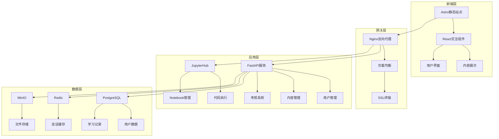
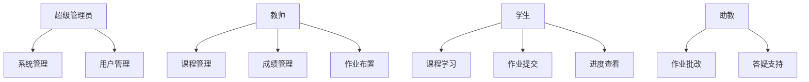

# Python智能体开发教学平台 v2.0 - PDCA规划文档

## 📋 Plan (计划阶段)

### 🎯 项目目标

构建一个专业级的Python教学平台，集成内容展示、代码执行、用户管理、考核评估等完整功能。

### 📊 需求分析

#### 功能需求
1. **内容管理系统**
   - 支持Markdown格式的教学内容
   - 响应式网页展示
   - 章节导航和搜索功能
   - 多媒体内容支持

2. **代码执行环境**
   - 安全的Python代码执行
   - Jupyter Notebook集成
   - 实时协作编程
   - 代码版本管理

3. **用户管理系统**
   - 学生/教师角色管理
   - 用户认证和授权
   - 学习进度跟踪
   - 个人学习档案

4. **考核评估系统**
   - 自动化作业评分
   - 在线考试功能
   - 成绩统计分析
   - 学习报告生成

#### 非功能需求
- **性能**: 支持100+并发用户
- **可用性**: 99.9%服务可用性
- **安全性**: 数据加密、访问控制
- **扩展性**: 模块化架构，易于扩展

### 🔍 技术选型分析

#### 方案1: 基于JupyterHub的集成方案 ⭐⭐⭐⭐⭐
```
优势:
✅ 成熟的多用户Jupyter环境
✅ 内置代码执行和协作功能
✅ 丰富的插件生态
✅ 支持多种编程语言
✅ 企业级安全特性

挑战:
❌ 界面相对传统
❌ 内容管理需要额外开发
❌ 定制化程度有限
```

#### 方案2: Astro + JupyterLite + 自建后端 ⭐⭐⭐⭐
```
优势:
✅ 现代化的静态站点生成
✅ 优秀的Markdown处理能力
✅ 前端性能优异
✅ 高度可定制

挑战:
❌ 需要较多自主开发
❌ JupyterLite功能有限
❌ 集成复杂度较高
```

#### 方案3: 基于Moodle的定制方案 ⭐⭐⭐
```
优势:
✅ 完整的LMS功能
✅ 用户管理和考核系统成熟
✅ 丰富的插件支持
✅ 多语言支持

挑战:
❌ 界面相对传统
❌ 代码执行需要插件
❌ 学习曲线较陡峭
```

#### 方案4: 混合架构 - 推荐方案 ⭐⭐⭐⭐⭐
```
前端: Astro (内容展示) + React (交互组件)
后端: FastAPI (API服务) + JupyterHub (代码执行)
数据库: PostgreSQL (用户数据) + Redis (缓存)
存储: MinIO (文件存储)
认证: OAuth2/OIDC
```

### 🏗️ 系统架构设计

#### 整体架构图


#### 技术栈详细规划

| 层级 | 技术选择 | 主要功能 | 备选方案 |
|------|----------|----------|----------|
| **前端** | Astro + React | 静态内容生成，交互组件 | Next.js, Nuxt.js |
| **API网关** | Nginx | 反向代理，负载均衡 | Traefik, Kong |
| **后端API** | FastAPI | 用户管理，内容API | Django, Flask |
| **代码执行** | JupyterHub | 多用户Jupyter环境 | JupyterLite, CodeServer |
| **数据库** | PostgreSQL | 主数据存储 | MySQL, MongoDB |
| **缓存** | Redis | 会话和数据缓存 | Memcached |
| **文件存储** | MinIO | 对象存储服务 | AWS S3, 本地存储 |
| **容器化** | Docker + K8s | 容器编排 | Docker Compose |

### 📚 内容管理策略

#### Markdown内容处理流程
```bash
# 1. 现有MD文件 → Astro内容集合
第一册-Python基础与核心技术/
├── 第1章-Python环境搭建与基础语法.md
├── 第2章-变量数据类型与运算符.md
└── ...

# 2. Astro内容结构
src/content/courses/
├── chapter-01/
│   ├── index.md (主要内容)
│   ├── exercises/ (练习题)
│   └── projects/ (项目案例)
└── ...

# 3. 自动化处理脚本
scripts/
├── md-converter.py (MD转换)
├── exercise-extractor.py (提取练习)
└── content-validator.py (内容验证)
```

#### 练习题和项目管理
```yaml
# 练习题元数据格式
---
title: "个人信息输出程序"
chapter: 1
difficulty: "基础"
type: "编程练习"
estimated_time: "15分钟"
skills: ["变量", "字符串格式化", "用户输入"]
auto_grade: true
---
```

### 👥 用户管理和认证

#### 用户角色设计


#### 认证和授权方案
- **认证方式**: OAuth2/OIDC (支持多种登录方式)
- **权限控制**: RBAC (基于角色的访问控制)
- **会话管理**: JWT Token + Redis存储
- **安全特性**: 密码策略、多因素认证、防暴力破解

### 📊 考核评估系统

#### 自动评分引擎
```python
# 评分引擎架构
class GradingEngine:
    def __init__(self):
        self.test_runners = {
            'unit_test': UnitTestRunner(),
            'output_comparison': OutputComparisonRunner(),
            'code_quality': CodeQualityRunner(),
            'performance': PerformanceRunner()
        }
    
    def grade_submission(self, code, exercise_config):
        results = {}
        for test_type, runner in self.test_runners.items():
            if test_type in exercise_config['tests']:
                results[test_type] = runner.run(code, exercise_config['tests'][test_type])
        return self.calculate_final_score(results)
```

#### 评估维度
1. **正确性** (40%): 代码是否能正确运行并产生预期结果
2. **代码质量** (30%): 代码风格、注释、命名规范
3. **效率** (20%): 算法复杂度和性能表现  
4. **创新性** (10%): 解决方案的独特性和创造性

### 🔧 开发和部署策略

#### 开发环境
```yaml
# docker-compose.dev.yml
version: '3.8'
services:
  frontend:
    build: ./frontend
    ports: ["3000:3000"]
    volumes: ["./frontend:/app"]
    
  api:
    build: ./backend
    ports: ["8000:8000"]
    environment:
      - DATABASE_URL=postgresql://...
      
  jupyterhub:
    image: jupyterhub/jupyterhub:latest
    ports: ["8001:8000"]
    
  postgres:
    image: postgres:14
    environment:
      - POSTGRES_DB=eduplatform
      
  redis:
    image: redis:7-alpine
```

#### 生产部署
- **容器编排**: Kubernetes
- **CI/CD**: GitHub Actions
- **监控**: Prometheus + Grafana
- **日志**: ELK Stack
- **备份**: 自动化数据库和文件备份

### 📈 项目里程碑

#### Phase 1: 基础架构 (4周)
- [ ] 技术栈环境搭建
- [ ] 用户认证系统
- [ ] 基础内容展示
- [ ] Jupyter集成

#### Phase 2: 核心功能 (6周)
- [ ] 完整内容管理系统
- [ ] 练习题自动评分
- [ ] 学习进度跟踪
- [ ] 基础考核功能

#### Phase 3: 高级特性 (4周)
- [ ] 高级考试系统
- [ ] 数据分析报告
- [ ] 社交学习功能
- [ ] 移动端适配

#### Phase 4: 优化完善 (2周)
- [ ] 性能优化
- [ ] 安全加固
- [ ] 用户体验优化
- [ ] 文档完善

### 🎯 成功指标

#### 技术指标
- 页面加载时间 < 2秒
- 代码执行响应时间 < 5秒
- 系统可用性 > 99.9%
- 并发用户支持 > 100人

#### 业务指标
- 学生活跃度 > 80%
- 作业完成率 > 90%
- 学习满意度 > 4.5/5
- 教师使用率 > 95%

---

## 🚀 Do (执行阶段)

### 当前阶段: Phase 1 - 基础架构搭建

接下来我将创建基础的项目结构和核心组件，您看这个规划是否符合您的期望？需要调整哪些部分？ 