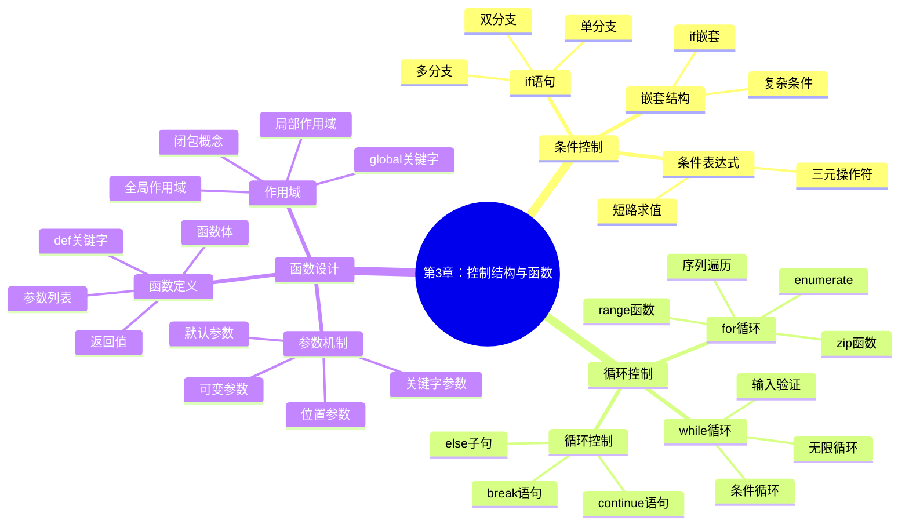

# 📋 明日工作计划 - 第3章《控制结构与函数定义》

**计划日期**: 2024年1月23日  
**PDCA阶段**: Plan → Do (新章节开始)  
**上周成果**: 第2章高质量完成，提前3.5小时

## 🎯 明日主要目标

### 🔥 核心任务
1. **完成第2章Check阶段** (2小时)
2. **制定第3章详细Plan** (1小时)  
3. **启动第3章Do阶段** (5小时)
4. **在线环境基础开发** (1小时)

### 📊 成功指标
- 第2章质量检查评分 ≥90分
- 第3章完成度 ≥60%
- 在线环境基础功能可运行
- 明日总工作时间：9小时

## 🔄 PDCA流程安排

### 📋 Plan阶段 (9:00-10:00, 1小时)

#### 第3章规划任务
- [ ] **分析第3章知识点** (20分钟)
  - 条件语句 (if/elif/else)
  - 循环语句 (for/while) 
  - 函数定义与调用
  - 参数传递机制
  - 返回值处理
  - 作用域与闭包

- [ ] **设计章节架构** (25分钟)
  ```
  3.1 条件控制结构
    3.1.1 if语句基础
    3.1.2 elif多分支
    3.1.3 嵌套条件
    3.1.4 条件表达式
  
  3.2 循环控制结构  
    3.2.1 for循环详解
    3.2.2 while循环应用
    3.2.3 循环控制语句
    3.2.4 循环嵌套技巧
  
  3.3 函数设计与实现
    3.3.1 函数定义语法
    3.3.2 参数类型详解
    3.3.3 返回值机制
    3.3.4 作用域管理
  ```

- [ ] **确定学习目标** (15分钟)
  - 使用SMART原则制定
  - 设定可衡量的能力指标
  - 规划评估方式

### 🚀 Do阶段 (11:00-16:00, 5小时)

#### 内容创作任务分解

**11:00-12:30 理论内容编写** (1.5小时)
- [ ] 3.1 条件控制结构 (45分钟)
- [ ] 3.2 循环控制结构 (45分钟)

**14:00-15:30 函数部分编写** (1.5小时)  
- [ ] 3.3 函数设计与实现 (90分钟)

**15:30-17:00 代码示例开发** (1.5小时)
- [ ] 示例1：成绩分级系统
- [ ] 示例2：数字猜谜游戏
- [ ] 示例3：菜单驱动程序

**17:00-17:30 练习题设计** (30分钟)
- [ ] 基础练习：条件判断题
- [ ] 中级练习：循环应用题
- [ ] 挑战练习：递归函数题

### 🔍 Check阶段 (9:00-11:00, 2小时)

#### 第2章质量检查
- [ ] **代码验证** (30分钟)
  - 运行所有代码示例
  - 验证输出结果正确性
  - 检查边界条件处理

- [ ] **内容审查** (45分钟)
  - 知识点覆盖完整性
  - 概念解释准确性
  - 案例实用性评估

- [ ] **教学效果评估** (30分钟)
  - 难度梯度合理性
  - 练习题有效性
  - 项目案例实战性

- [ ] **文档规范检查** (15分钟)
  - 格式统一性
  - 链接有效性
  - 图表清晰度

### 🔄 Act阶段 (17:00-18:00, 1小时)

#### 优化改进
- [ ] **总结今日成果** (20分钟)
- [ ] **记录发现问题** (15分钟)
- [ ] **制定明日计划** (25分钟)

## 📝 第3章详细编写规划

### 🎯 学习目标设计

**SMART目标**:
- **S**pecific: 掌握Python控制结构和函数定义
- **M**easurable: 能独立编写包含条件、循环、函数的程序
- **A**chievable: 通过理论+实践循序渐进学习
- **R**elevant: 为算法设计和问题解决奠定基础
- **T**ime-bound: 2周内完成学习（4课时）

### 📊 知识导图设计



### 🔧 代码示例规划

#### 示例1：智能成绩分级系统
```python
def grade_system():
    """智能成绩分级系统"""
    # 功能：输入分数，输出等级和评价
    # 知识点：条件结构、函数定义、参数处理
    pass
```

#### 示例2：数字猜谜游戏
```python
def guessing_game():
    """数字猜谜游戏"""
    # 功能：随机数字猜测，计分系统
    # 知识点：while循环、条件判断、用户交互
    pass
```

#### 示例3：菜单驱动程序
```python
def menu_system():
    """菜单驱动的计算器程序"""
    # 功能：多功能计算器，菜单选择
    # 知识点：for循环、函数调用、程序结构
    pass
```

#### 示例4：文件处理程序
```python
def file_processor():
    """批量文件处理程序"""
    # 功能：遍历文件，统计信息
    # 知识点：循环嵌套、文件操作、错误处理
    pass
```

#### 示例5：递归应用
```python
def recursive_examples():
    """递归函数应用集合"""
    # 功能：阶乘、斐波那契、汉诺塔
    # 知识点：递归设计、函数调用栈
    pass
```

### 🎮 练习题设计

#### 基础练习 (培养基础技能)
1. **年龄分类器** - 条件判断练习
2. **乘法表生成器** - 循环嵌套练习  
3. **简单函数集合** - 函数定义练习

#### 中级练习 (综合应用)
1. **学生管理系统** - 综合控制结构
2. **素数检测器** - 算法+函数设计
3. **密码强度检查** - 复杂条件判断

#### 挑战练习 (创新思维)
1. **递归解谜题** - 递归思维训练
2. **动态菜单系统** - 高级程序结构
3. **简单解释器** - 语法分析应用

### 🚀 项目案例：任务管理系统

**项目需求**:
- 任务增删改查功能
- 任务优先级排序
- 任务状态管理
- 数据持久化存储
- 用户友好界面

**技术要点**:
- 函数模块化设计
- 循环处理用户输入
- 条件控制程序流程
- 文件读写操作
- 错误处理机制

## ⚠️ 风险预警与应对

### 🔴 今日可能风险
1. **时间风险**: 第3章内容量大，可能无法完成预期进度
   - **应对**: 优先完成核心内容，细节部分可延后
   - **后备计划**: 将函数部分推迟到明日继续

2. **质量风险**: 赶进度可能影响内容质量
   - **应对**: 严格执行质量检查，不合格内容重做
   - **标准**: 代码示例必须可运行，概念解释必须准确

3. **复杂度风险**: 函数和递归概念对初学者较难
   - **应对**: 增加更多简单示例，循序渐进
   - **辅助**: 制作概念图解和动画演示

### 🟡 中期关注点
1. **连贯性**: 确保第3章与前两章的知识衔接
2. **难度曲线**: 控制知识点增长速度
3. **实用性**: 案例要贴近学生实际需求

## 📋 检查清单

### 第2章Check清单 ✅
- [ ] 所有代码示例运行正常
- [ ] 智能计算器项目功能完整
- [ ] 练习题答案正确性验证
- [ ] 文档格式和链接检查
- [ ] 学习目标达成度评估

### 第3章Plan清单 ✅
- [ ] 知识点分析完成
- [ ] 章节架构设计完成
- [ ] 学习目标制定完成
- [ ] 代码示例规划完成
- [ ] 练习题设计完成
- [ ] 项目案例需求明确

### 第3章Do清单 🟡
- [ ] 3.1 条件控制结构编写
- [ ] 3.2 循环控制结构编写
- [ ] 3.3 函数设计与实现编写
- [ ] 5个代码示例开发
- [ ] 分层练习题创建
- [ ] 任务管理系统项目案例

## 📞 协作安排

### 今日协作任务
- **内容审核**: 邀请专家审核第2章内容
- **代码测试**: 请同事验证代码示例
- **用户测试**: 收集目标用户的反馈意见

### 沟通时间点
- **10:30**: 第2章审核结果收集
- **15:00**: 第3章编写进度汇报
- **17:30**: 明日计划确认和资源协调

## 🎊 激励机制

### 今日成就目标
- 🏆 **效率之星**: 提前完成计划任务
- 🎯 **质量达人**: 所有检查项100%通过
- 💡 **创新能手**: 设计出优秀的项目案例
- 🤝 **协作典范**: 积极收集和处理反馈

### 庆祝方式
- 完成今日目标后，享受一杯好咖啡 ☕
- 记录今日最满意的工作成果 📝
- 为明日工作做好充分准备 🚀

---

**制定者**: AI助手  
**执行者**: 项目团队  
**监督者**: 项目负责人  
**最后更新**: 2024年1月22日 18:30  

💪 **今日座右铭**: "质量第一，进度第二，持续改进是关键！" 