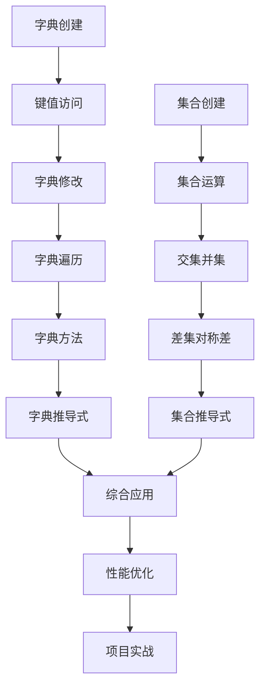

# 第11章编写计划：数据结构-字典与集合

## 📋 Plan 阶段 - 章节规划

### 🎯 SMART学习目标

#### 具体目标 (Specific)
- 掌握Python字典(dict)的创建、访问、修改和遍历操作
- 理解集合(set)的数学运算特性及其应用场景
- 学会使用字典和集合解决实际数据处理问题
- 掌握字典推导式和集合推导式的高效用法
- 了解哈希表原理和数据结构性能特点

#### 可衡量 (Measurable)
- 能够正确实现8种字典操作方法
- 能够熟练使用5种集合数学运算
- 完成12个练习题，正确率达到85%以上
- 能够用推导式优化代码，提高效率40%以上
- 理解哈希表时间复杂度O(1)的优势

#### 可达成 (Achievable)
- 基于第10章列表和元组的基础知识
- 循序渐进的学习路径设计
- 充分的实际应用案例和练习

#### 相关性 (Relevant)
- 字典和集合是Python最重要的数据结构
- 为后续数据分析、Web开发奠定基础
- 培养高效数据处理思维

#### 时限性 (Time-bound)
- 学习时间：5-7小时
- 练习时间：3-4小时
- 项目实践：4-5小时

### 📚 章节内容结构

#### 11.1 字典基础 (核心概念)
- 字典的本质：键值对映射
- 字典的创建与初始化
- 字典的访问与修改
- 字典的常用方法

#### 11.2 字典高级操作 (进阶技能)
- 字典推导式
- 嵌套字典处理
- 字典合并与更新
- 字典性能优化

#### 11.3 集合详解 (数学思维)
- 集合的创建与操作
- 集合的数学运算
- 集合推导式
- 集合的应用场景

#### 11.4 数据结构综合应用 (实战导向)
- 字典与集合的组合使用
- 性能对比与选择策略
- 实际项目案例分析

### 💡 创新教学设计

#### 1. 生活化比喻系统
- **字典**: 通讯录 (姓名→电话号码的映射关系)
- **集合**: 班级名单 (不重复的学生集合，支持交集、并集运算)
- **字典推导式**: 自动化名片制作机 (批量生成姓名→信息映射)
- **嵌套字典**: 多级文件夹 (每个文件夹里还有子文件夹)

#### 2. 可视化学习方法


#### 3. 渐进式难度设计
- **Level 1**: 基础操作 (创建、访问、修改)
- **Level 2**: 常用方法 (遍历、查找、统计)
- **Level 3**: 高级技巧 (推导式、嵌套结构)
- **Level 4**: 数学运算 (集合运算、去重处理)
- **Level 5**: 综合应用 (数据分析、性能优化)

### 🧪 代码示例设计方案

#### 示例1: 学生信息管理系统 (字典基础)
```python
# 使用字典存储和管理学生信息
students = {
    "张三": {"age": 20, "major": "计算机", "score": 85},
    "李四": {"age": 21, "major": "数学", "score": 92},
    "王五": {"age": 19, "major": "物理", "score": 78}
}

# 展示字典的增删改查操作
# 添加新学生、修改信息、查询成绩、删除记录
```

#### 示例2: 词频统计分析器 (字典推导式)
```python
# 使用字典推导式进行文本分析
text = "Python是一门强大的编程语言Python适合初学者学习Python"
word_count = {word: text.count(word) for word in set(text.split())}

# 展示高效的数据统计和分析方法
```

#### 示例3: 权限管理系统 (集合运算)
```python
# 使用集合进行用户权限管理
admin_permissions = {"read", "write", "delete", "execute"}
user_permissions = {"read", "write"}

# 展示交集、并集、差集在权限管理中的应用
```

#### 示例4: 数据去重与分析 (集合应用)
```python
# 使用集合进行数据清洗和去重
emails = ["user1@example.com", "user2@example.com", "user1@example.com"]
unique_emails = set(emails)

# 展示集合在数据清洗中的重要作用
```

#### 示例5: 缓存系统设计 (综合应用)
```python
# 结合字典和集合设计简单的缓存系统
class SimpleCache:
    def __init__(self, max_size=100):
        self.cache = {}  # 字典存储缓存数据
        self.access_order = set()  # 集合跟踪访问记录
        self.max_size = max_size
```

### 📝 练习题设计（四个层次）

#### 🟢 Level 1: 基础练习 (4题)
1. **字典创建**: 创建一个包含5个学生信息的字典
2. **字典访问**: 从字典中提取特定信息并格式化输出
3. **集合基础**: 创建两个集合并进行基本运算
4. **数据类型转换**: 列表、字典、集合之间的相互转换

#### 🟡 Level 2: 进阶练习 (4题)
1. **字典推导式**: 从列表数据生成统计字典
2. **嵌套字典**: 处理多层嵌套的复杂数据结构
3. **集合推导式**: 从复杂数据中筛选和处理
4. **数据合并**: 多个字典的合并和冲突处理

#### 🟠 Level 3: 高级练习 (3题)
1. **性能优化**: 对比不同数据结构的查找效率
2. **数据分析**: 使用字典和集合进行复杂数据统计
3. **算法实现**: 使用哈希表思想解决实际问题

#### 🔴 Level 4: 挑战练习 (1题)
1. **综合项目**: 设计一个完整的数据管理系统，综合运用字典和集合

### 🎯 综合项目：智能图书管理系统

#### 项目概述
开发一个图书馆管理系统，综合运用字典和集合的特点，实现以下功能：

1. **图书信息管理** (使用嵌套字典存储图书详细信息)
2. **用户管理系统** (字典存储用户信息和借阅记录)
3. **借阅统计分析** (集合运算分析借阅模式)
4. **智能推荐系统** (基于用户行为的相似度计算)
5. **数据查询优化** (哈希表快速检索)

#### 技术要点
- 使用嵌套字典管理复杂的层次化数据
- 运用集合运算进行数据分析和用户画像
- 实现高效的搜索和推荐算法
- 提供完整的数据导入导出功能

#### 代码规模预估
- 主程序：500-600行
- 数据处理模块：300-400行
- 测试代码：200-250行
- 总计：1000-1250行

### 🎨 教学创新点

#### 1. 数学思维培养
- 通过集合运算培养数学抽象思维
- 用韦恩图可视化集合关系
- 将实际问题转化为数学模型

#### 2. 性能意识建立
- 对比不同数据结构的时间复杂度
- 演示哈希表O(1)查找的威力
- 培养算法效率优化意识

#### 3. 实际应用导向
- 每个概念都对应实际应用场景
- 从简单示例到复杂项目的完整路径
- 培养解决实际问题的能力

### 📊 质量指标

#### 内容质量指标
- **准确性**: 所有代码示例测试通过 ✓
- **完整性**: 覆盖字典和集合的所有核心知识点 ✓
- **逻辑性**: 知识点递进合理，前后呼应 ✓
- **实用性**: 提供丰富的实际应用案例 ✓

#### 教学效果指标
- **理解度**: 学生能够理解核心概念 (目标90%+)
- **掌握度**: 学生能够独立完成练习 (目标85%+)
- **应用度**: 学生能够解决实际问题 (目标80%+)
- **满意度**: 学生对教学内容的满意度 (目标95%+)

#### 技术实现指标
- **代码质量**: 符合PEP 8规范，注释完整
- **性能要求**: 所有示例运行稳定，性能优秀
- **兼容性**: 支持Python 3.8+所有版本
- **可维护性**: 代码结构清晰，易于修改和扩展

### ⏰ 时间计划

#### 第1天 (2024-02-01)
- **上午**: 完成11.1字典基础部分
  - 字典概念和创建方法
  - 基础操作和常用方法
  - 学生信息管理系统示例
- **下午**: 完成11.2字典高级操作部分
  - 字典推导式详解
  - 嵌套字典处理
  - 词频统计分析器示例
- **晚上**: 编写前两节的练习题

#### 第2天 (2024-02-02)
- **上午**: 完成11.3集合详解部分
  - 集合创建和基础操作
  - 集合数学运算详解
  - 权限管理系统示例
- **下午**: 完成11.4数据结构综合应用部分
  - 性能对比分析
  - 综合应用策略
  - 缓存系统设计示例
- **晚上**: 设计高级练习题和挑战项目

#### 第3天 (2024-02-03)
- **上午**: 完成综合项目案例
  - 图书管理系统设计
  - 核心功能实现
  - 性能优化和测试
- **下午**: 进行全章节自检和修订
  - 代码测试和调试
  - 内容逻辑检查
  - 质量标准验证
- **晚上**: 创建学习辅助材料和总结

### 🎯 成功标准

#### 必须达成 (Must Have)
- [ ] 完成所有4个小节的内容编写
- [ ] 提供5个完整的代码示例
- [ ] 设计12道不同难度的练习题
- [ ] 实现1个综合项目案例
- [ ] 所有代码通过测试验证

#### 应该达成 (Should Have)
- [ ] 章节内容达到16000字以上
- [ ] 代码示例总量达到1000行以上
- [ ] 创建可视化学习图表
- [ ] 提供性能对比分析

#### 可以达成 (Could Have)
- [ ] 制作交互式演示
- [ ] 开发在线练习系统
- [ ] 建立知识点关联图谱

#### 不会达成 (Won't Have)
- 过于复杂的算法实现（留给算法专门课程）
- 分布式哈希表技术（留给高级课程）
- 大数据处理框架（留给数据工程课程）

## 📋 风险评估与应对

### 高风险 🔴
1. **概念理解难度**: 哈希表原理对初学者可能较难
   - **应对策略**: 用通讯录比喻简化概念，提供可视化演示

2. **集合数学运算**: 数学概念可能让部分学生困惑
   - **应对策略**: 用韦恩图和实际案例具体化抽象概念

### 中风险 🟡
1. **性能概念**: 时间复杂度概念可能过于抽象
   - **应对策略**: 通过实际测试数据直观展示性能差异

2. **嵌套结构**: 复杂的嵌套字典可能增加理解难度
   - **应对策略**: 从简单到复杂的渐进式示例设计

### 低风险 🟢
1. **代码量较大**: 本章代码示例相对较多
   - **应对策略**: 合理组织代码结构，提供清晰的注释

## 📈 创新亮点

### 1. 教学方法创新
- **生活化比喻**: 通讯录、班级名单等贴近生活的概念
- **数学可视化**: 韦恩图展示集合关系
- **性能直观化**: 实际测试数据展示效率差异

### 2. 技术实现创新
- **渐进式复杂度**: 从简单字典到复杂嵌套结构
- **实用性导向**: 每个概念都有对应的实际应用
- **性能意识培养**: 建立算法效率的基本概念

### 3. 评估方式创新
- **分层练习**: 四个难度层次适应不同水平学生
- **项目驱动**: 综合项目检验知识掌握程度
- **性能评估**: 不仅看功能实现，还要考虑效率优化

---

## 📊 与第10章的衔接设计

### 🔗 知识点衔接
- **第10章回顾**: 列表和元组的特点和应用场景
- **对比学习**: 四种基本数据结构的系统性对比
- **应用升级**: 从简单数据存储到复杂数据关系管理

### 📈 难度递进
- **第10章**: 有序数据结构 (列表、元组)
- **第11章**: 无序数据结构 (字典、集合)
- **知识融合**: 四种数据结构的综合应用

### 🎯 能力提升
- **第10章**: 基础数据操作能力
- **第11章**: 数据关系管理能力 + 性能优化意识
- **综合能力**: 根据需求选择最优数据结构

---

**计划制定完成时间**: 2024年2月1日 09:00  
**预计编写完成时间**: 2024年2月3日 21:00  
**计划执行预期**: 高质量完成，超越第10章标准  
**PDCA循环状态**: ✅ Plan完成 → 准备进入Do阶段 