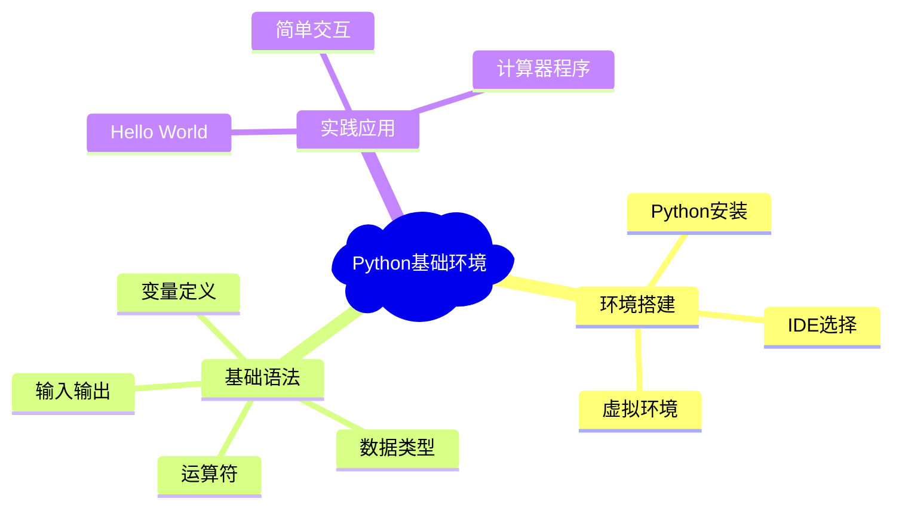
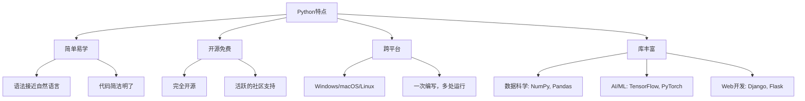
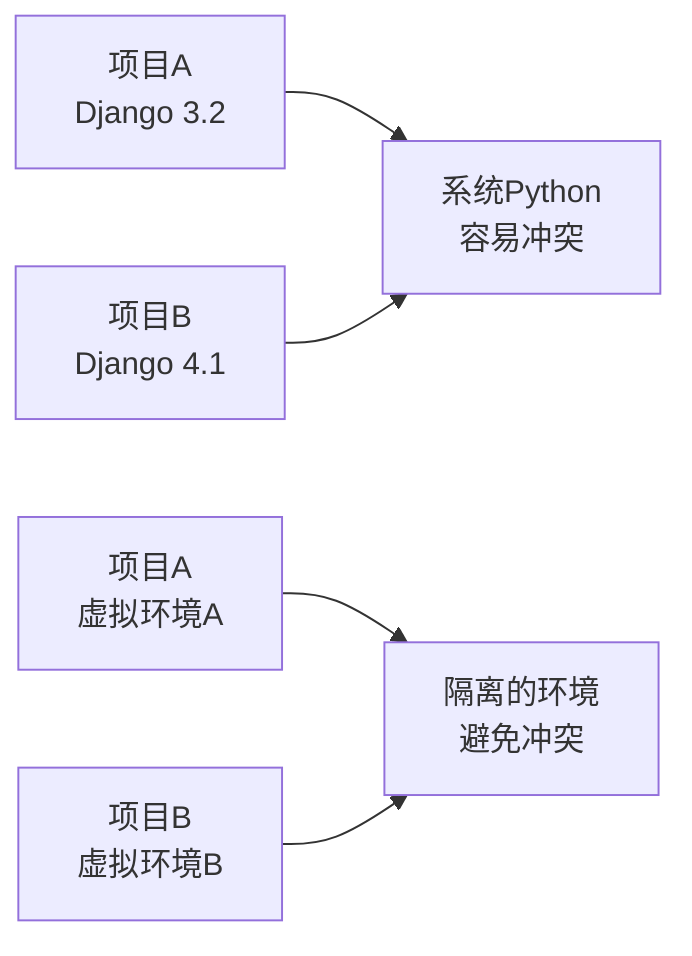

# 第1章：Python环境搭建与基础语法

## 🎯 学习目标（SMART目标）

完成本章学习后，学生将能够：
- **S**pecific（具体）：在自己的电脑上成功安装Python 3.11环境，配置VS Code开发环境
- **M**easurable（可测量）：能够编写并运行至少5个基础Python程序
- **A**chievable（可实现）：掌握变量、数据类型、基本运算等核心概念
- **R**elevant（相关）：为后续AI开发学习奠定编程基础
- **T**ime-bound（时限）：本章预计学习时间：4课时（2周）

## 📝 知识导图



## 🎓 理论讲解

### 1.1 Python简介与特点

#### 什么是Python？

Python是一种**解释型、面向对象、动态数据类型**的高级程序设计语言。它由Guido van Rossum于1989年发明，以其简洁优雅的语法而闻名。


*图1.1 Python之父 - Guido van Rossum*

#### Python的核心特点



### 1.2 环境搭建

#### Step 1: Python安装

**Windows系统安装：**

1. 访问Python官网：https://www.python.org/downloads/
2. 下载最新版本Python 3.11
3. 运行安装程序，**重要：勾选"Add Python to PATH"**


*图1.2 Windows Python安装界面*

**macOS系统安装：**

```bash
# 方法1：使用Homebrew（推荐）
brew install python@3.11

# 方法2：直接下载安装包
# 从官网下载.pkg文件并安装
```

**Linux系统安装：**

```bash
# Ubuntu/Debian
sudo apt update
sudo apt install python3.11 python3-pip

# CentOS/RHEL
sudo yum install python3.11 python3-pip
```

#### Step 2: 验证安装

打开终端/命令行，输入以下命令验证安装：

```bash
python --version
# 或者
python3 --version
```

期望输出：
```
Python 3.11.x
```

#### Step 3: IDE环境配置

**推荐使用 VS Code + Python扩展**

1. 下载安装VS Code：https://code.visualstudio.com/
2. 安装Python扩展：
   - 打开VS Code
   - 按`Ctrl+Shift+X`打开扩展面板
   - 搜索"Python"
   - 安装Microsoft官方Python扩展


*图1.3 VS Code Python扩展安装*

### 1.3 虚拟环境管理

#### 为什么需要虚拟环境？



#### 创建和使用虚拟环境

```bash
# 创建虚拟环境
python -m venv myproject_env

# Windows激活
myproject_env\Scripts\activate

# macOS/Linux激活
source myproject_env/bin/activate

# 安装包（在虚拟环境中）
pip install requests numpy

# 退出虚拟环境
deactivate
```

## 💡 代码示例（可运行）

### 示例1：Hello World程序

```python
# hello_world.py
print("Hello, Python World!")
print("欢迎来到AI时代的Python编程！")

# 多行输出
message = """
欢迎学习Python！
这是你的第一个程序。
让我们开始这段精彩的编程之旅吧！
"""
print(message)
```

**运行结果：**
```
Hello, Python World!
欢迎来到AI时代的Python编程！

欢迎学习Python！
这是你的第一个程序。
让我们开始这段精彩的编程之旅吧！
```

### 示例2：变量和数据类型

```python
# variables_and_types.py

# 数字类型
age = 20                    # 整数 (int)
height = 175.5             # 浮点数 (float)
complex_num = 3 + 4j       # 复数 (complex)

# 字符串类型
name = "张三"               # 字符串 (str)
school = 'Python大学'       # 单引号也可以

# 布尔类型
is_student = True          # 布尔值 (bool)
has_finished = False

# 列表类型
scores = [85, 92, 78, 96]  # 列表 (list)
subjects = ["数学", "英语", "Python", "AI基础"]

# 字典类型
student_info = {           # 字典 (dict)
    "姓名": "张三",
    "年龄": 20,
    "成绩": scores
}

# 输出变量信息
print(f"学生姓名：{name}")
print(f"年龄：{age}")
print(f"身高：{height}cm")
print(f"是否为学生：{is_student}")
print(f"成绩列表：{scores}")
print(f"学生信息：{student_info}")

# 查看变量类型
print(f"\nname的类型是：{type(name)}")
print(f"age的类型是：{type(age)}")
print(f"scores的类型是：{type(scores)}")
```

**运行结果：**
```
学生姓名：张三
年龄：20
身高：175.5cm
是否为学生：True
成绩列表：[85, 92, 78, 96]
学生信息：{'姓名': '张三', '年龄': 20, '成绩': [85, 92, 78, 96]}

name的类型是：<class 'str'>
age的类型是：<class 'int'>
scores的类型是：<class 'list'>
```

### 示例3：基本运算符

```python
# operators.py

# 算术运算符
a = 10
b = 3

print("=== 算术运算符 ===")
print(f"{a} + {b} = {a + b}")    # 加法
print(f"{a} - {b} = {a - b}")    # 减法
print(f"{a} * {b} = {a * b}")    # 乘法
print(f"{a} / {b} = {a / b}")    # 除法（浮点）
print(f"{a} // {b} = {a // b}")  # 整数除法
print(f"{a} % {b} = {a % b}")    # 取余
print(f"{a} ** {b} = {a ** b}")  # 幂运算

# 比较运算符
print("\n=== 比较运算符 ===")
print(f"{a} > {b} = {a > b}")
print(f"{a} < {b} = {a < b}")
print(f"{a} == {b} = {a == b}")
print(f"{a} != {b} = {a != b}")

# 逻辑运算符
x = True
y = False
print("\n=== 逻辑运算符 ===")
print(f"{x} and {y} = {x and y}")
print(f"{x} or {y} = {x or y}")
print(f"not {x} = {not x}")
```

## 🧪 实践练习（分层次）

### 🟢 基础练习

#### 练习1：个人信息管理
**任务描述：**创建一个程序，收集并显示个人基本信息。

```python
# 练习模板 - 请完善代码
name = input("请输入您的姓名：")
age = int(input("请输入您的年龄："))
# TODO: 添加更多信息收集
# 提示：可以收集专业、爱好等信息

print(f"您好，{name}！")
# TODO: 输出完整的个人信息
```

**期望输出示例：**
```
请输入您的姓名：李明
请输入您的年龄：19
请输入您的专业：计算机科学
请输入您的爱好：编程

=== 个人信息卡片 ===
姓名：李明
年龄：19岁
专业：计算机科学
爱好：编程
```

#### 练习2：简单计算器
**任务描述：**编写一个能够进行基本四则运算的计算器。

```python
# 练习模板
def simple_calculator():
    """简单计算器程序"""
    print("=== 简单计算器 ===")
    
    # TODO: 获取用户输入的两个数字
    num1 = float(input("请输入第一个数字："))
    num2 = float(input("请输入第二个数字："))
    
    # TODO: 获取运算符
    operator = input("请输入运算符 (+, -, *, /)：")
    
    # TODO: 根据运算符进行计算并输出结果
    # 提示：使用if-elif-else语句
    
# 运行计算器
simple_calculator()
```

### 🟡 中级练习

#### 练习3：成绩统计分析
**任务描述：**输入一组学生成绩，计算平均分、最高分、最低分。

```python
# 练习提示代码
def grade_analyzer():
    """成绩分析器"""
    scores = []
    
    # TODO: 循环输入成绩，直到用户输入'done'
    while True:
        score_input = input("请输入成绩（输入'done'结束）：")
        if score_input.lower() == 'done':
            break
        # TODO: 将输入转换为数字并添加到scores列表
    
    # TODO: 计算统计信息
    # 平均分 = sum(scores) / len(scores)
    # 最高分 = max(scores)
    # 最低分 = min(scores)
    
    # TODO: 输出分析结果

grade_analyzer()
```

### 🔴 挑战练习

#### 练习4：密码强度检测器
**任务描述：**创建一个程序检测密码强度（包含大小写字母、数字、特殊字符）。

```python
def password_strength_checker(password):
    """
    检测密码强度
    
    强度判断标准：
    - 弱：长度<6或只包含一种字符类型
    - 中：长度6-8且包含2-3种字符类型
    - 强：长度>8且包含所有字符类型
    """
    # TODO: 实现密码强度检测逻辑
    pass

# 测试用例
test_passwords = ["123", "abc123", "Abc123!", "MyP@ssw0rd123"]
for pwd in test_passwords:
    strength = password_strength_checker(pwd)
    print(f"密码 '{pwd}' 的强度：{strength}")
```

## 🏗️ 项目案例：智能学生信息管理系统

### 项目描述
开发一个简单的学生信息管理系统，能够录入、查询、统计学生信息。

### 功能需求
1. 添加学生信息（姓名、学号、年龄、成绩）
2. 查询特定学生信息
3. 显示所有学生信息
4. 计算班级平均成绩
5. 查找最高分和最低分学生

### 完整实现代码

```python
# student_management_system.py

class StudentManager:
    def __init__(self):
        """初始化学生管理系统"""
        self.students = []
    
    def add_student(self, name, student_id, age, score):
        """添加学生信息"""
        student = {
            'name': name,
            'student_id': student_id,
            'age': age,
            'score': score
        }
        self.students.append(student)
        print(f"学生 {name} 信息已添加成功！")
    
    def find_student(self, student_id):
        """根据学号查找学生"""
        for student in self.students:
            if student['student_id'] == student_id:
                return student
        return None
    
    def display_all_students(self):
        """显示所有学生信息"""
        if not self.students:
            print("暂无学生信息！")
            return
        
        print("\n=== 所有学生信息 ===")
        print(f"{'姓名':<10} {'学号':<10} {'年龄':<5} {'成绩':<5}")
        print("-" * 35)
        for student in self.students:
            print(f"{student['name']:<10} {student['student_id']:<10} "
                  f"{student['age']:<5} {student['score']:<5}")
    
    def calculate_average_score(self):
        """计算平均成绩"""
        if not self.students:
            return 0
        total_score = sum(student['score'] for student in self.students)
        return total_score / len(self.students)
    
    def find_top_student(self):
        """查找最高分学生"""
        if not self.students:
            return None
        return max(self.students, key=lambda x: x['score'])
    
    def find_lowest_student(self):
        """查找最低分学生"""
        if not self.students:
            return None
        return min(self.students, key=lambda x: x['score'])
    
    def show_statistics(self):
        """显示统计信息"""
        if not self.students:
            print("暂无学生数据进行统计！")
            return
        
        avg_score = self.calculate_average_score()
        top_student = self.find_top_student()
        lowest_student = self.find_lowest_student()
        
        print("\n=== 班级统计信息 ===")
        print(f"学生总数：{len(self.students)}")
        print(f"平均成绩：{avg_score:.2f}")
        print(f"最高分：{top_student['name']} - {top_student['score']}分")
        print(f"最低分：{lowest_student['name']} - {lowest_student['score']}分")

def main():
    """主程序"""
    manager = StudentManager()
    
    while True:
        print("\n=== 学生信息管理系统 ===")
        print("1. 添加学生")
        print("2. 查询学生")
        print("3. 显示所有学生")
        print("4. 统计信息")
        print("5. 退出")
        
        choice = input("请选择操作 (1-5): ")
        
        if choice == '1':
            name = input("请输入学生姓名：")
            student_id = input("请输入学号：")
            age = int(input("请输入年龄："))
            score = float(input("请输入成绩："))
            manager.add_student(name, student_id, age, score)
        
        elif choice == '2':
            student_id = input("请输入要查询的学号：")
            student = manager.find_student(student_id)
            if student:
                print(f"\n学生信息：{student}")
            else:
                print("未找到该学生！")
        
        elif choice == '3':
            manager.display_all_students()
        
        elif choice == '4':
            manager.show_statistics()
        
        elif choice == '5':
            print("感谢使用学生信息管理系统！")
            break
        
        else:
            print("无效选择，请重新输入！")

if __name__ == "__main__":
    main()
```

### 运行示例

```
=== 学生信息管理系统 ===
1. 添加学生
2. 查询学生
3. 显示所有学生
4. 统计信息
5. 退出
请选择操作 (1-5): 1
请输入学生姓名：张三
请输入学号：2024001
请输入年龄：19
请输入成绩：88.5
学生 张三 信息已添加成功！

=== 所有学生信息 ===
姓名         学号         年龄    成绩   
-----------------------------------
张三         2024001      19    88.5 
李四         2024002      20    92.0 

=== 班级统计信息 ===
学生总数：2
平均成绩：90.25
最高分：李四 - 92.0分
最低分：张三 - 88.5分
```

## 🧠 在线测试平台

### 自动评估系统

我们为每个练习都配备了自动评估功能：

```html
<!-- 嵌入式在线编程环境 -->
<div class="online-coding-environment">
    <div class="exercise-header">
        <h3>🧪 练习1：个人信息管理</h3>
        <div class="difficulty-badge">基础</div>
    </div>
    
    <div class="code-editor">
        <textarea id="code-input" placeholder="在这里编写您的Python代码...">
# 请完善以下代码
name = input("请输入您的姓名：")
age = int(input("请输入您的年龄："))
# TODO: 添加更多信息收集

print(f"您好，{name}！")
# TODO: 输出完整的个人信息
        </textarea>
    </div>
    
    <div class="control-panel">
        <button onclick="runCode()" class="run-btn">▶️ 运行代码</button>
        <button onclick="submitCode()" class="submit-btn">📤 提交答案</button>
        <button onclick="getHint()" class="hint-btn">💡 获取提示</button>
    </div>
    
    <div class="output-panel">
        <h4>输出结果：</h4>
        <pre id="output"></pre>
    </div>
    
    <div class="feedback-panel" id="feedback" style="display:none;">
        <h4>AI反馈：</h4>
        <div id="ai-feedback"></div>
    </div>
</div>

<script>
function runCode() {
    const code = document.getElementById('code-input').value;
    // 调用后端API执行代码
    fetch('/api/run-python', {
        method: 'POST',
        headers: {'Content-Type': 'application/json'},
        body: JSON.stringify({code: code})
    })
    .then(response => response.json())
    .then(data => {
        document.getElementById('output').textContent = data.output;
    });
}

function submitCode() {
    const code = document.getElementById('code-input').value;
    // 提交代码进行评估
    fetch('/api/evaluate-code', {
        method: 'POST',
        headers: {'Content-Type': 'application/json'},
        body: JSON.stringify({
            code: code,
            exercise_id: 'chapter1_exercise1'
        })
    })
    .then(response => response.json())
    .then(data => {
        document.getElementById('feedback').style.display = 'block';
        document.getElementById('ai-feedback').innerHTML = generateFeedbackHTML(data);
    });
}

function getHint() {
    // 获取AI提示
    fetch('/api/get-hint', {
        method: 'POST',
        headers: {'Content-Type': 'application/json'},
        body: JSON.stringify({exercise_id: 'chapter1_exercise1'})
    })
    .then(response => response.json())
    .then(data => {
        alert('💡 提示: ' + data.hint);
    });
}
</script>
```

## 🤔 思考题目（拓展思维）

### 思考题1：编程语言选择
**问题：** 为什么选择Python而不是Java或C++来学习编程？请从语法简洁性、学习曲线、应用领域等角度分析。

### 思考题2：变量命名规范
**问题：** 观察以下变量名，哪些是好的命名习惯？请说明理由。
```python
a = 10
student_age = 20
StudentName = "张三"
score_2024 = 88
my-grade = 95
```

### 思考题3：数据类型应用
**问题：** 在设计一个图书管理系统时，图书的哪些属性应该用什么数据类型存储？请给出你的设计方案。

### 思考题4：代码优化
**问题：** 以下代码实现了相同功能，哪种写法更好？为什么？
```python
# 方法1
if age >= 18:
    is_adult = True
else:
    is_adult = False

# 方法2
is_adult = age >= 18
```

## 📚 拓展阅读（延伸学习）

### 推荐资源

1. **官方文档**
   - [Python官方教程](https://docs.python.org/zh-cn/3/tutorial/)
   - [Python标准库参考](https://docs.python.org/zh-cn/3/library/)

2. **在线练习平台**
   - [LeetCode Python](https://leetcode.cn/)
   - [Python Challenge](http://www.pythonchallenge.com/)
   - [Codewars Python](https://www.codewars.com/)

3. **视频教程**
   - [Python基础语法精讲](https://example.com/video1)
   - [开发环境配置详解](https://example.com/video2)

4. **开源项目**
   - [Python学习资源合集](https://github.com/vinta/awesome-python)
   - [Python初学者项目](https://github.com/karan/Projects)

### 下章预告

下一章我们将学习**面向对象编程**，包括：
- 类与对象的概念
- 构造函数和属性
- 方法的定义和调用
- 继承和多态

请提前思考：如何用面向对象的思想重新设计我们的学生管理系统？

---

## 📊 学习评估

### 自测清单
- [ ] 能够独立安装Python环境
- [ ] 理解并能使用基本数据类型
- [ ] 掌握变量命名规范
- [ ] 能够使用基本运算符进行计算
- [ ] 完成所有基础练习题
- [ ] 理解项目案例的实现逻辑

### 评分标准
- **优秀（90-100分）**：完成所有练习，代码规范，逻辑清晰
- **良好（80-89分）**：完成大部分练习，基本掌握核心概念
- [ ] 及格（60-79分）：完成基础练习，理解基本语法
- [ ] 需要改进（<60分）：基础概念理解不够，需要重新学习

---

*本章编写时间：2024年x月，版本：v1.0*
*如有问题或建议，请联系：python-course@example.com* 