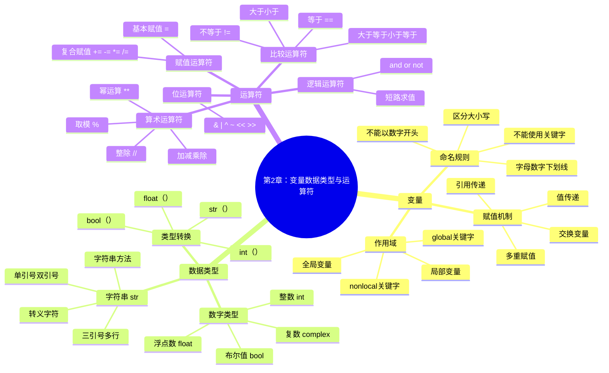

# 第2章：变量、数据类型与运算符

## 📚 学习目标

本章结束后，学生将能够：

**S**pecific (具体)：
- 掌握Python变量的命名规则、赋值机制和作用域概念
- 理解并熟练使用Python的基本数据类型（int、float、str、bool）
- 熟练使用各种运算符进行数学计算、逻辑判断和字符串操作

**M**easurable (可衡量)：
- 能够编写至少10个不同类型的变量操作代码
- 正确完成90%以上的数据类型转换练习
- 独立设计并实现一个包含多种运算符的计算器程序

**A**chievable (可实现)：
- 通过理论学习+实践练习的方式循序渐进
- 提供丰富的代码示例和分层练习题

**R**elevant (相关性)：
- 为后续面向对象编程和数据处理奠定基础
- 训练编程思维和问题解决能力

**T**ime-bound (时限性)：
- 2周内完成本章学习（4课时理论+实践）

## 🗺️ 知识导图



## 💡 2.1 变量与标识符

### 2.1.1 变量的概念

在Python中，**变量**就像是一个标签，用来标识内存中存储的数据。与其他语言不同，Python变量不需要事先声明类型，它会根据赋值自动判断类型。

```python
# 变量赋值示例
name = "小明"        # 字符串类型
age = 20            # 整数类型
height = 175.5      # 浮点数类型
is_student = True   # 布尔类型

print(f"姓名：{name}，年龄：{age}，身高：{height}cm，是学生：{is_student}")
```

### 2.1.2 变量命名规则

Python变量命名必须遵循以下规则：

1. **只能包含**：字母、数字、下划线
2. **不能以数字开头**
3. **区分大小写**：`name`和`Name`是不同的变量
4. **不能使用关键字**：如`if`、`for`、`class`等

```python
# 正确的变量名
student_name = "张三"
user1 = "用户1"
_private_var = "私有变量"
MAX_SIZE = 100

# 错误的变量名（会报错）
# 1name = "错误"        # 以数字开头
# user-name = "错误"    # 包含连字符
# class = "错误"        # 使用关键字
```

**命名风格建议**：
- 变量和函数：使用小写+下划线（snake_case）
- 常量：使用大写+下划线（UPPER_CASE）
- 类名：使用首字母大写（PascalCase）

### 2.1.3 变量赋值机制

Python支持多种赋值方式：

```python
# 1. 基本赋值
x = 10
y = x  # y也等于10

# 2. 多重赋值
a = b = c = 100  # a, b, c都等于100

# 3. 并行赋值
name, age, city = "李四", 25, "北京"

# 4. 变量交换（Python特色）
x, y = 10, 20
print(f"交换前：x={x}, y={y}")
x, y = y, x  # 优雅的交换方式
print(f"交换后：x={x}, y={y}")
```

### 2.1.4 变量作用域

```python
# 全局变量
global_var = "我是全局变量"

def demo_scope():
    # 局部变量
    local_var = "我是局部变量"
    
    # 访问全局变量
    print(global_var)
    
    # 修改全局变量需要global关键字
    global global_var
    global_var = "全局变量被修改了"
    
    print(local_var)

demo_scope()
print(global_var)  # 输出修改后的值
```

## 🔢 2.2 基本数据类型

### 2.2.1 数字类型

Python提供了四种数字类型：

```python
# 整数 (int)
age = 25
negative_num = -100
big_number = 1234567890123456789  # Python支持任意大的整数

# 浮点数 (float)
pi = 3.14159
scientific = 2.5e10  # 科学记数法：2.5 × 10^10

# 复数 (complex)
z = 3 + 4j
z2 = complex(3, 4)  # 另一种创建方式

# 布尔值 (bool) - 是int的子类
is_true = True   # 相当于1
is_false = False # 相当于0

# 查看类型
print(type(age))      # <class 'int'>
print(type(pi))       # <class 'float'>
print(type(z))        # <class 'complex'>
print(type(is_true))  # <class 'bool'>
```

**数字类型的特殊值**：

```python
# 无穷大
positive_infinity = float('inf')
negative_infinity = float('-inf')

# 非数字
not_a_number = float('nan')

print(positive_infinity > 1000000)  # True
print(not_a_number == not_a_number)  # False（NaN的特殊性质）
```

### 2.2.2 字符串类型

字符串是Python中最常用的数据类型之一：

```python
# 字符串的创建方式
str1 = '单引号字符串'
str2 = "双引号字符串"
str3 = '''三引号
多行字符串
可以包含换行'''

# 转义字符
escape_str = "他说：\"Hello, World!\""
newline_str = "第一行\n第二行"
tab_str = "姓名\t年龄"

# 原始字符串（忽略转义）
raw_str = r"C:\Users\name\Documents"  # 不需要双反斜杠

# 字符串格式化
name = "小王"
age = 22
# 方式1：f-string（推荐）
info1 = f"我叫{name}，今年{age}岁"
# 方式2：format方法
info2 = "我叫{}，今年{}岁".format(name, age)
# 方式3：%格式化
info3 = "我叫%s，今年%d岁" % (name, age)

print(info1)  # 我叫小王，今年22岁
```

**常用字符串方法**：

```python
text = "  Hello, Python World!  "

# 大小写转换
print(text.upper())      # 转大写
print(text.lower())      # 转小写
print(text.title())      # 标题格式

# 去除空白
print(text.strip())      # 去除两端空白
print(text.lstrip())     # 去除左侧空白
print(text.rstrip())     # 去除右侧空白

# 查找和替换
print(text.find("Python"))     # 查找子串位置
print(text.replace("Python", "Java"))  # 替换

# 分割和连接
words = text.strip().split(", ")  # 分割成列表
print(words)
joined = "-".join(words)          # 用-连接
print(joined)
```

### 2.2.3 类型转换

Python提供了灵活的类型转换机制：

```python
# 数字类型转换
int_num = 42
float_num = 3.14
str_num = "123"

# 转换为整数
print(int(float_num))    # 3（截断小数）
print(int(str_num))      # 123
print(int(True))         # 1

# 转换为浮点数
print(float(int_num))    # 42.0
print(float(str_num))    # 123.0

# 转换为字符串
print(str(int_num))      # "42"
print(str(float_num))    # "3.14"

# 转换为布尔值
print(bool(0))           # False
print(bool(1))           # True
print(bool(""))          # False（空字符串）
print(bool("hello"))     # True（非空字符串）
print(bool([]))          # False（空列表）
```

**类型检查**：

```python
# 检查变量类型
x = 42
print(type(x))                    # <class 'int'>
print(isinstance(x, int))         # True
print(isinstance(x, (int, float))) # True（检查多种类型）
```

## ⚡ 2.3 运算符详解

### 2.3.1 算术运算符

```python
a, b = 10, 3

# 基本算术运算
print(f"{a} + {b} = {a + b}")    # 加法：13
print(f"{a} - {b} = {a - b}")    # 减法：7
print(f"{a} * {b} = {a * b}")    # 乘法：30
print(f"{a} / {b} = {a / b}")    # 除法：3.333...

# Python特殊运算符
print(f"{a} // {b} = {a // b}")  # 整除：3
print(f"{a} % {b} = {a % b}")    # 取模：1
print(f"{a} ** {b} = {a ** b}")  # 幂运算：1000

# 字符串的算术运算
str1 = "Hello"
str2 = "World"
print(str1 + " " + str2)    # 字符串连接
print(str1 * 3)             # 字符串重复
```

### 2.3.2 比较运算符

```python
x, y = 5, 10

# 数值比较
print(f"{x} == {y}: {x == y}")    # 等于：False
print(f"{x} != {y}: {x != y}")    # 不等于：True
print(f"{x} < {y}: {x < y}")      # 小于：True
print(f"{x} > {y}: {x > y}")      # 大于：False
print(f"{x} <= {y}: {x <= y}")    # 小于等于：True
print(f"{x} >= {y}: {x >= y}")    # 大于等于：False

# 字符串比较（按字典序）
print("apple" < "banana")    # True
print("Apple" < "apple")     # True（大写字母ASCII值更小）

# 链式比较
age = 25
print(18 <= age <= 65)       # True（成年人范围）
```

### 2.3.3 逻辑运算符

```python
# 布尔值逻辑运算
a, b = True, False

print(f"a and b: {a and b}")     # 与：False
print(f"a or b: {a or b}")       # 或：True
print(f"not a: {not a}")         # 非：False

# 短路求值特性
def func1():
    print("func1被调用")
    return True

def func2():
    print("func2被调用")
    return False

# 短路求值：如果第一个条件为False，第二个函数不会被调用
result = func2() and func1()
print(f"结果：{result}")

# 在条件判断中的应用
score = 85
if score >= 60 and score <= 100:
    print("成绩有效且及格")
```

### 2.3.4 赋值运算符

```python
# 基本赋值
x = 10

# 复合赋值运算符
x += 5   # 等价于 x = x + 5，结果：15
x -= 3   # 等价于 x = x - 3，结果：12
x *= 2   # 等价于 x = x * 2，结果：24
x /= 4   # 等价于 x = x / 4，结果：6.0
x //= 2  # 等价于 x = x // 2，结果：3.0
x %= 2   # 等价于 x = x % 2，结果：1.0
x **= 3  # 等价于 x = x ** 3，结果：1.0

print(f"最终结果：{x}")

# 字符串的复合赋值
message = "Hello"
message += " World"    # 字符串连接
message *= 2           # 字符串重复
print(message)         # Hello WorldHello World
```

### 2.3.5 位运算符（进阶）

```python
# 位运算符主要用于整数
a, b = 12, 8  # 二进制：1100, 1000

print(f"a = {a:08b}, b = {b:08b}")  # 显示二进制
print(f"a & b = {a & b:08b} ({a & b})")   # 按位与：8
print(f"a | b = {a | b:08b} ({a | b})")   # 按位或：12
print(f"a ^ b = {a ^ b:08b} ({a ^ b})")   # 按位异或：4
print(f"~a = {~a}")                        # 按位取反：-13
print(f"a << 2 = {a << 2}")                # 左移：48
print(f"a >> 2 = {a >> 2}")                # 右移：3
```

## 🔬 代码示例集合

### 示例1：变量操作演示

```python
def variable_demo():
    """变量操作综合演示"""
    print("=== 变量操作演示 ===")
    
    # 创建不同类型的变量
    student_name = "张小明"
    chinese_score = 88
    math_score = 92.5
    is_excellent = chinese_score >= 85 and math_score >= 85
    
    # 计算平均分
    average_score = (chinese_score + math_score) / 2
    
    # 输出学生信息
    print(f"学生姓名：{student_name}")
    print(f"语文成绩：{chinese_score}分")
    print(f"数学成绩：{math_score}分")
    print(f"平均成绩：{average_score:.1f}分")
    print(f"是否优秀：{'是' if is_excellent else '否'}")
    
    return average_score

# 运行示例
variable_demo()
```

### 示例2：数据类型转换实战

```python
def type_conversion_demo():
    """数据类型转换实战"""
    print("\n=== 数据类型转换演示 ===")
    
    # 用户输入（模拟）
    user_input = "25"
    
    # 转换并使用
    age = int(user_input)
    age_in_days = age * 365
    
    print(f"输入的年龄：{user_input}（类型：{type(user_input).__name__}）")
    print(f"转换后的年龄：{age}（类型：{type(age).__name__}）")
    print(f"年龄对应的天数：{age_in_days}天")
    
    # 安全的类型转换
    test_values = ["123", "45.67", "abc", ""]
    
    for value in test_values:
        try:
            int_val = int(value)
            print(f"'{value}' → {int_val}")
        except ValueError:
            print(f"'{value}' 无法转换为整数")

# 运行示例
type_conversion_demo()
```

### 示例3：运算符综合应用

```python
def operator_demo():
    """运算符综合应用"""
    print("\n=== 运算符应用演示 ===")
    
    # 数学计算
    radius = 5
    area = 3.14159 * radius ** 2
    circumference = 2 * 3.14159 * radius
    
    print(f"半径为{radius}的圆：")
    print(f"面积 = π × r² = {area:.2f}")
    print(f"周长 = 2 × π × r = {circumference:.2f}")
    
    # 条件判断
    temperature = 25
    weather_desc = (
        "寒冷" if temperature < 10 else
        "凉爽" if temperature < 20 else
        "舒适" if temperature < 30 else
        "炎热"
    )
    print(f"当前温度{temperature}°C，天气{weather_desc}")
    
    # 位运算应用（权限检查）
    READ = 1    # 001
    WRITE = 2   # 010
    EXECUTE = 4 # 100
    
    user_permission = READ | WRITE  # 用户有读写权限
    
    print(f"用户权限：{user_permission:03b}")
    print(f"可读：{bool(user_permission & READ)}")
    print(f"可写：{bool(user_permission & WRITE)}")
    print(f"可执行：{bool(user_permission & EXECUTE)}")

# 运行示例
operator_demo()
```

### 示例4：字符串格式化技巧

```python
def string_formatting_demo():
    """字符串格式化高级技巧"""
    print("\n=== 字符串格式化演示 ===")
    
    # 商品信息
    products = [
        {"name": "苹果", "price": 8.5, "quantity": 10},
        {"name": "香蕉", "price": 3.2, "quantity": 15},
        {"name": "橙子", "price": 6.8, "quantity": 8}
    ]
    
    # 制作商品清单
    print("商品清单")
    print("-" * 30)
    print(f"{'商品名':<8} {'单价':>6} {'数量':>4} {'小计':>8}")
    print("-" * 30)
    
    total = 0
    for product in products:
        subtotal = product['price'] * product['quantity']
        total += subtotal
        print(f"{product['name']:<8} {product['price']:>6.1f} "
              f"{product['quantity']:>4d} {subtotal:>8.1f}")
    
    print("-" * 30)
    print(f"{'总计':<20} {total:>8.1f}")

# 运行示例
string_formatting_demo()
```

### 示例5：数学计算程序

```python
import math

def math_calculator():
    """数学计算程序"""
    print("\n=== 数学计算器 ===")
    
    # 基本数学函数
    x = 16
    y = 3
    
    print(f"x = {x}, y = {y}")
    print(f"平方根：√{x} = {math.sqrt(x)}")
    print(f"对数：log₂({x}) = {math.log2(x)}")
    print(f"三角函数：sin({y}) = {math.sin(y):.4f}")
    print(f"最大公约数：gcd({x}, {y}) = {math.gcd(x, y)}")
    
    # 复数运算
    z1 = 3 + 4j
    z2 = 1 + 2j
    
    print(f"\n复数运算：")
    print(f"z1 = {z1}")
    print(f"z2 = {z2}")
    print(f"z1 + z2 = {z1 + z2}")
    print(f"|z1| = {abs(z1)}")
    print(f"z1的共轭 = {z1.conjugate()}")

# 运行示例
math_calculator()
```

## 🎯 实践练习

### 基础练习

#### 练习1：变量交换程序
编写程序实现两个变量的交换，要求用三种不同的方法。

```python
def swap_variables():
    """变量交换的三种方法"""
    # 方法1：使用临时变量
    a, b = 10, 20
    print(f"方法1 - 交换前：a={a}, b={b}")
    # 你的代码

    # 方法2：使用Python的并行赋值
    a, b = 10, 20
    print(f"方法2 - 交换前：a={a}, b={b}")
    # 你的代码

    # 方法3：使用算术运算（仅适用于数字）
    a, b = 10, 20
    print(f"方法3 - 交换前：a={a}, b={b}")
    # 你的代码
```

#### 练习2：基本计算器
创建一个程序，输入两个数字和运算符，输出计算结果。

```python
def basic_calculator(num1, num2, operator):
    """基本计算器"""
    # 请完成以下功能：
    # 1. 支持 +、-、*、/ 四种运算
    # 2. 处理除零错误
    # 3. 返回计算结果
    pass

# 测试用例
print(basic_calculator(10, 3, '+'))  # 应该输出 13
print(basic_calculator(10, 0, '/'))  # 应该处理除零错误
```

### 中级练习

#### 练习3：温度转换器
编写一个程序，实现摄氏度、华氏度和开尔文温度之间的相互转换。

```python
def temperature_converter():
    """温度转换器"""
    # 转换公式：
    # 华氏度 = 摄氏度 × 9/5 + 32
    # 开尔文 = 摄氏度 + 273.15
    
    celsius = 25  # 摄氏度
    
    # 请计算对应的华氏度和开尔文温度
    # 并输出格式化的结果
    pass

temperature_converter()
```

#### 练习4：字符串分析器
编写程序分析一段文本的基本统计信息。

```python
def text_analyzer(text):
    """文本分析器"""
    # 请统计以下信息：
    # 1. 字符总数（包括空格）
    # 2. 字符总数（不包括空格）
    # 3. 单词数量
    # 4. 行数
    # 5. 最长的单词
    pass

# 测试文本
sample_text = """Python是一种高级编程语言。
它简单易学，功能强大。
被广泛应用于各个领域。"""

text_analyzer(sample_text)
```

### 挑战练习

#### 练习5：简单表达式解析器
编写一个程序，能够解析和计算简单的数学表达式（只包含数字、+、-、*、/和括号）。

```python
def expression_evaluator(expression):
    """简单表达式计算器"""
    # 挑战：不使用eval()函数
    # 提示：可以使用栈或递归的方法
    # 示例："2 + 3 * 4" 应该返回 14
    # 示例："(2 + 3) * 4" 应该返回 20
    pass

# 测试用例
test_expressions = [
    "2 + 3",
    "5 - 3",
    "2 * 3",
    "8 / 2",
    "2 + 3 * 4",
    "(2 + 3) * 4",
    "10 - 2 * 3"
]

for expr in test_expressions:
    result = expression_evaluator(expr)
    print(f"{expr} = {result}")
```

## 🚀 项目案例：智能计算器

### 项目需求分析

设计一个智能计算器，具备以下功能：
1. 基本四则运算
2. 科学计算功能（幂运算、开方、三角函数）
3. 数制转换（二进制、八进制、十六进制）
4. 历史记录功能
5. 用户友好的界面

### 项目设计

```python
import math
import datetime

class SmartCalculator:
    """智能计算器类"""
    
    def __init__(self):
        self.history = []  # 历史记录
        self.memory = 0    # 内存存储
        
    def add_to_history(self, expression, result):
        """添加到历史记录"""
        timestamp = datetime.datetime.now().strftime("%H:%M:%S")
        self.history.append({
            'time': timestamp,
            'expression': expression,
            'result': result
        })
    
    def basic_calculate(self, num1, operator, num2):
        """基本四则运算"""
        try:
            if operator == '+':
                result = num1 + num2
            elif operator == '-':
                result = num1 - num2
            elif operator == '*':
                result = num1 * num2
            elif operator == '/':
                if num2 == 0:
                    return "错误：除数不能为零"
                result = num1 / num2
            else:
                return "错误：不支持的运算符"
            
            expression = f"{num1} {operator} {num2}"
            self.add_to_history(expression, result)
            return result
            
        except Exception as e:
            return f"计算错误：{e}"
    
    def scientific_calculate(self, function, value):
        """科学计算功能"""
        try:
            if function == 'sqrt':
                if value < 0:
                    return "错误：负数无法开平方根"
                result = math.sqrt(value)
            elif function == 'sin':
                result = math.sin(math.radians(value))
            elif function == 'cos':
                result = math.cos(math.radians(value))
            elif function == 'tan':
                result = math.tan(math.radians(value))
            elif function == 'log':
                if value <= 0:
                    return "错误：对数的真数必须大于0"
                result = math.log10(value)
            elif function == 'ln':
                if value <= 0:
                    return "错误：自然对数的真数必须大于0"
                result = math.log(value)
            else:
                return "错误：不支持的科学函数"
            
            expression = f"{function}({value})"
            self.add_to_history(expression, result)
            return result
            
        except Exception as e:
            return f"计算错误：{e}"
    
    def power_calculate(self, base, exponent):
        """幂运算"""
        try:
            result = base ** exponent
            expression = f"{base}^{exponent}"
            self.add_to_history(expression, result)
            return result
        except Exception as e:
            return f"计算错误：{e}"
    
    def number_system_convert(self, number, from_base, to_base):
        """数制转换"""
        try:
            # 首先转换为十进制
            if from_base == 2:
                decimal_num = int(str(number), 2)
            elif from_base == 8:
                decimal_num = int(str(number), 8)
            elif from_base == 10:
                decimal_num = int(number)
            elif from_base == 16:
                decimal_num = int(str(number), 16)
            else:
                return "错误：不支持的进制"
            
            # 转换为目标进制
            if to_base == 2:
                result = bin(decimal_num)[2:]  # 去掉'0b'前缀
            elif to_base == 8:
                result = oct(decimal_num)[2:]  # 去掉'0o'前缀
            elif to_base == 10:
                result = str(decimal_num)
            elif to_base == 16:
                result = hex(decimal_num)[2:].upper()  # 去掉'0x'前缀并转大写
            else:
                return "错误：不支持的进制"
            
            expression = f"{number}({from_base}进制) → {to_base}进制"
            self.add_to_history(expression, result)
            return result
            
        except Exception as e:
            return f"转换错误：{e}"
    
    def memory_store(self, value):
        """存储到内存"""
        self.memory = value
        return f"已将 {value} 存储到内存"
    
    def memory_recall(self):
        """从内存中读取"""
        return self.memory
    
    def memory_clear(self):
        """清空内存"""
        self.memory = 0
        return "内存已清空"
    
    def show_history(self):
        """显示历史记录"""
        if not self.history:
            return "暂无历史记录"
        
        print("\n=== 计算历史 ===")
        for i, record in enumerate(self.history[-10:], 1):  # 显示最近10条
            print(f"{i:2d}. {record['time']} | {record['expression']} = {record['result']}")
    
    def clear_history(self):
        """清空历史记录"""
        self.history.clear()
        return "历史记录已清空"

# 计算器交互界面
def calculator_interface():
    """计算器用户界面"""
    calc = SmartCalculator()
    
    print("🔢 智能计算器")
    print("=" * 50)
    print("功能菜单：")
    print("1. 基本计算 (如：10 + 5)")
    print("2. 科学计算 (如：sqrt(16), sin(30))")
    print("3. 幂运算 (如：2^8)")
    print("4. 数制转换 (如：1010二进制转十进制)")
    print("5. 内存操作")
    print("6. 查看历史")
    print("7. 清空历史")
    print("8. 退出")
    print("=" * 50)
    
    while True:
        choice = input("\n请选择功能 (1-8): ").strip()
        
        if choice == '1':
            try:
                expression = input("请输入表达式 (如：10 + 5): ").strip()
                parts = expression.split()
                if len(parts) == 3:
                    num1, operator, num2 = float(parts[0]), parts[1], float(parts[2])
                    result = calc.basic_calculate(num1, operator, num2)
                    print(f"结果：{result}")
                else:
                    print("格式错误，请输入如：10 + 5")
            except ValueError:
                print("输入错误，请输入有效数字")
        
        elif choice == '2':
            function = input("请输入函数 (sqrt/sin/cos/tan/log/ln): ").strip()
            try:
                value = float(input("请输入参数值: "))
                result = calc.scientific_calculate(function, value)
                print(f"结果：{result}")
            except ValueError:
                print("输入错误，请输入有效数字")
        
        elif choice == '3':
            try:
                base = float(input("请输入底数: "))
                exponent = float(input("请输入指数: "))
                result = calc.power_calculate(base, exponent)
                print(f"结果：{result}")
            except ValueError:
                print("输入错误，请输入有效数字")
        
        elif choice == '4':
            try:
                number = input("请输入要转换的数字: ").strip()
                from_base = int(input("请输入当前进制 (2/8/10/16): "))
                to_base = int(input("请输入目标进制 (2/8/10/16): "))
                result = calc.number_system_convert(number, from_base, to_base)
                print(f"结果：{result}")
            except ValueError:
                print("输入错误，请输入有效的进制数")
        
        elif choice == '5':
            print("内存操作：")
            print("a) 存储 (store)")
            print("b) 读取 (recall)")
            print("c) 清空 (clear)")
            
            mem_choice = input("请选择操作 (a/b/c): ").strip().lower()
            if mem_choice == 'a':
                try:
                    value = float(input("请输入要存储的值: "))
                    message = calc.memory_store(value)
                    print(message)
                except ValueError:
                    print("输入错误，请输入有效数字")
            elif mem_choice == 'b':
                value = calc.memory_recall()
                print(f"内存中的值：{value}")
            elif mem_choice == 'c':
                message = calc.memory_clear()
                print(message)
        
        elif choice == '6':
            calc.show_history()
        
        elif choice == '7':
            message = calc.clear_history()
            print(message)
        
        elif choice == '8':
            print("感谢使用智能计算器！")
            break
        
        else:
            print("无效选择，请输入1-8")

# 运行计算器（示例）
def demo_calculator():
    """计算器功能演示"""
    calc = SmartCalculator()
    
    print("🔢 智能计算器演示")
    print("=" * 30)
    
    # 基本计算演示
    print("1. 基本计算演示：")
    print(f"10 + 5 = {calc.basic_calculate(10, '+', 5)}")
    print(f"20 - 8 = {calc.basic_calculate(20, '-', 8)}")
    print(f"6 * 7 = {calc.basic_calculate(6, '*', 7)}")
    print(f"15 / 3 = {calc.basic_calculate(15, '/', 3)}")
    
    # 科学计算演示
    print("\n2. 科学计算演示：")
    print(f"√16 = {calc.scientific_calculate('sqrt', 16)}")
    print(f"sin(30°) = {calc.scientific_calculate('sin', 30):.4f}")
    print(f"cos(60°) = {calc.scientific_calculate('cos', 60):.4f}")
    print(f"log(100) = {calc.scientific_calculate('log', 100)}")
    
    # 幂运算演示
    print("\n3. 幂运算演示：")
    print(f"2^8 = {calc.power_calculate(2, 8)}")
    print(f"3^4 = {calc.power_calculate(3, 4)}")
    
    # 数制转换演示
    print("\n4. 数制转换演示：")
    print(f"1010(二进制) = {calc.number_system_convert('1010', 2, 10)}(十进制)")
    print(f"255(十进制) = {calc.number_system_convert(255, 10, 16)}(十六进制)")
    print(f"FF(十六进制) = {calc.number_system_convert('FF', 16, 2)}(二进制)")
    
    # 内存操作演示
    print("\n5. 内存操作演示：")
    print(calc.memory_store(42))
    print(f"内存中的值：{calc.memory_recall()}")
    
    # 显示历史记录
    print("\n6. 历史记录：")
    calc.show_history()

# 运行演示
demo_calculator()
```

## 🤔 本章思考题

1. **概念理解题**：
   - Python中的变量和其他语言（如C、Java）中的变量有什么区别？
   - 为什么`a = b = c = 100`中，修改其中一个变量不会影响其他变量？
   - 解释为什么`0.1 + 0.2 != 0.3`在Python中返回True？

2. **应用分析题**：
   - 在什么情况下使用`//`运算符比`/`运算符更合适？请举例说明。
   - 比较f-string、format()方法和%格式化的优缺点，什么时候使用哪种？
   - 位运算符在实际编程中有哪些应用场景？

3. **编程实践题**：
   - 设计一个程序，判断用户输入的字符串是否为有效的Python变量名。
   - 编写一个函数，实现任意精度的加法运算（处理超大数字）。
   - 创建一个程序，模拟计算器的内存功能（存储、读取、累加、清空）。

## 📖 拓展阅读

### 在线资源
- [Python官方文档 - 内置类型](https://docs.python.org/zh-cn/3/library/stdtypes.html)
- [PEP 8 - Python代码风格指南](https://pep8.org/)
- [Real Python - Python数据类型](https://realpython.com/python-data-types/)

### 推荐书籍
- 《Python编程：从入门到实践》- Eric Matthes
- 《流畅的Python》- Luciano Ramalho
- 《Python Tricks》- Dan Bader

### 练习平台
- [LeetCode](https://leetcode-cn.com/) - 编程练习
- [HackerRank](https://www.hackerrank.com/) - Python练习
- [Codewars](https://www.codewars.com/) - 编程挑战

---

## 📋 本章检查清单

在进入下一章之前，请确保你已经：

**理论掌握** ✅
- [ ] 理解Python变量的赋值机制和作用域
- [ ] 掌握基本数据类型的特点和使用方法
- [ ] 熟练使用各种运算符进行计算和判断
- [ ] 了解类型转换的规则和注意事项

**实践能力** ✅
- [ ] 能够编写规范的变量命名和赋值代码
- [ ] 熟练进行字符串格式化和处理
- [ ] 能够处理不同数据类型之间的转换
- [ ] 独立完成基本的数学计算程序

**项目经验** ✅
- [ ] 完成智能计算器项目
- [ ] 理解程序的模块化设计思想
- [ ] 掌握错误处理和用户交互的基本方法

**思维能力** ✅
- [ ] 具备基本的编程逻辑思维
- [ ] 能够分析和解决简单的计算问题
- [ ] 了解代码优化和可读性的重要性

恭喜！你已经掌握了Python的基础数据类型和运算符。在下一章中，我们将学习控制结构，让程序能够根据条件做出不同的决策。

---

**下一章预告**：第3章《控制结构与函数定义》将介绍条件语句、循环语句和函数的定义与使用，让你的程序具备决策和重复执行的能力。 