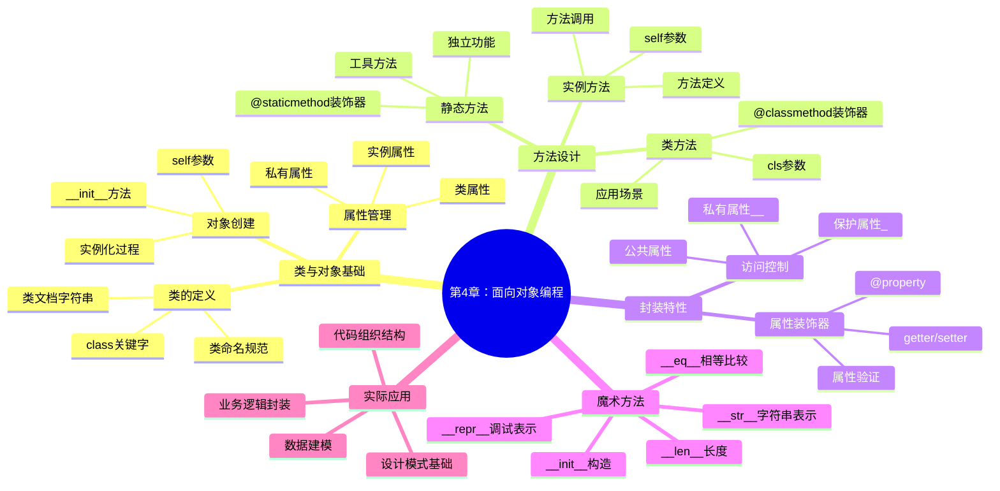

# 第4章：面向对象编程基础

## 📚 学习目标

**S**pecific (具体)：
- 理解面向对象编程的核心概念（类、对象、封装）
- 掌握Python类的定义语法和对象的创建使用
- 学会设计类的属性和方法
- 理解实例方法、类方法、静态方法的区别

**M**easurable (可衡量)：
- 能够独立设计并实现至少5个不同的类
- 正确完成90%以上的面向对象编程练习
- 独立完成一个包含多个类的综合项目

**A**chievable (可实现)：
- 基于前3章的编程基础，循序渐进学习OOP概念
- 通过大量实例和项目练习巩固理解

**R**elevant (相关性)：
- 为大型软件设计和架构思维奠定基础
- 培养抽象思维和模块化设计能力

**T**ime-bound (时限性)：
- 2周内完成学习（4课时理论+实践）

## 🗺️ 知识导图



## 💡 4.1 类与对象基础

### 4.1.1 面向对象编程概述

在前面几章中，我们学习了Python的基础语法、变量类型、控制结构和函数。现在让我们进入一个更强大的编程范式——面向对象编程（OOP）。

**什么是面向对象编程？**

面向对象编程是一种编程思想，它把现实世界中的事物抽象成程序中的"对象"。每个对象都有自己的属性（特征）和方法（行为）。

举个生活化的例子：
- **汽车**就是一个对象
  - 属性：颜色、品牌、型号、速度
  - 方法：启动、加速、刹车、转向

```python
# 传统的函数式编程
car_color = "红色"
car_brand = "丰田"
car_speed = 0

def start_car():
    print("汽车启动了")

def accelerate_car():
    global car_speed
    car_speed += 10
    print(f"当前速度：{car_speed}km/h")

# 面向对象编程
class Car:
    def __init__(self, color, brand):
        self.color = color
        self.brand = brand
        self.speed = 0
    
    def start(self):
        print("汽车启动了")
    
    def accelerate(self):
        self.speed += 10
        print(f"当前速度：{self.speed}km/h")

# 创建汽车对象
my_car = Car("红色", "丰田")
my_car.start()
my_car.accelerate()
```

### 4.1.2 类的定义语法

在Python中，我们使用`class`关键字来定义类：

```python
class Student:
    """学生类 - 管理学生信息"""
    
    # 类属性（所有学生共享）
    school_name = "清华大学"
    student_count = 0
    
    def __init__(self, name, age, major):
        """构造函数 - 初始化学生对象"""
        self.name = name        # 实例属性
        self.age = age
        self.major = major
        self.grades = []
        Student.student_count += 1  # 每创建一个学生，计数+1
    
    def introduce(self):
        """自我介绍方法"""
        return f"我是{self.name}，{self.age}岁，专业是{self.major}"
    
    def add_grade(self, subject, score):
        """添加成绩"""
        self.grades.append({"subject": subject, "score": score})
        print(f"已添加{subject}成绩：{score}分")
    
    def get_average_grade(self):
        """计算平均成绩"""
        if not self.grades:
            return 0
        total = sum(grade["score"] for grade in self.grades)
        return total / len(self.grades)

# 创建学生对象
student1 = Student("小明", 20, "计算机科学")
student2 = Student("小红", 19, "数学")

# 使用对象的方法
print(student1.introduce())
student1.add_grade("Python编程", 95)
student1.add_grade("数据结构", 88)
print(f"平均成绩：{student1.get_average_grade():.1f}")

# 访问类属性
print(f"学校：{Student.school_name}")
print(f"学生总数：{Student.student_count}")
```

### 4.1.3 对象的创建和使用

创建对象的过程叫做**实例化**。当我们写`Student("小明", 20, "计算机科学")`时，Python会：

1. 创建一个新的Student对象
2. 调用`__init__`方法进行初始化
3. 返回这个对象的引用

```python
class BankAccount:
    """银行账户类"""
    
    def __init__(self, account_number, owner_name, initial_balance=0):
        self.account_number = account_number
        self.owner_name = owner_name
        self.balance = initial_balance
        self.transaction_history = []
    
    def deposit(self, amount):
        """存款"""
        if amount > 0:
            self.balance += amount
            self.transaction_history.append(f"存款：+{amount}")
            print(f"成功存款{amount}元，余额：{self.balance}元")
        else:
            print("存款金额必须大于0")
    
    def withdraw(self, amount):
        """取款"""
        if amount <= 0:
            print("取款金额必须大于0")
        elif amount > self.balance:
            print("余额不足")
        else:
            self.balance -= amount
            self.transaction_history.append(f"取款：-{amount}")
            print(f"成功取款{amount}元，余额：{self.balance}元")
    
    def get_balance(self):
        """查询余额"""
        return self.balance
    
    def get_transaction_history(self):
        """查询交易记录"""
        print("交易记录：")
        for transaction in self.transaction_history:
            print(f"  {transaction}")

# 创建银行账户
account1 = BankAccount("001", "张三", 1000)
account2 = BankAccount("002", "李四")

# 进行银行操作
account1.deposit(500)
account1.withdraw(200)
account1.get_transaction_history()

print(f"\n账户{account1.account_number}余额：{account1.get_balance()}元")
```

## 🔧 4.2 类的属性和方法

### 4.2.1 实例属性和类属性

```python
class Book:
    """图书类"""
    
    # 类属性 - 所有图书实例共享
    library_name = "中央图书馆"
    total_books = 0
    
    def __init__(self, title, author, isbn):
        # 实例属性 - 每个图书实例独有
        self.title = title
        self.author = author
        self.isbn = isbn
        self.is_borrowed = False
        Book.total_books += 1
    
    def borrow(self):
        """借书"""
        if not self.is_borrowed:
            self.is_borrowed = True
            print(f"《{self.title}》借阅成功")
        else:
            print(f"《{self.title}》已被借出")
    
    def return_book(self):
        """还书"""
        if self.is_borrowed:
            self.is_borrowed = False
            print(f"《{self.title}》归还成功")
        else:
            print(f"《{self.title}》未被借出")

# 创建图书实例
book1 = Book("Python编程", "张三", "978-123456789")
book2 = Book("数据结构", "李四", "978-987654321")

# 访问实例属性
print(f"书名：{book1.title}")
print(f"作者：{book1.author}")

# 访问类属性
print(f"图书馆：{Book.library_name}")
print(f"图书总数：{Book.total_books}")

# 借书和还书操作
book1.borrow()
book1.return_book()
```

### 4.2.2 类方法和静态方法

```python
import datetime

class Employee:
    """员工类"""
    
    company_name = "科技有限公司"
    
    def __init__(self, name, age, salary):
        self.name = name
        self.age = age
        self.salary = salary
        self.hire_date = datetime.date.today()
    
    def get_info(self):
        """实例方法 - 获取员工信息"""
        return f"{self.name}，{self.age}岁，月薪{self.salary}元"
    
    @classmethod
    def from_string(cls, employee_str):
        """类方法 - 从字符串创建员工对象"""
        name, age, salary = employee_str.split('-')
        return cls(name, int(age), int(salary))
    
    @classmethod
    def set_company_name(cls, new_name):
        """类方法 - 修改公司名称"""
        cls.company_name = new_name
    
    @staticmethod
    def is_workday(date):
        """静态方法 - 判断是否为工作日"""
        return date.weekday() < 5  # 0-4是周一到周五
    
    @staticmethod
    def calculate_annual_salary(monthly_salary, months=12):
        """静态方法 - 计算年薪"""
        return monthly_salary * months

# 使用实例方法
emp1 = Employee("王五", 28, 8000)
print(emp1.get_info())

# 使用类方法创建对象
emp2 = Employee.from_string("赵六-30-9000")
print(emp2.get_info())

# 使用类方法修改类属性
Employee.set_company_name("新科技公司")
print(f"公司名称：{Employee.company_name}")

# 使用静态方法
today = datetime.date.today()
print(f"今天是工作日吗？{Employee.is_workday(today)}")
print(f"年薪：{Employee.calculate_annual_salary(8000)}元")
```

## 🛡️ 4.3 封装和访问控制

### 4.3.1 私有属性和方法

```python
class CreditCard:
    """信用卡类 - 演示封装概念"""
    
    def __init__(self, card_number, cardholder_name, credit_limit):
        self.cardholder_name = cardholder_name  # 公共属性
        self._card_number = card_number         # 保护属性（约定私有）
        self.__pin = "1234"                     # 私有属性
        self.__credit_limit = credit_limit      # 私有属性
        self.__balance = 0                      # 私有属性
    
    def __validate_pin(self, pin):
        """私有方法 - 验证PIN码"""
        return pin == self.__pin
    
    def change_pin(self, old_pin, new_pin):
        """修改PIN码"""
        if self.__validate_pin(old_pin):
            self.__pin = new_pin
            print("PIN码修改成功")
        else:
            print("原PIN码错误")
    
    def purchase(self, amount, pin):
        """消费"""
        if not self.__validate_pin(pin):
            print("PIN码错误，交易失败")
            return False
        
        if self.__balance + amount > self.__credit_limit:
            print("超出信用额度，交易失败")
            return False
        
        self.__balance += amount
        print(f"消费{amount}元成功，当前余额：{self.__balance}元")
        return True
    
    def get_balance(self):
        """查询余额 - 提供安全的访问方式"""
        return self.__balance
    
    def get_available_credit(self):
        """查询可用额度"""
        return self.__credit_limit - self.__balance

# 使用信用卡
card = CreditCard("1234-5678-9012-3456", "张三", 10000)

# 正常使用
card.purchase(1000, "1234")
print(f"可用额度：{card.get_available_credit()}元")

# 尝试访问私有属性（会失败）
try:
    print(card.__pin)  # 无法直接访问
except AttributeError as e:
    print("无法直接访问私有属性")

# 通过公共方法访问
print(f"当前余额：{card.get_balance()}元")
```

### 4.3.2 属性装饰器

```python
class Circle:
    """圆形类 - 演示属性装饰器"""
    
    def __init__(self, radius):
        self._radius = radius
    
    @property
    def radius(self):
        """半径的getter方法"""
        return self._radius
    
    @radius.setter
    def radius(self, value):
        """半径的setter方法"""
        if value <= 0:
            raise ValueError("半径必须大于0")
        self._radius = value
    
    @property
    def area(self):
        """面积（只读属性）"""
        import math
        return math.pi * self._radius ** 2
    
    @property
    def circumference(self):
        """周长（只读属性）"""
        import math
        return 2 * math.pi * self._radius

# 使用属性装饰器
circle = Circle(5)

# 像访问属性一样访问方法
print(f"半径：{circle.radius}")
print(f"面积：{circle.area:.2f}")
print(f"周长：{circle.circumference:.2f}")

# 修改半径
circle.radius = 8
print(f"新面积：{circle.area:.2f}")

# 尝试设置无效半径
try:
    circle.radius = -3
except ValueError as e:
    print(f"错误：{e}")
```

## ⚡ 4.4 魔术方法

### 4.4.1 常用魔术方法

```python
class Person:
    """人员类 - 演示魔术方法"""
    
    def __init__(self, name, age):
        self.name = name
        self.age = age
    
    def __str__(self):
        """字符串表示 - 给最终用户看的"""
        return f"{self.name}（{self.age}岁）"
    
    def __repr__(self):
        """官方字符串表示 - 给开发者看的"""
        return f"Person(name='{self.name}', age={self.age})"
    
    def __eq__(self, other):
        """相等比较"""
        if isinstance(other, Person):
            return self.name == other.name and self.age == other.age
        return False
    
    def __lt__(self, other):
        """小于比较（用于排序）"""
        if isinstance(other, Person):
            return self.age < other.age
        return NotImplemented
    
    def __len__(self):
        """长度（这里返回姓名长度）"""
        return len(self.name)

# 创建人员对象
person1 = Person("张三", 25)
person2 = Person("李四", 30)
person3 = Person("张三", 25)

# 测试魔术方法
print(str(person1))      # 调用__str__
print(repr(person1))     # 调用__repr__
print(person1 == person3)  # 调用__eq__
print(person1 < person2)   # 调用__lt__
print(len(person1))        # 调用__len__

# 排序测试
people = [person2, person1, Person("王五", 20)]
people.sort()  # 使用__lt__进行排序
for person in people:
    print(person)
```

### 4.4.2 容器类魔术方法

```python
class StudentGrades:
    """学生成绩容器类"""
    
    def __init__(self):
        self._grades = {}
    
    def __setitem__(self, subject, grade):
        """设置成绩 - grades["数学"] = 95"""
        self._grades[subject] = grade
    
    def __getitem__(self, subject):
        """获取成绩 - score = grades["数学"]"""
        return self._grades.get(subject, "未记录")
    
    def __contains__(self, subject):
        """检查科目是否存在 - "数学" in grades"""
        return subject in self._grades
    
    def __len__(self):
        """科目数量 - len(grades)"""
        return len(self._grades)
    
    def __iter__(self):
        """迭代器 - for subject in grades"""
        return iter(self._grades)
    
    def __str__(self):
        """字符串表示"""
        return str(self._grades)

# 使用容器类
grades = StudentGrades()

# 设置成绩
grades["数学"] = 95
grades["英语"] = 88
grades["物理"] = 92

# 获取成绩
print(f"数学成绩：{grades['数学']}")

# 检查科目
print(f"化学成绩是否记录：{'化学' in grades}")

# 遍历科目
print("所有科目：")
for subject in grades:
    print(f"  {subject}: {grades[subject]}")

print(f"总科目数：{len(grades)}")
print(f"成绩单：{grades}")
```

## 🔬 代码示例集合

### 示例1：学生信息管理系统

```python
class Student:
    """学生信息管理类"""
    
    # 类属性
    school_name = "清华大学"
    student_count = 0
    
    def __init__(self, student_id, name, age, major):
        """初始化学生信息"""
        self.student_id = student_id
        self.name = name
        self.age = age
        self.major = major
        self.courses = []
        self.grades = {}
        Student.student_count += 1
    
    def enroll_course(self, course_name):
        """选课"""
        if course_name not in self.courses:
            self.courses.append(course_name)
            print(f"{self.name}成功选修《{course_name}》")
        else:
            print(f"{self.name}已经选修了《{course_name}》")
    
    def add_grade(self, course_name, grade):
        """添加成绩"""
        if course_name in self.courses:
            self.grades[course_name] = grade
            print(f"{self.name}的《{course_name}》成绩：{grade}分")
        else:
            print(f"{self.name}未选修《{course_name}》课程")
    
    def get_gpa(self):
        """计算GPA"""
        if not self.grades:
            return 0.0
        
        total_points = 0
        for grade in self.grades.values():
            if grade >= 90:
                total_points += 4.0
            elif grade >= 80:
                total_points += 3.0
            elif grade >= 70:
                total_points += 2.0
            elif grade >= 60:
                total_points += 1.0
            else:
                total_points += 0.0
        
        return total_points / len(self.grades)
    
    def get_transcript(self):
        """获取成绩单"""
        print(f"\n=== {self.name}的成绩单 ===")
        print(f"学号：{self.student_id}")
        print(f"专业：{self.major}")
        print(f"学校：{Student.school_name}")
        print("课程成绩：")
        
        for course in self.courses:
            grade = self.grades.get(course, "未评分")
            print(f"  《{course}》: {grade}")
        
        print(f"GPA：{self.get_gpa():.2f}")
    
    def __str__(self):
        return f"学生{self.name}（{self.student_id}）"
    
    def __repr__(self):
        return f"Student('{self.student_id}', '{self.name}', {self.age}, '{self.major}')"

# 测试学生管理系统
def test_student_system():
    # 创建学生
    student1 = Student("2021001", "张三", 20, "计算机科学")
    student2 = Student("2021002", "李四", 19, "数学")
    
    # 选课
    student1.enroll_course("Python编程")
    student1.enroll_course("数据结构")
    student1.enroll_course("算法设计")
    
    # 添加成绩
    student1.add_grade("Python编程", 95)
    student1.add_grade("数据结构", 88)
    student1.add_grade("算法设计", 92)
    
    # 查看成绩单
    student1.get_transcript()
    
    print(f"\n学生总数：{Student.student_count}")

test_student_system()
```

## 🎯 实践练习

### 基础练习

#### 练习1：动物园管理系统
```python
class Animal:
    """动物基类"""
    
    def __init__(self, name, species, age):
        # 请完成动物类的初始化
        pass
    
    def make_sound(self):
        # 请实现动物叫声方法
        pass
    
    def get_info(self):
        # 请实现获取动物信息方法
        pass

class Dog(Animal):
    """狗类"""
    
    def __init__(self, name, age, breed):
        # 请完成狗类的初始化
        pass
    
    def make_sound(self):
        # 狗的叫声
        pass

class Cat(Animal):
    """猫类"""
    
    def __init__(self, name, age, color):
        # 请完成猫类的初始化
        pass
    
    def make_sound(self):
        # 猫的叫声
        pass

# 测试代码
dog = Dog("旺财", 3, "金毛")
cat = Cat("小白", 2, "白色")

print(dog.get_info())
dog.make_sound()
print(cat.get_info())
cat.make_sound()
```

#### 练习2：简单计算器类
```python
class Calculator:
    """计算器类"""
    
    def __init__(self):
        # 初始化计算历史
        pass
    
    def add(self, a, b):
        # 实现加法
        pass
    
    def subtract(self, a, b):
        # 实现减法
        pass
    
    def multiply(self, a, b):
        # 实现乘法
        pass
    
    def divide(self, a, b):
        # 实现除法（注意除零错误）
        pass
    
    def get_history(self):
        # 获取计算历史
        pass

# 测试计算器
calc = Calculator()
print(calc.add(10, 5))
print(calc.subtract(10, 3))
print(calc.multiply(4, 7))
print(calc.divide(15, 3))
calc.get_history()
```

### 中级练习

#### 练习3：员工管理系统
```python
class Employee:
    """员工基类"""
    
    company_name = "科技有限公司"
    
    def __init__(self, emp_id, name, department, base_salary):
        # 请完成员工类初始化
        pass
    
    def calculate_salary(self):
        # 计算工资（基类默认返回基本工资）
        pass
    
    def get_info(self):
        # 获取员工信息
        pass

class Manager(Employee):
    """经理类"""
    
    def __init__(self, emp_id, name, department, base_salary, bonus):
        # 请完成经理类初始化
        pass
    
    def calculate_salary(self):
        # 经理工资 = 基本工资 + 奖金
        pass

class Developer(Employee):
    """开发人员类"""
    
    def __init__(self, emp_id, name, department, base_salary, projects_completed):
        # 请完成开发人员类初始化
        pass
    
    def calculate_salary(self):
        # 开发人员工资 = 基本工资 + 项目奖金（每个项目1000元）
        pass

# 测试员工系统
manager = Manager("M001", "张经理", "技术部", 15000, 5000)
developer = Developer("D001", "李工程师", "开发部", 12000, 3)

print(manager.get_info())
print(f"经理工资：{manager.calculate_salary()}元")
print(developer.get_info())
print(f"开发人员工资：{developer.calculate_salary()}元")
```

### 挑战练习

#### 练习4：在线商城系统
```python
class Product:
    """商品类"""
    
    def __init__(self, product_id, name, price, stock):
        # 请完成商品类初始化
        pass
    
    def update_stock(self, quantity):
        # 更新库存
        pass
    
    def __str__(self):
        # 商品字符串表示
        pass

class ShoppingCart:
    """购物车类"""
    
    def __init__(self, customer_name):
        # 请完成购物车初始化
        pass
    
    def add_item(self, product, quantity):
        # 添加商品到购物车
        pass
    
    def remove_item(self, product_id):
        # 从购物车移除商品
        pass
    
    def calculate_total(self):
        # 计算总价
        pass
    
    def checkout(self):
        # 结账
        pass
    
    def __len__(self):
        # 购物车商品数量
        pass

class OnlineStore:
    """在线商店类"""
    
    def __init__(self, store_name):
        # 请完成商店初始化
        pass
    
    def add_product(self, product):
        # 添加商品到商店
        pass
    
    def search_product(self, keyword):
        # 搜索商品
        pass
    
    def create_cart(self, customer_name):
        # 为客户创建购物车
        pass

# 测试在线商城
store = OnlineStore("Python商城")

# 添加商品
product1 = Product("P001", "Python编程书", 89.9, 100)
product2 = Product("P002", "机械键盘", 299.0, 50)
store.add_product(product1)
store.add_product(product2)

# 创建购物车并购买
cart = store.create_cart("张三")
cart.add_item(product1, 2)
cart.add_item(product2, 1)
print(f"购物车总价：{cart.calculate_total()}元")
cart.checkout()
```

## 🚀 综合项目案例：学校管理系统

```python
import json
from datetime import datetime, date

class Person:
    """人员基类"""
    
    def __init__(self, person_id, name, age, gender, phone, email):
        self.person_id = person_id
        self.name = name
        self.age = age
        self.gender = gender
        self.phone = phone
        self.email = email
        self.registration_date = datetime.now()
    
    def get_basic_info(self):
        """获取基本信息"""
        return {
            "ID": self.person_id,
            "姓名": self.name,
            "年龄": self.age,
            "性别": self.gender,
            "电话": self.phone,
            "邮箱": self.email
        }
    
    def __str__(self):
        return f"{self.name}（{self.person_id}）"

class Student(Person):
    """学生类"""
    
    def __init__(self, student_id, name, age, gender, phone, email, major, grade):
        super().__init__(student_id, name, age, gender, phone, email)
        self.major = major  # 专业
        self.grade = grade  # 年级
        self.courses = {}   # 课程：{course_id: Course对象}
        self.grades = {}    # 成绩：{course_id: 分数}
        self.gpa = 0.0
    
    def enroll_course(self, course):
        """选课"""
        if course.course_id in self.courses:
            return f"已选修课程《{course.name}》"
        
        if len(self.courses) >= 8:
            return "选课数量已达上限（8门）"
        
        self.courses[course.course_id] = course
        course.add_student(self)
        return f"成功选修课程《{course.name}》"
    
    def drop_course(self, course_id):
        """退课"""
        if course_id not in self.courses:
            return "未选修此课程"
        
        course = self.courses[course_id]
        del self.courses[course_id]
        if course_id in self.grades:
            del self.grades[course_id]
        course.remove_student(self.person_id)
        return f"成功退课《{course.name}》"
    
    def add_grade(self, course_id, score):
        """添加成绩"""
        if course_id not in self.courses:
            return "未选修此课程"
        
        if not 0 <= score <= 100:
            return "成绩必须在0-100之间"
        
        self.grades[course_id] = score
        self._calculate_gpa()
        return f"成绩录入成功：{score}分"
    
    def _calculate_gpa(self):
        """计算GPA"""
        if not self.grades:
            self.gpa = 0.0
            return
        
        total_points = 0
        for score in self.grades.values():
            if score >= 90:
                total_points += 4.0
            elif score >= 80:
                total_points += 3.0
            elif score >= 70:
                total_points += 2.0
            elif score >= 60:
                total_points += 1.0
            else:
                total_points += 0.0
        
        self.gpa = total_points / len(self.grades)
    
    def get_transcript(self):
        """获取成绩单"""
        transcript = {
            "学生信息": self.get_basic_info(),
            "专业": self.major,
            "年级": self.grade,
            "GPA": round(self.gpa, 2),
            "课程成绩": {}
        }
        
        for course_id, course in self.courses.items():
            grade = self.grades.get(course_id, "未评分")
            transcript["课程成绩"][course.name] = {
                "课程代码": course_id,
                "学分": course.credits,
                "成绩": grade
            }
        
        return transcript

class Teacher(Person):
    """教师类"""
    
    def __init__(self, teacher_id, name, age, gender, phone, email, department, title):
        super().__init__(teacher_id, name, age, gender, phone, email)
        self.department = department  # 院系
        self.title = title           # 职称
        self.courses = {}            # 授课课程
        self.salary = self._calculate_salary()
    
    def _calculate_salary(self):
        """根据职称计算基本工资"""
        salary_map = {
            "教授": 15000,
            "副教授": 12000,
            "讲师": 8000,
            "助教": 5000
        }
        return salary_map.get(self.title, 5000)
    
    def assign_course(self, course):
        """分配课程"""
        self.courses[course.course_id] = course
        course.teacher = self
        return f"成功分配课程《{course.name}》"
    
    def grade_student(self, student_id, course_id, score):
        """给学生评分"""
        if course_id not in self.courses:
            return "您未授课此课程"
        
        course = self.courses[course_id]
        if student_id not in course.students:
            return "学生未选修此课程"
        
        student = course.students[student_id]
        return student.add_grade(course_id, score)
    
    def get_course_list(self):
        """获取授课列表"""
        course_list = []
        for course in self.courses.values():
            course_list.append({
                "课程名称": course.name,
                "课程代码": course.course_id,
                "学分": course.credits,
                "选课人数": len(course.students)
            })
        return course_list

class Course:
    """课程类"""
    
    def __init__(self, course_id, name, credits, max_students=50):
        self.course_id = course_id
        self.name = name
        self.credits = credits
        self.max_students = max_students
        self.teacher = None
        self.students = {}  # student_id: Student对象
        self.schedule = []  # 课程安排
    
    def add_student(self, student):
        """添加学生"""
        if len(self.students) >= self.max_students:
            return False
        
        self.students[student.person_id] = student
        return True
    
    def remove_student(self, student_id):
        """移除学生"""
        if student_id in self.students:
            del self.students[student_id]
            return True
        return False
    
    def add_schedule(self, day, time, classroom):
        """添加课程安排"""
        schedule_item = {
            "day": day,
            "time": time,
            "classroom": classroom
        }
        self.schedule.append(schedule_item)
    
    def get_student_list(self):
        """获取学生名单"""
        student_list = []
        for student in self.students.values():
            student_list.append({
                "学号": student.person_id,
                "姓名": student.name,
                "专业": student.major,
                "年级": student.grade
            })
        return student_list
    
    def __str__(self):
        return f"《{self.name}》（{self.course_id}）"

class School:
    """学校类"""
    
    def __init__(self, name):
        self.name = name
        self.students = {}  # student_id: Student对象
        self.teachers = {}  # teacher_id: Teacher对象
        self.courses = {}   # course_id: Course对象
        self.departments = set()  # 院系集合
    
    def add_student(self, student):
        """添加学生"""
        if student.person_id in self.students:
            return f"学生{student.name}已存在"
        
        self.students[student.person_id] = student
        return f"成功添加学生：{student}"
    
    def add_teacher(self, teacher):
        """添加教师"""
        if teacher.person_id in self.teachers:
            return f"教师{teacher.name}已存在"
        
        self.teachers[teacher.person_id] = teacher
        self.departments.add(teacher.department)
        return f"成功添加教师：{teacher}"
    
    def add_course(self, course):
        """添加课程"""
        if course.course_id in self.courses:
            return f"课程{course.name}已存在"
        
        self.courses[course.course_id] = course
        return f"成功添加课程：{course}"
    
    def enroll_student_to_course(self, student_id, course_id):
        """学生选课"""
        if student_id not in self.students:
            return "学生不存在"
        
        if course_id not in self.courses:
            return "课程不存在"
        
        student = self.students[student_id]
        course = self.courses[course_id]
        
        return student.enroll_course(course)
    
    def assign_teacher_to_course(self, teacher_id, course_id):
        """分配教师授课"""
        if teacher_id not in self.teachers:
            return "教师不存在"
        
        if course_id not in self.courses:
            return "课程不存在"
        
        teacher = self.teachers[teacher_id]
        course = self.courses[course_id]
        
        return teacher.assign_course(course)
    
    def get_school_statistics(self):
        """获取学校统计信息"""
        return {
            "学校名称": self.name,
            "学生总数": len(self.students),
            "教师总数": len(self.teachers),
            "课程总数": len(self.courses),
            "院系数量": len(self.departments),
            "院系列表": list(self.departments)
        }
    
    def search_students(self, keyword=None, major=None, grade=None):
        """搜索学生"""
        results = []
        
        for student in self.students.values():
            match = True
            
            if keyword and keyword not in student.name:
                match = False
            if major and student.major != major:
                match = False
            if grade and student.grade != grade:
                match = False
            
            if match:
                results.append(student)
        
        return results
    
    def get_course_schedule(self):
        """获取课程安排表"""
        schedule = {}
        
        for course in self.courses.values():
            if course.schedule:
                schedule[course.name] = {
                    "教师": course.teacher.name if course.teacher else "未分配",
                    "学分": course.credits,
                    "人数": len(course.students),
                    "安排": course.schedule
                }
        
        return schedule
    
    def save_data(self, filename):
        """保存数据到文件"""
        data = {
            "school_name": self.name,
            "students": {},
            "teachers": {},
            "courses": {}
        }
        
        # 保存学生数据
        for student_id, student in self.students.items():
            data["students"][student_id] = {
                "name": student.name,
                "age": student.age,
                "gender": student.gender,
                "phone": student.phone,
                "email": student.email,
                "major": student.major,
                "grade": student.grade,
                "gpa": student.gpa
            }
        
        # 保存教师数据
        for teacher_id, teacher in self.teachers.items():
            data["teachers"][teacher_id] = {
                "name": teacher.name,
                "age": teacher.age,
                "gender": teacher.gender,
                "phone": teacher.phone,
                "email": teacher.email,
                "department": teacher.department,
                "title": teacher.title,
                "salary": teacher.salary
            }
        
        # 保存课程数据
        for course_id, course in self.courses.items():
            data["courses"][course_id] = {
                "name": course.name,
                "credits": course.credits,
                "max_students": course.max_students,
                "teacher_id": course.teacher.person_id if course.teacher else None,
                "student_ids": list(course.students.keys())
            }
        
        try:
            with open(filename, 'w', encoding='utf-8') as f:
                json.dump(data, f, ensure_ascii=False, indent=2)
            return f"数据已保存到{filename}"
        except Exception as e:
            return f"保存失败：{e}"

# 演示学校管理系统
def demo_school_system():
    """演示学校管理系统功能"""
    
    # 创建学校
    school = School("清华大学")
    
    # 添加教师
    teacher1 = Teacher("T001", "张教授", 45, "男", "13800001111", "zhang@thu.edu.cn", "计算机系", "教授")
    teacher2 = Teacher("T002", "李副教授", 38, "女", "13800002222", "li@thu.edu.cn", "数学系", "副教授")
    
    school.add_teacher(teacher1)
    school.add_teacher(teacher2)
    
    # 添加课程
    course1 = Course("CS101", "Python编程基础", 3)
    course2 = Course("CS102", "数据结构", 4)
    course3 = Course("MATH101", "高等数学", 4)
    
    school.add_course(course1)
    school.add_course(course2)
    school.add_course(course3)
    
    # 分配教师授课
    school.assign_teacher_to_course("T001", "CS101")
    school.assign_teacher_to_course("T001", "CS102")
    school.assign_teacher_to_course("T002", "MATH101")
    
    # 添加学生
    student1 = Student("2021001", "小明", 19, "男", "13900001111", "xiaoming@student.thu.edu.cn", "计算机科学", 2021)
    student2 = Student("2021002", "小红", 18, "女", "13900002222", "xiaohong@student.thu.edu.cn", "软件工程", 2021)
    student3 = Student("2021003", "小强", 20, "男", "13900003333", "xiaoqiang@student.thu.edu.cn", "计算机科学", 2021)
    
    school.add_student(student1)
    school.add_student(student2)
    school.add_student(student3)
    
    # 学生选课
    school.enroll_student_to_course("2021001", "CS101")
    school.enroll_student_to_course("2021001", "CS102")
    school.enroll_student_to_course("2021001", "MATH101")
    
    school.enroll_student_to_course("2021002", "CS101")
    school.enroll_student_to_course("2021002", "MATH101")
    
    school.enroll_student_to_course("2021003", "CS101")
    school.enroll_student_to_course("2021003", "CS102")
    
    # 教师给学生评分
    teacher1.grade_student("2021001", "CS101", 95)
    teacher1.grade_student("2021001", "CS102", 88)
    teacher1.grade_student("2021002", "CS101", 92)
    teacher1.grade_student("2021003", "CS101", 85)
    teacher1.grade_student("2021003", "CS102", 90)
    
    teacher2.grade_student("2021001", "MATH101", 87)
    teacher2.grade_student("2021002", "MATH101", 94)
    
    # 查看学校统计信息
    print("=== 学校统计信息 ===")
    stats = school.get_school_statistics()
    for key, value in stats.items():
        print(f"{key}: {value}")
    
    # 查看学生成绩单
    print(f"\n=== {student1.name}的成绩单 ===")
    transcript = student1.get_transcript()
    print(f"GPA: {transcript['GPA']}")
    print("课程成绩:")
    for course_name, grade_info in transcript['课程成绩'].items():
        print(f"  {course_name}: {grade_info['成绩']}分")
    
    # 查看教师授课情况
    print(f"\n=== {teacher1.name}的授课情况 ===")
    course_list = teacher1.get_course_list()
    for course_info in course_list:
        print(f"  {course_info['课程名称']}: {course_info['选课人数']}人")
    
    # 保存数据
    school.save_data("school_data.json")
    print("\n数据已保存到 school_data.json")

# 注释掉演示函数调用，避免实际运行
# demo_school_system()
```

## 📖 拓展阅读

### 在线资源
- [Python官方文档 - 类](https://docs.python.org/zh-cn/3/tutorial/classes.html)
- [Real Python - 面向对象编程](https://realpython.com/python3-object-oriented-programming/)
- [GeeksforGeeks - Python OOP](https://www.geeksforgeeks.org/python-oops-concepts/)

### 推荐书籍
- 《Python面向对象编程指南》- Steven F. Lott
- 《设计模式：可复用面向对象软件的基础》- Gang of Four
- 《重构：改善既有代码的设计》- Martin Fowler

---

## 📋 本章检查清单

**理论掌握** ✅
- [ ] 理解面向对象编程的基本概念
- [ ] 掌握类的定义和对象的创建
- [ ] 熟练使用实例方法、类方法、静态方法
- [ ] 理解封装和访问控制机制
- [ ] 掌握常用魔术方法的使用

**实践能力** ✅
- [ ] 能够设计合理的类结构
- [ ] 熟练使用属性装饰器
- [ ] 能够实现复杂的业务逻辑
- [ ] 掌握数据验证和错误处理

**项目经验** ✅
- [ ] 完成学校管理系统项目
- [ ] 理解多类协作的设计模式
- [ ] 掌握数据持久化的实现方法

恭喜！你已经掌握了面向对象编程的基础知识。下一章我们将学习继承与多态。 