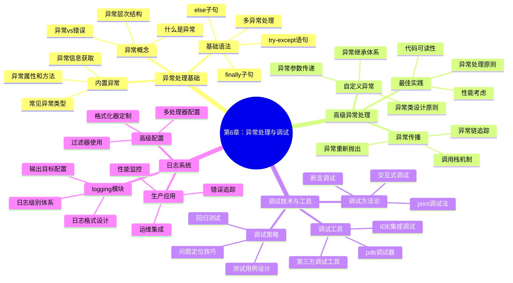

# 第6章：异常处理与调试

> "程序的健壮性不在于它从不出错，而在于它知道如何优雅地处理错误。"

## 📚 本章学习目标

### 🎯 知识目标
- **理解异常的本质**：掌握异常、错误、调试的基本概念
- **掌握异常处理语法**：熟练使用try/except/else/finally语句
- **学会自定义异常**：设计符合业务需求的异常类体系
- **掌握调试技能**：使用多种调试工具和技术定位问题
- **配置日志系统**：建立完整的日志记录和监控机制

### 🛠️ 技能目标
- 能够识别和处理95%以上的常见异常情况
- 设计并实现完整的自定义异常体系
- 熟练使用pdb、logging等调试工具
- 编写健壮、可维护的错误处理代码
- 建立完整的程序调试和监控体系

### 🌟 素养目标
- 培养**安全编程思维**：预防性思考可能的错误情况
- 建立**质量保证意识**：主动测试和验证代码健壮性  
- 形成**系统性思维**：从整体角度设计异常处理策略
- 掌握**问题解决能力**：快速定位和修复程序问题

## 🗺️ 知识体系导图



## 6.1 异常处理基础：让程序学会"优雅地犯错"

### 🤔 什么是异常？

想象一下，你正在开车去一个重要的会议：

```python
# 生活中的"异常"情况
def drive_to_meeting():
    print("启动汽车...")
    print("检查燃油...")
    # 突然发现没油了！这就是一个"异常"情况
    if fuel_level == 0:
        # 如果不处理这个异常，你就到不了会议
        print("燃油不足，无法继续行驶！")
        return False
    
    print("正常行驶到目的地")
    return True
```

在编程中，**异常**就像开车时遇到的意外情况：
- **正常流程**：代码按预期执行
- **异常情况**：遇到意外问题（文件不存在、网络断开、数据格式错误等）
- **异常处理**：预先准备好的应对方案

### 🔍 异常 vs 错误：两个容易混淆的概念

让我们通过生活化的例子来理解：

```python
# 1. 语法错误（Syntax Error）- 相当于"说错话"
def greet_user()
    print("Hello")  # 缺少冒号，这是语法错误
    # 这种错误程序根本运行不起来，就像说话语法不通

# 2. 逻辑错误（Logic Error）- 相当于"做错事"
def calculate_age(birth_year):
    current_year = 2024
    age = birth_year - current_year  # 逻辑错误：应该是current_year - birth_year
    return age
    # 程序能运行，但结果不对，就像做了一件看似正确但实际错误的事

# 3. 异常（Exception）- 相当于"遇到意外"
def read_user_file(filename):
    # 程序逻辑正确，但可能遇到意外情况
    try:
        with open(filename, 'r') as file:
            content = file.read()
        return content
    except FileNotFoundError:
        # 这是异常：文件可能不存在，这不是程序员的错
        print(f"文件 {filename} 不存在")
        return None
```

### 🌳 Python异常的层次结构

Python的异常就像一个家族树，每个异常都有自己的"血统关系"：

```python
# Python异常层次结构（简化版）
"""
BaseException
 ├── SystemExit          # 系统退出
 ├── KeyboardInterrupt   # 键盘中断（Ctrl+C）
 └── Exception           # 所有常规异常的基类
     ├── ArithmeticError     # 算术错误基类
     │   ├── ZeroDivisionError    # 除零错误
     │   └── OverflowError        # 数值溢出
     ├── LookupError         # 查找错误基类
     │   ├── IndexError           # 索引错误
     │   └── KeyError            # 键错误
     ├── OSError             # 操作系统错误
     │   └── FileNotFoundError    # 文件未找到
     ├── ValueError          # 值错误
     ├── TypeError           # 类型错误
     └── RuntimeError        # 运行时错误
"""

# 演示异常继承关系
def demonstrate_exception_hierarchy():
    """演示异常的继承关系"""
    
    # 1. 最具体的异常处理
    try:
        numbers = [1, 2, 3]
        print(numbers[10])  # 会引发IndexError
    except IndexError as e:
        print(f"索引错误: {e}")
    
    # 2. 较通用的异常处理
    try:
        result = 10 / 0  # 会引发ZeroDivisionError
    except ArithmeticError as e:
        print(f"算术错误: {e}")
    
    # 3. 最通用的异常处理
    try:
        undefined_variable
    except Exception as e:
        print(f"通用异常: {e}")

# 测试异常层次
if __name__ == "__main__":
    demonstrate_exception_hierarchy()
```

### 🔧 基础异常处理语法

#### try-except：异常处理的基本结构

```python
# 基本的try-except结构
def safe_divide(a, b):
    """安全的除法运算"""
    try:
        # 尝试执行可能出错的代码
        result = a / b
        print(f"{a} ÷ {b} = {result}")
        return result
    except ZeroDivisionError:
        # 处理特定的异常
        print("错误：不能除以零！")
        return None

# 测试安全除法
print("=== 安全除法测试 ===")
safe_divide(10, 2)   # 正常情况
safe_divide(10, 0)   # 异常情况
```

#### 处理多种异常：一次性捕获不同类型的错误

```python
def process_user_input():
    """处理用户输入的多种异常情况"""
    
    try:
        # 获取用户输入
        user_input = input("请输入一个数字: ")
        
        # 转换为数字
        number = float(user_input)
        
        # 进行计算
        result = 100 / number
        
        print(f"100 除以 {number} 等于 {result}")
        
    except ValueError:
        # 处理无法转换为数字的情况
        print("错误：输入的不是有效数字！")
        
    except ZeroDivisionError:
        # 处理除零错误
        print("错误：不能输入零！")
        
    except KeyboardInterrupt:
        # 处理用户按Ctrl+C的情况
        print("\n程序被用户中断")
        
    except Exception as e:
        # 处理其他所有异常
        print(f"发生了未知错误: {e}")

# 可以简化为一个except语句处理多种异常
def simplified_input_processor():
    """简化的多异常处理"""
    
    try:
        user_input = input("请输入一个数字: ")
        number = float(user_input)
        result = 100 / number
        print(f"100 除以 {number} 等于 {result}")
        
    except (ValueError, ZeroDivisionError) as e:
        # 同时处理多种异常
        print(f"输入错误: {e}")
        
    except Exception as e:
        print(f"其他错误: {e}")

# 演示不同的异常处理方式
if __name__ == "__main__":
    print("=== 多异常处理演示 ===")
    # process_user_input()  # 可以取消注释测试
```

#### else子句：只在没有异常时执行

```python
def file_statistics(filename):
    """统计文件信息，演示else子句的使用"""
    
    try:
        # 尝试打开文件
        with open(filename, 'r', encoding='utf-8') as file:
            content = file.read()
            
    except FileNotFoundError:
        print(f"文件 {filename} 不存在")
        return None
        
    except PermissionError:
        print(f"没有权限读取文件 {filename}")
        return None
        
    else:
        # 只有在没有异常时才执行
        print("文件读取成功！")
        
        # 统计文件信息
        lines = content.split('\n')
        words = content.split()
        characters = len(content)
        
        stats = {
            'lines': len(lines),
            'words': len(words), 
            'characters': characters
        }
        
        print(f"文件统计: {stats}")
        return stats

# 创建测试文件并测试
def create_test_file():
    """创建测试文件"""
    test_content = """Python异常处理
是程序健壮性的重要保证
让我们学会优雅地处理错误"""
    
    with open('test_file.txt', 'w', encoding='utf-8') as f:
        f.write(test_content)

# 测试else子句
if __name__ == "__main__":
    print("=== else子句演示 ===")
    create_test_file()
    file_statistics('test_file.txt')      # 文件存在
    file_statistics('nonexistent.txt')   # 文件不存在
```

#### finally子句：无论如何都要执行的代码

```python
import time

def database_operation():
    """模拟数据库操作，演示finally子句"""
    
    connection = None
    
    try:
        print("连接数据库...")
        connection = "database_connection"  # 模拟连接
        
        print("执行数据库操作...")
        time.sleep(1)  # 模拟操作耗时
        
        # 模拟可能的异常
        import random
        if random.choice([True, False]):
            raise Exception("数据库操作失败！")
            
        print("数据库操作成功完成")
        return True
        
    except Exception as e:
        print(f"数据库操作异常: {e}")
        return False
        
    else:
        print("数据库操作正常结束")
        
    finally:
        # 无论是否有异常，都要执行清理工作
        if connection:
            print("关闭数据库连接...")
            connection = None
        print("资源清理完成")

# 完整的try-except-else-finally示例
def complete_exception_handling():
    """完整的异常处理结构演示"""
    
    print("=== 完整异常处理演示 ===")
    
    try:
        print("1. 开始执行try块")
        result = 10 / 2
        print(f"2. 计算结果: {result}")
        
    except ZeroDivisionError:
        print("3. 处理除零异常")
        
    except Exception as e:
        print(f"3. 处理其他异常: {e}")
        
    else:
        print("4. 没有异常时执行else块")
        
    finally:
        print("5. 无论如何都执行finally块")

# 测试完整异常处理
if __name__ == "__main__":
    print("=== finally子句演示 ===")
    database_operation()
    print()
    complete_exception_handling()
```

### 📋 常见内置异常类型

Python提供了丰富的内置异常类型，让我们逐一了解：

```python
def common_exceptions_demo():
    """演示常见异常类型"""
    
    # 1. ValueError：值错误
    print("=== ValueError 演示 ===")
    try:
        number = int("abc")  # 无法转换的字符串
    except ValueError as e:
        print(f"ValueError: {e}")
    
    # 2. TypeError：类型错误
    print("\n=== TypeError 演示 ===")
    try:
        result = "hello" + 5  # 字符串不能和数字相加
    except TypeError as e:
        print(f"TypeError: {e}")
    
    # 3. IndexError：索引错误
    print("\n=== IndexError 演示 ===")
    try:
        my_list = [1, 2, 3]
        print(my_list[10])  # 索引超出范围
    except IndexError as e:
        print(f"IndexError: {e}")
    
    # 4. KeyError：键错误
    print("\n=== KeyError 演示 ===")
    try:
        my_dict = {"name": "Alice", "age": 25}
        print(my_dict["height"])  # 键不存在
    except KeyError as e:
        print(f"KeyError: {e}")
    
    # 5. AttributeError：属性错误
    print("\n=== AttributeError 演示 ===")
    try:
        my_string = "hello"
        my_string.append("world")  # 字符串没有append方法
    except AttributeError as e:
        print(f"AttributeError: {e}")
    
    # 6. FileNotFoundError：文件未找到
    print("\n=== FileNotFoundError 演示 ===")
    try:
        with open("nonexistent_file.txt", "r") as f:
            content = f.read()
    except FileNotFoundError as e:
        print(f"FileNotFoundError: {e}")
    
    # 7. ZeroDivisionError：除零错误
    print("\n=== ZeroDivisionError 演示 ===")
    try:
        result = 10 / 0
    except ZeroDivisionError as e:
        print(f"ZeroDivisionError: {e}")

# 测试常见异常
if __name__ == "__main__":
    common_exceptions_demo()
```

### 🎯 练习题：基础异常处理

```python
# 练习1：安全的用户输入处理
def safe_input_processor():
    """
    练习1：编写一个安全的用户输入处理函数
    
    要求：
    1. 提示用户输入两个数字
    2. 进行四则运算（加减乘除）
    3. 处理所有可能的异常情况
    4. 给出友好的错误提示
    """
    
    try:
        # 获取第一个数字
        num1_str = input("请输入第一个数字: ")
        num1 = float(num1_str)
        
        # 获取第二个数字
        num2_str = input("请输入第二个数字: ")
        num2 = float(num2_str)
        
        # 获取运算符
        operator = input("请输入运算符 (+, -, *, /): ")
        
        # 进行计算
        if operator == '+':
            result = num1 + num2
        elif operator == '-':
            result = num1 - num2
        elif operator == '*':
            result = num1 * num2
        elif operator == '/':
            result = num1 / num2
        else:
            raise ValueError("不支持的运算符")
        
        print(f"计算结果: {num1} {operator} {num2} = {result}")
        
    except ValueError as e:
        if "不支持的运算符" in str(e):
            print("错误：请输入有效的运算符 (+, -, *, /)")
        else:
            print("错误：请输入有效的数字")
    except ZeroDivisionError:
        print("错误：不能除以零")
    except KeyboardInterrupt:
        print("\n程序被用户中断")
    except Exception as e:
        print(f"发生未知错误: {e}")

# 练习2：文件操作异常处理
def safe_file_operations():
    """
    练习2：安全的文件操作
    
    要求：
    1. 读取用户指定的文件
    2. 统计文件中的单词数量
    3. 将结果写入新文件
    4. 处理各种可能的文件操作异常
    """
    
    try:
        # 获取文件名
        filename = input("请输入要读取的文件名: ")
        
        # 读取文件
        with open(filename, 'r', encoding='utf-8') as file:
            content = file.read()
        
        # 统计单词
        words = content.split()
        word_count = len(words)
        
        # 写入结果文件
        result_filename = f"{filename}_word_count.txt"
        with open(result_filename, 'w', encoding='utf-8') as result_file:
            result_file.write(f"文件 {filename} 包含 {word_count} 个单词")
        
        print(f"统计完成！结果已保存到 {result_filename}")
        
    except FileNotFoundError:
        print(f"错误：文件 {filename} 不存在")
    except PermissionError:
        print("错误：没有权限访问文件")
    except UnicodeDecodeError:
        print("错误：文件编码格式不支持")
    except Exception as e:
        print(f"文件操作失败: {e}")

# 如果要测试练习，取消下面的注释
if __name__ == "__main__":
    print("=== 异常处理练习 ===")
    # safe_input_processor()    # 练习1
    # safe_file_operations()    # 练习2
```

### 🔍 本节小结

在这一节中，我们学习了：

1. **异常的概念**：程序运行时遇到的意外情况
2. **异常 vs 错误**：语法错误、逻辑错误和异常的区别
3. **异常层次结构**：Python异常的继承关系
4. **基础语法**：try/except/else/finally的使用
5. **常见异常类型**：ValueError、TypeError、IndexError等

**核心要点**：
- 异常处理让程序更健壮，能够优雅地处理意外情况
- 使用具体的异常类型而不是通用的Exception
- else子句在没有异常时执行，finally子句总是执行
- 良好的异常处理能提升用户体验

下一节我们将学习如何创建自定义异常，设计符合业务需求的异常处理体系。

---

> **思考题**：为什么要用具体的异常类型（如ValueError）而不是通用的Exception？
> 
> **答案**：使用具体异常类型可以：1）提供更精确的错误信息；2）允许不同的处理策略；3）避免意外捕获不相关的异常；4）提高代码的可读性和维护性。

## 6.2 自定义异常设计：打造专属的错误处理体系

### 🏗️ 为什么需要自定义异常？

想象你在开发一个银行系统，用户要转账时可能遇到各种问题：

```python
# 使用内置异常的问题
def transfer_money_basic(from_account, to_account, amount):
    """基础转账功能（使用内置异常的问题演示）"""
    
    # 问题1：内置异常无法表达业务含义
    if amount <= 0:
        raise ValueError("转账金额必须大于0")  # 太宽泛
    
    # 问题2：无法区分不同的业务错误  
    if from_account.balance < amount:
        raise ValueError("余额不足")  # 和上面用同一个异常类型
    
    # 问题3：无法携带业务相关的详细信息
    if not to_account.exists():
        raise ValueError("目标账户不存在")  # 缺少账户号码等信息

# 使用自定义异常的优势
class BankingError(Exception):
    """银行业务异常基类"""
    def __init__(self, message, error_code=None, details=None):
        super().__init__(message)
        self.error_code = error_code
        self.details = details or {}
        self.timestamp = time.time()

class InsufficientFundsError(BankingError):
    """余额不足异常"""
    def __init__(self, account_id, current_balance, required_amount):
        message = f"账户 {account_id} 余额不足：当前余额 {current_balance}，需要 {required_amount}"
        super().__init__(message, error_code="INSUFFICIENT_FUNDS")
        self.account_id = account_id
        self.current_balance = current_balance
        self.required_amount = required_amount

class AccountNotFoundError(BankingError):
    """账户不存在异常"""
    def __init__(self, account_id):
        message = f"账户 {account_id} 不存在"
        super().__init__(message, error_code="ACCOUNT_NOT_FOUND")
        self.account_id = account_id

def transfer_money_improved(from_account, to_account, amount):
    """改进的转账功能（使用自定义异常）"""
    
    # 清晰的业务异常类型
    if amount <= 0:
        raise ValueError("转账金额必须大于0")
    
    if from_account.balance < amount:
        raise InsufficientFundsError(
            from_account.id, 
            from_account.balance, 
            amount
        )
    
    if not to_account.exists():
        raise AccountNotFoundError(to_account.id)
```

### 🎨 自定义异常设计原则

#### 1. 继承合适的基类

```python
# 原则1：选择合适的父类
class BusinessError(Exception):
    """业务异常基类 - 继承自Exception"""
    pass

class ValidationError(ValueError):
    """验证异常 - 继承自ValueError更合适"""
    pass

class NetworkError(ConnectionError):
    """网络异常 - 继承自ConnectionError"""
    pass

# 原则2：建立异常层次结构
class ApplicationError(Exception):
    """应用程序异常基类"""
    def __init__(self, message, error_code=None):
        super().__init__(message)
        self.error_code = error_code

class BusinessLogicError(ApplicationError):
    """业务逻辑异常"""
    pass

class DataAccessError(ApplicationError):
    """数据访问异常"""
    pass

class UserAuthenticationError(BusinessLogicError):
    """用户认证异常"""
    pass

class UserAuthorizationError(BusinessLogicError):
    """用户授权异常"""
    pass

class DatabaseConnectionError(DataAccessError):
    """数据库连接异常"""
    pass

class DataValidationError(DataAccessError):
    """数据验证异常"""
    pass
```

#### 2. 提供丰富的异常信息

```python
import time
from datetime import datetime

class RichException(Exception):
    """信息丰富的异常基类"""
    
    def __init__(self, message, error_code=None, details=None, 
                 suggestions=None, timestamp=None):
        super().__init__(message)
        
        # 基本信息
        self.message = message
        self.error_code = error_code or "UNKNOWN_ERROR"
        
        # 详细信息
        self.details = details or {}
        self.suggestions = suggestions or []
        
        # 时间信息
        self.timestamp = timestamp or time.time()
        self.datetime = datetime.fromtimestamp(self.timestamp)
    
    def to_dict(self):
        """转换为字典格式，便于日志记录和API返回"""
        return {
            'error_code': self.error_code,
            'message': self.message,
            'details': self.details,
            'suggestions': self.suggestions,
            'timestamp': self.timestamp,
            'datetime': str(self.datetime)
        }
    
    def __str__(self):
        """友好的字符串表示"""
        base_msg = f"[{self.error_code}] {self.message}"
        
        if self.details:
            details_str = ", ".join([f"{k}={v}" for k, v in self.details.items()])
            base_msg += f" (详情: {details_str})"
        
        if self.suggestions:
            suggestions_str = "; ".join(self.suggestions)
            base_msg += f" (建议: {suggestions_str})"
        
        return base_msg

# 使用示例：电商系统异常
class ECommerceError(RichException):
    """电商系统异常基类"""
    pass

class ProductNotFoundError(ECommerceError):
    """商品未找到异常"""
    
    def __init__(self, product_id, category=None):
        message = f"商品 {product_id} 未找到"
        details = {'product_id': product_id}
        suggestions = [
            "检查商品ID是否正确",
            "确认商品是否已下架",
            "联系客服获取帮助"
        ]
        
        if category:
            details['category'] = category
            suggestions.insert(0, f"在 {category} 分类中搜索类似商品")
        
        super().__init__(
            message=message,
            error_code="PRODUCT_NOT_FOUND",
            details=details,
            suggestions=suggestions
        )
        
        self.product_id = product_id
        self.category = category

class InsufficientStockError(ECommerceError):
    """库存不足异常"""
    
    def __init__(self, product_id, requested_quantity, available_quantity):
        message = f"商品 {product_id} 库存不足：需要 {requested_quantity}，可用 {available_quantity}"
        
        super().__init__(
            message=message,
            error_code="INSUFFICIENT_STOCK",
            details={
                'product_id': product_id,
                'requested_quantity': requested_quantity,
                'available_quantity': available_quantity,
                'shortage': requested_quantity - available_quantity
            },
            suggestions=[
                f"减少购买数量至 {available_quantity} 或以下",
                "等待商品补货",
                "选择其他替代商品",
                "联系客服了解补货时间"
            ]
        )
```

#### 3. 支持异常链和上下文

```python
class ServiceError(Exception):
    """服务异常，支持异常链"""
    
    def __init__(self, message, service_name=None, original_exception=None):
        super().__init__(message)
        self.service_name = service_name
        self.original_exception = original_exception
    
    def __str__(self):
        base_msg = f"Service Error"
        if self.service_name:
            base_msg += f" in {self.service_name}"
        base_msg += f": {super().__str__()}"
        
        if self.original_exception:
            base_msg += f" (caused by: {self.original_exception})"
        
        return base_msg

# 使用 raise ... from ... 语法保持异常链
def payment_service():
    """支付服务示例"""
    try:
        # 模拟网络请求失败
        import requests
        response = requests.get("http://invalid-payment-api.com")
        response.raise_for_status()
        
    except requests.exceptions.RequestException as e:
        # 保持原始异常信息的同时，抛出业务相关的异常
        raise ServiceError(
            "支付服务调用失败",
            service_name="PaymentAPI",
            original_exception=e
        ) from e

def order_processing():
    """订单处理示例"""
    try:
        payment_service()
    except ServiceError as e:
        print(f"订单处理失败: {e}")
        print(f"原始异常: {e.__cause__}")
```

### 🏪 实战案例：学生管理系统异常设计

让我们设计一个完整的学生管理系统异常体系：

```python
import re
from typing import List, Optional

# 1. 异常基类设计
class StudentManagementError(Exception):
    """学生管理系统异常基类"""
    
    def __init__(self, message: str, error_code: str = None, 
                 student_id: str = None, details: dict = None):
        super().__init__(message)
        self.error_code = error_code or "SMS_ERROR"
        self.student_id = student_id
        self.details = details or {}
        self.timestamp = time.time()

# 2. 具体异常类设计
class StudentNotFoundError(StudentManagementError):
    """学生未找到异常"""
    
    def __init__(self, student_id: str, search_criteria: dict = None):
        message = f"学生 {student_id} 不存在"
        super().__init__(
            message=message,
            error_code="STUDENT_NOT_FOUND",
            student_id=student_id,
            details=search_criteria or {}
        )

class DuplicateStudentError(StudentManagementError):
    """重复学生异常"""
    
    def __init__(self, student_id: str, existing_student_info: dict = None):
        message = f"学生 {student_id} 已存在"
        super().__init__(
            message=message,
            error_code="DUPLICATE_STUDENT",
            student_id=student_id,
            details=existing_student_info or {}
        )

class InvalidStudentDataError(StudentManagementError):
    """学生数据无效异常"""
    
    def __init__(self, field_name: str, field_value, validation_rule: str,
                 student_id: str = None):
        message = f"学生数据无效：{field_name} = '{field_value}' 不符合规则 '{validation_rule}'"
        super().__init__(
            message=message,
            error_code="INVALID_STUDENT_DATA",
            student_id=student_id,
            details={
                'field_name': field_name,
                'field_value': field_value,
                'validation_rule': validation_rule
            }
        )
        self.field_name = field_name
        self.field_value = field_value

class GradeOperationError(StudentManagementError):
    """成绩操作异常"""
    
    def __init__(self, operation: str, student_id: str, subject: str = None,
                 reason: str = None):
        message = f"成绩{operation}失败：学生 {student_id}"
        if subject:
            message += f"，科目 {subject}"
        if reason:
            message += f"，原因：{reason}"
        
        super().__init__(
            message=message,
            error_code="GRADE_OPERATION_ERROR",
            student_id=student_id,
            details={
                'operation': operation,
                'subject': subject,
                'reason': reason
            }
        )

# 3. 学生数据验证器
class StudentValidator:
    """学生数据验证器"""
    
    @staticmethod
    def validate_student_id(student_id: str) -> None:
        """验证学生ID格式"""
        if not student_id:
            raise InvalidStudentDataError(
                "student_id", student_id, "学生ID不能为空"
            )
        
        # 学生ID格式：年份(4位) + 专业代码(2位) + 序号(4位)
        pattern = r'^\d{4}\d{2}\d{4}$'
        if not re.match(pattern, student_id):
            raise InvalidStudentDataError(
                "student_id", student_id, 
                "学生ID格式必须为：年份(4位)+专业代码(2位)+序号(4位)"
            )
    
    @staticmethod
    def validate_name(name: str) -> None:
        """验证学生姓名"""
        if not name or not name.strip():
            raise InvalidStudentDataError("name", name, "姓名不能为空")
        
        if len(name.strip()) < 2:
            raise InvalidStudentDataError("name", name, "姓名长度至少2个字符")
        
        if len(name.strip()) > 20:
            raise InvalidStudentDataError("name", name, "姓名长度不能超过20个字符")
    
    @staticmethod
    def validate_age(age: int) -> None:
        """验证学生年龄"""
        if not isinstance(age, int):
            raise InvalidStudentDataError("age", age, "年龄必须是整数")
        
        if age < 16 or age > 100:
            raise InvalidStudentDataError("age", age, "年龄必须在16-100之间")
    
    @staticmethod
    def validate_email(email: str) -> None:
        """验证邮箱格式"""
        if email:  # 邮箱是可选的
            pattern = r'^[a-zA-Z0-9._%+-]+@[a-zA-Z0-9.-]+\.[a-zA-Z]{2,}$'
            if not re.match(pattern, email):
                raise InvalidStudentDataError("email", email, "邮箱格式不正确")
    
    @staticmethod
    def validate_grade(score: float, subject: str) -> None:
        """验证成绩"""
        if not isinstance(score, (int, float)):
            raise InvalidStudentDataError("score", score, "成绩必须是数字")
        
        if score < 0 or score > 100:
            raise InvalidStudentDataError("score", score, "成绩必须在0-100之间")

# 4. 学生管理系统主类
class StudentManagementSystem:
    """学生管理系统"""
    
    def __init__(self):
        self.students = {}  # 存储学生信息
        self.grades = {}    # 存储成绩信息
    
    def add_student(self, student_id: str, name: str, age: int, 
                   email: str = None) -> None:
        """添加学生"""
        try:
            # 数据验证
            StudentValidator.validate_student_id(student_id)
            StudentValidator.validate_name(name)
            StudentValidator.validate_age(age)
            StudentValidator.validate_email(email)
            
            # 检查重复
            if student_id in self.students:
                raise DuplicateStudentError(
                    student_id, 
                    self.students[student_id]
                )
            
            # 添加学生
            self.students[student_id] = {
                'id': student_id,
                'name': name.strip(),
                'age': age,
                'email': email,
                'created_at': time.time()
            }
            
            # 初始化成绩记录
            self.grades[student_id] = {}
            
            print(f"学生 {name}({student_id}) 添加成功")
            
        except StudentManagementError:
            # 重新抛出系统异常
            raise
        except Exception as e:
            # 包装未知异常
            raise StudentManagementError(
                f"添加学生失败：{str(e)}",
                error_code="ADD_STUDENT_ERROR",
                student_id=student_id
            ) from e
    
    def get_student(self, student_id: str) -> dict:
        """获取学生信息"""
        try:
            StudentValidator.validate_student_id(student_id)
            
            if student_id not in self.students:
                raise StudentNotFoundError(student_id)
            
            return self.students[student_id].copy()
            
        except StudentManagementError:
            raise
        except Exception as e:
            raise StudentManagementError(
                f"获取学生信息失败：{str(e)}",
                error_code="GET_STUDENT_ERROR",
                student_id=student_id
            ) from e
    
    def add_grade(self, student_id: str, subject: str, score: float) -> None:
        """添加成绩"""
        try:
            # 验证数据
            StudentValidator.validate_student_id(student_id)
            StudentValidator.validate_grade(score, subject)
            
            # 检查学生是否存在
            if student_id not in self.students:
                raise StudentNotFoundError(student_id)
            
            # 添加成绩
            if student_id not in self.grades:
                self.grades[student_id] = {}
            
            self.grades[student_id][subject] = {
                'score': score,
                'added_at': time.time()
            }
            
            student_name = self.students[student_id]['name']
            print(f"为学生 {student_name}({student_id}) 添加 {subject} 成绩：{score}")
            
        except StudentManagementError:
            raise
        except Exception as e:
            raise GradeOperationError(
                "添加", student_id, subject, str(e)
            ) from e
    
    def get_student_grades(self, student_id: str) -> dict:
        """获取学生所有成绩"""
        try:
            # 检查学生是否存在
            if student_id not in self.students:
                raise StudentNotFoundError(student_id)
            
            return self.grades.get(student_id, {}).copy()
            
        except StudentManagementError:
            raise
        except Exception as e:
            raise GradeOperationError(
                "查询", student_id, None, str(e)
            ) from e

# 5. 异常处理演示
def demonstrate_exception_handling():
    """演示异常处理"""
    
    sms = StudentManagementSystem()
    
    print("=== 学生管理系统异常处理演示 ===\n")
    
    # 正常操作
    try:
        sms.add_student("20240101001", "张三", 20, "zhangsan@example.com")
        sms.add_grade("20240101001", "数学", 95.5)
    except StudentManagementError as e:
        print(f"操作失败: {e}")
    
    # 异常情况演示
    test_cases = [
        # 测试无效学生ID
        lambda: sms.add_student("invalid_id", "李四", 19),
        
        # 测试重复学生
        lambda: sms.add_student("20240101001", "王五", 21),
        
        # 测试学生未找到
        lambda: sms.get_student("20240101999"),
        
        # 测试无效年龄
        lambda: sms.add_student("20240101002", "赵六", 150),
        
        # 测试无效成绩
        lambda: sms.add_grade("20240101001", "英语", 150),
        
        # 测试无效邮箱
        lambda: sms.add_student("20240101003", "钱七", 20, "invalid_email"),
    ]
    
    for i, test_case in enumerate(test_cases, 1):
        print(f"\n--- 测试用例 {i} ---")
        try:
            test_case()
        except StudentManagementError as e:
            print(f"捕获异常: {e}")
            print(f"错误代码: {e.error_code}")
            if e.details:
                print(f"详细信息: {e.details}")

# 测试自定义异常
if __name__ == "__main__":
    demonstrate_exception_handling()
```

### 🎯 练习题：自定义异常设计

```python
# 练习1：设计图书馆管理系统异常
class LibrarySystemError(Exception):
    """
    练习1：为图书馆管理系统设计异常体系
    
    要求：
    1. 设计基础异常类 LibrarySystemError
    2. 设计具体异常：BookNotFoundError, BookUnavailableError, 
       UserNotFoundError, BorrowLimitExceededError
    3. 每个异常应该包含相关的业务信息
    4. 实现友好的错误信息显示
    """
    pass

# 在这里完成你的异常设计...

# 练习2：设计在线购物车异常
class ShoppingCartError(Exception):
    """
    练习2：为在线购物车设计异常体系
    
    要求：
    1. 设计购物车相关异常
    2. 处理商品库存、价格变动、优惠券等场景
    3. 提供详细的错误信息和建议解决方案
    4. 支持错误代码用于API返回
    """
    pass

# 在这里完成你的异常设计...
```

### 🔍 本节小结

在这一节中，我们学习了：

1. **自定义异常的必要性**：表达业务语义、区分错误类型、携带详细信息
2. **设计原则**：选择合适基类、建立层次结构、提供丰富信息
3. **高级特性**：异常链、上下文信息、数据验证集成
4. **实战应用**：学生管理系统的完整异常设计

**核心要点**：
- 自定义异常让错误处理更精确和友好
- 良好的异常设计是系统健壮性的重要保证
- 异常应该携带足够的信息帮助定位和解决问题
- 异常层次结构便于分类处理和维护

下一节我们将学习调试技术，掌握快速定位和解决程序问题的方法。

## 6.3 调试技术与工具：成为程序"侦探"

### 🕵️‍♀️ 调试的艺术：像侦探一样思考

调试就像破案，我们需要：
- **观察现象**：程序出现了什么问题？
- **收集证据**：错误信息、日志、变量状态
- **分析线索**：异常发生的位置和原因
- **验证假设**：通过测试验证推理
- **解决问题**：修复bug并确保不会再出现

### 🔍 调试方法论：从简单到高级

#### 1. Print调试法：最简单也最实用

```python
# 示例：查找列表处理中的bug
def process_student_scores(scores):
    """处理学生成绩，计算平均分和等级"""
    
    print(f"DEBUG: 输入的成绩列表: {scores}")  # 观察输入
    
    total = 0
    count = 0
    
    for score in scores:
        print(f"DEBUG: 处理成绩: {score}")  # 观察每次迭代
        
        if score >= 0:  # 忽略无效成绩
            total += score
            count += 1
            print(f"DEBUG: 当前总分: {total}, 数量: {count}")
    
    if count == 0:
        print("DEBUG: 没有有效成绩")
        return None
    
    average = total / count
    print(f"DEBUG: 计算得到平均分: {average}")
    
    # 计算等级
    if average >= 90:
        grade = 'A'
    elif average >= 80:
        grade = 'B'
    elif average >= 70:
        grade = 'C'
    elif average >= 60:
        grade = 'D'
    else:
        grade = 'F'
    
    print(f"DEBUG: 最终等级: {grade}")
    
    return {
        'average': average,
        'grade': grade,
        'total_students': count
    }

# 改进版：使用开关控制调试输出
DEBUG_MODE = True

def debug_print(*args, **kwargs):
    """条件调试打印"""
    if DEBUG_MODE:
        print("[DEBUG]", *args, **kwargs)

def process_student_scores_improved(scores):
    """改进的学生成绩处理"""
    
    debug_print(f"输入的成绩列表: {scores}")
    
    valid_scores = [score for score in scores if score >= 0]
    debug_print(f"有效成绩: {valid_scores}")
    
    if not valid_scores:
        debug_print("没有有效成绩")
        return None
    
    average = sum(valid_scores) / len(valid_scores)
    debug_print(f"平均分: {average}")
    
    # 使用字典简化等级计算
    grade_thresholds = [(90, 'A'), (80, 'B'), (70, 'C'), (60, 'D')]
    grade = 'F'
    for threshold, letter in grade_thresholds:
        if average >= threshold:
            grade = letter
            break
    
    debug_print(f"等级: {grade}")
    
    return {
        'average': round(average, 2),
        'grade': grade,
        'total_students': len(valid_scores)
    }

# 测试两个版本
if __name__ == "__main__":
    test_scores = [85, 92, 78, -1, 88, 95]
    print("=== 基础版本 ===")
    result1 = process_student_scores(test_scores)
    print(f"结果: {result1}")
    
    print("\n=== 改进版本 ===")
    result2 = process_student_scores_improved(test_scores)
    print(f"结果: {result2}")
```

#### 2. 断言调试法：验证假设

```python
def safe_divide(a, b):
    """安全除法，使用断言验证假设"""
    
    # 断言：输入应该是数字
    assert isinstance(a, (int, float)), f"a必须是数字，实际类型: {type(a)}"
    assert isinstance(b, (int, float)), f"b必须是数字，实际类型: {type(b)}"
    
    # 断言：除数不能为零
    assert b != 0, "除数不能为零"
    
    result = a / b
    
    # 断言：结果应该是有限数
    assert not (math.isinf(result) or math.isnan(result)), "计算结果无效"
    
    return result

# 数据验证中的断言使用
def validate_student_info(name, age, email):
    """验证学生信息"""
    
    # 使用断言进行快速验证（开发阶段）
    assert isinstance(name, str), "姓名必须是字符串"
    assert len(name.strip()) > 0, "姓名不能为空"
    assert isinstance(age, int), "年龄必须是整数"
    assert 16 <= age <= 100, f"年龄必须在16-100之间，实际值: {age}"
    
    if email:  # 邮箱是可选的
        assert isinstance(email, str), "邮箱必须是字符串"
        assert "@" in email, "邮箱格式不正确"
    
    print("学生信息验证通过")
    return True

# 示例：使用断言进行调试
def calculate_bmi(weight, height):
    """计算BMI指数"""
    
    print(f"计算BMI: weight={weight}, height={height}")
    
    # 开发阶段的断言
    assert weight > 0, f"体重必须大于0，实际值: {weight}"
    assert height > 0, f"身高必须大于0，实际值: {height}"
    assert height < 3.0, f"身高似乎不合理(单位是米)，实际值: {height}"
    
    bmi = weight / (height ** 2)
    
    # 验证结果合理性
    assert 10 <= bmi <= 100, f"BMI值似乎不合理: {bmi}"
    
    return round(bmi, 2)

# 测试断言调试
if __name__ == "__main__":
    try:
        print("=== 断言调试测试 ===")
        result1 = safe_divide(10, 2)
        print(f"10 / 2 = {result1}")
        
        result2 = calculate_bmi(70, 1.75)
        print(f"BMI = {result2}")
        
        # 这会触发断言错误
        # result3 = calculate_bmi(-5, 1.75)
        
    except AssertionError as e:
        print(f"断言错误: {e}")
```

#### 3. 交互式调试：深入程序内部

```python
import pdb

def complex_calculation(numbers):
    """复杂计算示例，演示pdb调试"""
    
    result = []
    total = 0
    
    for i, num in enumerate(numbers):
        # 设置断点 - 程序会在这里暂停
        pdb.set_trace()
        
        # 进行一些复杂计算
        if num % 2 == 0:
            processed = num * 2
        else:
            processed = num * 3 + 1
        
        result.append(processed)
        total += processed
        
        print(f"第{i+1}个数字 {num} 处理后为 {processed}")
    
    average = total / len(numbers) if numbers else 0
    
    return {
        'processed_numbers': result,
        'total': total,
        'average': average
    }

# pdb调试命令介绍
"""
常用pdb命令：
- n (next): 执行下一行
- s (step): 进入函数内部
- c (continue): 继续执行到下一个断点
- l (list): 显示当前代码
- p <variable>: 打印变量值
- pp <variable>: 美化打印变量值
- w (where): 显示调用栈
- u (up): 上移一级调用栈
- d (down): 下移一级调用栈
- b <line>: 在指定行设置断点
- cl (clear): 清除断点
- q (quit): 退出调试器
"""

# 条件断点示例
def find_problematic_data(data_list):
    """查找有问题的数据"""
    
    for i, item in enumerate(data_list):
        # 只在特定条件下断点
        if item < 0:
            pdb.set_trace()  # 只有当item为负数时才断点
        
        # 处理数据
        processed = item ** 2
        print(f"处理第{i}项: {item} -> {processed}")

# 使用断点装饰器
def breakpoint_decorator(func):
    """断点装饰器，在函数入口设置断点"""
    def wrapper(*args, **kwargs):
        print(f"进入函数 {func.__name__}")
        pdb.set_trace()
        return func(*args, **kwargs)
    return wrapper

@breakpoint_decorator
def critical_function(x, y):
    """重要函数，需要仔细调试"""
    result = x * y + (x - y) ** 2
    return result
```

### 🛠️ 高级调试工具

#### 1. logging模块：生产级调试

```python
import logging
import time
from datetime import datetime

# 配置日志系统
def setup_logging():
    """配置日志系统"""
    
    # 创建logger
    logger = logging.getLogger('StudentSystem')
    logger.setLevel(logging.DEBUG)
    
    # 创建文件处理器
    file_handler = logging.FileHandler('student_system.log', encoding='utf-8')
    file_handler.setLevel(logging.INFO)
    
    # 创建控制台处理器
    console_handler = logging.StreamHandler()
    console_handler.setLevel(logging.DEBUG)
    
    # 创建格式化器
    file_formatter = logging.Formatter(
        '%(asctime)s - %(name)s - %(levelname)s - %(funcName)s:%(lineno)d - %(message)s'
    )
    console_formatter = logging.Formatter(
        '%(levelname)s - %(funcName)s - %(message)s'
    )
    
    # 应用格式化器
    file_handler.setFormatter(file_formatter)
    console_handler.setFormatter(console_formatter)
    
    # 添加处理器
    logger.addHandler(file_handler)
    logger.addHandler(console_handler)
    
    return logger

# 在业务逻辑中使用日志
class StudentManager:
    """学生管理器，演示日志调试"""
    
    def __init__(self):
        self.logger = setup_logging()
        self.students = {}
        self.logger.info("学生管理系统初始化完成")
    
    def add_student(self, student_id, name, age):
        """添加学生"""
        self.logger.debug(f"开始添加学生: {student_id}, {name}, {age}")
        
        try:
            # 验证数据
            if not student_id:
                self.logger.error("学生ID为空")
                raise ValueError("学生ID不能为空")
            
            if student_id in self.students:
                self.logger.warning(f"学生 {student_id} 已存在，跳过添加")
                return False
            
            # 添加学生
            self.students[student_id] = {
                'name': name,
                'age': age,
                'created_at': time.time()
            }
            
            self.logger.info(f"成功添加学生: {name}({student_id})")
            return True
            
        except Exception as e:
            self.logger.error(f"添加学生失败: {e}", exc_info=True)
            raise
    
    def get_student(self, student_id):
        """获取学生信息"""
        self.logger.debug(f"查询学生信息: {student_id}")
        
        if student_id not in self.students:
            self.logger.warning(f"学生 {student_id} 不存在")
            return None
        
        student = self.students[student_id]
        self.logger.debug(f"找到学生: {student}")
        return student
    
    def get_statistics(self):
        """获取统计信息"""
        self.logger.debug("生成统计信息")
        
        total_students = len(self.students)
        
        if total_students == 0:
            self.logger.info("暂无学生数据")
            return {'total': 0}
        
        ages = [s['age'] for s in self.students.values()]
        avg_age = sum(ages) / len(ages)
        
        stats = {
            'total': total_students,
            'average_age': round(avg_age, 2),
            'min_age': min(ages),
            'max_age': max(ages)
        }
        
        self.logger.info(f"统计信息: {stats}")
        return stats

# 性能调试装饰器
def performance_logger(func):
    """性能日志装饰器"""
    def wrapper(*args, **kwargs):
        logger = logging.getLogger('Performance')
        
        start_time = time.time()
        logger.debug(f"开始执行 {func.__name__}")
        
        try:
            result = func(*args, **kwargs)
            end_time = time.time()
            execution_time = end_time - start_time
            
            logger.info(f"{func.__name__} 执行成功，耗时 {execution_time:.4f}秒")
            return result
            
        except Exception as e:
            end_time = time.time()
            execution_time = end_time - start_time
            
            logger.error(f"{func.__name__} 执行失败，耗时 {execution_time:.4f}秒，错误: {e}")
            raise
    
    return wrapper

@performance_logger
def slow_function():
    """模拟耗时操作"""
    time.sleep(1)
    return "完成"

# 测试日志系统
if __name__ == "__main__":
    print("=== 日志调试演示 ===")
    
    # 设置日志级别
    logging.basicConfig(level=logging.DEBUG)
    
    manager = StudentManager()
    
    # 正常操作
    manager.add_student("001", "张三", 20)
    manager.add_student("002", "李四", 22)
    
    # 异常操作
    try:
        manager.add_student("", "王五", 21)  # 空ID
    except ValueError:
        pass
    
    # 重复添加
    manager.add_student("001", "张三", 20)
    
    # 查询
    student = manager.get_student("001")
    print(f"查询结果: {student}")
    
    # 统计
    stats = manager.get_statistics()
    print(f"统计信息: {stats}")
    
    # 性能测试
    slow_function()
```

#### 2. 异常追踪：获取完整的调用栈

```python
import traceback
import sys

def detailed_exception_handler():
    """详细的异常处理和追踪"""
    
    def risky_function(x, y):
        """可能出错的函数"""
        if y == 0:
            raise ZeroDivisionError("不能除以零")
        return x / y
    
    def middle_function(a, b):
        """中间函数"""
        result = risky_function(a, b)
        return result * 2
    
    def top_function():
        """顶层函数"""
        return middle_function(10, 0)  # 这会导致异常
    
    try:
        top_function()
    except Exception as e:
        print("=== 异常信息 ===")
        print(f"异常类型: {type(e).__name__}")
        print(f"异常消息: {str(e)}")
        
        print("\n=== 调用栈追踪 ===")
        traceback.print_exc()
        
        print("\n=== 详细追踪信息 ===")
        exc_type, exc_value, exc_traceback = sys.exc_info()
        
        # 获取追踪信息
        tb_lines = traceback.format_exception(exc_type, exc_value, exc_traceback)
        for line in tb_lines:
            print(line.rstrip())
        
        print("\n=== 调用栈详情 ===")
        # 手动解析调用栈
        tb = exc_traceback
        while tb is not None:
            frame = tb.tb_frame
            filename = frame.f_code.co_filename
            function_name = frame.f_code.co_name
            line_number = tb.tb_lineno
            
            print(f"文件: {filename}")
            print(f"函数: {function_name}")
            print(f"行号: {line_number}")
            print(f"局部变量: {frame.f_locals}")
            print("-" * 40)
            
            tb = tb.tb_next

# 自定义异常追踪器
class ExceptionTracker:
    """异常追踪器"""
    
    def __init__(self, log_file="exceptions.log"):
        self.log_file = log_file
        self.exceptions = []
    
    def track_exception(self, func):
        """异常追踪装饰器"""
        def wrapper(*args, **kwargs):
            try:
                return func(*args, **kwargs)
            except Exception as e:
                # 记录异常信息
                exception_info = {
                    'function': func.__name__,
                    'args': args,
                    'kwargs': kwargs,
                    'exception_type': type(e).__name__,
                    'exception_message': str(e),
                    'timestamp': time.time(),
                    'traceback': traceback.format_exc()
                }
                
                self.exceptions.append(exception_info)
                self._log_exception(exception_info)
                
                # 重新抛出异常
                raise
        
        return wrapper
    
    def _log_exception(self, exception_info):
        """记录异常到文件"""
        with open(self.log_file, 'a', encoding='utf-8') as f:
            f.write(f"\n{'='*50}\n")
            f.write(f"时间: {datetime.fromtimestamp(exception_info['timestamp'])}\n")
            f.write(f"函数: {exception_info['function']}\n")
            f.write(f"参数: {exception_info['args']}\n")
            f.write(f"关键字参数: {exception_info['kwargs']}\n")
            f.write(f"异常类型: {exception_info['exception_type']}\n")
            f.write(f"异常消息: {exception_info['exception_message']}\n")
            f.write(f"调用栈:\n{exception_info['traceback']}\n")
    
    def get_exception_summary(self):
        """获取异常汇总"""
        if not self.exceptions:
            return "没有记录到异常"
        
        summary = f"总计异常数量: {len(self.exceptions)}\n"
        
        # 按异常类型分组
        exception_types = {}
        for exc in self.exceptions:
            exc_type = exc['exception_type']
            exception_types[exc_type] = exception_types.get(exc_type, 0) + 1
        
        summary += "异常类型分布:\n"
        for exc_type, count in exception_types.items():
            summary += f"  {exc_type}: {count}次\n"
        
        return summary

# 使用异常追踪器
tracker = ExceptionTracker()

@tracker.track_exception
def problematic_function(x, y):
    """有问题的函数"""
    if x < 0:
        raise ValueError("x不能为负数")
    if y == 0:
        raise ZeroDivisionError("y不能为零")
    return x / y

# 测试异常追踪
if __name__ == "__main__":
    print("=== 异常追踪演示 ===")
    
    # 正常情况
    try:
        result = problematic_function(10, 2)
        print(f"正常结果: {result}")
    except Exception as e:
        print(f"捕获异常: {e}")
    
    # 异常情况
    test_cases = [
        (-5, 2),   # ValueError
        (10, 0),   # ZeroDivisionError
        (-3, 0),   # ValueError (先触发)
    ]
    
    for x, y in test_cases:
        try:
            problematic_function(x, y)
        except Exception as e:
            print(f"测试 ({x}, {y}) 失败: {e}")
    
    # 显示异常汇总
    print("\n=== 异常汇总 ===")
    print(tracker.get_exception_summary())
    
    # 演示详细异常处理
    detailed_exception_handler()
```

### 🎯 调试策略与最佳实践

```python
# 调试策略总结
class DebuggingStrategy:
    """调试策略指南"""
    
    @staticmethod
    def binary_search_debugging():
        """二分查找调试法"""
        print("""
        二分查找调试法：
        1. 在程序中间位置添加调试输出
        2. 确定问题在前半部分还是后半部分
        3. 在有问题的部分继续二分
        4. 重复直到找到确切的问题位置
        
        适用场景：长函数或复杂逻辑中的bug定位
        """)
    
    @staticmethod
    def rubber_duck_debugging():
        """橡皮鸭调试法"""
        print("""
        橡皮鸭调试法：
        1. 向橡皮鸭（或任何物体）详细解释你的代码
        2. 逐行说明代码的预期行为
        3. 当你发现说出的和实际的不一致时，bug就暴露了
        
        原理：通过表达强迫大脑重新整理思路
        """)
    
    @staticmethod
    def minimum_reproducible_example():
        """最小可复现示例"""
        print("""
        创建最小可复现示例：
        1. 从完整程序中提取出最小的能重现问题的代码
        2. 移除所有不相关的代码
        3. 简化输入数据
        4. 在简化的环境中更容易发现问题
        
        优势：降低复杂度，提高定位效率
        """)

# 调试清单
class DebuggingChecklist:
    """调试检查清单"""
    
    COMMON_BUGS = [
        "变量名拼写错误",
        "缩进问题",
        "循环边界条件错误（off-by-one）",
        "空值/None未处理",
        "类型不匹配",
        "作用域问题",
        "浅拷贝vs深拷贝",
        "编码问题",
        "路径分隔符问题",
        "时区问题"
    ]
    
    DEBUGGING_STEPS = [
        "1. 仔细阅读错误信息",
        "2. 检查最近的代码变更",
        "3. 确认输入数据的正确性",
        "4. 验证函数的前置条件",
        "5. 检查边界条件",
        "6. 添加日志输出关键变量",
        "7. 使用调试器单步执行",
        "8. 编写测试用例验证修复"
    ]
    
    @classmethod
    def print_checklist(cls):
        """打印调试清单"""
        print("=== 常见Bug类型 ===")
        for i, bug in enumerate(cls.COMMON_BUGS, 1):
            print(f"{i}. {bug}")
        
        print("\n=== 调试步骤 ===")
        for step in cls.DEBUGGING_STEPS:
            print(step)

# 测试调试工具
if __name__ == "__main__":
    print("=== 调试策略与实践 ===")
    
    # 打印调试清单
    DebuggingChecklist.print_checklist()
    
    # 演示调试策略
    print("\n" + "="*50)
    DebuggingStrategy.binary_search_debugging()
    DebuggingStrategy.rubber_duck_debugging()
    DebuggingStrategy.minimum_reproducible_example()
```

### 🔍 本节小结

在这一节中，我们学习了：

1. **调试方法论**：从观察现象到解决问题的系统性方法
2. **基础调试技术**：print调试、断言调试、交互式调试
3. **高级调试工具**：logging模块、异常追踪、性能分析
4. **调试策略**：二分查找、橡皮鸭调试、最小可复现示例

**核心要点**：
- 调试是一门艺术，需要逻辑思维和耐心
- 选择合适的调试工具和方法提高效率
- 日志系统是生产环境调试的重要工具
- 良好的调试习惯能显著提升开发效率

下一节我们将学习日志系统的详细配置和应用。

--- 