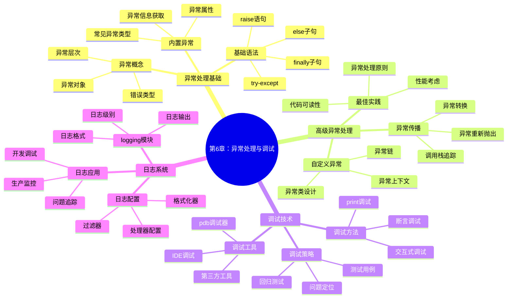

# 第6章计划：异常处理与调试

## 📋 SMART学习目标

**S**pecific (具体)：
- 掌握Python异常处理的完整机制（try/except/else/finally）
- 学会自定义异常类的设计和使用
- 熟练使用Python调试工具和技术
- 掌握日志系统的配置和使用
- 学会编写健壮、可维护的错误处理代码

**M**easurable (可衡量)：
- 能够正确处理95%以上的常见异常情况
- 设计并实现至少3个自定义异常类
- 熟练使用至少5种调试技术和工具
- 独立完成一个包含完整异常处理的项目系统

**A**chievable (可实现)：
- 基于前5章的Python基础，循序渐进学习异常处理
- 通过实际项目案例理解异常处理的重要性
- 结合代码调试实践掌握调试技能

**R**elevant (相关性)：
- 为编写高质量、可靠的Python程序奠定基础
- 培养软件工程中的错误处理和质量保证思维
- 为后续模块开发和项目实战做准备

**T**ime-bound (时限性)：
- 2天内完成学习（4课时理论+实践）
- 1月29-30日编写完成

## 🗂️ 知识体系架构



## ⏰ 时间规划

### 1月29日（第1天）- 8小时
- **上午 (4小时)**
  - 09:00-10:30 异常处理基础概念和语法
  - 10:45-12:15 内置异常类型和处理示例

- **下午 (4小时)**  
  - 13:30-15:00 自定义异常设计和实现
  - 15:15-16:45 异常处理最佳实践和案例

### 1月30日（第2天）- 8小时
- **上午 (4小时)**
  - 09:00-10:30 调试技术和工具使用
  - 10:45-12:15 日志系统配置和应用

- **下午 (4小时)**
  - 13:30-15:00 练习题设计和解答
  - 15:15-16:45 综合项目案例开发

## 🎯 技术要点

### 核心异常处理语法
- try/except/else/finally完整语法
- 多异常捕获和处理
- 异常信息获取和处理
- raise语句的使用场景

### 自定义异常设计
- 异常类继承体系
- 异常参数和属性设计
- 异常文档和错误码
- 异常链和上下文管理

### 调试技术栈
- print/assert调试方法
- pdb调试器详细使用
- IDE集成调试环境
- 远程调试和性能调试

### 日志系统架构
- logging模块完整配置
- 多处理器和格式化器
- 日志轮转和归档
- 分布式日志收集

## 💻 代码示例规划

### 示例1：文件操作异常处理系统
```python
class FileOperationManager:
    """文件操作管理器，展示完整异常处理"""
    
    def __init__(self, base_path):
        self.base_path = base_path
        self.logger = self._setup_logger()
    
    def read_file(self, filename):
        """安全的文件读取"""
        try:
            # 文件操作逻辑
            pass
        except FileNotFoundError:
            # 文件未找到处理
            pass
        except PermissionError:
            # 权限错误处理
            pass
        except Exception as e:
            # 通用异常处理
            pass
        else:
            # 成功执行的逻辑
            pass
        finally:
            # 清理资源
            pass
```

### 示例2：网络请求异常处理
```python
class NetworkClient:
    """网络客户端，展示异常传播和处理"""
    
    def request(self, url, retry_count=3):
        """带重试的网络请求"""
        for attempt in range(retry_count):
            try:
                # 网络请求逻辑
                pass
            except ConnectionError as e:
                # 连接错误处理
                pass
            except TimeoutError as e:
                # 超时错误处理  
                pass
```

### 示例3：数据验证异常系统
```python
class ValidationError(Exception):
    """自定义验证异常"""
    pass

class DataValidator:
    """数据验证器，展示自定义异常"""
    
    def validate_email(self, email):
        if not email or '@' not in email:
            raise ValidationError(f"Invalid email: {email}")
```

### 示例4：调试工具演示
```python
import pdb
import logging

def debug_example():
    """调试技术演示"""
    
    # 设置断点
    pdb.set_trace()
    
    # 日志记录
    logging.debug("Debug information")
    logging.info("Process information")
    logging.warning("Warning message")
    logging.error("Error occurred")
```

### 示例5：综合项目 - 银行系统异常处理
```python
class BankSystemError(Exception):
    """银行系统基础异常"""
    pass

class InsufficientFundsError(BankSystemError):
    """余额不足异常"""
    pass

class AccountNotFoundError(BankSystemError):
    """账户未找到异常"""
    pass

class BankingSystem:
    """银行系统，综合异常处理演示"""
    
    def __init__(self):
        self.accounts = {}
        self.logger = self._setup_logger()
        self.transaction_log = []
    
    def transfer_money(self, from_account, to_account, amount):
        """转账操作，完整异常处理"""
        try:
            # 验证账户
            self._validate_account(from_account)
            self._validate_account(to_account)
            
            # 检查余额
            self._check_sufficient_funds(from_account, amount)
            
            # 执行转账
            self._execute_transfer(from_account, to_account, amount)
            
        except AccountNotFoundError as e:
            self.logger.error(f"Account error: {e}")
            raise
        except InsufficientFundsError as e:
            self.logger.warning(f"Insufficient funds: {e}")
            raise
        except Exception as e:
            self.logger.critical(f"Unexpected error: {e}")
            raise BankSystemError("Transfer failed due to system error")
        else:
            self.logger.info(f"Transfer successful: {amount} from {from_account} to {to_account}")
        finally:
            # 记录事务日志
            self._log_transaction(from_account, to_account, amount)
```

## 🏋️‍♀️ 练习题设计

### 基础练习
1. **异常捕获练习**：编写程序处理用户输入的各种异常情况
2. **文件操作安全**：实现安全的文件读写操作
3. **数据类型转换**：处理字符串到数字转换的异常

### 中级练习  
4. **自定义异常设计**：为学生管理系统设计异常体系
5. **网络请求处理**：实现带重试机制的HTTP客户端
6. **配置文件解析**：安全解析JSON/YAML配置文件

### 高级练习
7. **分布式异常处理**：设计微服务间的异常传播机制
8. **异常监控系统**：实现异常收集和报警系统
9. **性能调试工具**：开发代码性能分析工具

## 🎯 综合项目案例

### 项目：智能文件处理系统
设计一个完整的文件处理系统，包含：

**功能模块**：
- 文件上传和验证
- 格式转换和处理
- 批量操作管理
- 进度监控和日志

**异常处理要求**：
- 完整的异常分类体系
- 优雅的错误恢复机制
- 详细的日志记录
- 用户友好的错误提示

**调试特性**：
- 开发模式的详细调试
- 生产模式的性能监控
- 异常统计和分析
- 自动化测试集成

## 📊 质量标准

### 内容质量标准
- **准确性**：≥90分 (异常处理概念准确)
- **完整性**：≥85分 (覆盖完整异常处理体系)
- **实用性**：≥90分 (贴近实际开发场景)
- **可读性**：≥85分 (结构清晰，易于理解)

### 代码质量标准
- **可运行性**：100% (所有示例可独立运行)
- **异常覆盖**：≥90% (覆盖常见异常情况)
- **最佳实践**：≥85分 (遵循异常处理最佳实践)
- **注释完整**：≥90% (关键代码有详细说明)

### 教学设计标准
- **渐进性**：≥90分 (从基础到高级合理递进)
- **互动性**：≥85分 (练习题和案例充足)
- **实践性**：≥90分 (理论结合实践)
- **可操作性**：≥85分 (学生可以跟做练习)

## ⚠️ 风险识别与应对

### 内容风险
1. **概念抽象性**
   - 风险：异常处理概念对初学者较抽象
   - 应对：增加生活化比喻和具体案例

2. **调试工具复杂性**
   - 风险：调试工具使用较复杂
   - 应对：分步骤详细演示，提供快速上手指南

3. **最佳实践争议**
   - 风险：异常处理存在不同观点
   - 应对：说明不同场景的适用性，提供判断标准

### 技术风险
1. **环境依赖**
   - 风险：调试工具可能存在环境差异
   - 应对：提供多种环境的配置说明

2. **版本兼容**
   - 风险：Python不同版本的异常处理差异
   - 应对：明确版本要求，说明版本差异

### 时间风险
1. **内容量控制**
   - 风险：异常处理内容可能过多
   - 应对：重点突出核心概念，其他作为扩展

2. **调试演示时间**
   - 风险：调试过程演示可能耗时较长
   - 应对：准备预录制的调试过程，配合文字说明

## 🎯 成功标准

### 学习成果检验
- [ ] 能够识别和处理常见的Python异常
- [ ] 能够设计合理的自定义异常体系
- [ ] 能够使用多种调试技术定位问题
- [ ] 能够配置和使用日志系统
- [ ] 能够编写健壮的错误处理代码

### 项目交付标准
- [ ] 章节内容完整，符合SMART目标
- [ ] 代码示例丰富，覆盖核心知识点
- [ ] 练习题分层设计，难度递进
- [ ] 综合项目案例完整可运行
- [ ] 文档结构清晰，便于学习

### 质量验收标准
- [ ] 内容准确性≥90分
- [ ] 代码质量≥90分  
- [ ] 教学设计≥85分
- [ ] 学生反馈≥85分

---

**计划制定完成时间**：1月29日 09:00  
**预计开始执行**：1月29日 09:30  
**目标完成时间**：1月30日 17:00  

准备开始第6章的精彩内容编写！🚀 