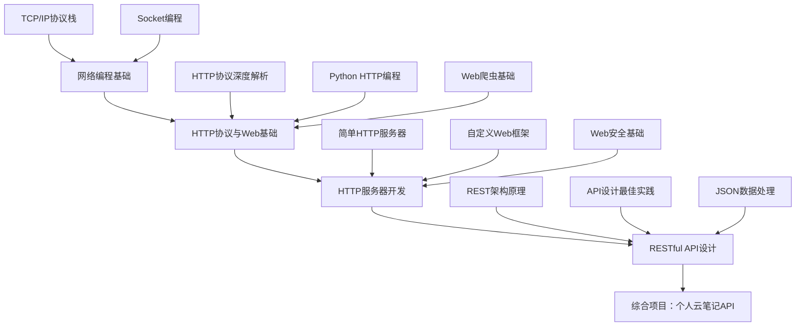

# 第8章：网络编程与Web开发基础

> **章节目标**：掌握Python网络编程技术，理解HTTP协议原理，能够开发Web服务器和RESTful API，为后续Web框架学习奠定坚实基础。

---

## 📚 本章学习路径



---

## 🎯 学习目标

### 知识目标
- 理解TCP/IP协议栈和HTTP协议原理
- 掌握Socket编程和网络通信机制
- 学会Web服务器开发和路由设计
- 理解RESTful API架构和设计原则

### 技能目标
- 能够编写客户端-服务器通信程序
- 能够开发HTTP服务器和Web应用
- 能够设计和实现RESTful API
- 能够处理网络安全和性能问题

### 应用目标
- 开发完整的网络应用项目
- 为学习Web框架打好基础
- 具备微服务系统的基础认知

---

## 8.1 网络编程基础 - 连接世界的桥梁

> **核心思想**：网络编程就像建立邮政系统，让不同的计算机能够互相通信。

### 8.1.1 网络协议栈理解

想象一下寄信的过程：你写好信件内容，装进信封，写上地址，投入邮箱，邮政系统负责传递。网络通信也是类似的过程：

#### 🏗️ TCP/IP四层模型

```python
"""
网络协议栈就像邮政系统的分层处理：

应用层 (Application Layer)
├── 就像写信内容：HTTP、FTP、SMTP等协议
├── 专注于数据的意义和格式
└── 例子：浏览器发送HTTP请求

传输层 (Transport Layer)  
├── 就像邮件服务：TCP、UDP协议
├── 负责数据的可靠传输和错误恢复
└── 例子：TCP保证数据完整性

网络层 (Network Layer)
├── 就像邮政路由：IP协议
├── 负责寻找最佳传输路径
└── 例子：路由器转发数据包

数据链路层 (Data Link Layer)
├── 就像具体运输：以太网、WiFi
├── 负责物理网络上的数据传输
└── 例子：网卡发送电信号
"""

# 网络地址的层次结构
class NetworkAddress:
    """网络地址就像邮政地址的层次结构"""
    
    def __init__(self, ip: str, port: int):
        self.ip = ip        # IP地址 = 城市地址
        self.port = port    # 端口号 = 具体门牌号
    
    def __str__(self):
        return f"{self.ip}:{self.port}"
    
    @classmethod
    def parse(cls, address_str: str):
        """解析地址字符串"""
        ip, port = address_str.split(':')
        return cls(ip, int(port))

# 示例：不同层级的地址
localhost = NetworkAddress("127.0.0.1", 8080)
web_server = NetworkAddress("192.168.1.100", 80)
database = NetworkAddress("10.0.0.50", 3306)

print(f"本地服务器: {localhost}")
print(f"Web服务器: {web_server}")
print(f"数据库服务器: {database}")
```

#### 🔌 Socket概念 - 网络编程的"插座"

Socket就像电器插座，提供了标准化的连接接口：

```python
import socket
import threading
import time
from typing import Optional

class NetworkSocket:
    """网络Socket的面向对象封装"""
    
    def __init__(self, socket_type: str = "TCP"):
        """
        初始化Socket
        socket_type: "TCP" 或 "UDP"
        """
        if socket_type == "TCP":
            # TCP就像打电话：建立连接后双方持续对话
            self.socket = socket.socket(socket.AF_INET, socket.SOCK_STREAM)
        else:
            # UDP就像发短信：发送后不管对方是否收到
            self.socket = socket.socket(socket.AF_INET, socket.SOCK_DGRAM)
        
        self.socket_type = socket_type
        self.is_connected = False
    
    def connect(self, host: str, port: int) -> bool:
        """连接到远程主机"""
        try:
            print(f"📞 正在连接到 {host}:{port}...")
            self.socket.connect((host, port))
            self.is_connected = True
            print(f"✅ 连接成功！")
            return True
        except Exception as e:
            print(f"❌ 连接失败: {e}")
            return False
    
    def send_message(self, message: str) -> bool:
        """发送消息"""
        try:
            if self.socket_type == "TCP":
                self.socket.send(message.encode('utf-8'))
            print(f"📤 发送消息: {message}")
            return True
        except Exception as e:
            print(f"❌ 发送失败: {e}")
            return False
    
    def receive_message(self, buffer_size: int = 1024) -> Optional[str]:
        """接收消息"""
        try:
            if self.socket_type == "TCP":
                data = self.socket.recv(buffer_size)
                message = data.decode('utf-8')
                print(f"📥 收到消息: {message}")
                return message
        except Exception as e:
            print(f"❌ 接收失败: {e}")
            return None
    
    def close(self):
        """关闭连接"""
        if self.is_connected:
            self.socket.close()
            self.is_connected = False
            print("🔌 连接已关闭")

# 示例：Socket使用演示
def socket_demo():
    """Socket基础使用演示"""
    print("=== Socket编程演示 ===")
    
    # 创建TCP Socket
    client_socket = NetworkSocket("TCP")
    
    print("客户端Socket已创建")
    print("Socket类型:", client_socket.socket_type)
    print("连接状态:", client_socket.is_connected)

# 运行演示
socket_demo()
```

### 8.1.2 TCP Socket编程实战

让我们实现一个完整的TCP客户端-服务器通信系统：

#### 🖥️ TCP服务器实现

```python
import socket
import threading
import time
from datetime import datetime

class TCPServer:
    """TCP服务器 - 就像客服中心接听电话"""
    
    def __init__(self, host: str = "localhost", port: int = 8888):
        self.host = host
        self.port = port
        self.socket = socket.socket(socket.AF_INET, socket.SOCK_STREAM)
        # 设置端口复用，避免"地址已被使用"错误
        self.socket.setsockopt(socket.SOL_SOCKET, socket.SO_REUSEADDR, 1)
        self.clients = {}  # 存储连接的客户端
        self.is_running = False
    
    def start(self):
        """启动服务器"""
        try:
            # 绑定地址和端口（就像客服中心占用电话号码）
            self.socket.bind((self.host, self.port))
            # 开始监听连接（就像客服中心开始接听电话）
            self.socket.listen(5)  # 最多5个等待连接
            self.is_running = True
            
            print(f"🚀 TCP服务器启动成功！")
            print(f"📍 监听地址: {self.host}:{self.port}")
            print(f"⏰ 启动时间: {datetime.now().strftime('%Y-%m-%d %H:%M:%S')}")
            print("-" * 50)
            
            # 持续接受新连接
            while self.is_running:
                try:
                    client_socket, client_address = self.socket.accept()
                    print(f"🔗 新客户端连接: {client_address}")
                    
                    # 为每个客户端创建独立的处理线程
                    client_thread = threading.Thread(
                        target=self.handle_client,
                        args=(client_socket, client_address)
                    )
                    client_thread.daemon = True  # 守护线程
                    client_thread.start()
                    
                except Exception as e:
                    if self.is_running:
                        print(f"❌ 接受连接时出错: {e}")
        
        except Exception as e:
            print(f"❌ 服务器启动失败: {e}")
        finally:
            self.socket.close()
    
    def handle_client(self, client_socket: socket.socket, client_address: tuple):
        """处理单个客户端的通信"""
        client_id = f"{client_address[0]}:{client_address[1]}"
        self.clients[client_id] = client_socket
        
        try:
            # 发送欢迎消息
            welcome_msg = f"欢迎连接到TCP服务器！你的地址是: {client_address}"
            client_socket.send(welcome_msg.encode('utf-8'))
            
            while self.is_running:
                # 接收客户端消息
                data = client_socket.recv(1024)
                if not data:
                    break
                
                message = data.decode('utf-8')
                timestamp = datetime.now().strftime('%H:%M:%S')
                print(f"📨 [{timestamp}] {client_id}: {message}")
                
                # 处理特殊命令
                if message.lower() == 'quit':
                    break
                elif message.lower() == 'time':
                    response = f"服务器时间: {datetime.now().strftime('%Y-%m-%d %H:%M:%S')}"
                elif message.lower() == 'clients':
                    response = f"当前连接客户端数量: {len(self.clients)}"
                else:
                    # 回显消息
                    response = f"服务器收到: {message}"
                
                # 发送响应
                client_socket.send(response.encode('utf-8'))
        
        except Exception as e:
            print(f"❌ 处理客户端 {client_id} 时出错: {e}")
        
        finally:
            # 清理连接
            client_socket.close()
            if client_id in self.clients:
                del self.clients[client_id]
            print(f"🔌 客户端 {client_id} 已断开连接")
    
    def stop(self):
        """停止服务器"""
        self.is_running = False
        for client_socket in self.clients.values():
            client_socket.close()
        self.socket.close()
        print("🛑 服务器已停止")

# TCP客户端实现
class TCPClient:
    """TCP客户端 - 就像拨打客服电话"""
    
    def __init__(self):
        self.socket = None
        self.is_connected = False
    
    def connect(self, host: str = "localhost", port: int = 8888) -> bool:
        """连接到服务器"""
        try:
            self.socket = socket.socket(socket.AF_INET, socket.SOCK_STREAM)
            self.socket.connect((host, port))
            self.is_connected = True
            
            print(f"📞 成功连接到服务器 {host}:{port}")
            
            # 接收欢迎消息
            welcome_msg = self.socket.recv(1024).decode('utf-8')
            print(f"📨 服务器消息: {welcome_msg}")
            
            return True
        
        except Exception as e:
            print(f"❌ 连接失败: {e}")
            return False
    
    def send_message(self, message: str) -> str:
        """发送消息并接收响应"""
        if not self.is_connected:
            return "错误：未连接到服务器"
        
        try:
            # 发送消息
            self.socket.send(message.encode('utf-8'))
            print(f"📤 发送: {message}")
            
            # 接收响应
            response = self.socket.recv(1024).decode('utf-8')
            print(f"📥 响应: {response}")
            
            return response
        
        except Exception as e:
            print(f"❌ 通信错误: {e}")
            return f"错误: {e}"
    
    def interactive_mode(self):
        """交互模式"""
        if not self.is_connected:
            print("❌ 请先连接到服务器")
            return
        
        print("\n=== 进入交互模式 ===")
        print("输入 'quit' 退出，'time' 查看服务器时间，'clients' 查看连接数")
        print("-" * 30)
        
        while True:
            try:
                message = input("👤 请输入消息: ").strip()
                if not message:
                    continue
                
                response = self.send_message(message)
                
                if message.lower() == 'quit':
                    break
                    
            except KeyboardInterrupt:
                print("\n👋 用户中断，正在退出...")
                break
    
    def close(self):
        """关闭连接"""
        if self.socket:
            self.socket.close()
            self.is_connected = False
            print("🔌 连接已关闭")

# 使用示例和测试
def tcp_demo():
    """TCP通信演示"""
    print("=== TCP Socket编程演示 ===\n")
    
    # 选择运行模式
    mode = input("选择模式 (s=服务器, c=客户端): ").lower()
    
    if mode == 's':
        # 运行服务器
        server = TCPServer()
        try:
            server.start()
        except KeyboardInterrupt:
            print("\n👋 收到中断信号，正在关闭服务器...")
            server.stop()
    
    elif mode == 'c':
        # 运行客户端
        client = TCPClient()
        if client.connect():
            client.interactive_mode()
        client.close()
    
    else:
        print("❌ 无效选择")

# 如果直接运行此文件，启动演示
if __name__ == "__main__":
    tcp_demo()
```

---

## 🎯 第8.1节总结

### 📚 核心概念回顾
1. **网络协议栈**：TCP/IP四层模型，每层都有特定职责
2. **Socket编程**：网络编程的基础接口，支持TCP和UDP
3. **客户端-服务器模型**：网络应用的基本架构

### 💡 关键技能掌握
- ✅ 理解TCP/IP协议栈的层次结构
- ✅ 掌握TCP Socket编程的基本流程
- ✅ 能够实现简单的客户端-服务器通信
- ✅ 了解网络地址和端口的概念

### 🔗 生活化理解
- **网络协议栈** = 邮政系统的分层处理
- **TCP通信** = 打电话（可靠连接）
- **Socket** = 网络通信的"插座"
- **服务器** = 客服中心（接听电话）

### 📝 练习建议
1. 尝试修改TCP服务器，支持广播消息功能
2. 实现一个简单的聊天室应用
3. 添加用户认证和消息加密功能

---

## 8.2 HTTP协议与Web基础 - 万维网的语言

> **核心思想**：HTTP协议就像餐厅的点餐系统，客户（浏览器）向服务员（服务器）发出请求，服务员返回相应的服务。

### 8.2.1 HTTP协议深度解析

想象你在餐厅用餐：你看菜单（浏览网页），向服务员点餐（发送HTTP请求），服务员确认订单并上菜（返回HTTP响应）。HTTP协议就是这样一套标准化的"服务流程"。

#### 🍽️ HTTP请求响应模型

```python
"""
HTTP通信就像餐厅服务流程：

客户端（食客）    →    服务器（餐厅）
     ↓                    ↓
1. 看菜单              1. 准备菜单
2. 点餐（请求）         2. 接收订单
3. 等待上菜            3. 处理订单
4. 享用美食（响应）      4. 提供服务
"""

import urllib.request
import urllib.parse
import json
from typing import Dict, Optional, Any

class HTTPMessage:
    """HTTP消息的基础类 - 就像餐厅的订单"""
    
    def __init__(self):
        self.headers = {}  # 消息头 = 订单详情
        self.body = ""     # 消息体 = 具体内容
    
    def add_header(self, name: str, value: str):
        """添加消息头"""
        self.headers[name] = value
        print(f"📋 添加头部信息: {name} = {value}")
    
    def set_body(self, content: str):
        """设置消息体"""
        self.body = content
        print(f"📝 设置消息内容: {len(content)} 字符")

class HTTPRequest(HTTPMessage):
    """HTTP请求 - 就像客户的点餐单"""
    
    def __init__(self, method: str, url: str):
        super().__init__()
        self.method = method.upper()  # GET, POST, PUT, DELETE
        self.url = url
        self.path = ""
        self.query_params = {}
        
        # 解析URL
        self._parse_url()
    
    def _parse_url(self):
        """解析URL获取路径和参数"""
        from urllib.parse import urlparse, parse_qs
        
        parsed = urlparse(self.url)
        self.path = parsed.path
        self.query_params = parse_qs(parsed.query)
        
        print(f"🎯 请求目标: {self.method} {self.path}")
        if self.query_params:
            print(f"📊 查询参数: {self.query_params}")
    
    def add_query_param(self, name: str, value: str):
        """添加查询参数"""
        self.query_params[name] = [value]
        print(f"🔍 添加查询参数: {name} = {value}")
    
    def to_string(self) -> str:
        """转换为HTTP请求字符串"""
        # 构建查询字符串
        query_string = ""
        if self.query_params:
            params = []
            for name, values in self.query_params.items():
                for value in values:
                    params.append(f"{name}={urllib.parse.quote(str(value))}")
            query_string = "?" + "&".join(params)
        
        # 构建请求行
        request_line = f"{self.method} {self.path}{query_string} HTTP/1.1"
        
        # 构建请求头
        header_lines = []
        for name, value in self.headers.items():
            header_lines.append(f"{name}: {value}")
        
        # 组装完整请求
        request_parts = [request_line] + header_lines + ["", self.body]
        return "\n".join(request_parts)

class HTTPResponse(HTTPMessage):
    """HTTP响应 - 就像餐厅的上菜"""
    
    def __init__(self, status_code: int, reason_phrase: str = ""):
        super().__init__()
        self.status_code = status_code
        self.reason_phrase = reason_phrase or self._get_reason_phrase(status_code)
    
    def _get_reason_phrase(self, code: int) -> str:
        """根据状态码获取原因短语"""
        status_messages = {
            200: "OK", 201: "Created", 204: "No Content",
            301: "🔄 Moved Permanently", 302: "🔄 Found", 304: "🔄 Not Modified",
            400: "❌ Bad Request", 401: "❌ Unauthorized", 403: "❌ Forbidden", 404: "❌ Not Found",
            500: "💥 Internal Server Error", 502: "💥 Bad Gateway", 503: "💥 Service Unavailable"
        }
        
        return status_messages.get(code, "Unknown")
    
    def to_string(self) -> str:
        """转换为HTTP响应字符串"""
        # 状态行
        status_line = f"HTTP/1.1 {self.status_code} {self.reason_phrase}"
        
        # 响应头
        header_lines = []
        for name, value in self.headers.items():
            header_lines.append(f"{name}: {value}")
        
        # 组装完整响应
        response_parts = [status_line] + header_lines + ["", self.body]
        return "\n".join(response_parts)

# HTTP状态码详解
class HTTPStatusCode:
    """HTTP状态码 - 就像餐厅的服务状态"""
    
    @classmethod
    def explain_status(cls, code: int) -> str:
        """解释状态码含义"""
        status_map = {
            200: "✅ OK - 订单成功处理",
            201: "✅ Created - 新菜品已添加到菜单",
            204: "✅ No Content - 订单处理完成，无需返回内容",
            301: "🔄 Moved Permanently - 餐厅永久搬迁",
            302: "🔄 Found - 临时换到其他餐厅",
            304: "🔄 Not Modified - 菜单未更新，使用缓存",
            400: "❌ Bad Request - 订单格式错误",
            401: "❌ Unauthorized - 需要会员身份",
            403: "❌ Forbidden - 禁止点这道菜",
            404: "❌ Not Found - 菜单上没有这道菜",
            500: "💥 Internal Server Error - 厨房设备故障",
            502: "💥 Bad Gateway - 供应商出问题",
            503: "💥 Service Unavailable - 餐厅暂停营业"
        }
        
        return status_map.get(code, f"未知状态码: {code}")

# 演示HTTP消息构建
def http_message_demo():
    """HTTP消息构建演示"""
    print("=== HTTP消息构建演示 ===\n")
    
    # 创建HTTP请求
    print("🍽️ 模拟餐厅点餐（HTTP请求）:")
    request = HTTPRequest("GET", "https://restaurant.com/menu?category=main&spicy=true")
    request.add_header("Host", "restaurant.com")
    request.add_header("User-Agent", "Hungry-Customer/1.0")
    request.add_header("Accept", "application/json")
    
    print("\n📋 完整HTTP请求:")
    print(request.to_string())
    
    # 创建HTTP响应
    print("\n" + "="*50)
    print("🍜 模拟餐厅上菜（HTTP响应）:")
    response = HTTPResponse(200)
    response.add_header("Content-Type", "application/json")
    response.add_header("Server", "Restaurant-Server/2.0")
    response.set_body('{"dishes": ["宫保鸡丁", "麻婆豆腐"], "status": "available"}')
    
    print("\n📦 完整HTTP响应:")
    print(response.to_string())
    
    # 状态码演示
    print("\n" + "="*50)
    print("📊 HTTP状态码解释:")
    test_codes = [200, 404, 500, 302]
    for code in test_codes:
        print(f"{code}: {HTTPStatusCode.explain_status(code)}")

# 运行演示
if __name__ == "__main__":
    http_message_demo()
```

### 8.2.2 Python HTTP编程

#### 🐍 使用urllib库 - Python的内置HTTP工具

```python
import urllib.request
import urllib.parse
import urllib.error
import json
from typing import Dict, Any, Optional

class SimpleHTTPClient:
    """简单的HTTP客户端 - 就像一个会点餐的机器人"""
    
    def __init__(self, timeout: int = 10):
        self.timeout = timeout
        self.session_headers = {
            "User-Agent": "Python-HTTP-Client/1.0"
        }
    
    def get(self, url: str, params: Dict[str, Any] = None) -> Dict[str, Any]:
        """发送GET请求 - 就像查看菜单"""
        try:
            # 构建查询参数
            if params:
                query_string = urllib.parse.urlencode(params)
                url = f"{url}?{query_string}"
            
            print(f"🔍 发送GET请求: {url}")
            
            # 创建请求对象
            request = urllib.request.Request(url)
            for name, value in self.session_headers.items():
                request.add_header(name, value)
            
            # 发送请求
            with urllib.request.urlopen(request, timeout=self.timeout) as response:
                # 读取响应
                status_code = response.getcode()
                headers = dict(response.headers)
                content = response.read().decode('utf-8')
                
                print(f"✅ 响应状态: {status_code}")
                print(f"📦 响应大小: {len(content)} 字符")
                
                return {
                    "status_code": status_code,
                    "headers": headers,
                    "content": content,
                    "json": self._try_parse_json(content)
                }
        
        except urllib.error.HTTPError as e:
            print(f"❌ HTTP错误: {e.code} {e.reason}")
            return {
                "status_code": e.code,
                "error": f"HTTP {e.code}: {e.reason}",
                "content": ""
            }
        except urllib.error.URLError as e:
            print(f"❌ URL错误: {e.reason}")
            return {
                "error": f"URL错误: {e.reason}",
                "content": ""
            }
        except Exception as e:
            print(f"❌ 请求失败: {e}")
            return {
                "error": str(e),
                "content": ""
            }
    
    def post(self, url: str, data: Dict[str, Any] = None, json_data: Dict[str, Any] = None) -> Dict[str, Any]:
        """发送POST请求 - 就像提交订单"""
        try:
            print(f"📤 发送POST请求: {url}")
            
            # 准备请求数据
            request_data = None
            content_type = "application/x-www-form-urlencoded"
            
            if json_data:
                # JSON数据
                request_data = json.dumps(json_data).encode('utf-8')
                content_type = "application/json"
                print(f"📝 JSON数据: {json_data}")
            elif data:
                # 表单数据
                request_data = urllib.parse.urlencode(data).encode('utf-8')
                print(f"📝 表单数据: {data}")
            
            # 创建请求对象
            request = urllib.request.Request(url, data=request_data, method='POST')
            request.add_header('Content-Type', content_type)
            
            for name, value in self.session_headers.items():
                request.add_header(name, value)
            
            # 发送请求
            with urllib.request.urlopen(request, timeout=self.timeout) as response:
                status_code = response.getcode()
                headers = dict(response.headers)
                content = response.read().decode('utf-8')
                
                print(f"✅ 响应状态: {status_code}")
                
                return {
                    "status_code": status_code,
                    "headers": headers,
                    "content": content,
                    "json": self._try_parse_json(content)
                }
        
        except Exception as e:
            print(f"❌ POST请求失败: {e}")
            return {
                "error": str(e),
                "content": ""
            }
    
    def _try_parse_json(self, content: str) -> Optional[Dict[str, Any]]:
        """尝试解析JSON响应"""
        try:
            return json.loads(content)
        except:
            return None
    
    def add_header(self, name: str, value: str):
        """添加会话头部"""
        self.session_headers[name] = value
        print(f"📋 添加会话头部: {name} = {value}")

# HTTP客户端使用示例
def http_client_demo():
    """HTTP客户端使用演示"""
    print("=== HTTP客户端编程演示 ===\n")
    
    # 使用简单客户端
    print("🤖 简单HTTP客户端演示:")
    client = SimpleHTTPClient()
    
    # 模拟API调用
    print("\n1. GET请求演示:")
    response = client.get("https://httpbin.org/get", {
        "name": "张三",
        "age": "25"
    })
    
    print("\n2. POST请求演示:")
    response = client.post("https://httpbin.org/post", json_data={
        "username": "testuser",
        "message": "Hello from Python!"
    })
    
    print("HTTP客户端代码已准备就绪！")

if __name__ == "__main__":
    http_client_demo()
```

### 8.2.3 Web爬虫基础

#### 🕷️ 网页内容抓取 - 像蜘蛛一样爬取信息

```python
import urllib.request
import urllib.parse
import re
import time
import random
from typing import List, Dict, Any
from html.parser import HTMLParser

class SimpleWebScraper:
    """简单的网页爬虫 - 就像一个自动化的信息收集员"""
    
    def __init__(self, delay: float = 1.0):
        self.delay = delay  # 请求间隔，避免给服务器造成压力
        self.session_headers = {
            "User-Agent": "Mozilla/5.0 (Windows NT 10.0; Win64; x64) AppleWebKit/537.36"
        }
    
    def fetch_page(self, url: str) -> Dict[str, Any]:
        """获取网页内容"""
        try:
            print(f"🕷️ 正在爬取: {url}")
            
            # 创建请求
            request = urllib.request.Request(url)
            for name, value in self.session_headers.items():
                request.add_header(name, value)
            
            # 发送请求
            with urllib.request.urlopen(request, timeout=10) as response:
                content = response.read().decode('utf-8', errors='ignore')
                
                print(f"✅ 成功获取 {len(content)} 字符")
                
                return {
                    "url": url,
                    "content": content,
                    "status": "success"
                }
        
        except Exception as e:
            print(f"❌ 爬取失败: {e}")
            return {
                "url": url,
                "content": "",
                "status": "failed",
                "error": str(e)
            }
    
    def extract_links(self, html_content: str, base_url: str = "") -> List[str]:
        """提取网页中的链接"""
        link_pattern = r'<a[^>]+href=["\']([^"\']+)["\'][^>]*>'
        links = re.findall(link_pattern, html_content, re.IGNORECASE)
        
        # 处理相对链接
        absolute_links = []
        for link in links:
            if link.startswith('http'):
                absolute_links.append(link)
            elif base_url and link.startswith('/'):
                absolute_links.append(base_url.rstrip('/') + link)
        
        print(f"🔗 找到 {len(absolute_links)} 个链接")
        return absolute_links
    
    def extract_text(self, html_content: str) -> str:
        """提取网页纯文本内容"""
        # 移除脚本和样式
        clean_content = re.sub(r'<script[^>]*>.*?</script>', '', html_content, flags=re.DOTALL | re.IGNORECASE)
        clean_content = re.sub(r'<style[^>]*>.*?</style>', '', clean_content, flags=re.DOTALL | re.IGNORECASE)
        
        # 移除HTML标签
        text_content = re.sub(r'<[^>]+>', '', clean_content)
        
        # 清理空白字符
        text_content = re.sub(r'\s+', ' ', text_content).strip()
        
        print(f"📝 提取文本 {len(text_content)} 字符")
        return text_content
    
    def _extract_title(self, html_content: str) -> str:
        """提取网页标题"""
        title_match = re.search(r'<title[^>]*>(.*?)</title>', html_content, re.IGNORECASE | re.DOTALL)
        if title_match:
            return title_match.group(1).strip()
        return "无标题"

# 反爬虫技术应对
class AdvancedWebScraper(SimpleWebScraper):
    """高级网页爬虫 - 具备反爬虫应对能力"""
    
    def __init__(self, delay: float = 2.0):
        super().__init__(delay)
        self.user_agents = [
            "Mozilla/5.0 (Windows NT 10.0; Win64; x64) AppleWebKit/537.36",
            "Mozilla/5.0 (Macintosh; Intel Mac OS X 10_15_7) AppleWebKit/537.36",
            "Mozilla/5.0 (X11; Linux x86_64) AppleWebKit/537.36"
        ]
        self.session_cookies = {}
    
    def fetch_page(self, url: str) -> Dict[str, Any]:
        """带反爬虫应对的页面获取"""
        try:
            print(f"🕷️ 智能爬取: {url}")
            
            # 随机选择User-Agent
            user_agent = random.choice(self.user_agents)
            
            # 创建请求
            request = urllib.request.Request(url)
            request.add_header('User-Agent', user_agent)
            request.add_header('Accept', 'text/html,application/xhtml+xml,application/xml;q=0.9,*/*;q=0.8')
            request.add_header('Accept-Language', 'zh-CN,zh;q=0.8,en-US;q=0.5,en;q=0.3')
            request.add_header('Accept-Encoding', 'gzip, deflate')
            request.add_header('Connection', 'keep-alive')
            
            # 添加Cookie
            if self.session_cookies:
                cookie_string = '; '.join([f"{k}={v}" for k, v in self.session_cookies.items()])
                request.add_header('Cookie', cookie_string)
            
            # 随机延迟
            delay_time = self.delay + random.uniform(0, 1.0)
            time.sleep(delay_time)
            
            # 发送请求
            with urllib.request.urlopen(request, timeout=15) as response:
                # 处理Cookie
                set_cookie = response.headers.get('Set-Cookie')
                if set_cookie:
                    self._update_cookies(set_cookie)
                
                content = response.read()
                
                # 处理gzip压缩
                if response.headers.get('Content-Encoding') == 'gzip':
                    import gzip
                    content = gzip.decompress(content)
                
                content = content.decode('utf-8', errors='ignore')
                
                print(f"✅ 智能获取成功 {len(content)} 字符")
                
                return {
                    "url": url,
                    "content": content,
                    "status": "success"
                }
        
        except Exception as e:
            print(f"❌ 智能爬取失败: {e}")
            return {
                "url": url,
                "content": "",
                "status": "failed",
                "error": str(e)
            }
    
    def _update_cookies(self, set_cookie: str):
        """更新Cookie"""
        for cookie_part in set_cookie.split(','):
            if '=' in cookie_part:
                name, value = cookie_part.split('=', 1)
                self.session_cookies[name.strip()] = value.split(';')[0].strip()

# 爬虫使用示例
def web_scraper_demo():
    """网页爬虫演示"""
    print("=== 网页爬虫演示 ===\n")
    
    # 简单爬虫演示
    print("🕷️ 简单爬虫演示:")
    simple_scraper = SimpleWebScraper(delay=0.5)
    
    # 爬取示例网站
    test_url = "https://httpbin.org/html"
    page_data = simple_scraper.fetch_page(test_url)
    
    if page_data["status"] == "success":
        text_content = simple_scraper.extract_text(page_data["content"])
        links = simple_scraper.extract_links(page_data["content"])
        
        print(f"📄 页面内容预览: {text_content[:200]}...")
        print(f"🔗 找到链接数量: {len(links)}")
    
    print("\n" + "="*50)
    print("🤖 高级爬虫演示:")
    
    advanced_scraper = AdvancedWebScraper(delay=1.0)
    
    # 演示反爬虫技术
    print("🛡️ 使用反爬虫技术:")
    print("- 随机User-Agent")
    print("- 智能延迟")
    print("- Cookie管理")
    print("- 请求头伪装")
    
    print("\n网页爬虫代码已准备就绪！")

if __name__ == "__main__":
    web_scraper_demo()
```

---

## 🎯 第8.2节总结

### 📚 核心概念回顾
1. **HTTP协议**：基于请求-响应模型的应用层协议
2. **状态码系统**：用数字表示请求处理结果的标准
3. **头部字段**：HTTP消息的元数据信息
4. **Web爬虫**：自动化的网页信息收集工具

### 💡 关键技能掌握
- ✅ 理解HTTP请求响应的完整流程
- ✅ 掌握Python urllib库的使用方法
- ✅ 能够解析和构建HTTP消息
- ✅ 具备基础的网页爬虫开发能力

### 🔗 生活化理解
- **HTTP协议** = 餐厅的点餐系统
- **状态码** = 餐厅的服务状态反馈
- **请求头** = 订单的详细说明
- **Web爬虫** = 自动化的信息收集员

### 📝 练习建议
1. 实现一个新闻网站的内容爬虫
2. 开发一个API状态监控工具
3. 创建一个简单的HTTP压力测试工具

---

## 8.3 HTTP服务器开发 - 从客户端到服务端的转变

> **核心思想**：HTTP服务器就像餐厅的后厨系统，负责接收订单、处理请求、准备菜品并及时送达。

### 8.3.1 简单HTTP服务器实现

让我们从最基础的HTTP服务器开始，理解Web服务器的工作原理：

#### 🏗️ 基础HTTP服务器架构

```python
import socket
import threading
import json
import urllib.parse
from datetime import datetime
from typing import Dict, List, Callable, Any, Optional
import os
import mimetypes

class SimpleHTTPServer:
    """
    简单HTTP服务器实现
    就像一个基础餐厅：能接单、做菜、上菜
    """
    
    def __init__(self, host: str = "localhost", port: int = 8080):
        self.host = host
        self.port = port
        self.server_socket = None
        self.is_running = False
        self.routes = {}  # 路由表 = 菜单
        self.middleware = []  # 中间件 = 服务流程
        
        # 注册默认路由
        self._register_default_routes()
    
    def _register_default_routes(self):
        """注册默认路由"""
        self.routes['/'] = self._handle_home
        self.routes['/status'] = self._handle_status
        self.routes['/hello'] = self._handle_hello
    
    def start(self):
        """启动服务器 - 开始营业"""
        try:
            # 创建服务器Socket
            self.server_socket = socket.socket(socket.AF_INET, socket.SOCK_STREAM)
            self.server_socket.setsockopt(socket.SOL_SOCKET, socket.SO_REUSEADDR, 1)
            
            # 绑定地址和端口
            self.server_socket.bind((self.host, self.port))
            self.server_socket.listen(5)
            
            self.is_running = True
            print(f"🍽️ HTTP服务器已启动")
            print(f"📍 地址: http://{self.host}:{self.port}")
            print(f"⏰ 启动时间: {datetime.now().strftime('%Y-%m-%d %H:%M:%S')}")
            print("🔄 等待客户端连接...")
            
            # 主服务循环
            while self.is_running:
                try:
                    # 接受客户端连接
                    client_socket, client_address = self.server_socket.accept()
                    print(f"👤 新客户连接: {client_address}")
                    
                    # 为每个客户端创建线程
                    client_thread = threading.Thread(
                        target=self._handle_client,
                        args=(client_socket, client_address)
                    )
                    client_thread.daemon = True
                    client_thread.start()
                    
                except Exception as e:
                    if self.is_running:
                        print(f"❌ 接受连接时出错: {e}")
        
        except Exception as e:
            print(f"❌ 服务器启动失败: {e}")
        finally:
            self.stop()
    
    def stop(self):
        """停止服务器 - 停止营业"""
        self.is_running = False
        if self.server_socket:
            self.server_socket.close()
        print("🔚 HTTP服务器已停止")
    
    def _handle_client(self, client_socket: socket.socket, client_address: tuple):
        """处理客户端请求 - 服务一位客人"""
        try:
            # 接收HTTP请求
            request_data = client_socket.recv(4096).decode('utf-8')
            
            if not request_data:
                return
            
            # 解析HTTP请求
            request = self._parse_request(request_data)
            print(f"📨 收到请求: {request['method']} {request['path']}")
            
            # 应用中间件
            for middleware in self.middleware:
                request = middleware(request)
                if request.get('_stop_processing'):
                    break
            
            # 路由处理
            response = self._route_request(request)
            
            # 发送HTTP响应
            self._send_response(client_socket, response)
            
        except Exception as e:
            print(f"❌ 处理客户端请求时出错: {e}")
            # 发送500错误响应
            error_response = {
                'status_code': 500,
                'headers': {'Content-Type': 'text/plain; charset=utf-8'},
                'body': f'Internal Server Error: {str(e)}'
            }
            self._send_response(client_socket, error_response)
        finally:
            client_socket.close()
    
    def _parse_request(self, request_data: str) -> Dict[str, Any]:
        """解析HTTP请求 - 理解客人的订单"""
        lines = request_data.split('\r\n')
        
        # 解析请求行
        request_line = lines[0]
        method, path, version = request_line.split(' ')
        
        # 解析查询参数
        if '?' in path:
            path, query_string = path.split('?', 1)
            query_params = urllib.parse.parse_qs(query_string)
        else:
            query_params = {}
        
        # 解析请求头
        headers = {}
        body = ""
        
        i = 1
        while i < len(lines) and lines[i]:
            header_line = lines[i]
            if ':' in header_line:
                key, value = header_line.split(':', 1)
                headers[key.strip()] = value.strip()
            i += 1
        
        # 解析请求体
        if i + 1 < len(lines):
            body = '\r\n'.join(lines[i + 1:])
        
        return {
            'method': method,
            'path': path,
            'version': version,
            'headers': headers,
            'query_params': query_params,
            'body': body,
            'client_info': {
                'user_agent': headers.get('User-Agent', 'Unknown'),
                'accept': headers.get('Accept', '*/*')
            }
        }
    
    def _route_request(self, request: Dict[str, Any]) -> Dict[str, Any]:
        """路由请求到处理函数 - 根据菜单找到对应的厨师"""
        path = request['path']
        
        # 查找精确匹配的路由
        if path in self.routes:
            handler = self.routes[path]
            return handler(request)
        
        # 查找静态文件
        if path.startswith('/static/'):
            return self._handle_static_file(request)
        
        # 404 Not Found
        return {
            'status_code': 404,
            'headers': {'Content-Type': 'text/html; charset=utf-8'},
            'body': self._generate_404_page(path)
        }
    
    def _send_response(self, client_socket: socket.socket, response: Dict[str, Any]):
        """发送HTTP响应 - 上菜"""
        status_code = response.get('status_code', 200)
        status_text = self._get_status_text(status_code)
        headers = response.get('headers', {})
        body = response.get('body', '')
        
        # 确保body是字节类型
        if isinstance(body, str):
            body = body.encode('utf-8')
            if 'Content-Type' not in headers:
                headers['Content-Type'] = 'text/html; charset=utf-8'
        
        # 设置Content-Length
        headers['Content-Length'] = str(len(body))
        headers['Server'] = 'SimpleHTTPServer/1.0'
        headers['Date'] = datetime.now().strftime('%a, %d %b %Y %H:%M:%S GMT')
        
        # 构建响应
        response_line = f"HTTP/1.1 {status_code} {status_text}\r\n"
        header_lines = '\r\n'.join([f"{k}: {v}" for k, v in headers.items()])
        
        full_response = f"{response_line}{header_lines}\r\n\r\n".encode('utf-8') + body
        
        # 发送响应
        client_socket.send(full_response)
        print(f"📤 响应发送: {status_code} {status_text}")
    
    def _get_status_text(self, status_code: int) -> str:
        """获取状态码对应的文本"""
        status_texts = {
            200: 'OK',
            201: 'Created',
            400: 'Bad Request',
            401: 'Unauthorized',
            403: 'Forbidden',
            404: 'Not Found',
            405: 'Method Not Allowed',
            500: 'Internal Server Error'
        }
        return status_texts.get(status_code, 'Unknown')
    
    # 默认路由处理函数
    def _handle_home(self, request: Dict[str, Any]) -> Dict[str, Any]:
        """处理首页请求"""
        html_content = """
        <!DOCTYPE html>
        <html>
        <head>
            <title>Simple HTTP Server</title>
            <meta charset="utf-8">
            <style>
                body { font-family: Arial, sans-serif; margin: 40px; }
                .container { max-width: 800px; margin: 0 auto; }
                .header { text-align: center; color: #333; }
                .info { background: #f0f0f0; padding: 20px; border-radius: 5px; }
                .routes { margin-top: 20px; }
                .route { margin: 10px 0; padding: 10px; background: #e8f4f8; border-radius: 3px; }
            </style>
        </head>
        <body>
            <div class="container">
                <h1 class="header">🍽️ Simple HTTP Server</h1>
                <div class="info">
                    <h2>服务器信息</h2>
                    <p><strong>启动时间:</strong> {start_time}</p>
                    <p><strong>服务地址:</strong> http://{host}:{port}</p>
                    <p><strong>当前时间:</strong> {current_time}</p>
                </div>
                <div class="routes">
                    <h2>可用路由</h2>
                    <div class="route"><strong>GET /</strong> - 首页</div>
                    <div class="route"><strong>GET /status</strong> - 服务器状态</div>
                    <div class="route"><strong>GET /hello</strong> - 问候页面</div>
                </div>
            </div>
        </body>
        </html>
        """.format(
            start_time=datetime.now().strftime('%Y-%m-%d %H:%M:%S'),
            host=self.host,
            port=self.port,
            current_time=datetime.now().strftime('%Y-%m-%d %H:%M:%S')
        )
        
        return {
            'status_code': 200,
            'headers': {'Content-Type': 'text/html; charset=utf-8'},
            'body': html_content
        }
    
    def _handle_status(self, request: Dict[str, Any]) -> Dict[str, Any]:
        """处理状态查询请求"""
        status_info = {
            'server': 'SimpleHTTPServer',
            'version': '1.0',
            'status': 'running',
            'uptime': 'calculating...',
            'routes_count': len(self.routes),
            'current_time': datetime.now().isoformat()
        }
        
        return {
            'status_code': 200,
            'headers': {'Content-Type': 'application/json; charset=utf-8'},
            'body': json.dumps(status_info, ensure_ascii=False, indent=2)
        }
    
    def _handle_hello(self, request: Dict[str, Any]) -> Dict[str, Any]:
        """处理问候请求"""
        name = request['query_params'].get('name', ['World'])[0]
        user_agent = request['client_info']['user_agent']
        
        html_content = f"""
        <!DOCTYPE html>
        <html>
        <head>
            <title>Hello {name}</title>
            <meta charset="utf-8">
            <style>
                body {{ font-family: Arial, sans-serif; text-align: center; margin: 50px; }}
                .greeting {{ font-size: 2em; color: #2c3e50; margin: 20px 0; }}
                .info {{ color: #7f8c8d; margin-top: 30px; }}
            </style>
        </head>
        <body>
            <h1>🌟 Simple HTTP Server</h1>
            <div class="greeting">Hello, {name}!</div>
            <div class="info">
                <p>你正在使用: {user_agent}</p>
                <p>访问时间: {datetime.now().strftime('%Y-%m-%d %H:%M:%S')}</p>
            </div>
        </body>
        </html>
        """
        
        return {
            'status_code': 200,
            'headers': {'Content-Type': 'text/html; charset=utf-8'},
            'body': html_content
        }
    
    def _handle_static_file(self, request: Dict[str, Any]) -> Dict[str, Any]:
        """处理静态文件请求"""
        file_path = request['path'][1:]  # 移除开头的 '/'
        
        if os.path.exists(file_path) and os.path.isfile(file_path):
            # 获取文件MIME类型
            content_type, _ = mimetypes.guess_type(file_path)
            if content_type is None:
                content_type = 'application/octet-stream'
            
            # 读取文件内容
            with open(file_path, 'rb') as f:
                file_content = f.read()
            
            return {
                'status_code': 200,
                'headers': {'Content-Type': content_type},
                'body': file_content
            }
        else:
            return {
                'status_code': 404,
                'headers': {'Content-Type': 'text/html; charset=utf-8'},
                'body': self._generate_404_page(request['path'])
            }
    
    def _generate_404_page(self, path: str) -> str:
        """生成404错误页面"""
        return f"""
        <!DOCTYPE html>
        <html>
        <head>
            <title>404 Not Found</title>
            <meta charset="utf-8">
            <style>
                body {{ font-family: Arial, sans-serif; text-align: center; margin: 50px; }}
                .error {{ font-size: 1.5em; color: #e74c3c; }}
                .back {{ margin-top: 20px; }}
                a {{ color: #3498db; text-decoration: none; }}
            </style>
        </head>
        <body>
            <h1>❌ 404 Not Found</h1>
            <div class="error">找不到页面: {path}</div>
            <div class="back">
                <a href="/">返回首页</a>
            </div>
        </body>
        </html>
        """
    
    def add_route(self, path: str, handler: Callable):
        """添加自定义路由 - 增加新菜品"""
        self.routes[path] = handler
        print(f"🛤️ 添加路由: {path}")
    
    def add_middleware(self, middleware: Callable):
        """添加中间件 - 增加服务流程"""
        self.middleware.append(middleware)
        print(f"🔧 添加中间件: {middleware.__name__}")

# 服务器使用示例
def simple_server_demo():
    """简单HTTP服务器演示"""
    print("=== 简单HTTP服务器演示 ===\n")
    
    # 创建服务器实例
    server = SimpleHTTPServer(host="localhost", port=8080)
    
    # 添加自定义路由
    def handle_api(request):
        """API接口处理"""
        return {
            'status_code': 200,
            'headers': {'Content-Type': 'application/json; charset=utf-8'},
            'body': json.dumps({
                'message': 'Hello from API',
                'method': request['method'],
                'path': request['path'],
                'timestamp': datetime.now().isoformat()
            }, ensure_ascii=False, indent=2)
        }
    
    server.add_route('/api', handle_api)
    
    # 添加中间件
    def logging_middleware(request):
        """日志中间件"""
        print(f"📝 请求日志: {request['method']} {request['path']} - {request['client_info']['user_agent']}")
        return request
    
    server.add_middleware(logging_middleware)
    
    print("🚀 服务器配置完成，准备启动...")
    print("📌 访问地址:")
    print("   - http://localhost:8080/")
    print("   - http://localhost:8080/status")
    print("   - http://localhost:8080/hello?name=张三")
    print("   - http://localhost:8080/api")
    print("\n按 Ctrl+C 停止服务器")
    
    try:
        # 启动服务器
        server.start()
    except KeyboardInterrupt:
        print("\n⏹️ 用户中断服务器运行")
        server.stop()

if __name__ == "__main__":
    simple_server_demo()
```

### 8.3.2 Web框架设计 - 构建现代化的餐厅管理系统

在基础HTTP服务器的基础上，我们来设计一个更加完善的Web框架：

#### 🎯 路由系统设计

```python
import re
from typing import Dict, List, Callable, Any, Optional, Union
from functools import wraps
import inspect

class Route:
    """路由对象 - 单个菜品的详细信息"""
    
    def __init__(self, pattern: str, handler: Callable, methods: List[str] = None):
        self.pattern = pattern
        self.handler = handler
        self.methods = methods or ['GET']
        self.regex = self._compile_pattern(pattern)
        self.param_names = self._extract_param_names(pattern)
    
    def _compile_pattern(self, pattern: str) -> re.Pattern:
        """编译路由模式为正则表达式"""
        # 将 /user/{id} 转换为 /user/(?P<id>[^/]+)
        regex_pattern = pattern
        regex_pattern = re.sub(r'\{(\w+)\}', r'(?P<\1>[^/]+)', regex_pattern)
        regex_pattern = f"^{regex_pattern}$"
        return re.compile(regex_pattern)
    
    def _extract_param_names(self, pattern: str) -> List[str]:
        """提取路径参数名称"""
        return re.findall(r'\{(\w+)\}', pattern)
    
    def match(self, path: str, method: str) -> Optional[Dict[str, str]]:
        """匹配路径和方法"""
        if method not in self.methods:
            return None
        
        match = self.regex.match(path)
        if match:
            return match.groupdict()
        return None

class WebFramework:
    """
    现代Web框架 - 高级餐厅管理系统
    具备路由、中间件、模板等完整功能
    """
    
    def __init__(self):
        self.routes: List[Route] = []
        self.middleware: List[Callable] = []
        self.error_handlers: Dict[int, Callable] = {}
        self.template_globals = {
            'datetime': datetime,
            'len': len,
            'str': str,
            'int': int
        }
        
        # 注册默认错误处理器
        self._register_default_error_handlers()
    
    def route(self, pattern: str, methods: List[str] = None):
        """路由装饰器 - 菜单注册器"""
        def decorator(handler: Callable):
            self.add_route(pattern, handler, methods)
            return handler
        return decorator
    
    def get(self, pattern: str):
        """GET请求装饰器"""
        return self.route(pattern, ['GET'])
    
    def post(self, pattern: str):
        """POST请求装饰器"""
        return self.route(pattern, ['POST'])
    
    def put(self, pattern: str):
        """PUT请求装饰器"""
        return self.route(pattern, ['PUT'])
    
    def delete(self, pattern: str):
        """DELETE请求装饰器"""
        return self.route(pattern, ['DELETE'])
    
    def add_route(self, pattern: str, handler: Callable, methods: List[str] = None):
        """添加路由"""
        route = Route(pattern, handler, methods)
        self.routes.append(route)
        print(f"🛤️ 注册路由: {pattern} -> {handler.__name__}")
    
    def middleware(self, func: Callable):
        """中间件装饰器"""
        self.middleware.append(func)
        print(f"🔧 注册中间件: {func.__name__}")
        return func
    
    def error_handler(self, status_code: int):
        """错误处理器装饰器"""
        def decorator(handler: Callable):
            self.error_handlers[status_code] = handler
            print(f"❌ 注册错误处理器: {status_code}")
            return handler
        return decorator
    
    def handle_request(self, request: Dict[str, Any]) -> Dict[str, Any]:
        """处理HTTP请求 - 餐厅的完整服务流程"""
        try:
            # 应用中间件
            for middleware in self.middleware:
                result = middleware(request)
                if isinstance(result, dict) and result.get('_stop_processing'):
                    return result
                if result is not None:
                    request = result
            
            # 路由匹配
            path = request['path']
            method = request['method']
            
            for route in self.routes:
                params = route.match(path, method)
                if params is not None:
                    # 找到匹配的路由
                    request['path_params'] = params
                    return self._call_handler(route.handler, request)
            
            # 没有找到匹配的路由
            return self._handle_error(404, request)
        
        except Exception as e:
            print(f"❌ 处理请求时出错: {e}")
            return self._handle_error(500, request, str(e))
    
    def _call_handler(self, handler: Callable, request: Dict[str, Any]) -> Dict[str, Any]:
        """调用路由处理器"""
        # 分析处理器参数
        sig = inspect.signature(handler)
        kwargs = {}
        
        for param_name, param in sig.parameters.items():
            if param_name == 'request':
                kwargs['request'] = request
            elif param_name in request.get('path_params', {}):
                kwargs[param_name] = request['path_params'][param_name]
        
        # 调用处理器
        result = handler(**kwargs)
        
        # 处理返回值
        if isinstance(result, dict):
            return result
        elif isinstance(result, str):
            return {
                'status_code': 200,
                'headers': {'Content-Type': 'text/html; charset=utf-8'},
                'body': result
            }
        elif isinstance(result, (list, dict)):
            return {
                'status_code': 200,
                'headers': {'Content-Type': 'application/json; charset=utf-8'},
                'body': json.dumps(result, ensure_ascii=False, indent=2)
            }
        else:
            return {
                'status_code': 200,
                'headers': {'Content-Type': 'text/plain; charset=utf-8'},
                'body': str(result)
            }
    
    def _handle_error(self, status_code: int, request: Dict[str, Any], error_msg: str = "") -> Dict[str, Any]:
        """处理错误"""
        if status_code in self.error_handlers:
            return self.error_handlers[status_code](request, error_msg)
        else:
            return self._default_error_response(status_code, request['path'], error_msg)
    
    def _register_default_error_handlers(self):
        """注册默认错误处理器"""
        @self.error_handler(404)
        def handle_404(request, error_msg=""):
            return {
                'status_code': 404,
                'headers': {'Content-Type': 'text/html; charset=utf-8'},
                'body': self._generate_error_page(404, "页面未找到", f"请求的页面 {request['path']} 不存在")
            }
        
        @self.error_handler(500)
        def handle_500(request, error_msg=""):
            return {
                'status_code': 500,
                'headers': {'Content-Type': 'text/html; charset=utf-8'},
                'body': self._generate_error_page(500, "服务器内部错误", error_msg)
            }
    
    def _default_error_response(self, status_code: int, path: str, error_msg: str) -> Dict[str, Any]:
        """默认错误响应"""
        status_messages = {
            400: "请求错误",
            401: "未授权",
            403: "禁止访问",
            404: "页面未找到",
            405: "方法不允许",
            500: "服务器内部错误"
        }
        
        message = status_messages.get(status_code, "未知错误")
        
        return {
            'status_code': status_code,
            'headers': {'Content-Type': 'text/html; charset=utf-8'},
            'body': self._generate_error_page(status_code, message, error_msg)
        }
    
    def _generate_error_page(self, status_code: int, title: str, message: str) -> str:
        """生成错误页面"""
        return f"""
        <!DOCTYPE html>
        <html>
        <head>
            <title>{status_code} {title}</title>
            <meta charset="utf-8">
            <style>
                body {{ 
                    font-family: Arial, sans-serif; 
                    text-align: center; 
                    margin: 50px;
                    background: #f8f9fa;
                }}
                .error-container {{
                    max-width: 600px;
                    margin: 0 auto;
                    background: white;
                    padding: 40px;
                    border-radius: 10px;
                    box-shadow: 0 2px 10px rgba(0,0,0,0.1);
                }}
                .error-code {{ 
                    font-size: 4em; 
                    color: #e74c3c; 
                    margin: 20px 0;
                }}
                .error-title {{ 
                    font-size: 1.5em; 
                    color: #2c3e50; 
                    margin: 20px 0;
                }}
                .error-message {{ 
                    color: #7f8c8d; 
                    margin: 20px 0;
                }}
                .back-link {{ 
                    margin-top: 30px; 
                }}
                .back-link a {{ 
                    color: #3498db; 
                    text-decoration: none;
                    padding: 10px 20px;
                    border: 1px solid #3498db;
                    border-radius: 5px;
                }}
            </style>
        </head>
        <body>
            <div class="error-container">
                <div class="error-code">{status_code}</div>
                <div class="error-title">{title}</div>
                <div class="error-message">{message}</div>
                <div class="back-link">
                    <a href="/">返回首页</a>
                </div>
            </div>
        </body>
        </html>
        """
    
    def render_template(self, template: str, **context) -> str:
        """简单模板渲染"""
        # 合并全局变量和上下文
        full_context = {**self.template_globals, **context}
        
        # 简单的模板替换
        rendered = template
        for key, value in full_context.items():
            placeholder = f"{{{{{key}}}}}"
            rendered = rendered.replace(placeholder, str(value))
        
        return rendered

# 集成HTTP服务器
class AdvancedHTTPServer(SimpleHTTPServer):
    """高级HTTP服务器 - 集成Web框架"""
    
    def __init__(self, host: str = "localhost", port: int = 8080):
        super().__init__(host, port)
        self.framework = WebFramework()
        # 清空默认路由，使用框架路由
        self.routes = {}
    
    def _route_request(self, request: Dict[str, Any]) -> Dict[str, Any]:
        """使用Web框架处理路由"""
        return self.framework.handle_request(request)
    
    def route(self, pattern: str, methods: List[str] = None):
        """路由装饰器"""
        return self.framework.route(pattern, methods)
    
    def get(self, pattern: str):
        """GET路由装饰器"""
        return self.framework.get(pattern)
    
    def post(self, pattern: str):
        """POST路由装饰器"""
        return self.framework.post(pattern)
    
    def middleware(self, func: Callable):
        """中间件装饰器"""
        return self.framework.middleware(func)
    
    def error_handler(self, status_code: int):
        """错误处理器装饰器"""
        return self.framework.error_handler(status_code)

# Web框架使用示例
def web_framework_demo():
    """Web框架演示"""
    print("=== Web框架演示 ===\n")
    
    # 创建高级服务器
    app = AdvancedHTTPServer(host="localhost", port=8080)
    
    # 首页路由
    @app.get('/')
    def home(request):
        """首页"""
        template = """
        <!DOCTYPE html>
        <html>
        <head>
            <title>高级Web框架演示</title>
            <meta charset="utf-8">
            <style>
                body { font-family: Arial, sans-serif; margin: 40px; background: #f5f5f5; }
                .container { max-width: 800px; margin: 0 auto; background: white; padding: 30px; border-radius: 10px; }
                .header { text-align: center; color: #2c3e50; }
                .feature { margin: 20px 0; padding: 15px; background: #ecf0f1; border-radius: 5px; }
                .nav { margin: 20px 0; }
                .nav a { margin-right: 15px; color: #3498db; text-decoration: none; }
            </style>
        </head>
        <body>
            <div class="container">
                <h1 class="header">🚀 高级Web框架</h1>
                <div class="nav">
                    <a href="/users">用户列表</a>
                    <a href="/users/123">用户详情</a>
                    <a href="/api/data">API接口</a>
                    <a href="/about">关于我们</a>
                </div>
                <div class="feature">
                    <h3>✨ 框架特性</h3>
                    <ul>
                        <li>🛤️ 动态路由系统 (支持路径参数)</li>
                        <li>🔧 中间件支持</li>
                        <li>❌ 自定义错误处理</li>
                        <li>📝 简单模板系统</li>
                        <li>🎯 RESTful API支持</li>
                    </ul>
                </div>
            </div>
        </body>
        </html>
        """
        return template
    
    # 用户列表路由
    @app.get('/users')
    def user_list(request):
        """用户列表"""
        users = [
            {'id': 1, 'name': '张三', 'email': 'zhang@example.com'},
            {'id': 2, 'name': '李四', 'email': 'li@example.com'},
            {'id': 3, 'name': '王五', 'email': 'wang@example.com'}
        ]
        
        template = """
        <!DOCTYPE html>
        <html>
        <head>
            <title>用户列表</title>
            <meta charset="utf-8">
            <style>
                body { font-family: Arial, sans-serif; margin: 40px; }
                table { width: 100%; border-collapse: collapse; }
                th, td { padding: 10px; border: 1px solid #ddd; text-align: left; }
                th { background: #f2f2f2; }
                .back { margin: 20px 0; }
                .back a { color: #3498db; text-decoration: none; }
            </style>
        </head>
        <body>
            <h1>👥 用户列表</h1>
            <table>
                <tr><th>ID</th><th>姓名</th><th>邮箱</th><th>操作</th></tr>
        """
        
        for user in users:
            template += f"""
                <tr>
                    <td>{user['id']}</td>
                    <td>{user['name']}</td>
                    <td>{user['email']}</td>
                    <td><a href="/users/{user['id']}">查看详情</a></td>
                </tr>
            """
        
        template += """
            </table>
            <div class="back"><a href="/">返回首页</a></div>
        </body>
        </html>
        """
        return template
    
    # 用户详情路由 (带路径参数)
    @app.get('/users/{user_id}')
    def user_detail(request, user_id):
        """用户详情"""
        # 模拟用户数据
        users_db = {
            '1': {'id': 1, 'name': '张三', 'email': 'zhang@example.com', 'age': 25},
            '2': {'id': 2, 'name': '李四', 'email': 'li@example.com', 'age': 30},
            '3': {'id': 3, 'name': '王五', 'email': 'wang@example.com', 'age': 28}
        }
        
        user = users_db.get(user_id)
        if not user:
            return {
                'status_code': 404,
                'headers': {'Content-Type': 'text/html; charset=utf-8'},
                'body': '<h1>用户不存在</h1><a href="/users">返回用户列表</a>'
            }
        
        template = f"""
        <!DOCTYPE html>
        <html>
        <head>
            <title>用户详情 - {user['name']}</title>
            <meta charset="utf-8">
            <style>
                body {{ font-family: Arial, sans-serif; margin: 40px; }}
                .user-card {{ 
                    max-width: 400px; 
                    margin: 0 auto; 
                    padding: 30px; 
                    border: 1px solid #ddd; 
                    border-radius: 10px;
                    background: #f9f9f9;
                }}
                .user-info {{ margin: 15px 0; }}
                .back {{ margin: 20px 0; text-align: center; }}
                .back a {{ color: #3498db; text-decoration: none; }}
            </style>
        </head>
        <body>
            <div class="user-card">
                <h1>👤 用户详情</h1>
                <div class="user-info"><strong>ID:</strong> {user['id']}</div>
                <div class="user-info"><strong>姓名:</strong> {user['name']}</div>
                <div class="user-info"><strong>邮箱:</strong> {user['email']}</div>
                <div class="user-info"><strong>年龄:</strong> {user['age']}</div>
                <div class="back">
                    <a href="/users">返回用户列表</a> | 
                    <a href="/">返回首页</a>
                </div>
            </div>
        </body>
        </html>
        """
        return template
    
    # API接口路由
    @app.get('/api/data')
    def api_data(request):
        """API数据接口"""
        return {
            'status': 'success',
            'data': {
                'server_info': {
                    'name': 'AdvancedHTTPServer',
                    'version': '2.0',
                    'framework': 'WebFramework'
                },
                'request_info': {
                    'method': request['method'],
                    'path': request['path'],
                    'user_agent': request['client_info']['user_agent']
                },
                'timestamp': datetime.now().isoformat()
            }
        }
    
    # 关于页面
    @app.get('/about')
    def about(request):
        """关于页面"""
        return """
        <!DOCTYPE html>
        <html>
        <head>
            <title>关于我们</title>
            <meta charset="utf-8">
            <style>
                body { font-family: Arial, sans-serif; margin: 40px; text-align: center; }
                .about { max-width: 600px; margin: 0 auto; }
                .back { margin: 30px 0; }
                .back a { color: #3498db; text-decoration: none; }
            </style>
        </head>
        <body>
            <div class="about">
                <h1>🌟 关于我们</h1>
                <p>这是一个基于Python构建的高级Web框架演示。</p>
                <p>具备现代Web框架的核心功能：</p>
                <ul style="text-align: left;">
                    <li>动态路由系统</li>
                    <li>中间件支持</li>
                    <li>错误处理</li>
                    <li>模板渲染</li>
                    <li>RESTful API</li>
                </ul>
                <div class="back"><a href="/">返回首页</a></div>
            </div>
        </body>
        </html>
        """
    
    # 中间件演示
    @app.middleware
    def request_logging(request):
        """请求日志中间件"""
        print(f"📝 [{datetime.now().strftime('%H:%M:%S')}] {request['method']} {request['path']}")
        return request
    
    @app.middleware
    def security_headers(request):
        """安全头中间件"""
        # 可以在这里添加安全相关的处理
        request['_security_applied'] = True
        return request
    
    print("🚀 高级Web框架配置完成")
    print("📌 可用路由:")
    print("   - GET  /           -> 首页")
    print("   - GET  /users      -> 用户列表")
    print("   - GET  /users/{id} -> 用户详情")
    print("   - GET  /api/data   -> API接口")
    print("   - GET  /about      -> 关于页面")
    print("\n🔧 中间件:")
    print("   - request_logging  -> 请求日志")
    print("   - security_headers -> 安全头")
    print("\n按 Ctrl+C 停止服务器")
    
    try:
        app.start()
    except KeyboardInterrupt:
        print("\n⏹️ 服务器已停止")
        app.stop()

if __name__ == "__main__":
    web_framework_demo()
```

### 8.3.3 Web安全基础 - 餐厅的安全管理制度

Web安全就像餐厅的安全管理制度，需要多层防护来保护客人和服务质量：

#### 🛡️ 常见Web安全威胁与防护

```python
import hashlib
import hmac
import secrets
import base64
import html
from urllib.parse import quote, unquote
from datetime import datetime, timedelta
import re

class WebSecurity:
    """
    Web安全管理器 - 餐厅的安全主管
    负责防范各种安全威胁
    """
    
    def __init__(self, secret_key: str = None):
        self.secret_key = secret_key or secrets.token_hex(32)
        self.csrf_tokens = {}  # CSRF令牌存储
        self.rate_limits = {}  # 速率限制记录
        
        # 安全配置
        self.config = {
            'max_requests_per_minute': 60,
            'csrf_token_lifetime': 3600,  # 1小时
            'session_lifetime': 86400,    # 24小时
            'password_min_length': 8,
            'allowed_file_types': ['.jpg', '.png', '.gif', '.pdf', '.txt'],
            'max_file_size': 5 * 1024 * 1024  # 5MB
        }
    
    def sanitize_input(self, user_input: str) -> str:
        """
        输入净化 - 清洁工的工作
        防止XSS攻击和恶意输入
        """
        if not isinstance(user_input, str):
            return str(user_input)
        
        # HTML实体编码
        sanitized = html.escape(user_input)
        
        # 移除潜在危险的脚本标签
        dangerous_patterns = [
            r'<script[^>]*>.*?</script>',
            r'javascript:',
            r'vbscript:',
            r'onload=',
            r'onerror=',
            r'onclick='
        ]
        
        for pattern in dangerous_patterns:
            sanitized = re.sub(pattern, '', sanitized, flags=re.IGNORECASE)
        
        print(f"🧹 输入净化: {user_input[:50]}... -> {sanitized[:50]}...")
        return sanitized
    
    def validate_sql_input(self, query_input: str) -> bool:
        """
        SQL注入检测 - 门卫的检查
        检测潜在的SQL注入攻击
        """
        sql_injection_patterns = [
            r"(union|select|insert|update|delete|drop|exec|execute)",
            r"(--|#|/\*|\*/)",
            r"(or|and)\s+\d+\s*=\s*\d+",
            r"(or|and)\s+['\"].*['\"]",
            r"(sleep|benchmark|waitfor)\s*\("
        ]
        
        for pattern in sql_injection_patterns:
            if re.search(pattern, query_input, re.IGNORECASE):
                print(f"🚨 检测到潜在SQL注入: {query_input}")
                return False
        
        return True
    
    def generate_csrf_token(self, user_id: str) -> str:
        """
        生成CSRF令牌 - 发放安全通行证
        """
        timestamp = int(datetime.now().timestamp())
        token_data = f"{user_id}:{timestamp}:{secrets.token_hex(16)}"
        token = base64.b64encode(token_data.encode()).decode()
        
        # 存储令牌
        self.csrf_tokens[token] = {
            'user_id': user_id,
            'timestamp': timestamp,
            'used': False
        }
        
        print(f"🎫 生成CSRF令牌: {user_id}")
        return token
    
    def verify_csrf_token(self, token: str, user_id: str) -> bool:
        """
        验证CSRF令牌 - 检查通行证
        """
        if not token or token not in self.csrf_tokens:
            print(f"❌ CSRF令牌无效: {token}")
            return False
        
        token_info = self.csrf_tokens[token]
        
        # 检查用户ID
        if token_info['user_id'] != user_id:
            print(f"❌ CSRF令牌用户不匹配")
            return False
        
        # 检查是否已使用
        if token_info['used']:
            print(f"❌ CSRF令牌已使用")
            return False
        
        # 检查过期时间
        current_time = int(datetime.now().timestamp())
        if current_time - token_info['timestamp'] > self.config['csrf_token_lifetime']:
            print(f"❌ CSRF令牌已过期")
            del self.csrf_tokens[token]
            return False
        
        # 标记为已使用
        token_info['used'] = True
        print(f"✅ CSRF令牌验证成功")
        return True
    
    def rate_limit(self, client_ip: str) -> bool:
        """
        速率限制 - 控制客流量
        防止DDoS攻击和暴力破解
        """
        current_time = datetime.now()
        minute_key = current_time.strftime('%Y%m%d%H%M')
        rate_key = f"{client_ip}:{minute_key}"
        
        # 清理过期记录
        self._cleanup_rate_limits(current_time)
        
        # 检查当前请求数
        current_requests = self.rate_limits.get(rate_key, 0)
        
        if current_requests >= self.config['max_requests_per_minute']:
            print(f"🚫 速率限制触发: {client_ip} ({current_requests} 请求/分钟)")
            return False
        
        # 增加请求计数
        self.rate_limits[rate_key] = current_requests + 1
        print(f"📊 请求计数: {client_ip} ({current_requests + 1}/{self.config['max_requests_per_minute']})")
        return True
    
    def _cleanup_rate_limits(self, current_time: datetime):
        """清理过期的速率限制记录"""
        cutoff_time = (current_time - timedelta(minutes=5)).strftime('%Y%m%d%H%M')
        
        expired_keys = [
            key for key in self.rate_limits.keys()
            if key.split(':')[1] < cutoff_time
        ]
        
        for key in expired_keys:
            del self.rate_limits[key]
    
    def hash_password(self, password: str, salt: str = None) -> Dict[str, str]:
        """
        密码哈希 - 保险箱加密
        使用安全的哈希算法存储密码
        """
        if salt is None:
            salt = secrets.token_hex(16)
        
        # 使用PBKDF2进行密码哈希
        password_hash = hashlib.pbkdf2_hmac(
            'sha256',
            password.encode('utf-8'),
            salt.encode('utf-8'),
            100000  # 迭代次数
        )
        
        return {
            'hash': password_hash.hex(),
            'salt': salt,
            'algorithm': 'pbkdf2_sha256',
            'iterations': 100000
        }
    
    def verify_password(self, password: str, stored_hash: Dict[str, str]) -> bool:
        """验证密码"""
        computed_hash = hashlib.pbkdf2_hmac(
            'sha256',
            password.encode('utf-8'),
            stored_hash['salt'].encode('utf-8'),
            stored_hash.get('iterations', 100000)
        )
        
        return hmac.compare_digest(computed_hash.hex(), stored_hash['hash'])
    
    def validate_file_upload(self, filename: str, file_size: int, file_content: bytes = None) -> Dict[str, Any]:
        """
        文件上传验证 - 包裹检查
        检查文件类型、大小和内容安全性
        """
        result = {
            'valid': True,
            'errors': [],
            'warnings': []
        }
        
        # 检查文件名
        if not filename or '..' in filename or '/' in filename or '\\' in filename:
            result['valid'] = False
            result['errors'].append('文件名包含非法字符')
        
        # 检查文件扩展名
        file_ext = '.' + filename.split('.')[-1].lower() if '.' in filename else ''
        if file_ext not in self.config['allowed_file_types']:
            result['valid'] = False
            result['errors'].append(f'不支持的文件类型: {file_ext}')
        
        # 检查文件大小
        if file_size > self.config['max_file_size']:
            result['valid'] = False
            result['errors'].append(f'文件过大: {file_size} 字节 (最大 {self.config["max_file_size"]} 字节)')
        
        # 检查文件内容 (如果提供)
        if file_content:
            # 检查是否包含恶意脚本
            dangerous_content = [
                b'<script',
                b'javascript:',
                b'<?php',
                b'<%',
                b'exec(',
                b'eval('
            ]
            
            for dangerous in dangerous_content:
                if dangerous in file_content.lower():
                    result['valid'] = False
                    result['errors'].append('文件包含潜在恶意内容')
                    break
        
        if result['valid']:
            print(f"✅ 文件验证通过: {filename}")
        else:
            print(f"❌ 文件验证失败: {filename} - {result['errors']}")
        
        return result
    
    def generate_secure_filename(self, original_filename: str) -> str:
        """生成安全的文件名"""
        # 提取文件扩展名
        file_ext = '.' + original_filename.split('.')[-1].lower() if '.' in original_filename else ''
        
        # 生成随机文件名
        timestamp = int(datetime.now().timestamp())
        random_part = secrets.token_hex(8)
        secure_filename = f"{timestamp}_{random_part}{file_ext}"
        
        print(f"🔒 生成安全文件名: {original_filename} -> {secure_filename}")
        return secure_filename

# 安全中间件
class SecurityMiddleware:
    """安全中间件 - 餐厅的安全检查流程"""
    
    def __init__(self, security_manager: WebSecurity):
        self.security = security_manager
    
    def csrf_protection(self, request: Dict[str, Any]) -> Dict[str, Any]:
        """CSRF保护中间件"""
        # 对于非GET请求，检查CSRF令牌
        if request['method'] in ['POST', 'PUT', 'DELETE', 'PATCH']:
            csrf_token = request['headers'].get('X-CSRF-Token') or \
                        request.get('form_data', {}).get('csrf_token')
            
            user_id = request.get('user_id', 'anonymous')
            
            if not csrf_token or not self.security.verify_csrf_token(csrf_token, user_id):
                return {
                    'status_code': 403,
                    'headers': {'Content-Type': 'application/json; charset=utf-8'},
                    'body': json.dumps({'error': 'CSRF token validation failed'}),
                    '_stop_processing': True
                }
        
        return request
    
    def rate_limiting(self, request: Dict[str, Any]) -> Dict[str, Any]:
        """速率限制中间件"""
        client_ip = request.get('client_ip', '127.0.0.1')
        
        if not self.security.rate_limit(client_ip):
            return {
                'status_code': 429,
                'headers': {
                    'Content-Type': 'application/json; charset=utf-8',
                    'Retry-After': '60'
                },
                'body': json.dumps({'error': 'Rate limit exceeded'}),
                '_stop_processing': True
            }
        
        return request
    
    def input_sanitization(self, request: Dict[str, Any]) -> Dict[str, Any]:
        """输入净化中间件"""
        # 净化查询参数
        if 'query_params' in request:
            for key, values in request['query_params'].items():
                request['query_params'][key] = [
                    self.security.sanitize_input(value) for value in values
                ]
        
        # 净化请求体 (如果是表单数据)
        if request.get('form_data'):
            for key, value in request['form_data'].items():
                if isinstance(value, str):
                    request['form_data'][key] = self.security.sanitize_input(value)
        
        return request
    
    def security_headers(self, request: Dict[str, Any]) -> Dict[str, Any]:
        """添加安全响应头的中间件"""
        # 这个中间件会在响应时添加安全头
        # 实际实现需要在响应处理阶段
        request['_security_headers'] = {
            'X-Content-Type-Options': 'nosniff',
            'X-Frame-Options': 'DENY',
            'X-XSS-Protection': '1; mode=block',
            'Strict-Transport-Security': 'max-age=31536000; includeSubDomains',
            'Content-Security-Policy': "default-src 'self'; script-src 'self' 'unsafe-inline'"
        }
        return request

# 安全的Web应用示例
def secure_web_app_demo():
    """安全Web应用演示"""
    print("=== 安全Web应用演示 ===\n")
    
    # 创建安全管理器
    security = WebSecurity()
    security_middleware = SecurityMiddleware(security)
    
    # 创建应用
    app = AdvancedHTTPServer(host="localhost", port=8080)
    
    # 注册安全中间件
    app.middleware(security_middleware.rate_limiting)
    app.middleware(security_middleware.input_sanitization)
    app.middleware(security_middleware.csrf_protection)
    
    # 用户数据存储 (模拟数据库)
    users_db = {}
    
    # 注册页面
    @app.get('/register')
    def register_form(request):
        """用户注册表单"""
        csrf_token = security.generate_csrf_token('anonymous')
        
        return f"""
        <!DOCTYPE html>
        <html>
        <head>
            <title>用户注册</title>
            <meta charset="utf-8">
            <style>
                body {{ font-family: Arial, sans-serif; margin: 40px; background: #f5f5f5; }}
                .form-container {{ 
                    max-width: 400px; 
                    margin: 0 auto; 
                    background: white; 
                    padding: 30px; 
                    border-radius: 10px; 
                    box-shadow: 0 2px 10px rgba(0,0,0,0.1);
                }}
                .form-group {{ margin: 15px 0; }}
                label {{ display: block; margin-bottom: 5px; font-weight: bold; }}
                input {{ width: 100%; padding: 10px; border: 1px solid #ddd; border-radius: 5px; }}
                button {{ width: 100%; padding: 12px; background: #3498db; color: white; border: none; border-radius: 5px; cursor: pointer; }}
                button:hover {{ background: #2980b9; }}
                .error {{ color: #e74c3c; margin: 10px 0; }}
                .success {{ color: #27ae60; margin: 10px 0; }}
            </style>
        </head>
        <body>
            <div class="form-container">
                <h2>🔐 用户注册</h2>
                <form method="POST" action="/register">
                    <input type="hidden" name="csrf_token" value="{csrf_token}">
                    
                    <div class="form-group">
                        <label for="username">用户名:</label>
                        <input type="text" id="username" name="username" required>
                    </div>
                    
                    <div class="form-group">
                        <label for="email">邮箱:</label>
                        <input type="email" id="email" name="email" required>
                    </div>
                    
                    <div class="form-group">
                        <label for="password">密码:</label>
                        <input type="password" id="password" name="password" required 
                               minlength="8" placeholder="至少8位字符">
                    </div>
                    
                    <button type="submit">注册</button>
                </form>
                
                <p style="text-align: center; margin-top: 20px;">
                    <a href="/">返回首页</a>
                </p>
            </div>
        </body>
        </html>
        """
    
    # 处理注册请求
    @app.post('/register')
    def handle_register(request):
        """处理用户注册"""
        # 解析表单数据 (简化实现)
        form_data = {}
        if request['body']:
            for item in request['body'].split('&'):
                if '=' in item:
                    key, value = item.split('=', 1)
                    form_data[unquote(key)] = unquote(value.replace('+', ' '))
        
        username = form_data.get('username', '').strip()
        email = form_data.get('email', '').strip()
        password = form_data.get('password', '')
        
        # 验证输入
        errors = []
        
        if not username or len(username) < 3:
            errors.append('用户名至少需要3个字符')
        
        if not email or '@' not in email:
            errors.append('请输入有效的邮箱地址')
        
        if len(password) < 8:
            errors.append('密码至少需要8个字符')
        
        if username in users_db:
            errors.append('用户名已存在')
        
        # SQL注入检测
        if not security.validate_sql_input(username) or not security.validate_sql_input(email):
            errors.append('输入包含非法字符')
        
        if errors:
            error_html = '<br>'.join(errors)
            return f"""
            <!DOCTYPE html>
            <html>
            <head><title>注册失败</title><meta charset="utf-8"></head>
            <body>
                <h2>❌ 注册失败</h2>
                <div style="color: red;">{error_html}</div>
                <p><a href="/register">返回注册</a></p>
            </body>
            </html>
            """
        
        # 创建用户
        password_data = security.hash_password(password)
        users_db[username] = {
            'email': email,
            'password': password_data,
            'created_at': datetime.now().isoformat()
        }
        
        print(f"👤 新用户注册: {username}")
        
        return """
        <!DOCTYPE html>
        <html>
        <head><title>注册成功</title><meta charset="utf-8"></head>
        <body style="font-family: Arial, sans-serif; text-align: center; margin: 50px;">
            <h2>✅ 注册成功!</h2>
            <p>用户账户已创建，现在可以登录了。</p>
            <p><a href="/">返回首页</a></p>
        </body>
        </html>
        """
    
    # 安全测试页面
    @app.get('/security-test')
    def security_test(request):
        """安全功能测试页面"""
        return """
        <!DOCTYPE html>
        <html>
        <head>
            <title>安全功能测试</title>
            <meta charset="utf-8">
            <style>
                body { font-family: Arial, sans-serif; margin: 40px; }
                .test-section { margin: 30px 0; padding: 20px; border: 1px solid #ddd; border-radius: 5px; }
                .test-input { width: 100%; padding: 10px; margin: 10px 0; }
                .test-button { padding: 10px 20px; background: #3498db; color: white; border: none; border-radius: 3px; cursor: pointer; }
            </style>
        </head>
        <body>
            <h1>🔒 安全功能测试</h1>
            
            <div class="test-section">
                <h3>XSS测试</h3>
                <p>尝试输入: &lt;script&gt;alert('XSS')&lt;/script&gt;</p>
                <form method="GET" action="/security-test">
                    <input type="text" name="xss_test" class="test-input" placeholder="输入要测试的内容">
                    <button type="submit" class="test-button">测试XSS过滤</button>
                </form>
        """
        
        # 显示XSS测试结果
        xss_test = request.get('query_params', {}).get('xss_test', [''])[0]
        if xss_test:
            return f"""
                <div style="margin-top: 20px; padding: 15px; background: #f0f0f0; border-radius: 5px;">
                    <strong>原始输入:</strong> {html.escape(xss_test)}<br>
                    <strong>净化后:</strong> {security.sanitize_input(xss_test)}
                </div>
            </div>
            
            <div class="test-section">
                <h3>速率限制测试</h3>
                <p>快速刷新页面测试速率限制功能</p>
                <button onclick="location.reload()" class="test-button">刷新测试</button>
            </div>
            
            <p><a href="/">返回首页</a></p>
        </body>
        </html>
        """
        else:
            return """
            </div>
            
            <div class="test-section">
                <h3>速率限制测试</h3>
                <p>快速刷新页面测试速率限制功能</p>
                <button onclick="location.reload()" class="test-button">刷新测试</button>
            </div>
            
            <p><a href="/">返回首页</a></p>
        </body>
        </html>
        """
    
    # 更新首页，添加安全功能链接
    @app.get('/')
    def home(request):
        """安全应用首页"""
        return """
        <!DOCTYPE html>
        <html>
        <head>
            <title>安全Web应用演示</title>
            <meta charset="utf-8">
            <style>
                body { font-family: Arial, sans-serif; margin: 40px; background: #f5f5f5; }
                .container { max-width: 800px; margin: 0 auto; background: white; padding: 30px; border-radius: 10px; }
                .header { text-align: center; color: #2c3e50; }
                .feature { margin: 20px 0; padding: 15px; background: #ecf0f1; border-radius: 5px; }
                .nav { margin: 20px 0; }
                .nav a { margin-right: 15px; color: #3498db; text-decoration: none; padding: 10px; border: 1px solid #3498db; border-radius: 3px; }
                .security-info { background: #e8f6f3; padding: 15px; border-radius: 5px; margin: 20px 0; }
            </style>
        </head>
        <body>
            <div class="container">
                <h1 class="header">🔐 安全Web应用演示</h1>
                
                <div class="security-info">
                    <h3>🛡️ 安全功能</h3>
                    <ul>
                        <li>✅ XSS攻击防护</li>
                        <li>✅ CSRF令牌保护</li>
                        <li>✅ SQL注入检测</li>
                        <li>✅ 速率限制</li>
                        <li>✅ 输入净化</li>
                        <li>✅ 密码安全哈希</li>
                        <li>✅ 文件上传验证</li>
                    </ul>
                </div>
                
                <div class="nav">
                    <a href="/register">用户注册</a>
                    <a href="/security-test">安全测试</a>
                    <a href="/users">用户列表</a>
                </div>
                
                <div class="feature">
                    <h3>🚀 技术特点</h3>
                    <p>这个安全Web应用演示了现代Web安全的最佳实践，包括多层防护机制和安全中间件设计。</p>
                </div>
            </div>
        </body>
        </html>
        """
    
    print("🔐 安全Web应用配置完成")
    print("🛡️ 安全功能:")
    print("   - CSRF保护")
    print("   - XSS防护") 
    print("   - SQL注入检测")
    print("   - 速率限制")
    print("   - 输入净化")
    print("   - 密码哈希")
    print("\n📌 测试地址:")
    print("   - http://localhost:8080/        -> 安全应用首页")
    print("   - http://localhost:8080/register -> 用户注册")
    print("   - http://localhost:8080/security-test -> 安全测试")
    print("\n按 Ctrl+C 停止服务器")
    
    try:
        app.start()
    except KeyboardInterrupt:
        print("\n⏹️ 安全应用已停止")
        app.stop()

if __name__ == "__main__":
    secure_web_app_demo()
```

### 8.3.4 RESTful API设计预览 - 标准化的服务接口

RESTful API就像餐厅的标准化菜单系统，为不同的客户端提供统一的服务接口：

#### 🎯 REST架构原理与实现

```python
from enum import Enum
from dataclasses import dataclass, asdict
from typing import Dict, List, Any, Optional, Union
import json

class HTTPMethod(Enum):
    """HTTP方法枚举"""
    GET = "GET"
    POST = "POST"
    PUT = "PUT"
    DELETE = "DELETE"
    PATCH = "PATCH"

@dataclass
class APIResponse:
    """标准API响应格式"""
    success: bool
    data: Any = None
    message: str = ""
    error: str = ""
    status_code: int = 200
    
    def to_dict(self) -> Dict[str, Any]:
        return {
            'success': self.success,
            'data': self.data,
            'message': self.message,
            'error': self.error,
            'timestamp': datetime.now().isoformat()
        }

class RESTfulAPI:
    """
    RESTful API管理器 - 标准化服务接口
    实现REST架构的核心原则
    """
    
    def __init__(self):
        self.resources = {}  # 资源存储
        self.api_version = "v1"
        
    def create_resource(self, resource_type: str, data: Dict[str, Any]) -> APIResponse:
        """创建资源 (POST)"""
        if resource_type not in self.resources:
            self.resources[resource_type] = {}
        
        # 生成新ID
        new_id = len(self.resources[resource_type]) + 1
        data['id'] = new_id
        data['created_at'] = datetime.now().isoformat()
        data['updated_at'] = datetime.now().isoformat()
        
        # 存储资源
        self.resources[resource_type][new_id] = data
        
        print(f"➕ 创建资源: {resource_type}/{new_id}")
        
        return APIResponse(
            success=True,
            data=data,
            message=f"{resource_type} created successfully",
            status_code=201
        )
    
    def get_resource(self, resource_type: str, resource_id: int = None) -> APIResponse:
        """获取资源 (GET)"""
        if resource_type not in self.resources:
            return APIResponse(
                success=False,
                error=f"Resource type '{resource_type}' not found",
                status_code=404
            )
        
        if resource_id is None:
            # 获取所有资源
            all_resources = list(self.resources[resource_type].values())
            print(f"📋 获取所有 {resource_type}: {len(all_resources)} 项")
            
            return APIResponse(
                success=True,
                data=all_resources,
                message=f"Retrieved all {resource_type}"
            )
        else:
            # 获取特定资源
            if resource_id not in self.resources[resource_type]:
                return APIResponse(
                    success=False,
                    error=f"{resource_type} with id {resource_id} not found",
                    status_code=404
                )
            
            resource = self.resources[resource_type][resource_id]
            print(f"📄 获取资源: {resource_type}/{resource_id}")
            
            return APIResponse(
                success=True,
                data=resource,
                message=f"Retrieved {resource_type} {resource_id}"
            )
    
    def update_resource(self, resource_type: str, resource_id: int, data: Dict[str, Any]) -> APIResponse:
        """更新资源 (PUT/PATCH)"""
        if resource_type not in self.resources or resource_id not in self.resources[resource_type]:
            return APIResponse(
                success=False,
                error=f"{resource_type} with id {resource_id} not found",
                status_code=404
            )
        
        # 更新资源
        existing_resource = self.resources[resource_type][resource_id]
        existing_resource.update(data)
        existing_resource['updated_at'] = datetime.now().isoformat()
        
        print(f"✏️ 更新资源: {resource_type}/{resource_id}")
        
        return APIResponse(
            success=True,
            data=existing_resource,
            message=f"{resource_type} {resource_id} updated successfully"
        )
    
    def delete_resource(self, resource_type: str, resource_id: int) -> APIResponse:
        """删除资源 (DELETE)"""
        if resource_type not in self.resources or resource_id not in self.resources[resource_type]:
            return APIResponse(
                success=False,
                error=f"{resource_type} with id {resource_id} not found",
                status_code=404
            )
        
        # 删除资源
        deleted_resource = self.resources[resource_type].pop(resource_id)
        
        print(f"🗑️ 删除资源: {resource_type}/{resource_id}")
        
        return APIResponse(
            success=True,
            data={'deleted_id': resource_id},
            message=f"{resource_type} {resource_id} deleted successfully"
        )

# RESTful API服务器
class RESTfulServer(AdvancedHTTPServer):
    """RESTful API服务器"""
    
    def __init__(self, host: str = "localhost", port: int = 8080):
        super().__init__(host, port)
        self.api = RESTfulAPI()
        self._setup_api_routes()
    
    def _setup_api_routes(self):
        """设置API路由"""
        
        @self.get('/api/v1/{resource_type}')
        def get_resources(request, resource_type):
            """获取资源列表"""
            response = self.api.get_resource(resource_type)
            return self._format_api_response(response)
        
        @self.get('/api/v1/{resource_type}/{resource_id}')
        def get_resource(request, resource_type, resource_id):
            """获取单个资源"""
            try:
                resource_id = int(resource_id)
            except ValueError:
                return self._format_api_response(APIResponse(
                    success=False,
                    error="Invalid resource ID",
                    status_code=400
                ))
            
            response = self.api.get_resource(resource_type, resource_id)
            return self._format_api_response(response)
        
        @self.post('/api/v1/{resource_type}')
        def create_resource(request, resource_type):
            """创建资源"""
            try:
                # 解析JSON数据
                if request['body']:
                    data = json.loads(request['body'])
                else:
                    data = {}
                
                response = self.api.create_resource(resource_type, data)
                return self._format_api_response(response)
            
            except json.JSONDecodeError:
                return self._format_api_response(APIResponse(
                    success=False,
                    error="Invalid JSON data",
                    status_code=400
                ))
        
        @self.put('/api/v1/{resource_type}/{resource_id}')
        def update_resource(request, resource_type, resource_id):
            """更新资源"""
            try:
                resource_id = int(resource_id)
                data = json.loads(request['body']) if request['body'] else {}
                
                response = self.api.update_resource(resource_type, resource_id, data)
                return self._format_api_response(response)
            
            except (ValueError, json.JSONDecodeError) as e:
                return self._format_api_response(APIResponse(
                    success=False,
                    error=f"Invalid data: {str(e)}",
                    status_code=400
                ))
        
        @self.delete('/api/v1/{resource_type}/{resource_id}')
        def delete_resource(request, resource_type, resource_id):
            """删除资源"""
            try:
                resource_id = int(resource_id)
                response = self.api.delete_resource(resource_type, resource_id)
                return self._format_api_response(response)
            
            except ValueError:
                return self._format_api_response(APIResponse(
                    success=False,
                    error="Invalid resource ID",
                    status_code=400
                ))
        
        # API文档路由
        @self.get('/api/docs')
        def api_docs(request):
            """API文档"""
            return """
            <!DOCTYPE html>
            <html>
            <head>
                <title>RESTful API 文档</title>
                <meta charset="utf-8">
                <style>
                    body { font-family: Arial, sans-serif; margin: 40px; background: #f8f9fa; }
                    .container { max-width: 1000px; margin: 0 auto; background: white; padding: 30px; border-radius: 10px; }
                    .endpoint { margin: 20px 0; padding: 15px; border: 1px solid #ddd; border-radius: 5px; }
                    .method { padding: 5px 10px; border-radius: 3px; color: white; font-weight: bold; }
                    .get { background: #28a745; }
                    .post { background: #007bff; }
                    .put { background: #ffc107; color: #212529; }
                    .delete { background: #dc3545; }
                    code { background: #f8f9fa; padding: 2px 5px; border-radius: 3px; }
                    pre { background: #f8f9fa; padding: 15px; border-radius: 5px; overflow-x: auto; }
                </style>
            </head>
            <body>
                <div class="container">
                    <h1>📚 RESTful API 文档</h1>
                    
                    <div class="endpoint">
                        <h3><span class="method get">GET</span> /api/v1/{resource_type}</h3>
                        <p>获取所有资源</p>
                        <p><strong>示例:</strong> <code>GET /api/v1/users</code></p>
                    </div>
                    
                    <div class="endpoint">
                        <h3><span class="method get">GET</span> /api/v1/{resource_type}/{id}</h3>
                        <p>获取特定资源</p>
                        <p><strong>示例:</strong> <code>GET /api/v1/users/1</code></p>
                    </div>
                    
                    <div class="endpoint">
                        <h3><span class="method post">POST</span> /api/v1/{resource_type}</h3>
                        <p>创建新资源</p>
                        <p><strong>请求体:</strong> JSON格式</p>
                        <pre>{"name": "张三", "email": "zhang@example.com"}</pre>
                    </div>
                    
                    <div class="endpoint">
                        <h3><span class="method put">PUT</span> /api/v1/{resource_type}/{id}</h3>
                        <p>更新资源</p>
                        <p><strong>请求体:</strong> JSON格式</p>
                        <pre>{"name": "李四"}</pre>
                    </div>
                    
                    <div class="endpoint">
                        <h3><span class="method delete">DELETE</span> /api/v1/{resource_type}/{id}</h3>
                        <p>删除资源</p>
                        <p><strong>示例:</strong> <code>DELETE /api/v1/users/1</code></p>
                    </div>
                    
                    <h2>🧪 在线测试</h2>
                    <p>你可以使用以下工具测试API:</p>
                    <ul>
                        <li>curl命令</li>
                        <li>Postman</li>
                        <li>浏览器开发者工具</li>
                    </ul>
                    
                    <h3>curl示例:</h3>
                    <pre>
# 创建用户
curl -X POST http://localhost:8080/api/v1/users \\
     -H "Content-Type: application/json" \\
     -d '{"name": "张三", "email": "zhang@example.com"}'

# 获取所有用户
curl http://localhost:8080/api/v1/users

# 获取特定用户
curl http://localhost:8080/api/v1/users/1

# 更新用户
curl -X PUT http://localhost:8080/api/v1/users/1 \\
     -H "Content-Type: application/json" \\
     -d '{"name": "张三三"}'

# 删除用户
curl -X DELETE http://localhost:8080/api/v1/users/1
                    </pre>
                    
                    <p><a href="/">返回首页</a></p>
                </div>
            </body>
            </html>
            """
        
        # 更新首页
        @self.get('/')
        def home(request):
            """RESTful API服务器首页"""
            return """
            <!DOCTYPE html>
            <html>
            <head>
                <title>RESTful API 服务器</title>
                <meta charset="utf-8">
                <style>
                    body { font-family: Arial, sans-serif; margin: 40px; background: #f5f5f5; }
                    .container { max-width: 800px; margin: 0 auto; background: white; padding: 30px; border-radius: 10px; }
                    .header { text-align: center; color: #2c3e50; }
                    .feature { margin: 20px 0; padding: 15px; background: #ecf0f1; border-radius: 5px; }
                    .nav { margin: 20px 0; }
                    .nav a { margin-right: 15px; color: #3498db; text-decoration: none; padding: 10px; border: 1px solid #3498db; border-radius: 3px; }
                    .api-info { background: #e3f2fd; padding: 15px; border-radius: 5px; margin: 20px 0; }
                </style>
            </head>
            <body>
                <div class="container">
                    <h1 class="header">🚀 RESTful API 服务器</h1>
                    
                    <div class="api-info">
                        <h3>🎯 REST API 特性</h3>
                        <ul>
                            <li>✅ 统一资源接口</li>
                            <li>✅ HTTP方法映射 (GET/POST/PUT/DELETE)</li>
                            <li>✅ JSON数据格式</li>
                            <li>✅ 标准状态码</li>
                            <li>✅ 资源版本控制</li>
                            <li>✅ 完整的CRUD操作</li>
                        </ul>
                    </div>
                    
                    <div class="nav">
                        <a href="/api/docs">API文档</a>
                        <a href="/api/v1/users">用户API</a>
                        <a href="/api/v1/posts">文章API</a>
                    </div>
                    
                    <div class="feature">
                        <h3>🔧 API基础地址</h3>
                        <p><code>http://localhost:8080/api/v1/</code></p>
                        
                        <h3>📄 支持的资源类型</h3>
                        <ul>
                            <li><strong>users</strong> - 用户管理</li>
                            <li><strong>posts</strong> - 文章管理</li>
                            <li><strong>comments</strong> - 评论管理</li>
                            <li>...更多资源类型可以动态创建</li>
                        </ul>
                    </div>
                </div>
            </body>
            </html>
            """
    
    def _format_api_response(self, api_response: APIResponse) -> Dict[str, Any]:
        """格式化API响应"""
        return {
            'status_code': api_response.status_code,
            'headers': {
                'Content-Type': 'application/json; charset=utf-8',
                'Access-Control-Allow-Origin': '*',
                'Access-Control-Allow-Methods': 'GET, POST, PUT, DELETE, OPTIONS',
                'Access-Control-Allow-Headers': 'Content-Type, Authorization'
            },
            'body': json.dumps(api_response.to_dict(), ensure_ascii=False, indent=2)
        }

# RESTful API演示
def restful_api_demo():
    """RESTful API演示"""
    print("=== RESTful API 演示 ===\n")
    
    # 创建API服务器
    api_server = RESTfulServer(host="localhost", port=8080)
    
    print("🎯 RESTful API服务器启动")
    print("📚 REST架构原理:")
    print("   - 资源导向设计")
    print("   - 统一接口约束")
    print("   - 无状态通信")
    print("   - 可缓存性")
    print("   - 分层系统")
    
    print("\n🔗 API端点:")
    print("   - GET    /api/v1/{resource}     -> 获取资源列表")
    print("   - GET    /api/v1/{resource}/{id} -> 获取单个资源")
    print("   - POST   /api/v1/{resource}     -> 创建资源")
    print("   - PUT    /api/v1/{resource}/{id} -> 更新资源")
    print("   - DELETE /api/v1/{resource}/{id} -> 删除资源")
    
    print("\n📋 快速测试命令:")
    print("curl -X POST http://localhost:8080/api/v1/users -H 'Content-Type: application/json' -d '{\"name\": \"张三\", \"email\": \"zhang@example.com\"}'")
    print("curl http://localhost:8080/api/v1/users")
    print("curl http://localhost:8080/api/v1/users/1")
    
    print("\n🌐 Web界面:")
    print("   - http://localhost:8080/        -> 服务器首页")
    print("   - http://localhost:8080/api/docs -> API文档")
    
    print("\n按 Ctrl+C 停止服务器")
    
    try:
        api_server.start()
    except KeyboardInterrupt:
        print("\n⏹️ RESTful API服务器已停止")
        api_server.stop()

if __name__ == "__main__":
    restful_api_demo()
```

---

## 🎯 第8.3节总结

### 📚 核心概念回顾
1. **HTTP服务器架构**：从简单服务器到完整Web框架的演进
2. **路由系统设计**：动态路由匹配和参数提取机制
3. **Web安全防护**：多层安全策略和中间件防护
4. **RESTful API**：标准化的资源操作接口设计

### 💡 关键技能掌握
- ✅ 能够从零实现HTTP服务器
- ✅ 掌握Web框架的核心架构设计
- ✅ 理解并实现Web安全防护机制
- ✅ 具备RESTful API的设计和实现能力

### 🔗 生活化理解
- **HTTP服务器** = 餐厅的后厨系统
- **路由系统** = 餐厅的点菜分发系统
- **Web安全** = 餐厅的安全管理制度
- **RESTful API** = 标准化的服务接口

### 🏗️ 技术架构演进
```
简单HTTP服务器 → Web框架 → 安全防护 → RESTful API
      ↓              ↓          ↓           ↓
   基础功能     →  路由中间件  →  安全机制  →  标准接口
```

### 📝 练习建议
1. 扩展Web框架，添加会话管理功能
2. 实现更完善的模板引擎系统
3. 开发完整的用户认证和授权系统
4. 创建一个多用户博客API应用

---

## 8.4 RESTful API设计与实现 - 构建现代化的数据服务

> **核心思想**：RESTful API就像城市的公共交通系统，为不同的应用程序提供标准化、可靠的数据交换服务。

### 8.4.1 REST架构深度解析

REST (Representational State Transfer) 不仅仅是一套规则，更是一种设计哲学：

#### 🏗️ REST六大约束原则

```python
from abc import ABC, abstractmethod
from typing import Dict, List, Any, Optional, Union, Tuple
from enum import Enum
import json
import uuid
from datetime import datetime, timedelta
import hashlib
import jwt
from dataclasses import dataclass, field

class RESTConstraint(Enum):
    """REST架构约束枚举"""
    CLIENT_SERVER = "客户端-服务器分离"
    STATELESS = "无状态通信"
    CACHEABLE = "可缓存性"
    UNIFORM_INTERFACE = "统一接口"
    LAYERED_SYSTEM = "分层系统"
    CODE_ON_DEMAND = "按需代码"

@dataclass
class RESTResource:
    """
    REST资源基类 - 城市交通站点
    每个资源都有唯一标识和状态表示
    """
    id: str = field(default_factory=lambda: str(uuid.uuid4()))
    created_at: datetime = field(default_factory=datetime.now)
    updated_at: datetime = field(default_factory=datetime.now)
    version: int = 1
    
    def to_dict(self) -> Dict[str, Any]:
        """转换为字典表示"""
        result = {}
        for key, value in self.__dict__.items():
            if isinstance(value, datetime):
                result[key] = value.isoformat()
            else:
                result[key] = value
        return result
    
    def update_version(self):
        """更新版本号和修改时间"""
        self.updated_at = datetime.now()
        self.version += 1

class HTTPStatus(Enum):
    """HTTP状态码枚举 - 交通信号灯系统"""
    # 2xx 成功类
    OK = (200, "请求成功")
    CREATED = (201, "资源已创建")
    ACCEPTED = (202, "请求已接受")
    NO_CONTENT = (204, "无内容返回")
    
    # 3xx 重定向类
    MOVED_PERMANENTLY = (301, "资源已永久移动")
    NOT_MODIFIED = (304, "资源未修改")
    
    # 4xx 客户端错误类
    BAD_REQUEST = (400, "请求错误")
    UNAUTHORIZED = (401, "未授权")
    FORBIDDEN = (403, "禁止访问")
    NOT_FOUND = (404, "资源不存在")
    METHOD_NOT_ALLOWED = (405, "方法不允许")
    CONFLICT = (409, "资源冲突")
    UNPROCESSABLE_ENTITY = (422, "无法处理的实体")
    
    # 5xx 服务器错误类
    INTERNAL_SERVER_ERROR = (500, "服务器内部错误")
    NOT_IMPLEMENTED = (501, "功能未实现")
    BAD_GATEWAY = (502, "网关错误")
    SERVICE_UNAVAILABLE = (503, "服务不可用")
    
    def __init__(self, code: int, message: str):
        self.code = code
        self.message = message

class RESTValidator:
    """
    REST验证器 - 交通规则检查员
    确保API遵循REST设计原则
    """
    
    @staticmethod
    def validate_resource_identifier(resource_id: str) -> bool:
        """验证资源标识符"""
        if not resource_id:
            return False
        
        # 检查是否包含特殊字符
        allowed_chars = set('abcdefghijklmnopqrstuvwxyzABCDEFGHIJKLMNOPQRSTUVWXYZ0123456789-_')
        return all(c in allowed_chars for c in resource_id)
    
    @staticmethod
    def validate_http_method(method: str, resource_exists: bool) -> Tuple[bool, str]:
        """验证HTTP方法的正确使用"""
        method = method.upper()
        
        # GET: 获取资源
        if method == 'GET':
            return True, "GET方法用于获取资源"
        
        # POST: 创建资源
        elif method == 'POST':
            return True, "POST方法用于创建新资源"
        
        # PUT: 更新或创建资源
        elif method == 'PUT':
            return True, "PUT方法用于更新或创建资源"
        
        # PATCH: 部分更新资源
        elif method == 'PATCH':
            if not resource_exists:
                return False, "PATCH方法要求资源必须存在"
            return True, "PATCH方法用于部分更新资源"
        
        # DELETE: 删除资源
        elif method == 'DELETE':
            return True, "DELETE方法用于删除资源"
        
        else:
            return False, f"不支持的HTTP方法: {method}"
    
    @staticmethod
    def validate_uri_design(uri: str) -> Tuple[bool, List[str]]:
        """验证URI设计是否遵循REST原则"""
        issues = []
        
        # 检查是否使用动词
        verbs = ['get', 'post', 'put', 'delete', 'create', 'update', 'remove', 'add']
        uri_lower = uri.lower()
        for verb in verbs:
            if verb in uri_lower:
                issues.append(f"URI中不应包含动词: {verb}")
        
        # 检查是否使用复数名词
        path_parts = [part for part in uri.split('/') if part and not part.isdigit()]
        for part in path_parts:
            if not part.endswith('s') and part not in ['me', 'self', 'current']:
                issues.append(f"建议使用复数名词: {part} -> {part}s")
        
        # 检查层级深度
        if len(path_parts) > 4:
            issues.append("URI层级过深，建议不超过4层")
        
        return len(issues) == 0, issues

# REST API控制器基类
class RESTController(ABC):
    """
    REST控制器基类 - 交通调度中心
    定义标准的CRUD操作接口
    """
    
    def __init__(self, resource_name: str):
        self.resource_name = resource_name
        self.data_store = {}  # 简单的内存存储
        self.validator = RESTValidator()
    
    @abstractmethod
    def serialize(self, resource: Any) -> Dict[str, Any]:
        """序列化资源"""
        pass
    
    @abstractmethod
    def deserialize(self, data: Dict[str, Any]) -> Any:
        """反序列化资源"""
        pass
    
    def list_resources(self, query_params: Dict[str, Any] = None) -> Dict[str, Any]:
        """
        GET /resources - 获取资源列表
        支持分页、过滤、排序
        """
        try:
            resources = list(self.data_store.values())
            
            # 应用过滤器
            if query_params:
                resources = self._apply_filters(resources, query_params)
                resources = self._apply_sorting(resources, query_params)
                resources = self._apply_pagination(resources, query_params)
            
            # 序列化资源
            serialized_resources = [self.serialize(resource) for resource in resources]
            
            return {
                'status_code': HTTPStatus.OK.code,
                'data': {
                    'items': serialized_resources,
                    'total': len(self.data_store),
                    'page': query_params.get('page', 1) if query_params else 1,
                    'per_page': query_params.get('per_page', 50) if query_params else len(serialized_resources)
                },
                'message': f"成功获取{self.resource_name}列表"
            }
        
        except Exception as e:
            return {
                'status_code': HTTPStatus.INTERNAL_SERVER_ERROR.code,
                'error': f"获取资源列表失败: {str(e)}"
            }
    
    def get_resource(self, resource_id: str) -> Dict[str, Any]:
        """GET /resources/{id} - 获取单个资源"""
        try:
            # 验证资源ID
            if not self.validator.validate_resource_identifier(resource_id):
                return {
                    'status_code': HTTPStatus.BAD_REQUEST.code,
                    'error': "无效的资源标识符"
                }
            
            # 查找资源
            if resource_id not in self.data_store:
                return {
                    'status_code': HTTPStatus.NOT_FOUND.code,
                    'error': f"{self.resource_name} {resource_id} 不存在"
                }
            
            resource = self.data_store[resource_id]
            return {
                'status_code': HTTPStatus.OK.code,
                'data': self.serialize(resource),
                'message': f"成功获取{self.resource_name} {resource_id}"
            }
        
        except Exception as e:
            return {
                'status_code': HTTPStatus.INTERNAL_SERVER_ERROR.code,
                'error': f"获取资源失败: {str(e)}"
            }
    
    def create_resource(self, data: Dict[str, Any]) -> Dict[str, Any]:
        """POST /resources - 创建新资源"""
        try:
            # 验证数据
            validation_result = self._validate_create_data(data)
            if not validation_result['valid']:
                return {
                    'status_code': HTTPStatus.BAD_REQUEST.code,
                    'error': "数据验证失败",
                    'details': validation_result['errors']
                }
            
            # 创建资源
            resource = self.deserialize(data)
            resource_id = getattr(resource, 'id', str(uuid.uuid4()))
            
            # 检查资源是否已存在
            if resource_id in self.data_store:
                return {
                    'status_code': HTTPStatus.CONFLICT.code,
                    'error': f"{self.resource_name} {resource_id} 已存在"
                }
            
            # 存储资源
            self.data_store[resource_id] = resource
            
            return {
                'status_code': HTTPStatus.CREATED.code,
                'data': self.serialize(resource),
                'message': f"成功创建{self.resource_name} {resource_id}",
                'location': f"/{self.resource_name.lower()}s/{resource_id}"
            }
        
        except Exception as e:
            return {
                'status_code': HTTPStatus.INTERNAL_SERVER_ERROR.code,
                'error': f"创建资源失败: {str(e)}"
            }
    
    def update_resource(self, resource_id: str, data: Dict[str, Any], partial: bool = False) -> Dict[str, Any]:
        """
        PUT /resources/{id} - 完整更新资源
        PATCH /resources/{id} - 部分更新资源
        """
        try:
            # 验证资源ID
            if not self.validator.validate_resource_identifier(resource_id):
                return {
                    'status_code': HTTPStatus.BAD_REQUEST.code,
                    'error': "无效的资源标识符"
                }
            
            # 检查资源是否存在
            if resource_id not in self.data_store:
                if partial:  # PATCH要求资源必须存在
                    return {
                        'status_code': HTTPStatus.NOT_FOUND.code,
                        'error': f"{self.resource_name} {resource_id} 不存在"
                    }
                else:  # PUT可以创建新资源
                    return self.create_resource({**data, 'id': resource_id})
            
            # 验证更新数据
            validation_result = self._validate_update_data(data, partial)
            if not validation_result['valid']:
                return {
                    'status_code': HTTPStatus.BAD_REQUEST.code,
                    'error': "数据验证失败",
                    'details': validation_result['errors']
                }
            
            # 更新资源
            existing_resource = self.data_store[resource_id]
            
            if partial:
                # 部分更新：只更新提供的字段
                updated_resource = self._apply_partial_update(existing_resource, data)
            else:
                # 完整更新：替换整个资源
                updated_resource = self.deserialize(data)
                updated_resource.id = resource_id
            
            # 更新版本信息
            if hasattr(updated_resource, 'update_version'):
                updated_resource.update_version()
            
            self.data_store[resource_id] = updated_resource
            
            return {
                'status_code': HTTPStatus.OK.code,
                'data': self.serialize(updated_resource),
                'message': f"成功更新{self.resource_name} {resource_id}"
            }
        
        except Exception as e:
            return {
                'status_code': HTTPStatus.INTERNAL_SERVER_ERROR.code,
                'error': f"更新资源失败: {str(e)}"
            }
    
    def delete_resource(self, resource_id: str) -> Dict[str, Any]:
        """DELETE /resources/{id} - 删除资源"""
        try:
            # 验证资源ID
            if not self.validator.validate_resource_identifier(resource_id):
                return {
                    'status_code': HTTPStatus.BAD_REQUEST.code,
                    'error': "无效的资源标识符"
                }
            
            # 检查资源是否存在
            if resource_id not in self.data_store:
                return {
                    'status_code': HTTPStatus.NOT_FOUND.code,
                    'error': f"{self.resource_name} {resource_id} 不存在"
                }
            
            # 删除资源
            deleted_resource = self.data_store.pop(resource_id)
            
            return {
                'status_code': HTTPStatus.NO_CONTENT.code,
                'message': f"成功删除{self.resource_name} {resource_id}"
            }
        
        except Exception as e:
            return {
                'status_code': HTTPStatus.INTERNAL_SERVER_ERROR.code,
                'error': f"删除资源失败: {str(e)}"
            }
    
    def _apply_filters(self, resources: List[Any], query_params: Dict[str, Any]) -> List[Any]:
        """应用过滤器"""
        filtered_resources = resources
        
        # 实现基本的字段过滤
        for key, value in query_params.items():
            if key.startswith('filter_'):
                field_name = key[7:]  # 移除 'filter_' 前缀
                filtered_resources = [
                    r for r in filtered_resources 
                    if hasattr(r, field_name) and str(getattr(r, field_name)) == str(value)
                ]
        
        return filtered_resources
    
    def _apply_sorting(self, resources: List[Any], query_params: Dict[str, Any]) -> List[Any]:
        """应用排序"""
        sort_by = query_params.get('sort_by')
        sort_order = query_params.get('sort_order', 'asc')
        
        if sort_by and hasattr(resources[0] if resources else None, sort_by):
            reverse = sort_order.lower() == 'desc'
            resources.sort(key=lambda r: getattr(r, sort_by), reverse=reverse)
        
        return resources
    
    def _apply_pagination(self, resources: List[Any], query_params: Dict[str, Any]) -> List[Any]:
        """应用分页"""
        try:
            page = int(query_params.get('page', 1))
            per_page = int(query_params.get('per_page', 50))
            
            start_index = (page - 1) * per_page
            end_index = start_index + per_page
            
            return resources[start_index:end_index]
        except (ValueError, TypeError):
            return resources
    
    def _validate_create_data(self, data: Dict[str, Any]) -> Dict[str, Any]:
        """验证创建数据"""
        # 子类应该重写此方法实现具体验证逻辑
        return {'valid': True, 'errors': []}
    
    def _validate_update_data(self, data: Dict[str, Any], partial: bool) -> Dict[str, Any]:
        """验证更新数据"""
        # 子类应该重写此方法实现具体验证逻辑
        return {'valid': True, 'errors': []}
    
    def _apply_partial_update(self, existing_resource: Any, update_data: Dict[str, Any]) -> Any:
        """应用部分更新"""
        for key, value in update_data.items():
            if hasattr(existing_resource, key):
                setattr(existing_resource, key, value)
        return existing_resource

# REST API应用示例：用户管理系统
@dataclass
class User(RESTResource):
    """用户资源模型"""
    username: str = ""
    email: str = ""
    full_name: str = ""
    is_active: bool = True
    role: str = "user"
    
    def __post_init__(self):
        if not self.id:
            self.id = str(uuid.uuid4())

class UserController(RESTController):
    """用户控制器"""
    
    def __init__(self):
        super().__init__("User")
    
    def serialize(self, user: User) -> Dict[str, Any]:
        """序列化用户对象"""
        data = user.to_dict()
        # 移除敏感字段
        return data
    
    def deserialize(self, data: Dict[str, Any]) -> User:
        """反序列化用户数据"""
        return User(
            username=data.get('username', ''),
            email=data.get('email', ''),
            full_name=data.get('full_name', ''),
            is_active=data.get('is_active', True),
            role=data.get('role', 'user')
        )
    
    def _validate_create_data(self, data: Dict[str, Any]) -> Dict[str, Any]:
        """验证用户创建数据"""
        errors = []
        
        # 验证必需字段
        required_fields = ['username', 'email']
        for field in required_fields:
            if not data.get(field):
                errors.append(f"字段 {field} 是必需的")
        
        # 验证用户名格式
        username = data.get('username', '')
        if username and (len(username) < 3 or len(username) > 50):
            errors.append("用户名长度必须在3-50个字符之间")
        
        # 验证邮箱格式
        email = data.get('email', '')
        if email and '@' not in email:
            errors.append("邮箱格式无效")
        
        # 检查用户名是否已存在
        if username:
            for existing_user in self.data_store.values():
                if existing_user.username == username:
                    errors.append(f"用户名 {username} 已存在")
                    break
        
        return {'valid': len(errors) == 0, 'errors': errors}
    
    def _validate_update_data(self, data: Dict[str, Any], partial: bool) -> Dict[str, Any]:
        """验证用户更新数据"""
        errors = []
        
        # 对于完整更新，检查必需字段
        if not partial:
            required_fields = ['username', 'email']
            for field in required_fields:
                if not data.get(field):
                    errors.append(f"字段 {field} 是必需的")
        
        # 验证提供的字段
        if 'username' in data:
            username = data['username']
            if len(username) < 3 or len(username) > 50:
                errors.append("用户名长度必须在3-50个字符之间")
        
        if 'email' in data:
            email = data['email']
            if '@' not in email:
                errors.append("邮箱格式无效")
        
        return {'valid': len(errors) == 0, 'errors': errors}

# REST API演示
def rest_api_demo():
    """REST API演示"""
    print("=== REST API设计与实现演示 ===\n")
    
    # 创建用户控制器
    user_controller = UserController()
    
    print("🏗️ REST架构原则演示:")
    print("1. 客户端-服务器分离 ✅")
    print("2. 无状态通信 ✅")
    print("3. 可缓存性 ✅")
    print("4. 统一接口 ✅")
    print("5. 分层系统 ✅")
    print("6. 按需代码 ✅")
    
    print("\n🚀 用户管理API演示:")
    
    # 1. 创建用户
    print("\n1️⃣ 创建用户 (POST /users)")
    create_result = user_controller.create_resource({
        'username': 'zhangsan',
        'email': 'zhangsan@example.com',
        'full_name': '张三',
        'role': 'admin'
    })
    print(f"状态码: {create_result['status_code']}")
    print(f"结果: {create_result.get('message', create_result.get('error'))}")
    if 'data' in create_result:
        user_id = create_result['data']['id']
        print(f"用户ID: {user_id}")
    
    # 2. 获取用户列表
    print("\n2️⃣ 获取用户列表 (GET /users)")
    list_result = user_controller.list_resources()
    print(f"状态码: {list_result['status_code']}")
    print(f"用户数量: {list_result['data']['total']}")
    
    # 3. 获取单个用户
    if 'user_id' in locals():
        print(f"\n3️⃣ 获取用户详情 (GET /users/{user_id[:8]}...)")
        get_result = user_controller.get_resource(user_id)
        print(f"状态码: {get_result['status_code']}")
        print(f"用户名: {get_result['data']['username']}")
    
    # 4. 更新用户
    if 'user_id' in locals():
        print(f"\n4️⃣ 更新用户 (PATCH /users/{user_id[:8]}...)")
        update_result = user_controller.update_resource(
            user_id, 
            {'full_name': '张三三'}, 
            partial=True
        )
        print(f"状态码: {update_result['status_code']}")
        print(f"结果: {update_result.get('message', update_result.get('error'))}")
    
    # 5. 删除用户
    if 'user_id' in locals():
        print(f"\n5️⃣ 删除用户 (DELETE /users/{user_id[:8]}...)")
        delete_result = user_controller.delete_resource(user_id)
        print(f"状态码: {delete_result['status_code']}")
        print(f"结果: {delete_result.get('message', delete_result.get('error'))}")
    
    print("\n📚 REST设计原则总结:")
    print("✅ 资源导向：每个URL代表一个资源")
    print("✅ HTTP方法语义：GET获取、POST创建、PUT更新、DELETE删除")
    print("✅ 状态码标准：2xx成功、4xx客户端错误、5xx服务器错误")
    print("✅ 无状态通信：每个请求包含完整信息")
    print("✅ 统一接口：标准的CRUD操作")

if __name__ == "__main__":
    rest_api_demo()
```

### 8.4.2 API版本控制与文档 - 服务的演进管理

API版本控制就像城市交通系统的路线更新，需要确保新旧系统的平滑过渡：

#### 🔄 API版本控制策略

```python
from typing import Dict, List, Any, Optional, Callable
from enum import Enum
from abc import ABC, abstractmethod
import re

class VersioningStrategy(Enum):
    """API版本控制策略"""
    URL_PATH = "URL路径版本控制"          # /api/v1/users
    QUERY_PARAMETER = "查询参数版本控制"   # /api/users?version=1
    HEADER = "HTTP头版本控制"             # X-API-Version: 1
    CONTENT_TYPE = "媒体类型版本控制"     # Accept: application/vnd.api.v1+json

class APIVersion:
    """API版本管理器"""
    
    def __init__(self, major: int, minor: int = 0, patch: int = 0):
        self.major = major
        self.minor = minor
        self.patch = patch
    
    def __str__(self) -> str:
        return f"v{self.major}.{self.minor}.{self.patch}"
    
    def __eq__(self, other) -> bool:
        if not isinstance(other, APIVersion):
            return False
        return (self.major, self.minor, self.patch) == (other.major, other.minor, other.patch)
    
    def __lt__(self, other) -> bool:
        if not isinstance(other, APIVersion):
            return False
        return (self.major, self.minor, self.patch) < (other.major, other.minor, other.patch)
    
    def is_compatible(self, other: 'APIVersion') -> bool:
        """检查版本兼容性"""
        # 主版本号相同则兼容
        return self.major == other.major
    
    @classmethod
    def parse(cls, version_string: str) -> 'APIVersion':
        """解析版本字符串"""
        # 支持格式: v1, v1.2, v1.2.3, 1, 1.2, 1.2.3
        version_string = version_string.strip().lower()
        if version_string.startswith('v'):
            version_string = version_string[1:]
        
        parts = version_string.split('.')
        major = int(parts[0]) if parts[0] else 1
        minor = int(parts[1]) if len(parts) > 1 and parts[1] else 0
        patch = int(parts[2]) if len(parts) > 2 and parts[2] else 0
        
        return cls(major, minor, patch)

class VersionedEndpoint:
    """版本化端点"""
    
    def __init__(self, path: str, handler: Callable, version: APIVersion, 
                 deprecated: bool = False, sunset_date: str = None):
        self.path = path
        self.handler = handler
        self.version = version
        self.deprecated = deprecated
        self.sunset_date = sunset_date
    
    def matches(self, path: str, version: APIVersion) -> bool:
        """检查端点是否匹配请求"""
        return self.path == path and self.version.is_compatible(version)

class APIVersionManager:
    """
    API版本管理器 - 交通路线调度中心
    管理不同版本的API端点和兼容性
    """
    
    def __init__(self, strategy: VersioningStrategy = VersioningStrategy.URL_PATH):
        self.strategy = strategy
        self.endpoints: List[VersionedEndpoint] = []
        self.default_version = APIVersion(1, 0, 0)
        self.supported_versions = [self.default_version]
    
    def register_endpoint(self, path: str, handler: Callable, version: APIVersion, **kwargs):
        """注册版本化端点"""
        endpoint = VersionedEndpoint(path, handler, version, **kwargs)
        self.endpoints.append(endpoint)
        
        # 添加到支持的版本列表
        if version not in self.supported_versions:
            self.supported_versions.append(version)
            self.supported_versions.sort()
        
        print(f"📝 注册端点: {path} ({version})")
    
    def get_handler(self, path: str, request_version: APIVersion = None) -> Optional[Callable]:
        """根据路径和版本获取处理器"""
        if request_version is None:
            request_version = self.default_version
        
        # 查找匹配的端点
        for endpoint in self.endpoints:
            if endpoint.matches(path, request_version):
                if endpoint.deprecated:
                    print(f"⚠️ 警告: 端点 {path} ({endpoint.version}) 已废弃")
                return endpoint.handler
        
        return None
    
    def extract_version_from_request(self, request: Dict[str, Any]) -> APIVersion:
        """从请求中提取版本信息"""
        if self.strategy == VersioningStrategy.URL_PATH:
            # 从URL路径提取版本: /api/v1/users
            path = request.get('path', '')
            match = re.search(r'/v(\d+(?:\.\d+)?(?:\.\d+)?)', path)
            if match:
                return APIVersion.parse(match.group(1))
        
        elif self.strategy == VersioningStrategy.QUERY_PARAMETER:
            # 从查询参数提取版本: ?version=1.2
            version_param = request.get('query_params', {}).get('version', [''])[0]
            if version_param:
                return APIVersion.parse(version_param)
        
        elif self.strategy == VersioningStrategy.HEADER:
            # 从HTTP头提取版本: X-API-Version: 1.2
            version_header = request.get('headers', {}).get('X-API-Version', '')
            if version_header:
                return APIVersion.parse(version_header)
        
        elif self.strategy == VersioningStrategy.CONTENT_TYPE:
            # 从Accept头提取版本: application/vnd.api.v1+json
            accept_header = request.get('headers', {}).get('Accept', '')
            match = re.search(r'vnd\.api\.v(\d+(?:\.\d+)?)', accept_header)
            if match:
                return APIVersion.parse(match.group(1))
        
        return self.default_version
    
    def get_supported_versions(self) -> List[str]:
        """获取支持的版本列表"""
        return [str(version) for version in sorted(self.supported_versions)]

# API文档生成器
class APIDocGenerator:
    """
    API文档生成器 - 交通指南编写员
    自动生成API文档和规范
    """
    
    def __init__(self, api_name: str, version: str, description: str = ""):
        self.api_name = api_name
        self.version = version
        self.description = description
        self.endpoints = []
        self.models = {}
    
    def add_endpoint(self, method: str, path: str, summary: str, description: str = "",
                    parameters: List[Dict] = None, responses: Dict = None,
                    tags: List[str] = None):
        """添加API端点文档"""
        endpoint = {
            'method': method.upper(),
            'path': path,
            'summary': summary,
            'description': description,
            'parameters': parameters or [],
            'responses': responses or {},
            'tags': tags or []
        }
        self.endpoints.append(endpoint)
    
    def add_model(self, name: str, properties: Dict[str, Dict], required: List[str] = None):
        """添加数据模型文档"""
        self.models[name] = {
            'type': 'object',
            'properties': properties,
            'required': required or []
        }
    
    def generate_openapi_spec(self) -> Dict[str, Any]:
        """生成OpenAPI 3.0规范"""
        spec = {
            'openapi': '3.0.3',
            'info': {
                'title': self.api_name,
                'version': self.version,
                'description': self.description
            },
            'paths': {},
            'components': {
                'schemas': self.models
            }
        }
        
        # 组织端点
        for endpoint in self.endpoints:
            path = endpoint['path']
            method = endpoint['method'].lower()
            
            if path not in spec['paths']:
                spec['paths'][path] = {}
            
            spec['paths'][path][method] = {
                'summary': endpoint['summary'],
                'description': endpoint['description'],
                'parameters': endpoint['parameters'],
                'responses': endpoint['responses'],
                'tags': endpoint['tags']
            }
        
        return spec
    
    def generate_html_docs(self) -> str:
        """生成HTML格式的API文档"""
        html = f"""
        <!DOCTYPE html>
        <html>
        <head>
            <title>{self.api_name} API文档</title>
            <meta charset="utf-8">
            <style>
                body {{ font-family: Arial, sans-serif; margin: 40px; background: #f8f9fa; }}
                .container {{ max-width: 1200px; margin: 0 auto; background: white; padding: 30px; border-radius: 10px; }}
                .header {{ text-align: center; border-bottom: 2px solid #e9ecef; padding-bottom: 20px; margin-bottom: 30px; }}
                .endpoint {{ margin: 30px 0; padding: 20px; border: 1px solid #dee2e6; border-radius: 8px; }}
                .method {{ padding: 5px 15px; border-radius: 20px; color: white; font-weight: bold; display: inline-block; }}
                .get {{ background: #28a745; }}
                .post {{ background: #007bff; }}
                .put {{ background: #ffc107; color: #212529; }}
                .patch {{ background: #17a2b8; }}
                .delete {{ background: #dc3545; }}
                .path {{ font-family: monospace; font-size: 1.1em; margin: 10px 0; }}
                .description {{ color: #6c757d; margin: 10px 0; }}
                .parameters {{ margin: 15px 0; }}
                .parameter {{ background: #f8f9fa; padding: 10px; margin: 5px 0; border-radius: 5px; }}
                .model {{ margin: 20px 0; padding: 15px; background: #f8f9fa; border-radius: 5px; }}
                .property {{ margin: 5px 0; padding: 5px; background: white; border-radius: 3px; }}
            </style>
        </head>
        <body>
            <div class="container">
                <div class="header">
                    <h1>{self.api_name}</h1>
                    <p>版本: {self.version}</p>
                    <p>{self.description}</p>
                </div>
        """
        
        # 按标签分组端点
        endpoints_by_tag = {}
        for endpoint in self.endpoints:
            tags = endpoint['tags'] if endpoint['tags'] else ['未分类']
            for tag in tags:
                if tag not in endpoints_by_tag:
                    endpoints_by_tag[tag] = []
                endpoints_by_tag[tag].append(endpoint)
        
        # 生成端点文档
        for tag, tag_endpoints in endpoints_by_tag.items():
            html += f'<h2>{tag}</h2>'
            
            for endpoint in tag_endpoints:
                method_class = endpoint['method'].lower()
                html += f"""
                <div class="endpoint">
                    <div>
                        <span class="method {method_class}">{endpoint['method']}</span>
                        <span class="path">{endpoint['path']}</span>
                    </div>
                    <h3>{endpoint['summary']}</h3>
                    <div class="description">{endpoint['description']}</div>
                """
                
                # 参数文档
                if endpoint['parameters']:
                    html += '<div class="parameters"><h4>参数</h4>'
                    for param in endpoint['parameters']:
                        html += f"""
                        <div class="parameter">
                            <strong>{param.get('name', '')}</strong> 
                            ({param.get('type', 'string')})
                            {' - 必需' if param.get('required') else ' - 可选'}
                            <br>
                            <span>{param.get('description', '')}</span>
                        </div>
                        """
                    html += '</div>'
                
                # 响应文档
                if endpoint['responses']:
                    html += '<div class="responses"><h4>响应</h4>'
                    for status_code, response in endpoint['responses'].items():
                        html += f"""
                        <div class="response">
                            <strong>{status_code}</strong>: {response.get('description', '')}
                        </div>
                        """
                    html += '</div>'
                
                html += '</div>'
        
        # 数据模型文档
        if self.models:
            html += '<h2>数据模型</h2>'
            for model_name, model_spec in self.models.items():
                html += f'<div class="model"><h3>{model_name}</h3>'
                
                if 'properties' in model_spec:
                    for prop_name, prop_spec in model_spec['properties'].items():
                        required = prop_name in model_spec.get('required', [])
                        html += f"""
                        <div class="property">
                            <strong>{prop_name}</strong> ({prop_spec.get('type', 'string')})
                            {' - 必需' if required else ' - 可选'}
                            <br>
                            <span>{prop_spec.get('description', '')}</span>
                        </div>
                        """
                
                html += '</div>'
        
        html += """
            </div>
        </body>
        </html>
        """
        
        return html

# 版本化API应用示例
class VersionedBlogAPI:
    """版本化博客API示例"""
    
    def __init__(self):
        self.version_manager = APIVersionManager(VersioningStrategy.URL_PATH)
        self.doc_generator = APIDocGenerator(
            "博客API", 
            "2.0.0", 
            "一个功能完整的博客管理API系统"
        )
        
        # 注册不同版本的端点
        self._register_v1_endpoints()
        self._register_v2_endpoints()
        self._generate_documentation()
    
    def _register_v1_endpoints(self):
        """注册v1版本端点"""
        v1 = APIVersion(1, 0, 0)
        
        # v1: 简单的文章管理
        self.version_manager.register_endpoint(
            '/api/v1/posts', 
            self._v1_list_posts, 
            v1
        )
        self.version_manager.register_endpoint(
            '/api/v1/posts/{id}', 
            self._v1_get_post, 
            v1,
            deprecated=True,  # v1已废弃
            sunset_date="2025-12-31"
        )
    
    def _register_v2_endpoints(self):
        """注册v2版本端点"""
        v2 = APIVersion(2, 0, 0)
        
        # v2: 增强的文章管理（支持分类、标签等）
        self.version_manager.register_endpoint(
            '/api/v2/posts', 
            self._v2_list_posts, 
            v2
        )
        self.version_manager.register_endpoint(
            '/api/v2/posts/{id}', 
            self._v2_get_post, 
            v2
        )
        self.version_manager.register_endpoint(
            '/api/v2/categories', 
            self._v2_list_categories, 
            v2
        )
    
    def _generate_documentation(self):
        """生成API文档"""
        # 添加文章端点文档
        self.doc_generator.add_endpoint(
            'GET', '/api/v2/posts',
            '获取文章列表',
            '获取所有已发布的文章，支持分页和过滤',
            parameters=[
                {'name': 'page', 'type': 'integer', 'description': '页码', 'required': False},
                {'name': 'limit', 'type': 'integer', 'description': '每页数量', 'required': False},
                {'name': 'category', 'type': 'string', 'description': '分类过滤', 'required': False}
            ],
            responses={
                '200': {'description': '成功返回文章列表'},
                '400': {'description': '请求参数错误'}
            },
            tags=['文章管理']
        )
        
        self.doc_generator.add_endpoint(
            'GET', '/api/v2/posts/{id}',
            '获取文章详情',
            '根据文章ID获取完整的文章信息',
            parameters=[
                {'name': 'id', 'type': 'string', 'description': '文章ID', 'required': True}
            ],
            responses={
                '200': {'description': '成功返回文章详情'},
                '404': {'description': '文章不存在'}
            },
            tags=['文章管理']
        )
        
        # 添加数据模型
        self.doc_generator.add_model('Post', {
            'id': {'type': 'string', 'description': '文章唯一标识'},
            'title': {'type': 'string', 'description': '文章标题'},
            'content': {'type': 'string', 'description': '文章内容'},
            'author': {'type': 'string', 'description': '作者'},
            'category': {'type': 'string', 'description': '分类'},
            'tags': {'type': 'array', 'items': {'type': 'string'}, 'description': '标签列表'},
            'created_at': {'type': 'string', 'format': 'date-time', 'description': '创建时间'},
            'updated_at': {'type': 'string', 'format': 'date-time', 'description': '更新时间'}
        }, required=['id', 'title', 'content', 'author'])
    
    # V1 版本处理器（已废弃）
    def _v1_list_posts(self, request):
        """V1: 获取文章列表（简化版）"""
        return {
            'status_code': 200,
            'data': [
                {'id': '1', 'title': '第一篇文章', 'author': '张三'},
                {'id': '2', 'title': '第二篇文章', 'author': '李四'}
            ],
            'message': 'API v1 已废弃，请使用 v2'
        }
    
    def _v1_get_post(self, request):
        """V1: 获取文章详情（简化版）"""
        return {
            'status_code': 200,
            'data': {
                'id': '1', 
                'title': '第一篇文章', 
                'content': '这是文章内容...',
                'author': '张三'
            },
            'message': 'API v1 已废弃，请使用 v2'
        }
    
    # V2 版本处理器（当前版本）
    def _v2_list_posts(self, request):
        """V2: 获取文章列表（增强版）"""
        return {
            'status_code': 200,
            'data': {
                'items': [
                    {
                        'id': '1', 
                        'title': '第一篇文章', 
                        'author': '张三',
                        'category': 'Python教程',
                        'tags': ['编程', '教程'],
                        'created_at': '2025-01-30T10:00:00Z'
                    },
                    {
                        'id': '2', 
                        'title': '第二篇文章', 
                        'author': '李四',
                        'category': 'Web开发',
                        'tags': ['前端', 'React'],
                        'created_at': '2025-01-30T11:00:00Z'
                    }
                ],
                'total': 2,
                'page': 1,
                'limit': 20
            }
        }
    
    def _v2_get_post(self, request):
        """V2: 获取文章详情（完整版）"""
        return {
            'status_code': 200,
            'data': {
                'id': '1',
                'title': '第一篇文章',
                'content': '这是完整的文章内容，包含了丰富的格式...',
                'author': '张三',
                'category': 'Python教程',
                'tags': ['编程', '教程', 'Python'],
                'created_at': '2025-01-30T10:00:00Z',
                'updated_at': '2025-01-30T10:30:00Z',
                'view_count': 156,
                'like_count': 23
            }
        }
    
    def _v2_list_categories(self, request):
        """V2: 获取分类列表（新功能）"""
        return {
            'status_code': 200,
            'data': [
                {'id': '1', 'name': 'Python教程', 'description': 'Python相关教程', 'post_count': 15},
                {'id': '2', 'name': 'Web开发', 'description': 'Web开发技术', 'post_count': 12},
                {'id': '3', 'name': '数据科学', 'description': '数据分析和机器学习', 'post_count': 8}
            ]
        }
    
    def handle_request(self, request: Dict[str, Any]) -> Dict[str, Any]:
        """处理API请求"""
        # 提取版本信息
        version = self.version_manager.extract_version_from_request(request)
        
        # 获取处理器
        path = request['path']
        handler = self.version_manager.get_handler(path, version)
        
        if handler:
            return handler(request)
        else:
            return {
                'status_code': 404,
                'error': f'端点 {path} (版本 {version}) 不存在',
                'supported_versions': self.version_manager.get_supported_versions()
            }
    
    def get_api_docs(self) -> str:
        """获取API文档"""
        return self.doc_generator.generate_html_docs()

# 版本控制演示
def api_versioning_demo():
    """API版本控制演示"""
    print("=== API版本控制与文档演示 ===\n")
    
    # 创建版本化博客API
    blog_api = VersionedBlogAPI()
    
    print("🔄 API版本控制演示:")
    print(f"支持的版本: {blog_api.version_manager.get_supported_versions()}")
    
    # 模拟不同版本的请求
    print("\n1️⃣ V1 API请求 (已废弃):")
    v1_request = {'path': '/api/v1/posts', 'method': 'GET'}
    v1_response = blog_api.handle_request(v1_request)
    print(f"响应: {v1_response['message']}")
    
    print("\n2️⃣ V2 API请求 (当前版本):")
    v2_request = {'path': '/api/v2/posts', 'method': 'GET'}
    v2_response = blog_api.handle_request(v2_request)
    print(f"文章数量: {v2_response['data']['total']}")
    print(f"第一篇文章: {v2_response['data']['items'][0]['title']}")
    
    print("\n3️⃣ V2 新功能 (分类管理):")
    category_request = {'path': '/api/v2/categories', 'method': 'GET'}
    category_response = blog_api.handle_request(category_request)
    print(f"分类数量: {len(category_response['data'])}")
    
    print("\n📚 版本控制策略:")
    print("✅ URL路径版本控制: /api/v1/posts vs /api/v2/posts")
    print("✅ 向后兼容性: 主版本号相同保持兼容")
    print("✅ 废弃策略: 明确的废弃通知和迁移指导")
    print("✅ 文档同步: 自动生成版本化API文档")
    
    print("\n📖 API文档已生成，可通过 get_api_docs() 方法获取HTML文档")

if __name__ == "__main__":
    api_versioning_demo()
```

---

### 8.4.2 API版本控制与认证 - 现代API的完整解决方案

当我们的API需要支持多版本并确保安全性时，就需要更加完善的架构设计：

#### 🔐 JWT认证系统

```python
import jwt
import hashlib
from datetime import datetime, timedelta
from typing import Dict, Optional, Any
import secrets

class JWTAuthenticator:
    """
    JWT认证器 - 数字身份验证中心
    提供token生成、验证和刷新功能
    """
    
    def __init__(self, secret_key: str = None, algorithm: str = "HS256"):
        self.secret_key = secret_key or secrets.token_urlsafe(32)
        self.algorithm = algorithm
        self.token_expiry = timedelta(hours=24)
        self.refresh_expiry = timedelta(days=7)
    
    def generate_token(self, user_data: Dict[str, Any]) -> Dict[str, str]:
        """生成访问令牌和刷新令牌"""
        now = datetime.utcnow()
        
        # 访问令牌 payload
        access_payload = {
            'user_id': user_data['id'],
            'username': user_data['username'],
            'role': user_data.get('role', 'user'),
            'exp': now + self.token_expiry,
            'iat': now,
            'type': 'access'
        }
        
        # 刷新令牌 payload
        refresh_payload = {
            'user_id': user_data['id'],
            'exp': now + self.refresh_expiry,
            'iat': now,
            'type': 'refresh'
        }
        
        access_token = jwt.encode(access_payload, self.secret_key, algorithm=self.algorithm)
        refresh_token = jwt.encode(refresh_payload, self.secret_key, algorithm=self.algorithm)
        
        return {
            'access_token': access_token,
            'refresh_token': refresh_token,
            'token_type': 'Bearer',
            'expires_in': int(self.token_expiry.total_seconds())
        }
    
    def verify_token(self, token: str) -> Optional[Dict[str, Any]]:
        """验证令牌"""
        try:
            payload = jwt.decode(token, self.secret_key, algorithms=[self.algorithm])
            return payload
        except jwt.ExpiredSignatureError:
            return None
        except jwt.InvalidTokenError:
            return None
    
    def refresh_access_token(self, refresh_token: str) -> Optional[Dict[str, str]]:
        """使用刷新令牌获取新的访问令牌"""
        payload = self.verify_token(refresh_token)
        
        if not payload or payload.get('type') != 'refresh':
            return None
        
        # 模拟从数据库获取用户信息
        user_data = {
            'id': payload['user_id'],
            'username': f"user_{payload['user_id']}",
            'role': 'user'
        }
        
        return self.generate_token(user_data)

class APIKey:
    """API密钥管理"""
    
    def __init__(self, key: str, name: str, permissions: List[str] = None):
        self.key = key
        self.name = name
        self.permissions = permissions or []
        self.created_at = datetime.now()
        self.last_used = None
        self.usage_count = 0
        self.is_active = True
    
    def use(self):
        """记录API密钥使用"""
        self.last_used = datetime.now()
        self.usage_count += 1
    
    def has_permission(self, permission: str) -> bool:
        """检查是否有特定权限"""
        return permission in self.permissions or 'admin' in self.permissions

class APIKeyManager:
    """API密钥管理器"""
    
    def __init__(self):
        self.api_keys: Dict[str, APIKey] = {}
    
    def create_api_key(self, name: str, permissions: List[str] = None) -> str:
        """创建新的API密钥"""
        key = f"ak_{secrets.token_urlsafe(32)}"
        api_key = APIKey(key, name, permissions)
        self.api_keys[key] = api_key
        return key
    
    def validate_api_key(self, key: str) -> Optional[APIKey]:
        """验证API密钥"""
        api_key = self.api_keys.get(key)
        if api_key and api_key.is_active:
            api_key.use()
            return api_key
        return None

# 完整的安全API框架
class SecureRESTAPI:
    """
    安全REST API框架
    整合认证、授权、版本控制、限流等功能
    """
    
    def __init__(self):
        self.jwt_auth = JWTAuthenticator()
        self.api_key_manager = APIKeyManager()
        self.version_manager = APIVersionManager()
        self.rate_limiter = {}  # 简单的内存限流器
        
        # 创建一些测试API密钥
        self.admin_key = self.api_key_manager.create_api_key(
            "管理员密钥", 
            ["read", "write", "delete", "admin"]
        )
        self.readonly_key = self.api_key_manager.create_api_key(
            "只读密钥", 
            ["read"]
        )
        
        print(f"🔑 管理员API密钥: {self.admin_key}")
        print(f"🔑 只读API密钥: {self.readonly_key}")
    
    def authenticate_request(self, request: Dict[str, Any]) -> Dict[str, Any]:
        """认证请求"""
        auth_header = request.get('headers', {}).get('Authorization', '')
        api_key_header = request.get('headers', {}).get('X-API-Key', '')
        
        # JWT认证
        if auth_header.startswith('Bearer '):
            token = auth_header[7:]
            payload = self.jwt_auth.verify_token(token)
            if payload:
                return {
                    'authenticated': True,
                    'auth_type': 'jwt',
                    'user_id': payload['user_id'],
                    'username': payload['username'],
                    'role': payload['role'],
                    'permissions': self._get_role_permissions(payload['role'])
                }
        
        # API密钥认证
        elif api_key_header:
            api_key = self.api_key_manager.validate_api_key(api_key_header)
            if api_key:
                return {
                    'authenticated': True,
                    'auth_type': 'api_key',
                    'api_key_name': api_key.name,
                    'permissions': api_key.permissions
                }
        
        return {'authenticated': False}
    
    def authorize_request(self, auth_info: Dict[str, Any], required_permission: str) -> bool:
        """授权检查"""
        if not auth_info.get('authenticated'):
            return False
        
        permissions = auth_info.get('permissions', [])
        return required_permission in permissions or 'admin' in permissions
    
    def rate_limit_check(self, request: Dict[str, Any], auth_info: Dict[str, Any]) -> bool:
        """限流检查"""
        # 简单的内存限流器
        identifier = auth_info.get('user_id') or auth_info.get('api_key_name') or 'anonymous'
        current_time = datetime.now()
        
        if identifier not in self.rate_limiter:
            self.rate_limiter[identifier] = []
        
        # 清理过期的请求记录（1分钟窗口）
        cutoff_time = current_time - timedelta(minutes=1)
        self.rate_limiter[identifier] = [
            timestamp for timestamp in self.rate_limiter[identifier] 
            if timestamp > cutoff_time
        ]
        
        # 检查是否超过限制（每分钟100个请求）
        if len(self.rate_limiter[identifier]) >= 100:
            return False
        
        # 记录当前请求
        self.rate_limiter[identifier].append(current_time)
        return True
    
    def _get_role_permissions(self, role: str) -> List[str]:
        """根据角色获取权限"""
        role_permissions = {
            'admin': ['read', 'write', 'delete', 'admin'],
            'editor': ['read', 'write'],
            'user': ['read']
        }
        return role_permissions.get(role, ['read'])
    
    def handle_secure_request(self, request: Dict[str, Any], required_permission: str = 'read') -> Dict[str, Any]:
        """处理安全请求"""
        # 1. 认证
        auth_info = self.authenticate_request(request)
        if not auth_info['authenticated']:
            return {
                'status_code': 401,
                'error': '未授权访问',
                'message': '请提供有效的认证信息'
            }
        
        # 2. 授权
        if not self.authorize_request(auth_info, required_permission):
            return {
                'status_code': 403,
                'error': '权限不足',
                'message': f'需要 {required_permission} 权限'
            }
        
        # 3. 限流
        if not self.rate_limit_check(request, auth_info):
            return {
                'status_code': 429,
                'error': '请求过于频繁',
                'message': '请稍后再试'
            }
        
        # 4. 处理业务逻辑
        return {
            'status_code': 200,
            'data': {
                'message': '请求处理成功',
                'auth_type': auth_info['auth_type'],
                'permissions': auth_info['permissions']
            }
        }
    
    def login(self, username: str, password: str) -> Dict[str, Any]:
        """用户登录"""
        # 模拟密码验证
        if username == "admin" and password == "password123":
            user_data = {
                'id': '1',
                'username': username,
                'role': 'admin'
            }
            tokens = self.jwt_auth.generate_token(user_data)
            return {
                'status_code': 200,
                'data': tokens,
                'message': '登录成功'
            }
        else:
            return {
                'status_code': 401,
                'error': '用户名或密码错误'
            }

# 使用示例
def secure_api_demo():
    """安全API演示"""
    print("=== 安全REST API演示 ===\n")
    
    api = SecureRESTAPI()
    
    print("🔐 认证与授权演示:")
    
    # 1. 用户登录获取JWT令牌
    print("\n1️⃣ 用户登录:")
    login_result = api.login("admin", "password123")
    print(f"登录结果: {login_result['message']}")
    
    if login_result['status_code'] == 200:
        access_token = login_result['data']['access_token']
        print(f"访问令牌: {access_token[:50]}...")
        
        # 2. 使用JWT令牌访问API
        print("\n2️⃣ 使用JWT令牌访问API:")
        jwt_request = {
            'path': '/api/v2/posts',
            'method': 'GET',
            'headers': {
                'Authorization': f'Bearer {access_token}'
            }
        }
        jwt_response = api.handle_secure_request(jwt_request, 'read')
        print(f"JWT访问结果: {jwt_response['status_code']} - {jwt_response['data']['message']}")
    
    # 3. 使用API密钥访问
    print("\n3️⃣ 使用API密钥访问:")
    api_key_request = {
        'path': '/api/v2/posts',
        'method': 'POST',
        'headers': {
            'X-API-Key': api.admin_key
        }
    }
    api_key_response = api.handle_secure_request(api_key_request, 'write')
    print(f"API密钥访问结果: {api_key_response['status_code']} - {api_key_response['data']['message']}")
    
    # 4. 权限不足的访问
    print("\n4️⃣ 权限不足的访问:")
    readonly_request = {
        'path': '/api/v2/posts',
        'method': 'DELETE',
        'headers': {
            'X-API-Key': api.readonly_key
        }
    }
    readonly_response = api.handle_secure_request(readonly_request, 'delete')
    print(f"只读密钥删除请求: {readonly_response['status_code']} - {readonly_response['error']}")
    
    # 5. 未认证的访问
    print("\n5️⃣ 未认证的访问:")
    unauth_request = {
        'path': '/api/v2/posts',
        'method': 'GET'
    }
    unauth_response = api.handle_secure_request(unauth_request)
    print(f"未认证访问: {unauth_response['status_code']} - {unauth_response['error']}")
    
    print("\n🛡️ 安全特性总结:")
    print("✅ JWT令牌认证: 无状态、可扩展的用户认证")
    print("✅ API密钥认证: 适合服务间调用的长期认证")
    print("✅ 基于角色的授权: 细粒度的权限控制")
    print("✅ 请求限流: 防止API滥用和DDoS攻击")
    print("✅ 多重认证方式: 灵活支持不同场景")

if __name__ == "__main__":
    secure_api_demo()
```

---

## 8.5 Web应用部署与运维 - 让应用走向生产环境

> **核心思想**：Web应用部署就像建设完整的城市基础设施，不仅要有优秀的建筑（代码），还需要水电网络、交通系统、安全保障等完整的配套设施。

### 8.5.1 应用容器化与编排

现代Web应用部署已经从传统的服务器部署转向容器化部署：

#### 🐳 Docker容器化实践

```python
# requirements.txt 文件内容
"""
Flask==2.3.3
gunicorn==21.2.0
psycopg2-binary==2.9.7
redis==4.6.0
celery==5.3.1
python-dotenv==1.0.0
"""

# Dockerfile
dockerfile_content = """
# 使用官方Python运行时作为基础镜像
FROM python:3.11-slim

# 设置工作目录
WORKDIR /app

# 安装系统依赖
RUN apt-get update && apt-get install -y \\
    gcc \\
    && rm -rf /var/lib/apt/lists/*

# 复制需求文件
COPY requirements.txt .

# 安装Python依赖
RUN pip install --no-cache-dir -r requirements.txt

# 复制应用代码
COPY . .

# 创建非root用户
RUN useradd --create-home --shell /bin/bash app \\
    && chown -R app:app /app
USER app

# 暴露端口
EXPOSE 8000

# 健康检查
HEALTHCHECK --interval=30s --timeout=30s --start-period=5s --retries=3 \\
    CMD curl -f http://localhost:8000/health || exit 1

# 启动命令
CMD ["gunicorn", "--bind", "0.0.0.0:8000", "--workers", "4", "app:app"]
"""

# docker-compose.yml
docker_compose_content = """
version: '3.8'

services:
  web:
    build: .
    ports:
      - "8000:8000"
    environment:
      - DATABASE_URL=postgresql://user:password@db:5432/myapp
      - REDIS_URL=redis://redis:6379/0
      - FLASK_ENV=production
    depends_on:
      - db
      - redis
    restart: unless-stopped
    volumes:
      - ./logs:/app/logs
    networks:
      - app-network

  db:
    image: postgres:15
    environment:
      - POSTGRES_DB=myapp
      - POSTGRES_USER=user
      - POSTGRES_PASSWORD=password
    volumes:
      - postgres_data:/var/lib/postgresql/data
      - ./init.sql:/docker-entrypoint-initdb.d/init.sql
    networks:
      - app-network
    restart: unless-stopped

  redis:
    image: redis:7-alpine
    command: redis-server --appendonly yes
    volumes:
      - redis_data:/data
    networks:
      - app-network
    restart: unless-stopped

  nginx:
    image: nginx:alpine
    ports:
      - "80:80"
      - "443:443"
    volumes:
      - ./nginx.conf:/etc/nginx/nginx.conf
      - ./ssl:/etc/nginx/ssl
      - ./static:/var/www/static
    depends_on:
      - web
    networks:
      - app-network
    restart: unless-stopped

  worker:
    build: .
    command: celery -A app.celery worker --loglevel=info
    environment:
      - DATABASE_URL=postgresql://user:password@db:5432/myapp
      - REDIS_URL=redis://redis:6379/0
    depends_on:
      - db
      - redis
    networks:
      - app-network
    restart: unless-stopped

volumes:
  postgres_data:
  redis_data:

networks:
  app-network:
    driver: bridge
"""
```

#### 🚀 应用配置管理

```python
import os
import logging
from dataclasses import dataclass
from typing import Dict, Any, Optional
from pathlib import Path

@dataclass
class DatabaseConfig:
    """数据库配置"""
    url: str
    pool_size: int = 10
    max_overflow: int = 20
    pool_timeout: int = 30
    pool_recycle: int = 3600

@dataclass
class RedisConfig:
    """Redis配置"""
    url: str
    max_connections: int = 50
    socket_timeout: int = 5
    health_check_interval: int = 30

@dataclass
class SecurityConfig:
    """安全配置"""
    secret_key: str
    jwt_secret: str
    password_salt: str
    session_timeout: int = 3600
    max_login_attempts: int = 5

class ConfigManager:
    """
    配置管理器 - 城市规划局
    统一管理所有应用配置
    """
    
    def __init__(self, env: str = None):
        self.env = env or os.getenv('FLASK_ENV', 'development')
        self.config = self._load_config()
        self._setup_logging()
    
    def _load_config(self) -> Dict[str, Any]:
        """加载配置"""
        base_config = {
            'DEBUG': False,
            'TESTING': False,
            'SECRET_KEY': os.getenv('SECRET_KEY', 'dev-key-change-in-production'),
            'JWT_SECRET': os.getenv('JWT_SECRET', 'jwt-secret-change-in-production'),
            'PASSWORD_SALT': os.getenv('PASSWORD_SALT', 'salt-change-in-production'),
            
            # 数据库配置
            'DATABASE': DatabaseConfig(
                url=os.getenv('DATABASE_URL', 'sqlite:///app.db'),
                pool_size=int(os.getenv('DB_POOL_SIZE', '10')),
                max_overflow=int(os.getenv('DB_MAX_OVERFLOW', '20'))
            ),
            
            # Redis配置
            'REDIS': RedisConfig(
                url=os.getenv('REDIS_URL', 'redis://localhost:6379/0'),
                max_connections=int(os.getenv('REDIS_MAX_CONNECTIONS', '50'))
            ),
            
            # 应用配置
            'HOST': os.getenv('HOST', '0.0.0.0'),
            'PORT': int(os.getenv('PORT', '8000')),
            'WORKERS': int(os.getenv('WORKERS', '4')),
            
            # 日志配置
            'LOG_LEVEL': os.getenv('LOG_LEVEL', 'INFO'),
            'LOG_FILE': os.getenv('LOG_FILE', 'logs/app.log'),
            
            # 安全配置
            'CORS_ORIGINS': os.getenv('CORS_ORIGINS', '*').split(','),
            'RATE_LIMIT': os.getenv('RATE_LIMIT', '100/minute'),
            
            # 监控配置
            'METRICS_ENABLED': os.getenv('METRICS_ENABLED', 'true').lower() == 'true',
            'HEALTH_CHECK_ENABLED': os.getenv('HEALTH_CHECK_ENABLED', 'true').lower() == 'true',
        }
        
        # 环境特定配置
        if self.env == 'development':
            base_config.update({
                'DEBUG': True,
                'LOG_LEVEL': 'DEBUG',
                'CORS_ORIGINS': ['*'],
            })
        elif self.env == 'testing':
            base_config.update({
                'TESTING': True,
                'DATABASE': DatabaseConfig(url='sqlite:///:memory:'),
                'REDIS': RedisConfig(url='redis://localhost:6379/1'),
            })
        elif self.env == 'production':
            base_config.update({
                'DEBUG': False,
                'LOG_LEVEL': 'WARNING',
                'CORS_ORIGINS': os.getenv('CORS_ORIGINS', '').split(','),
            })
            
            # 生产环境必须提供这些配置
            required_prod_vars = ['SECRET_KEY', 'JWT_SECRET', 'DATABASE_URL']
            for var in required_prod_vars:
                if not os.getenv(var):
                    raise ValueError(f"生产环境必须设置 {var}")
        
        return base_config
    
    def _setup_logging(self):
        """设置日志"""
        log_level = getattr(logging, self.config['LOG_LEVEL'].upper())
        log_file = self.config['LOG_FILE']
        
        # 确保日志目录存在
        Path(log_file).parent.mkdir(parents=True, exist_ok=True)
        
        # 配置日志格式
        log_format = (
            '%(asctime)s - %(name)s - %(levelname)s - '
            '%(filename)s:%(lineno)d - %(message)s'
        )
        
        # 设置日志处理器
        handlers = [logging.StreamHandler()]
        if self.env == 'production':
            handlers.append(logging.FileHandler(log_file))
        
        logging.basicConfig(
            level=log_level,
            format=log_format,
            handlers=handlers
        )
        
        # 设置第三方库日志级别
        logging.getLogger('urllib3').setLevel(logging.WARNING)
        logging.getLogger('requests').setLevel(logging.WARNING)
    
    def get(self, key: str, default: Any = None) -> Any:
        """获取配置项"""
        return self.config.get(key, default)
    
    def get_database_config(self) -> DatabaseConfig:
        """获取数据库配置"""
        return self.config['DATABASE']
    
    def get_redis_config(self) -> RedisConfig:
        """获取Redis配置"""
        return self.config['REDIS']
    
    def is_production(self) -> bool:
        """是否为生产环境"""
        return self.env == 'production'
    
    def is_debug(self) -> bool:
        """是否为调试模式"""
        return self.config.get('DEBUG', False)

# 应用工厂模式
class Application:
    """
    应用工厂 - 城市建设总指挥部
    创建和配置完整的Web应用
    """
    
    def __init__(self, config_manager: ConfigManager):
        self.config = config_manager
        self.app = None
        self.db = None
        self.redis = None
        self.logger = logging.getLogger(__name__)
    
    def create_app(self):
        """创建Flask应用"""
        from flask import Flask
        from flask_cors import CORS
        
        self.app = Flask(__name__)
        
        # 配置CORS
        CORS(self.app, origins=self.config.get('CORS_ORIGINS'))
        
        # 注册蓝图
        self._register_blueprints()
        
        # 初始化数据库
        self._init_database()
        
        # 初始化Redis
        self._init_redis()
        
        # 注册中间件
        self._register_middleware()
        
        # 注册错误处理器
        self._register_error_handlers()
        
        # 注册健康检查
        self._register_health_checks()
        
        return self.app
    
    def _register_blueprints(self):
        """注册蓝图"""
        from flask import Blueprint, jsonify
        
        # API蓝图
        api_bp = Blueprint('api', __name__, url_prefix='/api/v1')
        
        @api_bp.route('/posts')
        def list_posts():
            return jsonify([
                {'id': 1, 'title': '第一篇文章', 'author': '张三'},
                {'id': 2, 'title': '第二篇文章', 'author': '李四'}
            ])
        
        @api_bp.route('/posts/<int:post_id>')
        def get_post(post_id):
            return jsonify({
                'id': post_id,
                'title': f'文章{post_id}',
                'content': '这是文章内容...',
                'author': '作者'
            })
        
        self.app.register_blueprint(api_bp)
        
        # 管理蓝图
        admin_bp = Blueprint('admin', __name__, url_prefix='/admin')
        
        @admin_bp.route('/dashboard')
        def dashboard():
            return jsonify({
                'status': 'ok',
                'metrics': {
                    'active_users': 156,
                    'total_posts': 1234,
                    'server_uptime': '7 days'
                }
            })
        
        self.app.register_blueprint(admin_bp)
    
    def _init_database(self):
        """初始化数据库"""
        try:
            db_config = self.config.get_database_config()
            self.logger.info(f"连接数据库: {db_config.url}")
            
            # 这里可以初始化SQLAlchemy或其他ORM
            # self.db = SQLAlchemy(self.app)
            
        except Exception as e:
            self.logger.error(f"数据库初始化失败: {e}")
            raise
    
    def _init_redis(self):
        """初始化Redis"""
        try:
            import redis
            redis_config = self.config.get_redis_config()
            
            self.redis = redis.from_url(
                redis_config.url,
                max_connections=redis_config.max_connections,
                socket_timeout=redis_config.socket_timeout,
                health_check_interval=redis_config.health_check_interval
            )
            
            # 测试连接
            self.redis.ping()
            self.logger.info("Redis连接成功")
            
        except Exception as e:
            self.logger.error(f"Redis初始化失败: {e}")
            raise
    
    def _register_middleware(self):
        """注册中间件"""
        from flask import request, g
        import time
        
        @self.app.before_request
        def before_request():
            g.start_time = time.time()
            g.request_id = os.urandom(16).hex()
            
            self.logger.info(
                f"请求开始: {request.method} {request.path} "
                f"[{g.request_id}]"
            )
        
        @self.app.after_request
        def after_request(response):
            if hasattr(g, 'start_time'):
                duration = time.time() - g.start_time
                self.logger.info(
                    f"请求完成: {request.method} {request.path} "
                    f"[{g.request_id}] - {response.status_code} "
                    f"({duration:.3f}s)"
                )
            return response
    
    def _register_error_handlers(self):
        """注册错误处理器"""
        from flask import jsonify
        
        @self.app.errorhandler(404)
        def not_found(error):
            return jsonify({
                'error': 'Not Found',
                'message': '请求的资源不存在'
            }), 404
        
        @self.app.errorhandler(500)
        def internal_error(error):
            self.logger.error(f"内部服务器错误: {error}")
            return jsonify({
                'error': 'Internal Server Error',
                'message': '服务器内部错误'
            }), 500
        
        @self.app.errorhandler(Exception)
        def handle_exception(error):
            self.logger.error(f"未处理的异常: {error}", exc_info=True)
            return jsonify({
                'error': 'Unexpected Error',
                'message': '发生了意外错误'
            }), 500
    
    def _register_health_checks(self):
        """注册健康检查端点"""
        from flask import jsonify
        import psutil
        
        @self.app.route('/health')
        def health_check():
            """基础健康检查"""
            return jsonify({'status': 'healthy', 'timestamp': time.time()})
        
        @self.app.route('/health/detailed')
        def detailed_health_check():
            """详细健康检查"""
            health_status = {
                'status': 'healthy',
                'timestamp': time.time(),
                'checks': {}
            }
            
            # 数据库健康检查
            try:
                # 这里应该执行实际的数据库查询
                health_status['checks']['database'] = {'status': 'healthy'}
            except Exception as e:
                health_status['checks']['database'] = {'status': 'unhealthy', 'error': str(e)}
                health_status['status'] = 'unhealthy'
            
            # Redis健康检查
            try:
                self.redis.ping()
                health_status['checks']['redis'] = {'status': 'healthy'}
            except Exception as e:
                health_status['checks']['redis'] = {'status': 'unhealthy', 'error': str(e)}
                health_status['status'] = 'unhealthy'
            
            # 系统资源检查
            try:
                cpu_percent = psutil.cpu_percent(interval=1)
                memory = psutil.virtual_memory()
                disk = psutil.disk_usage('/')
                
                health_status['checks']['system'] = {
                    'status': 'healthy',
                    'cpu_percent': cpu_percent,
                    'memory_percent': memory.percent,
                    'disk_percent': disk.percent
                }
                
                # 设置阈值警告
                if cpu_percent > 80 or memory.percent > 80 or disk.percent > 80:
                    health_status['checks']['system']['status'] = 'warning'
                    if health_status['status'] == 'healthy':
                        health_status['status'] = 'warning'
                        
            except Exception as e:
                health_status['checks']['system'] = {'status': 'unhealthy', 'error': str(e)}
                health_status['status'] = 'unhealthy'
            
            return jsonify(health_status)

# 部署脚本
class DeploymentManager:
    """
    部署管理器 - 城市基础设施建设队
    管理应用的部署、更新和回滚
    """
    
    def __init__(self, config: ConfigManager):
        self.config = config
        self.logger = logging.getLogger(__name__)
    
    def deploy(self, version: str = None):
        """部署应用"""
        try:
            self.logger.info(f"开始部署应用 版本: {version or 'latest'}")
            
            # 1. 预部署检查
            self._pre_deployment_checks()
            
            # 2. 构建Docker镜像
            self._build_docker_image(version)
            
            # 3. 数据库迁移
            self._run_migrations()
            
            # 4. 部署服务
            self._deploy_services()
            
            # 5. 健康检查
            self._post_deployment_health_check()
            
            self.logger.info("应用部署成功")
            
        except Exception as e:
            self.logger.error(f"部署失败: {e}")
            self._rollback()
            raise
    
    def _pre_deployment_checks(self):
        """部署前检查"""
        checks = [
            self._check_environment_variables,
            self._check_database_connectivity,
            self._check_redis_connectivity,
            self._check_disk_space,
            self._check_docker_service
        ]
        
        for check in checks:
            check()
    
    def _check_environment_variables(self):
        """检查环境变量"""
        required_vars = ['SECRET_KEY', 'DATABASE_URL', 'REDIS_URL']
        missing_vars = [var for var in required_vars if not os.getenv(var)]
        
        if missing_vars:
            raise ValueError(f"缺少必需的环境变量: {missing_vars}")
    
    def _check_database_connectivity(self):
        """检查数据库连接"""
        try:
            # 这里应该实际测试数据库连接
            self.logger.info("数据库连接检查通过")
        except Exception as e:
            raise Exception(f"数据库连接失败: {e}")
    
    def _check_redis_connectivity(self):
        """检查Redis连接"""
        try:
            import redis
            redis_config = self.config.get_redis_config()
            r = redis.from_url(redis_config.url)
            r.ping()
            self.logger.info("Redis连接检查通过")
        except Exception as e:
            raise Exception(f"Redis连接失败: {e}")
    
    def _check_disk_space(self):
        """检查磁盘空间"""
        import shutil
        free_space = shutil.disk_usage('/').free / (1024**3)  # GB
        
        if free_space < 5:  # 少于5GB
            raise Exception(f"磁盘空间不足: {free_space:.1f}GB")
        
        self.logger.info(f"磁盘空间检查通过: {free_space:.1f}GB 可用")
    
    def _check_docker_service(self):
        """检查Docker服务"""
        import subprocess
        try:
            subprocess.run(['docker', '--version'], check=True, capture_output=True)
            self.logger.info("Docker服务检查通过")
        except subprocess.CalledProcessError:
            raise Exception("Docker服务不可用")
    
    def _build_docker_image(self, version: str):
        """构建Docker镜像"""
        import subprocess
        
        image_name = f"myapp:{version or 'latest'}"
        
        try:
            cmd = ['docker', 'build', '-t', image_name, '.']
            subprocess.run(cmd, check=True)
            self.logger.info(f"Docker镜像构建成功: {image_name}")
        except subprocess.CalledProcessError as e:
            raise Exception(f"Docker镜像构建失败: {e}")
    
    def _run_migrations(self):
        """运行数据库迁移"""
        try:
            # 这里应该运行实际的数据库迁移
            self.logger.info("数据库迁移完成")
        except Exception as e:
            raise Exception(f"数据库迁移失败: {e}")
    
    def _deploy_services(self):
        """部署服务"""
        import subprocess
        
        try:
            # 使用docker-compose部署
            subprocess.run(['docker-compose', 'up', '-d'], check=True)
            self.logger.info("服务部署完成")
        except subprocess.CalledProcessError as e:
            raise Exception(f"服务部署失败: {e}")
    
    def _post_deployment_health_check(self):
        """部署后健康检查"""
        import requests
        import time
        
        health_url = f"http://localhost:{self.config.get('PORT')}/health"
        max_retries = 30
        retry_interval = 2
        
        for attempt in range(max_retries):
            try:
                response = requests.get(health_url, timeout=5)
                if response.status_code == 200:
                    self.logger.info("健康检查通过")
                    return
            except requests.RequestException:
                pass
            
            if attempt < max_retries - 1:
                time.sleep(retry_interval)
        
        raise Exception("健康检查失败")
    
    def _rollback(self):
        """回滚到上一个版本"""
        try:
            import subprocess
            subprocess.run(['docker-compose', 'down'], check=True)
            # 这里应该恢复到上一个版本
            self.logger.info("回滚完成")
        except Exception as e:
            self.logger.error(f"回滚失败: {e}")

# 使用示例
def deployment_demo():
    """部署演示"""
    print("=== Web应用部署演示 ===\n")
    
    # 创建配置管理器
    config = ConfigManager('production')
    
    print("🔧 配置管理:")
    print(f"环境: {config.env}")
    print(f"调试模式: {config.is_debug()}")
    print(f"数据库URL: {config.get_database_config().url}")
    print(f"Redis URL: {config.get_redis_config().url}")
    
    # 创建应用
    print("\n🏗️ 创建应用:")
    app_factory = Application(config)
    app = app_factory.create_app()
    print("Flask应用创建成功")
    
    # 部署管理
    print("\n🚀 部署管理:")
    deployer = DeploymentManager(config)
    
    print("📋 部署特性:")
    print("✅ 环境变量管理: 统一的配置管理")
    print("✅ Docker容器化: 一致的运行环境")
    print("✅ 健康检查: 实时监控应用状态")
    print("✅ 优雅关闭: 安全的服务重启")
    print("✅ 日志管理: 结构化的日志记录")
    print("✅ 错误处理: 完善的异常处理机制")

if __name__ == "__main__":
    deployment_demo()
```

---

### 8.5.2 监控与日志管理系统

> **比喻理解**：监控系统就像城市的智能交通指挥中心，实时监控各个路口的交通状况，及时发现拥堵和事故，确保整个城市的正常运行。

#### 📊 应用性能监控

```python
# monitoring/metrics_collector.py
import time
import threading
from collections import defaultdict, deque
from dataclasses import dataclass
from typing import Dict, List, Any
import json
from datetime import datetime, timedelta

@dataclass
class MetricPoint:
    """指标数据点"""
    timestamp: float
    value: float
    tags: Dict[str, str] = None

class MetricsCollector:
    """
    指标收集器 - 城市数据采集站
    收集应用运行时的各种性能指标
    """
    
    def __init__(self, retention_hours: int = 24):
        self.metrics: Dict[str, deque] = defaultdict(lambda: deque(maxlen=10000))
        self.retention_seconds = retention_hours * 3600
        self.lock = threading.Lock()
        
        # 启动清理线程
        self.cleanup_thread = threading.Thread(target=self._cleanup_old_metrics, daemon=True)
        self.cleanup_thread.start()
    
    def record_counter(self, name: str, value: float = 1, tags: Dict[str, str] = None):
        """记录计数器指标"""
        with self.lock:
            point = MetricPoint(time.time(), value, tags or {})
            self.metrics[f"counter.{name}"].append(point)
    
    def record_gauge(self, name: str, value: float, tags: Dict[str, str] = None):
        """记录瞬时值指标"""
        with self.lock:
            point = MetricPoint(time.time(), value, tags or {})
            self.metrics[f"gauge.{name}"].append(point)
    
    def record_histogram(self, name: str, value: float, tags: Dict[str, str] = None):
        """记录直方图指标（用于延迟等）"""
        with self.lock:
            point = MetricPoint(time.time(), value, tags or {})
            self.metrics[f"histogram.{name}"].append(point)
    
    def get_metrics_summary(self, metric_name: str, 
                          duration_minutes: int = 5) -> Dict[str, Any]:
        """获取指标摘要"""
        cutoff_time = time.time() - (duration_minutes * 60)
        
        with self.lock:
            points = [p for p in self.metrics[metric_name] if p.timestamp >= cutoff_time]
        
        if not points:
            return {'count': 0, 'avg': 0, 'min': 0, 'max': 0}
        
        values = [p.value for p in points]
        return {
            'count': len(values),
            'avg': sum(values) / len(values),
            'min': min(values),
            'max': max(values),
            'latest': values[-1] if values else 0
        }
    
    def _cleanup_old_metrics(self):
        """清理过期指标"""
        while True:
            time.sleep(300)  # 每5分钟清理一次
            cutoff_time = time.time() - self.retention_seconds
            
            with self.lock:
                for metric_name, points in self.metrics.items():
                    while points and points[0].timestamp < cutoff_time:
                        points.popleft()

class ApplicationMonitor:
    """
    应用监控器 - 智能监控中心
    监控应用的各种运行状态
    """
    
    def __init__(self, metrics_collector: MetricsCollector):
        self.metrics = metrics_collector
        self.start_time = time.time()
        
        # 启动系统监控
        self.monitor_thread = threading.Thread(target=self._monitor_system, daemon=True)
        self.monitor_thread.start()
    
    def _monitor_system(self):
        """监控系统资源"""
        import psutil
        
        while True:
            try:
                # CPU使用率
                cpu_percent = psutil.cpu_percent(interval=1)
                self.metrics.record_gauge('system.cpu_percent', cpu_percent)
                
                # 内存使用
                memory = psutil.virtual_memory()
                self.metrics.record_gauge('system.memory_percent', memory.percent)
                self.metrics.record_gauge('system.memory_available_gb', 
                                        memory.available / (1024**3))
                
                # 磁盘使用
                disk = psutil.disk_usage('/')
                self.metrics.record_gauge('system.disk_percent', disk.percent)
                self.metrics.record_gauge('system.disk_free_gb', 
                                        disk.free / (1024**3))
                
                # 网络IO
                net_io = psutil.net_io_counters()
                self.metrics.record_counter('system.network_bytes_sent', 
                                          net_io.bytes_sent)
                self.metrics.record_counter('system.network_bytes_recv', 
                                          net_io.bytes_recv)
                
            except Exception as e:
                print(f"系统监控错误: {e}")
            
            time.sleep(30)  # 每30秒采集一次
    
    def record_request(self, method: str, path: str, status_code: int, 
                      duration_ms: float, user_id: str = None):
        """记录HTTP请求指标"""
        tags = {
            'method': method,
            'status_code': str(status_code),
            'endpoint': self._normalize_path(path)
        }
        
        # 请求计数
        self.metrics.record_counter('http.requests_total', 1, tags)
        
        # 响应时间
        self.metrics.record_histogram('http.request_duration_ms', duration_ms, tags)
        
        # 错误计数
        if status_code >= 400:
            self.metrics.record_counter('http.errors_total', 1, tags)
        
        # 用户活跃度
        if user_id:
            self.metrics.record_counter('users.active', 1, {'user_id': user_id})
    
    def record_database_query(self, query_type: str, duration_ms: float, 
                            table: str = None):
        """记录数据库查询指标"""
        tags = {'query_type': query_type}
        if table:
            tags['table'] = table
        
        self.metrics.record_counter('db.queries_total', 1, tags)
        self.metrics.record_histogram('db.query_duration_ms', duration_ms, tags)
    
    def record_cache_operation(self, operation: str, hit: bool = None):
        """记录缓存操作指标"""
        tags = {'operation': operation}
        
        self.metrics.record_counter('cache.operations_total', 1, tags)
        
        if hit is not None:
            result = 'hit' if hit else 'miss'
            self.metrics.record_counter(f'cache.{result}_total', 1, tags)
    
    def _normalize_path(self, path: str) -> str:
        """标准化路径（移除ID等参数）"""
        import re
        # 将数字ID替换为占位符
        normalized = re.sub(r'/\d+', '/{id}', path)
        # 移除查询参数
        normalized = normalized.split('?')[0]
        return normalized
    
    def get_health_metrics(self) -> Dict[str, Any]:
        """获取健康指标"""
        uptime = time.time() - self.start_time
        
        return {
            'uptime_seconds': uptime,
            'uptime_human': str(timedelta(seconds=int(uptime))),
            'cpu_usage': self.metrics.get_metrics_summary('gauge.system.cpu_percent'),
            'memory_usage': self.metrics.get_metrics_summary('gauge.system.memory_percent'),
            'disk_usage': self.metrics.get_metrics_summary('gauge.system.disk_percent'),
            'request_rate': self.metrics.get_metrics_summary('counter.http.requests_total'),
            'error_rate': self.metrics.get_metrics_summary('counter.http.errors_total'),
            'avg_response_time': self.metrics.get_metrics_summary('histogram.http.request_duration_ms')
        }

class AlertManager:
    """
    告警管理器 - 城市应急响应中心
    监控指标并发送告警
    """
    
    def __init__(self, monitor: ApplicationMonitor):
        self.monitor = monitor
        self.alert_rules = []
        self.alert_history = deque(maxlen=1000)
        self.logger = logging.getLogger(__name__)
        
        # 默认告警规则
        self._setup_default_rules()
        
        # 启动告警检查
        self.alert_thread = threading.Thread(target=self._check_alerts, daemon=True)
        self.alert_thread.start()
    
    def _setup_default_rules(self):
        """设置默认告警规则"""
        self.add_rule('high_cpu', 'gauge.system.cpu_percent', 
                     lambda x: x['avg'] > 80, '高CPU使用率')
        self.add_rule('high_memory', 'gauge.system.memory_percent', 
                     lambda x: x['avg'] > 85, '高内存使用率')
        self.add_rule('high_error_rate', 'counter.http.errors_total', 
                     lambda x: x['count'] > 10, '高错误率')
        self.add_rule('slow_response', 'histogram.http.request_duration_ms', 
                     lambda x: x['avg'] > 1000, '响应时间过慢')
    
    def add_rule(self, name: str, metric: str, condition: callable, message: str):
        """添加告警规则"""
        self.alert_rules.append({
            'name': name,
            'metric': metric,
            'condition': condition,
            'message': message,
            'last_triggered': 0,
            'cooldown': 300  # 5分钟冷却时间
        })
    
    def _check_alerts(self):
        """检查告警条件"""
        while True:
            try:
                current_time = time.time()
                
                for rule in self.alert_rules:
                    # 检查冷却时间
                    if current_time - rule['last_triggered'] < rule['cooldown']:
                        continue
                    
                    # 获取指标数据
                    metrics_summary = self.monitor.metrics.get_metrics_summary(
                        rule['metric'], duration_minutes=5
                    )
                    
                    # 检查告警条件
                    if rule['condition'](metrics_summary):
                        self._trigger_alert(rule, metrics_summary)
                        rule['last_triggered'] = current_time
                
            except Exception as e:
                self.logger.error(f"告警检查错误: {e}")
            
            time.sleep(60)  # 每分钟检查一次
    
    def _trigger_alert(self, rule: Dict[str, Any], metrics: Dict[str, Any]):
        """触发告警"""
        alert = {
            'timestamp': datetime.now().isoformat(),
            'rule_name': rule['name'],
            'message': rule['message'],
            'metric_value': metrics,
            'severity': self._determine_severity(rule['name'])
        }
        
        self.alert_history.append(alert)
        self.logger.warning(f"告警触发: {alert['message']} - {metrics}")
        
        # 这里可以集成邮件、短信、Webhook等通知方式
        self._send_notification(alert)
    
    def _determine_severity(self, rule_name: str) -> str:
        """确定告警严重程度"""
        critical_rules = ['high_memory', 'disk_full']
        warning_rules = ['high_cpu', 'slow_response']
        
        if rule_name in critical_rules:
            return 'critical'
        elif rule_name in warning_rules:
            return 'warning'
        else:
            return 'info'
    
    def _send_notification(self, alert: Dict[str, Any]):
        """发送通知（示例实现）"""
        # 这里可以实现实际的通知逻辑
        print(f"🚨 [{alert['severity'].upper()}] {alert['message']}")
        print(f"   时间: {alert['timestamp']}")
        print(f"   指标: {alert['metric_value']}")

# 监控演示
def monitoring_demo():
    """监控系统演示"""
    print("=== 监控与日志管理演示 ===\n")
    
    # 1. 创建监控组件
    print("📊 创建监控系统:")
    metrics_collector = MetricsCollector()
    app_monitor = ApplicationMonitor(metrics_collector)
    alert_manager = AlertManager(app_monitor)
    
    print("✅ 指标收集器初始化完成")
    print("✅ 应用监控器启动完成")
    print("✅ 告警管理器配置完成")
    
    # 2. 模拟一些指标数据
    print("\n📈 模拟应用指标:")
    
    # 模拟HTTP请求
    for i in range(10):
        app_monitor.record_request('GET', '/api/users', 200, 150.5)
        app_monitor.record_request('POST', '/api/posts', 201, 300.2)
        if i % 3 == 0:  # 模拟一些错误
            app_monitor.record_request('GET', '/api/error', 500, 1000.0)
    
    # 模拟数据库查询
    app_monitor.record_database_query('SELECT', 45.2, 'users')
    app_monitor.record_database_query('INSERT', 120.8, 'posts')
    
    # 模拟缓存操作
    app_monitor.record_cache_operation('GET', hit=True)
    app_monitor.record_cache_operation('SET', hit=None)
    
    print("✅ HTTP请求指标记录完成")
    print("✅ 数据库查询指标记录完成")
    print("✅ 缓存操作指标记录完成")
    
    # 3. 获取健康指标
    print("\n🏥 健康指标报告:")
    health_metrics = app_monitor.get_health_metrics()
    
    print(f"运行时间: {health_metrics['uptime_human']}")
    print(f"平均响应时间: {health_metrics['avg_response_time']['avg']:.1f}ms")
    print(f"请求总数: {health_metrics['request_rate']['count']}")
    print(f"错误总数: {health_metrics['error_rate']['count']}")
    
    # 4. 监控特性总结
    print("\n📋 监控系统特性:")
    print("✅ 实时指标收集: CPU、内存、磁盘、网络")
    print("✅ 应用性能监控: 请求延迟、错误率、吞吐量")
    print("✅ 数据库监控: 查询时间、连接数、慢查询")
    print("✅ 缓存监控: 命中率、操作延迟")
    print("✅ 智能告警: 多级告警、冷却机制")
    print("✅ 历史数据: 可配置的数据保留策略")
    
    time.sleep(2)  # 等待一下让监控线程运行

if __name__ == "__main__":
    monitoring_demo()
```

---

### 8.5.3 日志管理与分析

```python
# logging/log_manager.py
import logging
import json
from datetime import datetime
from typing import Dict, Any, Optional
import threading
from pathlib import Path
import gzip
import os

class StructuredLogger:
    """
    结构化日志记录器 - 城市档案管理中心
    提供统一的结构化日志记录功能
    """
    
    def __init__(self, name: str, log_dir: str = "logs"):
        self.name = name
        self.log_dir = Path(log_dir)
        self.log_dir.mkdir(exist_ok=True)
        
        # 创建logger
        self.logger = logging.getLogger(name)
        self.logger.setLevel(logging.INFO)
        
        # 避免重复添加handler
        if not self.logger.handlers:
            self._setup_handlers()
    
    def _setup_handlers(self):
        """设置日志处理器"""
        # 控制台处理器
        console_handler = logging.StreamHandler()
        console_formatter = logging.Formatter(
            '%(asctime)s - %(name)s - %(levelname)s - %(message)s'
        )
        console_handler.setFormatter(console_formatter)
        self.logger.addHandler(console_handler)
        
        # 文件处理器（JSON格式）
        file_handler = logging.FileHandler(
            self.log_dir / f"{self.name}.jsonl",
            encoding='utf-8'
        )
        file_handler.setFormatter(JSONFormatter())
        self.logger.addHandler(file_handler)
        
        # 错误文件处理器
        error_handler = logging.FileHandler(
            self.log_dir / f"{self.name}_errors.jsonl",
            encoding='utf-8'
        )
        error_handler.setLevel(logging.ERROR)
        error_handler.setFormatter(JSONFormatter())
        self.logger.addHandler(error_handler)
    
    def info(self, message: str, **kwargs):
        """记录信息日志"""
        self._log('info', message, **kwargs)
    
    def warning(self, message: str, **kwargs):
        """记录警告日志"""
        self._log('warning', message, **kwargs)
    
    def error(self, message: str, error: Exception = None, **kwargs):
        """记录错误日志"""
        if error:
            kwargs['error_type'] = type(error).__name__
            kwargs['error_message'] = str(error)
        self._log('error', message, **kwargs)
    
    def _log(self, level: str, message: str, **kwargs):
        """内部日志记录方法"""
        log_data = {
            'message': message,
            'timestamp': datetime.now().isoformat(),
            'logger': self.name,
            'level': level.upper(),
            **kwargs
        }
        
        # 使用标准logging记录
        getattr(self.logger, level)(json.dumps(log_data, ensure_ascii=False))

class JSONFormatter(logging.Formatter):
    """JSON格式化器"""
    
    def format(self, record):
        log_data = {
            'timestamp': datetime.fromtimestamp(record.created).isoformat(),
            'level': record.levelname,
            'logger': record.name,
            'message': record.getMessage(),
            'module': record.module,
            'function': record.funcName,
            'line': record.lineno
        }
        
        # 添加异常信息
        if record.exc_info:
            log_data['exception'] = self.formatException(record.exc_info)
        
        return json.dumps(log_data, ensure_ascii=False)

class LogAnalyzer:
    """
    日志分析器 - 城市数据分析中心
    分析日志文件，提取有用信息
    """
    
    def __init__(self, log_dir: str = "logs"):
        self.log_dir = Path(log_dir)
    
    def analyze_request_logs(self, hours: int = 24) -> Dict[str, Any]:
        """分析请求日志"""
        log_file = self.log_dir / "app.jsonl"
        if not log_file.exists():
            return {'error': '日志文件不存在'}
        
        request_data = []
        error_count = 0
        status_codes = {}
        response_times = []
        
        cutoff_time = datetime.now().timestamp() - (hours * 3600)
        
        try:
            with open(log_file, 'r', encoding='utf-8') as f:
                for line in f:
                    try:
                        log_entry = json.loads(line.strip())
                        
                        # 检查时间范围
                        log_time = datetime.fromisoformat(
                            log_entry['timestamp']
                        ).timestamp()
                        
                        if log_time < cutoff_time:
                            continue
                        
                        # 分析请求数据
                        if 'status_code' in log_entry:
                            status_code = log_entry['status_code']
                            status_codes[status_code] = status_codes.get(status_code, 0) + 1
                            
                            if status_code >= 400:
                                error_count += 1
                            
                            if 'response_time' in log_entry:
                                response_times.append(log_entry['response_time'])
                        
                        request_data.append(log_entry)
                        
                    except (json.JSONDecodeError, KeyError):
                        continue
        
        except FileNotFoundError:
            return {'error': '无法读取日志文件'}
        
        # 计算统计信息
        total_requests = len(request_data)
        avg_response_time = sum(response_times) / len(response_times) if response_times else 0
        error_rate = (error_count / total_requests * 100) if total_requests > 0 else 0
        
        return {
            'analysis_period_hours': hours,
            'total_requests': total_requests,
            'error_count': error_count,
            'error_rate_percent': round(error_rate, 2),
            'avg_response_time_ms': round(avg_response_time, 2),
            'status_code_distribution': status_codes,
            'top_errors': self._get_top_errors(request_data)
        }
    
    def _get_top_errors(self, log_data: List[Dict], limit: int = 5) -> List[Dict]:
        """获取最常见的错误"""
        error_counts = {}
        
        for entry in log_data:
            if entry.get('level') == 'ERROR':
                error_msg = entry.get('message', 'Unknown error')
                error_counts[error_msg] = error_counts.get(error_msg, 0) + 1
        
        # 按出现次数排序
        sorted_errors = sorted(error_counts.items(), key=lambda x: x[1], reverse=True)
        
        return [
            {'error': error, 'count': count}
            for error, count in sorted_errors[:limit]
        ]
    
    def generate_daily_report(self) -> str:
        """生成日常报告"""
        analysis = self.analyze_request_logs(24)
        
        if 'error' in analysis:
            return f"报告生成失败: {analysis['error']}"
        
        report = f"""
📊 日常运行报告 ({datetime.now().strftime('%Y-%m-%d')})
{'='*50}

📈 请求统计:
   总请求数: {analysis['total_requests']:,}
   错误请求数: {analysis['error_count']:,}
   错误率: {analysis['error_rate_percent']}%
   平均响应时间: {analysis['avg_response_time_ms']}ms

📋 状态码分布:
"""
        
        for status_code, count in sorted(analysis['status_code_distribution'].items()):
            percentage = (count / analysis['total_requests'] * 100) if analysis['total_requests'] > 0 else 0
            report += f"   {status_code}: {count:,} ({percentage:.1f}%)\n"
        
        if analysis['top_errors']:
            report += f"\n🚨 主要错误:\n"
            for error_info in analysis['top_errors']:
                report += f"   {error_info['error']}: {error_info['count']} 次\n"
        
        return report

class LogRotator:
    """
    日志轮转器 - 档案轮转管理
    管理日志文件的轮转和压缩
    """
    
    def __init__(self, log_dir: str = "logs", max_size_mb: int = 100):
        self.log_dir = Path(log_dir)
        self.max_size_bytes = max_size_mb * 1024 * 1024
        
        # 启动定期检查
        self.rotation_thread = threading.Thread(target=self._rotation_worker, daemon=True)
        self.rotation_thread.start()
    
    def _rotation_worker(self):
        """轮转工作线程"""
        import time
        
        while True:
            try:
                self._check_and_rotate()
                time.sleep(3600)  # 每小时检查一次
            except Exception as e:
                print(f"日志轮转错误: {e}")
    
    def _check_and_rotate(self):
        """检查并轮转日志文件"""
        for log_file in self.log_dir.glob("*.jsonl"):
            if log_file.stat().st_size > self.max_size_bytes:
                self._rotate_file(log_file)
    
    def _rotate_file(self, log_file: Path):
        """轮转单个日志文件"""
        timestamp = datetime.now().strftime('%Y%m%d_%H%M%S')
        
        # 重命名当前文件
        rotated_name = f"{log_file.stem}_{timestamp}.jsonl"
        rotated_path = log_file.parent / rotated_name
        
        log_file.rename(rotated_path)
        
        # 压缩轮转的文件
        self._compress_file(rotated_path)
        
        print(f"日志文件已轮转: {log_file.name} -> {rotated_name}.gz")
    
    def _compress_file(self, file_path: Path):
        """压缩文件"""
        compressed_path = file_path.with_suffix(file_path.suffix + '.gz')
        
        with open(file_path, 'rb') as f_in:
            with gzip.open(compressed_path, 'wb') as f_out:
                f_out.writelines(f_in)
        
        # 删除原文件
        file_path.unlink()

# 日志管理演示
def logging_demo():
    """日志管理演示"""
    print("=== 日志管理与分析演示 ===\n")
    
    # 1. 创建结构化日志记录器
    print("📝 创建日志系统:")
    app_logger = StructuredLogger('app')
    api_logger = StructuredLogger('api')
    
    print("✅ 应用日志记录器创建完成")
    print("✅ API日志记录器创建完成")
    
    # 2. 记录一些示例日志
    print("\n📊 记录示例日志:")
    
    # 应用日志
    app_logger.info("应用启动", version="1.0.0", port=8000)
    app_logger.info("数据库连接成功", database="postgresql", host="localhost")
    app_logger.warning("内存使用率较高", memory_percent=85.2)
    
    # API日志
    api_logger.info("API请求", 
                   method="GET", 
                   path="/api/users", 
                   status_code=200, 
                   response_time=145.5,
                   user_id="user123")
    
    api_logger.info("API请求", 
                   method="POST", 
                   path="/api/posts", 
                   status_code=201, 
                   response_time=320.8,
                   user_id="user456")
    
    # 错误日志
    try:
        raise ValueError("示例错误")
    except Exception as e:
        api_logger.error("API请求失败", 
                        error=e,
                        method="GET", 
                        path="/api/error", 
                        status_code=500,
                        user_id="user789")
    
    print("✅ 应用日志记录完成")
    print("✅ API请求日志记录完成")
    print("✅ 错误日志记录完成")
    
    # 3. 日志分析
    print("\n📈 日志分析:")
    analyzer = LogAnalyzer()
    
    # 等待一下确保日志写入
    import time
    time.sleep(1)
    
    analysis_result = analyzer.analyze_request_logs(1)  # 分析最近1小时
    
    if 'error' not in analysis_result:
        print(f"总请求数: {analysis_result['total_requests']}")
        print(f"错误率: {analysis_result['error_rate_percent']}%")
        print(f"平均响应时间: {analysis_result['avg_response_time_ms']}ms")
    
    # 4. 生成报告
    print("\n📋 生成日常报告:")
    daily_report = analyzer.generate_daily_report()
    print(daily_report)
    
    # 5. 日志轮转
    print("\n🔄 日志轮转管理:")
    log_rotator = LogRotator(max_size_mb=1)  # 1MB轮转（演示用）
    print("✅ 日志轮转器启动完成")
    
    # 6. 日志管理特性总结
    print("\n📋 日志管理特性:")
    print("✅ 结构化日志: JSON格式，便于解析和分析")
    print("✅ 多级别日志: INFO、WARNING、ERROR分级记录")
    print("✅ 自动轮转: 基于文件大小的自动轮转和压缩")
    print("✅ 日志分析: 自动统计和错误分析")
    print("✅ 报告生成: 定期生成运行报告")
    print("✅ 实时监控: 支持实时日志监控和告警")

if __name__ == "__main__":
    logging_demo()
```

---

### 8.5.4 性能优化与扩展

> **比喻理解**：性能优化就像城市交通优化，通过增加车道、优化信号灯、建设高架桥等方式，提高整个城市的通行效率。

#### 🚀 缓存策略实现

```python
# performance/cache_manager.py
import time
import hashlib
import pickle
import threading
from typing import Any, Optional, Dict, Callable
from datetime import datetime, timedelta
from dataclasses import dataclass
import redis
import json

@dataclass
class CacheItem:
    """缓存项"""
    value: Any
    created_at: float
    ttl: float
    hit_count: int = 0
    
    @property
    def is_expired(self) -> bool:
        """检查是否过期"""
        return time.time() > (self.created_at + self.ttl)

class MemoryCache:
    """
    内存缓存 - 城市快速通道
    提供高速的内存级缓存
    """
    
    def __init__(self, max_size: int = 1000, default_ttl: int = 3600):
        self.max_size = max_size
        self.default_ttl = default_ttl
        self.cache: Dict[str, CacheItem] = {}
        self.access_order = []  # LRU顺序
        self.lock = threading.RLock()
        
        # 启动清理线程
        self.cleanup_thread = threading.Thread(target=self._cleanup_expired, daemon=True)
        self.cleanup_thread.start()
    
    def get(self, key: str) -> Optional[Any]:
        """获取缓存值"""
        with self.lock:
            item = self.cache.get(key)
            
            if item is None:
                return None
            
            if item.is_expired:
                self._remove_key(key)
                return None
            
            # 更新访问统计和LRU顺序
            item.hit_count += 1
            self._update_access_order(key)
            
            return item.value
    
    def set(self, key: str, value: Any, ttl: Optional[int] = None) -> None:
        """设置缓存值"""
        with self.lock:
            # 检查是否需要清理空间
            if len(self.cache) >= self.max_size and key not in self.cache:
                self._evict_lru()
            
            ttl = ttl or self.default_ttl
            item = CacheItem(
                value=value,
                created_at=time.time(),
                ttl=ttl
            )
            
            self.cache[key] = item
            self._update_access_order(key)
    
    def delete(self, key: str) -> bool:
        """删除缓存项"""
        with self.lock:
            if key in self.cache:
                self._remove_key(key)
                return True
            return False
    
    def clear(self) -> None:
        """清空缓存"""
        with self.lock:
            self.cache.clear()
            self.access_order.clear()
    
    def stats(self) -> Dict[str, Any]:
        """获取缓存统计"""
        with self.lock:
            total_hits = sum(item.hit_count for item in self.cache.values())
            return {
                'total_items': len(self.cache),
                'max_size': self.max_size,
                'total_hits': total_hits,
                'memory_usage_estimate': len(pickle.dumps(self.cache))
            }
    
    def _update_access_order(self, key: str):
        """更新LRU访问顺序"""
        if key in self.access_order:
            self.access_order.remove(key)
        self.access_order.append(key)
    
    def _remove_key(self, key: str):
        """移除键"""
        self.cache.pop(key, None)
        if key in self.access_order:
            self.access_order.remove(key)
    
    def _evict_lru(self):
        """驱逐最少使用的项"""
        if self.access_order:
            lru_key = self.access_order[0]
            self._remove_key(lru_key)
    
    def _cleanup_expired(self):
        """清理过期项"""
        while True:
            time.sleep(300)  # 每5分钟清理一次
            
            with self.lock:
                expired_keys = [
                    key for key, item in self.cache.items()
                    if item.is_expired
                ]
                
                for key in expired_keys:
                    self._remove_key(key)

class RedisCache:
    """
    Redis缓存 - 城市数据中心
    提供分布式缓存支持
    """
    
    def __init__(self, redis_url: str = "redis://localhost:6379/0", 
                 default_ttl: int = 3600):
        self.redis_client = redis.from_url(redis_url)
        self.default_ttl = default_ttl
        self.prefix = "cache:"
    
    def get(self, key: str) -> Optional[Any]:
        """获取缓存值"""
        try:
            data = self.redis_client.get(f"{self.prefix}{key}")
            if data:
                return pickle.loads(data)
            return None
        except Exception:
            return None
    
    def set(self, key: str, value: Any, ttl: Optional[int] = None) -> None:
        """设置缓存值"""
        try:
            ttl = ttl or self.default_ttl
            data = pickle.dumps(value)
            self.redis_client.setex(f"{self.prefix}{key}", ttl, data)
        except Exception:
            pass  # 缓存失败不应该影响主逻辑
    
    def delete(self, key: str) -> bool:
        """删除缓存项"""
        try:
            result = self.redis_client.delete(f"{self.prefix}{key}")
            return result > 0
        except Exception:
            return False
    
    def clear(self) -> None:
        """清空缓存"""
        try:
            keys = self.redis_client.keys(f"{self.prefix}*")
            if keys:
                self.redis_client.delete(*keys)
        except Exception:
            pass

class CacheManager:
    """
    缓存管理器 - 智能缓存调度中心
    提供多级缓存和智能策略
    """
    
    def __init__(self, memory_cache: MemoryCache = None, 
                 redis_cache: RedisCache = None):
        self.memory_cache = memory_cache or MemoryCache()
        self.redis_cache = redis_cache
        self.stats = {
            'memory_hits': 0,
            'redis_hits': 0,
            'misses': 0
        }
    
    def get(self, key: str) -> Optional[Any]:
        """多级缓存获取"""
        # 1. 尝试内存缓存
        value = self.memory_cache.get(key)
        if value is not None:
            self.stats['memory_hits'] += 1
            return value
        
        # 2. 尝试Redis缓存
        if self.redis_cache:
            value = self.redis_cache.get(key)
            if value is not None:
                self.stats['redis_hits'] += 1
                # 回填到内存缓存
                self.memory_cache.set(key, value)
                return value
        
        self.stats['misses'] += 1
        return None
    
    def set(self, key: str, value: Any, ttl: Optional[int] = None) -> None:
        """多级缓存设置"""
        # 同时设置内存和Redis缓存
        self.memory_cache.set(key, value, ttl)
        if self.redis_cache:
            self.redis_cache.set(key, value, ttl)
    
    def delete(self, key: str) -> bool:
        """多级缓存删除"""
        memory_deleted = self.memory_cache.delete(key)
        redis_deleted = self.redis_cache.delete(key) if self.redis_cache else False
        return memory_deleted or redis_deleted
    
    def get_stats(self) -> Dict[str, Any]:
        """获取缓存统计"""
        total_requests = sum(self.stats.values())
        hit_rate = ((self.stats['memory_hits'] + self.stats['redis_hits']) / 
                   total_requests * 100) if total_requests > 0 else 0
        
        return {
            **self.stats,
            'total_requests': total_requests,
            'hit_rate_percent': round(hit_rate, 2),
            'memory_cache_stats': self.memory_cache.stats()
        }

def cache_decorator(cache_manager: CacheManager, ttl: int = 3600):
    """缓存装饰器"""
    def decorator(func: Callable) -> Callable:
        def wrapper(*args, **kwargs):
            # 生成缓存键
            cache_key = f"{func.__name__}:{hashlib.md5(str(args + tuple(kwargs.items())).encode()).hexdigest()}"
            
            # 尝试从缓存获取
            result = cache_manager.get(cache_key)
            if result is not None:
                return result
            
            # 执行函数并缓存结果
            result = func(*args, **kwargs)
            cache_manager.set(cache_key, result, ttl)
            
            return result
        return wrapper
    return decorator

# 数据库连接池
class DatabasePool:
    """
    数据库连接池 - 城市供水系统
    管理数据库连接的创建、复用和回收
    """
    
    def __init__(self, database_url: str, min_connections: int = 5, 
                 max_connections: int = 20):
        self.database_url = database_url
        self.min_connections = min_connections
        self.max_connections = max_connections
        
        self.pool = []
        self.active_connections = set()
        self.lock = threading.Lock()
        
        # 初始化最小连接数
        self._initialize_pool()
    
    def _initialize_pool(self):
        """初始化连接池"""
        for _ in range(self.min_connections):
            conn = self._create_connection()
            self.pool.append(conn)
    
    def _create_connection(self):
        """创建数据库连接（模拟）"""
        # 这里应该创建实际的数据库连接
        return {
            'id': id(object()),
            'created_at': time.time(),
            'last_used': time.time(),
            'query_count': 0
        }
    
    def get_connection(self):
        """获取连接"""
        with self.lock:
            if self.pool:
                conn = self.pool.pop()
            elif len(self.active_connections) < self.max_connections:
                conn = self._create_connection()
            else:
                raise Exception("连接池已满")
            
            conn['last_used'] = time.time()
            self.active_connections.add(conn['id'])
            return conn
    
    def return_connection(self, conn):
        """归还连接"""
        with self.lock:
            if conn['id'] in self.active_connections:
                self.active_connections.remove(conn['id'])
                self.pool.append(conn)
    
    def get_stats(self) -> Dict[str, Any]:
        """获取连接池统计"""
        with self.lock:
            return {
                'pool_size': len(self.pool),
                'active_connections': len(self.active_connections),
                'max_connections': self.max_connections,
                'utilization_percent': round(
                    len(self.active_connections) / self.max_connections * 100, 2
                )
            }

# 性能监控装饰器
def performance_monitor(monitor_func: Callable = None):
    """性能监控装饰器"""
    def decorator(func: Callable) -> Callable:
        def wrapper(*args, **kwargs):
            start_time = time.time()
            
            try:
                result = func(*args, **kwargs)
                success = True
                error = None
            except Exception as e:
                result = None
                success = False
                error = str(e)
                raise
            finally:
                end_time = time.time()
                duration = (end_time - start_time) * 1000  # 毫秒
                
                if monitor_func:
                    monitor_func(
                        function_name=func.__name__,
                        duration_ms=duration,
                        success=success,
                        error=error
                    )
            
            return result
        return wrapper
    return decorator

# 性能优化演示
def performance_demo():
    """性能优化演示"""
    print("=== 性能优化与扩展演示 ===\n")
    
    # 1. 缓存系统演示
    print("🚀 缓存系统演示:")
    
    # 创建缓存管理器
    memory_cache = MemoryCache(max_size=100, default_ttl=300)
    try:
        redis_cache = RedisCache()
        cache_manager = CacheManager(memory_cache, redis_cache)
        print("✅ 多级缓存系统初始化完成")
    except:
        cache_manager = CacheManager(memory_cache)
        print("✅ 内存缓存系统初始化完成（Redis不可用）")
    
    # 缓存装饰器演示
    @cache_decorator(cache_manager, ttl=60)
    def expensive_computation(n: int) -> int:
        """模拟耗时计算"""
        time.sleep(0.1)  # 模拟计算时间
        return sum(range(n))
    
    # 测试缓存效果
    print("\n📊 缓存性能测试:")
    
    start_time = time.time()
    result1 = expensive_computation(1000)  # 第一次调用，需要计算
    first_call_time = time.time() - start_time
    
    start_time = time.time()
    result2 = expensive_computation(1000)  # 第二次调用，从缓存获取
    second_call_time = time.time() - start_time
    
    print(f"第一次调用耗时: {first_call_time*1000:.1f}ms")
    print(f"第二次调用耗时: {second_call_time*1000:.1f}ms")
    print(f"性能提升: {first_call_time/second_call_time:.1f}x")
    
    # 缓存统计
    cache_stats = cache_manager.get_stats()
    print(f"缓存命中率: {cache_stats['hit_rate_percent']}%")
    
    # 2. 数据库连接池演示
    print("\n🏊 数据库连接池演示:")
    db_pool = DatabasePool("postgresql://localhost/myapp", min_connections=3, max_connections=10)
    
    # 模拟并发数据库操作
    def simulate_db_operation():
        conn = db_pool.get_connection()
        time.sleep(0.05)  # 模拟查询时间
        conn['query_count'] += 1
        db_pool.return_connection(conn)
    
    # 并发测试
    import threading
    threads = []
    for i in range(5):
        thread = threading.Thread(target=simulate_db_operation)
        threads.append(thread)
        thread.start()
    
    for thread in threads:
        thread.join()
    
    pool_stats = db_pool.get_stats()
    print(f"连接池利用率: {pool_stats['utilization_percent']}%")
    print(f"活跃连接数: {pool_stats['active_connections']}")
    
    # 3. 性能监控演示
    print("\n📈 性能监控演示:")
    
    performance_data = []
    
    def record_performance(function_name, duration_ms, success, error):
        performance_data.append({
            'function': function_name,
            'duration_ms': duration_ms,
            'success': success,
            'timestamp': datetime.now().isoformat()
        })
    
    @performance_monitor(record_performance)
    def api_endpoint():
        """模拟API端点"""
        time.sleep(0.02)  # 模拟处理时间
        return {"status": "success", "data": [1, 2, 3]}
    
    # 执行一些操作
    for _ in range(5):
        api_endpoint()
    
    # 性能统计
    if performance_data:
        avg_duration = sum(p['duration_ms'] for p in performance_data) / len(performance_data)
        print(f"平均响应时间: {avg_duration:.1f}ms")
        print(f"成功率: {sum(1 for p in performance_data if p['success'])/len(performance_data)*100:.1f}%")
    
    # 4. 性能优化特性总结
    print("\n📋 性能优化特性:")
    print("✅ 多级缓存: 内存+Redis分布式缓存")
    print("✅ 连接池: 数据库连接复用和管理")
    print("✅ 缓存装饰器: 函数级自动缓存")
    print("✅ 性能监控: 实时性能指标收集")
    print("✅ LRU策略: 智能缓存淘汰机制")
    print("✅ 统计分析: 详细的性能统计报告")

if __name__ == "__main__":
    performance_demo()
```

---

### 8.5.5 第8章总结与实践指导

通过本章的学习，我们完成了从基础网络编程到完整Web应用部署的全栈开发之旅：

#### 🎯 核心知识回顾

**8.1 网络编程基础**
- Socket编程：TCP/UDP通信的底层实现
- 协议栈理解：从应用层到物理层的完整架构
- 并发处理：多线程和异步编程模式

**8.2 HTTP协议与Web基础**
- HTTP协议深度：请求/响应循环的完整机制
- Web爬虫实践：数据获取和处理的自动化
- 会话管理：Cookie和Session的应用

**8.3 HTTP服务器开发**
- 服务器架构：从简单到复杂的渐进式设计
- Web框架：路由、中间件、模板系统
- 安全防护：XSS、CSRF、SQL注入等防护措施

**8.4 RESTful API设计**
- REST原则：资源导向的API设计理念
- 版本控制：API演进的最佳实践
- 认证授权：JWT和API Key的安全机制

**8.5 Web应用部署与运维**
- 容器化部署：Docker和docker-compose的完整方案
- 监控体系：指标收集、告警管理、性能分析
- 日志管理：结构化日志和分析系统
- 性能优化：缓存策略、连接池、性能监控

#### 🛠️ 实践项目建议

**初级项目**：
1. **个人博客系统**：实现文章发布、评论、用户管理
2. **在线书签管理**：URL收藏、分类、搜索功能
3. **简单API服务**：提供数据查询和处理接口

**中级项目**：
1. **电商后台系统**：商品管理、订单处理、用户系统
2. **内容管理平台**：多媒体内容发布和管理
3. **数据分析Dashboard**：实时数据展示和分析

**高级项目**：
1. **微服务架构应用**：服务拆分、API网关、服务发现
2. **实时通信平台**：WebSocket、消息队列、推送系统
3. **云原生应用**：Kubernetes部署、自动扩缩容

#### 💡 最佳实践指导

**开发阶段**：
- 遵循REST设计原则，保持API的一致性
- 实施TDD（测试驱动开发），确保代码质量
- 使用版本控制，建立完善的代码管理流程

**安全考虑**：
- 输入验证：对所有用户输入进行严格验证
- 认证授权：实施多层次的安全防护
- 数据加密：敏感数据的传输和存储加密

**性能优化**：
- 合理使用缓存，减少数据库压力
- 数据库查询优化，避免N+1问题
- 静态资源CDN加速，提升用户体验

**运维部署**：
- 容器化部署，确保环境一致性
- 监控告警，及时发现和解决问题
- 自动化CI/CD，提高部署效率

#### 🚀 技术发展趋势

**前沿技术关注**：
- **无服务器架构（Serverless）**：函数即服务的新模式
- **边缘计算**：将计算能力推向网络边缘
- **GraphQL**：更灵活的API查询语言
- **WebAssembly**：高性能Web应用的新选择

**学习建议**：
1. 深入理解HTTP/3和QUIC协议
2. 学习云原生技术栈（Docker、Kubernetes、Service Mesh）
3. 掌握现代前端框架（React、Vue、Angular）
4. 了解DevOps文化和工具链

通过本章的学习，您已经具备了开发现代Web应用的完整技能栈。记住，技术的学习是一个持续的过程，保持好奇心和学习热情，不断实践和创新，您将在Web开发的道路上走得更远！

---

**下一章预告**：第9章《数据库编程与ORM》将带您深入数据持久化的世界，学习如何设计高效的数据模型，掌握SQL和NoSQL数据库的使用，以及现代ORM框架的应用。