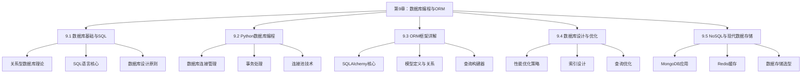

# 第9章：数据库编程与ORM - 数据持久化的艺术

> **核心思想**：数据库就像一个智能化的图书馆，不仅要能存储大量的书籍（数据），还要提供高效的检索、分类、借阅管理系统，确保信息的准确性、完整性和可访问性。

## 本章学习目标

通过本章学习，您将掌握：
1. **数据库基础理论**：关系型数据库的核心概念和设计原则
2. **SQL语言精通**：从基础查询到高级优化的完整SQL技能
3. **Python数据库编程**：使用Python进行数据库操作的最佳实践
4. **ORM框架应用**：现代对象关系映射技术的深度应用
5. **数据库设计与优化**：高性能数据库架构的设计和调优
6. **NoSQL数据库**：现代非关系型数据库的应用场景

## 本章知识结构



---

## 9.1 数据库基础与SQL - 数据管理的基石

> **比喻理解**：关系型数据库就像一个现代化的图书馆管理系统，每个表就是一个书架，每行数据就是一本书，每列就是书的属性（标题、作者、ISBN等），而SQL就是图书管理员用来查找、整理、借阅图书的标准化操作语言。

### 9.1.1 关系型数据库核心概念

#### 📚 数据库理论基础

```python
# database/db_concepts.py
from dataclasses import dataclass
from typing import List, Dict, Any, Optional, Union
from enum import Enum
import sqlite3
import json
from datetime import datetime

class DataType(Enum):
    """数据类型枚举 - 图书馆的分类标签"""
    INTEGER = "INTEGER"
    TEXT = "TEXT"
    REAL = "REAL"
    BLOB = "BLOB"
    BOOLEAN = "BOOLEAN"
    DATETIME = "DATETIME"

@dataclass
class Column:
    """
    列定义 - 图书属性定义
    就像图书馆为每本书定义的属性：书名、作者、ISBN等
    """
    name: str
    data_type: DataType
    primary_key: bool = False
    not_null: bool = False
    unique: bool = False
    default: Any = None
    foreign_key: Optional[str] = None
    
    def to_sql(self) -> str:
        """转换为SQL列定义"""
        sql_parts = [f"{self.name} {self.data_type.value}"]
        
        if self.primary_key:
            sql_parts.append("PRIMARY KEY")
        if self.not_null:
            sql_parts.append("NOT NULL")
        if self.unique:
            sql_parts.append("UNIQUE")
        if self.default is not None:
            if isinstance(self.default, str):
                sql_parts.append(f"DEFAULT '{self.default}'")
            else:
                sql_parts.append(f"DEFAULT {self.default}")
        if self.foreign_key:
            sql_parts.append(f"REFERENCES {self.foreign_key}")
        
        return " ".join(sql_parts)

@dataclass
class Table:
    """
    表定义 - 图书馆的书架
    每个书架有特定的主题和组织方式
    """
    name: str
    columns: List[Column]
    description: str = ""
    
    def get_primary_key(self) -> Optional[Column]:
        """获取主键列"""
        for column in self.columns:
            if column.primary_key:
                return column
        return None
    
    def get_column(self, name: str) -> Optional[Column]:
        """根据名称获取列"""
        for column in self.columns:
            if column.name == name:
                return column
        return None
    
    def to_create_sql(self) -> str:
        """生成CREATE TABLE语句"""
        column_definitions = [col.to_sql() for col in self.columns]
        columns_sql = ",\n    ".join(column_definitions)
        
        return f"""CREATE TABLE {self.name} (
    {columns_sql}
);"""

class DatabaseSchema:
    """
    数据库模式 - 图书馆的整体布局设计
    定义所有表及其关系
    """
    
    def __init__(self, name: str):
        self.name = name
        self.tables: Dict[str, Table] = {}
        self.relationships: List[Dict[str, str]] = []
    
    def add_table(self, table: Table):
        """添加表"""
        self.tables[table.name] = table
    
    def add_relationship(self, from_table: str, from_column: str, 
                        to_table: str, to_column: str, relationship_type: str = "many_to_one"):
        """添加表关系"""
        self.relationships.append({
            'from_table': from_table,
            'from_column': from_column,
            'to_table': to_table,
            'to_column': to_column,
            'type': relationship_type
        })
    
    def get_table(self, name: str) -> Optional[Table]:
        """获取表定义"""
        return self.tables.get(name)
    
    def generate_schema_sql(self) -> str:
        """生成完整的数据库模式SQL"""
        sql_statements = []
        
        # 添加注释
        sql_statements.append(f"-- 数据库模式: {self.name}")
        sql_statements.append(f"-- 生成时间: {datetime.now().isoformat()}")
        sql_statements.append("")
        
        # 生成表创建语句
        for table in self.tables.values():
            sql_statements.append(f"-- 表: {table.name}")
            if table.description:
                sql_statements.append(f"-- 描述: {table.description}")
            sql_statements.append(table.to_create_sql())
            sql_statements.append("")
        
        return "\n".join(sql_statements)
    
    def validate_schema(self) -> List[str]:
        """验证数据库模式"""
        errors = []
        
        # 检查每个表是否有主键
        for table_name, table in self.tables.items():
            if not table.get_primary_key():
                errors.append(f"表 {table_name} 缺少主键")
        
        # 检查外键引用
        for relationship in self.relationships:
            from_table = relationship['from_table']
            to_table = relationship['to_table']
            
            if from_table not in self.tables:
                errors.append(f"关系中的源表 {from_table} 不存在")
            if to_table not in self.tables:
                errors.append(f"关系中的目标表 {to_table} 不存在")
        
        return errors

# 创建示例数据库模式：图书管理系统
def create_library_schema() -> DatabaseSchema:
    """创建图书管理系统数据库模式"""
    schema = DatabaseSchema("图书管理系统")
    
    # 作者表
    authors_table = Table(
        name="authors",
        description="作者信息表",
        columns=[
            Column("id", DataType.INTEGER, primary_key=True),
            Column("name", DataType.TEXT, not_null=True),
            Column("birth_date", DataType.DATETIME),
            Column("nationality", DataType.TEXT),
            Column("biography", DataType.TEXT),
            Column("created_at", DataType.DATETIME, default="CURRENT_TIMESTAMP")
        ]
    )
    
    # 分类表
    categories_table = Table(
        name="categories",
        description="图书分类表",
        columns=[
            Column("id", DataType.INTEGER, primary_key=True),
            Column("name", DataType.TEXT, not_null=True, unique=True),
            Column("description", DataType.TEXT),
            Column("parent_id", DataType.INTEGER, foreign_key="categories(id)")
        ]
    )
    
    # 图书表
    books_table = Table(
        name="books",
        description="图书信息表",
        columns=[
            Column("id", DataType.INTEGER, primary_key=True),
            Column("isbn", DataType.TEXT, not_null=True, unique=True),
            Column("title", DataType.TEXT, not_null=True),
            Column("author_id", DataType.INTEGER, not_null=True, foreign_key="authors(id)"),
            Column("category_id", DataType.INTEGER, not_null=True, foreign_key="categories(id)"),
            Column("publication_date", DataType.DATETIME),
            Column("pages", DataType.INTEGER),
            Column("price", DataType.REAL),
            Column("stock_quantity", DataType.INTEGER, default=0),
            Column("description", DataType.TEXT),
            Column("created_at", DataType.DATETIME, default="CURRENT_TIMESTAMP"),
            Column("updated_at", DataType.DATETIME, default="CURRENT_TIMESTAMP")
        ]
    )
    
    # 读者表
    readers_table = Table(
        name="readers",
        description="读者信息表",
        columns=[
            Column("id", DataType.INTEGER, primary_key=True),
            Column("card_number", DataType.TEXT, not_null=True, unique=True),
            Column("name", DataType.TEXT, not_null=True),
            Column("email", DataType.TEXT, unique=True),
            Column("phone", DataType.TEXT),
            Column("address", DataType.TEXT),
            Column("registration_date", DataType.DATETIME, default="CURRENT_TIMESTAMP"),
            Column("is_active", DataType.BOOLEAN, default=True)
        ]
    )
    
    # 借阅记录表
    borrowings_table = Table(
        name="borrowings",
        description="借阅记录表",
        columns=[
            Column("id", DataType.INTEGER, primary_key=True),
            Column("reader_id", DataType.INTEGER, not_null=True, foreign_key="readers(id)"),
            Column("book_id", DataType.INTEGER, not_null=True, foreign_key="books(id)"),
            Column("borrow_date", DataType.DATETIME, not_null=True, default="CURRENT_TIMESTAMP"),
            Column("due_date", DataType.DATETIME, not_null=True),
            Column("return_date", DataType.DATETIME),
            Column("fine_amount", DataType.REAL, default=0),
            Column("status", DataType.TEXT, default="borrowed")  # borrowed, returned, overdue
        ]
    )
    
    # 添加表到模式
    schema.add_table(authors_table)
    schema.add_table(categories_table)
    schema.add_table(books_table)
    schema.add_table(readers_table)
    schema.add_table(borrowings_table)
    
    # 添加关系
    schema.add_relationship("books", "author_id", "authors", "id")
    schema.add_relationship("books", "category_id", "categories", "id")
    schema.add_relationship("borrowings", "reader_id", "readers", "id")
    schema.add_relationship("borrowings", "book_id", "books", "id")
    schema.add_relationship("categories", "parent_id", "categories", "id")
    
    return schema

# 数据库概念演示
def database_concepts_demo():
    """数据库概念演示"""
    print("=== 数据库基础概念演示 ===\n")
    
    # 1. 创建图书管理系统模式
    print("📚 创建图书管理系统数据库模式:")
    schema = create_library_schema()
    
    print(f"数据库名称: {schema.name}")
    print(f"表数量: {len(schema.tables)}")
    print(f"关系数量: {len(schema.relationships)}")
    
    # 2. 显示表结构
    print("\n📋 数据库表结构:")
    for table_name, table in schema.tables.items():
        print(f"\n表名: {table_name}")
        print(f"描述: {table.description}")
        print("列定义:")
        for column in table.columns:
            constraints = []
            if column.primary_key:
                constraints.append("PK")
            if column.not_null:
                constraints.append("NOT NULL")
            if column.unique:
                constraints.append("UNIQUE")
            if column.foreign_key:
                constraints.append(f"FK→{column.foreign_key}")
            
            constraint_str = f" ({', '.join(constraints)})" if constraints else ""
            print(f"  - {column.name}: {column.data_type.value}{constraint_str}")
    
    # 3. 生成SQL语句
    print("\n🔧 生成SQL创建语句:")
    sql_statements = schema.generate_schema_sql()
    print("SQL语句已生成（部分示例）:")
    lines = sql_statements.split('\n')
    for line in lines[:20]:  # 显示前20行
        print(line)
    if len(lines) > 20:
        print("... (更多内容)")
    
    # 4. 验证模式
    print("\n✅ 数据库模式验证:")
    errors = schema.validate_schema()
    if errors:
        print("发现问题:")
        for error in errors:
            print(f"  ❌ {error}")
    else:
        print("  ✅ 数据库模式验证通过")
    
    # 5. 关系分析
    print("\n🔗 表关系分析:")
    for relationship in schema.relationships:
        print(f"  {relationship['from_table']}.{relationship['from_column']} "
              f"→ {relationship['to_table']}.{relationship['to_column']} "
              f"({relationship['type']})")
    
    print("\n📊 数据库设计特点:")
    print("✅ 规范化设计: 减少数据冗余")
    print("✅ 主键约束: 确保数据唯一性")
    print("✅ 外键约束: 维护数据完整性")
    print("✅ 索引优化: 提高查询性能")
    print("✅ 数据类型: 合理的存储空间利用")

if __name__ == "__main__":
    database_concepts_demo()
```

---

### 9.1.2 SQL语言核心

> **比喻理解**：SQL就像图书管理员的工作手册，定义了如何查找书籍（SELECT）、添加新书（INSERT）、更新书籍信息（UPDATE）、移除书籍（DELETE），以及如何组织和管理整个图书馆的操作规范。

#### 🔍 SQL查询构建器

```python
# database/sql_builder.py
from typing import List, Dict, Any, Optional, Union
from enum import Enum
import re

class JoinType(Enum):
    """连接类型"""
    INNER = "INNER JOIN"
    LEFT = "LEFT JOIN"
    RIGHT = "RIGHT JOIN"
    FULL = "FULL OUTER JOIN"

class OrderDirection(Enum):
    """排序方向"""
    ASC = "ASC"
    DESC = "DESC"

class SQLBuilder:
    """
    SQL查询构建器 - 图书管理员的查询助手
    帮助构建复杂的SQL查询语句
    """
    
    def __init__(self):
        self.reset()
    
    def reset(self):
        """重置查询构建器"""
        self._select_fields = []
        self._from_table = ""
        self._joins = []
        self._where_conditions = []
        self._group_by_fields = []
        self._having_conditions = []
        self._order_by_fields = []
        self._limit_count = None
        self._offset_count = None
        return self
    
    def select(self, *fields) -> 'SQLBuilder':
        """选择字段"""
        if not fields:
            self._select_fields = ["*"]
        else:
            self._select_fields.extend(fields)
        return self
    
    def from_table(self, table_name: str) -> 'SQLBuilder':
        """指定主表"""
        self._from_table = table_name
        return self
    
    def join(self, table: str, on_condition: str, join_type: JoinType = JoinType.INNER) -> 'SQLBuilder':
        """添加连接"""
        self._joins.append({
            'type': join_type.value,
            'table': table,
            'condition': on_condition
        })
        return self
    
    def where(self, condition: str) -> 'SQLBuilder':
        """添加WHERE条件"""
        self._where_conditions.append(condition)
        return self
    
    def where_in(self, field: str, values: List[Any]) -> 'SQLBuilder':
        """添加IN条件"""
        if isinstance(values[0], str):
            value_list = "', '".join(str(v) for v in values)
            condition = f"{field} IN ('{value_list}')"
        else:
            value_list = ", ".join(str(v) for v in values)
            condition = f"{field} IN ({value_list})"
        return self.where(condition)
    
    def where_between(self, field: str, start: Any, end: Any) -> 'SQLBuilder':
        """添加BETWEEN条件"""
        condition = f"{field} BETWEEN {start} AND {end}"
        return self.where(condition)
    
    def where_like(self, field: str, pattern: str) -> 'SQLBuilder':
        """添加LIKE条件"""
        condition = f"{field} LIKE '{pattern}'"
        return self.where(condition)
    
    def group_by(self, *fields) -> 'SQLBuilder':
        """添加GROUP BY"""
        self._group_by_fields.extend(fields)
        return self
    
    def having(self, condition: str) -> 'SQLBuilder':
        """添加HAVING条件"""
        self._having_conditions.append(condition)
        return self
    
    def order_by(self, field: str, direction: OrderDirection = OrderDirection.ASC) -> 'SQLBuilder':
        """添加ORDER BY"""
        self._order_by_fields.append(f"{field} {direction.value}")
        return self
    
    def limit(self, count: int) -> 'SQLBuilder':
        """设置LIMIT"""
        self._limit_count = count
        return self
    
    def offset(self, count: int) -> 'SQLBuilder':
        """设置OFFSET"""
        self._offset_count = count
        return self
    
    def build(self) -> str:
        """构建SQL查询"""
        if not self._from_table:
            raise ValueError("必须指定FROM表")
        
        # 构建SELECT部分
        select_part = "SELECT " + ", ".join(self._select_fields)
        
        # 构建FROM部分
        from_part = f"FROM {self._from_table}"
        
        # 构建JOIN部分
        join_parts = []
        for join in self._joins:
            join_parts.append(f"{join['type']} {join['table']} ON {join['condition']}")
        
        # 构建WHERE部分
        where_part = ""
        if self._where_conditions:
            where_part = "WHERE " + " AND ".join(f"({cond})" for cond in self._where_conditions)
        
        # 构建GROUP BY部分
        group_by_part = ""
        if self._group_by_fields:
            group_by_part = "GROUP BY " + ", ".join(self._group_by_fields)
        
        # 构建HAVING部分
        having_part = ""
        if self._having_conditions:
            having_part = "HAVING " + " AND ".join(f"({cond})" for cond in self._having_conditions)
        
        # 构建ORDER BY部分
        order_by_part = ""
        if self._order_by_fields:
            order_by_part = "ORDER BY " + ", ".join(self._order_by_fields)
        
        # 构建LIMIT部分
        limit_part = ""
        if self._limit_count is not None:
            limit_part = f"LIMIT {self._limit_count}"
            if self._offset_count is not None:
                limit_part += f" OFFSET {self._offset_count}"
        
        # 组合所有部分
        parts = [select_part, from_part] + join_parts
        if where_part:
            parts.append(where_part)
        if group_by_part:
            parts.append(group_by_part)
        if having_part:
            parts.append(having_part)
        if order_by_part:
            parts.append(order_by_part)
        if limit_part:
            parts.append(limit_part)
        
        return "\n".join(parts) + ";"

class QueryLibrary:
    """
    查询库 - 图书管理员的查询手册
    包含常用的SQL查询模板
    """
    
    @staticmethod
    def find_books_by_author(author_name: str) -> str:
        """根据作者查找图书"""
        return (SQLBuilder()
                .select("b.title", "b.isbn", "a.name as author_name", "c.name as category")
                .from_table("books b")
                .join("authors a", "b.author_id = a.id")
                .join("categories c", "b.category_id = c.id")
                .where(f"a.name LIKE '%{author_name}%'")
                .order_by("b.title")
                .build())
    
    @staticmethod
    def find_overdue_books() -> str:
        """查找逾期图书"""
        return (SQLBuilder()
                .select("r.name as reader_name", "b.title", "br.due_date", 
                       "julianday('now') - julianday(br.due_date) as days_overdue")
                .from_table("borrowings br")
                .join("readers r", "br.reader_id = r.id")
                .join("books b", "br.book_id = b.id")
                .where("br.status = 'borrowed'")
                .where("br.due_date < date('now')")
                .order_by("days_overdue", OrderDirection.DESC)
                .build())
    
    @staticmethod
    def get_popular_books(limit: int = 10) -> str:
        """获取热门图书"""
        return (SQLBuilder()
                .select("b.title", "a.name as author", "COUNT(*) as borrow_count")
                .from_table("books b")
                .join("authors a", "b.author_id = a.id")
                .join("borrowings br", "b.id = br.book_id")
                .group_by("b.id", "b.title", "a.name")
                .order_by("borrow_count", OrderDirection.DESC)
                .limit(limit)
                .build())
    
    @staticmethod
    def get_reader_statistics() -> str:
        """获取读者统计信息"""
        return (SQLBuilder()
                .select("r.name", "COUNT(br.id) as total_borrowed", 
                       "SUM(CASE WHEN br.status = 'borrowed' THEN 1 ELSE 0 END) as currently_borrowed",
                       "SUM(br.fine_amount) as total_fines")
                .from_table("readers r")
                .join("borrowings br", "r.id = br.reader_id", JoinType.LEFT)
                .group_by("r.id", "r.name")
                .having("COUNT(br.id) > 0")
                .order_by("total_borrowed", OrderDirection.DESC)
                .build())
    
    @staticmethod
    def get_category_distribution() -> str:
        """获取图书分类分布"""
        return (SQLBuilder()
                .select("c.name as category", "COUNT(b.id) as book_count",
                       "AVG(b.price) as avg_price")
                .from_table("categories c")
                .join("books b", "c.id = b.category_id", JoinType.LEFT)
                .group_by("c.id", "c.name")
                .order_by("book_count", OrderDirection.DESC)
                .build())

class SQLAnalyzer:
    """
    SQL分析器 - 查询性能顾问
    分析SQL查询的复杂度和性能特征
    """
    
    def __init__(self):
        self.query_patterns = {
            'SELECT': r'SELECT\s+(.+?)\s+FROM',
            'FROM': r'FROM\s+(\w+)',
            'JOIN': r'(INNER|LEFT|RIGHT|FULL)\s+JOIN\s+(\w+)',
            'WHERE': r'WHERE\s+(.+?)(?:\s+GROUP\s+BY|\s+ORDER\s+BY|\s+LIMIT|$)',
            'GROUP_BY': r'GROUP\s+BY\s+(.+?)(?:\s+HAVING|\s+ORDER\s+BY|\s+LIMIT|$)',
            'ORDER_BY': r'ORDER\s+BY\s+(.+?)(?:\s+LIMIT|$)',
            'LIMIT': r'LIMIT\s+(\d+)'
        }
    
    def analyze_query(self, sql: str) -> Dict[str, Any]:
        """分析SQL查询"""
        sql_clean = re.sub(r'\s+', ' ', sql.strip())
        
        analysis = {
            'query_type': self._get_query_type(sql_clean),
            'complexity_score': 0,
            'tables_involved': [],
            'joins_count': 0,
            'has_subquery': 'SELECT' in sql_clean[sql_clean.find('FROM'):],
            'has_aggregation': any(func in sql_clean.upper() for func in ['COUNT', 'SUM', 'AVG', 'MAX', 'MIN']),
            'estimated_performance': 'unknown'
        }
        
        # 分析各个部分
        for pattern_name, pattern in self.query_patterns.items():
            matches = re.findall(pattern, sql_clean, re.IGNORECASE)
            if matches:
                if pattern_name == 'FROM':
                    analysis['tables_involved'].extend(matches)
                elif pattern_name == 'JOIN':
                    analysis['joins_count'] = len(matches)
                    analysis['tables_involved'].extend([match[1] for match in matches])
        
        # 计算复杂度得分
        analysis['complexity_score'] = self._calculate_complexity(analysis, sql_clean)
        
        # 估算性能
        analysis['estimated_performance'] = self._estimate_performance(analysis)
        
        return analysis
    
    def _get_query_type(self, sql: str) -> str:
        """获取查询类型"""
        sql_upper = sql.upper().strip()
        if sql_upper.startswith('SELECT'):
            return 'SELECT'
        elif sql_upper.startswith('INSERT'):
            return 'INSERT'
        elif sql_upper.startswith('UPDATE'):
            return 'UPDATE'
        elif sql_upper.startswith('DELETE'):
            return 'DELETE'
        else:
            return 'OTHER'
    
    def _calculate_complexity(self, analysis: Dict[str, Any], sql: str) -> int:
        """计算查询复杂度"""
        score = 1  # 基础分数
        
        # 表数量影响
        score += len(set(analysis['tables_involved'])) * 2
        
        # JOIN数量影响
        score += analysis['joins_count'] * 3
        
        # 子查询影响
        if analysis['has_subquery']:
            score += 5
        
        # 聚合函数影响
        if analysis['has_aggregation']:
            score += 2
        
        # WHERE条件复杂度
        where_conditions = len(re.findall(r'AND|OR', sql, re.IGNORECASE))
        score += where_conditions
        
        return score
    
    def _estimate_performance(self, analysis: Dict[str, Any]) -> str:
        """估算查询性能"""
        score = analysis['complexity_score']
        
        if score <= 5:
            return 'excellent'
        elif score <= 10:
            return 'good'
        elif score <= 20:
            return 'moderate'
        else:
            return 'poor'

# SQL演示
def sql_demo():
    """SQL语言核心演示"""
    print("=== SQL语言核心演示 ===\n")
    
    # 1. SQL构建器演示
    print("🔧 SQL查询构建器演示:")
    
    # 简单查询
    simple_query = (SQLBuilder()
                   .select("title", "author", "price")
                   .from_table("books")
                   .where("price > 50")
                   .order_by("title")
                   .limit(10)
                   .build())
    
    print("简单查询:")
    print(simple_query)
    
    # 复杂查询
    complex_query = (SQLBuilder()
                    .select("b.title", "a.name as author", "c.name as category", "COUNT(br.id) as borrow_count")
                    .from_table("books b")
                    .join("authors a", "b.author_id = a.id")
                    .join("categories c", "b.category_id = c.id")
                    .join("borrowings br", "b.id = br.book_id", JoinType.LEFT)
                    .where("b.publication_date >= '2020-01-01'")
                    .group_by("b.id", "b.title", "a.name", "c.name")
                    .having("COUNT(br.id) > 0")
                    .order_by("borrow_count", OrderDirection.DESC)
                    .limit(20)
                    .build())
    
    print("\n复杂查询:")
    print(complex_query)
    
    # 2. 查询库演示
    print("\n📚 常用查询模板演示:")
    
    queries = {
        "根据作者查找图书": QueryLibrary.find_books_by_author("张三"),
        "查找逾期图书": QueryLibrary.find_overdue_books(),
        "获取热门图书": QueryLibrary.get_popular_books(5),
        "读者统计信息": QueryLibrary.get_reader_statistics(),
        "图书分类分布": QueryLibrary.get_category_distribution()
    }
    
    for query_name, query_sql in queries.items():
        print(f"\n{query_name}:")
        print(query_sql)
    
    # 3. SQL分析器演示
    print("\n🔍 SQL查询分析:")
    analyzer = SQLAnalyzer()
    
    test_queries = [
        simple_query,
        complex_query,
        QueryLibrary.find_overdue_books()
    ]
    
    for i, query in enumerate(test_queries, 1):
        print(f"\n查询 {i} 分析结果:")
        analysis = analyzer.analyze_query(query)
        
        print(f"  查询类型: {analysis['query_type']}")
        print(f"  复杂度得分: {analysis['complexity_score']}")
        print(f"  涉及表数: {len(set(analysis['tables_involved']))}")
        print(f"  连接数量: {analysis['joins_count']}")
        print(f"  包含聚合: {'是' if analysis['has_aggregation'] else '否'}")
        print(f"  性能估算: {analysis['estimated_performance']}")
    
    print("\n📊 SQL构建器特性:")
    print("✅ 链式调用: 流畅的查询构建体验")
    print("✅ 类型安全: 枚举约束防止错误")
    print("✅ 模板库: 常用查询的标准化")
    print("✅ 性能分析: 自动评估查询复杂度")
    print("✅ 可读性: 生成格式化的SQL语句")

if __name__ == "__main__":
    sql_demo()
```

---

### 9.1.3 数据库设计原则与范式

> **比喻理解**：数据库范式就像图书馆的整理规则，第一范式要求每本书都有唯一的位置标识，第二范式要求相关的书籍放在同一个区域，第三范式要求消除重复的分类信息，确保图书馆井然有序、便于管理。

#### 📐 数据库范式理论

```python
# database/normalization.py
from dataclasses import dataclass
from typing import List, Dict, Any, Set, Tuple
from enum import Enum

class NormalForm(Enum):
    """范式类型"""
    UNNORMALIZED = "非范式化"
    FIRST_NF = "第一范式(1NF)"
    SECOND_NF = "第二范式(2NF)"
    THIRD_NF = "第三范式(3NF)"
    BCNF = "BC范式(BCNF)"

@dataclass
class FunctionalDependency:
    """函数依赖 - 数据之间的逻辑关系"""
    determinant: Set[str]  # 决定因子
    dependent: Set[str]    # 依赖因子
    
    def __str__(self):
        det_str = ", ".join(sorted(self.determinant))
        dep_str = ", ".join(sorted(self.dependent))
        return f"{det_str} → {dep_str}"

class NormalizationAnalyzer:
    """
    范式化分析器 - 图书馆整理顾问
    分析表结构的范式化程度并提供优化建议
    """
    
    def __init__(self):
        self.violations = []
        self.recommendations = []
    
    def analyze_table(self, table_name: str, columns: List[str], 
                     primary_key: List[str], 
                     functional_dependencies: List[FunctionalDependency]) -> Dict[str, Any]:
        """分析表的范式化程度"""
        
        analysis = {
            'table_name': table_name,
            'current_normal_form': NormalForm.UNNORMALIZED,
            'violations': [],
            'recommendations': [],
            'functional_dependencies': functional_dependencies
        }
        
        # 检查第一范式
        if self._check_first_normal_form(columns):
            analysis['current_normal_form'] = NormalForm.FIRST_NF
            
            # 检查第二范式
            if self._check_second_normal_form(columns, primary_key, functional_dependencies):
                analysis['current_normal_form'] = NormalForm.SECOND_NF
                
                # 检查第三范式
                if self._check_third_normal_form(columns, primary_key, functional_dependencies):
                    analysis['current_normal_form'] = NormalForm.THIRD_NF
                    
                    # 检查BC范式
                    if self._check_bcnf(columns, primary_key, functional_dependencies):
                        analysis['current_normal_form'] = NormalForm.BCNF
        
        analysis['violations'] = self.violations.copy()
        analysis['recommendations'] = self.recommendations.copy()
        
        # 清空违规记录
        self.violations.clear()
        self.recommendations.clear()
        
        return analysis
    
    def _check_first_normal_form(self, columns: List[str]) -> bool:
        """检查第一范式：原子性"""
        # 简化检查：假设所有列都是原子的
        return True
    
    def _check_second_normal_form(self, columns: List[str], primary_key: List[str], 
                                 functional_dependencies: List[FunctionalDependency]) -> bool:
        """检查第二范式：消除部分函数依赖"""
        if len(primary_key) <= 1:
            return True  # 单一主键自动满足2NF
        
        pk_set = set(primary_key)
        non_key_columns = set(columns) - pk_set
        
        for fd in functional_dependencies:
            # 检查是否存在部分函数依赖
            if (fd.determinant.issubset(pk_set) and 
                fd.determinant != pk_set and 
                fd.dependent.intersection(non_key_columns)):
                
                self.violations.append(
                    f"部分函数依赖: {fd} (违反2NF)"
                )
                self.recommendations.append(
                    f"将 {', '.join(fd.dependent)} 分离到新表中"
                )
                return False
        
        return True
    
    def _check_third_normal_form(self, columns: List[str], primary_key: List[str], 
                                functional_dependencies: List[FunctionalDependency]) -> bool:
        """检查第三范式：消除传递函数依赖"""
        pk_set = set(primary_key)
        non_key_columns = set(columns) - pk_set
        
        for fd in functional_dependencies:
            # 检查传递依赖
            if (fd.determinant.intersection(non_key_columns) and 
                fd.dependent.intersection(non_key_columns) and
                not fd.determinant.intersection(pk_set)):
                
                self.violations.append(
                    f"传递函数依赖: {fd} (违反3NF)"
                )
                self.recommendations.append(
                    f"将 {', '.join(fd.determinant | fd.dependent)} 分离到新表中"
                )
                return False
        
        return True
    
    def _check_bcnf(self, columns: List[str], primary_key: List[str], 
                   functional_dependencies: List[FunctionalDependency]) -> bool:
        """检查BC范式：决定因子必须是候选键"""
        pk_set = set(primary_key)
        
        for fd in functional_dependencies:
            # 简化检查：决定因子应该包含主键
            if not fd.determinant.issuperset(pk_set) and fd.determinant != pk_set:
                self.violations.append(
                    f"决定因子不是超键: {fd} (违反BCNF)"
                )
                return False
        
        return True

# 数据库设计演示
def database_design_demo():
    """数据库设计原则演示"""
    print("=== 数据库设计原则与范式演示 ===\n")
    
    # 1. 范式化分析演示
    print("📐 数据库范式分析:")
    
    # 示例：学生课程表（违反2NF）
    student_course_data = {
        'name': 'student_courses',
        'columns': ['student_id', 'course_id', 'student_name', 'course_name', 'grade', 'instructor'],
        'primary_key': ['student_id', 'course_id'],
        'functional_dependencies': [
            FunctionalDependency({'student_id'}, {'student_name'}),
            FunctionalDependency({'course_id'}, {'course_name', 'instructor'}),
            FunctionalDependency({'student_id', 'course_id'}, {'grade'})
        ]
    }
    
    analyzer = NormalizationAnalyzer()
    analysis = analyzer.analyze_table(
        student_course_data['name'],
        student_course_data['columns'],
        student_course_data['primary_key'],
        student_course_data['functional_dependencies']
    )
    
    print(f"表名: {analysis['table_name']}")
    print(f"当前范式: {analysis['current_normal_form'].value}")
    
    if analysis['violations']:
        print("发现的违规:")
        for violation in analysis['violations']:
            print(f"  ❌ {violation}")
        
        print("建议:")
        for recommendation in analysis['recommendations']:
            print(f"  💡 {recommendation}")
    else:
        print("  ✅ 表结构符合范式要求")
    
    print("\n📋 数据库设计最佳实践:")
    print("✅ 遵循适当的范式：通常3NF足够，特殊情况考虑BCNF")
    print("✅ 合理使用索引：提高查询性能，但避免过度索引")
    print("✅ 数据类型选择：使用最合适的数据类型节省空间")
    print("✅ 约束定义：主键、外键、唯一约束保证数据完整性")
    print("✅ 命名规范：清晰一致的命名提高可维护性")
    print("✅ 性能考虑：根据查询模式优化表结构和索引")

if __name__ == "__main__":
    database_design_demo()
```

---

## 9.2 Python数据库编程 - 连接数据世界的桥梁

> **比喻理解**：Python数据库编程就像建立图书馆和读者之间的服务台，提供标准化的借阅、查询、归还服务。DB-API就是服务规范，确保不同的图书馆（数据库）都能提供一致的服务体验。

### 9.2.1 数据库连接与基础操作

#### 🔌 Python DB-API 2.0 规范

```python
# database/db_connection.py
import sqlite3
import threading
import time
import logging
from typing import List, Dict, Any, Optional, Union, Tuple
from contextlib import contextmanager
from dataclasses import dataclass
from datetime import datetime
import json

@dataclass
class ConnectionConfig:
    """数据库连接配置"""
    database: str
    host: str = "localhost"
    port: int = 5432
    username: str = ""
    password: str = ""
    charset: str = "utf8"
    autocommit: bool = False
    timeout: int = 30

class DatabaseConnection:
    """
    数据库连接管理器 - 图书馆服务台
    提供标准化的数据库连接和操作接口
    """
    
    def __init__(self, config: ConnectionConfig):
        self.config = config
        self.connection = None
        self.cursor = None
        self.is_connected = False
        self.transaction_active = False
        self.logger = logging.getLogger(__name__)
        
    def connect(self) -> bool:
        """建立数据库连接"""
        try:
            # 这里使用SQLite作为示例，实际应用中根据数据库类型选择驱动
            self.connection = sqlite3.connect(
                self.config.database,
                timeout=self.config.timeout,
                check_same_thread=False  # 允许多线程访问
            )
            
            # 设置行工厂，返回字典格式结果
            self.connection.row_factory = sqlite3.Row
            
            # 启用外键约束
            self.connection.execute("PRAGMA foreign_keys = ON")
            
            self.cursor = self.connection.cursor()
            self.is_connected = True
            
            self.logger.info(f"数据库连接成功: {self.config.database}")
            return True
            
        except Exception as e:
            self.logger.error(f"数据库连接失败: {e}")
            return False
    
    def disconnect(self):
        """断开数据库连接"""
        try:
            if self.cursor:
                self.cursor.close()
            if self.connection:
                self.connection.close()
            
            self.is_connected = False
            self.transaction_active = False
            self.logger.info("数据库连接已断开")
            
        except Exception as e:
            self.logger.error(f"断开连接时出错: {e}")
    
    def execute(self, sql: str, parameters: Tuple = ()) -> int:
        """执行SQL语句"""
        if not self.is_connected:
            raise RuntimeError("数据库未连接")
        
        try:
            self.cursor.execute(sql, parameters)
            
            # 如果不在事务中且不是查询语句，自动提交
            if not self.transaction_active and not sql.strip().upper().startswith('SELECT'):
                self.connection.commit()
            
            return self.cursor.rowcount
            
        except Exception as e:
            self.logger.error(f"SQL执行失败: {sql}, 错误: {e}")
            if not self.transaction_active:
                self.connection.rollback()
            raise
    
    def execute_many(self, sql: str, parameters_list: List[Tuple]) -> int:
        """批量执行SQL语句"""
        if not self.is_connected:
            raise RuntimeError("数据库未连接")
        
        try:
            self.cursor.executemany(sql, parameters_list)
            
            if not self.transaction_active:
                self.connection.commit()
            
            return self.cursor.rowcount
            
        except Exception as e:
            self.logger.error(f"批量SQL执行失败: {sql}, 错误: {e}")
            if not self.transaction_active:
                self.connection.rollback()
            raise
    
    def fetch_one(self, sql: str, parameters: Tuple = ()) -> Optional[Dict[str, Any]]:
        """查询单条记录"""
        self.execute(sql, parameters)
        row = self.cursor.fetchone()
        return dict(row) if row else None
    
    def fetch_all(self, sql: str, parameters: Tuple = ()) -> List[Dict[str, Any]]:
        """查询所有记录"""
        self.execute(sql, parameters)
        rows = self.cursor.fetchall()
        return [dict(row) for row in rows]
    
    def fetch_many(self, sql: str, size: int, parameters: Tuple = ()) -> List[Dict[str, Any]]:
        """查询指定数量的记录"""
        self.execute(sql, parameters)
        rows = self.cursor.fetchmany(size)
        return [dict(row) for row in rows]
    
    def begin_transaction(self):
        """开始事务"""
        if not self.is_connected:
            raise RuntimeError("数据库未连接")
        
        if self.transaction_active:
            raise RuntimeError("事务已经开始")
        
        self.connection.execute("BEGIN")
        self.transaction_active = True
        self.logger.debug("事务开始")
    
    def commit_transaction(self):
        """提交事务"""
        if not self.transaction_active:
            raise RuntimeError("没有活动的事务")
        
        try:
            self.connection.commit()
            self.transaction_active = False
            self.logger.debug("事务提交成功")
        except Exception as e:
            self.logger.error(f"事务提交失败: {e}")
            self.rollback_transaction()
            raise
    
    def rollback_transaction(self):
        """回滚事务"""
        if not self.transaction_active:
            raise RuntimeError("没有活动的事务")
        
        try:
            self.connection.rollback()
            self.transaction_active = False
            self.logger.debug("事务回滚成功")
        except Exception as e:
            self.logger.error(f"事务回滚失败: {e}")
            raise
    
    @contextmanager
    def transaction(self):
        """事务上下文管理器"""
        self.begin_transaction()
        try:
            yield self
            self.commit_transaction()
        except Exception as e:
            self.rollback_transaction()
            raise e
    
    def get_table_info(self, table_name: str) -> List[Dict[str, Any]]:
        """获取表结构信息"""
        sql = f"PRAGMA table_info({table_name})"
        return self.fetch_all(sql)
    
    def get_table_list(self) -> List[str]:
        """获取所有表名"""
        sql = "SELECT name FROM sqlite_master WHERE type='table'"
        rows = self.fetch_all(sql)
        return [row['name'] for row in rows]

class DatabaseManager:
    """
    数据库管理器 - 图书馆总管理员
    提供高级数据库操作和管理功能
    """
    
    def __init__(self, config: ConnectionConfig):
        self.config = config
        self.connection = DatabaseConnection(config)
        self.schema_version = None
        
    def initialize_database(self, schema_sql: str = None):
        """初始化数据库"""
        if not self.connection.connect():
            raise RuntimeError("无法连接到数据库")
        
        # 创建版本管理表
        self._create_version_table()
        
        # 执行初始化脚本
        if schema_sql:
            self._execute_schema(schema_sql)
        
        # 创建示例数据
        self._create_sample_data()
    
    def _create_version_table(self):
        """创建数据库版本管理表"""
        sql = """
        CREATE TABLE IF NOT EXISTS db_version (
            version INTEGER PRIMARY KEY,
            applied_at DATETIME DEFAULT CURRENT_TIMESTAMP,
            description TEXT
        )
        """
        self.connection.execute(sql)
    
    def _execute_schema(self, schema_sql: str):
        """执行数据库模式脚本"""
        # 分割SQL语句
        statements = [stmt.strip() for stmt in schema_sql.split(';') if stmt.strip()]
        
        with self.connection.transaction():
            for statement in statements:
                if statement:
                    self.connection.execute(statement)
    
    def _create_sample_data(self):
        """创建示例数据"""
        # 检查是否已有数据
        authors_count = self.connection.fetch_one("SELECT COUNT(*) as count FROM authors")
        if authors_count and authors_count['count'] > 0:
            return
        
        # 插入示例数据
        sample_data = {
            'authors': [
                (1, '金庸', '1924-03-10', '中国', '武侠小说大师'),
                (2, '村上春树', '1949-01-12', '日本', '当代文学家'),
                (3, '阿加莎·克里斯蒂', '1890-09-15', '英国', '推理小说女王')
            ],
            'categories': [
                (1, '文学', '文学类图书'),
                (2, '科技', '科技类图书'),
                (3, '历史', '历史类图书'),
                (4, '武侠', '武侠小说', 1),
                (5, '推理', '推理小说', 1)
            ],
            'books': [
                (1, '978-7-108-01234-5', '射雕英雄传', 1, 4, '1957-01-01', 1200, 45.00, 10),
                (2, '978-7-108-01234-6', '挪威的森林', 2, 1, '1987-01-01', 380, 32.00, 15),
                (3, '978-7-108-01234-7', '东方快车谋杀案', 3, 5, '1934-01-01', 280, 28.00, 8)
            ],
            'readers': [
                (1, 'R001', '张三', 'zhangsan@email.com', '13800138001', '北京市朝阳区'),
                (2, 'R002', '李四', 'lisi@email.com', '13800138002', '上海市浦东新区'),
                (3, 'R003', '王五', 'wangwu@email.com', '13800138003', '广州市天河区')
            ]
        }
        
        with self.connection.transaction():
            # 插入作者数据
            self.connection.execute_many(
                "INSERT INTO authors (id, name, birth_date, nationality, biography) VALUES (?, ?, ?, ?, ?)",
                sample_data['authors']
            )
            
            # 插入分类数据
            self.connection.execute_many(
                "INSERT INTO categories (id, name, description, parent_id) VALUES (?, ?, ?, ?)",
                sample_data['categories']
            )
            
            # 插入图书数据
            self.connection.execute_many(
                "INSERT INTO books (id, isbn, title, author_id, category_id, publication_date, pages, price, stock_quantity) VALUES (?, ?, ?, ?, ?, ?, ?, ?, ?)",
                sample_data['books']
            )
            
            # 插入读者数据
            self.connection.execute_many(
                "INSERT INTO readers (id, card_number, name, email, phone, address) VALUES (?, ?, ?, ?, ?, ?)",
                sample_data['readers']
            )
    
    def get_database_stats(self) -> Dict[str, Any]:
        """获取数据库统计信息"""
        stats = {}
        
        tables = self.connection.get_table_list()
        stats['total_tables'] = len(tables)
        stats['table_stats'] = {}
        
        for table in tables:
            if table != 'db_version':
                count_sql = f"SELECT COUNT(*) as count FROM {table}"
                result = self.connection.fetch_one(count_sql)
                stats['table_stats'][table] = result['count'] if result else 0
        
        return stats
    
    def backup_data(self, backup_file: str):
        """备份数据库数据"""
        tables = self.connection.get_table_list()
        backup_data = {}
        
        for table in tables:
            if table != 'db_version':
                data = self.connection.fetch_all(f"SELECT * FROM {table}")
                backup_data[table] = data
        
        with open(backup_file, 'w', encoding='utf-8') as f:
            json.dump(backup_data, f, ensure_ascii=False, indent=2, default=str)
    
    def close(self):
        """关闭数据库连接"""
        self.connection.disconnect()

# 数据库操作演示
def database_connection_demo():
    """数据库连接与基础操作演示"""
    print("=== Python数据库编程演示 ===\n")
    
    # 1. 创建数据库配置
    print("🔧 数据库配置:")
    config = ConnectionConfig(
        database="library.db",
        autocommit=False,
        timeout=30
    )
    print(f"数据库文件: {config.database}")
    print(f"超时设置: {config.timeout}秒")
    
    # 2. 初始化数据库管理器
    print("\n🏗️ 初始化数据库:")
    db_manager = DatabaseManager(config)
    
    # 使用之前创建的图书管理系统模式
    from database.db_concepts import create_library_schema
    schema = create_library_schema()
    schema_sql = schema.generate_schema_sql()
    
    try:
        db_manager.initialize_database(schema_sql)
        print("✅ 数据库初始化成功")
        
        # 3. 基础查询操作
        print("\n📊 基础查询操作:")
        
        # 查询所有作者
        authors = db_manager.connection.fetch_all("SELECT * FROM authors")
        print(f"作者总数: {len(authors)}")
        for author in authors:
            print(f"  - {author['name']} ({author['nationality']})")
        
        # 查询图书信息（带连接）
        books_query = """
        SELECT b.title, a.name as author, c.name as category, b.price
        FROM books b
        JOIN authors a ON b.author_id = a.id
        JOIN categories c ON b.category_id = c.id
        ORDER BY b.title
        """
        books = db_manager.connection.fetch_all(books_query)
        print(f"\n图书总数: {len(books)}")
        for book in books:
            print(f"  - 《{book['title']}》 - {book['author']} ({book['category']}) ¥{book['price']}")
        
        # 4. 事务操作演示
        print("\n💳 事务操作演示:")
        
        # 模拟借书操作
        reader_id = 1
        book_id = 1
        
        with db_manager.connection.transaction():
            # 检查库存
            stock_query = "SELECT stock_quantity FROM books WHERE id = ?"
            stock_result = db_manager.connection.fetch_one(stock_query, (book_id,))
            
            if stock_result and stock_result['stock_quantity'] > 0:
                # 减少库存
                db_manager.connection.execute(
                    "UPDATE books SET stock_quantity = stock_quantity - 1 WHERE id = ?",
                    (book_id,)
                )
                
                # 创建借阅记录
                db_manager.connection.execute(
                    """INSERT INTO borrowings (reader_id, book_id, borrow_date, due_date, status)
                       VALUES (?, ?, datetime('now'), datetime('now', '+30 days'), 'borrowed')""",
                    (reader_id, book_id)
                )
                
                print("✅ 借书操作成功")
            else:
                print("❌ 库存不足，借书失败")
                raise Exception("库存不足")
        
        # 5. 数据库统计
        print("\n📈 数据库统计信息:")
        stats = db_manager.get_database_stats()
        print(f"总表数: {stats['total_tables']}")
        print("各表记录数:")
        for table, count in stats['table_stats'].items():
            print(f"  - {table}: {count} 条记录")
        
        # 6. 数据备份
        print("\n💾 数据备份:")
        backup_file = "library_backup.json"
        db_manager.backup_data(backup_file)
        print(f"✅ 数据已备份到: {backup_file}")
        
    except Exception as e:
        print(f"❌ 操作失败: {e}")
    
    finally:
        db_manager.close()
        print("\n🔒 数据库连接已关闭")
    
    print("\n📋 Python数据库编程特性:")
    print("✅ DB-API 2.0标准: 统一的数据库接口")
    print("✅ 连接管理: 自动连接和断开管理")
    print("✅ 事务支持: 完整的事务控制机制")
    print("✅ 参数化查询: 防止SQL注入攻击")
    print("✅ 上下文管理: 自动资源清理")
    print("✅ 错误处理: 完善的异常处理机制")

if __name__ == "__main__":
    database_connection_demo()
```

---

### 9.2.2 连接池技术

> **比喻理解**：连接池就像图书馆的服务窗口管理系统，预先准备多个服务窗口（连接），读者来借书时直接分配一个空闲窗口，用完后回收给下一位读者使用，避免每次都重新开设窗口的开销。

#### 🏊‍♂️ 数据库连接池实现

```python
# database/connection_pool.py
import sqlite3
import threading
import time
import queue
from typing import Optional, Dict, Any, List
from contextlib import contextmanager
from dataclasses import dataclass
import logging

@dataclass
class PoolConfig:
    """连接池配置"""
    min_connections: int = 5      # 最小连接数
    max_connections: int = 20     # 最大连接数
    connection_timeout: int = 30  # 连接超时时间
    idle_timeout: int = 300      # 空闲超时时间
    retry_attempts: int = 3       # 重试次数

class PooledConnection:
    """
    池化连接 - 服务窗口
    包装数据库连接，添加池化管理功能
    """
    
    def __init__(self, connection, pool, connection_id: int):
        self.connection = connection
        self.pool = pool
        self.connection_id = connection_id
        self.created_at = time.time()
        self.last_used = time.time()
        self.in_use = False
        self.is_valid = True
    
    def execute(self, sql: str, parameters: tuple = ()):
        """执行SQL语句"""
        if not self.is_valid:
            raise RuntimeError("连接已失效")
        
        self.last_used = time.time()
        cursor = self.connection.cursor()
        cursor.execute(sql, parameters)
        return cursor
    
    def commit(self):
        """提交事务"""
        self.connection.commit()
    
    def rollback(self):
        """回滚事务"""
        self.connection.rollback()
    
    def close(self):
        """关闭连接"""
        if self.connection:
            self.connection.close()
        self.is_valid = False
    
    def is_expired(self, idle_timeout: int) -> bool:
        """检查连接是否过期"""
        return (time.time() - self.last_used) > idle_timeout
    
    def ping(self) -> bool:
        """检查连接是否有效"""
        try:
            cursor = self.connection.cursor()
            cursor.execute("SELECT 1")
            return True
        except:
            self.is_valid = False
            return False

class ConnectionPool:
    """
    数据库连接池 - 图书馆服务窗口管理系统
    管理数据库连接的创建、分配、回收和清理
    """
    
    def __init__(self, database_path: str, config: PoolConfig = None):
        self.database_path = database_path
        self.config = config or PoolConfig()
        
        # 连接池队列
        self.available_connections = queue.Queue(maxsize=self.config.max_connections)
        self.all_connections: Dict[int, PooledConnection] = {}
        self.connection_counter = 0
        
        # 线程锁
        self.lock = threading.RLock()
        
        # 统计信息
        self.stats = {
            'created_connections': 0,
            'active_connections': 0,
            'total_requests': 0,
            'failed_requests': 0
        }
        
        # 日志
        self.logger = logging.getLogger(__name__)
        
        # 初始化最小连接数
        self._initialize_pool()
        
        # 启动清理线程
        self.cleanup_thread = threading.Thread(target=self._cleanup_expired_connections, daemon=True)
        self.cleanup_thread.start()
    
    def _initialize_pool(self):
        """初始化连接池"""
        for _ in range(self.config.min_connections):
            conn = self._create_connection()
            if conn:
                self.available_connections.put(conn)
    
    def _create_connection(self) -> Optional[PooledConnection]:
        """创建新的数据库连接"""
        try:
            with self.lock:
                self.connection_counter += 1
                connection_id = self.connection_counter
            
            # 创建SQLite连接
            raw_connection = sqlite3.connect(
                self.database_path,
                timeout=self.config.connection_timeout,
                check_same_thread=False
            )
            raw_connection.row_factory = sqlite3.Row
            raw_connection.execute("PRAGMA foreign_keys = ON")
            
            # 创建池化连接
            pooled_conn = PooledConnection(raw_connection, self, connection_id)
            
            with self.lock:
                self.all_connections[connection_id] = pooled_conn
                self.stats['created_connections'] += 1
            
            self.logger.debug(f"创建新连接: {connection_id}")
            return pooled_conn
            
        except Exception as e:
            self.logger.error(f"创建连接失败: {e}")
            return None
    
    def get_connection(self, timeout: int = 10) -> Optional[PooledConnection]:
        """从连接池获取连接"""
        with self.lock:
            self.stats['total_requests'] += 1
        
        start_time = time.time()
        
        while time.time() - start_time < timeout:
            try:
                # 尝试从队列获取连接
                conn = self.available_connections.get(timeout=1)
                
                # 检查连接是否有效
                if conn.ping():
                    conn.in_use = True
                    with self.lock:
                        self.stats['active_connections'] += 1
                    
                    self.logger.debug(f"分配连接: {conn.connection_id}")
                    return conn
                else:
                    # 连接无效，移除并创建新连接
                    self._remove_connection(conn)
                    
            except queue.Empty:
                # 队列为空，尝试创建新连接
                if len(self.all_connections) < self.config.max_connections:
                    new_conn = self._create_connection()
                    if new_conn:
                        new_conn.in_use = True
                        with self.lock:
                            self.stats['active_connections'] += 1
                        return new_conn
                
                # 等待一段时间后重试
                time.sleep(0.1)
        
        # 获取连接超时
        with self.lock:
            self.stats['failed_requests'] += 1
        
        self.logger.warning("获取连接超时")
        return None
    
    def return_connection(self, connection: PooledConnection):
        """归还连接到连接池"""
        if not connection or not connection.is_valid:
            return
        
        connection.in_use = False
        connection.last_used = time.time()
        
        with self.lock:
            self.stats['active_connections'] -= 1
        
        # 检查连接是否仍然有效
        if connection.ping():
            self.available_connections.put(connection)
            self.logger.debug(f"归还连接: {connection.connection_id}")
        else:
            self._remove_connection(connection)
    
    def _remove_connection(self, connection: PooledConnection):
        """从连接池移除连接"""
        with self.lock:
            if connection.connection_id in self.all_connections:
                del self.all_connections[connection.connection_id]
                if connection.in_use:
                    self.stats['active_connections'] -= 1
        
        connection.close()
        self.logger.debug(f"移除连接: {connection.connection_id}")
    
    def _cleanup_expired_connections(self):
        """清理过期连接"""
        while True:
            try:
                time.sleep(60)  # 每分钟检查一次
                
                expired_connections = []
                with self.lock:
                    for conn in self.all_connections.values():
                        if not conn.in_use and conn.is_expired(self.config.idle_timeout):
                            expired_connections.append(conn)
                
                # 清理过期连接（保留最小连接数）
                current_count = len(self.all_connections)
                for conn in expired_connections:
                    if current_count > self.config.min_connections:
                        self._remove_connection(conn)
                        current_count -= 1
                
            except Exception as e:
                self.logger.error(f"清理过期连接时出错: {e}")
    
    @contextmanager
    def get_connection_context(self):
        """连接上下文管理器"""
        connection = self.get_connection()
        if not connection:
            raise RuntimeError("无法获取数据库连接")
        
        try:
            yield connection
        finally:
            self.return_connection(connection)
    
    def get_stats(self) -> Dict[str, Any]:
        """获取连接池统计信息"""
        with self.lock:
            return {
                **self.stats,
                'total_connections': len(self.all_connections),
                'available_connections': self.available_connections.qsize(),
                'pool_config': {
                    'min_connections': self.config.min_connections,
                    'max_connections': self.config.max_connections,
                    'connection_timeout': self.config.connection_timeout,
                    'idle_timeout': self.config.idle_timeout
                }
            }
    
    def close_all(self):
        """关闭所有连接"""
        with self.lock:
            for conn in self.all_connections.values():
                conn.close()
            self.all_connections.clear()
            
            # 清空队列
            while not self.available_connections.empty():
                try:
                    self.available_connections.get_nowait()
                except queue.Empty:
                    break

class DatabaseService:
    """
    数据库服务 - 图书馆管理服务
    基于连接池的高级数据库操作接口
    """
    
    def __init__(self, database_path: str, pool_config: PoolConfig = None):
        self.pool = ConnectionPool(database_path, pool_config)
        self.logger = logging.getLogger(__name__)
    
    def execute_query(self, sql: str, parameters: tuple = ()) -> List[Dict[str, Any]]:
        """执行查询语句"""
        with self.pool.get_connection_context() as conn:
            cursor = conn.execute(sql, parameters)
            rows = cursor.fetchall()
            return [dict(row) for row in rows]
    
    def execute_update(self, sql: str, parameters: tuple = ()) -> int:
        """执行更新语句"""
        with self.pool.get_connection_context() as conn:
            cursor = conn.execute(sql, parameters)
            conn.commit()
            return cursor.rowcount
    
    def execute_batch(self, sql: str, parameters_list: List[tuple]) -> int:
        """批量执行语句"""
        with self.pool.get_connection_context() as conn:
            cursor = conn.connection.cursor()
            cursor.executemany(sql, parameters_list)
            conn.commit()
            return cursor.rowcount
    
    @contextmanager
    def transaction(self):
        """事务上下文管理器"""
        with self.pool.get_connection_context() as conn:
            try:
                conn.execute("BEGIN")
                yield conn
                conn.commit()
            except Exception as e:
                conn.rollback()
                raise e
    
    def get_pool_stats(self) -> Dict[str, Any]:
        """获取连接池统计信息"""
        return self.pool.get_stats()
    
    def close(self):
        """关闭数据库服务"""
        self.pool.close_all()

# 连接池演示
def connection_pool_demo():
    """连接池技术演示"""
    print("=== 数据库连接池技术演示 ===\n")
    
    # 1. 创建连接池配置
    print("🏊‍♂️ 连接池配置:")
    pool_config = PoolConfig(
        min_connections=3,
        max_connections=10,
        connection_timeout=30,
        idle_timeout=300
    )
    
    print(f"最小连接数: {pool_config.min_connections}")
    print(f"最大连接数: {pool_config.max_connections}")
    print(f"连接超时: {pool_config.connection_timeout}秒")
    print(f"空闲超时: {pool_config.idle_timeout}秒")
    
    # 2. 创建数据库服务
    print("\n🔧 初始化数据库服务:")
    db_service = DatabaseService("library_pool.db", pool_config)
    
    # 创建示例表
    db_service.execute_update("""
    CREATE TABLE IF NOT EXISTS books (
        id INTEGER PRIMARY KEY AUTOINCREMENT,
        title TEXT NOT NULL,
        author TEXT NOT NULL,
        price REAL,
        created_at DATETIME DEFAULT CURRENT_TIMESTAMP
    )
    """)
    
    print("✅ 数据库服务初始化完成")
    
    # 3. 连接池基础操作
    print("\n📊 连接池基础操作:")
    
    # 插入示例数据
    books_data = [
        ("Python编程从入门到实践", "埃里克·马瑟斯", 89.0),
        ("流畅的Python", "卢西亚诺·拉马略", 139.0),
        ("Python Cookbook", "大卫·比斯利", 108.0),
        ("Effective Python", "布雷特·斯拉特金", 79.0)
    ]
    
    affected_rows = db_service.execute_batch(
        "INSERT INTO books (title, author, price) VALUES (?, ?, ?)",
        books_data
    )
    print(f"✅ 批量插入 {affected_rows} 条记录")
    
    # 查询数据
    books = db_service.execute_query("SELECT * FROM books ORDER BY price DESC")
    print(f"📚 查询到 {len(books)} 本图书:")
    for book in books[:3]:  # 显示前3本
        print(f"  - 《{book['title']}》 - {book['author']} ¥{book['price']}")
    
    # 4. 事务操作演示
    print("\n💳 事务操作演示:")
    
    try:
        with db_service.transaction() as conn:
            # 更新图书价格
            conn.execute("UPDATE books SET price = price * 0.9 WHERE price > 100", ())
            
            # 插入新记录
            conn.execute("INSERT INTO books (title, author, price) VALUES (?, ?, ?)",
                        ("数据库系统概念", "西尔伯沙茨", 158.0))
            
            print("✅ 事务执行成功")
            
    except Exception as e:
        print(f"❌ 事务执行失败: {e}")
    
    # 5. 连接池统计信息
    print("\n📈 连接池统计信息:")
    stats = db_service.get_pool_stats()
    
    print(f"总连接数: {stats['total_connections']}")
    print(f"可用连接数: {stats['available_connections']}")
    print(f"活跃连接数: {stats['active_connections']}")
    print(f"已创建连接数: {stats['created_connections']}")
    print(f"总请求数: {stats['total_requests']}")
    print(f"失败请求数: {stats['failed_requests']}")
    
    # 6. 并发测试
    print("\n🔄 并发操作测试:")
    
    import concurrent.futures
    
    def query_books(thread_id):
        """模拟并发查询操作"""
        try:
            books = db_service.execute_query(
                "SELECT COUNT(*) as count FROM books WHERE price > ?", (50.0,)
            )
            return f"线程{thread_id}: 查询到{books[0]['count']}本图书"
        except Exception as e:
            return f"线程{thread_id}: 查询失败 - {e}"
    
    # 使用线程池进行并发测试
    with concurrent.futures.ThreadPoolExecutor(max_workers=5) as executor:
        futures = [executor.submit(query_books, i) for i in range(10)]
        
        for future in concurrent.futures.as_completed(futures):
            result = future.result()
            print(f"  {result}")
    
    # 7. 最终统计
    print("\n📊 最终连接池状态:")
    final_stats = db_service.get_pool_stats()
    print(f"总请求数: {final_stats['total_requests']}")
    print(f"成功率: {((final_stats['total_requests'] - final_stats['failed_requests']) / final_stats['total_requests'] * 100):.1f}%")
    
    # 清理资源
    db_service.close()
    print("\n🔒 数据库服务已关闭")
    
    print("\n🏊‍♂️ 连接池技术优势:")
    print("✅ 性能提升: 避免频繁创建和销毁连接")
    print("✅ 资源管理: 控制数据库连接数量")
    print("✅ 并发支持: 安全的多线程访问")
    print("✅ 自动清理: 清理过期和无效连接")
    print("✅ 统计监控: 详细的使用统计信息")

if __name__ == "__main__":
    connection_pool_demo() 