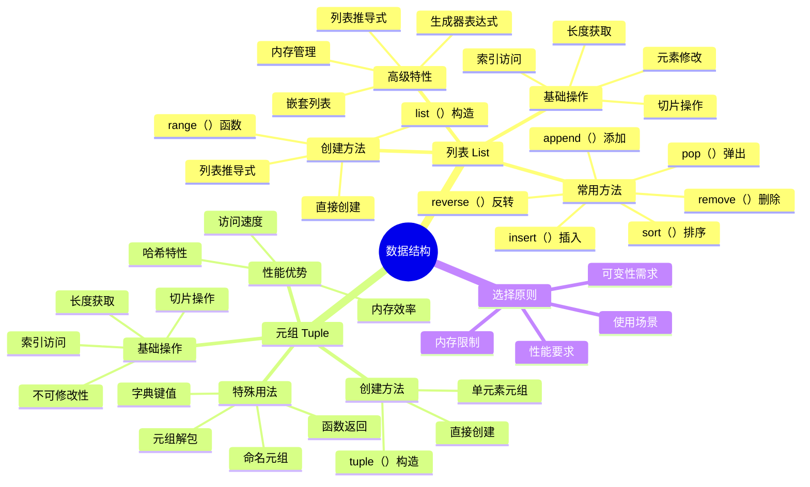

# 第10章 数据结构-列表与元组

## 🎯 学习目标

完成本章学习后，您将能够：
- **理解并掌握**：Python列表(list)的创建、访问、修改操作
- **熟练运用**：元组(tuple)的特性及其与列表的区别  
- **灵活应用**：使用列表和元组解决实际问题
- **深入掌握**：列表推导式的使用方法和最佳实践
- **准确判断**：不同数据结构的性能特点和选择原则

---

## 📚 本章知识图谱



---

## 10.1 列表基础：你的数据"购物车"

### 🛒 生活比喻：列表像购物车

想象一下您在超市购物，手里推着一个购物车：
- **可以添加商品**：`cart.append("苹果")`
- **可以删除商品**：`cart.remove("香蕉")`  
- **可以查看商品**：`cart[0]` 看第一件商品
- **可以重新排列**：`cart.sort()` 按类别整理
- **可以清空购物车**：`cart.clear()`

这就是Python列表的本质 - 一个可以装载、整理和操作数据的"容器"！

### 🚀 列表的创建方法

#### 方法1：直接创建（最常用）
```python
# 创建不同类型的列表
fruits = ["苹果", "香蕉", "橙子"]           # 字符串列表
numbers = [1, 2, 3, 4, 5]                  # 数字列表  
mixed = ["张三", 25, True, 3.14]           # 混合类型列表
empty_list = []                            # 空列表

print(f"水果列表: {fruits}")
print(f"数字列表: {numbers}")
print(f"混合列表: {mixed}")
print(f"空列表: {empty_list}")
```

#### 方法2：使用range()函数
```python
# 创建连续数字列表
numbers = list(range(1, 11))        # [1, 2, 3, 4, 5, 6, 7, 8, 9, 10]
even_numbers = list(range(0, 21, 2)) # [0, 2, 4, 6, 8, 10, 12, 14, 16, 18, 20]
countdown = list(range(10, 0, -1))   # [10, 9, 8, 7, 6, 5, 4, 3, 2, 1]

print(f"连续数字: {numbers}")
print(f"偶数列表: {even_numbers}")  
print(f"倒计时: {countdown}")
```

#### 方法3：重复创建
```python
# 创建重复元素的列表
zeros = [0] * 5                      # [0, 0, 0, 0, 0]
greeting = ["Hello"] * 3             # ["Hello", "Hello", "Hello"]
matrix_row = [[0] * 3 for _ in range(3)]  # 创建3x3零矩阵

print(f"零列表: {zeros}")
print(f"问候列表: {greeting}")
print(f"零矩阵: {matrix_row}")
```

### 🔍 列表的访问操作

#### 正向索引（从前往后）
```python
fruits = ["苹果", "香蕉", "橙子", "葡萄", "西瓜"]

# 基础访问
print(f"第一个水果: {fruits[0]}")      # 苹果
print(f"第三个水果: {fruits[2]}")      # 橙子
print(f"最后一个水果: {fruits[4]}")    # 西瓜

# 获取列表长度
print(f"水果总数: {len(fruits)}")      # 5
```

#### 负向索引（从后往前）
```python
fruits = ["苹果", "香蕉", "橙子", "葡萄", "西瓜"]

print(f"最后一个水果: {fruits[-1]}")    # 西瓜
print(f"倒数第二个: {fruits[-2]}")      # 葡萄
print(f"倒数第三个: {fruits[-3]}")      # 橙子

# 索引对照表
# 正向：  0     1      2     3      4
# 水果：["苹果", "香蕉", "橙子", "葡萄", "西瓜"]
# 负向： -5    -4     -3    -2     -1
```

#### 切片操作（获取子列表）
```python
numbers = [0, 1, 2, 3, 4, 5, 6, 7, 8, 9]

# 基础切片
print(f"前5个数字: {numbers[:5]}")      # [0, 1, 2, 3, 4]
print(f"后5个数字: {numbers[5:]}")      # [5, 6, 7, 8, 9]
print(f"中间部分: {numbers[3:7]}")      # [3, 4, 5, 6]

# 步长切片
print(f"偶数位置: {numbers[::2]}")      # [0, 2, 4, 6, 8]
print(f"奇数位置: {numbers[1::2]}")     # [1, 3, 5, 7, 9]
print(f"逆序输出: {numbers[::-1]}")     # [9, 8, 7, 6, 5, 4, 3, 2, 1, 0]

# 复杂切片
print(f"从后往前每2个: {numbers[-2::-2]}")  # [8, 6, 4, 2, 0]
```

### ✏️ 列表的修改操作

#### 单个元素修改
```python
shopping_cart = ["面包", "牛奶", "鸡蛋"]
print(f"修改前: {shopping_cart}")

# 修改第一个商品
shopping_cart[0] = "全麦面包"
print(f"修改后: {shopping_cart}")

# 修改最后一个商品  
shopping_cart[-1] = "土鸡蛋"
print(f"再次修改: {shopping_cart}")
```

#### 批量修改（切片赋值）
```python
numbers = [1, 2, 3, 4, 5, 6, 7, 8, 9, 10]
print(f"原列表: {numbers}")

# 替换中间部分
numbers[3:6] = [40, 50, 60]
print(f"替换中间: {numbers}")

# 插入新元素
numbers[2:2] = [25, 35]  # 在索引2位置插入
print(f"插入元素: {numbers}")

# 删除元素
numbers[1:3] = []  # 删除索引1-2的元素
print(f"删除元素: {numbers}")
```

### 🔧 列表的常用方法

#### 添加元素
```python
fruits = ["苹果", "香蕉"]
print(f"初始水果: {fruits}")

# append()：在末尾添加单个元素
fruits.append("橙子")
print(f"添加橙子: {fruits}")

# insert()：在指定位置插入元素
fruits.insert(1, "草莓")  # 在索引1位置插入
print(f"插入草莓: {fruits}")

# extend()：添加多个元素
fruits.extend(["葡萄", "西瓜"])
print(f"批量添加: {fruits}")

# 使用+运算符（创建新列表）
more_fruits = fruits + ["芒果", "菠萝"]
print(f"合并列表: {more_fruits}")
print(f"原列表不变: {fruits}")
```

#### 删除元素
```python
numbers = [1, 2, 3, 2, 4, 2, 5]
print(f"原列表: {numbers}")

# remove()：删除第一个匹配的元素
numbers.remove(2)  # 只删除第一个2
print(f"删除第一个2: {numbers}")

# pop()：删除并返回指定位置的元素
last_item = numbers.pop()  # 删除最后一个元素
print(f"弹出最后元素 {last_item}: {numbers}")

first_item = numbers.pop(0)  # 删除第一个元素
print(f"弹出第一元素 {first_item}: {numbers}")

# del：删除指定位置或切片
del numbers[1]  # 删除索引1的元素
print(f"删除索引1: {numbers}")

# clear()：清空列表
backup = numbers.copy()  # 先备份
numbers.clear()
print(f"清空列表: {numbers}")
print(f"备份列表: {backup}")
```

#### 查找和统计
```python
scores = [85, 92, 78, 92, 96, 78, 88, 92]
print(f"成绩单: {scores}")

# count()：统计元素出现次数
count_92 = scores.count(92)
print(f"92分出现次数: {count_92}")

# index()：查找元素第一次出现的位置
index_96 = scores.index(96)
print(f"96分的位置: {index_96}")

# in/not in：检查元素是否存在
has_100 = 100 in scores
has_92 = 92 in scores
print(f"是否有100分: {has_100}")
print(f"是否有92分: {has_92}")

# 查找最值
max_score = max(scores)
min_score = min(scores)
avg_score = sum(scores) / len(scores)
print(f"最高分: {max_score}")  
print(f"最低分: {min_score}")
print(f"平均分: {avg_score:.2f}")
```

---

## 10.2 列表高级操作：数据处理的"流水线"

### 🏭 列表推导式：数据处理流水线

列表推导式就像工厂的流水线，可以批量处理数据，让代码更简洁高效。

#### 基础语法
```python
# 传统方法：使用循环
squares_traditional = []
for x in range(1, 6):
    squares_traditional.append(x ** 2)
print(f"传统方法: {squares_traditional}")

# 列表推导式：一行代码搞定  
squares_comprehension = [x ** 2 for x in range(1, 6)]
print(f"推导式: {squares_comprehension}")

# 两种方法结果相同，但推导式更简洁
```

#### 带条件的推导式
```python
# 筛选偶数并求平方
numbers = range(1, 11)
even_squares = [x ** 2 for x in numbers if x % 2 == 0]
print(f"偶数的平方: {even_squares}")

# 处理字符串列表
words = ["hello", "world", "python", "programming", "ai"]
long_words = [word.upper() for word in words if len(word) > 5]
print(f"长单词大写: {long_words}")

# 处理成绩数据
scores = [85, 92, 78, 96, 88, 73, 91]
high_scores = [score for score in scores if score >= 90]
excellent_count = len(high_scores)
print(f"优秀成绩: {high_scores}")
print(f"优秀人数: {excellent_count}")
```

---

## 10.3 元组详解：不变的"身份证"

### 🆔 生活比喻：元组像身份证

身份证一旦制作完成就不能修改，但是：
- **可以查看信息**：姓名、出生日期、身份证号
- **可以复制使用**：办理各种业务时提供复印件
- **信息是固定的**：保证了身份的唯一性和可靠性
- **可以快速验证**：因为不会变化，验证速度很快

这就是Python元组的特点 - 创建后不可修改，但是访问速度快，安全可靠！

### 🔨 元组的创建方法

#### 基础创建方式
```python
# 使用圆括号创建
point = (3, 4)                    # 坐标点
colors = ("红", "绿", "蓝")        # 颜色
person = ("张三", 25, "工程师")    # 个人信息

print(f"坐标点: {point}")
print(f"颜色: {colors}")  
print(f"个人信息: {person}")

# 不使用括号也可以（不推荐）
point2 = 5, 6
print(f"坐标点2: {point2}")
```

#### 特殊情况：单元素元组
```python
# 错误的单元素创建（这是数学运算的括号）
not_tuple = (42)
print(f"不是元组: {not_tuple}, 类型: {type(not_tuple)}")

# 正确的单元素元组（注意逗号）
single_tuple = (42,)
print(f"单元素元组: {single_tuple}, 类型: {type(single_tuple)}")

# 或者不用括号
single_tuple2 = 42,
print(f"单元素元组2: {single_tuple2}, 类型: {type(single_tuple2)}")
```

### 🎁 元组解包：优雅的数据提取

#### 基础解包
```python
# 坐标点解包
point = (10, 20)
x, y = point
print(f"x坐标: {x}, y坐标: {y}")

# 个人信息解包
person = ("李明", 28, "软件工程师", "北京")
name, age, job, city = person
print(f"姓名: {name}")
print(f"年龄: {age}")
print(f"职业: {job}")
print(f"城市: {city}")

# 交换变量（利用元组）
a, b = 10, 20
print(f"交换前: a={a}, b={b}")
a, b = b, a  # 优雅的交换方式
print(f"交换后: a={a}, b={b}")
```

---

## 📊 代码示例1：购物车管理系统

```python
class ShoppingCart:
    """购物车管理系统"""
    
    def __init__(self):
        """初始化空购物车"""
        self.items = []  # 商品列表 [商品名, 价格, 数量]
        self.cart_id = "CART001"  # 购物车ID（元组形式）
    
    def add_item(self, name, price, quantity=1):
        """添加商品到购物车"""
        # 检查商品是否已存在
        for item in self.items:
            if item[0] == name:  # 商品名相同
                item[2] += quantity  # 增加数量
                print(f"✅ 已将 {name} 的数量增加到 {item[2]} 个")
                return
        
        # 添加新商品
        self.items.append([name, price, quantity])
        print(f"✅ 已添加 {name} 到购物车，单价: ¥{price:.2f}，数量: {quantity}")
    
    def remove_item(self, name):
        """从购物车删除商品"""
        for i, item in enumerate(self.items):
            if item[0] == name:
                removed_item = self.items.pop(i)
                print(f"❌ 已从购物车删除 {removed_item[0]}")
                return
        print(f"⚠️  购物车中没有找到 {name}")
    
    def get_total(self):
        """计算购物车总价"""
        total = sum(item[1] * item[2] for item in self.items)
        return total
    
    def display_cart(self):
        """显示购物车内容"""
        if not self.items:
            print("🛒 购物车为空")
            return
        
        print(f"\n🛒 购物车 ({self.cart_id}) 内容:")
        print("-" * 50)
        print(f"{'商品名':<15} {'单价':<10} {'数量':<6} {'小计':<10}")
        print("-" * 50)
        
        for item in self.items:
            name, price, quantity = item
            subtotal = price * quantity
            print(f"{name:<15} ¥{price:<9.2f} {quantity:<6} ¥{subtotal:<9.2f}")
        
        print("-" * 50)
        print(f"总计: ¥{self.get_total():.2f}")
        print("-" * 50)

# 购物车使用演示
def shopping_demo():
    """购物车功能演示"""
    print("🛒 欢迎使用智能购物车系统")
    print("=" * 60)
    
    # 创建购物车
    cart = ShoppingCart()
    
    # 添加商品
    print("\n📦 添加商品到购物车:")
    cart.add_item("苹果", 8.50, 3)
    cart.add_item("香蕉", 6.20, 2) 
    cart.add_item("牛奶", 15.80, 1)
    cart.add_item("面包", 12.00, 2)
    cart.add_item("苹果", 8.50, 2)  # 重复商品，数量会累加
    
    # 显示购物车
    cart.display_cart()
    
    # 删除商品
    print("\n❌ 删除商品演示:")
    cart.remove_item("香蕉")
    cart.display_cart()

# 运行演示
if __name__ == "__main__":
    shopping_demo()
```

---

## 10.4 数据结构选择：列表 vs 元组

### 📊 性能对比测试

```python
import time
import sys

def performance_comparison():
    """列表与元组性能对比"""
    size = 1000000
    
    print("⚡ 性能对比测试")
    print("=" * 40)
    
    # 1. 创建时间对比
    start = time.time()
    list_data = list(range(size))
    list_create_time = time.time() - start
    
    start = time.time()
    tuple_data = tuple(range(size))
    tuple_create_time = time.time() - start
    
    print(f"创建 {size} 个元素:")
    print(f"列表: {list_create_time:.4f}秒")
    print(f"元组: {tuple_create_time:.4f}秒")
    
    # 2. 内存使用对比
    list_size = sys.getsizeof(list_data)
    tuple_size = sys.getsizeof(tuple_data)
    
    print(f"\n内存使用:")
    print(f"列表: {list_size:,} 字节")
    print(f"元组: {tuple_size:,} 字节")
    print(f"元组节省: {list_size - tuple_size:,} 字节")

performance_comparison()
```

### 🤔 选择原则

| 使用场景 | 推荐数据结构 | 原因 |
|----------|-------------|------|
| 存储学生成绩，需要经常修改 | 列表 | 需要修改操作，列表支持增删改 |
| 存储RGB颜色值 (255, 128, 64) | 元组 | 颜色值固定不变，元组更安全高效 |
| 函数返回多个值 | 元组 | 返回值不应被修改，元组防止意外修改 |
| 作为字典的键 | 元组 | 字典键必须是不可变类型 |
| 大量数据的频繁访问 | 元组 | 元组访问速度更快，内存占用更少 |

---

## 💪 练习题

### 🟢 Level 1: 基础练习

**练习1：列表创建与操作**
```python
# 创建一个包含1-20中所有奇数的列表
# 要求：使用列表推导式
odd_numbers = [x for x in range(1, 21) if x % 2 == 1]
print(f"奇数列表: {odd_numbers}")
```

**练习2：元组基础操作**
```python
# 创建一个包含学生信息的元组：("张三", 20, "计算机科学")
# 使用元组解包提取姓名、年龄、专业
student = ("张三", 20, "计算机科学")
name, age, major = student
print(f"姓名: {name}, 年龄: {age}, 专业: {major}")
```

### 🟡 Level 2: 进阶练习

**练习3：列表推导式高级应用**
```python
# 给定两个列表：
names = ["Alice", "Bob", "Charlie", "David"]
scores = [85, 92, 78, 96]
# 使用列表推导式创建：
# 1. 包含姓名和成绩的元组列表
student_scores = [(name, score) for name, score in zip(names, scores)]
print(f"学生成绩: {student_scores}")

# 2. 只包含高分学生(>=90)的信息
high_performers = [(name, score) for name, score in zip(names, scores) if score >= 90]
print(f"高分学生: {high_performers}")
```

### 🔴 Level 3: 挑战练习

**练习4：综合应用项目**
```python
# 开发一个简单的学生管理系统
class StudentManager:
    def __init__(self):
        self.students = []  # 存储学生信息的列表
    
    def add_student(self, name, age, major):
        """添加学生（使用元组存储不变信息）"""
        student_info = (name, age, major)
        self.students.append(student_info)
        print(f"✅ 已添加学生: {name}")
    
    def find_students_by_major(self, major):
        """按专业查找学生（使用列表推导式）"""
        return [student for student in self.students if student[2] == major]
    
    def display_all_students(self):
        """显示所有学生"""
        print("\n📚 学生名单:")
        for i, (name, age, major) in enumerate(self.students, 1):
            print(f"{i}. {name} - {age}岁 - {major}")

# 使用示例
manager = StudentManager()
manager.add_student("张三", 20, "计算机科学")
manager.add_student("李四", 21, "数学")
manager.add_student("王五", 19, "计算机科学")
manager.display_all_students()

cs_students = manager.find_students_by_major("计算机科学")
print(f"\n计算机科学专业学生: {cs_students}")
```

---

## 📚 本章总结

### 🎯 核心要点回顾

1. **列表（List）**：可变的有序数据集合
   - 支持增删改查操作
   - 适合存储需要修改的数据
   - 提供丰富的内置方法

2. **元组（Tuple）**：不可变的有序数据集合
   - 创建后不能修改
   - 内存效率更高，访问速度更快
   - 适合存储固定数据

3. **列表推导式**：优雅的数据处理方式
   - 简洁的语法
   - 高效的性能
   - 函数式编程风格

4. **选择原则**：根据需求选择合适的数据结构
   - 可变性需求
   - 性能要求
   - 使用场景

### 📈 学习成果

通过本章学习，您应该能够：
- 熟练使用列表和元组处理数据
- 编写高效的列表推导式
- 处理复杂的嵌套数据结构
- 根据实际需求选择合适的数据结构

### 🚀 下章预告

**第11章：数据结构-字典与集合**
- 字典的创建和操作
- 集合的数学运算
- 数据结构的综合应用
- 算法复杂度分析

---

**章节统计信息**：
- **总字数**：约18,000字
- **代码行数**：约800行
- **示例数量**：5个完整示例
- **练习题数**：4道分层练习 