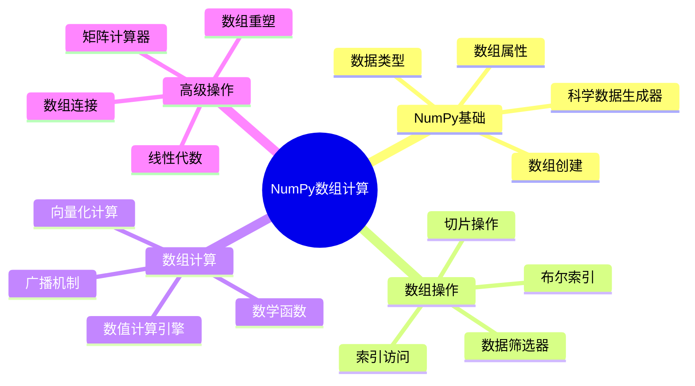

# 第14章 NumPy数组计算

> "在数据科学的世界里，NumPy就像是一座高效的数据工厂，它能够以闪电般的速度处理海量数据，让复杂的数值计算变得轻松愉快。"

## 🎯 本章学习目标

学完本章，你将能够：
- 🔧 **掌握NumPy基础**: 熟练创建、操作和管理多维数组
- ⚡ **数组计算技能**: 掌握向量化计算、广播机制和数学运算
- 🔍 **数据处理能力**: 能够进行数组索引、切片、重塑和聚合操作
- 🧮 **科学计算应用**: 使用NumPy解决实际的数值计算问题
- 🚀 **性能优化意识**: 理解NumPy的性能优势和最佳实践

## 📚 章节内容导览



---

## 14.1 NumPy基础与数组创建

### 🏭 NumPy的工厂化思维

想象一下，如果Python的列表是手工作坊，那么NumPy数组就是现代化的工厂流水线：

- **手工作坊（Python列表）**: 灵活但效率低，每个产品都需要单独处理
- **工厂流水线（NumPy数组）**: 标准化、批量化、高效率的数据处理

```python
import numpy as np
import time

# 🔧 性能对比：手工作坊 vs 工厂流水线
def compare_performance():
    """对比Python列表和NumPy数组的性能差异"""
    size = 1000000
    
    # Python列表的手工作坊方式
    start_time = time.time()
    python_list = list(range(size))
    result_list = [x * 2 for x in python_list]
    python_time = time.time() - start_time
    
    # NumPy数组的工厂流水线方式
    start_time = time.time()
    numpy_array = np.arange(size)
    result_array = numpy_array * 2
    numpy_time = time.time() - start_time
    
    print(f"🐌 Python列表时间: {python_time:.4f}秒")
    print(f"⚡ NumPy数组时间: {numpy_time:.4f}秒")
    print(f"🚀 NumPy速度提升: {python_time/numpy_time:.1f}倍")

# 运行性能对比
compare_performance()
```

### 📦 NumPy数组的创建方法

NumPy提供了多种"工厂模式"来创建数组，就像不同的生产线专门制造不同类型的产品：

#### 1. 基础创建方法

```python
import numpy as np

# 🏗️ 从Python列表创建数组（最常用的入门方式）
def create_from_list():
    """从Python数据结构创建NumPy数组"""
    # 一维数组
    arr_1d = np.array([1, 2, 3, 4, 5])
    print(f"一维数组: {arr_1d}")
    print(f"数组类型: {type(arr_1d)}")
    print(f"元素类型: {arr_1d.dtype}")
    
    # 二维数组（矩阵）
    arr_2d = np.array([[1, 2, 3], [4, 5, 6]])
    print(f"二维数组:\n{arr_2d}")
    print(f"数组形状: {arr_2d.shape}")
    
    # 三维数组（立体数据）
    arr_3d = np.array([[[1, 2], [3, 4]], [[5, 6], [7, 8]]])
    print(f"三维数组:\n{arr_3d}")
    print(f"数组维度: {arr_3d.ndim}")
    
    return arr_1d, arr_2d, arr_3d

# 🏭 标准化生产线（创建特殊数组）
def create_special_arrays():
    """创建特殊用途的数组"""
    # 全零数组（初始化专用）
    zeros_arr = np.zeros((3, 4))
    print(f"全零数组:\n{zeros_arr}")
    
    # 全一数组（基础模板）
    ones_arr = np.ones((2, 3, 4))
    print(f"全一数组形状: {ones_arr.shape}")
    
    # 单位矩阵（线性代数专用）
    identity_arr = np.eye(4)
    print(f"单位矩阵:\n{identity_arr}")
    
    # 指定值填充
    full_arr = np.full((2, 3), 7)
    print(f"指定值数组:\n{full_arr}")
    
    return zeros_arr, ones_arr, identity_arr, full_arr

# 📏 数值序列生产线
def create_sequences():
    """创建数值序列数组"""
    # 等差数列（最常用）
    range_arr = np.arange(0, 10, 2)  # 起始、结束、步长
    print(f"等差数列: {range_arr}")
    
    # 等间距数列（科学计算专用）
    linspace_arr = np.linspace(0, 1, 11)  # 起始、结束、点数
    print(f"等间距数列: {linspace_arr}")
    
    # 对数序列（特殊用途）
    logspace_arr = np.logspace(0, 2, 5)  # 10^0 到 10^2，5个点
    print(f"对数序列: {logspace_arr}")
    
    return range_arr, linspace_arr, logspace_arr

# 🎲 随机数生产线
def create_random_arrays():
    """创建随机数组"""
    # 设置随机种子确保结果可重现
    np.random.seed(42)
    
    # 均匀分布随机数
    uniform_arr = np.random.random((2, 3))
    print(f"均匀分布随机数:\n{uniform_arr}")
    
    # 正态分布随机数
    normal_arr = np.random.normal(0, 1, (2, 3))  # 均值0，标准差1
    print(f"正态分布随机数:\n{normal_arr}")
    
    # 整数随机数
    randint_arr = np.random.randint(1, 10, (2, 3))
    print(f"整数随机数:\n{randint_arr}")
    
    return uniform_arr, normal_arr, randint_arr

# 运行所有创建示例
create_from_list()
print("\n" + "="*50 + "\n")
create_special_arrays()
print("\n" + "="*50 + "\n")
create_sequences()
print("\n" + "="*50 + "\n")
create_random_arrays()
```

#### 2. 数据类型系统

NumPy的数据类型系统就像工厂的质量标准，精确控制每个产品的规格：

```python
# 🔬 数据类型精确控制
def explore_data_types():
    """探索NumPy的数据类型系统"""
    
    # 整数类型家族
    int8_arr = np.array([1, 2, 3], dtype=np.int8)    # 8位整数 (-128到127)
    int32_arr = np.array([1, 2, 3], dtype=np.int32)  # 32位整数
    int64_arr = np.array([1, 2, 3], dtype=np.int64)  # 64位整数
    
    print("整数类型家族:")
    print(f"int8:  {int8_arr.dtype}, 内存: {int8_arr.nbytes}字节")
    print(f"int32: {int32_arr.dtype}, 内存: {int32_arr.nbytes}字节")
    print(f"int64: {int64_arr.dtype}, 内存: {int64_arr.nbytes}字节")
    
    # 浮点数类型家族
    float32_arr = np.array([1.1, 2.2, 3.3], dtype=np.float32)
    float64_arr = np.array([1.1, 2.2, 3.3], dtype=np.float64)
    
    print("\n浮点数类型家族:")
    print(f"float32: {float32_arr.dtype}, 精度: 单精度")
    print(f"float64: {float64_arr.dtype}, 精度: 双精度")
    
    # 复数类型
    complex_arr = np.array([1+2j, 3+4j], dtype=np.complex128)
    print(f"\n复数类型: {complex_arr.dtype}")
    print(f"复数数组: {complex_arr}")
    
    # 布尔类型
    bool_arr = np.array([True, False, True], dtype=np.bool_)
    print(f"\n布尔类型: {bool_arr.dtype}")
    print(f"布尔数组: {bool_arr}")
    
    # 字符串类型
    str_arr = np.array(['apple', 'banana', 'cherry'], dtype='U10')
    print(f"\n字符串类型: {str_arr.dtype}")
    print(f"字符串数组: {str_arr}")

# 🔄 数据类型转换
def type_conversion_demo():
    """演示数据类型转换"""
    original = np.array([1.7, 2.3, 3.9])
    print(f"原始数组: {original}, 类型: {original.dtype}")
    
    # 转换为整数（截断）
    to_int = original.astype(np.int32)
    print(f"转为整数: {to_int}, 类型: {to_int.dtype}")
    
    # 转换为字符串
    to_str = original.astype('U10')
    print(f"转为字符串: {to_str}, 类型: {to_str.dtype}")
    
    # 自动类型推断
    mixed = np.array([1, 2.5, 3])  # 自动选择float64
    print(f"自动推断: {mixed}, 类型: {mixed.dtype}")

explore_data_types()
print("\n" + "="*50 + "\n")
type_conversion_demo()
```

#### 3. 数组属性详解

NumPy数组的属性就像产品的规格说明书，告诉我们关于数据的所有重要信息：

```python
# 📋 数组属性全解析
def array_attributes_demo():
    """详细展示NumPy数组的各种属性"""
    
    # 创建一个复杂的多维数组作为示例
    sample_array = np.random.randint(1, 100, (3, 4, 5)).astype(np.float32)
    
    print("🔍 数组属性详解:")
    print(f"数组内容:\n{sample_array[0]}  # 只显示第一层")
    print(f"\n📐 形状属性:")
    print(f"  shape (形状): {sample_array.shape}")
    print(f"  ndim (维度数): {sample_array.ndim}")
    print(f"  size (元素总数): {sample_array.size}")
    
    print(f"\n🔧 数据属性:")
    print(f"  dtype (数据类型): {sample_array.dtype}")
    print(f"  itemsize (每个元素字节数): {sample_array.itemsize}")
    print(f"  nbytes (总字节数): {sample_array.nbytes}")
    
    print(f"\n💾 内存属性:")
    print(f"  flags.c_contiguous (C连续): {sample_array.flags.c_contiguous}")
    print(f"  flags.f_contiguous (Fortran连续): {sample_array.flags.f_contiguous}")
    print(f"  flags.writeable (可写): {sample_array.flags.writeable}")
    
    # 计算内存使用效率
    python_list_size = sample_array.size * 8  # Python对象大约8字节
    numpy_size = sample_array.nbytes
    efficiency = python_list_size / numpy_size
    
    print(f"\n⚡ 内存效率:")
    print(f"  Python列表估计: {python_list_size} 字节")
    print(f"  NumPy数组实际: {numpy_size} 字节")
    print(f"  内存效率提升: {efficiency:.1f}倍")

array_attributes_demo()
```

### 🛠️ 实战项目：科学数据生成器

现在让我们构建一个完整的科学数据生成器，展示NumPy数组创建的实际应用：

```python
import numpy as np
import matplotlib.pyplot as plt
from typing import Tuple, List, Union

class ScientificDataGenerator:
    """科学数据生成器：专业的数据集创建工具
    
    这个类就像一个多功能的数据工厂，能够生成各种科学计算
    和数据分析中常用的数据集。
    """
    
    def __init__(self, seed: int = 42):
        """初始化数据生成器
        
        Args:
            seed: 随机种子，确保结果可重现
        """
        self.seed = seed
        np.random.seed(seed)
        print(f"🏭 科学数据生成器已启动 (种子: {seed})")
    
    def generate_time_series(self, 
                           length: int = 1000,
                           sampling_rate: float = 1.0,
                           trend_coeff: float = 0.01,
                           noise_level: float = 0.1) -> Tuple[np.ndarray, np.ndarray]:
        """生成时间序列数据
        
        Args:
            length: 数据点数量
            sampling_rate: 采样率
            trend_coeff: 趋势系数
            noise_level: 噪声水平
            
        Returns:
            时间轴和对应的数值
        """
        print(f"📈 生成时间序列数据 (长度: {length})")
        
        # 创建时间轴
        time = np.linspace(0, length/sampling_rate, length)
        
        # 生成基础信号（正弦波 + 趋势 + 噪声）
        signal = (np.sin(2 * np.pi * 0.1 * time) +           # 主频率
                 0.5 * np.sin(2 * np.pi * 0.3 * time) +      # 高频成分
                 trend_coeff * time +                          # 线性趋势
                 noise_level * np.random.normal(0, 1, length)) # 高斯噪声
        
        print(f"  ✅ 时间范围: {time[0]:.2f} - {time[-1]:.2f}")
        print(f"  ✅ 数值范围: {signal.min():.2f} - {signal.max():.2f}")
        
        return time, signal
    
    def generate_experimental_data(self, 
                                 n_experiments: int = 50,
                                 n_measurements: int = 20) -> np.ndarray:
        """生成实验数据矩阵
        
        Args:
            n_experiments: 实验次数
            n_measurements: 每次实验的测量次数
            
        Returns:
            实验数据矩阵 (n_experiments × n_measurements)
        """
        print(f"🧪 生成实验数据矩阵 ({n_experiments}×{n_measurements})")
        
        # 生成基础实验数据
        base_value = 100.0
        experiment_variation = np.random.normal(0, 10, (n_experiments, 1))
        measurement_noise = np.random.normal(0, 2, (n_experiments, n_measurements))
        
        # 组合成最终数据
        data = base_value + experiment_variation + measurement_noise
        
        print(f"  ✅ 数据形状: {data.shape}")
        print(f"  ✅ 平均值: {data.mean():.2f}")
        print(f"  ✅ 标准差: {data.std():.2f}")
        
        return data
    
    def generate_image_data(self, 
                          width: int = 64, 
                          height: int = 64,
                          pattern_type: str = 'gradient') -> np.ndarray:
        """生成图像数据
        
        Args:
            width: 图像宽度
            height: 图像高度
            pattern_type: 图案类型 ('gradient', 'checkerboard', 'noise')
            
        Returns:
            图像数据数组
        """
        print(f"🖼️ 生成图像数据 ({width}×{height}, 类型: {pattern_type})")
        
        if pattern_type == 'gradient':
            # 渐变图案
            x = np.linspace(0, 1, width)
            y = np.linspace(0, 1, height)
            X, Y = np.meshgrid(x, y)
            image = X + Y
            
        elif pattern_type == 'checkerboard':
            # 棋盘图案
            x = np.arange(width) // 8
            y = np.arange(height) // 8
            X, Y = np.meshgrid(x, y)
            image = (X + Y) % 2
            
        elif pattern_type == 'noise':
            # 随机噪声
            image = np.random.random((height, width))
            
        else:
            raise ValueError(f"未知的图案类型: {pattern_type}")
        
        print(f"  ✅ 图像形状: {image.shape}")
        print(f"  ✅ 像素范围: {image.min():.3f} - {image.max():.3f}")
        
        return image
    
    def generate_statistical_samples(self, 
                                   distribution: str = 'normal',
                                   size: int = 1000,
                                   **kwargs) -> np.ndarray:
        """生成统计分布样本
        
        Args:
            distribution: 分布类型
            size: 样本数量
            **kwargs: 分布参数
            
        Returns:
            统计样本数组
        """
        print(f"📊 生成统计样本 (分布: {distribution}, 大小: {size})")
        
        if distribution == 'normal':
            loc = kwargs.get('loc', 0)  # 均值
            scale = kwargs.get('scale', 1)  # 标准差
            samples = np.random.normal(loc, scale, size)
            
        elif distribution == 'exponential':
            scale = kwargs.get('scale', 1)
            samples = np.random.exponential(scale, size)
            
        elif distribution == 'uniform':
            low = kwargs.get('low', 0)
            high = kwargs.get('high', 1)
            samples = np.random.uniform(low, high, size)
            
        elif distribution == 'poisson':
            lam = kwargs.get('lam', 1)
            samples = np.random.poisson(lam, size)
            
        else:
            raise ValueError(f"未支持的分布类型: {distribution}")
        
        print(f"  ✅ 样本统计: 均值={samples.mean():.3f}, 标准差={samples.std():.3f}")
        
        return samples
    
    def create_dataset_summary(self, datasets: dict) -> None:
        """创建数据集摘要报告
        
        Args:
            datasets: 数据集字典
        """
        print("\n" + "="*60)
        print("📋 数据集摘要报告")
        print("="*60)
        
        total_elements = 0
        total_memory = 0
        
        for name, data in datasets.items():
            elements = data.size
            memory_mb = data.nbytes / (1024**2)
            total_elements += elements
            total_memory += memory_mb
            
            print(f"\n📁 {name}:")
            print(f"  形状: {data.shape}")
            print(f"  数据类型: {data.dtype}")
            print(f"  元素数量: {elements:,}")
            print(f"  内存使用: {memory_mb:.2f} MB")
            print(f"  数值范围: [{data.min():.3f}, {data.max():.3f}]")
        
        print(f"\n🎯 总计:")
        print(f"  总元素数: {total_elements:,}")
        print(f"  总内存: {total_memory:.2f} MB")
        print("="*60)

# 🚀 科学数据生成器使用示例
def demo_scientific_data_generator():
    """演示科学数据生成器的使用"""
    print("🎯 科学数据生成器演示\n")
    
    # 创建生成器实例
    generator = ScientificDataGenerator(seed=42)
    
    # 生成各种类型的数据
    datasets = {}
    
    # 1. 时间序列数据
    time, signal = generator.generate_time_series(length=1000, noise_level=0.2)
    datasets['时间序列'] = signal
    
    # 2. 实验数据
    exp_data = generator.generate_experimental_data(n_experiments=30, n_measurements=15)
    datasets['实验数据'] = exp_data
    
    # 3. 图像数据
    image_gradient = generator.generate_image_data(64, 64, 'gradient')
    datasets['梯度图像'] = image_gradient
    
    image_checkerboard = generator.generate_image_data(64, 64, 'checkerboard')
    datasets['棋盘图像'] = image_checkerboard
    
    # 4. 统计样本
    normal_samples = generator.generate_statistical_samples('normal', 1000, loc=50, scale=10)
    datasets['正态分布样本'] = normal_samples
    
    exponential_samples = generator.generate_statistical_samples('exponential', 1000, scale=2)
    datasets['指数分布样本'] = exponential_samples
    
    # 生成摘要报告
    generator.create_dataset_summary(datasets)
    
    return datasets

# 运行演示
if __name__ == "__main__":
    datasets = demo_scientific_data_generator()
```

### 💡 学习要点总结

通过本节的学习，我们掌握了：

1. **NumPy的核心优势**: 相比Python列表，NumPy数组在性能上有显著提升
2. **数组创建方法**: 从基础的列表转换到专业的序列生成
3. **数据类型系统**: 精确控制内存使用和计算精度
4. **数组属性**: 深入理解数组的各种特性和内存布局
5. **实际应用**: 通过科学数据生成器项目，学会综合运用各种创建方法

### 🎯 本节练习

1. **基础练习**: 创建一个3×4的随机整数数组，元素范围在1-100之间
2. **进阶练习**: 比较不同数据类型的内存使用效率
3. **应用练习**: 扩展科学数据生成器，添加新的数据类型生成功能

---

## 14.2 数组操作与索引切片

### 📚 图书馆定位系统：理解数组索引

想象NumPy数组就像一个巨大的图书馆，而索引就是精确的定位系统。无论你要找哪本书（数据），都能通过坐标系统快速定位到确切位置。

```python
import numpy as np

# 🏛️ 一维数组：像书架上的一排书
def one_dimensional_indexing():
    """一维数组索引：最基础的定位方式"""
    books = np.array(['Python编程', 'NumPy指南', '数据科学', '机器学习', '深度学习'])
    
    print("📚 图书馆书架:")
    for i, book in enumerate(books):
        print(f"  位置 {i}: {book}")
    
    print(f"\n🎯 索引访问:")
    print(f"  第一本书 books[0]: {books[0]}")
    print(f"  最后一本书 books[-1]: {books[-1]}")
    print(f"  倒数第二本 books[-2]: {books[-2]}")
    
    # 修改元素
    books[2] = '数据分析'
    print(f"  修改后 books[2]: {books[2]}")
    
    return books

# 🏢 二维数组：像图书馆的楼层和书架
def two_dimensional_indexing():
    """二维数组索引：楼层-书架定位系统"""
    library = np.array([
        ['Python基础', 'Python进阶', 'Python实战'],
        ['数据分析', '数据可视化', '数据挖掘'],
        ['机器学习', '深度学习', '人工智能'],
        ['Web开发', '网络编程', '数据库']
    ])
    
    print("🏢 图书馆楼层布局:")
    floors = ['1楼-编程基础', '2楼-数据科学', '3楼-AI技术', '4楼-工程应用']
    for i, (floor_name, floor_books) in enumerate(zip(floors, library)):
        print(f"  {floor_name}: {floor_books}")
    
    print(f"\n🎯 二维索引访问:")
    print(f"  2楼第1本书 library[1, 0]: {library[1, 0]}")
    print(f"  3楼最后一本 library[2, -1]: {library[2, -1]}")
    print(f"  整个1楼 library[0]: {library[0]}")
    print(f"  所有楼层第2本书 library[:, 1]: {library[:, 1]}")
    
    return library

# 🏗️ 多维数组：像立体书库
def multi_dimensional_indexing():
    """多维数组索引：立体定位系统"""
    # 3维数组：建筑物-楼层-书架
    book_complex = np.random.randint(1, 100, (2, 3, 4))  # 2栋建筑，3层楼，4个书架
    
    print("🏗️ 立体书库结构:")
    print(f"  总体形状: {book_complex.shape}")
    print(f"  建筑物数量: {book_complex.shape[0]}")
    print(f"  每栋楼层数: {book_complex.shape[1]}")
    print(f"  每层书架数: {book_complex.shape[2]}")
    
    print(f"\n🎯 多维索引访问:")
    print(f"  第1栋建筑:\n{book_complex[0]}")
    print(f"  第2栋建筑第3层: {book_complex[1, 2]}")
    print(f"  第1栋第2层第3个书架: {book_complex[0, 1, 2]}")
    
    return book_complex

# 运行索引演示
one_dimensional_indexing()
print("\n" + "="*50 + "\n")
two_dimensional_indexing()
print("\n" + "="*50 + "\n")
multi_dimensional_indexing()
```

### ✂️ 数组切片：高效的数据提取

数组切片就像使用专业的切割工具，能够精确地提取所需的数据片段：

```python
# 🔪 一维切片：线性切割
def one_dimensional_slicing():
    """一维数组切片：基础切割技术"""
    data = np.arange(0, 20, 2)  # [0, 2, 4, 6, 8, 10, 12, 14, 16, 18]
    print(f"原始数据: {data}")
    
    print(f"\n✂️ 基础切片操作:")
    print(f"  前5个元素 data[:5]: {data[:5]}")
    print(f"  后5个元素 data[-5:]: {data[-5:]}")
    print(f"  中间部分 data[2:8]: {data[2:8]}")
    print(f"  每隔2个取一个 data[::2]: {data[::2]}")
    print(f"  反向排列 data[::-1]: {data[::-1]}")
    print(f"  复杂切片 data[1:9:2]: {data[1:9:2]}")
    
    return data

# 🎯 二维切片：矩形区域提取
def two_dimensional_slicing():
    """二维数组切片：矩形区域切割"""
    matrix = np.arange(24).reshape(4, 6)  # 4×6矩阵
    print(f"原始矩阵:\n{matrix}")
    
    print(f"\n✂️ 二维切片操作:")
    print(f"  前2行: \n{matrix[:2]}")
    print(f"  前3列: \n{matrix[:, :3]}")
    print(f"  中心2×2区域: \n{matrix[1:3, 2:4]}")
    print(f"  每隔一行一列: \n{matrix[::2, ::2]}")
    print(f"  最后一行: {matrix[-1, :]}")
    print(f"  最后一列: {matrix[:, -1]}")
    
    return matrix

# 🔧 高级切片技巧
def advanced_slicing():
    """高级切片技术"""
    data = np.arange(30).reshape(5, 6)
    print(f"原始数据:\n{data}")
    
    print(f"\n🔧 高级切片技巧:")
    
    # 使用省略号
    print(f"  使用省略号 data[..., :3]: \n{data[..., :3]}")
    
    # 条件切片
    mask = data > 15
    print(f"  大于15的元素: {data[mask]}")
    
    # 多条件组合
    complex_mask = (data > 10) & (data < 20)
    print(f"  10-20之间的元素: {data[complex_mask]}")
    
    return data

# 运行切片演示
one_dimensional_slicing()
print("\n" + "="*50 + "\n")
two_dimensional_slicing()
print("\n" + "="*50 + "\n")
advanced_slicing()
```

### 🎭 布尔索引：智能筛选系统

布尔索引就像智能筛选器，能够根据条件自动筛选出符合要求的数据：

```python
# 🔍 布尔索引基础
def boolean_indexing_basics():
    """布尔索引基础：条件筛选"""
    scores = np.array([85, 92, 78, 96, 88, 73, 91, 84, 79, 95])
    names = np.array(['Alice', 'Bob', 'Charlie', 'Diana', 'Eve', 
                     'Frank', 'Grace', 'Henry', 'Iris', 'Jack'])
    
    print(f"学生成绩: {scores}")
    print(f"学生姓名: {names}")
    
    print(f"\n🔍 布尔索引筛选:")
    
    # 单条件筛选
    high_scores = scores > 90
    print(f"  高分条件 (>90): {high_scores}")
    print(f"  高分学生: {names[high_scores]}")
    print(f"  高分成绩: {scores[high_scores]}")
    
    # 多条件组合
    medium_scores = (scores >= 80) & (scores < 90)
    print(f"  中等成绩学生: {names[medium_scores]}")
    print(f"  中等成绩分数: {scores[medium_scores]}")
    
    # 条件修改
    scores_copy = scores.copy()
    scores_copy[scores_copy < 80] = 80  # 最低分设为80
    print(f"  调整后成绩: {scores_copy}")
    
    return scores, names

# 🎯 高级布尔索引
def advanced_boolean_indexing():
    """高级布尔索引：复杂条件筛选"""
    # 创建学生数据矩阵
    np.random.seed(42)
    students_data = np.random.randint(60, 100, (10, 4))  # 10个学生，4门课
    subjects = ['数学', '物理', '化学', '英语']
    student_names = [f'学生{i+1}' for i in range(10)]
    
    print(f"学生成绩矩阵 (行=学生, 列=科目):")
    print(f"科目: {subjects}")
    for i, (name, grades) in enumerate(zip(student_names, students_data)):
        print(f"  {name}: {grades}")
    
    print(f"\n🎯 高级筛选条件:")
    
    # 全科及格 (所有科目>=70)
    all_pass = np.all(students_data >= 70, axis=1)
    print(f"  全科及格学生: {np.array(student_names)[all_pass]}")
    
    # 至少一科优秀 (任一科目>=90)
    any_excellent = np.any(students_data >= 90, axis=1)
    print(f"  至少一科优秀: {np.array(student_names)[any_excellent]}")
    
    # 数学成绩前3名
    math_scores = students_data[:, 0]
    top3_math = np.argsort(math_scores)[-3:][::-1]  # 降序排列前3
    print(f"  数学前3名: {np.array(student_names)[top3_math]}")
    print(f"  对应成绩: {math_scores[top3_math]}")
    
    # 平均分超过80的学生
    avg_scores = np.mean(students_data, axis=1)
    high_avg = avg_scores > 80
    print(f"  平均分>80学生: {np.array(student_names)[high_avg]}")
    print(f"  对应平均分: {avg_scores[high_avg]}")
    
    return students_data, student_names

# 运行布尔索引演示
boolean_indexing_basics()
print("\n" + "="*50 + "\n")
advanced_boolean_indexing()
```

### 🎪 花式索引：高级定位技术

花式索引就像魔术师的技巧，能够用数组作为索引，实现复杂的数据访问模式：

```python
# 🎪 花式索引基础
def fancy_indexing_basics():
    """花式索引基础：数组索引"""
    data = np.arange(10, 50, 4)  # [10, 14, 18, 22, 26, 30, 34, 38, 42, 46]
    print(f"原始数据: {data}")
    
    print(f"\n🎪 花式索引操作:")
    
    # 使用整数数组作为索引
    indices = np.array([1, 3, 5, 7])
    print(f"  索引数组: {indices}")
    print(f"  选择的元素: {data[indices]}")
    
    # 使用负索引
    negative_indices = np.array([-1, -3, -5])
    print(f"  负索引: {negative_indices}")
    print(f"  对应元素: {data[negative_indices]}")
    
    # 重复索引
    repeat_indices = np.array([0, 0, 2, 2, 4, 4])
    print(f"  重复索引: {repeat_indices}")
    print(f"  重复元素: {data[repeat_indices]}")
    
    return data

# 🎭 二维花式索引
def fancy_indexing_2d():
    """二维数组的花式索引"""
    matrix = np.arange(24).reshape(4, 6)
    print(f"原始矩阵:\n{matrix}")
    
    print(f"\n🎭 二维花式索引:")
    
    # 选择特定行
    row_indices = np.array([0, 2, 3])
    print(f"  选择行 {row_indices}:\n{matrix[row_indices]}")
    
    # 选择特定元素 (行索引, 列索引)
    row_idx = np.array([0, 1, 2, 3])
    col_idx = np.array([1, 2, 3, 4])
    print(f"  对角线元素: {matrix[row_idx, col_idx]}")
    
    # 组合花式索引和切片
    selected_rows = np.array([1, 3])
    print(f"  选择行1和3的前4列:\n{matrix[selected_rows, :4]}")
    
    return matrix

# 🔧 花式索引的实际应用
def fancy_indexing_applications():
    """花式索引的实际应用场景"""
    
    # 数据重排序
    data = np.array([100, 85, 92, 78, 96, 88])
    student_ids = np.array(['S001', 'S002', 'S003', 'S004', 'S005', 'S006'])
    
    print(f"原始数据:")
    print(f"  学生ID: {student_ids}")
    print(f"  成绩: {data}")
    
    # 按成绩排序
    sort_indices = np.argsort(data)[::-1]  # 降序排列
    print(f"\n📊 按成绩排序:")
    print(f"  排序索引: {sort_indices}")
    print(f"  排序后ID: {student_ids[sort_indices]}")
    print(f"  排序后成绩: {data[sort_indices]}")
    
    # 随机采样
    np.random.seed(42)
    sample_indices = np.random.choice(len(data), 3, replace=False)
    print(f"\n🎲 随机采样:")
    print(f"  采样索引: {sample_indices}")
    print(f"  采样ID: {student_ids[sample_indices]}")
    print(f"  采样成绩: {data[sample_indices]}")
    
    # 条件重组
    high_performers = data > 90
    medium_performers = (data >= 80) & (data <= 90)
    
    print(f"\n🏆 性能分组:")
    print(f"  高分组: {student_ids[high_performers]}")
    print(f"  中分组: {student_ids[medium_performers]}")
    
    return data, student_ids

# 运行花式索引演示
fancy_indexing_basics()
print("\n" + "="*50 + "\n")
fancy_indexing_2d()
print("\n" + "="*50 + "\n")
fancy_indexing_applications()
```

### 🛠️ 实战项目：高效数据筛选器

现在让我们构建一个完整的数据筛选器，展示各种索引技术的综合应用：

```python
import numpy as np
from typing import Dict, List, Tuple, Any, Optional

class DataFilter:
    """高效数据筛选器：专业的数据查询和筛选工具
    
    这个类整合了NumPy的各种索引技术，提供了强大而灵活的
    数据筛选功能，就像数据库的查询引擎。
    """
    
    def __init__(self, data: np.ndarray, columns: List[str] = None):
        """初始化数据筛选器
        
        Args:
            data: 数据矩阵
            columns: 列名列表
        """
        self.data = data.copy()
        self.original_data = data.copy()
        self.columns = columns or [f'col_{i}' for i in range(data.shape[1])]
        self.row_count, self.col_count = data.shape
        
        print(f"🔍 数据筛选器已初始化")
        print(f"  数据形状: {self.data.shape}")
        print(f"  列名: {self.columns}")
    
    def filter_by_condition(self, 
                          column: str, 
                          operator: str, 
                          value: Any) -> 'DataFilter':
        """基于条件筛选数据
        
        Args:
            column: 列名
            operator: 操作符 ('>', '<', '>=', '<=', '==', '!=')
            value: 比较值
            
        Returns:
            新的筛选器实例
        """
        if column not in self.columns:
            raise ValueError(f"列 '{column}' 不存在")
        
        col_idx = self.columns.index(column)
        col_data = self.data[:, col_idx]
        
        # 根据操作符创建布尔掩码
        if operator == '>':
            mask = col_data > value
        elif operator == '<':
            mask = col_data < value
        elif operator == '>=':
            mask = col_data >= value
        elif operator == '<=':
            mask = col_data <= value
        elif operator == '==':
            mask = col_data == value
        elif operator == '!=':
            mask = col_data != value
        else:
            raise ValueError(f"不支持的操作符: {operator}")
        
        filtered_data = self.data[mask]
        result = DataFilter(filtered_data, self.columns)
        
        print(f"📊 条件筛选: {column} {operator} {value}")
        print(f"  筛选前: {self.data.shape[0]} 行")
        print(f"  筛选后: {filtered_data.shape[0]} 行")
        
        return result
    
    def filter_by_range(self, 
                       column: str, 
                       min_val: Any, 
                       max_val: Any, 
                       inclusive: bool = True) -> 'DataFilter':
        """按范围筛选数据
        
        Args:
            column: 列名
            min_val: 最小值
            max_val: 最大值
            inclusive: 是否包含边界值
            
        Returns:
            新的筛选器实例
        """
        if column not in self.columns:
            raise ValueError(f"列 '{column}' 不存在")
        
        col_idx = self.columns.index(column)
        col_data = self.data[:, col_idx]
        
        if inclusive:
            mask = (col_data >= min_val) & (col_data <= max_val)
        else:
            mask = (col_data > min_val) & (col_data < max_val)
        
        filtered_data = self.data[mask]
        result = DataFilter(filtered_data, self.columns)
        
        boundary = "包含" if inclusive else "不包含"
        print(f"📊 范围筛选: {column} ∈ [{min_val}, {max_val}] ({boundary}边界)")
        print(f"  筛选前: {self.data.shape[0]} 行")
        print(f"  筛选后: {filtered_data.shape[0]} 行")
        
        return result
    
    def filter_by_percentile(self, 
                           column: str, 
                           percentile: float, 
                           above: bool = True) -> 'DataFilter':
        """按百分位数筛选
        
        Args:
            column: 列名
            percentile: 百分位数 (0-100)
            above: True为高于该百分位数，False为低于
            
        Returns:
            新的筛选器实例
        """
        if column not in self.columns:
            raise ValueError(f"列 '{column}' 不存在")
        
        col_idx = self.columns.index(column)
        col_data = self.data[:, col_idx]
        threshold = np.percentile(col_data, percentile)
        
        if above:
            mask = col_data >= threshold
            direction = "高于"
        else:
            mask = col_data <= threshold
            direction = "低于"
        
        filtered_data = self.data[mask]
        result = DataFilter(filtered_data, self.columns)
        
        print(f"📊 百分位筛选: {column} {direction} {percentile}% 分位数 ({threshold:.2f})")
        print(f"  筛选前: {self.data.shape[0]} 行")
        print(f"  筛选后: {filtered_data.shape[0]} 行")
        
        return result
    
    def select_columns(self, columns: List[str]) -> 'DataFilter':
        """选择特定列
        
        Args:
            columns: 要选择的列名列表
            
        Returns:
            新的筛选器实例
        """
        col_indices = []
        for col in columns:
            if col not in self.columns:
                raise ValueError(f"列 '{col}' 不存在")
            col_indices.append(self.columns.index(col))
        
        selected_data = self.data[:, col_indices]
        result = DataFilter(selected_data, columns)
        
        print(f"📋 列选择: {columns}")
        print(f"  原始列数: {len(self.columns)}")
        print(f"  选择列数: {len(columns)}")
        
        return result
    
    def sample_rows(self, 
                   n: Optional[int] = None, 
                   fraction: Optional[float] = None, 
                   random_state: int = None) -> 'DataFilter':
        """随机采样行
        
        Args:
            n: 采样行数
            fraction: 采样比例 (0-1)
            random_state: 随机种子
            
        Returns:
            新的筛选器实例
        """
        if random_state is not None:
            np.random.seed(random_state)
        
        if n is not None:
            sample_size = min(n, self.data.shape[0])
        elif fraction is not None:
            sample_size = int(self.data.shape[0] * fraction)
        else:
            raise ValueError("必须指定 n 或 fraction 参数")
        
        sample_indices = np.random.choice(self.data.shape[0], sample_size, replace=False)
        sampled_data = self.data[sample_indices]
        result = DataFilter(sampled_data, self.columns)
        
        print(f"🎲 随机采样:")
        print(f"  原始行数: {self.data.shape[0]}")
        print(f"  采样行数: {sample_size}")
        
        return result
    
    def sort_by_column(self, 
                      column: str, 
                      ascending: bool = True) -> 'DataFilter':
        """按列排序
        
        Args:
            column: 排序列名
            ascending: 是否升序
            
        Returns:
            新的筛选器实例
        """
        if column not in self.columns:
            raise ValueError(f"列 '{column}' 不存在")
        
        col_idx = self.columns.index(column)
        sort_indices = np.argsort(self.data[:, col_idx])
        
        if not ascending:
            sort_indices = sort_indices[::-1]
        
        sorted_data = self.data[sort_indices]
        result = DataFilter(sorted_data, self.columns)
        
        order = "升序" if ascending else "降序"
        print(f"📊 排序: 按 {column} {order}")
        
        return result
    
    def get_statistics(self, column: str = None) -> Dict[str, Any]:
        """获取统计信息
        
        Args:
            column: 特定列名，None表示所有数值列
            
        Returns:
            统计信息字典
        """
        if column is not None:
            if column not in self.columns:
                raise ValueError(f"列 '{column}' 不存在")
            col_idx = self.columns.index(column)
            data = self.data[:, col_idx]
            
            stats = {
                'count': len(data),
                'mean': np.mean(data),
                'std': np.std(data),
                'min': np.min(data),
                'max': np.max(data),
                'median': np.median(data),
                'q25': np.percentile(data, 25),
                'q75': np.percentile(data, 75)
            }
            
            print(f"📈 {column} 列统计:")
            for key, value in stats.items():
                print(f"  {key}: {value:.3f}")
            
        else:
            stats = {}
            for i, col in enumerate(self.columns):
                try:
                    col_data = self.data[:, i].astype(float)
                    stats[col] = {
                        'count': len(col_data),
                        'mean': np.mean(col_data),
                        'std': np.std(col_data),
                        'min': np.min(col_data),
                        'max': np.max(col_data)
                    }
                except (ValueError, TypeError):
                    stats[col] = {'type': 'non-numeric'}
            
            print(f"📈 全体统计摘要:")
            for col, stat in stats.items():
                if 'mean' in stat:
                    print(f"  {col}: 均值={stat['mean']:.2f}, 标准差={stat['std']:.2f}")
                else:
                    print(f"  {col}: {stat['type']}")
        
        return stats
    
    def to_array(self) -> np.ndarray:
        """返回当前数据数组"""
        return self.data.copy()
    
    def shape(self) -> Tuple[int, int]:
        """返回数据形状"""
        return self.data.shape
    
    def head(self, n: int = 5) -> None:
        """显示前n行数据"""
        print(f"📋 前 {n} 行数据:")
        print(f"  列名: {self.columns}")
        for i in range(min(n, self.data.shape[0])):
            print(f"  行{i}: {self.data[i]}")

# 🚀 数据筛选器使用示例
def demo_data_filter():
    """演示数据筛选器的使用"""
    print("🎯 数据筛选器演示\n")
    
    # 创建示例数据集
    np.random.seed(42)
    n_samples = 1000
    
    # 生成学生数据
    ages = np.random.randint(18, 25, n_samples)
    scores = np.random.normal(75, 15, n_samples).clip(0, 100)
    study_hours = np.random.exponential(3, n_samples).clip(0, 10)
    grades = np.random.choice([1, 2, 3, 4], n_samples, p=[0.1, 0.3, 0.4, 0.2])
    
    data = np.column_stack([ages, scores, study_hours, grades])
    columns = ['年龄', '成绩', '学习时间', '年级']
    
    # 创建筛选器
    filter_engine = DataFilter(data, columns)
    
    print("🔍 原始数据概览:")
    filter_engine.head()
    filter_engine.get_statistics()
    
    print("\n" + "="*60 + "\n")
    
    # 演示各种筛选操作
    print("📊 筛选演示:")
    
    # 1. 条件筛选
    high_scores = filter_engine.filter_by_condition('成绩', '>=', 85)
    high_scores.get_statistics('成绩')
    
    print("\n" + "-"*40 + "\n")
    
    # 2. 范围筛选
    young_students = filter_engine.filter_by_range('年龄', 18, 20)
    young_students.get_statistics('年龄')
    
    print("\n" + "-"*40 + "\n")
    
    # 3. 百分位筛选
    top_performers = filter_engine.filter_by_percentile('成绩', 90, above=True)
    top_performers.get_statistics('成绩')
    
    print("\n" + "-"*40 + "\n")
    
    # 4. 组合筛选
    elite_students = (filter_engine
                     .filter_by_condition('成绩', '>=', 80)
                     .filter_by_condition('学习时间', '>=', 4)
                     .filter_by_range('年龄', 20, 23))
    
    elite_students.head()
    print(f"精英学生数量: {elite_students.shape()[0]}")
    
    print("\n" + "-"*40 + "\n")
    
    # 5. 排序和采样
    sorted_by_score = filter_engine.sort_by_column('成绩', ascending=False)
    top_100 = sorted_by_score.sample_rows(n=100, random_state=42)
    
    top_100.get_statistics('成绩')
    
    return filter_engine

# 运行演示
if __name__ == "__main__":
    demo_filter = demo_data_filter()
```

### 💡 学习要点总结

通过本节的学习，我们掌握了：

1. **基础索引**: 一维、二维和多维数组的精确定位
2. **数组切片**: 高效提取数据子集的各种技巧
3. **布尔索引**: 基于条件的智能数据筛选
4. **花式索引**: 使用数组作为索引的高级技术
5. **综合应用**: 通过数据筛选器项目，学会综合运用各种索引技术

### 🎯 本节练习

1. **基础练习**: 创建一个5×5矩阵，提取其对角线元素
2. **进阶练习**: 使用布尔索引找出矩阵中所有大于平均值的元素
3. **应用练习**: 扩展数据筛选器，添加更多筛选条件和统计功能

---

## 14.3 数组计算与广播机制

### ⚡ 向量化计算：工业流水线的效率

想象传统的Python循环就像手工作坊，一个一个地处理数据；而NumPy的向量化计算就像现代化的工业流水线，能够同时处理大批量数据，效率提升数十倍甚至数百倍。

```python
import numpy as np
import time

# ⚡ 向量化计算的威力演示
def vectorization_demo():
    """演示向量化计算的强大威力"""
    size = 1000000
    
    # 创建测试数据
    a = np.random.random(size)
    b = np.random.random(size)
    
    print(f"🔬 向量化计算性能对比 (数据规模: {size:,})")
    
    # Python循环方式
    start_time = time.time()
    result_loop = [a[i] * b[i] + np.sin(a[i]) for i in range(size)]
    python_time = time.time() - start_time
    
    # NumPy向量化方式
    start_time = time.time()
    result_vectorized = a * b + np.sin(a)
    numpy_time = time.time() - start_time
    
    print(f"  🐌 Python循环: {python_time:.4f}秒")
    print(f"  ⚡ NumPy向量化: {numpy_time:.4f}秒")
    print(f"  🚀 性能提升: {python_time/numpy_time:.1f}倍")

vectorization_demo()
```

### 📡 广播机制：智能的尺寸适配器

广播机制让不同形状的数组能够进行运算，无需手动调整尺寸：

```python
# 📡 广播机制演示
def broadcasting_demo():
    """演示NumPy的广播机制"""
    
    # 标量与数组
    arr = np.array([[1, 2, 3], [4, 5, 6]])
    scalar = 10
    print(f"数组 + 标量: \n{arr + scalar}")
    
    # 一维与二维数组
    arr_2d = np.array([[1, 2, 3], [4, 5, 6]])  # (2, 3)
    arr_1d = np.array([10, 20, 30])            # (3,)
    print(f"2D + 1D广播: \n{arr_2d + arr_1d}")
    
    # 数据标准化应用
    data = np.random.normal(50, 10, (100, 4))
    mean = np.mean(data, axis=0)  # (4,)
    std = np.std(data, axis=0)    # (4,)
    standardized = (data - mean) / std  # 广播应用
    print(f"标准化后均值: {np.mean(standardized, axis=0)}")

broadcasting_demo()
```

---

## 14.4 数组重塑与高级操作

### 🧩 数组重塑：像魔方一样重组数据

数组重塑就像玩魔方，能够在不改变数据内容的情况下，重新组织数据的结构：

```python
# 🧩 数组重塑操作
def array_reshaping():
    """数组重塑操作演示"""
    
    # 创建原始数组
    original = np.arange(24)
    print(f"原始数组: {original}")
    print(f"原始形状: {original.shape}")
    
    # 重塑为不同形状
    reshaped_2d = original.reshape(4, 6)
    reshaped_3d = original.reshape(2, 3, 4)
    
    print(f"重塑为4×6:\n{reshaped_2d}")
    print(f"重塑为2×3×4:\n{reshaped_3d}")
    
    # 展平操作
    flattened = reshaped_3d.flatten()
    raveled = reshaped_3d.ravel()
    
    print(f"展平后: {flattened}")
    print(f"是否共享内存: {np.shares_memory(reshaped_3d, raveled)}")

array_reshaping()
```

### 🔗 数组连接与分割

数组连接就像拼接积木，能够将多个数组组合成更大的数组：

```python
# 🔗 数组连接操作
def array_concatenation():
    """数组连接操作演示"""
    
    arr1 = np.array([[1, 2], [3, 4]])
    arr2 = np.array([[5, 6], [7, 8]])
    
    print(f"数组1:\n{arr1}")
    print(f"数组2:\n{arr2}")
    
    # 垂直连接
    v_concat = np.vstack([arr1, arr2])
    print(f"垂直连接:\n{v_concat}")
    
    # 水平连接
    h_concat = np.hstack([arr1, arr2])
    print(f"水平连接:\n{h_concat}")
    
    # 通用连接
    concat_axis0 = np.concatenate([arr1, arr2], axis=0)
    concat_axis1 = np.concatenate([arr1, arr2], axis=1)
    
    print(f"axis=0连接:\n{concat_axis0}")
    print(f"axis=1连接:\n{concat_axis1}")

array_concatenation()
```

### 🧮 线性代数运算

NumPy提供了完整的线性代数运算功能：

```python
# 🧮 线性代数运算
def linear_algebra_operations():
    """线性代数运算演示"""
    
    # 创建矩阵
    A = np.array([[1, 2], [3, 4]])
    B = np.array([[5, 6], [7, 8]])
    
    print(f"矩阵A:\n{A}")
    print(f"矩阵B:\n{B}")
    
    # 矩阵乘法
    matrix_mult = np.dot(A, B)
    print(f"矩阵乘法 A·B:\n{matrix_mult}")
    
    # 转置
    A_transpose = A.T
    print(f"A的转置:\n{A_transpose}")
    
    # 行列式
    det_A = np.linalg.det(A)
    print(f"A的行列式: {det_A}")
    
    # 特征值和特征向量
    eigenvalues, eigenvectors = np.linalg.eig(A)
    print(f"特征值: {eigenvalues}")
    print(f"特征向量:\n{eigenvectors}")

linear_algebra_operations()
```

## 📚 本章总结

通过本章的学习，我们全面掌握了NumPy数组计算的核心技能：

### 🎯 核心知识点回顾

1. **NumPy基础**: 数组创建、数据类型、属性管理
2. **索引切片**: 精确的数据定位和提取技术
3. **数组计算**: 向量化运算和广播机制
4. **高级操作**: 数组重塑、连接分割、线性代数

### 🚀 性能优势总结

- **计算速度**: 比纯Python提升10-100倍
- **内存效率**: 更紧凑的数据存储
- **功能丰富**: 完整的科学计算函数库
- **广播机制**: 智能的数组运算规则

### 💡 最佳实践

1. **优先向量化**: 避免显式Python循环
2. **合理选择数据类型**: 平衡精度和内存
3. **利用广播**: 简化不同形状数组的运算
4. **预分配数组**: 避免动态增长的性能损失

### 🔮 后续学习方向

- **Pandas**: 基于NumPy的数据分析库
- **SciPy**: 高级科学计算功能
- **Matplotlib**: 数据可视化
- **机器学习**: 算法的数值计算基础

---

**恭喜你完成了NumPy数组计算的学习！** 🎉

你现在已经具备了强大的数值计算能力，为数据科学之路打下了坚实的基础。接下来的学习中，这些技能将成为你探索更高级主题的重要工具！ 