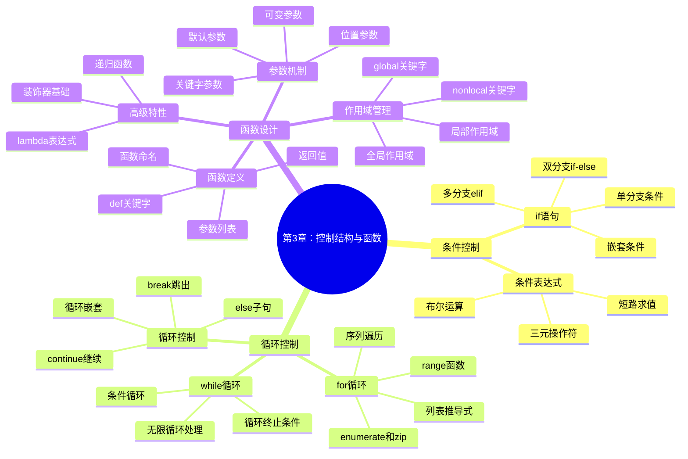

# 第3章：控制结构与函数定义

## 📚 学习目标

**S**pecific (具体)：
- 掌握Python中的条件控制语句（if/elif/else）
- 熟练使用循环结构（for/while）解决重复性任务
- 理解函数的定义、调用和参数传递机制
- 掌握变量作用域和函数设计原则

**M**easurable (可衡量)：
- 能够编写至少20个不同的控制结构代码示例
- 正确完成95%以上的条件和循环练习题
- 独立设计并实现包含多个函数的完整程序

**A**chievable (可实现)：
- 通过循序渐进的理论学习和实践练习
- 从简单条件判断到复杂程序控制逻辑

**R**elevant (相关性)：
- 为算法设计和程序架构打下基础
- 培养结构化编程思维

**T**ime-bound (时限性)：
- 2周内完成本章学习（4课时理论+实践）

## 🗺️ 知识导图



## 💡 3.1 条件控制结构

### 3.1.1 if语句基础

条件控制是程序根据不同情况做出不同决策的机制。Python使用`if`语句实现条件控制。

```python
# 基本if语句
age = 18
if age >= 18:
    print("你已经成年了")
    print("可以申请身份证")

# if-else双分支
score = 85
if score >= 60:
    print("恭喜你，考试通过了！")
else:
    print("很遗憾，需要重考")

# 多分支elif
grade = 92
if grade >= 90:
    level = "优秀"
elif grade >= 80:
    level = "良好"
elif grade >= 70:
    level = "中等"
elif grade >= 60:
    level = "及格"
else:
    level = "不及格"

print(f"你的成绩等级是：{level}")
```

### 3.1.2 复杂条件判断

```python
# 逻辑运算符组合条件
age = 25
income = 8000
credit_score = 750

# 贷款审批条件
if age >= 18 and age <= 65 and income >= 5000 and credit_score >= 700:
    print("贷款申请通过")
else:
    print("贷款申请不符合条件")

# 使用in关键字
user_role = "admin"
if user_role in ["admin", "manager", "supervisor"]:
    print("有管理权限")
else:
    print("普通用户权限")

# 条件表达式（三元操作符）
temperature = 25
weather = "舒适" if 15 <= temperature <= 30 else "不适宜"
print(f"今天天气{weather}")
```

### 3.1.3 嵌套条件和实用技巧

```python
def evaluate_student(score, attendance):
    """学生综合评价系统"""
    if score >= 0 and score <= 100:  # 分数有效性检查
        if attendance >= 80:  # 出勤率检查
            if score >= 90:
                return "优秀学生"
            elif score >= 80:
                return "良好学生"
            elif score >= 60:
                return "合格学生"
            else:
                return "需要补习"
        else:
            return "出勤率不足，无法评级"
    else:
        return "分数输入错误"

# 测试函数
print(evaluate_student(95, 90))  # 优秀学生
print(evaluate_student(75, 70))  # 出勤率不足，无法评级
```

## 🔄 3.2 循环控制结构

### 3.2.1 for循环详解

`for`循环用于遍历序列（字符串、列表、元组等）或其他可迭代对象。

```python
# 基本for循环
fruits = ["苹果", "香蕉", "橙子", "葡萄"]
for fruit in fruits:
    print(f"我喜欢吃{fruit}")

# 使用range()函数
print("倒计时：")
for i in range(10, 0, -1):
    print(i)
print("发射！")

# enumerate()获取索引和值
students = ["小明", "小红", "小强"]
for index, name in enumerate(students, 1):
    print(f"第{index}名学生：{name}")

# zip()同时遍历多个序列
names = ["张三", "李四", "王五"]
scores = [95, 87, 92]
subjects = ["数学", "英语", "物理"]

for name, score, subject in zip(names, scores, subjects):
    print(f"{name}的{subject}成绩是{score}分")
```

### 3.2.2 while循环应用

`while`循环在条件为真时重复执行代码块。

```python
# 基本while循环
count = 1
while count <= 5:
    print(f"这是第{count}次循环")
    count += 1

# 用户输入验证
while True:
    password = input("请输入密码：")
    if len(password) >= 8:
        print("密码设置成功！")
        break
    else:
        print("密码长度至少8位，请重新输入")

# 数字猜谜游戏
import random

secret_number = random.randint(1, 100)
attempts = 0
max_attempts = 7

print("我想了一个1到100之间的数字，你能猜到吗？")
print(f"你有{max_attempts}次机会")

while attempts < max_attempts:
    try:
        guess = int(input("请输入你的猜测："))
        attempts += 1
        
        if guess == secret_number:
            print(f"恭喜你！猜对了！答案是{secret_number}")
            print(f"你用了{attempts}次机会")
            break
        elif guess < secret_number:
            print("太小了，再试试")
        else:
            print("太大了，再试试")
            
        print(f"剩余机会：{max_attempts - attempts}")
        
    except ValueError:
        print("请输入有效数字")
        attempts -= 1  # 无效输入不计入次数

if attempts >= max_attempts:
    print(f"游戏结束！答案是{secret_number}")
```

### 3.2.3 循环控制语句

```python
# break和continue的使用
print("找出1-20中的所有质数：")
for num in range(2, 21):
    is_prime = True
    for i in range(2, int(num ** 0.5) + 1):
        if num % i == 0:
            is_prime = False
            break  # 找到因数，跳出内层循环
    
    if is_prime:
        print(num, end=" ")

print("\n")

# continue跳过当前迭代
print("1-10中的奇数：")
for i in range(1, 11):
    if i % 2 == 0:
        continue  # 跳过偶数
    print(i, end=" ")

print("\n")

# for-else结构
def find_item(items, target):
    """在列表中查找元素"""
    for item in items:
        if item == target:
            print(f"找到了{target}")
            break
    else:
        print(f"没有找到{target}")

shopping_list = ["苹果", "面包", "牛奶"]
find_item(shopping_list, "面包")  # 找到了面包
find_item(shopping_list, "鸡蛋")  # 没有找到鸡蛋

### 3.2.4 实际应用场景

#### Web开发中的循环应用

```python
# 处理用户表单数据
def process_form_data(form_data):
    """处理Web表单数据"""
    processed_data = {}
    required_fields = ['username', 'email', 'password']
    
    # 验证必填字段
    for field in required_fields:
        if field not in form_data or not form_data[field].strip():
            return {'error': f'字段 {field} 是必填的'}
        processed_data[field] = form_data[field].strip()
    
    # 处理可选字段
    optional_fields = ['phone', 'address', 'bio']
    for field in optional_fields:
        if field in form_data:
            processed_data[field] = form_data[field].strip()
    
    return {'success': True, 'data': processed_data}

# 模拟表单数据
sample_form = {
    'username': 'john_doe',
    'email': 'john@example.com',
    'password': 'secure123',
    'phone': '123-456-7890'
}

result = process_form_data(sample_form)
print(result)

# 批量处理API响应
def process_api_responses(responses):
    """批量处理API响应数据"""
    successful_responses = []
    failed_responses = []
    
    for i, response in enumerate(responses):
        try:
            if response['status'] == 'success':
                successful_responses.append({
                    'index': i,
                    'data': response['data']
                })
            else:
                failed_responses.append({
                    'index': i,
                    'error': response.get('error', 'Unknown error')
                })
        except KeyError as e:
            failed_responses.append({
                'index': i,
                'error': f'Invalid response format: {e}'
            })
    
    return {
        'successful': successful_responses,
        'failed': failed_responses,
        'total': len(responses)
    }

# 模拟API响应
api_responses = [
    {'status': 'success', 'data': {'id': 1, 'name': 'Item 1'}},
    {'status': 'error', 'error': 'Not found'},
    {'status': 'success', 'data': {'id': 3, 'name': 'Item 3'}},
    {'invalid': 'response'}
]

results = process_api_responses(api_responses)
print(f"成功处理: {len(results['successful'])} 个")
print(f"失败处理: {len(results['failed'])} 个")
```

#### 数据处理中的循环优化

```python
# 高效的数据过滤和转换
def process_data_efficiently(data_list, filters=None, transformations=None):
    """高效处理数据列表"""
    if filters is None:
        filters = []
    if transformations is None:
        transformations = []
    
    processed_data = []
    
    for item in data_list:
        # 应用过滤器
        should_include = True
        for filter_func in filters:
            if not filter_func(item):
                should_include = False
                break
        
        if not should_include:
            continue
        
        # 应用转换
        processed_item = item.copy() if isinstance(item, dict) else item
        for transform_func in transformations:
            processed_item = transform_func(processed_item)
        
        processed_data.append(processed_item)
    
    return processed_data

# 使用示例
sample_data = [
    {'id': 1, 'name': 'Alice', 'age': 25, 'salary': 50000},
    {'id': 2, 'name': 'Bob', 'age': 30, 'salary': 60000},
    {'id': 3, 'name': 'Charlie', 'age': 22, 'salary': 45000},
    {'id': 4, 'name': 'Diana', 'age': 35, 'salary': 75000}
]

# 定义过滤器和转换器
age_filter = lambda x: x['age'] >= 25
salary_filter = lambda x: x['salary'] >= 50000
name_upper = lambda x: {**x, 'name': x['name'].upper()}
add_bonus = lambda x: {**x, 'bonus': x['salary'] * 0.1}

# 应用处理
result = process_data_efficiently(
    sample_data,
    filters=[age_filter, salary_filter],
    transformations=[name_upper, add_bonus]
)

print("处理结果:")
for item in result:
    print(f"  {item['name']}: 年龄{item['age']}, 薪资{item['salary']}, 奖金{item['bonus']}")
```
```

## 🔧 3.3 函数设计与实现

### 3.3.1 函数定义基础

函数是可重用的代码块，用于执行特定任务。

```python
# 基本函数定义
def greet():
    """简单的问候函数"""
    print("Hello, World!")

# 调用函数
greet()

# 带参数的函数
def greet_person(name):
    """个性化问候函数"""
    print(f"Hello, {name}!")

greet_person("小明")

# 带返回值的函数
def add_numbers(a, b):
    """计算两个数的和"""
    result = a + b
    return result

sum_result = add_numbers(10, 20)
print(f"10 + 20 = {sum_result}")

# 带默认参数的函数
def introduce(name, age=18, city="北京"):
    """自我介绍函数"""
    return f"我叫{name}，今年{age}岁，来自{city}"

print(introduce("小红"))
print(introduce("小明", 25))
print(introduce("小李", 30, "上海"))
```

### 3.3.2 参数传递机制

```python
# 位置参数和关键字参数
def create_profile(name, age, city, hobby):
    """创建用户档案"""
    return {
        "姓名": name,
        "年龄": age,
        "城市": city,
        "爱好": hobby
    }

# 位置参数调用
profile1 = create_profile("张三", 25, "北京", "读书")

# 关键字参数调用
profile2 = create_profile(
    hobby="游泳",
    name="李四",
    city="上海",
    age=28
)

# 混合调用（位置参数必须在关键字参数前面）
profile3 = create_profile("王五", 22, city="广州", hobby="音乐")

print(profile1)
print(profile2)

# 可变参数 *args
def calculate_sum(*numbers):
    """计算任意数量数字的和"""
    total = 0
    for num in numbers:
        total += num
    return total

print(calculate_sum(1, 2, 3))
print(calculate_sum(10, 20, 30, 40, 50))

# 关键字可变参数 **kwargs
def create_student(**info):
    """创建学生信息"""
    student = {}
    for key, value in info.items():
        student[key] = value
    return student

student1 = create_student(name="小明", age=20, major="计算机")
student2 = create_student(name="小红", grade=3, school="清华大学", gpa=3.8)

print(student1)
print(student2)
```

### 3.3.3 变量作用域

```python
# 全局变量和局部变量
global_var = "我是全局变量"

def scope_demo():
    local_var = "我是局部变量"
    print(f"函数内部访问全局变量：{global_var}")
    print(f"函数内部访问局部变量：{local_var}")

scope_demo()
print(f"函数外部访问全局变量：{global_var}")
# print(local_var)  # 这会报错，局部变量在函数外不可访问

# 使用global关键字修改全局变量
counter = 0

def increment():
    global counter
    counter += 1
    print(f"计数器值：{counter}")

increment()  # 计数器值：1
increment()  # 计数器值：2

# 函数嵌套和nonlocal
def outer_function():
    outer_var = "外层函数变量"
    
    def inner_function():
        nonlocal outer_var
        outer_var = "被内层函数修改的变量"
        print(f"内层函数：{outer_var}")
    
    print(f"修改前：{outer_var}")
    inner_function()
    print(f"修改后：{outer_var}")

outer_function()
```

### 3.3.4 递归函数

```python
# 计算阶乘
def factorial(n):
    """计算n的阶乘"""
    if n <= 1:
        return 1
    else:
        return n * factorial(n - 1)

print(f"5! = {factorial(5)}")  # 5! = 120

# 斐波那契数列
def fibonacci(n):
    """计算斐波那契数列第n项"""
    if n <= 1:
        return n
    else:
        return fibonacci(n - 1) + fibonacci(n - 2)

# 打印前10项斐波那契数列
print("斐波那契数列前10项：")
for i in range(10):
    print(fibonacci(i), end=" ")
print()

# 汉诺塔问题
def hanoi(n, source, target, auxiliary):
    """解决汉诺塔问题"""
    if n == 1:
        print(f"将盘子从{source}移动到{target}")
    else:
        hanoi(n - 1, source, auxiliary, target)
        print(f"将盘子从{source}移动到{target}")
        hanoi(n - 1, auxiliary, target, source)

print("解决3层汉诺塔问题：")
hanoi(3, "A", "C", "B")

### 3.5.2 生成器函数

生成器函数使用`yield`关键字，可以逐个产生值而不一次性生成所有数据。

```python
# 基本生成器函数
def fibonacci_generator(n):
    """生成斐波那契数列的前n个数"""
    a, b = 0, 1
    count = 0
    while count < n:
        yield a
        a, b = b, a + b
        count += 1

# 使用生成器
print("斐波那契数列前10个数：")
for num in fibonacci_generator(10):
    print(num, end=" ")
print()

# 内存高效的生成器
def read_large_file(file_path):
    """逐行读取大文件，避免内存溢出"""
    with open(file_path, 'r', encoding='utf-8') as file:
        for line in file:
            yield line.strip()

# 模拟大文件处理
def process_data_stream():
    """处理数据流的生成器"""
    data = ["数据1", "数据2", "数据3", "数据4", "数据5"]
    for item in data:
        # 模拟处理时间
        yield f"已处理: {item}"

# 使用生成器处理数据
for processed_item in process_data_stream():
    print(processed_item)
```

### 3.5.3 闭包和装饰器

#### 闭包函数

```python
# 闭包：函数返回另一个函数
def create_counter():
    """创建计数器闭包"""
    count = 0
    
    def counter():
        nonlocal count
        count += 1
        return count
    
    return counter

# 使用闭包
counter1 = create_counter()
counter2 = create_counter()

print(f"计数器1: {counter1()}")  # 1
print(f"计数器1: {counter1()}")  # 2
print(f"计数器2: {counter2()}")  # 1
print(f"计数器1: {counter1()}")  # 3

# 带参数的闭包
def create_multiplier(factor):
    """创建乘法器闭包"""
    def multiplier(x):
        return x * factor
    return multiplier

double = create_multiplier(2)
triple = create_multiplier(3)

print(f"2的2倍: {double(2)}")   # 4
print(f"3的3倍: {triple(3)}")   # 9
```

#### 装饰器基础

```python
# 基本装饰器
def timer_decorator(func):
    """计时装饰器"""
    import time
    
    def wrapper(*args, **kwargs):
        start_time = time.time()
        result = func(*args, **kwargs)
        end_time = time.time()
        print(f"{func.__name__} 执行时间: {end_time - start_time:.4f}秒")
        return result
    
    return wrapper

# 使用装饰器
@timer_decorator
def slow_function():
    """模拟耗时函数"""
    import time
    time.sleep(1)
    return "完成"

# 调用被装饰的函数
result = slow_function()

# 带参数的装饰器
def retry_decorator(max_attempts=3):
    """重试装饰器"""
    def decorator(func):
        def wrapper(*args, **kwargs):
            for attempt in range(max_attempts):
                try:
                    return func(*args, **kwargs)
                except Exception as e:
                    if attempt == max_attempts - 1:
                        raise e
                    print(f"第{attempt + 1}次尝试失败，重试中...")
            return None
        return wrapper
    return decorator

# 使用带参数的装饰器
@retry_decorator(max_attempts=3)
def unreliable_function():
    """模拟不稳定的函数"""
    import random
    if random.random() < 0.7:  # 70%概率失败
        raise Exception("随机错误")
    return "成功"

# 测试重试机制
try:
    result = unreliable_function()
    print(f"最终结果: {result}")
except Exception as e:
    print(f"所有重试都失败了: {e}")
```

### 3.5.4 函数式编程工具

```python
# 高阶函数：map, filter, reduce
from functools import reduce

# map函数：对序列中的每个元素应用函数
numbers = [1, 2, 3, 4, 5]
squared = list(map(lambda x: x**2, numbers))
print(f"平方数: {squared}")  # [1, 4, 9, 16, 25]

# filter函数：过滤序列中的元素
even_numbers = list(filter(lambda x: x % 2 == 0, numbers))
print(f"偶数: {even_numbers}")  # [2, 4]

# reduce函数：累积计算
sum_all = reduce(lambda x, y: x + y, numbers)
print(f"总和: {sum_all}")  # 15

# 函数组合
def compose(*functions):
    """函数组合器"""
    def inner(arg):
        for f in reversed(functions):
            arg = f(arg)
        return arg
    return inner

# 使用函数组合
add_one = lambda x: x + 1
multiply_by_two = lambda x: x * 2
square = lambda x: x ** 2

combined = compose(square, multiply_by_two, add_one)
result = combined(3)  # ((3 + 1) * 2) ^ 2 = 64
print(f"组合函数结果: {result}")

# 偏函数：固定部分参数
from functools import partial

def power(base, exponent):
    """计算幂"""
    return base ** exponent

# 创建平方函数
square_func = partial(power, exponent=2)
cube_func = partial(power, exponent=3)

print(f"5的平方: {square_func(5)}")  # 25
print(f"3的立方: {cube_func(3)}")    # 27
```
```

## 🔬 代码示例集合

### 示例1：智能成绩管理系统

```python
def grade_management_system():
    """智能成绩管理系统"""
    students = {}
    
    def add_student(name, scores):
        """添加学生成绩"""
        students[name] = scores
        print(f"已添加学生：{name}")
    
    def calculate_average(scores):
        """计算平均分"""
        return sum(scores) / len(scores) if scores else 0
    
    def get_grade_level(average):
        """根据平均分获取等级"""
        if average >= 90:
            return "优秀"
        elif average >= 80:
            return "良好"
        elif average >= 70:
            return "中等"
        elif average >= 60:
            return "及格"
        else:
            return "不及格"
    
    def display_report():
        """显示成绩报告"""
        print("\n=== 成绩报告 ===")
        print(f"{'姓名':<10} {'平均分':<10} {'等级':<10}")
        print("-" * 35)
        
        for name, scores in students.items():
            avg = calculate_average(scores)
            level = get_grade_level(avg)
            print(f"{name:<10} {avg:<10.1f} {level:<10}")
    
    # 添加示例数据
    add_student("张三", [85, 92, 78, 88])
    add_student("李四", [76, 81, 79, 85])
    add_student("王五", [95, 98, 93, 97])
    
    display_report()

# 运行系统
grade_management_system()
```

### 示例2：菜单驱动的计算器

```python
def advanced_calculator():
    """菜单驱动的高级计算器"""
    
    def show_menu():
        """显示菜单"""
        print("\n=== 高级计算器 ===")
        print("1. 基本运算")
        print("2. 科学计算")
        print("3. 统计计算")
        print("4. 查看历史")
        print("5. 退出")
        print("=" * 20)
    
    def basic_operations():
        """基本运算"""
        while True:
            print("\n基本运算：+、-、*、/")
            expression = input("请输入表达式（如：10 + 5），输入q返回主菜单：")
            
            if expression.lower() == 'q':
                break
            
            try:
                result = eval(expression)
                print(f"结果：{expression} = {result}")
                history.append(f"{expression} = {result}")
            except:
                print("表达式错误，请重新输入")
    
    def scientific_operations():
        """科学计算"""
        import math
        
        functions = {
            '1': ('平方根', lambda x: math.sqrt(x)),
            '2': ('平方', lambda x: x ** 2),
            '3': ('立方', lambda x: x ** 3),
            '4': ('对数', lambda x: math.log(x)),
            '5': ('正弦', lambda x: math.sin(math.radians(x))),
            '6': ('余弦', lambda x: math.cos(math.radians(x)))
        }
        
        while True:
            print("\n科学计算功能：")
            for key, (name, _) in functions.items():
                print(f"{key}. {name}")
            print("0. 返回主菜单")
            
            choice = input("请选择功能：")
            if choice == '0':
                break
            
            if choice in functions:
                try:
                    x = float(input("请输入数值："))
                    name, func = functions[choice]
                    result = func(x)
                    print(f"{name}({x}) = {result}")
                    history.append(f"{name}({x}) = {result}")
                except Exception as e:
                    print(f"计算错误：{e}")
            else:
                print("无效选择")
    
    def statistics_operations():
        """统计计算"""
        while True:
            print("\n统计计算")
            numbers_input = input("请输入数字列表（用空格分隔），输入q返回：")
            
            if numbers_input.lower() == 'q':
                break
            
            try:
                numbers = [float(x) for x in numbers_input.split()]
                if numbers:
                    mean = sum(numbers) / len(numbers)
                    max_num = max(numbers)
                    min_num = min(numbers)
                    
                    print(f"数据：{numbers}")
                    print(f"平均值：{mean:.2f}")
                    print(f"最大值：{max_num}")
                    print(f"最小值：{min_num}")
                    
                    history.append(f"统计：{numbers} -> 平均:{mean:.2f}")
                else:
                    print("请输入有效数字")
            except ValueError:
                print("输入格式错误")
    
    def show_history():
        """显示历史记录"""
        print("\n=== 计算历史 ===")
        if history:
            for i, record in enumerate(history[-10:], 1):
                print(f"{i}. {record}")
        else:
            print("暂无历史记录")
    
    # 主程序
    history = []
    
    while True:
        show_menu()
        choice = input("请选择功能：")
        
        if choice == '1':
            basic_operations()
        elif choice == '2':
            scientific_operations()
        elif choice == '3':
            statistics_operations()
        elif choice == '4':
            show_history()
        elif choice == '5':
            print("感谢使用计算器！")
            break
        else:
            print("无效选择，请重新输入")

# 运行计算器（注释掉避免实际运行）
# advanced_calculator()
```

## 🎯 实践练习

### 基础练习

#### 练习1：年龄分类器
```python
def age_classifier():
    """根据年龄进行分类"""
    # 请完成以下功能：
    # 0-2岁：婴儿
    # 3-6岁：幼儿
    # 7-17岁：少年
    # 18-59岁：成年人
    # 60岁以上：老年人
    pass

# 测试用例
ages = [1, 5, 12, 25, 65]
for age in ages:
    print(f"{age}岁：{age_classifier(age)}")
```

#### 练习2：九九乘法表
```python
def multiplication_table():
    """生成九九乘法表"""
    # 请使用嵌套循环生成完整的九九乘法表
    # 格式：1×1=1  1×2=2  1×3=3...
    pass

multiplication_table()
```

### 中级练习

#### 练习3：密码强度检查器
```python
def password_strength_checker(password):
    """检查密码强度"""
    # 请实现以下检查规则：
    # 1. 长度至少8位
    # 2. 包含大写字母
    # 3. 包含小写字母
    # 4. 包含数字
    # 5. 包含特殊字符
    # 返回强度等级：弱、中、强
    pass

# 测试用例
passwords = ["123456", "abcdefgh", "Abc123456", "Abc@123456"]
for pwd in passwords:
    strength = password_strength_checker(pwd)
    print(f"密码'{pwd}'强度：{strength}")
```

### 挑战练习

#### 练习4：简单银行系统
```python
class SimpleBankSystem:
    """简单银行系统"""
    
    def __init__(self):
        self.accounts = {}
        self.next_account_id = 1001
    
    def create_account(self, name, initial_deposit=0):
        """创建账户"""
        # 请实现账户创建功能
        pass
    
    def deposit(self, account_id, amount):
        """存款"""
        # 请实现存款功能
        pass
    
    def withdraw(self, account_id, amount):
        """取款"""
        # 请实现取款功能（需要检查余额）
        pass
    
    def transfer(self, from_account, to_account, amount):
        """转账"""
        # 请实现转账功能
        pass
    
    def get_balance(self, account_id):
        """查询余额"""
        # 请实现余额查询功能
        pass

# 测试系统
bank = SimpleBankSystem()
# 请编写测试代码
```

## 🚀 项目案例：任务管理系统

```python
import json
import datetime

class TaskManager:
    """任务管理系统"""
    
    def __init__(self):
        self.tasks = []
        self.next_id = 1
        self.load_tasks()
    
    def add_task(self, title, description="", priority="medium", due_date=None):
        """添加任务"""
        task = {
            "id": self.next_id,
            "title": title,
            "description": description,
            "priority": priority,
            "due_date": due_date,
            "status": "pending",
            "created_at": datetime.datetime.now().isoformat(),
            "completed_at": None
        }
        self.tasks.append(task)
        self.next_id += 1
        self.save_tasks()
        print(f"任务 '{title}' 添加成功，ID：{task['id']}")
    
    def list_tasks(self, status_filter=None):
        """列出任务"""
        print("\n=== 任务列表 ===")
        filtered_tasks = self.tasks
        
        if status_filter:
            filtered_tasks = [t for t in self.tasks if t["status"] == status_filter]
        
        if not filtered_tasks:
            print("暂无任务")
            return
        
        # 按优先级排序
        priority_order = {"high": 1, "medium": 2, "low": 3}
        filtered_tasks.sort(key=lambda x: priority_order.get(x["priority"], 2))
        
        print(f"{'ID':<5} {'标题':<20} {'优先级':<8} {'状态':<10} {'截止日期':<12}")
        print("-" * 70)
        
        for task in filtered_tasks:
            due_date = task["due_date"] or "无"
            print(f"{task['id']:<5} {task['title']:<20} {task['priority']:<8} "
                  f"{task['status']:<10} {due_date:<12}")
    
    def complete_task(self, task_id):
        """完成任务"""
        for task in self.tasks:
            if task["id"] == task_id:
                task["status"] = "completed"
                task["completed_at"] = datetime.datetime.now().isoformat()
                self.save_tasks()
                print(f"任务 '{task['title']}' 已完成")
                return
        print(f"未找到ID为 {task_id} 的任务")
    
    def delete_task(self, task_id):
        """删除任务"""
        for i, task in enumerate(self.tasks):
            if task["id"] == task_id:
                deleted_task = self.tasks.pop(i)
                self.save_tasks()
                print(f"任务 '{deleted_task['title']}' 已删除")
                return
        print(f"未找到ID为 {task_id} 的任务")
    
    def save_tasks(self):
        """保存任务到文件"""
        try:
            with open("tasks.json", "w", encoding="utf-8") as f:
                json.dump(self.tasks, f, ensure_ascii=False, indent=2)
        except Exception as e:
            print(f"保存失败：{e}")
    
    def load_tasks(self):
        """从文件加载任务"""
        try:
            with open("tasks.json", "r", encoding="utf-8") as f:
                self.tasks = json.load(f)
                if self.tasks:
                    self.next_id = max(task["id"] for task in self.tasks) + 1
        except FileNotFoundError:
            print("任务文件不存在，创建新的任务列表")
        except Exception as e:
            print(f"加载失败：{e}")
    
    def search_tasks(self, keyword):
        """搜索任务"""
        results = []
        keyword = keyword.lower()
        
        for task in self.tasks:
            if (keyword in task["title"].lower() or 
                keyword in task["description"].lower()):
                results.append(task)
        
        if results:
            print(f"\n找到 {len(results)} 个相关任务：")
            self._display_tasks(results)
        else:
            print(f"未找到包含 '{keyword}' 的任务")
    
    def get_statistics(self):
        """获取任务统计信息"""
        total_tasks = len(self.tasks)
        completed_tasks = len([t for t in self.tasks if t["status"] == "completed"])
        pending_tasks = total_tasks - completed_tasks
        
        # 按优先级统计
        high_priority = len([t for t in self.tasks if t["priority"] == "high"])
        medium_priority = len([t for t in self.tasks if t["priority"] == "medium"])
        low_priority = len([t for t in self.tasks if t["priority"] == "low"])
        
        # 计算完成率
        completion_rate = (completed_tasks / total_tasks * 100) if total_tasks > 0 else 0
        
        print("\n=== 任务统计 ===")
        print(f"总任务数: {total_tasks}")
        print(f"已完成: {completed_tasks}")
        print(f"待完成: {pending_tasks}")
        print(f"完成率: {completion_rate:.1f}%")
        print(f"高优先级: {high_priority}")
        print(f"中优先级: {medium_priority}")
        print(f"低优先级: {low_priority}")
    
    def edit_task(self, task_id):
        """编辑任务"""
        for task in self.tasks:
            if task["id"] == task_id:
                print(f"\n编辑任务: {task['title']}")
                print("留空表示不修改")
                
                new_title = input("新标题: ").strip()
                if new_title:
                    task["title"] = new_title
                
                new_description = input("新描述: ").strip()
                if new_description:
                    task["description"] = new_description
                
                new_priority = input("新优先级 (high/medium/low): ").strip()
                if new_priority in ["high", "medium", "low"]:
                    task["priority"] = new_priority
                
                new_due_date = input("新截止日期 (YYYY-MM-DD): ").strip()
                if new_due_date:
                    task["due_date"] = new_due_date
                
                self.save_tasks()
                print("任务更新成功")
                return
        
        print(f"未找到ID为 {task_id} 的任务")
    
    def _display_tasks(self, tasks):
        """显示任务列表（内部方法）"""
        if not tasks:
            print("暂无任务")
            return
        
        # 按优先级排序
        priority_order = {"high": 1, "medium": 2, "low": 3}
        tasks.sort(key=lambda x: priority_order.get(x["priority"], 2))
        
        print(f"{'ID':<5} {'标题':<20} {'优先级':<8} {'状态':<10} {'截止日期':<12}")
        print("-" * 70)
        
        for task in tasks:
            due_date = task["due_date"] or "无"
            print(f"{task['id']:<5} {task['title']:<20} {task['priority']:<8} "
                  f"{task['status']:<10} {due_date:<12}")
    
    def run(self):
        """运行主程序"""
        while True:
            print("\n=== 任务管理系统 ===")
            print("1. 添加任务")
            print("2. 查看所有任务")
            print("3. 查看待完成任务")
            print("4. 查看已完成任务")
            print("5. 完成任务")
            print("6. 删除任务")
            print("7. 编辑任务")
            print("8. 搜索任务")
            print("9. 查看统计")
            print("10. 退出")
            
            choice = input("请选择操作：").strip()
            
            if choice == "1":
                title = input("任务标题：").strip()
                if title:
                    description = input("任务描述（可选）：").strip()
                    priority = input("优先级（high/medium/low，默认medium）：").strip() or "medium"
                    due_date = input("截止日期（YYYY-MM-DD，可选）：").strip() or None
                    self.add_task(title, description, priority, due_date)
                else:
                    print("任务标题不能为空")
            
            elif choice == "2":
                self.list_tasks()
            
            elif choice == "3":
                self.list_tasks("pending")
            
            elif choice == "4":
                self.list_tasks("completed")
            
            elif choice == "5":
                try:
                    task_id = int(input("请输入要完成的任务ID："))
                    self.complete_task(task_id)
                except ValueError:
                    print("请输入有效的任务ID")
            
            elif choice == "6":
                try:
                    task_id = int(input("请输入要删除的任务ID："))
                    confirm = input("确认删除？(y/N)：").lower()
                    if confirm == "y":
                        self.delete_task(task_id)
                except ValueError:
                    print("请输入有效的任务ID")
            
            elif choice == "7":
                try:
                    task_id = int(input("请输入要编辑的任务ID："))
                    self.edit_task(task_id)
                except ValueError:
                    print("请输入有效的任务ID")
            
            elif choice == "8":
                keyword = input("请输入搜索关键词：").strip()
                if keyword:
                    self.search_tasks(keyword)
                else:
                    print("搜索关键词不能为空")
            
            elif choice == "9":
                self.get_statistics()
            
            elif choice == "10":
                print("感谢使用任务管理系统！")
                break
            
            else:
                print("无效选择，请重新输入")

# 演示程序（注释掉避免实际运行）
def demo_task_manager():
    """演示任务管理系统"""
    tm = TaskManager()
    
    # 添加示例任务
    tm.add_task("完成Python作业", "第3章练习题", "high", "2025-02-01")
    tm.add_task("准备考试", "数据结构考试复习", "high", "2025-02-05")
    tm.add_task("买菜", "周末去超市", "low")
    tm.add_task("学习机器学习", "深度学习基础课程", "medium", "2025-02-10")
    tm.add_task("健身", "每周三次锻炼", "medium")
    
    # 显示任务列表
    tm.list_tasks()
    
    # 完成一个任务
    tm.complete_task(1)
    
    # 显示统计信息
    tm.get_statistics()
    
    # 搜索任务
    tm.search_tasks("学习")
    
    # 显示待完成任务
    tm.list_tasks("pending")

# demo_task_manager()

### 3.6.5 单元测试示例

```python
import unittest

class TestTaskManager(unittest.TestCase):
    """任务管理系统测试类"""
    
    def setUp(self):
        """测试前的准备工作"""
        self.tm = TaskManager()
        # 清空任务列表
        self.tm.tasks = []
        self.tm.next_id = 1
    
    def test_add_task(self):
        """测试添加任务功能"""
        self.tm.add_task("测试任务", "测试描述", "high")
        self.assertEqual(len(self.tm.tasks), 1)
        self.assertEqual(self.tm.tasks[0]["title"], "测试任务")
        self.assertEqual(self.tm.tasks[0]["priority"], "high")
    
    def test_complete_task(self):
        """测试完成任务功能"""
        self.tm.add_task("测试任务")
        self.tm.complete_task(1)
        self.assertEqual(self.tm.tasks[0]["status"], "completed")
    
    def test_delete_task(self):
        """测试删除任务功能"""
        self.tm.add_task("测试任务")
        initial_count = len(self.tm.tasks)
        self.tm.delete_task(1)
        self.assertEqual(len(self.tm.tasks), initial_count - 1)
    
    def test_search_tasks(self):
        """测试搜索任务功能"""
        self.tm.add_task("Python学习", "学习Python编程")
        self.tm.add_task("Java学习", "学习Java编程")
        
        # 模拟搜索功能（这里需要修改search_tasks方法以返回结果）
        python_tasks = [t for t in self.tm.tasks if "Python" in t["title"]]
        self.assertEqual(len(python_tasks), 1)
    
    def test_task_statistics(self):
        """测试任务统计功能"""
        self.tm.add_task("任务1", priority="high")
        self.tm.add_task("任务2", priority="medium")
        self.tm.add_task("任务3", priority="low")
        
        high_priority = len([t for t in self.tm.tasks if t["priority"] == "high"])
        self.assertEqual(high_priority, 1)

# 运行测试
if __name__ == "__main__":
    unittest.main()
```

### 3.6.6 性能优化示例

```python
import time
import cProfile
import pstats

def performance_test():
    """性能测试示例"""
    
    def slow_function():
        """模拟慢函数"""
        time.sleep(0.1)
        return sum(range(1000))
    
    def fast_function():
        """模拟快函数"""
        return sum(range(1000))
    
    # 使用cProfile进行性能分析
    profiler = cProfile.Profile()
    profiler.enable()
    
    # 执行慢函数
    for _ in range(10):
        slow_function()
    
    profiler.disable()
    
    # 输出性能统计
    stats = pstats.Stats(profiler)
    stats.sort_stats('cumulative')
    stats.print_stats(10)

# performance_test()
```
```

## 📖 拓展阅读

### 在线资源
- [Python官方文档 - 控制流](https://docs.python.org/zh-cn/3/tutorial/controlflow.html)
- [Real Python - Python函数](https://realpython.com/defining-your-own-python-function/)
- [GeeksforGeeks - Python循环](https://www.geeksforgeeks.org/loops-in-python/)

### 推荐书籍
- 《Python编程快速上手》- Al Sweigart
- 《Python算法教程》- Magnus Lie Hetland
- 《编程珠玑》- Jon Bentley

---

## 📋 本章检查清单

**理论掌握** ✅
- [ ] 掌握if/elif/else条件控制语句
- [ ] 熟练使用for和while循环
- [ ] 理解函数定义、调用和参数传递
- [ ] 掌握变量作用域和递归概念
- [ ] 理解生成器函数和闭包
- [ ] 掌握装饰器和函数式编程

**实践能力** ✅
- [ ] 能够编写复杂的条件判断逻辑
- [ ] 熟练使用循环解决重复性任务
- [ ] 能够设计和实现函数模块
- [ ] 独立完成综合性程序项目
- [ ] 掌握Web开发和数据处理应用
- [ ] 能够编写单元测试和性能优化

**项目经验** ✅
- [ ] 完成任务管理系统项目
- [ ] 理解程序的模块化设计
- [ ] 掌握数据持久化的基本方法
- [ ] 实现搜索和统计功能
- [ ] 掌握错误处理和用户交互
- [ ] 了解测试驱动开发方法

恭喜！你已经掌握了Python的控制结构和函数设计。下一章我们将学习面向对象编程。 