# 第3章：控制结构与函数定义

## 📚 学习目标

**S**pecific (具体)：
- 掌握Python中的条件控制语句（if/elif/else）
- 熟练使用循环结构（for/while）解决重复性任务
- 理解函数的定义、调用和参数传递机制
- 掌握变量作用域和函数设计原则

**M**easurable (可衡量)：
- 能够编写至少20个不同的控制结构代码示例
- 正确完成95%以上的条件和循环练习题
- 独立设计并实现包含多个函数的完整程序

**A**chievable (可实现)：
- 通过循序渐进的理论学习和实践练习
- 从简单条件判断到复杂程序控制逻辑

**R**elevant (相关性)：
- 为算法设计和程序架构打下基础
- 培养结构化编程思维

**T**ime-bound (时限性)：
- 2周内完成本章学习（4课时理论+实践）

## 🗺️ 知识导图

```mermaid
mindmap
  root((第3章：控制结构与函数))
    条件控制
      if语句
        单分支条件
        双分支if-else
        多分支elif
        嵌套条件
      条件表达式
        三元操作符
        短路求值
        布尔运算
    循环控制
      for循环
        序列遍历
        range函数
        enumerate和zip
        列表推导式
      while循环
        条件循环
        无限循环处理
        循环终止条件
      循环控制
        break跳出
        continue继续
        else子句
        循环嵌套
    函数设计
      函数定义
        def关键字
        函数命名
        参数列表
        返回值
      参数机制
        位置参数
        关键字参数
        默认参数
        可变参数
      作用域管理
        局部作用域
        全局作用域
        global关键字
        nonlocal关键字
      高级特性
        递归函数
        lambda表达式
        装饰器基础
```



## 💡 3.1 条件控制结构

### 3.1.1 if语句基础

条件控制是程序根据不同情况做出不同决策的机制。Python使用`if`语句实现条件控制。

```python
# 基本if语句
age = 18
if age >= 18:
    print("你已经成年了")
    print("可以申请身份证")

# if-else双分支
score = 85
if score >= 60:
    print("恭喜你，考试通过了！")
else:
    print("很遗憾，需要重考")

# 多分支elif
grade = 92
if grade >= 90:
    level = "优秀"
elif grade >= 80:
    level = "良好"
elif grade >= 70:
    level = "中等"
elif grade >= 60:
    level = "及格"
else:
    level = "不及格"

print(f"你的成绩等级是：{level}")
```

### 3.1.2 复杂条件判断

```python
# 逻辑运算符组合条件
age = 25
income = 8000
credit_score = 750

# 贷款审批条件
if age >= 18 and age <= 65 and income >= 5000 and credit_score >= 700:
    print("贷款申请通过")
else:
    print("贷款申请不符合条件")

# 使用in关键字
user_role = "admin"
if user_role in ["admin", "manager", "supervisor"]:
    print("有管理权限")
else:
    print("普通用户权限")

# 条件表达式（三元操作符）
temperature = 25
weather = "舒适" if 15 <= temperature <= 30 else "不适宜"
print(f"今天天气{weather}")
```

### 3.1.3 嵌套条件和实用技巧

```python
def evaluate_student(score, attendance):
    """学生综合评价系统"""
    if score >= 0 and score <= 100:  # 分数有效性检查
        if attendance >= 80:  # 出勤率检查
            if score >= 90:
                return "优秀学生"
            elif score >= 80:
                return "良好学生"
            elif score >= 60:
                return "合格学生"
            else:
                return "需要补习"
        else:
            return "出勤率不足，无法评级"
    else:
        return "分数输入错误"

# 测试函数
print(evaluate_student(95, 90))  # 优秀学生
print(evaluate_student(75, 70))  # 出勤率不足，无法评级
```

## 🔄 3.2 循环控制结构

### 3.2.1 for循环详解

`for`循环用于遍历序列（字符串、列表、元组等）或其他可迭代对象。

```python
# 基本for循环
fruits = ["苹果", "香蕉", "橙子", "葡萄"]
for fruit in fruits:
    print(f"我喜欢吃{fruit}")

# 使用range()函数
print("倒计时：")
for i in range(10, 0, -1):
    print(i)
print("发射！")

# enumerate()获取索引和值
students = ["小明", "小红", "小强"]
for index, name in enumerate(students, 1):
    print(f"第{index}名学生：{name}")

# zip()同时遍历多个序列
names = ["张三", "李四", "王五"]
scores = [95, 87, 92]
subjects = ["数学", "英语", "物理"]

for name, score, subject in zip(names, scores, subjects):
    print(f"{name}的{subject}成绩是{score}分")
```

### 3.2.2 while循环应用

`while`循环在条件为真时重复执行代码块。

```python
# 基本while循环
count = 1
while count <= 5:
    print(f"这是第{count}次循环")
    count += 1

# 用户输入验证
while True:
    password = input("请输入密码：")
    if len(password) >= 8:
        print("密码设置成功！")
        break
    else:
        print("密码长度至少8位，请重新输入")

# 数字猜谜游戏
import random

secret_number = random.randint(1, 100)
attempts = 0
max_attempts = 7

print("我想了一个1到100之间的数字，你能猜到吗？")
print(f"你有{max_attempts}次机会")

while attempts < max_attempts:
    try:
        guess = int(input("请输入你的猜测："))
        attempts += 1
        
        if guess == secret_number:
            print(f"恭喜你！猜对了！答案是{secret_number}")
            print(f"你用了{attempts}次机会")
            break
        elif guess < secret_number:
            print("太小了，再试试")
        else:
            print("太大了，再试试")
            
        print(f"剩余机会：{max_attempts - attempts}")
        
    except ValueError:
        print("请输入有效数字")
        attempts -= 1  # 无效输入不计入次数

if attempts >= max_attempts:
    print(f"游戏结束！答案是{secret_number}")
```

### 3.2.3 循环控制语句

```python
# break和continue的使用
print("找出1-20中的所有质数：")
for num in range(2, 21):
    is_prime = True
    for i in range(2, int(num ** 0.5) + 1):
        if num % i == 0:
            is_prime = False
            break  # 找到因数，跳出内层循环
    
    if is_prime:
        print(num, end=" ")

print("\n")

# continue跳过当前迭代
print("1-10中的奇数：")
for i in range(1, 11):
    if i % 2 == 0:
        continue  # 跳过偶数
    print(i, end=" ")

print("\n")

# for-else结构
def find_item(items, target):
    """在列表中查找元素"""
    for item in items:
        if item == target:
            print(f"找到了{target}")
            break
    else:
        print(f"没有找到{target}")

shopping_list = ["苹果", "面包", "牛奶"]
find_item(shopping_list, "面包")  # 找到了面包
find_item(shopping_list, "鸡蛋")  # 没有找到鸡蛋
```

## 🔧 3.3 函数设计与实现

### 3.3.1 函数定义基础

函数是可重用的代码块，用于执行特定任务。

```python
# 基本函数定义
def greet():
    """简单的问候函数"""
    print("Hello, World!")

# 调用函数
greet()

# 带参数的函数
def greet_person(name):
    """个性化问候函数"""
    print(f"Hello, {name}!")

greet_person("小明")

# 带返回值的函数
def add_numbers(a, b):
    """计算两个数的和"""
    result = a + b
    return result

sum_result = add_numbers(10, 20)
print(f"10 + 20 = {sum_result}")

# 带默认参数的函数
def introduce(name, age=18, city="北京"):
    """自我介绍函数"""
    return f"我叫{name}，今年{age}岁，来自{city}"

print(introduce("小红"))
print(introduce("小明", 25))
print(introduce("小李", 30, "上海"))
```

### 3.3.2 参数传递机制

```python
# 位置参数和关键字参数
def create_profile(name, age, city, hobby):
    """创建用户档案"""
    return {
        "姓名": name,
        "年龄": age,
        "城市": city,
        "爱好": hobby
    }

# 位置参数调用
profile1 = create_profile("张三", 25, "北京", "读书")

# 关键字参数调用
profile2 = create_profile(
    hobby="游泳",
    name="李四",
    city="上海",
    age=28
)

# 混合调用（位置参数必须在关键字参数前面）
profile3 = create_profile("王五", 22, city="广州", hobby="音乐")

print(profile1)
print(profile2)

# 可变参数 *args
def calculate_sum(*numbers):
    """计算任意数量数字的和"""
    total = 0
    for num in numbers:
        total += num
    return total

print(calculate_sum(1, 2, 3))
print(calculate_sum(10, 20, 30, 40, 50))

# 关键字可变参数 **kwargs
def create_student(**info):
    """创建学生信息"""
    student = {}
    for key, value in info.items():
        student[key] = value
    return student

student1 = create_student(name="小明", age=20, major="计算机")
student2 = create_student(name="小红", grade=3, school="清华大学", gpa=3.8)

print(student1)
print(student2)
```

### 3.3.3 变量作用域

```python
# 全局变量和局部变量
global_var = "我是全局变量"

def scope_demo():
    local_var = "我是局部变量"
    print(f"函数内部访问全局变量：{global_var}")
    print(f"函数内部访问局部变量：{local_var}")

scope_demo()
print(f"函数外部访问全局变量：{global_var}")
# print(local_var)  # 这会报错，局部变量在函数外不可访问

# 使用global关键字修改全局变量
counter = 0

def increment():
    global counter
    counter += 1
    print(f"计数器值：{counter}")

increment()  # 计数器值：1
increment()  # 计数器值：2

# 函数嵌套和nonlocal
def outer_function():
    outer_var = "外层函数变量"
    
    def inner_function():
        nonlocal outer_var
        outer_var = "被内层函数修改的变量"
        print(f"内层函数：{outer_var}")
    
    print(f"修改前：{outer_var}")
    inner_function()
    print(f"修改后：{outer_var}")

outer_function()
```

### 3.3.4 递归函数

```python
# 计算阶乘
def factorial(n):
    """计算n的阶乘"""
    if n <= 1:
        return 1
    else:
        return n * factorial(n - 1)

print(f"5! = {factorial(5)}")  # 5! = 120

# 斐波那契数列
def fibonacci(n):
    """计算斐波那契数列第n项"""
    if n <= 1:
        return n
    else:
        return fibonacci(n - 1) + fibonacci(n - 2)

# 打印前10项斐波那契数列
print("斐波那契数列前10项：")
for i in range(10):
    print(fibonacci(i), end=" ")
print()

# 汉诺塔问题
def hanoi(n, source, target, auxiliary):
    """解决汉诺塔问题"""
    if n == 1:
        print(f"将盘子从{source}移动到{target}")
    else:
        hanoi(n - 1, source, auxiliary, target)
        print(f"将盘子从{source}移动到{target}")
        hanoi(n - 1, auxiliary, target, source)

print("解决3层汉诺塔问题：")
hanoi(3, "A", "C", "B")
```

## 🔬 代码示例集合

### 示例1：智能成绩管理系统

```python
def grade_management_system():
    """智能成绩管理系统"""
    students = {}
    
    def add_student(name, scores):
        """添加学生成绩"""
        students[name] = scores
        print(f"已添加学生：{name}")
    
    def calculate_average(scores):
        """计算平均分"""
        return sum(scores) / len(scores) if scores else 0
    
    def get_grade_level(average):
        """根据平均分获取等级"""
        if average >= 90:
            return "优秀"
        elif average >= 80:
            return "良好"
        elif average >= 70:
            return "中等"
        elif average >= 60:
            return "及格"
        else:
            return "不及格"
    
    def display_report():
        """显示成绩报告"""
        print("\n=== 成绩报告 ===")
        print(f"{'姓名':<10} {'平均分':<10} {'等级':<10}")
        print("-" * 35)
        
        for name, scores in students.items():
            avg = calculate_average(scores)
            level = get_grade_level(avg)
            print(f"{name:<10} {avg:<10.1f} {level:<10}")
    
    # 添加示例数据
    add_student("张三", [85, 92, 78, 88])
    add_student("李四", [76, 81, 79, 85])
    add_student("王五", [95, 98, 93, 97])
    
    display_report()

# 运行系统
grade_management_system()
```

### 示例2：菜单驱动的计算器

```python
def advanced_calculator():
    """菜单驱动的高级计算器"""
    
    def show_menu():
        """显示菜单"""
        print("\n=== 高级计算器 ===")
        print("1. 基本运算")
        print("2. 科学计算")
        print("3. 统计计算")
        print("4. 查看历史")
        print("5. 退出")
        print("=" * 20)
    
    def basic_operations():
        """基本运算"""
        while True:
            print("\n基本运算：+、-、*、/")
            expression = input("请输入表达式（如：10 + 5），输入q返回主菜单：")
            
            if expression.lower() == 'q':
                break
            
            try:
                result = eval(expression)
                print(f"结果：{expression} = {result}")
                history.append(f"{expression} = {result}")
            except:
                print("表达式错误，请重新输入")
    
    def scientific_operations():
        """科学计算"""
        import math
        
        functions = {
            '1': ('平方根', lambda x: math.sqrt(x)),
            '2': ('平方', lambda x: x ** 2),
            '3': ('立方', lambda x: x ** 3),
            '4': ('对数', lambda x: math.log(x)),
            '5': ('正弦', lambda x: math.sin(math.radians(x))),
            '6': ('余弦', lambda x: math.cos(math.radians(x)))
        }
        
        while True:
            print("\n科学计算功能：")
            for key, (name, _) in functions.items():
                print(f"{key}. {name}")
            print("0. 返回主菜单")
            
            choice = input("请选择功能：")
            if choice == '0':
                break
            
            if choice in functions:
                try:
                    x = float(input("请输入数值："))
                    name, func = functions[choice]
                    result = func(x)
                    print(f"{name}({x}) = {result}")
                    history.append(f"{name}({x}) = {result}")
                except Exception as e:
                    print(f"计算错误：{e}")
            else:
                print("无效选择")
    
    def statistics_operations():
        """统计计算"""
        while True:
            print("\n统计计算")
            numbers_input = input("请输入数字列表（用空格分隔），输入q返回：")
            
            if numbers_input.lower() == 'q':
                break
            
            try:
                numbers = [float(x) for x in numbers_input.split()]
                if numbers:
                    mean = sum(numbers) / len(numbers)
                    max_num = max(numbers)
                    min_num = min(numbers)
                    
                    print(f"数据：{numbers}")
                    print(f"平均值：{mean:.2f}")
                    print(f"最大值：{max_num}")
                    print(f"最小值：{min_num}")
                    
                    history.append(f"统计：{numbers} -> 平均:{mean:.2f}")
                else:
                    print("请输入有效数字")
            except ValueError:
                print("输入格式错误")
    
    def show_history():
        """显示历史记录"""
        print("\n=== 计算历史 ===")
        if history:
            for i, record in enumerate(history[-10:], 1):
                print(f"{i}. {record}")
        else:
            print("暂无历史记录")
    
    # 主程序
    history = []
    
    while True:
        show_menu()
        choice = input("请选择功能：")
        
        if choice == '1':
            basic_operations()
        elif choice == '2':
            scientific_operations()
        elif choice == '3':
            statistics_operations()
        elif choice == '4':
            show_history()
        elif choice == '5':
            print("感谢使用计算器！")
            break
        else:
            print("无效选择，请重新输入")

# 运行计算器（注释掉避免实际运行）
# advanced_calculator()
```

## 🎯 实践练习

### 基础练习

#### 练习1：年龄分类器
```python
def age_classifier():
    """根据年龄进行分类"""
    # 请完成以下功能：
    # 0-2岁：婴儿
    # 3-6岁：幼儿
    # 7-17岁：少年
    # 18-59岁：成年人
    # 60岁以上：老年人
    pass

# 测试用例
ages = [1, 5, 12, 25, 65]
for age in ages:
    print(f"{age}岁：{age_classifier(age)}")
```

#### 练习2：九九乘法表
```python
def multiplication_table():
    """生成九九乘法表"""
    # 请使用嵌套循环生成完整的九九乘法表
    # 格式：1×1=1  1×2=2  1×3=3...
    pass

multiplication_table()
```

### 中级练习

#### 练习3：密码强度检查器
```python
def password_strength_checker(password):
    """检查密码强度"""
    # 请实现以下检查规则：
    # 1. 长度至少8位
    # 2. 包含大写字母
    # 3. 包含小写字母
    # 4. 包含数字
    # 5. 包含特殊字符
    # 返回强度等级：弱、中、强
    pass

# 测试用例
passwords = ["123456", "abcdefgh", "Abc123456", "Abc@123456"]
for pwd in passwords:
    strength = password_strength_checker(pwd)
    print(f"密码'{pwd}'强度：{strength}")
```

### 挑战练习

#### 练习4：简单银行系统
```python
class SimpleBankSystem:
    """简单银行系统"""
    
    def __init__(self):
        self.accounts = {}
        self.next_account_id = 1001
    
    def create_account(self, name, initial_deposit=0):
        """创建账户"""
        # 请实现账户创建功能
        pass
    
    def deposit(self, account_id, amount):
        """存款"""
        # 请实现存款功能
        pass
    
    def withdraw(self, account_id, amount):
        """取款"""
        # 请实现取款功能（需要检查余额）
        pass
    
    def transfer(self, from_account, to_account, amount):
        """转账"""
        # 请实现转账功能
        pass
    
    def get_balance(self, account_id):
        """查询余额"""
        # 请实现余额查询功能
        pass

# 测试系统
bank = SimpleBankSystem()
# 请编写测试代码
```

## 🚀 项目案例：任务管理系统

```python
import json
import datetime

class TaskManager:
    """任务管理系统"""
    
    def __init__(self):
        self.tasks = []
        self.next_id = 1
        self.load_tasks()
    
    def add_task(self, title, description="", priority="medium", due_date=None):
        """添加任务"""
        task = {
            "id": self.next_id,
            "title": title,
            "description": description,
            "priority": priority,
            "due_date": due_date,
            "status": "pending",
            "created_at": datetime.datetime.now().isoformat(),
            "completed_at": None
        }
        self.tasks.append(task)
        self.next_id += 1
        self.save_tasks()
        print(f"任务 '{title}' 添加成功，ID：{task['id']}")
    
    def list_tasks(self, status_filter=None):
        """列出任务"""
        print("\n=== 任务列表 ===")
        filtered_tasks = self.tasks
        
        if status_filter:
            filtered_tasks = [t for t in self.tasks if t["status"] == status_filter]
        
        if not filtered_tasks:
            print("暂无任务")
            return
        
        # 按优先级排序
        priority_order = {"high": 1, "medium": 2, "low": 3}
        filtered_tasks.sort(key=lambda x: priority_order.get(x["priority"], 2))
        
        print(f"{'ID':<5} {'标题':<20} {'优先级':<8} {'状态':<10} {'截止日期':<12}")
        print("-" * 70)
        
        for task in filtered_tasks:
            due_date = task["due_date"] or "无"
            print(f"{task['id']:<5} {task['title']:<20} {task['priority']:<8} "
                  f"{task['status']:<10} {due_date:<12}")
    
    def complete_task(self, task_id):
        """完成任务"""
        for task in self.tasks:
            if task["id"] == task_id:
                task["status"] = "completed"
                task["completed_at"] = datetime.datetime.now().isoformat()
                self.save_tasks()
                print(f"任务 '{task['title']}' 已完成")
                return
        print(f"未找到ID为 {task_id} 的任务")
    
    def delete_task(self, task_id):
        """删除任务"""
        for i, task in enumerate(self.tasks):
            if task["id"] == task_id:
                deleted_task = self.tasks.pop(i)
                self.save_tasks()
                print(f"任务 '{deleted_task['title']}' 已删除")
                return
        print(f"未找到ID为 {task_id} 的任务")
    
    def save_tasks(self):
        """保存任务到文件"""
        try:
            with open("tasks.json", "w", encoding="utf-8") as f:
                json.dump(self.tasks, f, ensure_ascii=False, indent=2)
        except Exception as e:
            print(f"保存失败：{e}")
    
    def load_tasks(self):
        """从文件加载任务"""
        try:
            with open("tasks.json", "r", encoding="utf-8") as f:
                self.tasks = json.load(f)
                if self.tasks:
                    self.next_id = max(task["id"] for task in self.tasks) + 1
        except FileNotFoundError:
            print("任务文件不存在，创建新的任务列表")
        except Exception as e:
            print(f"加载失败：{e}")
    
    def run(self):
        """运行主程序"""
        while True:
            print("\n=== 任务管理系统 ===")
            print("1. 添加任务")
            print("2. 查看所有任务")
            print("3. 查看待完成任务")
            print("4. 查看已完成任务")
            print("5. 完成任务")
            print("6. 删除任务")
            print("7. 退出")
            
            choice = input("请选择操作：").strip()
            
            if choice == "1":
                title = input("任务标题：").strip()
                if title:
                    description = input("任务描述（可选）：").strip()
                    priority = input("优先级（high/medium/low，默认medium）：").strip() or "medium"
                    due_date = input("截止日期（YYYY-MM-DD，可选）：").strip() or None
                    self.add_task(title, description, priority, due_date)
                else:
                    print("任务标题不能为空")
            
            elif choice == "2":
                self.list_tasks()
            
            elif choice == "3":
                self.list_tasks("pending")
            
            elif choice == "4":
                self.list_tasks("completed")
            
            elif choice == "5":
                try:
                    task_id = int(input("请输入要完成的任务ID："))
                    self.complete_task(task_id)
                except ValueError:
                    print("请输入有效的任务ID")
            
            elif choice == "6":
                try:
                    task_id = int(input("请输入要删除的任务ID："))
                    confirm = input("确认删除？(y/N)：").lower()
                    if confirm == "y":
                        self.delete_task(task_id)
                except ValueError:
                    print("请输入有效的任务ID")
            
            elif choice == "7":
                print("感谢使用任务管理系统！")
                break
            
            else:
                print("无效选择，请重新输入")

# 演示程序（注释掉避免实际运行）
def demo_task_manager():
    """演示任务管理系统"""
    tm = TaskManager()
    
    # 添加示例任务
    tm.add_task("完成Python作业", "第3章练习题", "high", "2025-02-01")
    tm.add_task("准备考试", "数据结构考试复习", "high", "2025-02-05")
    tm.add_task("买菜", "周末去超市", "low")
    
    # 显示任务列表
    tm.list_tasks()
    
    # 完成一个任务
    tm.complete_task(1)
    
    # 显示待完成任务
    tm.list_tasks("pending")

# demo_task_manager()
```

## 📖 拓展阅读

### 在线资源
- [Python官方文档 - 控制流](https://docs.python.org/zh-cn/3/tutorial/controlflow.html)
- [Real Python - Python函数](https://realpython.com/defining-your-own-python-function/)
- [GeeksforGeeks - Python循环](https://www.geeksforgeeks.org/loops-in-python/)

### 推荐书籍
- 《Python编程快速上手》- Al Sweigart
- 《Python算法教程》- Magnus Lie Hetland
- 《编程珠玑》- Jon Bentley

---

## 📋 本章检查清单

**理论掌握** ✅
- [ ] 掌握if/elif/else条件控制语句
- [ ] 熟练使用for和while循环
- [ ] 理解函数定义、调用和参数传递
- [ ] 掌握变量作用域和递归概念

**实践能力** ✅
- [ ] 能够编写复杂的条件判断逻辑
- [ ] 熟练使用循环解决重复性任务
- [ ] 能够设计和实现函数模块
- [ ] 独立完成综合性程序项目

**项目经验** ✅
- [ ] 完成任务管理系统项目
- [ ] 理解程序的模块化设计
- [ ] 掌握数据持久化的基本方法

恭喜！你已经掌握了Python的控制结构和函数设计。下一章我们将学习面向对象编程。 