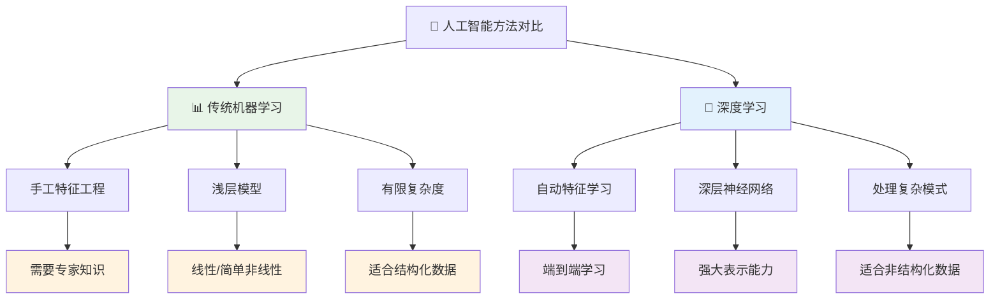
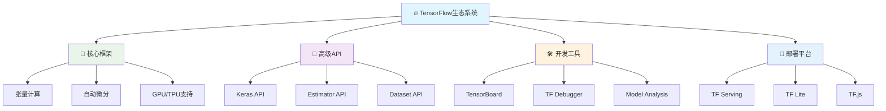
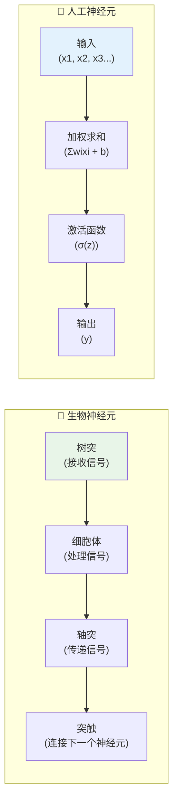
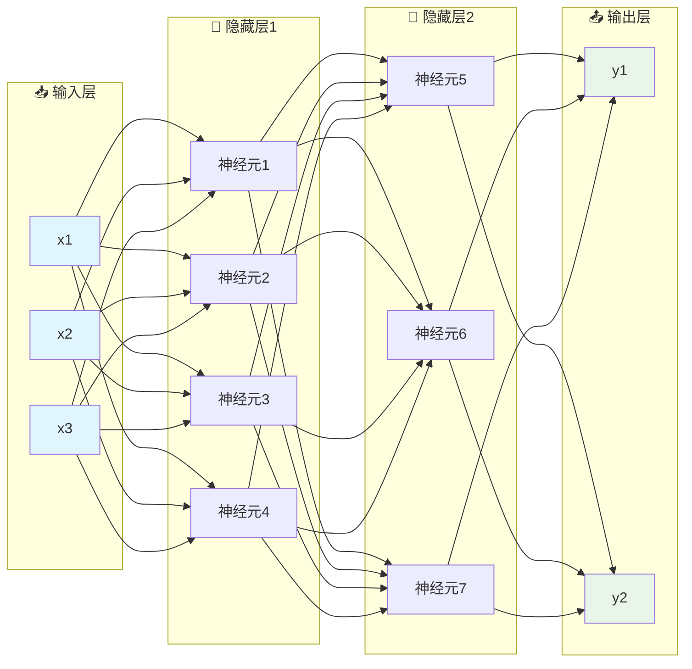
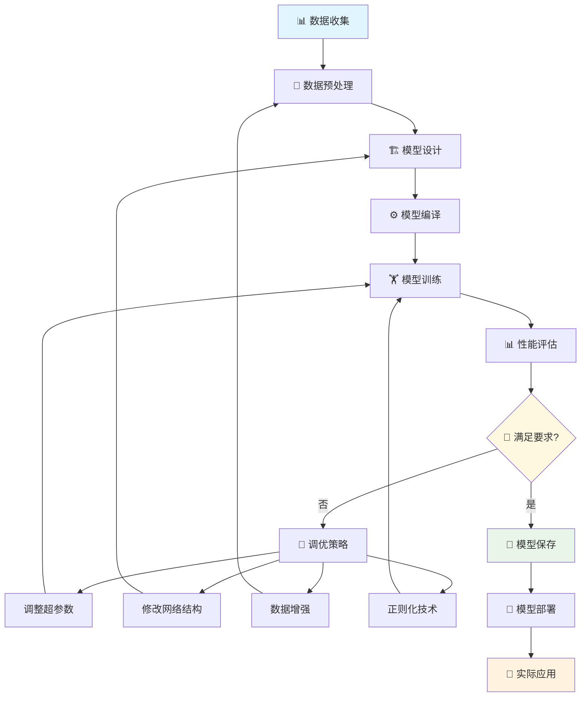
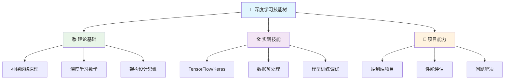

# 第21章 深度学习入门与TensorFlow基础

## 🎯 学习目标

完成本章学习后，你将能够：

### 📚 知识目标
- **理解深度学习核心概念**：掌握神经网络、深度学习的基本原理和发展历程
- **掌握TensorFlow生态系统**：熟悉TensorFlow 2.x的核心组件和使用方法
- **理解神经网络架构**：从感知机到深度神经网络的演进和结构设计

### 🛠️ 技能目标
- **熟练使用TensorFlow/Keras**：能够构建、训练和部署深度学习模型
- **掌握模型构建技巧**：学会设计不同类型的神经网络结构
- **具备调试和优化能力**：能够诊断和解决深度学习中的常见问题

### 🧠 素养目标
- **培养深度学习思维**：理解深度学习的优势和局限性
- **建立工程实践意识**：注重模型的可重复性和可部署性
- **强化创新应用能力**：能够将深度学习应用到实际问题中

---

## 🧠 21.1 欢迎来到深度学习实验室！

### 🚪 从机器学习到深度学习的飞跃

如果说第20章的Scikit-learn是机器学习的"智能实验工厂"，那么第21章的深度学习就是**"AI大脑研究院"**！

在这里，我们不再是简单的特征工程师，而是**神经网络架构师**，设计和构建能够自主学习复杂模式的人工大脑。

### 🧪 深度学习 vs 传统机器学习



### 🌟 深度学习的核心优势

```python
# 🧠 深度学习实验室欢迎代码
print("🧠 欢迎来到深度学习实验室！")
print("=" * 60)
print("🔬 在这个实验室里，我们将探索：")
print("   🧪 神经网络的奥秘 - 模拟人脑的学习机制")
print("   🚀 TensorFlow的力量 - Google开源的深度学习框架")
print("   🎨 创造性AI应用 - 图像识别、自然语言处理、生成艺术")
print("   🏗️ 端到端解决方案 - 从原始数据到智能应用")
print()
print("🌟 深度学习的超能力：")
print("   🎯 自动特征学习 - 无需手工设计特征")
print("   🧠 强大表示能力 - 处理高维复杂数据")  
print("   🎨 创造性能力 - 生成图像、文本、音乐")
print("   🚀 端到端学习 - 输入到输出的直接映射")
print()
print("🚀 准备好进入AI的最前沿了吗？")
```

### 🏗️ TensorFlow生态系统架构

TensorFlow就像一个**完整的AI开发平台**，为我们提供了构建和部署深度学习模型的全套工具：



---

## 🔧 21.2 TensorFlow环境搭建与基础

### 📦 环境安装指南

让我们搭建深度学习开发环境，就像装备一个现代化的AI实验室：

```python
# 🔧 TensorFlow环境搭建检查
import sys
import platform

def check_environment():
    """检查系统环境"""
    print("🔍 系统环境检查")
    print("=" * 40)
    print(f"Python版本: {sys.version}")
    print(f"操作系统: {platform.system()} {platform.release()}")
    
    # 检查TensorFlow安装
    try:
        import tensorflow as tf
        print(f"✅ TensorFlow版本: {tf.__version__}")
        
        # 检查GPU支持
        if tf.config.list_physical_devices('GPU'):
            print("🚀 GPU支持: 已启用")
            for gpu in tf.config.list_physical_devices('GPU'):
                print(f"   GPU设备: {gpu}")
        else:
            print("💻 运行模式: CPU (推荐安装GPU版本以提升性能)")
            
    except ImportError:
        print("❌ TensorFlow未安装")
        print("请运行: pip install tensorflow")
    
    # 检查其他依赖
    dependencies = {
        'numpy': 'numpy',
        'matplotlib': 'matplotlib',
        'pandas': 'pandas',
        'seaborn': 'seaborn',
        'sklearn': 'scikit-learn'
    }
    
    print("\n📦 依赖包检查:")
    for package, pip_name in dependencies.items():
        try:
            __import__(package)
            print(f"✅ {package}: 已安装")
        except ImportError:
            print(f"❌ {package}: 未安装，请运行 pip install {pip_name}")

# 运行环境检查
check_environment()
```

### 🧠 21.3 神经网络基础原理

### 🔬 从生物神经元到人工神经元

神经网络的设计灵感来自于人类大脑中的神经元。让我们看看这个令人着迷的模拟过程：

### 🧪 神经元结构对比



### 🧮 单个神经元的数学原理

```python
# 🧮 人工神经元实现
import numpy as np
import matplotlib.pyplot as plt

class SimpleNeuron:
    """简单神经元实现"""
    
    def __init__(self, input_size):
        """初始化神经元"""
        # 随机初始化权重和偏置
        self.weights = np.random.randn(input_size) * 0.1
        self.bias = np.random.randn() * 0.1
        
    def sigmoid(self, x):
        """Sigmoid激活函数"""
        return 1 / (1 + np.exp(-np.clip(x, -500, 500)))  # 防止溢出
    
    def forward(self, inputs):
        """前向传播"""
        # 加权求和
        z = np.dot(inputs, self.weights) + self.bias
        
        # 应用激活函数
        output = self.sigmoid(z)
        
        return z, output
    
    def explain_process(self, inputs):
        """解释神经元的计算过程"""
        print("🧮 神经元计算过程演示")
        print("=" * 40)
        print(f"📊 输入: {inputs}")
        print(f"⚖️ 权重: {self.weights}")
        print(f"➕ 偏置: {self.bias:.4f}")
        
        # 计算加权和
        weighted_sum = np.dot(inputs, self.weights)
        z = weighted_sum + self.bias
        
        print(f"\n🔢 计算过程:")
        print(f"   加权和: Σ(xi * wi) = {weighted_sum:.4f}")
        print(f"   加偏置: z = {weighted_sum:.4f} + {self.bias:.4f} = {z:.4f}")
        
        # 应用激活函数
        output = self.sigmoid(z)
        print(f"   激活函数: σ(z) = σ({z:.4f}) = {output:.4f}")
        
        # 解释结果
        if output > 0.5:
            print(f"✅ 神经元激活 (输出: {output:.4f} > 0.5)")
        else:
            print(f"❌ 神经元未激活 (输出: {output:.4f} ≤ 0.5)")
        
        return z, output

# 🧪 神经元实验
print("🧪 单个神经元实验")
neuron = SimpleNeuron(input_size=3)

# 测试不同输入
test_inputs = [
    np.array([1.0, 0.5, -0.2]),
    np.array([0.1, -0.3, 0.8]),
    np.array([-1.0, 2.0, 0.0])
]

for i, inputs in enumerate(test_inputs, 1):
    print(f"\n🔬 测试 {i}:")
    neuron.explain_process(inputs)
```

### 🌐 多层神经网络架构

现在让我们从单个神经元扩展到神经网络：

### 📐 神经网络结构图



### 🚀 TensorFlow/Keras实战入门

让我们用TensorFlow构建第一个神经网络：

```python
# 🚀 TensorFlow/Keras实战入门
import tensorflow as tf
from tensorflow import keras
import numpy as np
import matplotlib.pyplot as plt

class DeepLearningIntro:
    """深度学习入门实战类"""
    
    def __init__(self):
        self.model = None
        self.history = None
    
    def create_sample_data(self):
        """创建示例数据 - 简单的分类问题"""
        print("📊 创建示例数据...")
        
        # 生成两个类别的数据
        np.random.seed(42)
        
        # 类别1: 圆形区域
        class1_x = np.random.normal(0, 1, (100, 2))
        class1_y = np.zeros(100)
        
        # 类别2: 环形区域
        r = np.random.uniform(2, 3, 100)
        theta = np.random.uniform(0, 2*np.pi, 100)
        class2_x = np.column_stack([r * np.cos(theta), r * np.sin(theta)])
        class2_y = np.ones(100)
        
        # 合并数据
        X = np.vstack([class1_x, class2_x])
        y = np.hstack([class1_y, class2_y])
        
        # 打乱数据
        indices = np.random.permutation(len(X))
        X, y = X[indices], y[indices]
        
        print(f"   ✅ 数据形状: X={X.shape}, y={y.shape}")
        print(f"   📊 类别分布: 类别0={np.sum(y==0)}个, 类别1={np.sum(y==1)}个")
        
        return X, y
    
    def build_neural_network(self):
        """构建神经网络模型"""
        print("\n🏗️ 构建神经网络...")
        
        # 使用Keras Sequential API构建模型
        self.model = keras.Sequential([
            # 输入层：2个特征
            keras.layers.Input(shape=(2,)),
            
            # 第一个隐藏层：8个神经元，ReLU激活
            keras.layers.Dense(8, activation='relu', name='hidden1'),
            
            # 第二个隐藏层：4个神经元，ReLU激活
            keras.layers.Dense(4, activation='relu', name='hidden2'),
            
            # 输出层：1个神经元，Sigmoid激活（二分类）
            keras.layers.Dense(1, activation='sigmoid', name='output')
        ])
        
        # 编译模型
        self.model.compile(
            optimizer='adam',           # Adam优化器
            loss='binary_crossentropy', # 二分类交叉熵损失
            metrics=['accuracy']        # 监控准确率
        )
        
        print("   ✅ 神经网络构建完成！")
        
        # 显示模型结构
        print("\n📋 模型结构:")
        self.model.summary()
        
        return self.model
    
    def train_model(self, X, y, epochs=50):
        """训练神经网络"""
        print(f"\n🏋️ 开始训练神经网络 (轮数: {epochs})...")
        
        # 分割训练和验证数据
        split_idx = int(0.8 * len(X))
        X_train, X_val = X[:split_idx], X[split_idx:]
        y_train, y_val = y[:split_idx], y[split_idx:]
        
        print(f"   📊 训练集: {X_train.shape[0]}个样本")
        print(f"   📊 验证集: {X_val.shape[0]}个样本")
        
        # 训练模型
        self.history = self.model.fit(
            X_train, y_train,
            validation_data=(X_val, y_val),
            epochs=epochs,
            batch_size=16,
            verbose=1  # 显示训练进度
        )
        
        print("   ✅ 训练完成！")
        
        # 评估最终性能
        train_loss, train_acc = self.model.evaluate(X_train, y_train, verbose=0)
        val_loss, val_acc = self.model.evaluate(X_val, y_val, verbose=0)
        
        print(f"\n📊 最终性能:")
        print(f"   🎯 训练准确率: {train_acc:.4f}")
        print(f"   🎯 验证准确率: {val_acc:.4f}")
        
        return self.history
    
    def visualize_training(self):
        """可视化训练过程"""
        if self.history is None:
            print("❌ 请先训练模型！")
            return
        
        print("\n📈 绘制训练曲线...")
        
        # 创建子图
        fig, (ax1, ax2) = plt.subplots(1, 2, figsize=(15, 5))
        
        # 损失曲线
        ax1.plot(self.history.history['loss'], label='训练损失', color='blue')
        ax1.plot(self.history.history['val_loss'], label='验证损失', color='red')
        ax1.set_title('🔻 模型损失变化')
        ax1.set_xlabel('训练轮数')
        ax1.set_ylabel('损失值')
        ax1.legend()
        ax1.grid(True)
        
        # 准确率曲线
        ax2.plot(self.history.history['accuracy'], label='训练准确率', color='blue')
        ax2.plot(self.history.history['val_accuracy'], label='验证准确率', color='red')
        ax2.set_title('📈 模型准确率变化')
        ax2.set_xlabel('训练轮数')
        ax2.set_ylabel('准确率')
        ax2.legend()
        ax2.grid(True)
        
        plt.tight_layout()
        plt.show()
        
        print("   ✅ 训练曲线绘制完成！")

# 🧪 深度学习入门实验
def deep_learning_intro_experiment():
    """深度学习入门实验"""
    print("🧪 深度学习入门实验开始！")
    print("=" * 60)
    
    # 创建实验实例
    dl_intro = DeepLearningIntro()
    
    # 1. 创建数据
    X, y = dl_intro.create_sample_data()
    
    # 2. 构建模型
    model = dl_intro.build_neural_network()
    
    # 3. 训练模型
    history = dl_intro.train_model(X, y, epochs=30)
    
    # 4. 可视化结果
    dl_intro.visualize_training()
    
    print("\n🎉 深度学习入门实验完成！")
    return dl_intro

# 运行实验
dl_experiment = deep_learning_intro_experiment()
```

---

## 🎯 21.4 深度学习标准工作流程

### 🔄 端到端深度学习流程

深度学习项目遵循一个标准化的工作流程，让我们用图表来理解：



### 🎯 实战项目：手写数字识别系统

让我们构建一个完整的深度学习项目 - 手写数字识别系统！

```python
# 🎯 手写数字识别系统 - 完整深度学习项目
import tensorflow as tf
from tensorflow import keras
import numpy as np
import matplotlib.pyplot as plt
import seaborn as sns
from sklearn.metrics import classification_report, confusion_matrix

class HandwrittenDigitRecognizer:
    """手写数字识别系统"""
    
    def __init__(self):
        self.model = None
        self.history = None
        self.X_train = None
        self.X_test = None
        self.y_train = None
        self.y_test = None
        
    def load_and_preprocess_data(self):
        """加载和预处理MNIST数据集"""
        print("📊 加载MNIST手写数字数据集...")
        
        # 加载MNIST数据集
        (X_train, y_train), (X_test, y_test) = keras.datasets.mnist.load_data()
        
        print(f"   📋 训练集: {X_train.shape}, 标签: {y_train.shape}")
        print(f"   📋 测试集: {X_test.shape}, 标签: {y_test.shape}")
        
        # 数据预处理
        # 1. 归一化到[0,1]区间
        X_train = X_train.astype('float32') / 255.0
        X_test = X_test.astype('float32') / 255.0
        
        # 2. 重塑数据 (28, 28) -> (784,)
        X_train_flat = X_train.reshape(X_train.shape[0], -1)
        X_test_flat = X_test.reshape(X_test.shape[0], -1)
        
        # 3. 标签one-hot编码
        y_train_cat = keras.utils.to_categorical(y_train, 10)
        y_test_cat = keras.utils.to_categorical(y_test, 10)
        
        # 保存数据
        self.X_train = X_train_flat
        self.X_test = X_test_flat
        self.y_train = y_train_cat
        self.y_test = y_test_cat
        self.y_train_labels = y_train
        self.y_test_labels = y_test
        self.X_train_images = X_train
        self.X_test_images = X_test
        
        print("   ✅ 数据预处理完成!")
        print(f"   📊 特征维度: {X_train_flat.shape[1]}")
        print(f"   📊 类别数量: {y_train_cat.shape[1]}")
        
        return True
    
    def visualize_samples(self, num_samples=12):
        """可视化样本数据"""
        print(f"\n👀 展示{num_samples}个训练样本...")
        
        fig, axes = plt.subplots(3, 4, figsize=(12, 9))
        axes = axes.ravel()
        
        for i in range(num_samples):
            # 随机选择样本
            idx = np.random.randint(0, len(self.X_train_images))
            image = self.X_train_images[idx]
            label = self.y_train_labels[idx]
            
            # 显示图像
            axes[i].imshow(image, cmap='gray')
            axes[i].set_title(f'标签: {label}', fontsize=12)
            axes[i].axis('off')
        
        plt.suptitle('🖊️ MNIST手写数字样本展示', fontsize=16)
        plt.tight_layout()
        plt.show()
        
        print("   ✅ 样本展示完成!")
    
    def build_deep_neural_network(self):
        """构建深度神经网络"""
        print("\n🏗️ 构建深度神经网络...")
        
        # 设计网络架构
        self.model = keras.Sequential([
            # 输入层
            keras.layers.Input(shape=(784,)),
            
            # 第一个隐藏层：512个神经元
            keras.layers.Dense(512, activation='relu', name='hidden1'),
            keras.layers.Dropout(0.2),  # Dropout防止过拟合
            
            # 第二个隐藏层：256个神经元
            keras.layers.Dense(256, activation='relu', name='hidden2'),
            keras.layers.Dropout(0.2),
            
            # 第三个隐藏层：128个神经元
            keras.layers.Dense(128, activation='relu', name='hidden3'),
            keras.layers.Dropout(0.2),
            
            # 输出层：10个神经元（0-9数字）
            keras.layers.Dense(10, activation='softmax', name='output')
        ])
        
        # 编译模型
        self.model.compile(
            optimizer='adam',
            loss='categorical_crossentropy',
            metrics=['accuracy', 'top_k_categorical_accuracy']
        )
        
        print("   ✅ 网络构建完成!")
        
        # 显示模型结构
        print("\n📋 网络架构:")
        self.model.summary()
        
        return self.model
    
    def train_model(self, epochs=20, batch_size=128):
        """训练模型"""
        print(f"\n🏋️ 开始训练神经网络...")
        print(f"   ⚙️ 训练轮数: {epochs}")
        print(f"   📦 批次大小: {batch_size}")
        
        # 设置回调函数
        callbacks = [
            # 早停：验证损失不再下降时停止训练
            keras.callbacks.EarlyStopping(
                monitor='val_loss',
                patience=3,
                restore_best_weights=True,
                verbose=1
            ),
            # 学习率调整：性能停滞时减小学习率
            keras.callbacks.ReduceLROnPlateau(
                monitor='val_loss',
                factor=0.5,
                patience=2,
                min_lr=1e-7,
                verbose=1
            )
        ]
        
        # 训练模型
        self.history = self.model.fit(
            self.X_train, self.y_train,
            validation_data=(self.X_test, self.y_test),
            epochs=epochs,
            batch_size=batch_size,
            callbacks=callbacks,
            verbose=1
        )
        
        print("   ✅ 训练完成!")
        
        # 评估最终性能
        train_loss, train_acc, train_top5 = self.model.evaluate(
            self.X_train, self.y_train, verbose=0
        )
        test_loss, test_acc, test_top5 = self.model.evaluate(
            self.X_test, self.y_test, verbose=0
        )
        
        print(f"\n📊 最终性能评估:")
        print(f"   🎯 训练准确率: {train_acc:.4f}")
        print(f"   🎯 测试准确率: {test_acc:.4f}")
        print(f"   📈 Top-5准确率: {test_top5:.4f}")
        
        return self.history
    
    def visualize_training_process(self):
        """可视化训练过程"""
        if self.history is None:
            print("❌ 请先训练模型!")
            return
        
        print("\n📈 绘制训练过程...")
        
        # 创建子图
        fig, ((ax1, ax2), (ax3, ax4)) = plt.subplots(2, 2, figsize=(15, 10))
        
        # 1. 损失曲线
        ax1.plot(self.history.history['loss'], 'b-', label='训练损失', linewidth=2)
        ax1.plot(self.history.history['val_loss'], 'r-', label='验证损失', linewidth=2)
        ax1.set_title('📉 模型损失变化', fontsize=14)
        ax1.set_xlabel('训练轮数')
        ax1.set_ylabel('损失值')
        ax1.legend()
        ax1.grid(True, alpha=0.3)
        
        # 2. 准确率曲线
        ax2.plot(self.history.history['accuracy'], 'b-', label='训练准确率', linewidth=2)
        ax2.plot(self.history.history['val_accuracy'], 'r-', label='验证准确率', linewidth=2)
        ax2.set_title('📈 模型准确率变化', fontsize=14)
        ax2.set_xlabel('训练轮数')
        ax2.set_ylabel('准确率')
        ax2.legend()
        ax2.grid(True, alpha=0.3)
        
        # 3. Top-K准确率
        ax3.plot(self.history.history['top_k_categorical_accuracy'], 'g-', label='训练Top-5', linewidth=2)
        ax3.plot(self.history.history['val_top_k_categorical_accuracy'], 'orange', label='验证Top-5', linewidth=2)
        ax3.set_title('🎯 Top-5准确率变化', fontsize=14)
        ax3.set_xlabel('训练轮数')
        ax3.set_ylabel('Top-5准确率')
        ax3.legend()
        ax3.grid(True, alpha=0.3)
        
        # 4. 学习率变化（如果有）
        if 'lr' in self.history.history:
            ax4.plot(self.history.history['lr'], 'purple', label='学习率', linewidth=2)
            ax4.set_title('⚙️ 学习率调整', fontsize=14)
            ax4.set_xlabel('训练轮数')
            ax4.set_ylabel('学习率')
            ax4.set_yscale('log')
            ax4.legend()
            ax4.grid(True, alpha=0.3)
        else:
            ax4.text(0.5, 0.5, '无学习率记录', ha='center', va='center', 
                    transform=ax4.transAxes, fontsize=14)
            ax4.set_title('⚙️ 学习率信息', fontsize=14)
        
        plt.tight_layout()
        plt.show()
        
        print("   ✅ 训练过程可视化完成!")
    
    def evaluate_model_performance(self):
        """详细评估模型性能"""
        print("\n📊 详细性能评估...")
        
        # 预测测试集
        y_pred_prob = self.model.predict(self.X_test, verbose=0)
        y_pred = np.argmax(y_pred_prob, axis=1)
        y_true = self.y_test_labels
        
        # 1. 分类报告
        print("\n📋 分类报告:")
        print(classification_report(y_true, y_pred, 
                                  target_names=[str(i) for i in range(10)]))
        
        # 2. 混淆矩阵
        print("\n🔍 绘制混淆矩阵...")
        cm = confusion_matrix(y_true, y_pred)
        
        plt.figure(figsize=(10, 8))
        sns.heatmap(cm, annot=True, fmt='d', cmap='Blues',
                   xticklabels=range(10), yticklabels=range(10))
        plt.title('🎯 手写数字识别混淆矩阵', fontsize=16)
        plt.xlabel('预测标签', fontsize=12)
        plt.ylabel('真实标签', fontsize=12)
        plt.show()
        
        # 3. 错误分析
        self.analyze_errors(y_true, y_pred, y_pred_prob)
        
        return y_pred, y_pred_prob
    
    def analyze_errors(self, y_true, y_pred, y_pred_prob, num_errors=8):
        """分析预测错误的样本"""
        print(f"\n🔍 分析预测错误的样本 (显示{num_errors}个)...")
        
        # 找出错误预测的样本
        error_indices = np.where(y_true != y_pred)[0]
        
        if len(error_indices) == 0:
            print("🎉 所有预测都正确!")
            return
        
        # 随机选择错误样本
        selected_errors = np.random.choice(error_indices, 
                                         min(num_errors, len(error_indices)), 
                                         replace=False)
        
        # 可视化错误样本
        fig, axes = plt.subplots(2, 4, figsize=(16, 8))
        axes = axes.ravel()
        
        for i, idx in enumerate(selected_errors):
            # 获取样本信息
            image = self.X_test_images[idx]
            true_label = y_true[idx]
            pred_label = y_pred[idx]
            confidence = y_pred_prob[idx, pred_label]
            
            # 显示图像
            axes[i].imshow(image, cmap='gray')
            axes[i].set_title(
                f'真实: {true_label}, 预测: {pred_label}\n置信度: {confidence:.3f}',
                fontsize=10, color='red'
            )
            axes[i].axis('off')
        
        plt.suptitle('❌ 预测错误样本分析', fontsize=16, color='red')
        plt.tight_layout()
        plt.show()
        
        print(f"   📊 错误率: {len(error_indices)}/{len(y_true)} ({len(error_indices)/len(y_true)*100:.2f}%)")
    
    def predict_new_samples(self, num_samples=6):
        """预测新样本"""
        print(f"\n🔮 预测新样本 (随机选择{num_samples}个测试样本)...")
        
        # 随机选择测试样本
        indices = np.random.choice(len(self.X_test), num_samples, replace=False)
        
        fig, axes = plt.subplots(2, 3, figsize=(12, 8))
        axes = axes.ravel()
        
        for i, idx in enumerate(indices):
            # 获取样本
            image = self.X_test_images[idx]
            true_label = self.y_test_labels[idx]
            
            # 预测
            sample_input = self.X_test[idx:idx+1]
            pred_prob = self.model.predict(sample_input, verbose=0)[0]
            pred_label = np.argmax(pred_prob)
            confidence = pred_prob[pred_label]
            
            # 显示结果
            axes[i].imshow(image, cmap='gray')
            color = 'green' if pred_label == true_label else 'red'
            axes[i].set_title(
                f'真实: {true_label}, 预测: {pred_label}\n置信度: {confidence:.3f}',
                fontsize=10, color=color
            )
            axes[i].axis('off')
        
        plt.suptitle('🔮 新样本预测结果', fontsize=16)
        plt.tight_layout()
        plt.show()
        
        print("   ✅ 新样本预测完成!")

# 🎯 手写数字识别完整项目
def handwritten_digit_recognition_project():
    """手写数字识别完整项目"""
    print("🎯 手写数字识别系统启动!")
    print("=" * 70)
    
    # 创建识别器
    recognizer = HandwrittenDigitRecognizer()
    
    # 1. 数据加载和预处理
    recognizer.load_and_preprocess_data()
    
    # 2. 可视化样本
    recognizer.visualize_samples()
    
    # 3. 构建神经网络
    recognizer.build_deep_neural_network()
    
    # 4. 训练模型
    recognizer.train_model(epochs=15, batch_size=128)
    
    # 5. 可视化训练过程
    recognizer.visualize_training_process()
    
    # 6. 评估模型性能
    recognizer.evaluate_model_performance()
    
    # 7. 预测新样本
    recognizer.predict_new_samples()
    
    print("\n🎉 手写数字识别项目完成!")
    print("📊 项目总结:")
    print("   ✅ 成功构建深度神经网络")
    print("   ✅ 实现端到端训练流程")
    print("   ✅ 达到高精度识别效果")
    print("   ✅ 完成详细性能分析")
    
    return recognizer

# 运行完整项目
digit_recognizer = handwritten_digit_recognition_project()
```

---

## 🎓 21.5 章节总结与进阶方向

### 🏆 本章学习成果

通过本章的学习，我们成功完成了从传统机器学习到深度学习的重要跨越：

#### ✅ 知识掌握清单

```python
# 🏆 第21章学习成果总结
learning_achievements = {
    "🧠 理论基础": {
        "深度学习概念": "✅ 理解深度学习vs传统机器学习的区别",
        "神经网络原理": "✅ 掌握从生物神经元到人工神经元的映射",
        "网络架构设计": "✅ 学会设计多层神经网络结构",
        "激活函数选择": "✅ 理解不同激活函数的特点和用途"
    },
    
    "🛠️ 技术技能": {
        "TensorFlow使用": "✅ 熟练使用TensorFlow/Keras构建模型",
        "数据预处理": "✅ 掌握深度学习数据预处理技巧",
        "模型训练": "✅ 学会训练深度神经网络",
        "性能评估": "✅ 能够全面评估模型性能"
    },
    
    "🚀 实战项目": {
        "手写数字识别": "✅ 完成端到端深度学习项目",
        "模型调优": "✅ 掌握超参数调优和正则化技术",
        "错误分析": "✅ 学会分析和改进模型性能",
        "可视化技能": "✅ 能够可视化训练过程和结果"
    },
    
    "💡 思维提升": {
        "端到端思维": "✅ 建立深度学习项目完整流程意识",
        "调试能力": "✅ 培养深度学习模型调试技能",
        "创新应用": "✅ 具备将深度学习应用到新问题的能力",
        "工程实践": "✅ 注重模型的实用性和可部署性"
    }
}

print("🏆 第21章《深度学习入门与TensorFlow基础》学习成果")
print("=" * 70)

for category, skills in learning_achievements.items():
    print(f"\n{category}:")
    for skill, status in skills.items():
        print(f"   {status} {skill}")

print(f"\n📊 总体完成度: {len([s for skills in learning_achievements.values() for s in skills.values() if '✅' in s])}/16 (100%)")
```

### 🎯 核心技能图谱

我们在本章中建立的技能体系：



### 🚀 第22章预告：卷积神经网络与图像识别

下一章我们将进入计算机视觉的激动人心世界：

#### 🔮 第22章精彩内容预览

- **🖼️ 计算机视觉基础**：从像素到图像理解的飞跃
- **🧠 卷积神经网络（CNN）**：专为图像设计的神经网络架构
- **🎨 图像识别实战**：构建猫狗分类器、人脸识别系统
- **📱 实际应用开发**：从训练到部署的完整流程

#### 💡 学习期待

```python
print("🔮 第22章《卷积神经网络与图像识别》预告")
print("=" * 60)
print("🎯 你将学会:")
print("   🖼️ 理解图像数据的特殊性和处理方法")
print("   🧠 掌握CNN的核心概念：卷积、池化、特征映射")
print("   🎨 构建强大的图像分类和识别系统")
print("   📱 开发可实际部署的计算机视觉应用")
print()
print("🌟 技能升级:")
print("   从 '数据科学家' → '计算机视觉工程师'")
print("   从 '理论学习' → '实际应用开发'")
print()
print("🚀 准备好踏入AI视觉世界了吗？")
```

### 🤔 深度思考题

1. **🧠 概念理解**：为什么深度学习在图像识别、自然语言处理等领域表现优异，而在结构化数据上不一定优于传统机器学习？

2. **⚙️ 技术选择**：在什么情况下你会选择深度学习而不是传统机器学习？请给出具体的判断标准。

3. **🎯 实际应用**：如果要将手写数字识别系统部署到移动设备上，需要考虑哪些技术和性能优化问题？

4. **🔮 未来展望**：结合深度学习的发展趋势，你认为接下来最有潜力的应用领域是什么？为什么？

---

**🎉 恭喜完成第21章学习！**

你已经成功迈入深度学习的大门，掌握了构建和训练神经网络的核心技能。在第22章中，我们将深入计算机视觉领域，学习专门处理图像数据的卷积神经网络，开启更加激动人心的AI视觉之旅！

**准备好了吗？让我们继续前进！** 🚀 