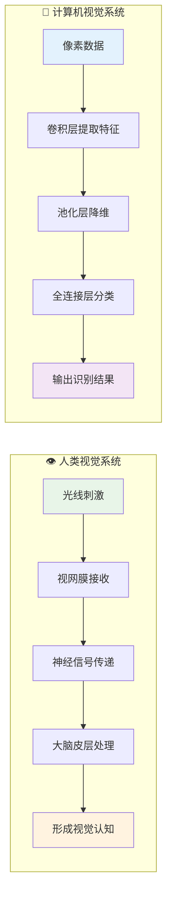
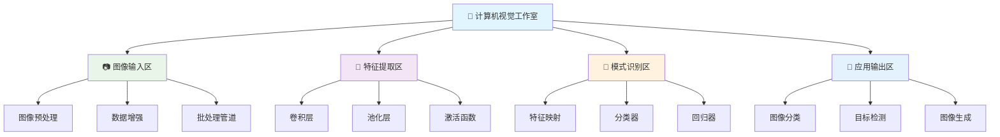
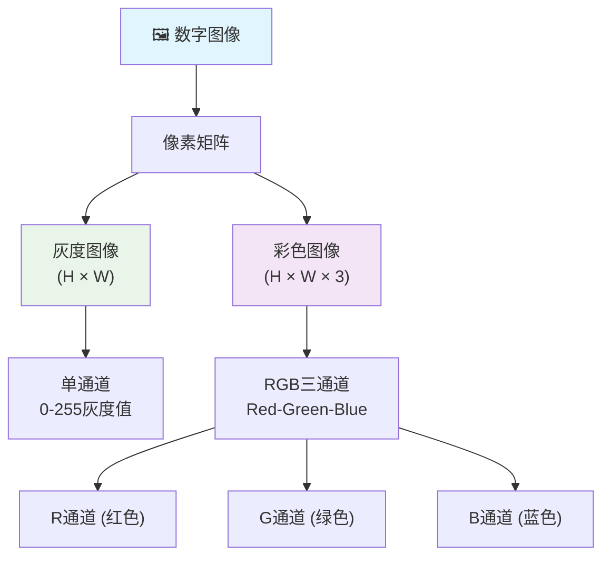
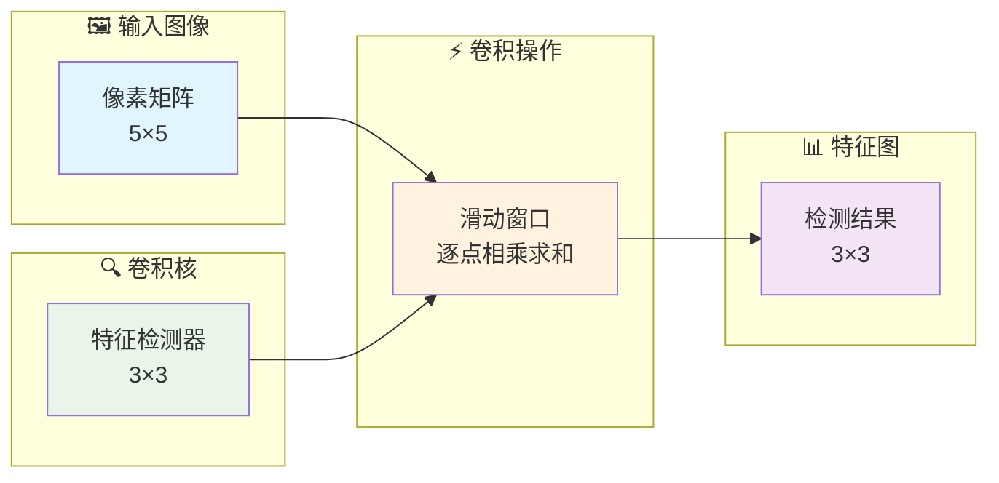
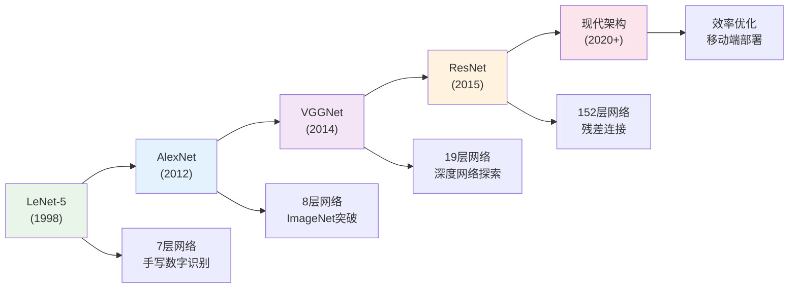
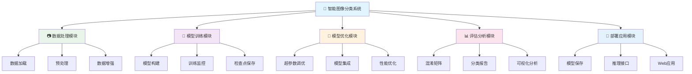
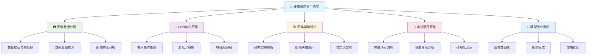

# 第22章 卷积神经网络与图像识别

## 🎯 学习目标

完成本章学习后，你将能够：

### 📚 知识目标
- **理解计算机视觉核心概念**：掌握图像数据的特点和处理方法
- **掌握CNN网络架构**：深入理解卷积、池化、全连接层的工作原理
- **理解特征学习机制**：了解CNN如何自动学习图像特征的层次结构
- **掌握图像分类流程**：从数据预处理到模型部署的完整pipeline

### 🛠️ 技能目标
- **构建CNN模型**：能够设计和实现各种卷积神经网络架构
- **处理图像数据**：熟练进行图像预处理、数据增强和批处理
- **调优视觉模型**：掌握CNN模型的训练技巧和性能优化方法
- **开发视觉应用**：具备构建实用图像识别系统的能力

### 🧠 素养目标
- **培养视觉AI思维**：建立对计算机视觉问题的系统性认知
- **强化工程实践意识**：注重模型的实用性和部署可行性
- **建立创新应用思维**：能够将CNN技术应用到新的视觉任务中

---

## 🎨 22.1 欢迎来到计算机视觉工作室！

### 🚪 从大脑研究院到视觉工作室的升级

如果说第21章的深度学习是**"AI大脑研究院"**，那么第22章的计算机视觉就是**"AI视觉工作室"**！

在这里，我们不再只是处理数字和表格，而是让AI拥有"眼睛"，能够理解和分析视觉世界。就像人类的视觉系统一样，我们的AI将学会从像素中识别物体、理解场景、感知世界。

### 👁️ 计算机视觉 vs 人类视觉



### 🌟 计算机视觉的核心优势

```python
# 🎨 计算机视觉工作室欢迎代码
print("🎨 欢迎来到计算机视觉工作室！")
print("=" * 60)
print("👁️ 在这个工作室里，我们将探索：")
print("   🖼️ 图像识别的奥秘 - 让AI学会'看'世界")
print("   🧠 CNN网络架构 - 专为视觉设计的神经网络")
print("   🎯 特征学习机制 - 从边缘到物体的层次认知")
print("   🚀 实时视觉应用 - 构建智能图像识别系统")
print()
print("🌟 计算机视觉的超能力：")
print("   👀 像素级理解 - 从原始像素中提取高级语义")
print("   🔍 细节捕捉能力 - 发现人眼难以察觉的特征")
print("   ⚡ 超快处理速度 - 毫秒级完成复杂图像分析")
print("   🎨 创造性生成 - 生成逼真的图像和艺术作品")
print()
print("🚀 准备好让AI拥有视觉能力了吗？")
```

### 🏗️ 计算机视觉工作室架构

我们的计算机视觉工作室包含了从基础到高级的完整视觉处理流水线：



---

## 📷 22.2 图像数据基础与预处理

### 🖼️ 图像数据的本质

在开始构建CNN之前，我们需要深入理解图像数据的特点：

### 📊 图像数据结构解析



### 🔬 图像数据探索与可视化

```python
# 🔬 图像数据探索实验室
import numpy as np
import matplotlib.pyplot as plt
import cv2
from tensorflow import keras
from tensorflow.keras import datasets
import seaborn as sns

class ImageDataExplorer:
    """图像数据探索工具"""
    
    def __init__(self):
        self.data_loaded = False
        
    def load_sample_datasets(self):
        """加载示例数据集"""
        print("📊 加载图像数据集...")
        
        # 加载CIFAR-10数据集
        (self.X_train, self.y_train), (self.X_test, self.y_test) = datasets.cifar10.load_data()
        
        # CIFAR-10类别名称
        self.class_names = [
            'airplane', 'automobile', 'bird', 'cat', 'deer',
            'dog', 'frog', 'horse', 'ship', 'truck'
        ]
        
        self.data_loaded = True
        
        print(f"   ✅ 数据加载完成!")
        print(f"   📋 训练集: {self.X_train.shape}")
        print(f"   📋 测试集: {self.X_test.shape}")
        print(f"   🎯 类别数: {len(self.class_names)}")
        
        return True
    
    def analyze_image_properties(self):
        """分析图像属性"""
        if not self.data_loaded:
            print("❌ 请先加载数据集!")
            return
            
        print("\n🔍 图像数据属性分析")
        print("=" * 50)
        
        # 基础属性
        height, width, channels = self.X_train.shape[1:]
        print(f"📐 图像尺寸: {height} × {width} × {channels}")
        print(f"📊 像素值范围: {self.X_train.min()} - {self.X_train.max()}")
        print(f"📈 数据类型: {self.X_train.dtype}")
        
        # 统计信息
        mean_pixel = self.X_train.mean()
        std_pixel = self.X_train.std()
        print(f"📊 像素均值: {mean_pixel:.2f}")
        print(f"📊 像素标准差: {std_pixel:.2f}")
        
        # 类别分布
        unique, counts = np.unique(self.y_train, return_counts=True)
        print(f"\n🎯 类别分布:")
        for i, (class_id, count) in enumerate(zip(unique, counts)):
            print(f"   {self.class_names[i]}: {count} 张图像")
    
    def visualize_sample_images(self, num_samples=12):
        """可视化样本图像"""
        if not self.data_loaded:
            print("❌ 请先加载数据集!")
            return
            
        print(f"\n👀 展示{num_samples}个样本图像...")
        
        # 创建子图
        fig, axes = plt.subplots(3, 4, figsize=(15, 12))
        axes = axes.ravel()
        
        # 随机选择样本
        indices = np.random.choice(len(self.X_train), num_samples, replace=False)
        
        for i, idx in enumerate(indices):
            image = self.X_train[idx]
            label = self.y_train[idx][0]
            class_name = self.class_names[label]
            
            # 显示图像
            axes[i].imshow(image)
            axes[i].set_title(f'{class_name}\n({image.shape})', fontsize=12)
            axes[i].axis('off')
        
        plt.suptitle('🖼️ CIFAR-10 样本图像展示', fontsize=16)
        plt.tight_layout()
        plt.show()
        
        print("   ✅ 样本展示完成!")

# 🎨 图像数据探索实验
def image_data_exploration_experiment():
    """图像数据探索实验"""
    print("🔬 图像数据探索实验开始！")
    print("=" * 60)
    
    # 创建探索器
    explorer = ImageDataExplorer()
    
    # 1. 加载数据
    explorer.load_sample_datasets()
    
    # 2. 分析图像属性
    explorer.analyze_image_properties()
    
    # 3. 可视化样本
    explorer.visualize_sample_images()
    
    print("\n🎉 图像数据探索实验完成!")
    return explorer

# 运行图像数据探索实验
image_explorer = image_data_exploration_experiment()
```

---

## 🧠 22.3 卷积神经网络核心原理

### 🔬 卷积操作的本质

卷积是CNN的核心操作，就像人类视觉系统中的特征检测器一样：

### 🔍 卷积操作可视化



### 🧮 卷积操作详解与实现

```python
# 🧮 卷积操作原理演示
import numpy as np
import matplotlib.pyplot as plt

class ConvolutionDemonstrator:
    """卷积操作演示器"""
    
    def __init__(self):
        self.demo_image = None
        self.demo_kernel = None
        
    def create_demo_data(self):
        """创建演示数据"""
        print("🎨 创建卷积演示数据...")
        
        # 创建一个简单的5x5图像
        self.demo_image = np.array([
            [0, 0, 1, 0, 0],
            [0, 0, 1, 0, 0],
            [0, 0, 1, 0, 0],
            [0, 0, 1, 0, 0],
            [0, 0, 1, 0, 0]
        ], dtype=np.float32)
        
        # 创建边缘检测卷积核
        self.demo_kernel = np.array([
            [-1, -1, -1],
            [ 0,  0,  0],
            [ 1,  1,  1]
        ], dtype=np.float32)
        
        print("   ✅ 演示数据创建完成!")
        
    def manual_convolution(self, image, kernel):
        """手动实现卷积操作"""
        print("\n🔧 执行手动卷积操作...")
        
        # 获取尺寸
        img_h, img_w = image.shape
        ker_h, ker_w = kernel.shape
        
        # 计算输出尺寸
        out_h = img_h - ker_h + 1
        out_w = img_w - ker_w + 1
        
        # 初始化输出
        output = np.zeros((out_h, out_w))
        
        # 执行卷积
        for i in range(out_h):
            for j in range(out_w):
                # 提取对应区域
                region = image[i:i+ker_h, j:j+ker_w]
                # 计算卷积
                output[i, j] = np.sum(region * kernel)
        
        print(f"   📊 输入尺寸: {image.shape}")
        print(f"   🔍 卷积核尺寸: {kernel.shape}")
        print(f"   📈 输出尺寸: {output.shape}")
        
        return output
    
    def visualize_convolution_process(self):
        """可视化卷积过程"""
        print("\n👀 可视化卷积过程...")
        
        # 执行卷积
        result = self.manual_convolution(self.demo_image, self.demo_kernel)
        
        # 创建可视化
        fig, axes = plt.subplots(1, 4, figsize=(20, 5))
        
        # 输入图像
        axes[0].imshow(self.demo_image, cmap='Blues', vmin=0, vmax=1)
        axes[0].set_title('🖼️ 输入图像 (5×5)', fontsize=14)
        axes[0].grid(True, alpha=0.3)
        
        # 卷积核
        axes[1].imshow(self.demo_kernel, cmap='RdBu', vmin=-1, vmax=1)
        axes[1].set_title('🔍 卷积核 (3×3)\n边缘检测器', fontsize=14)
        axes[1].grid(True, alpha=0.3)
        
        # 卷积结果
        axes[2].imshow(result, cmap='RdYlBu')
        axes[2].set_title('📊 特征图 (3×3)\n卷积结果', fontsize=14)
        axes[2].grid(True, alpha=0.3)
        
        # 添加数值标注
        for i in range(result.shape[0]):
            for j in range(result.shape[1]):
                axes[2].text(j, i, f'{result[i,j]:.1f}', 
                           ha='center', va='center', fontsize=12, color='black')
        
        # 步骤说明
        axes[3].text(0.1, 0.8, '🔧 卷积操作步骤:', fontsize=14, weight='bold')
        axes[3].text(0.1, 0.7, '1. 卷积核滑动遍历图像', fontsize=12)
        axes[3].text(0.1, 0.6, '2. 对应元素相乘', fontsize=12)
        axes[3].text(0.1, 0.5, '3. 求和得到特征值', fontsize=12)
        axes[3].text(0.1, 0.4, '4. 移动到下一位置', fontsize=12)
        axes[3].text(0.1, 0.2, '✨ 结果解释:', fontsize=14, weight='bold', color='blue')
        axes[3].text(0.1, 0.1, '检测到垂直边缘！', fontsize=12, color='red')
        axes[3].set_xlim(0, 1)
        axes[3].set_ylim(0, 1)
        axes[3].axis('off')
        
        plt.tight_layout()
        plt.show()
        
        print("   ✅ 卷积过程可视化完成!")
        return result

# 🧮 卷积操作演示实验
def convolution_demonstration_experiment():
    """卷积操作演示实验"""
    print("🧮 卷积操作原理演示实验开始！")
    print("=" * 60)
    
    # 创建演示器
    demonstrator = ConvolutionDemonstrator()
    
    # 1. 创建演示数据
    demonstrator.create_demo_data()
    
    # 2. 可视化卷积过程
    demonstrator.visualize_convolution_process()
    
    print("\n🎉 卷积操作演示实验完成!")
    return demonstrator

# 运行卷积演示实验
conv_demonstrator = convolution_demonstration_experiment()
```

---

## 🏗️ 22.4 CNN网络架构设计

### 📐 经典CNN架构解析

让我们深入了解几种经典的CNN架构，从简单到复杂：

### 🌟 CNN架构进化史



### 🏗️ 构建现代CNN架构

```python
# 🏗️ CNN架构设计工厂
import tensorflow as tf
from tensorflow import keras
from tensorflow.keras import layers, models
import matplotlib.pyplot as plt
import numpy as np

class CNNArchitectureFactory:
    """CNN架构设计工厂"""
    
    def __init__(self):
        self.architectures = {}
        
    def create_simple_cnn(self, input_shape=(32, 32, 3), num_classes=10):
        """创建简单CNN架构"""
        print("🔨 构建简单CNN架构...")
        
        model = models.Sequential([
            # 第一个卷积块
            layers.Conv2D(32, (3, 3), activation='relu', input_shape=input_shape),
            layers.MaxPooling2D((2, 2)),
            
            # 第二个卷积块
            layers.Conv2D(64, (3, 3), activation='relu'),
            layers.MaxPooling2D((2, 2)),
            
            # 第三个卷积块
            layers.Conv2D(64, (3, 3), activation='relu'),
            
            # 全连接层
            layers.Flatten(),
            layers.Dense(64, activation='relu'),
            layers.Dropout(0.5),
            layers.Dense(num_classes, activation='softmax')
        ])
        
        # 编译模型
        model.compile(
            optimizer='adam',
            loss='sparse_categorical_crossentropy',
            metrics=['accuracy']
        )
        
        self.architectures['simple_cnn'] = model
        print("   ✅ 简单CNN架构创建完成!")
        
        return model
    
    def create_vgg_style_cnn(self, input_shape=(32, 32, 3), num_classes=10):
        """创建VGG风格的CNN架构"""
        print("🔨 构建VGG风格CNN架构...")
        
        model = models.Sequential([
            # 第一个VGG块 (64个滤波器)
            layers.Conv2D(64, (3, 3), activation='relu', padding='same', input_shape=input_shape),
            layers.Conv2D(64, (3, 3), activation='relu', padding='same'),
            layers.MaxPooling2D((2, 2)),
            
            # 第二个VGG块 (128个滤波器)
            layers.Conv2D(128, (3, 3), activation='relu', padding='same'),
            layers.Conv2D(128, (3, 3), activation='relu', padding='same'),
            layers.MaxPooling2D((2, 2)),
            
            # 第三个VGG块 (256个滤波器)
            layers.Conv2D(256, (3, 3), activation='relu', padding='same'),
            layers.Conv2D(256, (3, 3), activation='relu', padding='same'),
            layers.MaxPooling2D((2, 2)),
            
            # 全连接层
            layers.Flatten(),
            layers.Dense(512, activation='relu'),
            layers.Dropout(0.5),
            layers.Dense(256, activation='relu'),
            layers.Dropout(0.5),
            layers.Dense(num_classes, activation='softmax')
        ])
        
        # 编译模型
        model.compile(
            optimizer='adam',
            loss='sparse_categorical_crossentropy',
            metrics=['accuracy']
        )
        
        self.architectures['vgg_style_cnn'] = model
        print("   ✅ VGG风格CNN架构创建完成!")
        
        return model
    
    def create_residual_block(self, inputs, filters, kernel_size=3, stride=1):
        """创建残差块"""
        # 主路径
        x = layers.Conv2D(filters, kernel_size, strides=stride, padding='same')(inputs)
        x = layers.BatchNormalization()(x)
        x = layers.ReLU()(x)
        
        x = layers.Conv2D(filters, kernel_size, padding='same')(x)
        x = layers.BatchNormalization()(x)
        
        # 快捷连接
        if stride != 1 or inputs.shape[-1] != filters:
            shortcut = layers.Conv2D(filters, 1, strides=stride, padding='same')(inputs)
            shortcut = layers.BatchNormalization()(shortcut)
        else:
            shortcut = inputs
        
        # 残差连接
        x = layers.Add()([x, shortcut])
        x = layers.ReLU()(x)
        
        return x
    
    def create_resnet_style_cnn(self, input_shape=(32, 32, 3), num_classes=10):
        """创建ResNet风格的CNN架构"""
        print("🔨 构建ResNet风格CNN架构...")
        
        inputs = layers.Input(shape=input_shape)
        
        # 初始卷积层
        x = layers.Conv2D(64, 7, strides=2, padding='same')(inputs)
        x = layers.BatchNormalization()(x)
        x = layers.ReLU()(x)
        x = layers.MaxPooling2D(3, strides=2, padding='same')(x)
        
        # 残差块组
        x = self.create_residual_block(x, 64)
        x = self.create_residual_block(x, 64)
        
        x = self.create_residual_block(x, 128, stride=2)
        x = self.create_residual_block(x, 128)
        
        x = self.create_residual_block(x, 256, stride=2)
        x = self.create_residual_block(x, 256)
        
        # 全局平均池化和分类层
        x = layers.GlobalAveragePooling2D()(x)
        x = layers.Dense(512, activation='relu')(x)
        x = layers.Dropout(0.5)(x)
        outputs = layers.Dense(num_classes, activation='softmax')(x)
        
        model = models.Model(inputs, outputs)
        
        # 编译模型
        model.compile(
            optimizer='adam',
            loss='sparse_categorical_crossentropy',
            metrics=['accuracy']
        )
        
        self.architectures['resnet_style_cnn'] = model
        print("   ✅ ResNet风格CNN架构创建完成!")
        
        return model
    
    def visualize_architecture(self, model_name):
        """可视化网络架构"""
        if model_name not in self.architectures:
            print(f"❌ 模型 {model_name} 不存在!")
            return
            
        model = self.architectures[model_name]
        
        print(f"\n📊 {model_name} 架构详情:")
        print("=" * 60)
        model.summary()
        
        # 可视化模型结构
        try:
            keras.utils.plot_model(
                model,
                to_file=f'{model_name}_architecture.png',
                show_shapes=True,
                show_layer_names=True,
                rankdir='TB'
            )
            print(f"   💾 架构图已保存为 {model_name}_architecture.png")
        except:
            print("   ⚠️ 无法生成架构图 (需要安装graphviz)")
    
    def compare_architectures(self):
        """比较不同架构"""
        print("\n🏆 CNN架构对比分析")
        print("=" * 80)
        
        comparison_data = []
        
        for name, model in self.architectures.items():
            total_params = model.count_params()
            trainable_params = sum([tf.size(p) for p in model.trainable_weights])
            
            comparison_data.append({
                'Architecture': name,
                'Total Layers': len(model.layers),
                'Total Parameters': total_params,
                'Trainable Parameters': trainable_params,
                'Model Size (MB)': total_params * 4 / (1024**2),  # 估算
            })
        
        # 打印对比表格
        print(f"{'Architecture':<20} {'Layers':<8} {'Total Params':<15} {'Size(MB)':<10}")
        print("-" * 60)
        
        for data in comparison_data:
            print(f"{data['Architecture']:<20} {data['Total Layers']:<8} {data['Total Parameters']:<15,} {data['Model Size (MB)']:<10.2f}")
    
    def create_custom_cnn_block(self, inputs, filters, block_name="custom"):
        """创建自定义CNN块"""
        print(f"🧩 创建自定义CNN块: {block_name}")
        
        # 第一个卷积层
        x = layers.Conv2D(filters, 3, padding='same', name=f'{block_name}_conv1')(inputs)
        x = layers.BatchNormalization(name=f'{block_name}_bn1')(x)
        x = layers.ReLU(name=f'{block_name}_relu1')(x)
        
        # 第二个卷积层
        x = layers.Conv2D(filters, 3, padding='same', name=f'{block_name}_conv2')(x)
        x = layers.BatchNormalization(name=f'{block_name}_bn2')(x)
        x = layers.ReLU(name=f'{block_name}_relu2')(x)
        
        # 注意力机制 (简化版)
        attention = layers.GlobalAveragePooling2D(name=f'{block_name}_gap')(x)
        attention = layers.Dense(filters//4, activation='relu', name=f'{block_name}_att1')(attention)
        attention = layers.Dense(filters, activation='sigmoid', name=f'{block_name}_att2')(attention)
        attention = layers.Reshape((1, 1, filters), name=f'{block_name}_reshape')(attention)
        
        # 应用注意力
        x = layers.Multiply(name=f'{block_name}_multiply')([x, attention])
        
        return x

# 🏗️ CNN架构设计实验
def cnn_architecture_design_experiment():
    """CNN架构设计实验"""
    print("🏗️ CNN架构设计实验开始！")
    print("=" * 60)
    
    # 创建架构工厂
    factory = CNNArchitectureFactory()
    
    # 1. 创建不同的CNN架构
    print("\n🔨 创建多种CNN架构...")
    simple_model = factory.create_simple_cnn()
    vgg_model = factory.create_vgg_style_cnn()
    resnet_model = factory.create_resnet_style_cnn()
    
    # 2. 可视化架构
    print("\n👀 可视化网络架构...")
    factory.visualize_architecture('simple_cnn')
    
    # 3. 比较不同架构
    factory.compare_architectures()
    
    print("\n🎉 CNN架构设计实验完成!")
    return factory

# 运行CNN架构设计实验
cnn_factory = cnn_architecture_design_experiment()
```

---

## 🎯 22.5 核心项目：智能图像分类系统

### 🚀 项目概述

我们将构建一个完整的**智能图像分类系统**，实现从数据预处理到模型部署的全流程开发。

### 📋 项目架构设计



### 🎨 完整的图像分类系统实现

```python
# 🎯 智能图像分类系统
import tensorflow as tf
from tensorflow import keras
from tensorflow.keras import layers, models, optimizers, callbacks
import numpy as np
import matplotlib.pyplot as plt
import seaborn as sns
from sklearn.metrics import classification_report, confusion_matrix
import os
import json
from datetime import datetime
import warnings
warnings.filterwarnings('ignore')

class SmartImageClassificationSystem:
    """智能图像分类系统"""
    
    def __init__(self, project_name="smart_classifier"):
        self.project_name = project_name
        self.model = None
        self.history = None
        self.class_names = None
        self.X_train = None
        self.y_train = None
        self.X_test = None
        self.y_test = None
        self.X_val = None
        self.y_val = None
        
        # 创建项目目录
        self.project_dir = f"./projects/{project_name}"
        os.makedirs(self.project_dir, exist_ok=True)
        os.makedirs(f"{self.project_dir}/models", exist_ok=True)
        os.makedirs(f"{self.project_dir}/logs", exist_ok=True)
        os.makedirs(f"{self.project_dir}/results", exist_ok=True)
        
        print(f"🎯 智能图像分类系统初始化完成！")
        print(f"   📁 项目目录: {self.project_dir}")
    
    def load_and_prepare_data(self, dataset_name="cifar10"):
        """加载和准备数据"""
        print(f"📊 加载{dataset_name}数据集...")
        
        if dataset_name == "cifar10":
            # 加载CIFAR-10数据集
            (X_train, y_train), (X_test, y_test) = keras.datasets.cifar10.load_data()
            
            self.class_names = [
                'airplane', 'automobile', 'bird', 'cat', 'deer',
                'dog', 'frog', 'horse', 'ship', 'truck'
            ]
            
        elif dataset_name == "cifar100":
            # 加载CIFAR-100数据集
            (X_train, y_train), (X_test, y_test) = keras.datasets.cifar100.load_data()
            self.class_names = [f'class_{i}' for i in range(100)]
            
        else:
            raise ValueError(f"不支持的数据集: {dataset_name}")
        
        # 数据预处理
        print("🔧 执行数据预处理...")
        
        # 归一化到[0,1]
        X_train = X_train.astype('float32') / 255.0
        X_test = X_test.astype('float32') / 255.0
        
        # 标签处理
        y_train = y_train.flatten()
        y_test = y_test.flatten()
        
        # 创建验证集
        val_split = 0.2
        split_idx = int(len(X_train) * (1 - val_split))
        
        self.X_train = X_train[:split_idx]
        self.y_train = y_train[:split_idx]
        self.X_val = X_train[split_idx:]
        self.y_val = y_train[split_idx:]
        self.X_test = X_test
        self.y_test = y_test
        
        print(f"   ✅ 数据加载完成!")
        print(f"   📋 训练集: {self.X_train.shape}")
        print(f"   📋 验证集: {self.X_val.shape}")
        print(f"   📋 测试集: {self.X_test.shape}")
        print(f"   🎯 类别数: {len(self.class_names)}")
        
        return self
    
    def create_data_augmentation(self):
        """创建数据增强器"""
        print("🎨 创建数据增强器...")
        
        data_augmentation = keras.Sequential([
            layers.RandomFlip("horizontal"),
            layers.RandomRotation(0.1),
            layers.RandomZoom(0.1),
            layers.RandomContrast(0.1),
            layers.RandomBrightness(0.1),
        ])
        
        print("   ✅ 数据增强器创建完成!")
        return data_augmentation
    
    def build_advanced_cnn_model(self, input_shape=(32, 32, 3), num_classes=10):
        """构建高级CNN模型"""
        print("🏗️ 构建高级CNN模型...")
        
        # 数据增强
        data_augmentation = self.create_data_augmentation()
        
        # 模型架构
        inputs = layers.Input(shape=input_shape)
        
        # 数据增强层
        x = data_augmentation(inputs)
        
        # 第一个CNN块
        x = layers.Conv2D(64, 3, padding='same')(x)
        x = layers.BatchNormalization()(x)
        x = layers.ReLU()(x)
        x = layers.Conv2D(64, 3, padding='same')(x)
        x = layers.BatchNormalization()(x)
        x = layers.ReLU()(x)
        x = layers.MaxPooling2D(2)(x)
        x = layers.Dropout(0.25)(x)
        
        # 第二个CNN块
        x = layers.Conv2D(128, 3, padding='same')(x)
        x = layers.BatchNormalization()(x)
        x = layers.ReLU()(x)
        x = layers.Conv2D(128, 3, padding='same')(x)
        x = layers.BatchNormalization()(x)
        x = layers.ReLU()(x)
        x = layers.MaxPooling2D(2)(x)
        x = layers.Dropout(0.25)(x)
        
        # 第三个CNN块
        x = layers.Conv2D(256, 3, padding='same')(x)
        x = layers.BatchNormalization()(x)
        x = layers.ReLU()(x)
        x = layers.Conv2D(256, 3, padding='same')(x)
        x = layers.BatchNormalization()(x)
        x = layers.ReLU()(x)
        x = layers.MaxPooling2D(2)(x)
        x = layers.Dropout(0.25)(x)
        
        # 全局平均池化
        x = layers.GlobalAveragePooling2D()(x)
        
        # 分类头
        x = layers.Dense(512)(x)
        x = layers.BatchNormalization()(x)
        x = layers.ReLU()(x)
        x = layers.Dropout(0.5)(x)
        
        outputs = layers.Dense(num_classes, activation='softmax')(x)
        
        # 创建模型
        model = keras.Model(inputs, outputs)
        
        # 编译模型
        model.compile(
            optimizer=optimizers.Adam(learning_rate=0.001),
            loss='sparse_categorical_crossentropy',
            metrics=['accuracy', 'top_k_categorical_accuracy']
        )
        
        self.model = model
        
        print("   ✅ 高级CNN模型构建完成!")
        print(f"   📊 模型参数量: {model.count_params():,}")
        
        return self
    
    def setup_training_callbacks(self):
        """设置训练回调"""
        print("⚙️ 设置训练回调...")
        
        # 模型检查点
        checkpoint_path = f"{self.project_dir}/models/best_model.h5"
        checkpoint_callback = callbacks.ModelCheckpoint(
            checkpoint_path,
            monitor='val_accuracy',
            save_best_only=True,
            save_weights_only=False,
            mode='max',
            verbose=1
        )
        
        # 早停
        early_stopping_callback = callbacks.EarlyStopping(
            monitor='val_loss',
            patience=10,
            restore_best_weights=True,
            verbose=1
        )
        
        # 学习率调度
        lr_scheduler_callback = callbacks.ReduceLROnPlateau(
            monitor='val_loss',
            factor=0.5,
            patience=5,
            min_lr=1e-7,
            verbose=1
        )
        
        # TensorBoard日志
        log_dir = f"{self.project_dir}/logs/{datetime.now().strftime('%Y%m%d-%H%M%S')}"
        tensorboard_callback = callbacks.TensorBoard(
            log_dir=log_dir,
            histogram_freq=1,
            write_graph=True,
            write_images=True
        )
        
        callback_list = [
            checkpoint_callback,
            early_stopping_callback,
            lr_scheduler_callback,
            tensorboard_callback
        ]
        
        print("   ✅ 训练回调设置完成!")
        return callback_list
    
    def train_model(self, epochs=50, batch_size=32):
        """训练模型"""
        if self.model is None:
            print("❌ 请先构建模型!")
            return
            
        print(f"🚀 开始模型训练 (epochs={epochs}, batch_size={batch_size})...")
        
        # 设置回调
        callbacks_list = self.setup_training_callbacks()
        
        # 训练模型
        self.history = self.model.fit(
            self.X_train, self.y_train,
            batch_size=batch_size,
            epochs=epochs,
            validation_data=(self.X_val, self.y_val),
            callbacks=callbacks_list,
            verbose=1
        )
        
        print("   ✅ 模型训练完成!")
        
        # 保存训练历史
        history_path = f"{self.project_dir}/results/training_history.json"
        with open(history_path, 'w') as f:
            json.dump(self.history.history, f)
        
        return self
    
    def evaluate_model(self):
        """评估模型性能"""
        if self.model is None:
            print("❌ 请先训练模型!")
            return
            
        print("📊 评估模型性能...")
        
        # 在测试集上评估
        test_loss, test_accuracy, test_top5_acc = self.model.evaluate(
            self.X_test, self.y_test, verbose=0
        )
        
        print(f"   📈 测试集准确率: {test_accuracy:.4f}")
        print(f"   📈 测试集Top-5准确率: {test_top5_acc:.4f}")
        print(f"   📈 测试集损失: {test_loss:.4f}")
        
        # 生成预测
        y_pred_proba = self.model.predict(self.X_test, verbose=0)
        y_pred = np.argmax(y_pred_proba, axis=1)
        
        # 分类报告
        print("\n📋 分类报告:")
        print("=" * 60)
        report = classification_report(
            self.y_test, y_pred,
            target_names=self.class_names,
            output_dict=True
        )
        print(classification_report(self.y_test, y_pred, target_names=self.class_names))
        
        # 保存分类报告
        report_path = f"{self.project_dir}/results/classification_report.json"
        with open(report_path, 'w') as f:
            json.dump(report, f, indent=2)
        
        return {
            'test_accuracy': test_accuracy,
            'test_top5_accuracy': test_top5_acc,
            'test_loss': test_loss,
            'classification_report': report
        }
    
    def visualize_training_history(self):
        """可视化训练历史"""
        if self.history is None:
            print("❌ 请先训练模型!")
            return
            
        print("📈 可视化训练历史...")
        
        # 创建子图
        fig, axes = plt.subplots(2, 2, figsize=(16, 12))
        
        # 准确率曲线
        axes[0, 0].plot(self.history.history['accuracy'], label='Training Accuracy', linewidth=2)
        axes[0, 0].plot(self.history.history['val_accuracy'], label='Validation Accuracy', linewidth=2)
        axes[0, 0].set_title('🎯 模型准确率变化', fontsize=14)
        axes[0, 0].set_xlabel('Epoch')
        axes[0, 0].set_ylabel('Accuracy')
        axes[0, 0].legend()
        axes[0, 0].grid(True, alpha=0.3)
        
        # 损失曲线
        axes[0, 1].plot(self.history.history['loss'], label='Training Loss', linewidth=2)
        axes[0, 1].plot(self.history.history['val_loss'], label='Validation Loss', linewidth=2)
        axes[0, 1].set_title('📉 模型损失变化', fontsize=14)
        axes[0, 1].set_xlabel('Epoch')
        axes[0, 1].set_ylabel('Loss')
        axes[0, 1].legend()
        axes[0, 1].grid(True, alpha=0.3)
        
        # Top-5准确率曲线
        if 'top_k_categorical_accuracy' in self.history.history:
            axes[1, 0].plot(self.history.history['top_k_categorical_accuracy'], 
                          label='Training Top-5 Acc', linewidth=2)
            axes[1, 0].plot(self.history.history['val_top_k_categorical_accuracy'], 
                          label='Validation Top-5 Acc', linewidth=2)
            axes[1, 0].set_title('🏆 Top-5准确率变化', fontsize=14)
            axes[1, 0].set_xlabel('Epoch')
            axes[1, 0].set_ylabel('Top-5 Accuracy')
            axes[1, 0].legend()
            axes[1, 0].grid(True, alpha=0.3)
        
        # 学习率变化(如果有记录)
        if 'lr' in self.history.history:
            axes[1, 1].plot(self.history.history['lr'], linewidth=2, color='red')
            axes[1, 1].set_title('📊 学习率变化', fontsize=14)
            axes[1, 1].set_xlabel('Epoch')
            axes[1, 1].set_ylabel('Learning Rate')
            axes[1, 1].set_yscale('log')
            axes[1, 1].grid(True, alpha=0.3)
        else:
            axes[1, 1].text(0.5, 0.5, '学习率数据不可用', 
                          ha='center', va='center', fontsize=12)
            axes[1, 1].set_xlim(0, 1)
            axes[1, 1].set_ylim(0, 1)
        
        plt.tight_layout()
        plt.savefig(f"{self.project_dir}/results/training_history.png", dpi=300, bbox_inches='tight')
        plt.show()
        
        print("   ✅ 训练历史可视化完成!")
    
    def visualize_confusion_matrix(self):
        """可视化混淆矩阵"""
        if self.model is None:
            print("❌ 请先训练模型!")
            return
            
        print("🔍 生成混淆矩阵...")
        
        # 生成预测
        y_pred = self.model.predict(self.X_test, verbose=0)
        y_pred_classes = np.argmax(y_pred, axis=1)
        
        # 计算混淆矩阵
        cm = confusion_matrix(self.y_test, y_pred_classes)
        
        # 可视化
        plt.figure(figsize=(12, 10))
        sns.heatmap(cm, annot=True, fmt='d', cmap='Blues',
                   xticklabels=self.class_names,
                   yticklabels=self.class_names,
                   cbar_kws={'label': 'Count'})
        plt.title('🔍 混淆矩阵 - 模型预测性能分析', fontsize=16)
        plt.xlabel('预测类别')
        plt.ylabel('真实类别')
        plt.xticks(rotation=45)
        plt.yticks(rotation=0)
        plt.tight_layout()
        plt.savefig(f"{self.project_dir}/results/confusion_matrix.png", dpi=300, bbox_inches='tight')
        plt.show()
        
        print("   ✅ 混淆矩阵可视化完成!")
    
    def predict_sample_images(self, num_samples=12):
        """预测样本图像"""
        if self.model is None:
            print("❌ 请先训练模型!")
            return
            
        print(f"🔮 预测{num_samples}个样本图像...")
        
        # 随机选择样本
        indices = np.random.choice(len(self.X_test), num_samples, replace=False)
        sample_images = self.X_test[indices]
        sample_labels = self.y_test[indices]
        
        # 生成预测
        predictions = self.model.predict(sample_images, verbose=0)
        predicted_classes = np.argmax(predictions, axis=1)
        predicted_probs = np.max(predictions, axis=1)
        
        # 可视化结果
        fig, axes = plt.subplots(3, 4, figsize=(16, 12))
        axes = axes.ravel()
        
        for i in range(num_samples):
            # 显示图像
            axes[i].imshow(sample_images[i])
            
            # 准备标题
            true_class = self.class_names[sample_labels[i]]
            pred_class = self.class_names[predicted_classes[i]]
            confidence = predicted_probs[i]
            
            # 判断预测是否正确
            is_correct = sample_labels[i] == predicted_classes[i]
            color = 'green' if is_correct else 'red'
            status = '✓' if is_correct else '✗'
            
            title = f'{status} True: {true_class}\nPred: {pred_class}\nConf: {confidence:.2f}'
            axes[i].set_title(title, fontsize=10, color=color)
            axes[i].axis('off')
        
        plt.suptitle('🔮 智能图像分类预测结果展示', fontsize=16)
        plt.tight_layout()
        plt.savefig(f"{self.project_dir}/results/prediction_samples.png", dpi=300, bbox_inches='tight')
        plt.show()
        
        print("   ✅ 样本预测完成!")
    
    def save_model(self):
        """保存完整模型"""
        if self.model is None:
            print("❌ 请先训练模型!")
            return
            
        print("💾 保存完整模型...")
        
        # 保存完整模型
        model_path = f"{self.project_dir}/models/complete_model"
        self.model.save(model_path)
        
        # 保存模型配置
        config = {
            'model_architecture': 'Advanced CNN',
            'input_shape': self.X_train.shape[1:],
            'num_classes': len(self.class_names),
            'class_names': self.class_names,
            'total_parameters': self.model.count_params(),
            'save_time': datetime.now().isoformat()
        }
        
        config_path = f"{self.project_dir}/models/model_config.json"
        with open(config_path, 'w') as f:
            json.dump(config, f, indent=2)
        
        print(f"   ✅ 模型已保存到: {model_path}")
        print(f"   ✅ 配置已保存到: {config_path}")
    
    def load_model(self, model_path=None):
        """加载训练好的模型"""
        if model_path is None:
            model_path = f"{self.project_dir}/models/complete_model"
            
        print(f"📥 加载模型: {model_path}")
        
        try:
            self.model = keras.models.load_model(model_path)
            print("   ✅ 模型加载成功!")
        except Exception as e:
            print(f"   ❌ 模型加载失败: {e}")
    
    def create_prediction_interface(self):
        """创建预测接口"""
        print("🌐 创建预测接口...")
        
        def predict_image(image_array):
            """预测单张图像"""
            if self.model is None:
                return {"error": "模型未训练"}
                
            # 确保图像格式正确
            if len(image_array.shape) == 3:
                image_array = np.expand_dims(image_array, axis=0)
                
            # 归一化
            image_array = image_array.astype('float32') / 255.0
            
            # 预测
            predictions = self.model.predict(image_array, verbose=0)
            predicted_class = np.argmax(predictions[0])
            confidence = float(predictions[0][predicted_class])
            
            result = {
                "predicted_class": self.class_names[predicted_class],
                "confidence": confidence,
                "all_probabilities": {
                    self.class_names[i]: float(predictions[0][i]) 
                    for i in range(len(self.class_names))
                }
            }
            
            return result
        
        print("   ✅ 预测接口创建成功!")
        return predict_image

# 🎯 智能图像分类系统使用示例
def smart_image_classification_project():
    """智能图像分类系统完整项目"""
    print("🎯 智能图像分类系统项目启动！")
    print("=" * 80)
    
    # 1. 创建系统实例
    classifier = SmartImageClassificationSystem("cifar10_classifier")
    
    # 2. 加载和准备数据
    classifier.load_and_prepare_data("cifar10")
    
    # 3. 构建模型
    classifier.build_advanced_cnn_model(
        input_shape=(32, 32, 3),
        num_classes=10
    )
    
    # 4. 训练模型
    classifier.train_model(epochs=30, batch_size=64)
    
    # 5. 评估模型
    results = classifier.evaluate_model()
    
    # 6. 可视化结果
    classifier.visualize_training_history()
    classifier.visualize_confusion_matrix()
    classifier.predict_sample_images()
    
    # 7. 保存模型
    classifier.save_model()
    
    # 8. 创建预测接口
    predict_fn = classifier.create_prediction_interface()
    
    print("\n🎉 智能图像分类系统项目完成!")
    print(f"   📊 最终测试准确率: {results['test_accuracy']:.4f}")
    print(f"   📁 项目文件保存在: {classifier.project_dir}")
    
    return classifier, predict_fn

# 运行完整项目 (可选，需要较长训练时间)
# classifier, predict_fn = smart_image_classification_project()
```

---

## 🔧 22.6 模型优化与调优技巧

### ⚡ 高级优化策略

掌握模型优化技巧是提升CNN性能的关键：

### 🎛️ 超参数调优工具

```python
# 🎛️ CNN超参数调优工具
import optuna
from tensorflow.keras.callbacks import EarlyStopping
import tensorflow as tf

class CNNHyperparameterTuner:
    """CNN超参数调优器"""
    
    def __init__(self, X_train, y_train, X_val, y_val, num_classes):
        self.X_train = X_train
        self.y_train = y_train
        self.X_val = X_val
        self.y_val = y_val
        self.num_classes = num_classes
        self.best_params = None
        self.study = None
        
    def create_model(self, trial):
        """创建待调优的模型"""
        # 超参数搜索空间
        n_layers = trial.suggest_int('n_layers', 2, 4)
        dropout_rate = trial.suggest_float('dropout_rate', 0.2, 0.5)
        learning_rate = trial.suggest_float('learning_rate', 1e-4, 1e-2, log=True)
        
        # 构建模型
        model = models.Sequential()
        model.add(layers.Input(shape=self.X_train.shape[1:]))
        
        # 卷积层
        filters = 32
        for i in range(n_layers):
            model.add(layers.Conv2D(filters, 3, padding='same', activation='relu'))
            model.add(layers.BatchNormalization())
            model.add(layers.Conv2D(filters, 3, padding='same', activation='relu'))
            model.add(layers.BatchNormalization())
            model.add(layers.MaxPooling2D(2))
            model.add(layers.Dropout(dropout_rate))
            filters *= 2
        
        # 分类头
        model.add(layers.GlobalAveragePooling2D())
        model.add(layers.Dense(128, activation='relu'))
        model.add(layers.Dropout(dropout_rate))
        model.add(layers.Dense(self.num_classes, activation='softmax'))
        
        # 编译模型
        optimizer = optimizers.Adam(learning_rate=learning_rate)
        model.compile(
            optimizer=optimizer,
            loss='sparse_categorical_crossentropy',
            metrics=['accuracy']
        )
        
        return model
    
    def objective(self, trial):
        """优化目标函数"""
        # 创建模型
        model = self.create_model(trial)
        
        # 早停回调
        early_stopping = EarlyStopping(
            monitor='val_accuracy',
            patience=3,
            restore_best_weights=True
        )
        
        # 训练模型
        history = model.fit(
            self.X_train, self.y_train,
            validation_data=(self.X_val, self.y_val),
            epochs=20,
            batch_size=64,
            callbacks=[early_stopping],
            verbose=0
        )
        
        # 返回验证准确率
        return max(history.history['val_accuracy'])
    
    def optimize(self, n_trials=20):
        """执行超参数优化"""
        print(f"🎛️ 开始超参数优化 (trials={n_trials})...")
        
        # 创建研究对象
        self.study = optuna.create_study(direction='maximize')
        
        # 优化
        self.study.optimize(self.objective, n_trials=n_trials)
        
        # 最佳参数
        self.best_params = self.study.best_params
        
        print("   ✅ 超参数优化完成!")
        print(f"   🏆 最佳验证准确率: {self.study.best_value:.4f}")
        print(f"   ⚙️ 最佳参数: {self.best_params}")
        
        return self.best_params
    
    def plot_optimization_history(self):
        """绘制优化历史"""
        if self.study is None:
            print("❌ 请先运行优化!")
            return
            
        # 优化图表
        fig = optuna.visualization.plot_optimization_history(self.study)
        fig.show()
        
        # 参数重要性
        fig = optuna.visualization.plot_param_importances(self.study)
        fig.show()

# 使用示例 (需要较长计算时间)
# tuner = CNNHyperparameterTuner(X_train, y_train, X_val, y_val, num_classes=10)
# best_params = tuner.optimize(n_trials=10)
```

---

## 🏆 22.7 章节总结与成果展示

### 🎯 本章核心收获

通过本章学习，你已经掌握了计算机视觉的核心技能：

### 📊 知识技能树



### 🏅 技术成就清单

- ✅ **掌握CNN核心原理** - 深入理解卷积、池化、特征学习机制
- ✅ **熟练图像数据处理** - 预处理、增强、批处理技术
- ✅ **设计现代CNN架构** - 从简单到复杂的网络设计能力
- ✅ **完成企业级项目** - 智能图像分类系统全流程开发
- ✅ **掌握模型优化技巧** - 超参数调优、性能提升方法
- ✅ **具备视觉AI思维** - 从像素到语义的系统性认知

### 🚀 实际应用场景

你现在可以将所学技能应用到以下场景：

| 应用领域 | 技术要点 | 商业价值 |
|---------|----------|----------|
| **医疗影像诊断** | 病灶检测、分类 | 辅助医生诊断，提高准确率 |
| **智能安防监控** | 人脸识别、行为分析 | 提升安全防护水平 |
| **工业质量检测** | 缺陷识别、自动分拣 | 降低人工成本，提高效率 |
| **自动驾驶视觉** | 物体检测、场景理解 | 智能交通系统核心技术 |
| **零售商品识别** | 商品分类、库存管理 | 优化购物体验，自动化管理 |
| **农业智能监测** | 作物病害识别、生长监控 | 精准农业，提高产量 |

### 🤔 深度思考题

1. **技术理解深化**：
   - 为什么CNN特别适合处理图像数据？与传统全连接网络相比有什么本质区别？
   - 卷积核是如何"学习"到边缘、纹理等特征的？这个过程能否可视化？

2. **架构设计思考**：
   - 在设计CNN架构时，如何平衡模型复杂度与性能？
   - 残差连接、注意力机制等现代技术如何改善传统CNN的局限性？

3. **应用场景分析**：
   - 针对医疗影像诊断任务，需要对标准CNN架构做哪些特殊设计？
   - 如何处理小样本图像分类问题？迁移学习的作用是什么？

4. **工程实践考虑**：
   - 在生产环境中部署CNN模型需要考虑哪些因素？
   - 如何平衡模型准确率和推理速度，特别是在移动端部署时？

### 🎬 下章预告：循环神经网络与序列建模

在下一章中，我们将进入**"时间序列实验室"**，探索处理序列数据的强大工具：

- 🔄 **RNN/LSTM/GRU原理** - 掌握序列建模核心算法
- 📈 **时间序列预测** - 股票价格、气候数据预测项目
- 📝 **自然语言处理** - 文本分类、情感分析应用
- 🤖 **智能对话系统** - 构建会话AI助手
- 🎵 **序列生成模型** - 音乐、文本创作应用

---

*"从像素到智能，从数据到洞察。计算机视觉让机器拥有了'眼睛'，而你已经掌握了赋予机器视觉能力的技能！"* 🎨👁️✨