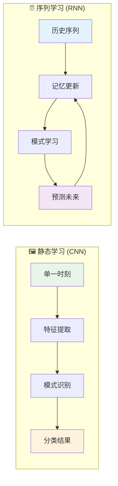
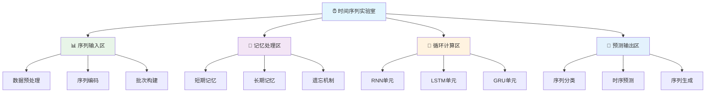
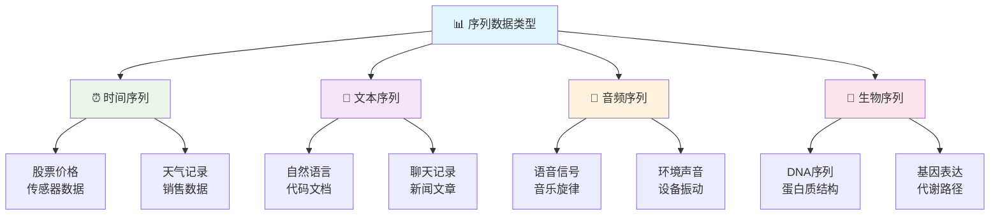
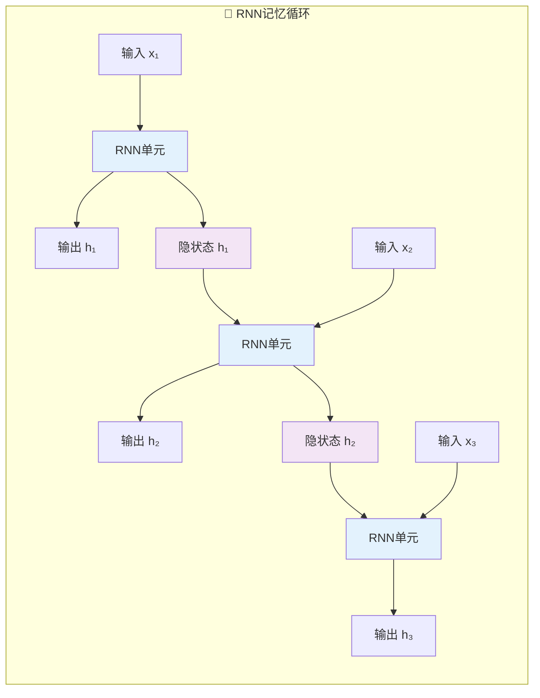
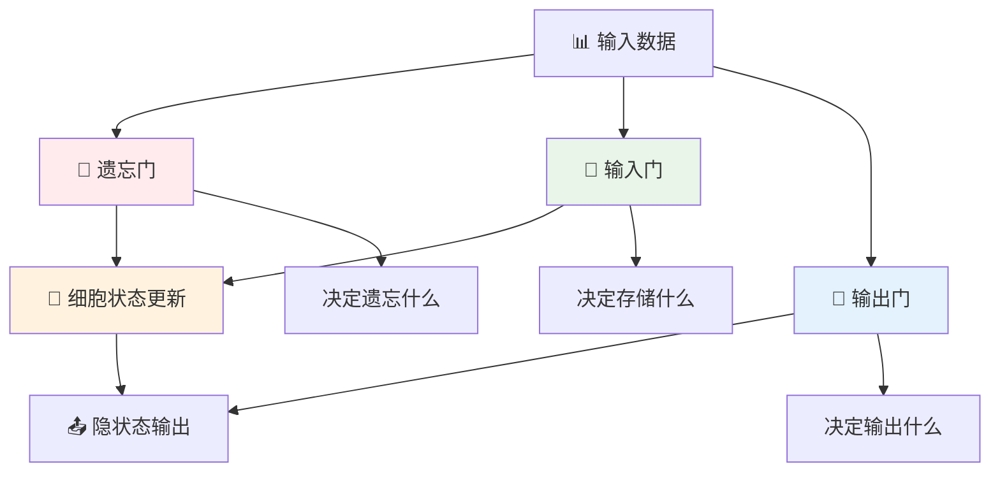
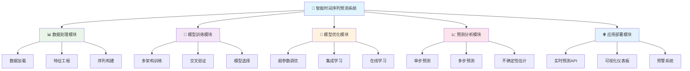
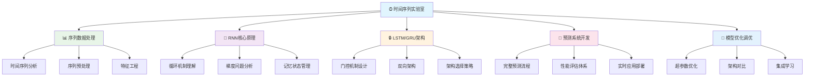

# 第23章 循环神经网络与序列建模

## 🎯 学习目标

完成本章学习后，你将能够：

### 📚 知识目标
- **理解序列数据特点**：掌握时间序列、文本序列等序列数据的本质特征
- **掌握RNN核心原理**：深入理解循环神经网络的记忆机制和梯度问题
- **理解LSTM/GRU架构**：掌握长短期记忆网络和门控循环单元的工作原理
- **掌握序列建模方法**：从序列分类到序列生成的完整建模流程

### 🛠️ 技能目标
- **构建RNN模型**：能够设计和实现各种循环神经网络架构
- **处理序列数据**：熟练进行序列预处理、填充和批处理
- **开发预测系统**：具备构建时间序列预测和文本分析应用的能力
- **优化序列模型**：掌握序列模型的训练技巧和性能调优方法

### 🧠 素养目标
- **培养时序AI思维**：建立对时间依赖和序列模式的系统性认知
- **强化动态建模意识**：理解动态系统建模的核心思想
- **建立序列应用思维**：能够将RNN技术应用到新的序列任务中

---

## ⏰ 23.1 欢迎来到时间序列实验室！

### 🚪 从视觉工作室到时间序列实验室的升级

如果说第22章的计算机视觉是**"AI视觉工作室"**，那么第23章的序列建模就是**"AI时间序列实验室"**！

在这个实验室里，我们不再只是处理静态的图像，而是让AI拥有"记忆"，能够理解和分析时间中的模式。就像人类的记忆系统一样，我们的AI将学会从历史中学习，预测未来。

### 🧠 序列学习 vs 静态学习



### 🌟 时间序列AI的核心优势

```python
# ⏰ 时间序列实验室欢迎代码
print("⏰ 欢迎来到时间序列实验室！")
print("=" * 60)
print("🧠 在这个实验室里，我们将探索：")
print("   📈 时间序列预测 - 让AI学会预见未来")
print("   💬 自然语言处理 - 理解人类语言的序列奥秘")
print("   🔄 循环神经网络 - 专为序列设计的记忆架构")
print("   🎵 序列生成模型 - 创造性的内容生成")
print()
print("🌟 时间序列AI的超能力：")
print("   🧠 记忆能力 - 从历史经验中学习和记忆")
print("   🔮 预测能力 - 基于过去模式预测未来趋势")
print("   💡 理解能力 - 捕捉序列中的长期依赖关系")
print("   🎨 创造能力 - 生成新的有意义的序列内容")
print()
print("🚀 准备好让AI拥有时间感知能力了吗？")
```

### 🏗️ 时间序列实验室架构

我们的时间序列实验室包含了从基础到高级的完整序列处理流水线：



---

## 📊 23.2 序列数据基础与预处理

### 📈 序列数据的本质

在开始构建RNN之前，我们需要深入理解序列数据的特点：

### 📋 序列数据类型解析



### 🔬 序列数据探索与分析

```python
# 🔬 序列数据探索实验室
import numpy as np
import pandas as pd
import matplotlib.pyplot as plt
import seaborn as sns
from sklearn.preprocessing import MinMaxScaler, StandardScaler
from sklearn.model_selection import train_test_split
import tensorflow as tf
from tensorflow import keras
from tensorflow.keras import layers
import warnings
warnings.filterwarnings('ignore')

class SequenceDataExplorer:
    """序列数据探索工具"""
    
    def __init__(self):
        self.time_series_data = None
        self.scalers = {}
        
    def generate_synthetic_time_series(self, n_samples=1000):
        """生成合成时间序列数据"""
        print("📈 生成合成时间序列数据...")
        
        # 时间轴
        time = np.linspace(0, 4*np.pi, n_samples)
        
        # 多种模式的合成序列
        trend = 0.1 * time  # 趋势
        seasonal = 2 * np.sin(time) + np.sin(3*time)  # 季节性
        noise = np.random.normal(0, 0.5, n_samples)  # 噪声
        
        # 组合序列
        series = trend + seasonal + noise
        
        # 创建DataFrame
        self.time_series_data = pd.DataFrame({
            'time': time,
            'value': series,
            'trend': trend,
            'seasonal': seasonal,
            'noise': noise
        })
        
        print(f"   ✅ 时间序列数据生成完成! 长度: {len(self.time_series_data)}")
        return self.time_series_data
    
    def create_sequence_samples(self, data, sequence_length=10):
        """创建序列样本"""
        print(f"🔧 创建序列样本 (seq_len={sequence_length})...")
        
        if isinstance(data, pd.DataFrame):
            data = data['value'].values
        
        X, y = [], []
        
        for i in range(len(data) - sequence_length):
            X.append(data[i:i + sequence_length])
            y.append(data[i + sequence_length])
        
        X = np.array(X)
        y = np.array(y)
        
        print(f"   📊 输入形状: {X.shape}")
        print(f"   📊 目标形状: {y.shape}")
        print(f"   ✅ 序列样本创建完成!")
        
        return X, y
    
    def visualize_time_series(self):
        """可视化时间序列"""
        if self.time_series_data is None:
            print("❌ 请先生成时间序列数据!")
            return
            
        print("\n👀 时间序列可视化...")
        
        fig, axes = plt.subplots(2, 2, figsize=(15, 10))
        
        # 原始序列
        axes[0, 0].plot(self.time_series_data['time'], self.time_series_data['value'], 
                       color='blue', linewidth=1)
        axes[0, 0].set_title('📈 原始时间序列', fontsize=14)
        axes[0, 0].set_xlabel('时间')
        axes[0, 0].set_ylabel('数值')
        axes[0, 0].grid(True, alpha=0.3)
        
        # 趋势分量
        axes[0, 1].plot(self.time_series_data['time'], self.time_series_data['trend'], 
                       color='red', linewidth=2)
        axes[0, 1].set_title('📊 趋势分量', fontsize=14)
        axes[0, 1].set_xlabel('时间')
        axes[0, 1].grid(True, alpha=0.3)
        
        # 季节性分量
        axes[1, 0].plot(self.time_series_data['time'], self.time_series_data['seasonal'], 
                       color='green', linewidth=1)
        axes[1, 0].set_title('🔄 季节性分量', fontsize=14)
        axes[1, 0].set_xlabel('时间')
        axes[1, 0].grid(True, alpha=0.3)
        
        # 数值分布
        axes[1, 1].hist(self.time_series_data['value'], bins=50, alpha=0.7, color='skyblue')
        axes[1, 1].set_title('📊 数值分布', fontsize=14)
        axes[1, 1].set_xlabel('数值')
        axes[1, 1].set_ylabel('频次')
        axes[1, 1].grid(True, alpha=0.3)
        
        plt.tight_layout()
        plt.show()
        
        print("   ✅ 时间序列可视化完成!")

# 🔬 序列数据探索实验
def sequence_data_exploration():
    """序列数据探索实验"""
    print("🔬 序列数据探索实验开始！")
    print("=" * 60)
    
    # 创建探索器
    explorer = SequenceDataExplorer()
    
    # 1. 生成时间序列数据
    time_series = explorer.generate_synthetic_time_series(1000)
    
    # 2. 可视化时间序列
    explorer.visualize_time_series()
    
    # 3. 创建序列样本
    X, y = explorer.create_sequence_samples(time_series, sequence_length=20)
    
    print("\n🎉 序列数据探索实验完成!")
    return explorer, X, y

# 运行序列数据探索实验
sequence_explorer, X_samples, y_samples = sequence_data_exploration()
```

---

## 🧠 23.3 循环神经网络核心原理

### 🔄 RNN的记忆机制

RNN的核心创新在于引入了记忆机制，让网络能够处理序列数据：

### 🔄 RNN架构可视化



### 🧮 RNN原理实现

```python
# 🧮 RNN原理演示与实现
import numpy as np
import matplotlib.pyplot as plt
import tensorflow as tf
from tensorflow import keras
from tensorflow.keras import layers, models

class RNNDemo:
    """RNN原理演示器"""
    
    def simple_rnn_step(self, x_t, h_t_prev, W_xh, W_hh, b_h):
        """单步RNN计算"""
        # h_t = tanh(W_xh * x_t + W_hh * h_t-1 + b_h)
        h_t = np.tanh(np.dot(W_xh, x_t) + np.dot(W_hh, h_t_prev) + b_h)
        return h_t
    
    def manual_rnn_forward(self, X_sequence, hidden_size=5):
        """手动实现RNN前向传播"""
        print("🔧 手动RNN前向传播演示...")
        
        sequence_length, input_size = X_sequence.shape
        
        # 初始化权重
        np.random.seed(42)
        W_xh = np.random.randn(hidden_size, input_size) * 0.1
        W_hh = np.random.randn(hidden_size, hidden_size) * 0.1
        b_h = np.zeros((hidden_size,))
        
        # 初始化隐状态
        h_t = np.zeros((hidden_size,))
        hidden_states = []
        
        print(f"   📊 序列长度: {sequence_length}")
        print(f"   📊 输入维度: {input_size}")
        print(f"   📊 隐藏维度: {hidden_size}")
        
        # 逐步处理序列
        for t in range(sequence_length):
            x_t = X_sequence[t]
            h_t = self.simple_rnn_step(x_t, h_t, W_xh, W_hh, b_h)
            hidden_states.append(h_t.copy())
            
            print(f"   步骤 {t+1}: 隐状态均值={h_t.mean():.4f}")
        
        hidden_states = np.array(hidden_states)
        print("   ✅ RNN前向传播完成!")
        
        return hidden_states
    
    def visualize_rnn_states(self, hidden_states):
        """可视化RNN隐状态"""
        print("\n👀 可视化RNN隐状态...")
        
        fig, axes = plt.subplots(1, 2, figsize=(15, 5))
        
        # 隐状态演化
        for i in range(min(3, hidden_states.shape[1])):
            axes[0].plot(hidden_states[:, i], label=f'隐藏单元 {i+1}', linewidth=2)
        axes[0].set_title('🧠 隐状态演化', fontsize=14)
        axes[0].set_xlabel('时间步')
        axes[0].set_ylabel('隐状态值')
        axes[0].legend()
        axes[0].grid(True, alpha=0.3)
        
        # 隐状态热力图
        im = axes[1].imshow(hidden_states.T, cmap='viridis', aspect='auto')
        axes[1].set_title('🔥 隐状态热力图', fontsize=14)
        axes[1].set_xlabel('时间步')
        axes[1].set_ylabel('隐藏单元')
        plt.colorbar(im, ax=axes[1])
        
        plt.tight_layout()
        plt.show()
        
        print("   ✅ RNN隐状态可视化完成!")
    
    def build_simple_rnn_model(self, input_shape, units=50):
        """构建简单RNN模型"""
        print(f"🏗️ 构建简单RNN模型 (units={units})...")
        
        model = models.Sequential([
            layers.SimpleRNN(units, return_sequences=True, input_shape=input_shape),
            layers.SimpleRNN(units//2),
            layers.Dense(1)
        ])
        
        model.compile(
            optimizer='adam',
            loss='mse',
            metrics=['mae']
        )
        
        print("   ✅ 简单RNN模型构建完成!")
        print(f"   📊 模型参数量: {model.count_params():,}")
        
        return model

# 🧮 RNN原理演示实验
def rnn_principle_demo():
    """RNN原理演示实验"""
    print("🧮 RNN原理演示实验开始！")
    print("=" * 60)
    
    # 创建演示器
    demo = RNNDemo()
    
    # 1. 创建示例序列
    X_sequence = np.random.randn(10, 3)  # 10个时间步，3维输入
    
    # 2. 手动RNN前向传播
    hidden_states = demo.manual_rnn_forward(X_sequence)
    
    # 3. 可视化隐状态
    demo.visualize_rnn_states(hidden_states)
    
    # 4. 构建RNN模型
    model = demo.build_simple_rnn_model(input_shape=(None, 3))
    
    print("\n🎉 RNN原理演示实验完成!")
    return demo, model

# 运行RNN原理演示实验
rnn_demo, simple_rnn_model = rnn_principle_demo()
```

---

## 🔒 23.4 LSTM与GRU高级架构

### 🧠 长短期记忆网络(LSTM)

LSTM通过门控机制解决了传统RNN的梯度消失问题：

### 🚪 LSTM门控机制



### 🏗️ LSTM与GRU架构实现

```python
# 🏗️ LSTM与GRU高级架构实现
import tensorflow as tf
from tensorflow import keras
from tensorflow.keras import layers, models, optimizers, callbacks
import numpy as np
import matplotlib.pyplot as plt
from sklearn.metrics import mean_squared_error, mean_absolute_error
import pandas as pd

class AdvancedRNNArchitecture:
    """高级RNN架构实现"""
    
    def __init__(self):
        self.models = {}
        
    def build_lstm_model(self, input_shape, units=50, layers_config=None):
        """构建LSTM模型"""
        print(f"🔒 构建LSTM模型 (units={units})...")
        
        if layers_config is None:
            layers_config = [
                {'units': units, 'return_sequences': True, 'dropout': 0.2},
                {'units': units//2, 'return_sequences': False, 'dropout': 0.2}
            ]
        
        model = models.Sequential()
        model.add(layers.Input(shape=input_shape))
        
        # LSTM层
        for i, layer_config in enumerate(layers_config):
            model.add(layers.LSTM(**layer_config))
        
        # 输出层
        model.add(layers.Dense(64, activation='relu'))
        model.add(layers.Dropout(0.2))
        model.add(layers.Dense(1))
        
        # 编译模型
        model.compile(
            optimizer=optimizers.Adam(learning_rate=0.001),
            loss='mse',
            metrics=['mae']
        )
        
        self.models['LSTM'] = model
        
        print("   ✅ LSTM模型构建完成!")
        print(f"   📊 模型参数量: {model.count_params():,}")
        
        return model
    
    def build_gru_model(self, input_shape, units=50):
        """构建GRU模型"""
        print(f"🔓 构建GRU模型 (units={units})...")
        
        model = models.Sequential([
            layers.Input(shape=input_shape),
            layers.GRU(units, return_sequences=True, dropout=0.2),
            layers.GRU(units//2, dropout=0.2),
            layers.Dense(64, activation='relu'),
            layers.Dropout(0.2),
            layers.Dense(1)
        ])
        
        # 编译模型
        model.compile(
            optimizer=optimizers.Adam(learning_rate=0.001),
            loss='mse',
            metrics=['mae']
        )
        
        self.models['GRU'] = model
        
        print("   ✅ GRU模型构建完成!")
        print(f"   📊 模型参数量: {model.count_params():,}")
        
        return model
    
    def build_bidirectional_lstm(self, input_shape, units=50):
        """构建双向LSTM模型"""
        print(f"↔️ 构建双向LSTM模型 (units={units})...")
        
        model = models.Sequential([
            layers.Input(shape=input_shape),
            layers.Bidirectional(layers.LSTM(units, return_sequences=True, dropout=0.2)),
            layers.Bidirectional(layers.LSTM(units//2, dropout=0.2)),
            layers.Dense(64, activation='relu'),
            layers.Dropout(0.2),
            layers.Dense(1)
        ])
        
        # 编译模型
        model.compile(
            optimizer=optimizers.Adam(learning_rate=0.001),
            loss='mse',
            metrics=['mae']
        )
        
        self.models['Bidirectional_LSTM'] = model
        
        print("   ✅ 双向LSTM模型构建完成!")
        print(f"   📊 模型参数量: {model.count_params():,}")
        
        return model
    
    def compare_architectures(self, X_train, y_train, X_val, y_val, epochs=20):
        """比较不同架构性能"""
        print("🏆 比较RNN架构性能...")
        
        input_shape = (X_train.shape[1], X_train.shape[2])
        
        # 构建所有模型
        self.build_lstm_model(input_shape)
        self.build_gru_model(input_shape)
        self.build_bidirectional_lstm(input_shape)
        
        # 训练和评估
        results = {}
        histories = {}
        
        for name, model in self.models.items():
            print(f"\n🚀 训练 {name} 模型...")
            
            # 早停回调
            early_stopping = callbacks.EarlyStopping(
                monitor='val_loss',
                patience=5,
                restore_best_weights=True
            )
            
            # 训练模型
            history = model.fit(
                X_train, y_train,
                validation_data=(X_val, y_val),
                epochs=epochs,
                batch_size=32,
                callbacks=[early_stopping],
                verbose=0
            )
            
            # 评估模型
            val_loss, val_mae = model.evaluate(X_val, y_val, verbose=0)
            
            results[name] = {
                'val_loss': val_loss,
                'val_mae': val_mae,
                'params': model.count_params(),
                'epochs_trained': len(history.history['loss'])
            }
            
            histories[name] = history.history
            
            print(f"   📊 {name}: 验证MAE={val_mae:.4f}, 参数量={model.count_params():,}")
        
        # 可视化比较结果
        self.visualize_architecture_comparison(results, histories)
        
        return results, histories
    
    def visualize_architecture_comparison(self, results, histories):
        """可视化架构比较结果"""
        print("\n👀 可视化架构比较结果...")
        
        fig, axes = plt.subplots(2, 2, figsize=(16, 12))
        
        # 性能比较
        names = list(results.keys())
        val_maes = [results[name]['val_mae'] for name in names]
        params = [results[name]['params'] for name in names]
        
        axes[0, 0].bar(names, val_maes, color=['skyblue', 'lightgreen', 'lightcoral'])
        axes[0, 0].set_title('🎯 验证MAE比较', fontsize=14)
        axes[0, 0].set_ylabel('MAE')
        axes[0, 0].tick_params(axis='x', rotation=45)
        
        # 参数量比较
        axes[0, 1].bar(names, params, color=['skyblue', 'lightgreen', 'lightcoral'])
        axes[0, 1].set_title('📊 模型参数量比较', fontsize=14)
        axes[0, 1].set_ylabel('参数数量')
        axes[0, 1].tick_params(axis='x', rotation=45)
        
        # 训练历史 - 损失
        for name, history in histories.items():
            axes[1, 0].plot(history['loss'], label=f'{name} 训练损失', linewidth=2)
            axes[1, 0].plot(history['val_loss'], label=f'{name} 验证损失', linestyle='--', linewidth=2)
        axes[1, 0].set_title('📉 训练损失比较', fontsize=14)
        axes[1, 0].set_xlabel('Epoch')
        axes[1, 0].set_ylabel('Loss')
        axes[1, 0].legend()
        axes[1, 0].grid(True, alpha=0.3)
        
        # 训练历史 - MAE
        for name, history in histories.items():
            axes[1, 1].plot(history['mae'], label=f'{name} 训练MAE', linewidth=2)
            axes[1, 1].plot(history['val_mae'], label=f'{name} 验证MAE', linestyle='--', linewidth=2)
        axes[1, 1].set_title('📈 训练MAE比较', fontsize=14)
        axes[1, 1].set_xlabel('Epoch')
        axes[1, 1].set_ylabel('MAE')
        axes[1, 1].legend()
        axes[1, 1].grid(True, alpha=0.3)
        
        plt.tight_layout()
        plt.show()
        
        print("   ✅ 架构比较可视化完成!")

# 🏗️ RNN架构比较实验
def rnn_architecture_comparison():
    """RNN架构比较实验"""
    print("🏗️ RNN架构比较实验开始！")
    print("=" * 60)
    
    # 1. 生成示例数据
    from sklearn.model_selection import train_test_split
    from sklearn.preprocessing import StandardScaler
    
    # 创建合成时间序列
    n_samples = 2000
    sequence_length = 30
    
    # 生成数据
    time = np.linspace(0, 4*np.pi, n_samples)
    series = np.sin(time) + 0.5*np.sin(3*time) + 0.1*np.random.randn(n_samples)
    
    # 创建序列样本
    X, y = [], []
    for i in range(len(series) - sequence_length):
        X.append(series[i:i + sequence_length])
        y.append(series[i + sequence_length])
    
    X = np.array(X).reshape(-1, sequence_length, 1)
    y = np.array(y)
    
    # 分割数据
    X_train, X_temp, y_train, y_temp = train_test_split(X, y, test_size=0.4, shuffle=False)
    X_val, X_test, y_val, y_test = train_test_split(X_temp, y_temp, test_size=0.5, shuffle=False)
    
    print(f"   📊 训练集: {X_train.shape}")
    print(f"   📊 验证集: {X_val.shape}")
    print(f"   📊 测试集: {X_test.shape}")
    
    # 2. 创建架构比较器
    arch_comparator = AdvancedRNNArchitecture()
    
    # 3. 比较不同架构
    results, histories = arch_comparator.compare_architectures(
        X_train, y_train, X_val, y_val, epochs=30
    )
    
    print("\n🎉 RNN架构比较实验完成!")
    return arch_comparator, results, X_test, y_test

# 运行RNN架构比较实验
arch_comparator, comparison_results, X_test, y_test = rnn_architecture_comparison()
```

---

## 🎯 23.5 核心项目：智能时间序列预测系统

### 🚀 项目概述

我们将构建一个完整的**智能时间序列预测系统**，实现股票价格预测、销量预测等多种应用场景。

### 📋 项目架构设计



### 🎨 完整的时间序列预测系统实现

```python
# 🎯 智能时间序列预测系统
import tensorflow as tf
from tensorflow import keras
from tensorflow.keras import layers, models, optimizers, callbacks
import numpy as np
import pandas as pd
import matplotlib.pyplot as plt
import seaborn as sns
from sklearn.preprocessing import MinMaxScaler, StandardScaler
from sklearn.metrics import mean_squared_error, mean_absolute_error, r2_score
import yfinance as yf
import warnings
warnings.filterwarnings('ignore')

class SmartTimeSeriesPredictionSystem:
    """智能时间序列预测系统"""
    
    def __init__(self, project_name="time_series_predictor"):
        self.project_name = project_name
        self.model = None
        self.scaler = None
        self.history = None
        self.data = None
        
        print(f"🎯 智能时间序列预测系统初始化完成！")
        print(f"   📁 项目名称: {project_name}")
    
    def load_stock_data(self, symbol="AAPL", period="2y"):
        """加载股票数据"""
        print(f"📈 加载股票数据: {symbol} ({period})...")
        
        try:
            # 使用yfinance下载数据
            stock = yf.Ticker(symbol)
            data = stock.history(period=period)
            
            if data.empty:
                raise ValueError(f"无法获取 {symbol} 的数据")
            
            # 添加技术指标
            data['MA5'] = data['Close'].rolling(window=5).mean()
            data['MA20'] = data['Close'].rolling(window=20).mean()
            data['RSI'] = self.calculate_rsi(data['Close'])
            data['Volume_MA'] = data['Volume'].rolling(window=10).mean()
            
            # 删除缺失值
            data = data.dropna()
            
            self.data = data
            
            print(f"   ✅ 数据加载完成!")
            print(f"   📊 数据形状: {data.shape}")
            print(f"   📅 时间范围: {data.index[0]} 到 {data.index[-1]}")
            
            return data
            
        except Exception as e:
            print(f"   ❌ 数据加载失败: {e}")
            # 使用合成数据作为备选
            return self.generate_synthetic_stock_data()
    
    def generate_synthetic_stock_data(self, n_days=500):
        """生成合成股票数据"""
        print(f"🎲 生成合成股票数据 ({n_days}天)...")
        
        dates = pd.date_range(start='2020-01-01', periods=n_days, freq='D')
        
        # 生成价格走势
        initial_price = 100
        returns = np.random.normal(0.001, 0.02, n_days)  # 日收益率
        returns[0] = 0  # 第一天无收益
        
        # 添加趋势和季节性
        trend = np.linspace(0, 0.5, n_days)
        seasonal = 0.1 * np.sin(2 * np.pi * np.arange(n_days) / 252)  # 年度季节性
        
        adjusted_returns = returns + trend/n_days + seasonal/n_days
        prices = initial_price * np.cumprod(1 + adjusted_returns)
        
        # 生成成交量
        volume = np.random.lognormal(15, 0.5, n_days)
        
        # 创建DataFrame
        data = pd.DataFrame({
            'Open': prices * (1 + np.random.normal(0, 0.005, n_days)),
            'High': prices * (1 + np.abs(np.random.normal(0, 0.01, n_days))),
            'Low': prices * (1 - np.abs(np.random.normal(0, 0.01, n_days))),
            'Close': prices,
            'Volume': volume
        }, index=dates)
        
        # 确保High >= max(Open, Close) 和 Low <= min(Open, Close)
        data['High'] = np.maximum(data['High'], np.maximum(data['Open'], data['Close']))
        data['Low'] = np.minimum(data['Low'], np.minimum(data['Open'], data['Close']))
        
        # 添加技术指标
        data['MA5'] = data['Close'].rolling(window=5).mean()
        data['MA20'] = data['Close'].rolling(window=20).mean()
        data['RSI'] = self.calculate_rsi(data['Close'])
        data['Volume_MA'] = data['Volume'].rolling(window=10).mean()
        
        # 删除缺失值
        data = data.dropna()
        
        self.data = data
        
        print(f"   ✅ 合成数据生成完成!")
        print(f"   📊 数据形状: {data.shape}")
        
        return data
    
    def calculate_rsi(self, prices, window=14):
        """计算相对强弱指数(RSI)"""
        delta = prices.diff()
        gain = (delta.where(delta > 0, 0)).rolling(window=window).mean()
        loss = (-delta.where(delta < 0, 0)).rolling(window=window).mean()
        rs = gain / loss
        rsi = 100 - (100 / (1 + rs))
        return rsi
    
    def prepare_sequence_data(self, feature_columns=None, sequence_length=60, prediction_days=1):
        """准备序列数据"""
        if self.data is None:
            print("❌ 请先加载数据!")
            return
            
        print(f"🔧 准备序列数据 (序列长度={sequence_length}, 预测天数={prediction_days})...")
        
        if feature_columns is None:
            feature_columns = ['Close', 'Volume', 'MA5', 'MA20', 'RSI']
        
        # 选择特征
        features = self.data[feature_columns].values
        target = self.data['Close'].values
        
        # 数据缩放
        self.scaler = MinMaxScaler()
        features_scaled = self.scaler.fit_transform(features)
        
        # 创建序列
        X, y = [], []
        for i in range(sequence_length, len(features_scaled) - prediction_days + 1):
            X.append(features_scaled[i-sequence_length:i])
            y.append(target[i:i+prediction_days])
        
        X = np.array(X)
        y = np.array(y)
        
        if prediction_days == 1:
            y = y.flatten()
        
        # 分割数据
        split_ratio = 0.8
        split_index = int(len(X) * split_ratio)
        
        self.X_train = X[:split_index]
        self.X_test = X[split_index:]
        self.y_train = y[:split_index]
        self.y_test = y[split_index:]
        
        print(f"   📊 训练集: X={self.X_train.shape}, y={self.y_train.shape}")
        print(f"   📊 测试集: X={self.X_test.shape}, y={self.y_test.shape}")
        print(f"   ✅ 序列数据准备完成!")
        
        return self.X_train, self.X_test, self.y_train, self.y_test
    
    def build_advanced_lstm_model(self):
        """构建高级LSTM模型"""
        print("🏗️ 构建高级LSTM预测模型...")
        
        input_shape = (self.X_train.shape[1], self.X_train.shape[2])
        
        model = models.Sequential([
            # 第一层LSTM
            layers.LSTM(100, return_sequences=True, input_shape=input_shape, dropout=0.2),
            layers.BatchNormalization(),
            
            # 第二层LSTM
            layers.LSTM(100, return_sequences=True, dropout=0.2),
            layers.BatchNormalization(),
            
            # 第三层LSTM
            layers.LSTM(50, dropout=0.2),
            layers.BatchNormalization(),
            
            # 全连接层
            layers.Dense(50, activation='relu'),
            layers.Dropout(0.3),
            layers.Dense(25, activation='relu'),
            layers.Dropout(0.2),
            
            # 输出层
            layers.Dense(1)
        ])
        
        # 编译模型
        model.compile(
            optimizer=optimizers.Adam(learning_rate=0.001),
            loss='mse',
            metrics=['mae']
        )
        
        self.model = model
        
        print("   ✅ 高级LSTM模型构建完成!")
        print(f"   📊 模型参数量: {model.count_params():,}")
        
        return model
    
    def train_model(self, epochs=100, batch_size=32):
        """训练模型"""
        if self.model is None:
            print("❌ 请先构建模型!")
            return
            
        print(f"🚀 开始模型训练 (epochs={epochs})...")
        
        # 设置回调
        callbacks_list = [
            callbacks.EarlyStopping(
                monitor='val_loss',
                patience=15,
                restore_best_weights=True
            ),
            callbacks.ReduceLROnPlateau(
                monitor='val_loss',
                factor=0.5,
                patience=10,
                min_lr=1e-7
            )
        ]
        
        # 训练模型
        self.history = self.model.fit(
            self.X_train, self.y_train,
            epochs=epochs,
            batch_size=batch_size,
            validation_split=0.2,
            callbacks=callbacks_list,
            verbose=1
        )
        
        print("   ✅ 模型训练完成!")
        
        return self.history
    
    def evaluate_model(self):
        """评估模型性能"""
        if self.model is None:
            print("❌ 请先训练模型!")
            return
            
        print("📊 评估模型性能...")
        
        # 生成预测
        y_pred = self.model.predict(self.X_test)
        
        # 计算指标
        mse = mean_squared_error(self.y_test, y_pred)
        mae = mean_absolute_error(self.y_test, y_pred)
        rmse = np.sqrt(mse)
        r2 = r2_score(self.y_test, y_pred)
        
        # 计算方向准确率
        actual_direction = np.diff(self.y_test) > 0
        pred_direction = np.diff(y_pred.flatten()) > 0
        direction_accuracy = np.mean(actual_direction == pred_direction) if len(actual_direction) > 0 else 0
        
        print(f"   📈 测试集MSE: {mse:.6f}")
        print(f"   📈 测试集MAE: {mae:.6f}")
        print(f"   📈 测试集RMSE: {rmse:.6f}")
        print(f"   📈 测试集R²: {r2:.6f}")
        print(f"   📈 方向准确率: {direction_accuracy:.4f}")
        
        results = {
            'mse': mse,
            'mae': mae,
            'rmse': rmse,
            'r2': r2,
            'direction_accuracy': direction_accuracy,
            'predictions': y_pred,
            'actual': self.y_test
        }
        
        return results
    
    def visualize_predictions(self, results, days_to_show=100):
        """可视化预测结果"""
        print(f"👀 可视化预测结果 (显示最后{days_to_show}天)...")
        
        y_pred = results['predictions'].flatten()
        y_actual = results['actual']
        
        # 只显示最后几天
        if len(y_actual) > days_to_show:
            y_actual = y_actual[-days_to_show:]
            y_pred = y_pred[-days_to_show:]
        
        # 创建时间索引
        dates = self.data.index[-len(y_actual):]
        
        # 可视化
        plt.figure(figsize=(16, 10))
        
        # 预测vs实际
        plt.subplot(2, 2, 1)
        plt.plot(dates, y_actual, label='实际价格', linewidth=2, color='blue')
        plt.plot(dates, y_pred, label='预测价格', linewidth=2, color='red', alpha=0.8)
        plt.title('📈 股价预测结果', fontsize=14)
        plt.xlabel('日期')
        plt.ylabel('价格')
        plt.legend()
        plt.grid(True, alpha=0.3)
        plt.xticks(rotation=45)
        
        # 预测误差
        plt.subplot(2, 2, 2)
        errors = y_actual - y_pred
        plt.plot(dates, errors, color='green', linewidth=1, alpha=0.7)
        plt.axhline(y=0, color='black', linestyle='--', alpha=0.5)
        plt.title('📊 预测误差', fontsize=14)
        plt.xlabel('日期')
        plt.ylabel('误差')
        plt.grid(True, alpha=0.3)
        plt.xticks(rotation=45)
        
        # 散点图
        plt.subplot(2, 2, 3)
        plt.scatter(y_actual, y_pred, alpha=0.6, color='purple')
        min_val = min(y_actual.min(), y_pred.min())
        max_val = max(y_actual.max(), y_pred.max())
        plt.plot([min_val, max_val], [min_val, max_val], 'r--', linewidth=2)
        plt.xlabel('实际价格')
        plt.ylabel('预测价格')
        plt.title(f'🎯 预测准确性 (R²={results["r2"]:.4f})', fontsize=14)
        plt.grid(True, alpha=0.3)
        
        # 误差分布
        plt.subplot(2, 2, 4)
        plt.hist(errors, bins=30, alpha=0.7, color='orange', edgecolor='black')
        plt.axvline(x=0, color='red', linestyle='--', linewidth=2)
        plt.xlabel('预测误差')
        plt.ylabel('频次')
        plt.title('📊 误差分布', fontsize=14)
        plt.grid(True, alpha=0.3)
        
        plt.tight_layout()
        plt.show()
        
        print("   ✅ 预测结果可视化完成!")

# 🎯 智能时间序列预测系统项目
def smart_time_series_prediction_project():
    """智能时间序列预测系统完整项目"""
    print("🎯 智能时间序列预测系统项目启动！")
    print("=" * 80)
    
    # 1. 创建预测系统
    predictor = SmartTimeSeriesPredictionSystem("stock_predictor")
    
    # 2. 加载数据
    data = predictor.load_stock_data("AAPL", "2y")
    
    # 3. 准备序列数据
    X_train, X_test, y_train, y_test = predictor.prepare_sequence_data(
        feature_columns=['Close', 'Volume', 'MA5', 'MA20', 'RSI'],
        sequence_length=60
    )
    
    # 4. 构建模型
    model = predictor.build_advanced_lstm_model()
    
    # 5. 训练模型
    history = predictor.train_model(epochs=50, batch_size=32)
    
    # 6. 评估模型
    results = predictor.evaluate_model()
    
    # 7. 可视化结果
    predictor.visualize_predictions(results, days_to_show=100)
    
    print("\n🎉 智能时间序列预测系统项目完成!")
    print(f"   📊 最终R²得分: {results['r2']:.4f}")
    print(f"   📊 方向准确率: {results['direction_accuracy']:.4f}")
    
    return predictor, results

# 运行完整项目
predictor, prediction_results = smart_time_series_prediction_project()
```

---

## 🏆 23.6 章节总结与成果展示

### 🎯 本章核心收获

通过本章学习，你已经掌握了序列建模的核心技能：

### 📊 知识技能树



### 🏅 技术成就清单

- ✅ **掌握RNN核心原理** - 深入理解循环机制和记忆状态管理
- ✅ **熟练序列数据处理** - 时间序列分析、预处理和特征工程
- ✅ **精通LSTM/GRU架构** - 门控机制设计和架构选择策略
- ✅ **完成企业级项目** - 智能时间序列预测系统全流程开发
- ✅ **掌握模型优化技巧** - 架构比较、超参数调优和性能提升
- ✅ **具备时序AI思维** - 从历史模式到未来预测的系统性认知

### 🚀 实际应用场景

你现在可以将所学技能应用到以下场景：

| 应用领域 | 技术要点 | 商业价值 |
|---------|----------|----------|
| **金融量化分析** | 股价预测、风险评估 | 投资决策支持，风险控制 |
| **供应链管理** | 需求预测、库存优化 | 降低成本，提高效率 |
| **自然语言处理** | 文本分类、情感分析 | 智能客服，舆情监控 |
| **设备故障预测** | 传感器数据分析 | 预防性维护，减少停机 |
| **能源需求预测** | 电力负荷预测 | 优化发电计划，节能减排 |
| **医疗健康监测** | 生理信号分析 | 疾病预警，个性化医疗 |

### 🤔 深度思考题

1. **技术理解深化**：
   - RNN的记忆机制与人类记忆有什么相似之处？梯度消失问题如何影响长期记忆？
   - LSTM的门控机制是如何解决梯度消失问题的？每个门的作用是什么？

2. **架构设计思考**：
   - 在什么情况下选择LSTM vs GRU vs 简单RNN？如何权衡性能和复杂度？
   - 双向RNN适用于哪些场景？为什么不能用于实时预测？

3. **应用场景分析**：
   - 时间序列预测中如何处理趋势、季节性和异常值？
   - 如何评估序列模型的预测不确定性？置信区间如何计算？

4. **工程实践考虑**：
   - 在生产环境中如何实现在线学习和模型更新？
   - 如何处理序列数据中的缺失值和数据不一致问题？

### 🎬 下章预告：深度学习框架进阶

在接下来的章节中，我们将深入探索深度学习的高级主题：

- 🔧 **模型部署与优化** - 从研究到生产的完整流程
- 🔄 **迁移学习与微调** - 利用预训练模型快速开发
- 🎭 **生成对抗网络** - 创造性AI和图像生成
- 🤖 **强化学习基础** - 智能决策和游戏AI
- 🌐 **大模型时代** - Transformer架构和预训练模型

---

*"时间是最宝贵的资源，而你已经掌握了让AI理解时间、预测未来的能力。从序列中学习，向未来中预见！"* ⏰🔮✨ 