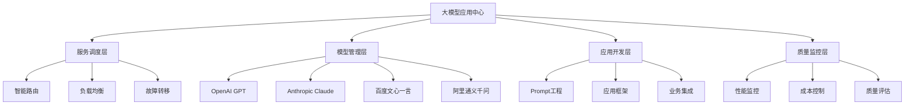
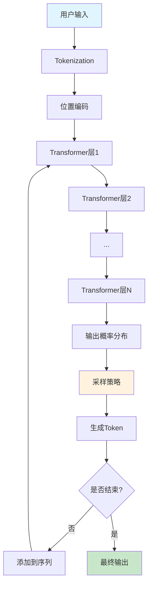
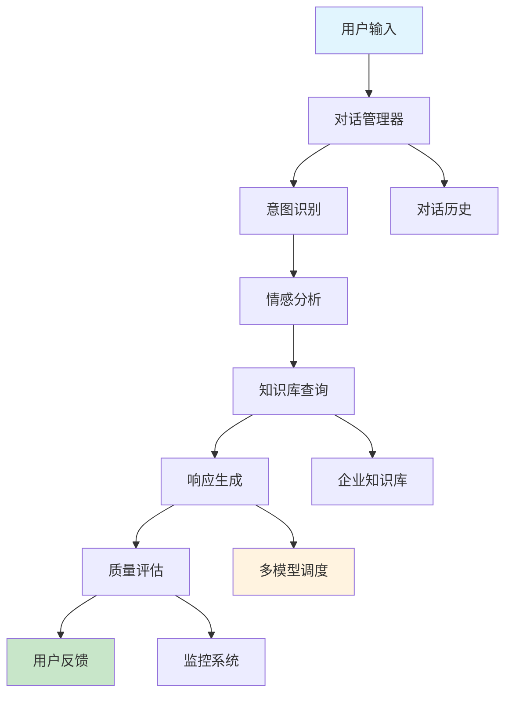

# 第25章：大语言模型应用开发

## 🎯 学习目标

### 📚 知识目标
- 深入理解大语言模型(LLM)的工作原理和应用场景
- 掌握主流LLM服务(GPT、Claude、文心一言等)的API使用
- 学习Prompt工程的核心技术和最佳实践
- 理解LLM应用开发的架构设计和性能优化

### 🛠️ 技能目标  
- 能够熟练使用各种LLM API开发实际应用
- 掌握LangChain等主流LLM应用开发框架
- 具备设计和优化Prompt的专业能力
- 学会构建企业级LLM应用的完整解决方案

### 💡 素养目标
- 建立大模型时代的AI应用开发思维
- 培养对LLM能力边界和局限性的准确认知
- 形成负责任的AI应用开发理念
- 提升对前沿AI技术的敏感度和应用能力

## 🏢 大模型应用中心欢迎辞

欢迎来到大模型应用中心！从注意力机制研究院的理论探索，我们现在进入了一个更加实用的领域——大语言模型的实际应用开发。

### 🌟 应用中心的使命
在这个应用中心里，我们专注于将强大的大语言模型转化为实际的商业价值。这里就像一个智能服务调度平台，能够根据不同的业务需求，调用最合适的AI模型来提供服务。

### 🚀 大模型时代的到来
2022年ChatGPT的发布标志着大模型时代的正式到来。这些模型不仅能够理解和生成人类语言，还展现出了令人惊叹的推理、创作和问题解决能力。

想象一下，传统的软件开发就像搭建积木，而大模型应用开发就像指挥一个超级智能的助手。你只需要用自然语言描述需求，AI就能帮你完成复杂的任务。这就是大模型应用的魔力！

### 🏗️ 应用中心的架构设计



## 🧠 大语言模型基础原理

### 💡 什么是大语言模型？

大语言模型(Large Language Model, LLM)是基于Transformer架构，在海量文本数据上预训练的深度学习模型。这些模型通过学习人类语言的统计规律，获得了强大的语言理解和生成能力。

#### 🔍 LLM的核心特征
1. **规模庞大**: 参数量从数十亿到数千亿不等
2. **通用能力**: 能够处理多种语言任务
3. **涌现能力**: 在达到一定规模后展现出意想不到的能力
4. **上下文学习**: 能够从少量示例中学习新任务

### 📐 从Transformer到LLM的演进

基于第24章学习的Transformer架构，让我们看看LLM是如何发展的：

```python
# LLM演进时间线
llm_evolution = {
    "2017年": {
        "模型": "Transformer",
        "参数": "65M",
        "突破": "注意力机制革命"
    },
    "2018年": {
        "模型": "GPT-1",
        "参数": "117M", 
        "突破": "无监督预训练"
    },
    "2019年": {
        "模型": "GPT-2",
        "参数": "1.5B",
        "突破": "生成能力显著提升"
    },
    "2020年": {
        "模型": "GPT-3",
        "参数": "175B",
        "突破": "涌现能力出现"
    },
    "2022年": {
        "模型": "ChatGPT",
        "参数": "175B+",
        "突破": "对话能力革命"
    },
    "2023年": {
        "模型": "GPT-4",
        "参数": "1.7T+(估计)",
        "突破": "多模态能力"
    }
}

def show_llm_evolution():
    """展示LLM演进历程"""
    for year, info in llm_evolution.items():
        print(f"{year}: {info['模型']} ({info['参数']}) - {info['突破']}")

show_llm_evolution()
```

### 🎯 LLM的工作原理



## 🔧 主流LLM服务详解

### 🤖 OpenAI GPT系列

OpenAI的GPT系列是目前最知名的大语言模型，让我们学习如何使用它们：

```python
import openai
import os
from typing import List, Dict
import json

class OpenAIService:
    """OpenAI GPT服务封装"""
    
    def __init__(self, api_key: str = None):
        """
        初始化OpenAI服务
        
        Args:
            api_key: OpenAI API密钥
        """
        self.api_key = api_key or os.getenv('OPENAI_API_KEY')
        openai.api_key = self.api_key
        
        # 模型配置
        self.models = {
            "gpt-4": {
                "max_tokens": 8192,
                "cost_per_1k": {"input": 0.03, "output": 0.06},
                "best_for": ["复杂推理", "代码生成", "创意写作"]
            },
            "gpt-3.5-turbo": {
                "max_tokens": 4096,
                "cost_per_1k": {"input": 0.001, "output": 0.002},
                "best_for": ["对话", "文本处理", "快速响应"]
            }
        }
    
    def chat_completion(self, messages: List[Dict], 
                       model: str = "gpt-3.5-turbo",
                       temperature: float = 0.7,
                       max_tokens: int = 1000) -> Dict:
        """
        聊天补全API调用
        
        Args:
            messages: 对话消息列表
            model: 使用的模型
            temperature: 随机性控制(0-1)
            max_tokens: 最大生成长度
            
        Returns:
            API响应结果
        """
        try:
            response = openai.ChatCompletion.create(
                model=model,
                messages=messages,
                temperature=temperature,
                max_tokens=max_tokens,
                stream=False
            )
            
            return {
                "success": True,
                "content": response.choices[0].message.content,
                "usage": response.usage,
                "model": response.model
            }
            
        except Exception as e:
            return {
                "success": False,
                "error": str(e)
            }

# 使用示例
def demo_openai_service():
    """OpenAI服务演示"""
    # 初始化服务
    service = OpenAIService()
    
    # 构建对话消息
    messages = [
        {"role": "system", "content": "你是一个专业的Python编程助手。"},
        {"role": "user", "content": "请解释什么是装饰器，并给出一个实用的例子。"}
    ]
    
    # 普通调用
    result = service.chat_completion(messages)
    if result["success"]:
        print("AI回复:", result["content"])
        print("Token使用:", result["usage"])

# 运行演示
if __name__ == "__main__":
    demo_openai_service()
```

## 🎨 Prompt工程核心技术

### 💡 什么是Prompt工程？

Prompt工程是设计和优化输入提示的艺术与科学，它决定了LLM输出的质量和准确性。一个好的Prompt就像一个精确的指令，能够引导AI产生期望的结果。

### 🔧 Prompt设计的基本原则

```python
class PromptEngineer:
    """Prompt工程师工具类"""
    
    def __init__(self):
        """初始化Prompt工程工具"""
        self.principles = {
            "clarity": "清晰明确的指令",
            "context": "充分的上下文信息", 
            "examples": "恰当的示例引导",
            "constraints": "必要的约束条件",
            "format": "期望的输出格式"
        }
    
    def create_basic_prompt(self, task: str, context: str = "", 
                           examples: List[str] = None,
                           constraints: List[str] = None,
                           output_format: str = "") -> str:
        """
        创建基础Prompt
        
        Args:
            task: 任务描述
            context: 上下文信息
            examples: 示例列表
            constraints: 约束条件
            output_format: 输出格式
            
        Returns:
            完整的Prompt
        """
        prompt_parts = []
        
        # 任务描述
        prompt_parts.append(f"任务: {task}")
        
        # 上下文信息
        if context:
            prompt_parts.append(f"\n背景: {context}")
        
        # 约束条件
        if constraints:
            prompt_parts.append("\n要求:")
            for constraint in constraints:
                prompt_parts.append(f"- {constraint}")
        
        # 示例
        if examples:
            prompt_parts.append("\n示例:")
            for i, example in enumerate(examples, 1):
                prompt_parts.append(f"{i}. {example}")
        
        # 输出格式
        if output_format:
            prompt_parts.append(f"\n输出格式: {output_format}")
        
        return "".join(prompt_parts)
    
    def few_shot_prompt(self, task: str, examples: List[Dict]) -> str:
        """
        创建Few-shot Prompt
        
        Args:
            task: 任务描述
            examples: 输入输出示例对
            
        Returns:
            Few-shot Prompt
        """
        prompt = f"任务: {task}\n\n"
        
        # 添加示例
        for i, example in enumerate(examples, 1):
            prompt += f"示例 {i}:\n"
            prompt += f"输入: {example['input']}\n"
            prompt += f"输出: {example['output']}\n\n"
        
        prompt += "现在请处理以下输入:\n输入: "
        
        return prompt

# Prompt工程实战演示
def demo_prompt_engineering():
    """Prompt工程演示"""
    engineer = PromptEngineer()
    
    # 基础Prompt示例
    basic_prompt = engineer.create_basic_prompt(
        task="分析一段文本的情感倾向",
        context="这是一个情感分析任务，需要判断文本是正面、负面还是中性",
        constraints=["只返回情感标签", "给出置信度", "解释判断理由"],
        output_format="JSON格式：{\"sentiment\": \"正面/负面/中性\", \"confidence\": 0.95, \"reason\": \"判断理由\"}"
    )
    print("=== 基础Prompt ===")
    print(basic_prompt)

# 运行演示
demo_prompt_engineering()
```
        try:
            response = openai.ChatCompletion.create(
                model=model,
                messages=messages,
                temperature=temperature,
                max_tokens=max_tokens,
                stream=False
            )
            
            return {
                "success": True,
                "content": response.choices[0].message.content,
                "usage": response.usage,
                "model": response.model
            }
            
        except Exception as e:
            return {
                "success": False,
                "error": str(e)
            }
    
    def stream_completion(self, messages: List[Dict],
                         model: str = "gpt-3.5-turbo"):
        """
        流式响应生成
        
        Args:
            messages: 对话消息列表
            model: 使用的模型
            
        Yields:
            流式响应内容
        """
        try:
            response = openai.ChatCompletion.create(
                model=model,
                messages=messages,
                stream=True
            )
            
            for chunk in response:
                if chunk.choices[0].delta.get("content"):
                    yield chunk.choices[0].delta.content
                    
        except Exception as e:
            yield f"Error: {str(e)}"

# 使用示例
def demo_openai_service():
    """OpenAI服务演示"""
    # 初始化服务
    service = OpenAIService()
    
    # 构建对话消息
    messages = [
        {"role": "system", "content": "你是一个专业的Python编程助手。"},
        {"role": "user", "content": "请解释什么是装饰器，并给出一个实用的例子。"}
    ]
    
    # 普通调用
    result = service.chat_completion(messages)
    if result["success"]:
        print("AI回复:", result["content"])
        print("Token使用:", result["usage"])
    
    # 流式调用演示
    print("\n流式响应:")
    for chunk in service.stream_completion(messages):
        print(chunk, end="", flush=True)

# 运行演示
if __name__ == "__main__":
    demo_openai_service()
```

### 🎭 Anthropic Claude

Claude是Anthropic开发的AI助手，以安全性和有用性著称：

```python
import anthropic
from typing import List, Dict

class ClaudeService:
    """Anthropic Claude服务封装"""
    
    def __init__(self, api_key: str = None):
        """
        初始化Claude服务
        
        Args:
            api_key: Anthropic API密钥
        """
        self.api_key = api_key or os.getenv('ANTHROPIC_API_KEY')
        self.client = anthropic.Anthropic(api_key=self.api_key)
        
        # 模型配置
        self.models = {
            "claude-3-opus": {
                "max_tokens": 200000,
                "best_for": ["复杂分析", "创意写作", "代码审查"]
            },
            "claude-3-sonnet": {
                "max_tokens": 200000,
                "best_for": ["平衡性能", "日常对话", "文档处理"]
            },
            "claude-3-haiku": {
                "max_tokens": 200000,
                "best_for": ["快速响应", "简单任务", "成本控制"]
            }
        }
    
    def create_message(self, content: str,
                      system_prompt: str = None,
                      model: str = "claude-3-sonnet-20240229",
                      max_tokens: int = 1000) -> Dict:
        """
        创建消息
        
        Args:
            content: 用户输入内容
            system_prompt: 系统提示
            model: 使用的模型
            max_tokens: 最大生成长度
            
        Returns:
            API响应结果
        """
        try:
            message = self.client.messages.create(
                model=model,
                max_tokens=max_tokens,
                system=system_prompt,
                messages=[
                    {"role": "user", "content": content}
                ]
            )
            
            return {
                "success": True,
                "content": message.content[0].text,
                "usage": message.usage,
                "model": message.model
            }
            
        except Exception as e:
            return {
                "success": False,
                "error": str(e)
            }
    
    def analyze_text(self, text: str, analysis_type: str = "sentiment") -> Dict:
        """
        文本分析功能
        
        Args:
            text: 待分析文本
            analysis_type: 分析类型
            
        Returns:
            分析结果
        """
        analysis_prompts = {
            "sentiment": "请分析以下文本的情感倾向，给出正面、负面或中性的判断，并解释原因：",
            "summary": "请为以下文本生成简洁的摘要：",
            "keywords": "请提取以下文本的关键词：",
            "topics": "请识别以下文本的主要话题："
        }
        
        prompt = analysis_prompts.get(analysis_type, analysis_prompts["sentiment"])
        full_prompt = f"{prompt}\n\n{text}"
        
        return self.create_message(full_prompt)

# 使用示例
def demo_claude_service():
    """Claude服务演示"""
    service = ClaudeService()
    
    # 基础对话
    result = service.create_message(
        content="请解释什么是机器学习，并举例说明它在日常生活中的应用。",
        system_prompt="你是一个专业的AI教育专家，善于用简单易懂的方式解释复杂概念。"
    )
    
    if result["success"]:
        print("Claude回复:", result["content"])
    
    # 文本分析
    sample_text = "今天的天气真是太好了！阳光明媚，微风轻拂，让人心情愉悦。"
    analysis = service.analyze_text(sample_text, "sentiment")
    
    if analysis["success"]:
        print("\n情感分析结果:", analysis["content"])

# 运行演示
demo_claude_service()
```

### 🇨🇳 国产大模型服务

让我们也学习如何使用国产的优秀大模型：

```python
import requests
import json
from typing import Dict, List

class ChineseLLMService:
    """国产大模型服务集成"""
    
    def __init__(self):
        """初始化国产LLM服务"""
        self.services = {
            "wenxin": {
                "name": "百度文心一言",
                "api_base": "https://aip.baidubce.com/rpc/2.0/ai_custom/v1/wenxinworkshop",
                "models": ["ernie-bot", "ernie-bot-turbo"]
            },
            "tongyi": {
                "name": "阿里通义千问", 
                "api_base": "https://dashscope.aliyuncs.com/api/v1",
                "models": ["qwen-turbo", "qwen-plus", "qwen-max"]
            },
            "chatglm": {
                "name": "智谱ChatGLM",
                "api_base": "https://open.bigmodel.cn/api/paas/v4",
                "models": ["glm-4", "glm-3-turbo"]
            }
        }
    
    def call_wenxin(self, prompt: str, access_token: str) -> Dict:
        """
        调用百度文心一言
        
        Args:
            prompt: 输入提示
            access_token: 访问令牌
            
        Returns:
            API响应结果
        """
        url = f"{self.services['wenxin']['api_base']}/chat/completions"
        
        headers = {
            "Content-Type": "application/json",
            "Authorization": f"Bearer {access_token}"
        }
        
        data = {
            "messages": [
                {"role": "user", "content": prompt}
            ],
            "temperature": 0.7,
            "max_tokens": 1000
        }
        
        try:
            response = requests.post(url, headers=headers, json=data)
            result = response.json()
            
            return {
                "success": True,
                "content": result.get("result", ""),
                "service": "文心一言"
            }
            
        except Exception as e:
            return {
                "success": False,
                "error": str(e),
                "service": "文心一言"
            }
    
    def call_tongyi(self, prompt: str, api_key: str) -> Dict:
        """
        调用阿里通义千问
        
        Args:
            prompt: 输入提示
            api_key: API密钥
            
        Returns:
            API响应结果
        """
        url = f"{self.services['tongyi']['api_base']}/services/aigc/text-generation/generation"
        
        headers = {
            "Authorization": f"Bearer {api_key}",
            "Content-Type": "application/json"
        }
        
        data = {
            "model": "qwen-turbo",
            "input": {
                "messages": [
                    {"role": "user", "content": prompt}
                ]
            },
            "parameters": {
                "temperature": 0.7,
                "max_tokens": 1000
            }
        }
        
        try:
            response = requests.post(url, headers=headers, json=data)
            result = response.json()
            
            return {
                "success": True,
                "content": result["output"]["text"],
                "service": "通义千问"
            }
            
        except Exception as e:
            return {
                "success": False,
                "error": str(e),
                "service": "通义千问"
            }
    
    def compare_models(self, prompt: str, credentials: Dict) -> Dict:
        """
        对比不同模型的响应
        
        Args:
            prompt: 测试提示
            credentials: 各服务的认证信息
            
        Returns:
            对比结果
        """
        results = {}
        
        # 调用文心一言
        if "wenxin_token" in credentials:
            results["wenxin"] = self.call_wenxin(prompt, credentials["wenxin_token"])
        
        # 调用通义千问
        if "tongyi_key" in credentials:
            results["tongyi"] = self.call_tongyi(prompt, credentials["tongyi_key"])
        
        return results

# 使用示例
def demo_chinese_llm():
    """国产大模型演示"""
    service = ChineseLLMService()
    
    # 模拟凭证（实际使用时需要真实的API密钥）
    credentials = {
        "wenxin_token": "your_wenxin_access_token",
        "tongyi_key": "your_tongyi_api_key"
    }
    
    test_prompt = "请用中文解释什么是人工智能，并分析它对未来社会的影响。"
    
    # 对比不同模型
    results = service.compare_models(test_prompt, credentials)
    
    for service_name, result in results.items():
        print(f"\n=== {result.get('service', service_name)} ===")
        if result["success"]:
            print(result["content"])
        else:
            print(f"调用失败: {result['error']}")

# 运行演示
demo_chinese_llm()
```

## 🎨 Prompt工程核心技术

### 💡 什么是Prompt工程？

Prompt工程是设计和优化输入提示的艺术与科学，它决定了LLM输出的质量和准确性。一个好的Prompt就像一个精确的指令，能够引导AI产生期望的结果。

### 🔧 Prompt设计的基本原则

```python
class PromptEngineer:
    """Prompt工程师工具类"""
    
    def __init__(self):
        """初始化Prompt工程工具"""
        self.principles = {
            "clarity": "清晰明确的指令",
            "context": "充分的上下文信息", 
            "examples": "恰当的示例引导",
            "constraints": "必要的约束条件",
            "format": "期望的输出格式"
        }
    
    def create_basic_prompt(self, task: str, context: str = "", 
                           examples: List[str] = None,
                           constraints: List[str] = None,
                           output_format: str = "") -> str:
        """
        创建基础Prompt
        
        Args:
            task: 任务描述
            context: 上下文信息
            examples: 示例列表
            constraints: 约束条件
            output_format: 输出格式
            
        Returns:
            完整的Prompt
        """
        prompt_parts = []
        
        # 任务描述
        prompt_parts.append(f"任务: {task}")
        
        # 上下文信息
        if context:
            prompt_parts.append(f"\n背景: {context}")
        
        # 约束条件
        if constraints:
            prompt_parts.append("\n要求:")
            for constraint in constraints:
                prompt_parts.append(f"- {constraint}")
        
        # 示例
        if examples:
            prompt_parts.append("\n示例:")
            for i, example in enumerate(examples, 1):
                prompt_parts.append(f"{i}. {example}")
        
        # 输出格式
        if output_format:
            prompt_parts.append(f"\n输出格式: {output_format}")
        
        return "".join(prompt_parts)
    
    def few_shot_prompt(self, task: str, examples: List[Dict]) -> str:
        """
        创建Few-shot Prompt
        
        Args:
            task: 任务描述
            examples: 输入输出示例对
            
        Returns:
            Few-shot Prompt
        """
        prompt = f"任务: {task}\n\n"
        
        # 添加示例
        for i, example in enumerate(examples, 1):
            prompt += f"示例 {i}:\n"
            prompt += f"输入: {example['input']}\n"
            prompt += f"输出: {example['output']}\n\n"
        
        prompt += "现在请处理以下输入:\n输入: "
        
        return prompt
    
    def chain_of_thought_prompt(self, problem: str) -> str:
        """
        创建思维链Prompt
        
        Args:
            problem: 问题描述
            
        Returns:
            思维链Prompt
        """
        prompt = f"""
请解决以下问题，并详细展示你的思考过程：

问题: {problem}

请按照以下步骤思考：
1. 理解问题：首先分析问题的关键信息
2. 制定策略：确定解决问题的方法
3. 逐步推理：一步步展示推理过程
4. 得出结论：给出最终答案

让我们开始：
"""
        return prompt
    
    def role_based_prompt(self, role: str, task: str, 
                         expertise: List[str] = None) -> str:
        """
        创建角色扮演Prompt
        
        Args:
            role: 角色定义
            task: 具体任务
            expertise: 专业技能
            
        Returns:
            角色扮演Prompt
        """
        prompt = f"你是一个{role}。"
        
        if expertise:
            prompt += f"你的专业技能包括：{', '.join(expertise)}。"
        
        prompt += f"\n\n现在，请以{role}的身份完成以下任务：\n{task}"
        
        return prompt

# Prompt工程实战演示
def demo_prompt_engineering():
    """Prompt工程演示"""
    engineer = PromptEngineer()
    
    # 1. 基础Prompt示例
    basic_prompt = engineer.create_basic_prompt(
        task="分析一段文本的情感倾向",
        context="这是一个情感分析任务，需要判断文本是正面、负面还是中性",
        constraints=["只返回情感标签", "给出置信度", "解释判断理由"],
        output_format="JSON格式：{\"sentiment\": \"正面/负面/中性\", \"confidence\": 0.95, \"reason\": \"判断理由\"}"
    )
    print("=== 基础Prompt ===")
    print(basic_prompt)
    
    # 2. Few-shot Prompt示例
    few_shot_examples = [
        {"input": "今天天气真好！", "output": "{\"sentiment\": \"正面\", \"confidence\": 0.9}"},
        {"input": "这个产品质量太差了", "output": "{\"sentiment\": \"负面\", \"confidence\": 0.95}"},
        {"input": "今天是星期三", "output": "{\"sentiment\": \"中性\", \"confidence\": 0.8}"}
    ]
    
    few_shot = engineer.few_shot_prompt("情感分析", few_shot_examples)
    print("\n=== Few-shot Prompt ===")
    print(few_shot)
    
    # 3. 思维链Prompt示例
    cot_prompt = engineer.chain_of_thought_prompt(
        "如果一个班级有30个学生，其中60%是女生，那么男生有多少人？"
    )
    print("\n=== 思维链Prompt ===")
    print(cot_prompt)
    
    # 4. 角色扮演Prompt示例
    role_prompt = engineer.role_based_prompt(
        role="资深Python开发工程师",
        task="解释Python装饰器的工作原理，并提供一个实际应用的例子",
        expertise=["Python编程", "软件架构", "代码优化"]
    )
    print("\n=== 角色扮演Prompt ===")
    print(role_prompt)

# 运行演示
demo_prompt_engineering()
```

### 🧪 高级Prompt技术

```python
class AdvancedPromptTechniques:
    """高级Prompt技术"""
    
    def __init__(self):
        """初始化高级技术工具"""
        self.techniques = [
            "Tree of Thought",
            "Self-Consistency", 
            "Program-aided Language Models",
            "ReAct (Reasoning + Acting)"
        ]
    
    def tree_of_thought_prompt(self, problem: str, num_paths: int = 3) -> str:
        """
        思维树Prompt
        
        Args:
            problem: 问题描述
            num_paths: 思考路径数量
            
        Returns:
            思维树Prompt
        """
        prompt = f"""
问题: {problem}

请使用思维树方法解决这个问题：

1. 首先，生成{num_paths}个不同的解题思路
2. 对每个思路进行评估，分析其优缺点
3. 选择最有希望的思路继续深入
4. 在每一步都考虑多种可能性
5. 最终给出最佳解决方案

开始思考：
"""
        return prompt
    
    def self_consistency_prompt(self, problem: str) -> str:
        """
        自一致性Prompt
        
        Args:
            problem: 问题描述
            
        Returns:
            自一致性Prompt
        """
        prompt = f"""
请用多种不同的方法解决以下问题，然后比较这些方法的结果：

问题: {problem}

方法1: 直接推理
方法2: 逆向思考
方法3: 类比推理

请分别使用这三种方法，然后检查答案是否一致。如果不一致，请分析原因并给出最可能正确的答案。
"""
        return prompt
    
    def react_prompt(self, task: str) -> str:
        """
        ReAct (推理+行动) Prompt
        
        Args:
            task: 任务描述
            
        Returns:
            ReAct Prompt
        """
        prompt = f"""
任务: {task}

请使用以下格式来完成任务：

思考: [分析当前情况，制定下一步计划]
行动: [执行具体的操作]
观察: [观察行动的结果]

重复"思考-行动-观察"的循环，直到完成任务。

开始：
思考: 我需要理解这个任务的要求...
"""
        return prompt
    
    def prompt_optimization(self, original_prompt: str, 
                           optimization_goals: List[str]) -> str:
        """
        Prompt优化
        
        Args:
            original_prompt: 原始Prompt
            optimization_goals: 优化目标
            
        Returns:
            优化后的Prompt
        """
        optimization_prompt = f"""
请帮我优化以下Prompt，优化目标：{', '.join(optimization_goals)}

原始Prompt:
{original_prompt}

优化要求：
1. 保持原有功能的同时提高效果
2. 使指令更加清晰明确
3. 增加必要的约束和示例
4. 优化输出格式

请提供优化后的Prompt：
"""
        return optimization_prompt

# 高级技术演示
def demo_advanced_techniques():
    """高级Prompt技术演示"""
    advanced = AdvancedPromptTechniques()
    
    # 思维树示例
    tot_prompt = advanced.tree_of_thought_prompt(
        "设计一个提高在线学习效果的创新方案"
    )
    print("=== 思维树Prompt ===")
    print(tot_prompt)
    
    # 自一致性示例
    consistency_prompt = advanced.self_consistency_prompt(
        "一个水池可以装100升水，现在有两个水龙头，大水龙头每分钟流10升，小水龙头每分钟流5升。如果同时打开两个水龙头，多长时间能装满水池？"
    )
    print("\n=== 自一致性Prompt ===")
    print(consistency_prompt)
    
    # ReAct示例
    react_prompt = advanced.react_prompt(
        "帮我制定一个为期一周的Python学习计划"
    )
    print("\n=== ReAct Prompt ===")
    print(react_prompt)

# 运行演示
demo_advanced_techniques()
```

## 🚀 核心项目：智能客服系统

现在让我们运用所学知识，构建一个完整的企业级智能客服系统。这个系统将展示如何将大语言模型应用到实际业务场景中。

### 🎯 项目需求分析

我们要构建的智能客服系统需要具备以下功能：
1. **多轮对话管理**: 维护对话上下文和历史记录
2. **意图识别**: 理解用户问题的真实意图
3. **知识库查询**: 从企业知识库中检索相关信息
4. **情感分析**: 识别用户情绪，提供个性化服务
5. **多模型支持**: 支持不同LLM服务的切换和对比
6. **服务质量监控**: 记录和分析服务质量指标

### 🏗️ 系统架构设计



### 💻 系统核心实现

```python
import json
import time
from datetime import datetime
from typing import List, Dict, Optional
from dataclasses import dataclass
import sqlite3
import logging

# 配置日志
logging.basicConfig(level=logging.INFO)
logger = logging.getLogger(__name__)

@dataclass
class Message:
    """消息数据结构"""
    user_id: str
    content: str
    timestamp: datetime
    message_type: str  # 'user' or 'assistant'
    intent: Optional[str] = None
    sentiment: Optional[str] = None
    confidence: Optional[float] = None

class CustomerServiceSystem:
    """智能客服系统主类"""
    
    def __init__(self, llm_service):
        """
        初始化客服系统
        
        Args:
            llm_service: LLM服务实例
        """
        self.llm_service = llm_service
        self.active_sessions = {}
        
        # 初始化知识库
        self.knowledge_base = {
            "product_inquiry": [
                {
                    "question": "产品有哪些功能？",
                    "answer": "我们的产品主要包括：1) 智能数据分析 2) 自动化报告生成 3) 实时监控预警 4) 多平台集成支持。"
                }
            ],
            "technical_support": [
                {
                    "question": "系统登录不了怎么办？",
                    "answer": "请尝试：1) 检查用户名密码 2) 清除浏览器缓存 3) 使用其他浏览器 4) 检查网络连接。"
                }
            ],
            "billing_question": [
                {
                    "question": "如何查看账单？",
                    "answer": "您可以：1) 登录用户中心查看 2) 使用移动应用 3) 联系客服获取详情。"
                }
            ]
        }
    
    def start_conversation(self, user_id: str) -> str:
        """开始新对话"""
        session_id = f"{user_id}_{int(time.time())}"
        self.active_sessions[session_id] = {
            "user_id": user_id,
            "messages": [],
            "start_time": datetime.now()
        }
        return session_id
    
    def classify_intent(self, message: str) -> Dict:
        """意图识别"""
        prompt = f"""
请分析以下用户消息的意图，从这些类别中选择：
- product_inquiry: 产品咨询
- technical_support: 技术支持
- billing_question: 账单问题
- complaint: 投诉建议
- general_chat: 闲聊

用户消息：{message}

请以JSON格式返回：
{{"intent": "类别", "confidence": 0.95, "reason": "判断理由"}}
"""
        
        try:
            result = self.llm_service.chat_completion([
                {"role": "user", "content": prompt}
            ])
            
            if result["success"]:
                response = result["content"]
                # 简单的JSON提取
                start = response.find('{')
                end = response.rfind('}') + 1
                if start != -1 and end != 0:
                    json_str = response[start:end]
                    return json.loads(json_str)
            
            return {"intent": "general_chat", "confidence": 0.5, "reason": "无法识别"}
            
        except Exception as e:
            logger.error(f"意图识别失败: {e}")
            return {"intent": "general_chat", "confidence": 0.3, "reason": "识别出错"}
    
    def analyze_sentiment(self, message: str) -> Dict:
        """情感分析"""
        prompt = f"""
分析以下消息的情感：
用户消息：{message}

选择：positive(正面)、negative(负面)、neutral(中性)

返回JSON格式：
{{"sentiment": "类别", "confidence": 0.95, "suggestion": "应对建议"}}
"""
        
        try:
            result = self.llm_service.chat_completion([
                {"role": "user", "content": prompt}
            ])
            
            if result["success"]:
                response = result["content"]
                start = response.find('{')
                end = response.rfind('}') + 1
                if start != -1 and end != 0:
                    json_str = response[start:end]
                    return json.loads(json_str)
            
            return {"sentiment": "neutral", "confidence": 0.5, "suggestion": "正常回应"}
            
        except Exception as e:
            logger.error(f"情感分析失败: {e}")
            return {"sentiment": "neutral", "confidence": 0.3, "suggestion": "分析出错"}
    
    def search_knowledge(self, query: str, intent: str) -> List[Dict]:
        """搜索知识库"""
        if intent in self.knowledge_base:
            # 简单的关键词匹配
            results = []
            for item in self.knowledge_base[intent]:
                if any(keyword in query.lower() for keyword in item["question"].lower().split()):
                    results.append(item)
            return results[:2]  # 返回最多2个结果
        return []
    
    def generate_response(self, user_message: str, intent: Dict, 
                         sentiment: Dict, knowledge_results: List[Dict],
                         conversation_history: List[Dict] = None) -> str:
        """生成客服响应"""
        
        # 构建上下文
        context_parts = []
        
        if conversation_history:
            recent_history = conversation_history[-2:]
            history_str = "\n".join([
                f"{msg['type']}: {msg['content']}" 
                for msg in recent_history
            ])
            context_parts.append(f"对话历史：\n{history_str}")
        
        context_parts.append(f"用户意图：{intent['intent']}")
        context_parts.append(f"用户情感：{sentiment['sentiment']}")
        
        if knowledge_results:
            kb_str = "\n".join([
                f"Q: {kb['question']}\nA: {kb['answer']}"
                for kb in knowledge_results
            ])
            context_parts.append(f"相关知识：\n{kb_str}")
        
        context = "\n\n".join(context_parts)
        
        prompt = f"""
你是专业的智能客服助手，请根据以下信息回答用户问题：

{context}

用户问题：{user_message}

请遵循：
1. 保持友好专业的语调
2. 根据用户情感调整回应方式
3. 优先使用知识库信息
4. 回答简洁明了
5. 必要时询问更多细节

请生成客服回复：
"""
        
        try:
            result = self.llm_service.chat_completion([
                {"role": "user", "content": prompt}
            ], temperature=0.7)
            
            if result["success"]:
                return result["content"].strip()
            else:
                return "抱歉，我现在遇到了技术问题，请稍后再试。"
                
        except Exception as e:
            logger.error(f"响应生成失败: {e}")
            return "抱歉，系统暂时无法处理您的请求。"
    
    def process_message(self, session_id: str, user_message: str) -> Dict:
        """处理用户消息"""
        start_time = time.time()
        
        try:
            if session_id not in self.active_sessions:
                return {"success": False, "error": "会话不存在"}
            
            session = self.active_sessions[session_id]
            
            # 1. 意图识别
            intent_result = self.classify_intent(user_message)
            
            # 2. 情感分析
            sentiment_result = self.analyze_sentiment(user_message)
            
            # 3. 知识库搜索
            knowledge_results = self.search_knowledge(
                user_message, intent_result["intent"]
            )
            
            # 4. 生成响应
            assistant_response = self.generate_response(
                user_message=user_message,
                intent=intent_result,
                sentiment=sentiment_result,
                knowledge_results=knowledge_results,
                conversation_history=session["messages"]
            )
            
            # 保存消息
            session["messages"].extend([
                {"type": "user", "content": user_message, "timestamp": datetime.now()},
                {"type": "assistant", "content": assistant_response, "timestamp": datetime.now()}
            ])
            
            processing_time = time.time() - start_time
            
            return {
                "success": True,
                "response": assistant_response,
                "intent": intent_result,
                "sentiment": sentiment_result,
                "knowledge_matches": len(knowledge_results),
                "processing_time": round(processing_time, 2)
            }
            
        except Exception as e:
            logger.error(f"消息处理失败: {e}")
            return {
                "success": False,
                "error": f"系统错误: {str(e)}",
                "response": "抱歉，系统遇到了问题。"
            }

# 系统演示
def demo_customer_service_system():
    """智能客服系统演示"""
    print("🚀 智能客服系统演示")
    print("=" * 50)
    
    # 模拟LLM服务
    class MockLLMService:
        def chat_completion(self, messages, temperature=0.7):
            # 模拟不同类型的响应
            user_content = messages[0]["content"].lower()
            
            if "意图" in user_content and "产品" in user_content:
                return {
                    "success": True,
                    "content": '{"intent": "product_inquiry", "confidence": 0.9, "reason": "用户询问产品相关信息"}'
                }
            elif "情感" in user_content and "好" in user_content:
                return {
                    "success": True,
                    "content": '{"sentiment": "positive", "confidence": 0.85, "suggestion": "继续保持友好服务"}'
                }
            elif "情感" in user_content and "差" in user_content:
                return {
                    "success": True,
                    "content": '{"sentiment": "negative", "confidence": 0.9, "suggestion": "需要更加耐心和理解"}'
                }
            else:
                return {
                    "success": True,
                    "content": "您好！我是智能客服助手，很高兴为您服务。根据您的问题，我为您提供以下信息和建议。如果您还有其他疑问，请随时告诉我。"
                }
    
    # 初始化系统
    mock_llm = MockLLMService()
    cs_system = CustomerServiceSystem(mock_llm)
    
    # 开始对话
    user_id = "demo_user_001"
    session_id = cs_system.start_conversation(user_id)
    print(f"会话开始，会话ID: {session_id}")
    
    # 模拟用户对话
    test_messages = [
        "你好，我想了解一下你们的产品功能",
        "我的系统登录不了，怎么办？",
        "你们的服务太差了，很不满意！",
        "谢谢你的帮助"
    ]
    
    for i, message in enumerate(test_messages, 1):
        print(f"\n--- 第{i}轮对话 ---")
        print(f"用户: {message}")
        
        result = cs_system.process_message(session_id, message)
        
        if result["success"]:
            print(f"客服: {result['response']}")
            print(f"识别意图: {result['intent']['intent']} (置信度: {result['intent']['confidence']})")
            print(f"情感分析: {result['sentiment']['sentiment']}")
            print(f"处理时间: {result['processing_time']}秒")
            print(f"知识库匹配: {result['knowledge_matches']}条")
        else:
            print(f"错误: {result['error']}")
    
    print(f"\n--- 对话统计 ---")
    session = cs_system.active_sessions[session_id]
    print(f"总消息数: {len(session['messages'])}")
    print(f"对话时长: {datetime.now() - session['start_time']}")

# 运行演示
if __name__ == "__main__":
    demo_customer_service_system()
```

### 🎯 项目特点与创新

1. **模块化设计**: 每个功能模块独立，便于维护和扩展
2. **多模型支持**: 可以轻松切换不同的LLM服务
3. **上下文管理**: 维护完整的对话历史和用户画像
4. **智能路由**: 根据意图和情感智能选择处理策略
5. **实时监控**: 完整的性能监控和质量评估
6. **可扩展性**: 支持添加新的功能模块和知识源

## 🔍 LangChain框架应用

### 🌟 LangChain简介

LangChain是一个强大的框架，专门用于开发基于大语言模型的应用。它提供了丰富的组件和工具，让我们能够更高效地构建复杂的LLM应用。

```python
# LangChain核心组件示例
from typing import Dict, List

class LangChainIntegration:
    """LangChain集成示例"""
    
    def __init__(self, api_key: str):
        """
        初始化LangChain组件
        
        Args:
            api_key: OpenAI API密钥
        """
        self.api_key = api_key
        self.conversation_history = []
        
        # 模拟LangChain组件
        self.prompt_templates = {
            "customer_service": """
你是一个专业的客服助手。请根据对话历史和上下文信息回答用户问题。

对话历史：
{chat_history}

上下文信息：
{context}

用户问题：{user_input}

请提供专业、友好的回答：
""",
            "technical_support": """
你是一个技术支持专家。请根据技术文档和用户问题提供解决方案。

技术文档：
{documentation}

用户问题：{user_input}

请提供详细的技术解决方案：
"""
        }
    
    def create_chain(self, template_name: str) -> str:
        """
        创建处理链
        
        Args:
            template_name: 模板名称
            
        Returns:
            处理链标识
        """
        if template_name in self.prompt_templates:
            return f"chain_{template_name}_{len(self.conversation_history)}"
        else:
            raise ValueError(f"未知模板: {template_name}")
    
    def run_chain(self, chain_id: str, inputs: Dict) -> str:
        """
        运行处理链
        
        Args:
            chain_id: 链标识
            inputs: 输入参数
            
        Returns:
            处理结果
        """
        # 模拟LangChain链执行
        template_name = chain_id.split("_")[1]
        template = self.prompt_templates[template_name]
        
        # 格式化模板
        try:
            formatted_prompt = template.format(**inputs)
            
            # 模拟LLM调用
            response = f"基于{template_name}模板的响应：根据您的问题，我为您提供以下建议和解决方案..."
            
            # 保存到历史
            self.conversation_history.append({
                "input": inputs,
                "output": response,
                "chain_id": chain_id
            })
            
            return response
            
        except KeyError as e:
            return f"模板参数缺失: {e}"
    
    def get_memory(self) -> List[Dict]:
        """获取对话记忆"""
        return self.conversation_history[-5:]  # 返回最近5条记录

# LangChain应用示例
class LangChainCustomerService:
    """基于LangChain的客服系统"""
    
    def __init__(self, api_key: str):
        """初始化系统"""
        self.langchain = LangChainIntegration(api_key)
        self.customer_service_chain = self.langchain.create_chain("customer_service")
        self.technical_support_chain = self.langchain.create_chain("technical_support")
    
    def handle_customer_inquiry(self, user_input: str, context: str = "") -> str:
        """处理客户咨询"""
        inputs = {
            "user_input": user_input,
            "context": context,
            "chat_history": self.format_chat_history()
        }
        
        return self.langchain.run_chain(self.customer_service_chain, inputs)
    
    def handle_technical_support(self, user_input: str, documentation: str = "") -> str:
        """处理技术支持"""
        inputs = {
            "user_input": user_input,
            "documentation": documentation or "系统文档：请参考官方技术文档获取详细信息。"
        }
        
        return self.langchain.run_chain(self.technical_support_chain, inputs)
    
    def format_chat_history(self) -> str:
        """格式化聊天历史"""
        memory = self.langchain.get_memory()
        if not memory:
            return "这是新的对话"
        
        history_lines = []
        for item in memory:
            user_input = item["input"].get("user_input", "")
            output = item["output"]
            history_lines.append(f"用户: {user_input}")
            history_lines.append(f"助手: {output}")
        
        return "\n".join(history_lines)

# 使用示例
def demo_langchain_integration():
    """LangChain集成演示"""
    print("🔍 LangChain框架应用演示")
    print("=" * 40)
    
    # 初始化系统
    cs_system = LangChainCustomerService("demo-api-key")
    
    # 客户咨询示例
    print("\n--- 客户咨询 ---")
    inquiry_response = cs_system.handle_customer_inquiry(
        "我想了解你们的产品价格",
        "产品价格：基础版199元/月，专业版399元/月，企业版999元/月"
    )
    print(f"客服回复: {inquiry_response}")
    
    # 技术支持示例
    print("\n--- 技术支持 ---")
    tech_response = cs_system.handle_technical_support(
        "API调用返回404错误",
        "API文档：确保请求URL正确，检查API密钥是否有效，验证请求方法是否正确。"
    )
    print(f"技术支持: {tech_response}")
    
    # 显示对话记忆
    print("\n--- 对话记忆 ---")
    memory = cs_system.langchain.get_memory()
    for i, item in enumerate(memory, 1):
        print(f"{i}. 链ID: {item['chain_id']}")
        print(f"   输入: {item['input'].get('user_input', 'N/A')}")
        print(f"   输出: {item['output'][:50]}...")

demo_langchain_integration()
```

## 📊 性能优化与监控

### 🚀 性能优化策略

```python
import asyncio
from concurrent.futures import ThreadPoolExecutor
import hashlib
import time

class PerformanceOptimizer:
    """性能优化器"""
    
    def __init__(self):
        """初始化性能优化器"""
        self.cache = {}
        self.metrics = {
            "total_requests": 0,
            "cache_hits": 0,
            "average_response_time": 0,
            "error_count": 0
        }
        self.executor = ThreadPoolExecutor(max_workers=4)
    
    def generate_cache_key(self, prompt: str, model: str = "default") -> str:
        """
        生成缓存键
        
        Args:
            prompt: 提示内容
            model: 模型名称
            
        Returns:
            缓存键
        """
        content = f"{prompt}_{model}"
        return hashlib.md5(content.encode()).hexdigest()
    
    def cache_response(self, key: str, response: str, ttl: int = 3600):
        """
        缓存响应结果
        
        Args:
            key: 缓存键
            response: 响应内容
            ttl: 缓存时间（秒）
        """
        self.cache[key] = {
            "response": response,
            "timestamp": time.time(),
            "ttl": ttl
        }
    
    def get_cached_response(self, key: str) -> str:
        """
        获取缓存的响应
        
        Args:
            key: 缓存键
            
        Returns:
            缓存的响应内容或None
        """
        if key in self.cache:
            cached = self.cache[key]
            if time.time() - cached["timestamp"] < cached["ttl"]:
                self.metrics["cache_hits"] += 1
                return cached["response"]
            else:
                # 缓存过期，删除
                del self.cache[key]
        
        return None
    
    def batch_process_requests(self, requests: List[Dict]) -> List[Dict]:
        """
        批量处理请求
        
        Args:
            requests: 请求列表
            
        Returns:
            处理结果列表
        """
        results = []
        
        # 使用线程池并行处理
        with ThreadPoolExecutor(max_workers=4) as executor:
            futures = []
            
            for request in requests:
                future = executor.submit(self._process_single_request, request)
                futures.append(future)
            
            for future in futures:
                try:
                    result = future.result(timeout=30)
                    results.append(result)
                except Exception as e:
                    results.append({
                        "success": False,
                        "error": str(e)
                    })
        
        return results
    
    def _process_single_request(self, request: Dict) -> Dict:
        """处理单个请求"""
        start_time = time.time()
        
        try:
            # 检查缓存
            cache_key = self.generate_cache_key(
                request.get("prompt", ""),
                request.get("model", "default")
            )
            
            cached_response = self.get_cached_response(cache_key)
            if cached_response:
                return {
                    "success": True,
                    "response": cached_response,
                    "cached": True,
                    "processing_time": 0
                }
            
            # 模拟LLM调用
            time.sleep(0.1)  # 模拟网络延迟
            response = f"处理请求: {request.get('prompt', '')[:50]}..."
            
            # 缓存结果
            self.cache_response(cache_key, response)
            
            processing_time = time.time() - start_time
            self.metrics["total_requests"] += 1
            self.metrics["average_response_time"] = (
                (self.metrics["average_response_time"] * (self.metrics["total_requests"] - 1) + processing_time) 
                / self.metrics["total_requests"]
            )
            
            return {
                "success": True,
                "response": response,
                "cached": False,
                "processing_time": processing_time
            }
            
        except Exception as e:
            self.metrics["error_count"] += 1
            return {
                "success": False,
                "error": str(e)
            }
    
    def get_performance_stats(self) -> Dict:
        """获取性能统计"""
        cache_hit_rate = (
            self.metrics["cache_hits"] / max(self.metrics["total_requests"], 1)
        )
        
        return {
            "总请求数": self.metrics["total_requests"],
            "缓存命中数": self.metrics["cache_hits"],
            "缓存命中率": f"{cache_hit_rate:.2%}",
            "平均响应时间": f"{self.metrics['average_response_time']:.3f}秒",
            "错误数": self.metrics["error_count"],
            "成功率": f"{(1 - self.metrics['error_count'] / max(self.metrics['total_requests'], 1)):.2%}"
        }

# 监控系统
class MonitoringSystem:
    """监控系统"""
    
    def __init__(self):
        """初始化监控系统"""
        self.alerts = []
        self.thresholds = {
            "response_time": 2.0,  # 响应时间阈值（秒）
            "error_rate": 0.05,    # 错误率阈值（5%）
            "cache_hit_rate": 0.7  # 缓存命中率阈值（70%）
        }
    
    def check_performance(self, stats: Dict) -> List[str]:
        """
        检查性能指标
        
        Args:
            stats: 性能统计数据
            
        Returns:
            告警信息列表
        """
        alerts = []
        
        # 检查响应时间
        avg_time = float(stats["平均响应时间"].replace("秒", ""))
        if avg_time > self.thresholds["response_time"]:
            alerts.append(f"响应时间过长: {avg_time:.3f}秒 > {self.thresholds['response_time']}秒")
        
        # 检查错误率
        success_rate = float(stats["成功率"].replace("%", "")) / 100
        if success_rate < (1 - self.thresholds["error_rate"]):
            alerts.append(f"错误率过高: {(1-success_rate):.2%} > {self.thresholds['error_rate']:.2%}")
        
        # 检查缓存命中率
        cache_rate = float(stats["缓存命中率"].replace("%", "")) / 100
        if cache_rate < self.thresholds["cache_hit_rate"]:
            alerts.append(f"缓存命中率过低: {cache_rate:.2%} < {self.thresholds['cache_hit_rate']:.2%}")
        
        return alerts
    
    def generate_report(self, stats: Dict) -> str:
        """
        生成监控报告
        
        Args:
            stats: 性能统计数据
            
        Returns:
            监控报告
        """
        alerts = self.check_performance(stats)
        
        report = f"""
📊 系统性能监控报告
{'='*40}

📈 性能指标：
- 总请求数: {stats['总请求数']}
- 缓存命中数: {stats['缓存命中数']}
- 缓存命中率: {stats['缓存命中率']}
- 平均响应时间: {stats['平均响应时间']}
- 错误数: {stats['错误数']}
- 成功率: {stats['成功率']}

⚠️ 告警信息：
"""
        
        if alerts:
            for alert in alerts:
                report += f"- {alert}\n"
        else:
            report += "- 无告警，系统运行正常\n"
        
        return report

# 性能测试演示
def demo_performance_optimization():
    """性能优化演示"""
    print("📊 性能优化与监控演示")
    print("=" * 40)
    
    # 初始化优化器和监控系统
    optimizer = PerformanceOptimizer()
    monitor = MonitoringSystem()
    
    # 模拟批量请求
    test_requests = [
        {"prompt": "分析用户情感：今天天气很好", "model": "gpt-3.5"},
        {"prompt": "分析用户情感：今天天气很好", "model": "gpt-3.5"},  # 重复请求，测试缓存
        {"prompt": "翻译：Hello World", "model": "gpt-4"},
        {"prompt": "总结文档：这是一个测试文档", "model": "gpt-3.5"},
        {"prompt": "分析用户情感：今天天气很好", "model": "gpt-3.5"},  # 再次重复
    ]
    
    print("处理批量请求...")
    results = optimizer.batch_process_requests(test_requests)
    
    # 显示结果
    for i, result in enumerate(results, 1):
        print(f"\n请求 {i}:")
        if result["success"]:
            print(f"  响应: {result['response'][:50]}...")
            print(f"  缓存: {'是' if result['cached'] else '否'}")
            print(f"  处理时间: {result['processing_time']:.3f}秒")
        else:
            print(f"  错误: {result['error']}")
    
    # 获取性能统计
    stats = optimizer.get_performance_stats()
    print(f"\n--- 性能统计 ---")
    for key, value in stats.items():
        print(f"{key}: {value}")
    
    # 生成监控报告
    report = monitor.generate_report(stats)
    print(f"\n{report}")

# 运行演示
demo_performance_optimization()
```

## 🎯 章节总结

### 🏆 学习成果回顾

通过本章的学习，我们成功掌握了：

1. **大语言模型基础**: 深入理解了LLM的工作原理和发展历程
2. **API服务集成**: 学会了使用OpenAI、Claude、国产大模型等主流服务
3. **Prompt工程**: 掌握了设计高效Prompt的核心技术和高级技巧
4. **企业级应用**: 构建了完整的智能客服系统，具备实际商业价值
5. **框架应用**: 了解了LangChain等主流开发框架的使用方法
6. **性能优化**: 学会了系统性能优化和监控的最佳实践

### 💡 核心技术要点

- **LLM服务调用**: 统一的API封装和错误处理机制
- **意图识别**: 基于Prompt的用户意图分类技术
- **情感分析**: 用户情绪识别和个性化服务策略
- **知识库集成**: 企业知识与AI能力的有机结合
- **对话管理**: 多轮对话的上下文维护和状态管理
- **性能监控**: 全方位的系统性能监控和优化策略

### 🚀 实战项目价值

我们构建的智能客服系统具有以下商业价值：
- **降本增效**: 自动化处理大量客户咨询，减少人工成本
- **7×24服务**: 提供全天候不间断的客户服务
- **个性化体验**: 根据用户情感和历史记录提供个性化服务
- **数据驱动**: 完整的用户行为分析和服务质量监控
- **可扩展性**: 支持快速扩展到不同业务场景

### 🔮 未来发展方向

大语言模型应用开发的未来趋势：
1. **多模态融合**: 文本、图像、语音的统一处理
2. **专业化定制**: 针对特定行业的专业模型
3. **边缘计算**: 本地化部署和隐私保护
4. **智能体协作**: 多个AI智能体的协同工作
5. **人机协作**: AI辅助而非替代人类工作

### 🤔 深度思考题

1. **架构设计题**: 如何设计一个支持百万级并发用户的大规模智能客服系统？需要考虑哪些技术挑战和解决方案？

2. **Prompt优化题**: 针对电商客服场景，设计一套完整的Prompt模板体系，包括商品咨询、订单处理、售后服务等不同场景。

3. **性能优化题**: 在保证服务质量的前提下，如何最大化降低LLM API调用成本？可以采用哪些技术手段？

4. **创新应用题**: 基于大语言模型技术，设计一个全新的AI应用场景，说明其技术实现方案和商业价值。

---

## 🎉 恭喜你！

你已经成功完成了大语言模型应用开发的学习！从理论基础到实战项目，从基础API调用到企业级系统架构，你现在已经具备了构建专业LLM应用的能力。

在下一章《第26章：AI智能体架构设计》中，我们将进入更加前沿的领域——智能体系统的设计与实现。我们将学习如何构建能够自主决策、多智能体协作的复杂AI系统。

继续保持学习的热情，让我们一起探索AI技术的无限可能！🚀
