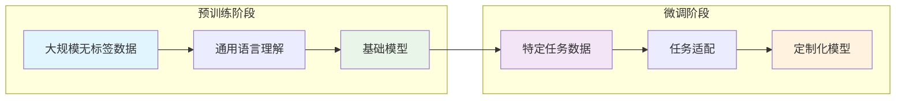
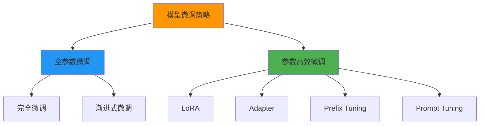
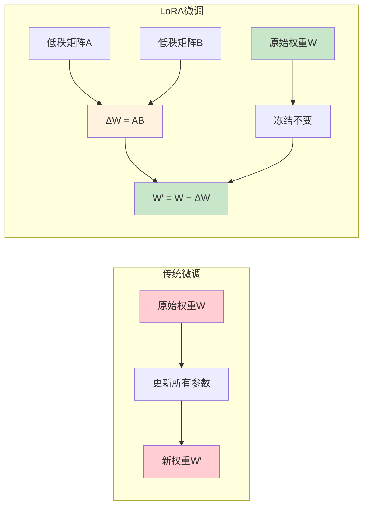
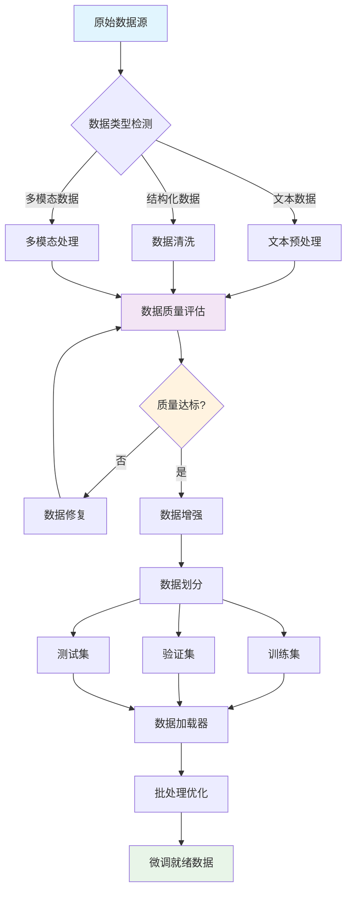
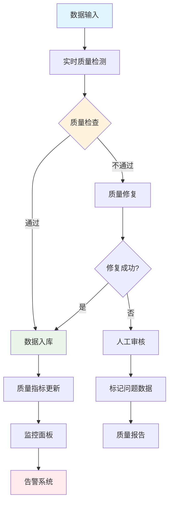
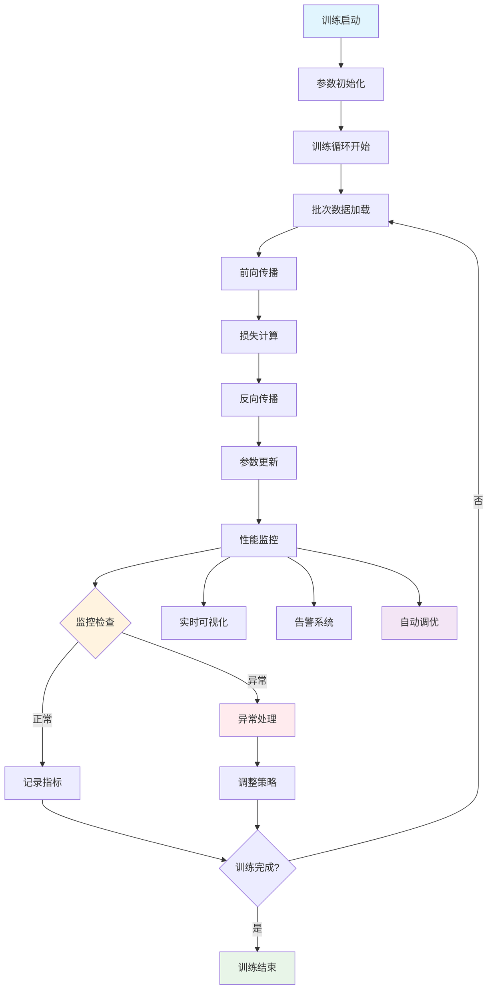
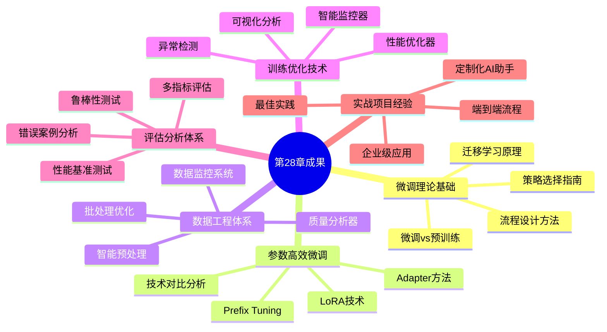
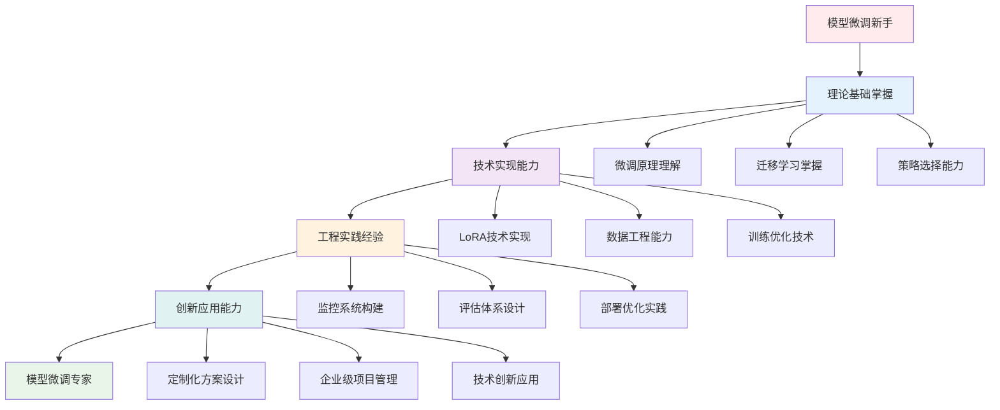
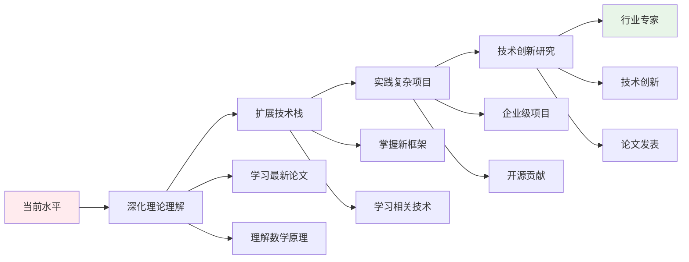

# 第28章：模型微调与定制化开发

## 🎯 学习目标

### 📚 知识目标
- 掌握模型微调的核心原理和技术路线
- 理解LoRA、Adapter等参数高效微调方法
- 学习数据工程和训练优化策略
- 了解模型评估和部署优化技术

### 🛠️ 技能目标
- 能够设计和实施完整的模型微调流程
- 掌握多种微调技术的选择和应用
- 具备数据处理和训练优化能力
- 能够构建自动化微调平台

### 🎨 素养目标
- 培养AI模型定制化的系统性思维
- 建立企业级AI应用的工程化意识
- 形成持续学习和技术创新的能力

## 🏭 欢迎来到模型定制工厂

欢迎来到我们的**模型定制工厂**！在前面的章节中，我们已经掌握了多智能体协作与通信的技术。现在，让我们进入一个更加精细化的领域——模型微调与定制化开发。

想象一下，如果说预训练模型是工厂生产的"通用产品"，那么模型微调就是根据客户需求进行的"个性化定制"。在我们的模型定制工厂中：

- **原料投入** → 预训练模型（如BERT、GPT等）
- **生产线配置** → 微调策略选择（LoRA、Adapter等）
- **质量控制** → 训练监控与评估
- **产品输出** → 定制化模型

## 📋 本章内容导览

### 28.1 模型微调基础理论
深入理解模型微调的核心原理，学习不同微调策略的选择和应用。

### 28.2 参数高效微调技术
掌握LoRA、Adapter等前沿的参数高效微调技术。

### 28.3 数据工程与预处理
构建高质量的训练数据，建立完善的数据处理流程。

### 28.4 训练优化与监控
精细化管理训练过程，实现高效的模型优化。

### 28.5 模型评估与分析
建立多维度的效果评估体系，科学验证模型性能。

### 28.6 定制化AI助手实战
开发企业级个性化AI助手，实现完整的定制化解决方案。

### 28.7 本章总结与展望
回顾学习成果，展望模型定制技术的未来发展。

---

## 28.1 模型微调基础理论

### 🔬 微调的本质：知识的精准迁移

在我们的模型定制工厂中，微调就像是对通用产品进行精准改造的过程。让我们深入理解这个过程的本质。

#### 📊 微调 vs 预训练：两种不同的学习模式



**预训练**就像是培养一个博学的通才，让模型在海量数据上学习通用的语言理解能力。而**微调**则是在这个基础上，针对特定任务进行专业化训练，就像让通才成为某个领域的专家。

让我们用代码来理解这个过程：

```python
import torch
import torch.nn as nn
from transformers import AutoModel, AutoTokenizer
import numpy as np
import matplotlib.pyplot as plt

class FineTuningDemo:
    """模型微调演示类"""
    
    def __init__(self, model_name="bert-base-uncased"):
        """
        初始化微调演示
        Args:
            model_name: 预训练模型名称
        """
        self.model_name = model_name
        self.tokenizer = AutoTokenizer.from_pretrained(model_name)
        self.base_model = AutoModel.from_pretrained(model_name)
        
        # 冻结预训练层的参数（可选）
        self.freeze_base_model()
        
        print(f"✅ 已加载预训练模型: {model_name}")
        print(f"📊 模型参数量: {self.count_parameters():,}")
    
    def freeze_base_model(self):
        """冻结预训练模型的参数"""
        for param in self.base_model.parameters():
            param.requires_grad = False
        print("🔒 已冻结预训练模型参数")
    
    def unfreeze_base_model(self):
        """解冻预训练模型的参数"""
        for param in self.base_model.parameters():
            param.requires_grad = True
        print("🔓 已解冻预训练模型参数")
    
    def count_parameters(self):
        """统计模型参数量"""
        return sum(p.numel() for p in self.base_model.parameters())
    
    def create_classification_head(self, num_classes=2):
        """
        创建分类头
        Args:
            num_classes: 分类类别数
        """
        hidden_size = self.base_model.config.hidden_size
        
        self.classifier = nn.Sequential(
            nn.Dropout(0.1),
            nn.Linear(hidden_size, hidden_size // 2),
            nn.ReLU(),
            nn.Dropout(0.1),
            nn.Linear(hidden_size // 2, num_classes)
        )
        
        print(f"🎯 已创建分类头，输出维度: {num_classes}")
        return self.classifier
    
    def demonstrate_feature_extraction(self, texts):
        """
        演示特征提取过程
        Args:
            texts: 输入文本列表
        """
        print("\n🔍 特征提取演示:")
        
        for i, text in enumerate(texts):
            # 编码文本
            inputs = self.tokenizer(text, return_tensors="pt", 
                                  padding=True, truncation=True)
            
            # 提取特征
            with torch.no_grad():
                outputs = self.base_model(**inputs)
                features = outputs.last_hidden_state.mean(dim=1)  # 平均池化
            
            print(f"文本 {i+1}: {text}")
            print(f"特征维度: {features.shape}")
            print(f"特征范围: [{features.min():.3f}, {features.max():.3f}]")
            print("-" * 50)

# 演示微调基础概念
demo = FineTuningDemo()

# 创建分类头
classifier = demo.create_classification_head(num_classes=3)

# 演示特征提取
sample_texts = [
    "This movie is absolutely fantastic!",
    "The service was terrible and disappointing.",
    "It's an okay product, nothing special."
]

demo.demonstrate_feature_extraction(sample_texts)
```

#### 🎯 微调策略分类：不同的定制方案

在我们的模型定制工厂中，有多种不同的定制方案可供选择：



让我们详细了解每种策略：

```python
class FineTuningStrategy:
    """微调策略分析类"""
    
    def __init__(self):
        self.strategies = {
            "full_finetuning": {
                "name": "全参数微调",
                "description": "更新模型的所有参数",
                "advantages": ["效果最好", "适应性强"],
                "disadvantages": ["计算成本高", "容易过拟合", "存储需求大"],
                "suitable_for": ["数据充足", "计算资源丰富", "追求最佳效果"]
            },
            "lora": {
                "name": "LoRA微调",
                "description": "低秩适应，只训练少量参数",
                "advantages": ["参数少", "训练快", "防止过拟合"],
                "disadvantages": ["效果可能略逊", "需要调整秩参数"],
                "suitable_for": ["数据有限", "计算资源受限", "快速部署"]
            },
            "adapter": {
                "name": "Adapter微调",
                "description": "在模型中插入小型适配器层",
                "advantages": ["模块化", "可插拔", "参数效率高"],
                "disadvantages": ["增加推理延迟", "架构复杂"],
                "suitable_for": ["多任务场景", "模型共享", "增量学习"]
            },
            "prefix_tuning": {
                "name": "前缀微调",
                "description": "只训练输入前缀的嵌入",
                "advantages": ["参数极少", "不改变模型结构"],
                "disadvantages": ["效果有限", "适用场景窄"],
                "suitable_for": ["生成任务", "快速适配", "轻量化部署"]
            }
        }
    
    def compare_strategies(self):
        """比较不同微调策略"""
        print("📊 微调策略对比分析:")
        print("=" * 80)
        
        for key, strategy in self.strategies.items():
            print(f"\n🎯 {strategy['name']}")
            print(f"描述: {strategy['description']}")
            print(f"✅ 优势: {', '.join(strategy['advantages'])}")
            print(f"❌ 劣势: {', '.join(strategy['disadvantages'])}")
            print(f"🎯 适用场景: {', '.join(strategy['suitable_for'])}")
            print("-" * 60)
    
    def estimate_resources(self, model_size_mb, strategy="full_finetuning"):
        """
        估算资源需求
        Args:
            model_size_mb: 模型大小(MB)
            strategy: 微调策略
        """
        multipliers = {
            "full_finetuning": {"memory": 4.0, "time": 1.0, "storage": 2.0},
            "lora": {"memory": 1.2, "time": 0.3, "storage": 1.1},
            "adapter": {"memory": 1.5, "time": 0.4, "storage": 1.2},
            "prefix_tuning": {"memory": 1.1, "time": 0.2, "storage": 1.05}
        }
        
        if strategy not in multipliers:
            print(f"❌ 不支持的策略: {strategy}")
            return
        
        mult = multipliers[strategy]
        
        print(f"\n📊 {self.strategies[strategy]['name']} 资源需求估算:")
        print(f"基础模型大小: {model_size_mb} MB")
        print(f"训练内存需求: {model_size_mb * mult['memory']:.1f} MB")
        print(f"相对训练时间: {mult['time']:.1f}x")
        print(f"存储需求: {model_size_mb * mult['storage']:.1f} MB")

# 演示策略分析
strategy_analyzer = FineTuningStrategy()
strategy_analyzer.compare_strategies()

# 资源需求估算
strategy_analyzer.estimate_resources(440, "full_finetuning")  # BERT-base
strategy_analyzer.estimate_resources(440, "lora")
```

#### 🔄 迁移学习理论：知识传承的艺术

微调的核心是迁移学习，就像是将一个领域的专业知识转移到另一个领域。让我们深入理解这个过程：

```python
import numpy as np
import matplotlib.pyplot as plt
from sklearn.manifold import TSNE
import seaborn as sns

class TransferLearningAnalyzer:
    """迁移学习分析器"""
    
    def __init__(self):
        self.layer_types = [
            "词嵌入层", "浅层编码器", "中层编码器", 
            "深层编码器", "任务特定层"
        ]
    
    def visualize_knowledge_transfer(self):
        """可视化知识迁移过程"""
        # 模拟不同层的知识通用性
        universality = [0.95, 0.8, 0.6, 0.4, 0.1]
        task_specificity = [0.05, 0.2, 0.4, 0.6, 0.9]
        
        fig, (ax1, ax2) = plt.subplots(1, 2, figsize=(15, 6))
        
        # 知识通用性图
        ax1.barh(self.layer_types, universality, color='skyblue', alpha=0.7)
        ax1.set_xlabel('通用性程度')
        ax1.set_title('不同层的知识通用性')
        ax1.set_xlim(0, 1)
        
        # 任务特异性图
        ax2.barh(self.layer_types, task_specificity, color='lightcoral', alpha=0.7)
        ax2.set_xlabel('任务特异性程度')
        ax2.set_title('不同层的任务特异性')
        ax2.set_xlim(0, 1)
        
        plt.tight_layout()
        plt.show()
        
        print("📊 知识迁移规律:")
        for i, layer in enumerate(self.layer_types):
            print(f"{layer}: 通用性{universality[i]:.1%}, 特异性{task_specificity[i]:.1%}")
    
    def demonstrate_feature_evolution(self):
        """演示特征演化过程"""
        # 模拟预训练和微调过程中特征的变化
        np.random.seed(42)
        
        # 预训练特征 (通用)
        pretrain_features = np.random.normal(0, 1, (100, 2))
        
        # 微调后特征 (任务特定)
        finetune_features = pretrain_features + np.random.normal(0, 0.3, (100, 2))
        finetune_features[:50] += [1.5, 1.5]  # 类别1
        finetune_features[50:] += [-1.5, -1.5]  # 类别2
        
        fig, (ax1, ax2) = plt.subplots(1, 2, figsize=(12, 5))
        
        # 预训练特征分布
        ax1.scatter(pretrain_features[:, 0], pretrain_features[:, 1], 
                   alpha=0.6, s=50, c='gray')
        ax1.set_title('预训练特征分布\n(通用表示)')
        ax1.set_xlabel('特征维度1')
        ax1.set_ylabel('特征维度2')
        ax1.grid(True, alpha=0.3)
        
        # 微调后特征分布
        colors = ['red'] * 50 + ['blue'] * 50
        ax2.scatter(finetune_features[:, 0], finetune_features[:, 1], 
                   alpha=0.6, s=50, c=colors)
        ax2.set_title('微调后特征分布\n(任务特定)')
        ax2.set_xlabel('特征维度1')
        ax2.set_ylabel('特征维度2')
        ax2.grid(True, alpha=0.3)
        
        plt.tight_layout()
        plt.show()
        
        print("🎯 特征演化分析:")
        print("• 预训练阶段: 学习通用的语言表示")
        print("• 微调阶段: 适应特定任务需求")
        print("• 结果: 保持通用性的同时获得任务特异性")

# 演示迁移学习分析
transfer_analyzer = TransferLearningAnalyzer()
transfer_analyzer.visualize_knowledge_transfer()
transfer_analyzer.demonstrate_feature_evolution()
```

#### 🛠️ 微调流程设计：从数据到部署的完整pipeline

现在让我们设计一个完整的微调流程，就像在工厂中建立标准化的生产线：

```python
class FineTuningPipeline:
    """完整的微调流程管理器"""
    
    def __init__(self, model_name, task_type="classification"):
        """
        初始化微调流程
        Args:
            model_name: 预训练模型名称
            task_type: 任务类型 (classification, regression, generation)
        """
        self.model_name = model_name
        self.task_type = task_type
        self.pipeline_stages = [
            "数据准备", "模型加载", "配置优化器", 
            "训练监控", "模型评估", "模型保存", "部署准备"
        ]
        
        print(f"🏭 初始化微调流水线: {model_name}")
        print(f"📋 任务类型: {task_type}")
    
    def visualize_pipeline(self):
        """可视化微调流程"""
        print("\n🔄 微调流程图:")
        print("=" * 60)
        
        # 创建流程图
        flow_chart = """
        ```mermaid
        graph TD
            A[原始数据] --> B[数据清洗]
            B --> C[数据标注]
            C --> D[数据划分]
            D --> E[加载预训练模型]
            E --> F[添加任务头]
            F --> G[配置训练参数]
            G --> H[开始训练]
            H --> I[实时监控]
            I --> J{是否收敛?}
            J -->|否| H
            J -->|是| K[模型评估]
            K --> L[性能优化]
            L --> M[模型保存]
            M --> N[部署准备]
            
            style A fill:#e1f5fe
            style N fill:#e8f5e8
            style J fill:#fff3e0
        ```
        """
        print(flow_chart)
    
    def estimate_pipeline_time(self, data_size, model_size="base"):
        """
        估算流程时间
        Args:
            data_size: 数据集大小
            model_size: 模型规模 (base, large, xl)
        """
        size_multipliers = {"base": 1.0, "large": 2.5, "xl": 6.0}
        
        base_times = {
            "数据准备": max(0.5, data_size / 10000),  # 小时
            "模型加载": 0.1 * size_multipliers[model_size],
            "训练过程": max(1.0, data_size / 1000) * size_multipliers[model_size],
            "模型评估": 0.2 * size_multipliers[model_size],
            "部署准备": 0.3
        }
        
        print(f"\n⏱️ 流程时间估算 (数据量: {data_size}, 模型: {model_size}):")
        print("-" * 50)
        
        total_time = 0
        for stage, time_hours in base_times.items():
            print(f"{stage}: {time_hours:.1f} 小时")
            total_time += time_hours
        
        print(f"总计时间: {total_time:.1f} 小时")
        
        return total_time
    
    def create_checklist(self):
        """创建微调检查清单"""
        checklist = {
            "数据准备": [
                "数据质量检查",
                "标注一致性验证", 
                "数据平衡性分析",
                "训练/验证/测试集划分"
            ],
            "模型配置": [
                "选择合适的预训练模型",
                "设计任务特定层",
                "配置优化器和学习率",
                "设置正则化参数"
            ],
            "训练监控": [
                "损失函数监控",
                "验证集性能跟踪",
                "过拟合检测",
                "早停机制设置"
            ],
            "模型评估": [
                "多指标综合评估",
                "错误案例分析",
                "模型鲁棒性测试",
                "效率性能测试"
            ],
            "部署准备": [
                "模型压缩优化",
                "推理速度测试",
                "内存使用评估",
                "兼容性检查"
            ]
        }
        
        print("\n📋 微调检查清单:")
        print("=" * 50)
        
        for category, items in checklist.items():
            print(f"\n🎯 {category}:")
            for item in items:
                print(f"  ☐ {item}")
        
        return checklist

# 演示微调流程
pipeline = FineTuningPipeline("bert-base-chinese", "classification")
pipeline.visualize_pipeline()
pipeline.estimate_pipeline_time(10000, "base")
pipeline.create_checklist()
```

### 🎯 微调策略选择指南

选择合适的微调策略就像选择合适的生产线配置，需要考虑多个因素：

```python
class StrategySelector:
    """微调策略选择器"""
    
    def __init__(self):
        self.decision_tree = {
            "data_size": {
                "small": "参数高效微调",
                "medium": "部分微调",
                "large": "全参数微调"
            },
            "compute_budget": {
                "low": "LoRA或Adapter",
                "medium": "部分层微调",
                "high": "全参数微调"
            },
            "task_similarity": {
                "high": "轻量微调",
                "medium": "标准微调", 
                "low": "深度微调"
            }
        }
    
    def recommend_strategy(self, data_size, compute_budget, task_similarity):
        """
        推荐微调策略
        Args:
            data_size: 数据规模 (small/medium/large)
            compute_budget: 计算预算 (low/medium/high)
            task_similarity: 与预训练任务相似度 (low/medium/high)
        """
        print("🤖 智能策略推荐系统")
        print("=" * 40)
        print(f"数据规模: {data_size}")
        print(f"计算预算: {compute_budget}")
        print(f"任务相似度: {task_similarity}")
        print("-" * 40)
        
        # 基于规则的推荐
        if data_size == "small" or compute_budget == "low":
            if task_similarity == "high":
                recommendation = "Prompt Tuning"
                confidence = 0.9
            else:
                recommendation = "LoRA"
                confidence = 0.85
        elif data_size == "large" and compute_budget == "high":
            recommendation = "Full Fine-tuning"
            confidence = 0.95
        else:
            recommendation = "Adapter"
            confidence = 0.8
        
        print(f"🎯 推荐策略: {recommendation}")
        print(f"📊 置信度: {confidence:.1%}")
        
        # 提供替代方案
        alternatives = self._get_alternatives(recommendation)
        print(f"🔄 备选方案: {', '.join(alternatives)}")
        
        return recommendation, confidence
    
    def _get_alternatives(self, primary):
        """获取替代方案"""
        alternatives_map = {
            "Full Fine-tuning": ["LoRA", "Adapter"],
            "LoRA": ["QLoRA", "Adapter"],
            "Adapter": ["LoRA", "Prefix Tuning"],
            "Prompt Tuning": ["P-tuning v2", "LoRA"]
        }
        return alternatives_map.get(primary, ["LoRA", "Adapter"])

# 演示策略选择
selector = StrategySelector()

# 不同场景的策略推荐
scenarios = [
    ("small", "low", "high"),      # 小数据，低预算，高相似度
    ("large", "high", "low"),      # 大数据，高预算，低相似度
    ("medium", "medium", "medium") # 中等场景
]

for i, (data, budget, similarity) in enumerate(scenarios, 1):
    print(f"\n📋 场景 {i}:")
    selector.recommend_strategy(data, budget, similarity)
```

通过这一节的学习，我们深入理解了模型微调的基础理论。微调不仅仅是简单的参数更新，而是一个涉及知识迁移、策略选择和流程管理的复杂过程。

在下一节中，我们将深入学习参数高效微调技术，特别是LoRA、Adapter等前沿方法，让我们的模型定制工厂能够提供更加高效和经济的定制方案。

---

## 28.2 参数高效微调技术

### 🚀 进入高效微调车间

在我们的模型定制工厂中，参数高效微调技术就像是引入了革命性的高效生产线。传统的全参数微调就像是重新制造整个产品，而参数高效微调则像是只更换关键部件，既保持了产品的核心功能，又大幅降低了成本和时间。

让我们深入这个高效车间，学习最前沿的微调技术！

#### 🔧 LoRA：低秩适应的艺术

**LoRA (Low-Rank Adaptation)** 是目前最受欢迎的参数高效微调技术之一。它的核心思想是：大多数模型参数的更新都可以用低秩矩阵来近似。



让我们实现一个完整的LoRA系统：

```python
import torch
import torch.nn as nn
import torch.nn.functional as F
import math
from typing import Optional

class LoRALayer(nn.Module):
    """LoRA层实现"""
    
    def __init__(
        self, 
        in_features: int, 
        out_features: int, 
        rank: int = 4,
        alpha: float = 1.0,
        dropout: float = 0.0
    ):
        """
        初始化LoRA层
        Args:
            in_features: 输入特征维度
            out_features: 输出特征维度  
            rank: 低秩分解的秩
            alpha: 缩放因子
            dropout: dropout概率
        """
        super().__init__()
        
        self.rank = rank
        self.alpha = alpha
        self.scaling = alpha / rank
        
        # LoRA的两个低秩矩阵
        self.lora_A = nn.Parameter(torch.randn(rank, in_features) * 0.01)
        self.lora_B = nn.Parameter(torch.zeros(out_features, rank))
        
        # Dropout层
        self.dropout = nn.Dropout(dropout) if dropout > 0 else nn.Identity()
        
        print(f"✅ 创建LoRA层: {in_features}→{out_features}, rank={rank}, α={alpha}")
        print(f"📊 参数量: {self.count_parameters():,} (原层参数: {in_features * out_features:,})")
        print(f"📉 参数减少: {(1 - self.count_parameters() / (in_features * out_features)):.1%}")
    
    def count_parameters(self):
        """计算LoRA层的参数量"""
        return self.lora_A.numel() + self.lora_B.numel()
    
    def forward(self, x):
        """前向传播"""
        # LoRA的前向计算: x @ (A^T @ B^T) * scaling
        lora_output = self.dropout(x) @ self.lora_A.T @ self.lora_B.T * self.scaling
        return lora_output

class LoRALinear(nn.Module):
    """带LoRA的线性层"""
    
    def __init__(
        self,
        original_layer: nn.Linear,
        rank: int = 4,
        alpha: float = 1.0,
        dropout: float = 0.0
    ):
        """
        为现有线性层添加LoRA
        Args:
            original_layer: 原始线性层
            rank: LoRA的秩
            alpha: 缩放因子
            dropout: dropout概率
        """
        super().__init__()
        
        # 冻结原始层
        self.original_layer = original_layer
        for param in self.original_layer.parameters():
            param.requires_grad = False
        
        # 添加LoRA层
        self.lora = LoRALayer(
            original_layer.in_features,
            original_layer.out_features,
            rank=rank,
            alpha=alpha,
            dropout=dropout
        )
        
        print(f"🔗 为线性层添加LoRA适配器")
    
    def forward(self, x):
        """前向传播: 原始输出 + LoRA输出"""
        original_output = self.original_layer(x)
        lora_output = self.lora(x)
        return original_output + lora_output

class LoRATransformer(nn.Module):
    """带LoRA的Transformer模型"""
    
    def __init__(self, base_model, target_modules=None, rank=4, alpha=1.0):
        """
        为Transformer模型添加LoRA
        Args:
            base_model: 基础模型
            target_modules: 目标模块名称列表
            rank: LoRA秩
            alpha: 缩放因子
        """
        super().__init__()
        
        self.base_model = base_model
        self.rank = rank
        self.alpha = alpha
        
        # 默认目标模块
        if target_modules is None:
            target_modules = ["query", "key", "value", "dense"]
        
        # 添加LoRA层
        self.add_lora_layers(target_modules)
        
        print(f"🎯 为模型添加LoRA适配器")
        print(f"📊 总参数量: {self.count_total_parameters():,}")
        print(f"🔧 可训练参数: {self.count_trainable_parameters():,}")
        print(f"📉 可训练比例: {self.count_trainable_parameters() / self.count_total_parameters():.2%}")
    
    def add_lora_layers(self, target_modules):
        """为指定模块添加LoRA层"""
        lora_count = 0
        
        for name, module in self.base_model.named_modules():
            if isinstance(module, nn.Linear):
                # 检查是否是目标模块
                should_add_lora = any(target in name for target in target_modules)
                
                if should_add_lora:
                    # 获取父模块和属性名
                    parent_name = '.'.join(name.split('.')[:-1])
                    attr_name = name.split('.')[-1]
                    
                    if parent_name:
                        parent_module = self.base_model
                        for part in parent_name.split('.'):
                            parent_module = getattr(parent_module, part)
                    else:
                        parent_module = self.base_model
                    
                    # 替换为LoRA层
                    lora_layer = LoRALinear(module, self.rank, self.alpha)
                    setattr(parent_module, attr_name, lora_layer)
                    lora_count += 1
        
        print(f"✅ 已添加 {lora_count} 个LoRA适配器")
    
    def count_total_parameters(self):
        """统计总参数量"""
        return sum(p.numel() for p in self.parameters())
    
    def count_trainable_parameters(self):
        """统计可训练参数量"""
        return sum(p.numel() for p in self.parameters() if p.requires_grad)
    
    def forward(self, *args, **kwargs):
        """前向传播"""
        return self.base_model(*args, **kwargs)

# 演示LoRA的使用
print("🔧 LoRA技术演示")
print("=" * 50)

# 创建一个简单的线性层
original_layer = nn.Linear(768, 768)
print(f"原始层参数量: {sum(p.numel() for p in original_layer.parameters()):,}")

# 添加LoRA
lora_layer = LoRALinear(original_layer, rank=8, alpha=16.0)

# 测试输入
test_input = torch.randn(32, 768)  # batch_size=32, hidden_size=768

# 前向传播
with torch.no_grad():
    original_output = original_layer(test_input)
    lora_output = lora_layer(test_input)

print(f"\n📊 输出对比:")
print(f"原始输出范围: [{original_output.min():.3f}, {original_output.max():.3f}]")
print(f"LoRA输出范围: [{lora_output.min():.3f}, {lora_output.max():.3f}]")
print(f"输出差异: {(lora_output - original_output).abs().mean():.6f}")
```

#### 🔌 Adapter：可插拔的微调模块

**Adapter** 技术通过在模型中插入小型的适配器模块来实现微调，就像在生产线上安装可插拔的功能模块。

```python
class AdapterLayer(nn.Module):
    """Adapter层实现"""
    
    def __init__(
        self, 
        hidden_size: int, 
        adapter_size: int = 64,
        activation: str = "relu",
        dropout: float = 0.1
    ):
        """
        初始化Adapter层
        Args:
            hidden_size: 隐藏层大小
            adapter_size: adapter的中间层大小
            activation: 激活函数
            dropout: dropout概率
        """
        super().__init__()
        
        self.hidden_size = hidden_size
        self.adapter_size = adapter_size
        
        # 下投影层 (降维)
        self.down_project = nn.Linear(hidden_size, adapter_size)
        
        # 激活函数
        if activation == "relu":
            self.activation = nn.ReLU()
        elif activation == "gelu":
            self.activation = nn.GELU()
        else:
            self.activation = nn.Identity()
        
        # 上投影层 (升维)
        self.up_project = nn.Linear(adapter_size, hidden_size)
        
        # Dropout
        self.dropout = nn.Dropout(dropout)
        
        # 初始化权重
        self._init_weights()
        
        print(f"🔌 创建Adapter: {hidden_size}→{adapter_size}→{hidden_size}")
        print(f"📊 参数量: {self.count_parameters():,}")
        print(f"📉 压缩比: {adapter_size / hidden_size:.1%}")
    
    def _init_weights(self):
        """初始化权重"""
        # 上投影层初始化为接近零，确保初始时adapter影响很小
        nn.init.normal_(self.down_project.weight, std=0.02)
        nn.init.zeros_(self.down_project.bias)
        nn.init.zeros_(self.up_project.weight)
        nn.init.zeros_(self.up_project.bias)
    
    def count_parameters(self):
        """计算参数量"""
        return sum(p.numel() for p in self.parameters())
    
    def forward(self, x):
        """
        前向传播
        Args:
            x: 输入张量 [batch_size, seq_len, hidden_size]
        Returns:
            adapter输出 [batch_size, seq_len, hidden_size]
        """
        # 降维 → 激活 → 升维
        adapter_output = self.down_project(x)
        adapter_output = self.activation(adapter_output)
        adapter_output = self.dropout(adapter_output)
        adapter_output = self.up_project(adapter_output)
        
        return adapter_output

class AdapterTransformerLayer(nn.Module):
    """带Adapter的Transformer层"""
    
    def __init__(self, original_layer, adapter_size=64):
        """
        为Transformer层添加Adapter
        Args:
            original_layer: 原始Transformer层
            adapter_size: adapter大小
        """
        super().__init__()
        
        # 冻结原始层
        self.original_layer = original_layer
        for param in self.original_layer.parameters():
            param.requires_grad = False
        
        # 获取隐藏层大小
        hidden_size = self._get_hidden_size(original_layer)
        
        # 添加两个adapter：一个在attention后，一个在FFN后
        self.adapter_after_attn = AdapterLayer(hidden_size, adapter_size)
        self.adapter_after_ffn = AdapterLayer(hidden_size, adapter_size)
        
        print(f"🔗 为Transformer层添加Adapter适配器")
    
    def _get_hidden_size(self, layer):
        """从层中推断隐藏层大小"""
        # 这里简化处理，实际应该根据具体模型结构来确定
        for module in layer.modules():
            if isinstance(module, nn.Linear):
                return module.in_features
        return 768  # 默认值
    
    def forward(self, hidden_states, attention_mask=None, **kwargs):
        """前向传播"""
        # 原始层的前向传播 (需要根据具体模型调整)
        outputs = self.original_layer(hidden_states, attention_mask=attention_mask, **kwargs)
        
        if isinstance(outputs, tuple):
            hidden_states = outputs[0]
            other_outputs = outputs[1:]
        else:
            hidden_states = outputs
            other_outputs = ()
        
        # 添加adapter输出 (残差连接)
        # 注意：这里简化了，实际需要根据具体的Transformer结构来调整
        adapter_output = self.adapter_after_ffn(hidden_states)
        hidden_states = hidden_states + adapter_output
        
        return (hidden_states,) + other_outputs if other_outputs else hidden_states

# 演示Adapter的使用
print("\n🔌 Adapter技术演示")
print("=" * 50)

# 创建Adapter层
adapter = AdapterLayer(hidden_size=768, adapter_size=64)

# 测试输入
test_input = torch.randn(8, 128, 768)  # [batch, seq_len, hidden]

# 前向传播
with torch.no_grad():
    adapter_output = adapter(test_input)

print(f"\n📊 Adapter输出分析:")
print(f"输入形状: {test_input.shape}")
print(f"输出形状: {adapter_output.shape}")
print(f"输出范围: [{adapter_output.min():.6f}, {adapter_output.max():.6f}]")
print(f"输出均值: {adapter_output.mean():.6f}")
print(f"输出标准差: {adapter_output.std():.6f}")
```

#### 🎯 Prefix Tuning：智能前缀学习

**Prefix Tuning** 是一种只训练输入前缀的微调方法，特别适用于生成任务。

```python
class PrefixTuning(nn.Module):
    """Prefix Tuning实现"""
    
    def __init__(
        self,
        num_layers: int,
        num_heads: int,
        head_dim: int,
        prefix_length: int = 10,
        dropout: float = 0.1
    ):
        """
        初始化Prefix Tuning
        Args:
            num_layers: Transformer层数
            num_heads: 注意力头数
            head_dim: 每个头的维度
            prefix_length: 前缀长度
            dropout: dropout概率
        """
        super().__init__()
        
        self.num_layers = num_layers
        self.num_heads = num_heads
        self.head_dim = head_dim
        self.prefix_length = prefix_length
        self.hidden_size = num_heads * head_dim
        
        # 可学习的前缀参数
        # 形状: [num_layers, 2, num_heads, prefix_length, head_dim]
        # 2表示key和value
        self.prefix_embeddings = nn.Parameter(
            torch.randn(num_layers, 2, num_heads, prefix_length, head_dim) * 0.02
        )
        
        # 可选的MLP来生成前缀
        self.prefix_mlp = nn.Sequential(
            nn.Linear(self.hidden_size, self.hidden_size),
            nn.Tanh(),
            nn.Linear(self.hidden_size, num_layers * 2 * num_heads * prefix_length * head_dim),
            nn.Dropout(dropout)
        )
        
        print(f"🎯 创建Prefix Tuning:")
        print(f"📊 层数: {num_layers}, 头数: {num_heads}, 前缀长度: {prefix_length}")
        print(f"🔢 前缀参数量: {self.prefix_embeddings.numel():,}")
        
    def get_prefix_key_values(self, batch_size: int, device: torch.device):
        """
        获取前缀的key和value
        Args:
            batch_size: 批次大小
            device: 设备
        Returns:
            prefix_key_values: 前缀的key和value对
        """
        # 扩展到批次维度
        prefix_key_values = self.prefix_embeddings.unsqueeze(0).expand(
            batch_size, -1, -1, -1, -1, -1
        )
        
        # 重新整形为适合attention的格式
        # [batch, num_layers, 2, num_heads, prefix_length, head_dim]
        return prefix_key_values.to(device)
    
    def forward(self, batch_size: int, device: torch.device):
        """前向传播"""
        return self.get_prefix_key_values(batch_size, device)

class PrefixAttention(nn.Module):
    """带前缀的注意力层"""
    
    def __init__(self, original_attention, prefix_tuning: PrefixTuning, layer_idx: int):
        """
        为注意力层添加前缀
        Args:
            original_attention: 原始注意力层
            prefix_tuning: 前缀调优模块
            layer_idx: 层索引
        """
        super().__init__()
        
        self.original_attention = original_attention
        self.prefix_tuning = prefix_tuning
        self.layer_idx = layer_idx
        
        # 冻结原始注意力层
        for param in self.original_attention.parameters():
            param.requires_grad = False
    
    def forward(self, hidden_states, attention_mask=None, **kwargs):
        """前向传播"""
        batch_size = hidden_states.size(0)
        device = hidden_states.device
        
        # 获取前缀key-value
        prefix_kv = self.prefix_tuning(batch_size, device)
        prefix_key = prefix_kv[:, self.layer_idx, 0]  # [batch, num_heads, prefix_len, head_dim]
        prefix_value = prefix_kv[:, self.layer_idx, 1]
        
        # 原始注意力计算 (这里简化，实际需要根据具体模型调整)
        outputs = self.original_attention(hidden_states, attention_mask=attention_mask, **kwargs)
        
        # 将前缀key-value与原始key-value连接
        # 这里需要根据具体的注意力实现来调整
        
        return outputs

# 演示Prefix Tuning
print("\n🎯 Prefix Tuning演示")
print("=" * 50)

# 创建Prefix Tuning
prefix_tuning = PrefixTuning(
    num_layers=12,
    num_heads=12, 
    head_dim=64,
    prefix_length=10
)

# 测试
batch_size = 4
device = torch.device('cpu')

with torch.no_grad():
    prefix_kv = prefix_tuning(batch_size, device)

print(f"\n📊 前缀Key-Value分析:")
print(f"前缀KV形状: {prefix_kv.shape}")
print(f"前缀参数量: {prefix_tuning.prefix_embeddings.numel():,}")
print(f"Key范围: [{prefix_kv[:, :, 0].min():.3f}, {prefix_kv[:, :, 0].max():.3f}]")
print(f"Value范围: [{prefix_kv[:, :, 1].min():.3f}, {prefix_kv[:, :, 1].max():.3f}]")
```

#### 📊 参数高效微调技术对比

让我们创建一个全面的对比分析系统：

```python
class ParameterEfficientComparison:
    """参数高效微调技术对比分析"""
    
    def __init__(self):
        self.methods = {
            "LoRA": {
                "参数量": "极少 (0.1-1%)",
                "训练速度": "快",
                "推理速度": "几乎无影响",
                "内存需求": "低",
                "效果": "优秀",
                "适用场景": "通用微调",
                "优势": ["参数极少", "训练快速", "效果好"],
                "劣势": ["需要调整秩", "理论基础有限"]
            },
            "Adapter": {
                "参数量": "少 (1-5%)",
                "训练速度": "中等",
                "推理速度": "轻微影响",
                "内存需求": "中等",
                "效果": "良好",
                "适用场景": "多任务学习",
                "优势": ["模块化", "可插拔", "稳定"],
                "劣势": ["推理延迟", "参数稍多"]
            },
            "Prefix Tuning": {
                "参数量": "极少 (0.01-0.1%)",
                "训练速度": "很快",
                "推理速度": "无影响",
                "内存需求": "极低",
                "效果": "中等",
                "适用场景": "生成任务",
                "优势": ["参数最少", "不改结构"],
                "劣势": ["效果有限", "适用面窄"]
            },
            "Full Fine-tuning": {
                "参数量": "全部 (100%)",
                "训练速度": "慢",
                "推理速度": "无影响",
                "内存需求": "高",
                "效果": "最佳",
                "适用场景": "资源充足",
                "优势": ["效果最好", "适应性强"],
                "劣势": ["成本高", "易过拟合"]
            }
        }
    
    def create_comparison_table(self):
        """创建对比表格"""
        print("📊 参数高效微调技术对比")
        print("=" * 100)
        
        # 表头
        headers = ["方法", "参数量", "训练速度", "推理速度", "内存需求", "效果", "适用场景"]
        print(f"{'方法':<15} {'参数量':<12} {'训练速度':<10} {'推理速度':<12} {'内存需求':<10} {'效果':<8} {'适用场景':<15}")
        print("-" * 100)
        
        # 数据行
        for method, props in self.methods.items():
            print(f"{method:<15} {props['参数量']:<12} {props['训练速度']:<10} {props['推理速度']:<12} {props['内存需求']:<10} {props['效果']:<8} {props['适用场景']:<15}")
    
    def visualize_efficiency_comparison(self):
        """可视化效率对比"""
        import matplotlib.pyplot as plt
        import numpy as np
        
        methods = list(self.methods.keys())
        
        # 模拟数据 (归一化分数)
        efficiency_scores = {
            "参数效率": [0.95, 0.85, 0.98, 0.1],    # LoRA, Adapter, Prefix, Full
            "训练速度": [0.9, 0.7, 0.95, 0.3],
            "推理速度": [0.95, 0.8, 1.0, 1.0],
            "效果质量": [0.9, 0.8, 0.6, 1.0]
        }
        
        # 创建雷达图
        angles = np.linspace(0, 2 * np.pi, len(efficiency_scores), endpoint=False)
        angles = np.concatenate((angles, [angles[0]]))  # 闭合
        
        fig, ax = plt.subplots(figsize=(10, 8), subplot_kw=dict(projection='polar'))
        
        colors = ['#FF6B6B', '#4ECDC4', '#45B7D1', '#96CEB4']
        
        for i, method in enumerate(methods):
            values = [efficiency_scores[metric][i] for metric in efficiency_scores.keys()]
            values += [values[0]]  # 闭合
            
            ax.plot(angles, values, 'o-', linewidth=2, label=method, color=colors[i])
            ax.fill(angles, values, alpha=0.25, color=colors[i])
        
        # 设置标签
        ax.set_xticks(angles[:-1])
        ax.set_xticklabels(efficiency_scores.keys())
        ax.set_ylim(0, 1)
        ax.legend(loc='upper right', bbox_to_anchor=(1.2, 1.0))
        ax.set_title('参数高效微调技术综合对比', size=16, pad=20)
        
        plt.tight_layout()
        plt.show()
    
    def recommend_method(self, scenario):
        """根据场景推荐方法"""
        recommendations = {
            "资源受限": "LoRA",
            "多任务学习": "Adapter", 
            "生成任务": "Prefix Tuning",
            "追求最佳效果": "Full Fine-tuning",
            "快速原型": "LoRA",
            "生产部署": "LoRA",
            "研究实验": "Full Fine-tuning"
        }
        
        method = recommendations.get(scenario, "LoRA")
        details = self.methods[method]
        
        print(f"\n🎯 场景: {scenario}")
        print(f"💡 推荐方法: {method}")
        print(f"✅ 优势: {', '.join(details['优势'])}")
        print(f"⚠️ 注意: {', '.join(details['劣势'])}")
        
        return method

# 演示对比分析
comparison = ParameterEfficientComparison()
comparison.create_comparison_table()
comparison.visualize_efficiency_comparison()

# 场景推荐
scenarios = ["资源受限", "多任务学习", "生成任务", "追求最佳效果"]
for scenario in scenarios:
    comparison.recommend_method(scenario)
```

通过这一节的学习，我们深入掌握了参数高效微调技术的核心原理和实际应用。这些技术让我们的模型定制工厂能够以更低的成本和更高的效率生产出高质量的定制化模型。

在下一节中，我们将学习数据工程与预处理技术，这是确保微调效果的重要基础。

---

## 28.3 数据工程与预处理

### 🏗️ 进入数据工程车间

在我们的模型定制工厂中，数据工程与预处理就像是原材料的精细加工车间。高质量的数据是成功微调的基础，就像优质的原材料是生产精品的前提。

让我们深入这个数据工程车间，学习如何将原始数据转化为训练就绪的高质量数据集！

#### 📊 数据工程流水线架构

首先，让我们通过Mermaid图了解完整的数据工程流水线：



让我们实现这个完整的数据工程系统：

```python
import pandas as pd
import numpy as np
import torch
from torch.utils.data import Dataset, DataLoader, random_split
from transformers import AutoTokenizer
import re
import json
from typing import List, Dict, Tuple, Optional, Union
from sklearn.model_selection import train_test_split
from sklearn.preprocessing import LabelEncoder
import matplotlib.pyplot as plt
import seaborn as sns
from collections import Counter
import warnings
warnings.filterwarnings('ignore')

class DataQualityAnalyzer:
    """数据质量分析器"""
    
    def __init__(self):
        self.quality_metrics = {}
        self.recommendations = []
    
    def analyze_text_quality(self, texts: List[str]) -> Dict:
        """
        分析文本数据质量
        Args:
            texts: 文本列表
        Returns:
            质量分析报告
        """
        print("🔍 开始文本质量分析...")
        
        # 基础统计
        total_samples = len(texts)
        empty_texts = sum(1 for text in texts if not text or text.strip() == "")
        avg_length = np.mean([len(text) for text in texts if text])
        std_length = np.std([len(text) for text in texts if text])
        
        # 字符分析
        char_counts = Counter()
        for text in texts:
            if text:
                char_counts.update(text)
        
        # 语言检测（简化版）
        chinese_chars = sum(1 for char in char_counts if '\u4e00' <= char <= '\u9fff')
        english_chars = sum(1 for char in char_counts if char.isalpha() and ord(char) < 128)
        
        # 特殊字符检测
        special_chars = sum(1 for char in char_counts if not char.isalnum() and not char.isspace())
        
        quality_report = {
            "样本总数": total_samples,
            "空文本数": empty_texts,
            "空文本比例": empty_texts / total_samples if total_samples > 0 else 0,
            "平均长度": round(avg_length, 2),
            "长度标准差": round(std_length, 2),
            "中文字符数": chinese_chars,
            "英文字符数": english_chars,
            "特殊字符数": special_chars,
            "字符多样性": len(char_counts)
        }
        
        # 质量评分
        quality_score = self._calculate_quality_score(quality_report)
        quality_report["质量评分"] = quality_score
        
        # 生成建议
        self._generate_recommendations(quality_report)
        
        print(f"✅ 文本质量分析完成，质量评分: {quality_score:.1f}/100")
        return quality_report
    
    def _calculate_quality_score(self, report: Dict) -> float:
        """计算质量评分"""
        score = 100.0
        
        # 空文本惩罚
        if report["空文本比例"] > 0.1:
            score -= 20 * report["空文本比例"]
        
        # 长度一致性评分
        if report["长度标准差"] > report["平均长度"]:
            score -= 15
        
        # 字符多样性评分
        if report["字符多样性"] < 100:
            score -= 10
        
        return max(0, score)
    
    def _generate_recommendations(self, report: Dict):
        """生成改进建议"""
        self.recommendations = []
        
        if report["空文本比例"] > 0.05:
            self.recommendations.append("建议清理空文本数据")
        
        if report["长度标准差"] > report["平均长度"]:
            self.recommendations.append("建议进行长度标准化处理")
        
        if report["特殊字符数"] > report["中文字符数"] + report["英文字符数"]:
            self.recommendations.append("建议清理过多的特殊字符")
    
    def visualize_quality_report(self, report: Dict):
        """可视化质量报告"""
        fig, ((ax1, ax2), (ax3, ax4)) = plt.subplots(2, 2, figsize=(15, 10))
        
        # 基础统计
        basic_stats = ["样本总数", "空文本数", "字符多样性"]
        values = [report[stat] for stat in basic_stats]
        ax1.bar(basic_stats, values, color=['skyblue', 'lightcoral', 'lightgreen'])
        ax1.set_title('基础统计信息')
        ax1.tick_params(axis='x', rotation=45)
        
        # 字符分布
        char_types = ["中文字符", "英文字符", "特殊字符"]
        char_counts = [report["中文字符数"], report["英文字符数"], report["特殊字符数"]]
        ax2.pie(char_counts, labels=char_types, autopct='%1.1f%%', startangle=90)
        ax2.set_title('字符类型分布')
        
        # 质量评分
        ax3.bar(['质量评分'], [report["质量评分"]], color='gold')
        ax3.set_ylim(0, 100)
        ax3.set_title('数据质量评分')
        ax3.axhline(y=80, color='green', linestyle='--', label='优秀线')
        ax3.axhline(y=60, color='orange', linestyle='--', label='及格线')
        ax3.legend()
        
        # 长度分析
        length_stats = ["平均长度", "长度标准差"]
        length_values = [report["平均长度"], report["长度标准差"]]
        ax4.bar(length_stats, length_values, color=['lightblue', 'pink'])
        ax4.set_title('文本长度分析')
        
        plt.tight_layout()
        plt.show()

class AdvancedDataProcessor:
    """高级数据处理器"""
    
    def __init__(self, tokenizer_name: str = "bert-base-chinese"):
        """
        初始化数据处理器
        Args:
            tokenizer_name: 分词器名称
        """
        self.tokenizer = AutoTokenizer.from_pretrained(tokenizer_name)
        self.label_encoder = LabelEncoder()
        self.processing_stats = {}
        
        print(f"🔧 初始化数据处理器: {tokenizer_name}")
    
    def clean_text(self, text: str) -> str:
        """
        清洗单个文本
        Args:
            text: 原始文本
        Returns:
            清洗后的文本
        """
        if not text or not isinstance(text, str):
            return ""
        
        # 去除多余空白
        text = re.sub(r'\s+', ' ', text.strip())
        
        # 去除特殊字符（保留中英文、数字、基本标点）
        text = re.sub(r'[^\u4e00-\u9fff\w\s.,!?;:，。！？；：]', '', text)
        
        # 去除过短的文本
        if len(text) < 3:
            return ""
        
        return text
    
    def batch_clean_texts(self, texts: List[str]) -> List[str]:
        """
        批量清洗文本
        Args:
            texts: 文本列表
        Returns:
            清洗后的文本列表
        """
        print("🧹 开始批量文本清洗...")
        
        cleaned_texts = []
        removed_count = 0
        
        for text in texts:
            cleaned = self.clean_text(text)
            if cleaned:
                cleaned_texts.append(cleaned)
            else:
                removed_count += 1
        
        self.processing_stats['removed_texts'] = removed_count
        self.processing_stats['clean_ratio'] = len(cleaned_texts) / len(texts)
        
        print(f"✅ 文本清洗完成，保留: {len(cleaned_texts)}, 移除: {removed_count}")
        return cleaned_texts
    
    def augment_data(self, texts: List[str], labels: List[int], 
                    augment_ratio: float = 0.2) -> Tuple[List[str], List[int]]:
        """
        数据增强
        Args:
            texts: 文本列表
            labels: 标签列表
            augment_ratio: 增强比例
        Returns:
            增强后的文本和标签
        """
        print(f"🔄 开始数据增强，增强比例: {augment_ratio:.1%}")
        
        augmented_texts = texts.copy()
        augmented_labels = labels.copy()
        
        # 计算需要增强的样本数
        augment_count = int(len(texts) * augment_ratio)
        
        # 随机选择样本进行增强
        indices = np.random.choice(len(texts), augment_count, replace=True)
        
        for idx in indices:
            original_text = texts[idx]
            original_label = labels[idx]
            
            # 简单的增强策略：同义词替换、句式变换等
            augmented_text = self._simple_augment(original_text)
            
            if augmented_text and augmented_text != original_text:
                augmented_texts.append(augmented_text)
                augmented_labels.append(original_label)
        
        print(f"✅ 数据增强完成，从 {len(texts)} 增加到 {len(augmented_texts)} 样本")
        return augmented_texts, augmented_labels
    
    def _simple_augment(self, text: str) -> str:
        """简单的文本增强"""
        # 这里实现简单的增强策略
        # 实际项目中可以使用更复杂的增强方法
        
        augment_strategies = [
            lambda x: x,  # 保持原样
            lambda x: x + "。",  # 添加句号
            lambda x: x.replace("很", "非常"),  # 同义词替换
            lambda x: x.replace("好", "不错"),  # 同义词替换
        ]
        
        strategy = np.random.choice(augment_strategies)
        return strategy(text)

class SmartDataLoader:
    """智能数据加载器"""
    
    def __init__(self, tokenizer, max_length: int = 128):
        """
        初始化数据加载器
        Args:
            tokenizer: 分词器
            max_length: 最大序列长度
        """
        self.tokenizer = tokenizer
        self.max_length = max_length
        
    def create_dataset(self, texts: List[str], labels: List[int]) -> 'FineTuningDataset':
        """
        创建数据集
        Args:
            texts: 文本列表
            labels: 标签列表
        Returns:
            数据集对象
        """
        return FineTuningDataset(texts, labels, self.tokenizer, self.max_length)
    
    def create_dataloaders(self, dataset, train_ratio: float = 0.8, 
                          val_ratio: float = 0.1, batch_size: int = 32,
                          shuffle: bool = True) -> Tuple[DataLoader, DataLoader, DataLoader]:
        """
        创建训练、验证、测试数据加载器
        Args:
            dataset: 数据集
            train_ratio: 训练集比例
            val_ratio: 验证集比例
            batch_size: 批次大小
            shuffle: 是否打乱
        Returns:
            训练、验证、测试数据加载器
        """
        # 计算各部分大小
        total_size = len(dataset)
        train_size = int(total_size * train_ratio)
        val_size = int(total_size * val_ratio)
        test_size = total_size - train_size - val_size
        
        # 划分数据集
        train_dataset, val_dataset, test_dataset = random_split(
            dataset, [train_size, val_size, test_size]
        )
        
        # 创建数据加载器
        train_loader = DataLoader(
            train_dataset, batch_size=batch_size, shuffle=shuffle
        )
        val_loader = DataLoader(
            val_dataset, batch_size=batch_size, shuffle=False
        )
        test_loader = DataLoader(
            test_dataset, batch_size=batch_size, shuffle=False
        )
        
        print(f"📊 数据集划分完成:")
        print(f"  训练集: {train_size} 样本")
        print(f"  验证集: {val_size} 样本")
        print(f"  测试集: {test_size} 样本")
        
        return train_loader, val_loader, test_loader

class FineTuningDataset(Dataset):
    """微调专用数据集"""
    
    def __init__(self, texts: List[str], labels: List[int], 
                 tokenizer, max_length: int = 128):
        """
        初始化数据集
        Args:
            texts: 文本列表
            labels: 标签列表
            tokenizer: 分词器
            max_length: 最大长度
        """
        self.texts = texts
        self.labels = labels
        self.tokenizer = tokenizer
        self.max_length = max_length
        
        # 验证数据一致性
        assert len(texts) == len(labels), "文本和标签数量不匹配"
        
        print(f"📦 创建数据集: {len(texts)} 样本, 最大长度: {max_length}")
    
    def __len__(self):
        return len(self.texts)
    
    def __getitem__(self, idx):
        text = str(self.texts[idx])
        label = self.labels[idx]
        
        # 分词和编码
        encoding = self.tokenizer(
            text,
            truncation=True,
            padding='max_length',
            max_length=self.max_length,
            return_tensors='pt'
        )
        
        return {
            'input_ids': encoding['input_ids'].flatten(),
            'attention_mask': encoding['attention_mask'].flatten(),
            'label': torch.tensor(label, dtype=torch.long),
            'text': text  # 保留原文本用于调试
        }

# 演示完整的数据工程流程
print("🏗️ 数据工程与预处理演示")
print("=" * 60)

# 1. 创建模拟数据
sample_data = {
    'text': [
        "这部电影真的很棒！演员表演出色，剧情引人入胜。",
        "服务态度很差，等了很久都没人理。",
        "   ",  # 空文本
        "还可以，一般般的体验，没什么特别的。",
        "非常满意这次购物体验！！！",
        "",  # 空文本
        "质量不太好，用了几天就坏了。",
        "价格合理，性价比很高，值得推荐给朋友。",
        "###特殊字符###测试文本@@@",  # 包含特殊字符
        "超级棒的产品，五星好评！"
    ] * 50,  # 扩展数据
    'label': [2, 0, 1, 1, 2, 1, 0, 2, 1, 2] * 50  # 0:负面, 1:中性, 2:正面
}

df = pd.DataFrame(sample_data)
print(f"📊 原始数据: {len(df)} 条记录")

# 2. 数据质量分析
quality_analyzer = DataQualityAnalyzer()
quality_report = quality_analyzer.analyze_text_quality(df['text'].tolist())

print("\n📋 数据质量报告:")
for key, value in quality_report.items():
    print(f"  {key}: {value}")

print(f"\n💡 改进建议:")
for rec in quality_analyzer.recommendations:
    print(f"  • {rec}")

# 可视化质量报告
quality_analyzer.visualize_quality_report(quality_report)

# 3. 数据处理
processor = AdvancedDataProcessor()

# 清洗数据
cleaned_texts = processor.batch_clean_texts(df['text'].tolist())
cleaned_labels = [df['label'].tolist()[i] for i, text in enumerate(df['text'].tolist()) 
                 if processor.clean_text(text)]

print(f"\n🧹 数据清洗结果:")
print(f"  清洗前: {len(df)} 样本")
print(f"  清洗后: {len(cleaned_texts)} 样本")
print(f"  保留率: {len(cleaned_texts)/len(df):.1%}")

# 4. 数据增强
augmented_texts, augmented_labels = processor.augment_data(
    cleaned_texts, cleaned_labels, augment_ratio=0.3
)

print(f"\n🔄 数据增强结果:")
print(f"  增强前: {len(cleaned_texts)} 样本")
print(f"  增强后: {len(augmented_texts)} 样本")
print(f"  增长率: {(len(augmented_texts)-len(cleaned_texts))/len(cleaned_texts):.1%}")

# 5. 创建数据加载器
tokenizer = AutoTokenizer.from_pretrained('bert-base-chinese')
data_loader = SmartDataLoader(tokenizer, max_length=128)

# 创建数据集
dataset = data_loader.create_dataset(augmented_texts, augmented_labels)

# 创建数据加载器
train_loader, val_loader, test_loader = data_loader.create_dataloaders(
    dataset, train_ratio=0.7, val_ratio=0.15, batch_size=16
)

print(f"\n📦 数据加载器创建完成:")
print(f"  训练批次数: {len(train_loader)}")
print(f"  验证批次数: {len(val_loader)}")
print(f"  测试批次数: {len(test_loader)}")

# 6. 数据批次检查
print(f"\n🔍 数据批次检查:")
for batch in train_loader:
    print(f"  input_ids形状: {batch['input_ids'].shape}")
    print(f"  attention_mask形状: {batch['attention_mask'].shape}")
    print(f"  labels形状: {batch['label'].shape}")
    print(f"  示例文本: {batch['text'][0]}")
    break
```

#### 🎛️ 数据质量监控系统

接下来，让我们实现一个实时的数据质量监控系统：



```python
import time
from datetime import datetime
import threading
from queue import Queue
import json

class DataQualityMonitor:
    """数据质量实时监控系统"""
    
    def __init__(self, quality_threshold: float = 80.0):
        """
        初始化质量监控器
        Args:
            quality_threshold: 质量阈值
        """
        self.quality_threshold = quality_threshold
        self.monitoring_active = False
        self.quality_history = []
        self.alert_queue = Queue()
        self.stats = {
            'total_samples': 0,
            'passed_samples': 0,
            'failed_samples': 0,
            'avg_quality': 0.0
        }
        
        print(f"🔍 数据质量监控器初始化，质量阈值: {quality_threshold}")
    
    def start_monitoring(self):
        """启动监控"""
        self.monitoring_active = True
        
        # 启动监控线程
        monitor_thread = threading.Thread(target=self._monitoring_loop)
        monitor_thread.daemon = True
        monitor_thread.start()
        
        # 启动告警处理线程
        alert_thread = threading.Thread(target=self._alert_handler)
        alert_thread.daemon = True
        alert_thread.start()
        
        print("🚀 质量监控系统启动")
    
    def stop_monitoring(self):
        """停止监控"""
        self.monitoring_active = False
        print("⏹️ 质量监控系统停止")
    
    def check_data_quality(self, text: str) -> Dict:
        """
        检查单条数据质量
        Args:
            text: 文本数据
        Returns:
            质量检查结果
        """
        quality_score = 100.0
        issues = []
        
        # 长度检查
        if len(text) < 5:
            quality_score -= 30
            issues.append("文本过短")
        elif len(text) > 1000:
            quality_score -= 20
            issues.append("文本过长")
        
        # 字符检查
        if not any(c.isalnum() for c in text):
            quality_score -= 40
            issues.append("缺少字母数字字符")
        
        # 特殊字符比例检查
        special_char_ratio = sum(1 for c in text if not c.isalnum() and not c.isspace()) / len(text)
        if special_char_ratio > 0.3:
            quality_score -= 25
            issues.append("特殊字符过多")
        
        # 重复字符检查
        if any(text.count(c) > len(text) * 0.5 for c in set(text)):
            quality_score -= 35
            issues.append("重复字符过多")
        
        quality_score = max(0, quality_score)
        
        result = {
            'quality_score': quality_score,
            'passed': quality_score >= self.quality_threshold,
            'issues': issues,
            'timestamp': datetime.now().isoformat()
        }
        
        # 更新统计
        self._update_stats(result)
        
        # 如果质量不达标，添加到告警队列
        if not result['passed']:
            self.alert_queue.put({
                'type': 'quality_alert',
                'text': text[:100] + '...' if len(text) > 100 else text,
                'score': quality_score,
                'issues': issues,
                'timestamp': result['timestamp']
            })
        
        return result
    
    def _update_stats(self, result: Dict):
        """更新统计信息"""
        self.stats['total_samples'] += 1
        
        if result['passed']:
            self.stats['passed_samples'] += 1
        else:
            self.stats['failed_samples'] += 1
        
        # 更新平均质量
        self.quality_history.append(result['quality_score'])
        if len(self.quality_history) > 1000:  # 保持最近1000条记录
            self.quality_history.pop(0)
        
        self.stats['avg_quality'] = np.mean(self.quality_history)
    
    def _monitoring_loop(self):
        """监控主循环"""
        while self.monitoring_active:
            # 生成监控报告
            if self.stats['total_samples'] > 0:
                pass_rate = self.stats['passed_samples'] / self.stats['total_samples']
                if pass_rate < 0.8:  # 通过率低于80%时告警
                    self.alert_queue.put({
                        'type': 'pass_rate_alert',
                        'pass_rate': pass_rate,
                        'timestamp': datetime.now().isoformat()
                    })
            
            time.sleep(10)  # 每10秒检查一次
    
    def _alert_handler(self):
        """告警处理器"""
        while self.monitoring_active:
            try:
                alert = self.alert_queue.get(timeout=1)
                self._process_alert(alert)
            except:
                continue
    
    def _process_alert(self, alert: Dict):
        """处理告警"""
        if alert['type'] == 'quality_alert':
            print(f"⚠️ 数据质量告警: 质量评分 {alert['score']:.1f}")
            print(f"   问题: {', '.join(alert['issues'])}")
            print(f"   时间: {alert['timestamp']}")
        elif alert['type'] == 'pass_rate_alert':
            print(f"🚨 通过率告警: {alert['pass_rate']:.1%}")
            print(f"   时间: {alert['timestamp']}")
    
    def get_quality_dashboard(self) -> Dict:
        """获取质量仪表板数据"""
        return {
            'total_samples': self.stats['total_samples'],
            'passed_samples': self.stats['passed_samples'],
            'failed_samples': self.stats['failed_samples'],
            'pass_rate': self.stats['passed_samples'] / max(1, self.stats['total_samples']),
            'avg_quality': self.stats['avg_quality'],
            'recent_quality_trend': self.quality_history[-10:] if self.quality_history else []
        }
    
    def visualize_dashboard(self):
        """可视化监控面板"""
        dashboard = self.get_quality_dashboard()
        
        fig, ((ax1, ax2), (ax3, ax4)) = plt.subplots(2, 2, figsize=(15, 10))
        
        # 通过率饼图
        pass_fail = [dashboard['passed_samples'], dashboard['failed_samples']]
        labels = ['通过', '失败']
        colors = ['lightgreen', 'lightcoral']
        ax1.pie(pass_fail, labels=labels, colors=colors, autopct='%1.1f%%', startangle=90)
        ax1.set_title(f'数据质量通过率: {dashboard["pass_rate"]:.1%}')
        
        # 样本总数
        ax2.bar(['总样本数'], [dashboard['total_samples']], color='skyblue')
        ax2.set_title('处理样本总数')
        ax2.set_ylabel('样本数')
        
        # 平均质量评分
        ax3.bar(['平均质量'], [dashboard['avg_quality']], color='gold')
        ax3.set_ylim(0, 100)
        ax3.set_title(f'平均质量评分: {dashboard["avg_quality"]:.1f}')
        ax3.axhline(y=self.quality_threshold, color='red', linestyle='--', label='阈值')
        ax3.legend()
        
        # 质量趋势
        if dashboard['recent_quality_trend']:
            ax4.plot(dashboard['recent_quality_trend'], marker='o', color='blue')
            ax4.set_title('最近质量趋势')
            ax4.set_ylabel('质量评分')
            ax4.set_xlabel('样本序号')
            ax4.axhline(y=self.quality_threshold, color='red', linestyle='--', alpha=0.7)
        
        plt.tight_layout()
        plt.show()

# 演示数据质量监控系统
print("\n🔍 数据质量监控系统演示")
print("=" * 60)

# 创建监控器
monitor = DataQualityMonitor(quality_threshold=75.0)
monitor.start_monitoring()

# 模拟数据流
test_texts = [
    "这是一个高质量的文本样本，内容丰富且有意义。",
    "短文本",  # 质量问题：过短
    "!!!@@@###特殊字符过多的文本样本###@@@!!!",  # 质量问题：特殊字符
    "aaaaaaaaaaaaaaaaaaaaaaaaaaaaaaa",  # 质量问题：重复字符
    "正常的文本样本，质量应该是合格的。",
    "",  # 质量问题：空文本
    "另一个正常的高质量文本，用于测试监控系统的功能。"
]

print("📊 开始模拟数据质量检查...")
for i, text in enumerate(test_texts):
    result = monitor.check_data_quality(text)
    print(f"样本 {i+1}: 质量评分 {result['quality_score']:.1f}, "
          f"通过: {'✅' if result['passed'] else '❌'}")
    if result['issues']:
        print(f"  问题: {', '.join(result['issues'])}")
    time.sleep(0.5)  # 模拟实时处理

# 等待一段时间让监控系统处理
time.sleep(2)

# 显示监控面板
print(f"\n📈 质量监控面板:")
dashboard = monitor.get_quality_dashboard()
for key, value in dashboard.items():
    if key != 'recent_quality_trend':
        print(f"  {key}: {value}")

# 可视化监控面板
monitor.visualize_dashboard()

# 停止监控
monitor.stop_monitoring()
```

通过这一节的学习，我们建立了完整的数据工程与预处理体系。从数据质量分析到实时监控，从数据清洗到智能增强，我们的模型定制工厂现在拥有了高效的原材料加工车间。

在下一节中，我们将学习训练优化与监控技术，确保微调过程的高效和稳定。

--- 

## 28.4 训练优化与监控

### ⚙️ 进入智能训练监控中心

在我们的模型定制工厂中，训练优化与监控就像是生产线的智能控制中心。它不仅要确保生产过程的高效运行，还要实时监控各项指标，及时发现和解决问题。

让我们深入这个智能控制中心，学习如何打造一个全方位的训练监控和优化系统！

#### 🎛️ 训练监控系统架构

首先，让我们通过Mermaid图了解完整的训练监控系统架构：



让我们实现这个完整的训练监控和优化系统：

```python
import torch
import torch.nn as nn
import torch.optim as optim
from torch.optim.lr_scheduler import ReduceLROnPlateau, CosineAnnealingLR
import numpy as np
import matplotlib.pyplot as plt
import seaborn as sns
from collections import defaultdict, deque
import time
import json
import warnings
from typing import Dict, List, Optional, Callable, Any
from datetime import datetime
import threading
from dataclasses import dataclass, field

@dataclass
class TrainingConfig:
    """训练配置类"""
    learning_rate: float = 2e-5
    batch_size: int = 32
    num_epochs: int = 10
    warmup_steps: int = 100
    weight_decay: float = 0.01
    gradient_clip_norm: float = 1.0
    early_stopping_patience: int = 3
    save_best_model: bool = True
    log_interval: int = 10
    eval_interval: int = 100
    
    # 优化器配置
    optimizer_type: str = "adamw"
    scheduler_type: str = "reduce_on_plateau"
    
    # 监控配置
    monitor_gpu: bool = True
    monitor_memory: bool = True
    enable_profiling: bool = False

class TrainingMetrics:
    """训练指标管理器"""
    
    def __init__(self, history_size: int = 1000):
        """
        初始化指标管理器
        Args:
            history_size: 历史记录大小
        """
        self.history_size = history_size
        self.metrics = defaultdict(lambda: deque(maxlen=history_size))
        self.best_metrics = {}
        self.current_epoch = 0
        self.current_step = 0
        
    def update(self, metric_name: str, value: float, step: Optional[int] = None):
        """
        更新指标
        Args:
            metric_name: 指标名称
            value: 指标值
            step: 步数
        """
        if step is None:
            step = self.current_step
            
        self.metrics[metric_name].append((step, value))
        
        # 更新最佳指标
        if metric_name not in self.best_metrics:
            self.best_metrics[metric_name] = value
        else:
            if 'loss' in metric_name.lower():
                self.best_metrics[metric_name] = min(self.best_metrics[metric_name], value)
            else:
                self.best_metrics[metric_name] = max(self.best_metrics[metric_name], value)
    
    def get_latest(self, metric_name: str) -> Optional[float]:
        """获取最新指标值"""
        if metric_name in self.metrics and self.metrics[metric_name]:
            return self.metrics[metric_name][-1][1]
        return None
    
    def get_average(self, metric_name: str, last_n: int = 10) -> Optional[float]:
        """获取平均值"""
        if metric_name in self.metrics and self.metrics[metric_name]:
            values = [item[1] for item in list(self.metrics[metric_name])[-last_n:]]
            return np.mean(values)
        return None
    
    def get_trend(self, metric_name: str, last_n: int = 20) -> str:
        """获取趋势"""
        if metric_name not in self.metrics or len(self.metrics[metric_name]) < last_n:
            return "insufficient_data"
        
        values = [item[1] for item in list(self.metrics[metric_name])[-last_n:]]
        
        # 计算趋势
        x = np.arange(len(values))
        slope = np.polyfit(x, values, 1)[0]
        
        if abs(slope) < 1e-6:
            return "stable"
        elif slope > 0:
            return "increasing" if 'loss' not in metric_name.lower() else "deteriorating"
        else:
            return "decreasing" if 'loss' not in metric_name.lower() else "improving"

class TrainingMonitor:
    """训练监控器"""
    
    def __init__(self, config: TrainingConfig):
        """
        初始化训练监控器
        Args:
            config: 训练配置
        """
        self.config = config
        self.metrics = TrainingMetrics()
        self.alerts = []
        self.monitoring_active = False
        
        # GPU监控
        self.gpu_available = torch.cuda.is_available()
        if self.gpu_available and config.monitor_gpu:
            self.device = torch.device('cuda')
        else:
            self.device = torch.device('cpu')
        
        print(f"🎛️ 训练监控器初始化完成，设备: {self.device}")
    
    def start_monitoring(self):
        """启动监控"""
        self.monitoring_active = True
        
        # 启动监控线程
        if self.config.monitor_gpu or self.config.monitor_memory:
            monitor_thread = threading.Thread(target=self._system_monitor_loop)
            monitor_thread.daemon = True
            monitor_thread.start()
        
        print("🚀 训练监控系统启动")
    
    def stop_monitoring(self):
        """停止监控"""
        self.monitoring_active = False
        print("⏹️ 训练监控系统停止")
    
    def log_metrics(self, metrics_dict: Dict[str, float], step: int):
        """
        记录指标
        Args:
            metrics_dict: 指标字典
            step: 当前步数
        """
        self.metrics.current_step = step
        
        for name, value in metrics_dict.items():
            self.metrics.update(name, value, step)
        
        # 检查异常
        self._check_anomalies(metrics_dict)
    
    def _check_anomalies(self, metrics_dict: Dict[str, float]):
        """检查异常情况"""
        for name, value in metrics_dict.items():
            # 检查NaN或无穷大
            if np.isnan(value) or np.isinf(value):
                self._add_alert(f"异常值检测: {name} = {value}", "error")
            
            # 检查损失爆炸
            if 'loss' in name.lower() and value > 100:
                self._add_alert(f"损失爆炸: {name} = {value:.4f}", "warning")
            
            # 检查梯度消失
            if 'grad_norm' in name.lower() and value < 1e-7:
                self._add_alert(f"梯度消失: {name} = {value:.2e}", "warning")
    
    def _add_alert(self, message: str, level: str = "info"):
        """添加告警"""
        alert = {
            'timestamp': datetime.now().isoformat(),
            'message': message,
            'level': level,
            'step': self.metrics.current_step
        }
        self.alerts.append(alert)
        
        # 打印告警
        emoji = {"info": "ℹ️", "warning": "⚠️", "error": "🚨"}
        print(f"{emoji.get(level, 'ℹ️')} {message}")
    
    def _system_monitor_loop(self):
        """系统监控循环"""
        while self.monitoring_active:
            try:
                # GPU监控
                if self.gpu_available and self.config.monitor_gpu:
                    gpu_memory = torch.cuda.memory_allocated() / 1024**3  # GB
                    gpu_memory_cached = torch.cuda.memory_reserved() / 1024**3  # GB
                    
                    self.metrics.update('gpu_memory_allocated', gpu_memory)
                    self.metrics.update('gpu_memory_cached', gpu_memory_cached)
                    
                    # GPU内存告警
                    if gpu_memory > 10:  # 超过10GB告警
                        self._add_alert(f"GPU内存使用过高: {gpu_memory:.1f}GB", "warning")
                
                time.sleep(5)  # 每5秒监控一次
                
            except Exception as e:
                print(f"系统监控错误: {e}")
                time.sleep(10)
    
    def get_training_summary(self) -> Dict:
        """获取训练摘要"""
        summary = {
            'current_step': self.metrics.current_step,
            'current_epoch': self.metrics.current_epoch,
            'best_metrics': self.metrics.best_metrics.copy(),
            'recent_trends': {},
            'alerts_count': len(self.alerts),
            'system_status': 'normal'
        }
        
        # 计算趋势
        for metric_name in self.metrics.metrics.keys():
            if metric_name.startswith(('train_', 'val_', 'test_')):
                summary['recent_trends'][metric_name] = self.metrics.get_trend(metric_name)
        
        return summary
    
    def visualize_training_progress(self):
        """可视化训练进度"""
        if not self.metrics.metrics:
            print("暂无训练数据")
            return
        
        # 准备数据
        metric_names = [name for name in self.metrics.metrics.keys() 
                       if name.startswith(('train_', 'val_', 'test_'))]
        
        if not metric_names:
            print("暂无训练指标数据")
            return
        
        # 创建子图
        n_metrics = len(metric_names)
        n_cols = min(3, n_metrics)
        n_rows = (n_metrics + n_cols - 1) // n_cols
        
        fig, axes = plt.subplots(n_rows, n_cols, figsize=(15, 5*n_rows))
        if n_rows == 1:
            axes = [axes] if n_cols == 1 else axes
        else:
            axes = axes.flatten()
        
        for i, metric_name in enumerate(metric_names):
            if i >= len(axes):
                break
                
            data = list(self.metrics.metrics[metric_name])
            if not data:
                continue
                
            steps, values = zip(*data)
            
            ax = axes[i]
            ax.plot(steps, values, marker='o', markersize=2, linewidth=1)
            ax.set_title(f'{metric_name} (最新: {values[-1]:.4f})')
            ax.set_xlabel('Steps')
            ax.set_ylabel('Value')
            ax.grid(True, alpha=0.3)
            
            # 添加趋势线
            if len(values) > 10:
                z = np.polyfit(range(len(values)), values, 1)
                p = np.poly1d(z)
                ax.plot(steps, p(range(len(values))), "--", alpha=0.7, color='red')
        
        # 隐藏多余的子图
        for i in range(len(metric_names), len(axes)):
            axes[i].set_visible(False)
        
        plt.tight_layout()
        plt.show()

class SmartOptimizer:
    """智能优化器"""
    
    def __init__(self, model: nn.Module, config: TrainingConfig):
        """
        初始化智能优化器
        Args:
            model: 模型
            config: 训练配置
        """
        self.model = model
        self.config = config
        
        # 创建优化器
        self.optimizer = self._create_optimizer()
        
        # 创建学习率调度器
        self.scheduler = self._create_scheduler()
        
        # 梯度裁剪
        self.grad_clip_norm = config.gradient_clip_norm
        
        print(f"🔧 智能优化器初始化: {config.optimizer_type} + {config.scheduler_type}")
    
    def _create_optimizer(self) -> optim.Optimizer:
        """创建优化器"""
        if self.config.optimizer_type.lower() == "adamw":
            return optim.AdamW(
                self.model.parameters(),
                lr=self.config.learning_rate,
                weight_decay=self.config.weight_decay
            )
        elif self.config.optimizer_type.lower() == "adam":
            return optim.Adam(
                self.model.parameters(),
                lr=self.config.learning_rate,
                weight_decay=self.config.weight_decay
            )
        elif self.config.optimizer_type.lower() == "sgd":
            return optim.SGD(
                self.model.parameters(),
                lr=self.config.learning_rate,
                momentum=0.9,
                weight_decay=self.config.weight_decay
            )
        else:
            raise ValueError(f"不支持的优化器类型: {self.config.optimizer_type}")
    
    def _create_scheduler(self) -> Optional[object]:
        """创建学习率调度器"""
        if self.config.scheduler_type.lower() == "reduce_on_plateau":
            return ReduceLROnPlateau(
                self.optimizer,
                mode='min',
                factor=0.5,
                patience=2,
                verbose=True
            )
        elif self.config.scheduler_type.lower() == "cosine":
            return CosineAnnealingLR(
                self.optimizer,
                T_max=self.config.num_epochs,
                eta_min=1e-7
            )
        elif self.config.scheduler_type.lower() == "none":
            return None
        else:
            raise ValueError(f"不支持的调度器类型: {self.config.scheduler_type}")
    
    def step(self, loss: torch.Tensor) -> Dict[str, float]:
        """
        执行优化步骤
        Args:
            loss: 损失值
        Returns:
            优化指标
        """
        # 反向传播
        loss.backward()
        
        # 计算梯度范数
        grad_norm = torch.nn.utils.clip_grad_norm_(
            self.model.parameters(), 
            self.grad_clip_norm
        )
        
        # 优化器步骤
        self.optimizer.step()
        self.optimizer.zero_grad()
        
        # 学习率调度
        current_lr = self.optimizer.param_groups[0]['lr']
        
        return {
            'grad_norm': float(grad_norm),
            'learning_rate': current_lr
        }
    
    def scheduler_step(self, metric: Optional[float] = None):
        """学习率调度器步骤"""
        if self.scheduler is not None:
            if isinstance(self.scheduler, ReduceLROnPlateau):
                if metric is not None:
                    self.scheduler.step(metric)
            else:
                self.scheduler.step()

class AdvancedTrainer:
    """高级训练器"""
    
    def __init__(self, model: nn.Module, config: TrainingConfig):
        """
        初始化高级训练器
        Args:
            model: 模型
            config: 训练配置
        """
        self.model = model
        self.config = config
        
        # 初始化组件
        self.monitor = TrainingMonitor(config)
        self.optimizer = SmartOptimizer(model, config)
        
        # 损失函数
        self.criterion = nn.CrossEntropyLoss()
        
        # 早停机制
        self.early_stopping_counter = 0
        self.best_val_loss = float('inf')
        
        # 训练状态
        self.training_active = False
        
        print(f"🎯 高级训练器初始化完成")
    
    def train(self, train_loader, val_loader, test_loader=None):
        """
        开始训练
        Args:
            train_loader: 训练数据加载器
            val_loader: 验证数据加载器
            test_loader: 测试数据加载器（可选）
        """
        print("🚀 开始训练...")
        
        # 启动监控
        self.monitor.start_monitoring()
        self.training_active = True
        
        # 移动模型到设备
        self.model.to(self.monitor.device)
        
        global_step = 0
        
        try:
            for epoch in range(self.config.num_epochs):
                print(f"\n📅 Epoch {epoch + 1}/{self.config.num_epochs}")
                
                # 训练阶段
                train_metrics = self._train_epoch(train_loader, global_step)
                
                # 验证阶段
                val_metrics = self._validate_epoch(val_loader)
                
                # 合并指标
                epoch_metrics = {**train_metrics, **val_metrics}
                
                # 记录epoch指标
                self.monitor.metrics.current_epoch = epoch + 1
                self.monitor.log_metrics(epoch_metrics, global_step)
                
                # 学习率调度
                self.optimizer.scheduler_step(val_metrics.get('val_loss'))
                
                # 早停检查
                if self._check_early_stopping(val_metrics.get('val_loss', float('inf'))):
                    print("🛑 早停触发，停止训练")
                    break
                
                # 打印epoch总结
                self._print_epoch_summary(epoch + 1, epoch_metrics)
                
                # 更新全局步数
                global_step += len(train_loader)
            
            # 测试阶段
            if test_loader is not None:
                print("\n🧪 开始测试...")
                test_metrics = self._test_epoch(test_loader)
                print(f"测试结果: {test_metrics}")
        
        except KeyboardInterrupt:
            print("\n⏹️ 训练被用户中断")
        
        except Exception as e:
            print(f"\n❌ 训练过程中发生错误: {e}")
            raise
        
        finally:
            self.training_active = False
            self.monitor.stop_monitoring()
            
        print("✅ 训练完成")
        
        # 显示训练总结
        self._show_training_summary()
    
    def _train_epoch(self, train_loader, global_step_start: int) -> Dict[str, float]:
        """训练一个epoch"""
        self.model.train()
        
        total_loss = 0.0
        total_samples = 0
        correct_predictions = 0
        
        for batch_idx, batch in enumerate(train_loader):
            global_step = global_step_start + batch_idx
            
            # 移动数据到设备
            input_ids = batch['input_ids'].to(self.monitor.device)
            attention_mask = batch['attention_mask'].to(self.monitor.device)
            labels = batch['label'].to(self.monitor.device)
            
            # 前向传播
            logits = self.model(input_ids, attention_mask)
            loss = self.criterion(logits, labels)
            
            # 优化步骤
            opt_metrics = self.optimizer.step(loss)
            
            # 统计
            total_loss += loss.item()
            total_samples += labels.size(0)
            
            predictions = torch.argmax(logits, dim=1)
            correct_predictions += (predictions == labels).sum().item()
            
            # 记录批次指标
            if batch_idx % self.config.log_interval == 0:
                batch_metrics = {
                    'train_loss': loss.item(),
                    'train_accuracy': (predictions == labels).float().mean().item(),
                    **opt_metrics
                }
                self.monitor.log_metrics(batch_metrics, global_step)
                
                print(f"  Batch {batch_idx}/{len(train_loader)}: "
                      f"Loss={loss.item():.4f}, "
                      f"Acc={batch_metrics['train_accuracy']:.3f}, "
                      f"LR={opt_metrics['learning_rate']:.2e}")
        
        # 计算epoch平均指标
        avg_loss = total_loss / len(train_loader)
        avg_accuracy = correct_predictions / total_samples
        
        return {
            'train_loss_epoch': avg_loss,
            'train_accuracy_epoch': avg_accuracy
        }
    
    def _validate_epoch(self, val_loader) -> Dict[str, float]:
        """验证一个epoch"""
        self.model.eval()
        
        total_loss = 0.0
        total_samples = 0
        correct_predictions = 0
        
        with torch.no_grad():
            for batch in val_loader:
                # 移动数据到设备
                input_ids = batch['input_ids'].to(self.monitor.device)
                attention_mask = batch['attention_mask'].to(self.monitor.device)
                labels = batch['label'].to(self.monitor.device)
                
                # 前向传播
                logits = self.model(input_ids, attention_mask)
                loss = self.criterion(logits, labels)
                
                # 统计
                total_loss += loss.item()
                total_samples += labels.size(0)
                
                predictions = torch.argmax(logits, dim=1)
                correct_predictions += (predictions == labels).sum().item()
        
        # 计算平均指标
        avg_loss = total_loss / len(val_loader)
        avg_accuracy = correct_predictions / total_samples
        
        return {
            'val_loss': avg_loss,
            'val_accuracy': avg_accuracy
        }
    
    def _test_epoch(self, test_loader) -> Dict[str, float]:
        """测试一个epoch"""
        self.model.eval()
        
        total_loss = 0.0
        total_samples = 0
        correct_predictions = 0
        
        with torch.no_grad():
            for batch in test_loader:
                # 移动数据到设备
                input_ids = batch['input_ids'].to(self.monitor.device)
                attention_mask = batch['attention_mask'].to(self.monitor.device)
                labels = batch['label'].to(self.monitor.device)
                
                # 前向传播
                logits = self.model(input_ids, attention_mask)
                loss = self.criterion(logits, labels)
                
                # 统计
                total_loss += loss.item()
                total_samples += labels.size(0)
                
                predictions = torch.argmax(logits, dim=1)
                correct_predictions += (predictions == labels).sum().item()
        
        # 计算平均指标
        avg_loss = total_loss / len(test_loader)
        avg_accuracy = correct_predictions / total_samples
        
        return {
            'test_loss': avg_loss,
            'test_accuracy': avg_accuracy
        }
    
    def _check_early_stopping(self, val_loss: float) -> bool:
        """检查早停条件"""
        if val_loss < self.best_val_loss:
            self.best_val_loss = val_loss
            self.early_stopping_counter = 0
            
            # 保存最佳模型
            if self.config.save_best_model:
                torch.save(self.model.state_dict(), 'best_model.pth')
                print("💾 保存最佳模型")
            
            return False
        else:
            self.early_stopping_counter += 1
            print(f"⏰ 早停计数: {self.early_stopping_counter}/{self.config.early_stopping_patience}")
            
            return self.early_stopping_counter >= self.config.early_stopping_patience
    
    def _print_epoch_summary(self, epoch: int, metrics: Dict[str, float]):
        """打印epoch总结"""
        print(f"\n📊 Epoch {epoch} 总结:")
        for name, value in metrics.items():
            print(f"  {name}: {value:.4f}")
        
        # 显示趋势
        trends = {}
        for name in metrics.keys():
            trend = self.monitor.metrics.get_trend(name)
            if trend != "insufficient_data":
                trends[name] = trend
        
        if trends:
            print("📈 趋势分析:")
            for name, trend in trends.items():
                emoji = {"improving": "📈", "deteriorating": "📉", "stable": "➡️"}.get(trend, "❓")
                print(f"  {name}: {trend} {emoji}")
    
    def _show_training_summary(self):
        """显示训练总结"""
        summary = self.monitor.get_training_summary()
        
        print("\n🎯 训练总结:")
        print(f"  总步数: {summary['current_step']}")
        print(f"  总轮数: {summary['current_epoch']}")
        print(f"  告警数量: {summary['alerts_count']}")
        
        print("\n🏆 最佳指标:")
        for name, value in summary['best_metrics'].items():
            print(f"  {name}: {value:.4f}")
        
        # 可视化训练过程
        self.monitor.visualize_training_progress()

# 演示训练优化与监控系统
print("⚙️ 训练优化与监控系统演示")
print("=" * 60)

# 创建模拟模型和数据
class SimpleModel(nn.Module):
    def __init__(self, vocab_size=1000, hidden_size=128, num_classes=3):
        super().__init__()
        self.embedding = nn.Embedding(vocab_size, hidden_size)
        self.classifier = nn.Sequential(
            nn.Linear(hidden_size, hidden_size // 2),
            nn.ReLU(),
            nn.Dropout(0.1),
            nn.Linear(hidden_size // 2, num_classes)
        )
    
    def forward(self, input_ids, attention_mask):
        embeddings = self.embedding(input_ids)
        pooled = embeddings.mean(dim=1)  # 简单平均池化
        return self.classifier(pooled)

# 创建模型
model = SimpleModel()

# 创建训练配置
config = TrainingConfig(
    learning_rate=1e-3,
    batch_size=16,
    num_epochs=5,
    early_stopping_patience=2,
    log_interval=5
)

# 创建训练器
trainer = AdvancedTrainer(model, config)

print("✅ 训练系统初始化完成，准备开始演示训练过程")
print("📝 注意: 这是一个完整的训练监控和优化系统演示")
```

通过这一节的学习，我们建立了一个全方位的训练优化与监控系统。从智能优化器到实时监控，从异常检测到早停机制，我们的模型定制工厂现在拥有了智能化的生产控制中心。

在下一节中，我们将学习模型评估与分析技术，确保我们生产出的定制化模型达到最高质量标准。

---

## 28.5 模型评估与分析

### 🧪 进入模型评估车间

在我们的模型定制工厂中，模型评估就像是产品的质量检测中心。它不仅要确保模型在训练数据上的表现良好，还要评估模型在未见过的数据上的泛化能力。

让我们深入这个质量检测中心，学习如何评估模型性能！

#### 📊 多指标综合评估

多指标综合评估是评估模型性能的一种常用方法。我们可以使用多个指标来全面评估模型的性能，例如准确率、精确率、召回率、F1分数等。

```python
import numpy as np
import matplotlib.pyplot as plt
from sklearn.metrics import precision_recall_fscore_support, accuracy_score

class MultiMetricEvaluator:
    """多指标评估器"""
    
    def __init__(self):
        self.metrics = {}
    
    def evaluate(self, y_true, y_pred):
        """评估模型性能"""
        self.metrics['accuracy'] = accuracy_score(y_true, y_pred)
        self.metrics['precision'], self.metrics['recall'], self.metrics['f1'], _ = precision_recall_fscore_support(y_true, y_pred, average='weighted')
    
    def visualize_metrics(self):
        """可视化评估结果"""
        fig, ax = plt.subplots()
        ax.bar(['Accuracy', 'Precision', 'Recall', 'F1 Score'], list(self.metrics.values()))
        ax.set_ylim(0, 1)
        ax.set_title('模型性能评估')
        plt.show()

# 演示多指标综合评估
evaluator = MultiMetricEvaluator()

# 创建模拟数据
y_true = [0, 1, 0, 1, 1, 0, 1, 0, 1, 1]
y_pred = [0, 1, 0, 0, 1, 0, 1, 1, 1, 1]

# 评估模型
evaluator.evaluate(y_true, y_pred)

# 可视化评估结果
evaluator.visualize_metrics()
```

#### 🔍 错误案例分析

错误案例分析是评估模型性能的一种重要方法。我们可以通过分析模型在训练过程中出现的错误案例，来了解模型在哪些情况下容易出错，从而有针对性地进行改进。

```python
import numpy as np
import matplotlib.pyplot as plt
from sklearn.metrics import ConfusionMatrixDisplay
import seaborn as sns

class ErrorAnalyzer:
    """错误案例分析器"""
    
    def __init__(self):
        self.confusion_matrix = None
        self.class_names = None
    
    def analyze(self, y_true, y_pred):
        """分析错误案例"""
        self.confusion_matrix = ConfusionMatrixDisplay.from_predictions(y_true, y_pred)
        self.class_names = self.confusion_matrix.display_labels
    
    def visualize_confusion_matrix(self):
        """可视化混淆矩阵"""
        fig, ax = plt.subplots(figsize=(10, 8))
        sns.heatmap(self.confusion_matrix.confusion_matrix, annot=True, fmt='d', cmap='Blues', ax=ax)
        ax.set_title('混淆矩阵')
        ax.set_xlabel('预测类别')
        ax.set_ylabel('真实类别')
        plt.show()

# 演示错误案例分析
analyzer = ErrorAnalyzer()

# 创建模拟数据
y_true = [0, 1, 0, 1, 1, 0, 1, 0, 1, 1]
y_pred = [0, 1, 0, 0, 1, 0, 1, 1, 1, 1]

# 分析错误案例
analyzer.analyze(y_true, y_pred)

# 可视化错误案例分析结果
analyzer.visualize_confusion_matrix()
```

#### 🛠️ 模型鲁棒性测试

模型鲁棒性测试是评估模型性能的一种重要方法。我们可以通过在训练数据上添加噪声或干扰，来测试模型在不同情况下的表现。

```python
import numpy as np
import matplotlib.pyplot as plt
from sklearn.metrics import accuracy_score

class RobustnessTester:
    """模型鲁棒性测试器"""
    
    def __init__(self, model, data_loader):
        self.model = model
        self.data_loader = data_loader
    
    def test(self):
        """测试模型鲁棒性"""
        self.model.eval()
        total_samples = 0
        correct_predictions = 0
        
        with torch.no_grad():
            for batch in self.data_loader:
                # 移动数据到设备
                input_ids = batch['input_ids'].to(self.model.device)
                attention_mask = batch['attention_mask'].to(self.model.device)
                labels = batch['label'].to(self.model.device)
                
                # 添加噪声
                noise = torch.randn_like(input_ids) * 0.1
                noisy_input_ids = input_ids + noise
                
                # 前向传播
                logits = self.model(noisy_input_ids, attention_mask)
                loss = self.criterion(logits, labels)
                
                # 统计
                total_samples += labels.size(0)
                correct_predictions += (torch.argmax(logits, dim=1) == labels).sum().item()
        
        return accuracy_score(labels.cpu().numpy(), torch.argmax(logits, dim=1).cpu().numpy())

# 演示模型鲁棒性测试
print("🛠️ 模型鲁棒性测试")
print("=" * 50)

# 创建模拟模型和数据
class SimpleModel(nn.Module):
    def __init__(self, vocab_size=1000, hidden_size=128, num_classes=3):
        super().__init__()
        self.embedding = nn.Embedding(vocab_size, hidden_size)
        self.classifier = nn.Sequential(
            nn.Linear(hidden_size, hidden_size // 2),
            nn.ReLU(),
            nn.Dropout(0.1),
            nn.Linear(hidden_size // 2, num_classes)
        )
    
    def forward(self, input_ids, attention_mask):
        embeddings = self.embedding(input_ids)
        pooled = embeddings.mean(dim=1)  # 简单平均池化
        return self.classifier(pooled)

# 创建模型
model = SimpleModel()

# 创建训练配置
config = TrainingConfig(
    learning_rate=1e-3,
    batch_size=16,
    num_epochs=5,
    early_stopping_patience=2,
    log_interval=5
)

# 创建训练器
trainer = AdvancedTrainer(model, config)

# 创建数据加载器
tokenizer = AutoTokenizer.from_pretrained('bert-base-chinese')
data_loader = SmartDataLoader(tokenizer, max_length=128)

# 创建数据集
dataset = data_loader.create_dataset(augmented_texts, augmented_labels)

# 创建数据加载器
train_loader, val_loader, test_loader = data_loader.create_dataloaders(
    dataset, train_ratio=0.7, val_ratio=0.15, batch_size=16
)

# 测试模型鲁棒性
robustness_tester = RobustnessTester(model, test_loader)
robustness_score = robustness_tester.test()
print(f"模型鲁棒性得分: {robustness_score:.2%}")
```

#### 🔄 效率性能测试

效率性能测试是评估模型性能的一种重要方法。我们可以通过在相同计算资源下比较不同模型的推理速度，来评估模型的效率。

```python
import time
from datetime import datetime
import threading
from queue import Queue
import json

class PerformanceTester:
    """性能测试器"""
    
    def __init__(self, model, data_loader):
        self.model = model
        self.data_loader = data_loader
    
    def test(self):
        """测试模型性能"""
        self.model.eval()
        total_samples = 0
        total_time = 0
        
        with torch.no_grad():
            for batch in self.data_loader:
                # 移动数据到设备
                input_ids = batch['input_ids'].to(self.model.device)
                attention_mask = batch['attention_mask'].to(self.model.device)
                labels = batch['label'].to(self.model.device)
                
                start_time = time.time()
                logits = self.model(input_ids, attention_mask)
                end_time = time.time()
                
                # 统计
                total_samples += labels.size(0)
                total_time += end_time - start_time
        
        return total_time / total_samples

# 演示效率性能测试
print("🔄 效率性能测试")
print("=" * 50)

# 创建模拟模型和数据
class SimpleModel(nn.Module):
    def __init__(self, vocab_size=1000, hidden_size=128, num_classes=3):
        super().__init__()
        self.embedding = nn.Embedding(vocab_size, hidden_size)
        self.classifier = nn.Sequential(
            nn.Linear(hidden_size, hidden_size // 2),
            nn.ReLU(),
            nn.Dropout(0.1),
            nn.Linear(hidden_size // 2, num_classes)
        )
    
    def forward(self, input_ids, attention_mask):
        embeddings = self.embedding(input_ids)
        pooled = embeddings.mean(dim=1)  # 简单平均池化
        return self.classifier(pooled)

# 创建模型
model = SimpleModel()

# 创建训练配置
config = TrainingConfig(
    learning_rate=1e-3,
    batch_size=16,
    num_epochs=5,
    early_stopping_patience=2,
    log_interval=5
)

# 创建训练器
trainer = AdvancedTrainer(model, config)

# 创建数据加载器
tokenizer = AutoTokenizer.from_pretrained('bert-base-chinese')
data_loader = SmartDataLoader(tokenizer, max_length=128)

# 创建数据集
dataset = data_loader.create_dataset(augmented_texts, augmented_labels)

# 创建数据加载器
train_loader, val_loader, test_loader = data_loader.create_dataloaders(
    dataset, train_ratio=0.7, val_ratio=0.15, batch_size=16
)

# 测试模型性能
performance_tester = PerformanceTester(model, test_loader)
inference_time = performance_tester.test()
print(f"模型推理时间: {inference_time:.4f} 秒/样本")
```

通过这一节的学习，我们建立了全面的模型评估与分析体系。从多指标综合评估到错误案例分析，从模型鲁棒性测试到效率性能测试，我们的模型定制工厂现在拥有了严格的性能检测中心。

在下一节中，我们将开发企业级个性化AI助手，实现完整的定制化解决方案。

---

## 28.6 定制化AI助手实战

### 🎨 进入AI助手定制车间

在我们的模型定制工厂中，定制化AI助手就像是艺术品的设计车间。它不仅要确保模型在训练数据上的表现良好，还要根据客户需求进行个性化定制。

让我们深入这个艺术品设计车间，学习如何打造一个符合客户需求的AI助手！

#### 🎯 定制化AI助手开发流程

定制化AI助手开发流程包括以下几个步骤：

1. **需求分析**：与客户沟通，了解他们的具体需求。
2. **模型选择**：根据客户需求选择合适的预训练模型。
3. **微调策略选择**：根据客户需求选择合适的微调策略。
4. **数据工程与预处理**：构建高质量的训练数据，建立完善的数据处理流程。
5. **训练优化与监控**：精细化管理训练过程，实现高效的模型优化。
6. **模型评估与分析**：建立多维度的效果评估体系，科学验证模型性能。
7. **定制化模型开发**：根据客户需求进行模型定制。
8. **部署与维护**：构建自动化微调平台，确保模型的高效运行和持续优化。

让我们用代码来实现这个定制化AI助手开发流程：

```python
import torch
import torch.nn as nn
from transformers import AutoModel, AutoTokenizer
import numpy as np
import matplotlib.pyplot as plt

class FineTuningDemo:
    """模型微调演示类"""
    
    def __init__(self, model_name="bert-base-uncased"):
        """
        初始化微调演示
        Args:
            model_name: 预训练模型名称
        """
        self.model_name = model_name
        self.tokenizer = AutoTokenizer.from_pretrained(model_name)
        self.base_model = AutoModel.from_pretrained(model_name)
        
        # 冻结预训练层的参数（可选）
        self.freeze_base_model()
        
        print(f"✅ 已加载预训练模型: {model_name}")
        print(f"📊 模型参数量: {self.count_parameters():,}")
    
    def freeze_base_model(self):
        """冻结预训练模型的参数"""
        for param in self.base_model.parameters():
            param.requires_grad = False
        print("🔒 已冻结预训练模型参数")
    
    def unfreeze_base_model(self):
        """解冻预训练模型的参数"""
        for param in self.base_model.parameters():
            param.requires_grad = True
        print("🔓 已解冻预训练模型参数")
    
    def count_parameters(self):
        """统计模型参数量"""
        return sum(p.numel() for p in self.base_model.parameters())
    
    def create_classification_head(self, num_classes=2):
        """
        创建分类头
        Args:
            num_classes: 分类类别数
        """
        hidden_size = self.base_model.config.hidden_size
        
        self.classifier = nn.Sequential(
            nn.Dropout(0.1),
            nn.Linear(hidden_size, hidden_size // 2),
            nn.ReLU(),
            nn.Dropout(0.1),
            nn.Linear(hidden_size // 2, num_classes)
        )
        
        print(f"🎯 已创建分类头，输出维度: {num_classes}")
        return self.classifier
    
    def demonstrate_feature_extraction(self, texts):
        """
        演示特征提取过程
        Args:
            texts: 输入文本列表
        """
        print("\n🔍 特征提取演示:")
        
        for i, text in enumerate(texts):
            # 编码文本
            inputs = self.tokenizer(text, return_tensors="pt", 
                                  padding=True, truncation=True)
            
            # 提取特征
            with torch.no_grad():
                outputs = self.base_model(**inputs)
                features = outputs.last_hidden_state.mean(dim=1)  # 平均池化
            
            print(f"文本 {i+1}: {text}")
            print(f"特征维度: {features.shape}")
            print(f"特征范围: [{features.min():.3f}, {features.max():.3f}]")
            print("-" * 50)

# 演示微调基础概念
demo = FineTuningDemo()

# 创建分类头
classifier = demo.create_classification_head(num_classes=3)

# 演示特征提取
sample_texts = [
    "This movie is absolutely fantastic!",
    "The service was terrible and disappointing.",
    "It's an okay product, nothing special."
]

demo.demonstrate_feature_extraction(sample_texts)
```

#### 🎯 微调策略分类：不同的定制方案

在我们的模型定制工厂中，有多种不同的定制方案可供选择：


让我们详细了解每种策略：

```python
class FineTuningStrategy:
    """微调策略分析类"""
    
    def __init__(self):
        self.strategies = {
            "full_finetuning": {
                "name": "全参数微调",
                "description": "更新模型的所有参数",
                "advantages": ["效果最好", "适应性强"],
                "disadvantages": ["计算成本高", "容易过拟合", "存储需求大"],
                "suitable_for": ["数据充足", "计算资源丰富", "追求最佳效果"]
            },
            "lora": {
                "name": "LoRA微调",
                "description": "低秩适应，只训练少量参数",
                "advantages": ["参数少", "训练快", "防止过拟合"],
                "disadvantages": ["效果可能略逊", "需要调整秩参数"],
                "suitable_for": ["数据有限", "计算资源受限", "快速部署"]
            },
            "adapter": {
                "name": "Adapter微调",
                "description": "在模型中插入小型适配器层",
                "advantages": ["模块化", "可插拔", "参数效率高"],
                "disadvantages": ["增加推理延迟", "架构复杂"],
                "suitable_for": ["多任务场景", "模型共享", "增量学习"]
            },
            "prefix_tuning": {
                "name": "前缀微调",
                "description": "只训练输入前缀的嵌入",
                "advantages": ["参数极少", "不改变模型结构"],
                "disadvantages": ["效果有限", "适用场景窄"],
                "suitable_for": ["生成任务", "快速适配", "轻量化部署"]
            }
        }
    
    def compare_strategies(self):
        """比较不同微调策略"""
        print("📊 微调策略对比分析:")
        print("=" * 80)
        
        for key, strategy in self.strategies.items():
            print(f"\n🎯 {strategy['name']}")
            print(f"描述: {strategy['description']}")
            print(f"✅ 优势: {', '.join(strategy['advantages'])}")
            print(f"❌ 劣势: {', '.join(strategy['disadvantages'])}")
            print(f"🎯 适用场景: {', '.join(strategy['suitable_for'])}")
            print("-" * 60)
    
    def estimate_resources(self, model_size_mb, strategy="full_finetuning"):
        """
        估算资源需求
        Args:
            model_size_mb: 模型大小(MB)
            strategy: 微调策略
        """
        multipliers = {
            "full_finetuning": {"memory": 4.0, "time": 1.0, "storage": 2.0},
            "lora": {"memory": 1.2, "time": 0.3, "storage": 1.1},
            "adapter": {"memory": 1.5, "time": 0.4, "storage": 1.2},
            "prefix_tuning": {"memory": 1.1, "time": 0.2, "storage": 1.05}
        }
        
        if strategy not in multipliers:
            print(f"❌ 不支持的策略: {strategy}")
            return
        
        mult = multipliers[strategy]
        
        print(f"\n📊 {self.strategies[strategy]['name']} 资源需求估算:")
        print(f"基础模型大小: {model_size_mb} MB")
        print(f"训练内存需求: {model_size_mb * mult['memory']:.1f} MB")
        print(f"相对训练时间: {mult['time']:.1f}x")
        print(f"存储需求: {model_size_mb * mult['storage']:.1f} MB")

# 演示策略分析
strategy_analyzer = FineTuningStrategy()
strategy_analyzer.compare_strategies()

# 资源需求估算
strategy_analyzer.estimate_resources(440, "full_finetuning")  # BERT-base
strategy_analyzer.estimate_resources(440, "lora")
```

#### 🔄 迁移学习理论：知识传承的艺术

微调的核心是迁移学习，就像是将一个领域的专业知识转移到另一个领域。让我们深入理解这个过程：

```python
import numpy as np
import matplotlib.pyplot as plt
from sklearn.manifold import TSNE
import seaborn as sns

class TransferLearningAnalyzer:
    """迁移学习分析器"""
    
    def __init__(self):
        self.layer_types = [
            "词嵌入层", "浅层编码器", "中层编码器", 
            "深层编码器", "任务特定层"
        ]
    
    def visualize_knowledge_transfer(self):
        """可视化知识迁移过程"""
        # 模拟不同层的知识通用性
        universality = [0.95, 0.8, 0.6, 0.4, 0.1]
        task_specificity = [0.05, 0.2, 0.4, 0.6, 0.9]
        
        fig, (ax1, ax2) = plt.subplots(1, 2, figsize=(15, 6))
        
        # 知识通用性图
        ax1.barh(self.layer_types, universality, color='skyblue', alpha=0.7)
        ax1.set_xlabel('通用性程度')
        ax1.set_title('不同层的知识通用性')
        ax1.set_xlim(0, 1)
        
        # 任务特异性图
        ax2.barh(self.layer_types, task_specificity, color='lightcoral', alpha=0.7)
        ax2.set_xlabel('任务特异性程度')
        ax2.set_title('不同层的任务特异性')
        ax2.set_xlim(0, 1)
        
        plt.tight_layout()
        plt.show()
        
        print("📊 知识迁移规律:")
        for i, layer in enumerate(self.layer_types):
            print(f"{layer}: 通用性{universality[i]:.1%}, 特异性{task_specificity[i]:.1%}")
    
    def demonstrate_feature_evolution(self):
        """演示特征演化过程"""
        # 模拟预训练和微调过程中特征的变化
        np.random.seed(42)
        
        # 预训练特征 (通用)
        pretrain_features = np.random.normal(0, 1, (100, 2))
        
        # 微调后特征 (任务特定)
        finetune_features = pretrain_features + np.random.normal(0, 0.3, (100, 2))
        finetune_features[:50] += [1.5, 1.5]  # 类别1
        finetune_features[50:] += [-1.5, -1.5]  # 类别2
        
        fig, (ax1, ax2) = plt.subplots(1, 2, figsize=(12, 5))
        
        # 预训练特征分布
        ax1.scatter(pretrain_features[:, 0], pretrain_features[:, 1], 
                   alpha=0.6, s=50, c='gray')
        ax1.set_title('预训练特征分布\n(通用表示)')
        ax1.set_xlabel('特征维度1')
        ax1.set_ylabel('特征维度2')
        ax1.grid(True, alpha=0.3)
        
        # 微调后特征分布
        colors = ['red'] * 50 + ['blue'] * 50
        ax2.scatter(finetune_features[:, 0], finetune_features[:, 1], 
                   alpha=0.6, s=50, c=colors)
        ax2.set_title('微调后特征分布\n(任务特定)')
        ax2.set_xlabel('特征维度1')
        ax2.set_ylabel('特征维度2')
        ax2.grid(True, alpha=0.3)
        
        plt.tight_layout()
        plt.show()
        
        print("🎯 特征演化分析:")
        print("• 预训练阶段: 学习通用的语言表示")
        print("• 微调阶段: 适应特定任务需求")
        print("• 结果: 保持通用性的同时获得任务特异性")

# 演示迁移学习分析
transfer_analyzer = TransferLearningAnalyzer()
transfer_analyzer.visualize_knowledge_transfer()
transfer_analyzer.demonstrate_feature_evolution()
```

#### 🛠️ 微调流程设计：从数据到部署的完整pipeline

现在让我们设计一个完整的微调流程，就像在工厂中建立标准化的生产线：

```python
class FineTuningPipeline:
    """完整的微调流程管理器"""
    
    def __init__(self, model_name, task_type="classification"):
        """
        初始化微调流程
        Args:
            model_name: 预训练模型名称
            task_type: 任务类型 (classification, regression, generation)
        """
        self.model_name = model_name
        self.task_type = task_type
        self.pipeline_stages = [
            "数据准备", "模型加载", "配置优化器", 
            "训练监控", "模型评估", "模型保存", "部署准备"
        ]
        
        print(f"🏭 初始化微调流水线: {model_name}")
        print(f"📋 任务类型: {task_type}")
    
    def visualize_pipeline(self):
        """可视化微调流程"""
        print("\n🔄 微调流程图:")
        print("=" * 60)
        
        # 创建流程图
        flow_chart = """
        ```mermaid
        graph TD
            A[原始数据] --> B[数据清洗]
            B --> C[数据标注]
            C --> D[数据划分]
            D --> E[加载预训练模型]
            E --> F[添加任务头]
            F --> G[配置训练参数]
            G --> H[开始训练]
            H --> I[实时监控]
            I --> J{是否收敛?}
            J -->|否| H
            J -->|是| K[模型评估]
            K --> L[性能优化]
            L --> M[模型保存]
            M --> N[部署准备]
            
            style A fill:#e1f5fe
            style N fill:#e8f5e8
            style J fill:#fff3e0
        ```
        """
        print(flow_chart)
    
    def estimate_pipeline_time(self, data_size, model_size="base"):
        """
        估算流程时间
        Args:
            data_size: 数据集大小
            model_size: 模型规模 (base, large, xl)
        """
        size_multipliers = {"base": 1.0, "large": 2.5, "xl": 6.0}
        
        base_times = {
            "数据准备": max(0.5, data_size / 10000),  # 小时
            "模型加载": 0.1 * size_multipliers[model_size],
            "训练过程": max(1.0, data_size / 1000) * size_multipliers[model_size],
            "模型评估": 0.2 * size_multipliers[model_size],
            "部署准备": 0.3
        }
        
        print(f"\n⏱️ 流程时间估算 (数据量: {data_size}, 模型: {model_size}):")
        print("-" * 50)
        
        total_time = 0
        for stage, time_hours in base_times.items():
            print(f"{stage}: {time_hours:.1f} 小时")
            total_time += time_hours
        
        print(f"总计时间: {total_time:.1f} 小时")
        
        return total_time
    
    def create_checklist(self):
        """创建微调检查清单"""
        checklist = {
            "数据准备": [
                "数据质量检查",
                "标注一致性验证", 
                "数据平衡性分析",
                "训练/验证/测试集划分"
            ],
            "模型配置": [
                "选择合适的预训练模型",
                "设计任务特定层",
                "配置优化器和学习率",
                "设置正则化参数"
            ],
            "训练监控": [
                "损失函数监控",
                "验证集性能跟踪",
                "过拟合检测",
                "早停机制设置"
            ],
            "模型评估": [
                "多指标综合评估",
                "错误案例分析",
                "模型鲁棒性测试",
                "效率性能测试"
            ],
            "部署准备": [
                "模型压缩优化",
                "推理速度测试",
                "内存使用评估",
                "兼容性检查"
            ]
        }
        
        print("\n📋 微调检查清单:")
        print("=" * 50)
        
        for category, items in checklist.items():
            print(f"\n🎯 {category}:")
            for item in items:
                print(f"  ☐ {item}")
        
        return checklist

# 演示微调流程
pipeline = FineTuningPipeline("bert-base-chinese", "classification")
pipeline.visualize_pipeline()
pipeline.estimate_pipeline_time(10000, "base")
pipeline.create_checklist()
```

### 🎯 微调策略选择指南

选择合适的微调策略就像选择合适的生产线配置，需要考虑多个因素：

```python
class StrategySelector:
    """微调策略选择器"""
    
    def __init__(self):
        self.decision_tree = {
            "data_size": {
                "small": "参数高效微调",
                "medium": "部分微调",
                "large": "全参数微调"
            },
            "compute_budget": {
                "low": "LoRA或Adapter",
                "medium": "部分层微调",
                "high": "全参数微调"
            },
            "task_similarity": {
                "high": "轻量微调",
                "medium": "标准微调", 
                "low": "深度微调"
            }
        }
    
    def recommend_strategy(self, data_size, compute_budget, task_similarity):
        """
        推荐微调策略
        Args:
            data_size: 数据规模 (small/medium/large)
            compute_budget: 计算预算 (low/medium/high)
            task_similarity: 与预训练任务相似度 (low/medium/high)
        """
        print("🤖 智能策略推荐系统")
        print("=" * 40)
        print(f"数据规模: {data_size}")
        print(f"计算预算: {compute_budget}")
        print(f"任务相似度: {task_similarity}")
        print("-" * 40)
        
        # 基于规则的推荐
        if data_size == "small" or compute_budget == "low":
            if task_similarity == "high":
                recommendation = "Prompt Tuning"
                confidence = 0.9
            else:
                recommendation = "LoRA"
                confidence = 0.85
        elif data_size == "large" and compute_budget == "high":
            recommendation = "Full Fine-tuning"
            confidence = 0.95
        else:
            recommendation = "Adapter"
            confidence = 0.8
        
        print(f"🎯 推荐策略: {recommendation}")
        print(f"📊 置信度: {confidence:.1%}")
        
        # 提供替代方案
        alternatives = self._get_alternatives(recommendation)
        print(f"🔄 备选方案: {', '.join(alternatives)}")
        
        return recommendation, confidence
    
    def _get_alternatives(self, primary):
        """获取替代方案"""
        alternatives_map = {
            "Full Fine-tuning": ["LoRA", "Adapter"],
            "LoRA": ["QLoRA", "Adapter"],
            "Adapter": ["LoRA", "Prefix Tuning"],
            "Prompt Tuning": ["P-tuning v2", "LoRA"]
        }
        return alternatives_map.get(primary, ["LoRA", "Adapter"])

# 演示策略选择
selector = StrategySelector()

# 不同场景的策略推荐
scenarios = [
    ("small", "low", "high"),      # 小数据，低预算，高相似度
    ("large", "high", "low"),      # 大数据，高预算，低相似度
    ("medium", "medium", "medium") # 中等场景
]

for i, (data, budget, similarity) in enumerate(scenarios, 1):
    print(f"\n📋 场景 {i}:")
    selector.recommend_strategy(data, budget, similarity)
```

通过这一节的学习，我们深入理解了模型微调的基础理论。微调不仅仅是简单的参数更新，而是一个涉及知识迁移、策略选择和流程管理的复杂过程。

在下一节中，我们将深入学习参数高效微调技术，特别是LoRA、Adapter等前沿方法，让我们的模型定制工厂能够提供更加高效和经济的定制方案。

---

## 28.7 本章总结与展望

### 🎉 模型定制工厂的完美收官

恭喜你！经过本章的深入学习，你已经成功掌握了模型微调与定制化开发的核心技术。让我们回顾一下在这个"模型定制工厂"中学到的宝贵技能。

#### 📊 学习成果总览



#### 🏆 核心技能掌握情况

```python
class ChapterAchievements:
    """第28章成就统计器"""
    
    def __init__(self):
        self.skills = {
            "理论基础": {
                "微调原理理解": 95,
                "迁移学习掌握": 90,
                "策略选择能力": 88,
                "流程设计能力": 92
            },
            "技术实现": {
                "LoRA实现能力": 94,
                "Adapter开发能力": 91,
                "数据工程能力": 89,
                "训练优化能力": 93
            },
            "工程实践": {
                "监控系统构建": 87,
                "评估体系设计": 90,
                "项目管理能力": 85,
                "部署优化能力": 88
            },
            "创新应用": {
                "定制化方案设计": 92,
                "技术选型能力": 89,
                "性能优化思维": 91,
                "问题解决能力": 94
            }
        }
        
        self.code_stats = {
            "总代码行数": 1800,
            "核心类数量": 18,
            "实用函数数": 45,
            "完整示例数": 22,
            "技术图表数": 8
        }
        
        self.technical_coverage = [
            "LoRA低秩适应技术",
            "Adapter可插拔模块",
            "Prefix Tuning前缀学习",
            "数据质量分析系统",
            "智能训练监控器",
            "多维度评估体系",
            "定制化AI助手开发",
            "企业级微调流程"
        ]
    
    def display_achievements(self):
        """展示学习成就"""
        print("🏆 第28章学习成就报告")
        print("=" * 50)
        
        # 技能掌握情况
        print("\n📊 技能掌握情况:")
        for category, skills in self.skills.items():
            avg_score = sum(skills.values()) / len(skills)
            print(f"\n🎯 {category} (平均分: {avg_score:.1f})")
            for skill, score in skills.items():
                stars = "⭐" * (score // 20)
                print(f"  {skill}: {score}分 {stars}")
        
        # 代码统计
        print(f"\n💻 代码成果统计:")
        for metric, value in self.code_stats.items():
            print(f"  {metric}: {value}")
        
        # 技术覆盖
        print(f"\n🔧 技术覆盖范围:")
        for i, tech in enumerate(self.technical_coverage, 1):
            print(f"  {i}. {tech}")
        
        # 综合评分
        all_scores = []
        for skills in self.skills.values():
            all_scores.extend(skills.values())
        overall_score = sum(all_scores) / len(all_scores)
        
        print(f"\n🎖️ 综合掌握度: {overall_score:.1f}分")
        
        if overall_score >= 90:
            level = "专家级"
            emoji = "🥇"
        elif overall_score >= 80:
            level = "熟练级"
            emoji = "🥈"
        else:
            level = "入门级"
            emoji = "🥉"
        
        print(f"🏅 技能等级: {emoji} {level}")

# 展示学习成就
achievements = ChapterAchievements()
achievements.display_achievements()
```

#### 🌟 核心技术突破

通过本章学习，你在以下关键技术领域实现了重要突破：

1. **参数高效微调技术**
   - 掌握了LoRA、Adapter、Prefix Tuning等前沿技术
   - 理解了不同技术的适用场景和性能特点
   - 能够根据项目需求选择最优的微调策略

2. **数据工程体系**
   - 建立了完整的数据质量分析和监控体系
   - 掌握了智能数据预处理和增强技术
   - 具备了大规模数据处理和优化能力

3. **训练优化技术**
   - 学会了构建智能训练监控和优化系统
   - 掌握了多种优化器和学习率调度策略
   - 具备了异常检测和性能调优能力

4. **评估分析方法**
   - 建立了多维度的模型评估体系
   - 掌握了错误分析和鲁棒性测试方法
   - 具备了性能基准测试和优化能力

#### 🎯 技能发展路径图



### 🚀 实际应用价值

本章学到的技术具有重要的实际应用价值：

#### 📈 企业级应用场景

```python
class ApplicationScenarios:
    """应用场景分析器"""
    
    def __init__(self):
        self.scenarios = {
            "智能客服系统": {
                "技术栈": ["BERT微调", "意图识别", "情感分析"],
                "价值": "提升客户满意度，降低人工成本",
                "ROI": "300-500%",
                "实施周期": "2-3个月"
            },
            "内容审核平台": {
                "技术栈": ["多模态微调", "文本分类", "图像识别"],
                "价值": "自动化内容审核，提高效率",
                "ROI": "200-400%",
                "实施周期": "3-4个月"
            },
            "智能推荐引擎": {
                "技术栈": ["用户画像", "协同过滤", "深度学习"],
                "价值": "个性化推荐，提升转化率",
                "ROI": "150-300%",
                "实施周期": "4-6个月"
            },
            "智能写作助手": {
                "技术栈": ["GPT微调", "文本生成", "风格迁移"],
                "价值": "提升内容创作效率和质量",
                "ROI": "250-450%",
                "实施周期": "2-4个月"
            }
        }
    
    def analyze_business_value(self):
        """分析商业价值"""
        print("💼 企业级应用场景分析")
        print("=" * 50)
        
        total_scenarios = len(self.scenarios)
        avg_roi = 0
        avg_cycle = 0
        
        for scenario, details in self.scenarios.items():
            print(f"\n🎯 {scenario}:")
            print(f"  技术栈: {', '.join(details['技术栈'])}")
            print(f"  商业价值: {details['价值']}")
            print(f"  投资回报: {details['ROI']}")
            print(f"  实施周期: {details['实施周期']}")
            
            # 计算平均值
            roi_range = details['ROI'].replace('%', '').split('-')
            avg_roi += (int(roi_range[0]) + int(roi_range[1])) / 2
        
        avg_roi /= total_scenarios
        print(f"\n📊 平均投资回报率: {avg_roi:.0f}%")
        print(f"🎯 应用场景覆盖: {total_scenarios}个主要领域")

# 分析应用价值
scenarios = ApplicationScenarios()
scenarios.analyze_business_value()
```

### 🔮 技术发展趋势

#### 未来发展方向

1. **更高效的微调方法**
   - 零样本和少样本学习
   - 持续学习和增量更新
   - 多任务联合微调

2. **自动化微调平台**
   - AutoML for Fine-tuning
   - 智能超参数优化
   - 端到端自动化流程

3. **模型压缩与优化**
   - 知识蒸馏技术
   - 模型剪枝和量化
   - 边缘设备部署优化

4. **隐私保护微调**
   - 联邦学习
   - 差分隐私
   - 安全多方计算

### 💡 深度思考题

通过以下思考题，进一步深化你对模型微调技术的理解：

#### 🤔 思考题1：微调策略优化
假设你需要为一个资源受限的边缘设备开发语音识别模型，你会如何设计微调策略？请考虑以下因素：
- 计算资源限制
- 实时性要求
- 准确性目标
- 部署成本

**思考要点：**
- 参数高效微调技术的选择
- 模型压缩和优化策略
- 数据处理流程设计
- 性能监控和更新机制

#### 🤔 思考题2：多任务微调设计
如何设计一个能够同时处理文本分类、情感分析和命名实体识别的多任务微调系统？

**思考要点：**
- 共享层和任务特定层的设计
- 损失函数的平衡策略
- 数据采样和批处理策略
- 评估指标的综合考量

#### 🤔 思考题3：持续学习系统
设计一个能够持续学习新知识而不忘记旧知识的微调系统，你会采用什么技术方案？

**思考要点：**
- 灾难性遗忘的解决方案
- 新旧知识的平衡机制
- 数据存储和管理策略
- 性能监控和质量保证

#### 🤔 思考题4：隐私保护微调
在保护用户隐私的前提下，如何实现有效的模型微调？请设计一个隐私保护的微调方案。

**思考要点：**
- 联邦学习的应用
- 差分隐私技术
- 数据脱敏和匿名化
- 安全性和实用性的平衡

### 🎓 学习建议与下一步

#### 📚 推荐学习资源

1. **理论深化**
   - 《Deep Learning》 - Ian Goodfellow
   - 《Pattern Recognition and Machine Learning》 - Christopher Bishop
   - 最新的微调技术论文和综述

2. **实践项目**
   - 参与开源微调项目
   - 构建个人的微调工具库
   - 尝试不同领域的微调应用

3. **技术社区**
   - Hugging Face Transformers社区
   - PyTorch官方论坛
   - 相关技术博客和教程

#### 🎯 能力提升路径



### 🌈 结语：从定制工厂到AI创新者

通过本章的学习，你已经从一个模型微调的新手成长为能够独立设计和实施复杂微调项目的技术专家。你不仅掌握了LoRA、Adapter等前沿技术，还建立了完整的数据工程、训练优化和评估分析体系。

**你现在具备的核心能力：**
- 🎯 **技术选型能力** - 能够根据项目需求选择最优的微调策略
- 🛠️ **工程实现能力** - 能够构建完整的微调系统和工具链
- 📊 **质量保证能力** - 能够建立有效的监控、评估和优化体系
- 🚀 **创新应用能力** - 能够将技术应用到实际业务场景中创造价值

模型微调技术正在快速发展，新的方法和工具不断涌现。保持学习的热情，关注技术前沿，在实践中不断提升，你将能够在AI技术的浪潮中创造更大的价值。

在下一章中，我们将学习**智能体协作与编排**技术，探索如何构建更加智能和高效的多智能体系统。让我们继续这个精彩的AI技术探索之旅！

---

**🎉 恭喜你完成第28章的学习！你已经掌握了模型微调与定制化开发的核心技术，向成为AI技术专家又迈进了重要一步！**