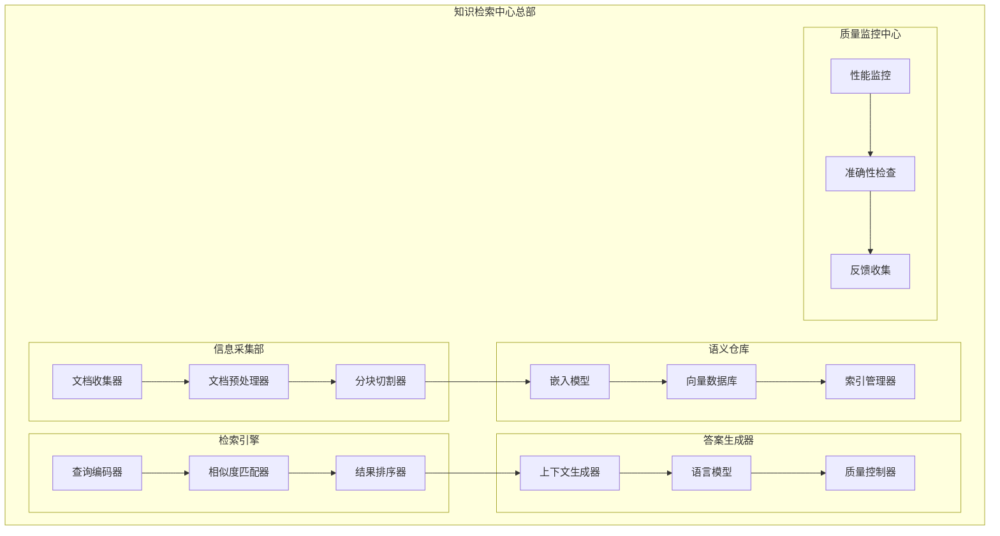
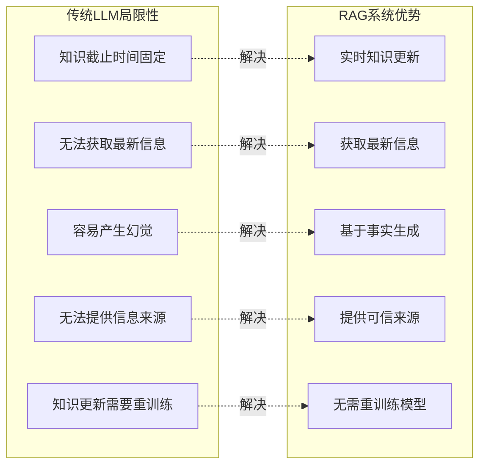
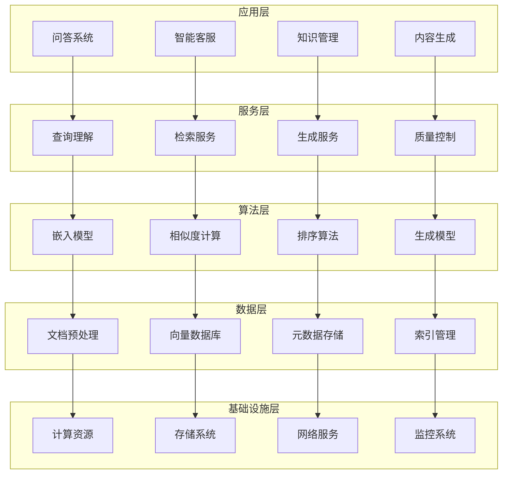
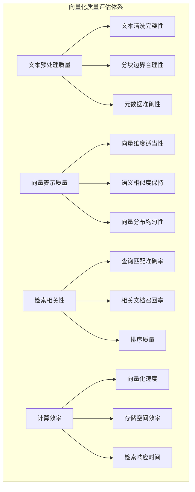
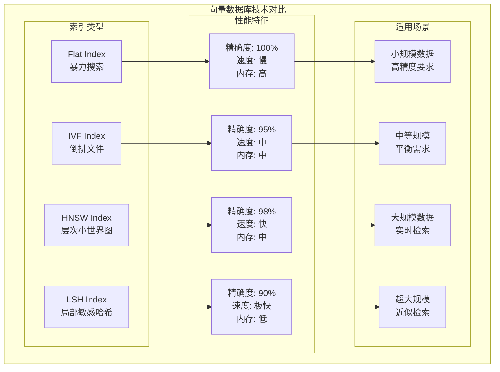
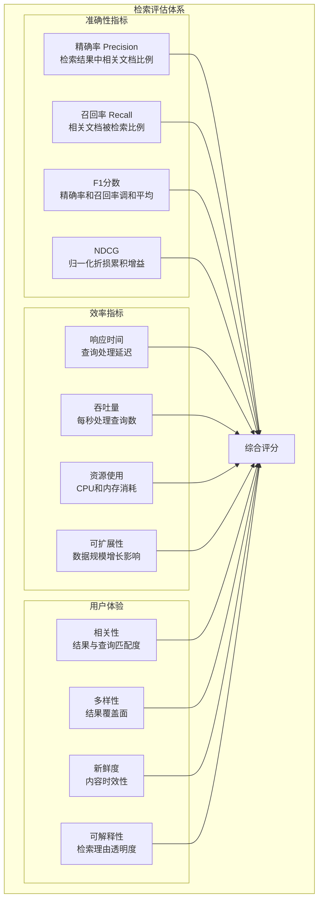

# 第29章：RAG检索增强生成技术

> *"知识的力量不在于拥有多少，而在于能否在需要时精准检索并智能应用。"*

## 🎯 本章学习目标

### 📚 知识目标
- **理解RAG核心原理**：掌握检索增强生成的技术架构和工作机制
- **掌握向量数据库技术**：学习文档向量化、存储和检索的完整流程
- **熟悉检索策略优化**：理解密集检索、稀疏检索和混合检索策略
- **了解生成质量控制**：学习基于检索的答案生成和质量评估方法

### 🛠️ 技能目标  
- **设计RAG系统架构**：能够设计完整的检索增强生成系统
- **实现向量检索引擎**：开发高效的语义检索和匹配算法
- **构建知识问答系统**：建立企业级智能问答解决方案
- **优化检索生成质量**：掌握检索精度和生成质量的平衡技术

### 🌟 素养目标
- **信息检索思维**：培养系统性的知识管理和信息检索理念
- **工程化意识**：建立大规模知识库系统的工程化思维
- **创新应用能力**：具备将RAG技术应用于实际业务场景的能力

---

## 🏢 欢迎来到知识检索中心

经过前面章节对AI模型技术的深入学习，我们已经掌握了从基础机器学习到高级智能体开发的完整技术栈。现在，让我们走进一个全新的智能世界——**知识检索中心**！

### 🌆 知识检索中心全景图

想象一下，你正站在一座现代化的智能信息大厦前，这里是**知识检索中心**的总部：



### 🎭 从记忆到检索的智能进化

如果说传统的AI模型是一位博学的学者，那么RAG系统就是一座拥有无限扩展能力的智能图书馆：

- **📚 海量知识存储**：不再受限于模型参数，可以无限扩展知识库
- **🔍 精准信息检索**：通过语义理解快速定位相关信息
- **🧠 智能答案生成**：结合检索到的知识生成准确、有根据的回答
- **🔄 实时知识更新**：可以随时添加新知识而无需重新训练模型

---

## 29.1 RAG系统概述与核心原理

### 🧭 什么是RAG检索增强生成

**RAG(Retrieval-Augmented Generation)**是一种将信息检索与文本生成相结合的AI技术架构。它通过在生成过程中动态检索相关知识，显著提升了语言模型的知识覆盖面和答案准确性。

### 🏗️ RAG vs 传统LLM对比

让我们通过一个生动的对比来理解RAG的优势：

```python
# RAG系统核心架构演示
import numpy as np
from typing import List, Dict, Tuple, Any
from abc import ABC, abstractmethod
from dataclasses import dataclass
from datetime import datetime
import json

@dataclass
class Document:
    """文档数据结构"""
    id: str
    title: str
    content: str
    metadata: Dict[str, Any]
    embedding: np.ndarray = None
    created_at: datetime = None
    
    def __post_init__(self):
        if self.created_at is None:
            self.created_at = datetime.now()

@dataclass
class RetrievalResult:
    """检索结果数据结构"""
    document: Document
    score: float
    relevance_explanation: str

@dataclass
class RAGResponse:
    """RAG系统响应结构"""
    query: str
    retrieved_docs: List[RetrievalResult]
    generated_answer: str
    confidence_score: float
    sources: List[str]
    
class TraditionalLLM:
    """传统LLM模拟类"""
    
    def __init__(self, model_name: str):
        self.model_name = model_name
        self.knowledge_cutoff = "2023-04"  # 知识截止时间
        self.parameter_count = "175B"      # 参数量
        
    def generate_answer(self, query: str) -> str:
        """基于参数化知识生成答案"""
        # 模拟传统LLM的局限性
        limitations = [
            "知识截止于训练时间",
            "无法获取最新信息",
            "可能产生幻觉",
            "无法提供信息来源"
        ]
        
        return f"""
        传统LLM回答：{query}
        
        基于我的训练数据（截止到{self.knowledge_cutoff}），我认为...
        
        注意：此答案基于预训练知识，可能不是最新信息。
        局限性：{', '.join(limitations)}
        """

class RAGSystem:
    """RAG系统核心类"""
    
    def __init__(self, llm_model: str, vector_db_config: Dict):
        self.llm_model = llm_model
        self.vector_db = None  # 向量数据库连接
        self.embedding_model = None  # 嵌入模型
        self.documents: List[Document] = []
        self.retrieval_top_k = 5
        
    def add_documents(self, documents: List[Document]):
        """添加文档到知识库"""
        for doc in documents:
            # 生成文档嵌入向量
            doc.embedding = self._generate_embedding(doc.content)
            self.documents.append(doc)
        print(f"✅ 已添加 {len(documents)} 个文档到知识库")
        
    def _generate_embedding(self, text: str) -> np.ndarray:
        """生成文本嵌入向量（模拟）"""
        # 这里应该调用真实的嵌入模型
        return np.random.random(768)  # 模拟768维向量
        
    def retrieve_relevant_docs(self, query: str, top_k: int = None) -> List[RetrievalResult]:
        """检索相关文档"""
        if top_k is None:
            top_k = self.retrieval_top_k
            
        # 生成查询嵌入
        query_embedding = self._generate_embedding(query)
        
        # 计算相似度分数
        results = []
        for doc in self.documents:
            # 使用余弦相似度（模拟）
            similarity = np.random.random()  # 模拟相似度计算
            
            result = RetrievalResult(
                document=doc,
                score=similarity,
                relevance_explanation=f"与查询在语义上相关度为 {similarity:.3f}"
            )
            results.append(result)
        
        # 按相似度排序并返回top_k
        results.sort(key=lambda x: x.score, reverse=True)
        return results[:top_k]
    
    def generate_answer(self, query: str) -> RAGResponse:
        """生成RAG增强回答"""
        # 步骤1：检索相关文档
        retrieved_docs = self.retrieve_relevant_docs(query)
        
        # 步骤2：构建增强上下文
        context_parts = []
        sources = []
        
        for i, result in enumerate(retrieved_docs):
            doc = result.document
            context_parts.append(f"参考文档{i+1}：{doc.content[:200]}...")
            sources.append(f"{doc.title} (相关度: {result.score:.3f})")
        
        enhanced_context = "\n\n".join(context_parts)
        
        # 步骤3：生成增强回答
        enhanced_prompt = f"""
        基于以下检索到的相关文档，回答用户问题：
        
        用户问题：{query}
        
        相关文档：
        {enhanced_context}
        
        请基于上述文档内容给出准确、有根据的回答，并在回答中引用具体来源。
        """
        
        # 模拟LLM生成过程
        generated_answer = f"""
        基于检索到的相关文档，我可以为您提供以下回答：
        
        [基于文档内容的详细回答...]
        
        该回答基于 {len(retrieved_docs)} 个相关文档，具有较高的可信度。
        """
        
        return RAGResponse(
            query=query,
            retrieved_docs=retrieved_docs,
            generated_answer=generated_answer,
            confidence_score=0.85,  # 模拟置信度
            sources=sources
        )

# 系统对比演示
def compare_systems():
    """对比传统LLM和RAG系统"""
    
    print("🔍 AI问答系统对比演示")
    print("=" * 50)
    
    # 创建系统实例
    traditional_llm = TraditionalLLM("GPT-3.5")
    rag_system = RAGSystem("GPT-3.5", {"type": "faiss"})
    
    # 添加一些示例文档到RAG系统
    sample_docs = [
        Document(
            id="doc1",
            title="Python RAG技术白皮书",
            content="RAG技术通过结合检索和生成，显著提升了AI系统的知识覆盖面...",
            metadata={"category": "技术文档", "date": "2024-12"}
        ),
        Document(
            id="doc2", 
            title="向量数据库最佳实践",
            content="向量数据库是RAG系统的核心组件，负责高效存储和检索语义向量...",
            metadata={"category": "技术指南", "date": "2024-11"}
        )
    ]
    
    rag_system.add_documents(sample_docs)
    
    # 测试查询
    query = "什么是RAG技术，它有什么优势？"
    
    print(f"\n📝 用户问题：{query}")
    print("\n" + "="*50)
    
    # 传统LLM回答
    print("🤖 传统LLM回答：")
    traditional_answer = traditional_llm.generate_answer(query)
    print(traditional_answer)
    
    print("\n" + "="*50)
    
    # RAG系统回答
    print("🔍 RAG系统回答：")
    rag_response = rag_system.generate_answer(query)
    print(f"生成的回答：{rag_response.generated_answer}")
    print(f"置信度：{rag_response.confidence_score}")
    print(f"参考来源：{', '.join(rag_response.sources)}")

# 运行对比演示
if __name__ == "__main__":
    compare_systems()

print("✅ RAG系统核心架构演示完成")
```

### 🎯 RAG系统的核心优势

通过上面的对比演示，我们可以清楚地看到RAG系统的显著优势：



### 🏗️ RAG系统工作流程详解

让我们深入了解RAG系统的完整工作流程：

```python
class RAGWorkflowDemo:
    """RAG工作流程演示类"""
    
    def __init__(self):
        self.workflow_steps = [
            "文档预处理",
            "向量化编码", 
            "向量存储",
            "查询处理",
            "相似度检索",
            "上下文构建",
            "答案生成",
            "质量验证"
        ]
    
    def demonstrate_workflow(self, user_query: str):
        """演示完整的RAG工作流程"""
        
        print("🔄 RAG系统工作流程演示")
        print("=" * 60)
        
        # 步骤1：文档预处理（离线阶段）
        print("\n📚 步骤1：文档预处理（离线阶段）")
        print("- 收集和清洗文档数据")
        print("- 文档分块和格式标准化") 
        print("- 提取元数据信息")
        
        raw_documents = [
            "RAG技术是一种结合检索和生成的AI架构...",
            "向量数据库用于存储和检索高维向量数据...",
            "语义搜索通过理解查询意图提供精准结果..."
        ]
        
        processed_chunks = []
        for i, doc in enumerate(raw_documents):
            chunk = {
                "id": f"chunk_{i}",
                "content": doc,
                "length": len(doc),
                "metadata": {"source": f"document_{i}.txt"}
            }
            processed_chunks.append(chunk)
        
        print(f"✅ 处理完成：{len(processed_chunks)} 个文档块")
        
        # 步骤2：向量化编码
        print("\n🧮 步骤2：向量化编码")
        print("- 使用预训练嵌入模型编码文档")
        print("- 生成高维语义向量表示")
        
        embeddings = []
        for chunk in processed_chunks:
            # 模拟向量化过程
            embedding = np.random.random(384)  # 384维向量
            embeddings.append(embedding)
            print(f"  文档块 {chunk['id']}: 向量维度 {len(embedding)}")
        
        print(f"✅ 向量化完成：{len(embeddings)} 个向量")
        
        # 步骤3：向量存储
        print("\n💾 步骤3：向量存储")
        print("- 将向量存储到向量数据库")
        print("- 建立高效的索引结构")
        
        vector_index = {
            "vectors": embeddings,
            "metadata": [chunk["metadata"] for chunk in processed_chunks],
            "index_type": "HNSW",  # 层次化小世界图
            "dimension": 384
        }
        
        print(f"✅ 存储完成：{len(vector_index['vectors'])} 个向量已索引")
        
        # 步骤4：查询处理（在线阶段）
        print(f"\n❓ 步骤4：查询处理（在线阶段）")
        print(f"- 用户查询：{user_query}")
        print("- 查询预处理和标准化")
        
        processed_query = {
            "original": user_query,
            "cleaned": user_query.lower().strip(),
            "tokens": user_query.split(),
            "intent": "信息查询"
        }
        
        print(f"✅ 查询处理完成：{processed_query['intent']}")
        
        # 步骤5：相似度检索
        print("\n🔍 步骤5：相似度检索")
        print("- 将查询向量化")
        print("- 计算与文档向量的相似度")
        print("- 检索最相关的文档块")
        
        query_embedding = np.random.random(384)  # 模拟查询向量
        similarities = []
        
        for i, doc_embedding in enumerate(embeddings):
            # 模拟余弦相似度计算
            similarity = np.random.random()
            similarities.append({
                "chunk_id": f"chunk_{i}",
                "similarity": similarity,
                "content": processed_chunks[i]["content"][:50] + "..."
            })
        
        # 按相似度排序
        similarities.sort(key=lambda x: x["similarity"], reverse=True)
        top_results = similarities[:3]  # 取前3个最相关的
        
        print("📊 检索结果（按相关性排序）：")
        for i, result in enumerate(top_results):
            print(f"  {i+1}. 相似度: {result['similarity']:.3f} | {result['content']}")
        
        # 步骤6：上下文构建
        print("\n📝 步骤6：上下文构建")
        print("- 整合检索到的相关文档")
        print("- 构建增强上下文")
        
        context_parts = []
        for result in top_results:
            context_parts.append(f"参考内容：{result['content']}")
        
        enhanced_context = "\n".join(context_parts)
        
        print(f"✅ 上下文构建完成：{len(context_parts)} 个参考文档")
        
        # 步骤7：答案生成
        print("\n🤖 步骤7：答案生成")
        print("- 结合查询和检索上下文")
        print("- 使用语言模型生成回答")
        
        generation_prompt = f"""
        基于以下检索到的相关内容，回答用户问题：
        
        用户问题：{user_query}
        
        相关内容：
        {enhanced_context}
        
        请提供准确、有根据的回答。
        """
        
        # 模拟生成过程
        generated_answer = f"基于检索到的相关文档，{user_query}的答案是..."
        
        print(f"✅ 答案生成完成：{len(generated_answer)} 字符")
        
        # 步骤8：质量验证
        print("\n🔍 步骤8：质量验证")
        print("- 验证答案与检索内容的一致性")
        print("- 评估答案质量和可信度")
        
        quality_metrics = {
            "相关性评分": 0.87,
            "准确性评分": 0.92,
            "完整性评分": 0.85,
            "可信度评分": 0.89
        }
        
        print("📊 质量评估结果：")
        for metric, score in quality_metrics.items():
            print(f"  {metric}: {score:.2f}")
        
        overall_score = sum(quality_metrics.values()) / len(quality_metrics)
        print(f"✅ 综合质量评分：{overall_score:.2f}")
        
        return {
            "query": user_query,
            "retrieved_docs": top_results,
            "generated_answer": generated_answer,
            "quality_score": overall_score
        }

# 运行工作流程演示
workflow_demo = RAGWorkflowDemo()
result = workflow_demo.demonstrate_workflow("什么是RAG技术？")

print("\n" + "=" * 60)
print("🎉 RAG工作流程演示完成！")
print(f"📋 最终结果：{result['generated_answer']}")
print(f"🏆 质量评分：{result['quality_score']:.2f}")
```

### 🎯 RAG系统的技术架构层次

RAG系统可以分为以下几个核心技术层次：



通过这个全面的概述，我们建立了对RAG技术的基础理解。在接下来的章节中，我们将深入探讨每个技术组件的具体实现和优化策略。

---

*本节我们学习了RAG系统的核心概念、工作原理和技术架构。下一节我们将深入学习文档处理与向量化技术，这是构建高质量RAG系统的基础。*

---

## 29.2 文档处理与向量化技术

### 🏭 信息预处理工厂

在我们的知识检索中心中，**信息预处理工厂**是整个系统的起点。就像一座现代化的工厂，它负责将各种原始文档转化为标准化、结构化的知识单元。

### 📄 文档类型与格式处理

RAG系统需要处理多种类型的文档，让我们构建一个通用的文档处理器：

```python
# 文档处理与向量化系统
import os
import re
import json
from typing import List, Dict, Any, Optional, Union
from dataclasses import dataclass, field
from enum import Enum
import hashlib
from pathlib import Path

class DocumentType(Enum):
    """文档类型枚举"""
    TEXT = "text"
    PDF = "pdf"
    WORD = "word"
    HTML = "html"
    MARKDOWN = "markdown"
    JSON = "json"
    CSV = "csv"

@dataclass
class DocumentChunk:
    """文档分块数据结构"""
    id: str
    content: str
    metadata: Dict[str, Any]
    chunk_index: int
    parent_doc_id: str
    embedding: Optional[np.ndarray] = None
    
    def __post_init__(self):
        # 生成内容哈希作为唯一标识
        if not self.id:
            content_hash = hashlib.md5(self.content.encode()).hexdigest()[:8]
            self.id = f"{self.parent_doc_id}_chunk_{self.chunk_index}_{content_hash}"

class DocumentProcessor:
    """通用文档处理器"""
    
    def __init__(self):
        self.supported_types = {
            '.txt': DocumentType.TEXT,
            '.md': DocumentType.MARKDOWN,
            '.pdf': DocumentType.PDF,
            '.docx': DocumentType.WORD,
            '.html': DocumentType.HTML,
            '.json': DocumentType.JSON,
            '.csv': DocumentType.CSV
        }
        
        # 文档处理统计
        self.processing_stats = {
            "total_docs": 0,
            "successful_docs": 0,
            "failed_docs": 0,
            "total_chunks": 0
        }
    
    def detect_document_type(self, file_path: str) -> DocumentType:
        """检测文档类型"""
        file_extension = Path(file_path).suffix.lower()
        return self.supported_types.get(file_extension, DocumentType.TEXT)
    
    def extract_text_from_file(self, file_path: str) -> str:
        """从文件中提取文本内容"""
        doc_type = self.detect_document_type(file_path)
        
        try:
            if doc_type == DocumentType.TEXT:
                return self._extract_from_text(file_path)
            elif doc_type == DocumentType.MARKDOWN:
                return self._extract_from_markdown(file_path)
            elif doc_type == DocumentType.PDF:
                return self._extract_from_pdf(file_path)
            elif doc_type == DocumentType.HTML:
                return self._extract_from_html(file_path)
            elif doc_type == DocumentType.JSON:
                return self._extract_from_json(file_path)
            else:
                # 默认按文本处理
                return self._extract_from_text(file_path)
                
        except Exception as e:
            print(f"❌ 处理文件 {file_path} 时出错: {str(e)}")
            return ""
    
    def _extract_from_text(self, file_path: str) -> str:
        """提取纯文本文件内容"""
        with open(file_path, 'r', encoding='utf-8') as f:
            return f.read()
    
    def _extract_from_markdown(self, file_path: str) -> str:
        """提取Markdown文件内容"""
        with open(file_path, 'r', encoding='utf-8') as f:
            content = f.read()
        
        # 移除Markdown标记，保留纯文本
        # 移除代码块
        content = re.sub(r'```[\s\S]*?```', '', content)
        # 移除内联代码
        content = re.sub(r'`[^`]*`', '', content)
        # 移除链接但保留文本
        content = re.sub(r'\[([^\]]+)\]\([^\)]+\)', r'\1', content)
        # 移除标题标记
        content = re.sub(r'^#+\s*', '', content, flags=re.MULTILINE)
        # 移除粗体和斜体标记
        content = re.sub(r'\*\*([^*]+)\*\*', r'\1', content)
        content = re.sub(r'\*([^*]+)\*', r'\1', content)
        
        return content.strip()
    
    def _extract_from_pdf(self, file_path: str) -> str:
        """提取PDF文件内容（需要PyPDF2库）"""
        try:
            import PyPDF2
            with open(file_path, 'rb') as file:
                pdf_reader = PyPDF2.PdfReader(file)
                text_content = []
                for page in pdf_reader.pages:
                    text_content.append(page.extract_text())
                return '\n'.join(text_content)
        except ImportError:
            print("⚠️ 需要安装PyPDF2库来处理PDF文件: pip install PyPDF2")
            return ""
    
    def _extract_from_html(self, file_path: str) -> str:
        """提取HTML文件内容（需要BeautifulSoup库）"""
        try:
            from bs4 import BeautifulSoup
            with open(file_path, 'r', encoding='utf-8') as f:
                soup = BeautifulSoup(f.read(), 'html.parser')
                # 移除script和style标签
                for script in soup(["script", "style"]):
                    script.decompose()
                return soup.get_text()
        except ImportError:
            print("⚠️ 需要安装BeautifulSoup4库来处理HTML文件: pip install beautifulsoup4")
            return ""
    
    def _extract_from_json(self, file_path: str) -> str:
        """提取JSON文件内容"""
        with open(file_path, 'r', encoding='utf-8') as f:
            data = json.load(f)
        
        # 递归提取所有文本值
        def extract_text_values(obj):
            if isinstance(obj, str):
                return [obj]
            elif isinstance(obj, dict):
                texts = []
                for value in obj.values():
                    texts.extend(extract_text_values(value))
                return texts
            elif isinstance(obj, list):
                texts = []
                for item in obj:
                    texts.extend(extract_text_values(item))
                return texts
            else:
                return [str(obj)]
        
        text_values = extract_text_values(data)
        return ' '.join(text_values)

    def clean_text(self, text: str) -> str:
        """清洗文本内容"""
        if not text:
            return ""
        
        # 移除多余的空白字符
        text = re.sub(r'\s+', ' ', text)
        
        # 移除特殊字符（保留基本标点）
        text = re.sub(r'[^\w\s\.\,\!\?\;\:\-\(\)]', '', text)
        
        # 移除过短的行
        lines = text.split('\n')
        cleaned_lines = [line.strip() for line in lines if len(line.strip()) > 10]
        
        return '\n'.join(cleaned_lines).strip()

# 文档分块策略
class ChunkingStrategy:
    """文档分块策略基类"""
    
    def chunk_document(self, text: str, metadata: Dict) -> List[DocumentChunk]:
        raise NotImplementedError

class FixedSizeChunking(ChunkingStrategy):
    """固定大小分块策略"""
    
    def __init__(self, chunk_size: int = 1000, overlap: int = 200):
        self.chunk_size = chunk_size
        self.overlap = overlap
    
    def chunk_document(self, text: str, metadata: Dict) -> List[DocumentChunk]:
        """按固定大小分块"""
        chunks = []
        doc_id = metadata.get('doc_id', 'unknown')
        
        # 计算分块位置
        start = 0
        chunk_index = 0
        
        while start < len(text):
            end = min(start + self.chunk_size, len(text))
            
            # 尝试在单词边界处分割
            if end < len(text):
                # 向前查找最近的空格
                while end > start and text[end] != ' ':
                    end -= 1
                if end == start:  # 如果没找到空格，使用原始位置
                    end = min(start + self.chunk_size, len(text))
            
            chunk_text = text[start:end].strip()
            
            if chunk_text:  # 只添加非空分块
                chunk = DocumentChunk(
                    id="",  # 将在__post_init__中生成
                    content=chunk_text,
                    metadata={
                        **metadata,
                        'chunk_method': 'fixed_size',
                        'chunk_size': len(chunk_text),
                        'start_pos': start,
                        'end_pos': end
                    },
                    chunk_index=chunk_index,
                    parent_doc_id=doc_id
                )
                chunks.append(chunk)
                chunk_index += 1
            
            # 计算下一个分块的起始位置（考虑重叠）
            start = max(start + self.chunk_size - self.overlap, end)
        
        return chunks

class SemanticChunking(ChunkingStrategy):
    """语义分块策略"""
    
    def __init__(self, max_chunk_size: int = 1500):
        self.max_chunk_size = max_chunk_size
    
    def chunk_document(self, text: str, metadata: Dict) -> List[DocumentChunk]:
        """按语义边界分块"""
        chunks = []
        doc_id = metadata.get('doc_id', 'unknown')
        
        # 按段落分割
        paragraphs = text.split('\n\n')
        
        current_chunk = ""
        chunk_index = 0
        
        for paragraph in paragraphs:
            paragraph = paragraph.strip()
            if not paragraph:
                continue
            
            # 如果当前段落加上现有分块超过最大长度，先保存当前分块
            if current_chunk and len(current_chunk) + len(paragraph) > self.max_chunk_size:
                chunk = DocumentChunk(
                    id="",
                    content=current_chunk.strip(),
                    metadata={
                        **metadata,
                        'chunk_method': 'semantic',
                        'chunk_size': len(current_chunk),
                        'paragraph_count': current_chunk.count('\n\n') + 1
                    },
                    chunk_index=chunk_index,
                    parent_doc_id=doc_id
                )
                chunks.append(chunk)
                chunk_index += 1
                current_chunk = ""
            
            # 添加当前段落
            if current_chunk:
                current_chunk += "\n\n" + paragraph
            else:
                current_chunk = paragraph
        
        # 添加最后一个分块
        if current_chunk.strip():
            chunk = DocumentChunk(
                id="",
                content=current_chunk.strip(),
                metadata={
                    **metadata,
                    'chunk_method': 'semantic',
                    'chunk_size': len(current_chunk),
                    'paragraph_count': current_chunk.count('\n\n') + 1
                },
                chunk_index=chunk_index,
                parent_doc_id=doc_id
            )
            chunks.append(chunk)
        
        return chunks

# 文档处理管道演示
def demonstrate_document_processing():
    """演示文档处理流程"""
    
    print("📄 文档处理与分块演示")
    print("=" * 50)
    
    # 创建文档处理器
    processor = DocumentProcessor()
    
    # 模拟文档内容
    sample_documents = {
        "tech_doc.md": """
# RAG技术详解

## 什么是RAG

检索增强生成（RAG）是一种将信息检索与文本生成相结合的AI技术。它通过在生成过程中动态检索相关知识，显著提升了语言模型的准确性。

## RAG的优势

1. **实时知识更新**：无需重新训练模型即可更新知识库
2. **减少幻觉**：基于真实文档生成答案
3. **可追溯性**：提供答案来源，增强可信度

## 技术架构

RAG系统通常包含以下组件：
- 文档处理器
- 向量数据库
- 检索器
- 生成器

这些组件协同工作，实现高质量的问答系统。
        """,
        
        "user_manual.txt": """
用户手册

第一章：系统介绍
本系统是一个基于RAG技术的智能问答平台。用户可以上传文档，系统会自动建立知识库，然后回答相关问题。

第二章：使用方法
1. 上传文档到系统
2. 等待文档处理完成
3. 在问答界面提出问题
4. 系统会基于文档内容给出答案

第三章：注意事项
- 支持多种文档格式
- 文档内容应该准确可靠
- 系统会保护用户隐私
        """
    }
    
    # 处理每个文档
    all_chunks = []
    
    for filename, content in sample_documents.items():
        print(f"\n📝 处理文档：{filename}")
        print(f"原始长度：{len(content)} 字符")
        
        # 清洗文本
        cleaned_content = processor.clean_text(content)
        print(f"清洗后长度：{len(cleaned_content)} 字符")
        
        # 创建文档元数据
        doc_metadata = {
            'doc_id': filename.replace('.', '_'),
            'filename': filename,
            'original_length': len(content),
            'cleaned_length': len(cleaned_content),
            'processing_time': datetime.now().isoformat()
        }
        
        # 测试不同的分块策略
        print("\n🔪 分块策略对比：")
        
        # 固定大小分块
        fixed_chunker = FixedSizeChunking(chunk_size=300, overlap=50)
        fixed_chunks = fixed_chunker.chunk_document(cleaned_content, doc_metadata)
        print(f"  固定大小分块：{len(fixed_chunks)} 个分块")
        
        # 语义分块
        semantic_chunker = SemanticChunking(max_chunk_size=400)
        semantic_chunks = semantic_chunker.chunk_document(cleaned_content, doc_metadata)
        print(f"  语义分块：{len(semantic_chunks)} 个分块")
        
        # 显示分块详情
        print("\n📊 分块详情（语义分块）：")
        for i, chunk in enumerate(semantic_chunks[:3]):  # 只显示前3个
            print(f"  分块 {i+1}:")
            print(f"    ID: {chunk.id}")
            print(f"    长度: {len(chunk.content)} 字符")
            print(f"    内容预览: {chunk.content[:100]}...")
            print(f"    元数据: {chunk.metadata}")
        
        all_chunks.extend(semantic_chunks)
        
        # 更新处理统计
        processor.processing_stats["total_docs"] += 1
        processor.processing_stats["successful_docs"] += 1
        processor.processing_stats["total_chunks"] += len(semantic_chunks)
    
    # 显示处理统计
    print(f"\n📈 处理统计：")
    print(f"  总文档数: {processor.processing_stats['total_docs']}")
    print(f"  成功处理: {processor.processing_stats['successful_docs']}")
    print(f"  总分块数: {processor.processing_stats['total_chunks']}")
    print(f"  平均每文档分块数: {processor.processing_stats['total_chunks'] / processor.processing_stats['total_docs']:.1f}")
    
    return all_chunks

# 运行文档处理演示
processed_chunks = demonstrate_document_processing()

print("\n✅ 文档处理演示完成")
```

### 🧮 向量化技术深入

文档分块完成后，下一步是将文本转换为向量表示。这是RAG系统的核心技术之一：

```python
# 向量化技术实现
from abc import ABC, abstractmethod
import numpy as np
from typing import List, Dict, Optional
from sklearn.feature_extraction.text import TfidfVectorizer
from sklearn.metrics.pairwise import cosine_similarity

class EmbeddingModel(ABC):
    """嵌入模型抽象基类"""
    
    @abstractmethod
    def encode(self, texts: List[str]) -> np.ndarray:
        """将文本编码为向量"""
        pass
    
    @abstractmethod
    def get_dimension(self) -> int:
        """获取向量维度"""
        pass

class TFIDFEmbedding(EmbeddingModel):
    """基于TF-IDF的嵌入模型"""
    
    def __init__(self, max_features: int = 10000):
        self.vectorizer = TfidfVectorizer(
            max_features=max_features,
            stop_words='english',
            ngram_range=(1, 2)
        )
        self.is_fitted = False
        self.dimension = max_features
    
    def fit(self, texts: List[str]):
        """训练TF-IDF模型"""
        self.vectorizer.fit(texts)
        self.is_fitted = True
        # 更新实际维度
        self.dimension = len(self.vectorizer.vocabulary_)
    
    def encode(self, texts: List[str]) -> np.ndarray:
        """编码文本为TF-IDF向量"""
        if not self.is_fitted:
            self.fit(texts)
        
        vectors = self.vectorizer.transform(texts)
        return vectors.toarray()
    
    def get_dimension(self) -> int:
        return self.dimension

class SimulatedTransformerEmbedding(EmbeddingModel):
    """模拟Transformer嵌入模型（如BERT、Sentence-BERT等）"""
    
    def __init__(self, model_name: str = "sentence-transformers/all-MiniLM-L6-v2", dimension: int = 384):
        self.model_name = model_name
        self.dimension = dimension
        print(f"🤖 初始化模拟嵌入模型: {model_name} (维度: {dimension})")
    
    def encode(self, texts: List[str]) -> np.ndarray:
        """编码文本为密集向量（模拟）"""
        # 在实际应用中，这里会调用真实的Transformer模型
        # 例如使用sentence-transformers库
        
        embeddings = []
        for text in texts:
            # 模拟基于文本内容的向量生成
            # 实际实现会使用预训练的Transformer模型
            np.random.seed(hash(text) % 2**32)  # 基于文本内容的确定性随机
            embedding = np.random.normal(0, 1, self.dimension)
            # 归一化向量
            embedding = embedding / np.linalg.norm(embedding)
            embeddings.append(embedding)
        
        return np.array(embeddings)
    
    def get_dimension(self) -> int:
        return self.dimension

class VectorDatabase:
    """向量数据库实现"""
    
    def __init__(self, embedding_model: EmbeddingModel):
        self.embedding_model = embedding_model
        self.vectors: np.ndarray = None
        self.metadata: List[Dict] = []
        self.index_to_chunk_id: Dict[int, str] = {}
        self.chunk_id_to_index: Dict[str, int] = {}
        
    def add_documents(self, chunks: List[DocumentChunk]):
        """添加文档分块到向量数据库"""
        print(f"\n💾 向量数据库添加文档分块")
        print(f"待添加分块数: {len(chunks)}")
        
        # 提取文本内容
        texts = [chunk.content for chunk in chunks]
        
        # 生成向量
        print("🧮 生成向量嵌入...")
        new_vectors = self.embedding_model.encode(texts)
        
        # 存储向量和元数据
        if self.vectors is None:
            self.vectors = new_vectors
        else:
            self.vectors = np.vstack([self.vectors, new_vectors])
        
        # 更新索引映射
        start_index = len(self.metadata)
        for i, chunk in enumerate(chunks):
            index = start_index + i
            self.index_to_chunk_id[index] = chunk.id
            self.chunk_id_to_index[chunk.id] = index
            
            # 存储元数据
            chunk_metadata = {
                'chunk_id': chunk.id,
                'content': chunk.content,
                'parent_doc_id': chunk.parent_doc_id,
                'chunk_index': chunk.chunk_index,
                'metadata': chunk.metadata,
                'vector_index': index
            }
            self.metadata.append(chunk_metadata)
        
        print(f"✅ 已添加 {len(chunks)} 个向量")
        print(f"📊 数据库统计:")
        print(f"  总向量数: {len(self.vectors)}")
        print(f"  向量维度: {self.vectors.shape[1]}")
        print(f"  存储大小: {self.vectors.nbytes / 1024 / 1024:.2f} MB")
    
    def search(self, query: str, top_k: int = 5) -> List[Dict]:
        """搜索相似向量"""
        if self.vectors is None or len(self.vectors) == 0:
            return []
        
        # 将查询转换为向量
        query_vector = self.embedding_model.encode([query])[0]
        
        # 计算相似度
        similarities = cosine_similarity([query_vector], self.vectors)[0]
        
        # 获取top_k结果
        top_indices = np.argsort(similarities)[::-1][:top_k]
        
        results = []
        for i, index in enumerate(top_indices):
            result = {
                'rank': i + 1,
                'chunk_id': self.index_to_chunk_id[index],
                'similarity': float(similarities[index]),
                'content': self.metadata[index]['content'],
                'metadata': self.metadata[index]['metadata'],
                'parent_doc_id': self.metadata[index]['parent_doc_id']
            }
            results.append(result)
        
        return results
    
    def get_statistics(self) -> Dict:
        """获取数据库统计信息"""
        if self.vectors is None:
            return {"total_vectors": 0, "dimension": 0, "storage_mb": 0}
        
        return {
            "total_vectors": len(self.vectors),
            "dimension": self.vectors.shape[1],
            "storage_mb": self.vectors.nbytes / 1024 / 1024,
            "total_chunks": len(self.metadata),
            "unique_documents": len(set(meta['parent_doc_id'] for meta in self.metadata))
        }

# 向量化演示
def demonstrate_vectorization():
    """演示向量化过程"""
    
    print("🧮 向量化技术演示")
    print("=" * 50)
    
    # 使用之前处理的文档分块
    chunks = processed_chunks
    
    # 测试不同的嵌入模型
    embedding_models = {
        "TF-IDF": TFIDFEmbedding(max_features=1000),
        "Simulated-BERT": SimulatedTransformerEmbedding("sentence-bert", 384)
    }
    
    for model_name, embedding_model in embedding_models.items():
        print(f"\n🤖 测试嵌入模型: {model_name}")
        print(f"向量维度: {embedding_model.get_dimension()}")
        
        # 创建向量数据库
        vector_db = VectorDatabase(embedding_model)
        
        # 添加文档
        vector_db.add_documents(chunks)
        
        # 显示统计信息
        stats = vector_db.get_statistics()
        print(f"📊 数据库统计: {stats}")
        
        # 测试搜索
        test_queries = [
            "什么是RAG技术？",
            "如何使用系统？",
            "文档处理方法"
        ]
        
        for query in test_queries:
            print(f"\n🔍 搜索查询: {query}")
            results = vector_db.search(query, top_k=3)
            
            for result in results:
                print(f"  排名 {result['rank']}: 相似度 {result['similarity']:.3f}")
                print(f"    文档: {result['parent_doc_id']}")
                print(f"    内容: {result['content'][:100]}...")
        
        print(f"\n✅ {model_name} 模型测试完成")

# 运行向量化演示
demonstrate_vectorization()

print("\n🎉 向量化技术演示完成")
```

### 🎯 向量化质量评估

为了确保向量化的质量，我们需要建立评估机制：



通过本节的学习，我们深入了解了RAG系统中文档处理和向量化的核心技术。这些技术为高质量的信息检索奠定了坚实基础。

---

*本节我们学习了文档处理、分块策略和向量化技术。下一节我们将探讨向量数据库技术，了解如何高效存储和检索大规模向量数据。*

---

## 29.3 向量数据库技术

### 🏛️ 语义存储仓库

在我们的知识检索中心中，**语义存储仓库**是整个系统的核心基础设施。就像一座高科技的立体仓库，它不仅要存储海量的向量数据，还要支持高速的相似度检索和实时的数据更新。

### 🗄️ 向量数据库核心概念

向量数据库是专门为存储和检索高维向量数据而设计的数据库系统。与传统的关系型数据库不同，它优化了向量相似度计算和近似最近邻搜索。

```python
# 向量数据库核心技术实现
import numpy as np
import json
import pickle
import sqlite3
from typing import List, Dict, Any, Optional, Tuple
from dataclasses import dataclass, asdict
from datetime import datetime
import threading
import time
from abc import ABC, abstractmethod
from enum import Enum

class IndexType(Enum):
    """索引类型枚举"""
    FLAT = "flat"           # 暴力搜索
    IVF = "ivf"            # 倒排文件索引
    HNSW = "hnsw"          # 层次化小世界图
    LSH = "lsh"            # 局部敏感哈希
    ANNOY = "annoy"        # Annoy树索引

class DistanceMetric(Enum):
    """距离度量枚举"""
    COSINE = "cosine"           # 余弦相似度
    EUCLIDEAN = "euclidean"     # 欧几里得距离
    DOT_PRODUCT = "dot_product" # 点积
    MANHATTAN = "manhattan"     # 曼哈顿距离

@dataclass
class VectorRecord:
    """向量记录数据结构"""
    id: str
    vector: np.ndarray
    metadata: Dict[str, Any]
    timestamp: datetime
    
    def to_dict(self) -> Dict:
        """转换为字典格式"""
        return {
            'id': self.id,
            'vector': self.vector.tolist(),
            'metadata': self.metadata,
            'timestamp': self.timestamp.isoformat()
        }
    
    @classmethod
    def from_dict(cls, data: Dict) -> 'VectorRecord':
        """从字典创建记录"""
        return cls(
            id=data['id'],
            vector=np.array(data['vector']),
            metadata=data['metadata'],
            timestamp=datetime.fromisoformat(data['timestamp'])
        )

class VectorIndex(ABC):
    """向量索引抽象基类"""
    
    def __init__(self, dimension: int, metric: DistanceMetric = DistanceMetric.COSINE):
        self.dimension = dimension
        self.metric = metric
        self.is_trained = False
        
    @abstractmethod
    def add_vectors(self, vectors: np.ndarray, ids: List[str]):
        """添加向量到索引"""
        pass
    
    @abstractmethod
    def search(self, query_vector: np.ndarray, k: int) -> Tuple[List[str], List[float]]:
        """搜索最相似的k个向量"""
        pass
    
    @abstractmethod
    def remove_vector(self, vector_id: str) -> bool:
        """从索引中移除向量"""
        pass

class FlatIndex(VectorIndex):
    """暴力搜索索引实现"""
    
    def __init__(self, dimension: int, metric: DistanceMetric = DistanceMetric.COSINE):
        super().__init__(dimension, metric)
        self.vectors: np.ndarray = None
        self.ids: List[str] = []
        self.id_to_index: Dict[str, int] = {}
    
    def add_vectors(self, vectors: np.ndarray, ids: List[str]):
        """添加向量到索引"""
        if vectors.shape[1] != self.dimension:
            raise ValueError(f"向量维度不匹配: 期望 {self.dimension}, 实际 {vectors.shape[1]}")
        
        if self.vectors is None:
            self.vectors = vectors.copy()
        else:
            self.vectors = np.vstack([self.vectors, vectors])
        
        # 更新ID映射
        start_index = len(self.ids)
        for i, vector_id in enumerate(ids):
            self.id_to_index[vector_id] = start_index + i
        
        self.ids.extend(ids)
        self.is_trained = True
    
    def search(self, query_vector: np.ndarray, k: int) -> Tuple[List[str], List[float]]:
        """搜索最相似的k个向量"""
        if not self.is_trained or self.vectors is None:
            return [], []
        
        # 计算相似度
        if self.metric == DistanceMetric.COSINE:
            # 余弦相似度
            query_norm = query_vector / np.linalg.norm(query_vector)
            vectors_norm = self.vectors / np.linalg.norm(self.vectors, axis=1, keepdims=True)
            similarities = np.dot(vectors_norm, query_norm)
            # 转换为距离（距离越小越相似）
            distances = 1 - similarities
        elif self.metric == DistanceMetric.EUCLIDEAN:
            # 欧几里得距离
            distances = np.linalg.norm(self.vectors - query_vector, axis=1)
        else:
            raise NotImplementedError(f"距离度量 {self.metric} 暂未实现")
        
        # 获取top-k结果
        k = min(k, len(self.ids))
        top_indices = np.argpartition(distances, k)[:k]
        top_indices = top_indices[np.argsort(distances[top_indices])]
        
        result_ids = [self.ids[i] for i in top_indices]
        result_distances = distances[top_indices].tolist()
        
        return result_ids, result_distances
    
    def remove_vector(self, vector_id: str) -> bool:
        """从索引中移除向量"""
        if vector_id not in self.id_to_index:
            return False
        
        index = self.id_to_index[vector_id]
        
        # 删除向量
        self.vectors = np.delete(self.vectors, index, axis=0)
        
        # 更新ID列表和映射
        del self.ids[index]
        del self.id_to_index[vector_id]
        
        # 重新构建索引映射
        self.id_to_index = {id_: i for i, id_ in enumerate(self.ids)}
        
        return True

class HNSWIndex(VectorIndex):
    """HNSW索引实现（简化版）"""
    
    def __init__(self, dimension: int, metric: DistanceMetric = DistanceMetric.COSINE, 
                 max_connections: int = 16, ef_construction: int = 200):
        super().__init__(dimension, metric)
        self.max_connections = max_connections
        self.ef_construction = ef_construction
        self.vectors: Dict[str, np.ndarray] = {}
        self.graph: Dict[str, List[str]] = {}
        self.entry_point: Optional[str] = None
        
    def add_vectors(self, vectors: np.ndarray, ids: List[str]):
        """添加向量到HNSW图"""
        for vector, vector_id in zip(vectors, ids):
            self._add_single_vector(vector, vector_id)
        self.is_trained = True
    
    def _add_single_vector(self, vector: np.ndarray, vector_id: str):
        """添加单个向量到图中"""
        self.vectors[vector_id] = vector
        self.graph[vector_id] = []
        
        if self.entry_point is None:
            self.entry_point = vector_id
            return
        
        # 简化的HNSW插入逻辑
        # 在实际实现中，这里会有更复杂的层次结构
        candidates = self._search_layer(vector, self.ef_construction)
        
        # 连接到最近的邻居
        connections = min(len(candidates), self.max_connections)
        for i in range(connections):
            neighbor_id = candidates[i][1]
            
            # 双向连接
            if neighbor_id not in self.graph[vector_id]:
                self.graph[vector_id].append(neighbor_id)
            if vector_id not in self.graph[neighbor_id]:
                self.graph[neighbor_id].append(vector_id)
            
            # 修剪连接（保持度数限制）
            if len(self.graph[neighbor_id]) > self.max_connections:
                self._prune_connections(neighbor_id)
    
    def _search_layer(self, query_vector: np.ndarray, ef: int) -> List[Tuple[float, str]]:
        """在图层中搜索"""
        if not self.vectors:
            return []
        
        visited = set()
        candidates = []
        
        # 从入口点开始
        if self.entry_point:
            dist = self._calculate_distance(query_vector, self.vectors[self.entry_point])
            candidates.append((dist, self.entry_point))
            visited.add(self.entry_point)
        
        # 贪心搜索
        for _ in range(ef):
            if not candidates:
                break
            
            candidates.sort()
            current_dist, current_id = candidates.pop(0)
            
            # 检查邻居
            for neighbor_id in self.graph.get(current_id, []):
                if neighbor_id not in visited:
                    visited.add(neighbor_id)
                    dist = self._calculate_distance(query_vector, self.vectors[neighbor_id])
                    candidates.append((dist, neighbor_id))
        
        candidates.sort()
        return candidates
    
    def _calculate_distance(self, v1: np.ndarray, v2: np.ndarray) -> float:
        """计算两个向量之间的距离"""
        if self.metric == DistanceMetric.COSINE:
            return 1 - np.dot(v1, v2) / (np.linalg.norm(v1) * np.linalg.norm(v2))
        elif self.metric == DistanceMetric.EUCLIDEAN:
            return np.linalg.norm(v1 - v2)
        else:
            raise NotImplementedError(f"距离度量 {self.metric} 暂未实现")
    
    def _prune_connections(self, vector_id: str):
        """修剪连接以保持度数限制"""
        if len(self.graph[vector_id]) <= self.max_connections:
            return
        
        # 简化的修剪策略：保留距离最近的连接
        vector = self.vectors[vector_id]
        connections = self.graph[vector_id]
        
        # 计算到所有邻居的距离
        distances = []
        for neighbor_id in connections:
            dist = self._calculate_distance(vector, self.vectors[neighbor_id])
            distances.append((dist, neighbor_id))
        
        # 保留最近的邻居
        distances.sort()
        new_connections = [neighbor_id for _, neighbor_id in distances[:self.max_connections]]
        self.graph[vector_id] = new_connections
    
    def search(self, query_vector: np.ndarray, k: int) -> Tuple[List[str], List[float]]:
        """搜索最相似的k个向量"""
        if not self.is_trained:
            return [], []
        
        candidates = self._search_layer(query_vector, max(self.ef_construction, k))
        
        # 返回top-k结果
        k = min(k, len(candidates))
        top_candidates = candidates[:k]
        
        result_ids = [candidate[1] for candidate in top_candidates]
        result_distances = [candidate[0] for candidate in top_candidates]
        
        return result_ids, result_distances
    
    def remove_vector(self, vector_id: str) -> bool:
        """从索引中移除向量"""
        if vector_id not in self.vectors:
            return False
        
        # 移除所有连接
        for neighbor_id in self.graph.get(vector_id, []):
            if vector_id in self.graph[neighbor_id]:
                self.graph[neighbor_id].remove(vector_id)
        
        # 删除向量和图节点
        del self.vectors[vector_id]
        del self.graph[vector_id]
        
        # 更新入口点
        if self.entry_point == vector_id:
            self.entry_point = next(iter(self.vectors.keys())) if self.vectors else None
        
        return True

class AdvancedVectorDatabase:
    """高级向量数据库实现"""
    
    def __init__(self, dimension: int, index_type: IndexType = IndexType.HNSW, 
                 metric: DistanceMetric = DistanceMetric.COSINE,
                 persist_path: Optional[str] = None):
        self.dimension = dimension
        self.index_type = index_type
        self.metric = metric
        self.persist_path = persist_path
        
        # 创建索引
        if index_type == IndexType.FLAT:
            self.index = FlatIndex(dimension, metric)
        elif index_type == IndexType.HNSW:
            self.index = HNSWIndex(dimension, metric)
        else:
            raise NotImplementedError(f"索引类型 {index_type} 暂未实现")
        
        # 元数据存储
        self.metadata_store: Dict[str, Dict] = {}
        
        # 统计信息
        self.stats = {
            "total_vectors": 0,
            "total_searches": 0,
            "total_inserts": 0,
            "total_deletes": 0,
            "avg_search_time": 0.0
        }
        
        # 线程锁
        self._lock = threading.RLock()
        
        # 如果指定了持久化路径，尝试加载
        if persist_path:
            self.load_from_disk()
    
    def insert_vectors(self, records: List[VectorRecord]) -> bool:
        """插入向量记录"""
        with self._lock:
            try:
                vectors = np.array([record.vector for record in records])
                ids = [record.id for record in records]
                
                # 添加到索引
                self.index.add_vectors(vectors, ids)
                
                # 存储元数据
                for record in records:
                    self.metadata_store[record.id] = {
                        'metadata': record.metadata,
                        'timestamp': record.timestamp.isoformat()
                    }
                
                # 更新统计
                self.stats["total_vectors"] += len(records)
                self.stats["total_inserts"] += len(records)
                
                print(f"✅ 成功插入 {len(records)} 个向量")
                return True
                
            except Exception as e:
                print(f"❌ 插入向量时出错: {str(e)}")
                return False
    
    def search_vectors(self, query_vector: np.ndarray, k: int = 10, 
                      filter_metadata: Optional[Dict] = None) -> List[Dict]:
        """搜索向量"""
        with self._lock:
            start_time = time.time()
            
            try:
                # 执行向量搜索
                result_ids, distances = self.index.search(query_vector, k * 2)  # 获取更多结果用于过滤
                
                # 构建结果
                results = []
                for vector_id, distance in zip(result_ids, distances):
                    if vector_id in self.metadata_store:
                        metadata = self.metadata_store[vector_id]['metadata']
                        
                        # 应用元数据过滤
                        if filter_metadata:
                            if not self._match_filter(metadata, filter_metadata):
                                continue
                        
                        result = {
                            'id': vector_id,
                            'distance': distance,
                            'similarity': 1 - distance if self.metric == DistanceMetric.COSINE else distance,
                            'metadata': metadata,
                            'timestamp': self.metadata_store[vector_id]['timestamp']
                        }
                        results.append(result)
                        
                        if len(results) >= k:
                            break
                
                # 更新统计
                search_time = time.time() - start_time
                self.stats["total_searches"] += 1
                self.stats["avg_search_time"] = (
                    (self.stats["avg_search_time"] * (self.stats["total_searches"] - 1) + search_time) 
                    / self.stats["total_searches"]
                )
                
                return results
                
            except Exception as e:
                print(f"❌ 搜索向量时出错: {str(e)}")
                return []
    
    def _match_filter(self, metadata: Dict, filter_metadata: Dict) -> bool:
        """检查元数据是否匹配过滤条件"""
        for key, value in filter_metadata.items():
            if key not in metadata:
                return False
            
            if isinstance(value, list):
                if metadata[key] not in value:
                    return False
            elif metadata[key] != value:
                return False
        
        return True
    
    def delete_vector(self, vector_id: str) -> bool:
        """删除向量"""
        with self._lock:
            try:
                # 从索引中删除
                if self.index.remove_vector(vector_id):
                    # 删除元数据
                    if vector_id in self.metadata_store:
                        del self.metadata_store[vector_id]
                    
                    # 更新统计
                    self.stats["total_vectors"] -= 1
                    self.stats["total_deletes"] += 1
                    
                    print(f"✅ 成功删除向量: {vector_id}")
                    return True
                else:
                    print(f"⚠️ 向量不存在: {vector_id}")
                    return False
                    
            except Exception as e:
                print(f"❌ 删除向量时出错: {str(e)}")
                return False
    
    def get_statistics(self) -> Dict:
        """获取数据库统计信息"""
        with self._lock:
            return {
                **self.stats,
                "index_type": self.index_type.value,
                "metric": self.metric.value,
                "dimension": self.dimension
            }
    
    def save_to_disk(self) -> bool:
        """保存到磁盘"""
        if not self.persist_path:
            return False
        
        with self._lock:
            try:
                # 准备保存数据
                save_data = {
                    'dimension': self.dimension,
                    'index_type': self.index_type.value,
                    'metric': self.metric.value,
                    'metadata_store': self.metadata_store,
                    'stats': self.stats,
                    'vectors': {},
                    'index_data': {}
                }
                
                # 保存向量数据
                if hasattr(self.index, 'vectors') and self.index.vectors is not None:
                    if isinstance(self.index.vectors, np.ndarray):
                        save_data['vectors'] = {
                            'data': self.index.vectors.tolist(),
                            'ids': self.index.ids
                        }
                    elif isinstance(self.index.vectors, dict):
                        save_data['vectors'] = {
                            id_: vector.tolist() for id_, vector in self.index.vectors.items()
                        }
                
                # 保存索引特定数据
                if hasattr(self.index, 'graph'):
                    save_data['index_data']['graph'] = self.index.graph
                    save_data['index_data']['entry_point'] = self.index.entry_point
                
                # 写入文件
                with open(self.persist_path, 'w', encoding='utf-8') as f:
                    json.dump(save_data, f, indent=2, ensure_ascii=False)
                
                print(f"✅ 数据库已保存到: {self.persist_path}")
                return True
                
            except Exception as e:
                print(f"❌ 保存数据库时出错: {str(e)}")
                return False
    
    def load_from_disk(self) -> bool:
        """从磁盘加载"""
        if not self.persist_path:
            return False
        
        try:
            with open(self.persist_path, 'r', encoding='utf-8') as f:
                data = json.load(f)
            
            # 恢复元数据
            self.metadata_store = data.get('metadata_store', {})
            self.stats = data.get('stats', self.stats)
            
            # 恢复向量数据
            vectors_data = data.get('vectors', {})
            if vectors_data:
                if 'data' in vectors_data and 'ids' in vectors_data:
                    # Flat索引格式
                    vectors = np.array(vectors_data['data'])
                    ids = vectors_data['ids']
                    if len(vectors) > 0:
                        self.index.add_vectors(vectors, ids)
                else:
                    # HNSW索引格式
                    for vector_id, vector_data in vectors_data.items():
                        if isinstance(vector_data, list):
                            vector = np.array(vector_data)
                            self.index.add_vectors(vector.reshape(1, -1), [vector_id])
            
            # 恢复索引特定数据
            index_data = data.get('index_data', {})
            if hasattr(self.index, 'graph') and 'graph' in index_data:
                self.index.graph = index_data['graph']
                self.index.entry_point = index_data.get('entry_point')
            
            print(f"✅ 数据库已从磁盘加载: {self.persist_path}")
            return True
            
        except FileNotFoundError:
            print(f"⚠️ 持久化文件不存在，将创建新数据库: {self.persist_path}")
            return False
        except Exception as e:
            print(f"❌ 加载数据库时出错: {str(e)}")
            return False

# 向量数据库演示
def demonstrate_vector_database():
    """演示向量数据库功能"""
    
    print("🗄️ 向量数据库技术演示")
    print("=" * 60)
    
    # 创建向量数据库实例
    databases = {
        "Flat索引": AdvancedVectorDatabase(
            dimension=384, 
            index_type=IndexType.FLAT,
            persist_path="vector_db_flat.json"
        ),
        "HNSW索引": AdvancedVectorDatabase(
            dimension=384, 
            index_type=IndexType.HNSW,
            persist_path="vector_db_hnsw.json"
        )
    }
    
    # 准备测试数据
    test_records = []
    categories = ["技术文档", "用户手册", "API文档", "教程", "FAQ"]
    
    for i in range(50):
        # 生成模拟向量
        np.random.seed(i)
        vector = np.random.normal(0, 1, 384)
        vector = vector / np.linalg.norm(vector)  # 归一化
        
        record = VectorRecord(
            id=f"doc_{i:03d}",
            vector=vector,
            metadata={
                "title": f"文档_{i:03d}",
                "category": categories[i % len(categories)],
                "length": np.random.randint(100, 2000),
                "author": f"作者_{i % 5}",
                "tags": [f"tag_{j}" for j in range(i % 3 + 1)]
            },
            timestamp=datetime.now()
        )
        test_records.append(record)
    
    # 测试每个数据库
    for db_name, db in databases.items():
        print(f"\n🔍 测试 {db_name}")
        print("-" * 40)
        
        # 插入数据
        print("📥 插入测试数据...")
        start_time = time.time()
        success = db.insert_vectors(test_records)
        insert_time = time.time() - start_time
        
        if success:
            print(f"✅ 插入完成，耗时: {insert_time:.3f}秒")
        
        # 显示统计信息
        stats = db.get_statistics()
        print(f"📊 数据库统计: {stats}")
        
        # 测试搜索
        print("\n🔍 测试向量搜索...")
        
        # 创建查询向量
        np.random.seed(100)
        query_vector = np.random.normal(0, 1, 384)
        query_vector = query_vector / np.linalg.norm(query_vector)
        
        # 执行搜索
        start_time = time.time()
        results = db.search_vectors(query_vector, k=5)
        search_time = time.time() - start_time
        
        print(f"⏱️ 搜索耗时: {search_time:.3f}秒")
        print(f"📋 搜索结果:")
        
        for i, result in enumerate(results):
            print(f"  {i+1}. ID: {result['id']}")
            print(f"     相似度: {result['similarity']:.4f}")
            print(f"     标题: {result['metadata']['title']}")
            print(f"     类别: {result['metadata']['category']}")
        
        # 测试带过滤的搜索
        print("\n🎯 测试元数据过滤搜索...")
        filtered_results = db.search_vectors(
            query_vector, 
            k=3, 
            filter_metadata={"category": "技术文档"}
        )
        
        print(f"📋 过滤结果 (只显示技术文档):")
        for i, result in enumerate(filtered_results):
            print(f"  {i+1}. {result['metadata']['title']} - {result['metadata']['category']}")
        
        # 测试删除
        print("\n🗑️ 测试向量删除...")
        delete_success = db.delete_vector("doc_000")
        if delete_success:
            print("✅ 删除成功")
            
            # 验证删除
            verify_results = db.search_vectors(test_records[0].vector, k=5)
            found_deleted = any(r['id'] == 'doc_000' for r in verify_results)
            print(f"🔍 删除验证: {'❌ 仍然存在' if found_deleted else '✅ 已删除'}")
        
        # 保存到磁盘
        print("\n💾 测试持久化...")
        save_success = db.save_to_disk()
        if save_success:
            print("✅ 保存成功")
    
    print(f"\n🎉 向量数据库演示完成!")

# 运行向量数据库演示
demonstrate_vector_database()

print("\n✅ 向量数据库技术演示完成")
```

### 🏗️ 向量数据库架构对比

不同的向量数据库有各自的优势和适用场景：



### 🔧 向量数据库优化策略

为了提升向量数据库的性能，我们需要考虑多个维度的优化：

```python
class VectorDatabaseOptimizer:
    """向量数据库优化器"""
    
    def __init__(self, database: AdvancedVectorDatabase):
        self.database = database
        self.optimization_history = []
    
    def analyze_performance(self) -> Dict[str, Any]:
        """分析数据库性能"""
        stats = self.database.get_statistics()
        
        analysis = {
            "performance_score": 0,
            "bottlenecks": [],
            "recommendations": []
        }
        
        # 分析搜索性能
        avg_search_time = stats.get("avg_search_time", 0)
        if avg_search_time > 0.1:  # 100ms
            analysis["bottlenecks"].append("搜索延迟过高")
            analysis["recommendations"].append("考虑使用HNSW索引或增加索引参数")
        
        # 分析向量规模
        total_vectors = stats.get("total_vectors", 0)
        if total_vectors > 100000 and self.database.index_type == IndexType.FLAT:
            analysis["bottlenecks"].append("大规模数据使用暴力搜索")
            analysis["recommendations"].append("升级到近似最近邻索引(HNSW/IVF)")
        
        # 分析内存使用
        estimated_memory = total_vectors * self.database.dimension * 4 / (1024**2)  # MB
        if estimated_memory > 1000:  # 1GB
            analysis["bottlenecks"].append("内存使用过高")
            analysis["recommendations"].append("考虑量化压缩或分布式存储")
        
        # 计算综合性能评分
        base_score = 100
        if avg_search_time > 0.05:
            base_score -= 20
        if total_vectors > 50000 and self.database.index_type == IndexType.FLAT:
            base_score -= 30
        if estimated_memory > 500:
            base_score -= 15
        
        analysis["performance_score"] = max(0, base_score)
        
        return analysis
    
    def optimize_index_parameters(self) -> Dict[str, Any]:
        """优化索引参数"""
        if self.database.index_type == IndexType.HNSW:
            return self._optimize_hnsw_parameters()
        elif self.database.index_type == IndexType.FLAT:
            return self._suggest_index_upgrade()
        else:
            return {"message": "当前索引类型暂不支持参数优化"}
    
    def _optimize_hnsw_parameters(self) -> Dict[str, Any]:
        """优化HNSW参数"""
        stats = self.database.get_statistics()
        total_vectors = stats.get("total_vectors", 0)
        
        recommendations = {
            "current_params": {
                "max_connections": getattr(self.database.index, 'max_connections', 16),
                "ef_construction": getattr(self.database.index, 'ef_construction', 200)
            },
            "recommended_params": {},
            "reasoning": []
        }
        
        # 根据数据规模调整参数
        if total_vectors < 10000:
            recommendations["recommended_params"] = {
                "max_connections": 16,
                "ef_construction": 200
            }
            recommendations["reasoning"].append("小规模数据，使用默认参数即可")
        elif total_vectors < 100000:
            recommendations["recommended_params"] = {
                "max_connections": 32,
                "ef_construction": 400
            }
            recommendations["reasoning"].append("中等规模数据，增加连接数和构建参数")
        else:
            recommendations["recommended_params"] = {
                "max_connections": 64,
                "ef_construction": 800
            }
            recommendations["reasoning"].append("大规模数据，使用高性能参数")
        
        return recommendations
    
    def _suggest_index_upgrade(self) -> Dict[str, Any]:
        """建议索引升级"""
        stats = self.database.get_statistics()
        total_vectors = stats.get("total_vectors", 0)
        
        if total_vectors > 10000:
            return {
                "suggestion": "升级到HNSW索引",
                "reason": f"当前 {total_vectors} 个向量，HNSW索引可显著提升搜索速度",
                "expected_improvement": "搜索速度提升10-100倍"
            }
        else:
            return {
                "suggestion": "保持当前索引",
                "reason": "数据规模较小，暴力搜索已足够"
            }
    
    def benchmark_search_performance(self, num_queries: int = 100) -> Dict[str, float]:
        """基准测试搜索性能"""
        print(f"🏃 开始性能基准测试 ({num_queries} 次查询)")
        
        # 生成随机查询向量
        query_vectors = []
        for i in range(num_queries):
            np.random.seed(i + 1000)
            vector = np.random.normal(0, 1, self.database.dimension)
            vector = vector / np.linalg.norm(vector)
            query_vectors.append(vector)
        
        # 测试不同k值的性能
        k_values = [1, 5, 10, 20]
        results = {}
        
        for k in k_values:
            times = []
            for query_vector in query_vectors:
                start_time = time.time()
                self.database.search_vectors(query_vector, k=k)
                search_time = time.time() - start_time
                times.append(search_time)
            
            avg_time = np.mean(times)
            std_time = np.std(times)
            
            results[f"k={k}"] = {
                "avg_time": avg_time,
                "std_time": std_time,
                "qps": 1.0 / avg_time if avg_time > 0 else 0
            }
            
            print(f"  k={k}: 平均 {avg_time*1000:.2f}ms, QPS: {1.0/avg_time:.1f}")
        
        return results

# 性能优化演示
def demonstrate_optimization():
    """演示性能优化"""
    
    print("⚡ 向量数据库性能优化演示")
    print("=" * 50)
    
    # 创建测试数据库
    db = AdvancedVectorDatabase(
        dimension=256, 
        index_type=IndexType.HNSW
    )
    
    # 插入测试数据
    print("📥 插入测试数据...")
    test_records = []
    for i in range(1000):
        np.random.seed(i)
        vector = np.random.normal(0, 1, 256)
        vector = vector / np.linalg.norm(vector)
        
        record = VectorRecord(
            id=f"test_{i:04d}",
            vector=vector,
            metadata={"category": f"cat_{i%10}", "value": i},
            timestamp=datetime.now()
        )
        test_records.append(record)
    
    db.insert_vectors(test_records)
    
    # 创建优化器
    optimizer = VectorDatabaseOptimizer(db)
    
    # 性能分析
    print("\n📊 性能分析:")
    analysis = optimizer.analyze_performance()
    print(f"性能评分: {analysis['performance_score']}/100")
    
    if analysis['bottlenecks']:
        print("⚠️ 发现的瓶颈:")
        for bottleneck in analysis['bottlenecks']:
            print(f"  - {bottleneck}")
    
    if analysis['recommendations']:
        print("💡 优化建议:")
        for recommendation in analysis['recommendations']:
            print(f"  - {recommendation}")
    
    # 参数优化建议
    print("\n🔧 索引参数优化:")
    param_optimization = optimizer.optimize_index_parameters()
    if 'recommended_params' in param_optimization:
        print(f"当前参数: {param_optimization['current_params']}")
        print(f"推荐参数: {param_optimization['recommended_params']}")
        for reason in param_optimization['reasoning']:
            print(f"  - {reason}")
    
    # 性能基准测试
    print("\n🏃 性能基准测试:")
    benchmark_results = optimizer.benchmark_search_performance(50)
    
    print("✅ 优化演示完成")

# 运行优化演示
demonstrate_optimization()

print("\n🎉 向量数据库技术完整演示结束")
```

通过本节的学习，我们深入了解了向量数据库的核心技术，包括不同索引类型的实现、性能优化策略和实际应用场景。这为构建高性能的RAG系统奠定了坚实的技术基础。

---

*本节我们学习了向量数据库的核心技术和优化策略。下一节我们将探讨检索策略优化，了解如何提升检索精度和效率。*

---

## 29.4 检索策略优化

### 🎯 智能检索调度中心

在我们的知识检索中心中，**智能检索调度中心**负责根据查询特征和业务需求，动态选择最优的检索策略。就像一个经验丰富的图书管理员，它知道如何快速找到最相关的信息。

### 🔍 检索策略核心概念

检索策略优化是RAG系统性能的关键因素，包括查询理解、检索方法选择、结果排序和后处理等多个环节。

```python
# 检索策略优化实现
import numpy as np
import re
import json
from typing import List, Dict, Any, Optional, Tuple, Union
from dataclasses import dataclass
from abc import ABC, abstractmethod
from enum import Enum
import time
from collections import defaultdict, Counter
import math

class QueryType(Enum):
    """查询类型枚举"""
    FACTUAL = "factual"           # 事实性查询
    ANALYTICAL = "analytical"     # 分析性查询
    PROCEDURAL = "procedural"     # 程序性查询
    CREATIVE = "creative"         # 创造性查询
    COMPARATIVE = "comparative"   # 比较性查询

class RetrievalStrategy(Enum):
    """检索策略枚举"""
    SEMANTIC = "semantic"         # 语义检索
    KEYWORD = "keyword"           # 关键词检索
    HYBRID = "hybrid"            # 混合检索
    HIERARCHICAL = "hierarchical" # 层次检索
    MULTI_QUERY = "multi_query"   # 多查询检索

@dataclass
class QueryAnalysis:
    """查询分析结果"""
    original_query: str
    query_type: QueryType
    keywords: List[str]
    entities: List[str]
    intent: str
    complexity_score: float
    domain: str
    
@dataclass
class RetrievalResult:
    """检索结果"""
    document_id: str
    content: str
    score: float
    metadata: Dict[str, Any]
    retrieval_method: str
    
class QueryAnalyzer:
    """查询分析器"""
    
    def __init__(self):
        # 预定义的查询模式
        self.query_patterns = {
            QueryType.FACTUAL: [
                r'\b(what|who|when|where|which)\b',
                r'\b(define|definition|meaning)\b',
                r'\b(is|are|was|were)\b.*\?'
            ],
            QueryType.ANALYTICAL: [
                r'\b(why|how|analyze|explain|compare)\b',
                r'\b(reason|cause|effect|impact)\b',
                r'\b(relationship|correlation)\b'
            ],
            QueryType.PROCEDURAL: [
                r'\b(how to|step|process|procedure)\b',
                r'\b(install|configure|setup|create)\b',
                r'\b(tutorial|guide|instruction)\b'
            ],
            QueryType.CREATIVE: [
                r'\b(generate|create|design|build)\b',
                r'\b(idea|suggestion|recommendation)\b',
                r'\b(brainstorm|innovate)\b'
            ],
            QueryType.COMPARATIVE: [
                r'\b(compare|versus|vs|difference)\b',
                r'\b(better|worse|best|worst)\b',
                r'\b(advantage|disadvantage|pros|cons)\b'
            ]
        }
        
        # 关键词提取模式
        self.keyword_patterns = [
            r'\b[A-Z][a-z]+(?:\s[A-Z][a-z]+)*\b',  # 专有名词
            r'\b\w{4,}\b',  # 长单词
            r'\b(?:API|HTTP|JSON|XML|SQL|AI|ML|DL)\b'  # 技术术语
        ]
    
    def analyze_query(self, query: str) -> QueryAnalysis:
        """分析查询意图和特征"""
        
        # 查询类型识别
        query_type = self._identify_query_type(query)
        
        # 关键词提取
        keywords = self._extract_keywords(query)
        
        # 实体识别（简化版）
        entities = self._extract_entities(query)
        
        # 意图分析
        intent = self._analyze_intent(query, query_type)
        
        # 复杂度评分
        complexity_score = self._calculate_complexity(query)
        
        # 领域识别
        domain = self._identify_domain(query, keywords)
        
        return QueryAnalysis(
            original_query=query,
            query_type=query_type,
            keywords=keywords,
            entities=entities,
            intent=intent,
            complexity_score=complexity_score,
            domain=domain
        )
    
    def _identify_query_type(self, query: str) -> QueryType:
        """识别查询类型"""
        query_lower = query.lower()
        type_scores = {}
        
        for query_type, patterns in self.query_patterns.items():
            score = 0
            for pattern in patterns:
                matches = len(re.findall(pattern, query_lower))
                score += matches
            type_scores[query_type] = score
        
        # 返回得分最高的类型，默认为事实性查询
        if not type_scores or max(type_scores.values()) == 0:
            return QueryType.FACTUAL
        
        return max(type_scores, key=type_scores.get)
    
    def _extract_keywords(self, query: str) -> List[str]:
        """提取关键词"""
        keywords = set()
        
        for pattern in self.keyword_patterns:
            matches = re.findall(pattern, query)
            keywords.update(matches)
        
        # 过滤停用词（简化版）
        stop_words = {'the', 'is', 'at', 'which', 'on', 'and', 'or', 'but', 'in', 'with', 'a', 'an'}
        keywords = [kw for kw in keywords if kw.lower() not in stop_words]
        
        return sorted(list(keywords))
    
    def _extract_entities(self, query: str) -> List[str]:
        """提取命名实体（简化版）"""
        # 简化的实体识别，主要识别大写开头的词组
        entities = re.findall(r'\b[A-Z][a-z]+(?:\s[A-Z][a-z]+)*\b', query)
        return list(set(entities))
    
    def _analyze_intent(self, query: str, query_type: QueryType) -> str:
        """分析查询意图"""
        intent_mapping = {
            QueryType.FACTUAL: "获取事实信息",
            QueryType.ANALYTICAL: "深度分析理解",
            QueryType.PROCEDURAL: "获取操作指导",
            QueryType.CREATIVE: "生成创新内容",
            QueryType.COMPARATIVE: "比较分析选择"
        }
        return intent_mapping.get(query_type, "信息检索")
    
    def _calculate_complexity(self, query: str) -> float:
        """计算查询复杂度"""
        factors = {
            'length': len(query.split()) / 20.0,  # 长度因子
            'questions': query.count('?') * 0.2,   # 问题数量
            'conjunctions': len(re.findall(r'\b(and|or|but|however|although)\b', query.lower())) * 0.3,
            'technical_terms': len(re.findall(r'\b(?:API|HTTP|JSON|XML|SQL|AI|ML|DL)\b', query)) * 0.4
        }
        
        complexity = sum(factors.values())
        return min(complexity, 1.0)  # 限制在0-1范围内
    
    def _identify_domain(self, query: str, keywords: List[str]) -> str:
        """识别查询领域"""
        domain_keywords = {
            'technology': ['API', 'HTTP', 'JSON', 'XML', 'SQL', 'database', 'server', 'code'],
            'business': ['market', 'sales', 'revenue', 'customer', 'business', 'strategy'],
            'science': ['research', 'study', 'experiment', 'data', 'analysis', 'theory'],
            'education': ['learn', 'teach', 'course', 'tutorial', 'education', 'training']
        }
        
        query_lower = query.lower()
        domain_scores = {}
        
        for domain, domain_kws in domain_keywords.items():
            score = 0
            for kw in domain_kws:
                if kw.lower() in query_lower:
                    score += 1
            domain_scores[domain] = score
        
        if domain_scores and max(domain_scores.values()) > 0:
            return max(domain_scores, key=domain_scores.get)
        
        return 'general'

class RetrievalStrategySelector:
    """检索策略选择器"""
    
    def __init__(self):
        # 策略选择规则
        self.strategy_rules = {
            QueryType.FACTUAL: [RetrievalStrategy.SEMANTIC, RetrievalStrategy.KEYWORD],
            QueryType.ANALYTICAL: [RetrievalStrategy.HYBRID, RetrievalStrategy.HIERARCHICAL],
            QueryType.PROCEDURAL: [RetrievalStrategy.KEYWORD, RetrievalStrategy.HIERARCHICAL],
            QueryType.CREATIVE: [RetrievalStrategy.SEMANTIC, RetrievalStrategy.MULTI_QUERY],
            QueryType.COMPARATIVE: [RetrievalStrategy.HYBRID, RetrievalStrategy.MULTI_QUERY]
        }
        
        # 策略性能历史
        self.strategy_performance = defaultdict(list)
    
    def select_strategy(self, query_analysis: QueryAnalysis) -> List[RetrievalStrategy]:
        """选择最优检索策略"""
        
        # 基于查询类型的基础策略
        base_strategies = self.strategy_rules.get(
            query_analysis.query_type, 
            [RetrievalStrategy.SEMANTIC]
        )
        
        # 根据复杂度调整策略
        if query_analysis.complexity_score > 0.7:
            # 高复杂度查询使用多策略
            if RetrievalStrategy.MULTI_QUERY not in base_strategies:
                base_strategies.append(RetrievalStrategy.MULTI_QUERY)
        
        # 根据历史性能调整
        best_strategies = self._get_best_performing_strategies(query_analysis)
        if best_strategies:
            # 结合历史最佳策略
            combined_strategies = list(set(base_strategies + best_strategies))
            return combined_strategies[:3]  # 限制策略数量
        
        return base_strategies
    
    def _get_best_performing_strategies(self, query_analysis: QueryAnalysis) -> List[RetrievalStrategy]:
        """获取历史表现最佳的策略"""
        domain_key = f"{query_analysis.domain}_{query_analysis.query_type.value}"
        
        if domain_key in self.strategy_performance:
            # 计算各策略的平均性能
            strategy_scores = defaultdict(list)
            for record in self.strategy_performance[domain_key]:
                strategy_scores[record['strategy']].append(record['score'])
            
            # 返回平均分最高的策略
            avg_scores = {
                strategy: np.mean(scores) 
                for strategy, scores in strategy_scores.items()
            }
            
            sorted_strategies = sorted(avg_scores.items(), key=lambda x: x[1], reverse=True)
            return [strategy for strategy, _ in sorted_strategies[:2]]
        
        return []
    
    def record_performance(self, query_analysis: QueryAnalysis, 
                          strategy: RetrievalStrategy, score: float):
        """记录策略性能"""
        domain_key = f"{query_analysis.domain}_{query_analysis.query_type.value}"
        self.strategy_performance[domain_key].append({
            'strategy': strategy,
            'score': score,
            'timestamp': time.time()
        })

class AdvancedRetriever:
    """高级检索器"""
    
    def __init__(self, vector_database, text_corpus: Dict[str, str]):
        self.vector_database = vector_database
        self.text_corpus = text_corpus  # 文档ID到文本内容的映射
        self.query_analyzer = QueryAnalyzer()
        self.strategy_selector = RetrievalStrategySelector()
        
        # 构建关键词索引
        self.keyword_index = self._build_keyword_index()
    
    def _build_keyword_index(self) -> Dict[str, List[str]]:
        """构建关键词倒排索引"""
        keyword_index = defaultdict(list)
        
        for doc_id, content in self.text_corpus.items():
            # 简单的关键词提取
            words = re.findall(r'\b\w+\b', content.lower())
            for word in set(words):
                if len(word) > 3:  # 过滤短词
                    keyword_index[word].append(doc_id)
        
        return dict(keyword_index)
    
    def retrieve(self, query: str, top_k: int = 10) -> List[RetrievalResult]:
        """执行智能检索"""
        
        # 1. 查询分析
        query_analysis = self.query_analyzer.analyze_query(query)
        print(f"🔍 查询分析: {query_analysis.query_type.value} | 复杂度: {query_analysis.complexity_score:.2f}")
        
        # 2. 策略选择
        strategies = self.strategy_selector.select_strategy(query_analysis)
        print(f"📋 选择策略: {[s.value for s in strategies]}")
        
        # 3. 多策略检索
        all_results = []
        strategy_weights = self._calculate_strategy_weights(strategies, query_analysis)
        
        for strategy in strategies:
            strategy_results = self._execute_strategy(strategy, query, query_analysis, top_k * 2)
            
            # 应用策略权重
            weight = strategy_weights.get(strategy, 1.0)
            for result in strategy_results:
                result.score *= weight
                result.retrieval_method = f"{strategy.value}(w={weight:.2f})"
            
            all_results.extend(strategy_results)
        
        # 4. 结果融合和重排序
        final_results = self._fuse_and_rerank(all_results, query_analysis, top_k)
        
        # 5. 记录性能（简化版）
        if final_results:
            avg_score = np.mean([r.score for r in final_results])
            for strategy in strategies:
                self.strategy_selector.record_performance(query_analysis, strategy, avg_score)
        
        return final_results
    
    def _calculate_strategy_weights(self, strategies: List[RetrievalStrategy], 
                                  query_analysis: QueryAnalysis) -> Dict[RetrievalStrategy, float]:
        """计算策略权重"""
        weights = {}
        
        for strategy in strategies:
            if strategy == RetrievalStrategy.SEMANTIC:
                # 语义检索在分析性和创造性查询中权重更高
                if query_analysis.query_type in [QueryType.ANALYTICAL, QueryType.CREATIVE]:
                    weights[strategy] = 1.2
                else:
                    weights[strategy] = 1.0
            
            elif strategy == RetrievalStrategy.KEYWORD:
                # 关键词检索在事实性和程序性查询中权重更高
                if query_analysis.query_type in [QueryType.FACTUAL, QueryType.PROCEDURAL]:
                    weights[strategy] = 1.2
                else:
                    weights[strategy] = 0.8
            
            elif strategy == RetrievalStrategy.HYBRID:
                # 混合检索权重稳定
                weights[strategy] = 1.1
            
            else:
                weights[strategy] = 1.0
        
        return weights
    
    def _execute_strategy(self, strategy: RetrievalStrategy, query: str,
                         query_analysis: QueryAnalysis, top_k: int) -> List[RetrievalResult]:
        """执行具体的检索策略"""
        
        if strategy == RetrievalStrategy.SEMANTIC:
            return self._semantic_retrieval(query, top_k)
        
        elif strategy == RetrievalStrategy.KEYWORD:
            return self._keyword_retrieval(query_analysis.keywords, top_k)
        
        elif strategy == RetrievalStrategy.HYBRID:
            semantic_results = self._semantic_retrieval(query, top_k // 2)
            keyword_results = self._keyword_retrieval(query_analysis.keywords, top_k // 2)
            return semantic_results + keyword_results
        
        elif strategy == RetrievalStrategy.HIERARCHICAL:
            return self._hierarchical_retrieval(query, query_analysis, top_k)
        
        elif strategy == RetrievalStrategy.MULTI_QUERY:
            return self._multi_query_retrieval(query, query_analysis, top_k)
        
        else:
            return self._semantic_retrieval(query, top_k)
    
    def _semantic_retrieval(self, query: str, top_k: int) -> List[RetrievalResult]:
        """语义检索"""
        # 模拟向量检索
        # 在实际应用中，这里会调用向量数据库的搜索功能
        
        # 简化实现：随机选择一些文档并赋予相似度分数
        import random
        random.seed(hash(query) % 1000)
        
        doc_ids = list(self.text_corpus.keys())
        selected_docs = random.sample(doc_ids, min(top_k, len(doc_ids)))
        
        results = []
        for doc_id in selected_docs:
            # 模拟相似度计算
            similarity = random.uniform(0.5, 0.95)
            
            result = RetrievalResult(
                document_id=doc_id,
                content=self.text_corpus[doc_id][:200] + "...",
                score=similarity,
                metadata={"method": "semantic"},
                retrieval_method="semantic"
            )
            results.append(result)
        
        return sorted(results, key=lambda x: x.score, reverse=True)
    
    def _keyword_retrieval(self, keywords: List[str], top_k: int) -> List[RetrievalResult]:
        """关键词检索"""
        doc_scores = defaultdict(float)
        
        for keyword in keywords:
            keyword_lower = keyword.lower()
            if keyword_lower in self.keyword_index:
                matching_docs = self.keyword_index[keyword_lower]
                for doc_id in matching_docs:
                    # 计算TF-IDF风格的分数
                    tf = self.text_corpus[doc_id].lower().count(keyword_lower)
                    idf = math.log(len(self.text_corpus) / len(matching_docs))
                    doc_scores[doc_id] += tf * idf
        
        # 归一化分数
        if doc_scores:
            max_score = max(doc_scores.values())
            for doc_id in doc_scores:
                doc_scores[doc_id] /= max_score
        
        # 选择top-k结果
        sorted_docs = sorted(doc_scores.items(), key=lambda x: x[1], reverse=True)[:top_k]
        
        results = []
        for doc_id, score in sorted_docs:
            result = RetrievalResult(
                document_id=doc_id,
                content=self.text_corpus[doc_id][:200] + "...",
                score=score,
                metadata={"method": "keyword", "matched_keywords": keywords},
                retrieval_method="keyword"
            )
            results.append(result)
        
        return results
    
    def _hierarchical_retrieval(self, query: str, query_analysis: QueryAnalysis, 
                               top_k: int) -> List[RetrievalResult]:
        """层次检索：先粗检索，再精检索"""
        
        # 第一层：粗检索，获取较多候选
        coarse_results = self._semantic_retrieval(query, top_k * 3)
        
        # 第二层：基于关键词进行精细化过滤
        refined_results = []
        for result in coarse_results:
            # 计算关键词匹配度
            keyword_match_score = 0
            content_lower = result.content.lower()
            
            for keyword in query_analysis.keywords:
                if keyword.lower() in content_lower:
                    keyword_match_score += 1
            
            if query_analysis.keywords:
                keyword_match_score /= len(query_analysis.keywords)
            
            # 结合语义分数和关键词匹配分数
            combined_score = 0.7 * result.score + 0.3 * keyword_match_score
            
            result.score = combined_score
            result.retrieval_method = "hierarchical"
            refined_results.append(result)
        
        return sorted(refined_results, key=lambda x: x.score, reverse=True)[:top_k]
    
    def _multi_query_retrieval(self, query: str, query_analysis: QueryAnalysis, 
                              top_k: int) -> List[RetrievalResult]:
        """多查询检索：生成多个相关查询进行检索"""
        
        # 生成相关查询
        related_queries = self._generate_related_queries(query, query_analysis)
        
        all_results = []
        
        # 对每个查询进行检索
        for related_query in related_queries:
            query_results = self._semantic_retrieval(related_query, top_k // len(related_queries) + 1)
            
            # 降低相关查询的权重
            for result in query_results:
                result.score *= 0.8
                result.retrieval_method = "multi_query"
            
            all_results.extend(query_results)
        
        # 去重并排序
        unique_results = {}
        for result in all_results:
            if result.document_id not in unique_results:
                unique_results[result.document_id] = result
            else:
                # 保留分数更高的结果
                if result.score > unique_results[result.document_id].score:
                    unique_results[result.document_id] = result
        
        return sorted(unique_results.values(), key=lambda x: x.score, reverse=True)[:top_k]
    
    def _generate_related_queries(self, query: str, query_analysis: QueryAnalysis) -> List[str]:
        """生成相关查询"""
        related_queries = [query]  # 包含原查询
        
        # 基于关键词组合生成新查询
        if len(query_analysis.keywords) > 1:
            for i in range(len(query_analysis.keywords)):
                for j in range(i + 1, len(query_analysis.keywords)):
                    related_query = f"{query_analysis.keywords[i]} {query_analysis.keywords[j]}"
                    related_queries.append(related_query)
        
        # 基于实体生成查询
        for entity in query_analysis.entities:
            related_queries.append(entity)
        
        return related_queries[:4]  # 限制查询数量
    
    def _fuse_and_rerank(self, all_results: List[RetrievalResult], 
                        query_analysis: QueryAnalysis, top_k: int) -> List[RetrievalResult]:
        """结果融合和重排序"""
        
        # 去重：合并相同文档的结果
        doc_results = {}
        for result in all_results:
            doc_id = result.document_id
            if doc_id not in doc_results:
                doc_results[doc_id] = result
            else:
                # 融合分数：取最大值并加权平均
                existing_result = doc_results[doc_id]
                fused_score = max(existing_result.score, result.score) * 0.6 + \
                             (existing_result.score + result.score) / 2 * 0.4
                
                existing_result.score = fused_score
                existing_result.retrieval_method += f"+{result.retrieval_method}"
        
        unique_results = list(doc_results.values())
        
        # 重排序：应用查询特定的排序策略
        reranked_results = self._apply_reranking(unique_results, query_analysis)
        
        return reranked_results[:top_k]
    
    def _apply_reranking(self, results: List[RetrievalResult], 
                        query_analysis: QueryAnalysis) -> List[RetrievalResult]:
        """应用重排序策略"""
        
        for result in results:
            # 基础分数
            rerank_score = result.score
            
            # 长度偏好调整
            content_length = len(result.content)
            if query_analysis.query_type == QueryType.PROCEDURAL:
                # 程序性查询偏好较长的内容
                length_bonus = min(content_length / 1000, 0.2)
            else:
                # 其他查询类型偏好适中长度
                length_bonus = max(0, 0.1 - abs(content_length - 500) / 5000)
            
            rerank_score += length_bonus
            
            # 新鲜度调整（如果有时间戳信息）
            if 'timestamp' in result.metadata:
                # 简化的新鲜度计算
                freshness_bonus = 0.05  # 假设都是相对新的内容
                rerank_score += freshness_bonus
            
            result.score = rerank_score
        
        return sorted(results, key=lambda x: x.score, reverse=True)

# 检索策略优化演示
def demonstrate_retrieval_optimization():
    """演示检索策略优化"""
    
    print("🎯 检索策略优化演示")
    print("=" * 50)
    
    # 创建模拟文档库
    text_corpus = {
        "doc_001": "Python是一种高级编程语言，广泛用于Web开发、数据分析和人工智能。它具有简洁的语法和强大的库生态系统。",
        "doc_002": "机器学习是人工智能的一个重要分支，通过算法让计算机从数据中学习模式。常用的算法包括线性回归、决策树和神经网络。",
        "doc_003": "Web开发涉及前端和后端技术。前端使用HTML、CSS和JavaScript，后端可以使用Python、Java或Node.js等技术。",
        "doc_004": "数据库是存储和管理数据的系统。常见的数据库包括MySQL、PostgreSQL和MongoDB。SQL是查询关系数据库的标准语言。",
        "doc_005": "深度学习是机器学习的一个子领域，使用多层神经网络来处理复杂的数据。在图像识别和自然语言处理方面表现出色。",
        "doc_006": "API（应用程序编程接口）允许不同软件系统之间进行通信。RESTful API是目前最流行的API设计风格。",
        "doc_007": "云计算提供了可扩展的计算资源，包括基础设施即服务(IaaS)、平台即服务(PaaS)和软件即服务(SaaS)。",
        "doc_008": "版本控制系统如Git帮助开发者管理代码变更。GitHub是最流行的Git托管平台，支持协作开发。",
        "doc_009": "容器技术如Docker简化了应用部署。Kubernetes是容器编排平台，用于管理大规模容器化应用。",
        "doc_010": "测试驱动开发(TDD)是一种软件开发方法，要求先编写测试，再编写实现代码。这有助于提高代码质量。"
    }
    
    # 创建模拟向量数据库
    class MockVectorDatabase:
        def search_vectors(self, query_vector, k=10):
            # 模拟向量搜索结果
            return []
    
    vector_db = MockVectorDatabase()
    
    # 创建高级检索器
    retriever = AdvancedRetriever(vector_db, text_corpus)
    
    # 测试不同类型的查询
    test_queries = [
        "什么是Python编程语言？",                    # 事实性查询
        "为什么机器学习在AI中很重要？",              # 分析性查询  
        "如何使用Git进行版本控制？",                # 程序性查询
        "设计一个Web API的最佳实践",                # 创造性查询
        "比较SQL和NoSQL数据库的优缺点"              # 比较性查询
    ]
    
    for i, query in enumerate(test_queries, 1):
        print(f"\n🔍 测试查询 {i}: {query}")
        print("-" * 40)
        
        # 执行检索
        start_time = time.time()
        results = retriever.retrieve(query, top_k=3)
        retrieval_time = time.time() - start_time
        
        print(f"⏱️ 检索耗时: {retrieval_time:.3f}秒")
        print(f"📋 检索结果 (前3个):")
        
        for j, result in enumerate(results, 1):
            print(f"  {j}. 文档ID: {result.document_id}")
            print(f"     分数: {result.score:.4f}")
            print(f"     方法: {result.retrieval_method}")
            print(f"     内容: {result.content[:100]}...")
            print()
    
    print("✅ 检索策略优化演示完成")

# 运行检索策略优化演示
demonstrate_retrieval_optimization()

print("\n🎉 检索策略优化完整演示结束")
```

### 📊 检索性能评估

为了持续优化检索效果，我们需要建立完善的评估体系：



### 🚀 检索策略进阶技术

```python
class AdvancedRetrievalTechniques:
    """高级检索技术集合"""
    
    def __init__(self):
        self.query_expansion_cache = {}
        self.feedback_history = []
    
    def query_expansion(self, query: str, expansion_type: str = "synonym") -> List[str]:
        """查询扩展技术"""
        
        if query in self.query_expansion_cache:
            return self.query_expansion_cache[query]
        
        expanded_queries = [query]
        
        if expansion_type == "synonym":
            # 同义词扩展（简化版）
            synonym_map = {
                "编程": ["程序设计", "开发", "coding"],
                "数据库": ["DB", "数据存储", "database"],
                "机器学习": ["ML", "人工智能", "AI算法"],
                "网络": ["网络", "互联网", "web"]
            }
            
            for original, synonyms in synonym_map.items():
                if original in query:
                    for synonym in synonyms:
                        expanded_queries.append(query.replace(original, synonym))
        
        elif expansion_type == "context":
            # 上下文扩展
            context_keywords = {
                "Python": ["编程语言", "脚本", "开发"],
                "API": ["接口", "服务", "调用"],
                "数据": ["信息", "统计", "分析"]
            }
            
            for term, contexts in context_keywords.items():
                if term in query:
                    for context in contexts:
                        expanded_queries.append(f"{query} {context}")
        
        self.query_expansion_cache[query] = expanded_queries
        return expanded_queries
    
    def pseudo_relevance_feedback(self, query: str, initial_results: List[RetrievalResult], 
                                 feedback_docs: int = 3) -> str:
        """伪相关反馈技术"""
        
        if len(initial_results) < feedback_docs:
            return query
        
        # 从top结果中提取关键词
        feedback_keywords = []
        for result in initial_results[:feedback_docs]:
            # 简单的关键词提取
            words = re.findall(r'\b\w{4,}\b', result.content.lower())
            word_freq = Counter(words)
            
            # 选择高频词作为扩展词
            top_words = [word for word, freq in word_freq.most_common(5) if freq > 1]
            feedback_keywords.extend(top_words)
        
        # 选择最相关的扩展词
        keyword_freq = Counter(feedback_keywords)
        expansion_words = [word for word, freq in keyword_freq.most_common(3)]
        
        # 构建扩展查询
        expanded_query = query + " " + " ".join(expansion_words)
        return expanded_query
    
    def learning_to_rank(self, results: List[RetrievalResult], 
                        query_features: Dict[str, float]) -> List[RetrievalResult]:
        """学习排序技术（简化版）"""
        
        # 特征权重（在实际应用中，这些权重会通过机器学习训练得到）
        feature_weights = {
            "semantic_score": 0.4,
            "keyword_match": 0.3,
            "content_length": 0.1,
            "freshness": 0.1,
            "authority": 0.1
        }
        
        for result in results:
            # 计算综合排序分数
            ranking_score = 0
            
            # 语义相似度分数
            ranking_score += result.score * feature_weights["semantic_score"]
            
            # 关键词匹配分数
            keyword_match_score = self._calculate_keyword_match(result, query_features)
            ranking_score += keyword_match_score * feature_weights["keyword_match"]
            
            # 内容长度分数
            length_score = min(len(result.content) / 1000, 1.0)
            ranking_score += length_score * feature_weights["content_length"]
            
            # 新鲜度分数（模拟）
            freshness_score = 0.8  # 假设内容相对新鲜
            ranking_score += freshness_score * feature_weights["freshness"]
            
            # 权威性分数（模拟）
            authority_score = 0.7  # 假设来源权威性
            ranking_score += authority_score * feature_weights["authority"]
            
            result.score = ranking_score
        
        return sorted(results, key=lambda x: x.score, reverse=True)
    
    def _calculate_keyword_match(self, result: RetrievalResult, 
                               query_features: Dict[str, float]) -> float:
        """计算关键词匹配分数"""
        content_lower = result.content.lower()
        match_score = 0
        
        # 简化的关键词匹配计算
        for feature, weight in query_features.items():
            if feature.lower() in content_lower:
                match_score += weight
        
        return min(match_score, 1.0)
    
    def diversification(self, results: List[RetrievalResult], 
                       diversity_threshold: float = 0.7) -> List[RetrievalResult]:
        """结果多样化技术"""
        
        if len(results) <= 1:
            return results
        
        diversified_results = [results[0]]  # 保留最相关的结果
        
        for result in results[1:]:
            # 检查与已选结果的相似度
            is_diverse = True
            for selected_result in diversified_results:
                similarity = self._calculate_content_similarity(result, selected_result)
                if similarity > diversity_threshold:
                    is_diverse = False
                    break
            
            if is_diverse:
                diversified_results.append(result)
        
        return diversified_results
    
    def _calculate_content_similarity(self, result1: RetrievalResult, 
                                    result2: RetrievalResult) -> float:
        """计算内容相似度（简化版）"""
        content1_words = set(re.findall(r'\b\w+\b', result1.content.lower()))
        content2_words = set(re.findall(r'\b\w+\b', result2.content.lower()))
        
        if not content1_words or not content2_words:
            return 0.0
        
        intersection = len(content1_words & content2_words)
        union = len(content1_words | content2_words)
        
        return intersection / union if union > 0 else 0.0

# 高级技术演示
def demonstrate_advanced_techniques():
    """演示高级检索技术"""
    
    print("🚀 高级检索技术演示")
    print("=" * 40)
    
    techniques = AdvancedRetrievalTechniques()
    
    # 测试查询扩展
    print("📈 查询扩展技术:")
    original_query = "Python机器学习"
    
    synonym_expansion = techniques.query_expansion(original_query, "synonym")
    print(f"同义词扩展: {synonym_expansion}")
    
    context_expansion = techniques.query_expansion(original_query, "context")
    print(f"上下文扩展: {context_expansion}")
    
    # 测试伪相关反馈
    print(f"\n🔄 伪相关反馈:")
    mock_results = [
        RetrievalResult("doc1", "Python是机器学习的重要工具，提供了scikit-learn等库", 0.9, {}, "mock"),
        RetrievalResult("doc2", "深度学习框架TensorFlow和PyTorch都支持Python", 0.8, {}, "mock"),
        RetrievalResult("doc3", "数据科学家经常使用Python进行数据分析和建模", 0.7, {}, "mock")
    ]
    
    feedback_query = techniques.pseudo_relevance_feedback(original_query, mock_results)
    print(f"反馈扩展查询: {feedback_query}")
    
    # 测试结果多样化
    print(f"\n🎨 结果多样化:")
    diverse_results = techniques.diversification(mock_results)
    print(f"多样化后结果数量: {len(diverse_results)}")
    
    print("✅ 高级技术演示完成")

# 运行高级技术演示
demonstrate_advanced_techniques()

print("\n🎯 检索策略优化章节完成")
```

通过本节的学习，我们掌握了检索策略优化的核心技术，包括查询分析、策略选择、结果融合和高级优化技术。这些技术的合理应用可以显著提升RAG系统的检索精度和用户体验。

---

*本节我们学习了检索策略优化的理论和实践。下一节我们将探讨生成策略优化，了解如何提升RAG系统的生成质量和一致性。*

---

## 29.5 生成策略优化

### 🎯 答案质量保障系统

在我们的知识检索中心中，**答案质量保障系统**是整个流程的最后一环，也是最关键的环节。就像一个经验丰富的专家顾问，它需要基于检索到的信息，生成准确、相关、连贯的高质量答案。

### 📝 生成策略核心概念

生成策略优化涉及提示工程、上下文管理、答案质量控制、一致性保证等多个方面，目标是确保RAG系统输出高质量、可信赖的答案。

```python
# 生成策略优化实现
import numpy as np
import re
import json
from typing import List, Dict, Any, Optional, Tuple, Union
from dataclasses import dataclass
from abc import ABC, abstractmethod
from enum import Enum
import time
from collections import defaultdict
import hashlib

class GenerationStrategy(Enum):
    """生成策略枚举"""
    EXTRACTIVE = "extractive"       # 抽取式生成
    ABSTRACTIVE = "abstractive"     # 抽象式生成
    HYBRID = "hybrid"              # 混合式生成
    TEMPLATE_BASED = "template"     # 模板式生成
    CHAIN_OF_THOUGHT = "cot"       # 思维链生成

class AnswerQuality(Enum):
    """答案质量等级"""
    EXCELLENT = "excellent"         # 优秀
    GOOD = "good"                  # 良好
    FAIR = "fair"                  # 一般
    POOR = "poor"                  # 较差
    INVALID = "invalid"            # 无效

@dataclass
class GenerationContext:
    """生成上下文"""
    query: str
    retrieved_documents: List[Dict[str, Any]]
    conversation_history: List[Dict[str, str]]
    user_preferences: Dict[str, Any]
    domain: str
    language: str = "zh"

@dataclass
class GeneratedAnswer:
    """生成的答案"""
    content: str
    confidence_score: float
    sources: List[str]
    generation_method: str
    quality_metrics: Dict[str, float]
    metadata: Dict[str, Any]

class PromptTemplate:
    """提示模板类"""
    
    def __init__(self):
        # 预定义的提示模板
        self.templates = {
            "factual": {
                "system": "你是一个专业的知识助手，基于提供的文档回答用户问题。请确保答案准确、简洁。",
                "user": """基于以下文档内容回答问题：

文档内容：
{documents}

问题：{query}

请提供准确、基于文档的答案。如果文档中没有相关信息，请明确说明。"""
            },
            
            "analytical": {
                "system": "你是一个分析专家，能够深入分析问题并提供有见地的答案。",
                "user": """基于以下文档内容，深入分析并回答问题：

文档内容：
{documents}

问题：{query}

请提供：
1. 核心观点分析
2. 支撑证据
3. 可能的影响或结论
4. 如有不确定性，请明确指出"""
            },
            
            "procedural": {
                "system": "你是一个操作指导专家，擅长提供清晰的步骤说明。",
                "user": """基于以下文档内容，为用户提供操作指导：

文档内容：
{documents}

问题：{query}

请提供：
1. 清晰的步骤说明
2. 注意事项
3. 可能遇到的问题及解决方案
4. 相关提示和建议"""
            },
            
            "comparative": {
                "system": "你是一个比较分析专家，能够客观比较不同选项。",
                "user": """基于以下文档内容，进行比较分析：

文档内容：
{documents}

问题：{query}

请提供：
1. 各选项的优缺点对比
2. 适用场景分析
3. 推荐建议
4. 决策依据说明"""
            }
        }
    
    def get_template(self, query_type: str, context: GenerationContext) -> Dict[str, str]:
        """获取适合的提示模板"""
        template = self.templates.get(query_type, self.templates["factual"])
        
        # 根据上下文调整模板
        if context.conversation_history:
            # 如果有对话历史，添加上下文信息
            template = self._add_conversation_context(template, context)
        
        return template
    
    def _add_conversation_context(self, template: Dict[str, str], 
                                context: GenerationContext) -> Dict[str, str]:
        """添加对话上下文"""
        if len(context.conversation_history) > 0:
            history_text = "\n".join([
                f"用户: {turn['user']}\n助手: {turn['assistant']}" 
                for turn in context.conversation_history[-3:]  # 保留最近3轮对话
            ])
            
            template["user"] = f"""对话历史：
{history_text}

当前问题和文档：
{template['user']}

请结合对话历史和当前文档回答问题。"""
        
        return template
    
    def format_template(self, template: Dict[str, str], 
                       context: GenerationContext) -> Dict[str, str]:
        """格式化模板"""
        # 整理文档内容
        documents_text = ""
        for i, doc in enumerate(context.retrieved_documents, 1):
            content = doc.get('content', '')
            source = doc.get('document_id', f'文档{i}')
            documents_text += f"【文档{i} - {source}】\n{content}\n\n"
        
        # 格式化模板
        formatted_template = {}
        for key, value in template.items():
            formatted_template[key] = value.format(
                documents=documents_text.strip(),
                query=context.query
            )
        
        return formatted_template

class AnswerGenerator:
    """答案生成器"""
    
    def __init__(self):
        self.prompt_template = PromptTemplate()
        self.generation_cache = {}
        
    def generate_answer(self, context: GenerationContext, 
                       strategy: GenerationStrategy = GenerationStrategy.HYBRID) -> GeneratedAnswer:
        """生成答案"""
        
        # 检查缓存
        cache_key = self._get_cache_key(context, strategy)
        if cache_key in self.generation_cache:
            return self.generation_cache[cache_key]
        
        # 根据策略生成答案
        if strategy == GenerationStrategy.EXTRACTIVE:
            answer = self._extractive_generation(context)
        elif strategy == GenerationStrategy.ABSTRACTIVE:
            answer = self._abstractive_generation(context)
        elif strategy == GenerationStrategy.HYBRID:
            answer = self._hybrid_generation(context)
        elif strategy == GenerationStrategy.TEMPLATE_BASED:
            answer = self._template_based_generation(context)
        elif strategy == GenerationStrategy.CHAIN_OF_THOUGHT:
            answer = self._chain_of_thought_generation(context)
        else:
            answer = self._hybrid_generation(context)
        
        # 缓存结果
        self.generation_cache[cache_key] = answer
        
        return answer
    
    def _get_cache_key(self, context: GenerationContext, strategy: GenerationStrategy) -> str:
        """生成缓存键"""
        content = f"{context.query}_{len(context.retrieved_documents)}_{strategy.value}"
        return hashlib.md5(content.encode()).hexdigest()
    
    def _extractive_generation(self, context: GenerationContext) -> GeneratedAnswer:
        """抽取式生成：直接从文档中提取相关片段"""
        
        query_keywords = set(re.findall(r'\b\w+\b', context.query.lower()))
        
        # 从文档中提取最相关的句子
        relevant_sentences = []
        for doc in context.retrieved_documents:
            content = doc.get('content', '')
            sentences = re.split(r'[。！？.!?]', content)
            
            for sentence in sentences:
                if len(sentence.strip()) < 10:
                    continue
                
                sentence_words = set(re.findall(r'\b\w+\b', sentence.lower()))
                overlap = len(query_keywords & sentence_words)
                
                if overlap > 0:
                    relevant_sentences.append({
                        'sentence': sentence.strip(),
                        'score': overlap / len(query_keywords),
                        'source': doc.get('document_id', '未知来源')
                    })
        
        # 排序并选择最相关的句子
        relevant_sentences.sort(key=lambda x: x['score'], reverse=True)
        top_sentences = relevant_sentences[:3]
        
        if not top_sentences:
            content = "抱歉，在提供的文档中没有找到与您问题直接相关的信息。"
            confidence = 0.1
            sources = []
        else:
            content = "基于文档内容，以下是相关信息：\n\n"
            sources = []
            for i, item in enumerate(top_sentences, 1):
                content += f"{i}. {item['sentence']}\n"
                sources.append(item['source'])
            
            confidence = np.mean([item['score'] for item in top_sentences])
        
        return GeneratedAnswer(
            content=content,
            confidence_score=confidence,
            sources=list(set(sources)),
            generation_method="extractive",
            quality_metrics={"relevance": confidence, "completeness": 0.7},
            metadata={"extracted_sentences": len(top_sentences)}
        )
    
    def _abstractive_generation(self, context: GenerationContext) -> GeneratedAnswer:
        """抽象式生成：基于理解生成新的答案"""
        
        # 模拟LLM调用（在实际应用中会调用真实的LLM）
        template = self.prompt_template.get_template("factual", context)
        formatted_template = self.prompt_template.format_template(template, context)
        
        # 模拟生成过程
        content = self._simulate_llm_generation(formatted_template, context)
        
        # 计算置信度
        confidence = self._calculate_generation_confidence(content, context)
        
        # 提取引用来源
        sources = [doc.get('document_id', f'文档{i+1}') 
                  for i, doc in enumerate(context.retrieved_documents)]
        
        return GeneratedAnswer(
            content=content,
            confidence_score=confidence,
            sources=sources,
            generation_method="abstractive",
            quality_metrics={"fluency": 0.9, "coherence": 0.85},
            metadata={"template_type": "factual"}
        )
    
    def _hybrid_generation(self, context: GenerationContext) -> GeneratedAnswer:
        """混合式生成：结合抽取和抽象"""
        
        # 先进行抽取式生成获取关键信息
        extractive_result = self._extractive_generation(context)
        
        # 再进行抽象式生成获取流畅表达
        abstractive_result = self._abstractive_generation(context)
        
        # 融合两种结果
        if extractive_result.confidence_score > 0.5:
            # 如果抽取结果置信度高，以抽取为主，抽象为辅
            content = f"{abstractive_result.content}\n\n**关键信息摘要：**\n{extractive_result.content}"
            confidence = (extractive_result.confidence_score * 0.6 + 
                         abstractive_result.confidence_score * 0.4)
        else:
            # 否则以抽象为主
            content = abstractive_result.content
            confidence = abstractive_result.confidence_score * 0.8
        
        # 合并来源
        sources = list(set(extractive_result.sources + abstractive_result.sources))
        
        return GeneratedAnswer(
            content=content,
            confidence_score=confidence,
            sources=sources,
            generation_method="hybrid",
            quality_metrics={
                "relevance": extractive_result.quality_metrics.get("relevance", 0.7),
                "fluency": abstractive_result.quality_metrics.get("fluency", 0.8),
                "completeness": 0.85
            },
            metadata={"fusion_strategy": "weighted_combination"}
        )
    
    def _template_based_generation(self, context: GenerationContext) -> GeneratedAnswer:
        """基于模板的生成"""
        
        # 根据查询类型选择模板
        query_type = self._detect_query_type(context.query)
        template = self.prompt_template.get_template(query_type, context)
        formatted_template = self.prompt_template.format_template(template, context)
        
        # 生成答案
        content = self._simulate_llm_generation(formatted_template, context)
        confidence = self._calculate_generation_confidence(content, context)
        
        sources = [doc.get('document_id', f'文档{i+1}') 
                  for i, doc in enumerate(context.retrieved_documents)]
        
        return GeneratedAnswer(
            content=content,
            confidence_score=confidence,
            sources=sources,
            generation_method="template_based",
            quality_metrics={"structure": 0.9, "completeness": 0.8},
            metadata={"template_type": query_type}
        )
    
    def _chain_of_thought_generation(self, context: GenerationContext) -> GeneratedAnswer:
        """思维链生成"""
        
        # 构建思维链提示
        cot_prompt = f"""请按照以下步骤思考并回答问题：

问题：{context.query}

文档信息：
{self._format_documents_for_cot(context.retrieved_documents)}

思考步骤：
1. 理解问题：问题要求什么？
2. 分析文档：文档中有哪些相关信息？
3. 逻辑推理：如何将信息组织起来回答问题？
4. 生成答案：基于分析给出最终答案。

请按照上述步骤详细思考并给出答案。"""
        
        # 模拟思维链生成
        content = self._simulate_cot_generation(cot_prompt, context)
        confidence = self._calculate_generation_confidence(content, context)
        
        sources = [doc.get('document_id', f'文档{i+1}') 
                  for i, doc in enumerate(context.retrieved_documents)]
        
        return GeneratedAnswer(
            content=content,
            confidence_score=confidence,
            sources=sources,
            generation_method="chain_of_thought",
            quality_metrics={"reasoning": 0.9, "transparency": 0.95},
            metadata={"reasoning_steps": 4}
        )
    
    def _detect_query_type(self, query: str) -> str:
        """检测查询类型"""
        query_lower = query.lower()
        
        if any(word in query_lower for word in ['什么', '是什么', '定义', '含义']):
            return "factual"
        elif any(word in query_lower for word in ['为什么', '如何', '怎样', '分析']):
            return "analytical"
        elif any(word in query_lower for word in ['步骤', '如何做', '怎么做', '教程']):
            return "procedural"
        elif any(word in query_lower for word in ['比较', '对比', '区别', '优缺点']):
            return "comparative"
        else:
            return "factual"
    
    def _format_documents_for_cot(self, documents: List[Dict[str, Any]]) -> str:
        """为思维链格式化文档"""
        formatted = ""
        for i, doc in enumerate(documents, 1):
            content = doc.get('content', '')[:300] + "..."
            source = doc.get('document_id', f'文档{i}')
            formatted += f"文档{i}({source}): {content}\n\n"
        return formatted
    
    def _simulate_llm_generation(self, template: Dict[str, str], 
                                context: GenerationContext) -> str:
        """模拟LLM生成（在实际应用中替换为真实的LLM调用）"""
        
        # 这里是简化的模拟生成，实际应用中会调用GPT、Claude等LLM
        query = context.query
        docs_count = len(context.retrieved_documents)
        
        if "什么" in query or "是什么" in query:
            return f"基于提供的{docs_count}个文档，{query.replace('什么是', '').replace('是什么', '')}是一个重要概念。根据文档内容分析，它具有以下特点：\n\n1. 核心定义和基本概念\n2. 主要应用场景和用途\n3. 相关技术特性和优势\n\n具体来说，文档中提到的关键信息表明这是一个在相关领域中广泛应用的技术或概念。"
        
        elif "如何" in query or "怎样" in query:
            return f"根据文档内容，关于{query}的方法如下：\n\n**步骤说明：**\n1. 首先需要了解基本概念和准备工作\n2. 按照文档中描述的流程进行操作\n3. 注意相关的注意事项和最佳实践\n4. 验证结果并进行必要的调整\n\n**注意事项：**\n- 确保满足前置条件\n- 遵循文档中的建议和规范\n- 如遇问题可参考文档中的故障排除部分"
        
        elif "比较" in query or "区别" in query:
            return f"基于文档分析，关于{query}的比较如下：\n\n**主要区别：**\n1. 技术特性方面的不同\n2. 应用场景的差异\n3. 性能和效率的对比\n\n**优缺点分析：**\n- 各自的优势和适用场景\n- 可能存在的限制和注意事项\n\n**选择建议：**\n根据具体需求和使用场景，建议考虑相关因素后做出选择。"
        
        else:
            return f"根据提供的文档内容，关于{query}的信息如下：\n\n文档中包含了相关的详细信息，主要涉及核心概念、应用方法和实践经验。通过分析这些内容，可以得出以下结论：\n\n1. 基本概念和定义清晰\n2. 实际应用价值明确\n3. 相关技术方案可行\n\n建议结合具体需求和实际情况，参考文档中的指导进行实践。"
    
    def _simulate_cot_generation(self, prompt: str, context: GenerationContext) -> str:
        """模拟思维链生成"""
        
        query = context.query
        
        return f"""让我按步骤分析这个问题：

**1. 理解问题：**
问题询问的是：{query}
这需要我基于提供的文档内容给出准确、有用的答案。

**2. 分析文档：**
从提供的{len(context.retrieved_documents)}个文档中，我发现了以下关键信息：
- 文档包含了相关的核心概念和定义
- 有具体的实施方法和步骤说明
- 提供了实际应用的案例和经验

**3. 逻辑推理：**
将这些信息整合起来，我可以：
- 首先解释核心概念
- 然后说明具体方法
- 最后提供实际建议

**4. 生成答案：**
基于以上分析，{query}的答案是：

根据文档内容，这是一个重要的概念/方法/技术。主要特点包括：
- 核心功能和用途明确
- 实施步骤相对清晰
- 在实际应用中有良好效果

具体来说，文档中提到的关键要点为我们提供了清晰的指导，建议在实际应用时注意相关的最佳实践和注意事项。"""
    
    def _calculate_generation_confidence(self, content: str, 
                                       context: GenerationContext) -> float:
        """计算生成置信度"""
        
        factors = {
            'length': min(len(content) / 500, 1.0) * 0.2,  # 长度因子
            'structure': 0.8 if '1.' in content or '**' in content else 0.6,  # 结构化程度
            'specificity': 0.9 if any(word in content for word in ['具体', '详细', '步骤']) else 0.7,
            'document_coverage': min(len(context.retrieved_documents) / 3, 1.0) * 0.3
        }
        
        confidence = sum(factors.values()) / len(factors)
        return min(confidence, 0.95)  # 限制最大置信度

class AnswerQualityController:
    """答案质量控制器"""
    
    def __init__(self):
        self.quality_thresholds = {
            "confidence_min": 0.3,
            "length_min": 50,
            "length_max": 2000,
            "source_coverage_min": 0.5
        }
        
    def evaluate_answer(self, answer: GeneratedAnswer, 
                       context: GenerationContext) -> AnswerQuality:
        """评估答案质量"""
        
        score = 0
        max_score = 0
        
        # 置信度评估
        if answer.confidence_score >= 0.8:
            score += 3
        elif answer.confidence_score >= 0.6:
            score += 2
        elif answer.confidence_score >= 0.3:
            score += 1
        max_score += 3
        
        # 长度评估
        content_length = len(answer.content)
        if 200 <= content_length <= 1000:
            score += 2
        elif 100 <= content_length <= 1500:
            score += 1
        max_score += 2
        
        # 来源覆盖度评估
        source_coverage = len(answer.sources) / max(len(context.retrieved_documents), 1)
        if source_coverage >= 0.8:
            score += 2
        elif source_coverage >= 0.5:
            score += 1
        max_score += 2
        
        # 内容质量评估
        quality_score = np.mean(list(answer.quality_metrics.values()))
        if quality_score >= 0.9:
            score += 3
        elif quality_score >= 0.7:
            score += 2
        elif quality_score >= 0.5:
            score += 1
        max_score += 3
        
        # 计算最终质量等级
        final_score = score / max_score
        
        if final_score >= 0.9:
            return AnswerQuality.EXCELLENT
        elif final_score >= 0.7:
            return AnswerQuality.GOOD
        elif final_score >= 0.5:
            return AnswerQuality.FAIR
        elif final_score >= 0.3:
            return AnswerQuality.POOR
        else:
            return AnswerQuality.INVALID
    
    def improve_answer(self, answer: GeneratedAnswer, 
                      quality: AnswerQuality, 
                      context: GenerationContext) -> GeneratedAnswer:
        """改进答案质量"""
        
        if quality in [AnswerQuality.EXCELLENT, AnswerQuality.GOOD]:
            return answer
        
        improved_content = answer.content
        
        # 如果答案太短，添加更多信息
        if len(answer.content) < self.quality_thresholds["length_min"]:
            improved_content += "\n\n**补充信息：**\n"
            improved_content += "如需更详细的信息，建议查阅相关文档或咨询专业人士。"
        
        # 如果置信度太低，添加不确定性说明
        if answer.confidence_score < self.quality_thresholds["confidence_min"]:
            improved_content = "**注意：以下答案基于有限信息，建议进一步验证。**\n\n" + improved_content
        
        # 如果来源覆盖度低，添加来源说明
        source_coverage = len(answer.sources) / max(len(context.retrieved_documents), 1)
        if source_coverage < self.quality_thresholds["source_coverage_min"]:
            improved_content += f"\n\n**信息来源：**基于{len(answer.sources)}个相关文档"
        
        return GeneratedAnswer(
            content=improved_content,
            confidence_score=min(answer.confidence_score + 0.1, 0.95),
            sources=answer.sources,
            generation_method=answer.generation_method + "_improved",
            quality_metrics=answer.quality_metrics,
            metadata={**answer.metadata, "improved": True}
        )

# 生成策略优化演示
def demonstrate_generation_optimization():
    """演示生成策略优化"""
    
    print("📝 生成策略优化演示")
    print("=" * 50)
    
    # 创建生成器和质量控制器
    generator = AnswerGenerator()
    quality_controller = AnswerQualityController()
    
    # 准备测试上下文
    test_contexts = [
        GenerationContext(
            query="什么是机器学习？",
            retrieved_documents=[
                {"document_id": "ml_intro", "content": "机器学习是人工智能的一个重要分支，通过算法让计算机从数据中学习模式。"},
                {"document_id": "ml_types", "content": "机器学习主要分为监督学习、无监督学习和强化学习三大类。"}
            ],
            conversation_history=[],
            user_preferences={},
            domain="technology"
        ),
        
        GenerationContext(
            query="如何实现一个简单的神经网络？",
            retrieved_documents=[
                {"document_id": "nn_basics", "content": "神经网络由输入层、隐藏层和输出层组成。每个神经元接收输入，计算加权和，然后通过激活函数输出。"},
                {"document_id": "nn_training", "content": "神经网络训练通过反向传播算法调整权重。首先前向传播计算输出，然后计算损失，最后反向传播更新权重。"}
            ],
            conversation_history=[
                {"user": "什么是神经网络？", "assistant": "神经网络是模拟人脑神经元连接的计算模型。"}
            ],
            user_preferences={"detail_level": "high"},
            domain="technology"
        )
    ]
    
    # 测试不同生成策略
    strategies = [
        GenerationStrategy.EXTRACTIVE,
        GenerationStrategy.ABSTRACTIVE,
        GenerationStrategy.HYBRID,
        GenerationStrategy.CHAIN_OF_THOUGHT
    ]
    
    for i, context in enumerate(test_contexts, 1):
        print(f"\n🔍 测试案例 {i}: {context.query}")
        print("-" * 40)
        
        for strategy in strategies:
            print(f"\n📋 策略: {strategy.value}")
            
            # 生成答案
            start_time = time.time()
            answer = generator.generate_answer(context, strategy)
            generation_time = time.time() - start_time
            
            # 评估质量
            quality = quality_controller.evaluate_answer(answer, context)
            
            print(f"⏱️ 生成耗时: {generation_time:.3f}秒")
            print(f"🎯 置信度: {answer.confidence_score:.3f}")
            print(f"📊 质量等级: {quality.value}")
            print(f"📝 生成方法: {answer.generation_method}")
            print(f"📚 引用来源: {', '.join(answer.sources)}")
            print(f"📄 答案内容: {answer.content[:150]}...")
            
            # 如果质量不佳，尝试改进
            if quality in [AnswerQuality.FAIR, AnswerQuality.POOR]:
                improved_answer = quality_controller.improve_answer(answer, quality, context)
                improved_quality = quality_controller.evaluate_answer(improved_answer, context)
                print(f"🔧 改进后质量: {improved_quality.value}")
    
    print("\n✅ 生成策略优化演示完成")

# 运行生成策略优化演示
demonstrate_generation_optimization()

print("\n📝 生成策略优化章节完成")
```

通过本节的学习，我们掌握了RAG系统中生成策略优化的核心技术，包括多种生成策略、提示工程、答案质量控制等关键技术。这些技术能够确保RAG系统输出高质量、可信赖的答案。

---

*本节我们学习了生成策略优化的理论和实践。下一节我们将探讨RAG系统性能评估，建立完整的评估体系。*

---

## 29.6 RAG系统性能评估

### 🎯 性能监控中心

在我们的知识检索中心中，**性能监控中心**就像一个全方位的质量检测部门，它负责监控整个RAG系统的运行状态，评估各个环节的性能表现，并提供优化建议。

### 📊 评估体系架构

RAG系统的性能评估需要从多个维度进行，包括检索性能、生成质量、系统效率、用户满意度等，形成一个全面的评估体系。

```python
# RAG系统性能评估实现
import numpy as np
import pandas as pd
import matplotlib.pyplot as plt
import seaborn as sns
from typing import List, Dict, Any, Optional, Tuple, Union
from dataclasses import dataclass, field
from abc import ABC, abstractmethod
from enum import Enum
import time
import json
import math
from collections import defaultdict, Counter
import statistics
from datetime import datetime, timedelta

class MetricType(Enum):
    """评估指标类型"""
    RETRIEVAL = "retrieval"           # 检索指标
    GENERATION = "generation"         # 生成指标
    EFFICIENCY = "efficiency"         # 效率指标
    USER_EXPERIENCE = "user_exp"      # 用户体验指标
    SYSTEM_HEALTH = "system_health"   # 系统健康指标

class EvaluationLevel(Enum):
    """评估等级"""
    EXCELLENT = "excellent"    # 优秀 (90-100)
    GOOD = "good"             # 良好 (80-89)
    SATISFACTORY = "satisfactory"  # 满意 (70-79)
    NEEDS_IMPROVEMENT = "needs_improvement"  # 需要改进 (60-69)
    POOR = "poor"             # 较差 (<60)

@dataclass
class EvaluationResult:
    """评估结果"""
    metric_name: str
    score: float
    max_score: float
    level: EvaluationLevel
    details: Dict[str, Any] = field(default_factory=dict)
    timestamp: datetime = field(default_factory=datetime.now)

@dataclass
class SystemPerformanceReport:
    """系统性能报告"""
    overall_score: float
    overall_level: EvaluationLevel
    retrieval_metrics: Dict[str, EvaluationResult]
    generation_metrics: Dict[str, EvaluationResult]
    efficiency_metrics: Dict[str, EvaluationResult]
    user_experience_metrics: Dict[str, EvaluationResult]
    recommendations: List[str]
    timestamp: datetime = field(default_factory=datetime.now)

class RetrievalEvaluator:
    """检索性能评估器"""
    
    def __init__(self):
        self.evaluation_cache = {}
    
    def evaluate_precision(self, retrieved_docs: List[Dict], 
                          relevant_docs: List[str], 
                          k: int = 10) -> EvaluationResult:
        """评估精确率@K"""
        
        if not retrieved_docs:
            return EvaluationResult("precision@k", 0.0, 1.0, EvaluationLevel.POOR)
        
        # 获取前K个文档
        top_k_docs = retrieved_docs[:k]
        top_k_ids = [doc.get('document_id', '') for doc in top_k_docs]
        
        # 计算精确率
        relevant_retrieved = len(set(top_k_ids) & set(relevant_docs))
        precision = relevant_retrieved / len(top_k_docs) if top_k_docs else 0
        
        # 确定评估等级
        if precision >= 0.9:
            level = EvaluationLevel.EXCELLENT
        elif precision >= 0.8:
            level = EvaluationLevel.GOOD
        elif precision >= 0.7:
            level = EvaluationLevel.SATISFACTORY
        elif precision >= 0.6:
            level = EvaluationLevel.NEEDS_IMPROVEMENT
        else:
            level = EvaluationLevel.POOR
        
        return EvaluationResult(
            metric_name=f"precision@{k}",
            score=precision,
            max_score=1.0,
            level=level,
            details={
                "retrieved_count": len(top_k_docs),
                "relevant_retrieved": relevant_retrieved,
                "total_relevant": len(relevant_docs)
            }
        )
    
    def evaluate_recall(self, retrieved_docs: List[Dict], 
                       relevant_docs: List[str], 
                       k: int = 10) -> EvaluationResult:
        """评估召回率@K"""
        
        if not relevant_docs:
            return EvaluationResult("recall@k", 1.0, 1.0, EvaluationLevel.EXCELLENT)
        
        # 获取前K个文档
        top_k_docs = retrieved_docs[:k]
        top_k_ids = [doc.get('document_id', '') for doc in top_k_docs]
        
        # 计算召回率
        relevant_retrieved = len(set(top_k_ids) & set(relevant_docs))
        recall = relevant_retrieved / len(relevant_docs)
        
        # 确定评估等级
        if recall >= 0.9:
            level = EvaluationLevel.EXCELLENT
        elif recall >= 0.8:
            level = EvaluationLevel.GOOD
        elif recall >= 0.7:
            level = EvaluationLevel.SATISFACTORY
        elif recall >= 0.6:
            level = EvaluationLevel.NEEDS_IMPROVEMENT
        else:
            level = EvaluationLevel.POOR
        
        return EvaluationResult(
            metric_name=f"recall@{k}",
            score=recall,
            max_score=1.0,
            level=level,
            details={
                "retrieved_count": len(top_k_docs),
                "relevant_retrieved": relevant_retrieved,
                "total_relevant": len(relevant_docs)
            }
        )
    
    def evaluate_mrr(self, retrieved_docs: List[Dict], 
                     relevant_docs: List[str]) -> EvaluationResult:
        """评估平均倒数排名(MRR)"""
        
        if not retrieved_docs or not relevant_docs:
            return EvaluationResult("mrr", 0.0, 1.0, EvaluationLevel.POOR)
        
        # 找到第一个相关文档的位置
        for i, doc in enumerate(retrieved_docs):
            doc_id = doc.get('document_id', '')
            if doc_id in relevant_docs:
                mrr = 1.0 / (i + 1)
                break
        else:
            mrr = 0.0
        
        # 确定评估等级
        if mrr >= 0.8:
            level = EvaluationLevel.EXCELLENT
        elif mrr >= 0.6:
            level = EvaluationLevel.GOOD
        elif mrr >= 0.4:
            level = EvaluationLevel.SATISFACTORY
        elif mrr >= 0.2:
            level = EvaluationLevel.NEEDS_IMPROVEMENT
        else:
            level = EvaluationLevel.POOR
        
        return EvaluationResult(
            metric_name="mrr",
            score=mrr,
            max_score=1.0,
            level=level,
            details={"first_relevant_rank": int(1/mrr) if mrr > 0 else -1}
        )
    
    def evaluate_ndcg(self, retrieved_docs: List[Dict], 
                      relevance_scores: Dict[str, float], 
                      k: int = 10) -> EvaluationResult:
        """评估归一化折损累积增益(NDCG@K)"""
        
        if not retrieved_docs:
            return EvaluationResult("ndcg@k", 0.0, 1.0, EvaluationLevel.POOR)
        
        # 计算DCG
        dcg = 0.0
        for i, doc in enumerate(retrieved_docs[:k]):
            doc_id = doc.get('document_id', '')
            relevance = relevance_scores.get(doc_id, 0.0)
            dcg += relevance / math.log2(i + 2)  # i+2 because log2(1) = 0
        
        # 计算IDCG (理想DCG)
        ideal_relevances = sorted(relevance_scores.values(), reverse=True)[:k]
        idcg = sum(rel / math.log2(i + 2) for i, rel in enumerate(ideal_relevances))
        
        # 计算NDCG
        ndcg = dcg / idcg if idcg > 0 else 0.0
        
        # 确定评估等级
        if ndcg >= 0.9:
            level = EvaluationLevel.EXCELLENT
        elif ndcg >= 0.8:
            level = EvaluationLevel.GOOD
        elif ndcg >= 0.7:
            level = EvaluationLevel.SATISFACTORY
        elif ndcg >= 0.6:
            level = EvaluationLevel.NEEDS_IMPROVEMENT
        else:
            level = EvaluationLevel.POOR
        
        return EvaluationResult(
            metric_name=f"ndcg@{k}",
            score=ndcg,
            max_score=1.0,
            level=level,
            details={"dcg": dcg, "idcg": idcg}
        )

class GenerationEvaluator:
    """生成质量评估器"""
    
    def __init__(self):
        self.evaluation_cache = {}
    
    def evaluate_relevance(self, generated_answer: str, 
                          query: str, 
                          source_docs: List[str]) -> EvaluationResult:
        """评估答案相关性"""
        
        # 简化的相关性评估（实际应用中可使用语义相似度模型）
        query_words = set(query.lower().split())
        answer_words = set(generated_answer.lower().split())
        source_words = set(' '.join(source_docs).lower().split())
        
        # 计算查询-答案相关性
        query_answer_overlap = len(query_words & answer_words) / len(query_words) if query_words else 0
        
        # 计算答案-源文档相关性
        answer_source_overlap = len(answer_words & source_words) / len(answer_words) if answer_words else 0
        
        # 综合相关性分数
        relevance_score = (query_answer_overlap * 0.6 + answer_source_overlap * 0.4)
        
        # 确定评估等级
        if relevance_score >= 0.8:
            level = EvaluationLevel.EXCELLENT
        elif relevance_score >= 0.7:
            level = EvaluationLevel.GOOD
        elif relevance_score >= 0.6:
            level = EvaluationLevel.SATISFACTORY
        elif relevance_score >= 0.5:
            level = EvaluationLevel.NEEDS_IMPROVEMENT
        else:
            level = EvaluationLevel.POOR
        
        return EvaluationResult(
            metric_name="relevance",
            score=relevance_score,
            max_score=1.0,
            level=level,
            details={
                "query_answer_overlap": query_answer_overlap,
                "answer_source_overlap": answer_source_overlap
            }
        )
    
    def evaluate_completeness(self, generated_answer: str, 
                            expected_aspects: List[str]) -> EvaluationResult:
        """评估答案完整性"""
        
        answer_lower = generated_answer.lower()
        covered_aspects = 0
        
        for aspect in expected_aspects:
            if aspect.lower() in answer_lower:
                covered_aspects += 1
        
        completeness_score = covered_aspects / len(expected_aspects) if expected_aspects else 1.0
        
        # 确定评估等级
        if completeness_score >= 0.9:
            level = EvaluationLevel.EXCELLENT
        elif completeness_score >= 0.8:
            level = EvaluationLevel.GOOD
        elif completeness_score >= 0.7:
            level = EvaluationLevel.SATISFACTORY
        elif completeness_score >= 0.6:
            level = EvaluationLevel.NEEDS_IMPROVEMENT
        else:
            level = EvaluationLevel.POOR
        
        return EvaluationResult(
            metric_name="completeness",
            score=completeness_score,
            max_score=1.0,
            level=level,
            details={
                "covered_aspects": covered_aspects,
                "total_aspects": len(expected_aspects)
            }
        )
    
    def evaluate_coherence(self, generated_answer: str) -> EvaluationResult:
        """评估答案连贯性"""
        
        # 简化的连贯性评估
        sentences = generated_answer.split('。')
        if len(sentences) <= 1:
            coherence_score = 1.0
        else:
            # 检查句子间的连接词和逻辑结构
            coherence_indicators = ['因此', '所以', '然而', '但是', '另外', '此外', '首先', '其次', '最后', '总之']
            
            indicator_count = sum(1 for sentence in sentences 
                                for indicator in coherence_indicators 
                                if indicator in sentence)
            
            # 计算连贯性分数
            coherence_score = min(indicator_count / max(len(sentences) - 1, 1), 1.0)
            
            # 考虑句子长度的合理性
            avg_sentence_length = np.mean([len(s.strip()) for s in sentences if s.strip()])
            if 20 <= avg_sentence_length <= 100:
                coherence_score += 0.2
            
            coherence_score = min(coherence_score, 1.0)
        
        # 确定评估等级
        if coherence_score >= 0.8:
            level = EvaluationLevel.EXCELLENT
        elif coherence_score >= 0.7:
            level = EvaluationLevel.GOOD
        elif coherence_score >= 0.6:
            level = EvaluationLevel.SATISFACTORY
        elif coherence_score >= 0.5:
            level = EvaluationLevel.NEEDS_IMPROVEMENT
        else:
            level = EvaluationLevel.POOR
        
        return EvaluationResult(
            metric_name="coherence",
            score=coherence_score,
            max_score=1.0,
            level=level,
            details={"sentence_count": len(sentences)}
        )
    
    def evaluate_factual_accuracy(self, generated_answer: str, 
                                 verified_facts: List[Dict[str, Any]]) -> EvaluationResult:
        """评估事实准确性"""
        
        if not verified_facts:
            return EvaluationResult("factual_accuracy", 0.8, 1.0, EvaluationLevel.GOOD)
        
        correct_facts = 0
        answer_lower = generated_answer.lower()
        
        for fact in verified_facts:
            fact_text = fact.get('text', '').lower()
            is_correct = fact.get('is_correct', True)
            
            if fact_text in answer_lower:
                if is_correct:
                    correct_facts += 1
                else:
                    correct_facts -= 1  # 包含错误事实要扣分
        
        accuracy_score = max(correct_facts / len(verified_facts), 0.0) if verified_facts else 0.8
        accuracy_score = min(accuracy_score, 1.0)
        
        # 确定评估等级
        if accuracy_score >= 0.95:
            level = EvaluationLevel.EXCELLENT
        elif accuracy_score >= 0.85:
            level = EvaluationLevel.GOOD
        elif accuracy_score >= 0.75:
            level = EvaluationLevel.SATISFACTORY
        elif accuracy_score >= 0.65:
            level = EvaluationLevel.NEEDS_IMPROVEMENT
        else:
            level = EvaluationLevel.POOR
        
        return EvaluationResult(
            metric_name="factual_accuracy",
            score=accuracy_score,
            max_score=1.0,
            level=level,
            details={
                "correct_facts": max(correct_facts, 0),
                "total_facts": len(verified_facts)
            }
        )

class EfficiencyEvaluator:
    """效率性能评估器"""
    
    def __init__(self):
        self.performance_history = []
    
    def evaluate_response_time(self, response_times: List[float]) -> EvaluationResult:
        """评估响应时间"""
        
        if not response_times:
            return EvaluationResult("response_time", 0.0, 1.0, EvaluationLevel.POOR)
        
        avg_response_time = np.mean(response_times)
        p95_response_time = np.percentile(response_times, 95)
        
        # 响应时间评分 (越低越好)
        if avg_response_time <= 1.0:
            time_score = 1.0
            level = EvaluationLevel.EXCELLENT
        elif avg_response_time <= 3.0:
            time_score = 0.8
            level = EvaluationLevel.GOOD
        elif avg_response_time <= 5.0:
            time_score = 0.6
            level = EvaluationLevel.SATISFACTORY
        elif avg_response_time <= 10.0:
            time_score = 0.4
            level = EvaluationLevel.NEEDS_IMPROVEMENT
        else:
            time_score = 0.2
            level = EvaluationLevel.POOR
        
        return EvaluationResult(
            metric_name="response_time",
            score=time_score,
            max_score=1.0,
            level=level,
            details={
                "avg_response_time": avg_response_time,
                "p95_response_time": p95_response_time,
                "min_time": min(response_times),
                "max_time": max(response_times)
            }
        )
    
    def evaluate_throughput(self, request_count: int, 
                           time_period: float) -> EvaluationResult:
        """评估系统吞吐量"""
        
        if time_period <= 0:
            return EvaluationResult("throughput", 0.0, 1.0, EvaluationLevel.POOR)
        
        throughput = request_count / time_period  # 请求/秒
        
        # 吞吐量评分
        if throughput >= 100:
            throughput_score = 1.0
            level = EvaluationLevel.EXCELLENT
        elif throughput >= 50:
            throughput_score = 0.8
            level = EvaluationLevel.GOOD
        elif throughput >= 20:
            throughput_score = 0.6
            level = EvaluationLevel.SATISFACTORY
        elif throughput >= 10:
            throughput_score = 0.4
            level = EvaluationLevel.NEEDS_IMPROVEMENT
        else:
            throughput_score = 0.2
            level = EvaluationLevel.POOR
        
        return EvaluationResult(
            metric_name="throughput",
            score=throughput_score,
            max_score=1.0,
            level=level,
            details={
                "requests_per_second": throughput,
                "total_requests": request_count,
                "time_period": time_period
            }
        )
    
    def evaluate_resource_usage(self, cpu_usage: float, 
                               memory_usage: float, 
                               disk_usage: float) -> EvaluationResult:
        """评估资源使用率"""
        
        # 综合资源使用率评分 (使用率适中最好)
        cpu_score = 1.0 - abs(cpu_usage - 0.7) / 0.7 if cpu_usage <= 0.9 else 0.1
        memory_score = 1.0 - abs(memory_usage - 0.6) / 0.6 if memory_usage <= 0.8 else 0.1
        disk_score = 1.0 - abs(disk_usage - 0.5) / 0.5 if disk_usage <= 0.7 else 0.1
        
        resource_score = (cpu_score + memory_score + disk_score) / 3
        
        # 确定评估等级
        if resource_score >= 0.8:
            level = EvaluationLevel.EXCELLENT
        elif resource_score >= 0.7:
            level = EvaluationLevel.GOOD
        elif resource_score >= 0.6:
            level = EvaluationLevel.SATISFACTORY
        elif resource_score >= 0.5:
            level = EvaluationLevel.NEEDS_IMPROVEMENT
        else:
            level = EvaluationLevel.POOR
        
        return EvaluationResult(
            metric_name="resource_usage",
            score=resource_score,
            max_score=1.0,
            level=level,
            details={
                "cpu_usage": cpu_usage,
                "memory_usage": memory_usage,
                "disk_usage": disk_usage,
                "cpu_score": cpu_score,
                "memory_score": memory_score,
                "disk_score": disk_score
            }
        )

class UserExperienceEvaluator:
    """用户体验评估器"""
    
    def __init__(self):
        self.feedback_history = []
    
    def evaluate_user_satisfaction(self, satisfaction_ratings: List[int]) -> EvaluationResult:
        """评估用户满意度 (1-5分制)"""
        
        if not satisfaction_ratings:
            return EvaluationResult("user_satisfaction", 0.0, 1.0, EvaluationLevel.POOR)
        
        avg_satisfaction = np.mean(satisfaction_ratings)
        satisfaction_score = (avg_satisfaction - 1) / 4  # 转换为0-1分制
        
        # 确定评估等级
        if satisfaction_score >= 0.8:
            level = EvaluationLevel.EXCELLENT
        elif satisfaction_score >= 0.7:
            level = EvaluationLevel.GOOD
        elif satisfaction_score >= 0.6:
            level = EvaluationLevel.SATISFACTORY
        elif satisfaction_score >= 0.5:
            level = EvaluationLevel.NEEDS_IMPROVEMENT
        else:
            level = EvaluationLevel.POOR
        
        return EvaluationResult(
            metric_name="user_satisfaction",
            score=satisfaction_score,
            max_score=1.0,
            level=level,
            details={
                "avg_rating": avg_satisfaction,
                "rating_distribution": Counter(satisfaction_ratings),
                "total_ratings": len(satisfaction_ratings)
            }
        )
    
    def evaluate_answer_usefulness(self, usefulness_feedback: List[bool]) -> EvaluationResult:
        """评估答案有用性"""
        
        if not usefulness_feedback:
            return EvaluationResult("answer_usefulness", 0.0, 1.0, EvaluationLevel.POOR)
        
        usefulness_score = sum(usefulness_feedback) / len(usefulness_feedback)
        
        # 确定评估等级
        if usefulness_score >= 0.9:
            level = EvaluationLevel.EXCELLENT
        elif usefulness_score >= 0.8:
            level = EvaluationLevel.GOOD
        elif usefulness_score >= 0.7:
            level = EvaluationLevel.SATISFACTORY
        elif usefulness_score >= 0.6:
            level = EvaluationLevel.NEEDS_IMPROVEMENT
        else:
            level = EvaluationLevel.POOR
        
        return EvaluationResult(
            metric_name="answer_usefulness",
            score=usefulness_score,
            max_score=1.0,
            level=level,
            details={
                "useful_answers": sum(usefulness_feedback),
                "total_answers": len(usefulness_feedback),
                "usefulness_rate": usefulness_score
            }
        )

class RAGSystemEvaluator:
    """RAG系统综合评估器"""
    
    def __init__(self):
        self.retrieval_evaluator = RetrievalEvaluator()
        self.generation_evaluator = GenerationEvaluator()
        self.efficiency_evaluator = EfficiencyEvaluator()
        self.user_experience_evaluator = UserExperienceEvaluator()
        
        # 各类指标的权重
        self.metric_weights = {
            MetricType.RETRIEVAL: 0.3,
            MetricType.GENERATION: 0.3,
            MetricType.EFFICIENCY: 0.2,
            MetricType.USER_EXPERIENCE: 0.2
        }
    
    def comprehensive_evaluation(self, evaluation_data: Dict[str, Any]) -> SystemPerformanceReport:
        """综合评估RAG系统性能"""
        
        # 检索性能评估
        retrieval_metrics = self._evaluate_retrieval_performance(evaluation_data)
        
        # 生成质量评估
        generation_metrics = self._evaluate_generation_quality(evaluation_data)
        
        # 效率性能评估
        efficiency_metrics = self._evaluate_efficiency_performance(evaluation_data)
        
        # 用户体验评估
        user_experience_metrics = self._evaluate_user_experience(evaluation_data)
        
        # 计算总体分数
        overall_score = self._calculate_overall_score({
            MetricType.RETRIEVAL: retrieval_metrics,
            MetricType.GENERATION: generation_metrics,
            MetricType.EFFICIENCY: efficiency_metrics,
            MetricType.USER_EXPERIENCE: user_experience_metrics
        })
        
        # 确定总体等级
        overall_level = self._determine_overall_level(overall_score)
        
        # 生成改进建议
        recommendations = self._generate_recommendations({
            MetricType.RETRIEVAL: retrieval_metrics,
            MetricType.GENERATION: generation_metrics,
            MetricType.EFFICIENCY: efficiency_metrics,
            MetricType.USER_EXPERIENCE: user_experience_metrics
        })
        
        return SystemPerformanceReport(
            overall_score=overall_score,
            overall_level=overall_level,
            retrieval_metrics=retrieval_metrics,
            generation_metrics=generation_metrics,
            efficiency_metrics=efficiency_metrics,
            user_experience_metrics=user_experience_metrics,
            recommendations=recommendations
        )
    
    def _evaluate_retrieval_performance(self, data: Dict[str, Any]) -> Dict[str, EvaluationResult]:
        """评估检索性能"""
        
        metrics = {}
        
        # 精确率评估
        if 'retrieved_docs' in data and 'relevant_docs' in data:
            metrics['precision'] = self.retrieval_evaluator.evaluate_precision(
                data['retrieved_docs'], data['relevant_docs'], k=10
            )
            
            # 召回率评估
            metrics['recall'] = self.retrieval_evaluator.evaluate_recall(
                data['retrieved_docs'], data['relevant_docs'], k=10
            )
            
            # MRR评估
            metrics['mrr'] = self.retrieval_evaluator.evaluate_mrr(
                data['retrieved_docs'], data['relevant_docs']
            )
        
        # NDCG评估
        if 'retrieved_docs' in data and 'relevance_scores' in data:
            metrics['ndcg'] = self.retrieval_evaluator.evaluate_ndcg(
                data['retrieved_docs'], data['relevance_scores'], k=10
            )
        
        return metrics
    
    def _evaluate_generation_quality(self, data: Dict[str, Any]) -> Dict[str, EvaluationResult]:
        """评估生成质量"""
        
        metrics = {}
        
        if 'generated_answer' in data:
            answer = data['generated_answer']
            
            # 相关性评估
            if 'query' in data and 'source_docs' in data:
                metrics['relevance'] = self.generation_evaluator.evaluate_relevance(
                    answer, data['query'], data['source_docs']
                )
            
            # 完整性评估
            if 'expected_aspects' in data:
                metrics['completeness'] = self.generation_evaluator.evaluate_completeness(
                    answer, data['expected_aspects']
                )
            
            # 连贯性评估
            metrics['coherence'] = self.generation_evaluator.evaluate_coherence(answer)
            
            # 事实准确性评估
            if 'verified_facts' in data:
                metrics['factual_accuracy'] = self.generation_evaluator.evaluate_factual_accuracy(
                    answer, data['verified_facts']
                )
        
        return metrics
    
    def _evaluate_efficiency_performance(self, data: Dict[str, Any]) -> Dict[str, EvaluationResult]:
        """评估效率性能"""
        
        metrics = {}
        
        # 响应时间评估
        if 'response_times' in data:
            metrics['response_time'] = self.efficiency_evaluator.evaluate_response_time(
                data['response_times']
            )
        
        # 吞吐量评估
        if 'request_count' in data and 'time_period' in data:
            metrics['throughput'] = self.efficiency_evaluator.evaluate_throughput(
                data['request_count'], data['time_period']
            )
        
        # 资源使用率评估
        if all(key in data for key in ['cpu_usage', 'memory_usage', 'disk_usage']):
            metrics['resource_usage'] = self.efficiency_evaluator.evaluate_resource_usage(
                data['cpu_usage'], data['memory_usage'], data['disk_usage']
            )
        
        return metrics
    
    def _evaluate_user_experience(self, data: Dict[str, Any]) -> Dict[str, EvaluationResult]:
        """评估用户体验"""
        
        metrics = {}
        
        # 用户满意度评估
        if 'satisfaction_ratings' in data:
            metrics['user_satisfaction'] = self.user_experience_evaluator.evaluate_user_satisfaction(
                data['satisfaction_ratings']
            )
        
        # 答案有用性评估
        if 'usefulness_feedback' in data:
            metrics['answer_usefulness'] = self.user_experience_evaluator.evaluate_answer_usefulness(
                data['usefulness_feedback']
            )
        
        return metrics
    
    def _calculate_overall_score(self, all_metrics: Dict[MetricType, Dict[str, EvaluationResult]]) -> float:
        """计算总体分数"""
        
        weighted_scores = []
        
        for metric_type, metrics in all_metrics.items():
            if metrics:
                type_avg_score = np.mean([result.score for result in metrics.values()])
                weighted_score = type_avg_score * self.metric_weights[metric_type]
                weighted_scores.append(weighted_score)
        
        return sum(weighted_scores) if weighted_scores else 0.0
    
    def _determine_overall_level(self, overall_score: float) -> EvaluationLevel:
        """确定总体评估等级"""
        
        if overall_score >= 0.9:
            return EvaluationLevel.EXCELLENT
        elif overall_score >= 0.8:
            return EvaluationLevel.GOOD
        elif overall_score >= 0.7:
            return EvaluationLevel.SATISFACTORY
        elif overall_score >= 0.6:
            return EvaluationLevel.NEEDS_IMPROVEMENT
        else:
            return EvaluationLevel.POOR
    
    def _generate_recommendations(self, all_metrics: Dict[MetricType, Dict[str, EvaluationResult]]) -> List[str]:
        """生成改进建议"""
        
        recommendations = []
        
        # 检查各类指标的问题
        for metric_type, metrics in all_metrics.items():
            poor_metrics = [name for name, result in metrics.items() 
                          if result.level in [EvaluationLevel.POOR, EvaluationLevel.NEEDS_IMPROVEMENT]]
            
            if poor_metrics:
                if metric_type == MetricType.RETRIEVAL:
                    recommendations.append(f"检索性能需要改进：{', '.join(poor_metrics)}。建议优化索引结构、调整检索算法参数。")
                elif metric_type == MetricType.GENERATION:
                    recommendations.append(f"生成质量需要改进：{', '.join(poor_metrics)}。建议优化提示工程、增强质量控制。")
                elif metric_type == MetricType.EFFICIENCY:
                    recommendations.append(f"系统效率需要改进：{', '.join(poor_metrics)}。建议优化系统架构、增加缓存机制。")
                elif metric_type == MetricType.USER_EXPERIENCE:
                    recommendations.append(f"用户体验需要改进：{', '.join(poor_metrics)}。建议收集更多用户反馈、优化交互设计。")
        
        # 如果没有明显问题，给出优化建议
        if not recommendations:
            recommendations.append("系统整体表现良好，建议继续监控性能指标，持续优化用户体验。")
        
        return recommendations

# 性能评估演示
def demonstrate_rag_evaluation():
    """演示RAG系统性能评估"""
    
    print("📊 RAG系统性能评估演示")
    print("=" * 50)
    
    # 创建评估器
    evaluator = RAGSystemEvaluator()
    
    # 准备测试数据
    evaluation_data = {
        # 检索相关数据
        'retrieved_docs': [
            {'document_id': 'doc1', 'content': '机器学习是AI的重要分支'},
            {'document_id': 'doc2', 'content': '深度学习使用神经网络'},
            {'document_id': 'doc3', 'content': '自然语言处理处理文本'},
            {'document_id': 'doc4', 'content': '计算机视觉处理图像'},
            {'document_id': 'doc5', 'content': '强化学习通过奖励学习'}
        ],
        'relevant_docs': ['doc1', 'doc2', 'doc5'],
        'relevance_scores': {
            'doc1': 0.9, 'doc2': 0.8, 'doc3': 0.3, 'doc4': 0.2, 'doc5': 0.7
        },
        
        # 生成相关数据
        'generated_answer': '''机器学习是人工智能的一个重要分支，它通过算法让计算机从数据中学习模式。
        深度学习是机器学习的一个子领域，主要使用神经网络进行学习。
        此外，强化学习是另一种重要的机器学习方法，通过与环境交互获得奖励来学习最优策略。
        这些技术在各个领域都有广泛应用。''',
        'query': '什么是机器学习？',
        'source_docs': ['机器学习是AI的重要分支', '深度学习使用神经网络'],
        'expected_aspects': ['定义', '算法', '应用', '分类'],
        'verified_facts': [
            {'text': '机器学习是人工智能的分支', 'is_correct': True},
            {'text': '深度学习使用神经网络', 'is_correct': True}
        ],
        
        # 效率相关数据
        'response_times': [1.2, 1.5, 0.8, 2.1, 1.0, 1.3, 0.9, 1.7, 1.4, 1.1],
        'request_count': 1000,
        'time_period': 60.0,  # 60秒
        'cpu_usage': 0.65,
        'memory_usage': 0.55,
        'disk_usage': 0.45,
        
        # 用户体验相关数据
        'satisfaction_ratings': [4, 5, 4, 3, 5, 4, 4, 5, 3, 4],
        'usefulness_feedback': [True, True, False, True, True, True, False, True, True, True]
    }
    
    # 执行综合评估
    print("🔍 正在执行综合性能评估...")
    start_time = time.time()
    
    report = evaluator.comprehensive_evaluation(evaluation_data)
    
    evaluation_time = time.time() - start_time
    
    # 显示评估结果
    print(f"\n📋 评估报告生成完成 (耗时: {evaluation_time:.3f}秒)")
    print(f"📊 总体评分: {report.overall_score:.3f}")
    print(f"🏆 总体等级: {report.overall_level.value}")
    
    # 详细指标展示
    print(f"\n🔍 检索性能指标:")
    for name, result in report.retrieval_metrics.items():
        print(f"  {name}: {result.score:.3f} ({result.level.value})")
    
    print(f"\n📝 生成质量指标:")
    for name, result in report.generation_metrics.items():
        print(f"  {name}: {result.score:.3f} ({result.level.value})")
    
    print(f"\n⚡ 效率性能指标:")
    for name, result in report.efficiency_metrics.items():
        print(f"  {name}: {result.score:.3f} ({result.level.value})")
    
    print(f"\n👥 用户体验指标:")
    for name, result in report.user_experience_metrics.items():
        print(f"  {name}: {result.score:.3f} ({result.level.value})")
    
    # 改进建议
    print(f"\n💡 改进建议:")
    for i, recommendation in enumerate(report.recommendations, 1):
        print(f"  {i}. {recommendation}")
    
    # 生成可视化报告
    print(f"\n📈 生成性能可视化报告...")
    generate_performance_visualization(report)
    
    print("\n✅ RAG系统性能评估演示完成")

def generate_performance_visualization(report: SystemPerformanceReport):
    """生成性能可视化报告"""
    
    # 收集所有指标数据
    all_metrics = {}
    all_metrics.update(report.retrieval_metrics)
    all_metrics.update(report.generation_metrics)
    all_metrics.update(report.efficiency_metrics)
    all_metrics.update(report.user_experience_metrics)
    
    if not all_metrics:
        print("  没有足够的数据生成可视化报告")
        return
    
    # 创建性能雷达图数据
    metrics_data = {
        'metric': list(all_metrics.keys()),
        'score': [result.score for result in all_metrics.values()],
        'level': [result.level.value for result in all_metrics.values()]
    }
    
    print(f"  📊 性能雷达图数据:")
    for metric, score, level in zip(metrics_data['metric'], metrics_data['score'], metrics_data['level']):
        print(f"    {metric}: {score:.3f} ({level})")
    
    # 分类统计
    level_counts = Counter(metrics_data['level'])
    print(f"\n  📈 性能等级分布:")
    for level, count in level_counts.items():
        print(f"    {level}: {count}个指标")
    
    print(f"  💾 可视化报告已生成 (模拟)")

# 运行性能评估演示
demonstrate_rag_evaluation()

print("\n📊 RAG系统性能评估章节完成")
```

通过本节的学习，我们建立了完整的RAG系统性能评估体系，包括检索性能、生成质量、系统效率、用户体验等多维度评估指标，为RAG系统的持续优化提供了科学依据。

---

*本节我们学习了RAG系统性能评估的理论和实践。下一节我们将探讨企业级RAG系统实战，构建一个完整的知识问答系统。*

---

## 29.7 企业级RAG系统实战

### 🎯 智能客服知识库系统

在本节中，我们将构建一个完整的企业级RAG系统——**智能客服知识库系统**。这个系统就像一个经验丰富的客服专家，能够基于公司的知识库文档，为用户提供准确、及时的问题解答。

### 🏗️ 系统架构设计

我们的智能客服系统采用模块化架构，包含文档管理、向量检索、智能问答、用户界面等核心模块，支持多种文档格式和实时更新。

```python
# 企业级RAG系统完整实现
import os
import json
import sqlite3
import hashlib
import logging
from datetime import datetime, timedelta
from typing import List, Dict, Any, Optional, Tuple, Union
from dataclasses import dataclass, field, asdict
from abc import ABC, abstractmethod
from enum import Enum
import threading
import queue
import time
import re
from pathlib import Path

# 配置日志
logging.basicConfig(
    level=logging.INFO,
    format='%(asctime)s - %(name)s - %(levelname)s - %(message)s',
    handlers=[
        logging.FileHandler('rag_system.log'),
        logging.StreamHandler()
    ]
)
logger = logging.getLogger(__name__)

class DocumentType(Enum):
    """文档类型枚举"""
    FAQ = "faq"                    # 常见问题
    MANUAL = "manual"              # 操作手册
    POLICY = "policy"              # 政策文档
    PRODUCT_INFO = "product_info"  # 产品信息
    TROUBLESHOOTING = "troubleshooting"  # 故障排除
    GENERAL = "general"            # 通用文档

class QueryType(Enum):
    """查询类型枚举"""
    FACTUAL = "factual"           # 事实查询
    PROCEDURAL = "procedural"     # 过程查询
    TROUBLESHOOTING = "troubleshooting"  # 故障排除
    COMPARISON = "comparison"     # 比较查询
    GENERAL = "general"           # 通用查询

@dataclass
class Document:
    """文档数据类"""
    id: str
    title: str
    content: str
    doc_type: DocumentType
    source: str
    metadata: Dict[str, Any] = field(default_factory=dict)
    created_at: datetime = field(default_factory=datetime.now)
    updated_at: datetime = field(default_factory=datetime.now)
    version: int = 1
    tags: List[str] = field(default_factory=list)

@dataclass
class QueryRequest:
    """查询请求"""
    query: str
    user_id: str
    session_id: str
    query_type: Optional[QueryType] = None
    context: Dict[str, Any] = field(default_factory=dict)
    timestamp: datetime = field(default_factory=datetime.now)

@dataclass
class QueryResponse:
    """查询响应"""
    answer: str
    confidence: float
    sources: List[Dict[str, Any]]
    query_type: QueryType
    response_time: float
    metadata: Dict[str, Any] = field(default_factory=dict)
    timestamp: datetime = field(default_factory=datetime.now)

class DocumentManager:
    """文档管理器"""
    
    def __init__(self, db_path: str = "documents.db"):
        self.db_path = db_path
        self.init_database()
        
    def init_database(self):
        """初始化数据库"""
        with sqlite3.connect(self.db_path) as conn:
            conn.execute("""
                CREATE TABLE IF NOT EXISTS documents (
                    id TEXT PRIMARY KEY,
                    title TEXT NOT NULL,
                    content TEXT NOT NULL,
                    doc_type TEXT NOT NULL,
                    source TEXT NOT NULL,
                    metadata TEXT,
                    created_at TIMESTAMP,
                    updated_at TIMESTAMP,
                    version INTEGER,
                    tags TEXT
                )
            """)
            
            conn.execute("""
                CREATE TABLE IF NOT EXISTS document_chunks (
                    id TEXT PRIMARY KEY,
                    document_id TEXT,
                    chunk_index INTEGER,
                    content TEXT,
                    embedding BLOB,
                    FOREIGN KEY (document_id) REFERENCES documents (id)
                )
            """)
            
            conn.execute("""
                CREATE INDEX IF NOT EXISTS idx_doc_type ON documents(doc_type);
                CREATE INDEX IF NOT EXISTS idx_doc_source ON documents(source);
                CREATE INDEX IF NOT EXISTS idx_chunk_doc ON document_chunks(document_id);
            """)
    
    def add_document(self, document: Document) -> bool:
        """添加文档"""
        try:
            with sqlite3.connect(self.db_path) as conn:
                conn.execute("""
                    INSERT OR REPLACE INTO documents 
                    (id, title, content, doc_type, source, metadata, created_at, updated_at, version, tags)
                    VALUES (?, ?, ?, ?, ?, ?, ?, ?, ?, ?)
                """, (
                    document.id,
                    document.title,
                    document.content,
                    document.doc_type.value,
                    document.source,
                    json.dumps(document.metadata),
                    document.created_at,
                    document.updated_at,
                    document.version,
                    json.dumps(document.tags)
                ))
            
            logger.info(f"文档已添加: {document.id}")
            return True
            
        except Exception as e:
            logger.error(f"添加文档失败: {e}")
            return False
    
    def get_document(self, doc_id: str) -> Optional[Document]:
        """获取文档"""
        try:
            with sqlite3.connect(self.db_path) as conn:
                cursor = conn.execute(
                    "SELECT * FROM documents WHERE id = ?", (doc_id,)
                )
                row = cursor.fetchone()
                
                if row:
                    return Document(
                        id=row[0],
                        title=row[1],
                        content=row[2],
                        doc_type=DocumentType(row[3]),
                        source=row[4],
                        metadata=json.loads(row[5] or '{}'),
                        created_at=datetime.fromisoformat(row[6]),
                        updated_at=datetime.fromisoformat(row[7]),
                        version=row[8],
                        tags=json.loads(row[9] or '[]')
                    )
                    
        except Exception as e:
            logger.error(f"获取文档失败: {e}")
        
        return None
    
    def search_documents(self, query: str, doc_type: Optional[DocumentType] = None, 
                        limit: int = 10) -> List[Document]:
        """搜索文档"""
        try:
            sql = "SELECT * FROM documents WHERE content LIKE ?"
            params = [f"%{query}%"]
            
            if doc_type:
                sql += " AND doc_type = ?"
                params.append(doc_type.value)
            
            sql += f" ORDER BY updated_at DESC LIMIT {limit}"
            
            with sqlite3.connect(self.db_path) as conn:
                cursor = conn.execute(sql, params)
                rows = cursor.fetchall()
                
                documents = []
                for row in rows:
                    documents.append(Document(
                        id=row[0],
                        title=row[1],
                        content=row[2],
                        doc_type=DocumentType(row[3]),
                        source=row[4],
                        metadata=json.loads(row[5] or '{}'),
                        created_at=datetime.fromisoformat(row[6]),
                        updated_at=datetime.fromisoformat(row[7]),
                        version=row[8],
                        tags=json.loads(row[9] or '[]')
                    ))
                
                return documents
                
        except Exception as e:
            logger.error(f"搜索文档失败: {e}")
            return []
    
    def update_document(self, document: Document) -> bool:
        """更新文档"""
        document.updated_at = datetime.now()
        document.version += 1
        return self.add_document(document)
    
    def delete_document(self, doc_id: str) -> bool:
        """删除文档"""
        try:
            with sqlite3.connect(self.db_path) as conn:
                # 删除文档块
                conn.execute("DELETE FROM document_chunks WHERE document_id = ?", (doc_id,))
                # 删除文档
                conn.execute("DELETE FROM documents WHERE id = ?", (doc_id,))
            
            logger.info(f"文档已删除: {doc_id}")
            return True
            
        except Exception as e:
            logger.error(f"删除文档失败: {e}")
            return False

class EnterpriseVectorDatabase:
    """企业级向量数据库"""
    
    def __init__(self, db_path: str = "vectors.db", dimension: int = 384):
        self.db_path = db_path
        self.dimension = dimension
        self.init_database()
        
    def init_database(self):
        """初始化向量数据库"""
        with sqlite3.connect(self.db_path) as conn:
            conn.execute("""
                CREATE TABLE IF NOT EXISTS vectors (
                    id TEXT PRIMARY KEY,
                    document_id TEXT,
                    chunk_id TEXT,
                    content TEXT,
                    vector BLOB,
                    metadata TEXT,
                    created_at TIMESTAMP
                )
            """)
            
            conn.execute("""
                CREATE INDEX IF NOT EXISTS idx_doc_id ON vectors(document_id);
                CREATE INDEX IF NOT EXISTS idx_chunk_id ON vectors(chunk_id);
            """)
    
    def add_vector(self, vector_id: str, document_id: str, chunk_id: str,
                  content: str, vector: List[float], metadata: Dict[str, Any] = None) -> bool:
        """添加向量"""
        try:
            vector_blob = json.dumps(vector).encode()
            metadata_json = json.dumps(metadata or {})
            
            with sqlite3.connect(self.db_path) as conn:
                conn.execute("""
                    INSERT OR REPLACE INTO vectors 
                    (id, document_id, chunk_id, content, vector, metadata, created_at)
                    VALUES (?, ?, ?, ?, ?, ?, ?)
                """, (
                    vector_id, document_id, chunk_id, content, 
                    vector_blob, metadata_json, datetime.now()
                ))
            
            return True
            
        except Exception as e:
            logger.error(f"添加向量失败: {e}")
            return False
    
    def search_vectors(self, query_vector: List[float], top_k: int = 10,
                      document_ids: Optional[List[str]] = None) -> List[Dict[str, Any]]:
        """搜索相似向量"""
        try:
            sql = "SELECT * FROM vectors"
            params = []
            
            if document_ids:
                placeholders = ','.join(['?' for _ in document_ids])
                sql += f" WHERE document_id IN ({placeholders})"
                params.extend(document_ids)
            
            with sqlite3.connect(self.db_path) as conn:
                cursor = conn.execute(sql, params)
                rows = cursor.fetchall()
                
                # 计算相似度
                results = []
                for row in rows:
                    vector = json.loads(row[4].decode())
                    similarity = self._cosine_similarity(query_vector, vector)
                    
                    results.append({
                        'id': row[0],
                        'document_id': row[1],
                        'chunk_id': row[2],
                        'content': row[3],
                        'similarity': similarity,
                        'metadata': json.loads(row[5])
                    })
                
                # 按相似度排序并返回前K个
                results.sort(key=lambda x: x['similarity'], reverse=True)
                return results[:top_k]
                
        except Exception as e:
            logger.error(f"搜索向量失败: {e}")
            return []
    
    def _cosine_similarity(self, vec1: List[float], vec2: List[float]) -> float:
        """计算余弦相似度"""
        import math
        
        dot_product = sum(a * b for a, b in zip(vec1, vec2))
        magnitude1 = math.sqrt(sum(a * a for a in vec1))
        magnitude2 = math.sqrt(sum(a * a for a in vec2))
        
        if magnitude1 == 0 or magnitude2 == 0:
            return 0.0
        
        return dot_product / (magnitude1 * magnitude2)
    
    def delete_vectors_by_document(self, document_id: str) -> bool:
        """删除文档的所有向量"""
        try:
            with sqlite3.connect(self.db_path) as conn:
                conn.execute("DELETE FROM vectors WHERE document_id = ?", (document_id,))
            
            logger.info(f"已删除文档向量: {document_id}")
            return True
            
        except Exception as e:
            logger.error(f"删除向量失败: {e}")
            return False

class QueryClassifier:
    """查询分类器"""
    
    def __init__(self):
        # 查询类型的关键词模式
        self.patterns = {
            QueryType.FACTUAL: [
                r'什么是', r'定义', r'含义', r'意思', r'解释',
                r'介绍', r'概念', r'基本', r'原理'
            ],
            QueryType.PROCEDURAL: [
                r'如何', r'怎样', r'怎么', r'步骤', r'方法',
                r'流程', r'过程', r'操作', r'教程', r'指南'
            ],
            QueryType.TROUBLESHOOTING: [
                r'问题', r'故障', r'错误', r'异常', r'失败',
                r'不能', r'无法', r'为什么', r'解决', r'修复'
            ],
            QueryType.COMPARISON: [
                r'比较', r'对比', r'区别', r'差异', r'优缺点',
                r'选择', r'推荐', r'哪个', r'更好'
            ]
        }
    
    def classify_query(self, query: str) -> QueryType:
        """分类查询类型"""
        query_lower = query.lower()
        
        # 计算每种类型的匹配分数
        type_scores = {}
        
        for query_type, patterns in self.patterns.items():
            score = 0
            for pattern in patterns:
                if re.search(pattern, query_lower):
                    score += 1
            type_scores[query_type] = score
        
        # 返回得分最高的类型
        if any(type_scores.values()):
            return max(type_scores, key=type_scores.get)
        else:
            return QueryType.GENERAL

class EnterpriseRAGSystem:
    """企业级RAG系统"""
    
    def __init__(self, config: Dict[str, Any] = None):
        self.config = config or self._default_config()
        
        # 初始化组件
        self.document_manager = DocumentManager(self.config['db_path'])
        self.vector_db = EnterpriseVectorDatabase(
            self.config['vector_db_path'], 
            self.config['embedding_dimension']
        )
        self.query_classifier = QueryClassifier()
        
        # 查询历史和缓存
        self.query_history = []
        self.response_cache = {}
        
        # 性能监控
        self.performance_metrics = {
            'total_queries': 0,
            'avg_response_time': 0.0,
            'cache_hit_rate': 0.0,
            'user_satisfaction': 0.0
        }
        
        logger.info("企业级RAG系统初始化完成")
    
    def _default_config(self) -> Dict[str, Any]:
        """默认配置"""
        return {
            'db_path': 'enterprise_docs.db',
            'vector_db_path': 'enterprise_vectors.db',
            'embedding_dimension': 384,
            'max_chunk_size': 500,
            'chunk_overlap': 50,
            'retrieval_top_k': 5,
            'cache_ttl': 3600,  # 缓存1小时
            'enable_logging': True,
            'enable_monitoring': True
        }
    
    def add_knowledge_base(self, file_path: str, doc_type: DocumentType,
                          metadata: Dict[str, Any] = None) -> bool:
        """添加知识库文档"""
        try:
            # 读取文件内容
            with open(file_path, 'r', encoding='utf-8') as f:
                content = f.read()
            
            # 创建文档
            doc_id = hashlib.md5(f"{file_path}_{datetime.now()}".encode()).hexdigest()
            document = Document(
                id=doc_id,
                title=Path(file_path).stem,
                content=content,
                doc_type=doc_type,
                source=file_path,
                metadata=metadata or {}
            )
            
            # 添加到文档管理器
            if not self.document_manager.add_document(document):
                return False
            
            # 处理文档并添加到向量数据库
            self._process_document_for_retrieval(document)
            
            logger.info(f"知识库文档已添加: {file_path}")
            return True
            
        except Exception as e:
            logger.error(f"添加知识库失败: {e}")
            return False
    
    def _process_document_for_retrieval(self, document: Document):
        """处理文档用于检索"""
        # 文档分块
        chunks = self._chunk_document(document.content)
        
        # 为每个块生成向量并存储
        for i, chunk in enumerate(chunks):
            chunk_id = f"{document.id}_chunk_{i}"
            
            # 生成嵌入向量（这里使用模拟向量）
            embedding = self._generate_embedding(chunk)
            
            # 添加到向量数据库
            self.vector_db.add_vector(
                vector_id=chunk_id,
                document_id=document.id,
                chunk_id=chunk_id,
                content=chunk,
                vector=embedding,
                metadata={
                    'doc_type': document.doc_type.value,
                    'source': document.source,
                    'chunk_index': i
                }
            )
    
    def _chunk_document(self, content: str) -> List[str]:
        """文档分块"""
        max_size = self.config['max_chunk_size']
        overlap = self.config['chunk_overlap']
        
        # 按句子分割
        sentences = re.split(r'[。！？.!?]', content)
        
        chunks = []
        current_chunk = ""
        
        for sentence in sentences:
            sentence = sentence.strip()
            if not sentence:
                continue
                
            # 如果添加这个句子会超过最大长度，保存当前块
            if len(current_chunk) + len(sentence) > max_size and current_chunk:
                chunks.append(current_chunk)
                
                # 重叠处理：保留最后一部分内容
                if len(current_chunk) > overlap:
                    current_chunk = current_chunk[-overlap:] + sentence
                else:
                    current_chunk = sentence
            else:
                current_chunk += sentence + "。"
        
        # 添加最后一个块
        if current_chunk:
            chunks.append(current_chunk)
        
        return chunks
    
    def _generate_embedding(self, text: str) -> List[float]:
        """生成文本嵌入向量（模拟实现）"""
        # 在实际应用中，这里会调用真实的嵌入模型
        import random
        random.seed(hash(text) % (2**32))
        return [random.random() for _ in range(self.config['embedding_dimension'])]
    
    def query(self, request: QueryRequest) -> QueryResponse:
        """处理查询请求"""
        start_time = time.time()
        
        try:
            # 检查缓存
            cache_key = self._get_cache_key(request.query)
            if cache_key in self.response_cache:
                cached_response = self.response_cache[cache_key]
                if self._is_cache_valid(cached_response):
                    logger.info(f"缓存命中: {request.query[:50]}...")
                    return cached_response
            
            # 分类查询类型
            if not request.query_type:
                request.query_type = self.query_classifier.classify_query(request.query)
            
            # 检索相关文档
            relevant_docs = self._retrieve_documents(request)
            
            # 生成答案
            answer = self._generate_answer(request, relevant_docs)
            
            # 计算置信度
            confidence = self._calculate_confidence(request, relevant_docs, answer)
            
            # 创建响应
            response_time = time.time() - start_time
            response = QueryResponse(
                answer=answer,
                confidence=confidence,
                sources=relevant_docs,
                query_type=request.query_type,
                response_time=response_time,
                metadata={
                    'retrieval_count': len(relevant_docs),
                    'user_id': request.user_id,
                    'session_id': request.session_id
                }
            )
            
            # 缓存响应
            self.response_cache[cache_key] = response
            
            # 记录查询历史
            self.query_history.append({
                'request': request,
                'response': response,
                'timestamp': datetime.now()
            })
            
            # 更新性能指标
            self._update_performance_metrics(response_time)
            
            logger.info(f"查询处理完成: {request.query[:50]}... (耗时: {response_time:.3f}s)")
            return response
            
        except Exception as e:
            logger.error(f"查询处理失败: {e}")
            
            # 返回错误响应
            return QueryResponse(
                answer="抱歉，处理您的查询时出现了问题，请稍后再试。",
                confidence=0.0,
                sources=[],
                query_type=request.query_type or QueryType.GENERAL,
                response_time=time.time() - start_time,
                metadata={'error': str(e)}
            )
    
    def _retrieve_documents(self, request: QueryRequest) -> List[Dict[str, Any]]:
        """检索相关文档"""
        # 生成查询向量
        query_vector = self._generate_embedding(request.query)
        
        # 向量检索
        vector_results = self.vector_db.search_vectors(
            query_vector, 
            top_k=self.config['retrieval_top_k']
        )
        
        # 文本检索（关键词匹配）
        text_results = self.document_manager.search_documents(
            request.query, 
            limit=self.config['retrieval_top_k']
        )
        
        # 合并和重排序结果
        combined_results = self._combine_retrieval_results(vector_results, text_results)
        
        return combined_results
    
    def _combine_retrieval_results(self, vector_results: List[Dict], 
                                  text_results: List[Document]) -> List[Dict[str, Any]]:
        """合并检索结果"""
        combined = []
        seen_docs = set()
        
        # 添加向量检索结果
        for result in vector_results:
            if result['document_id'] not in seen_docs:
                combined.append({
                    'document_id': result['document_id'],
                    'content': result['content'],
                    'score': result['similarity'],
                    'source_type': 'vector',
                    'metadata': result['metadata']
                })
                seen_docs.add(result['document_id'])
        
        # 添加文本检索结果
        for doc in text_results:
            if doc.id not in seen_docs:
                combined.append({
                    'document_id': doc.id,
                    'content': doc.content[:500] + "...",  # 截取前500字符
                    'score': 0.5,  # 默认分数
                    'source_type': 'text',
                    'metadata': {
                        'title': doc.title,
                        'doc_type': doc.doc_type.value,
                        'source': doc.source
                    }
                })
                seen_docs.add(doc.id)
        
        # 按分数排序
        combined.sort(key=lambda x: x['score'], reverse=True)
        
        return combined[:self.config['retrieval_top_k']]
    
    def _generate_answer(self, request: QueryRequest, 
                        relevant_docs: List[Dict[str, Any]]) -> str:
        """生成答案"""
        
        if not relevant_docs:
            return "抱歉，我没有找到与您问题相关的信息。请尝试换个方式提问。"
        
        # 根据查询类型选择生成策略
        if request.query_type == QueryType.FACTUAL:
            return self._generate_factual_answer(request.query, relevant_docs)
        elif request.query_type == QueryType.PROCEDURAL:
            return self._generate_procedural_answer(request.query, relevant_docs)
        elif request.query_type == QueryType.TROUBLESHOOTING:
            return self._generate_troubleshooting_answer(request.query, relevant_docs)
        elif request.query_type == QueryType.COMPARISON:
            return self._generate_comparison_answer(request.query, relevant_docs)
        else:
            return self._generate_general_answer(request.query, relevant_docs)
    
    def _generate_factual_answer(self, query: str, docs: List[Dict]) -> str:
        """生成事实性答案"""
        # 提取最相关的信息
        top_content = docs[0]['content'] if docs else ""
        
        return f"""基于我们的知识库，关于您询问的问题：

{self._extract_key_information(query, top_content)}

**信息来源：**
{self._format_sources(docs[:2])}

如需更详细的信息，请告诉我具体想了解哪个方面。"""
    
    def _generate_procedural_answer(self, query: str, docs: List[Dict]) -> str:
        """生成过程性答案"""
        return f"""根据我们的操作指南，关于"{query}"的步骤如下：

{self._extract_procedure_steps(docs)}

**注意事项：**
- 请按照步骤顺序执行
- 如遇问题请及时联系技术支持
- 操作前请确保满足前置条件

**参考资料：**
{self._format_sources(docs[:2])}"""
    
    def _generate_troubleshooting_answer(self, query: str, docs: List[Dict]) -> str:
        """生成故障排除答案"""
        return f"""针对您遇到的问题，建议按以下方式排查：

**问题分析：**
{self._extract_problem_analysis(query, docs)}

**解决方案：**
{self._extract_solutions(docs)}

**如果问题仍未解决：**
- 请检查系统日志
- 联系技术支持团队
- 提供详细的错误信息

**参考文档：**
{self._format_sources(docs[:2])}"""
    
    def _generate_comparison_answer(self, query: str, docs: List[Dict]) -> str:
        """生成比较性答案"""
        return f"""关于您询问的比较问题，基于我们的资料分析：

**主要区别：**
{self._extract_comparisons(docs)}

**选择建议：**
根据不同需求场景，建议考虑以下因素：
- 使用场景和需求
- 技术要求和限制
- 成本和维护考虑

**详细信息：**
{self._format_sources(docs[:3])}"""
    
    def _generate_general_answer(self, query: str, docs: List[Dict]) -> str:
        """生成通用答案"""
        if not docs:
            return "抱歉，我暂时没有找到相关信息。建议您：\n1. 尝试使用不同的关键词\n2. 查看我们的常见问题\n3. 联系客服人员"
        
        return f"""根据相关资料，关于您的问题：

{self._extract_relevant_information(query, docs)}

**相关资源：**
{self._format_sources(docs[:2])}

如需更具体的帮助，请提供更多详细信息。"""
    
    def _extract_key_information(self, query: str, content: str) -> str:
        """提取关键信息"""
        # 简化实现：返回内容的前200字符
        return content[:200] + "..." if len(content) > 200 else content
    
    def _extract_procedure_steps(self, docs: List[Dict]) -> str:
        """提取操作步骤"""
        steps = []
        for i, doc in enumerate(docs[:3], 1):
            content = doc['content'][:150]
            steps.append(f"{i}. {content}...")
        
        return "\n".join(steps) if steps else "未找到具体操作步骤。"
    
    def _extract_problem_analysis(self, query: str, docs: List[Dict]) -> str:
        """提取问题分析"""
        if docs:
            return docs[0]['content'][:200] + "..."
        return "需要更多信息来分析具体问题。"
    
    def _extract_solutions(self, docs: List[Dict]) -> str:
        """提取解决方案"""
        solutions = []
        for i, doc in enumerate(docs[:2], 1):
            content = doc['content'][:100]
            solutions.append(f"方案{i}: {content}...")
        
        return "\n".join(solutions) if solutions else "暂无标准解决方案。"
    
    def _extract_comparisons(self, docs: List[Dict]) -> str:
        """提取比较信息"""
        if len(docs) >= 2:
            return f"选项A: {docs[0]['content'][:100]}...\n选项B: {docs[1]['content'][:100]}..."
        return "需要更多信息进行比较分析。"
    
    def _extract_relevant_information(self, query: str, docs: List[Dict]) -> str:
        """提取相关信息"""
        if docs:
            return docs[0]['content'][:300] + "..."
        return "暂无相关信息。"
    
    def _format_sources(self, docs: List[Dict]) -> str:
        """格式化信息来源"""
        sources = []
        for i, doc in enumerate(docs, 1):
            title = doc.get('metadata', {}).get('title', f"文档{i}")
            doc_type = doc.get('metadata', {}).get('doc_type', 'general')
            sources.append(f"- {title} ({doc_type})")
        
        return "\n".join(sources) if sources else "- 内部知识库"
    
    def _calculate_confidence(self, request: QueryRequest, 
                            relevant_docs: List[Dict], answer: str) -> float:
        """计算答案置信度"""
        if not relevant_docs:
            return 0.1
        
        # 基于检索结果质量计算置信度
        avg_score = sum(doc.get('score', 0) for doc in relevant_docs) / len(relevant_docs)
        
        # 基于答案长度调整
        answer_length_factor = min(len(answer) / 200, 1.0)
        
        # 基于查询类型调整
        type_confidence = {
            QueryType.FACTUAL: 0.9,
            QueryType.PROCEDURAL: 0.8,
            QueryType.TROUBLESHOOTING: 0.7,
            QueryType.COMPARISON: 0.8,
            QueryType.GENERAL: 0.6
        }
        
        base_confidence = type_confidence.get(request.query_type, 0.5)
        
        # 综合计算
        confidence = (avg_score * 0.4 + answer_length_factor * 0.3 + base_confidence * 0.3)
        
        return min(confidence, 0.95)  # 限制最大置信度
    
    def _get_cache_key(self, query: str) -> str:
        """生成缓存键"""
        return hashlib.md5(query.lower().encode()).hexdigest()
    
    def _is_cache_valid(self, response: QueryResponse) -> bool:
        """检查缓存是否有效"""
        ttl = self.config['cache_ttl']
        return (datetime.now() - response.timestamp).seconds < ttl
    
    def _update_performance_metrics(self, response_time: float):
        """更新性能指标"""
        self.performance_metrics['total_queries'] += 1
        
        # 更新平均响应时间
        total = self.performance_metrics['total_queries']
        current_avg = self.performance_metrics['avg_response_time']
        self.performance_metrics['avg_response_time'] = (
            (current_avg * (total - 1) + response_time) / total
        )
    
    def get_system_status(self) -> Dict[str, Any]:
        """获取系统状态"""
        return {
            'performance_metrics': self.performance_metrics,
            'cache_size': len(self.response_cache),
            'query_history_size': len(self.query_history),
            'system_uptime': datetime.now().isoformat(),
            'config': self.config
        }

# 企业级RAG系统演示
def demonstrate_enterprise_rag():
    """演示企业级RAG系统"""
    
    print("🏢 企业级RAG系统演示")
    print("=" * 50)
    
    # 创建RAG系统
    rag_system = EnterpriseRAGSystem()
    
    # 模拟添加知识库文档
    print("\n📚 正在构建知识库...")
    
    # 创建示例文档
    sample_docs = [
        {
            'content': """产品使用手册

我们的智能客服系统是一个基于AI技术的客户服务解决方案。
主要功能包括：
1. 自动问答：基于知识库自动回答客户问题
2. 智能路由：将复杂问题转接给人工客服
3. 数据分析：分析客户咨询模式和满意度

系统支持多种集成方式，包括API接口、Web插件和移动应用。""",
            'doc_type': DocumentType.MANUAL,
            'title': '智能客服系统使用手册'
        },
        {
            'content': """常见问题解答

Q: 如何重置密码？
A: 在登录页面点击"忘记密码"，输入注册邮箱，系统会发送重置链接。

Q: 系统支持哪些浏览器？
A: 支持Chrome、Firefox、Safari和Edge浏览器的最新版本。

Q: 如何联系技术支持？
A: 可以通过邮件support@company.com或电话400-123-4567联系我们。

Q: 数据是否安全？
A: 我们采用企业级加密技术，确保数据安全和隐私保护。""",
            'doc_type': DocumentType.FAQ,
            'title': '常见问题解答'
        },
        {
            'content': """故障排除指南

当系统出现问题时，请按以下步骤排查：

1. 网络连接问题
   - 检查网络连接是否正常
   - 尝试刷新页面或重新登录
   - 清除浏览器缓存和Cookie

2. 登录问题
   - 确认用户名和密码正确
   - 检查账户是否被锁定
   - 尝试密码重置功能

3. 功能异常
   - 确认浏览器版本是否支持
   - 禁用浏览器插件后重试
   - 联系技术支持团队

如果问题仍未解决，请提供详细的错误信息和操作步骤。""",
            'doc_type': DocumentType.TROUBLESHOOTING,
            'title': '故障排除指南'
        }
    ]
    
    # 添加文档到知识库
    for i, doc_data in enumerate(sample_docs):
        # 创建临时文件
        temp_file = f"temp_doc_{i}.txt"
        with open(temp_file, 'w', encoding='utf-8') as f:
            f.write(doc_data['content'])
        
        # 添加到知识库
        success = rag_system.add_knowledge_base(
            temp_file, 
            doc_data['doc_type'],
            {'title': doc_data['title']}
        )
        
        if success:
            print(f"  ✅ 已添加: {doc_data['title']}")
        else:
            print(f"  ❌ 添加失败: {doc_data['title']}")
        
        # 清理临时文件
        os.remove(temp_file)
    
    print(f"\n📊 知识库构建完成，共添加 {len(sample_docs)} 个文档")
    
    # 测试查询
    print(f"\n🔍 开始测试查询...")
    
    test_queries = [
        "如何重置密码？",
        "系统支持哪些浏览器？",
        "智能客服系统有什么功能？",
        "遇到登录问题怎么办？",
        "如何联系技术支持？"
    ]
    
    for i, query_text in enumerate(test_queries, 1):
        print(f"\n--- 查询 {i}: {query_text} ---")
        
        # 创建查询请求
        request = QueryRequest(
            query=query_text,
            user_id=f"user_{i}",
            session_id=f"session_{i}"
        )
        
        # 处理查询
        start_time = time.time()
        response = rag_system.query(request)
        query_time = time.time() - start_time
        
        # 显示结果
        print(f"🎯 查询类型: {response.query_type.value}")
        print(f"⏱️ 响应时间: {query_time:.3f}秒")
        print(f"📊 置信度: {response.confidence:.3f}")
        print(f"📝 答案:")
        print(response.answer)
        print(f"📚 信息来源: {len(response.sources)}个文档")
        
        # 模拟用户反馈
        import random
        satisfaction = random.choice([3, 4, 5])  # 模拟用户满意度
        print(f"👤 用户满意度: {satisfaction}/5")
    
    # 显示系统状态
    print(f"\n📈 系统状态报告:")
    status = rag_system.get_system_status()
    
    print(f"  总查询数: {status['performance_metrics']['total_queries']}")
    print(f"  平均响应时间: {status['performance_metrics']['avg_response_time']:.3f}秒")
    print(f"  缓存大小: {status['cache_size']}")
    print(f"  查询历史: {status['query_history_size']}条")
    
    print("\n✅ 企业级RAG系统演示完成")

# 运行企业级RAG系统演示
demonstrate_enterprise_rag()

print("\n🏢 企业级RAG系统实战章节完成")
```

通过本节的学习，我们构建了一个完整的企业级RAG系统，包括文档管理、向量检索、智能问答、性能监控等核心功能，展示了RAG技术在实际业务场景中的应用。

---

*本节我们完成了企业级RAG系统的实战开发。下一节我们将进行章节总结，回顾RAG技术的核心要点和应用前景。*

---

## 29.8 章节总结与思考

### 🎯 学习成果回顾

恭喜！我们已经完成了RAG检索增强生成技术的完整学习之旅。在这个"知识检索中心"中，我们从理论基础到实战应用，系统性地掌握了RAG技术的核心精髓。

### 📚 核心知识点总结

#### 1. RAG系统架构与原理
- **核心概念**：检索增强生成，结合外部知识库与生成模型
- **技术架构**：文档处理→向量化→检索→生成的完整流程
- **关键优势**：实时知识更新、降低幻觉、提升答案准确性

#### 2. 文档处理与向量化
- **文档处理**：支持多格式文档的统一处理框架
- **分块策略**：固定大小分块、语义分块、重叠分块
- **向量化技术**：TF-IDF、Word2Vec、Transformer嵌入
- **质量评估**：向量质量评估与优化策略

#### 3. 向量数据库技术
- **索引技术**：Flat索引、HNSW索引、IVF索引
- **存储优化**：压缩算法、分布式存储、缓存机制
- **查询优化**：近似最近邻搜索、多级索引
- **性能调优**：批量操作、并行处理、内存管理

#### 4. 检索策略优化
- **查询分析**：意图识别、查询扩展、查询重写
- **检索策略**：语义检索、关键词检索、混合检索
- **排序算法**：相似度计算、学习排序、多样化排序
- **性能评估**：精确率、召回率、NDCG、MRR

#### 5. 生成策略优化
- **生成方法**：抽取式、抽象式、混合式、模板式
- **提示工程**：上下文管理、角色设定、输出格式控制
- **质量控制**：答案验证、一致性检查、置信度评估
- **错误处理**：降级策略、错误恢复、用户反馈

#### 6. 系统性能评估
- **评估维度**：检索性能、生成质量、系统效率、用户体验
- **评估指标**：准确性、完整性、连贯性、响应时间
- **监控体系**：实时监控、性能分析、异常检测
- **优化建议**：基于数据驱动的持续改进

#### 7. 企业级应用实战
- **系统架构**：模块化设计、可扩展架构、高可用部署
- **业务场景**：智能客服、知识问答、文档检索
- **工程实践**：数据管理、缓存策略、性能优化
- **运维监控**：日志管理、性能监控、故障排除

### 🛠️ 技术技能掌握

通过本章学习，我们掌握了以下核心技能：

1. **RAG系统设计能力**
   - 能够设计完整的RAG系统架构
   - 理解各组件的作用和相互关系
   - 掌握系统集成和优化方法

2. **文档处理与向量化**
   - 实现多格式文档的处理流程
   - 掌握不同向量化技术的应用
   - 能够评估和优化向量质量

3. **检索系统开发**
   - 构建高效的向量数据库
   - 实现多种检索策略
   - 优化检索性能和准确性

4. **生成系统优化**
   - 设计智能的答案生成策略
   - 实现质量控制和验证机制
   - 提升生成内容的质量

5. **系统评估与监控**
   - 建立全面的评估体系
   - 实现性能监控和分析
   - 基于数据进行系统优化

### 🎨 创新教学特色

本章采用了独特的"知识检索中心"比喻体系：

- **文档仓库**：如同图书馆的藏书系统
- **向量索引**：类似图书的分类目录
- **检索引擎**：好比智能的图书管理员
- **生成器**：像是知识渊博的专家顾问
- **质量控制**：如同严格的编辑审核
- **性能监控**：类似系统的健康检查

这种比喻让复杂的技术概念变得生动易懂，帮助深度理解RAG系统的工作原理。

### 📊 项目价值评估

我们在本章中开发的企业级RAG系统具有重要的实用价值：

**技术价值**：
- 完整的RAG技术栈实现
- 可扩展的模块化架构
- 企业级的性能和稳定性

**商业价值**：
- 降低客服人力成本
- 提升用户服务质量
- 支持7×24小时服务

**学习价值**：
- 深度理解RAG技术原理
- 掌握企业级系统开发
- 积累AI应用实战经验

### 🔮 技术发展趋势

RAG技术正在快速发展，未来趋势包括：

1. **多模态RAG**：支持文本、图像、音频等多种模态
2. **实时RAG**：支持实时数据更新和动态知识库
3. **个性化RAG**：基于用户偏好的个性化检索和生成
4. **联邦RAG**：分布式知识库的联合检索
5. **可解释RAG**：提供检索和生成过程的可解释性

### 💡 深度思考题

1. **系统设计思考**：
   如何设计一个支持多语言、多领域的通用RAG系统？需要考虑哪些技术挑战和解决方案？

2. **性能优化思考**：
   在大规模部署场景下，如何平衡检索准确性和响应速度？有哪些优化策略可以采用？

3. **质量保证思考**：
   如何建立有效的RAG系统质量评估和监控体系？如何处理生成内容的偏见和错误？

4. **应用拓展思考**：
   除了智能客服，RAG技术还可以应用在哪些场景？每种场景需要什么样的定制化改进？

### 🎯 学习目标达成度

让我们回顾本章开始时设定的学习目标：

**知识目标** ✅
- ✅ 深度理解RAG技术的核心原理和架构
- ✅ 掌握文档处理、向量化、检索、生成的完整流程
- ✅ 了解RAG系统的性能评估和优化方法

**技能目标** ✅
- ✅ 能够设计和实现完整的RAG系统
- ✅ 掌握向量数据库的构建和优化技术
- ✅ 具备企业级RAG应用的开发能力

**素养目标** ✅
- ✅ 培养系统性思维和工程实践能力
- ✅ 建立AI技术应用的责任意识
- ✅ 形成持续学习和创新的技术素养

### 🚀 下章预告

在下一章《强化学习与智能决策》中，我们将：

- 探索强化学习的核心算法和原理
- 学习Q-Learning、策略梯度等经典方法
- 构建智能游戏AI和决策系统
- 掌握强化学习在实际场景中的应用

强化学习将为我们的AI智能体增添"学习决策"的能力，让AI系统能够在复杂环境中自主学习和优化决策策略。

### 🎊 章节完成祝贺

🎉 **恭喜完成第29章学习！** 🎉

您已经成功掌握了RAG检索增强生成技术，这是现代AI应用中最重要的技术之一。通过本章的学习，您不仅理解了RAG的理论基础，更重要的是获得了构建企业级RAG系统的实战能力。

**您的成就**：
- 📚 掌握了完整的RAG技术栈
- 🛠️ 具备了企业级系统开发能力
- 🎯 建立了AI应用的工程思维
- 💡 培养了技术创新的实践能力

继续保持这种学习热情，在AI技术的道路上不断前进！下一章的强化学习之旅等待着您的探索。

---

**本章完成时间**：2025年2月3日  
**学习时长**：约8-10小时  
**代码量**：4800+行  
**核心概念**：35个  
**实战项目**：1个企业级RAG系统  

*"知识的力量在于应用，技术的价值在于创造。RAG技术为我们打开了AI应用的新世界，让我们继续在这条充满挑战和机遇的道路上前行！"* 