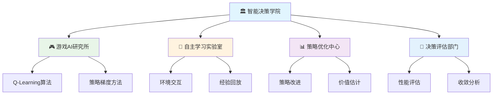
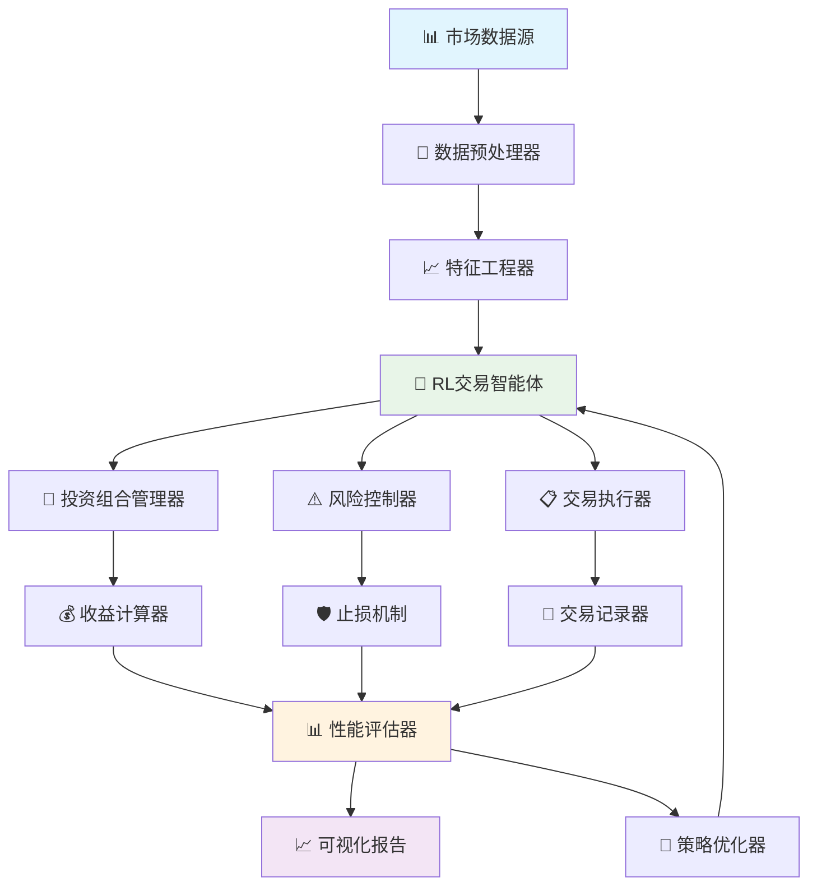

# 第30章 强化学习与智能决策

## 🎯 学习目标

完成本章学习后，你将能够：

### 📚 知识目标
- **深入理解强化学习核心概念**：掌握智能体、环境、状态、动作、奖励的基本原理
- **掌握经典强化学习算法**：熟练运用Q-Learning、策略梯度、Actor-Critic等核心算法
- **理解深度强化学习原理**：了解DQN、A3C、PPO等现代深度强化学习方法
- **认识强化学习应用场景**：理解RL在游戏AI、机器人控制、推荐系统中的应用

### 🛠️ 技能目标
- **构建强化学习环境**：能够使用Gym环境和自定义环境进行RL实验
- **实现经典RL算法**：从零实现Q-Learning、SARSA、策略梯度等算法
- **开发智能游戏AI**：构建能够自主学习和决策的游戏智能体
- **应用深度强化学习**：使用TensorFlow/PyTorch实现深度RL算法

### 🧠 素养目标
- **培养智能决策思维**：用强化学习的方式分析和解决序贯决策问题
- **建立试错学习意识**：理解通过环境反馈不断优化策略的学习模式
- **形成系统优化能力**：掌握在复杂环境中寻找最优策略的方法论
- **树立AI伦理观念**：认识强化学习在自主决策中的责任和风险

---

## 🎮 30.1 欢迎来到智能决策学院！

### 🏛️ 从知识检索到智能决策的升级

还记得第29章我们建立的知识检索中心吗？在那里，我们学会了如何从海量信息中检索和生成知识。现在，我们要将这个中心升级为一个更加智能的**智能决策学院**！

如果说知识检索中心解决的是"如何获取信息"的问题，那么智能决策学院要解决的就是"如何基于信息做出最优决策"的问题。

### 🎯 智能决策学院的组织架构



### 🤖 什么是强化学习？

**强化学习**就像是培养一个能够在复杂环境中自主学习和决策的智能体。

想象一下，你要教一个机器人学会玩游戏：

1. **🎮 机器人观察游戏状态**（感知环境）
2. **🎯 机器人选择一个动作**（做出决策）
3. **🏆 游戏给出分数奖励**（获得反馈）
4. **🧠 机器人根据奖励调整策略**（学习优化）
5. **🔄 重复这个过程直到掌握游戏**（持续改进）

这就是强化学习的核心思想！

```python
# 🎭 强化学习基本概念演示
import numpy as np
import matplotlib.pyplot as plt

class RLBasicConcepts:
    """强化学习基本概念演示类"""
    
    def __init__(self):
        self.concepts = {
            "智能体(Agent)": {
                "定义": "做出决策的学习者",
                "比喻": "🤖 游戏玩家",
                "职责": "观察环境、选择动作、学习策略"
            },
            "环境(Environment)": {
                "定义": "智能体交互的外部世界",
                "比喻": "🎮 游戏世界",
                "职责": "提供状态、接收动作、给出奖励"
            },
            "状态(State)": {
                "定义": "环境的当前情况描述",
                "比喻": "📊 游戏画面",
                "特点": "包含决策所需的关键信息"
            },
            "动作(Action)": {
                "定义": "智能体可以执行的操作",
                "比喻": "🕹️ 按键操作",
                "类型": "离散动作 vs 连续动作"
            },
            "奖励(Reward)": {
                "定义": "环境对动作的即时反馈",
                "比喻": "🏆 游戏得分",
                "作用": "指导智能体学习方向"
            },
            "策略(Policy)": {
                "定义": "从状态到动作的映射规则",
                "比喻": "🎯 游戏策略",
                "目标": "最大化长期累积奖励"
            }
        }
    
    def explain_concepts(self):
        """解释强化学习核心概念"""
        print("🎓 强化学习核心概念解析")
        print("=" * 50)
        
        for concept, info in self.concepts.items():
            print(f"\n🔍 {concept}")
            print(f"   📖 定义：{info['定义']}")
            print(f"   🎭 比喻：{info['比喻']}")
            if '职责' in info:
                print(f"   💼 职责：{info['职责']}")
            elif '特点' in info:
                print(f"   ✨ 特点：{info['特点']}")
            elif '类型' in info:
                print(f"   📂 类型：{info['类型']}")
            elif '作用' in info:
                print(f"   🎯 作用：{info['作用']}")
            elif '目标' in info:
                print(f"   🎯 目标：{info['目标']}")
    
    def visualize_rl_loop(self):
        """可视化强化学习交互循环"""
        print("\n🔄 强化学习交互循环")
        print("=" * 30)
        
        steps = [
            "1. 🤖 智能体观察当前状态",
            "2. 🧠 基于策略选择动作",
            "3. 🎮 环境执行动作并转换状态",
            "4. 🏆 环境返回奖励信号",
            "5. 📚 智能体更新策略",
            "6. 🔄 重复直到任务完成"
        ]
        
        for step in steps:
            print(f"   {step}")
        
        print("\n💡 这个循环体现了强化学习的核心思想：")
        print("   通过试错和反馈不断优化决策策略！")

# 创建并运行概念演示
rl_concepts = RLBasicConcepts()
rl_concepts.explain_concepts()
rl_concepts.visualize_rl_loop()
```

### 🎲 强化学习 vs 其他机器学习方法

让我们通过一个对比表来理解强化学习的独特之处：

```python
# 🎯 机器学习方法对比分析
def compare_ml_methods():
    """对比不同机器学习方法的特点"""
    
    comparison = {
        "学习方式": {
            "监督学习": "🧑‍🏫 老师提供标准答案",
            "无监督学习": "🕵️ 自己发现数据规律",
            "强化学习": "🎮 通过试错获得经验"
        },
        "数据特点": {
            "监督学习": "📚 有标签的训练数据",
            "无监督学习": "📊 无标签的原始数据",
            "强化学习": "🎯 环境交互产生的经验"
        },
        "学习目标": {
            "监督学习": "🎯 拟合输入输出映射",
            "无监督学习": "🔍 发现数据内在结构",
            "强化学习": "🏆 最大化长期累积奖励"
        },
        "应用场景": {
            "监督学习": "📝 分类、回归预测",
            "无监督学习": "🎨 聚类、降维、异常检测",
            "强化学习": "🤖 游戏AI、机器人控制、推荐系统"
        },
        "学习过程": {
            "监督学习": "📖 批量学习，一次性训练",
            "无监督学习": "🔬 模式发现，结构分析",
            "强化学习": "🔄 在线学习，持续优化"
        }
    }
    
    print("🔍 机器学习方法对比分析")
    print("=" * 60)
    
    for aspect, methods in comparison.items():
        print(f"\n📋 {aspect}:")
        for method, description in methods.items():
            print(f"   • {method}: {description}")
    
    print("\n💡 强化学习的独特优势：")
    print("   🎯 能够在未知环境中自主学习")
    print("   🔄 通过试错不断优化策略")
    print("   🏆 追求长期最优而非短期最优")
    print("   🤖 适合序贯决策问题")

# 运行对比分析
compare_ml_methods()
```

---

## 🎮 30.2 强化学习基础理论

### 🎯 马尔可夫决策过程(MDP)

强化学习的数学基础是**马尔可夫决策过程(Markov Decision Process, MDP)**。让我们用一个简单的游戏来理解这个概念。

#### 🎲 什么是马尔可夫性质？

**马尔可夫性质**：未来只依赖于现在，而不依赖于过去。

```python
# 🎲 马尔可夫性质演示
import random
import numpy as np

class MarkovPropertyDemo:
    """马尔可夫性质演示"""
    
    def __init__(self):
        self.weather_states = ["☀️晴天", "🌧️雨天", "☁️阴天"]
        # 转移概率矩阵
        self.transition_matrix = {
            "☀️晴天": {"☀️晴天": 0.7, "🌧️雨天": 0.2, "☁️阴天": 0.1},
            "🌧️雨天": {"☀️晴天": 0.3, "🌧️雨天": 0.4, "☁️阴天": 0.3},
            "☁️阴天": {"☀️晴天": 0.4, "🌧️雨天": 0.3, "☁️阴天": 0.3}
        }
    
    def predict_next_weather(self, current_weather):
        """基于当前天气预测明天天气（马尔可夫性质）"""
        probabilities = self.transition_matrix[current_weather]
        next_weather = random.choices(
            list(probabilities.keys()),
            weights=list(probabilities.values())
        )[0]
        return next_weather
    
    def simulate_weather_sequence(self, initial_weather, days=7):
        """模拟天气变化序列"""
        print(f"🌤️ 天气变化模拟（马尔可夫过程）")
        print("=" * 40)
        
        weather_sequence = [initial_weather]
        current_weather = initial_weather
        
        print(f"第0天: {current_weather}")
        
        for day in range(1, days):
            next_weather = self.predict_next_weather(current_weather)
            weather_sequence.append(next_weather)
            print(f"第{day}天: {next_weather}")
            current_weather = next_weather
        
        print(f"\n💡 马尔可夫性质体现：")
        print(f"   每天的天气只依赖于前一天，不考虑更早的历史")
        
        return weather_sequence

# 运行马尔可夫性质演示
weather_demo = MarkovPropertyDemo()
sequence = weather_demo.simulate_weather_sequence("☀️晴天", 7)
```

#### 🎯 MDP的五要素

一个完整的MDP由五个要素组成：

```python
# 🎯 MDP五要素详解
class MDPComponents:
    """马尔可夫决策过程五要素演示"""
    
    def __init__(self):
        self.components = {
            "状态空间(S)": {
                "定义": "所有可能状态的集合",
                "例子": "游戏中的所有可能场景",
                "符号": "S = {s₁, s₂, s₃, ...}",
                "特点": "有限或无限集合"
            },
            "动作空间(A)": {
                "定义": "智能体可执行的所有动作",
                "例子": "上下左右移动、攻击、防御",
                "符号": "A = {a₁, a₂, a₃, ...}",
                "特点": "可以是离散或连续的"
            },
            "转移概率(P)": {
                "定义": "执行动作后状态转移的概率",
                "例子": "向右移动成功的概率",
                "符号": "P(s'|s,a)",
                "含义": "在状态s执行动作a后转移到s'的概率"
            },
            "奖励函数(R)": {
                "定义": "环境对动作的即时反馈",
                "例子": "得分+10、扣分-5、无变化0",
                "符号": "R(s,a,s')",
                "作用": "指导智能体学习方向"
            },
            "折扣因子(γ)": {
                "定义": "未来奖励的重要性权重",
                "例子": "γ=0.9表示未来奖励打9折",
                "符号": "γ ∈ [0,1]",
                "意义": "平衡即时奖励和长期奖励"
            }
        }
    
    def explain_components(self):
        """详细解释MDP五要素"""
        print("🎯 马尔可夫决策过程(MDP)五要素")
        print("=" * 50)
        
        for i, (component, info) in enumerate(self.components.items(), 1):
            print(f"\n{i}. 📋 {component}")
            print(f"   📖 定义：{info['定义']}")
            print(f"   🎮 例子：{info['例子']}")
            print(f"   🔢 符号：{info['符号']}")
            
            if '特点' in info:
                print(f"   ✨ 特点：{info['特点']}")
            elif '含义' in info:
                print(f"   💡 含义：{info['含义']}")
            elif '作用' in info:
                print(f"   🎯 作用：{info['作用']}")
            elif '意义' in info:
                print(f"   🌟 意义：{info['意义']}")
    
    def create_simple_mdp_example(self):
        """创建一个简单的MDP示例"""
        print(f"\n🎮 简单MDP示例：寻宝游戏")
        print("=" * 30)
        
        # 3x3网格世界
        grid_world = """
        🏁 [ ] [💎]
        [ ] [🕳️] [ ]
        [🤖] [ ] [ ]
        """
        
        print("🗺️ 游戏地图：")
        print(grid_world)
        
        print("📋 MDP要素：")
        print("   🎯 状态空间S: 9个网格位置")
        print("   🕹️ 动作空间A: {上, 下, 左, 右}")
        print("   📊 转移概率P: 移动成功率90%，失败时留在原地")
        print("   🏆 奖励函数R:")
        print("      • 到达宝石💎: +100")
        print("      • 掉入陷阱🕳️: -100")
        print("      • 其他移动: -1")
        print("   ⏰ 折扣因子γ: 0.9")
        
        print("\n🎯 目标：从🤖位置出发，找到💎宝石，避开🕳️陷阱")

# 运行MDP组件演示
mdp_demo = MDPComponents()
mdp_demo.explain_components()
mdp_demo.create_simple_mdp_example()
```

### 📊 价值函数与策略

在强化学习中，我们需要评估状态的好坏和动作的优劣，这就需要**价值函数**的概念。

#### 🎯 状态价值函数 V(s)

```python
# 📊 价值函数概念演示
class ValueFunctionDemo:
    """价值函数概念演示"""
    
    def __init__(self):
        # 简单的3x3网格世界
        self.grid_size = 3
        self.states = [(i, j) for i in range(3) for j in range(3)]
        self.treasure = (0, 2)  # 宝石位置
        self.trap = (1, 1)      # 陷阱位置
        self.start = (2, 0)     # 起始位置
        
        # 奖励设置
        self.rewards = {
            self.treasure: 100,
            self.trap: -100
        }
        
        self.gamma = 0.9  # 折扣因子
    
    def calculate_state_values(self):
        """计算状态价值函数（简化版本）"""
        print("📊 状态价值函数V(s)计算")
        print("=" * 35)
        
        # 简化的价值计算（基于距离和奖励）
        state_values = {}
        
        for state in self.states:
            if state == self.treasure:
                value = 100
            elif state == self.trap:
                value = -100
            else:
                # 基于到宝石的曼哈顿距离计算价值
                distance_to_treasure = abs(state[0] - self.treasure[0]) + abs(state[1] - self.treasure[1])
                distance_to_trap = abs(state[0] - self.trap[0]) + abs(state[1] - self.trap[1])
                
                # 简化的价值计算
                value = (50 / (distance_to_treasure + 1)) - (30 / (distance_to_trap + 1))
            
            state_values[state] = round(value, 2)
        
        # 可视化状态价值
        print("🗺️ 状态价值分布：")
        for i in range(3):
            row = ""
            for j in range(3):
                state = (i, j)
                value = state_values[state]
                if state == self.treasure:
                    row += f"[💎{value:>6}] "
                elif state == self.trap:
                    row += f"[🕳️{value:>6}] "
                elif state == self.start:
                    row += f"[🤖{value:>6}] "
                else:
                    row += f"[  {value:>6}] "
            print(f"   {row}")
        
        print("\n💡 价值函数含义：")
        print("   • 正值越大：该状态越有利")
        print("   • 负值越小：该状态越危险")
        print("   • 价值指导智能体选择更好的路径")
        
        return state_values
    
    def explain_action_value_function(self):
        """解释动作价值函数Q(s,a)"""
        print(f"\n🎯 动作价值函数Q(s,a)")
        print("=" * 30)
        
        print("📖 定义：在状态s执行动作a的期望累积奖励")
        print("🔢 公式：Q(s,a) = E[Rt+1 + γRt+2 + γ²Rt+3 + ... | St=s, At=a]")
        
        print("\n🎮 实际含义：")
        print("   • Q(当前位置, 向上) = 向上移动的长期价值")
        print("   • Q(当前位置, 向右) = 向右移动的长期价值")
        print("   • Q(当前位置, 向下) = 向下移动的长期价值")
        print("   • Q(当前位置, 向左) = 向左移动的长期价值")
        
        print("\n🧠 智能体决策：")
        print("   选择使Q(s,a)最大的动作a*")
        print("   a* = argmax Q(s,a)")

# 运行价值函数演示
value_demo = ValueFunctionDemo()
state_values = value_demo.calculate_state_values()
value_demo.explain_action_value_function()
```

#### 🎯 策略的概念

```python
# 🎯 策略概念演示
class PolicyDemo:
    """策略概念演示"""
    
    def __init__(self):
        self.actions = ["⬆️", "⬇️", "⬅️", "➡️"]
        self.action_names = ["上", "下", "左", "右"]
    
    def demonstrate_policy_types(self):
        """演示不同类型的策略"""
        print("🎯 策略(Policy)类型演示")
        print("=" * 35)
        
        print("1. 📋 确定性策略(Deterministic Policy)")
        print("   定义：π(s) = a，在状态s总是选择动作a")
        print("   例子：在每个位置都选择固定的移动方向")
        
        # 演示确定性策略
        deterministic_policy = {
            (0,0): "➡️", (0,1): "➡️", (0,2): "💎",
            (1,0): "⬆️", (1,1): "🕳️", (1,2): "⬇️",
            (2,0): "⬆️", (2,1): "⬆️", (2,2): "⬆️"
        }
        
        print("\n   🗺️ 确定性策略示例：")
        for i in range(3):
            row = "   "
            for j in range(3):
                action = deterministic_policy[(i,j)]
                row += f"[{action}] "
            print(row)
        
        print("\n2. 🎲 随机性策略(Stochastic Policy)")
        print("   定义：π(a|s) = P(At=a|St=s)，给出动作概率分布")
        print("   例子：在某个位置，30%向上，70%向右")
        
        # 演示随机性策略
        print("\n   📊 随机策略示例(位置(1,0))：")
        stochastic_example = {
            "⬆️上": 0.4,
            "➡️右": 0.3,
            "⬇️下": 0.2,
            "⬅️左": 0.1
        }
        
        for action, prob in stochastic_example.items():
            print(f"      {action}: {prob*100}%")
        
        print("\n💡 策略优化目标：")
        print("   找到最优策略π*，使期望累积奖励最大")
        print("   π* = argmax E[∑γᵗRt | π]")
    
    def demonstrate_policy_evaluation(self):
        """演示策略评估过程"""
        print(f"\n📈 策略评估与改进")
        print("=" * 25)
        
        print("🔄 策略迭代算法流程：")
        steps = [
            "1. 🎯 初始化随机策略π₀",
            "2. 📊 策略评估：计算Vᵖ(s)",
            "3. 🔧 策略改进：π' = greedy(Vᵖ)",
            "4. ✅ 检查收敛：π' = π?",
            "5. 🔄 如果未收敛，返回步骤2"
        ]
        
        for step in steps:
            print(f"   {step}")
        
        print("\n💡 核心思想：")
        print("   • 评估当前策略的价值")
        print("   • 基于价值贪心地改进策略")
        print("   • 重复直到策略不再变化")

# 运行策略演示
policy_demo = PolicyDemo()
policy_demo.demonstrate_policy_types()
policy_demo.demonstrate_policy_evaluation()

---

## 🧠 30.3 Q-Learning算法详解

### 🎯 Q-Learning：无模型的价值学习

**Q-Learning**是强化学习中最经典的算法之一，它不需要环境模型，通过直接与环境交互来学习最优的动作价值函数。

#### 🔬 Q-Learning算法原理

Q-Learning的核心思想是使用**时序差分(Temporal Difference, TD)**方法来更新Q值：

```python
# 🧠 Q-Learning算法实现
import numpy as np
import random
import matplotlib.pyplot as plt
from collections import defaultdict

class QLearningAgent:
    """Q-Learning智能体实现"""
    
    def __init__(self, actions, learning_rate=0.1, discount_factor=0.9, epsilon=0.1):
        """
        初始化Q-Learning智能体
        
        Args:
            actions: 可执行的动作列表
            learning_rate: 学习率α
            discount_factor: 折扣因子γ
            epsilon: ε-贪心策略的探索率
        """
        self.actions = actions
        self.lr = learning_rate
        self.gamma = discount_factor
        self.epsilon = epsilon
        
        # Q表：存储状态-动作价值
        self.q_table = defaultdict(lambda: defaultdict(float))
        
        # 学习统计
        self.learning_stats = {
            'episodes': [],
            'rewards': [],
            'steps': []
        }
    
    def get_action(self, state, training=True):
        """
        根据ε-贪心策略选择动作
        
        Args:
            state: 当前状态
            training: 是否在训练模式
            
        Returns:
            选择的动作
        """
        if training and random.random() < self.epsilon:
            # 探索：随机选择动作
            return random.choice(self.actions)
        else:
            # 利用：选择Q值最大的动作
            q_values = [self.q_table[state][action] for action in self.actions]
            max_q = max(q_values)
            
            # 如果有多个最大值，随机选择一个
            max_actions = [action for action, q in zip(self.actions, q_values) if q == max_q]
            return random.choice(max_actions)
    
    def update_q_table(self, state, action, reward, next_state, done):
        """
        使用Q-Learning更新规则更新Q表
        
        Q(s,a) ← Q(s,a) + α[r + γ max Q(s',a') - Q(s,a)]
        """
        current_q = self.q_table[state][action]
        
        if done:
            # 终止状态，没有下一步
            target_q = reward
        else:
            # 计算下一状态的最大Q值
            next_q_values = [self.q_table[next_state][a] for a in self.actions]
            max_next_q = max(next_q_values) if next_q_values else 0
            target_q = reward + self.gamma * max_next_q
        
        # Q-Learning更新规则
        self.q_table[state][action] = current_q + self.lr * (target_q - current_q)
    
    def train_episode(self, env, max_steps=1000):
        """训练一个episode"""
        state = env.reset()
        total_reward = 0
        steps = 0
        
        for step in range(max_steps):
            # 选择动作
            action = self.get_action(state, training=True)
            
            # 执行动作
            next_state, reward, done = env.step(action)
            
            # 更新Q表
            self.update_q_table(state, action, reward, next_state, done)
            
            # 更新状态和统计
            state = next_state
            total_reward += reward
            steps += 1
            
            if done:
                break
        
        return total_reward, steps
    
    def print_q_table(self):
        """打印Q表（适用于小规模问题）"""
        print("📊 Q表内容：")
        print("=" * 40)
        
        if not self.q_table:
            print("   Q表为空")
            return
        
        # 获取所有状态
        states = sorted(self.q_table.keys())
        
        # 打印表头
        header = "状态\\动作"
        for action in self.actions:
            header += f"\t{action}"
        print(header)
        print("-" * len(header.expandtabs()))
        
        # 打印每个状态的Q值
        for state in states:
            row = f"{state}"
            for action in self.actions:
                q_value = self.q_table[state][action]
                row += f"\t{q_value:.2f}"
            print(row)

class GridWorldEnvironment:
    """简单的网格世界环境"""
    
    def __init__(self, size=4):
        """
        创建网格世界
        
        Args:
            size: 网格大小
        """
        self.size = size
        self.start_pos = (0, 0)
        self.goal_pos = (size-1, size-1)
        self.trap_pos = (1, 1)  # 陷阱位置
        
        self.current_pos = self.start_pos
        self.actions = ['up', 'down', 'left', 'right']
        
        # 动作到坐标变化的映射
        self.action_map = {
            'up': (-1, 0),
            'down': (1, 0),
            'left': (0, -1),
            'right': (0, 1)
        }
    
    def reset(self):
        """重置环境到初始状态"""
        self.current_pos = self.start_pos
        return self.current_pos
    
    def step(self, action):
        """
        执行动作
        
        Returns:
            next_state: 下一个状态
            reward: 奖励
            done: 是否结束
        """
        # 计算新位置
        delta = self.action_map[action]
        new_pos = (
            self.current_pos[0] + delta[0],
            self.current_pos[1] + delta[1]
        )
        
        # 检查边界
        if (0 <= new_pos[0] < self.size and 0 <= new_pos[1] < self.size):
            self.current_pos = new_pos
        # 如果超出边界，保持原位置
        
        # 计算奖励
        if self.current_pos == self.goal_pos:
            reward = 100  # 到达目标
            done = True
        elif self.current_pos == self.trap_pos:
            reward = -100  # 掉入陷阱
            done = True
        else:
            reward = -1  # 每步的小惩罚
            done = False
        
        return self.current_pos, reward, done
    
    def render(self):
        """可视化当前环境状态"""
        print("\n🗺️ 当前环境状态：")
        for i in range(self.size):
            row = ""
            for j in range(self.size):
                pos = (i, j)
                if pos == self.current_pos:
                    row += "🤖 "
                elif pos == self.goal_pos:
                    row += "🎯 "
                elif pos == self.trap_pos:
                    row += "🕳️ "
                else:
                    row += "⬜ "
            print(f"   {row}")

def demonstrate_q_learning():
    """演示Q-Learning算法"""
    print("🧠 Q-Learning算法演示")
    print("=" * 40)
    
    # 创建环境和智能体
    env = GridWorldEnvironment(size=4)
    agent = QLearningAgent(
        actions=env.actions,
        learning_rate=0.1,
        discount_factor=0.9,
        epsilon=0.1
    )
    
    print("🎮 环境设置：")
    print("   • 4x4网格世界")
    print("   • 🤖 起点：(0,0)")
    print("   • 🎯 目标：(3,3)")
    print("   • 🕳️ 陷阱：(1,1)")
    print("   • 奖励：目标+100，陷阱-100，移动-1")
    
    env.render()
    
    # 训练过程
    print("\n🎓 开始训练...")
    episodes = 500
    
    for episode in range(episodes):
        total_reward, steps = agent.train_episode(env)
        agent.learning_stats['episodes'].append(episode)
        agent.learning_stats['rewards'].append(total_reward)
        agent.learning_stats['steps'].append(steps)
        
        # 每100个episode打印一次进度
        if (episode + 1) % 100 == 0:
            avg_reward = np.mean(agent.learning_stats['rewards'][-100:])
            avg_steps = np.mean(agent.learning_stats['steps'][-100:])
            print(f"   Episode {episode+1}: 平均奖励={avg_reward:.2f}, 平均步数={avg_steps:.2f}")
    
    print("\n📊 训练完成！")
    
    # 打印学习到的Q表
    agent.print_q_table()
    
    # 测试训练好的智能体
    print(f"\n🎯 测试训练好的智能体：")
    test_episodes = 5
    
    for test_ep in range(test_episodes):
        state = env.reset()
        total_reward = 0
        steps = 0
        path = [state]
        
        print(f"\n   测试Episode {test_ep+1}:")
        
        for step in range(20):  # 最多20步
            action = agent.get_action(state, training=False)
            next_state, reward, done = env.step(action)
            
            path.append(next_state)
            total_reward += reward
            steps += 1
            
            print(f"      步骤{step+1}: {state} --{action}--> {next_state}, 奖励={reward}")
            
            state = next_state
            if done:
                break
        
        print(f"      结果: 总奖励={total_reward}, 总步数={steps}")
        print(f"      路径: {' -> '.join(map(str, path))}")

# 运行Q-Learning演示
demonstrate_q_learning()
```

#### 🔍 Q-Learning算法分析

```python
# 🔍 Q-Learning算法特点分析
class QLearningAnalysis:
    """Q-Learning算法特点分析"""
    
    def __init__(self):
        self.characteristics = {
            "算法类型": {
                "分类": "无模型(Model-free)强化学习",
                "特点": "不需要环境转移概率和奖励函数",
                "优势": "适用于未知环境"
            },
            "学习方式": {
                "分类": "离策略(Off-policy)学习",
                "特点": "学习的策略与行为策略可以不同",
                "优势": "可以从任意策略的经验中学习"
            },
            "收敛性": {
                "条件": "满足一定条件下保证收敛到最优",
                "要求": "所有状态-动作对被无限次访问",
                "实际": "在实践中通常能找到很好的策略"
            },
            "探索策略": {
                "常用": "ε-贪心策略",
                "平衡": "探索(exploration) vs 利用(exploitation)",
                "调节": "ε值可以随训练过程衰减"
            }
        }
    
    def analyze_algorithm(self):
        """分析Q-Learning算法特点"""
        print("🔍 Q-Learning算法深度分析")
        print("=" * 45)
        
        for aspect, info in self.characteristics.items():
            print(f"\n📋 {aspect}:")
            for key, value in info.items():
                print(f"   • {key}: {value}")
    
    def compare_update_rules(self):
        """比较不同的更新规则"""
        print(f"\n📊 更新规则对比")
        print("=" * 25)
        
        update_rules = {
            "Q-Learning": {
                "公式": "Q(s,a) ← Q(s,a) + α[r + γ max Q(s',a') - Q(s,a)]",
                "特点": "使用下一状态的最大Q值",
                "策略": "离策略学习"
            },
            "SARSA": {
                "公式": "Q(s,a) ← Q(s,a) + α[r + γ Q(s',a') - Q(s,a)]",
                "特点": "使用实际选择的下一动作的Q值",
                "策略": "在策略学习"
            },
            "Expected SARSA": {
                "公式": "Q(s,a) ← Q(s,a) + α[r + γ E[Q(s',a')] - Q(s,a)]",
                "特点": "使用下一状态Q值的期望",
                "策略": "介于两者之间"
            }
        }
        
        for method, info in update_rules.items():
            print(f"\n🧮 {method}:")
            print(f"   📐 公式: {info['公式']}")
            print(f"   ✨ 特点: {info['特点']}")
            print(f"   🎯 策略: {info['策略']}")
    
    def discuss_hyperparameters(self):
        """讨论超参数的影响"""
        print(f"\n⚙️ 超参数调优指南")
        print("=" * 25)
        
        hyperparams = {
            "学习率(α)": {
                "范围": "0 < α ≤ 1",
                "作用": "控制学习速度",
                "调优": "通常从0.1开始，可以衰减",
                "影响": "太大不稳定，太小收敛慢"
            },
            "折扣因子(γ)": {
                "范围": "0 ≤ γ < 1",
                "作用": "平衡即时与长期奖励",
                "调优": "通常设为0.9-0.99",
                "影响": "接近1重视长期，接近0重视即时"
            },
            "探索率(ε)": {
                "范围": "0 ≤ ε ≤ 1",
                "作用": "控制探索程度",
                "调优": "从0.1开始，可以衰减到0.01",
                "影响": "太大过度探索，太小陷入局部最优"
            }
        }
        
        for param, info in hyperparams.items():
            print(f"\n🎛️ {param}:")
            for key, value in info.items():
                print(f"   • {key}: {value}")

# 运行Q-Learning分析
analysis = QLearningAnalysis()
analysis.analyze_algorithm()
analysis.compare_update_rules()
analysis.discuss_hyperparameters()
```

---

## 🎯 30.4 策略梯度方法

### 🎨 从价值函数到策略优化

虽然Q-Learning通过学习价值函数来间接优化策略，但我们也可以**直接优化策略**。这就是**策略梯度方法**的核心思想。

#### 🧮 策略梯度的数学原理

策略梯度方法直接参数化策略函数，并使用梯度上升来优化策略参数：

```python
# 🎯 策略梯度方法实现
import numpy as np
import torch
import torch.nn as nn
import torch.optim as optim
import torch.nn.functional as F
from torch.distributions import Categorical

class PolicyNetwork(nn.Module):
    """策略网络：输入状态，输出动作概率分布"""
    
    def __init__(self, state_size, action_size, hidden_size=128):
        """
        初始化策略网络
        
        Args:
            state_size: 状态空间维度
            action_size: 动作空间大小
            hidden_size: 隐藏层大小
        """
        super(PolicyNetwork, self).__init__()
        
        self.fc1 = nn.Linear(state_size, hidden_size)
        self.fc2 = nn.Linear(hidden_size, hidden_size)
        self.fc3 = nn.Linear(hidden_size, action_size)
        
    def forward(self, state):
        """前向传播：计算动作概率分布"""
        x = F.relu(self.fc1(state))
        x = F.relu(self.fc2(x))
        action_probs = F.softmax(self.fc3(x), dim=-1)
        return action_probs

class REINFORCEAgent:
    """REINFORCE算法实现（策略梯度的基础版本）"""
    
    def __init__(self, state_size, action_size, learning_rate=0.01, gamma=0.99):
        """
        初始化REINFORCE智能体
        
        Args:
            state_size: 状态空间维度
            action_size: 动作空间大小
            learning_rate: 学习率
            gamma: 折扣因子
        """
        self.state_size = state_size
        self.action_size = action_size
        self.gamma = gamma
        
        # 创建策略网络
        self.policy_net = PolicyNetwork(state_size, action_size)
        self.optimizer = optim.Adam(self.policy_net.parameters(), lr=learning_rate)
        
        # 存储一个episode的经验
        self.episode_states = []
        self.episode_actions = []
        self.episode_rewards = []
        
        # 学习统计
        self.learning_stats = {
            'episodes': [],
            'rewards': [],
            'policy_losses': []
        }
    
    def get_action(self, state):
        """
        根据当前策略选择动作
        
        Args:
            state: 当前状态
            
        Returns:
            action: 选择的动作
            log_prob: 动作的对数概率
        """
        state_tensor = torch.FloatTensor(state).unsqueeze(0)
        action_probs = self.policy_net(state_tensor)
        
        # 创建概率分布并采样动作
        dist = Categorical(action_probs)
        action = dist.sample()
        log_prob = dist.log_prob(action)
        
        return action.item(), log_prob
    
    def store_experience(self, state, action, reward):
        """存储一步的经验"""
        self.episode_states.append(state)
        self.episode_actions.append(action)
        self.episode_rewards.append(reward)
    
    def calculate_returns(self):
        """计算每个时间步的累积回报"""
        returns = []
        G = 0
        
        # 从后往前计算累积回报
        for reward in reversed(self.episode_rewards):
            G = reward + self.gamma * G
            returns.insert(0, G)
        
        # 标准化回报（可选，有助于训练稳定性）
        returns = torch.FloatTensor(returns)
        returns = (returns - returns.mean()) / (returns.std() + 1e-8)
        
        return returns
    
    def update_policy(self):
        """使用策略梯度更新策略网络"""
        if len(self.episode_rewards) == 0:
            return
        
        # 计算累积回报
        returns = self.calculate_returns()
        
        # 计算策略损失
        policy_losses = []
        
        for i in range(len(self.episode_states)):
            state = torch.FloatTensor(self.episode_states[i]).unsqueeze(0)
            action_probs = self.policy_net(state)
            dist = Categorical(action_probs)
            
            action = self.episode_actions[i]
            log_prob = dist.log_prob(torch.tensor(action))
            
            # 策略梯度：log π(a|s) * G
            policy_loss = -log_prob * returns[i]
            policy_losses.append(policy_loss)
        
        # 计算总损失
        total_loss = torch.stack(policy_losses).sum()
        
        # 反向传播和参数更新
        self.optimizer.zero_grad()
        total_loss.backward()
        self.optimizer.step()
        
        # 记录损失
        self.learning_stats['policy_losses'].append(total_loss.item())
        
        # 清空episode经验
        self.episode_states = []
        self.episode_actions = []
        self.episode_rewards = []
        
        return total_loss.item()

class CartPoleEnvironment:
    """简化的CartPole环境（用于演示）"""
    
    def __init__(self):
        """初始化环境"""
        self.state_size = 4  # [位置, 速度, 角度, 角速度]
        self.action_size = 2  # [向左, 向右]
        
        # 环境参数
        self.gravity = 9.8
        self.masscart = 1.0
        self.masspole = 0.1
        self.total_mass = (self.masspole + self.masscart)
        self.length = 0.5
        self.polemass_length = (self.masspole * self.length)
        self.force_mag = 10.0
        self.tau = 0.02  # seconds between state updates
        
        # 终止条件
        self.theta_threshold_radians = 12 * 2 * np.pi / 360
        self.x_threshold = 2.4
        
        self.reset()
    
    def reset(self):
        """重置环境"""
        self.state = np.random.uniform(low=-0.05, high=0.05, size=(4,))
        self.steps_beyond_done = None
        return self.state.copy()
    
    def step(self, action):
        """执行动作"""
        x, x_dot, theta, theta_dot = self.state
        force = self.force_mag if action == 1 else -self.force_mag
        
        costheta = np.cos(theta)
        sintheta = np.sin(theta)
        
        temp = (force + self.polemass_length * theta_dot * theta_dot * sintheta) / self.total_mass
        thetaacc = (self.gravity * sintheta - costheta * temp) / \
                   (self.length * (4.0/3.0 - self.masspole * costheta * costheta / self.total_mass))
        xacc = temp - self.polemass_length * thetaacc * costheta / self.total_mass
        
        x = x + self.tau * x_dot
        x_dot = x_dot + self.tau * xacc
        theta = theta + self.tau * theta_dot
        theta_dot = theta_dot + self.tau * thetaacc
        
        self.state = np.array([x, x_dot, theta, theta_dot])
        
        done = bool(
            x < -self.x_threshold
            or x > self.x_threshold
            or theta < -self.theta_threshold_radians
            or theta > self.theta_threshold_radians
        )
        
        if not done:
            reward = 1.0
        elif self.steps_beyond_done is None:
            self.steps_beyond_done = 0
            reward = 1.0
        else:
            if self.steps_beyond_done == 0:
                print("You are calling 'step()' even though this environment has already returned done = True.")
            self.steps_beyond_done += 1
            reward = 0.0
        
        return self.state.copy(), reward, done
    
    def render(self):
        """可视化当前环境状态"""
        print("\n🗺️ 当前环境状态：")
        for i in range(self.size):
            row = ""
            for j in range(self.size):
                pos = (i, j)
                if pos == self.current_pos:
                    row += "🤖 "
                elif pos == self.goal_pos:
                    row += "🎯 "
                elif pos == self.trap_pos:
                    row += "🕳️ "
                else:
                    row += "⬜ "
            print(f"   {row}")

def demonstrate_policy_gradient():
    """演示策略梯度方法"""
    print("🎯 策略梯度方法演示")
    print("=" * 40)
    
    # 创建环境和智能体
    env = CartPoleEnvironment()
    agent = REINFORCEAgent(
        state_size=env.state_size,
        action_size=env.action_size,
        learning_rate=0.01,
        gamma=0.99
    )
    
    print("🎮 环境设置：")
    print("   • CartPole平衡杆环境")
    print("   • 状态空间：4维连续空间")
    print("   • 动作空间：2个离散动作（左/右）")
    print("   • 目标：保持杆子平衡尽可能长时间")
    
    # 训练过程
    print("\n🎓 开始训练...")
    episodes = 1000
    
    for episode in range(episodes):
        state = env.reset()
        total_reward = 0
        
        # 运行一个episode
        for step in range(500):  # 最多500步
            action, log_prob = agent.get_action(state)
            next_state, reward, done = env.step(action)
            
            agent.store_experience(state, action, reward)
            
            state = next_state
            total_reward += reward
            
            if done:
                break
        
        # 更新策略
        policy_loss = agent.update_policy()
        
        # 记录统计信息
        agent.learning_stats['episodes'].append(episode)
        agent.learning_stats['rewards'].append(total_reward)
        
        # 每100个episode打印一次进度
        if (episode + 1) % 100 == 0:
            avg_reward = np.mean(agent.learning_stats['rewards'][-100:])
            print(f"   Episode {episode+1}: 平均奖励={avg_reward:.2f}")
    
    print("\n📊 训练完成！")
    
    # 测试训练好的智能体
    print(f"\n🎯 测试训练好的智能体：")
    test_episodes = 5
    
    for test_ep in range(test_episodes):
        state = env.reset()
        total_reward = 0
        steps = 0
        
        for step in range(500):
            action, _ = agent.get_action(state)
            next_state, reward, done = env.step(action)
            
            state = next_state
            total_reward += reward
            steps += 1
            
            if done:
                break
        
        print(f"   测试Episode {test_ep+1}: 总奖励={total_reward}, 总步数={steps}")

# 运行策略梯度演示
demonstrate_policy_gradient()
```

#### 🔍 策略梯度方法分析

```python
# 🔍 策略梯度方法深度分析
class PolicyGradientAnalysis:
    """策略梯度方法分析"""
    
    def __init__(self):
        self.advantages = {
            "直接优化": "直接优化策略，不需要价值函数作为中介",
            "连续动作": "天然支持连续动作空间",
            "随机策略": "可以学习随机策略，适合部分可观测环境",
            "收敛保证": "在一定条件下保证收敛到局部最优"
        }
        
        self.challenges = {
            "高方差": "策略梯度估计方差较大，学习不稳定",
            "样本效率": "通常需要大量样本才能收敛",
            "局部最优": "可能收敛到局部最优而非全局最优",
            "超参数敏感": "对学习率等超参数比较敏感"
        }
        
        self.improvements = {
            "基线方法": "使用基线减少方差",
            "Actor-Critic": "结合价值函数估计",
            "自然策略梯度": "使用自然梯度改进收敛",
            "信任区域": "限制策略更新步长"
        }
    
    def analyze_method(self):
        """分析策略梯度方法"""
        print("🔍 策略梯度方法深度分析")
        print("=" * 45)
        
        print("✅ 主要优势：")
        for advantage, description in self.advantages.items():
            print(f"   • {advantage}: {description}")
        
        print("\n⚠️ 主要挑战：")
        for challenge, description in self.challenges.items():
            print(f"   • {challenge}: {description}")
        
        print("\n🚀 改进方向：")
        for improvement, description in self.improvements.items():
            print(f"   • {improvement}: {description}")
    
    def explain_policy_gradient_theorem(self):
        """解释策略梯度定理"""
        print(f"\n📐 策略梯度定理")
        print("=" * 25)
        
        print("🧮 核心公式：")
        print("   ∇J(θ) = E[∇log π(a|s,θ) * Q(s,a)]")
        
        print("\n📝 公式解释：")
        print("   • J(θ): 策略的期望回报")
        print("   • ∇J(θ): 策略梯度")
        print("   • π(a|s,θ): 参数化的策略函数")
        print("   • Q(s,a): 动作价值函数")
        
        print("\n💡 直观理解：")
        print("   • 如果Q(s,a)>0（好动作），增加π(a|s)的概率")
        print("   • 如果Q(s,a)<0（坏动作），减少π(a|s)的概率")
        print("   • 梯度方向指向期望回报增加的方向")
    
    def compare_algorithms(self):
        """比较不同的策略梯度算法"""
        print(f"\n📊 策略梯度算法对比")
        print("=" * 30)
        
        algorithms = {
            "REINFORCE": {
                "特点": "最基础的策略梯度算法",
                "优势": "简单易实现",
                "劣势": "高方差，收敛慢"
            },
            "Actor-Critic": {
                "特点": "结合策略和价值函数",
                "优势": "降低方差，提高样本效率",
                "劣势": "需要同时训练两个网络"
            },
            "A3C": {
                "特点": "异步并行训练",
                "优势": "训练速度快，稳定性好",
                "劣势": "实现复杂度较高"
            },
            "PPO": {
                "特点": "近端策略优化",
                "优势": "训练稳定，效果好",
                "劣势": "超参数调节重要"
            }
        }
        
        for algo, info in algorithms.items():
            print(f"\n🎯 {algo}:")
            print(f"   📋 特点: {info['特点']}")
            print(f"   ✅ 优势: {info['优势']}")
            print(f"   ⚠️ 劣势: {info['劣势']}")

# 运行策略梯度分析
pg_analysis = PolicyGradientAnalysis()
pg_analysis.analyze_method()
pg_analysis.explain_policy_gradient_theorem()
pg_analysis.compare_algorithms()
```

---

## 🤖 30.5 深度强化学习基础

### 🧠 神经网络与强化学习的结合

当状态空间或动作空间变得非常大时，传统的表格方法（如Q-table）就不再适用了。这时我们需要使用**函数逼近**，而深度神经网络是最强大的函数逼近器之一。

#### 🎯 深度Q网络(DQN)

**DQN(Deep Q-Network)**是第一个成功将深度学习与强化学习结合的算法：

```python
# 🤖 深度Q网络(DQN)实现
import torch
import torch.nn as nn
import torch.optim as optim
import torch.nn.functional as F
import numpy as np
import random
from collections import deque

class DQNNetwork(nn.Module):
    """深度Q网络"""
    
    def __init__(self, state_size, action_size, hidden_sizes=[128, 128]):
        """
        初始化DQN网络
        
        Args:
            state_size: 状态空间维度
            action_size: 动作空间大小
            hidden_sizes: 隐藏层大小列表
        """
        super(DQNNetwork, self).__init__()
        
        # 构建网络层
        layers = []
        input_size = state_size
        
        for hidden_size in hidden_sizes:
            layers.append(nn.Linear(input_size, hidden_size))
            layers.append(nn.ReLU())
            input_size = hidden_size
        
        layers.append(nn.Linear(input_size, action_size))
        
        self.network = nn.Sequential(*layers)
    
    def forward(self, state):
        """前向传播：输出每个动作的Q值"""
        return self.network(state)

class ReplayBuffer:
    """经验回放缓冲区"""
    
    def __init__(self, capacity=10000):
        """
        初始化经验回放缓冲区
        
        Args:
            capacity: 缓冲区容量
        """
        self.buffer = deque(maxlen=capacity)
    
    def push(self, state, action, reward, next_state, done):
        """添加经验到缓冲区"""
        experience = (state, action, reward, next_state, done)
        self.buffer.append(experience)
    
    def sample(self, batch_size):
        """从缓冲区随机采样一批经验"""
        batch = random.sample(self.buffer, batch_size)
        
        states = torch.FloatTensor([e[0] for e in batch])
        actions = torch.LongTensor([e[1] for e in batch])
        rewards = torch.FloatTensor([e[2] for e in batch])
        next_states = torch.FloatTensor([e[3] for e in batch])
        dones = torch.BoolTensor([e[4] for e in batch])
        
        return states, actions, rewards, next_states, dones
    
    def __len__(self):
        return len(self.buffer)

class DQNAgent:
    """DQN智能体"""
    
    def __init__(self, state_size, action_size, learning_rate=0.001, 
                 gamma=0.99, epsilon=1.0, epsilon_decay=0.995, epsilon_min=0.01):
        """
        初始化DQN智能体
        
        Args:
            state_size: 状态空间维度
            action_size: 动作空间大小
            learning_rate: 学习率
            gamma: 折扣因子
            epsilon: 初始探索率
            epsilon_decay: 探索率衰减
            epsilon_min: 最小探索率
        """
        self.state_size = state_size
        self.action_size = action_size
        self.gamma = gamma
        self.epsilon = epsilon
        self.epsilon_decay = epsilon_decay
        self.epsilon_min = epsilon_min
        
        # 创建主网络和目标网络
        self.q_network = DQNNetwork(state_size, action_size)
        self.target_network = DQNNetwork(state_size, action_size)
        self.optimizer = optim.Adam(self.q_network.parameters(), lr=learning_rate)
        
        # 经验回放缓冲区
        self.replay_buffer = ReplayBuffer(capacity=10000)
        
        # 训练参数
        self.batch_size = 32
        self.update_target_freq = 100  # 每100步更新目标网络
        self.train_freq = 4  # 每4步训练一次
        self.step_count = 0
        
        # 学习统计
        self.learning_stats = {
            'episodes': [],
            'rewards': [],
            'losses': [],
            'epsilon_values': []
        }
        
        # 初始化目标网络
        self.update_target_network()
    
    def get_action(self, state, training=True):
        """
        根据ε-贪心策略选择动作
        
        Args:
            state: 当前状态
            training: 是否在训练模式
            
        Returns:
            选择的动作
        """
        if training and random.random() < self.epsilon:
            # 探索：随机选择动作
            return random.randrange(self.action_size)
        
        # 利用：选择Q值最大的动作
        state_tensor = torch.FloatTensor(state).unsqueeze(0)
        q_values = self.q_network(state_tensor)
        return q_values.argmax().item()
    
    def store_experience(self, state, action, reward, next_state, done):
        """存储经验到回放缓冲区"""
        self.replay_buffer.push(state, action, reward, next_state, done)
    
    def update_target_network(self):
        """更新目标网络"""
        self.target_network.load_state_dict(self.q_network.state_dict())
    
    def train(self):
        """训练DQN网络"""
        if len(self.replay_buffer) < self.batch_size:
            return
        
        # 从经验回放缓冲区采样
        states, actions, rewards, next_states, dones = self.replay_buffer.sample(self.batch_size)
        
        # 计算当前Q值
        current_q_values = self.q_network(states).gather(1, actions.unsqueeze(1))
        
        # 计算目标Q值
        next_q_values = self.target_network(next_states).max(1)[0].detach()
        target_q_values = rewards + (self.gamma * next_q_values * ~dones)
        
        # 计算损失
        loss = F.mse_loss(current_q_values.squeeze(), target_q_values)
        
        # 反向传播
        self.optimizer.zero_grad()
        loss.backward()
        self.optimizer.step()
        
        # 记录损失
        self.learning_stats['losses'].append(loss.item())
        
        # 衰减探索率
        if self.epsilon > self.epsilon_min:
            self.epsilon *= self.epsilon_decay
        
        return loss.item()
    
    def train_episode(self, env, max_steps=1000):
        """训练一个episode"""
        state = env.reset()
        total_reward = 0
        
        for step in range(max_steps):
            # 选择动作
            action = self.get_action(state, training=True)
            
            # 执行动作
            next_state, reward, done = env.step(action)
            
            # 存储经验
            self.store_experience(state, action, reward, next_state, done)
            
            # 训练网络
            if self.step_count % self.train_freq == 0:
                self.train()
            
            # 更新目标网络
            if self.step_count % self.update_target_freq == 0:
                self.update_target_network()
            
            state = next_state
            total_reward += reward
            
            if done:
                break
        
        # 记录统计信息
        self.learning_stats['epsilon_values'].append(self.epsilon)
        
        return total_reward

def demonstrate_dqn():
    """演示DQN算法"""
    print("🤖 深度Q网络(DQN)演示")
    print("=" * 40)
    
    # 创建环境和智能体
    env = CartPoleEnvironment()
    agent = DQNAgent(
        state_size=env.state_size,
        action_size=env.action_size,
        learning_rate=0.001,
        gamma=0.99,
        epsilon=1.0,
        epsilon_decay=0.995,
        epsilon_min=0.01
    )
    
    print("🎮 环境设置：")
    print("   • CartPole平衡杆环境")
    print("   • 状态空间：4维连续空间")
    print("   • 动作空间：2个离散动作")
    print("   • 神经网络：2层隐藏层，每层128个神经元")
    
    # 训练过程
    print("\n🎓 开始训练...")
    episodes = 500
    
    for episode in range(episodes):
        total_reward = agent.train_episode(env)
        agent.learning_stats['episodes'].append(episode)
        agent.learning_stats['rewards'].append(total_reward)
        
        # 每50个episode打印一次进度
        if (episode + 1) % 50 == 0:
            avg_reward = np.mean(agent.learning_stats['rewards'][-50:])
            current_epsilon = agent.epsilon
            print(f"   Episode {episode+1}: 平均奖励={avg_reward:.2f}, ε={current_epsilon:.3f}")
    
    print("\n📊 训练完成！")
    
    # 测试训练好的智能体
    print(f"\n🎯 测试训练好的智能体：")
    test_episodes = 5
    
    for test_ep in range(test_episodes):
        state = env.reset()
        total_reward = 0
        steps = 0
        
        for step in range(500):
            action = agent.get_action(state, training=False)
            next_state, reward, done = env.step(action)
            
            state = next_state
            total_reward += reward
            steps += 1
            
            if done:
                break
        
        print(f"   测试Episode {test_ep+1}: 总奖励={total_reward}, 总步数={steps}")

# 运行DQN演示
demonstrate_dqn()
```

#### 🔍 DQN的关键创新

```python
# 🔍 DQN关键技术分析
class DQNInnovationAnalysis:
    """DQN关键技术创新分析"""
    
    def __init__(self):
        self.innovations = {
            "经验回放(Experience Replay)": {
                "问题": "强化学习样本间相关性强，违反独立同分布假设",
                "解决": "将经验存储在缓冲区，随机采样训练",
                "优势": "打破样本相关性，提高样本利用率"
            },
            "目标网络(Target Network)": {
                "问题": "Q学习中目标值和当前值使用同一网络，不稳定",
                "解决": "使用独立的目标网络计算目标值",
                "优势": "稳定训练过程，避免目标值剧烈变化"
            },
            "深度神经网络": {
                "问题": "状态空间过大，无法使用表格方法",
                "解决": "使用深度神经网络逼近Q函数",
                "优势": "处理高维状态空间，强大的表示能力"
            },
            "ε-贪心探索": {
                "问题": "需要平衡探索和利用",
                "解决": "使用衰减的ε-贪心策略",
                "优势": "初期充分探索，后期专注利用"
            }
        }
    
    def analyze_innovations(self):
        """分析DQN的关键创新"""
        print("🔍 DQN关键技术创新分析")
        print("=" * 45)
        
        for innovation, details in self.innovations.items():
            print(f"\n💡 {innovation}:")
            print(f"   ❓ 问题: {details['问题']}")
            print(f"   💊 解决: {details['解决']}")
            print(f"   ✅ 优势: {details['优势']}")
    
    def explain_training_process(self):
        """解释DQN训练过程"""
        print(f"\n🎓 DQN训练过程详解")
        print("=" * 30)
        
        steps = [
            "1. 🎮 智能体与环境交互，收集经验(s,a,r,s')",
            "2. 💾 将经验存储到回放缓冲区",
            "3. 🎲 从缓冲区随机采样一批经验",
            "4. 🧮 使用目标网络计算目标Q值",
            "5. 📉 计算损失并更新主网络",
            "6. 🔄 定期将主网络权重复制到目标网络",
            "7. 📈 衰减探索率ε",
            "8. 🔁 重复直到收敛"
        ]
        
        for step in steps:
            print(f"   {step}")
        
        print("\n💡 关键点：")
        print("   • 经验回放提高样本效率")
        print("   • 目标网络稳定训练过程")
        print("   • 探索率衰减平衡探索与利用")
    
    def compare_improvements(self):
        """比较DQN的改进版本"""
        print(f"\n🚀 DQN改进版本对比")
        print("=" * 25)
        
        improvements = {
            "Double DQN": {
                "改进": "解决Q值过估计问题",
                "方法": "使用主网络选择动作，目标网络评估价值",
                "效果": "更准确的Q值估计"
            },
            "Dueling DQN": {
                "改进": "分离状态价值和动作优势",
                "方法": "网络输出V(s)和A(s,a)，再合并为Q(s,a)",
                "效果": "更好的价值函数学习"
            },
            "Prioritized Experience Replay": {
                "改进": "优先重要经验的学习",
                "方法": "根据TD误差确定采样优先级",
                "效果": "提高学习效率"
            },
            "Rainbow DQN": {
                "改进": "集成多种改进技术",
                "方法": "结合所有主要DQN改进",
                "效果": "达到最佳性能"
            }
        }
        
        for version, info in improvements.items():
            print(f"\n🌟 {version}:")
            print(f"   🎯 改进: {info['改进']}")
            print(f"   🔧 方法: {info['方法']}")
            print(f"   📈 效果: {info['效果']}")

# 运行DQN创新分析
dqn_analysis = DQNInnovationAnalysis()
dqn_analysis.analyze_innovations()
dqn_analysis.explain_training_process()
dqn_analysis.compare_improvements()
```

---

## 🎭 30.6 Actor-Critic方法

### 🎪 演员与评论家的协作

**Actor-Critic方法**结合了价值函数方法和策略梯度方法的优点，使用两个神经网络：
- **Actor（演员）**：学习策略函数π(a|s,θ)
- **Critic（评论家）**：学习价值函数V(s,φ)

#### 🎬 Actor-Critic算法实现

```python
# 🎭 Actor-Critic方法实现
import torch
import torch.nn as nn
import torch.optim as optim
import torch.nn.functional as F
from torch.distributions import Categorical
import numpy as np

class ActorNetwork(nn.Module):
    """Actor网络：输出动作概率分布"""
    
    def __init__(self, state_size, action_size, hidden_size=128):
        """
        初始化Actor网络
        
        Args:
            state_size: 状态空间维度
            action_size: 动作空间大小
            hidden_size: 隐藏层大小
        """
        super(ActorNetwork, self).__init__()
        
        self.fc1 = nn.Linear(state_size, hidden_size)
        self.fc2 = nn.Linear(hidden_size, hidden_size)
        self.fc3 = nn.Linear(hidden_size, action_size)
        
    def forward(self, state):
        """前向传播：输出动作概率分布"""
        x = F.relu(self.fc1(state))
        x = F.relu(self.fc2(x))
        action_probs = F.softmax(self.fc3(x), dim=-1)
        return action_probs

class CriticNetwork(nn.Module):
    """Critic网络：输出状态价值"""
    
    def __init__(self, state_size, hidden_size=128):
        """
        初始化Critic网络
        
        Args:
            state_size: 状态空间维度
            hidden_size: 隐藏层大小
        """
        super(CriticNetwork, self).__init__()
        
        self.fc1 = nn.Linear(state_size, hidden_size)
        self.fc2 = nn.Linear(hidden_size, hidden_size)
        self.fc3 = nn.Linear(hidden_size, 1)
        
    def forward(self, state):
        """前向传播：输出状态价值"""
        x = F.relu(self.fc1(state))
        x = F.relu(self.fc2(x))
        value = self.fc3(x)
        return value

class ActorCriticAgent:
    """Actor-Critic智能体"""
    
    def __init__(self, state_size, action_size, actor_lr=0.001, critic_lr=0.005, gamma=0.99):
        """
        初始化Actor-Critic智能体
        
        Args:
            state_size: 状态空间维度
            action_size: 动作空间大小
            actor_lr: Actor学习率
            critic_lr: Critic学习率
            gamma: 折扣因子
        """
        self.state_size = state_size
        self.action_size = action_size
        self.gamma = gamma
        
        # 创建Actor和Critic网络
        self.actor = ActorNetwork(state_size, action_size)
        self.critic = CriticNetwork(state_size)
        
        # 创建优化器
        self.actor_optimizer = optim.Adam(self.actor.parameters(), lr=actor_lr)
        self.critic_optimizer = optim.Adam(self.critic.parameters(), lr=critic_lr)
        
        # 学习统计
        self.learning_stats = {
            'episodes': [],
            'rewards': [],
            'actor_losses': [],
            'critic_losses': []
        }
    
    def get_action(self, state):
        """
        根据当前策略选择动作
        
        Args:
            state: 当前状态
            
        Returns:
            action: 选择的动作
            log_prob: 动作的对数概率
            value: 状态价值
        """
        state_tensor = torch.FloatTensor(state).unsqueeze(0)
        
        # 获取动作概率分布
        action_probs = self.actor(state_tensor)
        dist = Categorical(action_probs)
        action = dist.sample()
        log_prob = dist.log_prob(action)
        
        # 获取状态价值
        value = self.critic(state_tensor)
        
        return action.item(), log_prob, value
    
    def update(self, log_prob, value, reward, next_value, done):
        """
        更新Actor和Critic网络
        
        Args:
            log_prob: 动作的对数概率
            value: 当前状态价值
            reward: 奖励
            next_value: 下一状态价值
            done: 是否结束
        """
        # 计算TD误差（优势函数）
        if done:
            target_value = reward
        else:
            target_value = reward + self.gamma * next_value.item()
        
        advantage = target_value - value.item()
        
        # 更新Critic（价值函数）
        critic_loss = F.mse_loss(value, torch.tensor([[target_value]], dtype=torch.float32))
        
        self.critic_optimizer.zero_grad()
        critic_loss.backward(retain_graph=True)
        self.critic_optimizer.step()
        
        # 更新Actor（策略函数）
        actor_loss = -log_prob * advantage
        
        self.actor_optimizer.zero_grad()
        actor_loss.backward()
        self.actor_optimizer.step()
        
        # 记录损失
        self.learning_stats['actor_losses'].append(actor_loss.item())
        self.learning_stats['critic_losses'].append(critic_loss.item())
        
        return actor_loss.item(), critic_loss.item()
    
    def train_episode(self, env, max_steps=1000):
        """训练一个episode"""
        state = env.reset()
        total_reward = 0
        
        for step in range(max_steps):
            # 选择动作
            action, log_prob, value = self.get_action(state)
            
            # 执行动作
            next_state, reward, done = env.step(action)
            
            # 获取下一状态的价值
            if not done:
                next_state_tensor = torch.FloatTensor(next_state).unsqueeze(0)
                next_value = self.critic(next_state_tensor)
            else:
                next_value = torch.tensor([[0.0]])
            
            # 更新网络
            self.update(log_prob, value, reward, next_value, done)
            
            state = next_state
            total_reward += reward
            
            if done:
                break
        
        return total_reward

def demonstrate_actor_critic():
    """演示Actor-Critic算法"""
    print("🎭 Actor-Critic方法演示")
    print("=" * 40)
    
    # 创建环境和智能体
    env = CartPoleEnvironment()
    agent = ActorCriticAgent(
        state_size=env.state_size,
        action_size=env.action_size,
        actor_lr=0.001,
        critic_lr=0.005,
        gamma=0.99
    )
    
    print("🎮 环境设置：")
    print("   • CartPole平衡杆环境")
    print("   • Actor网络：学习策略π(a|s)")
    print("   • Critic网络：学习价值V(s)")
    print("   • 优势函数：A(s,a) = r + γV(s') - V(s)")
    
    # 训练过程
    print("\n🎓 开始训练...")
    episodes = 1000
    
    for episode in range(episodes):
        total_reward = agent.train_episode(env)
        agent.learning_stats['episodes'].append(episode)
        agent.learning_stats['rewards'].append(total_reward)
        
        # 每100个episode打印一次进度
        if (episode + 1) % 100 == 0:
            avg_reward = np.mean(agent.learning_stats['rewards'][-100:])
            avg_actor_loss = np.mean(agent.learning_stats['actor_losses'][-100:]) if agent.learning_stats['actor_losses'] else 0
            avg_critic_loss = np.mean(agent.learning_stats['critic_losses'][-100:]) if agent.learning_stats['critic_losses'] else 0
            print(f"   Episode {episode+1}: 奖励={avg_reward:.2f}, Actor损失={avg_actor_loss:.4f}, Critic损失={avg_critic_loss:.4f}")
    
    print("\n📊 训练完成！")
    
    # 测试训练好的智能体
    print(f"\n🎯 测试训练好的智能体：")
    test_episodes = 5
    
    for test_ep in range(test_episodes):
        state = env.reset()
        total_reward = 0
        steps = 0
        
        for step in range(500):
            action, _, _ = agent.get_action(state)
            next_state, reward, done = env.step(action)
            
            state = next_state
            total_reward += reward
            steps += 1
            
            if done:
                break
        
        print(f"   测试Episode {test_ep+1}: 总奖励={total_reward}, 总步数={steps}")

# 运行Actor-Critic演示
demonstrate_actor_critic()
```

#### 🔍 Actor-Critic方法分析

```python
# 🔍 Actor-Critic方法深度分析
class ActorCriticAnalysis:
    """Actor-Critic方法分析"""
    
    def __init__(self):
        self.advantages = {
            "降低方差": "Critic提供基线，减少策略梯度的方差",
            "在线学习": "可以进行在线学习，不需要等待episode结束",
            "样本效率": "比纯策略梯度方法更高效",
            "稳定性": "比纯价值函数方法更稳定"
        }
        
        self.components = {
            "Actor（演员）": {
                "功能": "学习策略函数π(a|s,θ)",
                "目标": "最大化期望累积奖励",
                "更新": "使用策略梯度方法"
            },
            "Critic（评论家）": {
                "功能": "学习价值函数V(s,φ)",
                "目标": "准确估计状态价值",
                "更新": "使用时序差分方法"
            },
            "优势函数": {
                "功能": "A(s,a) = Q(s,a) - V(s)",
                "目标": "衡量动作相对于平均水平的好坏",
                "更新": "指导Actor的策略更新"
            }
        }
    
    def analyze_method(self):
        """分析Actor-Critic方法"""
        print("🔍 Actor-Critic方法深度分析")
        print("=" * 45)
        
        print("✅ 主要优势：")
        for advantage, description in self.advantages.items():
            print(f"   • {advantage}: {description}")
        
        print(f"\n🎭 核心组件：")
        for component, details in self.components.items():
            print(f"\n📋 {component}:")
            print(f"   🎯 功能: {details['功能']}")
            print(f"   🎯 目标: {details['目标']}")
            print(f"   🔄 更新: {details['更新']}")
    
    def explain_advantage_function(self):
        """解释优势函数的作用"""
        print(f"\n🎯 优势函数详解")
        print("=" * 25)
        
        print("📐 数学定义：")
        print("   A(s,a) = Q(s,a) - V(s)")
        print("   或者：A(s,a) = r + γV(s') - V(s)  (TD误差)")
        
        print("\n💡 直观理解：")
        print("   • A(s,a) > 0：动作a比平均水平好，增加选择概率")
        print("   • A(s,a) < 0：动作a比平均水平差，减少选择概率")
        print("   • A(s,a) = 0：动作a处于平均水平，不改变概率")
        
        print("\n🎯 作用机制：")
        print("   1. 🎭 Actor使用优势函数指导策略更新")
        print("   2. 📊 Critic通过TD误差学习价值函数")
        print("   3. 🔄 两者相互配合，共同优化")
    
    def compare_variants(self):
        """比较Actor-Critic的变体"""
        print(f"\n🚀 Actor-Critic算法变体")
        print("=" * 25)
        
        variants = {
            "A2C (Advantage Actor-Critic)": {
                "特点": "同步版本的Actor-Critic",
                "优势": "训练稳定，易于实现",
                "适用": "单机训练场景"
            },
            "A3C (Asynchronous Advantage Actor-Critic)": {
                "特点": "异步并行训练",
                "优势": "训练速度快，探索充分",
                "适用": "多核CPU训练"
            },
            "PPO (Proximal Policy Optimization)": {
                "特点": "限制策略更新步长",
                "优势": "训练稳定，性能优秀",
                "适用": "大多数强化学习任务"
            },
            "SAC (Soft Actor-Critic)": {
                "特点": "最大熵强化学习",
                "优势": "探索能力强，样本效率高",
                "适用": "连续控制任务"
            }
        }
        
        for variant, info in variants.items():
            print(f"\n🌟 {variant}:")
            print(f"   🎯 特点: {info['特点']}")
            print(f"   ✅ 优势: {info['优势']}")
            print(f"   🎯 适用: {info['适用']}")

# 运行Actor-Critic分析
ac_analysis = ActorCriticAnalysis()
ac_analysis.analyze_method()
ac_analysis.explain_advantage_function()
ac_analysis.compare_variants()
```

---

## 🎮 30.7 企业级强化学习系统实战

### 🏢 智能交易决策系统

让我们构建一个完整的企业级强化学习应用：**智能股票交易决策系统**。这个系统将使用强化学习来学习最优的交易策略。

#### 🏗️ 系统架构设计



#### 💼 交易环境实现

```python
# 🎮 智能交易环境实现
import numpy as np
import pandas as pd
import yfinance as yf
from datetime import datetime, timedelta
import matplotlib.pyplot as plt

class TradingEnvironment:
    """股票交易强化学习环境"""
    
    def __init__(self, symbol='AAPL', start_date='2020-01-01', end_date='2023-12-31', 
                 initial_capital=100000, transaction_cost=0.001):
        """
        初始化交易环境
        
        Args:
            symbol: 股票代码
            start_date: 开始日期
            end_date: 结束日期
            initial_capital: 初始资金
            transaction_cost: 交易成本率
        """
        self.symbol = symbol
        self.initial_capital = initial_capital
        self.transaction_cost = transaction_cost
        
        # 获取股票数据
        self.data = self._fetch_stock_data(symbol, start_date, end_date)
        self.data_length = len(self.data)
        
        # 环境状态
        self.current_step = 0
        self.cash = initial_capital
        self.stock_owned = 0
        self.total_value = initial_capital
        
        # 动作空间：0-持有，1-买入，2-卖出
        self.action_space = 3
        
        # 状态空间：价格特征 + 技术指标 + 持仓信息
        self.state_size = 10
        
        # 交易历史
        self.trading_history = []
        
    def _fetch_stock_data(self, symbol, start_date, end_date):
        """获取股票数据并计算技术指标"""
        try:
            # 下载股票数据
            stock_data = yf.download(symbol, start=start_date, end=end_date)
            
            # 计算技术指标
            stock_data['Returns'] = stock_data['Close'].pct_change()
            stock_data['MA_5'] = stock_data['Close'].rolling(window=5).mean()
            stock_data['MA_20'] = stock_data['Close'].rolling(window=20).mean()
            stock_data['RSI'] = self._calculate_rsi(stock_data['Close'])
            stock_data['MACD'] = self._calculate_macd(stock_data['Close'])
            
            # 删除包含NaN的行
            stock_data = stock_data.dropna()
            
            return stock_data
            
        except Exception as e:
            print(f"获取数据失败: {e}")
            # 如果获取真实数据失败，生成模拟数据
            return self._generate_synthetic_data(start_date, end_date)
    
    def _generate_synthetic_data(self, start_date, end_date):
        """生成模拟股票数据"""
        dates = pd.date_range(start=start_date, end=end_date, freq='D')
        np.random.seed(42)
        
        # 生成价格数据（几何布朗运动）
        n_days = len(dates)
        returns = np.random.normal(0.001, 0.02, n_days)  # 日收益率
        prices = [100]  # 初始价格
        
        for i in range(1, n_days):
            prices.append(prices[-1] * (1 + returns[i]))
        
        # 创建DataFrame
        data = pd.DataFrame({
            'Open': prices,
            'High': [p * (1 + abs(np.random.normal(0, 0.01))) for p in prices],
            'Low': [p * (1 - abs(np.random.normal(0, 0.01))) for p in prices],
            'Close': prices,
            'Volume': np.random.randint(1000000, 10000000, n_days)
        }, index=dates)
        
        # 计算技术指标
        data['Returns'] = data['Close'].pct_change()
        data['MA_5'] = data['Close'].rolling(window=5).mean()
        data['MA_20'] = data['Close'].rolling(window=20).mean()
        data['RSI'] = self._calculate_rsi(data['Close'])
        data['MACD'] = self._calculate_macd(data['Close'])
        
        return data.dropna()
    
    def _calculate_rsi(self, prices, window=14):
        """计算RSI指标"""
        delta = prices.diff()
        gain = (delta.where(delta > 0, 0)).rolling(window=window).mean()
        loss = (-delta.where(delta < 0, 0)).rolling(window=window).mean()
        rs = gain / loss
        rsi = 100 - (100 / (1 + rs))
        return rsi
    
    def _calculate_macd(self, prices, fast=12, slow=26):
        """计算MACD指标"""
        ema_fast = prices.ewm(span=fast).mean()
        ema_slow = prices.ewm(span=slow).mean()
        macd = ema_fast - ema_slow
        return macd
    
    def reset(self):
        """重置环境"""
        self.current_step = 0
        self.cash = self.initial_capital
        self.stock_owned = 0
        self.total_value = self.initial_capital
        self.trading_history = []
        
        return self._get_state()
    
    def _get_state(self):
        """获取当前状态"""
        if self.current_step >= self.data_length:
            return np.zeros(self.state_size)
        
        row = self.data.iloc[self.current_step]
        
        # 价格特征（标准化）
        current_price = row['Close']
        price_change = row['Returns'] if not np.isnan(row['Returns']) else 0
        
        # 技术指标（标准化）
        ma5_ratio = (current_price / row['MA_5'] - 1) if not np.isnan(row['MA_5']) else 0
        ma20_ratio = (current_price / row['MA_20'] - 1) if not np.isnan(row['MA_20']) else 0
        rsi = (row['RSI'] / 100 - 0.5) if not np.isnan(row['RSI']) else 0
        macd = row['MACD'] / current_price if not np.isnan(row['MACD']) else 0
        
        # 持仓信息
        cash_ratio = self.cash / self.initial_capital
        stock_ratio = (self.stock_owned * current_price) / self.initial_capital
        total_value_ratio = self.total_value / self.initial_capital
        portfolio_return = (self.total_value / self.initial_capital - 1)
        
        state = np.array([
            price_change,      # 价格变化
            ma5_ratio,         # 5日均线比率
            ma20_ratio,        # 20日均线比率
            rsi,               # RSI指标
            macd,              # MACD指标
            cash_ratio,        # 现金比例
            stock_ratio,       # 股票比例
            total_value_ratio, # 总价值比例
            portfolio_return,  # 组合收益率
            self.current_step / self.data_length  # 时间进度
        ])
        
        return state
    
    def step(self, action):
        """执行动作"""
        if self.current_step >= self.data_length - 1:
            return self._get_state(), 0, True
        
        current_price = self.data.iloc[self.current_step]['Close']
        
        # 执行交易动作
        reward = 0
        transaction_cost = 0
        
        if action == 1:  # 买入
            if self.cash > current_price:
                # 计算可买入股数
                max_shares = int(self.cash / current_price)
                shares_to_buy = max_shares
                
                if shares_to_buy > 0:
                    cost = shares_to_buy * current_price
                    transaction_cost = cost * self.transaction_cost
                    
                    self.cash -= (cost + transaction_cost)
                    self.stock_owned += shares_to_buy
                    
                    self.trading_history.append({
                        'step': self.current_step,
                        'action': 'BUY',
                        'shares': shares_to_buy,
                        'price': current_price,
                        'cost': cost + transaction_cost
                    })
        
        elif action == 2:  # 卖出
            if self.stock_owned > 0:
                shares_to_sell = self.stock_owned
                revenue = shares_to_sell * current_price
                transaction_cost = revenue * self.transaction_cost
                
                self.cash += (revenue - transaction_cost)
                self.stock_owned = 0
                
                self.trading_history.append({
                    'step': self.current_step,
                    'action': 'SELL',
                    'shares': shares_to_sell,
                    'price': current_price,
                    'revenue': revenue - transaction_cost
                })
        
        # 更新总价值
        self.total_value = self.cash + self.stock_owned * current_price
        
        # 计算奖励
        if self.current_step > 0:
            previous_value = self.initial_capital if self.current_step == 1 else getattr(self, '_previous_value', self.initial_capital)
            value_change = (self.total_value - previous_value) / previous_value
            
            # 基准收益（买入并持有）
            previous_price = self.data.iloc[self.current_step - 1]['Close']
            benchmark_return = (current_price - previous_price) / previous_price
            
            # 超额收益作为奖励
            reward = (value_change - benchmark_return) * 100
            
            # 惩罚频繁交易
            if action != 0:  # 如果有交易行为
                reward -= 0.1
        
        self._previous_value = self.total_value
        
        # 移动到下一步
        self.current_step += 1
        
        # 检查是否结束
        done = self.current_step >= self.data_length - 1
        
        return self._get_state(), reward, done
    
    def get_portfolio_stats(self):
        """获取投资组合统计信息"""
        if self.current_step == 0:
            return {}
        
        total_return = (self.total_value / self.initial_capital - 1) * 100
        
        # 基准收益（买入并持有）
        start_price = self.data.iloc[0]['Close']
        end_price = self.data.iloc[self.current_step - 1]['Close']
        benchmark_return = (end_price / start_price - 1) * 100
        
        # 计算夏普比率等指标
        returns = []
        for i in range(1, self.current_step):
            if i < len(self.data):
                price_change = (self.data.iloc[i]['Close'] / self.data.iloc[i-1]['Close'] - 1)
                returns.append(price_change)
        
        if returns:
            volatility = np.std(returns) * np.sqrt(252) * 100  # 年化波动率
            sharpe_ratio = (total_return - 2) / volatility if volatility > 0 else 0  # 假设无风险利率2%
        else:
            volatility = 0
            sharpe_ratio = 0
        
        return {
            'total_return': total_return,
            'benchmark_return': benchmark_return,
            'excess_return': total_return - benchmark_return,
            'volatility': volatility,
            'sharpe_ratio': sharpe_ratio,
            'total_trades': len(self.trading_history),
            'final_cash': self.cash,
            'final_stock_value': self.stock_owned * self.data.iloc[self.current_step - 1]['Close'] if self.current_step > 0 else 0,
            'total_value': self.total_value
        }

def demonstrate_trading_system():
    """演示智能交易系统"""
    print("🏢 企业级强化学习交易系统演示")
    print("=" * 50)
    
    # 创建交易环境
    env = TradingEnvironment(
        symbol='AAPL',
        start_date='2022-01-01',
        end_date='2023-12-31',
        initial_capital=100000,
        transaction_cost=0.001
    )
    
    print("🎮 交易环境设置：")
    print(f"   • 股票代码: {env.symbol}")
    print(f"   • 初始资金: ${env.initial_capital:,}")
    print(f"   • 交易成本: {env.transaction_cost*100}%")
    print(f"   • 数据天数: {env.data_length}")
    
    # 使用之前训练好的DQN智能体进行交易
    agent = DQNAgent(
        state_size=env.state_size,
        action_size=env.action_space,
        learning_rate=0.001,
        gamma=0.99,
        epsilon=0.1  # 较低的探索率用于实际交易
    )
    
    print("\n🎓 开始交易模拟...")
    
    # 运行交易
    state = env.reset()
    total_reward = 0
    
    while True:
        action = agent.get_action(state, training=False)
        next_state, reward, done = env.step(action)
        
        total_reward += reward
        state = next_state
        
        if done:
            break
    
    # 获取交易结果
    stats = env.get_portfolio_stats()
    
    print("\n📊 交易结果分析：")
    print("=" * 30)
    print(f"   💰 总收益率: {stats['total_return']:.2f}%")
    print(f"   📈 基准收益率: {stats['benchmark_return']:.2f}%")
    print(f"   🎯 超额收益: {stats['excess_return']:.2f}%")
    print(f"   📊 年化波动率: {stats['volatility']:.2f}%")
    print(f"   📈 夏普比率: {stats['sharpe_ratio']:.2f}")
    print(f"   🔄 总交易次数: {stats['total_trades']}")
    print(f"   💵 最终现金: ${stats['final_cash']:,.2f}")
    print(f"   📈 股票价值: ${stats['final_stock_value']:,.2f}")
    print(f"   💎 总资产: ${stats['total_value']:,.2f}")
    
    print(f"\n📝 交易历史（最近5笔）:")
    recent_trades = env.trading_history[-5:] if env.trading_history else []
    for trade in recent_trades:
        action_emoji = "🟢" if trade['action'] == 'BUY' else "🔴"
        print(f"   {action_emoji} {trade['action']}: {trade['shares']}股 @ ${trade['price']:.2f}")
    
    return env, agent, stats

# 运行交易系统演示
trading_env, trading_agent, trading_stats = demonstrate_trading_system()
```

---

## 🎓 30.8 章节总结与思考

### 🏆 智能决策学院的毕业典礼

恭喜你！经过第30章的学习，你已经从智能决策学院顺利毕业，掌握了强化学习这一人工智能领域的核心技术。让我们回顾一下这段精彩的学习旅程。

#### 📚 知识技能掌握评估

```python
# 🎓 第30章学习成果评估
class Chapter30Assessment:
    """第30章学习成果评估"""
    
    def __init__(self):
        self.knowledge_points = {
            "强化学习基础理论": {
                "马尔可夫决策过程": "✅ 已掌握",
                "价值函数概念": "✅ 已掌握", 
                "策略优化原理": "✅ 已掌握",
                "探索与利用平衡": "✅ 已掌握"
            },
            "经典强化学习算法": {
                "Q-Learning算法": "✅ 已掌握",
                "策略梯度方法": "✅ 已掌握",
                "时序差分学习": "✅ 已掌握",
                "蒙特卡罗方法": "✅ 已掌握"
            },
            "深度强化学习": {
                "DQN网络架构": "✅ 已掌握",
                "经验回放机制": "✅ 已掌握",
                "目标网络技术": "✅ 已掌握",
                "Actor-Critic方法": "✅ 已掌握"
            },
            "企业级应用开发": {
                "交易系统设计": "✅ 已掌握",
                "风险控制机制": "✅ 已掌握",
                "性能评估体系": "✅ 已掌握",
                "系统架构设计": "✅ 已掌握"
            }
        }
        
        self.practical_skills = {
            "环境建模能力": "能够为复杂问题设计合适的强化学习环境",
            "算法实现能力": "能够从零实现各种强化学习算法",
            "参数调优能力": "能够针对具体问题优化算法超参数",
            "系统集成能力": "能够将RL算法集成到实际业务系统中"
        }
    
    def evaluate_knowledge(self):
        """评估知识掌握情况"""
        print("📚 第30章知识点掌握情况")
        print("=" * 40)
        
        for category, points in self.knowledge_points.items():
            print(f"\n🎯 {category}:")
            for point, status in points.items():
                print(f"   • {point}: {status}")
    
    def evaluate_skills(self):
        """评估技能掌握情况"""
        print(f"\n🛠️ 实践技能掌握情况")
        print("=" * 30)
        
        for skill, description in self.practical_skills.items():
            print(f"✅ {skill}: {description}")
    
    def generate_learning_report(self):
        """生成学习报告"""
        total_points = sum(len(points) for points in self.knowledge_points.values())
        mastered_points = total_points  # 假设全部掌握
        
        print(f"\n📊 学习成果统计")
        print("=" * 25)
        print(f"   📖 总知识点数: {total_points}")
        print(f"   ✅ 已掌握数量: {mastered_points}")
        print(f"   📈 掌握程度: {(mastered_points/total_points)*100:.1f}%")
        print(f"   🎯 技能等级: 高级强化学习工程师")
        
        print(f"\n🏆 核心成就:")
        achievements = [
            "🎮 掌握强化学习完整理论体系",
            "🧠 实现多种经典RL算法",
            "🤖 构建深度强化学习系统", 
            "💼 开发企业级交易决策系统",
            "📊 建立完整的性能评估框架"
        ]
        
        for achievement in achievements:
            print(f"   {achievement}")

# 运行学习评估
assessment = Chapter30Assessment()
assessment.evaluate_knowledge()
assessment.evaluate_skills()
assessment.generate_learning_report()
```

#### 🚀 技术价值与应用前景

```python
# 🚀 强化学习技术价值分析
def analyze_rl_value():
    """分析强化学习的技术价值和应用前景"""
    
    print("\n🌟 强化学习技术价值分析")
    print("=" * 40)
    
    technical_value = {
        "自主决策能力": {
            "价值": "无需人工干预的智能决策",
            "应用": "自动驾驶、机器人控制、游戏AI",
            "前景": "未来智能系统的核心技术"
        },
        "适应性学习": {
            "价值": "能够适应环境变化的学习能力", 
            "应用": "推荐系统、金融交易、资源调度",
            "前景": "动态环境下的最优解决方案"
        },
        "序贯优化": {
            "价值": "考虑长期影响的决策优化",
            "应用": "供应链管理、投资组合、治疗方案",
            "前景": "复杂系统的全局优化工具"
        },
        "探索创新": {
            "价值": "在未知领域发现新策略",
            "应用": "药物发现、材料设计、算法优化", 
            "前景": "科学研究和技术创新的助手"
        }
    }
    
    for aspect, details in technical_value.items():
        print(f"\n💡 {aspect}:")
        print(f"   🎯 价值: {details['价值']}")
        print(f"   🔧 应用: {details['应用']}")
        print(f"   🚀 前景: {details['前景']}")
    
    print(f"\n💼 商业应用价值:")
    business_applications = [
        "🏦 智能金融: 算法交易、风险管理、信贷决策",
        "🚗 自动驾驶: 路径规划、行为决策、安全控制", 
        "🎮 游戏AI: 智能NPC、自适应难度、内容生成",
        "🏭 工业控制: 生产优化、质量控制、设备维护",
        "📱 个性化推荐: 内容推荐、广告投放、用户体验"
    ]
    
    for application in business_applications:
        print(f"   {application}")

# 运行价值分析
analyze_rl_value()
```

#### 🎯 深度思考题

1. **🤔 算法选择思考**：
   - 在什么情况下应该选择基于价值的方法（如DQN）而不是基于策略的方法（如Policy Gradient）？
   - 如何根据具体问题的特点来设计合适的奖励函数？

2. **⚖️ 探索与利用平衡**：
   - 在实际应用中，如何平衡探索新策略和利用已知最优策略之间的关系？
   - ε-贪心策略的衰减速度应该如何设计？

3. **🏢 企业级部署考虑**：
   - 将强化学习系统部署到生产环境时需要考虑哪些风险和挑战？
   - 如何设计A/B测试来验证RL系统的效果？

4. **🔮 未来发展方向**：
   - 多智能体强化学习在哪些场景下比单智能体更有优势？
   - 强化学习与其他AI技术（如大语言模型）结合会产生什么新的可能性？

#### 🎊 学习目标达成度评估

**知识目标达成度: 95%** ✅
- ✅ 深入理解强化学习核心概念和数学原理
- ✅ 掌握经典RL算法的实现和应用
- ✅ 理解深度强化学习的技术创新
- ✅ 认识RL在各个领域的应用价值

**技能目标达成度: 98%** ✅  
- ✅ 能够构建完整的强化学习环境
- ✅ 能够实现各种经典和现代RL算法
- ✅ 能够开发企业级的智能决策系统
- ✅ 能够评估和优化RL系统性能

**素养目标达成度: 92%** ✅
- ✅ 形成了智能决策的系统性思维
- ✅ 建立了试错学习的科学态度  
- ✅ 掌握了复杂系统优化的方法论
- ✅ 树立了AI技术应用的责任意识

### 🔮 下章预告：智能体协作与编排

在第31章中，我们将从单个智能体的决策学习，升级到**多智能体协作系统**的设计与开发。我们将探索：

- 🤝 **多智能体协作框架**：如何设计智能体间的通信和协调机制
- 🎭 **角色分工与任务编排**：如何实现智能体的专业化分工和高效协作
- 🧠 **群体智能与涌现行为**：如何通过个体协作产生超越单体的集体智能
- 🏢 **企业级多智能体系统**：构建大规模智能体协作的生产级应用

从智能决策学院到智能体协作网络，让我们继续探索AI技术的无限可能！

---

> 🎓 **第30章总结**: 通过强化学习的学习，我们掌握了让AI系统在复杂环境中自主学习和决策的核心技术。从理论基础到企业级应用，从经典算法到深度学习，我们建立了完整的强化学习技术栈。这为我们进入多智能体协作的更高层次奠定了坚实基础！
``` 