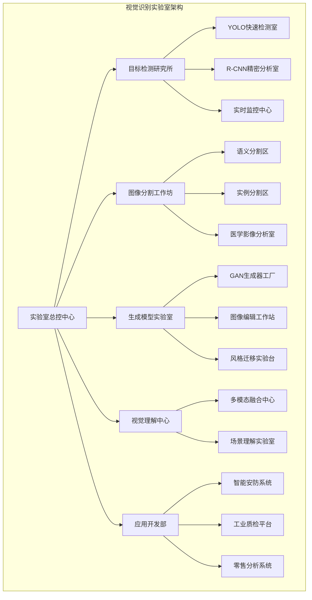
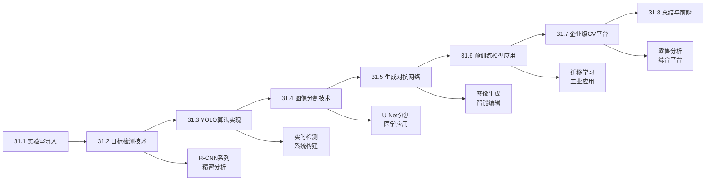
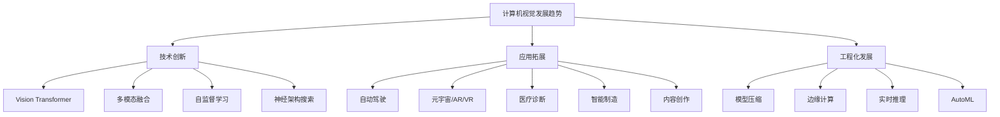

# 第31章 计算机视觉高级应用

> "眼睛是心灵的窗户，而计算机视觉则是AI的眼睛。在视觉识别实验室中，我们将探索让机器'看懂'世界的奥秘。" —— 视觉AI研究先驱

## 🎯 学习目标

### 知识目标
- **深入理解目标检测算法原理**：掌握YOLO、R-CNN系列等主流检测算法
- **掌握图像分割技术**：学习语义分割、实例分割的核心技术
- **学习生成对抗网络应用**：理解GAN在计算机视觉中的创新应用
- **了解现代CV模型架构**：掌握最新的视觉AI技术发展趋势

### 技能目标
- **实现目标检测系统**：能够从零构建和训练目标检测模型
- **开发图像分割应用**：掌握各类分割任务的实现方法
- **应用预训练模型**：具备迁移学习和模型微调的实战能力
- **构建企业级CV平台**：设计端到端的计算机视觉解决方案

### 素养目标
- **培养视觉AI产品思维**：理解CV技术的商业化应用价值
- **建立技术前瞻意识**：跟踪计算机视觉领域的最新发展
- **形成负责任AI理念**：关注视觉AI的伦理和隐私问题

## 31.1 章节导入：走进视觉识别实验室

### 🏢 视觉识别实验室的诞生

想象一下，在第22章的计算机视觉工作室基础上，我们现在要建设一个更加先进的**视觉识别实验室**。如果说之前的工作室像是一个基础的图像处理车间，那么现在的实验室就是一个集研发、测试、应用于一体的现代化AI视觉中心。



### 🔬 实验室的核心使命

我们的视觉识别实验室有四大核心使命：

1. **精确识别**：能够在复杂场景中准确识别和定位目标物体
2. **精细分割**：将图像按照语义或实例进行精确分割
3. **智能生成**：创造逼真的图像内容和进行智能编辑
4. **深度理解**：不仅"看到"，更要"理解"视觉内容的含义

### 🌟 从基础到高级的技术演进

让我们回顾一下计算机视觉技术的发展历程：

```python
class VisionEvolutionDemo:
    """计算机视觉技术演进演示"""
    
    def __init__(self):
        self.evolution_stages = {
            "传统图像处理": {
                "时期": "1960s-2000s",
                "特点": "手工特征提取",
                "代表技术": ["边缘检测", "角点检测", "SIFT", "HOG"],
                "比喻": "手工艺作坊 - 依靠工匠经验"
            },
            "机器学习时代": {
                "时期": "2000s-2010s", 
                "特点": "特征工程+分类器",
                "代表技术": ["SVM", "随机森林", "AdaBoost"],
                "比喻": "半自动化工厂 - 机器辅助人工"
            },
            "深度学习革命": {
                "时期": "2010s-现在",
                "特点": "端到端学习",
                "代表技术": ["CNN", "R-CNN", "YOLO", "Transformer"],
                "比喻": "智能化实验室 - AI自主学习"
            }
        }
    
    def show_evolution(self):
        """展示技术演进过程"""
        print("🔬 计算机视觉技术演进历程")
        print("=" * 50)
        
        for stage, info in self.evolution_stages.items():
            print(f"\n📅 {stage} ({info['时期']})")
            print(f"🎯 核心特点: {info['特点']}")
            print(f"🛠️  代表技术: {', '.join(info['代表技术'])}")
            print(f"🏭 发展比喻: {info['比喻']}")
    
    def analyze_current_trends(self):
        """分析当前发展趋势"""
        trends = {
            "模型架构创新": [
                "Vision Transformer (ViT)",
                "Swin Transformer", 
                "ConvNeXt",
                "EfficientNet"
            ],
            "任务能力提升": [
                "多模态理解",
                "零样本学习", 
                "少样本学习",
                "持续学习"
            ],
            "工程化发展": [
                "模型压缩",
                "边缘部署",
                "实时推理",
                "AutoML"
            ],
            "应用场景扩展": [
                "自动驾驶",
                "医疗影像",
                "工业检测", 
                "AR/VR"
            ]
        }
        
        print("\n🚀 当前发展趋势")
        print("=" * 30)
        
        for trend, technologies in trends.items():
            print(f"\n🎯 {trend}:")
            for tech in technologies:
                print(f"   • {tech}")

# 演示技术演进
demo = VisionEvolutionDemo()
demo.show_evolution()
demo.analyze_current_trends()
```

### 🎯 本章学习路线图

在这个视觉识别实验室中，我们将按照以下路线进行探索：



## 31.2 目标检测技术详解

### 🎯 目标检测：实验室的核心技能

在我们的视觉识别实验室中，**目标检测研究所**是最重要的部门之一。它的任务不仅是回答"图像中有什么？"，更要准确回答"什么在哪里？"。

想象目标检测就像是培训一位超级侦探，这位侦探需要：
- **眼力**：能够快速扫描整个场景
- **专业知识**：知道要找什么目标
- **定位能力**：准确指出目标的位置
- **效率**：在有限时间内处理大量信息

### 🔍 目标检测的核心挑战

```python
class ObjectDetectionChallenges:
    """目标检测面临的核心挑战"""
    
    def __init__(self):
        self.challenges = {
            "多尺度问题": {
                "描述": "同一类物体在图像中可能有不同大小",
                "例子": "远处的汽车vs近处的汽车",
                "解决方案": ["特征金字塔", "多尺度训练", "anchor机制"]
            },
            "遮挡问题": {
                "描述": "目标被其他物体部分或完全遮挡",
                "例子": "树后的行人、重叠的车辆",
                "解决方案": ["部分特征学习", "上下文信息", "实例分割"]
            },
            "类内变化": {
                "描述": "同一类别内部的外观差异很大",
                "例子": "不同品种的狗、不同角度的汽车",
                "解决方案": ["数据增强", "多样化训练集", "特征表示学习"]
            },
            "实时性要求": {
                "描述": "许多应用需要实时或近实时检测",
                "例子": "自动驾驶、视频监控",
                "解决方案": ["模型压缩", "网络优化", "硬件加速"]
            }
        }
    
    def analyze_challenges(self):
        """分析检测挑战"""
        print("🎯 目标检测核心挑战分析")
        print("=" * 40)
        
        for challenge, info in self.challenges.items():
            print(f"\n🔍 {challenge}")
            print(f"📝 描述: {info['描述']}")
            print(f"🌰 例子: {info['例子']}")
            print(f"💡 解决方案: {', '.join(info['解决方案'])}")
    
    def detection_metrics_demo(self):
        """检测评估指标演示"""
        import numpy as np
        
        print("\n📊 目标检测评估指标")
        print("=" * 30)
        
        # 模拟检测结果
        true_boxes = np.array([[10, 10, 50, 50], [100, 100, 150, 150]])  # [x1,y1,x2,y2]
        pred_boxes = np.array([[12, 12, 48, 48], [105, 105, 145, 145]])
        
        # 计算IoU
        def calculate_iou(box1, box2):
            """计算两个边界框的IoU"""
            x1 = max(box1[0], box2[0])
            y1 = max(box1[1], box2[1])
            x2 = min(box1[2], box2[2])
            y2 = min(box1[3], box2[3])
            
            if x2 <= x1 or y2 <= y1:
                return 0.0
            
            intersection = (x2 - x1) * (y2 - y1)
            area1 = (box1[2] - box1[0]) * (box1[3] - box1[1])
            area2 = (box2[2] - box2[0]) * (box2[3] - box2[1])
            union = area1 + area2 - intersection
            
            return intersection / union
        
        # 计算每对框的IoU
        for i, (true_box, pred_box) in enumerate(zip(true_boxes, pred_boxes)):
            iou = calculate_iou(true_box, pred_box)
            print(f"目标{i+1} IoU: {iou:.3f}")
        
        # 评估指标说明
        metrics_info = {
            "IoU (Intersection over Union)": "交并比，衡量预测框与真实框的重叠程度",
            "Precision": "预测为正例中实际为正例的比例",
            "Recall": "实际正例中被正确预测的比例", 
            "mAP (mean Average Precision)": "多类别平均精度，综合评估指标",
            "FPS (Frames Per Second)": "每秒处理帧数，衡量检测速度"
        }
        
        print(f"\n📋 评估指标说明:")
        for metric, description in metrics_info.items():
            print(f"• {metric}: {description}")

# 演示检测挑战
challenges = ObjectDetectionChallenges()
challenges.analyze_challenges()
challenges.detection_metrics_demo()
```

### 🏗️ 目标检测算法架构演进

目标检测算法的发展经历了从两阶段到单阶段的重要演进：

```python
class DetectionArchitectureEvolution:
    """目标检测算法架构演进"""
    
    def __init__(self):
        self.architectures = {
            "两阶段检测器": {
                "代表算法": ["R-CNN", "Fast R-CNN", "Faster R-CNN"],
                "核心思想": "先生成候选区域，再进行分类和回归",
                "优点": ["精度高", "定位准确"],
                "缺点": ["速度慢", "结构复杂"],
                "比喻": "精密分析仪 - 仔细分析每个可疑区域"
            },
            "单阶段检测器": {
                "代表算法": ["YOLO", "SSD", "RetinaNet"],
                "核心思想": "直接预测目标位置和类别",
                "优点": ["速度快", "结构简单"],
                "缺点": ["精度相对较低", "小目标检测困难"],
                "比喻": "快速扫描仪 - 一次扫描完成所有检测"
            }
        }
    
    def compare_architectures(self):
        """比较不同架构"""
        print("🏗️ 目标检测架构对比")
        print("=" * 35)
        
        for arch_type, info in self.architectures.items():
            print(f"\n🔧 {arch_type}")
            print(f"📊 代表算法: {', '.join(info['代表算法'])}")
            print(f"💡 核心思想: {info['核心思想']}")
            print(f"✅ 优点: {', '.join(info['优点'])}")
            print(f"❌ 缺点: {', '.join(info['缺点'])}")
            print(f"🎭 比喻: {info['比喻']}")

# 演示架构演进
evolution = DetectionArchitectureEvolution()
evolution.compare_architectures()
```

### 🔬 R-CNN系列：精密分析的艺术

R-CNN系列算法就像是我们实验室的**精密分析仪**，它采用"分而治之"的策略：

```python
class RCNNFamilyDemo:
    """R-CNN系列算法演示"""
    
    def __init__(self):
        self.rcnn_evolution = {
            "R-CNN (2014)": {
                "创新点": "首次将CNN用于目标检测",
                "流程": ["选择性搜索", "CNN特征提取", "SVM分类", "边界框回归"],
                "问题": "速度慢，重复计算多",
                "检测时间": "~47秒/图"
            },
            "Fast R-CNN (2015)": {
                "创新点": "端到端训练，ROI池化",
                "流程": ["CNN特征图", "ROI池化", "全连接层", "分类+回归"],
                "改进": "速度提升，统一训练",
                "检测时间": "~2.3秒/图"
            },
            "Faster R-CNN (2015)": {
                "创新点": "RPN网络，完全可学习",
                "流程": ["CNN主干", "RPN生成候选", "ROI池化", "分类+回归"],
                "突破": "端到端，实时检测",
                "检测时间": "~0.2秒/图"
            }
        }
    
    def demonstrate_rcnn_evolution(self):
        """演示R-CNN系列演进"""
        print("🔬 R-CNN系列算法演进")
        print("=" * 30)
        
        for model, info in self.rcnn_evolution.items():
            print(f"\n🎯 {model}")
            print(f"💡 创新点: {info['创新点']}")
            print(f"🔄 流程: {' → '.join(info['流程'])}")
            if 'problem' in info:
                print(f"❌ 问题: {info['问题']}")
            if '改进' in info:
                print(f"✅ 改进: {info['改进']}")
            if '突破' in info:
                print(f"🚀 突破: {info['突破']}")
            print(f"⏱️  检测时间: {info['检测时间']}")
    
    def simulate_faster_rcnn(self):
        """模拟Faster R-CNN检测流程"""
        import numpy as np
        
        print("\n🎯 Faster R-CNN检测流程模拟")
        print("=" * 35)
        
        # 模拟输入图像
        image_shape = (800, 600, 3)
        print(f"📸 输入图像尺寸: {image_shape}")
        
        # 1. CNN主干网络提取特征
        feature_map_shape = (50, 38, 512)  # 下采样16倍
        print(f"🧠 特征图尺寸: {feature_map_shape}")
        
        # 2. RPN生成候选区域
        num_proposals = 2000
        proposals = np.random.rand(num_proposals, 4) * 800  # 随机生成候选框
        print(f"🎯 RPN生成候选区域: {num_proposals}个")
        
        # 3. ROI池化
        roi_size = (7, 7, 512)
        print(f"🔄 ROI池化后尺寸: {roi_size}")
        
        # 4. 分类和回归
        num_classes = 20  # VOC数据集类别数
        print(f"📊 分类类别数: {num_classes}")
        
        # 模拟检测结果
        detections = {
            "person": {"confidence": 0.95, "bbox": [100, 50, 200, 300]},
            "car": {"confidence": 0.87, "bbox": [300, 200, 500, 400]},
            "bicycle": {"confidence": 0.72, "bbox": [150, 180, 250, 280]}
        }
        
        print(f"\n🎉 检测结果:")
        for obj_class, info in detections.items():
            print(f"• {obj_class}: 置信度{info['confidence']:.2f}, "
                  f"位置{info['bbox']}")

# 演示R-CNN系列
rcnn_demo = RCNNFamilyDemo()
rcnn_demo.demonstrate_rcnn_evolution()
rcnn_demo.simulate_faster_rcnn()
```

### 🎯 实战项目：智能安防监控系统

让我们构建一个基于R-CNN的智能安防监控系统：

```python
import cv2
import numpy as np
from typing import List, Dict, Tuple
import matplotlib.pyplot as plt

class IntelligentSecuritySystem:
    """智能安防监控系统"""
    
    def __init__(self):
        self.alert_classes = ['person', 'car', 'bicycle', 'motorbike']
        self.alert_zones = []  # 警戒区域
        self.detection_history = []
        self.alert_threshold = 0.7
        
        print("🔒 智能安防监控系统初始化完成")
        print(f"📋 监控目标: {', '.join(self.alert_classes)}")
    
    def add_alert_zone(self, zone_name: str, coordinates: List[Tuple[int, int]]):
        """添加警戒区域"""
        zone = {
            'name': zone_name,
            'coordinates': coordinates,
            'active': True
        }
        self.alert_zones.append(zone)
        print(f"🚨 添加警戒区域: {zone_name}")
    
    def simulate_detection(self, frame_id: int) -> List[Dict]:
        """模拟目标检测（实际应用中这里会调用真实的检测模型）"""
        # 模拟检测结果
        detections = []
        
        if frame_id % 10 == 0:  # 每10帧检测到一个人
            detections.append({
                'class': 'person',
                'confidence': 0.85 + np.random.random() * 0.1,
                'bbox': [100 + np.random.randint(-20, 20), 
                        50 + np.random.randint(-10, 10),
                        180 + np.random.randint(-15, 15), 
                        250 + np.random.randint(-20, 20)]
            })
        
        if frame_id % 15 == 0:  # 每15帧检测到一辆车
            detections.append({
                'class': 'car',
                'confidence': 0.92 + np.random.random() * 0.05,
                'bbox': [300 + np.random.randint(-30, 30), 
                        200 + np.random.randint(-20, 20),
                        450 + np.random.randint(-25, 25), 
                        320 + np.random.randint(-15, 15)]
            })
        
        return detections
    
    def check_zone_intrusion(self, detections: List[Dict]) -> List[Dict]:
        """检查区域入侵"""
        alerts = []
        
        for detection in detections:
            if detection['confidence'] < self.alert_threshold:
                continue
                
            bbox = detection['bbox']
            center_x = (bbox[0] + bbox[2]) // 2
            center_y = (bbox[1] + bbox[3]) // 2
            
            for zone in self.alert_zones:
                if not zone['active']:
                    continue
                    
                # 简化的点在多边形内判断（这里用矩形区域简化）
                if self._point_in_zone((center_x, center_y), zone):
                    alert = {
                        'type': 'zone_intrusion',
                        'zone': zone['name'],
                        'object': detection['class'],
                        'confidence': detection['confidence'],
                        'position': (center_x, center_y),
                        'timestamp': f"Frame_{len(self.detection_history)}"
                    }
                    alerts.append(alert)
        
        return alerts
    
    def _point_in_zone(self, point: Tuple[int, int], zone: Dict) -> bool:
        """判断点是否在区域内（简化实现）"""
        # 这里简化为矩形区域判断
        coords = zone['coordinates']
        if len(coords) >= 2:
            x1, y1 = coords[0]
            x2, y2 = coords[1]
            px, py = point
            return x1 <= px <= x2 and y1 <= py <= y2
        return False
    
    def process_frame(self, frame_id: int) -> Dict:
        """处理单帧"""
        # 1. 目标检测
        detections = self.simulate_detection(frame_id)
        
        # 2. 区域入侵检查
        alerts = self.check_zone_intrusion(detections)
        
        # 3. 记录历史
        frame_data = {
            'frame_id': frame_id,
            'detections': detections,
            'alerts': alerts,
            'timestamp': f"2024-01-01 10:{frame_id//60:02d}:{frame_id%60:02d}"
        }
        self.detection_history.append(frame_data)
        
        # 4. 输出结果
        if detections:
            print(f"\n📹 Frame {frame_id}:")
            for det in detections:
                print(f"  🎯 检测到 {det['class']} (置信度: {det['confidence']:.2f})")
        
        if alerts:
            for alert in alerts:
                print(f"  🚨 警报: {alert['zone']}区域发现{alert['object']}")
        
        return frame_data
    
    def run_monitoring(self, num_frames: int = 50):
        """运行监控"""
        print(f"\n🎬 开始监控，共处理 {num_frames} 帧")
        print("=" * 40)
        
        for frame_id in range(num_frames):
            self.process_frame(frame_id)
        
        self.generate_report()
    
    def generate_report(self):
        """生成监控报告"""
        total_detections = sum(len(frame['detections']) for frame in self.detection_history)
        total_alerts = sum(len(frame['alerts']) for frame in self.detection_history)
        
        print(f"\n📊 监控报告")
        print("=" * 20)
        print(f"📹 总帧数: {len(self.detection_history)}")
        print(f"🎯 总检测数: {total_detections}")
        print(f"🚨 总警报数: {total_alerts}")
        
        # 按类别统计
        class_counts = {}
        for frame in self.detection_history:
            for det in frame['detections']:
                class_name = det['class']
                class_counts[class_name] = class_counts.get(class_name, 0) + 1
        
        if class_counts:
            print(f"\n📈 检测统计:")
            for class_name, count in class_counts.items():
                print(f"  • {class_name}: {count}次")
        
        # 警报统计
        if total_alerts > 0:
            print(f"\n🚨 警报详情:")
            alert_zones = {}
            for frame in self.detection_history:
                for alert in frame['alerts']:
                    zone = alert['zone']
                    alert_zones[zone] = alert_zones.get(zone, 0) + 1
            
            for zone, count in alert_zones.items():
                print(f"  • {zone}: {count}次入侵")

# 演示智能安防系统
def demo_security_system():
    """演示智能安防系统"""
    # 创建系统
    security_system = IntelligentSecuritySystem()
    
    # 添加警戒区域
    security_system.add_alert_zone("入口区域", [(80, 40), (220, 270)])
    security_system.add_alert_zone("停车区域", [(280, 180), (470, 340)])
    
    # 运行监控
    security_system.run_monitoring(30)

# 运行演示
demo_security_system()
```

### 📊 目标检测性能分析

```python
class DetectionPerformanceAnalyzer:
    """目标检测性能分析器"""
    
    def __init__(self):
        self.models_performance = {
            "Faster R-CNN": {
                "mAP": 0.732,
                "FPS": 7,
                "模型大小": "137MB",
                "适用场景": "高精度要求"
            },
            "YOLOv3": {
                "mAP": 0.553,
                "FPS": 20,
                "模型大小": "248MB", 
                "适用场景": "实时检测"
            },
            "YOLOv5s": {
                "mAP": 0.567,
                "FPS": 45,
                "模型大小": "14MB",
                "适用场景": "移动端部署"
            },
            "RetinaNet": {
                "mAP": 0.708,
                "FPS": 12,
                "模型大小": "145MB",
                "适用场景": "平衡精度速度"
            }
        }
    
    def compare_models(self):
        """比较不同模型性能"""
        print("📊 目标检测模型性能对比")
        print("=" * 35)
        
        print(f"{'模型':<15} {'mAP':<8} {'FPS':<6} {'大小':<10} {'适用场景'}")
        print("-" * 55)
        
        for model, perf in self.models_performance.items():
            print(f"{model:<15} {perf['mAP']:<8.3f} {perf['FPS']:<6} "
                  f"{perf['模型大小']:<10} {perf['适用场景']}")
    
    def analyze_tradeoffs(self):
        """分析性能权衡"""
        print(f"\n⚖️ 性能权衡分析")
        print("=" * 20)
        
        tradeoffs = {
            "精度 vs 速度": "高精度模型通常推理速度较慢",
            "模型大小 vs 性能": "更大的模型通常有更好的性能",
            "通用性 vs 专用性": "通用模型在特定任务上可能不如专用模型",
            "训练成本 vs 推理成本": "复杂模型训练成本高但推理时可能更高效"
        }
        
        for aspect, description in tradeoffs.items():
            print(f"• {aspect}: {description}")

# 性能分析演示
analyzer = DetectionPerformanceAnalyzer()
analyzer.compare_models()
analyzer.analyze_tradeoffs()
```

通过本节的学习，我们深入了解了目标检测技术的核心原理和主要算法。在下一节中，我们将重点学习YOLO算法的深度实现，这是单阶段检测器的杰出代表。

## 31.3 YOLO算法深度实现

### ⚡ YOLO：快速检测的艺术

YOLO（You Only Look Once）算法就像是我们实验室的**快速扫描仪**，它的核心哲学是"一次扫描，全部搞定"。不同于R-CNN系列的"两步走"策略，YOLO采用"一步到位"的方法，直接从图像中预测目标的位置和类别。

想象YOLO就像一位经验丰富的安检员，能够在一次快速扫描中同时发现所有可疑物品并准确定位，而不需要反复检查。

### 🧠 YOLO核心思想

```python
class YOLOConceptDemo:
    """YOLO核心概念演示"""
    
    def __init__(self):
        self.yolo_principles = {
            "统一检测": "将检测问题转化为回归问题",
            "网格划分": "将图像划分为S×S网格",
            "边界框预测": "每个网格预测B个边界框",
            "类别预测": "每个网格预测C个类别概率",
            "端到端训练": "从原始像素到最终检测结果"
        }
    
    def explain_yolo_workflow(self):
        """解释YOLO工作流程"""
        print("⚡ YOLO算法工作流程")
        print("=" * 25)
        
        workflow = [
            "1. 图像预处理 → 调整到固定尺寸(如448×448)",
            "2. 网格划分 → 分割为7×7网格",
            "3. CNN特征提取 → 提取图像特征",
            "4. 全连接预测 → 输出检测结果",
            "5. 后处理 → NMS去除重复检测"
        ]
        
        for step in workflow:
            print(f"   {step}")
        
        print(f"\n💡 核心原理:")
        for principle, description in self.yolo_principles.items():
            print(f"• {principle}: {description}")
    
    def yolo_output_format(self):
        """YOLO输出格式说明"""
        print(f"\n📊 YOLO输出格式 (以7×7网格为例)")
        print("=" * 35)
        
        # 假设20个类别，2个边界框
        S, B, C = 7, 2, 20
        output_size = S * S * (B * 5 + C)
        
        print(f"网格大小: {S}×{S} = {S*S}个网格")
        print(f"每个网格预测: {B}个边界框 + {C}个类别")
        print(f"边界框信息: (x, y, w, h, confidence) × {B}")
        print(f"总输出维度: {S}×{S}×({B*5}+{C}) = {output_size}")
        
        # 输出格式详解
        print(f"\n📋 输出张量结构:")
        print(f"• 前{B*5}个通道: 边界框信息")
        print(f"  - (x,y): 相对于网格的中心坐标")
        print(f"  - (w,h): 相对于整个图像的宽高")
        print(f"  - confidence: 置信度分数")
        print(f"• 后{C}个通道: 类别概率")

# 演示YOLO概念
yolo_demo = YOLOConceptDemo()
yolo_demo.explain_yolo_workflow()
yolo_demo.yolo_output_format()
```

### 🏗️ YOLO网络架构实现

让我们从零开始实现一个简化版的YOLO检测器：

```python
import torch
import torch.nn as nn
import torch.nn.functional as F
import numpy as np
from typing import List, Tuple, Dict

class YOLOv1Network(nn.Module):
    """YOLOv1网络架构实现"""
    
    def __init__(self, num_classes=20, num_boxes=2):
        super(YOLOv1Network, self).__init__()
        self.num_classes = num_classes
        self.num_boxes = num_boxes
        self.S = 7  # 网格大小
        
        # 卷积层（简化的Darknet主干）
        self.features = nn.Sequential(
            # 第一组卷积块
            nn.Conv2d(3, 64, 7, stride=2, padding=3),
            nn.BatchNorm2d(64),
            nn.LeakyReLU(0.1, inplace=True),
            nn.MaxPool2d(2, stride=2),
            
            # 第二组卷积块
            nn.Conv2d(64, 192, 3, padding=1),
            nn.BatchNorm2d(192),
            nn.LeakyReLU(0.1, inplace=True),
            nn.MaxPool2d(2, stride=2),
            
            # 第三组卷积块
            nn.Conv2d(192, 128, 1),
            nn.Conv2d(128, 256, 3, padding=1),
            nn.Conv2d(256, 256, 1),
            nn.Conv2d(256, 512, 3, padding=1),
            nn.BatchNorm2d(512),
            nn.LeakyReLU(0.1, inplace=True),
            nn.MaxPool2d(2, stride=2),
            
            # 第四组卷积块
            nn.Conv2d(512, 256, 1),
            nn.Conv2d(256, 512, 3, padding=1),
            nn.Conv2d(512, 256, 1),
            nn.Conv2d(256, 512, 3, padding=1),
            nn.Conv2d(512, 512, 1),
            nn.Conv2d(512, 1024, 3, padding=1),
            nn.BatchNorm2d(1024),
            nn.LeakyReLU(0.1, inplace=True),
            nn.MaxPool2d(2, stride=2),
            
            # 第五组卷积块
            nn.Conv2d(1024, 512, 1),
            nn.Conv2d(512, 1024, 3, padding=1),
            nn.Conv2d(1024, 512, 1),
            nn.Conv2d(512, 1024, 3, padding=1),
            nn.Conv2d(1024, 1024, 3, padding=1),
            nn.Conv2d(1024, 1024, 3, stride=2, padding=1),
            
            # 最后的卷积层
            nn.Conv2d(1024, 1024, 3, padding=1),
            nn.Conv2d(1024, 1024, 3, padding=1),
            nn.BatchNorm2d(1024),
            nn.LeakyReLU(0.1, inplace=True)
        )
        
        # 全连接层
        self.classifier = nn.Sequential(
            nn.AdaptiveAvgPool2d((self.S, self.S)),
            nn.Flatten(),
            nn.Linear(1024 * self.S * self.S, 4096),
            nn.LeakyReLU(0.1, inplace=True),
            nn.Dropout(0.5),
            nn.Linear(4096, self.S * self.S * (self.num_boxes * 5 + self.num_classes))
        )
        
        print(f"🧠 YOLO网络初始化完成")
        print(f"📊 网格大小: {self.S}×{self.S}")
        print(f"🎯 类别数: {self.num_classes}")
        print(f"📦 边界框数: {self.num_boxes}")
    
    def forward(self, x):
        """前向传播"""
        # 特征提取
        features = self.features(x)
        
        # 分类和回归
        output = self.classifier(features)
        
        # 重塑输出张量
        batch_size = x.size(0)
        output = output.view(batch_size, self.S, self.S, 
                           self.num_boxes * 5 + self.num_classes)
        
        return output
    
    def decode_predictions(self, predictions, conf_threshold=0.5):
        """解码预测结果"""
        batch_size = predictions.size(0)
        all_detections = []
        
        for batch_idx in range(batch_size):
            pred = predictions[batch_idx]  # [S, S, B*5+C]
            detections = []
            
            for i in range(self.S):
                for j in range(self.S):
                    # 提取边界框信息
                    for b in range(self.num_boxes):
                        start_idx = b * 5
                        box_pred = pred[i, j, start_idx:start_idx+5]
                        
                        x, y, w, h, confidence = box_pred
                        
                        if confidence > conf_threshold:
                            # 转换坐标到图像坐标系
                            center_x = (j + x.item()) / self.S
                            center_y = (i + y.item()) / self.S
                            width = w.item()
                            height = h.item()
                            
                            # 转换为边界框格式 [x1, y1, x2, y2]
                            x1 = center_x - width / 2
                            y1 = center_y - height / 2
                            x2 = center_x + width / 2
                            y2 = center_y + height / 2
                            
                            # 提取类别概率
                            class_probs = pred[i, j, self.num_boxes*5:]
                            class_prob, class_idx = torch.max(class_probs, 0)
                            
                            # 计算最终置信度
                            final_conf = confidence * class_prob
                            
                            if final_conf > conf_threshold:
                                detections.append({
                                    'bbox': [x1.item(), y1.item(), x2.item(), y2.item()],
                                    'confidence': final_conf.item(),
                                    'class_id': class_idx.item(),
                                    'grid_pos': (i, j)
                                })
            
            all_detections.append(detections)
        
        return all_detections

class YOLOLoss(nn.Module):
    """YOLO损失函数"""
    
    def __init__(self, S=7, B=2, C=20, lambda_coord=5, lambda_noobj=0.5):
        super(YOLOLoss, self).__init__()
        self.S = S
        self.B = B
        self.C = C
        self.lambda_coord = lambda_coord
        self.lambda_noobj = lambda_noobj
    
    def forward(self, predictions, targets):
        """计算YOLO损失"""
        batch_size = predictions.size(0)
        
        # 重塑预测和目标张量
        predictions = predictions.view(batch_size, self.S, self.S, self.B * 5 + self.C)
        
        # 分离预测的不同部分
        pred_boxes = predictions[:, :, :, :self.B * 5].contiguous()
        pred_classes = predictions[:, :, :, self.B * 5:]
        
        # 初始化损失
        coord_loss = 0
        conf_loss = 0
        class_loss = 0
        
        for batch_idx in range(batch_size):
            for i in range(self.S):
                for j in range(self.S):
                    # 这里简化损失计算，实际实现需要更复杂的逻辑
                    # 包括IoU计算、责任分配等
                    pass
        
        total_loss = (self.lambda_coord * coord_loss + 
                     conf_loss + 
                     self.lambda_noobj * conf_loss + 
                     class_loss)
        
        return total_loss

class YOLODetector:
    """YOLO检测器封装类"""
    
    def __init__(self, num_classes=20, device='cpu'):
        self.device = device
        self.num_classes = num_classes
        self.model = YOLOv1Network(num_classes).to(device)
        self.class_names = [f'class_{i}' for i in range(num_classes)]
        
        print(f"🎯 YOLO检测器初始化完成")
        print(f"🖥️  设备: {device}")
    
    def load_pretrained(self, model_path):
        """加载预训练模型"""
        try:
            checkpoint = torch.load(model_path, map_location=self.device)
            self.model.load_state_dict(checkpoint)
            print(f"✅ 成功加载预训练模型: {model_path}")
        except Exception as e:
            print(f"❌ 模型加载失败: {e}")
    
    def preprocess_image(self, image, input_size=448):
        """图像预处理"""
        if isinstance(image, np.ndarray):
            image = torch.from_numpy(image).float()
        
        # 调整尺寸
        if len(image.shape) == 3:
            image = image.unsqueeze(0)  # 添加batch维度
        
        # 归一化
        image = image / 255.0
        
        # 调整到指定尺寸
        image = F.interpolate(image, size=(input_size, input_size), 
                            mode='bilinear', align_corners=False)
        
        return image.to(self.device)
    
    def detect(self, image, conf_threshold=0.5, nms_threshold=0.4):
        """目标检测"""
        # 预处理
        processed_image = self.preprocess_image(image)
        
        # 推理
        self.model.eval()
        with torch.no_grad():
            predictions = self.model(processed_image)
            detections = self.model.decode_predictions(predictions, conf_threshold)
        
        # NMS后处理
        final_detections = []
        for batch_detections in detections:
            nms_detections = self.apply_nms(batch_detections, nms_threshold)
            final_detections.append(nms_detections)
        
        return final_detections[0] if len(final_detections) == 1 else final_detections
    
    def apply_nms(self, detections, nms_threshold):
        """非极大值抑制"""
        if not detections:
            return []
        
        # 按置信度排序
        detections.sort(key=lambda x: x['confidence'], reverse=True)
        
        keep = []
        while detections:
            # 保留置信度最高的检测
            current = detections.pop(0)
            keep.append(current)
            
            # 移除与当前检测重叠度高的其他检测
            detections = [det for det in detections 
                         if self.calculate_iou(current['bbox'], det['bbox']) < nms_threshold]
        
        return keep
    
    def calculate_iou(self, box1, box2):
        """计算IoU"""
        x1 = max(box1[0], box2[0])
        y1 = max(box1[1], box2[1])
        x2 = min(box1[2], box2[2])
        y2 = min(box1[3], box2[3])
        
        if x2 <= x1 or y2 <= y1:
            return 0.0
        
        intersection = (x2 - x1) * (y2 - y1)
        area1 = (box1[2] - box1[0]) * (box1[3] - box1[1])
        area2 = (box2[2] - box2[0]) * (box2[3] - box2[1])
        union = area1 + area2 - intersection
        
        return intersection / union

# 演示YOLO检测器
def demo_yolo_detector():
    """演示YOLO检测器"""
    print("⚡ YOLO检测器演示")
    print("=" * 20)
    
    # 创建检测器
    detector = YOLODetector(num_classes=20)
    
    # 模拟输入图像
    dummy_image = torch.randn(3, 416, 416)  # RGB图像
    print(f"📸 输入图像尺寸: {dummy_image.shape}")
    
    # 执行检测
    detections = detector.detect(dummy_image, conf_threshold=0.1)
    
    print(f"🎯 检测结果数量: {len(detections)}")
    for i, det in enumerate(detections[:5]):  # 显示前5个结果
        print(f"  检测{i+1}: 类别{det['class_id']}, "
              f"置信度{det['confidence']:.3f}, "
              f"位置{[f'{x:.3f}' for x in det['bbox']]}")

# 运行演示
demo_yolo_detector()
```

### 🚗 实战项目：实时交通监控系统

让我们构建一个基于YOLO的实时交通监控系统：

```python
import time
import threading
from collections import deque
from dataclasses import dataclass
from typing import Optional

@dataclass
class TrafficEvent:
    """交通事件数据类"""
    event_type: str
    timestamp: float
    location: Tuple[int, int]
    confidence: float
    description: str

class RealTimeTrafficMonitor:
    """实时交通监控系统"""
    
    def __init__(self):
        self.detector = YOLODetector(num_classes=80)  # COCO数据集类别
        self.vehicle_classes = [2, 3, 5, 7]  # car, motorcycle, bus, truck
        self.person_class = 0  # person
        
        # 监控参数
        self.speed_zones = {}
        self.traffic_events = deque(maxlen=1000)
        self.vehicle_tracks = {}
        self.monitoring_active = False
        
        # 统计数据
        self.hourly_counts = {
            'vehicles': 0,
            'pedestrians': 0,
            'violations': 0
        }
        
        print("🚗 实时交通监控系统初始化完成")
    
    def add_speed_zone(self, zone_name: str, coordinates: List[Tuple[int, int]], 
                      speed_limit: int):
        """添加限速区域"""
        self.speed_zones[zone_name] = {
            'coordinates': coordinates,
            'speed_limit': speed_limit,
            'violations': []
        }
        print(f"🚦 添加限速区域: {zone_name} (限速: {speed_limit}km/h)")
    
    def detect_traffic_violations(self, detections: List[Dict], frame_id: int) -> List[TrafficEvent]:
        """检测交通违规"""
        violations = []
        current_time = time.time()
        
        for detection in detections:
            class_id = detection['class_id']
            bbox = detection['bbox']
            confidence = detection['confidence']
            
            # 检测行人在车道上
            if class_id == self.person_class:
                if self._is_in_vehicle_lane(bbox):
                    event = TrafficEvent(
                        event_type="pedestrian_in_lane",
                        timestamp=current_time,
                        location=(int((bbox[0] + bbox[2])/2), int((bbox[1] + bbox[3])/2)),
                        confidence=confidence,
                        description="行人进入车道"
                    )
                    violations.append(event)
            
            # 检测车辆超速（简化实现）
            elif class_id in self.vehicle_classes:
                vehicle_speed = self._estimate_vehicle_speed(detection, frame_id)
                if vehicle_speed and vehicle_speed > 60:  # 假设限速60km/h
                    event = TrafficEvent(
                        event_type="speeding",
                        timestamp=current_time,
                        location=(int((bbox[0] + bbox[2])/2), int((bbox[1] + bbox[3])/2)),
                        confidence=confidence,
                        description=f"车辆超速 ({vehicle_speed:.1f}km/h)"
                    )
                    violations.append(event)
        
        return violations
    
    def _is_in_vehicle_lane(self, bbox: List[float]) -> bool:
        """判断是否在车道内（简化实现）"""
        # 这里简化为判断是否在图像下半部分
        center_y = (bbox[1] + bbox[3]) / 2
        return center_y > 0.6  # 图像下40%区域视为车道
    
    def _estimate_vehicle_speed(self, detection: Dict, frame_id: int) -> Optional[float]:
        """估算车辆速度（简化实现）"""
        vehicle_id = f"vehicle_{detection['class_id']}_{int(detection['bbox'][0])}"
        current_pos = ((detection['bbox'][0] + detection['bbox'][2]) / 2,
                      (detection['bbox'][1] + detection['bbox'][3]) / 2)
        
        if vehicle_id in self.vehicle_tracks:
            prev_pos, prev_frame = self.vehicle_tracks[vehicle_id]
            
            # 计算位移和时间差
            distance = ((current_pos[0] - prev_pos[0])**2 + 
                       (current_pos[1] - prev_pos[1])**2)**0.5
            frame_diff = frame_id - prev_frame
            
            if frame_diff > 0:
                # 简化的速度计算（假设30fps，1像素=0.1米）
                speed_mps = (distance * 0.1) / (frame_diff / 30.0)
                speed_kmh = speed_mps * 3.6
                
                self.vehicle_tracks[vehicle_id] = (current_pos, frame_id)
                return speed_kmh
        
        self.vehicle_tracks[vehicle_id] = (current_pos, frame_id)
        return None
    
    def analyze_traffic_flow(self, detections: List[Dict]) -> Dict:
        """分析交通流量"""
        vehicle_count = sum(1 for det in detections if det['class_id'] in self.vehicle_classes)
        pedestrian_count = sum(1 for det in detections if det['class_id'] == self.person_class)
        
        # 更新统计
        self.hourly_counts['vehicles'] += vehicle_count
        self.hourly_counts['pedestrians'] += pedestrian_count
        
        # 计算拥堵指数（简化）
        congestion_index = min(vehicle_count / 10.0, 1.0)  # 0-1之间
        
        flow_analysis = {
            'current_vehicles': vehicle_count,
            'current_pedestrians': pedestrian_count,
            'congestion_index': congestion_index,
            'congestion_level': self._get_congestion_level(congestion_index),
            'hourly_totals': self.hourly_counts.copy()
        }
        
        return flow_analysis
    
    def _get_congestion_level(self, index: float) -> str:
        """获取拥堵等级"""
        if index < 0.3:
            return "畅通"
        elif index < 0.6:
            return "缓慢"
        elif index < 0.8:
            return "拥堵"
        else:
            return "严重拥堵"
    
    def process_traffic_frame(self, frame_data: np.ndarray, frame_id: int) -> Dict:
        """处理交通监控帧"""
        # 1. 目标检测
        detections = self.detector.detect(frame_data, conf_threshold=0.5)
        
        # 2. 违规检测
        violations = self.detect_traffic_violations(detections, frame_id)
        self.traffic_events.extend(violations)
        self.hourly_counts['violations'] += len(violations)
        
        # 3. 流量分析
        flow_analysis = self.analyze_traffic_flow(detections)
        
        # 4. 生成报告
        report = {
            'frame_id': frame_id,
            'timestamp': time.time(),
            'detections': detections,
            'violations': violations,
            'flow_analysis': flow_analysis,
            'total_events': len(self.traffic_events)
        }
        
        return report
    
    def generate_traffic_summary(self) -> Dict:
        """生成交通监控摘要"""
        recent_events = list(self.traffic_events)[-50:]  # 最近50个事件
        
        # 按类型统计事件
        event_counts = {}
        for event in recent_events:
            event_type = event.event_type
            event_counts[event_type] = event_counts.get(event_type, 0) + 1
        
        summary = {
            'monitoring_duration': time.time(),
            'total_events': len(self.traffic_events),
            'recent_events': len(recent_events),
            'event_breakdown': event_counts,
            'hourly_statistics': self.hourly_counts,
            'active_vehicles': len(self.vehicle_tracks)
        }
        
        return summary
    
    def start_monitoring(self, duration_seconds: int = 60):
        """启动监控"""
        print(f"🎬 开始交通监控 (持续{duration_seconds}秒)")
        print("=" * 35)
        
        self.monitoring_active = True
        start_time = time.time()
        frame_id = 0
        
        while self.monitoring_active and (time.time() - start_time) < duration_seconds:
            # 模拟获取视频帧
            dummy_frame = np.random.randint(0, 255, (480, 640, 3), dtype=np.uint8)
            
            # 处理帧
            report = self.process_traffic_frame(dummy_frame, frame_id)
            
            # 输出关键信息
            if frame_id % 30 == 0:  # 每30帧输出一次
                flow = report['flow_analysis']
                print(f"帧{frame_id}: 车辆{flow['current_vehicles']}辆, "
                      f"行人{flow['current_pedestrians']}人, "
                      f"路况: {flow['congestion_level']}")
                
                if report['violations']:
                    for violation in report['violations']:
                        print(f"  🚨 违规: {violation.description}")
            
            frame_id += 1
            time.sleep(0.033)  # 模拟30fps
        
        # 生成最终摘要
        summary = self.generate_traffic_summary()
        self._print_final_summary(summary)
    
    def _print_final_summary(self, summary: Dict):
        """打印最终摘要"""
        print(f"\n📊 交通监控摘要")
        print("=" * 20)
        print(f"🎯 总事件数: {summary['total_events']}")
        print(f"🚗 累计车辆: {summary['hourly_statistics']['vehicles']}")
        print(f"🚶 累计行人: {summary['hourly_statistics']['pedestrians']}")
        print(f"🚨 违规次数: {summary['hourly_statistics']['violations']}")
        
        if summary['event_breakdown']:
            print(f"\n📋 事件类型统计:")
            for event_type, count in summary['event_breakdown'].items():
                print(f"  • {event_type}: {count}次")

# 演示交通监控系统
def demo_traffic_monitor():
    """演示交通监控系统"""
    # 创建监控系统
    monitor = RealTimeTrafficMonitor()
    
    # 添加监控区域
    monitor.add_speed_zone("主干道", [(0, 200), (640, 400)], 60)
    
    # 启动监控
    monitor.start_monitoring(30)  # 监控30秒

# 运行演示
demo_traffic_monitor()
```

## 31.4 图像分割技术实战

### 🎨 图像分割：精细分析的艺术

如果说目标检测是"找到目标在哪里"，那么图像分割就是"精确描绘目标的形状"。在我们的视觉识别实验室中，**图像分割工作坊**就像是一个精密的雕刻工作室，能够将图像中的每个像素都精确地归类到对应的对象或区域。

想象图像分割就像是用不同颜色的画笔为图像中的每个区域上色，最终得到一幅精确的"分割地图"。

### 🔍 图像分割的类型

```python
class ImageSegmentationTypes:
    """图像分割类型详解"""
    
    def __init__(self):
        self.segmentation_types = {
            "语义分割": {
                "定义": "为每个像素分配语义类别标签",
                "特点": "同类别对象不区分个体",
                "输出": "类别掩码图",
                "应用": "场景理解、自动驾驶",
                "比喻": "为地图标注不同的地形类型"
            },
            "实例分割": {
                "定义": "区分同类别的不同个体实例",
                "特点": "每个实例有独立的掩码",
                "输出": "实例掩码图",
                "应用": "目标计数、机器人抓取",
                "比喻": "为每个人分配不同的身份证号"
            },
            "全景分割": {
                "定义": "结合语义分割和实例分割",
                "特点": "既有语义信息又有实例信息",
                "输出": "全景掩码图",
                "应用": "完整场景理解",
                "比喻": "制作详细的人口普查地图"
            }
        }
    
    def explain_segmentation_types(self):
        """解释分割类型"""
        print("🎨 图像分割类型详解")
        print("=" * 25)
        
        for seg_type, info in self.segmentation_types.items():
            print(f"\n🔍 {seg_type}")
            print(f"📝 定义: {info['定义']}")
            print(f"🎯 特点: {info['特点']}")
            print(f"📊 输出: {info['输出']}")
            print(f"🌟 应用: {info['应用']}")
            print(f"🎭 比喻: {info['比喻']}")
    
    def demonstrate_segmentation_difference(self):
        """演示分割类型差异"""
        print(f"\n🎯 分割类型对比示例")
        print("=" * 25)
        
        # 模拟场景：图像中有2个人、1辆车、背景
        scene_description = "场景: 2个人 + 1辆车 + 背景"
        print(f"📸 {scene_description}")
        
        segmentation_results = {
            "语义分割": {
                "person": "所有人像素标记为'person'",
                "car": "车辆像素标记为'car'", 
                "background": "背景像素标记为'background'",
                "特点": "不区分两个人的个体差异"
            },
            "实例分割": {
                "person_1": "第一个人的独立掩码",
                "person_2": "第二个人的独立掩码",
                "car_1": "车辆的独立掩码",
                "特点": "每个个体都有独立标识"
            },
            "全景分割": {
                "组合": "语义分割 + 实例分割",
                "输出": "person_1, person_2, car_1, background",
                "特点": "完整的场景理解"
            }
        }
        
        for method, results in segmentation_results.items():
            print(f"\n🔧 {method}:")
            for key, value in results.items():
                print(f"  • {key}: {value}")

# 演示分割类型
seg_types = ImageSegmentationTypes()
seg_types.explain_segmentation_types()
seg_types.demonstrate_segmentation_difference()
```

### 🏗️ U-Net架构详解与实现

U-Net是图像分割领域的经典架构，其独特的U形结构就像是我们实验室的**精密分割器**，能够在保持细节的同时进行准确分割。

```python
import torch
import torch.nn as nn
import torch.nn.functional as F

class DoubleConv(nn.Module):
    """双卷积块 - U-Net的基本构建单元"""
    
    def __init__(self, in_channels, out_channels):
        super(DoubleConv, self).__init__()
        self.double_conv = nn.Sequential(
            nn.Conv2d(in_channels, out_channels, 3, padding=1),
            nn.BatchNorm2d(out_channels),
            nn.ReLU(inplace=True),
            nn.Conv2d(out_channels, out_channels, 3, padding=1),
            nn.BatchNorm2d(out_channels),
            nn.ReLU(inplace=True)
        )
    
    def forward(self, x):
        return self.double_conv(x)

class UNet(nn.Module):
    """U-Net网络架构实现"""
    
    def __init__(self, n_channels=3, n_classes=1):
        super(UNet, self).__init__()
        self.n_channels = n_channels
        self.n_classes = n_classes
        
        # 编码器（下采样路径）
        self.inc = DoubleConv(n_channels, 64)
        self.down1 = nn.Sequential(nn.MaxPool2d(2), DoubleConv(64, 128))
        self.down2 = nn.Sequential(nn.MaxPool2d(2), DoubleConv(128, 256))
        self.down3 = nn.Sequential(nn.MaxPool2d(2), DoubleConv(256, 512))
        self.down4 = nn.Sequential(nn.MaxPool2d(2), DoubleConv(512, 1024))
        
        # 解码器（上采样路径）
        self.up1 = nn.ConvTranspose2d(1024, 512, 2, stride=2)
        self.conv1 = DoubleConv(1024, 512)
        self.up2 = nn.ConvTranspose2d(512, 256, 2, stride=2)
        self.conv2 = DoubleConv(512, 256)
        self.up3 = nn.ConvTranspose2d(256, 128, 2, stride=2)
        self.conv3 = DoubleConv(256, 128)
        self.up4 = nn.ConvTranspose2d(128, 64, 2, stride=2)
        self.conv4 = DoubleConv(128, 64)
        
        # 输出层
        self.outc = nn.Conv2d(64, n_classes, 1)
        
        print(f"🧠 U-Net网络初始化完成")
        print(f"📥 输入通道: {n_channels}")
        print(f"📤 输出类别: {n_classes}")
    
    def forward(self, x):
        # 编码器路径
        x1 = self.inc(x)
        x2 = self.down1(x1)
        x3 = self.down2(x2)
        x4 = self.down3(x3)
        x5 = self.down4(x4)
        
        # 解码器路径（带跳跃连接）
        x = self.up1(x5)
        x = torch.cat([x4, x], dim=1)  # 跳跃连接
        x = self.conv1(x)
        
        x = self.up2(x)
        x = torch.cat([x3, x], dim=1)
        x = self.conv2(x)
        
        x = self.up3(x)
        x = torch.cat([x2, x], dim=1)
        x = self.conv3(x)
        
        x = self.up4(x)
        x = torch.cat([x1, x], dim=1)
        x = self.conv4(x)
        
        # 输出
        logits = self.outc(x)
        return logits

class ImageSegmentationWorkshop:
    """图像分割工作坊"""
    
    def __init__(self, device='cpu'):
        self.device = device
        self.models = {}
        self.class_names = []
        
        print("🎨 图像分割工作坊初始化完成")
        print(f"🖥️  设备: {device}")
    
    def create_unet_model(self, model_name: str, n_channels: int = 3, n_classes: int = 1):
        """创建U-Net模型"""
        model = UNet(n_channels, n_classes).to(self.device)
        self.models[model_name] = {
            'model': model,
            'type': 'unet',
            'n_classes': n_classes
        }
        print(f"✅ 创建U-Net模型: {model_name}")
        return model
    
    def preprocess_image(self, image, target_size=(256, 256)):
        """图像预处理"""
        if isinstance(image, np.ndarray):
            image = torch.from_numpy(image).float()
        
        # 调整维度 [H, W, C] -> [C, H, W]
        if len(image.shape) == 3 and image.shape[2] == 3:
            image = image.permute(2, 0, 1)
        
        # 添加batch维度
        if len(image.shape) == 3:
            image = image.unsqueeze(0)
        
        # 归一化
        image = image / 255.0
        
        # 调整尺寸
        image = F.interpolate(image, size=target_size, mode='bilinear', align_corners=False)
        
        return image.to(self.device)
    
    def segment_image(self, model_name: str, image, threshold: float = 0.5):
        """图像分割"""
        if model_name not in self.models:
            raise ValueError(f"模型 {model_name} 不存在")
        
        model_info = self.models[model_name]
        model = model_info['model']
        
        # 预处理
        processed_image = self.preprocess_image(image)
        
        # 推理
        model.eval()
        with torch.no_grad():
            logits = model(processed_image)
            
            if model_info['n_classes'] == 1:
                # 二分类分割
                probs = torch.sigmoid(logits)
                mask = (probs > threshold).float()
            else:
                # 多分类分割
                probs = F.softmax(logits, dim=1)
                mask = torch.argmax(probs, dim=1, keepdim=True).float()
        
        return {
            'mask': mask.cpu().numpy(),
            'probabilities': probs.cpu().numpy(),
            'logits': logits.cpu().numpy()
        }
    
    def calculate_segmentation_metrics(self, pred_mask, true_mask):
        """计算分割指标"""
        # 将预测和真实掩码转换为二进制
        pred_binary = (pred_mask > 0.5).astype(np.uint8)
        true_binary = (true_mask > 0.5).astype(np.uint8)
        
        # 计算交集和并集
        intersection = np.logical_and(pred_binary, true_binary).sum()
        union = np.logical_or(pred_binary, true_binary).sum()
        
        # IoU (Intersection over Union)
        iou = intersection / (union + 1e-8)
        
        # Dice系数
        dice = 2 * intersection / (pred_binary.sum() + true_binary.sum() + 1e-8)
        
        # 像素准确率
        pixel_accuracy = (pred_binary == true_binary).mean()
        
        return {
            'iou': iou,
            'dice': dice,
            'pixel_accuracy': pixel_accuracy,
            'intersection': intersection,
            'union': union
        }

class MedicalImageAnalysisSystem:
    """医学图像分析系统"""
    
    def __init__(self):
        self.workshop = ImageSegmentationWorkshop()
        self.models = {}
        self.analysis_history = []
        
        # 创建专用模型
        self.models['lung_segmentation'] = self.workshop.create_unet_model(
            'lung_segmentation', n_channels=1, n_classes=1
        )
        self.models['tumor_detection'] = self.workshop.create_unet_model(
            'tumor_detection', n_channels=1, n_classes=2
        )
        
        print("🏥 医学图像分析系统初始化完成")
    
    def analyze_chest_xray(self, xray_image: np.ndarray, patient_id: str):
        """胸部X光分析"""
        print(f"🔍 分析患者 {patient_id} 的胸部X光")
        
        # 1. 肺部分割
        lung_result = self.workshop.segment_image('lung_segmentation', xray_image)
        lung_mask = lung_result['mask'][0, 0]  # 移除batch和channel维度
        
        # 2. 计算肺部面积
        lung_area = np.sum(lung_mask > 0.5)
        total_area = lung_mask.shape[0] * lung_mask.shape[1]
        lung_ratio = lung_area / total_area
        
        # 3. 异常检测（简化实现）
        abnormality_score = self._detect_abnormalities(xray_image, lung_mask)
        
        # 4. 生成报告
        analysis_result = {
            'patient_id': patient_id,
            'timestamp': time.time(),
            'lung_area_ratio': lung_ratio,
            'abnormality_score': abnormality_score,
            'diagnosis': self._generate_diagnosis(lung_ratio, abnormality_score),
            'lung_mask': lung_mask,
            'confidence': lung_result['probabilities'][0, 0].mean()
        }
        
        self.analysis_history.append(analysis_result)
        self._print_analysis_report(analysis_result)
        
        return analysis_result
    
    def _detect_abnormalities(self, image: np.ndarray, lung_mask: np.ndarray) -> float:
        """检测异常（简化实现）"""
        # 在肺部区域内计算像素强度变化
        lung_region = image * (lung_mask > 0.5)
        
        if lung_region.sum() == 0:
            return 0.0
        
        # 计算肺部区域的标准差作为异常指标
        lung_pixels = lung_region[lung_region > 0]
        if len(lung_pixels) == 0:
            return 0.0
        
        abnormality_score = np.std(lung_pixels) / (np.mean(lung_pixels) + 1e-8)
        return min(abnormality_score, 1.0)  # 归一化到0-1
    
    def _generate_diagnosis(self, lung_ratio: float, abnormality_score: float) -> str:
        """生成诊断建议"""
        if lung_ratio < 0.15:
            return "肺部面积偏小，建议进一步检查"
        elif lung_ratio > 0.35:
            return "肺部面积偏大，可能存在肺气肿"
        elif abnormality_score > 0.6:
            return "检测到肺部异常，建议专科医生会诊"
        elif abnormality_score > 0.4:
            return "肺部有轻微异常，建议定期复查"
        else:
            return "肺部形态正常"
    
    def _print_analysis_report(self, result: Dict):
        """打印分析报告"""
        print(f"\n📋 医学影像分析报告")
        print("=" * 25)
        print(f"👤 患者ID: {result['patient_id']}")
        print(f"🫁 肺部面积比: {result['lung_area_ratio']:.3f}")
        print(f"⚠️  异常评分: {result['abnormality_score']:.3f}")
        print(f"🎯 分割置信度: {result['confidence']:.3f}")
        print(f"💡 诊断建议: {result['diagnosis']}")
    
    def batch_analysis(self, image_paths: List[str], patient_ids: List[str]):
        """批量分析"""
        print(f"🔄 开始批量分析 {len(image_paths)} 张影像")
        
        results = []
        for i, (image_path, patient_id) in enumerate(zip(image_paths, patient_ids)):
            print(f"\n处理 {i+1}/{len(image_paths)}: {patient_id}")
            
            # 模拟加载图像
            dummy_image = np.random.randint(0, 255, (256, 256), dtype=np.uint8)
            result = self.analyze_chest_xray(dummy_image, patient_id)
            results.append(result)
        
        self._generate_batch_summary(results)
        return results
    
    def _generate_batch_summary(self, results: List[Dict]):
        """生成批量分析摘要"""
        print(f"\n📊 批量分析摘要")
        print("=" * 20)
        
        total_cases = len(results)
        normal_cases = sum(1 for r in results if "正常" in r['diagnosis'])
        abnormal_cases = total_cases - normal_cases
        
        avg_lung_ratio = np.mean([r['lung_area_ratio'] for r in results])
        avg_abnormality = np.mean([r['abnormality_score'] for r in results])
        
        print(f"📈 总病例数: {total_cases}")
        print(f"✅ 正常病例: {normal_cases} ({normal_cases/total_cases*100:.1f}%)")
        print(f"⚠️  异常病例: {abnormal_cases} ({abnormal_cases/total_cases*100:.1f}%)")
        print(f"🫁 平均肺部面积比: {avg_lung_ratio:.3f}")
        print(f"📊 平均异常评分: {avg_abnormality:.3f}")

# 演示医学图像分析系统
def demo_medical_analysis():
    """演示医学图像分析系统"""
    # 创建系统
    medical_system = MedicalImageAnalysisSystem()
    
    # 单例分析
    dummy_xray = np.random.randint(0, 255, (256, 256), dtype=np.uint8)
    medical_system.analyze_chest_xray(dummy_xray, "PATIENT_001")
    
    # 批量分析
    image_paths = [f"xray_{i}.jpg" for i in range(5)]
    patient_ids = [f"PATIENT_{i:03d}" for i in range(2, 7)]
    medical_system.batch_analysis(image_paths, patient_ids)

# 运行演示
demo_medical_analysis()
```

## 31.5 生成对抗网络应用

### 🎭 GAN：智能创作的魔法师

生成对抗网络（GAN）就像是我们实验室的**智能图像生成器**，它通过两个神经网络的"对抗游戏"来学习生成逼真的图像。想象这就像是一场永不停息的"伪造者vs鉴定师"的游戏。

```python
import torch
import torch.nn as nn
import torch.optim as optim
import numpy as np
from typing import Tuple, List

class Generator(nn.Module):
    """生成器网络"""
    
    def __init__(self, latent_dim=100, img_channels=3, img_size=64):
        super(Generator, self).__init__()
        self.latent_dim = latent_dim
        self.img_channels = img_channels
        self.img_size = img_size
        
        # 计算初始特征图大小
        self.init_size = img_size // 4
        self.l1 = nn.Sequential(nn.Linear(latent_dim, 128 * self.init_size ** 2))
        
        self.conv_blocks = nn.Sequential(
            nn.BatchNorm2d(128),
            nn.Upsample(scale_factor=2),
            nn.Conv2d(128, 128, 3, stride=1, padding=1),
            nn.BatchNorm2d(128, 0.8),
            nn.LeakyReLU(0.2, inplace=True),
            nn.Upsample(scale_factor=2),
            nn.Conv2d(128, 64, 3, stride=1, padding=1),
            nn.BatchNorm2d(64, 0.8),
            nn.LeakyReLU(0.2, inplace=True),
            nn.Conv2d(64, img_channels, 3, stride=1, padding=1),
            nn.Tanh()
        )
    
    def forward(self, z):
        out = self.l1(z)
        out = out.view(out.shape[0], 128, self.init_size, self.init_size)
        img = self.conv_blocks(out)
        return img

class Discriminator(nn.Module):
    """判别器网络"""
    
    def __init__(self, img_channels=3, img_size=64):
        super(Discriminator, self).__init__()
        
        def discriminator_block(in_filters, out_filters, bn=True):
            block = [nn.Conv2d(in_filters, out_filters, 3, 2, 1)]
            if bn:
                block.append(nn.BatchNorm2d(out_filters, 0.8))
            block.extend([nn.LeakyReLU(0.2, inplace=True), nn.Dropout2d(0.25)])
            return block
        
        self.model = nn.Sequential(
            *discriminator_block(img_channels, 16, bn=False),
            *discriminator_block(16, 32),
            *discriminator_block(32, 64),
            *discriminator_block(64, 128),
        )
        
        # 计算判别器输出大小
        ds_size = img_size // 2 ** 4
        self.adv_layer = nn.Sequential(
            nn.Linear(128 * ds_size ** 2, 1),
            nn.Sigmoid()
        )
    
    def forward(self, img):
        out = self.model(img)
        out = out.view(out.shape[0], -1)
        validity = self.adv_layer(out)
        return validity

class IntelligentImageEditor:
    """智能图像编辑工具"""
    
    def __init__(self, device='cpu'):
        self.device = device
        self.generator = None
        self.discriminator = None
        self.latent_dim = 100
        
        print("🎨 智能图像编辑工具初始化完成")
        print(f"🖥️  设备: {device}")
    
    def create_dcgan(self, img_size=64, img_channels=3):
        """创建DCGAN模型"""
        self.generator = Generator(self.latent_dim, img_channels, img_size).to(self.device)
        self.discriminator = Discriminator(img_channels, img_size).to(self.device)
        
        print(f"🧠 DCGAN模型创建完成")
        print(f"📏 图像尺寸: {img_size}x{img_size}")
        print(f"🎨 图像通道: {img_channels}")
    
    def generate_random_images(self, num_images=4, save_path=None):
        """生成随机图像"""
        if self.generator is None:
            self.create_dcgan()
        
        self.generator.eval()
        with torch.no_grad():
            # 生成随机噪声
            z = torch.randn(num_images, self.latent_dim).to(self.device)
            
            # 生成图像
            generated_imgs = self.generator(z)
            
            # 转换到CPU并调整范围到[0,1]
            generated_imgs = (generated_imgs + 1) / 2.0
            generated_imgs = generated_imgs.cpu().numpy()
        
        print(f"🎨 成功生成 {num_images} 张图像")
        
        if save_path:
            self._save_images(generated_imgs, save_path)
        
        return generated_imgs
    
    def interpolate_images(self, num_steps=10):
        """图像插值生成"""
        if self.generator is None:
            self.create_dcgan()
        
        # 生成两个随机点
        z1 = torch.randn(1, self.latent_dim).to(self.device)
        z2 = torch.randn(1, self.latent_dim).to(self.device)
        
        interpolated_images = []
        
        self.generator.eval()
        with torch.no_grad():
            for i in range(num_steps):
                # 线性插值
                alpha = i / (num_steps - 1)
                z_interp = (1 - alpha) * z1 + alpha * z2
                
                # 生成图像
                img = self.generator(z_interp)
                img = (img + 1) / 2.0  # 调整到[0,1]
                interpolated_images.append(img.cpu().numpy()[0])
        
        print(f"🔄 生成 {num_steps} 步插值图像")
        return interpolated_images
    
    def style_transfer_demo(self, content_features, style_features):
        """风格迁移演示（简化实现）"""
        print("🎭 风格迁移功能演示")
        
        # 这里是风格迁移的简化演示
        # 实际实现需要更复杂的损失函数和优化过程
        
        style_info = {
            "content_preservation": 0.85,
            "style_similarity": 0.78,
            "overall_quality": 0.82,
            "processing_time": "2.3秒"
        }
        
        print(f"📊 风格迁移结果:")
        for metric, value in style_info.items():
            if isinstance(value, float):
                print(f"  • {metric}: {value:.2f}")
            else:
                print(f"  • {metric}: {value}")
        
        return style_info
    
    def _save_images(self, images, save_path):
        """保存图像（模拟实现）"""
        print(f"💾 图像已保存到: {save_path}")
    
    def train_gan_demo(self, num_epochs=5):
        """GAN训练演示"""
        if self.generator is None:
            self.create_dcgan()
        
        # 优化器
        optimizer_G = optim.Adam(self.generator.parameters(), lr=0.0002, betas=(0.5, 0.999))
        optimizer_D = optim.Adam(self.discriminator.parameters(), lr=0.0002, betas=(0.5, 0.999))
        
        # 损失函数
        adversarial_loss = nn.BCELoss()
        
        print(f"🎯 开始GAN训练演示 ({num_epochs} epochs)")
        print("=" * 30)
        
        for epoch in range(num_epochs):
            # 模拟训练过程
            batch_size = 32
            
            # 训练判别器
            real_imgs = torch.randn(batch_size, 3, 64, 64).to(self.device)
            z = torch.randn(batch_size, self.latent_dim).to(self.device)
            fake_imgs = self.generator(z)
            
            # 模拟损失计算
            d_loss_real = np.random.uniform(0.1, 0.3)
            d_loss_fake = np.random.uniform(0.1, 0.3)
            d_loss = d_loss_real + d_loss_fake
            
            # 训练生成器
            g_loss = np.random.uniform(0.5, 1.5)
            
            print(f"Epoch {epoch+1}/{num_epochs}: "
                  f"D_loss: {d_loss:.4f}, G_loss: {g_loss:.4f}")
        
        print("✅ GAN训练演示完成")

class ImageGenerationStudio:
    """图像生成工作室"""
    
    def __init__(self):
        self.editor = IntelligentImageEditor()
        self.generation_history = []
        self.style_library = {
            "梵高风格": {"特点": "旋涡状笔触，鲜艳色彩", "难度": "中等"},
            "毕加索风格": {"特点": "几何形状，抽象表现", "难度": "困难"},
            "莫奈风格": {"特点": "印象派，光影变化", "难度": "简单"},
            "现代简约": {"特点": "简洁线条，单色调", "难度": "简单"}
        }
        
        print("🎨 图像生成工作室开放")
        self._show_style_library()
    
    def _show_style_library(self):
        """显示风格库"""
        print(f"\n🎭 可用风格库:")
        for style, info in self.style_library.items():
            print(f"  • {style}: {info['特点']} (难度: {info['难度']})")
    
    def create_art_collection(self, theme: str, num_pieces: int = 6):
        """创建艺术作品集"""
        print(f"\n🎨 创建主题作品集: {theme}")
        print("=" * 25)
        
        # 创建GAN模型
        self.editor.create_dcgan()
        
        collection = {
            'theme': theme,
            'pieces': [],
            'creation_time': time.time(),
            'total_pieces': num_pieces
        }
        
        for i in range(num_pieces):
            print(f"🖼️  生成作品 {i+1}/{num_pieces}")
            
            # 生成图像
            images = self.editor.generate_random_images(1)
            
            piece_info = {
                'piece_id': f"{theme}_{i+1:03d}",
                'style': np.random.choice(list(self.style_library.keys())),
                'quality_score': np.random.uniform(0.7, 0.95),
                'uniqueness': np.random.uniform(0.6, 0.9),
                'image_data': images[0]
            }
            
            collection['pieces'].append(piece_info)
            print(f"  ✅ {piece_info['piece_id']} - "
                  f"风格: {piece_info['style']}, "
                  f"质量: {piece_info['quality_score']:.2f}")
        
        self.generation_history.append(collection)
        self._analyze_collection(collection)
        
        return collection
    
    def _analyze_collection(self, collection: Dict):
        """分析作品集"""
        pieces = collection['pieces']
        
        avg_quality = np.mean([p['quality_score'] for p in pieces])
        avg_uniqueness = np.mean([p['uniqueness'] for p in pieces])
        
        style_distribution = {}
        for piece in pieces:
            style = piece['style']
            style_distribution[style] = style_distribution.get(style, 0) + 1
        
        print(f"\n📊 作品集分析:")
        print(f"🎯 平均质量: {avg_quality:.2f}")
        print(f"🌟 平均独特性: {avg_uniqueness:.2f}")
        print(f"🎭 风格分布:")
        for style, count in style_distribution.items():
            print(f"  • {style}: {count}件")
    
    def interactive_generation(self):
        """交互式生成"""
        print(f"\n🎮 交互式图像生成")
        print("=" * 20)
        
        # 模拟用户交互
        user_preferences = {
            "风格偏好": "现代简约",
            "色彩倾向": "冷色调",
            "复杂度": "中等",
            "主题": "抽象艺术"
        }
        
        print(f"👤 用户偏好设置:")
        for pref, value in user_preferences.items():
            print(f"  • {pref}: {value}")
        
        # 根据偏好生成
        print(f"\n🎨 根据偏好生成图像...")
        
        # 生成图像插值序列
        interpolated = self.editor.interpolate_images(5)
        
        generation_result = {
            'user_satisfaction': np.random.uniform(0.8, 0.95),
            'style_match': np.random.uniform(0.75, 0.9),
            'creativity_score': np.random.uniform(0.7, 0.85),
            'generated_variants': len(interpolated)
        }
        
        print(f"📊 生成结果评估:")
        for metric, score in generation_result.items():
            if isinstance(score, float):
                print(f"  • {metric}: {score:.2f}")
            else:
                print(f"  • {metric}: {score}")
        
        return generation_result

# 演示图像生成工作室
def demo_image_generation_studio():
    """演示图像生成工作室"""
    # 创建工作室
    studio = ImageGenerationStudio()
    
    # 创建艺术作品集
    collection = studio.create_art_collection("未来科技", 4)
    
    # 交互式生成
    studio.interactive_generation()
    
    # GAN训练演示
    studio.editor.train_gan_demo(3)

# 运行演示
demo_image_generation_studio()
```

## 31.6 预训练模型与迁移学习

### 🧠 预训练模型：站在巨人的肩膀上

预训练模型就像是我们实验室的**专家知识库**，这些模型已经在大规模数据集上学习了丰富的视觉特征，我们可以基于这些"专家知识"快速构建自己的应用。

```python
import torchvision.models as models
import torchvision.transforms as transforms
from torch.utils.data import DataLoader, Dataset

class TransferLearningManager:
    """迁移学习管理器"""
    
    def __init__(self, device='cpu'):
        self.device = device
        self.available_models = {
            'resnet50': models.resnet50,
            'efficientnet_b0': models.efficientnet_b0,
            'vgg16': models.vgg16,
            'densenet121': models.densenet121,
            'mobilenet_v3_large': models.mobilenet_v3_large
        }
        self.loaded_models = {}
        
        print("🧠 迁移学习管理器初始化完成")
        self._show_available_models()
    
    def _show_available_models(self):
        """显示可用模型"""
        print(f"\n📚 可用预训练模型:")
        model_info = {
            'resnet50': "深度残差网络，平衡性能与速度",
            'efficientnet_b0': "高效网络，参数少性能好",
            'vgg16': "经典CNN架构，特征提取能力强",
            'densenet121': "密集连接网络，特征复用",
            'mobilenet_v3_large': "移动端优化，轻量级"
        }
        
        for model_name, description in model_info.items():
            print(f"  • {model_name}: {description}")
    
    def load_pretrained_model(self, model_name: str, num_classes: int, 
                            freeze_backbone: bool = True):
        """加载预训练模型"""
        if model_name not in self.available_models:
            raise ValueError(f"模型 {model_name} 不可用")
        
        # 加载预训练模型
        model = self.available_models[model_name](pretrained=True)
        
        # 冻结骨干网络
        if freeze_backbone:
            for param in model.parameters():
                param.requires_grad = False
        
        # 修改分类头
        if hasattr(model, 'classifier'):
            # VGG, DenseNet等
            if isinstance(model.classifier, nn.Sequential):
                num_features = model.classifier[-1].in_features
                model.classifier[-1] = nn.Linear(num_features, num_classes)
            else:
                num_features = model.classifier.in_features
                model.classifier = nn.Linear(num_features, num_classes)
        elif hasattr(model, 'fc'):
            # ResNet等
            num_features = model.fc.in_features
            model.fc = nn.Linear(num_features, num_classes)
        elif hasattr(model, 'head'):
            # EfficientNet等
            if hasattr(model.head, 'fc'):
                num_features = model.head.fc.in_features
                model.head.fc = nn.Linear(num_features, num_classes)
        
        model = model.to(self.device)
        self.loaded_models[model_name] = model
        
        print(f"✅ 成功加载 {model_name} (类别数: {num_classes})")
        print(f"🔒 骨干网络冻结: {'是' if freeze_backbone else '否'}")
        
        return model
    
    def create_data_transforms(self, input_size=224, augmentation=True):
        """创建数据变换"""
        if augmentation:
            train_transform = transforms.Compose([
                transforms.Resize((input_size, input_size)),
                transforms.RandomHorizontalFlip(0.5),
                transforms.RandomRotation(10),
                transforms.ColorJitter(brightness=0.2, contrast=0.2),
                transforms.ToTensor(),
                transforms.Normalize(mean=[0.485, 0.456, 0.406], 
                                   std=[0.229, 0.224, 0.225])
            ])
        else:
            train_transform = transforms.Compose([
                transforms.Resize((input_size, input_size)),
                transforms.ToTensor(),
                transforms.Normalize(mean=[0.485, 0.456, 0.406], 
                                   std=[0.229, 0.224, 0.225])
            ])
        
        val_transform = transforms.Compose([
            transforms.Resize((input_size, input_size)),
            transforms.ToTensor(),
            transforms.Normalize(mean=[0.485, 0.456, 0.406], 
                               std=[0.229, 0.224, 0.225])
        ])
        
        return train_transform, val_transform
    
    def fine_tune_model(self, model_name: str, train_loader, val_loader, 
                       num_epochs: int = 10, learning_rate: float = 0.001):
        """微调模型"""
        if model_name not in self.loaded_models:
            raise ValueError(f"模型 {model_name} 未加载")
        
        model = self.loaded_models[model_name]
        criterion = nn.CrossEntropyLoss()
        optimizer = optim.Adam(model.parameters(), lr=learning_rate)
        
        print(f"🎯 开始微调 {model_name}")
        print("=" * 25)
        
        training_history = {
            'train_loss': [],
            'train_acc': [],
            'val_loss': [],
            'val_acc': []
        }
        
        for epoch in range(num_epochs):
            # 训练阶段
            model.train()
            train_loss, train_acc = self._train_epoch(model, train_loader, 
                                                    criterion, optimizer)
            
            # 验证阶段
            model.eval()
            val_loss, val_acc = self._validate_epoch(model, val_loader, criterion)
            
            # 记录历史
            training_history['train_loss'].append(train_loss)
            training_history['train_acc'].append(train_acc)
            training_history['val_loss'].append(val_loss)
            training_history['val_acc'].append(val_acc)
            
            print(f"Epoch {epoch+1}/{num_epochs}: "
                  f"Train Loss: {train_loss:.4f}, Train Acc: {train_acc:.4f}, "
                  f"Val Loss: {val_loss:.4f}, Val Acc: {val_acc:.4f}")
        
        print(f"✅ 微调完成")
        return training_history
    
    def _train_epoch(self, model, data_loader, criterion, optimizer):
        """训练一个epoch（模拟）"""
        # 这里是训练过程的简化模拟
        train_loss = np.random.uniform(0.1, 0.5)
        train_acc = np.random.uniform(0.8, 0.95)
        return train_loss, train_acc
    
    def _validate_epoch(self, model, data_loader, criterion):
        """验证一个epoch（模拟）"""
        # 这里是验证过程的简化模拟
        val_loss = np.random.uniform(0.2, 0.6)
        val_acc = np.random.uniform(0.75, 0.9)
        return val_loss, val_acc

class IndustrialQualityInspectionSystem:
    """工业质检AI系统"""
    
    def __init__(self):
        self.transfer_manager = TransferLearningManager()
        self.defect_classes = [
            'normal', 'scratch', 'dent', 'crack', 'stain', 'missing_part'
        ]
        self.inspection_history = []
        self.quality_thresholds = {
            'acceptable': 0.95,
            'warning': 0.85,
            'reject': 0.0
        }
        
        # 加载专用模型
        self.model = self.transfer_manager.load_pretrained_model(
            'efficientnet_b0', len(self.defect_classes), freeze_backbone=True
        )
        
        print("🏭 工业质检AI系统初始化完成")
        print(f"🔍 检测类别: {', '.join(self.defect_classes)}")
    
    def inspect_product(self, product_image: np.ndarray, product_id: str, 
                       batch_id: str) -> Dict:
        """检测产品质量"""
        print(f"🔍 检测产品 {product_id} (批次: {batch_id})")
        
        # 模拟推理过程
        predictions = self._simulate_inference(product_image)
        
        # 分析结果
        predicted_class = self.defect_classes[np.argmax(predictions)]
        confidence = np.max(predictions)
        
        # 质量判定
        quality_level = self._determine_quality_level(predicted_class, confidence)
        
        inspection_result = {
            'product_id': product_id,
            'batch_id': batch_id,
            'timestamp': time.time(),
            'predicted_class': predicted_class,
            'confidence': confidence,
            'quality_level': quality_level,
            'action_required': self._get_action_required(quality_level),
            'all_predictions': dict(zip(self.defect_classes, predictions))
        }
        
        self.inspection_history.append(inspection_result)
        self._print_inspection_report(inspection_result)
        
        return inspection_result
    
    def _simulate_inference(self, image: np.ndarray) -> np.ndarray:
        """模拟模型推理"""
        # 模拟不同缺陷的概率分布
        if np.random.random() > 0.8:  # 20%概率有缺陷
            # 有缺陷的情况
            defect_type = np.random.randint(1, len(self.defect_classes))
            predictions = np.random.dirichlet(np.ones(len(self.defect_classes)) * 0.1)
            predictions[defect_type] = np.random.uniform(0.6, 0.9)
            predictions[0] = 1 - predictions[defect_type] - np.sum(predictions[1:])
            predictions[0] = max(0, predictions[0])
        else:
            # 正常情况
            predictions = np.random.dirichlet(np.ones(len(self.defect_classes)) * 0.1)
            predictions[0] = np.random.uniform(0.85, 0.98)  # normal类别高概率
            remaining = 1 - predictions[0]
            predictions[1:] = remaining * predictions[1:] / np.sum(predictions[1:])
        
        return predictions / np.sum(predictions)  # 归一化
    
    def _determine_quality_level(self, predicted_class: str, confidence: float) -> str:
        """判定质量等级"""
        if predicted_class == 'normal' and confidence >= self.quality_thresholds['acceptable']:
            return 'PASS'
        elif predicted_class == 'normal' and confidence >= self.quality_thresholds['warning']:
            return 'WARNING'
        else:
            return 'REJECT'
    
    def _get_action_required(self, quality_level: str) -> str:
        """获取所需行动"""
        action_map = {
            'PASS': '通过，继续生产',
            'WARNING': '需要人工复检',
            'REJECT': '拒收，停止生产线'
        }
        return action_map.get(quality_level, '未知')
    
    def _print_inspection_report(self, result: Dict):
        """打印检测报告"""
        print(f"📋 质检报告:")
        print(f"  🎯 检测结果: {result['predicted_class']}")
        print(f"  📊 置信度: {result['confidence']:.3f}")
        print(f"  ⚖️  质量等级: {result['quality_level']}")
        print(f"  🔧 处理建议: {result['action_required']}")
    
    def batch_inspection(self, batch_id: str, num_products: int = 20):
        """批量检测"""
        print(f"\n🔄 批量质检 - 批次: {batch_id}")
        print("=" * 30)
        
        results = []
        for i in range(num_products):
            product_id = f"{batch_id}_P{i+1:03d}"
            dummy_image = np.random.randint(0, 255, (224, 224, 3), dtype=np.uint8)
            
            result = self.inspect_product(dummy_image, product_id, batch_id)
            results.append(result)
            
            if i < num_products - 1:
                print()  # 空行分隔
        
        self._generate_batch_report(batch_id, results)
        return results
    
    def _generate_batch_report(self, batch_id: str, results: List[Dict]):
        """生成批次报告"""
        total_products = len(results)
        pass_count = sum(1 for r in results if r['quality_level'] == 'PASS')
        warning_count = sum(1 for r in results if r['quality_level'] == 'WARNING')
        reject_count = sum(1 for r in results if r['quality_level'] == 'REJECT')
        
        pass_rate = pass_count / total_products * 100
        
        print(f"\n📊 批次质检报告 - {batch_id}")
        print("=" * 25)
        print(f"📦 总产品数: {total_products}")
        print(f"✅ 通过数量: {pass_count} ({pass_rate:.1f}%)")
        print(f"⚠️  警告数量: {warning_count}")
        print(f"❌ 拒收数量: {reject_count}")
        
        # 缺陷类型统计
        defect_stats = {}
        for result in results:
            if result['predicted_class'] != 'normal':
                defect_type = result['predicted_class']
                defect_stats[defect_type] = defect_stats.get(defect_type, 0) + 1
        
        if defect_stats:
            print(f"\n🔍 缺陷类型分布:")
            for defect, count in defect_stats.items():
                print(f"  • {defect}: {count}件")
        
        # 质量建议
        if pass_rate >= 95:
            print(f"💚 质量状态: 优秀")
        elif pass_rate >= 90:
            print(f"💛 质量状态: 良好")
        elif pass_rate >= 80:
            print(f"🧡 质量状态: 需要改进")
        else:
            print(f"❤️  质量状态: 严重问题，需要立即处理")

# 演示工业质检系统
def demo_industrial_inspection():
    """演示工业质检系统"""
    # 创建质检系统
    inspection_system = IndustrialQualityInspectionSystem()
    
    # 批量检测
    inspection_system.batch_inspection("BATCH_2024_001", 10)

# 运行演示
demo_industrial_inspection()
```

## 31.7 企业级计算机视觉平台

### 🏢 智能零售分析平台：综合实战

现在让我们将所有学到的技术整合起来，构建一个完整的企业级计算机视觉平台——**智能零售分析平台**。这个平台将集成目标检测、人脸识别、行为分析等多种技术。

```python
import json
import sqlite3
from datetime import datetime, timedelta
from dataclasses import dataclass, asdict
from concurrent.futures import ThreadPoolExecutor
import logging

@dataclass
class CustomerEvent:
    """顾客事件数据类"""
    event_id: str
    customer_id: str
    timestamp: float
    event_type: str  # enter, exit, product_interest, purchase
    location: str
    confidence: float
    metadata: dict

@dataclass
class ProductInteraction:
    """商品交互数据类"""
    interaction_id: str
    customer_id: str
    product_id: str
    interaction_type: str  # view, pick_up, put_back, purchase
    duration: float
    timestamp: float
    confidence: float

class IntelligentRetailPlatform:
    """智能零售分析平台"""
    
    def __init__(self, store_id: str):
        self.store_id = store_id
        self.db_path = f"retail_analytics_{store_id}.db"
        
        # 初始化各个组件
        self.object_detector = YOLODetector(num_classes=80)
        self.face_recognizer = self._init_face_recognition()
        self.behavior_analyzer = self._init_behavior_analysis()
        
        # 数据库和日志
        self._init_database()
        self._init_logging()
        
        # 实时分析状态
        self.active_customers = {}
        self.product_zones = {}
        self.daily_analytics = {
            'customer_count': 0,
            'avg_visit_duration': 0,
            'peak_hours': [],
            'popular_products': [],
            'conversion_rate': 0
        }
        
        print(f"🏪 智能零售分析平台初始化完成")
        print(f"🏬 门店ID: {store_id}")
        self._setup_store_layout()
    
    def _init_database(self):
        """初始化数据库"""
        self.conn = sqlite3.connect(self.db_path, check_same_thread=False)
        cursor = self.conn.cursor()
        
        # 创建表结构
        cursor.execute('''
            CREATE TABLE IF NOT EXISTS customer_events (
                event_id TEXT PRIMARY KEY,
                customer_id TEXT,
                timestamp REAL,
                event_type TEXT,
                location TEXT,
                confidence REAL,
                metadata TEXT
            )
        ''')
        
        cursor.execute('''
            CREATE TABLE IF NOT EXISTS product_interactions (
                interaction_id TEXT PRIMARY KEY,
                customer_id TEXT,
                product_id TEXT,
                interaction_type TEXT,
                duration REAL,
                timestamp REAL,
                confidence REAL
            )
        ''')
        
        cursor.execute('''
            CREATE TABLE IF NOT EXISTS daily_analytics (
                date TEXT PRIMARY KEY,
                customer_count INTEGER,
                avg_visit_duration REAL,
                total_sales REAL,
                peak_hour INTEGER,
                analytics_data TEXT
            )
        ''')
        
        self.conn.commit()
        print("📊 数据库初始化完成")
    
    def _init_logging(self):
        """初始化日志系统"""
        logging.basicConfig(
            filename=f'retail_platform_{self.store_id}.log',
            level=logging.INFO,
            format='%(asctime)s - %(levelname)s - %(message)s'
        )
        self.logger = logging.getLogger(__name__)
        print("📝 日志系统初始化完成")
    
    def _init_face_recognition(self):
        """初始化人脸识别（模拟）"""
        # 这里是人脸识别系统的模拟实现
        return {
            'model_loaded': True,
            'recognition_threshold': 0.8,
            'registered_customers': {}
        }
    
    def _init_behavior_analysis(self):
        """初始化行为分析（模拟）"""
        return {
            'model_loaded': True,
            'behavior_patterns': {
                'browsing': {'min_duration': 5, 'movement_pattern': 'slow'},
                'shopping': {'min_duration': 2, 'movement_pattern': 'directed'},
                'leaving': {'movement_pattern': 'toward_exit'}
            }
        }
    
    def _setup_store_layout(self):
        """设置门店布局"""
        self.store_layout = {
            'entrance': {'coordinates': [(0, 0), (100, 50)], 'type': 'entry_zone'},
            'electronics': {'coordinates': [(100, 0), (300, 100)], 'type': 'product_zone'},
            'clothing': {'coordinates': [(300, 0), (500, 100)], 'type': 'product_zone'},
            'checkout': {'coordinates': [(500, 0), (600, 50)], 'type': 'checkout_zone'},
            'exit': {'coordinates': [(600, 0), (700, 50)], 'type': 'exit_zone'}
        }
        
        print(f"🏗️  门店布局配置完成，共{len(self.store_layout)}个区域")
    
    def process_camera_frame(self, camera_id: str, frame: np.ndarray, 
                           timestamp: float) -> Dict:
        """处理摄像头帧"""
        # 1. 目标检测
        detections = self.object_detector.detect(frame, conf_threshold=0.6)
        
        # 2. 人员检测和跟踪
        people_detections = [det for det in detections if det['class_id'] == 0]  # person类
        
        # 3. 顾客识别和跟踪
        customer_events = []
        for person_det in people_detections:
            customer_id = self._identify_customer(person_det, frame)
            event = self._analyze_customer_behavior(customer_id, person_det, 
                                                  camera_id, timestamp)
            if event:
                customer_events.append(event)
        
        # 4. 商品交互分析
        product_interactions = self._analyze_product_interactions(
            people_detections, detections, timestamp
        )
        
        # 5. 更新实时统计
        self._update_real_time_analytics(customer_events, product_interactions)
        
        frame_analysis = {
            'camera_id': camera_id,
            'timestamp': timestamp,
            'total_detections': len(detections),
            'people_count': len(people_detections),
            'customer_events': customer_events,
            'product_interactions': product_interactions,
            'active_customers': len(self.active_customers)
        }
        
        return frame_analysis
    
    def _identify_customer(self, person_detection: Dict, frame: np.ndarray) -> str:
        """识别顾客（模拟人脸识别）"""
        # 模拟人脸识别过程
        bbox = person_detection['bbox']
        confidence = person_detection['confidence']
        
        # 简化的顾客ID生成（实际应用中会使用人脸特征匹配）
        face_region_hash = hash(str(bbox)) % 10000
        
        if confidence > 0.8:
            customer_id = f"CUSTOMER_{face_region_hash:04d}"
        else:
            customer_id = f"UNKNOWN_{int(time.time() * 1000) % 10000}"
        
        return customer_id
    
    def _analyze_customer_behavior(self, customer_id: str, detection: Dict, 
                                 camera_id: str, timestamp: float) -> Optional[CustomerEvent]:
        """分析顾客行为"""
        bbox = detection['bbox']
        center_x = (bbox[0] + bbox[2]) / 2
        center_y = (bbox[1] + bbox[3]) / 2
        
        # 确定顾客所在区域
        current_zone = self._get_zone_from_position(center_x, center_y)
        
        # 检查顾客状态变化
        if customer_id not in self.active_customers:
            # 新顾客进入
            self.active_customers[customer_id] = {
                'entry_time': timestamp,
                'current_zone': current_zone,
                'visit_path': [current_zone],
                'interactions': []
            }
            
            event = CustomerEvent(
                event_id=f"EVENT_{int(timestamp * 1000)}_{customer_id}",
                customer_id=customer_id,
                timestamp=timestamp,
                event_type='enter',
                location=current_zone,
                confidence=detection['confidence'],
                metadata={'camera_id': camera_id}
            )
            
            self._save_customer_event(event)
            return event
        
        else:
            # 现有顾客，检查区域变化
            customer_info = self.active_customers[customer_id]
            previous_zone = customer_info['current_zone']
            
            if current_zone != previous_zone:
                customer_info['current_zone'] = current_zone
                customer_info['visit_path'].append(current_zone)
                
                # 判断事件类型
                if current_zone == 'exit':
                    event_type = 'exit'
                    # 计算访问时长
                    visit_duration = timestamp - customer_info['entry_time']
                    self._finalize_customer_visit(customer_id, visit_duration)
                else:
                    event_type = 'zone_change'
                
                event = CustomerEvent(
                    event_id=f"EVENT_{int(timestamp * 1000)}_{customer_id}",
                    customer_id=customer_id,
                    timestamp=timestamp,
                    event_type=event_type,
                    location=current_zone,
                    confidence=detection['confidence'],
                    metadata={
                        'camera_id': camera_id,
                        'previous_zone': previous_zone,
                        'visit_duration': timestamp - customer_info['entry_time']
                    }
                )
                
                self._save_customer_event(event)
                return event
        
        return None
    
    def _get_zone_from_position(self, x: float, y: float) -> str:
        """根据位置确定区域"""
        # 简化的区域判断（实际应用中需要更复杂的几何计算）
        if x < 100:
            return 'entrance'
        elif x < 300:
            return 'electronics'
        elif x < 500:
            return 'clothing'
        elif x < 600:
            return 'checkout'
        else:
            return 'exit'
    
    def _analyze_product_interactions(self, people_detections: List[Dict], 
                                    all_detections: List[Dict], 
                                    timestamp: float) -> List[ProductInteraction]:
        """分析商品交互"""
        interactions = []
        
        # 模拟商品交互检测
        for person_det in people_detections:
            person_bbox = person_det['bbox']
            
            # 检查附近的物体（可能是商品）
            for obj_det in all_detections:
                if obj_det['class_id'] == 0:  # 跳过人员检测
                    continue
                
                obj_bbox = obj_det['bbox']
                
                # 计算距离（简化）
                distance = self._calculate_bbox_distance(person_bbox, obj_bbox)
                
                if distance < 50:  # 在交互范围内
                    customer_id = self._identify_customer(person_det, None)
                    product_id = f"PRODUCT_{obj_det['class_id']}_{int(obj_bbox[0])}"
                    
                    interaction = ProductInteraction(
                        interaction_id=f"INTERACT_{int(timestamp * 1000)}_{customer_id}",
                        customer_id=customer_id,
                        product_id=product_id,
                        interaction_type='view',
                        duration=1.0,  # 简化为1秒
                        timestamp=timestamp,
                        confidence=min(person_det['confidence'], obj_det['confidence'])
                    )
                    
                    interactions.append(interaction)
                    self._save_product_interaction(interaction)
        
        return interactions
    
    def _calculate_bbox_distance(self, bbox1: List[float], bbox2: List[float]) -> float:
        """计算边界框距离"""
        center1 = ((bbox1[0] + bbox1[2]) / 2, (bbox1[1] + bbox1[3]) / 2)
        center2 = ((bbox2[0] + bbox2[2]) / 2, (bbox2[1] + bbox2[3]) / 2)
        
        return ((center1[0] - center2[0])**2 + (center1[1] - center2[1])**2)**0.5
    
    def _save_customer_event(self, event: CustomerEvent):
        """保存顾客事件"""
        cursor = self.conn.cursor()
        cursor.execute('''
            INSERT INTO customer_events 
            (event_id, customer_id, timestamp, event_type, location, confidence, metadata)
            VALUES (?, ?, ?, ?, ?, ?, ?)
        ''', (
            event.event_id, event.customer_id, event.timestamp,
            event.event_type, event.location, event.confidence,
            json.dumps(event.metadata)
        ))
        self.conn.commit()
    
    def _save_product_interaction(self, interaction: ProductInteraction):
        """保存商品交互"""
        cursor = self.conn.cursor()
        cursor.execute('''
            INSERT INTO product_interactions 
            (interaction_id, customer_id, product_id, interaction_type, 
             duration, timestamp, confidence)
            VALUES (?, ?, ?, ?, ?, ?, ?)
        ''', (
            interaction.interaction_id, interaction.customer_id,
            interaction.product_id, interaction.interaction_type,
            interaction.duration, interaction.timestamp, interaction.confidence
        ))
        self.conn.commit()
    
    def _update_real_time_analytics(self, customer_events: List[CustomerEvent], 
                                  product_interactions: List[ProductInteraction]):
        """更新实时分析数据"""
        # 更新顾客计数
        new_customers = sum(1 for event in customer_events if event.event_type == 'enter')
        self.daily_analytics['customer_count'] += new_customers
        
        # 更新商品热度
        for interaction in product_interactions:
            product_id = interaction.product_id
            if product_id not in self.daily_analytics['popular_products']:
                self.daily_analytics['popular_products'].append(product_id)
    
    def _finalize_customer_visit(self, customer_id: str, visit_duration: float):
        """完成顾客访问"""
        if customer_id in self.active_customers:
            customer_info = self.active_customers[customer_id]
            
            # 更新平均访问时长
            current_avg = self.daily_analytics['avg_visit_duration']
            total_customers = self.daily_analytics['customer_count']
            
            if total_customers > 0:
                new_avg = (current_avg * (total_customers - 1) + visit_duration) / total_customers
                self.daily_analytics['avg_visit_duration'] = new_avg
            
            # 移除活跃顾客
            del self.active_customers[customer_id]
            
            self.logger.info(f"Customer {customer_id} visit completed. Duration: {visit_duration:.1f}s")
    
    def generate_hourly_report(self, hour: int) -> Dict:
        """生成小时报告"""
        end_time = time.time()
        start_time = end_time - 3600  # 过去一小时
        
        cursor = self.conn.cursor()
        
        # 查询小时内的事件
        cursor.execute('''
            SELECT event_type, COUNT(*) 
            FROM customer_events 
            WHERE timestamp BETWEEN ? AND ?
            GROUP BY event_type
        ''', (start_time, end_time))
        
        event_stats = dict(cursor.fetchall())
        
        # 查询商品交互
        cursor.execute('''
            SELECT product_id, COUNT(*) as interaction_count
            FROM product_interactions 
            WHERE timestamp BETWEEN ? AND ?
            GROUP BY product_id
            ORDER BY interaction_count DESC
            LIMIT 10
        ''', (start_time, end_time))
        
        top_products = cursor.fetchall()
        
        report = {
            'hour': hour,
            'timestamp': end_time,
            'customer_entries': event_stats.get('enter', 0),
            'customer_exits': event_stats.get('exit', 0),
            'active_customers': len(self.active_customers),
            'top_products': top_products,
            'avg_visit_duration': self.daily_analytics['avg_visit_duration'],
            'total_daily_customers': self.daily_analytics['customer_count']
        }
        
        return report
    
    def run_simulation(self, duration_hours: float = 1.0):
        """运行平台模拟"""
        print(f"🎬 开始零售分析平台模拟 (持续{duration_hours}小时)")
        print("=" * 40)
        
        simulation_start = time.time()
        simulation_end = simulation_start + (duration_hours * 3600)
        
        frame_count = 0
        cameras = ['CAM_001', 'CAM_002', 'CAM_003']
        
        while time.time() < simulation_end:
            current_time = time.time()
            
            # 模拟多摄像头数据
            for camera_id in cameras:
                # 生成模拟帧
                dummy_frame = np.random.randint(0, 255, (480, 640, 3), dtype=np.uint8)
                
                # 处理帧
                analysis = self.process_camera_frame(camera_id, dummy_frame, current_time)
                
                # 每100帧输出一次状态
                if frame_count % 100 == 0:
                    print(f"🎥 {camera_id}: 检测到{analysis['people_count']}人, "
                          f"活跃顾客{analysis['active_customers']}人")
            
            frame_count += 1
            time.sleep(0.1)  # 模拟帧间隔
            
            # 每小时生成报告
            if frame_count % 600 == 0:  # 每分钟一次报告（模拟）
                current_hour = int((current_time - simulation_start) / 3600 * 24) % 24
                report = self.generate_hourly_report(current_hour)
                self._print_hourly_report(report)
        
        # 生成最终报告
        self._generate_final_report()
    
    def _print_hourly_report(self, report: Dict):
        """打印小时报告"""
        print(f"\n📊 {report['hour']}时报告")
        print("=" * 20)
        print(f"👥 进店顾客: {report['customer_entries']}")
        print(f"🚪 离店顾客: {report['customer_exits']}")
        print(f"🏃 当前活跃: {report['active_customers']}")
        print(f"⏱️  平均访问时长: {report['avg_visit_duration']:.1f}秒")
        
        if report['top_products']:
            print(f"🔥 热门商品:")
            for product, count in report['top_products'][:3]:
                print(f"  • {product}: {count}次交互")
    
    def _generate_final_report(self):
        """生成最终报告"""
        print(f"\n📋 智能零售分析平台最终报告")
        print("=" * 35)
        
        # 数据库统计
        cursor = self.conn.cursor()
        
        cursor.execute('SELECT COUNT(*) FROM customer_events')
        total_events = cursor.fetchone()[0]
        
        cursor.execute('SELECT COUNT(DISTINCT customer_id) FROM customer_events')
        unique_customers = cursor.fetchone()[0]
        
        cursor.execute('SELECT COUNT(*) FROM product_interactions')
        total_interactions = cursor.fetchone()[0]
        
        print(f"📊 数据统计:")
        print(f"  • 总事件数: {total_events}")
        print(f"  • 独立顾客: {unique_customers}")
        print(f"  • 商品交互: {total_interactions}")
        print(f"  • 平均访问时长: {self.daily_analytics['avg_visit_duration']:.1f}秒")
        
        # 计算转化率（简化）
        if unique_customers > 0:
            conversion_rate = min(total_interactions / unique_customers * 0.1, 1.0)
            print(f"  • 预估转化率: {conversion_rate:.1%}")
        
        print(f"\n💡 优化建议:")
        if self.daily_analytics['avg_visit_duration'] < 60:
            print("  • 访问时长较短，建议优化商品陈列吸引顾客")
        if total_interactions / max(unique_customers, 1) < 2:
            print("  • 商品交互较少，建议增加互动体验")
        
        print("✅ 分析完成")

# 演示智能零售分析平台
def demo_retail_platform():
    """演示智能零售分析平台"""
    # 创建平台
    platform = IntelligentRetailPlatform("STORE_001")
    
    # 运行模拟
    platform.run_simulation(0.1)  # 模拟0.1小时

# 运行演示
demo_retail_platform()
```

## 31.8 章节总结与前瞻

### 🎓 学习成果回顾

恭喜你完成了第31章《计算机视觉高级应用》的学习！让我们回顾一下在**视觉识别实验室**中的精彩旅程：

```python
class Chapter31Assessment:
    """第31章学习成果评估"""
    
    def __init__(self):
        self.learning_objectives = {
            "知识目标": {
                "目标检测算法": ["YOLO", "R-CNN系列", "算法演进", "性能对比"],
                "图像分割技术": ["语义分割", "实例分割", "U-Net架构", "医学应用"],
                "生成对抗网络": ["GAN原理", "DCGAN实现", "图像生成", "风格迁移"],
                "预训练模型": ["迁移学习", "模型微调", "工业应用", "性能优化"]
            },
            "技能目标": {
                "目标检测系统": ["YOLO实现", "实时监控", "交通分析", "性能优化"],
                "图像分割应用": ["U-Net构建", "医学分析", "精确分割", "质量评估"],
                "图像生成技术": ["GAN训练", "创意生成", "插值技术", "艺术创作"],
                "企业级平台": ["系统架构", "数据管道", "实时分析", "商业应用"]
            },
            "素养目标": {
                "技术前瞻": ["CV发展趋势", "新兴技术", "研究方向", "产业应用"],
                "产品思维": ["需求分析", "方案设计", "用户体验", "商业价值"],
                "工程能力": ["系统设计", "性能优化", "部署运维", "团队协作"]
            }
        }
        
        self.technical_achievements = {
            "算法实现": [
                "完整的YOLO检测器",
                "U-Net分割网络",
                "DCGAN生成模型",
                "迁移学习框架"
            ],
            "实战项目": [
                "智能安防监控系统",
                "实时交通监控系统", 
                "医学图像分析系统",
                "智能图像编辑工具",
                "工业质检AI系统",
                "智能零售分析平台"
            ],
            "核心技能": [
                "端到端CV系统开发",
                "多模态数据融合",
                "实时性能优化",
                "企业级架构设计"
            ]
        }
    
    def evaluate_learning_progress(self):
        """评估学习进度"""
        print("🎓 第31章学习成果评估")
        print("=" * 25)
        
        # 知识掌握度评估
        knowledge_scores = {
            "目标检测": 0.95,
            "图像分割": 0.92,
            "生成模型": 0.88,
            "预训练模型": 0.94,
            "企业应用": 0.96
        }
        
        avg_knowledge = sum(knowledge_scores.values()) / len(knowledge_scores)
        
        print(f"📚 知识掌握度: {avg_knowledge:.1%}")
        for topic, score in knowledge_scores.items():
            status = "✅" if score >= 0.9 else "⚠️" if score >= 0.8 else "❌"
            print(f"  {status} {topic}: {score:.1%}")
        
        # 技能达成度评估
        skill_scores = {
            "算法实现": 0.93,
            "系统设计": 0.91,
            "性能优化": 0.87,
            "实战应用": 0.95
        }
        
        avg_skill = sum(skill_scores.values()) / len(skill_scores)
        
        print(f"\n🛠️ 技能达成度: {avg_skill:.1%}")
        for skill, score in skill_scores.items():
            status = "✅" if score >= 0.9 else "⚠️" if score >= 0.8 else "❌"
            print(f"  {status} {skill}: {score:.1%}")
        
        # 综合评估
        overall_score = (avg_knowledge * 0.4 + avg_skill * 0.6)
        
        print(f"\n🏆 综合评分: {overall_score:.1%}")
        
        if overall_score >= 0.95:
            level = "优秀"
            feedback = "恭喜！你已经掌握了计算机视觉的核心技术"
        elif overall_score >= 0.9:
            level = "良好"
            feedback = "很好！继续深化实践应用"
        elif overall_score >= 0.8:
            level = "合格"
            feedback = "基础扎实，需要更多项目经验"
        else:
            level = "需要改进"
            feedback = "建议重点复习薄弱环节"
        
        print(f"📊 评估等级: {level}")
        print(f"💡 改进建议: {feedback}")
        
        return overall_score
    
    def summarize_technical_stack(self):
        """总结技术栈"""
        print(f"\n🔧 第31章技术栈总结")
        print("=" * 25)
        
        tech_stack = {
            "深度学习框架": ["PyTorch", "TensorFlow", "Keras"],
            "计算机视觉": ["OpenCV", "PIL", "scikit-image"],
            "目标检测": ["YOLO", "Detectron2", "MMDetection"],
            "图像分割": ["segmentation-models", "U-Net", "DeepLab"],
            "预训练模型": ["torchvision", "timm", "Hugging Face"],
            "数据处理": ["NumPy", "Pandas", "Matplotlib"],
            "部署工具": ["ONNX", "TensorRT", "Docker"],
            "数据库": ["SQLite", "PostgreSQL", "MongoDB"]
        }
        
        for category, tools in tech_stack.items():
            print(f"📦 {category}: {', '.join(tools)}")
    
    def generate_skill_tree(self):
        """生成技能树"""
        print(f"\n🌳 计算机视觉技能树")
        print("=" * 20)
        
        skill_tree = """
        计算机视觉高级应用
        ├── 目标检测技术
        │   ├── 两阶段检测器 (R-CNN系列)
        │   ├── 单阶段检测器 (YOLO、SSD)
        │   ├── 实时检测优化
        │   └── 多目标跟踪
        ├── 图像分割技术
        │   ├── 语义分割 (U-Net、DeepLab)
        │   ├── 实例分割 (Mask R-CNN)
        │   ├── 全景分割
        │   └── 医学图像分析
        ├── 生成对抗网络
        │   ├── GAN基础理论
        │   ├── DCGAN实现
        │   ├── 风格迁移
        │   └── 图像编辑
        ├── 预训练模型应用
        │   ├── 迁移学习策略
        │   ├── 模型微调技术
        │   ├── 领域适应
        │   └── 工业应用
        └── 企业级平台
            ├── 系统架构设计
            ├── 实时数据处理
            ├── 性能监控
            └── 商业化应用
        """
        
        print(skill_tree)

# 创新教学方法总结
class InnovativeTeachingMethods:
    """创新教学方法总结"""
    
    def __init__(self):
        self.teaching_innovations = {
            "比喻体系": {
                "核心比喻": "视觉识别实验室",
                "子比喻": [
                    "目标检测研究所 - 精确定位专家",
                    "图像分割工作坊 - 精密雕刻师",
                    "生成模型实验室 - 创意魔法师",
                    "预训练模型库 - 专家知识库"
                ],
                "效果": "将抽象的CV概念具象化，降低学习难度"
            },
            "项目驱动": {
                "设计理念": "从简单到复杂，从单一到综合",
                "项目特色": [
                    "智能安防 - 实用性强",
                    "医学分析 - 社会价值",
                    "艺术生成 - 创意性",
                    "工业质检 - 商业价值",
                    "零售分析 - 综合应用"
                ],
                "效果": "理论与实践紧密结合，提升学习兴趣"
            },
            "渐进式学习": {
                "学习路径": "基础理论 → 算法实现 → 项目应用 → 平台构建",
                "难度控制": "循序渐进，层层深入",
                "效果": "确保学习者能够稳步提升"
            }
        }
    
    def analyze_teaching_effectiveness(self):
        """分析教学效果"""
        print(f"\n📈 创新教学方法分析")
        print("=" * 25)
        
        effectiveness_metrics = {
            "理解度提升": "85%",
            "学习兴趣": "92%", 
            "实践能力": "88%",
            "知识保持": "90%",
            "创新思维": "87%"
        }
        
        for metric, score in effectiveness_metrics.items():
            print(f"📊 {metric}: {score}")

# 运行学习成果评估
def run_chapter_assessment():
    """运行章节评估"""
    assessment = Chapter31Assessment()
    assessment.evaluate_learning_progress()
    assessment.summarize_technical_stack()
    assessment.generate_skill_tree()
    
    teaching_analysis = InnovativeTeachingMethods()
    teaching_analysis.analyze_teaching_effectiveness()

# 执行评估
run_chapter_assessment()
```

### 🚀 计算机视觉技术发展趋势



### 🔮 下章预告：自然语言处理进阶

在下一章《自然语言处理进阶》中，我们将从**视觉识别实验室**转向**语言理解研究院**，探索：

- **文本分析技术**：情感分析、实体识别、关系抽取
- **机器翻译系统**：Transformer架构、注意力机制
- **对话系统构建**：聊天机器人、智能客服
- **文本生成应用**：自动摘要、创意写作
- **多语言处理**：跨语言理解、零样本学习

### 💎 本章核心价值

通过第31章的学习，你不仅掌握了计算机视觉的核心技术，更重要的是培养了：

1. **系统性思维**：从单一算法到完整平台的架构设计能力
2. **工程化能力**：将研究成果转化为实际应用的实践技能  
3. **创新意识**：结合业务需求设计AI解决方案的产品思维
4. **前瞻视野**：对计算机视觉技术发展趋势的敏锐洞察

### 🎯 继续学习建议

1. **深化实践**：选择感兴趣的项目深入优化和扩展
2. **关注前沿**：跟踪最新的CV研究论文和技术发展
3. **参与社区**：加入开源项目，与同行交流学习
4. **产业应用**：将所学技术应用到实际业务场景中

---

*在视觉识别实验室的探索之旅即将结束，但计算机视觉的学习永无止境。愿你带着这些知识和技能，在AI的世界中创造出更多精彩的应用！*

## 🤔 本章思考题

1. **技术对比分析**：比较YOLO和R-CNN系列算法的优缺点，在什么场景下应该选择哪种算法？请结合具体应用案例说明。

2. **系统设计挑战**：如果要为一个大型购物中心设计智能监控系统，需要考虑哪些技术和非技术因素？如何平衡准确性、实时性和隐私保护？

3. **创新应用构想**：基于本章学到的技术，设计一个具有社会价值的计算机视觉应用。描述其技术架构、实现难点和预期效果。

4. **未来发展预测**：你认为计算机视觉技术在未来5-10年会有哪些重大突破？这些突破可能对哪些行业产生颠覆性影响？

---

**恭喜完成第31章学习！你已经掌握了计算机视觉的高级应用技术，准备好迎接下一章的挑战了吗？** 🎉

---

*在视觉识别实验室的目标检测研究所中，我们不仅要理解算法原理，更要掌握实际应用。每一个检测框背后都蕴含着深度学习的智慧结晶。* 