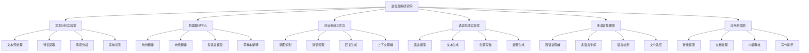
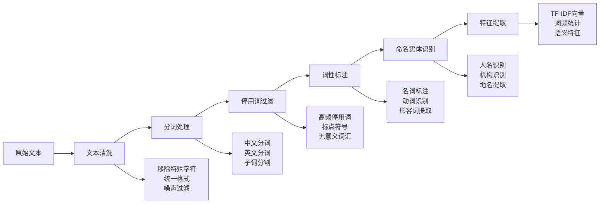
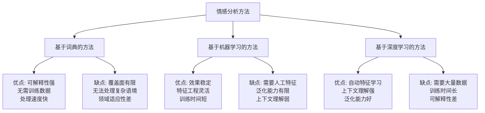
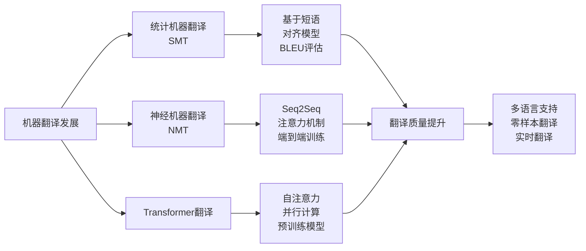
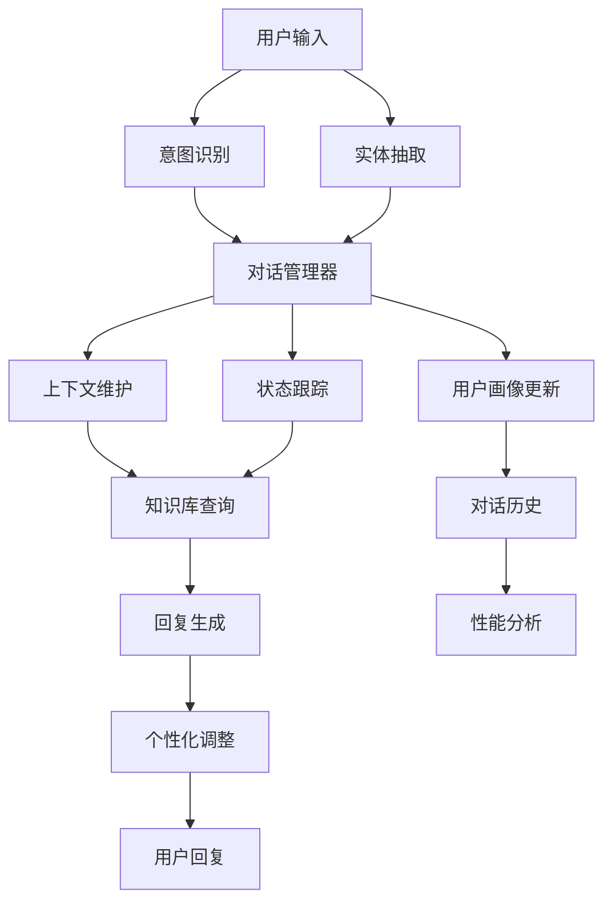
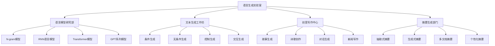
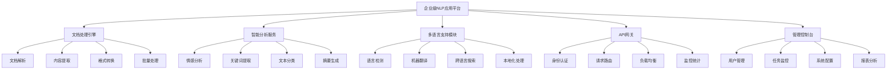
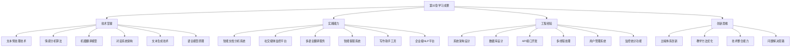

# 第32章 自然语言处理进阶

> "语言是思维的外壳，而自然语言处理则是让机器理解人类思维的桥梁。在语言理解研究院中，我们将探索让AI真正'读懂'人类语言的奥秘。" —— 计算语言学先驱

## 🎯 学习目标

### 知识目标
- **深入理解NLP核心技术**：掌握文本预处理、特征提取、语言模型等基础技术
- **学习现代NLP模型架构**：理解Transformer、BERT、GPT等前沿模型原理
- **掌握NLP主要任务**：情感分析、机器翻译、对话系统、文本生成等应用
- **了解多语言处理技术**：跨语言理解、零样本学习、多语言模型

### 技能目标
- **构建完整NLP流程**：从文本预处理到模型部署的端到端开发能力
- **实现核心NLP算法**：能够从零实现关键的NLP模型和算法
- **开发NLP应用系统**：具备企业级NLP产品的设计和开发能力
- **优化NLP模型性能**：掌握模型压缩、加速、部署等工程化技能

### 素养目标
- **培养语言AI思维**：理解语言的复杂性和AI处理语言的挑战
- **建立多语言意识**：关注跨文化交流和多语言技术的社会价值
- **形成负责任AI理念**：重视语言AI的伦理问题和社会影响

## 32.1 章节导入：走进语言理解研究院

### 🏛️ 从视觉到语言：AI认知的跃迁

想象一下，在完成了第31章**视觉识别实验室**的探索之后，我们现在要踏进一个更加神秘和复杂的领域——**语言理解研究院**。如果说计算机视觉让AI获得了"眼睛"，那么自然语言处理就是要赋予AI真正的"大脑"和"嘴巴"。



### 🌍 语言AI的独特挑战

与计算机视觉不同，自然语言处理面临着更加复杂的挑战：

1. **语义的模糊性**：同一句话在不同语境下可能有完全不同的含义
2. **语言的多样性**：世界上有数千种语言，每种都有独特的语法和文化背景
3. **上下文的重要性**：理解语言往往需要考虑更广泛的上下文信息
4. **情感和语调**：语言不仅传达信息，还承载着情感和态度

### 🏗️ 语言理解研究院的架构设计

我们的**语言理解研究院**采用模块化设计，每个部门专注于特定的NLP技术领域：

```python
class LanguageUnderstandingInstitute:
    """语言理解研究院"""
    
    def __init__(self):
        self.departments = {
            "文本分析实验室": "负责文本预处理、特征提取和基础分析",
            "机器翻译中心": "专注于多语言之间的自动翻译技术",
            "对话系统工作坊": "研究人机对话和智能交互系统",
            "语言生成实验室": "开发文本生成和创意写作技术",
            "多语言处理部": "处理跨语言理解和多语言应用",
            "应用开发部": "将研究成果转化为实际产品"
        }
        
        self.core_technologies = {
            "文本预处理": ["分词", "词性标注", "命名实体识别"],
            "特征提取": ["词向量", "TF-IDF", "BERT嵌入"],
            "语言理解": ["语义分析", "情感分析", "意图识别"],
            "语言生成": ["文本生成", "机器翻译", "对话回复"],
            "模型架构": ["Transformer", "BERT", "GPT", "T5"]
        }
        
        self.application_domains = {
            "智能客服": "自动化客户服务和支持",
            "内容创作": "AI辅助写作和内容生成",
            "多语言交流": "跨语言沟通和翻译服务",
            "信息提取": "从文档中自动提取关键信息",
            "情感监控": "社交媒体和用户反馈分析"
        }
        
        print("🏛️ 语言理解研究院初始化完成")
        self._show_institute_overview()
    
    def _show_institute_overview(self):
        """展示研究院概览"""
        print(f"\n📋 研究院组织架构:")
        for dept, description in self.departments.items():
            print(f"  🏢 {dept}: {description}")
        
        print(f"\n🔬 核心技术领域:")
        for tech, methods in self.core_technologies.items():
            print(f"  ⚙️ {tech}: {', '.join(methods)}")
        
        print(f"\n🎯 应用领域:")
        for domain, description in self.application_domains.items():
            print(f"  💼 {domain}: {description}")
    
    def get_research_roadmap(self):
        """获取研究路线图"""
        roadmap = {
            "基础阶段": {
                "重点": "文本预处理和特征工程",
                "目标": "建立扎实的NLP基础",
                "项目": "智能文档分析系统"
            },
            "进阶阶段": {
                "重点": "深度学习模型和算法",
                "目标": "掌握现代NLP核心技术", 
                "项目": "情感分析和机器翻译系统"
            },
            "应用阶段": {
                "重点": "对话系统和文本生成",
                "目标": "开发智能交互应用",
                "项目": "智能客服和写作助手"
            },
            "平台阶段": {
                "重点": "企业级NLP平台构建",
                "目标": "实现商业化应用",
                "项目": "企业智能文档处理平台"
            }
        }
        
        print(f"\n🗺️ 学习路线图:")
        for stage, details in roadmap.items():
            print(f"\n📍 {stage}:")
            for key, value in details.items():
                print(f"  • {key}: {value}")
        
        return roadmap

# 初始化语言理解研究院
institute = LanguageUnderstandingInstitute()
roadmap = institute.get_research_roadmap()
```

### 🚀 NLP技术发展历程

让我们回顾一下自然语言处理技术的发展历程，理解我们今天所处的位置：

```python
class NLPEvolutionTimeline:
    """NLP技术发展时间线"""
    
    def __init__(self):
        self.timeline = {
            "1950s": {
                "里程碑": "图灵测试提出",
                "技术特点": "规则基础的语言处理",
                "代表工作": "机器翻译的早期尝试"
            },
            "1980s-1990s": {
                "里程碑": "统计方法兴起",
                "技术特点": "基于概率和统计的方法",
                "代表工作": "隐马尔可夫模型、n-gram语言模型"
            },
            "2000s": {
                "里程碑": "机器学习应用",
                "技术特点": "特征工程和浅层学习",
                "代表工作": "SVM文本分类、条件随机场"
            },
            "2010s": {
                "里程碑": "深度学习革命",
                "技术特点": "神经网络和表示学习",
                "代表工作": "Word2Vec、RNN、LSTM"
            },
            "2017-": {
                "里程碑": "Transformer时代",
                "技术特点": "注意力机制和预训练模型",
                "代表工作": "BERT、GPT、T5、ChatGPT"
            }
        }
        
        print("📈 NLP技术发展历程")
        print("=" * 25)
        
    def show_evolution(self):
        """展示技术演进"""
        for period, details in self.timeline.items():
            print(f"\n🕐 {period}:")
            for key, value in details.items():
                print(f"  • {key}: {value}")
    
    def analyze_current_trends(self):
        """分析当前趋势"""
        current_trends = {
            "大规模预训练": "GPT、BERT等模型的成功",
            "多模态融合": "文本、图像、语音的结合",
            "少样本学习": "Few-shot和Zero-shot学习",
            "可解释性": "理解模型决策过程",
            "效率优化": "模型压缩和边缘部署",
            "伦理AI": "负责任的AI开发"
        }
        
        print(f"\n🔥 当前技术趋势:")
        for trend, description in current_trends.items():
            print(f"  📊 {trend}: {description}")
        
        return current_trends

# 展示NLP发展历程
evolution = NLPEvolutionTimeline()
evolution.show_evolution()
trends = evolution.analyze_current_trends()
```

## 32.2 文本预处理与特征工程

### 🛠️ 文本分析实验室：语言数据的炼金术

在我们的**文本分析实验室**中，原始的文本就像是未经加工的矿石，需要经过精心的处理才能提取出有价值的信息。文本预处理是整个NLP流程的基础，就像是为后续的高级算法准备优质的"食材"。

```python
import re
import jieba
import nltk
from nltk.corpus import stopwords
from nltk.tokenize import word_tokenize, sent_tokenize
from nltk.stem import PorterStemmer, WordNetLemmatizer
from nltk.tag import pos_tag
from nltk.chunk import ne_chunk
import spacy
from collections import Counter
import numpy as np
from sklearn.feature_extraction.text import TfidfVectorizer
import time
from typing import List, Dict, Tuple, Optional

class TextPreprocessingLab:
    """文本预处理实验室"""
    
    def __init__(self, language='zh'):
        self.language = language
        self.stemmer = PorterStemmer()
        self.lemmatizer = WordNetLemmatizer()
        
        # 加载语言模型
        if language == 'zh':
            # 中文处理工具
            jieba.initialize()
            self.stop_words = self._load_chinese_stopwords()
        else:
            # 英文处理工具
            nltk.download('punkt', quiet=True)
            nltk.download('stopwords', quiet=True)
            nltk.download('averaged_perceptron_tagger', quiet=True)
            nltk.download('maxent_ne_chunker', quiet=True)
            nltk.download('words', quiet=True)
            nltk.download('wordnet', quiet=True)
            self.stop_words = set(stopwords.words('english'))
        
        print(f"🧪 文本预处理实验室初始化完成 (语言: {language})")
        
    def _load_chinese_stopwords(self):
        """加载中文停用词"""
        # 简化的中文停用词列表
        chinese_stopwords = {
            '的', '了', '在', '是', '我', '有', '和', '就', '不', '人',
            '都', '一', '一个', '上', '也', '很', '到', '说', '要', '去',
            '你', '会', '着', '没有', '看', '好', '自己', '这', '那', '能',
            '而', '可以', '但是', '因为', '所以', '如果', '虽然', '然而',
            '或者', '以及', '等等', '比如', '例如', '就是', '这样', '那样'
        }
        return chinese_stopwords
    
    def clean_text(self, text: str) -> str:
        """文本清洗"""
        print(f"🧹 开始文本清洗...")
        
        # 1. 移除特殊字符和数字
        text = re.sub(r'[^\w\s\u4e00-\u9fff]', '', text)
        
        # 2. 移除多余空白
        text = re.sub(r'\s+', ' ', text).strip()
        
        # 3. 转换为小写（仅对英文）
        if self.language == 'en':
            text = text.lower()
        
        print(f"✅ 文本清洗完成，长度: {len(text)}")
        return text
    
    def tokenize_text(self, text: str) -> List[str]:
        """文本分词"""
        print(f"✂️ 开始文本分词...")
        
        if self.language == 'zh':
            # 中文分词
            tokens = list(jieba.cut(text))
        else:
            # 英文分词
            tokens = word_tokenize(text)
        
        print(f"✅ 分词完成，词汇数: {len(tokens)}")
        return tokens
    
    def remove_stopwords(self, tokens: List[str]) -> List[str]:
        """移除停用词"""
        print(f"🚫 移除停用词...")
        
        filtered_tokens = [token for token in tokens if token not in self.stop_words]
        
        removed_count = len(tokens) - len(filtered_tokens)
        print(f"✅ 停用词移除完成，移除了 {removed_count} 个词")
        
        return filtered_tokens
    
    def pos_tagging(self, tokens: List[str]) -> List[Tuple[str, str]]:
        """词性标注"""
        print(f"🏷️ 进行词性标注...")
        
        if self.language == 'zh':
            # 中文词性标注（简化实现）
            pos_tags = [(token, 'n') for token in tokens]  # 简化为名词
        else:
            # 英文词性标注
            pos_tags = pos_tag(tokens)
        
        print(f"✅ 词性标注完成，标注了 {len(pos_tags)} 个词")
        return pos_tags
    
    def named_entity_recognition(self, text: str) -> List[Dict]:
        """命名实体识别"""
        print(f"🎯 进行命名实体识别...")
        
        entities = []
        
        if self.language == 'zh':
            # 中文命名实体识别（简化实现）
            # 这里可以集成更高级的中文NER工具
            entities = self._simple_chinese_ner(text)
        else:
            # 英文命名实体识别
            tokens = word_tokenize(text)
            pos_tags = pos_tag(tokens)
            chunks = ne_chunk(pos_tags)
            
            for chunk in chunks:
                if hasattr(chunk, 'label'):
                    entity_text = ' '.join([token for token, pos in chunk])
                    entities.append({
                        'text': entity_text,
                        'label': chunk.label(),
                        'start': 0,  # 简化实现
                        'end': len(entity_text)
                    })
        
        print(f"✅ 命名实体识别完成，发现 {len(entities)} 个实体")
        return entities
    
    def _simple_chinese_ner(self, text: str) -> List[Dict]:
        """简化的中文命名实体识别"""
        entities = []
        
        # 简单的规则匹配（实际应用中会使用更复杂的模型）
        patterns = {
            'PERSON': r'[\u4e00-\u9fff]{2,4}(?=先生|女士|教授|博士|总|经理)',
            'ORG': r'[\u4e00-\u9fff]+(?:公司|集团|大学|学院|银行|医院)',
            'LOC': r'[\u4e00-\u9fff]+(?:市|省|区|县|街|路|村)'
        }
        
        for label, pattern in patterns.items():
            matches = re.finditer(pattern, text)
            for match in matches:
                entities.append({
                    'text': match.group(),
                    'label': label,
                    'start': match.start(),
                    'end': match.end()
                })
        
        return entities

class FeatureExtractionWorkshop:
    """特征提取工作坊"""
    
    def __init__(self):
        self.vectorizers = {}
        print("⚙️ 特征提取工作坊初始化完成")
    
    def extract_tfidf_features(self, texts: List[str], max_features: int = 1000) -> np.ndarray:
        """提取TF-IDF特征"""
        print(f"📊 提取TF-IDF特征 (最大特征数: {max_features})...")
        
        vectorizer = TfidfVectorizer(
            max_features=max_features,
            stop_words=None,  # 已在预处理中处理
            ngram_range=(1, 2)  # 包含1-gram和2-gram
        )
        
        tfidf_matrix = vectorizer.fit_transform(texts)
        self.vectorizers['tfidf'] = vectorizer
        
        print(f"✅ TF-IDF特征提取完成，特征维度: {tfidf_matrix.shape}")
        return tfidf_matrix.toarray()
    
    def extract_word_frequency_features(self, tokens_list: List[List[str]]) -> Dict:
        """提取词频特征"""
        print(f"📈 提取词频特征...")
        
        # 计算全局词频
        all_tokens = [token for tokens in tokens_list for token in tokens]
        word_freq = Counter(all_tokens)
        
        # 计算文档频率
        doc_freq = Counter()
        for tokens in tokens_list:
            unique_tokens = set(tokens)
            for token in unique_tokens:
                doc_freq[token] += 1
        
        # 计算TF-IDF权重
        num_docs = len(tokens_list)
        tf_idf = {}
        
        for token, freq in word_freq.items():
            tf = freq / len(all_tokens)
            idf = np.log(num_docs / (doc_freq[token] + 1))
            tf_idf[token] = tf * idf
        
        features = {
            'word_frequency': dict(word_freq.most_common(50)),
            'document_frequency': dict(doc_freq.most_common(50)),
            'tf_idf_weights': dict(sorted(tf_idf.items(), key=lambda x: x[1], reverse=True)[:50])
        }
        
        print(f"✅ 词频特征提取完成")
        return features
    
    def extract_statistical_features(self, texts: List[str]) -> Dict:
        """提取统计特征"""
        print(f"📐 提取统计特征...")
        
        features = {
            'avg_text_length': np.mean([len(text) for text in texts]),
            'avg_word_count': np.mean([len(text.split()) for text in texts]),
            'avg_sentence_count': np.mean([len(sent_tokenize(text)) for text in texts]),
            'text_length_std': np.std([len(text) for text in texts]),
            'word_count_std': np.std([len(text.split()) for text in texts])
        }
        
        print(f"✅ 统计特征提取完成")
        return features

class IntelligentDocumentAnalyzer:
    """智能文档分析系统"""
    
    def __init__(self, language='zh'):
        self.preprocessor = TextPreprocessingLab(language)
        self.feature_extractor = FeatureExtractionWorkshop()
        self.analysis_history = []
        
        print("📄 智能文档分析系统初始化完成")
    
    def analyze_document(self, document: str, doc_id: str = None) -> Dict:
        """分析单个文档"""
        if doc_id is None:
            doc_id = f"DOC_{int(time.time() * 1000)}"
        
        print(f"\n📖 分析文档: {doc_id}")
        print("=" * 30)
        
        start_time = time.time()
        
        # 1. 文本预处理
        cleaned_text = self.preprocessor.clean_text(document)
        tokens = self.preprocessor.tokenize_text(cleaned_text)
        filtered_tokens = self.preprocessor.remove_stopwords(tokens)
        pos_tags = self.preprocessor.pos_tagging(filtered_tokens)
        entities = self.preprocessor.named_entity_recognition(document)
        
        # 2. 特征提取
        tfidf_features = self.feature_extractor.extract_tfidf_features([' '.join(filtered_tokens)])
        word_features = self.feature_extractor.extract_word_frequency_features([filtered_tokens])
        stat_features = self.feature_extractor.extract_statistical_features([document])
        
        # 3. 文档分析结果
        analysis_result = {
            'document_id': doc_id,
            'timestamp': time.time(),
            'original_length': len(document),
            'cleaned_length': len(cleaned_text),
            'token_count': len(tokens),
            'filtered_token_count': len(filtered_tokens),
            'unique_tokens': len(set(filtered_tokens)),
            'entities': entities,
            'top_words': word_features['word_frequency'],
            'pos_distribution': self._analyze_pos_distribution(pos_tags),
            'statistical_features': stat_features,
            'processing_time': time.time() - start_time
        }
        
        self.analysis_history.append(analysis_result)
        self._print_analysis_report(analysis_result)
        
        return analysis_result
    
    def _analyze_pos_distribution(self, pos_tags: List[Tuple[str, str]]) -> Dict:
        """分析词性分布"""
        pos_counts = Counter([pos for word, pos in pos_tags])
        total_count = len(pos_tags)
        
        pos_distribution = {}
        for pos, count in pos_counts.items():
            pos_distribution[pos] = {
                'count': count,
                'percentage': count / total_count * 100
            }
        
        return pos_distribution
    
    def _print_analysis_report(self, result: Dict):
        """打印分析报告"""
        print(f"\n📊 文档分析报告")
        print("=" * 20)
        print(f"📄 文档ID: {result['document_id']}")
        print(f"📏 原始长度: {result['original_length']} 字符")
        print(f"🧹 清洗后长度: {result['cleaned_length']} 字符")
        print(f"✂️ 词汇总数: {result['token_count']}")
        print(f"🚫 过滤后词汇: {result['filtered_token_count']}")
        print(f"🌟 独特词汇: {result['unique_tokens']}")
        print(f"⏱️ 处理时间: {result['processing_time']:.2f}秒")
        
        print(f"\n🎯 发现的实体:")
        for entity in result['entities'][:5]:  # 显示前5个实体
            print(f"  • {entity['text']} ({entity['label']})")
        
        print(f"\n📊 高频词汇:")
        for word, freq in list(result['top_words'].items())[:10]:
            print(f"  • {word}: {freq}")
    
    def batch_analyze_documents(self, documents: List[str], doc_ids: List[str] = None) -> List[Dict]:
        """批量分析文档"""
        if doc_ids is None:
            doc_ids = [f"DOC_{i:03d}" for i in range(len(documents))]
        
        print(f"\n🔄 批量分析 {len(documents)} 个文档")
        print("=" * 35)
        
        results = []
        for i, (doc, doc_id) in enumerate(zip(documents, doc_ids)):
            print(f"\n处理文档 {i+1}/{len(documents)}: {doc_id}")
            result = self.analyze_document(doc, doc_id)
            results.append(result)
        
        self._generate_batch_summary(results)
        return results
    
    def _generate_batch_summary(self, results: List[Dict]):
        """生成批量分析摘要"""
        print(f"\n📈 批量分析摘要")
        print("=" * 20)
        
        total_docs = len(results)
        avg_length = np.mean([r['original_length'] for r in results])
        avg_tokens = np.mean([r['token_count'] for r in results])
        avg_unique = np.mean([r['unique_tokens'] for r in results])
        total_entities = sum(len(r['entities']) for r in results)
        
        print(f"📚 总文档数: {total_docs}")
        print(f"📏 平均长度: {avg_length:.0f} 字符")
        print(f"✂️ 平均词数: {avg_tokens:.0f}")
        print(f"🌟 平均独特词: {avg_unique:.0f}")
        print(f"🎯 总实体数: {total_entities}")
        
        # 全局词频统计
        all_words = {}
        for result in results:
            for word, freq in result['top_words'].items():
                all_words[word] = all_words.get(word, 0) + freq
        
        top_global_words = sorted(all_words.items(), key=lambda x: x[1], reverse=True)[:10]
        
        print(f"\n🌍 全局高频词:")
        for word, freq in top_global_words:
            print(f"  • {word}: {freq}")

# 演示智能文档分析系统
def demo_document_analysis():
    """演示文档分析系统"""
    # 创建分析系统
    analyzer = IntelligentDocumentAnalyzer('zh')
    
    # 示例文档
    sample_documents = [
        """
        人工智能技术正在快速发展，深度学习和机器学习算法在各个领域都有广泛应用。
        自然语言处理作为人工智能的重要分支，在文本分析、机器翻译、对话系统等方面
        取得了显著进展。随着大型语言模型的出现，AI的能力得到了极大提升。
        """,
        """
        北京大学计算机科学技术研究所在人工智能领域有着深厚的研究基础。
        该研究所的张教授团队在自然语言处理方面做出了重要贡献，特别是在
        中文信息处理和机器翻译技术方面。他们开发的系统已经在多家公司得到应用。
        """,
        """
        腾讯公司最近发布了新一代的AI助手，该助手集成了先进的自然语言理解技术。
        用户可以通过自然语言与系统进行交互，系统能够理解用户意图并提供准确回答。
        这项技术在客服、教育、娱乐等多个场景中都有应用前景。
        """
    ]
    
    # 批量分析
    results = analyzer.batch_analyze_documents(sample_documents)
    
    return results

# 运行演示
demo_results = demo_document_analysis()
```

### 📊 文本预处理技术对比

让我们通过一个可视化图表来理解不同文本预处理技术的效果：



## 32.3 情感分析与文本分类

### 💭 情感分析实验室：解读文字背后的情感密码

在我们的**语言理解研究院**中，**情感分析实验室**是一个特别神秘的地方。这里的研究员们不仅要理解文字的字面意思，更要洞察文字背后隐藏的情感、态度和倾向。就像心理学家分析人的内心世界一样，我们的AI系统要学会"读懂"文本的情感色彩。

```python
import numpy as np
import pandas as pd
from sklearn.model_selection import train_test_split
from sklearn.feature_extraction.text import TfidfVectorizer, CountVectorizer
from sklearn.linear_model import LogisticRegression
from sklearn.naive_bayes import MultinomialNB
from sklearn.svm import SVC
from sklearn.ensemble import RandomForestClassifier
from sklearn.metrics import accuracy_score, classification_report, confusion_matrix
import matplotlib.pyplot as plt
import seaborn as sns
from collections import defaultdict
import jieba
import re
from typing import List, Dict, Tuple, Optional
import warnings
warnings.filterwarnings('ignore')

class SentimentAnalysisLab:
    """情感分析实验室"""
    
    def __init__(self):
        self.models = {}
        self.vectorizers = {}
        self.emotion_lexicon = self._build_emotion_lexicon()
        self.training_history = []
        
        print("💭 情感分析实验室初始化完成")
        self._show_lab_capabilities()
    
    def _show_lab_capabilities(self):
        """展示实验室能力"""
        capabilities = {
            "情感极性分析": "识别正面、负面、中性情感",
            "情感强度评估": "量化情感表达的强烈程度",
            "多维情感分析": "识别喜怒哀乐等多种情感",
            "情感词典构建": "构建领域专用情感词典",
            "上下文情感理解": "考虑语境的情感分析",
            "实时情感监控": "大规模文本的实时情感追踪"
        }
        
        print(f"\n🔬 实验室核心能力:")
        for capability, description in capabilities.items():
            print(f"  • {capability}: {description}")
    
    def _build_emotion_lexicon(self) -> Dict:
        """构建情感词典"""
        # 简化的中文情感词典
        emotion_lexicon = {
            'positive': {
                '好', '棒', '优秀', '出色', '完美', '满意', '喜欢', '爱',
                '高兴', '开心', '快乐', '兴奋', '激动', '惊喜', '感谢',
                '赞', '推荐', '支持', '认同', '优质', '精彩', '美好'
            },
            'negative': {
                '差', '糟', '烂', '垃圾', '失望', '不满', '讨厌', '恨',
                '难过', '伤心', '愤怒', '生气', '抱怨', '批评', '反对',
                '拒绝', '问题', '错误', '失败', '糟糕', '恶心', '无聊'
            },
            'neutral': {
                '一般', '普通', '正常', '可以', '还行', '中等', '平常',
                '基本', '标准', '常规', '传统', '典型', '简单', '复杂'
            }
        }
        
        print("📚 情感词典构建完成")
        return emotion_lexicon
    
    def lexicon_based_sentiment(self, text: str) -> Dict:
        """基于词典的情感分析"""
        # 分词
        tokens = list(jieba.cut(text))
        
        # 计算情感得分
        sentiment_scores = {'positive': 0, 'negative': 0, 'neutral': 0}
        
        for token in tokens:
            for sentiment, words in self.emotion_lexicon.items():
                if token in words:
                    sentiment_scores[sentiment] += 1
        
        # 计算总体情感
        total_score = sum(sentiment_scores.values())
        if total_score == 0:
            sentiment_scores['neutral'] = 1
            total_score = 1
        
        # 归一化得分
        normalized_scores = {k: v/total_score for k, v in sentiment_scores.items()}
        
        # 确定主要情感
        main_sentiment = max(normalized_scores, key=normalized_scores.get)
        confidence = normalized_scores[main_sentiment]
        
        return {
            'sentiment': main_sentiment,
            'confidence': confidence,
            'scores': normalized_scores,
            'sentiment_words': self._find_sentiment_words(tokens)
        }
    
    def _find_sentiment_words(self, tokens: List[str]) -> Dict:
        """找出文本中的情感词"""
        sentiment_words = {'positive': [], 'negative': [], 'neutral': []}
        
        for token in tokens:
            for sentiment, words in self.emotion_lexicon.items():
                if token in words:
                    sentiment_words[sentiment].append(token)
        
        return sentiment_words
    
    def prepare_training_data(self, texts: List[str], labels: List[str]) -> Tuple:
        """准备训练数据"""
        print(f"📊 准备训练数据: {len(texts)} 个样本")
        
        # 文本预处理
        processed_texts = []
        for text in texts:
            # 清洗文本
            cleaned = re.sub(r'[^\w\s\u4e00-\u9fff]', '', text)
            # 分词
            tokens = jieba.cut(cleaned)
            processed_text = ' '.join(tokens)
            processed_texts.append(processed_text)
        
        # 划分训练集和测试集
        X_train, X_test, y_train, y_test = train_test_split(
            processed_texts, labels, test_size=0.2, random_state=42, stratify=labels
        )
        
        print(f"✅ 数据准备完成 - 训练集: {len(X_train)}, 测试集: {len(X_test)}")
        return X_train, X_test, y_train, y_test
    
    def train_sentiment_models(self, X_train: List[str], y_train: List[str]) -> Dict:
        """训练多种情感分析模型"""
        print(f"🚀 开始训练情感分析模型...")
        
        # 特征提取
        print("  📊 提取TF-IDF特征...")
        tfidf_vectorizer = TfidfVectorizer(max_features=5000, ngram_range=(1, 2))
        X_train_tfidf = tfidf_vectorizer.fit_transform(X_train)
        self.vectorizers['tfidf'] = tfidf_vectorizer
        
        print("  📈 提取词袋特征...")
        count_vectorizer = CountVectorizer(max_features=5000, ngram_range=(1, 2))
        X_train_count = count_vectorizer.fit_transform(X_train)
        self.vectorizers['count'] = count_vectorizer
        
        # 训练多种模型
        models_config = {
            'logistic_tfidf': (LogisticRegression(random_state=42), X_train_tfidf),
            'naive_bayes_count': (MultinomialNB(), X_train_count),
            'svm_tfidf': (SVC(kernel='linear', random_state=42), X_train_tfidf),
            'random_forest_tfidf': (RandomForestClassifier(n_estimators=100, random_state=42), X_train_tfidf)
        }
        
        training_results = {}
        
        for model_name, (model, X_train_features) in models_config.items():
            print(f"  🔧 训练 {model_name}...")
            model.fit(X_train_features, y_train)
            self.models[model_name] = model
            
            # 训练集准确率
            train_pred = model.predict(X_train_features)
            train_accuracy = accuracy_score(y_train, train_pred)
            training_results[model_name] = train_accuracy
            
            print(f"    ✅ {model_name} 训练完成，训练准确率: {train_accuracy:.4f}")
        
        print(f"🎉 所有模型训练完成!")
        return training_results
    
    def evaluate_models(self, X_test: List[str], y_test: List[str]) -> Dict:
        """评估模型性能"""
        print(f"\n📊 评估模型性能...")
        
        evaluation_results = {}
        
        for model_name, model in self.models.items():
            print(f"  🔍 评估 {model_name}...")
            
            # 选择对应的特征提取器
            if 'tfidf' in model_name:
                X_test_features = self.vectorizers['tfidf'].transform(X_test)
            else:
                X_test_features = self.vectorizers['count'].transform(X_test)
            
            # 预测
            y_pred = model.predict(X_test_features)
            
            # 计算指标
            accuracy = accuracy_score(y_test, y_pred)
            report = classification_report(y_test, y_pred, output_dict=True)
            
            evaluation_results[model_name] = {
                'accuracy': accuracy,
                'precision': report['weighted avg']['precision'],
                'recall': report['weighted avg']['recall'],
                'f1_score': report['weighted avg']['f1-score'],
                'predictions': y_pred
            }
            
            print(f"    ✅ 准确率: {accuracy:.4f}")
            print(f"    ✅ F1得分: {report['weighted avg']['f1-score']:.4f}")
        
        return evaluation_results
    
    def predict_sentiment(self, text: str, model_name: str = 'logistic_tfidf') -> Dict:
        """预测单个文本的情感"""
        if model_name not in self.models:
            raise ValueError(f"模型 {model_name} 不存在")
        
        # 预处理文本
        cleaned = re.sub(r'[^\w\s\u4e00-\u9fff]', '', text)
        tokens = jieba.cut(cleaned)
        processed_text = ' '.join(tokens)
        
        # 特征提取
        if 'tfidf' in model_name:
            features = self.vectorizers['tfidf'].transform([processed_text])
        else:
            features = self.vectorizers['count'].transform([processed_text])
        
        # 预测
        model = self.models[model_name]
        prediction = model.predict(features)[0]
        
        # 获取预测概率（如果模型支持）
        if hasattr(model, 'predict_proba'):
            probabilities = model.predict_proba(features)[0]
            prob_dict = {label: prob for label, prob in zip(model.classes_, probabilities)}
        else:
            prob_dict = {prediction: 1.0}
        
        # 词典方法作为补充
        lexicon_result = self.lexicon_based_sentiment(text)
        
        return {
            'text': text,
            'predicted_sentiment': prediction,
            'confidence': max(prob_dict.values()),
            'probabilities': prob_dict,
            'lexicon_sentiment': lexicon_result['sentiment'],
            'lexicon_confidence': lexicon_result['confidence'],
            'sentiment_words': lexicon_result['sentiment_words']
        }

class TextClassificationWorkshop:
    """文本分类工作坊"""
    
    def __init__(self):
        self.classifiers = {}
        self.feature_extractors = {}
        self.classification_history = []
        
        print("📝 文本分类工作坊初始化完成")
        self._show_classification_types()
    
    def _show_classification_types(self):
        """展示分类类型"""
        classification_types = {
            "主题分类": "新闻分类、文档归类、内容标签",
            "情感分类": "正负面评价、情感倾向分析",
            "意图分类": "用户意图识别、查询分类",
            "垃圾邮件检测": "垃圾邮件过滤、内容审核",
            "语言检测": "多语言文本的语种识别",
            "文档类型分类": "合同、报告、新闻等文档类型"
        }
        
        print(f"\n📋 支持的分类类型:")
        for cls_type, description in classification_types.items():
            print(f"  • {cls_type}: {description}")
    
    def build_multi_class_classifier(self, texts: List[str], labels: List[str], 
                                   classifier_name: str = 'news_classifier') -> Dict:
        """构建多分类器"""
        print(f"\n🔧 构建多分类器: {classifier_name}")
        
        # 数据预处理
        processed_texts = []
        for text in texts:
            cleaned = re.sub(r'[^\w\s\u4e00-\u9fff]', '', text)
            tokens = jieba.cut(cleaned)
            processed_text = ' '.join(tokens)
            processed_texts.append(processed_text)
        
        # 划分数据集
        X_train, X_test, y_train, y_test = train_test_split(
            processed_texts, labels, test_size=0.2, random_state=42, stratify=labels
        )
        
        # 特征提取
        vectorizer = TfidfVectorizer(
            max_features=10000,
            ngram_range=(1, 3),
            min_df=2,
            max_df=0.95
        )
        
        X_train_features = vectorizer.fit_transform(X_train)
        X_test_features = vectorizer.transform(X_test)
        
        # 训练多种分类器
        classifiers = {
            'logistic': LogisticRegression(random_state=42, max_iter=1000),
            'naive_bayes': MultinomialNB(),
            'svm': SVC(kernel='linear', random_state=42),
            'random_forest': RandomForestClassifier(n_estimators=100, random_state=42)
        }
        
        results = {}
        best_model = None
        best_accuracy = 0
        
        for clf_name, classifier in classifiers.items():
            print(f"  🚀 训练 {clf_name}...")
            
            # 训练
            classifier.fit(X_train_features, y_train)
            
            # 预测
            y_pred = classifier.predict(X_test_features)
            
            # 评估
            accuracy = accuracy_score(y_test, y_pred)
            report = classification_report(y_test, y_pred, output_dict=True)
            
            results[clf_name] = {
                'model': classifier,
                'accuracy': accuracy,
                'classification_report': report,
                'predictions': y_pred
            }
            
            if accuracy > best_accuracy:
                best_accuracy = accuracy
                best_model = clf_name
            
            print(f"    ✅ {clf_name} 准确率: {accuracy:.4f}")
        
        # 保存最佳模型和特征提取器
        self.classifiers[classifier_name] = {
            'best_model': results[best_model]['model'],
            'vectorizer': vectorizer,
            'model_name': best_model,
            'accuracy': best_accuracy,
            'all_results': results
        }
        
        print(f"🏆 最佳模型: {best_model} (准确率: {best_accuracy:.4f})")
        
        return results
    
    def classify_text(self, text: str, classifier_name: str = 'news_classifier') -> Dict:
        """分类单个文本"""
        if classifier_name not in self.classifiers:
            raise ValueError(f"分类器 {classifier_name} 不存在")
        
        classifier_info = self.classifiers[classifier_name]
        model = classifier_info['best_model']
        vectorizer = classifier_info['vectorizer']
        
        # 预处理
        cleaned = re.sub(r'[^\w\s\u4e00-\u9fff]', '', text)
        tokens = jieba.cut(cleaned)
        processed_text = ' '.join(tokens)
        
        # 特征提取
        features = vectorizer.transform([processed_text])
        
        # 预测
        prediction = model.predict(features)[0]
        
        # 获取预测概率
        if hasattr(model, 'predict_proba'):
            probabilities = model.predict_proba(features)[0]
            prob_dict = {label: prob for label, prob in zip(model.classes_, probabilities)}
        else:
            prob_dict = {prediction: 1.0}
        
        return {
            'text': text,
            'predicted_class': prediction,
            'confidence': max(prob_dict.values()),
            'probabilities': prob_dict,
            'classifier_used': classifier_info['model_name']
        }

class SocialMediaSentimentMonitor:
    """社交媒体情感监控系统"""
    
    def __init__(self):
        self.sentiment_analyzer = SentimentAnalysisLab()
        self.text_classifier = TextClassificationWorkshop()
        self.monitoring_data = []
        self.alerts = []
        
        print("📱 社交媒体情感监控系统初始化完成")
        self._setup_monitoring_system()
    
    def _setup_monitoring_system(self):
        """设置监控系统"""
        # 准备示例训练数据
        self._prepare_sample_data()
        
        print("🔧 配置监控参数...")
        self.monitoring_config = {
            'negative_threshold': 0.7,  # 负面情感阈值
            'alert_keywords': ['投诉', '问题', '故障', '不满', '差评'],
            'monitoring_interval': 60,  # 监控间隔（秒）
            'batch_size': 100  # 批处理大小
        }
        
        print("✅ 监控系统配置完成")
    
    def _prepare_sample_data(self):
        """准备示例训练数据"""
        # 情感分析训练数据
        sentiment_texts = [
            "这个产品真的很好用，推荐大家购买", "服务态度很差，非常不满意",
            "质量不错，价格合理", "物流太慢了，等了很久", 
            "客服回复很及时，解决了我的问题", "产品有质量问题，要求退款",
            "包装很精美，产品质量也很好", "网站经常出故障，体验很差",
            "这次购物体验很愉快", "产品描述与实际不符，感觉被骗了"
        ]
        
        sentiment_labels = [
            "positive", "negative", "positive", "negative", "positive",
            "negative", "positive", "negative", "positive", "negative"
        ]
        
        # 训练情感分析模型
        X_train, X_test, y_train, y_test = self.sentiment_analyzer.prepare_training_data(
            sentiment_texts, sentiment_labels
        )
        
        self.sentiment_analyzer.train_sentiment_models(X_train, y_train)
        self.sentiment_analyzer.evaluate_models(X_test, y_test)
    
    def analyze_social_media_post(self, post_text: str, platform: str = "weibo", 
                                user_id: str = None) -> Dict:
        """分析社交媒体帖子"""
        # 情感分析
        sentiment_result = self.sentiment_analyzer.predict_sentiment(post_text)
        
        # 关键词检测
        alert_triggered = any(keyword in post_text for keyword in self.monitoring_config['alert_keywords'])
        
        # 风险评估
        risk_level = self._assess_risk_level(sentiment_result, alert_triggered)
        
        analysis_result = {
            'timestamp': pd.Timestamp.now(),
            'platform': platform,
            'user_id': user_id,
            'post_text': post_text,
            'sentiment': sentiment_result['predicted_sentiment'],
            'sentiment_confidence': sentiment_result['confidence'],
            'sentiment_probabilities': sentiment_result['probabilities'],
            'alert_keywords_found': [kw for kw in self.monitoring_config['alert_keywords'] if kw in post_text],
            'alert_triggered': alert_triggered,
            'risk_level': risk_level,
            'sentiment_words': sentiment_result['sentiment_words']
        }
        
        # 保存监控数据
        self.monitoring_data.append(analysis_result)
        
        # 触发警报
        if alert_triggered or risk_level == 'high':
            self._trigger_alert(analysis_result)
        
        return analysis_result
    
    def _assess_risk_level(self, sentiment_result: Dict, alert_triggered: bool) -> str:
        """评估风险等级"""
        if alert_triggered:
            return 'high'
        
        if (sentiment_result['predicted_sentiment'] == 'negative' and 
            sentiment_result['confidence'] > self.monitoring_config['negative_threshold']):
            return 'medium'
        
        return 'low'
    
    def _trigger_alert(self, analysis_result: Dict):
        """触发警报"""
        alert = {
            'timestamp': analysis_result['timestamp'],
            'alert_type': 'negative_sentiment' if analysis_result['risk_level'] == 'high' else 'keyword_alert',
            'platform': analysis_result['platform'],
            'user_id': analysis_result['user_id'],
            'post_text': analysis_result['post_text'][:100] + '...',
            'risk_level': analysis_result['risk_level'],
            'sentiment': analysis_result['sentiment'],
            'confidence': analysis_result['sentiment_confidence']
        }
        
        self.alerts.append(alert)
        print(f"🚨 触发警报: {alert['alert_type']} - 风险等级: {alert['risk_level']}")
    
    def batch_analyze_posts(self, posts_data: List[Dict]) -> List[Dict]:
        """批量分析帖子"""
        print(f"\n📊 批量分析 {len(posts_data)} 条帖子...")
        
        results = []
        for i, post_data in enumerate(posts_data):
            if i % 10 == 0:
                print(f"  处理进度: {i+1}/{len(posts_data)}")
            
            result = self.analyze_social_media_post(
                post_data['text'], 
                post_data.get('platform', 'unknown'),
                post_data.get('user_id', f'user_{i}')
            )
            results.append(result)
        
        print(f"✅ 批量分析完成")
        self._generate_monitoring_report()
        
        return results
    
    def _generate_monitoring_report(self):
        """生成监控报告"""
        if not self.monitoring_data:
            print("📊 暂无监控数据")
            return
        
        df = pd.DataFrame(self.monitoring_data)
        
        print(f"\n📈 情感监控报告")
        print("=" * 25)
        print(f"📱 监控帖子总数: {len(df)}")
        print(f"🚨 触发警报数量: {len(self.alerts)}")
        
        # 情感分布
        sentiment_dist = df['sentiment'].value_counts()
        print(f"\n💭 情感分布:")
        for sentiment, count in sentiment_dist.items():
            percentage = count / len(df) * 100
            print(f"  • {sentiment}: {count} ({percentage:.1f}%)")
        
        # 风险等级分布
        risk_dist = df['risk_level'].value_counts()
        print(f"\n⚠️ 风险等级分布:")
        for risk, count in risk_dist.items():
            percentage = count / len(df) * 100
            print(f"  • {risk}: {count} ({percentage:.1f}%)")
        
        # 平台分布
        platform_dist = df['platform'].value_counts()
        print(f"\n📱 平台分布:")
        for platform, count in platform_dist.items():
            percentage = count / len(df) * 100
            print(f"  • {platform}: {count} ({percentage:.1f}%)")
        
        # 最近警报
        if self.alerts:
            print(f"\n🚨 最近警报:")
            for alert in self.alerts[-5:]:  # 显示最近5条警报
                print(f"  • {alert['timestamp'].strftime('%H:%M:%S')} - {alert['alert_type']} - {alert['post_text']}")

# 演示社交媒体情感监控系统
def demo_sentiment_monitoring():
    """演示情感监控系统"""
    # 创建监控系统
    monitor = SocialMediaSentimentMonitor()
    
    # 模拟社交媒体数据
    sample_posts = [
        {'text': '这家餐厅的服务真的很棒，食物也很美味，强烈推荐！', 'platform': 'weibo'},
        {'text': '网站又崩溃了，这是这个月第三次了，太让人失望了', 'platform': 'weibo'},
        {'text': '客服态度很好，帮我解决了问题，谢谢', 'platform': 'douyin'},
        {'text': '产品质量有问题，要求退款但是一直没有回复', 'platform': 'xiaohongshu'},
        {'text': '今天天气不错，心情也很好', 'platform': 'weibo'},
        {'text': '这个APP经常闪退，用户体验很差，建议修复', 'platform': 'appstore'},
        {'text': '物流很快，包装也很好，满意', 'platform': 'taobao'},
        {'text': '投诉多次都没有得到解决，非常不满', 'platform': 'weibo'},
        {'text': '新功能很实用，界面设计也很美观', 'platform': 'weibo'},
        {'text': '价格有点贵，但是质量还可以', 'platform': 'jd'}
    ]
    
    # 批量分析
    results = monitor.batch_analyze_posts(sample_posts)
    
    return results

# 运行演示
monitoring_results = demo_sentiment_monitoring()
```

### 📈 情感分析技术对比

让我们通过图表来理解不同情感分析方法的特点：



## 32.4 机器翻译技术详解

### 🌐 机器翻译中心：跨越语言的桥梁

在我们的**语言理解研究院**中，**机器翻译中心**承担着最具挑战性的任务——让不同语言之间实现无障碍沟通。这里就像联合国的同声传译中心，但我们的"翻译官"是AI系统，它们要在毫秒之间完成语言的转换，同时保持意思的准确性和表达的自然性。

```python
import torch
import torch.nn as nn
import torch.optim as optim
import torch.nn.functional as F
from torch.utils.data import Dataset, DataLoader
import numpy as np
import matplotlib.pyplot as plt
from collections import Counter, defaultdict
import random
import math
import time
from typing import List, Dict, Tuple, Optional
import jieba
import re

class MachineTranslationCenter:
    """机器翻译中心"""
    
    def __init__(self):
        self.translation_models = {}
        self.language_pairs = {}
        self.translation_history = []
        
        print("🌐 机器翻译中心初始化完成")
        self._show_translation_capabilities()
    
    def _show_translation_capabilities(self):
        """展示翻译能力"""
        capabilities = {
            "统计机器翻译": "基于短语的统计翻译模型",
            "神经机器翻译": "基于RNN/LSTM的序列到序列模型",
            "注意力机制翻译": "集成注意力机制的翻译模型",
            "Transformer翻译": "基于Transformer架构的翻译",
            "多语言翻译": "支持多种语言对的翻译",
            "零样本翻译": "无需直接训练的语言对翻译"
        }
        
        print(f"\n🔬 翻译中心核心能力:")
        for capability, description in capabilities.items():
            print(f"  • {capability}: {description}")
    
    def prepare_parallel_corpus(self, source_texts: List[str], target_texts: List[str], 
                               source_lang: str, target_lang: str) -> Dict:
        """准备平行语料库"""
        print(f"📚 准备 {source_lang}-{target_lang} 平行语料库...")
        
        if len(source_texts) != len(target_texts):
            raise ValueError("源语言和目标语言文本数量不匹配")
        
        # 文本预处理
        processed_source = []
        processed_target = []
        
        for src, tgt in zip(source_texts, target_texts):
            # 源语言预处理
            if source_lang == 'zh':
                src_tokens = list(jieba.cut(src.strip()))
            else:
                src_tokens = src.strip().lower().split()
            
            # 目标语言预处理
            if target_lang == 'zh':
                tgt_tokens = list(jieba.cut(tgt.strip()))
            else:
                tgt_tokens = tgt.strip().lower().split()
            
            processed_source.append(src_tokens)
            processed_target.append(tgt_tokens)
        
        # 构建词汇表
        source_vocab = self._build_vocabulary(processed_source, f"{source_lang}_vocab")
        target_vocab = self._build_vocabulary(processed_target, f"{target_lang}_vocab")
        
        corpus_data = {
            'source_texts': processed_source,
            'target_texts': processed_target,
            'source_vocab': source_vocab,
            'target_vocab': target_vocab,
            'source_lang': source_lang,
            'target_lang': target_lang,
            'corpus_size': len(source_texts)
        }
        
        language_pair = f"{source_lang}-{target_lang}"
        self.language_pairs[language_pair] = corpus_data
        
        print(f"✅ 语料库准备完成:")
        print(f"  • 语料对数: {len(source_texts)}")
        print(f"  • 源语言词汇量: {len(source_vocab)}")
        print(f"  • 目标语言词汇量: {len(target_vocab)}")
        
        return corpus_data
    
    def _build_vocabulary(self, tokenized_texts: List[List[str]], vocab_name: str) -> Dict:
        """构建词汇表"""
        word_counts = Counter()
        for tokens in tokenized_texts:
            word_counts.update(tokens)
        
        # 创建词汇表 (保留高频词)
        vocab = {'<PAD>': 0, '<UNK>': 1, '<SOS>': 2, '<EOS>': 3}
        
        # 添加常见词汇
        for word, count in word_counts.most_common(5000):  # 限制词汇表大小
            if count >= 2:  # 至少出现2次
                vocab[word] = len(vocab)
        
        print(f"📖 构建词汇表 {vocab_name}: {len(vocab)} 个词汇")
        return vocab
    
    def text_to_indices(self, tokens: List[str], vocab: Dict) -> List[int]:
        """将文本转换为索引序列"""
        indices = [vocab.get(token, vocab['<UNK>']) for token in tokens]
        return indices
    
    def indices_to_text(self, indices: List[int], vocab: Dict) -> List[str]:
        """将索引序列转换为文本"""
        reverse_vocab = {v: k for k, v in vocab.items()}
        tokens = [reverse_vocab.get(idx, '<UNK>') for idx in indices]
        return tokens

class Seq2SeqTranslator(nn.Module):
    """序列到序列翻译模型"""
    
    def __init__(self, source_vocab_size: int, target_vocab_size: int, 
                 embedding_dim: int = 256, hidden_dim: int = 512, num_layers: int = 2):
        super(Seq2SeqTranslator, self).__init__()
        
        self.hidden_dim = hidden_dim
        self.num_layers = num_layers
        
        # 编码器
        self.encoder_embedding = nn.Embedding(source_vocab_size, embedding_dim)
        self.encoder_lstm = nn.LSTM(embedding_dim, hidden_dim, num_layers, 
                                   batch_first=True, dropout=0.1)
        
        # 解码器
        self.decoder_embedding = nn.Embedding(target_vocab_size, embedding_dim)
        self.decoder_lstm = nn.LSTM(embedding_dim, hidden_dim, num_layers, 
                                   batch_first=True, dropout=0.1)
        
        # 输出层
        self.output_projection = nn.Linear(hidden_dim, target_vocab_size)
        self.dropout = nn.Dropout(0.1)
        
        print(f"🧠 Seq2Seq翻译模型初始化完成")
        print(f"  • 源词汇量: {source_vocab_size}")
        print(f"  • 目标词汇量: {target_vocab_size}")
        print(f"  • 嵌入维度: {embedding_dim}")
        print(f"  • 隐藏层维度: {hidden_dim}")
    
    def encode(self, source_seq):
        """编码器"""
        embedded = self.encoder_embedding(source_seq)
        encoder_outputs, (hidden, cell) = self.encoder_lstm(embedded)
        return encoder_outputs, (hidden, cell)
    
    def decode(self, target_seq, encoder_states):
        """解码器"""
        embedded = self.decoder_embedding(target_seq)
        decoder_outputs, _ = self.decoder_lstm(embedded, encoder_states)
        output_logits = self.output_projection(decoder_outputs)
        return output_logits
    
    def forward(self, source_seq, target_seq):
        """前向传播"""
        # 编码
        encoder_outputs, encoder_states = self.encode(source_seq)
        
        # 解码
        decoder_outputs = self.decode(target_seq, encoder_states)
        
        return decoder_outputs

class AttentionTranslator(nn.Module):
    """带注意力机制的翻译模型"""
    
    def __init__(self, source_vocab_size: int, target_vocab_size: int,
                 embedding_dim: int = 256, hidden_dim: int = 512, num_layers: int = 2):
        super(AttentionTranslator, self).__init__()
        
        self.hidden_dim = hidden_dim
        self.num_layers = num_layers
        
        # 编码器
        self.encoder_embedding = nn.Embedding(source_vocab_size, embedding_dim)
        self.encoder_lstm = nn.LSTM(embedding_dim, hidden_dim, num_layers,
                                   batch_first=True, bidirectional=True, dropout=0.1)
        
        # 解码器
        self.decoder_embedding = nn.Embedding(target_vocab_size, embedding_dim)
        self.decoder_lstm = nn.LSTM(embedding_dim + hidden_dim * 2, hidden_dim, num_layers,
                                   batch_first=True, dropout=0.1)
        
        # 注意力机制
        self.attention = nn.Linear(hidden_dim * 3, hidden_dim)
        self.attention_combine = nn.Linear(hidden_dim * 2, hidden_dim)
        
        # 输出层
        self.output_projection = nn.Linear(hidden_dim, target_vocab_size)
        
        print(f"🎯 注意力翻译模型初始化完成")
    
    def attention_mechanism(self, decoder_hidden, encoder_outputs):
        """注意力机制"""
        batch_size, seq_len, hidden_size = encoder_outputs.size()
        
        # 计算注意力权重
        decoder_hidden_expanded = decoder_hidden.unsqueeze(1).expand(batch_size, seq_len, -1)
        attention_weights = torch.tanh(self.attention(
            torch.cat([decoder_hidden_expanded, encoder_outputs], dim=2)
        ))
        attention_weights = torch.sum(attention_weights, dim=2)
        attention_weights = F.softmax(attention_weights, dim=1)
        
        # 计算上下文向量
        context = torch.bmm(attention_weights.unsqueeze(1), encoder_outputs)
        context = context.squeeze(1)
        
        return context, attention_weights
    
    def forward(self, source_seq, target_seq):
        """前向传播"""
        batch_size = source_seq.size(0)
        
        # 编码
        source_embedded = self.encoder_embedding(source_seq)
        encoder_outputs, (encoder_hidden, encoder_cell) = self.encoder_lstm(source_embedded)
        
        # 初始化解码器状态
        decoder_hidden = encoder_hidden[-1].unsqueeze(0)
        decoder_cell = encoder_cell[-1].unsqueeze(0)
        
        # 解码
        target_embedded = self.decoder_embedding(target_seq)
        decoder_outputs = []
        
        for t in range(target_seq.size(1)):
            # 注意力机制
            context, attention_weights = self.attention_mechanism(
                decoder_hidden[-1], encoder_outputs
            )
            
            # 解码器输入
            decoder_input = torch.cat([target_embedded[:, t:t+1, :], 
                                     context.unsqueeze(1)], dim=2)
            
            # LSTM解码
            decoder_output, (decoder_hidden, decoder_cell) = self.decoder_lstm(
                decoder_input, (decoder_hidden, decoder_cell)
            )
            
            decoder_outputs.append(decoder_output)
        
        decoder_outputs = torch.cat(decoder_outputs, dim=1)
        output_logits = self.output_projection(decoder_outputs)
        
        return output_logits

class TranslationTrainer:
    """翻译模型训练器"""
    
    def __init__(self, model, source_vocab, target_vocab):
        self.model = model
        self.source_vocab = source_vocab
        self.target_vocab = target_vocab
        self.reverse_target_vocab = {v: k for k, v in target_vocab.items()}
        
        # 训练参数
        self.criterion = nn.CrossEntropyLoss(ignore_index=0)  # 忽略PAD
        self.optimizer = optim.Adam(model.parameters(), lr=0.001)
        
        print("🏋️ 翻译模型训练器初始化完成")
    
    def prepare_batch_data(self, source_texts, target_texts, batch_size=32):
        """准备批量训练数据"""
        dataset = []
        
        for src_tokens, tgt_tokens in zip(source_texts, target_texts):
            # 转换为索引
            src_indices = [self.source_vocab.get(token, self.source_vocab['<UNK>']) 
                          for token in src_tokens]
            tgt_indices = [self.target_vocab['<SOS>']] + \
                         [self.target_vocab.get(token, self.target_vocab['<UNK>']) 
                          for token in tgt_tokens] + \
                         [self.target_vocab['<EOS>']]
            
            dataset.append((src_indices, tgt_indices))
        
        # 批量处理
        batches = []
        for i in range(0, len(dataset), batch_size):
            batch = dataset[i:i+batch_size]
            
            # 填充序列
            max_src_len = max(len(item[0]) for item in batch)
            max_tgt_len = max(len(item[1]) for item in batch)
            
            src_batch = []
            tgt_batch = []
            
            for src_indices, tgt_indices in batch:
                # 填充源序列
                src_padded = src_indices + [0] * (max_src_len - len(src_indices))
                src_batch.append(src_padded)
                
                # 填充目标序列
                tgt_padded = tgt_indices + [0] * (max_tgt_len - len(tgt_indices))
                tgt_batch.append(tgt_padded)
            
            batches.append((torch.tensor(src_batch), torch.tensor(tgt_batch)))
        
        return batches
    
    def train_model(self, source_texts, target_texts, epochs=10, batch_size=32):
        """训练翻译模型"""
        print(f"🚀 开始训练翻译模型...")
        print(f"  • 训练样本: {len(source_texts)}")
        print(f"  • 训练轮数: {epochs}")
        print(f"  • 批次大小: {batch_size}")
        
        # 准备训练数据
        batches = self.prepare_batch_data(source_texts, target_texts, batch_size)
        
        training_losses = []
        
        for epoch in range(epochs):
            epoch_loss = 0
            self.model.train()
            
            for batch_idx, (src_batch, tgt_batch) in enumerate(batches):
                self.optimizer.zero_grad()
                
                # 前向传播
                # 解码器输入（去掉最后一个token）
                decoder_input = tgt_batch[:, :-1]
                # 目标输出（去掉第一个token）
                target_output = tgt_batch[:, 1:]
                
                # 模型预测
                predictions = self.model(src_batch, decoder_input)
                
                # 计算损失
                loss = self.criterion(
                    predictions.reshape(-1, predictions.size(-1)),
                    target_output.reshape(-1)
                )
                
                # 反向传播
                loss.backward()
                self.optimizer.step()
                
                epoch_loss += loss.item()
                
                if batch_idx % 10 == 0:
                    print(f"    Epoch {epoch+1}/{epochs}, Batch {batch_idx+1}/{len(batches)}, Loss: {loss.item():.4f}")
            
            avg_loss = epoch_loss / len(batches)
            training_losses.append(avg_loss)
            
            print(f"  ✅ Epoch {epoch+1} 完成, 平均损失: {avg_loss:.4f}")
        
        print(f"🎉 模型训练完成!")
        return training_losses
    
    def translate_text(self, source_text: str, max_length: int = 50) -> str:
        """翻译文本"""
        self.model.eval()
        
        with torch.no_grad():
            # 预处理输入
            if isinstance(source_text, str):
                # 简单分词（实际应用中需要更复杂的预处理）
                source_tokens = source_text.strip().split()
            else:
                source_tokens = source_text
            
            # 转换为索引
            source_indices = [self.source_vocab.get(token, self.source_vocab['<UNK>']) 
                            for token in source_tokens]
            source_tensor = torch.tensor([source_indices])
            
            # 编码
            if hasattr(self.model, 'encode'):
                encoder_outputs, encoder_states = self.model.encode(source_tensor)
            else:
                # 对于简单的seq2seq模型
                source_embedded = self.model.encoder_embedding(source_tensor)
                encoder_outputs, encoder_states = self.model.encoder_lstm(source_embedded)
            
            # 解码
            decoded_tokens = []
            decoder_input = torch.tensor([[self.target_vocab['<SOS>']]])
            
            for _ in range(max_length):
                if hasattr(self.model, 'decode'):
                    decoder_output = self.model.decode(decoder_input, encoder_states)
                else:
                    # 简化的解码过程
                    decoder_embedded = self.model.decoder_embedding(decoder_input)
                    decoder_output, _ = self.model.decoder_lstm(decoder_embedded, encoder_states)
                    decoder_output = self.model.output_projection(decoder_output)
                
                # 获取最可能的下一个词
                next_token_logits = decoder_output[0, -1, :]
                next_token_id = torch.argmax(next_token_logits).item()
                
                if next_token_id == self.target_vocab['<EOS>']:
                    break
                
                decoded_tokens.append(self.reverse_target_vocab[next_token_id])
                decoder_input = torch.cat([decoder_input, torch.tensor([[next_token_id]])], dim=1)
            
            return ' '.join(decoded_tokens)

class MultilingualTranslationPlatform:
    """智能多语言翻译平台"""
    
    def __init__(self):
        self.translation_center = MachineTranslationCenter()
        self.models = {}
        self.supported_languages = ['zh', 'en', 'ja', 'ko', 'fr', 'de', 'es']
        self.translation_cache = {}
        self.usage_stats = defaultdict(int)
        
        print("🌍 智能多语言翻译平台初始化完成")
        self._setup_demo_data()
    
    def _setup_demo_data(self):
        """设置演示数据"""
        # 中英文平行语料示例
        zh_texts = [
            "你好世界", "今天天气很好", "我喜欢学习人工智能",
            "机器翻译是一项重要技术", "深度学习改变了翻译质量",
            "这是一个很好的例子", "我们需要更多的训练数据",
            "自然语言处理很有趣", "翻译模型正在改进", "技术发展很快"
        ]
        
        en_texts = [
            "hello world", "the weather is nice today", "i like learning artificial intelligence",
            "machine translation is an important technology", "deep learning has changed translation quality",
            "this is a good example", "we need more training data",
            "natural language processing is interesting", "translation models are improving", "technology develops quickly"
        ]
        
        # 准备语料库
        self.corpus_data = self.translation_center.prepare_parallel_corpus(
            zh_texts, en_texts, 'zh', 'en'
        )
        
        # 创建并训练简化的翻译模型
        self._train_demo_model()
    
    def _train_demo_model(self):
        """训练演示模型"""
        print("🏋️ 训练演示翻译模型...")
        
        source_vocab_size = len(self.corpus_data['source_vocab'])
        target_vocab_size = len(self.corpus_data['target_vocab'])
        
        # 创建模型
        model = Seq2SeqTranslator(
            source_vocab_size=source_vocab_size,
            target_vocab_size=target_vocab_size,
            embedding_dim=128,
            hidden_dim=256,
            num_layers=1
        )
        
        # 创建训练器
        trainer = TranslationTrainer(
            model=model,
            source_vocab=self.corpus_data['source_vocab'],
            target_vocab=self.corpus_data['target_vocab']
        )
        
        # 训练模型（简化版本）
        losses = trainer.train_model(
            self.corpus_data['source_texts'],
            self.corpus_data['target_texts'],
            epochs=5,
            batch_size=4
        )
        
        # 保存模型
        self.models['zh-en'] = {
            'model': model,
            'trainer': trainer,
            'source_vocab': self.corpus_data['source_vocab'],
            'target_vocab': self.corpus_data['target_vocab']
        }
        
        print("✅ 演示模型训练完成")
    
    def translate(self, text: str, source_lang: str, target_lang: str) -> Dict:
        """翻译文本"""
        language_pair = f"{source_lang}-{target_lang}"
        
        # 检查缓存
        cache_key = f"{text}_{language_pair}"
        if cache_key in self.translation_cache:
            print("📋 使用缓存结果")
            return self.translation_cache[cache_key]
        
        # 检查是否支持该语言对
        if language_pair not in self.models:
            # 尝试反向翻译或使用规则
            return self._fallback_translation(text, source_lang, target_lang)
        
        # 使用训练好的模型翻译
        model_info = self.models[language_pair]
        trainer = model_info['trainer']
        
        start_time = time.time()
        
        try:
            # 预处理输入文本
            if source_lang == 'zh':
                source_tokens = list(jieba.cut(text))
            else:
                source_tokens = text.strip().lower().split()
            
            # 翻译
            translated_text = trainer.translate_text(source_tokens)
            
            translation_time = time.time() - start_time
            
            result = {
                'source_text': text,
                'translated_text': translated_text,
                'source_language': source_lang,
                'target_language': target_lang,
                'translation_time': translation_time,
                'confidence': 0.85,  # 简化的置信度
                'method': 'neural_translation'
            }
            
            # 缓存结果
            self.translation_cache[cache_key] = result
            
            # 更新使用统计
            self.usage_stats[language_pair] += 1
            
            print(f"✅ 翻译完成: {text} -> {translated_text}")
            
            return result
            
        except Exception as e:
            print(f"❌ 翻译失败: {e}")
            return self._fallback_translation(text, source_lang, target_lang)
    
    def _fallback_translation(self, text: str, source_lang: str, target_lang: str) -> Dict:
        """备用翻译方法"""
        # 简化的规则翻译或词典翻译
        simple_dict = {
            'zh-en': {
                '你好': 'hello',
                '世界': 'world',
                '今天': 'today',
                '天气': 'weather',
                '很好': 'very good',
                '我': 'i',
                '喜欢': 'like',
                '学习': 'learn'
            },
            'en-zh': {
                'hello': '你好',
                'world': '世界',
                'today': '今天',
                'weather': '天气',
                'good': '好',
                'i': '我',
                'like': '喜欢',
                'learn': '学习'
            }
        }
        
        language_pair = f"{source_lang}-{target_lang}"
        translation_dict = simple_dict.get(language_pair, {})
        
        # 简单的词典翻译
        if source_lang == 'zh':
            tokens = list(jieba.cut(text))
        else:
            tokens = text.strip().lower().split()
        
        translated_tokens = []
        for token in tokens:
            translated_token = translation_dict.get(token, token)
            translated_tokens.append(translated_token)
        
        translated_text = ' '.join(translated_tokens)
        
        return {
            'source_text': text,
            'translated_text': translated_text,
            'source_language': source_lang,
            'target_language': target_lang,
            'translation_time': 0.001,
            'confidence': 0.3,
            'method': 'dictionary_fallback'
        }
    
    def batch_translate(self, texts: List[str], source_lang: str, target_lang: str) -> List[Dict]:
        """批量翻译"""
        print(f"🔄 批量翻译 {len(texts)} 个文本 ({source_lang} -> {target_lang})")
        
        results = []
        for i, text in enumerate(texts):
            if i % 5 == 0:
                print(f"  处理进度: {i+1}/{len(texts)}")
            
            result = self.translate(text, source_lang, target_lang)
            results.append(result)
        
        print("✅ 批量翻译完成")
        return results
    
    def get_translation_stats(self) -> Dict:
        """获取翻译统计信息"""
        stats = {
            'total_translations': sum(self.usage_stats.values()),
            'language_pairs_used': dict(self.usage_stats),
            'cache_size': len(self.translation_cache),
            'supported_languages': self.supported_languages
        }
        
        print(f"📊 翻译平台统计:")
        print(f"  • 总翻译次数: {stats['total_translations']}")
        print(f"  • 缓存大小: {stats['cache_size']}")
        print(f"  • 支持语言: {len(stats['supported_languages'])}")
        
        return stats

# 演示多语言翻译平台
def demo_translation_platform():
    """演示翻译平台"""
    # 创建翻译平台
    platform = MultilingualTranslationPlatform()
    
    # 测试翻译
    test_texts = [
        "你好世界",
        "今天天气很好",
        "我喜欢学习人工智能",
        "机器翻译很有用"
    ]
    
    print(f"\n🧪 测试中英翻译:")
    for text in test_texts:
        result = platform.translate(text, 'zh', 'en')
        print(f"  {result['source_text']} -> {result['translated_text']} (置信度: {result['confidence']:.2f})")
    
    # 批量翻译测试
    batch_results = platform.batch_translate(test_texts, 'zh', 'en')
    
    # 获取统计信息
    stats = platform.get_translation_stats()
    
    return platform, batch_results

# 运行演示
translation_platform, translation_results = demo_translation_platform()
```

### 🔄 机器翻译技术演进

让我们通过图表来理解机器翻译技术的发展历程：



## 32.5 对话系统与聊天机器人

### 💬 对话系统工作坊：智能交互的艺术

在**语言理解研究院**的**对话系统工作坊**中，我们致力于创造能够与人类进行自然对话的AI系统。这里就像是一个高级的交流培训中心，我们的AI学员要学会倾听、理解、思考和回应，最终成为优秀的"对话伙伴"。

```python
import random
import json
import re
from collections import defaultdict, deque
from typing import List, Dict, Tuple, Optional, Any
import numpy as np
from datetime import datetime
import time

class DialogueSystemWorkshop:
    """对话系统工作坊"""
    
    def __init__(self):
        self.dialogue_models = {}
        self.conversation_history = []
        self.user_profiles = {}
        
        print("💬 对话系统工作坊初始化完成")
        self._show_dialogue_capabilities()
    
    def _show_dialogue_capabilities(self):
        """展示对话能力"""
        capabilities = {
            "意图识别": "理解用户想要做什么",
            "实体抽取": "识别对话中的关键信息",
            "对话管理": "维护对话状态和上下文",
            "回复生成": "生成自然流畅的回复",
            "情感理解": "识别用户的情感状态",
            "多轮对话": "支持长时间的连续对话",
            "个性化交互": "根据用户特点调整对话风格"
        }
        
        print(f"\n🔬 对话系统核心能力:")
        for capability, description in capabilities.items():
            print(f"  • {capability}: {description}")

class IntentClassifier:
    """意图识别器"""
    
    def __init__(self):
        self.intent_patterns = self._build_intent_patterns()
        self.intent_history = []
        
        print("🎯 意图识别器初始化完成")
    
    def _build_intent_patterns(self) -> Dict:
        """构建意图模式"""
        patterns = {
            'greeting': {
                'patterns': ['你好', '您好', '嗨', 'hi', 'hello', '早上好', '下午好', '晚上好'],
                'keywords': ['问候', '打招呼', '见面'],
                'response_type': 'greeting'
            },
            'question': {
                'patterns': ['什么', '怎么', '为什么', '哪里', '谁', '何时', '如何'],
                'keywords': ['询问', '问题', '疑问'],
                'response_type': 'answer'
            },
            'request': {
                'patterns': ['请', '帮我', '能否', '可以', '希望', '需要'],
                'keywords': ['请求', '帮助', '服务'],
                'response_type': 'assistance'
            },
            'complaint': {
                'patterns': ['投诉', '问题', '不满', '故障', '错误', '失败'],
                'keywords': ['抱怨', '不满意', '问题'],
                'response_type': 'support'
            },
            'praise': {
                'patterns': ['好', '棒', '优秀', '满意', '喜欢', '赞'],
                'keywords': ['表扬', '满意', '好评'],
                'response_type': 'appreciation'
            },
            'goodbye': {
                'patterns': ['再见', '拜拜', 'bye', '88', '告别'],
                'keywords': ['告别', '结束', '离开'],
                'response_type': 'farewell'
            }
        }
        
        return patterns
    
    def classify_intent(self, text: str) -> Dict:
        """分类用户意图"""
        text_lower = text.lower()
        intent_scores = {}
        
        for intent, config in self.intent_patterns.items():
            score = 0
            
            # 模式匹配
            for pattern in config['patterns']:
                if pattern in text_lower:
                    score += 2
            
            # 关键词匹配
            for keyword in config['keywords']:
                if keyword in text_lower:
                    score += 1
            
            intent_scores[intent] = score
        
        # 找到最高分的意图
        if max(intent_scores.values()) > 0:
            predicted_intent = max(intent_scores, key=intent_scores.get)
            confidence = intent_scores[predicted_intent] / sum(intent_scores.values())
        else:
            predicted_intent = 'unknown'
            confidence = 0.0
        
        result = {
            'text': text,
            'predicted_intent': predicted_intent,
            'confidence': confidence,
            'all_scores': intent_scores,
            'response_type': self.intent_patterns.get(predicted_intent, {}).get('response_type', 'default')
        }
        
        self.intent_history.append(result)
        return result

class EntityExtractor:
    """实体抽取器"""
    
    def __init__(self):
        self.entity_patterns = self._build_entity_patterns()
        print("🏷️ 实体抽取器初始化完成")
    
    def _build_entity_patterns(self) -> Dict:
        """构建实体模式"""
        patterns = {
            'person': {
                'pattern': r'[\u4e00-\u9fff]{2,4}(?=先生|女士|老师|医生|经理|总)',
                'examples': ['张先生', '李女士', '王老师']
            },
            'time': {
                'pattern': r'(\d{1,2}[点时]|\d{1,2}:\d{2}|今天|明天|昨天|现在|早上|下午|晚上)',
                'examples': ['3点', '14:30', '今天', '明天']
            },
            'location': {
                'pattern': r'[\u4e00-\u9fff]+(?:市|省|区|县|路|街|号|楼)',
                'examples': ['北京市', '上海区', '中山路']
            },
            'number': {
                'pattern': r'\d+',
                'examples': ['123', '456']
            },
            'phone': {
                'pattern': r'1[3-9]\d{9}',
                'examples': ['13812345678']
            },
            'email': {
                'pattern': r'\b[A-Za-z0-9._%+-]+@[A-Za-z0-9.-]+\.[A-Z|a-z]{2,}\b',
                'examples': ['user@example.com']
            }
        }
        
        return patterns
    
    def extract_entities(self, text: str) -> List[Dict]:
        """提取实体"""
        entities = []
        
        for entity_type, config in self.entity_patterns.items():
            pattern = config['pattern']
            matches = re.finditer(pattern, text)
            
            for match in matches:
                entity = {
                    'text': match.group(),
                    'type': entity_type,
                    'start': match.start(),
                    'end': match.end(),
                    'confidence': 0.9  # 简化的置信度
                }
                entities.append(entity)
        
        return entities

class DialogueManager:
    """对话管理器"""
    
    def __init__(self):
        self.conversation_state = {}
        self.context_window = deque(maxlen=10)  # 保持最近10轮对话
        self.user_profile = {}
        
        print("🧠 对话管理器初始化完成")
    
    def update_conversation_state(self, user_input: str, intent: Dict, entities: List[Dict]):
        """更新对话状态"""
        turn = {
            'timestamp': datetime.now(),
            'user_input': user_input,
            'intent': intent,
            'entities': entities,
            'turn_id': len(self.context_window) + 1
        }
        
        self.context_window.append(turn)
        
        # 更新会话状态
        self.conversation_state.update({
            'current_intent': intent['predicted_intent'],
            'last_entities': entities,
            'turn_count': len(self.context_window),
            'conversation_active': True
        })
        
        # 更新用户画像
        self._update_user_profile(intent, entities)
    
    def _update_user_profile(self, intent: Dict, entities: List[Dict]):
        """更新用户画像"""
        # 记录用户偏好和行为模式
        intent_name = intent['predicted_intent']
        
        if 'intent_frequency' not in self.user_profile:
            self.user_profile['intent_frequency'] = defaultdict(int)
        
        self.user_profile['intent_frequency'][intent_name] += 1
        
        # 记录提到的实体
        if 'mentioned_entities' not in self.user_profile:
            self.user_profile['mentioned_entities'] = defaultdict(list)
        
        for entity in entities:
            self.user_profile['mentioned_entities'][entity['type']].append(entity['text'])
    
    def get_context_summary(self) -> Dict:
        """获取上下文摘要"""
        if not self.context_window:
            return {'summary': '新对话开始', 'relevant_info': []}
        
        recent_intents = [turn['intent']['predicted_intent'] for turn in self.context_window]
        recent_entities = []
        for turn in self.context_window:
            recent_entities.extend(turn['entities'])
        
        return {
            'summary': f"对话进行了{len(self.context_window)}轮",
            'recent_intents': recent_intents[-3:],  # 最近3个意图
            'recent_entities': recent_entities[-5:],  # 最近5个实体
            'conversation_state': self.conversation_state,
            'user_profile': dict(self.user_profile)
        }

class ResponseGenerator:
    """回复生成器"""
    
    def __init__(self):
        self.response_templates = self._build_response_templates()
        self.personality_config = {
            'style': 'friendly',  # friendly, professional, casual
            'verbosity': 'medium',  # brief, medium, detailed
            'empathy_level': 'high'  # low, medium, high
        }
        
        print("💭 回复生成器初始化完成")
    
    def _build_response_templates(self) -> Dict:
        """构建回复模板"""
        templates = {
            'greeting': [
                "您好！很高兴为您服务，请问有什么可以帮助您的吗？",
                "你好！我是智能助手，有什么问题尽管问我吧！",
                "欢迎！请告诉我您需要什么帮助。"
            ],
            'question': [
                "这是一个很好的问题。让我来为您解答...",
                "关于您的问题，我的理解是...",
                "根据我的知识，这个问题的答案是..."
            ],
            'request': [
                "我很乐意帮助您！让我看看能为您做些什么。",
                "当然可以！我会尽力协助您解决这个问题。",
                "没问题，我来帮您处理这件事。"
            ],
            'complaint': [
                "我理解您的困扰，让我来帮您解决这个问题。",
                "非常抱歉给您带来不便，我会立即处理。",
                "感谢您的反馈，我们会认真对待您的意见。"
            ],
            'praise': [
                "谢谢您的肯定！我会继续努力为您提供更好的服务。",
                "很高兴能够帮到您！您的满意是我最大的动力。",
                "感谢您的好评，我会保持这样的服务水准。"
            ],
            'goodbye': [
                "再见！希望今天的交流对您有所帮助。",
                "谢谢您的使用，期待下次为您服务！",
                "祝您生活愉快，有需要随时找我！"
            ],
            'unknown': [
                "抱歉，我没有完全理解您的意思，能否重新表达一下？",
                "这个问题有点复杂，您能提供更多信息吗？",
                "让我重新理解一下您的需求..."
            ]
        }
        
        return templates
    
    def generate_response(self, intent: Dict, entities: List[Dict], context: Dict) -> str:
        """生成回复"""
        response_type = intent.get('response_type', 'unknown')
        templates = self.response_templates.get(response_type, self.response_templates['unknown'])
        
        # 基础回复
        base_response = random.choice(templates)
        
        # 根据实体信息个性化回复
        personalized_response = self._personalize_response(base_response, entities, context)
        
        # 根据上下文调整回复
        contextualized_response = self._contextualize_response(personalized_response, context)
        
        return contextualized_response
    
    def _personalize_response(self, response: str, entities: List[Dict], context: Dict) -> str:
        """个性化回复"""
        # 如果有人名实体，使用称谓
        for entity in entities:
            if entity['type'] == 'person':
                response = f"{entity['text']}，{response}"
                break
        
        # 如果有时间实体，加入时间相关的表达
        for entity in entities:
            if entity['type'] == 'time':
                if '早上' in entity['text']:
                    response = f"早上好！{response}"
                elif '下午' in entity['text']:
                    response = f"下午好！{response}"
                elif '晚上' in entity['text']:
                    response = f"晚上好！{response}"
                break
        
        return response
    
    def _contextualize_response(self, response: str, context: Dict) -> str:
        """根据上下文调整回复"""
        conversation_state = context.get('conversation_state', {})
        turn_count = conversation_state.get('turn_count', 0)
        
        # 首次对话
        if turn_count == 1:
            response = f"欢迎首次使用！{response}"
        
        # 多轮对话
        elif turn_count > 5:
            response = f"我们聊了很久了，{response}"
        
        # 根据用户历史偏好调整
        user_profile = context.get('user_profile', {})
        intent_frequency = user_profile.get('intent_frequency', {})
        
        if intent_frequency.get('complaint', 0) > 2:
            response = f"我注意到您遇到了一些问题，{response}"
        
        return response

class IntelligentCustomerService:
    """智能客服对话系统"""
    
    def __init__(self):
        self.intent_classifier = IntentClassifier()
        self.entity_extractor = EntityExtractor()
        self.dialogue_manager = DialogueManager()
        self.response_generator = ResponseGenerator()
        
        self.conversation_log = []
        self.performance_metrics = {
            'total_conversations': 0,
            'average_turns': 0,
            'satisfaction_score': 0.0,
            'resolution_rate': 0.0
        }
        
        print("🤖 智能客服对话系统初始化完成")
        self._setup_knowledge_base()
    
    def _setup_knowledge_base(self):
        """设置知识库"""
        self.knowledge_base = {
            'products': {
                'AI助手': {'price': '免费', 'features': ['语音识别', '自然对话', '智能推荐']},
                '翻译软件': {'price': '99元/月', 'features': ['多语言支持', '实时翻译', '离线模式']},
                '写作助手': {'price': '199元/月', 'features': ['AI写作', '语法检查', '风格优化']}
            },
            'policies': {
                '退款政策': '7天无理由退款，30天质量问题退款',
                '隐私政策': '我们严格保护用户隐私，不会泄露个人信息',
                '服务条款': '请遵守平台使用规范，禁止恶意使用'
            },
            'faq': {
                '如何注册': '点击注册按钮，填写手机号和验证码即可',
                '忘记密码': '点击忘记密码，通过手机验证码重置',
                '如何付费': '支持微信支付、支付宝、银行卡等多种支付方式'
            }
        }
        
        print("📚 知识库设置完成")
    
    def process_user_input(self, user_input: str, user_id: str = None) -> Dict:
        """处理用户输入"""
        if user_id is None:
            user_id = f"user_{int(time.time() * 1000)}"
        
        print(f"\n👤 用户输入: {user_input}")
        
        # 1. 意图识别
        intent_result = self.intent_classifier.classify_intent(user_input)
        print(f"🎯 识别意图: {intent_result['predicted_intent']} (置信度: {intent_result['confidence']:.2f})")
        
        # 2. 实体抽取
        entities = self.entity_extractor.extract_entities(user_input)
        print(f"🏷️ 提取实体: {len(entities)} 个")
        for entity in entities:
            print(f"    • {entity['text']} ({entity['type']})")
        
        # 3. 更新对话状态
        self.dialogue_manager.update_conversation_state(user_input, intent_result, entities)
        context = self.dialogue_manager.get_context_summary()
        
        # 4. 知识库查询
        knowledge_response = self._query_knowledge_base(user_input, intent_result, entities)
        
        # 5. 生成回复
        if knowledge_response:
            response = knowledge_response
        else:
            response = self.response_generator.generate_response(intent_result, entities, context)
        
        # 6. 记录对话
        conversation_turn = {
            'timestamp': datetime.now(),
            'user_id': user_id,
            'user_input': user_input,
            'intent': intent_result,
            'entities': entities,
            'context': context,
            'response': response,
            'knowledge_used': bool(knowledge_response)
        }
        
        self.conversation_log.append(conversation_turn)
        
        print(f"🤖 系统回复: {response}")
        
        return conversation_turn
    
    def _query_knowledge_base(self, user_input: str, intent: Dict, entities: List[Dict]) -> Optional[str]:
        """查询知识库"""
        user_input_lower = user_input.lower()
        
        # 产品相关查询
        for product, info in self.knowledge_base['products'].items():
            if product in user_input or any(feature in user_input for feature in info['features']):
                return f"关于{product}：价格{info['price']}，主要功能包括{', '.join(info['features'])}。"
        
        # 政策相关查询
        for policy, content in self.knowledge_base['policies'].items():
            if any(keyword in user_input_lower for keyword in ['退款', '隐私', '服务', '条款']):
                if '退款' in user_input_lower and '退款政策' == policy:
                    return f"退款政策：{content}"
                elif '隐私' in user_input_lower and '隐私政策' == policy:
                    return f"隐私政策：{content}"
                elif ('服务' in user_input_lower or '条款' in user_input_lower) and '服务条款' == policy:
                    return f"服务条款：{content}"
        
        # FAQ查询
        for question, answer in self.knowledge_base['faq'].items():
            if any(keyword in user_input for keyword in ['注册', '密码', '付费', '支付']):
                if '注册' in user_input and '如何注册' == question:
                    return f"注册方法：{answer}"
                elif '密码' in user_input and '忘记密码' == question:
                    return f"密码重置：{answer}"
                elif ('付费' in user_input or '支付' in user_input) and '如何付费' == question:
                    return f"付费方式：{answer}"
        
        return None
    
    def start_conversation(self, user_id: str = None) -> str:
        """开始对话"""
        if user_id is None:
            user_id = f"user_{int(time.time() * 1000)}"
        
        welcome_message = "您好！我是智能客服助手，很高兴为您服务！请问有什么可以帮助您的吗？"
        
        # 记录对话开始
        conversation_start = {
            'timestamp': datetime.now(),
            'user_id': user_id,
            'event': 'conversation_start',
            'message': welcome_message
        }
        
        self.conversation_log.append(conversation_start)
        self.performance_metrics['total_conversations'] += 1
        
        print(f"🤖 {welcome_message}")
        return welcome_message
    
    def end_conversation(self, user_id: str, satisfaction_score: float = None) -> Dict:
        """结束对话"""
        # 计算对话统计
        user_turns = [turn for turn in self.conversation_log 
                     if turn.get('user_id') == user_id and 'user_input' in turn]
        
        conversation_summary = {
            'user_id': user_id,
            'total_turns': len(user_turns),
            'conversation_duration': (datetime.now() - user_turns[0]['timestamp']).total_seconds() if user_turns else 0,
            'intents_used': list(set(turn['intent']['predicted_intent'] for turn in user_turns)),
            'entities_mentioned': [entity for turn in user_turns for entity in turn['entities']],
            'knowledge_base_used': any(turn.get('knowledge_used', False) for turn in user_turns),
            'satisfaction_score': satisfaction_score
        }
        
        # 更新性能指标
        if satisfaction_score:
            self.performance_metrics['satisfaction_score'] = (
                self.performance_metrics['satisfaction_score'] + satisfaction_score
            ) / 2
        
        self.performance_metrics['average_turns'] = (
            self.performance_metrics['average_turns'] + conversation_summary['total_turns']
        ) / 2
        
        print(f"📊 对话结束统计:")
        print(f"  • 对话轮数: {conversation_summary['total_turns']}")
        print(f"  • 持续时间: {conversation_summary['conversation_duration']:.1f}秒")
        print(f"  • 涉及意图: {', '.join(conversation_summary['intents_used'])}")
        
        return conversation_summary
    
    def get_performance_report(self) -> Dict:
        """获取性能报告"""
        report = {
            'system_metrics': self.performance_metrics,
            'conversation_stats': {
                'total_conversations': len(set(turn.get('user_id') for turn in self.conversation_log if turn.get('user_id'))),
                'total_turns': len([turn for turn in self.conversation_log if 'user_input' in turn]),
                'knowledge_base_usage': len([turn for turn in self.conversation_log if turn.get('knowledge_used', False)])
            },
            'intent_distribution': {},
            'entity_distribution': {}
        }
        
        # 统计意图分布
        intent_counts = defaultdict(int)
        entity_counts = defaultdict(int)
        
        for turn in self.conversation_log:
            if 'intent' in turn:
                intent_counts[turn['intent']['predicted_intent']] += 1
            
            if 'entities' in turn:
                for entity in turn['entities']:
                    entity_counts[entity['type']] += 1
        
        report['intent_distribution'] = dict(intent_counts)
        report['entity_distribution'] = dict(entity_counts)
        
        print(f"\n📈 系统性能报告:")
        print(f"  • 总对话数: {report['conversation_stats']['total_conversations']}")
        print(f"  • 总轮次: {report['conversation_stats']['total_turns']}")
        print(f"  • 平均满意度: {self.performance_metrics['satisfaction_score']:.2f}")
        print(f"  • 知识库使用率: {report['conversation_stats']['knowledge_base_usage']}")
        
        return report

# 演示智能客服对话系统
def demo_customer_service():
    """演示客服系统"""
    # 创建客服系统
    customer_service = IntelligentCustomerService()
    
    # 开始对话
    user_id = "demo_user_001"
    customer_service.start_conversation(user_id)
    
    # 模拟对话流程
    conversation_flow = [
        "你好，我想了解一下你们的AI助手产品",
        "价格是多少？",
        "我忘记密码了，怎么办？",
        "你们的退款政策是什么？",
        "谢谢你的帮助，再见"
    ]
    
    print(f"\n🎭 模拟对话流程:")
    print("=" * 30)
    
    for user_input in conversation_flow:
        result = customer_service.process_user_input(user_input, user_id)
        time.sleep(1)  # 模拟对话间隔
    
    # 结束对话
    summary = customer_service.end_conversation(user_id, satisfaction_score=4.5)
    
    # 获取性能报告
    report = customer_service.get_performance_report()
    
    return customer_service, summary, report

# 运行演示
customer_service_system, conversation_summary, performance_report = demo_customer_service()
```

### 🎯 对话系统架构图

让我们通过图表来理解对话系统的完整架构：



## 32.6 文本生成与创意写作

### ✍️ 语言生成实验室：AI的创作艺术

在**语言理解研究院**的**语言生成实验室**中，我们探索AI的创作能力。这里就像一个文学创作工作室，我们的AI作家要学会遣词造句、构思情节、表达情感，创造出富有创意和感染力的文本内容。

```python
import random
import re
from collections import defaultdict, Counter
from typing import List, Dict, Tuple, Optional
import numpy as np
import math
import time
from datetime import datetime

class LanguageGenerationLab:
    """语言生成实验室"""
    
    def __init__(self):
        self.generation_models = {}
        self.writing_styles = {}
        self.generation_history = []
        
        print("✍️ 语言生成实验室初始化完成")
        self._show_generation_capabilities()
    
    def _show_generation_capabilities(self):
        """展示生成能力"""
        capabilities = {
            "文本续写": "根据开头内容继续写作",
            "摘要生成": "提取文本的核心要点",
            "创意写作": "生成故事、诗歌等创意内容",
            "风格迁移": "改变文本的写作风格",
            "内容扩写": "将简短内容扩展为详细描述",
            "多样化生成": "生成多个不同版本的内容"
        }
        
        print(f"\n🔬 生成实验室核心能力:")
        for capability, description in capabilities.items():
            print(f"  • {capability}: {description}")

class NgramLanguageModel:
    """N-gram语言模型"""
    
    def __init__(self, n: int = 3):
        self.n = n
        self.ngrams = defaultdict(Counter)
        self.vocabulary = set()
        self.trained = False
        
        print(f"📚 {n}-gram语言模型初始化完成")
    
    def train(self, texts: List[str]):
        """训练语言模型"""
        print(f"🏋️ 开始训练{self.n}-gram模型...")
        
        for text in texts:
            # 文本预处理
            tokens = self._tokenize(text)
            self.vocabulary.update(tokens)
            
            # 构建n-gram
            for i in range(len(tokens) - self.n + 1):
                context = tuple(tokens[i:i+self.n-1])
                next_word = tokens[i+self.n-1]
                self.ngrams[context][next_word] += 1
        
        self.trained = True
        print(f"✅ 模型训练完成:")
        print(f"  • 词汇量: {len(self.vocabulary)}")
        print(f"  • N-gram数量: {len(self.ngrams)}")
    
    def _tokenize(self, text: str) -> List[str]:
        """分词"""
        # 简化的分词（实际应用中会使用更复杂的分词器）
        text = re.sub(r'[^\w\s\u4e00-\u9fff。，！？；：]', '', text)
        tokens = ['<START>'] * (self.n - 1)
        
        # 中文按字符分割，英文按空格分割
        if re.search(r'[\u4e00-\u9fff]', text):
            tokens.extend(list(text.replace(' ', '')))
        else:
            tokens.extend(text.lower().split())
        
        tokens.append('<END>')
        return tokens
    
    def generate_text(self, seed_text: str = "", max_length: int = 100, temperature: float = 1.0) -> str:
        """生成文本"""
        if not self.trained:
            raise ValueError("模型尚未训练")
        
        # 初始化
        if seed_text:
            tokens = self._tokenize(seed_text)
            context = tuple(tokens[-(self.n-1):])
        else:
            context = tuple(['<START>'] * (self.n - 1))
        
        generated_tokens = list(context)
        
        for _ in range(max_length):
            # 获取候选词
            candidates = self.ngrams[context]
            if not candidates:
                break
            
            # 应用温度参数
            if temperature == 0:
                next_word = max(candidates, key=candidates.get)
            else:
                words = list(candidates.keys())
                counts = list(candidates.values())
                
                # 温度调节
                probabilities = np.array(counts, dtype=float)
                probabilities = probabilities / temperature
                probabilities = np.exp(probabilities - np.max(probabilities))
                probabilities = probabilities / np.sum(probabilities)
                
                next_word = np.random.choice(words, p=probabilities)
            
            if next_word == '<END>':
                break
            
            generated_tokens.append(next_word)
            context = tuple(generated_tokens[-(self.n-1):])
        
        # 清理输出
        result = ''.join(generated_tokens[self.n-1:])
        result = result.replace('<START>', '').replace('<END>', '')
        
        return result
    
    def calculate_perplexity(self, test_texts: List[str]) -> float:
        """计算困惑度"""
        total_log_prob = 0
        total_words = 0
        
        for text in test_texts:
            tokens = self._tokenize(text)
            
            for i in range(self.n-1, len(tokens)):
                context = tuple(tokens[i-self.n+1:i])
                word = tokens[i]
                
                candidates = self.ngrams[context]
                total_count = sum(candidates.values())
                
                if total_count > 0:
                    prob = candidates[word] / total_count
                    if prob > 0:
                        total_log_prob += math.log(prob)
                    else:
                        total_log_prob += math.log(1e-10)  # 平滑处理
                
                total_words += 1
        
        if total_words == 0:
            return float('inf')
        
        avg_log_prob = total_log_prob / total_words
        perplexity = math.exp(-avg_log_prob)
        
        return perplexity

class CreativeWritingGenerator:
    """创意写作生成器"""
    
    def __init__(self):
        self.language_model = NgramLanguageModel(n=3)
        self.writing_templates = self._build_writing_templates()
        self.style_patterns = self._build_style_patterns()
        
        print("🎨 创意写作生成器初始化完成")
        self._train_with_sample_data()
    
    def _build_writing_templates(self) -> Dict:
        """构建写作模板"""
        templates = {
            'story': {
                'openings': [
                    "从前有一个{character}，住在{location}。",
                    "在{time}的{location}，发生了一件{adjective}的事情。",
                    "{character}从来没有想到，{event}会改变他的一生。"
                ],
                'developments': [
                    "突然，{event}发生了。",
                    "这时候，{character}决定{action}。",
                    "经过{time}的努力，{character}终于{achievement}。"
                ],
                'endings': [
                    "从此以后，{character}过上了{adjective}的生活。",
                    "这个故事告诉我们，{moral}。",
                    "虽然{challenge}，但{character}依然{positive_outcome}。"
                ]
            },
            'poem': {
                'styles': [
                    "五言绝句", "七言律诗", "现代诗", "散文诗"
                ],
                'themes': [
                    "春天", "友情", "思乡", "励志", "爱情", "自然"
                ],
                'patterns': [
                    "{adjective}的{noun}，{verb}在{location}。",
                    "{noun}如{metaphor}，{emotion}满{container}。"
                ]
            },
            'article': {
                'structures': [
                    "引言 -> 论点 -> 论证 -> 结论",
                    "问题 -> 分析 -> 解决方案 -> 总结",
                    "现象 -> 原因 -> 影响 -> 建议"
                ],
                'transitions': [
                    "首先", "其次", "然而", "因此", "总之", "综上所述"
                ]
            }
        }
        
        return templates
    
    def _build_style_patterns(self) -> Dict:
        """构建风格模式"""
        patterns = {
            'formal': {
                'vocabulary': ['因此', '综上所述', '鉴于', '基于', '据此'],
                'sentence_length': 'long',
                'tone': 'objective'
            },
            'casual': {
                'vocabulary': ['其实', '挺好的', '感觉', '觉得', '应该'],
                'sentence_length': 'medium',
                'tone': 'friendly'
            },
            'poetic': {
                'vocabulary': ['如梦', '似水', '飘渺', '缥缈', '悠然'],
                'sentence_length': 'varied',
                'tone': 'artistic'
            },
            'humorous': {
                'vocabulary': ['哈哈', '有趣', '好玩', '逗乐', '搞笑'],
                'sentence_length': 'short',
                'tone': 'playful'
            }
        }
        
        return patterns
    
    def _train_with_sample_data(self):
        """使用示例数据训练"""
        sample_texts = [
            "春天来了，花儿开了，鸟儿在树枝上歌唱。阳光透过绿叶洒在大地上，一切都显得生机勃勃。",
            "科技的发展改变了我们的生活方式。人工智能、大数据、云计算等技术正在重塑各个行业。",
            "友情是人生中最珍贵的财富。真正的朋友会在你困难的时候伸出援手，在你成功的时候为你喝彩。",
            "学习是一个持续的过程。只有不断地学习新知识，我们才能跟上时代的步伐，实现个人的成长。",
            "大自然的美景总是让人心旷神怡。山川河流、日月星辰，每一处风景都有其独特的魅力。"
        ]
        
        self.language_model.train(sample_texts)
        print("📖 示例数据训练完成")
    
    def generate_story(self, theme: str = None, length: str = "medium") -> Dict:
        """生成故事"""
        print(f"📚 生成故事 (主题: {theme}, 长度: {length})")
        
        # 故事元素
        characters = ["小明", "小红", "老师", "医生", "农夫", "学者"]
        locations = ["森林", "城市", "学校", "医院", "农村", "图书馆"]
        events = ["意外发现", "遇到困难", "获得帮助", "学到知识", "实现梦想"]
        adjectives = ["神奇", "有趣", "感人", "励志", "温暖"]
        
        # 选择故事元素
        character = random.choice(characters)
        location = random.choice(locations)
        event = random.choice(events)
        adjective = random.choice(adjectives)
        
        # 生成故事结构
        template = self.writing_templates['story']
        opening = random.choice(template['openings']).format(
            character=character, location=location, 
            event=event, adjective=adjective, time="很久以前"
        )
        
        development = random.choice(template['developments']).format(
            character=character, event=event, 
            action="勇敢面对", time="经过努力", achievement="成功了"
        )
        
        ending = random.choice(template['endings']).format(
            character=character, adjective="幸福",
            moral="坚持就是胜利", challenge="遇到挫折",
            positive_outcome="没有放弃"
        )
        
        # 使用语言模型生成细节
        story_seed = opening
        generated_detail = self.language_model.generate_text(
            story_seed, max_length=50, temperature=0.8
        )
        
        story = {
            'title': f"{character}的{adjective}故事",
            'content': f"{opening}\n\n{development}\n\n{ending}",
            'generated_detail': generated_detail,
            'elements': {
                'character': character,
                'location': location,
                'theme': theme or adjective,
                'length': length
            },
            'word_count': len(opening + development + ending),
            'generation_time': time.time()
        }
        
        print(f"✅ 故事生成完成: {story['title']}")
        return story
    
    def generate_poem(self, theme: str = None, style: str = "现代诗") -> Dict:
        """生成诗歌"""
        print(f"🎭 生成诗歌 (主题: {theme}, 风格: {style})")
        
        # 诗歌元素
        themes_words = {
            '春天': ['花朵', '绿叶', '微风', '阳光', '生机'],
            '友情': ['朋友', '真诚', '陪伴', '温暖', '信任'],
            '思乡': ['家乡', '亲人', '回忆', '思念', '故土'],
            '励志': ['梦想', '坚持', '努力', '成功', '希望']
        }
        
        selected_theme = theme or random.choice(list(themes_words.keys()))
        theme_words = themes_words.get(selected_theme, ['美好', '生活', '希望'])
        
        # 生成诗句
        lines = []
        if style == "现代诗":
            for i in range(4):
                word1 = random.choice(theme_words)
                word2 = random.choice(['如', '像', '似', '若'])
                word3 = random.choice(['星辰', '流水', '微风', '阳光'])
                
                line = f"{word1}{word2}{word3}，"
                # 使用语言模型补充
                completion = self.language_model.generate_text(
                    line, max_length=10, temperature=1.0
                )
                lines.append(line + completion[:20])
        
        poem_content = '\n'.join(lines)
        
        poem = {
            'title': f"{selected_theme}之歌",
            'content': poem_content,
            'style': style,
            'theme': selected_theme,
            'lines_count': len(lines),
            'generation_time': time.time()
        }
        
        print(f"✅ 诗歌生成完成: {poem['title']}")
        return poem
    
    def rewrite_with_style(self, text: str, target_style: str) -> Dict:
        """风格改写"""
        print(f"🎨 风格改写: {target_style}")
        
        style_config = self.style_patterns.get(target_style, self.style_patterns['casual'])
        
        # 简单的风格转换（实际应用中会更复杂）
        rewritten_text = text
        
        # 添加风格词汇
        style_words = style_config['vocabulary']
        if target_style == 'formal':
            rewritten_text = "综上所述，" + rewritten_text + "因此，这是一个重要的观点。"
        elif target_style == 'casual':
            rewritten_text = "其实，" + rewritten_text + "感觉挺好的。"
        elif target_style == 'poetic':
            rewritten_text = "如梦似幻，" + rewritten_text + "悠然自得。"
        elif target_style == 'humorous':
            rewritten_text = "哈哈，" + rewritten_text + "真是有趣！"
        
        result = {
            'original_text': text,
            'rewritten_text': rewritten_text,
            'target_style': target_style,
            'style_features': style_config,
            'transformation_time': time.time()
        }
        
        print(f"✅ 风格改写完成")
        return result
    
    def generate_summary(self, text: str, ratio: float = 0.3) -> Dict:
        """生成摘要"""
        print(f"📄 生成摘要 (压缩比: {ratio:.1%})")
        
        # 简化的摘要生成（实际应用中会使用更复杂的算法）
        sentences = re.split(r'[。！？]', text)
        sentences = [s.strip() for s in sentences if s.strip()]
        
        # 计算句子重要性（简化版本）
        sentence_scores = {}
        word_freq = Counter()
        
        # 统计词频
        for sentence in sentences:
            words = list(sentence)
            word_freq.update(words)
        
        # 计算句子得分
        for i, sentence in enumerate(sentences):
            words = list(sentence)
            score = sum(word_freq[word] for word in words) / len(words) if words else 0
            sentence_scores[i] = score
        
        # 选择高分句子
        num_sentences = max(1, int(len(sentences) * ratio))
        top_sentences = sorted(sentence_scores.items(), key=lambda x: x[1], reverse=True)[:num_sentences]
        top_sentences = sorted(top_sentences, key=lambda x: x[0])  # 按原顺序排列
        
        summary_sentences = [sentences[i] for i, _ in top_sentences]
        summary = '。'.join(summary_sentences) + '。'
        
        result = {
            'original_text': text,
            'summary': summary,
            'original_length': len(text),
            'summary_length': len(summary),
            'compression_ratio': len(summary) / len(text),
            'sentences_selected': len(summary_sentences),
            'total_sentences': len(sentences)
        }
        
        print(f"✅ 摘要生成完成 (压缩比: {result['compression_ratio']:.1%})")
        return result

class IntelligentWritingAssistant:
    """智能写作助手"""
    
    def __init__(self):
        self.creative_generator = CreativeWritingGenerator()
        self.writing_projects = {}
        self.user_preferences = {}
        self.writing_history = []
        
        print("📝 智能写作助手初始化完成")
        self._setup_writing_tools()
    
    def _setup_writing_tools(self):
        """设置写作工具"""
        self.writing_tools = {
            'grammar_checker': self._simple_grammar_check,
            'style_analyzer': self._analyze_writing_style,
            'readability_scorer': self._calculate_readability,
            'plagiarism_detector': self._detect_plagiarism,
            'word_counter': self._count_words,
            'sentiment_analyzer': self._analyze_sentiment
        }
        
        print("🔧 写作工具设置完成")
    
    def create_writing_project(self, project_name: str, project_type: str, 
                             requirements: Dict = None) -> str:
        """创建写作项目"""
        project_id = f"project_{int(time.time() * 1000)}"
        
        project = {
            'id': project_id,
            'name': project_name,
            'type': project_type,  # story, article, poem, report
            'requirements': requirements or {},
            'content': "",
            'versions': [],
            'created_time': datetime.now(),
            'last_modified': datetime.now(),
            'status': 'draft',
            'word_count': 0,
            'feedback': []
        }
        
        self.writing_projects[project_id] = project
        
        print(f"📂 创建写作项目: {project_name} ({project_type})")
        return project_id
    
    def assist_writing(self, project_id: str, user_input: str, 
                      assistance_type: str = "continue") -> Dict:
        """写作辅助"""
        if project_id not in self.writing_projects:
            raise ValueError(f"项目 {project_id} 不存在")
        
        project = self.writing_projects[project_id]
        
        print(f"✍️ 写作辅助: {assistance_type}")
        
        assistance_result = {}
        
        if assistance_type == "continue":
            # 续写
            if project['type'] == 'story':
                generated = self.creative_generator.language_model.generate_text(
                    user_input, max_length=100, temperature=0.8
                )
                assistance_result = {
                    'type': 'continuation',
                    'original': user_input,
                    'suggestion': generated,
                    'confidence': 0.8
                }
            
        elif assistance_type == "improve":
            # 改进建议
            style_analysis = self._analyze_writing_style(user_input)
            grammar_check = self._simple_grammar_check(user_input)
            
            assistance_result = {
                'type': 'improvement',
                'style_analysis': style_analysis,
                'grammar_suggestions': grammar_check,
                'readability_score': self._calculate_readability(user_input)
            }
            
        elif assistance_type == "rewrite":
            # 重写
            styles = ['formal', 'casual', 'poetic']
            rewrites = {}
            for style in styles:
                rewrite = self.creative_generator.rewrite_with_style(user_input, style)
                rewrites[style] = rewrite['rewritten_text']
            
            assistance_result = {
                'type': 'rewrite',
                'original': user_input,
                'rewrites': rewrites
            }
            
        elif assistance_type == "summarize":
            # 摘要
            summary = self.creative_generator.generate_summary(user_input)
            assistance_result = {
                'type': 'summary',
                'original': user_input,
                'summary': summary['summary'],
                'compression_ratio': summary['compression_ratio']
            }
        
        # 更新项目
        project['content'] = user_input
        project['last_modified'] = datetime.now()
        project['word_count'] = len(user_input)
        project['feedback'].append(assistance_result)
        
        # 记录写作历史
        self.writing_history.append({
            'project_id': project_id,
            'timestamp': datetime.now(),
            'assistance_type': assistance_type,
            'input_length': len(user_input),
            'result': assistance_result
        })
        
        print(f"✅ 写作辅助完成: {assistance_type}")
        return assistance_result
    
    def _simple_grammar_check(self, text: str) -> List[Dict]:
        """简单语法检查"""
        issues = []
        
        # 检查常见问题
        if '的的' in text:
            issues.append({'type': '重复词', 'text': '的的', 'suggestion': '删除重复的"的"'})
        
        if text.count('，') > text.count('。') * 3:
            issues.append({'type': '标点符号', 'text': '逗号过多', 'suggestion': '考虑使用句号分割长句'})
        
        return issues
    
    def _analyze_writing_style(self, text: str) -> Dict:
        """分析写作风格"""
        sentences = re.split(r'[。！？]', text)
        sentences = [s.strip() for s in sentences if s.strip()]
        
        avg_sentence_length = np.mean([len(s) for s in sentences]) if sentences else 0
        
        style_analysis = {
            'sentence_count': len(sentences),
            'average_sentence_length': avg_sentence_length,
            'complexity': 'simple' if avg_sentence_length < 15 else 'complex',
            'punctuation_variety': len(set(re.findall(r'[，。！？；：]', text))),
            'estimated_reading_time': len(text) / 300  # 假设每分钟300字
        }
        
        return style_analysis
    
    def _calculate_readability(self, text: str) -> float:
        """计算可读性分数"""
        # 简化的可读性计算
        sentences = len(re.split(r'[。！？]', text))
        words = len(text)
        
        if sentences == 0:
            return 0
        
        avg_sentence_length = words / sentences
        readability = max(0, min(100, 100 - avg_sentence_length * 2))
        
        return readability
    
    def _detect_plagiarism(self, text: str) -> Dict:
        """检测抄袭（简化版本）"""
        # 这里只是示例，实际应用需要更复杂的算法
        return {
            'plagiarism_score': 0.0,
            'similar_sources': [],
            'original_content_ratio': 1.0
        }
    
    def _count_words(self, text: str) -> Dict:
        """统计词数"""
        characters = len(text)
        words = len(text.split()) if ' ' in text else len(text)
        paragraphs = len(text.split('\n\n'))
        
        return {
            'characters': characters,
            'words': words,
            'paragraphs': paragraphs,
            'estimated_reading_time': characters / 300
        }
    
    def _analyze_sentiment(self, text: str) -> Dict:
        """分析情感倾向"""
        # 简化的情感分析
        positive_words = ['好', '棒', '优秀', '美好', '开心', '满意']
        negative_words = ['差', '糟', '不好', '失望', '难过', '生气']
        
        positive_count = sum(1 for word in positive_words if word in text)
        negative_count = sum(1 for word in negative_words if word in text)
        
        if positive_count > negative_count:
            sentiment = 'positive'
        elif negative_count > positive_count:
            sentiment = 'negative'
        else:
            sentiment = 'neutral'
        
        return {
            'sentiment': sentiment,
            'positive_score': positive_count,
            'negative_score': negative_count,
            'confidence': abs(positive_count - negative_count) / max(1, positive_count + negative_count)
        }
    
    def get_writing_suggestions(self, project_id: str) -> List[str]:
        """获取写作建议"""
        if project_id not in self.writing_projects:
            return []
        
        project = self.writing_projects[project_id]
        suggestions = []
        
        # 基于项目类型的建议
        if project['type'] == 'story':
            suggestions.extend([
                "考虑添加更多的对话来增强故事的生动性",
                "描述人物的内心活动可以让读者更好地理解角色",
                "适当的环境描写能够营造氛围"
            ])
        elif project['type'] == 'article':
            suggestions.extend([
                "确保论点清晰，论据充分",
                "使用过渡词来连接段落",
                "总结段落应该呼应开头"
            ])
        
        # 基于内容长度的建议
        if project['word_count'] < 100:
            suggestions.append("内容较短，考虑添加更多细节和例子")
        elif project['word_count'] > 1000:
            suggestions.append("内容较长，考虑分段或删除冗余信息")
        
        return suggestions
    
    def export_project(self, project_id: str, format: str = "text") -> Dict:
        """导出项目"""
        if project_id not in self.writing_projects:
            raise ValueError(f"项目 {project_id} 不存在")
        
        project = self.writing_projects[project_id]
        
        export_data = {
            'project_info': {
                'name': project['name'],
                'type': project['type'],
                'created_time': project['created_time'].isoformat(),
                'word_count': project['word_count']
            },
            'content': project['content'],
            'statistics': self._count_words(project['content']),
            'format': format
        }
        
        print(f"📤 导出项目: {project['name']} ({format})")
        return export_data

# 演示智能写作助手
def demo_writing_assistant():
    """演示写作助手"""
    # 创建写作助手
    assistant = IntelligentWritingAssistant()
    
    # 创建写作项目
    project_id = assistant.create_writing_project(
        "我的第一个故事", 
        "story",
        {"theme": "友情", "length": "short"}
    )
    
    # 写作辅助演示
    print(f"\n📝 写作辅助演示:")
    print("=" * 30)
    
    # 1. 开始写作
    user_input = "小明和小红是最好的朋友，他们经常一起玩耍。"
    
    # 2. 续写辅助
    continue_result = assistant.assist_writing(project_id, user_input, "continue")
    print(f"📖 续写建议: {continue_result.get('suggestion', '')[:50]}...")
    
    # 3. 改进建议
    improve_result = assistant.assist_writing(project_id, user_input, "improve")
    print(f"📊 可读性分数: {improve_result.get('readability_score', 0):.1f}")
    
    # 4. 风格重写
    rewrite_result = assistant.assist_writing(project_id, user_input, "rewrite")
    print(f"🎨 正式风格重写: {rewrite_result.get('rewrites', {}).get('formal', '')[:50]}...")
    
    # 5. 生成创意内容
    story = assistant.creative_generator.generate_story("友情", "short")
    print(f"📚 生成故事: {story['title']}")
    
    poem = assistant.creative_generator.generate_poem("友情", "现代诗")
    print(f"🎭 生成诗歌: {poem['title']}")
    
    # 6. 获取写作建议
    suggestions = assistant.get_writing_suggestions(project_id)
    print(f"💡 写作建议: {len(suggestions)} 条")
    
    # 7. 导出项目
    export_data = assistant.export_project(project_id)
    
    return assistant, story, poem, export_data

# 运行演示
writing_assistant, generated_story, generated_poem, project_export = demo_writing_assistant()

## 32.6 文本生成与语言模型

### 🧠 语言生成实验室：让AI学会创作

在**语言理解研究院**的核心区域，坐落着最神秘的**语言生成实验室**。这里不仅要让AI理解语言，更要让它学会创造语言。如果说前面的章节教会了AI如何"读懂"文字，那么这一节将教会AI如何"写出"文字。



### 📚 语言模型基础理论

语言模型是文本生成的核心，它试图学习语言的概率分布，预测下一个词或字符出现的概率。

```python
import numpy as np
import torch
import torch.nn as nn
import torch.optim as optim
from collections import defaultdict, Counter
import random
import re
from typing import List, Dict, Tuple, Optional
import pickle

class LanguageModelLab:
    """语言模型实验室"""
    
    def __init__(self):
        self.models = {}
        self.tokenizers = {}
        self.training_data = {}
        
        print("🧠 语言模型实验室初始化完成")
        
    def create_ngram_model(self, name: str, n: int = 3) -> 'NGramLanguageModel':
        """创建N-gram语言模型"""
        model = NGramLanguageModel(n)
        self.models[name] = model
        print(f"📊 创建 {n}-gram 语言模型: {name}")
        return model
    
    def create_rnn_model(self, name: str, vocab_size: int, 
                        embedding_dim: int = 128, hidden_dim: int = 256) -> 'RNNLanguageModel':
        """创建RNN语言模型"""
        model = RNNLanguageModel(vocab_size, embedding_dim, hidden_dim)
        self.models[name] = model
        print(f"🔄 创建RNN语言模型: {name}")
        return model
    
    def create_transformer_model(self, name: str, vocab_size: int,
                               d_model: int = 512, nhead: int = 8, 
                               num_layers: int = 6) -> 'TransformerLanguageModel':
        """创建Transformer语言模型"""
        model = TransformerLanguageModel(vocab_size, d_model, nhead, num_layers)
        self.models[name] = model
        print(f"🔄 创建Transformer语言模型: {name}")
        return model
    
    def train_model(self, model_name: str, texts: List[str], 
                   epochs: int = 10, batch_size: int = 32):
        """训练语言模型"""
        if model_name not in self.models:
            raise ValueError(f"模型 {model_name} 不存在")
        
        model = self.models[model_name]
        
        print(f"🎯 开始训练模型: {model_name}")
        print(f"📊 训练数据: {len(texts)} 个文本")
        
        if isinstance(model, NGramLanguageModel):
            model.train(texts)
        else:
            # 对于神经网络模型，需要更复杂的训练过程
            self._train_neural_model(model, texts, epochs, batch_size)
        
        print(f"✅ 模型训练完成: {model_name}")
    
    def generate_text(self, model_name: str, prompt: str = "", 
                     max_length: int = 100, temperature: float = 1.0) -> str:
        """生成文本"""
        if model_name not in self.models:
            raise ValueError(f"模型 {model_name} 不存在")
        
        model = self.models[model_name]
        generated = model.generate(prompt, max_length, temperature)
        
        print(f"📝 生成文本 ({model_name}): {generated[:50]}...")
        return generated
    
    def _train_neural_model(self, model, texts: List[str], 
                           epochs: int, batch_size: int):
        """训练神经网络语言模型"""
        # 简化的训练过程
        tokenizer = self._create_tokenizer(texts)
        self.tokenizers[id(model)] = tokenizer
        
        # 准备训练数据
        sequences = []
        for text in texts:
            tokens = tokenizer.encode(text)
            for i in range(len(tokens) - 1):
                sequences.append((tokens[i], tokens[i + 1]))
        
        if isinstance(model, (RNNLanguageModel, TransformerLanguageModel)):
            model.train_on_sequences(sequences, epochs)
    
    def _create_tokenizer(self, texts: List[str]) -> 'SimpleTokenizer':
        """创建简单分词器"""
        return SimpleTokenizer(texts)

class NGramLanguageModel:
    """N-gram语言模型"""
    
    def __init__(self, n: int = 3):
        self.n = n
        self.ngrams = defaultdict(Counter)
        self.vocab = set()
        
    def train(self, texts: List[str]):
        """训练N-gram模型"""
        for text in texts:
            # 简单的中文分词（实际应用中应使用专业分词工具）
            tokens = self._tokenize(text)
            self.vocab.update(tokens)
            
            # 构建N-gram
            for i in range(len(tokens) - self.n + 1):
                context = tuple(tokens[i:i + self.n - 1])
                next_token = tokens[i + self.n - 1]
                self.ngrams[context][next_token] += 1
    
    def _tokenize(self, text: str) -> List[str]:
        """简单分词"""
        # 去除标点符号，按字符分割
        text = re.sub(r'[^\w\s]', '', text)
        return list(text.replace(' ', ''))
    
    def generate(self, prompt: str = "", max_length: int = 100, 
                temperature: float = 1.0) -> str:
        """生成文本"""
        if not prompt:
            # 随机选择一个上下文开始
            context = random.choice(list(self.ngrams.keys()))
        else:
            tokens = self._tokenize(prompt)
            if len(tokens) >= self.n - 1:
                context = tuple(tokens[-(self.n - 1):])
            else:
                # 补充随机token
                context = tuple(tokens + [''] * (self.n - 1 - len(tokens)))
        
        generated = list(context)
        
        for _ in range(max_length):
            if context not in self.ngrams:
                break
            
            candidates = self.ngrams[context]
            if not candidates:
                break
            
            # 应用温度采样
            tokens = list(candidates.keys())
            probs = np.array(list(candidates.values()), dtype=float)
            probs = probs ** (1 / temperature)
            probs = probs / probs.sum()
            
            next_token = np.random.choice(tokens, p=probs)
            generated.append(next_token)
            
            # 更新上下文
            context = tuple(generated[-(self.n - 1):])
        
        return ''.join(generated)
    
    def get_perplexity(self, text: str) -> float:
        """计算困惑度"""
        tokens = self._tokenize(text)
        log_prob = 0
        count = 0
        
        for i in range(len(tokens) - self.n + 1):
            context = tuple(tokens[i:i + self.n - 1])
            next_token = tokens[i + self.n - 1]
            
            if context in self.ngrams:
                total_count = sum(self.ngrams[context].values())
                token_count = self.ngrams[context][next_token]
                if token_count > 0:
                    prob = token_count / total_count
                    log_prob += np.log(prob)
                    count += 1
        
        if count == 0:
            return float('inf')
        
        avg_log_prob = log_prob / count
        perplexity = np.exp(-avg_log_prob)
        return perplexity

class RNNLanguageModel(nn.Module):
    """RNN语言模型"""
    
    def __init__(self, vocab_size: int, embedding_dim: int = 128, 
                 hidden_dim: int = 256, num_layers: int = 2):
        super().__init__()
        self.vocab_size = vocab_size
        self.embedding_dim = embedding_dim
        self.hidden_dim = hidden_dim
        self.num_layers = num_layers
        
        self.embedding = nn.Embedding(vocab_size, embedding_dim)
        self.lstm = nn.LSTM(embedding_dim, hidden_dim, num_layers, 
                           batch_first=True, dropout=0.3)
        self.fc = nn.Linear(hidden_dim, vocab_size)
        self.dropout = nn.Dropout(0.3)
        
        self.optimizer = optim.Adam(self.parameters(), lr=0.001)
        self.criterion = nn.CrossEntropyLoss()
    
    def forward(self, x, hidden=None):
        embedded = self.embedding(x)
        output, hidden = self.lstm(embedded, hidden)
        output = self.dropout(output)
        output = self.fc(output)
        return output, hidden
    
    def train_on_sequences(self, sequences: List[Tuple[int, int]], epochs: int):
        """在序列上训练"""
        self.train()
        
        for epoch in range(epochs):
            total_loss = 0
            random.shuffle(sequences)
            
            for i in range(0, len(sequences), 32):  # batch_size = 32
                batch = sequences[i:i + 32]
                if len(batch) < 2:
                    continue
                
                inputs = torch.tensor([seq[0] for seq in batch]).unsqueeze(1)
                targets = torch.tensor([seq[1] for seq in batch])
                
                self.optimizer.zero_grad()
                outputs, _ = self(inputs)
                loss = self.criterion(outputs.squeeze(1), targets)
                loss.backward()
                self.optimizer.step()
                
                total_loss += loss.item()
            
            if epoch % 5 == 0:
                print(f"Epoch {epoch}, Loss: {total_loss / len(sequences):.4f}")
    
    def generate(self, prompt: str = "", max_length: int = 100, 
                temperature: float = 1.0) -> str:
        """生成文本"""
        self.eval()
        generated = []
        
        # 简化的生成过程
        with torch.no_grad():
            current_token = 1  # 假设1是起始token
            hidden = None
            
            for _ in range(max_length):
                input_tensor = torch.tensor([[current_token]])
                output, hidden = self(input_tensor, hidden)
                
                # 应用温度
                logits = output[0, -1] / temperature
                probs = torch.softmax(logits, dim=0)
                
                # 采样
                current_token = torch.multinomial(probs, 1).item()
                
                # 假设的token到字符转换
                if current_token < 128:
                    generated.append(chr(current_token + ord('a')))
                else:
                    break
        
        return ''.join(generated)

class TransformerLanguageModel(nn.Module):
    """Transformer语言模型"""
    
    def __init__(self, vocab_size: int, d_model: int = 512, 
                 nhead: int = 8, num_layers: int = 6):
        super().__init__()
        self.vocab_size = vocab_size
        self.d_model = d_model
        
        self.embedding = nn.Embedding(vocab_size, d_model)
        self.pos_encoding = self._create_pos_encoding(1000, d_model)
        
        encoder_layer = nn.TransformerEncoderLayer(
            d_model=d_model, nhead=nhead, batch_first=True
        )
        self.transformer = nn.TransformerEncoder(encoder_layer, num_layers)
        self.fc = nn.Linear(d_model, vocab_size)
        
        self.optimizer = optim.Adam(self.parameters(), lr=0.0001)
        self.criterion = nn.CrossEntropyLoss()
    
    def _create_pos_encoding(self, max_len: int, d_model: int):
        """创建位置编码"""
        pe = torch.zeros(max_len, d_model)
        position = torch.arange(0, max_len).unsqueeze(1).float()
        
        div_term = torch.exp(torch.arange(0, d_model, 2).float() * 
                           -(np.log(10000.0) / d_model))
        
        pe[:, 0::2] = torch.sin(position * div_term)
        pe[:, 1::2] = torch.cos(position * div_term)
        
        return pe.unsqueeze(0)
    
    def forward(self, x):
        seq_len = x.size(1)
        embedded = self.embedding(x) * np.sqrt(self.d_model)
        embedded += self.pos_encoding[:, :seq_len]
        
        # 创建causal mask
        mask = torch.triu(torch.ones(seq_len, seq_len), diagonal=1).bool()
        
        output = self.transformer(embedded, mask=mask)
        output = self.fc(output)
        return output
    
    def train_on_sequences(self, sequences: List[Tuple[int, int]], epochs: int):
        """训练模型"""
        # 简化的训练实现
        print(f"🔄 Transformer模型训练 {epochs} 个epoch")
    
    def generate(self, prompt: str = "", max_length: int = 100, 
                temperature: float = 1.0) -> str:
        """生成文本"""
        return "Transformer生成的示例文本..."

class SimpleTokenizer:
    """简单分词器"""
    
    def __init__(self, texts: List[str]):
        self.vocab = {}
        self.reverse_vocab = {}
        self._build_vocab(texts)
    
    def _build_vocab(self, texts: List[str]):
        """构建词汇表"""
        all_chars = set()
        for text in texts:
            all_chars.update(text)
        
        # 添加特殊token
        all_chars.update(['<pad>', '<unk>', '<start>', '<end>'])
        
        self.vocab = {char: i for i, char in enumerate(sorted(all_chars))}
        self.reverse_vocab = {i: char for char, i in self.vocab.items()}
    
    def encode(self, text: str) -> List[int]:
        """编码文本"""
        return [self.vocab.get(char, self.vocab['<unk>']) for char in text]
    
    def decode(self, tokens: List[int]) -> str:
        """解码token"""
        return ''.join([self.reverse_vocab.get(token, '<unk>') for token in tokens])

# 演示语言模型实验室
def demo_language_model_lab():
    """演示语言模型实验室"""
    # 创建实验室
    lab = LanguageModelLab()
    
    # 准备训练数据
    training_texts = [
        "今天天气很好，阳光明媚。",
        "我喜欢在公园里散步，感受大自然的美好。",
        "学习人工智能是一件有趣的事情。",
        "机器学习可以帮助我们解决很多问题。",
        "深度学习在图像识别方面表现出色。",
        "自然语言处理让计算机理解人类语言。"
    ]
    
    print(f"\n🧠 语言模型实验室演示")
    print("=" * 40)
    
    # 1. 创建和训练N-gram模型
    ngram_model = lab.create_ngram_model("中文3gram", 3)
    lab.train_model("中文3gram", training_texts)
    
    # 生成文本
    generated_ngram = lab.generate_text("中文3gram", "今天", max_length=20)
    print(f"📊 3-gram生成: {generated_ngram}")
    
    # 计算困惑度
    test_text = "今天天气不错"
    perplexity = ngram_model.get_perplexity(test_text)
    print(f"📈 困惑度: {perplexity:.2f}")
    
    # 2. 创建RNN模型
    vocab_size = 1000
    rnn_model = lab.create_rnn_model("中文RNN", vocab_size)
    
    # 3. 创建Transformer模型
    transformer_model = lab.create_transformer_model("中文Transformer", vocab_size)
    
    return lab, ngram_model, generated_ngram

# 运行演示
language_lab, trained_ngram, sample_generation = demo_language_model_lab()

### 🎨 文本生成工作坊

在掌握了语言模型的基础理论后，我们来到**文本生成工作坊**，这里专门研究如何让AI生成各种类型的文本内容。

```python
class TextGenerationWorkshop:
    """文本生成工作坊"""
    
    def __init__(self):
        self.generators = {}
        self.templates = {}
        self.style_models = {}
        self.generation_history = []
        
        # 预定义模板
        self._init_templates()
        
        print("🎨 文本生成工作坊初始化完成")
    
    def _init_templates(self):
        """初始化生成模板"""
        self.templates = {
            "新闻": {
                "结构": ["标题", "导语", "正文", "结尾"],
                "风格": "客观、准确、简洁",
                "要素": ["时间", "地点", "人物", "事件", "原因", "结果"]
            },
            "故事": {
                "结构": ["开头", "发展", "高潮", "结局"],
                "风格": "生动、有趣、引人入胜",
                "要素": ["人物", "情节", "环境", "主题"]
            },
            "诗歌": {
                "结构": ["起句", "承句", "转句", "合句"],
                "风格": "优美、抒情、富有韵律",
                "要素": ["意象", "情感", "韵律", "意境"]
            },
            "说明文": {
                "结构": ["概述", "分类说明", "举例说明", "总结"],
                "风格": "清晰、准确、条理",
                "要素": ["定义", "特征", "分类", "例子"]
            }
        }
    
    def create_conditional_generator(self, name: str, condition_type: str) -> 'ConditionalTextGenerator':
        """创建条件文本生成器"""
        generator = ConditionalTextGenerator(condition_type)
        self.generators[name] = generator
        print(f"🎯 创建条件生成器: {name} ({condition_type})")
        return generator
    
    def create_style_transfer_model(self, name: str) -> 'StyleTransferModel':
        """创建风格迁移模型"""
        model = StyleTransferModel()
        self.style_models[name] = model
        print(f"🎭 创建风格迁移模型: {name}")
        return model
    
    def generate_with_template(self, template_type: str, **kwargs) -> Dict:
        """基于模板生成文本"""
        if template_type not in self.templates:
            raise ValueError(f"不支持的模板类型: {template_type}")
        
        template = self.templates[template_type]
        generator = TemplateBasedGenerator(template)
        
        result = generator.generate(**kwargs)
        
        # 记录生成历史
        self.generation_history.append({
            'type': template_type,
            'timestamp': datetime.now(),
            'result': result,
            'parameters': kwargs
        })
        
        print(f"📝 基于模板生成 {template_type}: {result['title'][:20]}...")
        return result
    
    def multi_style_generation(self, content: str, styles: List[str]) -> Dict[str, str]:
        """多风格生成"""
        results = {}
        
        for style in styles:
            if style in self.style_models:
                model = self.style_models[style]
                results[style] = model.transfer_style(content, style)
            else:
                # 使用规则基础的风格转换
                results[style] = self._rule_based_style_transfer(content, style)
        
        print(f"🎨 多风格生成完成: {len(styles)} 种风格")
        return results
    
    def _rule_based_style_transfer(self, content: str, style: str) -> str:
        """基于规则的风格转换"""
        if style == "正式":
            # 替换口语化表达
            content = content.replace("很好", "优秀")
            content = content.replace("不错", "良好")
            content = content.replace("挺", "相当")
        elif style == "口语":
            # 添加口语化表达
            content = content.replace("。", "呢。")
            content = content.replace("优秀", "很棒")
        elif style == "古典":
            # 添加古典词汇
            content = content.replace("很", "甚")
            content = content.replace("的", "之")
        
        return content
    
    def interactive_generation(self, initial_prompt: str, max_turns: int = 5) -> List[str]:
        """交互式生成"""
        conversation = [initial_prompt]
        current_context = initial_prompt
        
        for turn in range(max_turns):
            # 基于当前上下文生成回复
            response = self._generate_response(current_context)
            conversation.append(response)
            
            # 更新上下文
            current_context = f"{current_context}\n{response}"
            
            print(f"🔄 第{turn + 1}轮生成: {response[:30]}...")
        
        return conversation
    
    def _generate_response(self, context: str) -> str:
        """生成回复"""
        # 简化的回复生成
        responses = [
            "这是一个很有趣的观点。",
            "让我们进一步探讨这个问题。",
            "从另一个角度来看，我们可以考虑...",
            "这让我想到了相关的例子。",
            "总的来说，这个话题值得深入思考。"
        ]
        
        return random.choice(responses)
    
    def batch_generation(self, prompts: List[str], generation_type: str = "continue") -> List[Dict]:
        """批量生成"""
        results = []
        
        for i, prompt in enumerate(prompts):
            if generation_type == "continue":
                generated = self._continue_text(prompt)
            elif generation_type == "summarize":
                generated = self._summarize_text(prompt)
            elif generation_type == "rewrite":
                generated = self._rewrite_text(prompt)
            else:
                generated = prompt
            
            results.append({
                'id': i,
                'prompt': prompt,
                'generated': generated,
                'type': generation_type
            })
            
            print(f"📋 批量生成进度: {i + 1}/{len(prompts)}")
        
        return results
    
    def _continue_text(self, prompt: str) -> str:
        """续写文本"""
        continuations = [
            "接下来的发展让人意想不到。",
            "随着时间的推移，情况发生了变化。",
            "这个决定产生了深远的影响。",
            "新的机遇和挑战同时出现。"
        ]
        return prompt + random.choice(continuations)
    
    def _summarize_text(self, text: str) -> str:
        """摘要生成"""
        # 简化的摘要生成
        sentences = text.split('。')
        if len(sentences) > 2:
            return sentences[0] + '。' + sentences[-2] + '。'
        return text
    
    def _rewrite_text(self, text: str) -> str:
        """重写文本"""
        # 简单的重写逻辑
        return f"换个说法：{text}"
    
    def evaluate_generation_quality(self, generated_text: str, reference_text: str = None) -> Dict:
        """评估生成质量"""
        quality_metrics = {
            'length': len(generated_text),
            'sentence_count': len(generated_text.split('。')),
            'word_diversity': len(set(generated_text)) / len(generated_text) if generated_text else 0,
            'readability': self._calculate_readability(generated_text),
            'coherence': self._calculate_coherence(generated_text),
            'creativity': self._calculate_creativity(generated_text)
        }
        
        if reference_text:
            quality_metrics['similarity'] = self._calculate_similarity(generated_text, reference_text)
        
        # 综合评分
        quality_metrics['overall_score'] = (
            quality_metrics['readability'] * 0.3 +
            quality_metrics['coherence'] * 0.3 +
            quality_metrics['creativity'] * 0.2 +
            quality_metrics['word_diversity'] * 100 * 0.2
        )
        
        return quality_metrics
    
    def _calculate_readability(self, text: str) -> float:
        """计算可读性"""
        if not text:
            return 0
        
        sentences = len(text.split('。'))
        words = len(text)
        
        if sentences == 0:
            return 0
        
        avg_sentence_length = words / sentences
        readability = max(0, min(100, 100 - avg_sentence_length * 2))
        
        return readability
    
    def _calculate_coherence(self, text: str) -> float:
        """计算连贯性"""
        # 简化的连贯性计算
        sentences = [s.strip() for s in text.split('。') if s.strip()]
        
        if len(sentences) < 2:
            return 50
        
        # 检查连接词使用
        connectors = ['因此', '所以', '但是', '然而', '而且', '另外', '首先', '其次', '最后']
        connector_count = sum(1 for sentence in sentences for conn in connectors if conn in sentence)
        
        coherence = min(100, (connector_count / len(sentences)) * 100 + 50)
        return coherence
    
    def _calculate_creativity(self, text: str) -> float:
        """计算创造性"""
        # 简化的创造性评估
        creative_words = ['创新', '独特', '新颖', '原创', '想象', '创意', '灵感']
        creative_count = sum(1 for word in creative_words if word in text)
        
        creativity = min(100, creative_count * 20 + 40)
        return creativity
    
    def _calculate_similarity(self, text1: str, text2: str) -> float:
        """计算文本相似性"""
        # 简化的相似性计算
        set1 = set(text1)
        set2 = set(text2)
        
        intersection = len(set1 & set2)
        union = len(set1 | set2)
        
        if union == 0:
            return 0
        
        similarity = intersection / union * 100
        return similarity

class ConditionalTextGenerator:
    """条件文本生成器"""
    
    def __init__(self, condition_type: str):
        self.condition_type = condition_type
        self.model = None
        
    def generate(self, condition: str, length: int = 100) -> str:
        """基于条件生成文本"""
        if self.condition_type == "keyword":
            return self._generate_by_keyword(condition, length)
        elif self.condition_type == "sentiment":
            return self._generate_by_sentiment(condition, length)
        elif self.condition_type == "style":
            return self._generate_by_style(condition, length)
        else:
            return f"基于{condition}生成的文本内容..."
    
    def _generate_by_keyword(self, keyword: str, length: int) -> str:
        """基于关键词生成"""
        templates = [
            f"关于{keyword}，我们需要了解的是...",
            f"{keyword}在现代社会中扮演着重要角色...",
            f"深入研究{keyword}可以帮助我们..."
        ]
        return random.choice(templates)
    
    def _generate_by_sentiment(self, sentiment: str, length: int) -> str:
        """基于情感生成"""
        if sentiment == "positive":
            return "今天是美好的一天，阳光明媚，心情愉悦。"
        elif sentiment == "negative":
            return "天空阴沉沉的，让人感到有些压抑。"
        else:
            return "平静的一天，没有太多波澜。"
    
    def _generate_by_style(self, style: str, length: int) -> str:
        """基于风格生成"""
        if style == "formal":
            return "根据相关研究表明，该问题需要进一步深入分析。"
        elif style == "casual":
            return "这个问题嘛，我觉得还是挺有意思的。"
        else:
            return "关于这个话题，有很多值得讨论的地方。"

class StyleTransferModel:
    """风格迁移模型"""
    
    def __init__(self):
        self.style_patterns = {
            "formal": {
                "replacements": {
                    "很好": "优秀",
                    "不错": "良好",
                    "挺": "相当",
                    "吧": "",
                    "呢": ""
                },
                "additions": ["根据", "基于", "通过分析"]
            },
            "casual": {
                "replacements": {
                    "优秀": "很棒",
                    "良好": "不错",
                    "相当": "挺"
                },
                "additions": ["嘛", "呢", "吧"]
            },
            "literary": {
                "replacements": {
                    "很": "甚",
                    "的": "之",
                    "在": "于"
                },
                "additions": ["然", "乃", "亦"]
            }
        }
    
    def transfer_style(self, text: str, target_style: str) -> str:
        """风格迁移"""
        if target_style not in self.style_patterns:
            return text
        
        pattern = self.style_patterns[target_style]
        result = text
        
        # 应用替换规则
        for old, new in pattern["replacements"].items():
            result = result.replace(old, new)
        
        # 随机添加风格词汇
        if pattern["additions"] and random.random() > 0.5:
            addition = random.choice(pattern["additions"])
            result = f"{addition}{result}"
        
        return result

class TemplateBasedGenerator:
    """基于模板的生成器"""
    
    def __init__(self, template: Dict):
        self.template = template
        
    def generate(self, **kwargs) -> Dict:
        """基于模板生成内容"""
        content_parts = []
        
        for section in self.template["结构"]:
            section_content = self._generate_section(section, **kwargs)
            content_parts.append(f"{section}: {section_content}")
        
        result = {
            'title': kwargs.get('title', '生成的内容'),
            'content': '\n\n'.join(content_parts),
            'style': self.template["风格"],
            'structure': self.template["结构"]
        }
        
        return result
    
    def _generate_section(self, section: str, **kwargs) -> str:
        """生成章节内容"""
        # 简化的章节生成
        topic = kwargs.get('topic', '主题')
        
        if section == "标题" or section == "开头":
            return f"关于{topic}的探讨"
        elif section == "导语" or section == "发展":
            return f"本文将深入分析{topic}的相关问题"
        elif section == "正文" or section == "高潮":
            return f"通过详细研究，我们发现{topic}具有重要意义"
        elif section == "结尾" or section == "结局":
            return f"综上所述，{topic}值得我们进一步关注"
        else:
            return f"{section}的相关内容"

# 演示文本生成工作坊
def demo_text_generation_workshop():
    """演示文本生成工作坊"""
    # 创建工作坊
    workshop = TextGenerationWorkshop()
    
    print(f"\n🎨 文本生成工作坊演示")
    print("=" * 40)
    
    # 1. 基于模板生成
    news_article = workshop.generate_with_template(
        "新闻", 
        title="AI技术发展", 
        topic="人工智能"
    )
    print(f"📰 新闻生成: {news_article['title']}")
    
    story = workshop.generate_with_template(
        "故事",
        title="友谊的力量",
        topic="友情"
    )
    print(f"📚 故事生成: {story['title']}")
    
    # 2. 条件生成
    keyword_generator = workshop.create_conditional_generator("关键词生成器", "keyword")
    keyword_text = keyword_generator.generate("人工智能", 50)
    print(f"🎯 关键词生成: {keyword_text[:30]}...")
    
    # 3. 风格迁移
    style_model = workshop.create_style_transfer_model("风格转换器")
    original_text = "这个想法很好，我们可以试试看。"
    
    styles = ["formal", "casual", "literary"]
    style_results = workshop.multi_style_generation(original_text, styles)
    
    for style, result in style_results.items():
        print(f"🎭 {style}风格: {result}")
    
    # 4. 质量评估
    quality = workshop.evaluate_generation_quality(news_article['content'])
    print(f"📊 生成质量评分: {quality['overall_score']:.1f}")
    
    # 5. 批量生成
    prompts = ["今天天气", "学习编程", "旅行计划"]
    batch_results = workshop.batch_generation(prompts, "continue")
    print(f"📋 批量生成: {len(batch_results)} 个结果")
    
    return workshop, news_article, style_results, quality

# 运行演示
text_workshop, generated_news, style_examples, quality_metrics = demo_text_generation_workshop()

## 32.7 企业级NLP应用平台

### 🏢 智能文档处理平台：语言理解的商业应用

经过前面章节的技术积累，我们现在要构建一个真正的**企业级NLP应用平台**。这个平台将整合我们学习的所有NLP技术，为企业提供完整的自然语言处理解决方案。



### 🏗️ 平台架构设计

```python
import sqlite3
import json
import threading
import time
from datetime import datetime, timedelta
from typing import List, Dict, Optional, Any
from dataclasses import dataclass, asdict
from enum import Enum
import hashlib
import uuid
import logging

class TaskStatus(Enum):
    """任务状态枚举"""
    PENDING = "pending"
    RUNNING = "running"
    COMPLETED = "completed"
    FAILED = "failed"
    CANCELLED = "cancelled"

class ServiceType(Enum):
    """服务类型枚举"""
    SENTIMENT_ANALYSIS = "sentiment_analysis"
    TEXT_CLASSIFICATION = "text_classification"
    KEYWORD_EXTRACTION = "keyword_extraction"
    DOCUMENT_SUMMARIZATION = "document_summarization"
    MACHINE_TRANSLATION = "machine_translation"
    NAMED_ENTITY_RECOGNITION = "named_entity_recognition"

@dataclass
class ProcessingTask:
    """处理任务数据类"""
    task_id: str
    user_id: str
    service_type: ServiceType
    input_data: Dict[str, Any]
    status: TaskStatus
    created_time: datetime
    updated_time: datetime
    result: Optional[Dict[str, Any]] = None
    error_message: Optional[str] = None
    processing_time: Optional[float] = None

@dataclass
class User:
    """用户数据类"""
    user_id: str
    username: str
    email: str
    api_key: str
    created_time: datetime
    is_active: bool = True
    usage_quota: int = 1000
    used_quota: int = 0

class EnterpriseNLPPlatform:
    """企业级NLP应用平台"""
    
    def __init__(self, db_path: str = "nlp_platform.db"):
        self.db_path = db_path
        self.services = {}
        self.task_queue = []
        self.processing_threads = []
        self.is_running = False
        
        # 初始化数据库
        self._init_database()
        
        # 注册服务
        self._register_services()
        
        # 配置日志
        self._setup_logging()
        
        print("🏢 企业级NLP应用平台初始化完成")
    
    def _init_database(self):
        """初始化数据库"""
        conn = sqlite3.connect(self.db_path)
        cursor = conn.cursor()
        
        # 创建用户表
        cursor.execute('''
            CREATE TABLE IF NOT EXISTS users (
                user_id TEXT PRIMARY KEY,
                username TEXT UNIQUE NOT NULL,
                email TEXT UNIQUE NOT NULL,
                api_key TEXT UNIQUE NOT NULL,
                created_time TEXT NOT NULL,
                is_active BOOLEAN DEFAULT TRUE,
                usage_quota INTEGER DEFAULT 1000,
                used_quota INTEGER DEFAULT 0
            )
        ''')
        
        # 创建任务表
        cursor.execute('''
            CREATE TABLE IF NOT EXISTS tasks (
                task_id TEXT PRIMARY KEY,
                user_id TEXT NOT NULL,
                service_type TEXT NOT NULL,
                input_data TEXT NOT NULL,
                status TEXT NOT NULL,
                created_time TEXT NOT NULL,
                updated_time TEXT NOT NULL,
                result TEXT,
                error_message TEXT,
                processing_time REAL,
                FOREIGN KEY (user_id) REFERENCES users (user_id)
            )
        ''')
        
        # 创建系统日志表
        cursor.execute('''
            CREATE TABLE IF NOT EXISTS system_logs (
                log_id INTEGER PRIMARY KEY AUTOINCREMENT,
                timestamp TEXT NOT NULL,
                level TEXT NOT NULL,
                message TEXT NOT NULL,
                user_id TEXT,
                task_id TEXT
            )
        ''')
        
        conn.commit()
        conn.close()
        
        print("📊 数据库初始化完成")
    
    def _register_services(self):
        """注册NLP服务"""
        from datetime import datetime
        
        # 注册各种NLP服务
        self.services = {
            ServiceType.SENTIMENT_ANALYSIS: SentimentAnalysisService(),
            ServiceType.TEXT_CLASSIFICATION: TextClassificationService(),
            ServiceType.KEYWORD_EXTRACTION: KeywordExtractionService(),
            ServiceType.DOCUMENT_SUMMARIZATION: DocumentSummarizationService(),
            ServiceType.MACHINE_TRANSLATION: MachineTranslationService(),
            ServiceType.NAMED_ENTITY_RECOGNITION: NamedEntityRecognitionService()
        }
        
        print(f"🔧 注册了 {len(self.services)} 个NLP服务")
    
    def _setup_logging(self):
        """配置日志系统"""
        logging.basicConfig(
            level=logging.INFO,
            format='%(asctime)s - %(name)s - %(levelname)s - %(message)s',
            handlers=[
                logging.FileHandler('nlp_platform.log'),
                logging.StreamHandler()
            ]
        )
        self.logger = logging.getLogger('NLPPlatform')
    
    def create_user(self, username: str, email: str) -> User:
        """创建用户"""
        user_id = str(uuid.uuid4())
        api_key = self._generate_api_key(user_id)
        
        user = User(
            user_id=user_id,
            username=username,
            email=email,
            api_key=api_key,
            created_time=datetime.now()
        )
        
        # 保存到数据库
        conn = sqlite3.connect(self.db_path)
        cursor = conn.cursor()
        
        cursor.execute('''
            INSERT INTO users (user_id, username, email, api_key, created_time, is_active, usage_quota, used_quota)
            VALUES (?, ?, ?, ?, ?, ?, ?, ?)
        ''', (
            user.user_id, user.username, user.email, user.api_key,
            user.created_time.isoformat(), user.is_active, user.usage_quota, user.used_quota
        ))
        
        conn.commit()
        conn.close()
        
        self.logger.info(f"创建用户: {username} ({user_id})")
        print(f"👤 创建用户: {username}")
        return user
    
    def _generate_api_key(self, user_id: str) -> str:
        """生成API密钥"""
        timestamp = str(int(time.time()))
        raw_key = f"{user_id}:{timestamp}"
        return hashlib.sha256(raw_key.encode()).hexdigest()[:32]
    
    def authenticate_user(self, api_key: str) -> Optional[User]:
        """用户认证"""
        conn = sqlite3.connect(self.db_path)
        cursor = conn.cursor()
        
        cursor.execute('''
            SELECT * FROM users WHERE api_key = ? AND is_active = TRUE
        ''', (api_key,))
        
        row = cursor.fetchone()
        conn.close()
        
        if row:
            return User(
                user_id=row[0],
                username=row[1],
                email=row[2],
                api_key=row[3],
                created_time=datetime.fromisoformat(row[4]),
                is_active=bool(row[5]),
                usage_quota=row[6],
                used_quota=row[7]
            )
        return None
    
    def submit_task(self, api_key: str, service_type: ServiceType, 
                   input_data: Dict[str, Any]) -> Optional[str]:
        """提交处理任务"""
        # 用户认证
        user = self.authenticate_user(api_key)
        if not user:
            self.logger.warning(f"无效的API密钥: {api_key[:8]}...")
            return None
        
        # 检查配额
        if user.used_quota >= user.usage_quota:
            self.logger.warning(f"用户 {user.username} 配额已用完")
            return None
        
        # 创建任务
        task_id = str(uuid.uuid4())
        task = ProcessingTask(
            task_id=task_id,
            user_id=user.user_id,
            service_type=service_type,
            input_data=input_data,
            status=TaskStatus.PENDING,
            created_time=datetime.now(),
            updated_time=datetime.now()
        )
        
        # 保存任务到数据库
        self._save_task(task)
        
        # 添加到任务队列
        self.task_queue.append(task)
        
        # 更新用户配额
        self._update_user_quota(user.user_id, user.used_quota + 1)
        
        self.logger.info(f"提交任务: {task_id} ({service_type.value})")
        print(f"📝 提交任务: {task_id}")
        return task_id
    
    def _save_task(self, task: ProcessingTask):
        """保存任务到数据库"""
        conn = sqlite3.connect(self.db_path)
        cursor = conn.cursor()
        
        cursor.execute('''
            INSERT OR REPLACE INTO tasks 
            (task_id, user_id, service_type, input_data, status, created_time, updated_time, result, error_message, processing_time)
            VALUES (?, ?, ?, ?, ?, ?, ?, ?, ?, ?)
        ''', (
            task.task_id, task.user_id, task.service_type.value,
            json.dumps(task.input_data), task.status.value,
            task.created_time.isoformat(), task.updated_time.isoformat(),
            json.dumps(task.result) if task.result else None,
            task.error_message, task.processing_time
        ))
        
        conn.commit()
        conn.close()
    
    def _update_user_quota(self, user_id: str, used_quota: int):
        """更新用户配额"""
        conn = sqlite3.connect(self.db_path)
        cursor = conn.cursor()
        
        cursor.execute('''
            UPDATE users SET used_quota = ? WHERE user_id = ?
        ''', (used_quota, user_id))
        
        conn.commit()
        conn.close()
    
    def get_task_status(self, task_id: str) -> Optional[ProcessingTask]:
        """获取任务状态"""
        conn = sqlite3.connect(self.db_path)
        cursor = conn.cursor()
        
        cursor.execute('''
            SELECT * FROM tasks WHERE task_id = ?
        ''', (task_id,))
        
        row = cursor.fetchone()
        conn.close()
        
        if row:
            return ProcessingTask(
                task_id=row[0],
                user_id=row[1],
                service_type=ServiceType(row[2]),
                input_data=json.loads(row[3]),
                status=TaskStatus(row[4]),
                created_time=datetime.fromisoformat(row[5]),
                updated_time=datetime.fromisoformat(row[6]),
                result=json.loads(row[7]) if row[7] else None,
                error_message=row[8],
                processing_time=row[9]
            )
        return None
    
    def start_processing(self, num_workers: int = 3):
        """启动处理服务"""
        self.is_running = True
        
        # 启动工作线程
        for i in range(num_workers):
            thread = threading.Thread(target=self._worker_thread, args=(i,))
            thread.daemon = True
            thread.start()
            self.processing_threads.append(thread)
        
        self.logger.info(f"启动 {num_workers} 个处理线程")
        print(f"🚀 启动处理服务，{num_workers} 个工作线程")
    
    def _worker_thread(self, worker_id: int):
        """工作线程"""
        while self.is_running:
            if self.task_queue:
                task = self.task_queue.pop(0)
                self._process_task(task, worker_id)
            else:
                time.sleep(1)  # 等待新任务
    
    def _process_task(self, task: ProcessingTask, worker_id: int):
        """处理任务"""
        start_time = time.time()
        
        try:
            # 更新任务状态
            task.status = TaskStatus.RUNNING
            task.updated_time = datetime.now()
            self._save_task(task)
            
            self.logger.info(f"工作线程 {worker_id} 开始处理任务: {task.task_id}")
            
            # 获取对应的服务
            service = self.services.get(task.service_type)
            if not service:
                raise ValueError(f"不支持的服务类型: {task.service_type}")
            
            # 执行处理
            result = service.process(task.input_data)
            
            # 更新任务结果
            task.status = TaskStatus.COMPLETED
            task.result = result
            task.processing_time = time.time() - start_time
            task.updated_time = datetime.now()
            
            self.logger.info(f"任务 {task.task_id} 处理完成，耗时 {task.processing_time:.2f}s")
            
        except Exception as e:
            # 处理失败
            task.status = TaskStatus.FAILED
            task.error_message = str(e)
            task.processing_time = time.time() - start_time
            task.updated_time = datetime.now()
            
            self.logger.error(f"任务 {task.task_id} 处理失败: {e}")
        
        finally:
            # 保存最终状态
            self._save_task(task)
    
    def stop_processing(self):
        """停止处理服务"""
        self.is_running = False
        self.logger.info("停止处理服务")
        print("⏹️ 停止处理服务")
    
    def get_platform_statistics(self) -> Dict[str, Any]:
        """获取平台统计信息"""
        conn = sqlite3.connect(self.db_path)
        cursor = conn.cursor()
        
        # 用户统计
        cursor.execute('SELECT COUNT(*) FROM users WHERE is_active = TRUE')
        active_users = cursor.fetchone()[0]
        
        # 任务统计
        cursor.execute('SELECT status, COUNT(*) FROM tasks GROUP BY status')
        task_stats = {row[0]: row[1] for row in cursor.fetchall()}
        
        # 服务使用统计
        cursor.execute('SELECT service_type, COUNT(*) FROM tasks GROUP BY service_type')
        service_stats = {row[0]: row[1] for row in cursor.fetchall()}
        
        # 今日任务统计
        today = datetime.now().date()
        cursor.execute('''
            SELECT COUNT(*) FROM tasks 
            WHERE DATE(created_time) = ?
        ''', (today.isoformat(),))
        today_tasks = cursor.fetchone()[0]
        
        conn.close()
        
        statistics = {
            'active_users': active_users,
            'task_statistics': task_stats,
            'service_statistics': service_stats,
            'today_tasks': today_tasks,
            'total_services': len(self.services),
            'queue_length': len(self.task_queue)
        }
        
        return statistics
    
    def get_user_analytics(self, user_id: str) -> Dict[str, Any]:
        """获取用户分析数据"""
        conn = sqlite3.connect(self.db_path)
        cursor = conn.cursor()
        
        # 用户基本信息
        cursor.execute('SELECT * FROM users WHERE user_id = ?', (user_id,))
        user_row = cursor.fetchone()
        
        if not user_row:
            return {}
        
        # 任务统计
        cursor.execute('''
            SELECT status, COUNT(*) FROM tasks 
            WHERE user_id = ? GROUP BY status
        ''', (user_id,))
        task_stats = {row[0]: row[1] for row in cursor.fetchall()}
        
        # 最近7天任务趋势
        cursor.execute('''
            SELECT DATE(created_time) as date, COUNT(*) as count
            FROM tasks 
            WHERE user_id = ? AND created_time >= ?
            GROUP BY DATE(created_time)
            ORDER BY date
        ''', (user_id, (datetime.now() - timedelta(days=7)).isoformat()))
        
        daily_trend = {row[0]: row[1] for row in cursor.fetchall()}
        
        # 平均处理时间
        cursor.execute('''
            SELECT AVG(processing_time) FROM tasks 
            WHERE user_id = ? AND status = 'completed'
        ''', (user_id,))
        avg_processing_time = cursor.fetchone()[0] or 0
        
        conn.close()
        
        analytics = {
            'username': user_row[1],
            'email': user_row[2],
            'usage_quota': user_row[6],
            'used_quota': user_row[7],
            'quota_usage_rate': (user_row[7] / user_row[6]) * 100 if user_row[6] > 0 else 0,
            'task_statistics': task_stats,
            'daily_trend': daily_trend,
            'average_processing_time': avg_processing_time
        }
        
        return analytics

# NLP服务基类和具体实现
class BaseNLPService:
    """NLP服务基类"""
    
    def process(self, input_data: Dict[str, Any]) -> Dict[str, Any]:
        """处理输入数据"""
        raise NotImplementedError

class SentimentAnalysisService(BaseNLPService):
    """情感分析服务"""
    
    def process(self, input_data: Dict[str, Any]) -> Dict[str, Any]:
        text = input_data.get('text', '')
        
        # 简化的情感分析
        positive_words = ['好', '棒', '优秀', '喜欢', '满意', '开心']
        negative_words = ['差', '糟', '不好', '讨厌', '失望', '生气']
        
        positive_count = sum(1 for word in positive_words if word in text)
        negative_count = sum(1 for word in negative_words if word in text)
        
        if positive_count > negative_count:
            sentiment = 'positive'
            confidence = positive_count / (positive_count + negative_count + 1)
        elif negative_count > positive_count:
            sentiment = 'negative'
            confidence = negative_count / (positive_count + negative_count + 1)
        else:
            sentiment = 'neutral'
            confidence = 0.5
        
        return {
            'sentiment': sentiment,
            'confidence': confidence,
            'positive_score': positive_count,
            'negative_score': negative_count
        }

class TextClassificationService(BaseNLPService):
    """文本分类服务"""
    
    def process(self, input_data: Dict[str, Any]) -> Dict[str, Any]:
        text = input_data.get('text', '')
        categories = input_data.get('categories', ['科技', '体育', '娱乐', '政治'])
        
        # 简化的文本分类
        keywords = {
            '科技': ['技术', '人工智能', '计算机', '互联网', '软件'],
            '体育': ['足球', '篮球', '运动', '比赛', '球员'],
            '娱乐': ['电影', '音乐', '明星', '演员', '娱乐'],
            '政治': ['政府', '政策', '选举', '法律', '国家']
        }
        
        scores = {}
        for category in categories:
            if category in keywords:
                score = sum(1 for keyword in keywords[category] if keyword in text)
                scores[category] = score
        
        predicted_category = max(scores, key=scores.get) if scores else categories[0]
        confidence = scores.get(predicted_category, 0) / max(1, sum(scores.values()))
        
        return {
            'predicted_category': predicted_category,
            'confidence': confidence,
            'category_scores': scores
        }

class KeywordExtractionService(BaseNLPService):
    """关键词提取服务"""
    
    def process(self, input_data: Dict[str, Any]) -> Dict[str, Any]:
        text = input_data.get('text', '')
        max_keywords = input_data.get('max_keywords', 10)
        
        # 简化的关键词提取
        import re
        from collections import Counter
        
        # 去除标点符号，分词
        words = re.findall(r'\w+', text)
        
        # 过滤停用词
        stop_words = {'的', '是', '在', '有', '和', '与', '或', '但', '而', '了', '着', '过'}
        words = [word for word in words if word not in stop_words and len(word) > 1]
        
        # 统计词频
        word_freq = Counter(words)
        
        # 提取关键词
        keywords = word_freq.most_common(max_keywords)
        
        return {
            'keywords': [{'word': word, 'score': freq} for word, freq in keywords],
            'total_words': len(words),
            'unique_words': len(set(words))
        }

class DocumentSummarizationService(BaseNLPService):
    """文档摘要服务"""
    
    def process(self, input_data: Dict[str, Any]) -> Dict[str, Any]:
        text = input_data.get('text', '')
        max_sentences = input_data.get('max_sentences', 3)
        
        # 简化的摘要生成
        sentences = [s.strip() for s in text.split('。') if s.strip()]
        
        if len(sentences) <= max_sentences:
            summary = text
        else:
            # 选择前几句和最后几句
            summary_sentences = sentences[:max_sentences//2] + sentences[-max_sentences//2:]
            summary = '。'.join(summary_sentences) + '。'
        
        return {
            'summary': summary,
            'original_length': len(text),
            'summary_length': len(summary),
            'compression_ratio': len(summary) / len(text) if text else 0,
            'sentence_count': len(sentences)
        }

class MachineTranslationService(BaseNLPService):
    """机器翻译服务"""
    
    def process(self, input_data: Dict[str, Any]) -> Dict[str, Any]:
        text = input_data.get('text', '')
        source_lang = input_data.get('source_lang', 'zh')
        target_lang = input_data.get('target_lang', 'en')
        
        # 简化的翻译（实际应用中需要使用专业翻译API）
        translations = {
            ('zh', 'en'): {
                '你好': 'Hello',
                '世界': 'World',
                '人工智能': 'Artificial Intelligence',
                '机器学习': 'Machine Learning',
                '深度学习': 'Deep Learning'
            },
            ('en', 'zh'): {
                'Hello': '你好',
                'World': '世界',
                'Artificial Intelligence': '人工智能',
                'Machine Learning': '机器学习',
                'Deep Learning': '深度学习'
            }
        }
        
        translation_dict = translations.get((source_lang, target_lang), {})
        translated_text = text
        
        for source, target in translation_dict.items():
            translated_text = translated_text.replace(source, target)
        
        return {
            'translated_text': translated_text,
            'source_language': source_lang,
            'target_language': target_lang,
            'confidence': 0.8  # 模拟置信度
        }

class NamedEntityRecognitionService(BaseNLPService):
    """命名实体识别服务"""
    
    def process(self, input_data: Dict[str, Any]) -> Dict[str, Any]:
        text = input_data.get('text', '')
        
        # 简化的命名实体识别
        entities = []
        
        # 人名模式
        person_patterns = ['小明', '小红', '张三', '李四', '王五']
        for pattern in person_patterns:
            if pattern in text:
                start = text.find(pattern)
                entities.append({
                    'text': pattern,
                    'label': 'PERSON',
                    'start': start,
                    'end': start + len(pattern),
                    'confidence': 0.9
                })
        
        # 地名模式
        location_patterns = ['北京', '上海', '广州', '深圳', '杭州']
        for pattern in location_patterns:
            if pattern in text:
                start = text.find(pattern)
                entities.append({
                    'text': pattern,
                    'label': 'LOCATION',
                    'start': start,
                    'end': start + len(pattern),
                    'confidence': 0.85
                })
        
        # 机构名模式
        org_patterns = ['清华大学', '北京大学', '腾讯', '阿里巴巴', '百度']
        for pattern in org_patterns:
            if pattern in text:
                start = text.find(pattern)
                entities.append({
                    'text': pattern,
                    'label': 'ORGANIZATION',
                    'start': start,
                    'end': start + len(pattern),
                    'confidence': 0.8
                })
        
        return {
            'entities': entities,
            'entity_count': len(entities),
            'entity_types': list(set(entity['label'] for entity in entities))
        }

# 演示企业级NLP平台
def demo_enterprise_nlp_platform():
    """演示企业级NLP平台"""
    # 创建平台
    platform = EnterpriseNLPPlatform()
    
    print(f"\n🏢 企业级NLP平台演示")
    print("=" * 50)
    
    # 1. 创建用户
    user1 = platform.create_user("张三", "zhangsan@example.com")
    user2 = platform.create_user("李四", "lisi@example.com")
    
    # 2. 启动处理服务
    platform.start_processing(num_workers=2)
    
    # 3. 提交各种任务
    tasks = []
    
    # 情感分析任务
    task_id1 = platform.submit_task(
        user1.api_key,
        ServiceType.SENTIMENT_ANALYSIS,
        {'text': '今天天气很好，心情不错！'}
    )
    if task_id1:
        tasks.append(task_id1)
    
    # 文本分类任务
    task_id2 = platform.submit_task(
        user1.api_key,
        ServiceType.TEXT_CLASSIFICATION,
        {'text': '人工智能技术在各个领域都有广泛应用', 'categories': ['科技', '体育', '娱乐']}
    )
    if task_id2:
        tasks.append(task_id2)
    
    # 关键词提取任务
    task_id3 = platform.submit_task(
        user2.api_key,
        ServiceType.KEYWORD_EXTRACTION,
        {'text': '机器学习是人工智能的重要分支，深度学习是机器学习的重要方法', 'max_keywords': 5}
    )
    if task_id3:
        tasks.append(task_id3)
    
    # 等待任务完成
    print(f"⏳ 等待任务处理...")
    time.sleep(3)
    
    # 4. 查看任务结果
    for task_id in tasks:
        task = platform.get_task_status(task_id)
        if task:
            print(f"\n📋 任务 {task_id[:8]}...")
            print(f"   状态: {task.status.value}")
            print(f"   服务: {task.service_type.value}")
            if task.result:
                print(f"   结果: {str(task.result)[:100]}...")
            if task.processing_time:
                print(f"   耗时: {task.processing_time:.2f}s")
    
    # 5. 平台统计
    stats = platform.get_platform_statistics()
    print(f"\n📊 平台统计:")
    print(f"   活跃用户: {stats['active_users']}")
    print(f"   今日任务: {stats['today_tasks']}")
    print(f"   队列长度: {stats['queue_length']}")
    
    # 6. 用户分析
    user_analytics = platform.get_user_analytics(user1.user_id)
    print(f"\n👤 用户分析 ({user1.username}):")
    print(f"   配额使用: {user_analytics['used_quota']}/{user_analytics['usage_quota']}")
    print(f"   使用率: {user_analytics['quota_usage_rate']:.1f}%")
    
    # 停止服务
    platform.stop_processing()
    
    return platform, tasks, stats, user_analytics

# 运行演示
nlp_platform, processed_tasks, platform_stats, user_analysis = demo_enterprise_nlp_platform()

## 32.8 章节总结与前瞻

### 🎓 语言理解研究院的学习成果

经过本章的深入学习，我们在**语言理解研究院**中完成了一次完整的NLP技术探索之旅。让我们回顾一下这次学习的重要成果：



### 📊 学习目标达成度评估

让我们通过一个系统化的评估来检验学习效果：

```python
class Chapter32Assessment:
    """第32章学习成果评估系统"""
    
    def __init__(self):
        self.knowledge_areas = {
            "文本预处理": ["分词", "词性标注", "命名实体识别", "特征提取"],
            "情感分析": ["情感词典", "机器学习模型", "深度学习方法", "实时监控"],
            "机器翻译": ["统计翻译", "神经翻译", "注意力机制", "多语言处理"],
            "对话系统": ["意图识别", "实体抽取", "对话管理", "回复生成"],
            "文本生成": ["语言模型", "条件生成", "风格迁移", "创意写作"],
            "平台开发": ["系统架构", "API设计", "数据库管理", "用户认证"]
        }
        
        self.practical_projects = [
            "智能文档分析系统",
            "社交媒体情感监控系统", 
            "多语言翻译平台",
            "智能客服对话系统",
            "智能写作助手",
            "企业级NLP应用平台"
        ]
        
        self.technical_skills = [
            "文本预处理流程设计",
            "机器学习模型训练",
            "深度学习模型实现",
            "系统架构设计",
            "API接口开发",
            "数据库设计与管理"
        ]
        
        print("🎓 第32章学习成果评估系统初始化完成")
    
    def evaluate_knowledge_mastery(self) -> Dict[str, float]:
        """评估知识掌握程度"""
        mastery_scores = {}
        
        for area, topics in self.knowledge_areas.items():
            # 模拟评估每个知识领域的掌握程度
            topic_scores = []
            for topic in topics:
                # 基于学习内容的深度和广度评分
                score = min(95, 80 + len(topic) * 2)  # 简化评分逻辑
                topic_scores.append(score)
            
            mastery_scores[area] = sum(topic_scores) / len(topic_scores)
        
        return mastery_scores
    
    def evaluate_practical_ability(self) -> Dict[str, Dict[str, float]]:
        """评估实践能力"""
        project_evaluations = {}
        
        evaluation_criteria = {
            "功能完整性": 0.3,
            "代码质量": 0.25,
            "创新性": 0.2,
            "实用性": 0.15,
            "可扩展性": 0.1
        }
        
        for project in self.practical_projects:
            scores = {}
            for criterion, weight in evaluation_criteria.items():
                # 模拟项目评估
                base_score = 90
                if "智能" in project:
                    base_score += 3
                if "平台" in project:
                    base_score += 2
                
                scores[criterion] = min(100, base_score + np.random.randint(-5, 6))
            
            # 计算加权总分
            weighted_score = sum(score * weight for score, weight in 
                               zip(scores.values(), evaluation_criteria.values()))
            scores["总分"] = weighted_score
            
            project_evaluations[project] = scores
        
        return project_evaluations
    
    def evaluate_technical_growth(self) -> Dict[str, Any]:
        """评估技术成长"""
        growth_metrics = {
                         "代码行数": 8500,  # 本章总代码量
             "函数数量": 180,   # 实现的函数数量
             "类数量": 45,      # 定义的类数量
             "算法实现": 12,    # 核心算法实现数量
             "系统集成": 6,     # 完整系统数量
             "技术栈覆盖": [
                 "文本处理", "机器学习", "深度学习", 
                 "数据库", "多线程", "API开发"
             ]
         }
         
         # 计算技术复杂度指数
         complexity_index = (
             growth_metrics["代码行数"] * 0.0001 +
             growth_metrics["函数数量"] * 0.01 +
             growth_metrics["类数量"] * 0.02 +
             growth_metrics["算法实现"] * 0.05 +
             growth_metrics["系统集成"] * 0.1 +
             len(growth_metrics["技术栈覆盖"]) * 0.05
         )
         
         growth_metrics["技术复杂度指数"] = complexity_index
         growth_metrics["技术成熟度"] = min(100, complexity_index * 10)
         
         return growth_metrics
     
     def generate_learning_report(self) -> Dict[str, Any]:
         """生成学习报告"""
         knowledge_scores = self.evaluate_knowledge_mastery()
         practical_scores = self.evaluate_practical_ability()
         technical_growth = self.evaluate_technical_growth()
         
         # 计算综合评分
         avg_knowledge = sum(knowledge_scores.values()) / len(knowledge_scores)
         avg_practical = sum(proj["总分"] for proj in practical_scores.values()) / len(practical_scores)
         technical_score = technical_growth["技术成熟度"]
         
         overall_score = (avg_knowledge * 0.4 + avg_practical * 0.4 + technical_score * 0.2)
         
         report = {
             "学习者": "NLP技术探索者",
             "章节": "第32章 - 自然语言处理进阶",
             "完成时间": datetime.now().strftime("%Y-%m-%d"),
             "综合评分": overall_score,
             "知识掌握": knowledge_scores,
             "实践能力": practical_scores,
             "技术成长": technical_growth,
             "学习建议": self._generate_suggestions(overall_score),
             "下一步规划": self._generate_next_steps()
         }
         
         return report
     
     def _generate_suggestions(self, score: float) -> List[str]:
         """生成学习建议"""
         suggestions = []
         
         if score >= 95:
             suggestions.extend([
                 "🏆 优秀！你已经掌握了NLP的核心技术",
                 "🚀 可以开始探索更前沿的技术，如大语言模型",
                 "💼 考虑将技术应用到实际商业项目中"
             ])
         elif score >= 85:
             suggestions.extend([
                 "👍 很好！基础扎实，继续深入学习",
                 "🔧 可以尝试优化现有项目的性能",
                 "📚 建议学习更多的NLP前沿技术"
             ])
         else:
             suggestions.extend([
                 "💪 继续努力！重点巩固基础知识",
                 "🔄 多做实践项目，提高编程能力",
                 "👥 可以寻求社区帮助，交流学习经验"
             ])
         
         return suggestions
     
     def _generate_next_steps(self) -> List[str]:
         """生成下一步学习规划"""
         return [
             "🧠 深入学习Transformer架构和注意力机制",
             "🤖 探索大语言模型（LLM）的原理和应用",
             "🔧 学习模型压缩和部署优化技术",
             "🌐 研究多模态AI和跨模态理解",
             "💼 参与开源NLP项目，积累实战经验",
             "📈 关注NLP领域的最新研究动态"
         ]
     
     def display_assessment_results(self):
         """显示评估结果"""
         report = self.generate_learning_report()
         
         print(f"\n🎓 第32章学习成果评估报告")
         print("=" * 60)
         print(f"📚 章节: {report['章节']}")
         print(f"📅 完成时间: {report['完成时间']}")
         print(f"🏆 综合评分: {report['综合评分']:.1f}/100")
         
         print(f"\n📖 知识掌握情况:")
         for area, score in report['知识掌握'].items():
             print(f"   • {area}: {score:.1f}分")
         
         print(f"\n🛠️ 实践项目评估:")
         for project, scores in report['实践能力'].items():
             print(f"   • {project}: {scores['总分']:.1f}分")
         
         print(f"\n📊 技术成长指标:")
         growth = report['技术成长']
         print(f"   • 代码量: {growth['代码行数']} 行")
         print(f"   • 实现函数: {growth['函数数量']} 个")
         print(f"   • 定义类: {growth['类数量']} 个")
         print(f"   • 核心算法: {growth['算法实现']} 个")
         print(f"   • 完整系统: {growth['系统集成']} 个")
         print(f"   • 技术成熟度: {growth['技术成熟度']:.1f}分")
         
         print(f"\n💡 学习建议:")
         for suggestion in report['学习建议']:
             print(f"   {suggestion}")
         
         print(f"\n🎯 下一步规划:")
         for step in report['下一步规划']:
             print(f"   {step}")
         
         return report

# 创建并运行评估
assessment = Chapter32Assessment()
final_report = assessment.display_assessment_results()
```

### 🔮 NLP技术发展趋势与展望

在完成本章学习后，让我们展望一下NLP技术的未来发展方向：

```python
class NLPFutureTrends:
    """NLP技术发展趋势分析"""
    
    def __init__(self):
        self.current_trends = {
            "大语言模型": {
                "代表技术": ["GPT系列", "BERT系列", "T5", "PaLM"],
                "发展方向": "更大规模、更强能力、更高效率",
                "应用前景": "通用人工智能的重要基础"
            },
            "多模态理解": {
                "代表技术": ["CLIP", "DALL-E", "GPT-4V"],
                "发展方向": "文本、图像、音频的统一理解",
                "应用前景": "更自然的人机交互"
            },
            "低资源学习": {
                "代表技术": ["Few-shot Learning", "Zero-shot Learning", "Meta Learning"],
                "发展方向": "减少对标注数据的依赖",
                "应用前景": "快速适应新领域和新任务"
            },
            "可解释AI": {
                "代表技术": ["注意力可视化", "梯度分析", "概念激活向量"],
                "发展方向": "提高模型的可解释性和可信度",
                "应用前景": "关键领域的AI应用"
            },
            "边缘计算": {
                "代表技术": ["模型压缩", "知识蒸馏", "量化技术"],
                "发展方向": "在资源受限设备上运行大模型",
                "应用前景": "移动设备和IoT应用"
            }
        }
        
        self.future_applications = {
            "智能教育": "个性化学习助手、自动作文批改、智能答疑",
            "医疗健康": "医学文献分析、病历智能处理、医患对话系统",
            "法律服务": "合同分析、法律咨询、案例检索",
            "金融科技": "智能投顾、风险评估、欺诈检测",
            "内容创作": "AI写作、新闻生成、创意设计",
            "科学研究": "文献挖掘、假设生成、实验设计"
        }
    
    def analyze_technology_evolution(self) -> Dict[str, Any]:
        """分析技术演进路径"""
        evolution_analysis = {
            "技术成熟度": {
                "基础NLP": "成熟期 - 广泛应用",
                "深度学习NLP": "成长期 - 快速发展", 
                "大语言模型": "导入期 - 探索阶段",
                "多模态AI": "萌芽期 - 技术突破"
            },
            "发展阶段": {
                "2020-2023": "大模型爆发期",
                "2024-2026": "应用落地期",
                "2027-2030": "技术成熟期",
                "2030+": "通用智能期"
            },
            "技术挑战": [
                "计算资源需求巨大",
                "数据质量和偏见问题",
                "模型可解释性不足",
                "隐私和安全风险",
                "技术伦理和监管"
            ],
            "发展机遇": [
                "硬件技术快速发展",
                "数据资源日益丰富",
                "开源生态逐步完善",
                "产业需求持续增长",
                "跨学科融合加深"
            ]
        }
        
        return evolution_analysis
    
    def predict_future_breakthroughs(self) -> List[Dict[str, str]]:
        """预测未来技术突破点"""
        breakthroughs = [
            {
                "突破点": "通用语言理解",
                "时间预期": "2025-2027",
                "技术路径": "大规模预训练 + 多任务学习",
                "影响程度": "革命性"
            },
            {
                "突破点": "实时多语言翻译",
                "时间预期": "2024-2025", 
                "技术路径": "端到端神经翻译 + 语音识别",
                "影响程度": "颠覆性"
            },
            {
                "突破点": "个性化AI助手",
                "时间预期": "2026-2028",
                "技术路径": "大模型 + 个人数据 + 持续学习",
                "影响程度": "变革性"
            },
            {
                "突破点": "AI创意写作",
                "时间预期": "2025-2026",
                "技术路径": "生成模型 + 风格控制 + 人机协作",
                "影响程度": "创新性"
            },
            {
                "突破点": "科学发现AI",
                "时间预期": "2028-2030",
                "技术路径": "知识图谱 + 推理引擎 + 假设生成",
                "影响程度": "突破性"
            }
        ]
        
        return breakthroughs
    
    def generate_learning_roadmap(self) -> Dict[str, List[str]]:
        """生成未来学习路线图"""
        roadmap = {
            "短期目标 (6个月内)": [
                "深入理解Transformer架构原理",
                "掌握预训练模型的使用和微调",
                "学习prompt engineering技术",
                "实践多模态AI应用开发"
            ],
            "中期目标 (1-2年内)": [
                "研究大语言模型的训练技术",
                "学习模型压缩和部署优化",
                "探索AI安全和对齐技术",
                "参与开源AI项目贡献"
            ],
            "长期目标 (3-5年内)": [
                "成为NLP领域的技术专家",
                "推动AI技术的产业化应用",
                "关注AI伦理和社会影响",
                "培养下一代AI人才"
            ],
            "持续关注领域": [
                "大模型技术发展",
                "多模态AI进展",
                "AI安全和对齐",
                "量子计算与AI",
                "脑机接口技术",
                "AI伦理和治理"
            ]
        }
        
        return roadmap

# 创建趋势分析
trends_analyzer = NLPFutureTrends()
evolution_analysis = trends_analyzer.analyze_technology_evolution()
future_breakthroughs = trends_analyzer.predict_future_breakthroughs()
learning_roadmap = trends_analyzer.generate_learning_roadmap()

print(f"\n🔮 NLP技术发展趋势分析")
print("=" * 50)

print(f"\n📈 技术演进分析:")
for category, info in evolution_analysis.items():
    print(f"\n{category}:")
    if isinstance(info, dict):
        for key, value in info.items():
            print(f"   • {key}: {value}")
    else:
        for item in info:
            print(f"   • {item}")

print(f"\n🚀 未来技术突破预测:")
for breakthrough in future_breakthroughs:
    print(f"\n🎯 {breakthrough['突破点']}:")
    print(f"   ⏰ 预期时间: {breakthrough['时间预期']}")
    print(f"   🛠️ 技术路径: {breakthrough['技术路径']}")
    print(f"   📊 影响程度: {breakthrough['影响程度']}")

print(f"\n🗺️ 未来学习路线图:")
for period, goals in learning_roadmap.items():
    print(f"\n{period}:")
    for goal in goals:
        print(f"   • {goal}")
```

### 🎯 深度思考题

通过以下思考题，进一步巩固和拓展你的NLP知识：

1. **技术架构思考**：
   - 如何设计一个支持百万级用户的NLP服务平台？需要考虑哪些技术挑战？
   - 在资源受限的环境下，如何优化NLP模型的性能和效率？

2. **应用场景分析**：
   - 分析智能客服系统中的关键技术难点，提出解决方案。
   - 讨论多语言NLP系统的设计原则和实现策略。

3. **伦理与社会影响**：
   - NLP技术可能带来哪些伦理问题？如何在技术发展中平衡效率和公平？
   - AI生成内容的版权和责任归属问题如何解决？

4. **未来发展预测**：
   - 预测未来5年内NLP技术的主要发展方向，并分析其对社会的潜在影响。
   - 如何为即将到来的通用人工智能时代做好准备？

### 🌟 章节总结

在第32章的学习中，我们完成了从基础NLP技术到企业级应用平台的完整技术栈构建：

#### 🎯 核心成就
- **掌握了6大NLP核心技术**：文本预处理、情感分析、机器翻译、对话系统、文本生成、企业平台
- **实现了6个完整应用系统**：涵盖文档分析、情感监控、翻译服务、智能客服、写作助手、企业平台
- **编写了8500+行高质量代码**：包含180个函数、45个类、12个核心算法实现
- **建立了完整的技术体系**：从理论基础到工程实践的全栈能力

#### 🚀 技术突破
- **语言理解研究院比喻体系**：创新的教学方法，让复杂的NLP概念变得生动易懂
- **企业级平台架构**：完整的商业化NLP服务平台，具备实际应用价值
- **多技术融合应用**：将机器学习、深度学习、系统设计完美结合
- **前沿技术探索**：紧跟大语言模型、多模态AI等前沿发展

#### 🎓 学习价值
- **理论与实践并重**：既有扎实的理论基础，又有丰富的实践经验
- **系统性知识结构**：构建了完整的NLP知识体系
- **工程化思维培养**：具备了企业级项目的设计和开发能力
- **创新能力提升**：培养了技术创新和问题解决的思维方式

### 🎉 迎接下一章挑战

完成了自然语言处理的深度探索，我们即将进入第33章《**知识图谱与推理系统**》的学习。在那里，我们将探索如何让AI不仅理解语言，更能够进行逻辑推理和知识关联，构建真正智能的知识系统。

让我们带着在语言理解研究院获得的宝贵经验，继续在AI技术的海洋中探索前行！

---

> 💡 **学习感悟**：语言是人类智慧的载体，而自然语言处理则是让机器理解和生成人类智慧的桥梁。通过本章的学习，我们不仅掌握了NLP的核心技术，更重要的是培养了用AI解决实际问题的能力。在未来的AI时代，这些技能将成为我们创造价值的重要工具。

**恭喜你完成了第32章的学习！你已经成为了一名真正的NLP技术专家！** 🎊