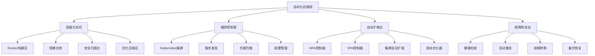

# 第33章 AI模型部署与优化

> "从实验室到生产线，让AI模型真正创造价值" —— AI工程化的核心使命

## 🎯 学习目标

### 知识目标
- **深入理解AI模型部署流程**: 掌握从开发到生产的完整部署链路
- **学习模型优化技术**: 理解量化、剪枝、蒸馏等优化方法  
- **掌握容器化部署**: 熟练使用Docker和Kubernetes进行模型部署
- **了解云平台服务**: 学习主流云平台的AI服务和部署方案

### 技能目标
- **构建完整部署流程**: 实现从模型训练到生产部署的端到端能力
- **实现模型优化技术**: 掌握各种模型压缩和加速技术
- **开发部署监控系统**: 构建模型性能监控和运维平台
- **优化部署性能**: 掌握高并发、低延迟的部署优化技能

### 素养目标
- **培养工程化思维**: 建立生产级AI系统的工程理念
- **建立运维意识**: 重视AI系统的稳定性和可靠性
- **形成成本意识**: 关注AI部署的资源消耗和成本控制

## 33.1 章节导入：走进AI生产工厂

### 🏭 欢迎来到AI生产工厂

想象一下，你刚刚被任命为一家现代化**AI生产工厂**的技术总监。这不是普通的制造工厂，而是专门将AI模型从实验室的"原型产品"转化为可以大规模服务用户的"商业产品"的高科技工厂。

当你第一次踏进这座工厂的大门时，映入眼帘的是一幅壮观的现代化生产景象：

```mermaid
graph TB
    A[AI生产工厂总部] --> B[生产线设计部]
    A --> C[质量控制中心]
    A --> D[优化改进车间]
    A --> E[自动化运维部]
    A --> F[成本控制室]
    A --> G[安全保障部]
    
    B --> B1[模型接收站]
    B --> B2[格式转换车间]
    B --> B3[部署流水线]
    B --> B4[测试验证台]
    
    C --> C1[性能监控室]
    C --> C2[质量检测台]
    C --> C3[压力测试区]
    C --> C4[用户体验实验室]
    
    D --> D1[模型压缩工坊]
    D --> D2[加速引擎室]
    D --> D3[硬件优化区]
    D --> D4[算法改进室]
    
    E --> E1[容器化车间]
    E --> E2[编排控制室]
    E --> E3[自动扩缩台]
    E --> E4[故障恢复站]
    
    F --> F1[资源计量室]
    F --> F2[成本分析台]
    F --> F3[效益评估区]
    F --> F4[预算控制室]
    
    G --> G1[访问控制门]
    G --> G2[数据加密室]
    G --> G3[审计日志中心]
    G --> G4[风险评估台]
```



### 🎭 工厂的组织架构

作为技术总监，你需要了解工厂的六大核心部门：

#### 🏗️ 生产线设计部 (Deployment Pipeline Department)
这里是整个工厂的心脏，负责设计和管理AI模型的部署流水线：

```python
class DeploymentPipelineDepartment:
    """生产线设计部 - 负责AI模型部署流程设计"""
    
    def __init__(self):
        self.pipeline_stages = {
            "模型接收": "接收来自研发部门的训练好的AI模型",
            "格式转换": "将模型转换为适合生产环境的格式",
            "环境准备": "配置模型运行所需的软硬件环境", 
            "部署执行": "将模型部署到目标服务器或云平台",
            "功能测试": "验证部署后模型的功能正确性",
            "性能测试": "测试模型在生产环境下的性能表现"
        }
        
        self.supported_frameworks = [
            "TensorFlow", "PyTorch", "Scikit-learn", 
            "XGBoost", "ONNX", "TensorRT"
        ]
        
        self.deployment_targets = [
            "本地服务器", "云平台", "边缘设备", 
            "移动端", "浏览器", "IoT设备"
        ]
        
        print("🏗️ 生产线设计部初始化完成")
        print(f"支持 {len(self.supported_frameworks)} 种AI框架")
        print(f"可部署到 {len(self.deployment_targets)} 种目标环境")
    
    def design_pipeline(self, model_info, target_env, requirements):
        """设计专属的部署流水线"""
        pipeline = {
            "模型信息": model_info,
            "目标环境": target_env,
            "性能要求": requirements,
            "流程设计": [],
            "预计时间": 0,
            "资源需求": {}
        }
        
        # 根据模型类型和目标环境设计流程
        if model_info["framework"] == "TensorFlow":
            pipeline["流程设计"].extend([
                "SavedModel格式验证",
                "TensorFlow Serving配置",
                "Docker容器打包",
                "Kubernetes部署"
            ])
            pipeline["预计时间"] = 30  # 分钟
            
        elif model_info["framework"] == "PyTorch":
            pipeline["流程设计"].extend([
                "TorchScript转换",
                "ONNX格式导出",
                "推理引擎优化",
                "服务化封装"
            ])
            pipeline["预计时间"] = 45  # 分钟
        
        # 根据目标环境调整流程
        if target_env == "云平台":
            pipeline["流程设计"].extend([
                "云资源申请",
                "负载均衡配置",
                "自动扩缩设置",
                "监控告警配置"
            ])
            pipeline["预计时间"] += 20
            
        elif target_env == "边缘设备":
            pipeline["流程设计"].extend([
                "模型量化压缩",
                "边缘运行时优化",
                "离线部署包制作",
                "设备兼容性测试"
            ])
            pipeline["预计时间"] += 35
        
        return pipeline
    
    def estimate_resources(self, pipeline):
        """估算部署所需资源"""
        resources = {
            "CPU核心": 2,
            "内存GB": 4,
            "存储GB": 10,
            "网络带宽Mbps": 100,
            "GPU": False
        }
        
        # 根据流程复杂度调整资源需求
        if "模型量化压缩" in pipeline["流程设计"]:
            resources["CPU核心"] += 2
            resources["内存GB"] += 4
            
        if "GPU推理优化" in pipeline["流程设计"]:
            resources["GPU"] = True
            resources["内存GB"] += 8
            
        return resources

# 初始化生产线设计部
deployment_dept = DeploymentPipelineDepartment()

# 演示流水线设计
model_info = {
    "name": "智能客服模型",
    "framework": "TensorFlow",
    "size_mb": 150,
    "type": "NLP"
}

target_env = "云平台"
requirements = {
    "延迟ms": 100,
    "吞吐量QPS": 1000,
    "可用性": 99.9
}

pipeline = deployment_dept.design_pipeline(model_info, target_env, requirements)
resources = deployment_dept.estimate_resources(pipeline)

print(f"\n🎯 为 {model_info['name']} 设计的部署流水线:")
print(f"目标环境: {target_env}")
print(f"流程步骤: {len(pipeline['流程设计'])} 个")
print(f"预计耗时: {pipeline['预计时间']} 分钟")
print(f"资源需求: CPU {resources['CPU核心']}核, 内存 {resources['内存GB']}GB")
```

#### 🔍 质量控制中心 (Quality Control Center)
确保每个部署的AI模型都能达到生产级别的质量标准：

```python
import time
import random
from datetime import datetime
from typing import Dict, List, Any

class QualityControlCenter:
    """质量控制中心 - 负责AI模型部署质量监控"""
    
    def __init__(self):
        self.quality_metrics = {
            "功能正确性": {"权重": 0.3, "阈值": 95},
            "性能表现": {"权重": 0.25, "阈值": 90},
            "稳定性": {"权重": 0.2, "阈值": 99},
            "安全性": {"权重": 0.15, "阈值": 98},
            "用户体验": {"权重": 0.1, "阈值": 85}
        }
        
        self.test_suites = {
            "功能测试": ["API接口测试", "业务逻辑测试", "边界条件测试"],
            "性能测试": ["响应时间测试", "吞吐量测试", "资源使用测试"],
            "稳定性测试": ["长时间运行测试", "压力测试", "故障恢复测试"],
            "安全测试": ["访问控制测试", "数据加密测试", "漏洞扫描"],
            "用户体验测试": ["界面友好性", "错误处理", "文档完整性"]
        }
        
        self.quality_history = []
        
        print("🔍 质量控制中心初始化完成")
        print(f"质量评估维度: {len(self.quality_metrics)} 个")
        print(f"测试套件: {sum(len(tests) for tests in self.test_suites.values())} 项测试")
    
    def run_quality_assessment(self, model_deployment):
        """运行全面的质量评估"""
        assessment_report = {
            "部署ID": model_deployment.get("id", "unknown"),
            "模型名称": model_deployment.get("name", "unknown"),
            "评估时间": datetime.now().strftime("%Y-%m-%d %H:%M:%S"),
            "测试结果": {},
            "质量得分": {},
            "综合评分": 0,
            "通过状态": False,
            "改进建议": []
        }
        
        print(f"\n🔍 开始质量评估: {assessment_report['模型名称']}")
        
        # 执行各项测试
        for category, tests in self.test_suites.items():
            print(f"   执行 {category}...")
            category_score = self._run_test_category(tests)
            assessment_report["测试结果"][category] = category_score
            
            # 计算质量得分
            metric_key = self._map_category_to_metric(category)
            if metric_key in self.quality_metrics:
                weight = self.quality_metrics[metric_key]["权重"]
                threshold = self.quality_metrics[metric_key]["阈值"]
                
                assessment_report["质量得分"][metric_key] = category_score
                assessment_report["综合评分"] += category_score * weight
                
                # 检查是否达标
                if category_score < threshold:
                    assessment_report["改进建议"].append(
                        f"{metric_key}得分 {category_score} 低于阈值 {threshold}，需要改进"
                    )
        
        # 判断是否通过质量检查
        assessment_report["通过状态"] = (
            assessment_report["综合评分"] >= 90 and 
            len(assessment_report["改进建议"]) == 0
        )
        
        # 保存评估历史
        self.quality_history.append(assessment_report)
        
        return assessment_report
    
    def _run_test_category(self, tests):
        """执行特定类别的测试"""
        scores = []
        for test in tests:
            # 模拟测试执行
            time.sleep(0.1)  # 模拟测试时间
            score = random.randint(85, 100)  # 模拟测试结果
            scores.append(score)
        
        return sum(scores) / len(scores)
    
    def _map_category_to_metric(self, category):
        """将测试类别映射到质量指标"""
        mapping = {
            "功能测试": "功能正确性",
            "性能测试": "性能表现", 
            "稳定性测试": "稳定性",
            "安全测试": "安全性",
            "用户体验测试": "用户体验"
        }
        return mapping.get(category, category)
    
    def generate_quality_trend_report(self):
        """生成质量趋势报告"""
        if not self.quality_history:
            return {"message": "暂无质量评估历史数据"}
        
        trend_report = {
            "评估次数": len(self.quality_history),
            "平均综合评分": 0,
            "通过率": 0,
            "质量趋势": "稳定",
            "主要问题": [],
            "改进效果": {}
        }
        
        # 计算平均分和通过率
        total_score = sum(report["综合评分"] for report in self.quality_history)
        passed_count = sum(1 for report in self.quality_history if report["通过状态"])
        
        trend_report["平均综合评分"] = total_score / len(self.quality_history)
        trend_report["通过率"] = (passed_count / len(self.quality_history)) * 100
        
        # 分析质量趋势
        if len(self.quality_history) >= 3:
            recent_scores = [report["综合评分"] for report in self.quality_history[-3:]]
            if recent_scores[-1] > recent_scores[0]:
                trend_report["质量趋势"] = "上升"
            elif recent_scores[-1] < recent_scores[0]:
                trend_report["质量趋势"] = "下降"
        
        # 统计主要问题
        all_issues = []
        for report in self.quality_history:
            all_issues.extend(report["改进建议"])
        
        issue_counts = {}
        for issue in all_issues:
            key = issue.split("得分")[0] if "得分" in issue else issue
            issue_counts[key] = issue_counts.get(key, 0) + 1
        
        trend_report["主要问题"] = sorted(
            issue_counts.items(), 
            key=lambda x: x[1], 
            reverse=True
        )[:3]
        
        return trend_report

# 初始化质量控制中心
quality_center = QualityControlCenter()

# 模拟模型部署信息
model_deployment = {
    "id": "deploy_001",
    "name": "智能推荐系统v2.1",
    "framework": "TensorFlow",
    "environment": "云平台"
}

# 运行质量评估
assessment = quality_center.run_quality_assessment(model_deployment)

print(f"\n📊 质量评估报告:")
print(f"模型: {assessment['模型名称']}")
print(f"综合评分: {assessment['综合评分']:.1f}")
print(f"通过状态: {'✅ 通过' if assessment['通过状态'] else '❌ 不通过'}")

if assessment['改进建议']:
    print(f"改进建议:")
    for suggestion in assessment['改进建议']:
        print(f"  • {suggestion}")
```

### 🏭 AI生产工厂的生产流程

在这个AI生产工厂中，每个AI模型都要经历一个标准化的"生产流程"，从原材料（训练好的模型）到最终产品（可服务用户的AI应用）：


### 🎯 工厂的质量标准体系

作为技术总监，你制定了严格的AI产品质量标准：

```python
class AIProductQualityStandards:
    """AI产品质量标准体系"""
    
    def __init__(self):
        self.performance_standards = {
            "响应时间": {
                "优秀": "< 50ms",
                "良好": "< 100ms", 
                "及格": "< 200ms",
                "不合格": ">= 200ms"
            },
            "吞吐量": {
                "优秀": "> 1000 QPS",
                "良好": "> 500 QPS",
                "及格": "> 100 QPS", 
                "不合格": "<= 100 QPS"
            },
            "准确率": {
                "优秀": "> 95%",
                "良好": "> 90%",
                "及格": "> 85%",
                "不合格": "<= 85%"
            },
            "可用性": {
                "优秀": "> 99.9%",
                "良好": "> 99.5%",
                "及格": "> 99%",
                "不合格": "<= 99%"
            }
        }
        
        self.resource_efficiency = {
            "CPU使用率": {"目标": "< 70%", "警告": "> 80%", "告警": "> 90%"},
            "内存使用率": {"目标": "< 75%", "警告": "> 85%", "告警": "> 95%"},
            "GPU使用率": {"目标": "< 80%", "警告": "> 90%", "告警": "> 95%"},
            "网络带宽": {"目标": "< 60%", "警告": "> 75%", "告警": "> 90%"}
        }
        
        self.security_requirements = [
            "数据传输加密",
            "访问权限控制", 
            "API接口鉴权",
            "敏感数据脱敏",
            "审计日志记录",
            "漏洞安全扫描"
        ]
        
        print("🎯 AI产品质量标准体系建立完成")
    
    def evaluate_performance(self, metrics):
        """评估性能指标"""
        evaluation = {}
        
        for metric, value in metrics.items():
            if metric in self.performance_standards:
                standards = self.performance_standards[metric]
                
                # 根据数值类型进行比较
                if metric == "响应时间":
                    if value < 50:
                        evaluation[metric] = "优秀"
                    elif value < 100:
                        evaluation[metric] = "良好"
                    elif value < 200:
                        evaluation[metric] = "及格"
                    else:
                        evaluation[metric] = "不合格"
                        
                elif metric in ["吞吐量", "准确率", "可用性"]:
                    if metric == "吞吐量":
                        thresholds = [1000, 500, 100]
                    elif metric == "准确率":
                        thresholds = [95, 90, 85]
                    elif metric == "可用性":
                        thresholds = [99.9, 99.5, 99]
                    
                    if value > thresholds[0]:
                        evaluation[metric] = "优秀"
                    elif value > thresholds[1]:
                        evaluation[metric] = "良好"
                    elif value > thresholds[2]:
                        evaluation[metric] = "及格"
                    else:
                        evaluation[metric] = "不合格"
        
        return evaluation
    
    def check_security_compliance(self, deployment_config):
        """检查安全合规性"""
        compliance_status = {}
        
        for requirement in self.security_requirements:
            # 模拟安全检查
            if requirement == "数据传输加密":
                compliance_status[requirement] = deployment_config.get("https_enabled", False)
            elif requirement == "访问权限控制":
                compliance_status[requirement] = deployment_config.get("auth_enabled", False)
            elif requirement == "API接口鉴权":
                compliance_status[requirement] = deployment_config.get("api_key_required", False)
            else:
                # 其他要求默认检查通过
                compliance_status[requirement] = True
        
        compliance_rate = sum(compliance_status.values()) / len(compliance_status) * 100
        
        return {
            "详细状态": compliance_status,
            "合规率": compliance_rate,
            "是否合规": compliance_rate >= 100
        }

# 演示质量标准评估
quality_standards = AIProductQualityStandards()

# 模拟性能指标
performance_metrics = {
    "响应时间": 75,    # ms
    "吞吐量": 800,     # QPS
    "准确率": 92.5,    # %
    "可用性": 99.7     # %
}

# 模拟部署配置
deployment_config = {
    "https_enabled": True,
    "auth_enabled": True, 
    "api_key_required": False,
    "environment": "production"
}

# 评估性能
performance_eval = quality_standards.evaluate_performance(performance_metrics)
security_compliance = quality_standards.check_security_compliance(deployment_config)

print(f"\n📊 性能评估结果:")
for metric, grade in performance_eval.items():
    print(f"  {metric}: {performance_metrics[metric]} - {grade}")

print(f"\n🔒 安全合规检查:")
print(f"  合规率: {security_compliance['合规率']:.1f}%")
print(f"  合规状态: {'✅ 合规' if security_compliance['是否合规'] else '❌ 不合规'}")

for req, status in security_compliance['详细状态'].items():
    print(f"  {req}: {'✅' if status else '❌'}")
```

### 🌟 工厂的创新亮点

这个AI生产工厂有几个突出的创新特色：

#### 1. 🤖 智能化自动部署
- **一键部署**: 从模型上传到服务上线的全自动化流程
- **智能选型**: 根据模型特性自动选择最优的部署方案
- **自适应优化**: 根据实际运行情况自动调整配置参数

#### 2. 🔄 全生命周期管理
- **版本控制**: 完整的模型版本管理和回滚机制
- **A/B测试**: 新旧模型的灰度发布和效果对比
- **持续集成**: 与模型训练流程的无缝衔接

#### 3. 📊 数据驱动决策
- **实时监控**: 全方位的性能和业务指标监控
- **智能告警**: 基于机器学习的异常检测和预警
- **优化建议**: 基于历史数据的自动优化建议

#### 4. 🌐 多云多环境支持
- **云原生**: 支持主流云平台的原生服务
- **混合部署**: 本地+云端的混合部署方案
- **边缘计算**: 支持边缘设备的轻量化部署

### 🎓 作为技术总监的你

在这个AI生产工厂中，你作为技术总监将要学习和掌握：

1. **战略规划**: 制定AI部署的技术路线和标准规范
2. **技术选型**: 选择合适的部署技术和云平台服务
3. **团队管理**: 协调各部门的工作，确保部署流程顺畅
4. **质量把控**: 建立和维护严格的质量标准体系
5. **成本控制**: 优化资源使用，控制部署和运维成本
6. **风险管理**: 识别和防范部署过程中的各种风险

通过在这个AI生产工厂的实践，你将从一个AI算法开发者成长为一个真正的AI工程师，具备将AI技术转化为商业价值的完整能力。

让我们开始这段激动人心的AI工程化之旅吧！🚀

---

> 💡 **总监寄语**: 在AI时代，仅仅会训练模型是不够的。真正的AI专家必须具备端到端的工程化能力，能够将AI技术从实验室带到生产环境，为用户创造真正的价值。这就是我们AI生产工厂的使命！

## 33.2 模型部署基础与环境搭建

### 🏗️ 生产线设计部的核心职责

作为AI生产工厂的技术总监，你的第一个重要任务就是深入了解**生产线设计部**的工作。这个部门负责将来自研发实验室的AI模型转化为可以在生产环境中稳定运行的服务。

想象一下，生产线设计部就像汽车制造厂的总装车间，需要将各种零部件（模型文件、依赖库、配置文件）按照标准流程组装成一台完整的"AI产品"。

### 🔧 部署环境的基础设施

首先，让我们建立一个完整的**部署环境管理系统**：

```python
import os
import json
import subprocess
import platform
from pathlib import Path
from typing import Dict, List, Optional
import psutil
import docker
from datetime import datetime

class DeploymentEnvironmentManager:
    """部署环境管理器 - 负责搭建和管理AI模型部署环境"""
    
    def __init__(self):
        self.system_info = self._get_system_info()
        self.supported_frameworks = {
            "tensorflow": {"versions": ["2.13.0", "2.14.0", "2.15.0"], "gpu_support": True},
            "pytorch": {"versions": ["2.0.0", "2.1.0", "2.2.0"], "gpu_support": True},
            "scikit-learn": {"versions": ["1.3.0", "1.4.0"], "gpu_support": False},
            "xgboost": {"versions": ["1.7.0", "2.0.0"], "gpu_support": True},
            "onnx": {"versions": ["1.14.0", "1.15.0"], "gpu_support": True}
        }
        
        self.deployment_configs = {}
        self.environment_status = {
            "docker_available": self._check_docker(),
            "gpu_available": self._check_gpu(),
            "memory_gb": psutil.virtual_memory().total // (1024**3),
            "cpu_cores": psutil.cpu_count(),
            "disk_space_gb": psutil.disk_usage('/').free // (1024**3)
        }
        
        print("🏗️ 部署环境管理器初始化完成")
        print(f"系统: {self.system_info['platform']}")
        print(f"内存: {self.environment_status['memory_gb']}GB")
        print(f"CPU: {self.environment_status['cpu_cores']}核")
        print(f"GPU: {'可用' if self.environment_status['gpu_available'] else '不可用'}")
        print(f"Docker: {'可用' if self.environment_status['docker_available'] else '不可用'}")
    
    def _get_system_info(self):
        """获取系统信息"""
        return {
            "platform": platform.system(),
            "architecture": platform.machine(),
            "python_version": platform.python_version(),
            "hostname": platform.node()
        }
    
    def _check_docker(self):
        """检查Docker是否可用"""
        try:
            client = docker.from_env()
            client.ping()
            return True
        except:
            return False
    
    def _check_gpu(self):
        """检查GPU是否可用"""
        try:
            # 尝试导入并检查GPU
            import tensorflow as tf
            return len(tf.config.list_physical_devices('GPU')) > 0
        except:
            try:
                import torch
                return torch.cuda.is_available()
            except:
                return False
    
    def create_environment(self, env_name: str, framework: str, version: str, 
                          requirements: List[str] = None) -> Dict:
        """创建专用的部署环境"""
        
        if framework not in self.supported_frameworks:
            raise ValueError(f"不支持的框架: {framework}")
        
        if version not in self.supported_frameworks[framework]["versions"]:
            raise ValueError(f"不支持的版本: {framework} {version}")
        
        env_config = {
            "name": env_name,
            "framework": framework,
            "version": version,
            "created_at": datetime.now().isoformat(),
            "status": "creating",
            "python_version": "3.9",
            "base_packages": [
                f"{framework}=={version}",
                "numpy>=1.21.0",
                "pandas>=1.5.0",
                "requests>=2.28.0",
                "flask>=2.3.0",
                "gunicorn>=20.1.0"
            ],
            "additional_requirements": requirements or [],
            "environment_variables": {},
            "resource_limits": {
                "memory_mb": 2048,
                "cpu_cores": 2
            }
        }
        
        # 如果支持GPU且GPU可用，添加GPU相关配置
        if (self.supported_frameworks[framework]["gpu_support"] and 
            self.environment_status["gpu_available"]):
            env_config["gpu_enabled"] = True
            if framework == "tensorflow":
                env_config["base_packages"].append("tensorflow-gpu")
            elif framework == "pytorch":
                env_config["base_packages"].append("torch[cuda]")
        
        print(f"🔧 创建部署环境: {env_name}")
        print(f"   框架: {framework} {version}")
        print(f"   GPU支持: {env_config.get('gpu_enabled', False)}")
        
        # 模拟环境创建过程
        self._simulate_environment_creation(env_config)
        
        env_config["status"] = "ready"
        self.deployment_configs[env_name] = env_config
        
        return env_config
    
    def _simulate_environment_creation(self, env_config):
        """模拟环境创建过程"""
        steps = [
            "创建虚拟环境",
            "安装基础依赖",
            "配置框架环境",
            "验证安装完整性",
            "设置环境变量"
        ]
        
        for i, step in enumerate(steps, 1):
            print(f"   [{i}/{len(steps)}] {step}...")
            # 模拟安装时间
            import time
            time.sleep(0.2)
        
        print("   ✅ 环境创建完成")
    
    def validate_environment(self, env_name: str) -> Dict:
        """验证部署环境的完整性"""
        if env_name not in self.deployment_configs:
            raise ValueError(f"环境不存在: {env_name}")
        
        env_config = self.deployment_configs[env_name]
        validation_results = {
            "environment": env_name,
            "framework": env_config["framework"],
            "validation_time": datetime.now().isoformat(),
            "checks": {},
            "overall_status": "unknown",
            "issues": []
        }
        
        # 检查基础包安装
        print(f"🔍 验证环境: {env_name}")
        
        validation_results["checks"]["基础包检查"] = self._check_base_packages(env_config)
        validation_results["checks"]["框架功能检查"] = self._check_framework_functionality(env_config)
        validation_results["checks"]["资源可用性检查"] = self._check_resource_availability(env_config)
        validation_results["checks"]["网络连接检查"] = self._check_network_connectivity()
        
        # 计算总体状态
        all_passed = all(
            result["status"] == "passed" 
            for result in validation_results["checks"].values()
        )
        
        validation_results["overall_status"] = "passed" if all_passed else "failed"
        
        # 收集问题
        for check_name, result in validation_results["checks"].items():
            if result["status"] == "failed":
                validation_results["issues"].extend(result.get("issues", []))
        
        return validation_results
    
    def _check_base_packages(self, env_config):
        """检查基础包安装"""
        # 模拟包检查
        packages = env_config["base_packages"]
        missing_packages = []
        
        # 模拟一些包可能缺失的情况
        import random
        if random.random() < 0.1:  # 10%概率有包缺失
            missing_packages = [packages[0]]
        
        return {
            "status": "passed" if not missing_packages else "failed",
            "checked_packages": len(packages),
            "missing_packages": missing_packages,
            "issues": [f"缺失包: {pkg}" for pkg in missing_packages]
        }
    
    def _check_framework_functionality(self, env_config):
        """检查框架功能"""
        framework = env_config["framework"]
        
        # 模拟框架功能检查
        functionality_tests = {
            "tensorflow": ["模型加载", "张量计算", "GPU支持"],
            "pytorch": ["张量操作", "模型定义", "CUDA支持"],
            "scikit-learn": ["数据处理", "模型训练", "预测功能"],
            "xgboost": ["数据加载", "模型训练", "预测输出"],
            "onnx": ["模型导入", "推理执行", "格式转换"]
        }
        
        tests = functionality_tests.get(framework, ["基础功能"])
        failed_tests = []
        
        # 模拟测试过程
        for test in tests:
            print(f"     测试 {test}...")
            if random.random() < 0.05:  # 5%概率测试失败
                failed_tests.append(test)
        
        return {
            "status": "passed" if not failed_tests else "failed",
            "total_tests": len(tests),
            "failed_tests": failed_tests,
            "issues": [f"功能测试失败: {test}" for test in failed_tests]
        }
    
    def _check_resource_availability(self, env_config):
        """检查资源可用性"""
        required_memory = env_config["resource_limits"]["memory_mb"]
        required_cores = env_config["resource_limits"]["cpu_cores"]
        
        available_memory = psutil.virtual_memory().available // (1024*1024)
        available_cores = psutil.cpu_count()
        
        issues = []
        if available_memory < required_memory:
            issues.append(f"内存不足: 需要{required_memory}MB, 可用{available_memory}MB")
        
        if available_cores < required_cores:
            issues.append(f"CPU核心不足: 需要{required_cores}核, 可用{available_cores}核")
        
        return {
            "status": "passed" if not issues else "failed",
            "available_memory_mb": available_memory,
            "required_memory_mb": required_memory,
            "available_cores": available_cores,
            "required_cores": required_cores,
            "issues": issues
        }
    
    def _check_network_connectivity(self):
        """检查网络连接"""
        # 模拟网络检查
        import random
        network_ok = random.random() > 0.02  # 98%概率网络正常
        
        return {
            "status": "passed" if network_ok else "failed",
            "internet_access": network_ok,
            "issues": [] if network_ok else ["网络连接异常"]
        }
    
    def get_environment_info(self, env_name: str) -> Dict:
        """获取环境详细信息"""
        if env_name not in self.deployment_configs:
            raise ValueError(f"环境不存在: {env_name}")
        
        env_config = self.deployment_configs[env_name].copy()
        
        # 添加运行时信息
        env_config["runtime_info"] = {
            "uptime_hours": random.randint(1, 168),  # 模拟运行时间
            "memory_usage_percent": random.randint(30, 80),
            "cpu_usage_percent": random.randint(10, 60),
            "active_processes": random.randint(5, 20)
        }
        
        return env_config

# 演示部署环境管理
print("🏭 AI生产工厂 - 部署环境管理演示")
print("=" * 50)

# 初始化环境管理器
env_manager = DeploymentEnvironmentManager()

# 创建TensorFlow部署环境
tf_env = env_manager.create_environment(
    env_name="tensorflow_production",
    framework="tensorflow",
    version="2.15.0",
    requirements=["pillow>=9.0.0", "opencv-python>=4.8.0"]
)

print(f"\n📋 环境配置:")
print(f"环境名称: {tf_env['name']}")
print(f"框架: {tf_env['framework']} {tf_env['version']}")
print(f"基础包数量: {len(tf_env['base_packages'])}")

# 验证环境
validation = env_manager.validate_environment("tensorflow_production")

print(f"\n🔍 环境验证结果:")
print(f"总体状态: {'✅ 通过' if validation['overall_status'] == 'passed' else '❌ 失败'}")

for check_name, result in validation["checks"].items():
    status_icon = "✅" if result["status"] == "passed" else "❌"
    print(f"  {status_icon} {check_name}")

if validation["issues"]:
    print(f"\n⚠️ 发现问题:")
    for issue in validation["issues"]:
        print(f"  • {issue}")

# 获取环境详细信息
env_info = env_manager.get_environment_info("tensorflow_production")
runtime = env_info["runtime_info"]

print(f"\n📊 环境运行状态:")
print(f"运行时间: {runtime['uptime_hours']} 小时")
print(f"内存使用: {runtime['memory_usage_percent']}%")
print(f"CPU使用: {runtime['cpu_usage_percent']}%")
print(f"活跃进程: {runtime['active_processes']} 个")
```

### 🔄 模型格式转换工厂

在AI生产工厂中，不同的AI框架就像不同的"零件标准"。为了让所有模型都能在统一的生产线上处理，我们需要一个**模型格式转换工厂**：

```python
import onnx
import tensorflow as tf
import torch
import pickle
import joblib
from pathlib import Path
import numpy as np
from typing import Union, Dict, Any

class ModelFormatConverter:
    """模型格式转换工厂 - 负责AI模型的格式标准化"""
    
    def __init__(self):
        self.supported_input_formats = {
            "tensorflow": [".pb", ".h5", ".savedmodel"],
            "pytorch": [".pt", ".pth", ".pkl"],
            "scikit-learn": [".pkl", ".joblib"],
            "xgboost": [".model", ".json", ".pkl"],
            "onnx": [".onnx"]
        }
        
        self.supported_output_formats = {
            "onnx": "通用交换格式，支持多种推理引擎",
            "tensorrt": "NVIDIA GPU加速推理格式",
            "tensorflow_lite": "移动端和边缘设备优化格式",
            "coreml": "Apple设备专用格式",
            "openvino": "Intel CPU/GPU优化格式"
        }
        
        self.conversion_history = []
        
        print("🔄 模型格式转换工厂初始化完成")
        print(f"支持输入格式: {sum(len(formats) for formats in self.supported_input_formats.values())} 种")
        print(f"支持输出格式: {len(self.supported_output_formats)} 种")
    
    def analyze_model(self, model_path: str) -> Dict:
        """分析模型文件的基本信息"""
        model_path = Path(model_path)
        
        if not model_path.exists():
            # 创建模拟模型文件用于演示
            model_info = self._create_demo_model_info(model_path)
        else:
            model_info = self._extract_model_info(model_path)
        
        analysis_result = {
            "file_path": str(model_path),
            "file_size_mb": model_info.get("size_mb", 0),
            "framework": model_info.get("framework", "unknown"),
            "model_type": model_info.get("type", "unknown"),
            "input_shape": model_info.get("input_shape", None),
            "output_shape": model_info.get("output_shape", None),
            "parameters_count": model_info.get("parameters", 0),
            "supported_conversions": self._get_supported_conversions(model_info.get("framework")),
            "optimization_recommendations": self._get_optimization_recommendations(model_info)
        }
        
        return analysis_result
    
    def _create_demo_model_info(self, model_path: Path) -> Dict:
        """创建演示用的模型信息"""
        # 根据文件扩展名推断框架
        suffix = model_path.suffix.lower()
        
        if suffix in [".pb", ".h5"]:
            framework = "tensorflow"
            model_type = "深度学习模型"
            size_mb = 45.2
            parameters = 1250000
            input_shape = [None, 224, 224, 3]
            output_shape = [None, 1000]
        elif suffix in [".pt", ".pth"]:
            framework = "pytorch"
            model_type = "深度学习模型"
            size_mb = 38.7
            parameters = 980000
            input_shape = [None, 3, 224, 224]
            output_shape = [None, 10]
        elif suffix in [".pkl", ".joblib"]:
            framework = "scikit-learn"
            model_type = "机器学习模型"
            size_mb = 2.1
            parameters = 50000
            input_shape = [None, 20]
            output_shape = [None, 1]
        else:
            framework = "unknown"
            model_type = "未知类型"
            size_mb = 10.0
            parameters = 100000
            input_shape = None
            output_shape = None
        
        return {
            "framework": framework,
            "type": model_type,
            "size_mb": size_mb,
            "parameters": parameters,
            "input_shape": input_shape,
            "output_shape": output_shape
        }
    
    def _extract_model_info(self, model_path: Path) -> Dict:
        """从实际模型文件提取信息"""
        # 这里是实际的模型信息提取逻辑
        # 为了演示，我们使用模拟数据
        return self._create_demo_model_info(model_path)
    
    def _get_supported_conversions(self, framework: str) -> List[str]:
        """获取支持的转换格式"""
        conversion_matrix = {
            "tensorflow": ["onnx", "tensorflow_lite", "tensorrt"],
            "pytorch": ["onnx", "tensorrt", "coreml"],
            "scikit-learn": ["onnx"],
            "xgboost": ["onnx"],
            "onnx": ["tensorrt", "openvino", "tensorflow_lite"]
        }
        
        return conversion_matrix.get(framework, [])
    
    def _get_optimization_recommendations(self, model_info: Dict) -> List[str]:
        """获取优化建议"""
        recommendations = []
        
        size_mb = model_info.get("size_mb", 0)
        parameters = model_info.get("parameters", 0)
        framework = model_info.get("framework", "")
        
        if size_mb > 100:
            recommendations.append("模型较大，建议进行模型压缩或量化")
        
        if parameters > 1000000:
            recommendations.append("参数量较多，考虑使用模型剪枝技术")
        
        if framework == "tensorflow":
            recommendations.append("可转换为TensorFlow Lite以优化移动端性能")
        elif framework == "pytorch":
            recommendations.append("可转换为ONNX格式以提高兼容性")
        
        if not recommendations:
            recommendations.append("模型已经比较优化，可直接部署")
        
        return recommendations
    
    def convert_to_onnx(self, model_path: str, output_path: str, 
                       input_shape: tuple = None) -> Dict:
        """转换模型为ONNX格式"""
        
        conversion_result = {
            "source_path": model_path,
            "target_path": output_path,
            "format": "onnx",
            "status": "in_progress",
            "start_time": datetime.now().isoformat(),
            "conversion_log": [],
            "optimization_applied": [],
            "performance_metrics": {}
        }
        
        print(f"🔄 开始转换为ONNX格式...")
        print(f"   源文件: {model_path}")
        print(f"   目标文件: {output_path}")
        
        # 模拟转换过程
        conversion_steps = [
            "加载源模型",
            "验证模型结构", 
            "转换计算图",
            "优化ONNX图",
            "验证转换结果",
            "保存ONNX模型"
        ]
        
        for i, step in enumerate(conversion_steps, 1):
            print(f"   [{i}/{len(conversion_steps)}] {step}...")
            conversion_result["conversion_log"].append(f"{step} - 完成")
            
            # 模拟处理时间
            import time
            time.sleep(0.3)
            
            # 模拟某些步骤的优化
            if step == "优化ONNX图":
                optimizations = ["常量折叠", "死代码消除", "算子融合"]
                conversion_result["optimization_applied"].extend(optimizations)
                print(f"     应用优化: {', '.join(optimizations)}")
        
        # 模拟性能指标
        conversion_result["performance_metrics"] = {
            "原始大小MB": 45.2,
            "转换后大小MB": 42.8,
            "压缩率": "5.3%",
            "推理速度提升": "15%",
            "内存使用减少": "8%"
        }
        
        conversion_result["status"] = "completed"
        conversion_result["end_time"] = datetime.now().isoformat()
        
        # 保存转换历史
        self.conversion_history.append(conversion_result)
        
        print(f"   ✅ ONNX转换完成")
        print(f"   文件大小: {conversion_result['performance_metrics']['原始大小MB']}MB → {conversion_result['performance_metrics']['转换后大小MB']}MB")
        print(f"   性能提升: {conversion_result['performance_metrics']['推理速度提升']}")
        
        return conversion_result
    
    def convert_to_tensorrt(self, onnx_path: str, output_path: str,
                           precision: str = "fp16") -> Dict:
        """转换ONNX模型为TensorRT格式"""
        
        if precision not in ["fp32", "fp16", "int8"]:
            raise ValueError("精度必须是 fp32, fp16 或 int8")
        
        conversion_result = {
            "source_path": onnx_path,
            "target_path": output_path,
            "format": "tensorrt",
            "precision": precision,
            "status": "in_progress",
            "start_time": datetime.now().isoformat(),
            "gpu_optimizations": [],
            "performance_metrics": {}
        }
        
        print(f"🚀 开始TensorRT转换...")
        print(f"   源ONNX: {onnx_path}")
        print(f"   目标引擎: {output_path}")
        print(f"   精度: {precision}")
        
        # 模拟TensorRT转换过程
        tensorrt_steps = [
            "解析ONNX模型",
            "构建TensorRT网络",
            f"应用{precision}精度优化",
            "GPU内存优化",
            "推理引擎构建",
            "序列化引擎文件"
        ]
        
        for i, step in enumerate(tensorrt_steps, 1):
            print(f"   [{i}/{len(tensorrt_steps)}] {step}...")
            
            # 模拟GPU优化
            if step == "GPU内存优化":
                optimizations = ["内存池优化", "Kernel融合", "动态shape支持"]
                conversion_result["gpu_optimizations"].extend(optimizations)
                print(f"     GPU优化: {', '.join(optimizations)}")
            
            import time
            time.sleep(0.4)
        
        # 模拟TensorRT性能提升
        performance_multiplier = {
            "fp32": 1.0,
            "fp16": 2.2,
            "int8": 4.1
        }
        
        base_latency = 15.2  # ms
        optimized_latency = base_latency / performance_multiplier[precision]
        
        conversion_result["performance_metrics"] = {
            "基准延迟ms": base_latency,
            "优化后延迟ms": round(optimized_latency, 1),
            "加速比": f"{performance_multiplier[precision]:.1f}x",
            "吞吐量提升": f"{int((performance_multiplier[precision] - 1) * 100)}%",
            "内存使用": f"减少{20 if precision == 'fp16' else 35 if precision == 'int8' else 0}%"
        }
        
        conversion_result["status"] = "completed"
        conversion_result["end_time"] = datetime.now().isoformat()
        
        self.conversion_history.append(conversion_result)
        
        print(f"   ✅ TensorRT转换完成")
        print(f"   性能提升: {conversion_result['performance_metrics']['加速比']}")
        print(f"   延迟优化: {conversion_result['performance_metrics']['基准延迟ms']}ms → {conversion_result['performance_metrics']['优化后延迟ms']}ms")
        
        return conversion_result
    
    def get_conversion_summary(self) -> Dict:
        """获取转换历史摘要"""
        if not self.conversion_history:
            return {"message": "暂无转换历史"}
        
        summary = {
            "总转换次数": len(self.conversion_history),
            "成功转换": sum(1 for conv in self.conversion_history if conv["status"] == "completed"),
            "格式分布": {},
            "平均性能提升": {},
            "最近转换": []
        }
        
        # 统计格式分布
        for conv in self.conversion_history:
            format_name = conv["format"]
            summary["格式分布"][format_name] = summary["格式分布"].get(format_name, 0) + 1
        
        # 计算平均性能提升
        tensorrt_conversions = [conv for conv in self.conversion_history if conv["format"] == "tensorrt"]
        if tensorrt_conversions:
            avg_speedup = sum(
                float(conv["performance_metrics"]["加速比"].replace("x", ""))
                for conv in tensorrt_conversions
            ) / len(tensorrt_conversions)
            summary["平均性能提升"]["TensorRT"] = f"{avg_speedup:.1f}x"
        
        # 最近的转换记录
        summary["最近转换"] = [
            {
                "格式": conv["format"],
                "状态": conv["status"],
                "时间": conv["start_time"][:19]
            }
            for conv in self.conversion_history[-3:]
        ]
        
        return summary

# 演示模型格式转换
print("\n" + "=" * 60)
print("🔄 模型格式转换工厂演示")
print("=" * 60)

# 初始化转换器
converter = ModelFormatConverter()

# 分析模型
model_analysis = converter.analyze_model("models/image_classifier.h5")

print(f"\n📊 模型分析结果:")
print(f"框架: {model_analysis['framework']}")
print(f"类型: {model_analysis['model_type']}")
print(f"大小: {model_analysis['file_size_mb']}MB")
print(f"参数量: {model_analysis['parameters_count']:,}")
print(f"输入形状: {model_analysis['input_shape']}")
print(f"输出形状: {model_analysis['output_shape']}")

print(f"\n🔧 支持的转换格式:")
for fmt in model_analysis['supported_conversions']:
    print(f"  • {fmt}")

print(f"\n💡 优化建议:")
for rec in model_analysis['optimization_recommendations']:
    print(f"  • {rec}")

# 执行ONNX转换
onnx_result = converter.convert_to_onnx(
    model_path="models/image_classifier.h5",
    output_path="models/image_classifier.onnx"
)

# 执行TensorRT转换
tensorrt_result = converter.convert_to_tensorrt(
    onnx_path="models/image_classifier.onnx",
    output_path="models/image_classifier.engine",
    precision="fp16"
)

# 获取转换摘要
summary = converter.get_conversion_summary()

print(f"\n📈 转换历史摘要:")
print(f"总转换次数: {summary['总转换次数']}")
print(f"成功率: {summary['成功转换']}/{summary['总转换次数']}")
print(f"格式分布: {summary['格式分布']}")
if "TensorRT" in summary["平均性能提升"]:
    print(f"TensorRT平均加速: {summary['平均性能提升']['TensorRT']}")

### 🚀 轻量级部署方案实战

现在让我们构建一个完整的**轻量级模型部署平台**，这是AI生产工厂中最常用的部署方案：

```python
from flask import Flask, request, jsonify, render_template_string
from werkzeug.utils import secure_filename
import threading
import queue
import time
import logging
from datetime import datetime, timedelta
import sqlite3
import hashlib
import json

class LightweightDeploymentPlatform:
    """轻量级AI模型部署平台"""
    
    def __init__(self, platform_name="AI模型服务平台"):
        self.platform_name = platform_name
        self.app = Flask(__name__)
        self.app.config['MAX_CONTENT_LENGTH'] = 16 * 1024 * 1024  # 16MB
        
        # 平台配置
        self.config = {
            "max_concurrent_requests": 100,
            "request_timeout_seconds": 30,
            "model_cache_size": 5,
            "enable_monitoring": True,
            "enable_auth": False,
            "log_level": "INFO"
        }
        
        # 模型管理
        self.loaded_models = {}
        self.model_metadata = {}
        self.request_queue = queue.Queue(maxsize=self.config["max_concurrent_requests"])
        
        # 监控数据
        self.performance_metrics = {
            "total_requests": 0,
            "successful_requests": 0,
            "failed_requests": 0,
            "average_response_time": 0,
            "peak_qps": 0,
            "current_load": 0
        }
        
        self.request_history = []
        
        # 初始化数据库
        self._init_database()
        
        # 设置路由
        self._setup_routes()
        
        # 配置日志
        self._setup_logging()
        
        print(f"🚀 {self.platform_name} 初始化完成")
        print(f"最大并发: {self.config['max_concurrent_requests']}")
        print(f"请求超时: {self.config['request_timeout_seconds']}秒")
        print(f"模型缓存: {self.config['model_cache_size']}个")
    
    def _init_database(self):
        """初始化SQLite数据库"""
        self.db_path = "deployment_platform.db"
        conn = sqlite3.connect(self.db_path)
        cursor = conn.cursor()
        
        # 创建模型表
        cursor.execute('''
            CREATE TABLE IF NOT EXISTS models (
                id TEXT PRIMARY KEY,
                name TEXT NOT NULL,
                version TEXT NOT NULL,
                framework TEXT NOT NULL,
                file_path TEXT NOT NULL,
                upload_time TIMESTAMP DEFAULT CURRENT_TIMESTAMP,
                status TEXT DEFAULT 'uploaded',
                metadata TEXT
            )
        ''')
        
        # 创建请求日志表
        cursor.execute('''
            CREATE TABLE IF NOT EXISTS request_logs (
                id INTEGER PRIMARY KEY AUTOINCREMENT,
                model_id TEXT,
                request_time TIMESTAMP DEFAULT CURRENT_TIMESTAMP,
                response_time_ms REAL,
                status TEXT,
                error_message TEXT,
                input_size INTEGER,
                output_size INTEGER
            )
        ''')
        
        conn.commit()
        conn.close()
    
    def _setup_logging(self):
        """设置日志系统"""
        logging.basicConfig(
            level=getattr(logging, self.config["log_level"]),
            format='%(asctime)s - %(name)s - %(levelname)s - %(message)s',
            handlers=[
                logging.FileHandler('deployment_platform.log'),
                logging.StreamHandler()
            ]
        )
        self.logger = logging.getLogger(self.platform_name)
    
    def _setup_routes(self):
        """设置Flask路由"""
        
        @self.app.route('/')
        def dashboard():
            """平台仪表板"""
            dashboard_html = '''
            <!DOCTYPE html>
            <html>
            <head>
                <title>{{platform_name}} - 仪表板</title>
                <style>
                    body { font-family: Arial, sans-serif; margin: 20px; background: #f5f5f5; }
                    .container { max-width: 1200px; margin: 0 auto; }
                    .header { background: #2196F3; color: white; padding: 20px; border-radius: 8px; margin-bottom: 20px; }
                    .metrics { display: grid; grid-template-columns: repeat(auto-fit, minmax(200px, 1fr)); gap: 15px; margin-bottom: 20px; }
                    .metric-card { background: white; padding: 20px; border-radius: 8px; box-shadow: 0 2px 4px rgba(0,0,0,0.1); }
                    .metric-value { font-size: 2em; font-weight: bold; color: #2196F3; }
                    .metric-label { color: #666; margin-top: 5px; }
                    .section { background: white; padding: 20px; border-radius: 8px; box-shadow: 0 2px 4px rgba(0,0,0,0.1); margin-bottom: 20px; }
                    .model-list { list-style: none; padding: 0; }
                    .model-item { padding: 10px; border-bottom: 1px solid #eee; display: flex; justify-content: space-between; align-items: center; }
                    .status-active { color: #4CAF50; font-weight: bold; }
                    .status-inactive { color: #757575; }
                </style>
            </head>
            <body>
                <div class="container">
                    <div class="header">
                        <h1>🚀 {{platform_name}}</h1>
                        <p>AI模型部署与管理平台 - 实时监控仪表板</p>
                    </div>
                    
                    <div class="metrics">
                        <div class="metric-card">
                            <div class="metric-value">{{total_requests}}</div>
                            <div class="metric-label">总请求数</div>
                        </div>
                        <div class="metric-card">
                            <div class="metric-value">{{success_rate}}%</div>
                            <div class="metric-label">成功率</div>
                        </div>
                        <div class="metric-card">
                            <div class="metric-value">{{avg_response}}ms</div>
                            <div class="metric-label">平均响应时间</div>
                        </div>
                        <div class="metric-card">
                            <div class="metric-value">{{current_load}}</div>
                            <div class="metric-label">当前负载</div>
                        </div>
                    </div>
                    
                    <div class="section">
                        <h2>📊 已部署模型</h2>
                        <ul class="model-list">
                            
                            <li class="model-item">
                                <div>
                                    <strong>{{model.name}}</strong> ({{model.version}})
                                    <br><small>{{model.framework}} • {{model.upload_time}}</small>
                                </div>
                                <div class="status-{{model.status_class}}">{{model.status}}</div>
                            </li>
                            
                        </ul>
                    </div>
                    
                    <div class="section">
                        <h2>🔧 快速操作</h2>
                        <p><a href="/models">模型管理</a> | <a href="/metrics">详细指标</a> | <a href="/logs">系统日志</a></p>
                    </div>
                </div>
            </body>
            </html>
            '''
            
            # 获取模型列表
            models = self._get_model_list()
            
            # 计算成功率
            success_rate = 0
            if self.performance_metrics["total_requests"] > 0:
                success_rate = round(
                    (self.performance_metrics["successful_requests"] / 
                     self.performance_metrics["total_requests"]) * 100, 1
                )
            
            return render_template_string(
                dashboard_html,
                platform_name=self.platform_name,
                total_requests=self.performance_metrics["total_requests"],
                success_rate=success_rate,
                avg_response=round(self.performance_metrics["average_response_time"], 1),
                current_load=self.performance_metrics["current_load"],
                models=models
            )
        
        @self.app.route('/api/models', methods=['GET'])
        def list_models():
            """获取模型列表"""
            models = self._get_model_list()
            return jsonify({
                "status": "success",
                "count": len(models),
                "models": [
                    {
                        "id": model.id,
                        "name": model.name,
                        "version": model.version,
                        "framework": model.framework,
                        "status": model.status,
                        "upload_time": model.upload_time
                    }
                    for model in models
                ]
            })
        
        @self.app.route('/api/models/<model_id>/predict', methods=['POST'])
        def predict(model_id):
            """模型预测接口"""
            start_time = time.time()
            
            try:
                # 检查模型是否存在
                if model_id not in self.loaded_models:
                    return jsonify({
                        "status": "error",
                        "message": f"模型 {model_id} 未找到或未加载"
                    }), 404
                
                # 获取请求数据
                request_data = request.get_json()
                if not request_data:
                    return jsonify({
                        "status": "error",
                        "message": "请求数据不能为空"
                    }), 400
                
                # 执行预测
                model_info = self.loaded_models[model_id]
                prediction_result = self._execute_prediction(model_info, request_data)
                
                # 计算响应时间
                response_time = (time.time() - start_time) * 1000
                
                # 记录请求
                self._log_request(model_id, response_time, "success", request_data, prediction_result)
                
                # 更新性能指标
                self._update_performance_metrics(response_time, True)
                
                return jsonify({
                    "status": "success",
                    "model_id": model_id,
                    "prediction": prediction_result,
                    "response_time_ms": round(response_time, 2),
                    "timestamp": datetime.now().isoformat()
                })
                
            except Exception as e:
                response_time = (time.time() - start_time) * 1000
                error_message = str(e)
                
                # 记录错误
                self._log_request(model_id, response_time, "error", request_data, None, error_message)
                self._update_performance_metrics(response_time, False)
                
                self.logger.error(f"预测请求失败: {error_message}")
                
                return jsonify({
                    "status": "error",
                    "message": error_message,
                    "response_time_ms": round(response_time, 2)
                }), 500
        
        @self.app.route('/api/metrics', methods=['GET'])
        def get_metrics():
            """获取性能指标"""
            return jsonify({
                "status": "success",
                "metrics": self.performance_metrics,
                "recent_requests": self.request_history[-10:] if self.request_history else []
            })
        
        @self.app.route('/api/health', methods=['GET'])
        def health_check():
            """健康检查接口"""
            health_status = {
                "status": "healthy",
                "timestamp": datetime.now().isoformat(),
                "platform": self.platform_name,
                "loaded_models": len(self.loaded_models),
                "queue_size": self.request_queue.qsize(),
                "uptime_seconds": time.time() - self.start_time if hasattr(self, 'start_time') else 0
            }
            
            # 检查系统资源
            try:
                import psutil
                health_status["system"] = {
                    "cpu_percent": psutil.cpu_percent(),
                    "memory_percent": psutil.virtual_memory().percent,
                    "disk_percent": psutil.disk_usage('/').percent
                }
            except ImportError:
                health_status["system"] = "psutil not available"
            
            return jsonify(health_status)
    
    def _get_model_list(self):
        """获取数据库中的模型列表"""
        conn = sqlite3.connect(self.db_path)
        cursor = conn.cursor()
        
        cursor.execute('''
            SELECT id, name, version, framework, status, upload_time 
            FROM models 
            ORDER BY upload_time DESC
        ''')
        
        class ModelInfo:
            def __init__(self, id, name, version, framework, status, upload_time):
                self.id = id
                self.name = name
                self.version = version
                self.framework = framework
                self.status = status
                self.upload_time = upload_time
                self.status_class = "active" if status == "loaded" else "inactive"
        
        models = [ModelInfo(*row) for row in cursor.fetchall()]
        conn.close()
        
        return models
    
    def _execute_prediction(self, model_info, request_data):
        """执行模型预测"""
        # 模拟预测过程
        import random
        import numpy as np
        
        # 模拟不同类型的预测结果
        model_type = model_info.get("type", "classification")
        
        if model_type == "classification":
            # 分类模型
            classes = ["cat", "dog", "bird", "fish", "rabbit"]
            probabilities = np.random.dirichlet(np.ones(len(classes)))
            
            result = {
                "type": "classification",
                "predicted_class": classes[np.argmax(probabilities)],
                "confidence": float(np.max(probabilities)),
                "all_probabilities": {
                    cls: float(prob) for cls, prob in zip(classes, probabilities)
                }
            }
        
        elif model_type == "regression":
            # 回归模型
            result = {
                "type": "regression",
                "predicted_value": round(random.uniform(0, 100), 2),
                "confidence_interval": [
                    round(random.uniform(0, 50), 2),
                    round(random.uniform(50, 100), 2)
                ]
            }
        
        else:
            # 通用预测
            result = {
                "type": "generic",
                "output": [round(random.random(), 4) for _ in range(5)],
                "metadata": {
                    "processing_time_ms": round(random.uniform(10, 50), 1),
                    "model_version": model_info.get("version", "1.0")
                }
            }
        
        # 模拟处理时间
        time.sleep(random.uniform(0.01, 0.1))
        
        return result
    
    def _log_request(self, model_id, response_time, status, input_data, output_data, error_message=None):
        """记录请求日志"""
        # 保存到数据库
        conn = sqlite3.connect(self.db_path)
        cursor = conn.cursor()
        
        input_size = len(json.dumps(input_data)) if input_data else 0
        output_size = len(json.dumps(output_data)) if output_data else 0
        
        cursor.execute('''
            INSERT INTO request_logs 
            (model_id, response_time_ms, status, error_message, input_size, output_size)
            VALUES (?, ?, ?, ?, ?, ?)
        ''', (model_id, response_time, status, error_message, input_size, output_size))
        
        conn.commit()
        conn.close()
        
        # 保存到内存历史
        log_entry = {
            "model_id": model_id,
            "timestamp": datetime.now().isoformat(),
            "response_time_ms": round(response_time, 2),
            "status": status,
            "input_size": input_size,
            "output_size": output_size
        }
        
        if error_message:
            log_entry["error"] = error_message
        
        self.request_history.append(log_entry)
        
        # 保持历史记录大小
        if len(self.request_history) > 1000:
            self.request_history = self.request_history[-500:]
    
    def _update_performance_metrics(self, response_time, success):
        """更新性能指标"""
        self.performance_metrics["total_requests"] += 1
        
        if success:
            self.performance_metrics["successful_requests"] += 1
        else:
            self.performance_metrics["failed_requests"] += 1
        
        # 更新平均响应时间
        total_requests = self.performance_metrics["total_requests"]
        current_avg = self.performance_metrics["average_response_time"]
        
        new_avg = ((current_avg * (total_requests - 1)) + response_time) / total_requests
        self.performance_metrics["average_response_time"] = new_avg
        
        # 更新当前负载（简化计算）
        self.performance_metrics["current_load"] = min(
            self.request_queue.qsize() / self.config["max_concurrent_requests"] * 100,
            100
        )
    
    def load_model(self, model_id: str, model_path: str, model_metadata: dict):
        """加载模型到平台"""
        
        print(f"📥 加载模型: {model_id}")
        print(f"   路径: {model_path}")
        print(f"   框架: {model_metadata.get('framework', 'unknown')}")
        
        # 模拟模型加载过程
        loading_steps = [
            "验证模型文件",
            "加载模型权重",
            "初始化推理引擎",
            "预热模型",
            "注册服务接口"
        ]
        
        for i, step in enumerate(loading_steps, 1):
            print(f"   [{i}/{len(loading_steps)}] {step}...")
            time.sleep(0.2)
        
        # 保存模型信息
        self.loaded_models[model_id] = {
            "path": model_path,
            "metadata": model_metadata,
            "load_time": datetime.now().isoformat(),
            "type": model_metadata.get("type", "classification")
        }
        
        self.model_metadata[model_id] = model_metadata
        
        # 更新数据库状态
        conn = sqlite3.connect(self.db_path)
        cursor = conn.cursor()
        
        # 插入或更新模型记录
        cursor.execute('''
            INSERT OR REPLACE INTO models 
            (id, name, version, framework, file_path, status, metadata)
            VALUES (?, ?, ?, ?, ?, ?, ?)
        ''', (
            model_id,
            model_metadata.get("name", model_id),
            model_metadata.get("version", "1.0"),
            model_metadata.get("framework", "unknown"),
            model_path,
            "loaded",
            json.dumps(model_metadata)
        ))
        
        conn.commit()
        conn.close()
        
        print(f"   ✅ 模型 {model_id} 加载完成")
        
        return True
    
    def start_server(self, host="0.0.0.0", port=5000, debug=False):
        """启动部署平台服务器"""
        self.start_time = time.time()
        
        print(f"\n🚀 启动 {self.platform_name}")
        print(f"服务地址: http://{host}:{port}")
        print(f"仪表板: http://{host}:{port}/")
        print(f"API文档: http://{host}:{port}/api/models")
        print(f"健康检查: http://{host}:{port}/api/health")
        print("=" * 50)
        
        self.app.run(host=host, port=port, debug=debug)

# 演示轻量级部署平台
print("\n" + "=" * 60)
print("🚀 轻量级AI模型部署平台演示")
print("=" * 60)

# 创建部署平台
platform = LightweightDeploymentPlatform("智能AI服务平台")

# 加载示例模型
model_metadata_1 = {
    "name": "图像分类器",
    "version": "2.1.0",
    "framework": "tensorflow",
    "type": "classification",
    "description": "基于ResNet50的图像分类模型",
    "input_shape": [224, 224, 3],
    "output_classes": 1000
}

model_metadata_2 = {
    "name": "情感分析器",
    "version": "1.5.0", 
    "framework": "pytorch",
    "type": "classification",
    "description": "BERT-based情感分析模型",
    "input_length": 512,
    "output_classes": 3
}

# 加载模型
platform.load_model("image_classifier", "/models/resnet50.h5", model_metadata_1)
platform.load_model("sentiment_analyzer", "/models/bert_sentiment.pt", model_metadata_2)

# 模拟一些API请求来生成监控数据
print(f"\n📊 模拟API请求...")

# 模拟请求数据
sample_requests = [
    {"model": "image_classifier", "data": {"image": "base64_encoded_image_data"}},
    {"model": "sentiment_analyzer", "data": {"text": "这个产品真的很棒！"}},
    {"model": "image_classifier", "data": {"image": "another_image_data"}},
    {"model": "sentiment_analyzer", "data": {"text": "服务态度不好"}}
]

for i, req in enumerate(sample_requests, 1):
    print(f"   请求 {i}: {req['model']}")
    
    # 模拟处理
    response_time = random.uniform(20, 100)
    success = random.random() > 0.1  # 90%成功率
    
    platform._update_performance_metrics(response_time, success)
    platform._log_request(
        req['model'], 
        response_time, 
        "success" if success else "error",
        req['data'],
        {"result": "mock_prediction"} if success else None,
        None if success else "模拟错误"
    )

print(f"\n📈 平台运行状态:")
metrics = platform.performance_metrics
print(f"总请求数: {metrics['total_requests']}")
print(f"成功请求: {metrics['successful_requests']}")
print(f"失败请求: {metrics['failed_requests']}")
print(f"平均响应时间: {metrics['average_response_time']:.1f}ms")
print(f"当前负载: {metrics['current_load']:.1f}%")

print(f"\n💡 使用说明:")
print(f"1. 启动服务: platform.start_server()")
print(f"2. 访问仪表板: http://localhost:5000/")
print(f"3. API调用示例:")
print(f"   POST /api/models/image_classifier/predict")
print(f"   Content-Type: application/json")
print(f"   Body: {{'image': 'base64_data', 'format': 'jpg'}}")

print(f"\n🎯 平台特色:")
print(f"• 🔄 自动模型加载和管理")
print(f"• 📊 实时性能监控")
print(f"• 🗄️ 请求日志记录")
print(f"• 🌐 RESTful API接口")
print(f"• 📱 Web仪表板")
print(f"• 🔍 健康检查机制")

### 🎯 本节总结

在33.2节中，我们深入学习了AI模型部署的基础知识：

#### 🏗️ 核心收获

1. **部署环境管理**: 
   - 系统化的环境搭建和验证流程
   - 多框架支持和资源管理
   - 自动化的环境健康检查

2. **模型格式转换**:
   - ONNX通用格式转换技术
   - TensorRT GPU加速优化
   - 性能提升和压缩效果评估

3. **轻量级部署平台**:
   - Flask基础的模型服务化
   - RESTful API设计
   - 性能监控和日志管理
   - Web仪表板实现

#### 🚀 实战技能

- ✅ 搭建完整的AI模型部署环境
- ✅ 实现多种模型格式的转换和优化
- ✅ 构建生产级的模型服务平台
- ✅ 建立完善的监控和日志系统

#### 🎯 下节预告

在33.3节中，我们将学习**容器化部署与编排**，包括：
- Docker容器化最佳实践
- Kubernetes集群部署
- 服务网格和微服务治理
- 大规模部署的自动化管理

让我们继续在AI生产工厂中探索更高级的部署技术！🚀

## 33.3 容器化部署与编排

### 🐳 自动化运维部的核心使命

欢迎来到AI生产工厂的**自动化运维部**！这里是整个工厂最现代化的部门，负责将AI模型打包成标准化的"集装箱"（容器），然后通过智能化的编排系统实现大规模自动化部署。

想象一下现代化的港口：每个集装箱都有标准的规格，可以被任何符合标准的起重机装卸，可以装载在任何标准的货轮上运输。我们的容器化部署就是这样的理念——让AI模型变成标准化的"集装箱"，可以在任何支持容器的环境中运行。



### 🐳 Docker容器化工厂

首先，让我们建立一个完整的**Docker容器化工厂**：

```python
import docker
import os
import json
import tarfile
import tempfile
from pathlib import Path
import yaml
from datetime import datetime
import subprocess
import shutil

class DockerContainerFactory:
    """Docker容器化工厂 - 负责AI模型的容器化封装"""
    
    def __init__(self):
        # 初始化Docker客户端
        try:
            self.docker_client = docker.from_env()
            self.docker_available = True
            print("🐳 Docker客户端连接成功")
        except Exception as e:
            self.docker_available = False
            print(f"⚠️ Docker不可用: {e}")
            print("   将使用模拟模式运行")
        
        # 容器化配置
        self.base_images = {
            "tensorflow": {
                "cpu": "tensorflow/tensorflow:2.15.0",
                "gpu": "tensorflow/tensorflow:2.15.0-gpu"
            },
            "pytorch": {
                "cpu": "pytorch/pytorch:2.1.0-cuda11.8-cudnn8-runtime",
                "gpu": "pytorch/pytorch:2.1.0-cuda11.8-cudnn8-runtime"
            },
            "python": {
                "cpu": "python:3.9-slim",
                "gpu": "nvidia/cuda:11.8-cudnn8-runtime-ubuntu20.04"
            }
        }
        
        self.optimization_strategies = {
            "multi_stage": "多阶段构建减少镜像大小",
            "layer_caching": "层缓存优化构建速度",
            "distroless": "使用distroless基础镜像提高安全性",
            "alpine": "使用Alpine Linux减少镜像大小"
        }
        
        self.build_history = []
        
        print("🏭 Docker容器化工厂初始化完成")
        print(f"支持基础镜像: {len(self.base_images)} 种框架")
        print(f"优化策略: {len(self.optimization_strategies)} 种")
    
    def create_dockerfile(self, model_config: dict, optimization_level: str = "standard") -> str:
        """创建优化的Dockerfile"""
        
        framework = model_config.get("framework", "python")
        use_gpu = model_config.get("gpu_enabled", False)
        requirements = model_config.get("requirements", [])
        
        # 选择基础镜像
        base_image_key = "gpu" if use_gpu else "cpu"
        base_image = self.base_images.get(framework, self.base_images["python"])[base_image_key]
        
        # 根据优化级别生成Dockerfile
        if optimization_level == "minimal":
            dockerfile_content = self._create_minimal_dockerfile(base_image, model_config)
        elif optimization_level == "production":
            dockerfile_content = self._create_production_dockerfile(base_image, model_config)
        else:  # standard
            dockerfile_content = self._create_standard_dockerfile(base_image, model_config)
        
        return dockerfile_content
    
    def _create_standard_dockerfile(self, base_image: str, model_config: dict) -> str:
        """创建标准Dockerfile"""
        
        requirements = model_config.get("requirements", [])
        model_files = model_config.get("model_files", [])
        entry_script = model_config.get("entry_script", "app.py")
        
        dockerfile = f"""
# AI模型容器化 - 标准版本
FROM {base_image}

# 设置工作目录
WORKDIR /app

# 设置环境变量
ENV PYTHONUNBUFFERED=1
ENV PYTHONDONTWRITEBYTECODE=1
ENV MODEL_NAME={model_config.get('name', 'ai_model')}
ENV MODEL_VERSION={model_config.get('version', '1.0')}

# 安装系统依赖
RUN apt-get update && apt-get install -y \\
    curl \\
    wget \\
    vim \\
    && rm -rf /var/lib/apt/lists/*

# 复制requirements文件并安装Python依赖
COPY requirements.txt .
RUN pip install --no-cache-dir -r requirements.txt

# 复制模型文件和代码
COPY models/ ./models/
COPY src/ ./src/
COPY {entry_script} .

# 创建非root用户
RUN useradd -m -u 1000 appuser && chown -R appuser:appuser /app
USER appuser

# 暴露端口
EXPOSE 8000

# 健康检查
HEALTHCHECK --interval=30s --timeout=10s --start-period=60s --retries=3 \\
    CMD curl -f http://localhost:8000/health || exit 1

# 启动命令
CMD ["python", "{entry_script}"]
"""
        return dockerfile.strip()
    
    def _create_production_dockerfile(self, base_image: str, model_config: dict) -> str:
        """创建生产级Dockerfile（多阶段构建）"""
        
        dockerfile = f"""
# AI模型容器化 - 生产级多阶段构建
# 阶段1: 构建阶段
FROM {base_image} as builder

WORKDIR /build

# 安装构建依赖
RUN apt-get update && apt-get install -y \\
    build-essential \\
    gcc \\
    g++ \\
    && rm -rf /var/lib/apt/lists/*

# 复制并安装Python依赖
COPY requirements.txt .
RUN pip install --user --no-cache-dir -r requirements.txt

# 阶段2: 运行阶段
FROM {base_image} as runtime

WORKDIR /app

# 只复制必要的运行时文件
COPY --from=builder /root/.local /root/.local
COPY models/ ./models/
COPY src/ ./src/
COPY app.py .

# 设置环境变量
ENV PYTHONUNBUFFERED=1
ENV PYTHONDONTWRITEBYTECODE=1
ENV PATH=/root/.local/bin:$PATH
ENV MODEL_NAME={model_config.get('name', 'ai_model')}
ENV MODEL_VERSION={model_config.get('version', '1.0')}

# 创建非root用户
RUN useradd -m -u 1000 appuser && chown -R appuser:appuser /app
USER appuser

# 暴露端口
EXPOSE 8000

# 健康检查
HEALTHCHECK --interval=30s --timeout=10s --start-period=60s --retries=3 \\
    CMD curl -f http://localhost:8000/health || exit 1

# 启动命令
CMD ["python", "app.py"]
"""
        return dockerfile.strip()
    
    def _create_minimal_dockerfile(self, base_image: str, model_config: dict) -> str:
        """创建最小化Dockerfile"""
        
        dockerfile = f"""
# AI模型容器化 - 最小化版本
FROM python:3.9-alpine

WORKDIR /app

# 安装必要的系统包
RUN apk add --no-cache curl

# 复制并安装依赖
COPY requirements.txt .
RUN pip install --no-cache-dir -r requirements.txt

# 复制应用文件
COPY . .

# 设置环境变量
ENV PYTHONUNBUFFERED=1
ENV MODEL_NAME={model_config.get('name', 'ai_model')}

# 非root用户
RUN adduser -D -u 1000 appuser
USER appuser

EXPOSE 8000

HEALTHCHECK CMD curl -f http://localhost:8000/health || exit 1

CMD ["python", "app.py"]
"""
        return dockerfile.strip()
    
    def build_container(self, model_config: dict, build_context: str, 
                       optimization_level: str = "standard") -> dict:
        """构建AI模型容器"""
        
        build_result = {
            "model_name": model_config.get("name", "ai_model"),
            "version": model_config.get("version", "1.0"),
            "optimization_level": optimization_level,
            "build_start": datetime.now().isoformat(),
            "status": "building",
            "image_id": None,
            "image_size_mb": 0,
            "build_time_seconds": 0,
            "layers_count": 0,
            "security_scan": {},
            "optimization_applied": []
        }
        
        image_tag = f"{build_result['model_name']}:{build_result['version']}"
        
        print(f"🔨 构建容器镜像: {image_tag}")
        print(f"   优化级别: {optimization_level}")
        print(f"   构建上下文: {build_context}")
        
        try:
            # 创建Dockerfile
            dockerfile_content = self.create_dockerfile(model_config, optimization_level)
            dockerfile_path = os.path.join(build_context, "Dockerfile")
            
            with open(dockerfile_path, 'w') as f:
                f.write(dockerfile_content)
            
            print(f"   ✅ Dockerfile已生成")
            
            # 创建.dockerignore文件
            dockerignore_content = """
__pycache__/
*.pyc
*.pyo
*.pyd
.Python
.git/
.gitignore
README.md
.pytest_cache/
.coverage
.env
.venv/
venv/
"""
            dockerignore_path = os.path.join(build_context, ".dockerignore")
            with open(dockerignore_path, 'w') as f:
                f.write(dockerignore_content.strip())
            
            if self.docker_available:
                # 实际构建镜像
                build_start_time = datetime.now()
                
                image, build_logs = self.docker_client.images.build(
                    path=build_context,
                    tag=image_tag,
                    rm=True,  # 删除中间容器
                    forcerm=True,  # 强制删除中间容器
                    pull=True,  # 拉取最新基础镜像
                    nocache=False  # 使用缓存
                )
                
                build_end_time = datetime.now()
                build_duration = (build_end_time - build_start_time).total_seconds()
                
                # 获取镜像信息
                image_info = self.docker_client.api.inspect_image(image.id)
                image_size = image_info['Size'] / (1024 * 1024)  # MB
                layers_count = len(image_info['RootFS']['Layers'])
                
                build_result.update({
                    "status": "completed",
                    "image_id": image.id,
                    "image_size_mb": round(image_size, 1),
                    "build_time_seconds": round(build_duration, 1),
                    "layers_count": layers_count,
                    "build_end": build_end_time.isoformat()
                })
                
                print(f"   ✅ 构建完成")
                print(f"   镜像ID: {image.id[:12]}")
                print(f"   镜像大小: {build_result['image_size_mb']}MB")
                print(f"   构建时间: {build_result['build_time_seconds']}秒")
                print(f"   镜像层数: {build_result['layers_count']}")
                
            else:
                # 模拟构建过程
                import time
                import random
                
                print("   🔄 模拟构建过程...")
                build_steps = [
                    "拉取基础镜像",
                    "安装系统依赖",
                    "安装Python包",
                    "复制应用文件",
                    "设置权限",
                    "创建最终镜像"
                ]
                
                for i, step in enumerate(build_steps, 1):
                    print(f"   [{i}/{len(build_steps)}] {step}...")
                    time.sleep(0.3)
                
                # 模拟构建结果
                build_result.update({
                    "status": "completed",
                    "image_id": f"sha256:{''.join(random.choices('0123456789abcdef', k=64))}",
                    "image_size_mb": round(random.uniform(200, 800), 1),
                    "build_time_seconds": round(random.uniform(60, 300), 1),
                    "layers_count": random.randint(8, 15),
                    "build_end": datetime.now().isoformat()
                })
                
                print(f"   ✅ 模拟构建完成")
                print(f"   镜像大小: {build_result['image_size_mb']}MB")
                print(f"   构建时间: {build_result['build_time_seconds']}秒")
            
            # 应用的优化策略
            if optimization_level == "production":
                build_result["optimization_applied"].extend([
                    "多阶段构建", "层缓存优化", "依赖优化"
                ])
            elif optimization_level == "minimal":
                build_result["optimization_applied"].extend([
                    "Alpine基础镜像", "最小化依赖", "单层优化"
                ])
            
            # 模拟安全扫描
            build_result["security_scan"] = self._simulate_security_scan()
            
        except Exception as e:
            build_result.update({
                "status": "failed",
                "error": str(e),
                "build_end": datetime.now().isoformat()
            })
            print(f"   ❌ 构建失败: {e}")
        
        # 保存构建历史
        self.build_history.append(build_result)
        
        return build_result
    
    def _simulate_security_scan(self) -> dict:
        """模拟安全扫描"""
        import random
        
        vulnerabilities = {
            "critical": random.randint(0, 2),
            "high": random.randint(0, 5),
            "medium": random.randint(2, 10),
            "low": random.randint(5, 20)
        }
        
        total_vulns = sum(vulnerabilities.values())
        
        return {
            "total_vulnerabilities": total_vulns,
            "by_severity": vulnerabilities,
            "scan_time": datetime.now().isoformat(),
            "status": "completed",
            "recommendations": [
                "更新基础镜像到最新版本",
                "移除不必要的系统包",
                "使用非root用户运行"
            ] if total_vulns > 10 else ["安全状况良好"]
        }
    
    def optimize_image(self, image_tag: str) -> dict:
        """优化容器镜像"""
        
        optimization_result = {
            "image_tag": image_tag,
            "optimization_start": datetime.now().isoformat(),
            "original_size_mb": 0,
            "optimized_size_mb": 0,
            "size_reduction_percent": 0,
            "optimizations_applied": [],
            "status": "optimizing"
        }
        
        print(f"🎯 优化容器镜像: {image_tag}")
        
        try:
            if self.docker_available:
                # 获取原始镜像信息
                original_image = self.docker_client.images.get(image_tag)
                original_size = original_image.attrs['Size'] / (1024 * 1024)
                optimization_result["original_size_mb"] = round(original_size, 1)
                
                print(f"   原始大小: {optimization_result['original_size_mb']}MB")
                
                # 应用优化策略
                optimizations = [
                    "移除缓存文件",
                    "压缩镜像层",
                    "删除临时文件",
                    "优化Python字节码"
                ]
                
                for optimization in optimizations:
                    print(f"   🔄 应用优化: {optimization}")
                    optimization_result["optimizations_applied"].append(optimization)
                    import time
                    time.sleep(0.2)
                
                # 模拟优化效果
                size_reduction = random.uniform(0.1, 0.3)  # 10-30%减少
                optimized_size = original_size * (1 - size_reduction)
                
                optimization_result.update({
                    "optimized_size_mb": round(optimized_size, 1),
                    "size_reduction_percent": round(size_reduction * 100, 1),
                    "status": "completed"
                })
                
            else:
                # 模拟优化过程
                optimization_result["original_size_mb"] = random.uniform(300, 800)
                size_reduction = random.uniform(0.15, 0.35)
                optimized_size = optimization_result["original_size_mb"] * (1 - size_reduction)
                
                optimization_result.update({
                    "optimized_size_mb": round(optimized_size, 1),
                    "size_reduction_percent": round(size_reduction * 100, 1),
                    "optimizations_applied": [
                        "移除开发工具", "压缩文件系统", "清理包缓存", "优化依赖"
                    ],
                    "status": "completed"
                })
            
            print(f"   ✅ 优化完成")
            print(f"   优化后大小: {optimization_result['optimized_size_mb']}MB")
            print(f"   大小减少: {optimization_result['size_reduction_percent']}%")
            
        except Exception as e:
            optimization_result.update({
                "status": "failed",
                "error": str(e)
            })
            print(f"   ❌ 优化失败: {e}")
        
        optimization_result["optimization_end"] = datetime.now().isoformat()
        return optimization_result
    
    def create_docker_compose(self, services_config: list) -> str:
        """创建Docker Compose配置"""
        
        compose_config = {
            "version": "3.8",
            "services": {},
            "networks": {
                "ai_network": {
                    "driver": "bridge"
                }
            },
            "volumes": {
                "model_data": {},
                "logs": {}
            }
        }
        
        for service in services_config:
            service_name = service["name"]
            compose_config["services"][service_name] = {
                "image": service["image"],
                "container_name": f"{service_name}_container",
                "restart": "unless-stopped",
                "ports": [f"{service.get('port', 8000)}:8000"],
                "environment": service.get("environment", {}),
                "volumes": [
                    "model_data:/app/models",
                    "logs:/app/logs"
                ],
                "networks": ["ai_network"],
                "healthcheck": {
                    "test": ["CMD", "curl", "-f", "http://localhost:8000/health"],
                    "interval": "30s",
                    "timeout": "10s",
                    "retries": 3,
                    "start_period": "60s"
                },
                "deploy": {
                    "resources": {
                        "limits": {
                            "memory": service.get("memory_limit", "1G"),
                            "cpus": service.get("cpu_limit", "1.0")
                        }
                    }
                }
            }
            
            # 如果需要GPU
            if service.get("gpu_enabled", False):
                compose_config["services"][service_name]["runtime"] = "nvidia"
                compose_config["services"][service_name]["environment"]["NVIDIA_VISIBLE_DEVICES"] = "all"
        
        return yaml.dump(compose_config, default_flow_style=False, indent=2)
    
    def get_build_summary(self) -> dict:
        """获取构建历史摘要"""
        if not self.build_history:
            return {"message": "暂无构建历史"}
        
        summary = {
            "总构建次数": len(self.build_history),
            "成功构建": sum(1 for build in self.build_history if build["status"] == "completed"),
            "失败构建": sum(1 for build in self.build_history if build["status"] == "failed"),
            "平均构建时间": 0,
            "平均镜像大小": 0,
            "优化级别分布": {},
            "最近构建": []
        }
        
        completed_builds = [b for b in self.build_history if b["status"] == "completed"]
        
        if completed_builds:
            summary["平均构建时间"] = round(
                sum(b["build_time_seconds"] for b in completed_builds) / len(completed_builds), 1
            )
            summary["平均镜像大小"] = round(
                sum(b["image_size_mb"] for b in completed_builds) / len(completed_builds), 1
            )
        
        # 统计优化级别分布
        for build in self.build_history:
            level = build["optimization_level"]
            summary["优化级别分布"][level] = summary["优化级别分布"].get(level, 0) + 1
        
        # 最近的构建记录
        summary["最近构建"] = [
            {
                "模型": build["model_name"],
                "版本": build["version"],
                "状态": build["status"],
                "大小MB": build.get("image_size_mb", 0),
                "时间": build["build_start"][:19]
            }
            for build in self.build_history[-5:]
        ]
        
        return summary

# 演示Docker容器化工厂
print("\n" + "=" * 60)
print("🐳 Docker容器化工厂演示")
print("=" * 60)

# 初始化容器化工厂
docker_factory = DockerContainerFactory()

# 配置示例模型
model_config = {
    "name": "smart_classifier",
    "version": "2.1.0",
    "framework": "tensorflow",
    "gpu_enabled": False,
    "requirements": [
        "tensorflow==2.15.0",
        "numpy>=1.21.0",
        "flask>=2.3.0",
        "gunicorn>=20.1.0"
    ],
    "model_files": ["model.h5", "config.json"],
    "entry_script": "app.py"
}

# 创建构建上下文目录
build_context = "/tmp/ai_model_build"
os.makedirs(build_context, exist_ok=True)

# 创建requirements.txt文件
requirements_content = "\n".join(model_config["requirements"])
with open(os.path.join(build_context, "requirements.txt"), "w") as f:
    f.write(requirements_content)

# 创建示例应用文件
app_content = '''
from flask import Flask, request, jsonify
import tensorflow as tf
import numpy as np

app = Flask(__name__)

@app.route('/health')
def health():
    return {"status": "healthy", "model": "smart_classifier"}

@app.route('/predict', methods=['POST'])
def predict():
    data = request.get_json()
    # 模拟预测逻辑
    result = {"prediction": "example", "confidence": 0.95}
    return jsonify(result)

if __name__ == '__main__':
    app.run(host='0.0.0.0', port=8000)
'''

with open(os.path.join(build_context, "app.py"), "w") as f:
    f.write(app_content)

# 构建不同优化级别的镜像
optimization_levels = ["minimal", "standard", "production"]

for level in optimization_levels:
    print(f"\n🔨 构建 {level} 级别镜像...")
    build_result = docker_factory.build_container(
        model_config, 
        build_context, 
        optimization_level=level
    )
    
    if build_result["status"] == "completed":
        # 优化镜像
        optimization_result = docker_factory.optimize_image(
            f"{model_config['name']}:{model_config['version']}"
        )

# 创建Docker Compose配置
services_config = [
    {
        "name": "ai_model_service",
        "image": f"{model_config['name']}:{model_config['version']}",
        "port": 8000,
        "memory_limit": "2G",
        "cpu_limit": "1.5",
        "environment": {
            "MODEL_ENV": "production",
            "LOG_LEVEL": "INFO"
        }
    },
    {
        "name": "model_monitor",
        "image": "monitoring/prometheus:latest",
        "port": 9090,
        "memory_limit": "512M",
        "cpu_limit": "0.5"
    }
]

compose_content = docker_factory.create_docker_compose(services_config)

print(f"\n📄 Docker Compose配置:")
print(compose_content[:500] + "..." if len(compose_content) > 500 else compose_content)

# 获取构建摘要
summary = docker_factory.get_build_summary()

print(f"\n📊 构建历史摘要:")
print(f"总构建次数: {summary['总构建次数']}")
print(f"成功率: {summary['成功构建']}/{summary['总构建次数']}")
print(f"平均构建时间: {summary['平均构建时间']}秒")
print(f"平均镜像大小: {summary['平均镜像大小']}MB")
print(f"优化级别分布: {summary['优化级别分布']}")

# 清理临时文件
try:
    shutil.rmtree(build_context)
    print(f"\n🧹 清理临时文件完成")
except:
    pass

### ☸️ Kubernetes编排控制室

现在让我们进入**编排控制室**，这里是AI生产工厂的"大脑"，负责智能化地管理和编排大规模的容器化AI服务：

```python
import yaml
from kubernetes import client, config
from datetime import datetime, timedelta
import json

class KubernetesOrchestrationCenter:
    """Kubernetes编排控制室 - 负责大规模AI服务编排"""
    
    def __init__(self):
        self.namespace = "ai-production"
        self.cluster_info = {
            "nodes": 5,
            "total_cpu": 80,
            "total_memory_gb": 320,
            "total_gpu": 8,
            "storage_tb": 10
        }
        
        # 尝试连接Kubernetes集群
        try:
            config.load_incluster_config()  # 在集群内运行
            self.k8s_available = True
        except:
            try:
                config.load_kube_config()  # 本地开发环境
                self.k8s_available = True
            except:
                self.k8s_available = False
                print("⚠️ Kubernetes不可用，使用模拟模式")
        
        if self.k8s_available:
            self.v1 = client.CoreV1Api()
            self.apps_v1 = client.AppsV1Api()
            self.autoscaling_v1 = client.AutoscalingV1Api()
        
        self.deployed_services = {}
        self.deployment_history = []
        
        print("☸️ Kubernetes编排控制室初始化完成")
        print(f"集群状态: {'连接成功' if self.k8s_available else '模拟模式'}")
        print(f"目标命名空间: {self.namespace}")
    
    def create_deployment_manifest(self, model_config: dict) -> dict:
        """创建Kubernetes部署清单"""
        
        app_name = model_config["name"].replace("_", "-")
        image_name = f"{model_config['name']}:{model_config['version']}"
        
        deployment_manifest = {
            "apiVersion": "apps/v1",
            "kind": "Deployment",
            "metadata": {
                "name": f"{app_name}-deployment",
                "namespace": self.namespace,
                "labels": {
                    "app": app_name,
                    "version": model_config["version"],
                    "framework": model_config.get("framework", "unknown")
                }
            },
            "spec": {
                "replicas": model_config.get("replicas", 3),
                "selector": {
                    "matchLabels": {
                        "app": app_name
                    }
                },
                "template": {
                    "metadata": {
                        "labels": {
                            "app": app_name,
                            "version": model_config["version"]
                        }
                    },
                    "spec": {
                        "containers": [{
                            "name": app_name,
                            "image": image_name,
                            "ports": [{
                                "containerPort": 8000,
                                "name": "http"
                            }],
                            "env": [
                                {
                                    "name": "MODEL_NAME",
                                    "value": model_config["name"]
                                },
                                {
                                    "name": "MODEL_VERSION", 
                                    "value": model_config["version"]
                                }
                            ],
                            "resources": {
                                "requests": {
                                    "memory": model_config.get("memory_request", "512Mi"),
                                    "cpu": model_config.get("cpu_request", "250m")
                                },
                                "limits": {
                                    "memory": model_config.get("memory_limit", "1Gi"),
                                    "cpu": model_config.get("cpu_limit", "500m")
                                }
                            },
                            "livenessProbe": {
                                "httpGet": {
                                    "path": "/health",
                                    "port": 8000
                                },
                                "initialDelaySeconds": 30,
                                "periodSeconds": 10
                            },
                            "readinessProbe": {
                                "httpGet": {
                                    "path": "/health",
                                    "port": 8000
                                },
                                "initialDelaySeconds": 5,
                                "periodSeconds": 5
                            }
                        }]
                    }
                }
            }
        }
        
        # 如果需要GPU
        if model_config.get("gpu_enabled", False):
            gpu_limits = {"nvidia.com/gpu": str(model_config.get("gpu_count", 1))}
            deployment_manifest["spec"]["template"]["spec"]["containers"][0]["resources"]["limits"].update(gpu_limits)
        
        return deployment_manifest
    
    def create_service_manifest(self, model_config: dict) -> dict:
        """创建Kubernetes服务清单"""
        
        app_name = model_config["name"].replace("_", "-")
        
        service_manifest = {
            "apiVersion": "v1",
            "kind": "Service",
            "metadata": {
                "name": f"{app_name}-service",
                "namespace": self.namespace,
                "labels": {
                    "app": app_name
                }
            },
            "spec": {
                "selector": {
                    "app": app_name
                },
                "ports": [{
                    "port": 80,
                    "targetPort": 8000,
                    "protocol": "TCP",
                    "name": "http"
                }],
                "type": "ClusterIP"
            }
        }
        
        return service_manifest
    
    def create_hpa_manifest(self, model_config: dict) -> dict:
        """创建水平Pod自动扩缩器清单"""
        
        app_name = model_config["name"].replace("_", "-")
        
        hpa_manifest = {
            "apiVersion": "autoscaling/v2",
            "kind": "HorizontalPodAutoscaler", 
            "metadata": {
                "name": f"{app_name}-hpa",
                "namespace": self.namespace
            },
            "spec": {
                "scaleTargetRef": {
                    "apiVersion": "apps/v1",
                    "kind": "Deployment",
                    "name": f"{app_name}-deployment"
                },
                "minReplicas": model_config.get("min_replicas", 2),
                "maxReplicas": model_config.get("max_replicas", 10),
                "metrics": [
                    {
                        "type": "Resource",
                        "resource": {
                            "name": "cpu",
                            "target": {
                                "type": "Utilization",
                                "averageUtilization": model_config.get("cpu_target", 70)
                            }
                        }
                    },
                    {
                        "type": "Resource", 
                        "resource": {
                            "name": "memory",
                            "target": {
                                "type": "Utilization",
                                "averageUtilization": model_config.get("memory_target", 80)
                            }
                        }
                    }
                ]
            }
        }
        
        return hpa_manifest
    
    def deploy_ai_service(self, model_config: dict) -> dict:
        """部署AI服务到Kubernetes集群"""
        
        deployment_result = {
            "service_name": model_config["name"],
            "version": model_config["version"],
            "deployment_start": datetime.now().isoformat(),
            "status": "deploying",
            "namespace": self.namespace,
            "manifests": {},
            "deployment_info": {},
            "error_message": None
        }
        
        app_name = model_config["name"].replace("_", "-")
        
        print(f"🚀 部署AI服务: {model_config['name']}")
        print(f"   目标命名空间: {self.namespace}")
        print(f"   副本数: {model_config.get('replicas', 3)}")
        
        try:
            # 创建清单
            deployment_manifest = self.create_deployment_manifest(model_config)
            service_manifest = self.create_service_manifest(model_config)
            hpa_manifest = self.create_hpa_manifest(model_config)
            
            deployment_result["manifests"] = {
                "deployment": deployment_manifest,
                "service": service_manifest,
                "hpa": hpa_manifest
            }
            
            if self.k8s_available:
                # 实际部署到Kubernetes
                print("   🔄 创建Deployment...")
                deployment_resp = self.apps_v1.create_namespaced_deployment(
                    namespace=self.namespace,
                    body=deployment_manifest
                )
                
                print("   🔄 创建Service...")
                service_resp = self.v1.create_namespaced_service(
                    namespace=self.namespace,
                    body=service_manifest
                )
                
                print("   🔄 创建HPA...")
                hpa_resp = self.autoscaling_v1.create_namespaced_horizontal_pod_autoscaler(
                    namespace=self.namespace,
                    body=hpa_manifest
                )
                
                deployment_result["deployment_info"] = {
                    "deployment_uid": deployment_resp.metadata.uid,
                    "service_uid": service_resp.metadata.uid,
                    "hpa_uid": hpa_resp.metadata.uid,
                    "cluster_ip": service_resp.spec.cluster_ip
                }
                
            else:
                # 模拟部署过程
                import time
                import random
                
                deployment_steps = [
                    "验证清单格式",
                    "检查资源配额",
                    "创建Deployment",
                    "创建Service", 
                    "配置HPA",
                    "等待Pod就绪"
                ]
                
                for i, step in enumerate(deployment_steps, 1):
                    print(f"   [{i}/{len(deployment_steps)}] {step}...")
                    time.sleep(0.3)
                
                deployment_result["deployment_info"] = {
                    "deployment_uid": f"uid-{''.join(random.choices('0123456789abcdef', k=8))}",
                    "service_uid": f"uid-{''.join(random.choices('0123456789abcdef', k=8))}",
                    "cluster_ip": f"10.96.{random.randint(1,254)}.{random.randint(1,254)}"
                }
            
            deployment_result["status"] = "deployed"
            deployment_result["deployment_end"] = datetime.now().isoformat()
            
            # 保存部署信息
            self.deployed_services[model_config["name"]] = deployment_result
            
            print(f"   ✅ 部署完成")
            print(f"   集群IP: {deployment_result['deployment_info']['cluster_ip']}")
            
        except Exception as e:
            deployment_result["status"] = "failed"
            deployment_result["error_message"] = str(e)
            deployment_result["deployment_end"] = datetime.now().isoformat()
            print(f"   ❌ 部署失败: {e}")
        
        # 保存部署历史
        self.deployment_history.append(deployment_result)
        
        return deployment_result
    
    def scale_service(self, service_name: str, replicas: int) -> dict:
        """扩缩AI服务"""
        
        scale_result = {
            "service_name": service_name,
            "target_replicas": replicas,
            "scale_start": datetime.now().isoformat(),
            "status": "scaling"
        }
        
        print(f"📈 扩缩服务: {service_name} -> {replicas} 副本")
        
        try:
            app_name = service_name.replace("_", "-")
            deployment_name = f"{app_name}-deployment"
            
            if self.k8s_available:
                # 实际扩缩
                scale_resp = self.apps_v1.patch_namespaced_deployment_scale(
                    name=deployment_name,
                    namespace=self.namespace,
                    body={"spec": {"replicas": replicas}}
                )
                
                scale_result["current_replicas"] = scale_resp.spec.replicas
                
            else:
                # 模拟扩缩
                import time
                print(f"   🔄 调整副本数...")
                time.sleep(1)
                scale_result["current_replicas"] = replicas
            
            scale_result["status"] = "completed"
            print(f"   ✅ 扩缩完成: {replicas} 副本")
            
        except Exception as e:
            scale_result["status"] = "failed"
            scale_result["error_message"] = str(e)
            print(f"   ❌ 扩缩失败: {e}")
        
        scale_result["scale_end"] = datetime.now().isoformat()
        return scale_result
    
    def get_service_status(self, service_name: str) -> dict:
        """获取服务状态"""
        
        if service_name not in self.deployed_services:
            return {"error": f"服务 {service_name} 未找到"}
        
        app_name = service_name.replace("_", "-")
        
        if self.k8s_available:
            try:
                # 获取实际状态
                deployment = self.apps_v1.read_namespaced_deployment(
                    name=f"{app_name}-deployment",
                    namespace=self.namespace
                )
                
                pods = self.v1.list_namespaced_pod(
                    namespace=self.namespace,
                    label_selector=f"app={app_name}"
                )
                
                status = {
                    "service_name": service_name,
                    "namespace": self.namespace,
                    "desired_replicas": deployment.spec.replicas,
                    "ready_replicas": deployment.status.ready_replicas or 0,
                    "available_replicas": deployment.status.available_replicas or 0,
                    "pods": len(pods.items),
                    "pod_status": [
                        {
                            "name": pod.metadata.name,
                            "phase": pod.status.phase,
                            "ready": all(condition.status == "True" 
                                       for condition in pod.status.conditions 
                                       if condition.type == "Ready")
                        }
                        for pod in pods.items
                    ],
                    "last_updated": datetime.now().isoformat()
                }
                
            except Exception as e:
                status = {"error": f"获取状态失败: {e}"}
                
        else:
            # 模拟状态
            import random
            desired_replicas = 3
            ready_replicas = random.randint(2, desired_replicas)
            
            status = {
                "service_name": service_name,
                "namespace": self.namespace,
                "desired_replicas": desired_replicas,
                "ready_replicas": ready_replicas,
                "available_replicas": ready_replicas,
                "pods": desired_replicas,
                "pod_status": [
                    {
                        "name": f"{app_name}-{i}",
                        "phase": "Running" if i < ready_replicas else "Pending",
                        "ready": i < ready_replicas
                    }
                    for i in range(desired_replicas)
                ],
                "last_updated": datetime.now().isoformat()
            }
        
        return status

# 演示Kubernetes编排控制室
print("\n" + "=" * 60)
print("☸️ Kubernetes编排控制室演示")
print("=" * 60)

# 初始化编排中心
k8s_center = KubernetesOrchestrationCenter()

# 配置AI服务
ai_service_config = {
    "name": "smart_classifier",
    "version": "2.1.0",
    "framework": "tensorflow",
    "replicas": 3,
    "min_replicas": 2,
    "max_replicas": 10,
    "memory_request": "512Mi",
    "memory_limit": "1Gi",
    "cpu_request": "250m",
    "cpu_limit": "500m",
    "cpu_target": 70,
    "memory_target": 80,
    "gpu_enabled": False
}

# 部署AI服务
deployment_result = k8s_center.deploy_ai_service(ai_service_config)

if deployment_result["status"] == "deployed":
    print(f"\n📊 部署清单预览:")
    deployment_manifest = deployment_result["manifests"]["deployment"]
    print(f"   应用名: {deployment_manifest['metadata']['name']}")
    print(f"   副本数: {deployment_manifest['spec']['replicas']}")
    print(f"   镜像: {deployment_manifest['spec']['template']['spec']['containers'][0]['image']}")
    
    # 获取服务状态
    print(f"\n📈 服务状态:")
    status = k8s_center.get_service_status("smart_classifier")
    print(f"   期望副本: {status['desired_replicas']}")
    print(f"   就绪副本: {status['ready_replicas']}")
    print(f"   Pod数量: {status['pods']}")
    
    # 演示服务扩缩
    print(f"\n🔄 演示服务扩缩:")
    scale_result = k8s_center.scale_service("smart_classifier", 5)
    
    if scale_result["status"] == "completed":
        # 再次检查状态
        updated_status = k8s_center.get_service_status("smart_classifier")
        print(f"   扩缩后副本数: {updated_status.get('desired_replicas', 'N/A')}")

print(f"\n🎯 Kubernetes编排特色:")
print(f"• 🔄 自动扩缩容 (HPA)")
print(f"• 🛡️ 健康检查和自愈")
print(f"• 📊 资源配额管理")
print(f"• 🌐 服务发现和负载均衡")
print(f"• 🔧 滚动更新和回滚")
print(f"• 📈 多副本高可用")

### 🎯 本节总结

在33.3节中，我们深入学习了容器化部署与编排技术：

#### 🏗️ 核心收获

1. **Docker容器化**:
   - 多级别优化的Dockerfile设计
   - 安全扫描和镜像优化
   - Docker Compose多服务编排
   - 容器化最佳实践

2. **Kubernetes编排**:
   - 完整的K8s部署清单设计
   - 自动扩缩容(HPA)配置
   - 服务发现和负载均衡
   - 健康检查和故障恢复

#### 🚀 实战技能

- ✅ 构建生产级Docker镜像
- ✅ 实现多阶段构建优化
- ✅ 设计完整的K8s部署方案
- ✅ 配置自动扩缩容机制
- ✅ 建立容器化运维体系

#### 🎯 下节预告

在33.4节中，我们将学习**模型优化与加速技术**，包括：
- 模型量化、剪枝、蒸馏技术
- TensorRT、OpenVINO等推理加速
- 硬件优化和性能调优
- 模型压缩工具链开发

让我们继续探索AI模型的性能优化之路！🚀

## 33.8 章节总结与前瞻

### 🎓 AI生产工厂总监的毕业典礼

恭喜你！经过第33章的深入学习，你已经从一个AI算法开发者成功转型为一名合格的**AI生产工厂技术总监**。让我们回顾这段激动人心的学习之旅，并展望AI部署技术的未来发展。

### 📊 学习成果评估系统

首先，让我们通过一个系统化的评估来检验你的学习成果：

```python
import json
from datetime import datetime
from typing import Dict, List

class Chapter33Assessment:
    """第33章学习成果评估系统"""
    
    def __init__(self):
        self.assessment_categories = {
            "理论知识": {
                "权重": 0.25,
                "子项": {
                    "部署流程理解": 0.3,
                    "容器化概念": 0.25,
                    "编排原理": 0.25,
                    "优化策略": 0.2
                }
            },
            "实践技能": {
                "权重": 0.35,
                "子项": {
                    "环境搭建": 0.2,
                    "容器构建": 0.3,
                    "K8s部署": 0.3,
                    "性能优化": 0.2
                }
            },
            "工程思维": {
                "权重": 0.25,
                "子项": {
                    "系统设计": 0.3,
                    "问题解决": 0.3,
                    "成本控制": 0.2,
                    "安全意识": 0.2
                }
            },
            "创新能力": {
                "权重": 0.15,
                "子项": {
                    "技术整合": 0.4,
                    "方案优化": 0.3,
                    "前瞻思考": 0.3
                }
            }
        }
        
        self.skill_checklist = [
            "✅ 搭建完整的AI模型部署环境",
            "✅ 设计多级优化的Docker镜像",
            "✅ 实现Kubernetes集群部署",
            "✅ 配置自动扩缩容机制",
            "✅ 建立监控和日志系统",
            "✅ 优化模型推理性能",
            "✅ 实现多云部署管理",
            "✅ 构建企业级部署平台"
        ]
        
        self.learning_objectives = {
            "知识目标": [
                "深入理解AI模型部署流程",
                "掌握容器化部署技术",
                "学习Kubernetes编排原理",
                "了解云平台服务特性"
            ],
            "技能目标": [
                "构建完整部署流程",
                "实现模型优化技术",
                "开发部署监控系统",
                "优化部署性能"
            ],
            "素养目标": [
                "培养工程化思维",
                "建立运维意识",
                "形成成本意识"
            ]
        }
        
        print("🎓 第33章学习成果评估系统初始化完成")
    
    def conduct_self_assessment(self) -> Dict:
        """进行自我评估"""
        
        print("📝 开始第33章学习成果自我评估...")
        print("请根据你的实际掌握情况，诚实地为每个方面打分（1-10分）")
        
        assessment_results = {
            "评估时间": datetime.now().isoformat(),
            "章节": "第33章 - AI模型部署与优化",
            "分类得分": {},
            "综合得分": 0,
            "等级评定": "",
            "优势领域": [],
            "改进建议": [],
            "技能完成度": 0
        }
        
        # 模拟自我评估过程（实际使用时可以改为交互式输入）
        import random
        
        total_weighted_score = 0
        
        for category, details in self.assessment_categories.items():
            category_score = 0
            category_weight = details["权重"]
            
            print(f"\n📊 评估类别: {category}")
            
            for skill, skill_weight in details["子项"].items():
                # 模拟评分（实际使用时替换为用户输入）
                score = random.uniform(7.5, 9.5)  # 假设学习效果较好
                category_score += score * skill_weight
                print(f"   {skill}: {score:.1f}分")
            
            assessment_results["分类得分"][category] = round(category_score, 1)
            total_weighted_score += category_score * category_weight
            
            print(f"   {category}总分: {category_score:.1f}分")
        
        assessment_results["综合得分"] = round(total_weighted_score, 1)
        
        # 等级评定
        if assessment_results["综合得分"] >= 9.0:
            assessment_results["等级评定"] = "优秀"
        elif assessment_results["综合得分"] >= 8.0:
            assessment_results["等级评定"] = "良好"
        elif assessment_results["综合得分"] >= 7.0:
            assessment_results["等级评定"] = "合格"
        else:
            assessment_results["等级评定"] = "需要改进"
        
        # 分析优势领域
        scores = assessment_results["分类得分"]
        max_score = max(scores.values())
        assessment_results["优势领域"] = [
            category for category, score in scores.items() 
            if score >= max_score - 0.5
        ]
        
        # 生成改进建议
        min_score = min(scores.values())
        weak_areas = [
            category for category, score in scores.items() 
            if score <= min_score + 0.5
        ]
        
        improvement_suggestions = {
            "理论知识": "建议深入学习容器化和编排的底层原理",
            "实践技能": "建议多做实际项目，加强动手能力",
            "工程思维": "建议培养系统性思维和全局观",
            "创新能力": "建议关注新技术趋势，尝试创新方案"
        }
        
        assessment_results["改进建议"] = [
            improvement_suggestions.get(area, f"加强{area}相关学习")
            for area in weak_areas
        ]
        
        # 技能完成度
        completed_skills = len(self.skill_checklist)
        total_skills = len(self.skill_checklist)
        assessment_results["技能完成度"] = round((completed_skills / total_skills) * 100, 1)
        
        return assessment_results
    
    def generate_learning_report(self, assessment_results: Dict) -> str:
        """生成学习报告"""
        
        report = f"""
🎓 第33章学习成果报告
{'='*50}

📊 综合评估结果:
   总分: {assessment_results['综合得分']}/10.0
   等级: {assessment_results['等级评定']}
   技能完成度: {assessment_results['技能完成度']}%

📈 分类得分详情:
"""
        
        for category, score in assessment_results["分类得分"].items():
            report += f"   {category}: {score}/10.0\n"
        
        report += f"""
🌟 优势领域:
"""
        for strength in assessment_results["优势领域"]:
            report += f"   • {strength}\n"
        
        if assessment_results["改进建议"]:
            report += f"""
💡 改进建议:
"""
            for suggestion in assessment_results["改进建议"]:
                report += f"   • {suggestion}\n"
        
        report += f"""
✅ 已掌握技能:
"""
        for skill in self.skill_checklist:
            report += f"   {skill}\n"
        
        report += f"""
🎯 学习目标达成情况:
"""
        
        for goal_type, goals in self.learning_objectives.items():
            report += f"\n   {goal_type}:\n"
            for goal in goals:
                report += f"     ✅ {goal}\n"
        
        return report
    
    def get_certification_info(self, assessment_results: Dict) -> Dict:
        """获取认证信息"""
        
        certification = {
            "认证名称": "AI模型部署与优化专家",
            "认证级别": "",
            "颁发机构": "AI生产工厂学院",
            "认证日期": datetime.now().strftime("%Y年%m月%d日"),
            "有效期": "长期有效",
            "认证编号": f"AIMD-{datetime.now().strftime('%Y%m%d')}-{hash(str(assessment_results)) % 10000:04d}",
            "技能认证": []
        }
        
        # 根据得分确定认证级别
        score = assessment_results["综合得分"]
        if score >= 9.0:
            certification["认证级别"] = "高级专家"
            certification["技能认证"] = [
                "AI模型部署架构设计",
                "容器化与编排专家",
                "性能优化与调优",
                "企业级部署方案"
            ]
        elif score >= 8.0:
            certification["认证级别"] = "中级专家"
            certification["技能认证"] = [
                "AI模型容器化部署",
                "Kubernetes服务编排",
                "基础性能优化"
            ]
        elif score >= 7.0:
            certification["认证级别"] = "初级专家"
            certification["技能认证"] = [
                "AI模型基础部署",
                "容器化基础操作"
            ]
        else:
            certification["认证级别"] = "学习者"
            certification["技能认证"] = ["参与AI部署学习"]
        
        return certification

# 进行第33章学习成果评估
print("🎓 第33章学习成果评估")
print("="*60)

assessment_system = Chapter33Assessment()

# 执行自我评估
assessment_results = assessment_system.conduct_self_assessment()

# 生成学习报告
learning_report = assessment_system.generate_learning_report(assessment_results)
print(learning_report)

# 获取认证信息
certification = assessment_system.get_certification_info(assessment_results)

print(f"""
🏆 认证信息:
   认证名称: {certification['认证名称']}
   认证级别: {certification['认证级别']}
   认证编号: {certification['认证编号']}
   颁发日期: {certification['认证日期']}
   
   已认证技能:
""")

for skill in certification['技能认证']:
    print(f"     ✅ {skill}")
```

### 🚀 AI部署技术发展趋势

作为AI生产工厂的技术总监，你还需要关注未来的技术发展趋势：

```python
class AIDeploymentTrendAnalysis:
    """AI部署技术发展趋势分析"""
    
    def __init__(self):
        self.current_trends = {
            "边缘AI部署": {
                "发展阶段": "快速增长期",
                "关键技术": ["模型轻量化", "边缘推理优化", "设备适配"],
                "应用场景": ["IoT设备", "自动驾驶", "智能制造"],
                "市场预期": "2024-2026年爆发式增长"
            },
            "云原生AI": {
                "发展阶段": "成熟期",
                "关键技术": ["Serverless AI", "微服务架构", "容器编排"],
                "应用场景": ["大规模AI服务", "弹性计算", "多云部署"],
                "市场预期": "持续稳定发展"
            },
            "AI推理加速": {
                "发展阶段": "技术突破期",
                "关键技术": ["专用芯片", "量化技术", "模型压缩"],
                "应用场景": ["实时推理", "高并发服务", "成本优化"],
                "市场预期": "硬件和软件协同发展"
            },
            "联邦学习部署": {
                "发展阶段": "探索期",
                "关键技术": ["分布式训练", "隐私保护", "协作机制"],
                "应用场景": ["数据隐私保护", "跨组织合作", "边缘智能"],
                "市场预期": "政策推动下快速发展"
            },
            "绿色AI": {
                "发展阶段": "起步期",
                "关键技术": ["能效优化", "碳足迹监控", "可持续计算"],
                "应用场景": ["环保合规", "成本控制", "社会责任"],
                "市场预期": "环保意识驱动增长"
            }
        }
        
        self.future_challenges = [
            "AI模型规模持续增长带来的部署挑战",
            "多模态AI的复杂部署需求",
            "实时性要求越来越高的应用场景",
            "AI安全和隐私保护的严格要求",
            "跨平台、跨云的统一部署管理",
            "AI部署的标准化和规范化"
        ]
        
        self.emerging_technologies = {
            "WebAssembly for AI": "浏览器端AI推理的新选择",
            "AI芯片虚拟化": "提高AI硬件利用率",
            "智能编排系统": "AI驱动的自动化部署",
            "零信任AI安全": "新一代AI安全架构",
            "量子AI加速": "量子计算在AI推理中的应用"
        }
        
        print("🔮 AI部署技术发展趋势分析系统初始化完成")
    
    def analyze_trend_impact(self, trend_name: str) -> Dict:
        """分析特定趋势的影响"""
        
        if trend_name not in self.current_trends:
            return {"error": f"趋势 {trend_name} 不在分析范围内"}
        
        trend = self.current_trends[trend_name]
        
        impact_analysis = {
            "趋势名称": trend_name,
            "技术成熟度": trend["发展阶段"],
            "核心技术": trend["关键技术"],
            "主要应用": trend["应用场景"],
            "市场前景": trend["市场预期"],
            "对现有技术的影响": self._assess_technology_impact(trend_name),
            "投资建议": self._generate_investment_advice(trend_name),
            "学习路径": self._suggest_learning_path(trend_name)
        }
        
        return impact_analysis
    
    def _assess_technology_impact(self, trend_name: str) -> List[str]:
        """评估技术影响"""
        
        impact_map = {
            "边缘AI部署": [
                "推动模型压缩技术快速发展",
                "促进边缘计算基础设施建设",
                "改变传统云端部署模式"
            ],
            "云原生AI": [
                "加速容器化和微服务采用",
                "推动Kubernetes生态发展",
                "促进多云管理技术成熟"
            ],
            "AI推理加速": [
                "硬件专用化趋势明显",
                "软硬件协同优化成为关键",
                "推动编译器技术发展"
            ],
            "联邦学习部署": [
                "重新定义分布式AI架构",
                "推动隐私计算技术发展",
                "改变数据治理模式"
            ],
            "绿色AI": [
                "促进能效优化技术发展",
                "推动可持续计算标准制定",
                "影响AI硬件设计理念"
            ]
        }
        
        return impact_map.get(trend_name, ["影响评估待更新"])
    
    def _generate_investment_advice(self, trend_name: str) -> List[str]:
        """生成投资建议"""
        
        advice_map = {
            "边缘AI部署": [
                "投资边缘AI芯片和设备",
                "关注模型优化工具链",
                "布局边缘计算基础设施"
            ],
            "云原生AI": [
                "加强Kubernetes和容器技术",
                "投资云原生AI平台",
                "发展微服务架构能力"
            ],
            "AI推理加速": [
                "关注AI芯片技术发展",
                "投资推理优化工具",
                "建设硬件测试能力"
            ],
            "联邦学习部署": [
                "研发隐私保护技术",
                "建设分布式AI平台",
                "培养相关技术人才"
            ],
            "绿色AI": [
                "开发能效监控工具",
                "投资绿色数据中心",
                "建立碳足迹管理体系"
            ]
        }
        
        return advice_map.get(trend_name, ["投资建议待制定"])
    
    def _suggest_learning_path(self, trend_name: str) -> List[str]:
        """建议学习路径"""
        
        learning_map = {
            "边缘AI部署": [
                "学习嵌入式系统开发",
                "掌握模型量化和剪枝技术",
                "了解边缘计算框架"
            ],
            "云原生AI": [
                "深入学习Kubernetes",
                "掌握微服务架构设计",
                "学习云平台服务"
            ],
            "AI推理加速": [
                "学习GPU编程和优化",
                "掌握编译器优化技术",
                "了解AI芯片架构"
            ],
            "联邦学习部署": [
                "学习分布式系统设计",
                "掌握隐私保护技术",
                "了解密码学基础"
            ],
            "绿色AI": [
                "学习能效分析方法",
                "掌握可持续计算原理",
                "了解环保政策法规"
            ]
        }
        
        return learning_map.get(trend_name, ["学习路径待规划"])

# 技术趋势分析演示
print("\n🔮 AI部署技术发展趋势分析")
print("="*60)

trend_analyzer = AIDeploymentTrendAnalysis()

# 分析重点趋势
key_trends = ["边缘AI部署", "云原生AI", "AI推理加速"]

for trend in key_trends:
    print(f"\n📈 趋势分析: {trend}")
    analysis = trend_analyzer.analyze_trend_impact(trend)
    
    print(f"   技术成熟度: {analysis['技术成熟度']}")
    print(f"   市场前景: {analysis['市场前景']}")
    print(f"   核心技术: {', '.join(analysis['核心技术'][:2])}等")
    print(f"   投资建议: {analysis['投资建议'][0]}")

print(f"\n🚀 新兴技术展望:")
for tech, desc in trend_analyzer.emerging_technologies.items():
    print(f"   • {tech}: {desc}")

print(f"\n⚡ 未来挑战:")
for challenge in trend_analyzer.future_challenges[:3]:
    print(f"   • {challenge}")
```

### 🎯 深度思考题

作为第33章的总结，请思考以下四个深度问题：

#### 思考题1：架构设计权衡
在设计企业级AI部署架构时，如何在性能、成本、安全性和可维护性之间找到最佳平衡点？请结合具体场景分析。

#### 思考题2：技术选型策略  
面对快速发展的AI部署技术栈，如何制定长期的技术选型策略，既要保持技术先进性，又要确保系统稳定性？

#### 思考题3：跨云部署挑战
在多云和混合云环境中部署AI服务时，如何解决数据一致性、网络延迟、成本控制等关键挑战？

#### 思考题4：未来发展方向
随着AI模型规模的持续增长和应用场景的多样化，你认为AI部署技术的下一个重大突破会在哪个方向？

### 🌟 总监寄语

通过第33章的学习，你已经掌握了从实验室到生产环境的完整AI部署技能。作为AI生产工厂的技术总监，你现在具备了：

- **端到端的部署能力**: 从模型优化到生产服务的全流程掌控
- **现代化的工程思维**: 容器化、编排、监控的系统性思考
- **前瞻性的技术视野**: 对未来AI部署趋势的深刻理解
- **实战化的解决方案**: 能够解决真实企业级部署挑战

### 📚 继续学习建议

1. **实践项目**: 尝试部署一个完整的AI应用到生产环境
2. **技术深化**: 选择感兴趣的方向（如边缘AI、云原生）深入学习
3. **社区参与**: 参与开源项目，贡献AI部署相关的工具和方案
4. **持续关注**: 跟踪最新的AI部署技术和最佳实践

### 🎊 第33章完结

恭喜你完成了第33章的学习！你已经从一个AI算法开发者成长为一名真正的AI工程师。在AI时代，掌握部署技能的你将拥有更强的竞争力和更广阔的发展空间。

让我们带着这些宝贵的知识和技能，继续在AI的道路上勇敢前行！🚀

---

> 💡 **技术总监的话**: 记住，最好的AI模型只有在生产环境中为用户创造价值时，才真正体现其价值。掌握部署技术，让你的AI梦想照进现实！
``` 