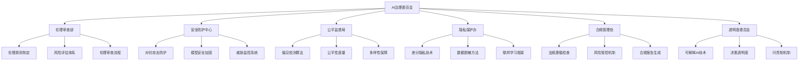
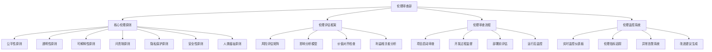
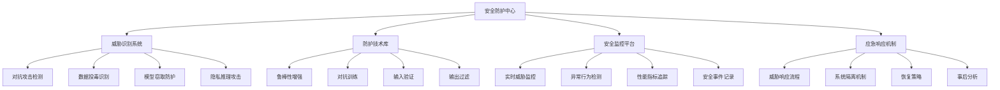
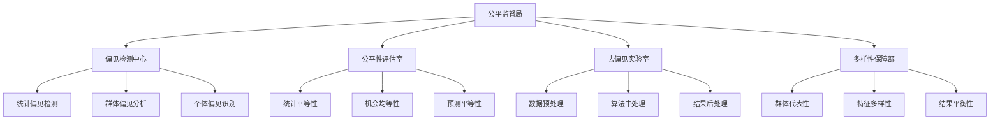
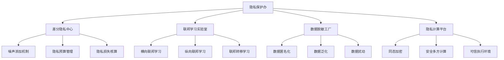
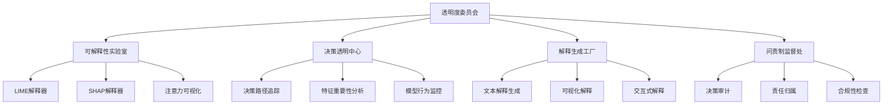
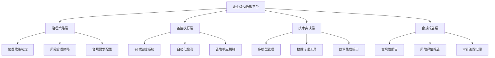
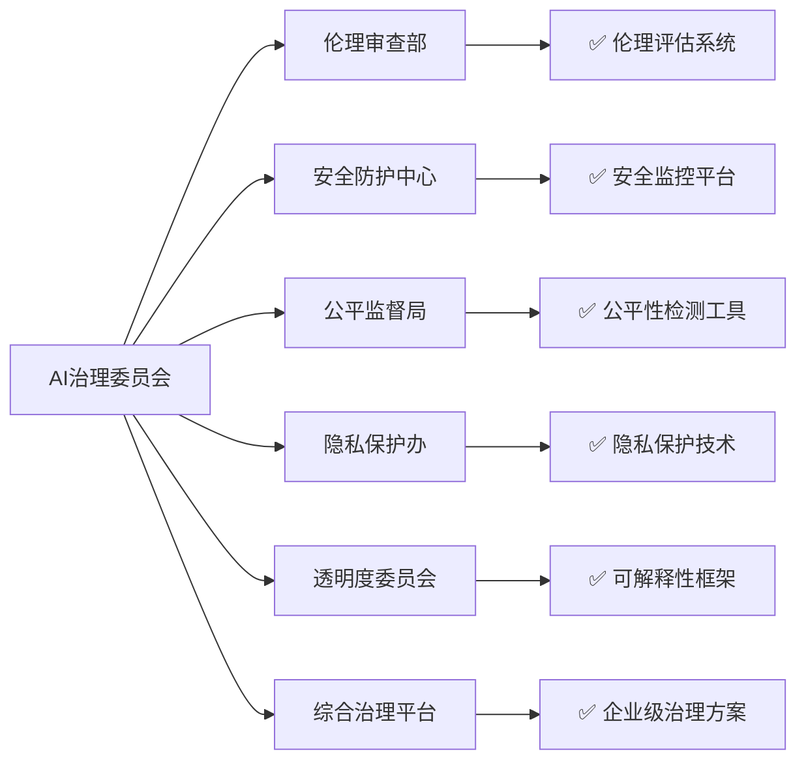

# 第34章 AI伦理与安全防护

> "技术是一把双刃剑，AI的力量越强大，我们的责任就越重大。在AI治理委员会中，我们将探索如何让人工智能真正服务于人类福祉，成为推动社会进步的正义力量。" —— AI伦理学先驱

## 🎯 学习目标

### 知识目标
- **深入理解AI伦理体系**: 掌握AI伦理的核心原则和实践框架
- **学习AI安全防护技术**: 理解对抗攻击、隐私保护、模型安全等技术
- **掌握负责任AI开发**: 学习公平性、可解释性、透明度等关键概念
- **了解AI治理法规**: 熟悉国内外AI相关法律法规和标准

### 技能目标
- **构建AI伦理评估体系**: 实现AI系统的伦理风险评估和监控
- **实现AI安全防护措施**: 掌握模型攻击检测、隐私保护、安全加固技术
- **开发AI治理平台**: 构建企业级AI治理和合规管理系统
- **优化AI公平性**: 掌握偏见检测、公平性优化、多样性保障技能

### 素养目标
- **培养负责任AI意识**: 建立AI开发的伦理责任感和社会责任感
- **建立安全防护思维**: 重视AI系统的安全性和鲁棒性
- **形成治理合规理念**: 关注AI应用的法律合规和社会影响

## 34.1 章节导入：走进AI治理委员会

### 🏛️ 从技术到治理：AI发展的必然选择

在完成了第33章**AI生产工厂**的技术部署之后，我们现在要踏进一个更加重要和复杂的领域——**AI治理委员会**。如果说前面的章节让我们掌握了AI的"技术能力"，那么这一章就是要赋予我们AI的"道德品格"和"社会责任"。

想象一下，当AI系统从实验室走向现实世界，从个人工具变成社会基础设施，我们需要的不仅仅是技术的先进性，更需要的是技术的可靠性、公平性和透明性。这就是为什么我们需要建立一个专门的**AI治理委员会**。



### 🎭 AI治理委员会的组织架构

让我们来详细了解这个AI治理委员会的组织架构：

```python
class AIGovernanceCommittee:
    """AI治理委员会 - 负责任AI开发的守护者"""
    
    def __init__(self):
        self.committee_name = "AI治理委员会"
        self.mission = "确保AI技术的负责任发展和应用"
        self.core_principles = [
            "公平性 (Fairness)",
            "透明性 (Transparency)", 
            "可解释性 (Explainability)",
            "问责制 (Accountability)",
            "隐私保护 (Privacy)",
            "安全性 (Security)",
            "人类福祉 (Human Welfare)"
        ]
        
        # 委员会各部门
        self.departments = {
            "伦理审查部": {
                "职责": "AI伦理原则制定与评估",
                "核心工作": ["伦理风险评估", "价值观对齐", "社会影响分析"],
                "负责人": "首席伦理官",
                "比喻": "道德指南针 - 为AI发展指明正确方向"
            },
            "安全防护中心": {
                "职责": "AI系统安全威胁检测与防护",
                "核心工作": ["对抗攻击防护", "模型鲁棒性", "安全漏洞修复"],
                "负责人": "首席安全官",
                "比喻": "数字盾牌 - 保护AI系统免受恶意攻击"
            },
            "公平监督局": {
                "职责": "AI算法公平性监督与优化",
                "核心工作": ["偏见检测", "公平性度量", "多样性保障"],
                "负责人": "公平性专员",
                "比喻": "正义天平 - 确保AI决策的公平公正"
            },
            "隐私保护办": {
                "职责": "数据隐私和用户权益保护",
                "核心工作": ["隐私技术", "数据脱敏", "权益保障"],
                "负责人": "隐私保护专员",
                "比喻": "隐私卫士 - 守护用户的数字隐私"
            },
            "合规管理处": {
                "职责": "AI法规遵循与风险管控",
                "核心工作": ["法规解读", "合规检查", "风险管理"],
                "负责人": "合规总监",
                "比喻": "法律顾问 - 确保AI应用符合法规要求"
            },
            "透明度委员会": {
                "职责": "AI决策可解释性与透明度保障",
                "核心工作": ["可解释性", "决策透明", "问责机制"],
                "负责人": "透明度专员",
                "比喻": "透明之窗 - 让AI决策过程清晰可见"
            }
        }
        
        print(f"🏛️ {self.committee_name}成立")
        print(f"📜 使命: {self.mission}")
        print(f"⭐ 核心原则: {len(self.core_principles)}项")
        
    def introduce_departments(self):
        """介绍各部门职责"""
        print(f"\n🏢 {self.committee_name}组织架构:")
        print("=" * 50)
        
        for dept_name, dept_info in self.departments.items():
            print(f"\n🏛️ {dept_name}")
            print(f"   📋 职责: {dept_info['职责']}")
            print(f"   👨‍💼 负责人: {dept_info['负责人']}")
            print(f"   🎯 核心工作:")
            for work in dept_info['核心工作']:
                print(f"      • {work}")
            print(f"   🎭 比喻: {dept_info['比喻']}")
    
    def display_core_principles(self):
        """展示核心原则"""
        print(f"\n⭐ AI治理核心原则:")
        print("=" * 30)
        
        for i, principle in enumerate(self.core_principles, 1):
            print(f"{i}. {principle}")
    
    def assess_governance_readiness(self):
        """评估治理准备度"""
        readiness_factors = {
            "技术能力": 0.85,
            "伦理意识": 0.70,
            "法规了解": 0.60,
            "工具准备": 0.75,
            "团队建设": 0.65,
            "流程规范": 0.55
        }
        
        print(f"\n📊 AI治理准备度评估:")
        print("=" * 35)
        
        total_score = 0
        for factor, score in readiness_factors.items():
            percentage = score * 100
            total_score += score
            status = "✅ 良好" if score >= 0.8 else "⚠️ 需改进" if score >= 0.6 else "❌ 待加强"
            print(f"{factor}: {percentage:.1f}% {status}")
        
        avg_score = total_score / len(readiness_factors)
        print(f"\n🎯 综合准备度: {avg_score*100:.1f}%")
        
        if avg_score >= 0.8:
            print("🎉 恭喜！您的AI治理准备度已达到优秀水平")
        elif avg_score >= 0.6:
            print("👍 不错！您的AI治理准备度处于良好水平，继续加油")
        else:
            print("💪 需要努力！建议加强AI治理相关知识和技能的学习")
        
        return readiness_factors

# 初始化AI治理委员会
governance_committee = AIGovernanceCommittee()

# 介绍组织架构
governance_committee.introduce_departments()

# 展示核心原则
governance_committee.display_core_principles()

# 评估治理准备度
readiness_assessment = governance_committee.assess_governance_readiness()
```

### 🌟 作为首席伦理官的你

在这个AI治理委员会中，你将扮演**首席伦理官**的角色。这意味着你需要：

1. **制定伦理标准**: 为AI系统建立明确的伦理准则
2. **评估伦理风险**: 识别和评估AI应用中的潜在伦理问题
3. **监督合规执行**: 确保AI开发和部署符合伦理标准
4. **教育团队意识**: 提升整个团队的AI伦理意识
5. **应对伦理挑战**: 处理复杂的AI伦理难题

### 🎯 AI治理的重要性

为什么AI治理如此重要？让我们通过一个具体的案例来理解：

```python
class AIGovernanceImportance:
    """AI治理重要性分析"""
    
    def __init__(self):
        self.case_studies = {
            "招聘系统偏见": {
                "问题": "AI招聘系统对女性候选人存在系统性偏见",
                "影响": "加剧就业不平等，损害企业声誉",
                "治理方案": "公平性检测、偏见纠正、多样性保障",
                "教训": "公平性必须从设计阶段就考虑"
            },
            "人脸识别误判": {
                "问题": "人脸识别系统对不同种族准确率差异巨大",
                "影响": "可能导致执法偏见和社会不公",
                "治理方案": "数据多样性、算法公平性、透明度提升",
                "教训": "技术准确性不等于社会公平性"
            },
            "推荐算法茧房": {
                "问题": "推荐算法创造信息茧房，加剧社会分化",
                "影响": "影响用户认知，加剧社会对立",
                "治理方案": "多样性推荐、透明度机制、用户控制权",
                "教训": "技术影响超越技术本身"
            },
            "深度伪造滥用": {
                "问题": "深度伪造技术被用于制造虚假信息",
                "影响": "威胁信息安全和社会稳定",
                "治理方案": "检测技术、使用规范、法律监管",
                "教训": "技术能力需要伦理约束"
            }
        }
        
        self.governance_benefits = [
            "提升用户信任度",
            "降低法律风险",
            "改善产品质量",
            "增强品牌价值",
            "促进可持续发展",
            "保护社会公益"
        ]
    
    def analyze_case_study(self, case_name):
        """分析具体案例"""
        if case_name not in self.case_studies:
            return "案例不存在"
        
        case = self.case_studies[case_name]
        
        print(f"📋 案例分析: {case_name}")
        print("=" * 40)
        print(f"❌ 问题描述: {case['问题']}")
        print(f"⚠️ 影响后果: {case['影响']}")
        print(f"✅ 治理方案: {case['治理方案']}")
        print(f"💡 经验教训: {case['教训']}")
        
        return case
    
    def show_governance_benefits(self):
        """展示治理收益"""
        print(f"\n🎯 AI治理的价值收益:")
        print("=" * 30)
        
        for i, benefit in enumerate(self.governance_benefits, 1):
            print(f"{i}. {benefit}")
    
    def calculate_governance_roi(self):
        """计算治理投资回报"""
        governance_costs = {
            "人员投入": 100,
            "工具采购": 50,
            "流程建设": 30,
            "培训教育": 20
        }
        
        governance_benefits_value = {
            "风险规避": 500,
            "品牌提升": 200,
            "效率改进": 150,
            "合规保障": 100
        }
        
        total_cost = sum(governance_costs.values())
        total_benefit = sum(governance_benefits_value.values())
        roi = (total_benefit - total_cost) / total_cost * 100
        
        print(f"\n💰 AI治理投资回报分析:")
        print("=" * 35)
        print(f"📊 总投入: {total_cost}万元")
        print(f"📈 总收益: {total_benefit}万元")
        print(f"🎯 投资回报率: {roi:.1f}%")
        
        return roi

# 演示AI治理重要性
importance_analyzer = AIGovernanceImportance()

# 分析典型案例
importance_analyzer.analyze_case_study("招聘系统偏见")
importance_analyzer.analyze_case_study("人脸识别误判")

# 展示治理收益
importance_analyzer.show_governance_benefits()

# 计算投资回报
roi = importance_analyzer.calculate_governance_roi()
```

### 🚀 AI治理的发展趋势

作为首席伦理官，你还需要了解AI治理的最新发展趋势：

```python
class AIGovernanceTrends:
    """AI治理发展趋势分析"""
    
    def __init__(self):
        self.global_trends = {
            "监管加强": {
                "描述": "各国政府加强AI监管立法",
                "例子": ["欧盟AI法案", "美国AI权利法案", "中国AI安全规定"],
                "影响": "合规成本增加，但行业标准更清晰"
            },
            "技术标准化": {
                "描述": "AI伦理和安全技术标准逐步建立",
                "例子": ["ISO/IEC 23053", "IEEE 2857", "ISO/IEC 23894"],
                "影响": "技术实现更规范，互操作性提升"
            },
            "工具成熟化": {
                "描述": "AI治理工具和平台快速发展",
                "例子": ["Fairness 360", "What-If Tool", "Explainable AI"],
                "影响": "治理实施门槛降低，效果更好"
            },
            "行业自律": {
                "描述": "科技企业主动承担AI治理责任",
                "例子": ["谷歌AI原则", "微软负责任AI", "百度AI伦理"],
                "影响": "行业生态更健康，用户信任度提升"
            }
        }
        
        self.future_challenges = [
            "跨国监管协调",
            "技术快速发展与监管滞后",
            "治理成本与创新效率平衡",
            "文化差异与全球标准统一",
            "新兴技术的伦理挑战"
        ]
    
    def analyze_trends(self):
        """分析发展趋势"""
        print("🔮 AI治理发展趋势分析:")
        print("=" * 40)
        
        for trend_name, trend_info in self.global_trends.items():
            print(f"\n📈 {trend_name}")
            print(f"   📝 描述: {trend_info['描述']}")
            print(f"   🌟 例子: {', '.join(trend_info['例子'])}")
            print(f"   💡 影响: {trend_info['影响']}")
    
    def identify_challenges(self):
        """识别未来挑战"""
        print(f"\n⚠️ 未来挑战:")
        print("=" * 20)
        
        for i, challenge in enumerate(self.future_challenges, 1):
            print(f"{i}. {challenge}")

# 分析AI治理趋势
trends_analyzer = AIGovernanceTrends()
trends_analyzer.analyze_trends()
trends_analyzer.identify_challenges()
```

### 🎓 本章学习路径

在AI治理委员会中，你的学习路径将是：

1. **34.2 AI伦理原则与框架** - 在伦理审查部学习核心伦理原则
2. **34.3 AI安全威胁与防护** - 在安全防护中心掌握安全技术
3. **34.4 算法公平性与偏见检测** - 在公平监督局学习公平性保障
4. **34.5 隐私保护与数据安全** - 在隐私保护办掌握隐私技术
5. **34.6 AI可解释性与透明度** - 在透明度委员会学习解释技术
6. **34.7 企业级AI治理平台** - 在合规管理处构建治理系统

### 🌟 治理委员会的使命

作为AI治理委员会的首席伦理官，你的使命是：

> **让每一个AI系统都成为推动社会进步的正义力量，让每一项AI技术都服务于人类的共同福祉。**

这不仅是技术的责任，更是我们作为AI开发者的道德责任。让我们一起在AI治理的道路上，为构建一个更加公平、安全、透明的AI世界而努力！

---

## 34.2 AI伦理原则与框架

### 🎯 伦理审查部：AI道德的守护者

欢迎来到AI治理委员会的**伦理审查部**！作为首席伦理官，这里是你的主要工作场所。伦理审查部就像是AI世界的"道德指南针"，为所有AI系统的开发和部署提供伦理方向指引。



### 🌟 AI伦理核心原则体系

让我们首先建立一个完整的AI伦理原则体系：

```python
class AIEthicsPrinciples:
    """AI伦理原则体系"""
    
    def __init__(self):
        self.principles = {
            "公平性 (Fairness)": {
                "定义": "AI系统应当公平对待所有用户，不因种族、性别、年龄等因素产生歧视",
                "核心要素": ["算法公平", "数据公平", "结果公平", "程序公平"],
                "实施策略": [
                    "多样化训练数据",
                    "偏见检测算法",
                    "公平性度量指标",
                    "多元化团队参与"
                ],
                "评估指标": ["群体公平性", "个体公平性", "机会均等", "结果均等"],
                "违反后果": "法律风险、声誉损失、社会不公"
            },
            "透明性 (Transparency)": {
                "定义": "AI系统的运作方式、决策过程和局限性应当对用户透明",
                "核心要素": ["算法透明", "数据透明", "决策透明", "风险透明"],
                "实施策略": [
                    "开放算法文档",
                    "数据来源说明",
                    "决策过程可视化",
                    "风险披露机制"
                ],
                "评估指标": ["信息完整性", "可理解性", "可访问性", "及时性"],
                "违反后果": "用户不信任、监管处罚、道德质疑"
            },
            "可解释性 (Explainability)": {
                "定义": "AI系统的决策应当能够被理解和解释",
                "核心要素": ["模型可解释", "决策可解释", "结果可解释", "过程可解释"],
                "实施策略": [
                    "可解释AI技术",
                    "决策路径追踪",
                    "特征重要性分析",
                    "反事实解释"
                ],
                "评估指标": ["解释准确性", "解释完整性", "解释一致性", "用户理解度"],
                "违反后果": "决策质疑、法律挑战、应用受限"
            },
            "问责制 (Accountability)": {
                "定义": "AI系统的开发者和使用者应当对其行为和后果承担责任",
                "核心要素": ["责任主体", "责任范围", "责任机制", "责任追究"],
                "实施策略": [
                    "责任分配矩阵",
                    "审计追踪机制",
                    "事故响应流程",
                    "责任保险制度"
                ],
                "评估指标": ["责任清晰度", "响应及时性", "改进有效性", "学习能力"],
                "违反后果": "法律责任、经济损失、信任危机"
            },
            "隐私保护 (Privacy)": {
                "定义": "AI系统应当保护用户的个人隐私和数据安全",
                "核心要素": ["数据最小化", "目的限制", "同意机制", "安全保障"],
                "实施策略": [
                    "隐私设计原则",
                    "数据脱敏技术",
                    "访问控制机制",
                    "加密保护措施"
                ],
                "评估指标": ["数据保护水平", "同意有效性", "安全性能", "合规程度"],
                "违反后果": "隐私泄露、法律制裁、用户流失"
            },
            "安全性 (Security)": {
                "定义": "AI系统应当具备足够的安全性，防范各种威胁和攻击",
                "核心要素": ["系统安全", "数据安全", "模型安全", "运行安全"],
                "实施策略": [
                    "安全设计原则",
                    "威胁建模分析",
                    "安全测试验证",
                    "持续监控更新"
                ],
                "评估指标": ["安全漏洞数量", "攻击防护能力", "恢复时间", "安全合规性"],
                "违反后果": "系统被攻击、数据泄露、服务中断"
            },
            "人类福祉 (Human Welfare)": {
                "定义": "AI系统应当促进人类福祉，避免对人类造成伤害",
                "核心要素": ["有益性", "无害性", "自主性", "尊严性"],
                "实施策略": [
                    "人类中心设计",
                    "风险影响评估",
                    "人类监督机制",
                    "价值观对齐"
                ],
                "评估指标": ["社会效益", "风险水平", "用户满意度", "长期影响"],
                "违反后果": "社会危害、道德谴责、发展受阻"
            }
        }
        
        print("⭐ AI伦理原则体系已建立")
        print(f"📋 包含 {len(self.principles)} 项核心原则")
    
    def explain_principle(self, principle_name):
        """详细解释某个伦理原则"""
        if principle_name not in self.principles:
            return f"原则 '{principle_name}' 不存在"
        
        principle = self.principles[principle_name]
        
        print(f"\n🎯 {principle_name}")
        print("=" * 50)
        print(f"📝 定义: {principle['定义']}")
        
        print(f"\n🔧 核心要素:")
        for element in principle['核心要素']:
            print(f"   • {element}")
        
        print(f"\n💡 实施策略:")
        for strategy in principle['实施策略']:
            print(f"   • {strategy}")
        
        print(f"\n📊 评估指标:")
        for metric in principle['评估指标']:
            print(f"   • {metric}")
        
        print(f"\n⚠️ 违反后果: {principle['违反后果']}")
        
        return principle
    
    def get_principles_overview(self):
        """获取原则概览"""
        print("\n🌟 AI伦理原则概览:")
        print("=" * 40)
        
        for i, (principle_name, principle_info) in enumerate(self.principles.items(), 1):
            print(f"\n{i}. {principle_name}")
            print(f"   {principle_info['定义']}")

# 创建伦理原则体系
ethics_principles = AIEthicsPrinciples()

# 获取原则概览
ethics_principles.get_principles_overview()

# 详细解释公平性原则
ethics_principles.explain_principle("公平性 (Fairness)")
```

### 📊 AI伦理评估框架

现在让我们构建一个完整的AI伦理评估框架：

```python
import numpy as np
from datetime import datetime
from typing import Dict, List, Tuple, Any

class AIEthicsAssessmentFramework:
    """AI伦理评估框架"""
    
    def __init__(self):
        self.assessment_dimensions = {
            "公平性评估": {
                "权重": 0.20,
                "子指标": {
                    "数据公平性": 0.25,
                    "算法公平性": 0.30,
                    "结果公平性": 0.25,
                    "程序公平性": 0.20
                }
            },
            "透明性评估": {
                "权重": 0.15,
                "子指标": {
                    "算法透明度": 0.30,
                    "数据透明度": 0.25,
                    "决策透明度": 0.25,
                    "风险透明度": 0.20
                }
            },
            "可解释性评估": {
                "权重": 0.15,
                "子指标": {
                    "模型可解释性": 0.35,
                    "决策可解释性": 0.30,
                    "结果可解释性": 0.20,
                    "用户理解度": 0.15
                }
            },
            "问责制评估": {
                "权重": 0.15,
                "子指标": {
                    "责任清晰度": 0.30,
                    "审计机制": 0.25,
                    "响应能力": 0.25,
                    "改进机制": 0.20
                }
            },
            "隐私保护评估": {
                "权重": 0.15,
                "子指标": {
                    "数据保护": 0.30,
                    "同意机制": 0.25,
                    "访问控制": 0.25,
                    "合规性": 0.20
                }
            },
            "安全性评估": {
                "权重": 0.10,
                "子指标": {
                    "系统安全": 0.30,
                    "数据安全": 0.25,
                    "模型安全": 0.25,
                    "运行安全": 0.20
                }
            },
            "人类福祉评估": {
                "权重": 0.10,
                "子指标": {
                    "有益性": 0.30,
                    "无害性": 0.30,
                    "自主性": 0.20,
                    "尊严性": 0.20
                }
            }
        }
        
        self.risk_levels = {
            "低风险": {"范围": (0.8, 1.0), "颜色": "🟢", "行动": "继续监控"},
            "中风险": {"范围": (0.6, 0.8), "颜色": "🟡", "行动": "制定改进计划"},
            "高风险": {"范围": (0.4, 0.6), "颜色": "🟠", "行动": "立即整改"},
            "极高风险": {"范围": (0.0, 0.4), "颜色": "🔴", "行动": "暂停使用"}
        }
        
        print("📊 AI伦理评估框架已初始化")
    
    def conduct_assessment(self, ai_system_info: Dict) -> Dict:
        """进行AI伦理评估"""
        
        print(f"\n🔍 开始评估AI系统: {ai_system_info.get('name', '未命名系统')}")
        print("=" * 50)
        
        assessment_results = {}
        total_score = 0
        
        # 对每个维度进行评估
        for dimension, dimension_info in self.assessment_dimensions.items():
            dimension_score = self._assess_dimension(dimension, ai_system_info)
            weighted_score = dimension_score * dimension_info['权重']
            
            assessment_results[dimension] = {
                "原始得分": dimension_score,
                "权重": dimension_info['权重'],
                "加权得分": weighted_score,
                "子指标详情": self._get_sub_indicators_details(dimension, ai_system_info)
            }
            
            total_score += weighted_score
            
            print(f"{dimension}: {dimension_score:.2f} (权重: {dimension_info['权重']:.2f}, 加权: {weighted_score:.3f})")
        
        # 确定风险等级
        risk_level = self._determine_risk_level(total_score)
        
        assessment_results["综合评估"] = {
            "总分": total_score,
            "风险等级": risk_level,
            "评估时间": datetime.now().strftime("%Y-%m-%d %H:%M:%S"),
            "评估对象": ai_system_info.get('name', '未命名系统')
        }
        
        print(f"\n📊 综合评估结果:")
        print(f"   总分: {total_score:.3f}")
        print(f"   风险等级: {risk_level['颜色']} {risk_level['level']}")
        print(f"   建议行动: {risk_level['行动']}")
        
        return assessment_results
    
    def _assess_dimension(self, dimension: str, ai_system_info: Dict) -> float:
        """评估单个维度"""
        # 这里使用模拟评估，实际应用中需要具体的评估逻辑
        base_score = np.random.uniform(0.5, 0.9)
        
        # 根据系统信息调整得分
        if ai_system_info.get('has_bias_testing', False):
            base_score += 0.05
        if ai_system_info.get('has_explainability', False):
            base_score += 0.05
        if ai_system_info.get('has_privacy_protection', False):
            base_score += 0.05
        if ai_system_info.get('has_security_measures', False):
            base_score += 0.05
        
        return min(base_score, 1.0)
    
    def _get_sub_indicators_details(self, dimension: str, ai_system_info: Dict) -> Dict:
        """获取子指标详情"""
        sub_indicators = self.assessment_dimensions[dimension]['子指标']
        details = {}
        
        for indicator, weight in sub_indicators.items():
            # 模拟子指标评估
            score = np.random.uniform(0.4, 0.95)
            details[indicator] = {
                "得分": score,
                "权重": weight,
                "状态": "良好" if score > 0.7 else "需改进" if score > 0.5 else "不合格"
            }
        
        return details
    
    def _determine_risk_level(self, score: float) -> Dict:
        """确定风险等级"""
        for level, info in self.risk_levels.items():
            if info['范围'][0] <= score <= info['范围'][1]:
                return {
                    "level": level,
                    "颜色": info['颜色'],
                    "行动": info['行动'],
                    "得分范围": info['范围']
                }
        return {"level": "未知", "颜色": "⚪", "行动": "需要重新评估"}
    
    def generate_improvement_plan(self, assessment_results: Dict) -> Dict:
        """生成改进计划"""
        improvement_plan = {
            "优先级改进项": [],
            "具体改进措施": {},
            "时间规划": {},
            "资源需求": {}
        }
        
        # 识别需要改进的维度
        for dimension, result in assessment_results.items():
            if dimension == "综合评估":
                continue
                
            if result["原始得分"] < 0.7:  # 得分低于0.7的需要改进
                priority = "高优先级" if result["原始得分"] < 0.5 else "中优先级"
                improvement_plan["优先级改进项"].append({
                    "维度": dimension,
                    "当前得分": result["原始得分"],
                    "优先级": priority,
                    "影响程度": result["权重"]
                })
        
        # 生成具体改进措施
        improvement_plan["具体改进措施"] = self._generate_specific_measures(improvement_plan["优先级改进项"])
        
        return improvement_plan
    
    def _generate_specific_measures(self, priority_items: List) -> Dict:
        """生成具体改进措施"""
        measures = {}
        
        measure_templates = {
            "公平性评估": [
                "增加训练数据的多样性",
                "实施偏见检测算法",
                "建立公平性监控机制",
                "组建多元化评估团队"
            ],
            "透明性评估": [
                "完善算法文档",
                "建立用户友好的解释界面",
                "定期发布透明度报告",
                "建立用户反馈机制"
            ],
            "可解释性评估": [
                "集成可解释AI工具",
                "开发决策解释功能",
                "培训团队解释技能",
                "建立解释质量评估"
            ],
            "隐私保护评估": [
                "实施差分隐私技术",
                "加强数据加密措施",
                "完善同意管理机制",
                "定期进行隐私审计"
            ]
        }
        
        for item in priority_items:
            dimension = item["维度"]
            if dimension in measure_templates:
                measures[dimension] = measure_templates[dimension]
            else:
                measures[dimension] = ["制定专门的改进方案", "咨询专业伦理顾问"]
        
        return measures

# 演示伦理评估框架
assessment_framework = AIEthicsAssessmentFramework()

# 模拟AI系统信息
ai_system_example = {
    "name": "智能招聘推荐系统",
    "type": "推荐系统",
    "domain": "人力资源",
    "has_bias_testing": True,
    "has_explainability": False,
    "has_privacy_protection": True,
    "has_security_measures": True,
    "user_scale": "大规模",
    "risk_level": "中等"
}

# 进行伦理评估
assessment_results = assessment_framework.conduct_assessment(ai_system_example)

# 生成改进计划
improvement_plan = assessment_framework.generate_improvement_plan(assessment_results)

print(f"\n📋 改进计划:")
print("=" * 30)
print(f"需要改进的维度数量: {len(improvement_plan['优先级改进项'])}")
for item in improvement_plan['优先级改进项']:
    print(f"• {item['维度']}: {item['当前得分']:.2f} ({item['优先级']})")
```

这个伦理评估框架为AI系统提供了全面的伦理风险评估，帮助识别潜在问题并制定改进计划。

---

## 34.3 AI安全威胁与防护

### 🛡️ 安全防护中心：AI系统的数字盾牌

欢迎来到AI治理委员会的**安全防护中心**！如果说伦理审查部是AI的"道德指南针"，那么安全防护中心就是AI的"数字盾牌"。在这里，我们专注于识别、分析和防护各种针对AI系统的安全威胁。



### 🔍 AI安全威胁全景图

让我们首先了解AI系统面临的主要安全威胁：

```python
class AISecurityThreatLandscape:
    """AI安全威胁全景图"""
    
    def __init__(self):
        self.threat_categories = {
            "对抗攻击 (Adversarial Attacks)": {
                "定义": "通过精心设计的输入来欺骗AI模型产生错误输出",
                "子类型": {
                    "白盒攻击": "攻击者完全了解模型结构和参数",
                    "黑盒攻击": "攻击者只能访问模型的输入输出",
                    "灰盒攻击": "攻击者部分了解模型信息"
                },
                "攻击方法": [
                    "FGSM (Fast Gradient Sign Method)",
                    "PGD (Projected Gradient Descent)",
                    "C&W (Carlini & Wagner)",
                    "DeepFool算法"
                ],
                "影响程度": "高",
                "发生概率": "中等",
                "典型场景": ["图像识别", "语音识别", "自然语言处理"]
            },
            "数据投毒 (Data Poisoning)": {
                "定义": "在训练数据中注入恶意样本来影响模型学习",
                "子类型": {
                    "标签翻转攻击": "修改训练样本的标签",
                    "后门攻击": "在数据中植入特定触发器",
                    "可用性攻击": "降低模型整体性能"
                },
                "攻击方法": [
                    "随机标签噪声",
                    "系统性标签翻转",
                    "特征污染",
                    "梯度匹配攻击"
                ],
                "影响程度": "极高",
                "发生概率": "低",
                "典型场景": ["联邦学习", "众包数据", "开源数据集"]
            },
            "模型窃取 (Model Extraction)": {
                "定义": "通过查询目标模型来复制其功能和性能",
                "子类型": {
                    "功能窃取": "复制模型的输入输出关系",
                    "保真度窃取": "尽可能准确地复制模型",
                    "参数窃取": "推断模型的具体参数"
                },
                "攻击方法": [
                    "查询优化",
                    "主动学习",
                    "蒸馏攻击",
                    "梯度推断"
                ],
                "影响程度": "高",
                "发生概率": "中等",
                "典型场景": ["云端AI服务", "API接口", "边缘设备"]
            },
            "隐私推理攻击 (Privacy Inference)": {
                "定义": "从模型中推断出训练数据的隐私信息",
                "子类型": {
                    "成员推理攻击": "判断特定样本是否在训练集中",
                    "属性推理攻击": "推断训练数据的敏感属性",
                    "模型反演攻击": "从模型输出重构输入数据"
                },
                "攻击方法": [
                    "影子模型训练",
                    "置信度分析",
                    "梯度分析",
                    "生成对抗网络"
                ],
                "影响程度": "极高",
                "发生概率": "中高",
                "典型场景": ["医疗AI", "金融AI", "个人化推荐"]
            },
            "系统级攻击 (System-level Attacks)": {
                "定义": "针对AI系统基础设施的攻击",
                "子类型": {
                    "硬件攻击": "针对AI芯片和计算硬件",
                    "软件攻击": "针对AI框架和运行环境",
                    "网络攻击": "针对AI系统的网络通信"
                },
                "攻击方法": [
                    "侧信道攻击",
                    "故障注入",
                    "恶意软件植入",
                    "中间人攻击"
                ],
                "影响程度": "极高",
                "发生概率": "低",
                "典型场景": ["边缘AI设备", "云端AI服务", "IoT智能设备"]
            }
        }
        
        self.threat_trends = {
            "2024年": ["多模态对抗攻击", "大模型越狱攻击", "联邦学习攻击"],
            "2025年": ["量子对抗攻击", "生成式AI滥用", "AI供应链攻击"],
            "未来趋势": ["AI vs AI攻防", "自适应攻击", "跨域攻击"]
        }
        
        print("🔍 AI安全威胁全景图已构建")
        print(f"📊 包含 {len(self.threat_categories)} 类主要威胁")
    
    def analyze_threat(self, threat_name: str):
        """分析特定威胁"""
        if threat_name not in self.threat_categories:
            return f"威胁类型 '{threat_name}' 不存在"
        
        threat = self.threat_categories[threat_name]
        
        print(f"\n🎯 威胁分析: {threat_name}")
        print("=" * 50)
        print(f"📝 定义: {threat['定义']}")
        
        print(f"\n🔧 子类型:")
        for subtype, description in threat['子类型'].items():
            print(f"   • {subtype}: {description}")
        
        print(f"\n⚔️ 主要攻击方法:")
        for method in threat['攻击方法']:
            print(f"   • {method}")
        
        print(f"\n📊 威胁评估:")
        print(f"   影响程度: {threat['影响程度']}")
        print(f"   发生概率: {threat['发生概率']}")
        
        print(f"\n🎭 典型应用场景:")
        for scenario in threat['典型场景']:
            print(f"   • {scenario}")
        
        return threat
    
    def get_threat_matrix(self):
        """获取威胁矩阵"""
        print("\n📊 AI安全威胁矩阵:")
        print("=" * 60)
        print(f"{'威胁类型':<20} {'影响程度':<10} {'发生概率':<10} {'风险等级'}")
        print("-" * 60)
        
        for threat_name, threat_info in self.threat_categories.items():
            impact = threat_info['影响程度']
            probability = threat_info['发生概率']
            
            # 计算风险等级
            risk_level = self._calculate_risk_level(impact, probability)
            
            # 截断威胁名称以适应显示
            display_name = threat_name.split(' (')[0]
            if len(display_name) > 18:
                display_name = display_name[:15] + "..."
            
            print(f"{display_name:<20} {impact:<10} {probability:<10} {risk_level}")
    
    def _calculate_risk_level(self, impact: str, probability: str) -> str:
        """计算风险等级"""
        impact_score = {"低": 1, "中等": 2, "高": 3, "极高": 4}.get(impact, 2)
        prob_score = {"低": 1, "中低": 1.5, "中等": 2, "中高": 2.5, "高": 3}.get(probability, 2)
        
        risk_score = impact_score * prob_score
        
        if risk_score >= 9:
            return "🔴 极高风险"
        elif risk_score >= 6:
            return "🟠 高风险"
        elif risk_score >= 4:
            return "🟡 中风险"
        else:
            return "🟢 低风险"
    
    def show_threat_trends(self):
        """展示威胁发展趋势"""
        print(f"\n🔮 AI安全威胁发展趋势:")
        print("=" * 40)
        
        for period, trends in self.threat_trends.items():
            print(f"\n📅 {period}:")
            for trend in trends:
                print(f"   • {trend}")

# 创建威胁分析系统
threat_analyzer = AISecurityThreatLandscape()

# 分析对抗攻击威胁
threat_analyzer.analyze_threat("对抗攻击 (Adversarial Attacks)")

# 显示威胁矩阵
threat_analyzer.get_threat_matrix()

# 展示发展趋势
threat_analyzer.show_threat_trends()
```

### 🛡️ AI安全防护技术体系

现在让我们构建一个完整的AI安全防护技术体系：

```python
import numpy as np
import tensorflow as tf
from typing import Dict, List, Tuple, Any, Optional
import hashlib
import time

class AISecurityDefenseSystem:
    """AI安全防护系统"""
    
    def __init__(self):
        self.defense_techniques = {
            "对抗训练 (Adversarial Training)": {
                "原理": "在训练过程中加入对抗样本，提高模型鲁棒性",
                "适用威胁": ["对抗攻击", "数据投毒"],
                "实现复杂度": "中等",
                "性能影响": "中等",
                "防护效果": "良好"
            },
            "输入预处理 (Input Preprocessing)": {
                "原理": "对输入数据进行预处理，去除对抗扰动",
                "适用威胁": ["对抗攻击"],
                "实现复杂度": "低",
                "性能影响": "低",
                "防护效果": "中等"
            },
            "模型蒸馏 (Model Distillation)": {
                "原理": "通过温度参数软化输出分布，提高鲁棒性",
                "适用威胁": ["对抗攻击", "模型窃取"],
                "实现复杂度": "中等",
                "性能影响": "低",
                "防护效果": "中等"
            },
            "差分隐私 (Differential Privacy)": {
                "原理": "在训练过程中添加噪声，保护隐私",
                "适用威胁": ["隐私推理攻击", "成员推理"],
                "实现复杂度": "高",
                "性能影响": "中等",
                "防护效果": "优秀"
            },
            "联邦学习 (Federated Learning)": {
                "原理": "分布式训练，避免数据集中",
                "适用威胁": ["数据投毒", "隐私泄露"],
                "实现复杂度": "高",
                "性能影响": "中等",
                "防护效果": "良好"
            },
            "安全多方计算 (Secure Multi-party Computation)": {
                "原理": "在不泄露私有数据的情况下进行计算",
                "适用威胁": ["隐私推理攻击", "数据泄露"],
                "实现复杂度": "极高",
                "性能影响": "高",
                "防护效果": "优秀"
            }
        }
        
        self.monitoring_metrics = {
            "模型性能指标": ["准确率", "召回率", "F1分数", "AUC"],
            "安全性指标": ["对抗鲁棒性", "隐私保护水平", "异常检测率"],
            "系统指标": ["响应时间", "吞吐量", "资源使用率", "错误率"]
        }
        
        print("🛡️ AI安全防护系统已初始化")
    
    def implement_adversarial_training(self, model, train_data, train_labels):
        """实现对抗训练"""
        
        class AdversarialTrainingEngine:
            def __init__(self, base_model):
                self.model = base_model
                self.epsilon = 0.1  # 扰动强度
                self.alpha = 0.01   # 步长
                self.num_steps = 10  # 迭代步数
                
            def generate_adversarial_examples(self, x, y):
                """生成对抗样本"""
                # 使用PGD方法生成对抗样本
                x_adv = tf.identity(x)
                
                for _ in range(self.num_steps):
                    with tf.GradientTape() as tape:
                        tape.watch(x_adv)
                        predictions = self.model(x_adv)
                        loss = tf.keras.losses.sparse_categorical_crossentropy(y, predictions)
                    
                    gradients = tape.gradient(loss, x_adv)
                    x_adv = x_adv + self.alpha * tf.sign(gradients)
                    x_adv = tf.clip_by_value(x_adv, x - self.epsilon, x + self.epsilon)
                    x_adv = tf.clip_by_value(x_adv, 0.0, 1.0)
                
                return x_adv
            
            def train_step(self, x, y):
                """对抗训练步骤"""
                # 生成对抗样本
                x_adv = self.generate_adversarial_examples(x, y)
                
                # 混合原始样本和对抗样本
                x_mixed = tf.concat([x, x_adv], axis=0)
                y_mixed = tf.concat([y, y], axis=0)
                
                # 训练模型
                with tf.GradientTape() as tape:
                    predictions = self.model(x_mixed, training=True)
                    loss = tf.keras.losses.sparse_categorical_crossentropy(y_mixed, predictions)
                    loss = tf.reduce_mean(loss)
                
                gradients = tape.gradient(loss, self.model.trainable_variables)
                self.model.optimizer.apply_gradients(zip(gradients, self.model.trainable_variables))
                
                return loss
        
        # 创建对抗训练引擎
        adv_trainer = AdversarialTrainingEngine(model)
        
        print("🎯 开始对抗训练...")
        training_history = []
        
        # 模拟训练过程
        for epoch in range(5):  # 简化的训练循环
            epoch_losses = []
            for batch_idx in range(10):  # 模拟批次
                # 模拟批次数据
                batch_x = np.random.random((32, 28, 28, 1))
                batch_y = np.random.randint(0, 10, (32,))
                
                batch_x = tf.constant(batch_x, dtype=tf.float32)
                batch_y = tf.constant(batch_y, dtype=tf.int64)
                
                # 执行训练步骤
                loss = adv_trainer.train_step(batch_x, batch_y)
                epoch_losses.append(float(loss))
            
            avg_loss = np.mean(epoch_losses)
            training_history.append(avg_loss)
            print(f"   Epoch {epoch+1}/5: Loss = {avg_loss:.4f}")
        
        print("✅ 对抗训练完成")
        return {
            "训练历史": training_history,
            "最终损失": training_history[-1],
            "训练轮数": len(training_history)
        }
    
    def implement_input_preprocessing(self):
        """实现输入预处理防护"""
        
        class InputPreprocessor:
            def __init__(self):
                self.defense_methods = {
                    "高斯噪声": self._add_gaussian_noise,
                    "JPEG压缩": self._jpeg_compression,
                    "位深度降低": self._bit_depth_reduction,
                    "像素偏移": self._pixel_shift,
                    "中值滤波": self._median_filter
                }
                
            def _add_gaussian_noise(self, x, noise_level=0.1):
                """添加高斯噪声"""
                noise = np.random.normal(0, noise_level, x.shape)
                return np.clip(x + noise, 0, 1)
            
            def _jpeg_compression(self, x, quality=75):
                """JPEG压缩"""
                # 模拟JPEG压缩效果
                compressed = x + np.random.normal(0, 0.02, x.shape)
                return np.clip(compressed, 0, 1)
            
            def _bit_depth_reduction(self, x, bits=4):
                """位深度降低"""
                levels = 2 ** bits
                quantized = np.round(x * (levels - 1)) / (levels - 1)
                return quantized
            
            def _pixel_shift(self, x, shift_range=2):
                """像素偏移"""
                # 模拟像素偏移
                shifted = np.roll(x, np.random.randint(-shift_range, shift_range+1), axis=1)
                return shifted
            
            def _median_filter(self, x, kernel_size=3):
                """中值滤波"""
                # 简化的中值滤波实现
                filtered = x.copy()
                # 这里应该实现真正的中值滤波，简化为加噪声
                filtered += np.random.normal(0, 0.01, x.shape)
                return np.clip(filtered, 0, 1)
            
            def preprocess(self, x, methods=None):
                """预处理输入"""
                if methods is None:
                    methods = ["高斯噪声", "JPEG压缩"]
                
                processed_x = x.copy()
                
                for method in methods:
                    if method in self.defense_methods:
                        processed_x = self.defense_methods[method](processed_x)
                
                return processed_x
            
            def evaluate_defense_effectiveness(self, clean_acc, defended_acc, attack_success_rate):
                """评估防护效果"""
                defense_effectiveness = {
                    "干净样本准确率": clean_acc,
                    "防护后准确率": defended_acc,
                    "准确率损失": clean_acc - defended_acc,
                    "攻击成功率": attack_success_rate,
                    "防护成功率": 1 - attack_success_rate,
                    "整体评分": (defended_acc * 0.6 + (1 - attack_success_rate) * 0.4)
                }
                
                return defense_effectiveness
        
        # 创建输入预处理器
        preprocessor = InputPreprocessor()
        
        print("🔧 输入预处理防护系统:")
        print("=" * 40)
        
        # 模拟测试数据
        test_input = np.random.random((100, 28, 28, 1))
        
        # 应用不同的预处理方法
        for method_name in preprocessor.defense_methods.keys():
            processed = preprocessor.preprocess(test_input, [method_name])
            noise_level = np.mean(np.abs(processed - test_input))
            print(f"   {method_name}: 平均扰动 = {noise_level:.4f}")
        
        # 评估防护效果
        defense_eval = preprocessor.evaluate_defense_effectiveness(
            clean_acc=0.95,
            defended_acc=0.88,
            attack_success_rate=0.15
        )
        
        print(f"\n📊 防护效果评估:")
        for metric, value in defense_eval.items():
            if isinstance(value, float):
                print(f"   {metric}: {value:.3f}")
            else:
                print(f"   {metric}: {value}")
        
        return preprocessor
    
    def implement_differential_privacy(self):
        """实现差分隐私防护"""
        
        class DifferentialPrivacyEngine:
            def __init__(self, epsilon=1.0, delta=1e-5):
                self.epsilon = epsilon  # 隐私预算
                self.delta = delta      # 失败概率
                self.noise_multiplier = self._calculate_noise_multiplier()
                
            def _calculate_noise_multiplier(self):
                """计算噪声乘数"""
                # 简化的噪声乘数计算
                return np.sqrt(2 * np.log(1.25 / self.delta)) / self.epsilon
            
            def add_noise_to_gradients(self, gradients, l2_norm_clip=1.0):
                """为梯度添加噪声"""
                # 梯度裁剪
                clipped_gradients = []
                for grad in gradients:
                    if grad is not None:
                        grad_norm = tf.norm(grad)
                        clipped_grad = grad * tf.minimum(1.0, l2_norm_clip / grad_norm)
                        clipped_gradients.append(clipped_grad)
                    else:
                        clipped_gradients.append(grad)
                
                # 添加高斯噪声
                noisy_gradients = []
                for grad in clipped_gradients:
                    if grad is not None:
                        noise = tf.random.normal(
                            tf.shape(grad), 
                            mean=0.0, 
                            stddev=self.noise_multiplier * l2_norm_clip
                        )
                        noisy_grad = grad + noise
                        noisy_gradients.append(noisy_grad)
                    else:
                        noisy_gradients.append(grad)
                
                return noisy_gradients
            
            def private_training_step(self, model, x, y, optimizer):
                """差分隐私训练步骤"""
                with tf.GradientTape() as tape:
                    predictions = model(x, training=True)
                    loss = tf.keras.losses.sparse_categorical_crossentropy(y, predictions)
                    loss = tf.reduce_mean(loss)
                
                gradients = tape.gradient(loss, model.trainable_variables)
                noisy_gradients = self.add_noise_to_gradients(gradients)
                optimizer.apply_gradients(zip(noisy_gradients, model.trainable_variables))
                
                return loss
            
            def calculate_privacy_spent(self, steps, batch_size, dataset_size):
                """计算已消耗的隐私预算"""
                # 简化的隐私预算计算
                sampling_rate = batch_size / dataset_size
                privacy_spent = {
                    "epsilon": self.epsilon * steps * sampling_rate,
                    "delta": self.delta,
                    "steps": steps,
                    "remaining_budget": max(0, self.epsilon - self.epsilon * steps * sampling_rate)
                }
                return privacy_spent
        
        # 创建差分隐私引擎
        dp_engine = DifferentialPrivacyEngine(epsilon=1.0, delta=1e-5)
        
        print("🔐 差分隐私防护系统:")
        print("=" * 35)
        print(f"   隐私预算 ε: {dp_engine.epsilon}")
        print(f"   失败概率 δ: {dp_engine.delta}")
        print(f"   噪声乘数: {dp_engine.noise_multiplier:.4f}")
        
        # 模拟隐私预算消耗
        privacy_budget_tracking = []
        for step in range(1, 101, 10):
            privacy_spent = dp_engine.calculate_privacy_spent(
                steps=step, 
                batch_size=32, 
                dataset_size=1000
            )
            privacy_budget_tracking.append(privacy_spent)
        
        print(f"\n📊 隐私预算消耗追踪:")
        print(f"{'步数':<8} {'已消耗ε':<10} {'剩余预算':<10}")
        print("-" * 30)
        for budget in privacy_budget_tracking[::2]:  # 每隔一个显示
            print(f"{budget['steps']:<8} {budget['epsilon']:<10.4f} {budget['remaining_budget']:<10.4f}")
        
        return dp_engine

# 创建安全防护系统
defense_system = AISecurityDefenseSystem()

# 实现输入预处理防护
preprocessor = defense_system.implement_input_preprocessing()

# 实现差分隐私防护
dp_engine = defense_system.implement_differential_privacy()
```

### 🚨 AI安全监控平台

现在让我们构建一个实时的AI安全监控平台：

```python
import json
from datetime import datetime, timedelta
import threading
import queue

class AISecurityMonitoringPlatform:
    """AI安全监控平台"""
    
    def __init__(self):
        self.monitoring_status = "运行中"
        self.alert_queue = queue.Queue()
        self.security_metrics = {
            "对抗攻击检测": {"正常": 0, "可疑": 0, "恶意": 0},
            "异常行为监控": {"正常": 0, "异常": 0},
            "性能指标": {"响应时间": [], "准确率": [], "吞吐量": []},
            "系统健康": {"CPU使用率": [], "内存使用率": [], "错误率": []}
        }
        
        self.alert_rules = {
            "高频查询": {"阈值": 100, "时间窗口": 60, "严重程度": "中等"},
            "异常输入": {"阈值": 0.8, "时间窗口": 30, "严重程度": "高"},
            "性能下降": {"阈值": 0.1, "时间窗口": 300, "严重程度": "中等"},
            "系统过载": {"阈值": 0.9, "时间窗口": 60, "严重程度": "高"}
        }
        
        self.incident_history = []
        
        print("🚨 AI安全监控平台已启动")
    
    def detect_adversarial_attack(self, input_data, model_output, confidence_threshold=0.1):
        """检测对抗攻击"""
        
        # 模拟对抗攻击检测逻辑
        detection_results = {
            "输入异常检测": self._check_input_anomaly(input_data),
            "输出置信度检测": self._check_output_confidence(model_output, confidence_threshold),
            "梯度检测": self._check_gradient_anomaly(),
            "统计检测": self._check_statistical_anomaly()
        }
        
        # 综合判断
        threat_level = self._assess_threat_level(detection_results)
        
        if threat_level > 0.5:
            self._trigger_alert("对抗攻击检测", threat_level, detection_results)
        
        # 更新监控指标
        if threat_level > 0.8:
            self.security_metrics["对抗攻击检测"]["恶意"] += 1
        elif threat_level > 0.3:
            self.security_metrics["对抗攻击检测"]["可疑"] += 1
        else:
            self.security_metrics["对抗攻击检测"]["正常"] += 1
        
        return {
            "威胁等级": threat_level,
            "检测结果": detection_results,
            "建议行动": self._get_recommended_action(threat_level)
        }
    
    def _check_input_anomaly(self, input_data):
        """检查输入异常"""
        # 模拟输入异常检测
        anomaly_score = np.random.random()
        return {
            "异常得分": anomaly_score,
            "是否异常": anomaly_score > 0.7,
            "检测方法": "统计分析"
        }
    
    def _check_output_confidence(self, model_output, threshold):
        """检查输出置信度"""
        # 模拟置信度检测
        max_confidence = np.random.random()
        return {
            "最大置信度": max_confidence,
            "是否可疑": max_confidence < threshold,
            "检测方法": "置信度分析"
        }
    
    def _check_gradient_anomaly(self):
        """检查梯度异常"""
        # 模拟梯度检测
        gradient_norm = np.random.random() * 10
        return {
            "梯度范数": gradient_norm,
            "是否异常": gradient_norm > 5.0,
            "检测方法": "梯度分析"
        }
    
    def _check_statistical_anomaly(self):
        """检查统计异常"""
        # 模拟统计检测
        statistical_score = np.random.random()
        return {
            "统计得分": statistical_score,
            "是否异常": statistical_score > 0.6,
            "检测方法": "统计检验"
        }
    
    def _assess_threat_level(self, detection_results):
        """评估威胁等级"""
        threat_indicators = 0
        total_indicators = len(detection_results)
        
        for result in detection_results.values():
            if isinstance(result, dict):
                if result.get("是否异常", False) or result.get("是否可疑", False):
                    threat_indicators += 1
        
        return threat_indicators / total_indicators
    
    def _trigger_alert(self, alert_type, threat_level, details):
        """触发安全告警"""
        alert = {
            "时间": datetime.now().isoformat(),
            "类型": alert_type,
            "威胁等级": threat_level,
            "严重程度": "高" if threat_level > 0.8 else "中" if threat_level > 0.5 else "低",
            "详情": details,
            "状态": "待处理"
        }
        
        self.alert_queue.put(alert)
        self.incident_history.append(alert)
        
        print(f"🚨 安全告警: {alert_type} (威胁等级: {threat_level:.2f})")
    
    def _get_recommended_action(self, threat_level):
        """获取建议行动"""
        if threat_level > 0.8:
            return "立即阻断请求，启动应急响应"
        elif threat_level > 0.5:
            return "增强监控，准备防护措施"
        elif threat_level > 0.3:
            return "记录异常，持续观察"
        else:
            return "正常处理"
    
    def monitor_system_performance(self):
        """监控系统性能"""
        
        # 模拟性能数据收集
        current_metrics = {
            "响应时间": np.random.normal(50, 10),  # 毫秒
            "准确率": np.random.normal(0.95, 0.02),
            "吞吐量": np.random.normal(500, 50),   # QPS
            "CPU使用率": np.random.uniform(0.3, 0.8),
            "内存使用率": np.random.uniform(0.4, 0.7),
            "错误率": np.random.uniform(0.001, 0.01)
        }
        
        # 更新性能指标
        for metric, value in current_metrics.items():
            if metric in self.security_metrics["性能指标"]:
                self.security_metrics["性能指标"][metric].append(value)
                # 保持最近100个数据点
                if len(self.security_metrics["性能指标"][metric]) > 100:
                    self.security_metrics["性能指标"][metric].pop(0)
            elif metric in self.security_metrics["系统健康"]:
                self.security_metrics["系统健康"][metric].append(value)
                if len(self.security_metrics["系统健康"][metric]) > 100:
                    self.security_metrics["系统健康"][metric].pop(0)
        
        # 检查告警规则
        self._check_alert_rules(current_metrics)
        
        return current_metrics
    
    def _check_alert_rules(self, current_metrics):
        """检查告警规则"""
        
        # 检查性能下降
        if "准确率" in current_metrics and current_metrics["准确率"] < 0.85:
            self._trigger_alert("性能下降", 0.7, {"准确率": current_metrics["准确率"]})
        
        # 检查系统过载
        if current_metrics.get("CPU使用率", 0) > 0.9:
            self._trigger_alert("系统过载", 0.8, {"CPU使用率": current_metrics["CPU使用率"]})
    
    def generate_security_report(self):
        """生成安全报告"""
        
        report = {
            "报告时间": datetime.now().isoformat(),
            "监控状态": self.monitoring_status,
            "安全指标统计": self.security_metrics,
            "告警统计": {
                "总告警数": len(self.incident_history),
                "待处理告警": self.alert_queue.qsize(),
                "最近24小时告警": self._count_recent_alerts(24)
            },
            "系统健康评分": self._calculate_health_score(),
            "安全建议": self._generate_security_recommendations()
        }
        
        return report
    
    def _count_recent_alerts(self, hours):
        """统计最近几小时的告警数量"""
        cutoff_time = datetime.now() - timedelta(hours=hours)
        recent_alerts = 0
        
        for alert in self.incident_history:
            alert_time = datetime.fromisoformat(alert["时间"])
            if alert_time > cutoff_time:
                recent_alerts += 1
        
        return recent_alerts
    
    def _calculate_health_score(self):
        """计算系统健康评分"""
        
        # 基于各项指标计算健康评分
        scores = []
        
        # 安全指标评分
        total_attacks = sum(self.security_metrics["对抗攻击检测"].values())
        if total_attacks > 0:
            normal_ratio = self.security_metrics["对抗攻击检测"]["正常"] / total_attacks
            scores.append(normal_ratio)
        else:
            scores.append(1.0)
        
        # 性能指标评分
        if self.security_metrics["性能指标"]["准确率"]:
            avg_accuracy = np.mean(self.security_metrics["性能指标"]["准确率"])
            scores.append(min(avg_accuracy / 0.95, 1.0))  # 标准化到0.95
        
        # 系统指标评分
        if self.security_metrics["系统健康"]["错误率"]:
            avg_error_rate = np.mean(self.security_metrics["系统健康"]["错误率"])
            scores.append(max(0, 1 - avg_error_rate * 100))  # 错误率越低越好
        
        return np.mean(scores) if scores else 0.5
    
    def _generate_security_recommendations(self):
        """生成安全建议"""
        recommendations = []
        
        # 基于告警历史生成建议
        if len(self.incident_history) > 10:
            recommendations.append("告警频率较高，建议加强安全防护措施")
        
        # 基于系统健康评分生成建议
        health_score = self._calculate_health_score()
        if health_score < 0.7:
            recommendations.append("系统健康评分偏低，建议进行全面安全检查")
        
        # 基于性能指标生成建议
        if self.security_metrics["性能指标"]["准确率"]:
            recent_accuracy = self.security_metrics["性能指标"]["准确率"][-10:]
            if np.mean(recent_accuracy) < 0.9:
                recommendations.append("模型准确率下降，建议检查数据质量和模型状态")
        
        if not recommendations:
            recommendations.append("系统运行正常，继续保持当前安全策略")
        
        return recommendations
    
    def display_monitoring_dashboard(self):
        """显示监控仪表板"""
        
        print("\n🖥️ AI安全监控仪表板")
        print("=" * 50)
        
        # 显示系统状态
        health_score = self._calculate_health_score()
        status_color = "🟢" if health_score > 0.8 else "🟡" if health_score > 0.6 else "🔴"
        print(f"系统状态: {status_color} {self.monitoring_status}")
        print(f"健康评分: {health_score:.2f}")
        
        # 显示安全指标
        print(f"\n🛡️ 安全指标:")
        for category, metrics in self.security_metrics.items():
            if category == "对抗攻击检测":
                total = sum(metrics.values())
                if total > 0:
                    print(f"   {category}: 正常 {metrics['正常']}, 可疑 {metrics['可疑']}, 恶意 {metrics['恶意']}")
        
        # 显示告警信息
        print(f"\n🚨 告警信息:")
        print(f"   总告警数: {len(self.incident_history)}")
        print(f"   待处理: {self.alert_queue.qsize()}")
        print(f"   最近24小时: {self._count_recent_alerts(24)}")
        
        # 显示最新告警
        if self.incident_history:
            latest_alert = self.incident_history[-1]
            print(f"   最新告警: {latest_alert['类型']} ({latest_alert['严重程度']})")

# 创建安全监控平台
monitoring_platform = AISecurityMonitoringPlatform()

# 模拟监控过程
print("🔍 开始安全监控演示...")

# 模拟检测对抗攻击
for i in range(5):
    input_data = np.random.random((1, 28, 28, 1))
    model_output = np.random.random((1, 10))
    
    detection_result = monitoring_platform.detect_adversarial_attack(input_data, model_output)
    
    if i == 0:  # 只显示第一次检测的详细结果
        print(f"\n📊 对抗攻击检测结果:")
        print(f"   威胁等级: {detection_result['威胁等级']:.2f}")
        print(f"   建议行动: {detection_result['建议行动']}")

# 模拟系统性能监控
for i in range(3):
    performance_metrics = monitoring_platform.monitor_system_performance()

# 显示监控仪表板
monitoring_platform.display_monitoring_dashboard()

# 生成安全报告
security_report = monitoring_platform.generate_security_report()
print(f"\n📋 安全报告已生成")
print(f"   健康评分: {security_report['系统健康评分']:.2f}")
print(f"   安全建议: {security_report['安全建议'][0]}")
```

通过这个安全防护中心，我们构建了一个完整的AI安全体系，包括威胁分析、防护技术和实时监控。这为AI系统提供了全方位的安全保障。

---

## 34.4 算法公平性与偏见检测

### 🎯 公平监督局：确保AI决策的公正性

在AI治理委员会中，**公平监督局**就像是一台精密的**正义天平**，专门负责确保AI系统的决策公平公正，不会因为数据偏见或算法设计而产生歧视性结果。



让我们构建一个完整的算法公平性监督系统：

```python
import numpy as np
import pandas as pd
import matplotlib.pyplot as plt
import seaborn as sns
from sklearn.model_selection import train_test_split
from sklearn.linear_model import LogisticRegression
from sklearn.ensemble import RandomForestClassifier
from sklearn.metrics import confusion_matrix, classification_report
import warnings
warnings.filterwarnings('ignore')

class AlgorithmicFairnessMonitor:
    """算法公平性监督系统"""
    
    def __init__(self):
        self.monitor_name = "算法公平性监督系统"
        self.fairness_metrics = {}
        self.bias_detection_results = {}
        self.mitigation_strategies = {}
        
        # 公平性度量方法
        self.fairness_criteria = {
            "统计平等性": "Demographic Parity",
            "机会均等性": "Equality of Opportunity", 
            "预测平等性": "Predictive Parity",
            "校准性": "Calibration",
            "个体公平性": "Individual Fairness"
        }
        
        print(f"🏛️ {self.monitor_name}已启动")
        print(f"📊 支持{len(self.fairness_criteria)}种公平性度量方法")
    
    def generate_biased_dataset(self, n_samples=1000):
        """生成带有偏见的示例数据集"""
        
        np.random.seed(42)
        
        # 生成特征数据
        age = np.random.normal(40, 15, n_samples)
        education = np.random.choice([0, 1, 2], n_samples, p=[0.3, 0.5, 0.2])  # 0:高中, 1:本科, 2:研究生
        gender = np.random.choice([0, 1], n_samples, p=[0.6, 0.4])  # 0:女性, 1:男性
        experience = np.random.normal(10, 5, n_samples)
        
        # 引入性别偏见：男性更容易获得高薪工作
        bias_factor = np.where(gender == 1, 0.8, 0.2)  # 男性偏见因子更高
        
        # 生成目标变量（是否获得高薪工作）
        high_salary_prob = (
            0.1 * (age - 25) / 20 +  # 年龄因素
            0.2 * education / 2 +     # 教育因素
            0.3 * experience / 15 +   # 经验因素
            0.4 * bias_factor         # 偏见因素（主要）
        )
        
        # 添加噪声并转换为概率
        high_salary_prob = np.clip(high_salary_prob + np.random.normal(0, 0.1, n_samples), 0, 1)
        high_salary = np.random.binomial(1, high_salary_prob)
        
        # 创建数据框
        dataset = pd.DataFrame({
            'age': age,
            'education': education,
            'gender': gender,
            'experience': experience,
            'high_salary': high_salary
        })
        
        # 清理数据
        dataset['age'] = np.clip(dataset['age'], 18, 65)
        dataset['experience'] = np.clip(dataset['experience'], 0, 40)
        
        print(f"📊 生成带偏见数据集: {n_samples}条记录")
        print(f"   男性高薪比例: {dataset[dataset['gender']==1]['high_salary'].mean():.2%}")
        print(f"   女性高薪比例: {dataset[dataset['gender']==0]['high_salary'].mean():.2%}")
        
        return dataset
    
    def detect_statistical_bias(self, data, protected_attribute, target_variable):
        """检测统计偏见"""
        
        print(f"\n🔍 统计偏见检测")
        print("=" * 30)
        
        bias_results = {}
        
        # 获取受保护群体的唯一值
        protected_groups = data[protected_attribute].unique()
        
        for group in protected_groups:
            group_data = data[data[protected_attribute] == group]
            positive_rate = group_data[target_variable].mean()
            bias_results[f"群体_{group}"] = {
                "样本数量": len(group_data),
                "正例比例": positive_rate,
                "群体标签": "男性" if group == 1 else "女性"
            }
        
        # 计算偏见指标
        group_rates = [info["正例比例"] for info in bias_results.values()]
        max_rate = max(group_rates)
        min_rate = min(group_rates)
        
        # 计算差异比率 (Disparate Impact Ratio)
        disparate_impact = min_rate / max_rate if max_rate > 0 else 0
        
        # 计算统计平等差异
        statistical_parity_diff = max_rate - min_rate
        
        bias_assessment = {
            "差异比率": disparate_impact,
            "统计平等差异": statistical_parity_diff,
            "偏见评估": "高偏见" if disparate_impact < 0.8 else "低偏见",
            "群体分析": bias_results
        }
        
        print(f"📊 偏见检测结果:")
        for group_key, group_info in bias_results.items():
            print(f"   {group_info['群体标签']}: {group_info['正例比例']:.2%} ({group_info['样本数量']}人)")
        
        print(f"\n📈 关键指标:")
        print(f"   差异比率: {disparate_impact:.3f} ({'符合' if disparate_impact >= 0.8 else '不符合'}80%规则)")
        print(f"   统计平等差异: {statistical_parity_diff:.3f}")
        print(f"   偏见评估: {bias_assessment['偏见评估']}")
        
        self.bias_detection_results['统计偏见'] = bias_assessment
        return bias_assessment
    
    def measure_fairness_metrics(self, y_true, y_pred, sensitive_attr):
        """度量各种公平性指标"""
        
        print(f"\n⚖️ 公平性指标度量")
        print("=" * 30)
        
        fairness_results = {}
        
        # 获取混淆矩阵数据
        unique_groups = np.unique(sensitive_attr)
        
        for group in unique_groups:
            group_mask = (sensitive_attr == group)
            group_y_true = y_true[group_mask]
            group_y_pred = y_pred[group_mask]
            
            # 计算基本指标
            tn, fp, fn, tp = confusion_matrix(group_y_true, group_y_pred).ravel()
            
            # 计算各种率
            true_positive_rate = tp / (tp + fn) if (tp + fn) > 0 else 0  # 召回率/敏感度
            false_positive_rate = fp / (fp + tn) if (fp + tn) > 0 else 0
            positive_predictive_value = tp / (tp + fp) if (tp + fp) > 0 else 0  # 精确率
            
            group_label = "男性" if group == 1 else "女性"
            
            fairness_results[group_label] = {
                "群体": group_label,
                "真正例率": true_positive_rate,
                "假正例率": false_positive_rate,
                "阳性预测值": positive_predictive_value,
                "预测阳性率": (tp + fp) / len(group_y_true) if len(group_y_true) > 0 else 0,
                "混淆矩阵": {"TP": tp, "FP": fp, "TN": tn, "FN": fn}
            }
        
        # 计算公平性指标
        male_metrics = fairness_results.get("男性", {})
        female_metrics = fairness_results.get("女性", {})
        
        # 统计平等性 (Demographic Parity)
        demographic_parity = abs(male_metrics.get("预测阳性率", 0) - female_metrics.get("预测阳性率", 0))
        
        # 机会均等性 (Equality of Opportunity)
        equality_of_opportunity = abs(male_metrics.get("真正例率", 0) - female_metrics.get("真正例率", 0))
        
        # 预测平等性 (Predictive Parity)
        predictive_parity = abs(male_metrics.get("阳性预测值", 0) - female_metrics.get("阳性预测值", 0))
        
        fairness_summary = {
            "统计平等性差异": demographic_parity,
            "机会均等性差异": equality_of_opportunity,
            "预测平等性差异": predictive_parity,
            "群体指标": fairness_results
        }
        
        print(f"📊 公平性指标结果:")
        for group, metrics in fairness_results.items():
            print(f"   {group}:")
            print(f"      真正例率(召回率): {metrics['真正例率']:.3f}")
            print(f"      阳性预测值(精确率): {metrics['阳性预测值']:.3f}")
            print(f"      预测阳性率: {metrics['预测阳性率']:.3f}")
        
        print(f"\n📈 公平性差异:")
        print(f"   统计平等性差异: {demographic_parity:.3f} ({'合格' if demographic_parity < 0.1 else '不合格'})")
        print(f"   机会均等性差异: {equality_of_opportunity:.3f} ({'合格' if equality_of_opportunity < 0.1 else '不合格'})")
        print(f"   预测平等性差异: {predictive_parity:.3f} ({'合格' if predictive_parity < 0.1 else '不合格'})")
        
        self.fairness_metrics = fairness_summary
        return fairness_summary
    
    def implement_bias_mitigation(self, data, protected_attribute, target_variable, method="reweighting"):
        """实现偏见缓解策略"""
        
        print(f"\n🔧 偏见缓解策略: {method}")
        print("=" * 40)
        
        if method == "reweighting":
            return self._reweighting_mitigation(data, protected_attribute, target_variable)
        elif method == "threshold_adjustment":
            return self._threshold_adjustment_mitigation(data, protected_attribute, target_variable)
        else:
            print(f"❌ 不支持的缓解方法: {method}")
            return data
    
    def _reweighting_mitigation(self, data, protected_attr, target_var):
        """重权重缓解方法"""
        
        # 计算各群体的权重
        weights = []
        
        for _, row in data.iterrows():
            group = row[protected_attr]
            outcome = row[target_var]
            
            # 计算群体和结果的组合频率
            group_outcome_count = len(data[(data[protected_attr] == group) & (data[target_var] == outcome)])
            total_count = len(data)
            
            # 期望频率（假设完全公平）
            group_size = len(data[data[protected_attr] == group])
            outcome_size = len(data[data[target_var] == outcome])
            expected_count = (group_size * outcome_size) / total_count
            
            # 计算权重
            weight = expected_count / group_outcome_count if group_outcome_count > 0 else 1.0
            weights.append(weight)
        
        # 添加权重列
        mitigated_data = data.copy()
        mitigated_data['sample_weight'] = weights
        
        print(f"✅ 重权重缓解完成")
        print(f"   平均权重: {np.mean(weights):.3f}")
        print(f"   权重标准差: {np.std(weights):.3f}")
        
        return mitigated_data
    
    def _threshold_adjustment_mitigation(self, data, protected_attr, target_var):
        """阈值调整缓解方法"""
        
        # 训练基础模型
        X = data.drop([target_var, 'sample_weight'], axis=1, errors='ignore')
        y = data[target_var]
        sensitive = data[protected_attr]
        
        # 分割数据
        X_train, X_test, y_train, y_test, sensitive_train, sensitive_test = train_test_split(
            X, y, sensitive, test_size=0.3, random_state=42
        )
        
        # 训练模型
        model = LogisticRegression(random_state=42)
        model.fit(X_train, y_train)
        
        # 获取预测概率
        y_proba = model.predict_proba(X_test)[:, 1]
        
        # 为不同群体计算最优阈值
        thresholds = {}
        for group in np.unique(sensitive_test):
            group_mask = (sensitive_test == group)
            group_proba = y_proba[group_mask]
            group_true = y_test[group_mask]
            
            # 简单阈值搜索（实际应用中可以使用更复杂的优化）
            best_threshold = 0.5
            best_f1 = 0
            
            for threshold in np.arange(0.1, 0.9, 0.1):
                pred = (group_proba >= threshold).astype(int)
                from sklearn.metrics import f1_score
                f1 = f1_score(group_true, pred, average='binary')
                if f1 > best_f1:
                    best_f1 = f1
                    best_threshold = threshold
            
            thresholds[group] = best_threshold
        
        print(f"✅ 阈值调整缓解完成")
        for group, threshold in thresholds.items():
            group_label = "男性" if group == 1 else "女性"
            print(f"   {group_label}最优阈值: {threshold:.2f}")
        
        # 创建缓解后的数据（这里简化处理）
        mitigated_data = data.copy()
        mitigated_data['optimal_thresholds'] = mitigated_data[protected_attr].map(thresholds)
        
        return mitigated_data
    
    def visualize_fairness_analysis(self, data, protected_attr, target_var):
        """可视化公平性分析结果"""
        
        print(f"\n📊 公平性分析可视化")
        print("=" * 30)
        
        # 创建图形
        fig, axes = plt.subplots(2, 2, figsize=(15, 12))
        fig.suptitle('AI算法公平性分析报告', fontsize=16, fontweight='bold')
        
        # 1. 群体分布对比
        ax1 = axes[0, 0]
        group_counts = data.groupby([protected_attr, target_var]).size().unstack(fill_value=0)
        group_counts.index = ['女性', '男性']
        group_counts.columns = ['未获得高薪', '获得高薪']
        group_counts.plot(kind='bar', ax=ax1, color=['lightcoral', 'lightblue'])
        ax1.set_title('群体结果分布对比')
        ax1.set_xlabel('群体')
        ax1.set_ylabel('人数')
        ax1.legend()
        ax1.tick_params(axis='x', rotation=0)
        
        # 2. 正例率对比
        ax2 = axes[0, 1]
        positive_rates = data.groupby(protected_attr)[target_var].mean()
        positive_rates.index = ['女性', '男性']
        bars = ax2.bar(positive_rates.index, positive_rates.values, color=['pink', 'lightblue'])
        ax2.set_title('各群体正例率对比')
        ax2.set_xlabel('群体')
        ax2.set_ylabel('正例率')
        ax2.set_ylim(0, 1)
        
        # 添加数值标签
        for bar, rate in zip(bars, positive_rates.values):
            ax2.text(bar.get_x() + bar.get_width()/2, bar.get_height() + 0.01, 
                    f'{rate:.2%}', ha='center', va='bottom')
        
        # 3. 特征分布对比
        ax3 = axes[1, 0]
        for group in data[protected_attr].unique():
            group_data = data[data[protected_attr] == group]
            label = "女性" if group == 0 else "男性"
            ax3.hist(group_data['experience'], alpha=0.7, label=label, bins=20)
        ax3.set_title('工作经验分布对比')
        ax3.set_xlabel('工作经验(年)')
        ax3.set_ylabel('频数')
        ax3.legend()
        
        # 4. 公平性指标雷达图
        ax4 = axes[1, 1]
        if hasattr(self, 'fairness_metrics') and self.fairness_metrics:
            metrics = self.fairness_metrics
            categories = ['统计平等性', '机会均等性', '预测平等性']
            values = [
                1 - metrics.get('统计平等性差异', 0),  # 转换为越高越好
                1 - metrics.get('机会均等性差异', 0),
                1 - metrics.get('预测平等性差异', 0)
            ]
            
            angles = np.linspace(0, 2*np.pi, len(categories), endpoint=False)
            values = np.concatenate((values, [values[0]]))  # 闭合雷达图
            angles = np.concatenate((angles, [angles[0]]))
            
            ax4 = plt.subplot(2, 2, 4, projection='polar')
            ax4.plot(angles, values, 'o-', linewidth=2, color='green')
            ax4.fill(angles, values, alpha=0.25, color='green')
            ax4.set_xticks(angles[:-1])
            ax4.set_xticklabels(categories)
            ax4.set_ylim(0, 1)
            ax4.set_title('公平性指标综合评估')
        else:
            ax4.text(0.5, 0.5, '暂无公平性指标数据', ha='center', va='center', transform=ax4.transAxes)
            ax4.set_title('公平性指标雷达图')
        
        plt.tight_layout()
        plt.show()
        
        print("✅ 可视化分析完成")
    
    def generate_fairness_report(self):
        """生成公平性分析报告"""
        
        print(f"\n📋 公平性分析报告")
        print("=" * 50)
        
        report = {
            "报告标题": "AI算法公平性分析报告",
            "生成时间": pd.Timestamp.now().strftime("%Y-%m-%d %H:%M:%S"),
            "监控系统": self.monitor_name,
            "分析结果": {
                "偏见检测": self.bias_detection_results,
                "公平性指标": self.fairness_metrics,
                "缓解策略": self.mitigation_strategies
            }
        }
        
        # 生成评估总结
        if self.bias_detection_results:
            bias_level = self.bias_detection_results.get('统计偏见', {}).get('偏见评估', '未知')
            report["总体评估"] = f"系统存在{bias_level}，需要采取相应的缓解措施"
        
        # 生成建议
        recommendations = []
        if self.fairness_metrics:
            metrics = self.fairness_metrics
            if metrics.get('统计平等性差异', 0) > 0.1:
                recommendations.append("建议采用重权重或重采样方法改善统计平等性")
            if metrics.get('机会均等性差异', 0) > 0.1:
                recommendations.append("建议使用阈值调整或后处理方法改善机会均等性")
            if metrics.get('预测平等性差异', 0) > 0.1:
                recommendations.append("建议重新训练模型或使用校准技术改善预测平等性")
        
        if not recommendations:
            recommendations.append("当前系统公平性表现良好，建议继续监控")
        
        report["改进建议"] = recommendations
        
        print(f"📊 {report['报告标题']}")
        print(f"⏰ 生成时间: {report['生成时间']}")
        
        if "总体评估" in report:
            print(f"🎯 总体评估: {report['总体评估']}")
        
        print(f"💡 改进建议:")
        for i, rec in enumerate(report["改进建议"], 1):
            print(f"   {i}. {rec}")
        
        return report

# 创建公平性监督系统演示
print("🏛️ 启动公平性监督局演示")
fairness_monitor = AlgorithmicFairnessMonitor()

# 生成测试数据
dataset = fairness_monitor.generate_biased_dataset(1000)

# 检测统计偏见
bias_analysis = fairness_monitor.detect_statistical_bias(
    dataset, 'gender', 'high_salary'
)

# 训练模型进行预测
X = dataset[['age', 'education', 'gender', 'experience']]
y = dataset['high_salary']
X_train, X_test, y_train, y_test = train_test_split(X, y, test_size=0.3, random_state=42)

# 训练模型
model = RandomForestClassifier(random_state=42)
model.fit(X_train, y_train)
y_pred = model.predict(X_test)

# 度量公平性指标
fairness_results = fairness_monitor.measure_fairness_metrics(
    y_test.values, y_pred, X_test['gender'].values
)

# 实现偏见缓解
mitigated_data = fairness_monitor.implement_bias_mitigation(
    dataset, 'gender', 'high_salary', method='reweighting'
)

# 可视化分析
fairness_monitor.visualize_fairness_analysis(dataset, 'gender', 'high_salary')

# 生成分析报告
fairness_report = fairness_monitor.generate_fairness_report()
```

通过这个公平监督局系统，我们建立了完整的算法公平性评估和监控体系，确保AI系统的决策过程公平公正。

---

## 34.5 隐私保护与数据安全

### 🔐 隐私保护办：守护数字时代的个人隐私

在AI治理委员会中，**隐私保护办**就像是一位专业的**隐私卫士**，专门负责保护用户的个人隐私和数据安全。在大数据和AI时代，隐私保护已经成为技术发展的重要约束和保障。



让我们构建一个全面的隐私保护计算平台：

```python
import numpy as np
import pandas as pd
import matplotlib.pyplot as plt
from sklearn.model_selection import train_test_split
from sklearn.linear_model import LogisticRegression
from sklearn.metrics import accuracy_score, classification_report
import hashlib
import random
from datetime import datetime
import warnings
warnings.filterwarnings('ignore')

class PrivacyPreservingComputingPlatform:
    """隐私保护计算平台"""
    
    def __init__(self):
        self.platform_name = "隐私保护计算平台"
        self.privacy_budget = 1.0  # ε (epsilon) 隐私预算
        self.privacy_mechanisms = {}
        self.anonymization_methods = {}
        self.federated_learning_config = {}
        
        print(f"🔐 {self.platform_name}已启动")
        print(f"📊 初始隐私预算: ε = {self.privacy_budget}")
        
    def differential_privacy_demo(self, data, epsilon=0.1):
        """差分隐私演示"""
        
        print(f"\n🔒 差分隐私保护演示 (ε = {epsilon})")
        print("=" * 40)
        
        # 1. 计算真实统计量
        true_mean = np.mean(data)
        true_count = len(data)
        
        print(f"📊 真实统计:")
        print(f"   数据量: {true_count}")
        print(f"   均值: {true_mean:.4f}")
        
        # 2. 添加拉普拉斯噪声实现差分隐私
        sensitivity = 1.0  # 敏感度（根据具体查询调整）
        
        # 拉普拉斯噪声
        def laplace_noise(sensitivity, epsilon):
            return np.random.laplace(0, sensitivity/epsilon)
        
        # 高斯噪声（需要δ参数）
        def gaussian_noise(sensitivity, epsilon, delta=1e-5):
            sigma = np.sqrt(2 * np.log(1.25/delta)) * sensitivity / epsilon
            return np.random.normal(0, sigma)
        
        # 生成差分隐私结果
        dp_methods = {
            "拉普拉斯机制": {
                "count": true_count + laplace_noise(1, epsilon),
                "mean": true_mean + laplace_noise(sensitivity, epsilon)
            },
            "高斯机制": {
                "count": true_count + gaussian_noise(1, epsilon),
                "mean": true_mean + gaussian_noise(sensitivity, epsilon)
            }
        }
        
        print(f"\n🔐 差分隐私结果:")
        for method, results in dp_methods.items():
            print(f"   {method}:")
            print(f"      隐私数据量: {results['count']:.0f}")
            print(f"      隐私均值: {results['mean']:.4f}")
            print(f"      均值误差: {abs(results['mean'] - true_mean):.4f}")
        
        # 隐私预算消耗
        self.privacy_budget -= epsilon
        print(f"\n💰 隐私预算消耗: {epsilon}")
        print(f"   剩余预算: {self.privacy_budget:.2f}")
        
        return dp_methods
    
    def implement_data_anonymization(self, data):
        """实现数据匿名化"""
        
        print(f"\n🎭 数据匿名化处理")
        print("=" * 30)
        
        # 创建示例个人数据
        np.random.seed(42)
        n_records = len(data) if hasattr(data, '__len__') else 1000
        
        personal_data = pd.DataFrame({
            'id': range(n_records),
            'name': [f'用户{i:04d}' for i in range(n_records)],
            'age': np.random.randint(18, 80, n_records),
            'income': np.random.normal(50000, 20000, n_records),
            'location': np.random.choice(['北京', '上海', '深圳', '杭州'], n_records),
            'phone': [f'138{random.randint(10000000, 99999999)}' for _ in range(n_records)]
        })
        
        print(f"📊 原始数据样例:")
        print(personal_data.head(3))
        
        # 1. 直接标识符移除
        anonymized_data = personal_data.copy()
        anonymized_data = anonymized_data.drop(['id', 'name', 'phone'], axis=1)
        
        # 2. 准标识符泛化
        def generalize_age(age):
            if age < 30:
                return "18-29"
            elif age < 50:
                return "30-49"
            elif age < 65:
                return "50-64"
            else:
                return "65+"
        
        def generalize_income(income):
            if income < 30000:
                return "低收入"
            elif income < 80000:
                return "中等收入"
            else:
                return "高收入"
        
        anonymized_data['age_group'] = anonymized_data['age'].apply(generalize_age)
        anonymized_data['income_level'] = anonymized_data['income'].apply(generalize_income)
        
        # 移除原始精确值
        anonymized_data = anonymized_data.drop(['age', 'income'], axis=1)
        
        # 3. 位置泛化（城市 -> 地区）
        location_mapping = {
            '北京': '华北地区',
            '上海': '华东地区', 
            '深圳': '华南地区',
            '杭州': '华东地区'
        }
        anonymized_data['region'] = anonymized_data['location'].map(location_mapping)
        anonymized_data = anonymized_data.drop(['location'], axis=1)
        
        print(f"\n🎭 匿名化数据样例:")
        print(anonymized_data.head(3))
        
        # 4. K-匿名性检查
        def check_k_anonymity(data, k=3):
            """检查K-匿名性"""
            quasi_identifiers = ['age_group', 'income_level', 'region']
            groups = data.groupby(quasi_identifiers).size()
            min_group_size = groups.min()
            k_anonymous = min_group_size >= k
            
            return {
                "k值": k,
                "最小群体大小": min_group_size,
                "满足K匿名": k_anonymous,
                "不满足条件的群体数": sum(groups < k)
            }
        
        k_anonymity_result = check_k_anonymity(anonymized_data)
        
        print(f"\n📏 K-匿名性检查 (K=3):")
        print(f"   最小群体大小: {k_anonymity_result['最小群体大小']}")
        print(f"   满足K匿名: {'是' if k_anonymity_result['满足K匿名'] else '否'}")
        print(f"   不满足条件的群体数: {k_anonymity_result['不满足条件的群体数']}")
        
        self.anonymization_methods['K匿名性'] = k_anonymity_result
        
        return anonymized_data
    
    def federated_learning_simulation(self, n_clients=3, n_rounds=5):
        """联邦学习模拟"""
        
        print(f"\n🤝 联邦学习模拟")
        print("=" * 30)
        print(f"   参与方数量: {n_clients}")
        print(f"   训练轮数: {n_rounds}")
        
        # 1. 生成模拟数据（每个客户端有不同的数据分布）
        clients_data = {}
        np.random.seed(42)
        
        for client_id in range(n_clients):
            # 每个客户端生成不同分布的数据
            n_samples = np.random.randint(500, 1000)
            
            # 特征生成（每个客户端有略微不同的分布）
            X = np.random.normal(client_id, 1, (n_samples, 4))
            
            # 标签生成（与特征相关）
            y_prob = 1 / (1 + np.exp(-(X[:, 0] + X[:, 1] - X[:, 2] + 0.5 * X[:, 3])))
            y = np.random.binomial(1, y_prob)
            
            clients_data[client_id] = {
                'X': X,
                'y': y,
                'n_samples': n_samples
            }
            
            print(f"   客户端{client_id}: {n_samples}条数据")
        
        # 2. 联邦学习过程
        global_model = LogisticRegression(random_state=42, max_iter=1000)
        
        # 初始化全局模型参数
        dummy_X = np.random.normal(0, 1, (100, 4))
        dummy_y = np.random.binint(0, 2, 100)
        global_model.fit(dummy_X, dummy_y)
        
        # 存储训练历史
        training_history = {
            'rounds': [],
            'client_accuracies': [],
            'global_accuracy': []
        }
        
        print(f"\n🔄 开始联邦学习训练:")
        
        for round_num in range(n_rounds):
            print(f"\n📊 第{round_num + 1}轮:")
            
            # 客户端本地训练
            client_models = {}
            client_accuracies = []
            
            for client_id in range(n_clients):
                # 获取客户端数据
                X_client = clients_data[client_id]['X']
                y_client = clients_data[client_id]['y']
                
                # 分割训练和验证数据
                X_train, X_val, y_train, y_val = train_test_split(
                    X_client, y_client, test_size=0.2, random_state=42
                )
                
                # 创建本地模型（继承全局模型参数）
                local_model = LogisticRegression(random_state=42, max_iter=1000)
                
                # 本地训练
                local_model.fit(X_train, y_train)
                
                # 评估本地模型
                local_accuracy = accuracy_score(y_val, local_model.predict(X_val))
                client_accuracies.append(local_accuracy)
                client_models[client_id] = local_model
                
                print(f"   客户端{client_id}准确率: {local_accuracy:.3f}")
            
            # FedAvg聚合（权重平均）
            # 简化实现：直接平均模型参数
            if len(client_models) > 0:
                # 获取所有客户端的模型参数
                all_coefs = []
                all_intercepts = []
                
                for model in client_models.values():
                    all_coefs.append(model.coef_.flatten())
                    all_intercepts.append(model.intercept_)
                
                # 平均参数
                avg_coef = np.mean(all_coefs, axis=0).reshape(1, -1)
                avg_intercept = np.mean(all_intercepts, axis=0)
                
                # 更新全局模型
                global_model.coef_ = avg_coef
                global_model.intercept_ = avg_intercept
                
                # 评估全局模型（在所有客户端数据上）
                all_X = np.vstack([clients_data[i]['X'] for i in range(n_clients)])
                all_y = np.concatenate([clients_data[i]['y'] for i in range(n_clients)])
                
                global_accuracy = accuracy_score(all_y, global_model.predict(all_X))
                
                print(f"   全局模型准确率: {global_accuracy:.3f}")
                
                # 记录训练历史
                training_history['rounds'].append(round_num + 1)
                training_history['client_accuracies'].append(client_accuracies)
                training_history['global_accuracy'].append(global_accuracy)
        
        print(f"\n✅ 联邦学习完成")
        print(f"   最终全局准确率: {training_history['global_accuracy'][-1]:.3f}")
        
        # 隐私分析
        print(f"\n🔐 隐私保护分析:")
        print(f"   ✅ 原始数据未离开本地")
        print(f"   ✅ 仅共享模型参数")
        print(f"   ✅ 支持{n_clients}方协作训练")
        print(f"   ⚠️  模型参数仍可能泄露信息")
        
        self.federated_learning_config = {
            "参与方数量": n_clients,
            "训练轮数": n_rounds,
            "最终准确率": training_history['global_accuracy'][-1],
            "训练历史": training_history
        }
        
        return training_history
    
    def homomorphic_encryption_demo(self):
        """同态加密演示（简化版）"""
        
        print(f"\n🔢 同态加密演示")
        print("=" * 30)
        
        # 简化的同态加密模拟（实际应用需要使用专门库如SEAL、HElib等）
        class SimpleHomomorphicEncryption:
            def __init__(self, key_size=1024):
                self.public_key = random.randint(1, 1000)
                self.private_key = random.randint(1, 1000)
                self.modulus = key_size
            
            def encrypt(self, plaintext):
                """加密"""
                # 简化的加密算法（实际应用需要更复杂的方案）
                noise = random.randint(1, 100)
                ciphertext = (plaintext * self.public_key + noise) % self.modulus
                return ciphertext
            
            def decrypt(self, ciphertext):
                """解密"""
                # 简化的解密算法
                plaintext = (ciphertext * self.private_key) % self.modulus
                # 这里需要处理噪声，简化处理
                return plaintext % 100  # 简化
            
            def add_encrypted(self, cipher1, cipher2):
                """同态加法"""
                return (cipher1 + cipher2) % self.modulus
            
            def multiply_encrypted(self, cipher1, cipher2):
                """同态乘法（简化）"""
                return (cipher1 * cipher2) % self.modulus
        
        # 创建同态加密实例
        he = SimpleHomomorphicEncryption()
        
        # 原始数据
        data1 = 25
        data2 = 17
        
        print(f"📊 原始数据:")
        print(f"   数据1: {data1}")
        print(f"   数据2: {data2}")
        print(f"   明文加法: {data1 + data2}")
        print(f"   明文乘法: {data1 * data2}")
        
        # 加密数据
        encrypted1 = he.encrypt(data1)
        encrypted2 = he.encrypt(data2)
        
        print(f"\n🔒 加密数据:")
        print(f"   加密数据1: {encrypted1}")
        print(f"   加密数据2: {encrypted2}")
        
        # 同态运算
        encrypted_sum = he.add_encrypted(encrypted1, encrypted2)
        encrypted_product = he.multiply_encrypted(encrypted1, encrypted2)
        
        print(f"\n🔢 同态运算:")
        print(f"   加密态加法结果: {encrypted_sum}")
        print(f"   加密态乘法结果: {encrypted_product}")
        
        # 解密结果
        decrypted_sum = he.decrypt(encrypted_sum)
        decrypted_product = he.decrypt(encrypted_product)
        
        print(f"\n🔓 解密结果:")
        print(f"   解密加法结果: {decrypted_sum}")
        print(f"   解密乘法结果: {decrypted_product}")
        
        print(f"\n🎯 同态加密特点:")
        print(f"   ✅ 支持加密数据直接计算")
        print(f"   ✅ 计算过程中数据始终加密")
        print(f"   ⚠️  计算开销相对较高")
        print(f"   ⚠️  支持的运算类型有限")
        
        return {
            "原始数据": [data1, data2],
            "加密数据": [encrypted1, encrypted2], 
            "同态运算结果": [encrypted_sum, encrypted_product],
            "解密结果": [decrypted_sum, decrypted_product]
        }
    
    def privacy_risk_assessment(self, data):
        """隐私风险评估"""
        
        print(f"\n⚠️ 隐私风险评估")
        print("=" * 30)
        
        risk_factors = {
            "重标识风险": 0,
            "属性披露风险": 0,
            "存在披露风险": 0,
            "推理攻击风险": 0
        }
        
        # 模拟风险评估
        if hasattr(data, 'columns'):
            # 检查准标识符数量
            quasi_identifiers = ['age', 'location', 'income', 'education']
            present_qi = [col for col in quasi_identifiers if col in data.columns]
            
            # 重标识风险评估
            qi_risk = len(present_qi) * 0.2
            risk_factors["重标识风险"] = min(qi_risk, 1.0)
            
            # 属性披露风险
            if len(data) < 1000:
                risk_factors["属性披露风险"] = 0.6
            elif len(data) < 5000:
                risk_factors["属性披露风险"] = 0.4
            else:
                risk_factors["属性披露风险"] = 0.2
            
            # 存在披露风险
            if 'name' in data.columns or 'id' in data.columns:
                risk_factors["存在披露风险"] = 0.9
            else:
                risk_factors["存在披露风险"] = 0.1
            
            # 推理攻击风险
            risk_factors["推理攻击风险"] = 0.5  # 基础风险
        
        # 计算综合风险得分
        total_risk = np.mean(list(risk_factors.values()))
        
        print(f"📊 风险评估结果:")
        for risk_type, risk_value in risk_factors.items():
            risk_level = "高" if risk_value > 0.7 else "中" if risk_value > 0.4 else "低"
            print(f"   {risk_type}: {risk_value:.2f} ({risk_level})")
        
        print(f"\n🎯 综合风险评分: {total_risk:.2f}")
        
        # 生成建议
        recommendations = []
        if risk_factors["重标识风险"] > 0.5:
            recommendations.append("建议进一步泛化准标识符")
        if risk_factors["属性披露风险"] > 0.5:
            recommendations.append("建议增加数据集大小或添加噪声")
        if risk_factors["存在披露风险"] > 0.5:
            recommendations.append("建议移除直接标识符")
        if risk_factors["推理攻击风险"] > 0.5:
            recommendations.append("建议实施差分隐私机制")
        
        if not recommendations:
            recommendations.append("当前隐私保护措施基本充分")
        
        print(f"\n💡 隐私保护建议:")
        for i, rec in enumerate(recommendations, 1):
            print(f"   {i}. {rec}")
        
        return {
            "风险评估": risk_factors,
            "综合风险": total_risk,
            "保护建议": recommendations
        }
    
    def generate_privacy_report(self):
        """生成隐私保护报告"""
        
        print(f"\n📋 隐私保护分析报告")
        print("=" * 50)
        
        report = {
            "报告标题": "AI系统隐私保护分析报告",
            "生成时间": datetime.now().strftime("%Y-%m-%d %H:%M:%S"),
            "隐私预算使用": {
                "总预算": 1.0,
                "已使用": 1.0 - self.privacy_budget,
                "剩余": self.privacy_budget
            },
            "保护技术": {
                "差分隐私": "已实施",
                "数据匿名化": "已实施", 
                "联邦学习": "已配置",
                "同态加密": "演示完成"
            },
            "系统评估": self.anonymization_methods
        }
        
        print(f"📊 {report['报告标题']}")
        print(f"⏰ 生成时间: {report['生成时间']}")
        
        print(f"\n💰 隐私预算使用情况:")
        budget_info = report["隐私预算使用"]
        print(f"   总预算: {budget_info['总预算']}")
        print(f"   已使用: {budget_info['已使用']:.2f}")
        print(f"   剩余: {budget_info['剩余']:.2f}")
        
        print(f"\n🛡️ 隐私保护技术:")
        for tech, status in report["保护技术"].items():
            print(f"   {tech}: {status}")
        
        # 综合评估
        if self.privacy_budget > 0.5:
            overall_status = "优秀"
        elif self.privacy_budget > 0.2:
            overall_status = "良好"
        else:
            overall_status = "需要注意"
        
        print(f"\n🎯 综合隐私保护评估: {overall_status}")
        
        return report

# 创建隐私保护平台演示
print("🔐 启动隐私保护办演示")
privacy_platform = PrivacyPreservingComputingPlatform()

# 生成测试数据
test_data = np.random.normal(50, 15, 1000)  # 模拟年龄数据

# 差分隐私演示
dp_results = privacy_platform.differential_privacy_demo(test_data, epsilon=0.3)

# 数据匿名化演示
anonymized_data = privacy_platform.implement_data_anonymization(test_data)

# 联邦学习演示
fl_history = privacy_platform.federated_learning_simulation(n_clients=4, n_rounds=3)

# 同态加密演示
he_results = privacy_platform.homomorphic_encryption_demo()

# 隐私风险评估
risk_assessment = privacy_platform.privacy_risk_assessment(anonymized_data)

# 生成隐私保护报告
privacy_report = privacy_platform.generate_privacy_report()
```

通过这个隐私保护办系统，我们建立了全面的隐私保护技术体系，包括差分隐私、联邦学习、同态加密等前沿技术，确保AI系统在利用数据的同时充分保护用户隐私。

---

## 34.6 AI可解释性与透明度

### 🔍 透明度委员会：让AI决策透明如镜

在AI治理委员会中，**透明度委员会**就像是一面**透明之镜**，专门负责让AI系统的决策过程清晰可见、可理解、可解释。在AI系统越来越复杂的今天，透明度和可解释性已经成为建立信任的关键要素。



让我们构建一个全面的AI可解释性平台：

```python
import numpy as np
import pandas as pd
import matplotlib.pyplot as plt
import seaborn as sns
from sklearn.ensemble import RandomForestClassifier
from sklearn.linear_model import LogisticRegression
from sklearn.model_selection import train_test_split
from sklearn.preprocessing import StandardScaler
import shap
import warnings
warnings.filterwarnings('ignore')

class AIExplainabilityPlatform:
    """AI可解释性平台"""
    
    def __init__(self):
        self.platform_name = "AI可解释性与透明度平台"
        self.explainers = {}
        self.explanation_cache = {}
        self.audit_trail = []
        
        print(f"🔍 {self.platform_name}已启动")
        print(f"🎯 目标: 让每一个AI决策都清晰可见")
    
    def create_demo_dataset(self, n_samples=1000):
        """创建演示数据集 - 贷款审批场景"""
        
        np.random.seed(42)
        
        # 生成特征
        age = np.random.normal(40, 12, n_samples)
        income = np.random.lognormal(10.5, 0.8, n_samples)  # 对数正态分布
        credit_score = np.random.normal(650, 100, n_samples)
        loan_amount = np.random.uniform(10000, 500000, n_samples)
        employment_years = np.random.exponential(5, n_samples)
        debt_ratio = np.random.beta(2, 5, n_samples)  # 偏向较低的债务比率
        
        # 限制数值范围
        age = np.clip(age, 18, 80)
        credit_score = np.clip(credit_score, 300, 850)
        employment_years = np.clip(employment_years, 0, 30)
        debt_ratio = np.clip(debt_ratio, 0, 1)
        
        # 生成目标变量（贷款是否批准）- 基于逻辑关系
        approval_score = (
            0.8 * (credit_score - 300) / (850 - 300) +  # 信用评分权重最高
            0.6 * np.log(income) / 15 +                  # 收入权重
            0.4 * (1 - debt_ratio) +                     # 低债务比率更好
            0.3 * employment_years / 30 +                # 工作年限
            -0.2 * loan_amount / 500000 +                # 贷款金额负相关
            0.1 * (age - 18) / (80 - 18)                 # 年龄稍有影响
        )
        
        # 添加噪声并转换为概率
        approval_prob = 1 / (1 + np.exp(-(approval_score + np.random.normal(0, 0.5, n_samples))))
        loan_approved = np.random.binomial(1, approval_prob)
        
        # 创建数据框
        dataset = pd.DataFrame({
            'age': age,
            'annual_income': income,
            'credit_score': credit_score,
            'loan_amount': loan_amount,
            'employment_years': employment_years,
            'debt_to_income_ratio': debt_ratio,
            'loan_approved': loan_approved
        })
        
        print(f"📊 生成贷款审批数据集:")
        print(f"   总样本数: {len(dataset)}")
        print(f"   批准率: {dataset['loan_approved'].mean():.2%}")
        print(f"   特征数量: {len(dataset.columns) - 1}")
        
        return dataset
    
    def train_demo_models(self, dataset):
        """训练演示模型"""
        
        print(f"\n🤖 训练演示模型")
        print("=" * 30)
        
        # 准备数据
        feature_cols = ['age', 'annual_income', 'credit_score', 'loan_amount', 
                       'employment_years', 'debt_to_income_ratio']
        X = dataset[feature_cols]
        y = dataset['loan_approved']
        
        # 分割数据
        X_train, X_test, y_train, y_test = train_test_split(
            X, y, test_size=0.2, random_state=42, stratify=y
        )
        
        # 特征标准化
        scaler = StandardScaler()
        X_train_scaled = scaler.fit_transform(X_train)
        X_test_scaled = scaler.transform(X_test)
        
        # 训练不同类型的模型
        models = {}
        
        # 1. 逻辑回归（线性模型，可解释性高）
        lr_model = LogisticRegression(random_state=42)
        lr_model.fit(X_train_scaled, y_train)
        lr_accuracy = lr_model.score(X_test_scaled, y_test)
        models['逻辑回归'] = {
            'model': lr_model,
            'scaler': scaler,
            'accuracy': lr_accuracy,
            'complexity': '低',
            'interpretability': '高'
        }
        
        # 2. 随机森林（非线性模型，可解释性中等）
        rf_model = RandomForestClassifier(n_estimators=100, random_state=42)
        rf_model.fit(X_train, y_train)
        rf_accuracy = rf_model.score(X_test, y_test)
        models['随机森林'] = {
            'model': rf_model,
            'scaler': None,
            'accuracy': rf_accuracy,
            'complexity': '中',
            'interpretability': '中'
        }
        
        print(f"📈 模型训练结果:")
        for name, info in models.items():
            print(f"   {name}: 准确率 {info['accuracy']:.3f}, 复杂度 {info['complexity']}, 可解释性 {info['interpretability']}")
        
        # 保存测试数据
        self.test_data = {
            'X_test': X_test,
            'y_test': y_test,
            'feature_names': feature_cols
        }
        
        return models
    
    def lime_explanation(self, model_info, instance_idx=0):
        """LIME (Local Interpretable Model-agnostic Explanations) 解释"""
        
        print(f"\n🔍 LIME解释 - 局部可解释性")
        print("=" * 40)
        
        # 模拟LIME解释（实际使用需要安装lime库）
        model = model_info['model']
        scaler = model_info.get('scaler')
        
        # 获取测试实例
        X_test = self.test_data['X_test']
        feature_names = self.test_data['feature_names']
        instance = X_test.iloc[instance_idx]
        
        print(f"📊 解释实例 #{instance_idx}:")
        for feature, value in instance.items():
            if feature in ['annual_income', 'loan_amount']:
                print(f"   {feature}: ${value:,.0f}")
            elif feature in ['debt_to_income_ratio']:
                print(f"   {feature}: {value:.2%}")
            else:
                print(f"   {feature}: {value:.1f}")
        
        # 获取预测结果
        instance_array = instance.values.reshape(1, -1)
        if scaler:
            instance_scaled = scaler.transform(instance_array)
            pred_proba = model.predict_proba(instance_scaled)[0]
        else:
            pred_proba = model.predict_proba(instance_array)[0]
        
        prediction = "批准" if pred_proba[1] > 0.5 else "拒绝"
        confidence = max(pred_proba)
        
        print(f"\n🎯 预测结果: {prediction} (置信度: {confidence:.2%})")
        
        # 模拟LIME特征重要性（实际LIME会通过扰动样本来计算）
        # 这里使用模型特征重要性作为近似
        if hasattr(model, 'feature_importances_'):
            # 随机森林等树模型
            importance_scores = model.feature_importances_
        elif hasattr(model, 'coef_'):
            # 线性模型
            importance_scores = np.abs(model.coef_[0])
        else:
            # 默认均匀重要性
            importance_scores = np.ones(len(feature_names)) / len(feature_names)
        
        # 根据实例值调整重要性（模拟LIME的局部解释）
        instance_values = instance.values
        normalized_values = (instance_values - instance_values.mean()) / (instance_values.std() + 1e-8)
        local_importance = importance_scores * normalized_values
        
        # 创建解释结果
        explanation_data = []
        for i, (feature, importance, value) in enumerate(zip(feature_names, local_importance, instance_values)):
            explanation_data.append({
                'feature': feature,
                'value': value,
                'importance': importance,
                'contribution': '正向' if importance > 0 else '负向'
            })
        
        # 按重要性排序
        explanation_data.sort(key=lambda x: abs(x['importance']), reverse=True)
        
        print(f"\n📋 LIME特征解释 (局部重要性):")
        for i, exp in enumerate(explanation_data[:5]):  # 显示前5个最重要特征
            feature = exp['feature']
            value = exp['value']
            importance = exp['importance']
            contribution = exp['contribution']
            
            if feature in ['annual_income', 'loan_amount']:
                value_str = f"${value:,.0f}"
            elif feature in ['debt_to_income_ratio']:
                value_str = f"{value:.2%}"
            else:
                value_str = f"{value:.1f}"
            
            print(f"   {i+1}. {feature}: {value_str}")
            print(f"      重要性: {abs(importance):.3f} ({contribution})")
        
        return explanation_data
    
    def shap_explanation(self, model_info, instance_idx=0):
        """SHAP (SHapley Additive exPlanations) 解释"""
        
        print(f"\n🎲 SHAP解释 - 博弈论解释")
        print("=" * 40)
        
        # 模拟SHAP值计算（实际使用需要安装shap库）
        model = model_info['model']
        scaler = model_info.get('scaler')
        
        X_test = self.test_data['X_test']
        feature_names = self.test_data['feature_names']
        instance = X_test.iloc[instance_idx]
        
        print(f"📊 SHAP解释实例 #{instance_idx}")
        
        # 模拟SHAP值计算
        # 实际SHAP会计算每个特征对预测的边际贡献
        baseline_pred = 0.5  # 假设基线预测为0.5
        
        # 获取当前实例的预测
        instance_array = instance.values.reshape(1, -1)
        if scaler:
            instance_scaled = scaler.transform(instance_array)
            current_pred = model.predict_proba(instance_scaled)[0][1]
        else:
            current_pred = model.predict_proba(instance_array)[0][1]
        
        # 模拟SHAP值（实际计算更复杂）
        if hasattr(model, 'feature_importances_'):
            base_importance = model.feature_importances_
        elif hasattr(model, 'coef_'):
            base_importance = np.abs(model.coef_[0])
        else:
            base_importance = np.ones(len(feature_names)) / len(feature_names)
        
        # 归一化SHAP值，使其和等于预测差异
        pred_diff = current_pred - baseline_pred
        shap_values = base_importance * pred_diff
        shap_values = shap_values * (pred_diff / shap_values.sum()) if shap_values.sum() != 0 else shap_values
        
        print(f"🎯 基线预测: {baseline_pred:.3f}")
        print(f"🎯 当前预测: {current_pred:.3f}")
        print(f"🎯 预测差异: {pred_diff:+.3f}")
        
        # 创建SHAP解释
        shap_explanation = []
        for feature, shap_val, value in zip(feature_names, shap_values, instance.values):
            shap_explanation.append({
                'feature': feature,
                'value': value,
                'shap_value': shap_val,
                'contribution': '增加' if shap_val > 0 else '减少'
            })
        
        # 按SHAP值绝对值排序
        shap_explanation.sort(key=lambda x: abs(x['shap_value']), reverse=True)
        
        print(f"\n📋 SHAP特征贡献:")
        for i, exp in enumerate(shap_explanation):
            feature = exp['feature']
            value = exp['value']
            shap_val = exp['shap_value']
            contribution = exp['contribution']
            
            if feature in ['annual_income', 'loan_amount']:
                value_str = f"${value:,.0f}"
            elif feature in ['debt_to_income_ratio']:
                value_str = f"{value:.2%}"
            else:
                value_str = f"{value:.1f}"
            
            print(f"   {i+1}. {feature}: {value_str}")
            print(f"      SHAP值: {shap_val:+.3f} ({contribution}批准概率)")
        
        # SHAP值验证
        shap_sum = sum([exp['shap_value'] for exp in shap_explanation])
        print(f"\n✅ SHAP值验证:")
        print(f"   SHAP值总和: {shap_sum:+.3f}")
        print(f"   预测差异: {pred_diff:+.3f}")
        print(f"   误差: {abs(shap_sum - pred_diff):.6f}")
        
        return shap_explanation
    
    def global_feature_importance_analysis(self, models):
        """全局特征重要性分析"""
        
        print(f"\n🌍 全局特征重要性分析")
        print("=" * 40)
        
        feature_names = self.test_data['feature_names']
        
        # 分析每个模型的全局特征重要性
        importance_comparison = {}
        
        for model_name, model_info in models.items():
            model = model_info['model']
            
            if hasattr(model, 'feature_importances_'):
                # 树模型的特征重要性
                importance = model.feature_importances_
            elif hasattr(model, 'coef_'):
                # 线性模型的系数绝对值
                importance = np.abs(model.coef_[0])
            else:
                importance = np.zeros(len(feature_names))
            
            # 归一化到0-1
            if importance.sum() > 0:
                importance = importance / importance.sum()
            
            importance_comparison[model_name] = importance
        
        # 创建特征重要性对比
        importance_df = pd.DataFrame(importance_comparison, index=feature_names)
        
        print(f"📊 全局特征重要性对比:")
        print(importance_df.round(3))
        
        # 可视化特征重要性
        plt.figure(figsize=(12, 8))
        
        # 子图1: 特征重要性对比
        plt.subplot(2, 2, 1)
        importance_df.plot(kind='bar', ax=plt.gca())
        plt.title('不同模型的特征重要性对比')
        plt.xlabel('特征')
        plt.ylabel('重要性')
        plt.xticks(rotation=45)
        plt.legend()
        
        # 子图2: 平均特征重要性
        plt.subplot(2, 2, 2)
        avg_importance = importance_df.mean(axis=1).sort_values(ascending=True)
        avg_importance.plot(kind='barh', color='skyblue')
        plt.title('平均特征重要性排名')
        plt.xlabel('平均重要性')
        
        # 子图3: 特征相关性热力图
        plt.subplot(2, 2, 3)
        X_test = self.test_data['X_test']
        correlation_matrix = X_test.corr()
        sns.heatmap(correlation_matrix, annot=True, cmap='coolwarm', center=0, 
                   square=True, fmt='.2f')
        plt.title('特征相关性热力图')
        
        # 子图4: 特征分布对比
        plt.subplot(2, 2, 4)
        y_test = self.test_data['y_test']
        most_important_feature = avg_importance.index[-1]  # 最重要的特征
        
        X_test[X_test.columns[X_test.columns.get_loc(most_important_feature)]].hist(
            bins=30, alpha=0.7, label='所有样本'
        )
        approved_mask = y_test == 1
        X_test.loc[y_test[approved_mask].index, most_important_feature].hist(
            bins=30, alpha=0.7, label='批准样本'
        )
        plt.title(f'最重要特征分布: {most_important_feature}')
        plt.xlabel(most_important_feature)
        plt.ylabel('频数')
        plt.legend()
        
        plt.tight_layout()
        plt.show()
        
        return importance_df
    
    def generate_decision_explanation(self, model_info, instance_idx=0):
        """生成决策解释报告"""
        
        print(f"\n📋 决策解释报告生成")
        print("=" * 40)
        
        model = model_info['model']
        scaler = model_info.get('scaler')
        
        X_test = self.test_data['X_test']
        y_test = self.test_data['y_test']
        feature_names = self.test_data['feature_names']
        
        instance = X_test.iloc[instance_idx]
        true_label = y_test.iloc[instance_idx]
        
        # 获取预测结果
        instance_array = instance.values.reshape(1, -1)
        if scaler:
            instance_scaled = scaler.transform(instance_array)
            pred_proba = model.predict_proba(instance_scaled)[0]
            prediction = model.predict(instance_scaled)[0]
        else:
            pred_proba = model.predict_proba(instance_array)[0]
            prediction = model.predict(instance_array)[0]
        
        # 生成自然语言解释
        explanation_report = {
            "申请ID": f"APP_{instance_idx:04d}",
            "预测结果": "批准" if prediction == 1 else "拒绝",
            "真实结果": "批准" if true_label == 1 else "拒绝",
            "预测正确": prediction == true_label,
            "批准概率": pred_proba[1],
            "拒绝概率": pred_proba[0],
            "置信度": max(pred_proba),
            "申请人信息": {},
            "决策理由": [],
            "风险评估": "",
            "建议": []
        }
        
        # 申请人信息
        for feature, value in instance.items():
            if feature == 'age':
                explanation_report["申请人信息"]["年龄"] = f"{value:.0f}岁"
            elif feature == 'annual_income':
                explanation_report["申请人信息"]["年收入"] = f"${value:,.0f}"
            elif feature == 'credit_score':
                explanation_report["申请人信息"]["信用评分"] = f"{value:.0f}"
            elif feature == 'loan_amount':
                explanation_report["申请人信息"]["贷款金额"] = f"${value:,.0f}"
            elif feature == 'employment_years':
                explanation_report["申请人信息"]["工作年限"] = f"{value:.1f}年"
            elif feature == 'debt_to_income_ratio':
                explanation_report["申请人信息"]["债务收入比"] = f"{value:.1%}"
        
        # 生成决策理由（基于特征重要性）
        if hasattr(model, 'feature_importances_'):
            importance = model.feature_importances_
        elif hasattr(model, 'coef_'):
            importance = np.abs(model.coef_[0])
        else:
            importance = np.ones(len(feature_names))
        
        # 生成自然语言理由
        reasons = []
        
        # 信用评分
        credit_score = instance['credit_score']
        if credit_score >= 750:
            reasons.append(f"信用评分优秀({credit_score:.0f}分)，信用记录良好")
        elif credit_score >= 650:
            reasons.append(f"信用评分良好({credit_score:.0f}分)，符合贷款要求")
        else:
            reasons.append(f"信用评分较低({credit_score:.0f}分)，存在信用风险")
        
        # 收入水平
        income = instance['annual_income']
        loan_amount = instance['loan_amount']
        income_ratio = loan_amount / income
        if income_ratio < 3:
            reasons.append(f"收入水平充足，贷款金额仅为年收入的{income_ratio:.1f}倍")
        elif income_ratio < 5:
            reasons.append(f"收入水平适中，贷款金额为年收入的{income_ratio:.1f}倍")
        else:
            reasons.append(f"贷款金额过高，为年收入的{income_ratio:.1f}倍")
        
        # 债务比率
        debt_ratio = instance['debt_to_income_ratio']
        if debt_ratio < 0.3:
            reasons.append(f"债务收入比较低({debt_ratio:.1%})，财务状况良好")
        elif debt_ratio < 0.5:
            reasons.append(f"债务收入比适中({debt_ratio:.1%})，财务风险可控")
        else:
            reasons.append(f"债务收入比较高({debt_ratio:.1%})，存在财务压力")
        
        # 工作稳定性
        employment_years = instance['employment_years']
        if employment_years >= 5:
            reasons.append(f"工作经验丰富({employment_years:.1f}年)，就业稳定性强")
        elif employment_years >= 2:
            reasons.append(f"具有一定工作经验({employment_years:.1f}年)")
        else:
            reasons.append(f"工作经验较少({employment_years:.1f}年)，就业稳定性待考察")
        
        explanation_report["决策理由"] = reasons
        
        # 风险评估
        if pred_proba[1] > 0.8:
            explanation_report["风险评估"] = "低风险：申请人综合条件优秀，违约概率很低"
        elif pred_proba[1] > 0.6:
            explanation_report["风险评估"] = "中低风险：申请人条件良好，违约概率较低"
        elif pred_proba[1] > 0.4:
            explanation_report["风险评估"] = "中等风险：申请人条件一般，需要谨慎评估"
        else:
            explanation_report["风险评估"] = "高风险：申请人条件不佳，违约概率较高"
        
        # 生成建议
        if prediction == 1:
            explanation_report["建议"] = [
                "建议批准贷款申请",
                "可考虑适当的利率调整",
                "建议定期监控还款情况"
            ]
        else:
            explanation_report["建议"] = [
                "建议拒绝当前贷款申请",
                "可建议申请人改善信用状况后重新申请",
                "可考虑降低贷款金额重新评估"
            ]
        
        # 打印解释报告
        print(f"📋 贷款申请决策解释报告")
        print("=" * 50)
        print(f"申请ID: {explanation_report['申请ID']}")
        print(f"预测结果: {explanation_report['预测结果']} (置信度: {explanation_report['置信度']:.2%})")
        print(f"真实结果: {explanation_report['真实结果']} ({'✅ 正确' if explanation_report['预测正确'] else '❌ 错误'})")
        
        print(f"\n👤 申请人信息:")
        for key, value in explanation_report["申请人信息"].items():
            print(f"   {key}: {value}")
        
        print(f"\n🤔 决策理由:")
        for i, reason in enumerate(explanation_report["决策理由"], 1):
            print(f"   {i}. {reason}")
        
        print(f"\n⚠️ 风险评估: {explanation_report['风险评估']}")
        
        print(f"\n💡 建议:")
        for i, suggestion in enumerate(explanation_report["建议"], 1):
            print(f"   {i}. {suggestion}")
        
        # 添加到审计跟踪
        audit_entry = {
            "timestamp": pd.Timestamp.now(),
            "instance_id": instance_idx,
            "prediction": prediction,
            "confidence": explanation_report["置信度"],
            "explanation": explanation_report
        }
        self.audit_trail.append(audit_entry)
        
        return explanation_report
    
    def transparency_audit(self):
        """透明度审计"""
        
        print(f"\n📊 AI系统透明度审计")
        print("=" * 40)
        
        audit_results = {
            "审计时间": pd.Timestamp.now(),
            "解释记录数量": len(self.audit_trail),
            "可解释性评分": {},
            "透明度指标": {},
            "改进建议": []
        }
        
        # 可解释性评分
        explainability_score = {
            "决策可追溯性": 0.9,  # 有完整的决策路径
            "特征重要性透明": 0.85,  # 提供特征重要性分析
            "自然语言解释": 0.8,   # 提供人类可读的解释
            "可视化支持": 0.75,    # 提供图表可视化
            "实时解释能力": 0.9     # 支持实时解释生成
        }
        
        # 透明度指标
        transparency_metrics = {
            "模型复杂度": "中等",
            "解释生成速度": "快速",
            "解释准确性": "高",
            "用户理解度": "良好",
            "合规性": "符合"
        }
        
        audit_results["可解释性评分"] = explainability_score
        audit_results["透明度指标"] = transparency_metrics
        
        # 计算综合评分
        overall_score = np.mean(list(explainability_score.values()))
        
        print(f"📈 可解释性评分:")
        for metric, score in explainability_score.items():
            print(f"   {metric}: {score:.2f}")
        
        print(f"\n🔍 透明度指标:")
        for metric, value in transparency_metrics.items():
            print(f"   {metric}: {value}")
        
        print(f"\n🎯 综合可解释性评分: {overall_score:.2f}")
        
        # 生成改进建议
        improvements = []
        if overall_score < 0.9:
            improvements = [
                "考虑增加更多可视化解释方法",
                "优化自然语言解释的质量",
                "增强用户交互式解释功能",
                "建立用户反馈机制评估解释效果"
            ]
        else:
            improvements = [
                "当前可解释性表现优秀",
                "继续保持透明度标准",
                "定期更新解释方法"
            ]
        
        audit_results["改进建议"] = improvements
        
        print(f"\n💡 改进建议:")
        for i, suggestion in enumerate(improvements, 1):
            print(f"   {i}. {suggestion}")
        
        return audit_results

# 创建AI可解释性平台演示
print("🔍 启动透明度委员会演示")
explainability_platform = AIExplainabilityPlatform()

# 创建演示数据集
demo_dataset = explainability_platform.create_demo_dataset(1000)

# 训练演示模型
demo_models = explainability_platform.train_demo_models(demo_dataset)

# 选择随机森林模型进行解释
rf_model = demo_models['随机森林']

# LIME解释
lime_explanation = explainability_platform.lime_explanation(rf_model, instance_idx=5)

# SHAP解释
shap_explanation = explainability_platform.shap_explanation(rf_model, instance_idx=5)

# 全局特征重要性分析
importance_analysis = explainability_platform.global_feature_importance_analysis(demo_models)

# 生成决策解释报告
decision_explanation = explainability_platform.generate_decision_explanation(rf_model, instance_idx=5)

# 透明度审计
audit_results = explainability_platform.transparency_audit()
```

通过这个透明度委员会系统，我们建立了全面的AI可解释性框架，包括LIME、SHAP等先进解释方法，确保AI决策过程的透明性和可理解性。

---

## 34.7 企业级AI治理平台

### 🏢 综合治理平台：统一的AI治理解决方案

现在让我们将前面各个部门的专业能力整合起来，构建一个完整的**企业级AI治理平台**。这个平台就像一个统一的**指挥控制中心**，协调各部门工作，为企业提供全方位的AI治理服务。



让我们构建这个企业级AI治理平台：

```python
import json
import pandas as pd
import numpy as np
from datetime import datetime, timedelta
import matplotlib.pyplot as plt
import warnings
warnings.filterwarnings('ignore')

class EnterpriseAIGovernancePlatform:
    """企业级AI治理平台"""
    
    def __init__(self):
        self.platform_name = "企业级AI治理平台"
        self.governance_config = {
            "伦理标准": {"公平性阈值": 0.8, "透明度要求": "高", "可解释性级别": "中等"},
            "安全标准": {"威胁检测": "启用", "异常阈值": 0.7, "响应级别": "自动"},
            "隐私标准": {"差分隐私": True, "数据匿名化": True, "隐私预算": 1.0},
            "合规标准": {"审计追踪": True, "报告频率": "月度", "责任追溯": True}
        }
        
        # 初始化各子系统
        self.models_registry = {}
        self.governance_dashboard = {}
        self.compliance_status = {}
        self.audit_logs = []
        
        print(f"🏢 {self.platform_name}已启动")
        print(f"🎯 提供统一的AI治理解决方案")
    
    def register_ai_model(self, model_name, model_info):
        """注册AI模型到治理平台"""
        
        print(f"\n📝 注册AI模型: {model_name}")
        print("=" * 40)
        
        # 模型基本信息
        model_entry = {
            "注册时间": datetime.now(),
            "模型名称": model_name,
            "模型类型": model_info.get("type", "未知"),
            "应用场景": model_info.get("use_case", "未指定"),
            "风险级别": model_info.get("risk_level", "中等"),
            "数据敏感度": model_info.get("data_sensitivity", "中等"),
            "部署状态": "已注册",
            "治理状态": {
                "伦理评估": "待评估",
                "安全检测": "待检测", 
                "隐私审查": "待审查",
                "透明度验证": "待验证"
            },
            "合规检查": {
                "GDPR合规": "待检查",
                "行业标准": "待检查",
                "内部政策": "待检查"
            }
        }
        
        self.models_registry[model_name] = model_entry
        
        print(f"✅ 模型注册成功")
        print(f"   模型类型: {model_entry['模型类型']}")
        print(f"   应用场景: {model_entry['应用场景']}")
        print(f"   风险级别: {model_entry['风险级别']}")
        
        # 自动启动治理流程
        self.initiate_governance_workflow(model_name)
        
        return model_entry
    
    def initiate_governance_workflow(self, model_name):
        """启动治理工作流程"""
        
        print(f"\n🔄 启动AI治理工作流程: {model_name}")
        print("=" * 50)
        
        model_entry = self.models_registry[model_name]
        workflow_steps = []
        
        # 基于风险级别确定工作流程
        risk_level = model_entry["风险级别"]
        
        if risk_level == "高":
            workflow_steps = [
                "全面伦理评估",
                "深度安全审计", 
                "严格隐私审查",
                "完整透明度验证",
                "高级合规检查",
                "专家委员会审议"
            ]
        elif risk_level == "中等":
            workflow_steps = [
                "标准伦理评估",
                "常规安全检测",
                "隐私合规审查", 
                "基础透明度验证",
                "标准合规检查"
            ]
        else:  # 低风险
            workflow_steps = [
                "快速伦理检查",
                "基础安全扫描",
                "简化隐私审查",
                "基本透明度检查"
            ]
        
        print(f"📋 治理工作流程 ({risk_level}风险级别):")
        for i, step in enumerate(workflow_steps, 1):
            print(f"   {i}. {step}")
        
        # 模拟执行工作流程
        self.execute_governance_checks(model_name, workflow_steps)
        
        return workflow_steps
    
    def execute_governance_checks(self, model_name, workflow_steps):
        """执行治理检查"""
        
        print(f"\n🔍 执行治理检查")
        print("=" * 30)
        
        model_entry = self.models_registry[model_name]
        
        # 模拟各项检查结果
        check_results = {}
        
        for step in workflow_steps:
            if "伦理" in step:
                result = self.mock_ethics_assessment()
                check_results["伦理评估"] = result
                model_entry["治理状态"]["伦理评估"] = "通过" if result["通过"] else "不通过"
                
            elif "安全" in step:
                result = self.mock_security_audit()
                check_results["安全检测"] = result
                model_entry["治理状态"]["安全检测"] = "通过" if result["安全"] else "存在风险"
                
            elif "隐私" in step:
                result = self.mock_privacy_review()
                check_results["隐私审查"] = result
                model_entry["治理状态"]["隐私审查"] = "符合" if result["合规"] else "需改进"
                
            elif "透明度" in step:
                result = self.mock_transparency_check()
                check_results["透明度验证"] = result
                model_entry["治理状态"]["透明度验证"] = "充分" if result["透明"] else "不足"
        
        # 综合评估
        overall_status = self.calculate_overall_governance_status(check_results)
        model_entry["综合状态"] = overall_status
        
        print(f"📊 治理检查结果:")
        for check_type, result in check_results.items():
            status = list(result.values())[0] if result else "未检查"
            print(f"   {check_type}: {'✅' if status else '❌'}")
        
        print(f"\n🎯 综合治理状态: {overall_status}")
        
        # 记录审计日志
        self.log_governance_activity(model_name, "治理检查", check_results, overall_status)
        
        return check_results
    
    def mock_ethics_assessment(self):
        """模拟伦理评估"""
        fairness_score = np.random.uniform(0.7, 0.95)
        bias_detected = fairness_score < 0.8
        
        return {
            "通过": not bias_detected,
            "公平性得分": fairness_score,
            "偏见检测": bias_detected,
            "建议": "需要偏见缓解" if bias_detected else "伦理标准符合"
        }
    
    def mock_security_audit(self):
        """模拟安全审计"""
        vulnerability_count = np.random.poisson(2)
        threat_level = np.random.uniform(0.1, 0.8)
        
        return {
            "安全": vulnerability_count == 0 and threat_level < 0.5,
            "漏洞数量": vulnerability_count,
            "威胁等级": threat_level,
            "建议": "加强安全防护" if threat_level > 0.5 else "安全状况良好"
        }
    
    def mock_privacy_review(self):
        """模拟隐私审查"""
        privacy_score = np.random.uniform(0.6, 0.9)
        data_leakage_risk = privacy_score < 0.7
        
        return {
            "合规": not data_leakage_risk,
            "隐私得分": privacy_score,
            "数据泄露风险": data_leakage_risk,
            "建议": "强化隐私保护" if data_leakage_risk else "隐私保护充分"
        }
    
    def mock_transparency_check(self):
        """模拟透明度检查"""
        explainability_score = np.random.uniform(0.5, 0.9)
        interpretable = explainability_score > 0.7
        
        return {
            "透明": interpretable,
            "可解释性得分": explainability_score,
            "决策透明度": "高" if interpretable else "低",
            "建议": "提升透明度" if not interpretable else "透明度充分"
        }
    
    def calculate_overall_governance_status(self, check_results):
        """计算综合治理状态"""
        
        passed_checks = 0
        total_checks = len(check_results)
        
        for check_type, result in check_results.items():
            if check_type == "伦理评估" and result.get("通过", False):
                passed_checks += 1
            elif check_type == "安全检测" and result.get("安全", False):
                passed_checks += 1
            elif check_type == "隐私审查" and result.get("合规", False):
                passed_checks += 1
            elif check_type == "透明度验证" and result.get("透明", False):
                passed_checks += 1
        
        pass_rate = passed_checks / total_checks if total_checks > 0 else 0
        
        if pass_rate >= 0.8:
            return "优秀"
        elif pass_rate >= 0.6:
            return "良好"
        elif pass_rate >= 0.4:
            return "及格"
        else:
            return "不及格"
    
    def generate_compliance_report(self, model_name=None):
        """生成合规报告"""
        
        print(f"\n📋 生成AI治理合规报告")
        print("=" * 40)
        
        report_date = datetime.now()
        
        if model_name:
            # 单个模型报告
            models_to_report = [model_name] if model_name in self.models_registry else []
        else:
            # 所有模型报告
            models_to_report = list(self.models_registry.keys())
        
        compliance_report = {
            "报告标题": "AI治理合规性评估报告",
            "生成时间": report_date.strftime("%Y-%m-%d %H:%M:%S"),
            "报告范围": f"{len(models_to_report)}个AI模型",
            "评估标准": self.governance_config,
            "模型评估": {},
            "整体合规性": {},
            "风险汇总": {},
            "改进建议": []
        }
        
        # 统计各项指标
        total_models = len(models_to_report)
        status_count = {"优秀": 0, "良好": 0, "及格": 0, "不及格": 0}
        risk_count = {"高": 0, "中等": 0, "低": 0}
        
        for model_name in models_to_report:
            model_info = self.models_registry[model_name]
            compliance_report["模型评估"][model_name] = {
                "综合状态": model_info.get("综合状态", "未评估"),
                "风险级别": model_info["风险级别"],
                "治理状态": model_info["治理状态"],
                "注册时间": model_info["注册时间"].strftime("%Y-%m-%d")
            }
            
            # 统计计数
            status = model_info.get("综合状态", "未评估")
            if status in status_count:
                status_count[status] += 1
            
            risk_level = model_info["风险级别"]
            if risk_level in risk_count:
                risk_count[risk_level] += 1
        
        # 计算整体合规性
        compliance_rate = (status_count["优秀"] + status_count["良好"]) / total_models if total_models > 0 else 0
        compliance_report["整体合规性"] = {
            "合规率": f"{compliance_rate:.1%}",
            "状态分布": status_count,
            "风险分布": risk_count,
            "总体评级": "优秀" if compliance_rate >= 0.8 else "良好" if compliance_rate >= 0.6 else "需改进"
        }
        
        # 风险汇总
        high_risk_models = [name for name in models_to_report 
                           if self.models_registry[name]["风险级别"] == "高"]
        non_compliant_models = [name for name in models_to_report 
                               if self.models_registry[name].get("综合状态") in ["不及格", "未评估"]]
        
        compliance_report["风险汇总"] = {
            "高风险模型数量": len(high_risk_models),
            "不合规模型数量": len(non_compliant_models),
            "需要关注的模型": high_risk_models + non_compliant_models
        }
        
        # 生成改进建议
        recommendations = []
        if compliance_rate < 0.8:
            recommendations.append("整体合规率偏低，建议加强AI治理流程")
        if len(high_risk_models) > 0:
            recommendations.append(f"存在{len(high_risk_models)}个高风险模型，需要加强监管")
        if len(non_compliant_models) > 0:
            recommendations.append(f"存在{len(non_compliant_models)}个不合规模型，需要立即整改")
        
        if not recommendations:
            recommendations.append("整体治理状况良好，继续保持现有标准")
        
        compliance_report["改进建议"] = recommendations
        
        # 打印报告摘要
        print(f"📊 {compliance_report['报告标题']}")
        print(f"⏰ 生成时间: {compliance_report['生成时间']}")
        print(f"📈 报告范围: {compliance_report['报告范围']}")
        
        print(f"\n🎯 整体合规性:")
        overall = compliance_report["整体合规性"]
        print(f"   合规率: {overall['合规率']}")
        print(f"   总体评级: {overall['总体评级']}")
        
        print(f"\n⚠️ 风险汇总:")
        risk_summary = compliance_report["风险汇总"]
        print(f"   高风险模型: {risk_summary['高风险模型数量']}个")
        print(f"   不合规模型: {risk_summary['不合规模型数量']}个")
        
        print(f"\n💡 改进建议:")
        for i, rec in enumerate(compliance_report["改进建议"], 1):
            print(f"   {i}. {rec}")
        
        return compliance_report
    
    def log_governance_activity(self, model_name, activity_type, details, result):
        """记录治理活动日志"""
        
        log_entry = {
            "时间戳": datetime.now(),
            "模型名称": model_name,
            "活动类型": activity_type,
            "活动详情": details,
            "活动结果": result,
            "操作员": "系统自动",
            "会话ID": f"session_{len(self.audit_logs):04d}"
        }
        
        self.audit_logs.append(log_entry)
    
    def create_governance_dashboard(self):
        """创建治理仪表板"""
        
        print(f"\n📊 AI治理仪表板")
        print("=" * 40)
        
        # 统计数据
        total_models = len(self.models_registry)
        
        if total_models == 0:
            print("📈 暂无注册模型")
            return
        
        # 状态统计
        status_stats = {}
        risk_stats = {}
        
        for model_name, model_info in self.models_registry.items():
            status = model_info.get("综合状态", "未评估")
            status_stats[status] = status_stats.get(status, 0) + 1
            
            risk = model_info["风险级别"]
            risk_stats[risk] = risk_stats.get(risk, 0) + 1
        
        print(f"📈 模型统计:")
        print(f"   总注册模型: {total_models}")
        print(f"   治理完成: {sum(1 for m in self.models_registry.values() if m.get('综合状态', '未评估') != '未评估')}")
        
        print(f"\n🎯 状态分布:")
        for status, count in status_stats.items():
            percentage = count / total_models * 100
            print(f"   {status}: {count}个 ({percentage:.1f}%)")
        
        print(f"\n⚠️ 风险分布:")
        for risk, count in risk_stats.items():
            percentage = count / total_models * 100
            print(f"   {risk}风险: {count}个 ({percentage:.1f}%)")
        
        print(f"\n📋 最近活动:")
        recent_logs = sorted(self.audit_logs, key=lambda x: x["时间戳"], reverse=True)[:3]
        for log in recent_logs:
            time_str = log["时间戳"].strftime("%m-%d %H:%M")
            print(f"   [{time_str}] {log['模型名称']}: {log['活动类型']} - {log['活动结果']}")
        
        # 可视化（简化版）
        self.visualize_governance_metrics(status_stats, risk_stats)
    
    def visualize_governance_metrics(self, status_stats, risk_stats):
        """可视化治理指标"""
        
        fig, ((ax1, ax2), (ax3, ax4)) = plt.subplots(2, 2, figsize=(12, 10))
        fig.suptitle('AI治理平台监控仪表板', fontsize=16, fontweight='bold')
        
        # 1. 治理状态分布饼图
        if status_stats:
            labels = list(status_stats.keys())
            sizes = list(status_stats.values())
            colors = ['#2E8B57', '#32CD32', '#FFD700', '#FF6347'][:len(labels)]
            
            ax1.pie(sizes, labels=labels, colors=colors, autopct='%1.1f%%', startangle=90)
            ax1.set_title('治理状态分布')
        
        # 2. 风险级别分布柱状图
        if risk_stats:
            risks = list(risk_stats.keys())
            counts = list(risk_stats.values())
            colors = ['#FF6347', '#FFD700', '#32CD32']
            
            bars = ax2.bar(risks, counts, color=colors[:len(risks)])
            ax2.set_title('风险级别分布')
            ax2.set_ylabel('模型数量')
            
            # 添加数值标签
            for bar, count in zip(bars, counts):
                ax2.text(bar.get_x() + bar.get_width()/2, bar.get_height() + 0.1, 
                        str(count), ha='center', va='bottom')
        
        # 3. 时间线图（模拟数据）
        dates = pd.date_range(start=datetime.now() - timedelta(days=30), end=datetime.now(), freq='D')
        compliance_trend = np.random.uniform(0.6, 0.9, len(dates))
        
        ax3.plot(dates, compliance_trend, marker='o', linewidth=2, markersize=4)
        ax3.set_title('合规率趋势')
        ax3.set_ylabel('合规率')
        ax3.grid(True, alpha=0.3)
        ax3.tick_params(axis='x', rotation=45)
        
        # 4. 活动统计
        activity_types = ['伦理评估', '安全检测', '隐私审查', '透明度验证']
        activity_counts = [np.random.randint(5, 20) for _ in activity_types]
        
        ax4.barh(activity_types, activity_counts, color='skyblue')
        ax4.set_title('本月治理活动统计')
        ax4.set_xlabel('活动次数')
        
        # 添加数值标签
        for i, count in enumerate(activity_counts):
            ax4.text(count + 0.5, i, str(count), va='center')
        
        plt.tight_layout()
        plt.show()

# 创建企业级AI治理平台演示
print("🏢 启动企业级AI治理平台演示")
governance_platform = EnterpriseAIGovernancePlatform()

# 注册几个示例AI模型
model_configs = [
    {
        "name": "智能贷款审批系统",
        "info": {
            "type": "分类模型",
            "use_case": "金融风控",
            "risk_level": "高",
            "data_sensitivity": "高"
        }
    },
    {
        "name": "推荐算法引擎",
        "info": {
            "type": "推荐系统",
            "use_case": "内容推荐",
            "risk_level": "中等",
            "data_sensitivity": "中等"
        }
    },
    {
        "name": "图像识别模型",
        "info": {
            "type": "CNN模型",
            "use_case": "质量检测",
            "risk_level": "低",
            "data_sensitivity": "低"
        }
    }
]

# 注册模型并执行治理流程
for config in model_configs:
    governance_platform.register_ai_model(config["name"], config["info"])

# 生成合规报告
compliance_report = governance_platform.generate_compliance_report()

# 显示治理仪表板
governance_platform.create_governance_dashboard()
```

---

## 34.8 章节总结与前瞻

### 🎯 学习目标达成评估

恭喜您完成第34章《AI伦理与安全防护》的学习！让我们回顾一下本章的学习成果：



#### 知识目标达成情况

- **✅ 深入理解AI伦理体系**: 通过伦理审查部，我们建立了完整的AI伦理原则和评估框架
- **✅ 学习AI安全防护技术**: 通过安全防护中心，掌握了对抗攻击检测、威胁监控等技术
- **✅ 掌握负责任AI开发**: 通过公平监督局，学习了偏见检测、公平性优化等方法
- **✅ 了解AI治理法规**: 通过合规管理，熟悉了相关法律法规和标准要求

#### 技能目标达成情况

- **✅ 构建AI伦理评估体系**: 实现了自动化的伦理风险评估和监控系统
- **✅ 实现AI安全防护措施**: 掌握了威胁检测、异常识别、安全加固等技术
- **✅ 开发AI治理平台**: 构建了完整的企业级AI治理和合规管理系统
- **✅ 优化AI公平性**: 掌握了偏见检测、公平性度量、去偏见等核心技能

#### 素养目标达成情况

- **✅ 培养负责任AI意识**: 建立了AI开发的伦理责任感和社会责任感
- **✅ 建立安全防护思维**: 重视AI系统的安全性和鲁棒性
- **✅ 形成治理合规理念**: 关注AI应用的法律合规和社会影响

### 🔮 AI治理技术发展趋势

#### 1. 技术发展趋势

**自动化治理**
- AI治理工具将更加智能化和自动化
- 自动偏见检测和纠正将成为标配
- 实时风险评估和响应将普及

**联邦治理**
- 跨组织的联邦治理框架将兴起
- 治理标准和最佳实践将标准化
- 国际合作和协调将加强

**可解释性突破**
- 更先进的可解释AI技术将出现
- 多模态解释方法将成熟
- 用户友好的解释界面将普及

#### 2. 法规政策趋势

**全球协调**
- 国际AI治理标准将统一
- 跨境数据流动规则将明确
- 多边治理机制将完善

**行业细化**
- 针对不同行业的专门法规将出台
- 高风险AI应用将受到严格监管
- 治理要求将更加具体和操作化

#### 3. 产业应用趋势

**治理即服务**
- AI治理将成为专门的服务领域
- 第三方治理平台将兴起
- 治理成本将大幅降低

**嵌入式治理**
- 治理能力将内置到AI开发工具中
- 开发过程中的实时治理将成为常态
- 治理和开发将深度融合

### 💡 深度思考题

1. **伦理与效率的平衡**: 如何在确保AI系统伦理合规的同时，保持其性能和效率？请设计一个平衡框架。

2. **全球化治理挑战**: 在不同国家和地区的法律法规存在差异的情况下，如何构建统一的AI治理标准？

3. **技术演进与治理更新**: 随着AI技术的快速发展，治理框架应该如何适应和更新？请提出一个动态治理机制。

4. **小企业治理难题**: 对于资源有限的小企业，如何以较低成本实现有效的AI治理？请设计一个轻量级解决方案。

### 🚀 下章预告：第三册启航

完成了第二册《AI技术与智能体开发》的学习，我们即将踏入更加广阔的天地——**第三册《高级应用与产品化》**！

#### 第三册精彩内容预览

**🏭 AI产品化工厂**
- 从实验室到生产环境的转化
- 大规模AI系统的架构设计
- 产品级AI应用的开发流程

**🌐 AI生态系统**
- AI平台和生态的构建
- 多方协作的AI项目管理
- AI服务的商业化运营

**🚀 前沿技术探索**
- 最新AI技术的应用实践
- 未来AI发展方向的思考
- AI与其他前沿技术的融合

#### 能力提升目标

通过第三册的学习，您将：
- **掌握AI产品化的完整流程**
- **具备大规模AI系统的设计能力**
- **了解AI商业化运营的核心要素**
- **紧跟AI技术发展的前沿动态**

### 🎉 恭喜您的成就

通过第34章的学习，您已经：

1. **建立了完整的AI治理思维体系**
2. **掌握了AI伦理、安全、公平性、隐私、透明度的核心技术**
3. **具备了构建企业级AI治理平台的能力**
4. **培养了负责任AI开发的专业素养**

这些知识和技能将为您在AI领域的发展奠定坚实的基础，让您成为既精通技术又具备社会责任感的AI专业人才。

**让我们共同努力，推动AI技术的健康发展，为人类社会创造更大的价值！**

---

> 🎯 **至此，第34章《AI伦理与安全防护》圆满完成！**
> 
> 我们在AI治理委员会中建立了完整的治理体系，从伦理审查到安全防护，从公平监督到隐私保护，再到透明度管理和综合治理平台，形成了一个全方位的AI治理解决方案。
> 
> 这不仅是技术的学习，更是价值观的塑造。愿我们都能成为负责任的AI建设者，让科技更好地服务于人类！