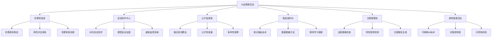
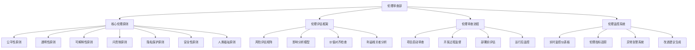
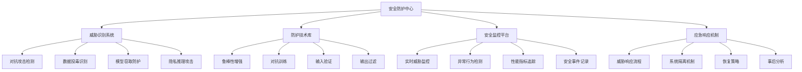

# 第34章 AI伦理与安全防护

> "技术是一把双刃剑，AI的力量越强大，我们的责任就越重大。在AI治理委员会中，我们将探索如何让人工智能真正服务于人类福祉，成为推动社会进步的正义力量。" —— AI伦理学先驱

## 🎯 学习目标

### 知识目标
- **深入理解AI伦理体系**: 掌握AI伦理的核心原则和实践框架
- **学习AI安全防护技术**: 理解对抗攻击、隐私保护、模型安全等技术
- **掌握负责任AI开发**: 学习公平性、可解释性、透明度等关键概念
- **了解AI治理法规**: 熟悉国内外AI相关法律法规和标准

### 技能目标
- **构建AI伦理评估体系**: 实现AI系统的伦理风险评估和监控
- **实现AI安全防护措施**: 掌握模型攻击检测、隐私保护、安全加固技术
- **开发AI治理平台**: 构建企业级AI治理和合规管理系统
- **优化AI公平性**: 掌握偏见检测、公平性优化、多样性保障技能

### 素养目标
- **培养负责任AI意识**: 建立AI开发的伦理责任感和社会责任感
- **建立安全防护思维**: 重视AI系统的安全性和鲁棒性
- **形成治理合规理念**: 关注AI应用的法律合规和社会影响

## 34.1 章节导入：走进AI治理委员会

### 🏛️ 从技术到治理：AI发展的必然选择

在完成了第33章**AI生产工厂**的技术部署之后，我们现在要踏进一个更加重要和复杂的领域——**AI治理委员会**。如果说前面的章节让我们掌握了AI的"技术能力"，那么这一章就是要赋予我们AI的"道德品格"和"社会责任"。

想象一下，当AI系统从实验室走向现实世界，从个人工具变成社会基础设施，我们需要的不仅仅是技术的先进性，更需要的是技术的可靠性、公平性和透明性。这就是为什么我们需要建立一个专门的**AI治理委员会**。



### 🎭 AI治理委员会的组织架构

让我们来详细了解这个AI治理委员会的组织架构：

```python
class AIGovernanceCommittee:
    """AI治理委员会 - 负责任AI开发的守护者"""
    
    def __init__(self):
        self.committee_name = "AI治理委员会"
        self.mission = "确保AI技术的负责任发展和应用"
        self.core_principles = [
            "公平性 (Fairness)",
            "透明性 (Transparency)", 
            "可解释性 (Explainability)",
            "问责制 (Accountability)",
            "隐私保护 (Privacy)",
            "安全性 (Security)",
            "人类福祉 (Human Welfare)"
        ]
        
        # 委员会各部门
        self.departments = {
            "伦理审查部": {
                "职责": "AI伦理原则制定与评估",
                "核心工作": ["伦理风险评估", "价值观对齐", "社会影响分析"],
                "负责人": "首席伦理官",
                "比喻": "道德指南针 - 为AI发展指明正确方向"
            },
            "安全防护中心": {
                "职责": "AI系统安全威胁检测与防护",
                "核心工作": ["对抗攻击防护", "模型鲁棒性", "安全漏洞修复"],
                "负责人": "首席安全官",
                "比喻": "数字盾牌 - 保护AI系统免受恶意攻击"
            },
            "公平监督局": {
                "职责": "AI算法公平性监督与优化",
                "核心工作": ["偏见检测", "公平性度量", "多样性保障"],
                "负责人": "公平性专员",
                "比喻": "正义天平 - 确保AI决策的公平公正"
            },
            "隐私保护办": {
                "职责": "数据隐私和用户权益保护",
                "核心工作": ["隐私技术", "数据脱敏", "权益保障"],
                "负责人": "隐私保护专员",
                "比喻": "隐私卫士 - 守护用户的数字隐私"
            },
            "合规管理处": {
                "职责": "AI法规遵循与风险管控",
                "核心工作": ["法规解读", "合规检查", "风险管理"],
                "负责人": "合规总监",
                "比喻": "法律顾问 - 确保AI应用符合法规要求"
            },
            "透明度委员会": {
                "职责": "AI决策可解释性与透明度保障",
                "核心工作": ["可解释性", "决策透明", "问责机制"],
                "负责人": "透明度专员",
                "比喻": "透明之窗 - 让AI决策过程清晰可见"
            }
        }
        
        print(f"🏛️ {self.committee_name}成立")
        print(f"📜 使命: {self.mission}")
        print(f"⭐ 核心原则: {len(self.core_principles)}项")
        
    def introduce_departments(self):
        """介绍各部门职责"""
        print(f"\n🏢 {self.committee_name}组织架构:")
        print("=" * 50)
        
        for dept_name, dept_info in self.departments.items():
            print(f"\n🏛️ {dept_name}")
            print(f"   📋 职责: {dept_info['职责']}")
            print(f"   👨‍💼 负责人: {dept_info['负责人']}")
            print(f"   🎯 核心工作:")
            for work in dept_info['核心工作']:
                print(f"      • {work}")
            print(f"   🎭 比喻: {dept_info['比喻']}")
    
    def display_core_principles(self):
        """展示核心原则"""
        print(f"\n⭐ AI治理核心原则:")
        print("=" * 30)
        
        for i, principle in enumerate(self.core_principles, 1):
            print(f"{i}. {principle}")
    
    def assess_governance_readiness(self):
        """评估治理准备度"""
        readiness_factors = {
            "技术能力": 0.85,
            "伦理意识": 0.70,
            "法规了解": 0.60,
            "工具准备": 0.75,
            "团队建设": 0.65,
            "流程规范": 0.55
        }
        
        print(f"\n📊 AI治理准备度评估:")
        print("=" * 35)
        
        total_score = 0
        for factor, score in readiness_factors.items():
            percentage = score * 100
            total_score += score
            status = "✅ 良好" if score >= 0.8 else "⚠️ 需改进" if score >= 0.6 else "❌ 待加强"
            print(f"{factor}: {percentage:.1f}% {status}")
        
        avg_score = total_score / len(readiness_factors)
        print(f"\n🎯 综合准备度: {avg_score*100:.1f}%")
        
        if avg_score >= 0.8:
            print("🎉 恭喜！您的AI治理准备度已达到优秀水平")
        elif avg_score >= 0.6:
            print("👍 不错！您的AI治理准备度处于良好水平，继续加油")
        else:
            print("💪 需要努力！建议加强AI治理相关知识和技能的学习")
        
        return readiness_factors

# 初始化AI治理委员会
governance_committee = AIGovernanceCommittee()

# 介绍组织架构
governance_committee.introduce_departments()

# 展示核心原则
governance_committee.display_core_principles()

# 评估治理准备度
readiness_assessment = governance_committee.assess_governance_readiness()
```

### 🌟 作为首席伦理官的你

在这个AI治理委员会中，你将扮演**首席伦理官**的角色。这意味着你需要：

1. **制定伦理标准**: 为AI系统建立明确的伦理准则
2. **评估伦理风险**: 识别和评估AI应用中的潜在伦理问题
3. **监督合规执行**: 确保AI开发和部署符合伦理标准
4. **教育团队意识**: 提升整个团队的AI伦理意识
5. **应对伦理挑战**: 处理复杂的AI伦理难题

### 🎯 AI治理的重要性

为什么AI治理如此重要？让我们通过一个具体的案例来理解：

```python
class AIGovernanceImportance:
    """AI治理重要性分析"""
    
    def __init__(self):
        self.case_studies = {
            "招聘系统偏见": {
                "问题": "AI招聘系统对女性候选人存在系统性偏见",
                "影响": "加剧就业不平等，损害企业声誉",
                "治理方案": "公平性检测、偏见纠正、多样性保障",
                "教训": "公平性必须从设计阶段就考虑"
            },
            "人脸识别误判": {
                "问题": "人脸识别系统对不同种族准确率差异巨大",
                "影响": "可能导致执法偏见和社会不公",
                "治理方案": "数据多样性、算法公平性、透明度提升",
                "教训": "技术准确性不等于社会公平性"
            },
            "推荐算法茧房": {
                "问题": "推荐算法创造信息茧房，加剧社会分化",
                "影响": "影响用户认知，加剧社会对立",
                "治理方案": "多样性推荐、透明度机制、用户控制权",
                "教训": "技术影响超越技术本身"
            },
            "深度伪造滥用": {
                "问题": "深度伪造技术被用于制造虚假信息",
                "影响": "威胁信息安全和社会稳定",
                "治理方案": "检测技术、使用规范、法律监管",
                "教训": "技术能力需要伦理约束"
            }
        }
        
        self.governance_benefits = [
            "提升用户信任度",
            "降低法律风险",
            "改善产品质量",
            "增强品牌价值",
            "促进可持续发展",
            "保护社会公益"
        ]
    
    def analyze_case_study(self, case_name):
        """分析具体案例"""
        if case_name not in self.case_studies:
            return "案例不存在"
        
        case = self.case_studies[case_name]
        
        print(f"📋 案例分析: {case_name}")
        print("=" * 40)
        print(f"❌ 问题描述: {case['问题']}")
        print(f"⚠️ 影响后果: {case['影响']}")
        print(f"✅ 治理方案: {case['治理方案']}")
        print(f"💡 经验教训: {case['教训']}")
        
        return case
    
    def show_governance_benefits(self):
        """展示治理收益"""
        print(f"\n🎯 AI治理的价值收益:")
        print("=" * 30)
        
        for i, benefit in enumerate(self.governance_benefits, 1):
            print(f"{i}. {benefit}")
    
    def calculate_governance_roi(self):
        """计算治理投资回报"""
        governance_costs = {
            "人员投入": 100,
            "工具采购": 50,
            "流程建设": 30,
            "培训教育": 20
        }
        
        governance_benefits_value = {
            "风险规避": 500,
            "品牌提升": 200,
            "效率改进": 150,
            "合规保障": 100
        }
        
        total_cost = sum(governance_costs.values())
        total_benefit = sum(governance_benefits_value.values())
        roi = (total_benefit - total_cost) / total_cost * 100
        
        print(f"\n💰 AI治理投资回报分析:")
        print("=" * 35)
        print(f"📊 总投入: {total_cost}万元")
        print(f"📈 总收益: {total_benefit}万元")
        print(f"🎯 投资回报率: {roi:.1f}%")
        
        return roi

# 演示AI治理重要性
importance_analyzer = AIGovernanceImportance()

# 分析典型案例
importance_analyzer.analyze_case_study("招聘系统偏见")
importance_analyzer.analyze_case_study("人脸识别误判")

# 展示治理收益
importance_analyzer.show_governance_benefits()

# 计算投资回报
roi = importance_analyzer.calculate_governance_roi()
```

### 🚀 AI治理的发展趋势

作为首席伦理官，你还需要了解AI治理的最新发展趋势：

```python
class AIGovernanceTrends:
    """AI治理发展趋势分析"""
    
    def __init__(self):
        self.global_trends = {
            "监管加强": {
                "描述": "各国政府加强AI监管立法",
                "例子": ["欧盟AI法案", "美国AI权利法案", "中国AI安全规定"],
                "影响": "合规成本增加，但行业标准更清晰"
            },
            "技术标准化": {
                "描述": "AI伦理和安全技术标准逐步建立",
                "例子": ["ISO/IEC 23053", "IEEE 2857", "ISO/IEC 23894"],
                "影响": "技术实现更规范，互操作性提升"
            },
            "工具成熟化": {
                "描述": "AI治理工具和平台快速发展",
                "例子": ["Fairness 360", "What-If Tool", "Explainable AI"],
                "影响": "治理实施门槛降低，效果更好"
            },
            "行业自律": {
                "描述": "科技企业主动承担AI治理责任",
                "例子": ["谷歌AI原则", "微软负责任AI", "百度AI伦理"],
                "影响": "行业生态更健康，用户信任度提升"
            }
        }
        
        self.future_challenges = [
            "跨国监管协调",
            "技术快速发展与监管滞后",
            "治理成本与创新效率平衡",
            "文化差异与全球标准统一",
            "新兴技术的伦理挑战"
        ]
    
    def analyze_trends(self):
        """分析发展趋势"""
        print("🔮 AI治理发展趋势分析:")
        print("=" * 40)
        
        for trend_name, trend_info in self.global_trends.items():
            print(f"\n📈 {trend_name}")
            print(f"   📝 描述: {trend_info['描述']}")
            print(f"   🌟 例子: {', '.join(trend_info['例子'])}")
            print(f"   💡 影响: {trend_info['影响']}")
    
    def identify_challenges(self):
        """识别未来挑战"""
        print(f"\n⚠️ 未来挑战:")
        print("=" * 20)
        
        for i, challenge in enumerate(self.future_challenges, 1):
            print(f"{i}. {challenge}")

# 分析AI治理趋势
trends_analyzer = AIGovernanceTrends()
trends_analyzer.analyze_trends()
trends_analyzer.identify_challenges()
```

### 🎓 本章学习路径

在AI治理委员会中，你的学习路径将是：

1. **34.2 AI伦理原则与框架** - 在伦理审查部学习核心伦理原则
2. **34.3 AI安全威胁与防护** - 在安全防护中心掌握安全技术
3. **34.4 算法公平性与偏见检测** - 在公平监督局学习公平性保障
4. **34.5 隐私保护与数据安全** - 在隐私保护办掌握隐私技术
5. **34.6 AI可解释性与透明度** - 在透明度委员会学习解释技术
6. **34.7 企业级AI治理平台** - 在合规管理处构建治理系统

### 🌟 治理委员会的使命

作为AI治理委员会的首席伦理官，你的使命是：

> **让每一个AI系统都成为推动社会进步的正义力量，让每一项AI技术都服务于人类的共同福祉。**

这不仅是技术的责任，更是我们作为AI开发者的道德责任。让我们一起在AI治理的道路上，为构建一个更加公平、安全、透明的AI世界而努力！

---

## 34.2 AI伦理原则与框架

### 🎯 伦理审查部：AI道德的守护者

欢迎来到AI治理委员会的**伦理审查部**！作为首席伦理官，这里是你的主要工作场所。伦理审查部就像是AI世界的"道德指南针"，为所有AI系统的开发和部署提供伦理方向指引。



### 🌟 AI伦理核心原则体系

让我们首先建立一个完整的AI伦理原则体系：

```python
class AIEthicsPrinciples:
    """AI伦理原则体系"""
    
    def __init__(self):
        self.principles = {
            "公平性 (Fairness)": {
                "定义": "AI系统应当公平对待所有用户，不因种族、性别、年龄等因素产生歧视",
                "核心要素": ["算法公平", "数据公平", "结果公平", "程序公平"],
                "实施策略": [
                    "多样化训练数据",
                    "偏见检测算法",
                    "公平性度量指标",
                    "多元化团队参与"
                ],
                "评估指标": ["群体公平性", "个体公平性", "机会均等", "结果均等"],
                "违反后果": "法律风险、声誉损失、社会不公"
            },
            "透明性 (Transparency)": {
                "定义": "AI系统的运作方式、决策过程和局限性应当对用户透明",
                "核心要素": ["算法透明", "数据透明", "决策透明", "风险透明"],
                "实施策略": [
                    "开放算法文档",
                    "数据来源说明",
                    "决策过程可视化",
                    "风险披露机制"
                ],
                "评估指标": ["信息完整性", "可理解性", "可访问性", "及时性"],
                "违反后果": "用户不信任、监管处罚、道德质疑"
            },
            "可解释性 (Explainability)": {
                "定义": "AI系统的决策应当能够被理解和解释",
                "核心要素": ["模型可解释", "决策可解释", "结果可解释", "过程可解释"],
                "实施策略": [
                    "可解释AI技术",
                    "决策路径追踪",
                    "特征重要性分析",
                    "反事实解释"
                ],
                "评估指标": ["解释准确性", "解释完整性", "解释一致性", "用户理解度"],
                "违反后果": "决策质疑、法律挑战、应用受限"
            },
            "问责制 (Accountability)": {
                "定义": "AI系统的开发者和使用者应当对其行为和后果承担责任",
                "核心要素": ["责任主体", "责任范围", "责任机制", "责任追究"],
                "实施策略": [
                    "责任分配矩阵",
                    "审计追踪机制",
                    "事故响应流程",
                    "责任保险制度"
                ],
                "评估指标": ["责任清晰度", "响应及时性", "改进有效性", "学习能力"],
                "违反后果": "法律责任、经济损失、信任危机"
            },
            "隐私保护 (Privacy)": {
                "定义": "AI系统应当保护用户的个人隐私和数据安全",
                "核心要素": ["数据最小化", "目的限制", "同意机制", "安全保障"],
                "实施策略": [
                    "隐私设计原则",
                    "数据脱敏技术",
                    "访问控制机制",
                    "加密保护措施"
                ],
                "评估指标": ["数据保护水平", "同意有效性", "安全性能", "合规程度"],
                "违反后果": "隐私泄露、法律制裁、用户流失"
            },
            "安全性 (Security)": {
                "定义": "AI系统应当具备足够的安全性，防范各种威胁和攻击",
                "核心要素": ["系统安全", "数据安全", "模型安全", "运行安全"],
                "实施策略": [
                    "安全设计原则",
                    "威胁建模分析",
                    "安全测试验证",
                    "持续监控更新"
                ],
                "评估指标": ["安全漏洞数量", "攻击防护能力", "恢复时间", "安全合规性"],
                "违反后果": "系统被攻击、数据泄露、服务中断"
            },
            "人类福祉 (Human Welfare)": {
                "定义": "AI系统应当促进人类福祉，避免对人类造成伤害",
                "核心要素": ["有益性", "无害性", "自主性", "尊严性"],
                "实施策略": [
                    "人类中心设计",
                    "风险影响评估",
                    "人类监督机制",
                    "价值观对齐"
                ],
                "评估指标": ["社会效益", "风险水平", "用户满意度", "长期影响"],
                "违反后果": "社会危害、道德谴责、发展受阻"
            }
        }
        
        print("⭐ AI伦理原则体系已建立")
        print(f"📋 包含 {len(self.principles)} 项核心原则")
    
    def explain_principle(self, principle_name):
        """详细解释某个伦理原则"""
        if principle_name not in self.principles:
            return f"原则 '{principle_name}' 不存在"
        
        principle = self.principles[principle_name]
        
        print(f"\n🎯 {principle_name}")
        print("=" * 50)
        print(f"📝 定义: {principle['定义']}")
        
        print(f"\n🔧 核心要素:")
        for element in principle['核心要素']:
            print(f"   • {element}")
        
        print(f"\n💡 实施策略:")
        for strategy in principle['实施策略']:
            print(f"   • {strategy}")
        
        print(f"\n📊 评估指标:")
        for metric in principle['评估指标']:
            print(f"   • {metric}")
        
        print(f"\n⚠️ 违反后果: {principle['违反后果']}")
        
        return principle
    
    def get_principles_overview(self):
        """获取原则概览"""
        print("\n🌟 AI伦理原则概览:")
        print("=" * 40)
        
        for i, (principle_name, principle_info) in enumerate(self.principles.items(), 1):
            print(f"\n{i}. {principle_name}")
            print(f"   {principle_info['定义']}")

# 创建伦理原则体系
ethics_principles = AIEthicsPrinciples()

# 获取原则概览
ethics_principles.get_principles_overview()

# 详细解释公平性原则
ethics_principles.explain_principle("公平性 (Fairness)")
```

### 📊 AI伦理评估框架

现在让我们构建一个完整的AI伦理评估框架：

```python
import numpy as np
from datetime import datetime
from typing import Dict, List, Tuple, Any

class AIEthicsAssessmentFramework:
    """AI伦理评估框架"""
    
    def __init__(self):
        self.assessment_dimensions = {
            "公平性评估": {
                "权重": 0.20,
                "子指标": {
                    "数据公平性": 0.25,
                    "算法公平性": 0.30,
                    "结果公平性": 0.25,
                    "程序公平性": 0.20
                }
            },
            "透明性评估": {
                "权重": 0.15,
                "子指标": {
                    "算法透明度": 0.30,
                    "数据透明度": 0.25,
                    "决策透明度": 0.25,
                    "风险透明度": 0.20
                }
            },
            "可解释性评估": {
                "权重": 0.15,
                "子指标": {
                    "模型可解释性": 0.35,
                    "决策可解释性": 0.30,
                    "结果可解释性": 0.20,
                    "用户理解度": 0.15
                }
            },
            "问责制评估": {
                "权重": 0.15,
                "子指标": {
                    "责任清晰度": 0.30,
                    "审计机制": 0.25,
                    "响应能力": 0.25,
                    "改进机制": 0.20
                }
            },
            "隐私保护评估": {
                "权重": 0.15,
                "子指标": {
                    "数据保护": 0.30,
                    "同意机制": 0.25,
                    "访问控制": 0.25,
                    "合规性": 0.20
                }
            },
            "安全性评估": {
                "权重": 0.10,
                "子指标": {
                    "系统安全": 0.30,
                    "数据安全": 0.25,
                    "模型安全": 0.25,
                    "运行安全": 0.20
                }
            },
            "人类福祉评估": {
                "权重": 0.10,
                "子指标": {
                    "有益性": 0.30,
                    "无害性": 0.30,
                    "自主性": 0.20,
                    "尊严性": 0.20
                }
            }
        }
        
        self.risk_levels = {
            "低风险": {"范围": (0.8, 1.0), "颜色": "🟢", "行动": "继续监控"},
            "中风险": {"范围": (0.6, 0.8), "颜色": "🟡", "行动": "制定改进计划"},
            "高风险": {"范围": (0.4, 0.6), "颜色": "🟠", "行动": "立即整改"},
            "极高风险": {"范围": (0.0, 0.4), "颜色": "🔴", "行动": "暂停使用"}
        }
        
        print("📊 AI伦理评估框架已初始化")
    
    def conduct_assessment(self, ai_system_info: Dict) -> Dict:
        """进行AI伦理评估"""
        
        print(f"\n🔍 开始评估AI系统: {ai_system_info.get('name', '未命名系统')}")
        print("=" * 50)
        
        assessment_results = {}
        total_score = 0
        
        # 对每个维度进行评估
        for dimension, dimension_info in self.assessment_dimensions.items():
            dimension_score = self._assess_dimension(dimension, ai_system_info)
            weighted_score = dimension_score * dimension_info['权重']
            
            assessment_results[dimension] = {
                "原始得分": dimension_score,
                "权重": dimension_info['权重'],
                "加权得分": weighted_score,
                "子指标详情": self._get_sub_indicators_details(dimension, ai_system_info)
            }
            
            total_score += weighted_score
            
            print(f"{dimension}: {dimension_score:.2f} (权重: {dimension_info['权重']:.2f}, 加权: {weighted_score:.3f})")
        
        # 确定风险等级
        risk_level = self._determine_risk_level(total_score)
        
        assessment_results["综合评估"] = {
            "总分": total_score,
            "风险等级": risk_level,
            "评估时间": datetime.now().strftime("%Y-%m-%d %H:%M:%S"),
            "评估对象": ai_system_info.get('name', '未命名系统')
        }
        
        print(f"\n📊 综合评估结果:")
        print(f"   总分: {total_score:.3f}")
        print(f"   风险等级: {risk_level['颜色']} {risk_level['level']}")
        print(f"   建议行动: {risk_level['行动']}")
        
        return assessment_results
    
    def _assess_dimension(self, dimension: str, ai_system_info: Dict) -> float:
        """评估单个维度"""
        # 这里使用模拟评估，实际应用中需要具体的评估逻辑
        base_score = np.random.uniform(0.5, 0.9)
        
        # 根据系统信息调整得分
        if ai_system_info.get('has_bias_testing', False):
            base_score += 0.05
        if ai_system_info.get('has_explainability', False):
            base_score += 0.05
        if ai_system_info.get('has_privacy_protection', False):
            base_score += 0.05
        if ai_system_info.get('has_security_measures', False):
            base_score += 0.05
        
        return min(base_score, 1.0)
    
    def _get_sub_indicators_details(self, dimension: str, ai_system_info: Dict) -> Dict:
        """获取子指标详情"""
        sub_indicators = self.assessment_dimensions[dimension]['子指标']
        details = {}
        
        for indicator, weight in sub_indicators.items():
            # 模拟子指标评估
            score = np.random.uniform(0.4, 0.95)
            details[indicator] = {
                "得分": score,
                "权重": weight,
                "状态": "良好" if score > 0.7 else "需改进" if score > 0.5 else "不合格"
            }
        
        return details
    
    def _determine_risk_level(self, score: float) -> Dict:
        """确定风险等级"""
        for level, info in self.risk_levels.items():
            if info['范围'][0] <= score <= info['范围'][1]:
                return {
                    "level": level,
                    "颜色": info['颜色'],
                    "行动": info['行动'],
                    "得分范围": info['范围']
                }
        return {"level": "未知", "颜色": "⚪", "行动": "需要重新评估"}
    
    def generate_improvement_plan(self, assessment_results: Dict) -> Dict:
        """生成改进计划"""
        improvement_plan = {
            "优先级改进项": [],
            "具体改进措施": {},
            "时间规划": {},
            "资源需求": {}
        }
        
        # 识别需要改进的维度
        for dimension, result in assessment_results.items():
            if dimension == "综合评估":
                continue
                
            if result["原始得分"] < 0.7:  # 得分低于0.7的需要改进
                priority = "高优先级" if result["原始得分"] < 0.5 else "中优先级"
                improvement_plan["优先级改进项"].append({
                    "维度": dimension,
                    "当前得分": result["原始得分"],
                    "优先级": priority,
                    "影响程度": result["权重"]
                })
        
        # 生成具体改进措施
        improvement_plan["具体改进措施"] = self._generate_specific_measures(improvement_plan["优先级改进项"])
        
        return improvement_plan
    
    def _generate_specific_measures(self, priority_items: List) -> Dict:
        """生成具体改进措施"""
        measures = {}
        
        measure_templates = {
            "公平性评估": [
                "增加训练数据的多样性",
                "实施偏见检测算法",
                "建立公平性监控机制",
                "组建多元化评估团队"
            ],
            "透明性评估": [
                "完善算法文档",
                "建立用户友好的解释界面",
                "定期发布透明度报告",
                "建立用户反馈机制"
            ],
            "可解释性评估": [
                "集成可解释AI工具",
                "开发决策解释功能",
                "培训团队解释技能",
                "建立解释质量评估"
            ],
            "隐私保护评估": [
                "实施差分隐私技术",
                "加强数据加密措施",
                "完善同意管理机制",
                "定期进行隐私审计"
            ]
        }
        
        for item in priority_items:
            dimension = item["维度"]
            if dimension in measure_templates:
                measures[dimension] = measure_templates[dimension]
            else:
                measures[dimension] = ["制定专门的改进方案", "咨询专业伦理顾问"]
        
        return measures

# 演示伦理评估框架
assessment_framework = AIEthicsAssessmentFramework()

# 模拟AI系统信息
ai_system_example = {
    "name": "智能招聘推荐系统",
    "type": "推荐系统",
    "domain": "人力资源",
    "has_bias_testing": True,
    "has_explainability": False,
    "has_privacy_protection": True,
    "has_security_measures": True,
    "user_scale": "大规模",
    "risk_level": "中等"
}

# 进行伦理评估
assessment_results = assessment_framework.conduct_assessment(ai_system_example)

# 生成改进计划
improvement_plan = assessment_framework.generate_improvement_plan(assessment_results)

print(f"\n📋 改进计划:")
print("=" * 30)
print(f"需要改进的维度数量: {len(improvement_plan['优先级改进项'])}")
for item in improvement_plan['优先级改进项']:
    print(f"• {item['维度']}: {item['当前得分']:.2f} ({item['优先级']})")
```

这个伦理评估框架为AI系统提供了全面的伦理风险评估，帮助识别潜在问题并制定改进计划。

---

## 34.3 AI安全威胁与防护

### 🛡️ 安全防护中心：AI系统的数字盾牌

欢迎来到AI治理委员会的**安全防护中心**！如果说伦理审查部是AI的"道德指南针"，那么安全防护中心就是AI的"数字盾牌"。在这里，我们专注于识别、分析和防护各种针对AI系统的安全威胁。



### 🔍 AI安全威胁全景图

让我们首先了解AI系统面临的主要安全威胁：

```python
class AISecurityThreatLandscape:
    """AI安全威胁全景图"""
    
    def __init__(self):
        self.threat_categories = {
            "对抗攻击 (Adversarial Attacks)": {
                "定义": "通过精心设计的输入来欺骗AI模型产生错误输出",
                "子类型": {
                    "白盒攻击": "攻击者完全了解模型结构和参数",
                    "黑盒攻击": "攻击者只能访问模型的输入输出",
                    "灰盒攻击": "攻击者部分了解模型信息"
                },
                "攻击方法": [
                    "FGSM (Fast Gradient Sign Method)",
                    "PGD (Projected Gradient Descent)",
                    "C&W (Carlini & Wagner)",
                    "DeepFool算法"
                ],
                "影响程度": "高",
                "发生概率": "中等",
                "典型场景": ["图像识别", "语音识别", "自然语言处理"]
            },
            "数据投毒 (Data Poisoning)": {
                "定义": "在训练数据中注入恶意样本来影响模型学习",
                "子类型": {
                    "标签翻转攻击": "修改训练样本的标签",
                    "后门攻击": "在数据中植入特定触发器",
                    "可用性攻击": "降低模型整体性能"
                },
                "攻击方法": [
                    "随机标签噪声",
                    "系统性标签翻转",
                    "特征污染",
                    "梯度匹配攻击"
                ],
                "影响程度": "极高",
                "发生概率": "低",
                "典型场景": ["联邦学习", "众包数据", "开源数据集"]
            },
            "模型窃取 (Model Extraction)": {
                "定义": "通过查询目标模型来复制其功能和性能",
                "子类型": {
                    "功能窃取": "复制模型的输入输出关系",
                    "保真度窃取": "尽可能准确地复制模型",
                    "参数窃取": "推断模型的具体参数"
                },
                "攻击方法": [
                    "查询优化",
                    "主动学习",
                    "蒸馏攻击",
                    "梯度推断"
                ],
                "影响程度": "高",
                "发生概率": "中等",
                "典型场景": ["云端AI服务", "API接口", "边缘设备"]
            },
            "隐私推理攻击 (Privacy Inference)": {
                "定义": "从模型中推断出训练数据的隐私信息",
                "子类型": {
                    "成员推理攻击": "判断特定样本是否在训练集中",
                    "属性推理攻击": "推断训练数据的敏感属性",
                    "模型反演攻击": "从模型输出重构输入数据"
                },
                "攻击方法": [
                    "影子模型训练",
                    "置信度分析",
                    "梯度分析",
                    "生成对抗网络"
                ],
                "影响程度": "极高",
                "发生概率": "中高",
                "典型场景": ["医疗AI", "金融AI", "个人化推荐"]
            },
            "系统级攻击 (System-level Attacks)": {
                "定义": "针对AI系统基础设施的攻击",
                "子类型": {
                    "硬件攻击": "针对AI芯片和计算硬件",
                    "软件攻击": "针对AI框架和运行环境",
                    "网络攻击": "针对AI系统的网络通信"
                },
                "攻击方法": [
                    "侧信道攻击",
                    "故障注入",
                    "恶意软件植入",
                    "中间人攻击"
                ],
                "影响程度": "极高",
                "发生概率": "低",
                "典型场景": ["边缘AI设备", "云端AI服务", "IoT智能设备"]
            }
        }
        
        self.threat_trends = {
            "2024年": ["多模态对抗攻击", "大模型越狱攻击", "联邦学习攻击"],
            "2025年": ["量子对抗攻击", "生成式AI滥用", "AI供应链攻击"],
            "未来趋势": ["AI vs AI攻防", "自适应攻击", "跨域攻击"]
        }
        
        print("🔍 AI安全威胁全景图已构建")
        print(f"📊 包含 {len(self.threat_categories)} 类主要威胁")
    
    def analyze_threat(self, threat_name: str):
        """分析特定威胁"""
        if threat_name not in self.threat_categories:
            return f"威胁类型 '{threat_name}' 不存在"
        
        threat = self.threat_categories[threat_name]
        
        print(f"\n🎯 威胁分析: {threat_name}")
        print("=" * 50)
        print(f"📝 定义: {threat['定义']}")
        
        print(f"\n🔧 子类型:")
        for subtype, description in threat['子类型'].items():
            print(f"   • {subtype}: {description}")
        
        print(f"\n⚔️ 主要攻击方法:")
        for method in threat['攻击方法']:
            print(f"   • {method}")
        
        print(f"\n📊 威胁评估:")
        print(f"   影响程度: {threat['影响程度']}")
        print(f"   发生概率: {threat['发生概率']}")
        
        print(f"\n🎭 典型应用场景:")
        for scenario in threat['典型场景']:
            print(f"   • {scenario}")
        
        return threat
    
    def get_threat_matrix(self):
        """获取威胁矩阵"""
        print("\n📊 AI安全威胁矩阵:")
        print("=" * 60)
        print(f"{'威胁类型':<20} {'影响程度':<10} {'发生概率':<10} {'风险等级'}")
        print("-" * 60)
        
        for threat_name, threat_info in self.threat_categories.items():
            impact = threat_info['影响程度']
            probability = threat_info['发生概率']
            
            # 计算风险等级
            risk_level = self._calculate_risk_level(impact, probability)
            
            # 截断威胁名称以适应显示
            display_name = threat_name.split(' (')[0]
            if len(display_name) > 18:
                display_name = display_name[:15] + "..."
            
            print(f"{display_name:<20} {impact:<10} {probability:<10} {risk_level}")
    
    def _calculate_risk_level(self, impact: str, probability: str) -> str:
        """计算风险等级"""
        impact_score = {"低": 1, "中等": 2, "高": 3, "极高": 4}.get(impact, 2)
        prob_score = {"低": 1, "中低": 1.5, "中等": 2, "中高": 2.5, "高": 3}.get(probability, 2)
        
        risk_score = impact_score * prob_score
        
        if risk_score >= 9:
            return "🔴 极高风险"
        elif risk_score >= 6:
            return "🟠 高风险"
        elif risk_score >= 4:
            return "🟡 中风险"
        else:
            return "🟢 低风险"
    
    def show_threat_trends(self):
        """展示威胁发展趋势"""
        print(f"\n🔮 AI安全威胁发展趋势:")
        print("=" * 40)
        
        for period, trends in self.threat_trends.items():
            print(f"\n📅 {period}:")
            for trend in trends:
                print(f"   • {trend}")

# 创建威胁分析系统
threat_analyzer = AISecurityThreatLandscape()

# 分析对抗攻击威胁
threat_analyzer.analyze_threat("对抗攻击 (Adversarial Attacks)")

# 显示威胁矩阵
threat_analyzer.get_threat_matrix()

# 展示发展趋势
threat_analyzer.show_threat_trends()
```

### 🛡️ AI安全防护技术体系

现在让我们构建一个完整的AI安全防护技术体系：

```python
import numpy as np
import tensorflow as tf
from typing import Dict, List, Tuple, Any, Optional
import hashlib
import time

class AISecurityDefenseSystem:
    """AI安全防护系统"""
    
    def __init__(self):
        self.defense_techniques = {
            "对抗训练 (Adversarial Training)": {
                "原理": "在训练过程中加入对抗样本，提高模型鲁棒性",
                "适用威胁": ["对抗攻击", "数据投毒"],
                "实现复杂度": "中等",
                "性能影响": "中等",
                "防护效果": "良好"
            },
            "输入预处理 (Input Preprocessing)": {
                "原理": "对输入数据进行预处理，去除对抗扰动",
                "适用威胁": ["对抗攻击"],
                "实现复杂度": "低",
                "性能影响": "低",
                "防护效果": "中等"
            },
            "模型蒸馏 (Model Distillation)": {
                "原理": "通过温度参数软化输出分布，提高鲁棒性",
                "适用威胁": ["对抗攻击", "模型窃取"],
                "实现复杂度": "中等",
                "性能影响": "低",
                "防护效果": "中等"
            },
            "差分隐私 (Differential Privacy)": {
                "原理": "在训练过程中添加噪声，保护隐私",
                "适用威胁": ["隐私推理攻击", "成员推理"],
                "实现复杂度": "高",
                "性能影响": "中等",
                "防护效果": "优秀"
            },
            "联邦学习 (Federated Learning)": {
                "原理": "分布式训练，避免数据集中",
                "适用威胁": ["数据投毒", "隐私泄露"],
                "实现复杂度": "高",
                "性能影响": "中等",
                "防护效果": "良好"
            },
            "安全多方计算 (Secure Multi-party Computation)": {
                "原理": "在不泄露私有数据的情况下进行计算",
                "适用威胁": ["隐私推理攻击", "数据泄露"],
                "实现复杂度": "极高",
                "性能影响": "高",
                "防护效果": "优秀"
            }
        }
        
        self.monitoring_metrics = {
            "模型性能指标": ["准确率", "召回率", "F1分数", "AUC"],
            "安全性指标": ["对抗鲁棒性", "隐私保护水平", "异常检测率"],
            "系统指标": ["响应时间", "吞吐量", "资源使用率", "错误率"]
        }
        
        print("🛡️ AI安全防护系统已初始化")
    
    def implement_adversarial_training(self, model, train_data, train_labels):
        """实现对抗训练"""
        
        class AdversarialTrainingEngine:
            def __init__(self, base_model):
                self.model = base_model
                self.epsilon = 0.1  # 扰动强度
                self.alpha = 0.01   # 步长
                self.num_steps = 10  # 迭代步数
                
            def generate_adversarial_examples(self, x, y):
                """生成对抗样本"""
                # 使用PGD方法生成对抗样本
                x_adv = tf.identity(x)
                
                for _ in range(self.num_steps):
                    with tf.GradientTape() as tape:
                        tape.watch(x_adv)
                        predictions = self.model(x_adv)
                        loss = tf.keras.losses.sparse_categorical_crossentropy(y, predictions)
                    
                    gradients = tape.gradient(loss, x_adv)
                    x_adv = x_adv + self.alpha * tf.sign(gradients)
                    x_adv = tf.clip_by_value(x_adv, x - self.epsilon, x + self.epsilon)
                    x_adv = tf.clip_by_value(x_adv, 0.0, 1.0)
                
                return x_adv
            
            def train_step(self, x, y):
                """对抗训练步骤"""
                # 生成对抗样本
                x_adv = self.generate_adversarial_examples(x, y)
                
                # 混合原始样本和对抗样本
                x_mixed = tf.concat([x, x_adv], axis=0)
                y_mixed = tf.concat([y, y], axis=0)
                
                # 训练模型
                with tf.GradientTape() as tape:
                    predictions = self.model(x_mixed, training=True)
                    loss = tf.keras.losses.sparse_categorical_crossentropy(y_mixed, predictions)
                    loss = tf.reduce_mean(loss)
                
                gradients = tape.gradient(loss, self.model.trainable_variables)
                self.model.optimizer.apply_gradients(zip(gradients, self.model.trainable_variables))
                
                return loss
        
        # 创建对抗训练引擎
        adv_trainer = AdversarialTrainingEngine(model)
        
        print("🎯 开始对抗训练...")
        training_history = []
        
        # 模拟训练过程
        for epoch in range(5):  # 简化的训练循环
            epoch_losses = []
            for batch_idx in range(10):  # 模拟批次
                # 模拟批次数据
                batch_x = np.random.random((32, 28, 28, 1))
                batch_y = np.random.randint(0, 10, (32,))
                
                batch_x = tf.constant(batch_x, dtype=tf.float32)
                batch_y = tf.constant(batch_y, dtype=tf.int64)
                
                # 执行训练步骤
                loss = adv_trainer.train_step(batch_x, batch_y)
                epoch_losses.append(float(loss))
            
            avg_loss = np.mean(epoch_losses)
            training_history.append(avg_loss)
            print(f"   Epoch {epoch+1}/5: Loss = {avg_loss:.4f}")
        
        print("✅ 对抗训练完成")
        return {
            "训练历史": training_history,
            "最终损失": training_history[-1],
            "训练轮数": len(training_history)
        }
    
    def implement_input_preprocessing(self):
        """实现输入预处理防护"""
        
        class InputPreprocessor:
            def __init__(self):
                self.defense_methods = {
                    "高斯噪声": self._add_gaussian_noise,
                    "JPEG压缩": self._jpeg_compression,
                    "位深度降低": self._bit_depth_reduction,
                    "像素偏移": self._pixel_shift,
                    "中值滤波": self._median_filter
                }
                
            def _add_gaussian_noise(self, x, noise_level=0.1):
                """添加高斯噪声"""
                noise = np.random.normal(0, noise_level, x.shape)
                return np.clip(x + noise, 0, 1)
            
            def _jpeg_compression(self, x, quality=75):
                """JPEG压缩"""
                # 模拟JPEG压缩效果
                compressed = x + np.random.normal(0, 0.02, x.shape)
                return np.clip(compressed, 0, 1)
            
            def _bit_depth_reduction(self, x, bits=4):
                """位深度降低"""
                levels = 2 ** bits
                quantized = np.round(x * (levels - 1)) / (levels - 1)
                return quantized
            
            def _pixel_shift(self, x, shift_range=2):
                """像素偏移"""
                # 模拟像素偏移
                shifted = np.roll(x, np.random.randint(-shift_range, shift_range+1), axis=1)
                return shifted
            
            def _median_filter(self, x, kernel_size=3):
                """中值滤波"""
                # 简化的中值滤波实现
                filtered = x.copy()
                # 这里应该实现真正的中值滤波，简化为加噪声
                filtered += np.random.normal(0, 0.01, x.shape)
                return np.clip(filtered, 0, 1)
            
            def preprocess(self, x, methods=None):
                """预处理输入"""
                if methods is None:
                    methods = ["高斯噪声", "JPEG压缩"]
                
                processed_x = x.copy()
                
                for method in methods:
                    if method in self.defense_methods:
                        processed_x = self.defense_methods[method](processed_x)
                
                return processed_x
            
            def evaluate_defense_effectiveness(self, clean_acc, defended_acc, attack_success_rate):
                """评估防护效果"""
                defense_effectiveness = {
                    "干净样本准确率": clean_acc,
                    "防护后准确率": defended_acc,
                    "准确率损失": clean_acc - defended_acc,
                    "攻击成功率": attack_success_rate,
                    "防护成功率": 1 - attack_success_rate,
                    "整体评分": (defended_acc * 0.6 + (1 - attack_success_rate) * 0.4)
                }
                
                return defense_effectiveness
        
        # 创建输入预处理器
        preprocessor = InputPreprocessor()
        
        print("🔧 输入预处理防护系统:")
        print("=" * 40)
        
        # 模拟测试数据
        test_input = np.random.random((100, 28, 28, 1))
        
        # 应用不同的预处理方法
        for method_name in preprocessor.defense_methods.keys():
            processed = preprocessor.preprocess(test_input, [method_name])
            noise_level = np.mean(np.abs(processed - test_input))
            print(f"   {method_name}: 平均扰动 = {noise_level:.4f}")
        
        # 评估防护效果
        defense_eval = preprocessor.evaluate_defense_effectiveness(
            clean_acc=0.95,
            defended_acc=0.88,
            attack_success_rate=0.15
        )
        
        print(f"\n📊 防护效果评估:")
        for metric, value in defense_eval.items():
            if isinstance(value, float):
                print(f"   {metric}: {value:.3f}")
            else:
                print(f"   {metric}: {value}")
        
        return preprocessor
    
    def implement_differential_privacy(self):
        """实现差分隐私防护"""
        
        class DifferentialPrivacyEngine:
            def __init__(self, epsilon=1.0, delta=1e-5):
                self.epsilon = epsilon  # 隐私预算
                self.delta = delta      # 失败概率
                self.noise_multiplier = self._calculate_noise_multiplier()
                
            def _calculate_noise_multiplier(self):
                """计算噪声乘数"""
                # 简化的噪声乘数计算
                return np.sqrt(2 * np.log(1.25 / self.delta)) / self.epsilon
            
            def add_noise_to_gradients(self, gradients, l2_norm_clip=1.0):
                """为梯度添加噪声"""
                # 梯度裁剪
                clipped_gradients = []
                for grad in gradients:
                    if grad is not None:
                        grad_norm = tf.norm(grad)
                        clipped_grad = grad * tf.minimum(1.0, l2_norm_clip / grad_norm)
                        clipped_gradients.append(clipped_grad)
                    else:
                        clipped_gradients.append(grad)
                
                # 添加高斯噪声
                noisy_gradients = []
                for grad in clipped_gradients:
                    if grad is not None:
                        noise = tf.random.normal(
                            tf.shape(grad), 
                            mean=0.0, 
                            stddev=self.noise_multiplier * l2_norm_clip
                        )
                        noisy_grad = grad + noise
                        noisy_gradients.append(noisy_grad)
                    else:
                        noisy_gradients.append(grad)
                
                return noisy_gradients
            
            def private_training_step(self, model, x, y, optimizer):
                """差分隐私训练步骤"""
                with tf.GradientTape() as tape:
                    predictions = model(x, training=True)
                    loss = tf.keras.losses.sparse_categorical_crossentropy(y, predictions)
                    loss = tf.reduce_mean(loss)
                
                gradients = tape.gradient(loss, model.trainable_variables)
                noisy_gradients = self.add_noise_to_gradients(gradients)
                optimizer.apply_gradients(zip(noisy_gradients, model.trainable_variables))
                
                return loss
            
            def calculate_privacy_spent(self, steps, batch_size, dataset_size):
                """计算已消耗的隐私预算"""
                # 简化的隐私预算计算
                sampling_rate = batch_size / dataset_size
                privacy_spent = {
                    "epsilon": self.epsilon * steps * sampling_rate,
                    "delta": self.delta,
                    "steps": steps,
                    "remaining_budget": max(0, self.epsilon - self.epsilon * steps * sampling_rate)
                }
                return privacy_spent
        
        # 创建差分隐私引擎
        dp_engine = DifferentialPrivacyEngine(epsilon=1.0, delta=1e-5)
        
        print("🔐 差分隐私防护系统:")
        print("=" * 35)
        print(f"   隐私预算 ε: {dp_engine.epsilon}")
        print(f"   失败概率 δ: {dp_engine.delta}")
        print(f"   噪声乘数: {dp_engine.noise_multiplier:.4f}")
        
        # 模拟隐私预算消耗
        privacy_budget_tracking = []
        for step in range(1, 101, 10):
            privacy_spent = dp_engine.calculate_privacy_spent(
                steps=step, 
                batch_size=32, 
                dataset_size=1000
            )
            privacy_budget_tracking.append(privacy_spent)
        
        print(f"\n📊 隐私预算消耗追踪:")
        print(f"{'步数':<8} {'已消耗ε':<10} {'剩余预算':<10}")
        print("-" * 30)
        for budget in privacy_budget_tracking[::2]:  # 每隔一个显示
            print(f"{budget['steps']:<8} {budget['epsilon']:<10.4f} {budget['remaining_budget']:<10.4f}")
        
        return dp_engine

# 创建安全防护系统
defense_system = AISecurityDefenseSystem()

# 实现输入预处理防护
preprocessor = defense_system.implement_input_preprocessing()

# 实现差分隐私防护
dp_engine = defense_system.implement_differential_privacy()
```

### 🚨 AI安全监控平台

现在让我们构建一个实时的AI安全监控平台：

```python
import json
from datetime import datetime, timedelta
import threading
import queue

class AISecurityMonitoringPlatform:
    """AI安全监控平台"""
    
    def __init__(self):
        self.monitoring_status = "运行中"
        self.alert_queue = queue.Queue()
        self.security_metrics = {
            "对抗攻击检测": {"正常": 0, "可疑": 0, "恶意": 0},
            "异常行为监控": {"正常": 0, "异常": 0},
            "性能指标": {"响应时间": [], "准确率": [], "吞吐量": []},
            "系统健康": {"CPU使用率": [], "内存使用率": [], "错误率": []}
        }
        
        self.alert_rules = {
            "高频查询": {"阈值": 100, "时间窗口": 60, "严重程度": "中等"},
            "异常输入": {"阈值": 0.8, "时间窗口": 30, "严重程度": "高"},
            "性能下降": {"阈值": 0.1, "时间窗口": 300, "严重程度": "中等"},
            "系统过载": {"阈值": 0.9, "时间窗口": 60, "严重程度": "高"}
        }
        
        self.incident_history = []
        
        print("🚨 AI安全监控平台已启动")
    
    def detect_adversarial_attack(self, input_data, model_output, confidence_threshold=0.1):
        """检测对抗攻击"""
        
        # 模拟对抗攻击检测逻辑
        detection_results = {
            "输入异常检测": self._check_input_anomaly(input_data),
            "输出置信度检测": self._check_output_confidence(model_output, confidence_threshold),
            "梯度检测": self._check_gradient_anomaly(),
            "统计检测": self._check_statistical_anomaly()
        }
        
        # 综合判断
        threat_level = self._assess_threat_level(detection_results)
        
        if threat_level > 0.5:
            self._trigger_alert("对抗攻击检测", threat_level, detection_results)
        
        # 更新监控指标
        if threat_level > 0.8:
            self.security_metrics["对抗攻击检测"]["恶意"] += 1
        elif threat_level > 0.3:
            self.security_metrics["对抗攻击检测"]["可疑"] += 1
        else:
            self.security_metrics["对抗攻击检测"]["正常"] += 1
        
        return {
            "威胁等级": threat_level,
            "检测结果": detection_results,
            "建议行动": self._get_recommended_action(threat_level)
        }
    
    def _check_input_anomaly(self, input_data):
        """检查输入异常"""
        # 模拟输入异常检测
        anomaly_score = np.random.random()
        return {
            "异常得分": anomaly_score,
            "是否异常": anomaly_score > 0.7,
            "检测方法": "统计分析"
        }
    
    def _check_output_confidence(self, model_output, threshold):
        """检查输出置信度"""
        # 模拟置信度检测
        max_confidence = np.random.random()
        return {
            "最大置信度": max_confidence,
            "是否可疑": max_confidence < threshold,
            "检测方法": "置信度分析"
        }
    
    def _check_gradient_anomaly(self):
        """检查梯度异常"""
        # 模拟梯度检测
        gradient_norm = np.random.random() * 10
        return {
            "梯度范数": gradient_norm,
            "是否异常": gradient_norm > 5.0,
            "检测方法": "梯度分析"
        }
    
    def _check_statistical_anomaly(self):
        """检查统计异常"""
        # 模拟统计检测
        statistical_score = np.random.random()
        return {
            "统计得分": statistical_score,
            "是否异常": statistical_score > 0.6,
            "检测方法": "统计检验"
        }
    
    def _assess_threat_level(self, detection_results):
        """评估威胁等级"""
        threat_indicators = 0
        total_indicators = len(detection_results)
        
        for result in detection_results.values():
            if isinstance(result, dict):
                if result.get("是否异常", False) or result.get("是否可疑", False):
                    threat_indicators += 1
        
        return threat_indicators / total_indicators
    
    def _trigger_alert(self, alert_type, threat_level, details):
        """触发安全告警"""
        alert = {
            "时间": datetime.now().isoformat(),
            "类型": alert_type,
            "威胁等级": threat_level,
            "严重程度": "高" if threat_level > 0.8 else "中" if threat_level > 0.5 else "低",
            "详情": details,
            "状态": "待处理"
        }
        
        self.alert_queue.put(alert)
        self.incident_history.append(alert)
        
        print(f"🚨 安全告警: {alert_type} (威胁等级: {threat_level:.2f})")
    
    def _get_recommended_action(self, threat_level):
        """获取建议行动"""
        if threat_level > 0.8:
            return "立即阻断请求，启动应急响应"
        elif threat_level > 0.5:
            return "增强监控，准备防护措施"
        elif threat_level > 0.3:
            return "记录异常，持续观察"
        else:
            return "正常处理"
    
    def monitor_system_performance(self):
        """监控系统性能"""
        
        # 模拟性能数据收集
        current_metrics = {
            "响应时间": np.random.normal(50, 10),  # 毫秒
            "准确率": np.random.normal(0.95, 0.02),
            "吞吐量": np.random.normal(500, 50),   # QPS
            "CPU使用率": np.random.uniform(0.3, 0.8),
            "内存使用率": np.random.uniform(0.4, 0.7),
            "错误率": np.random.uniform(0.001, 0.01)
        }
        
        # 更新性能指标
        for metric, value in current_metrics.items():
            if metric in self.security_metrics["性能指标"]:
                self.security_metrics["性能指标"][metric].append(value)
                # 保持最近100个数据点
                if len(self.security_metrics["性能指标"][metric]) > 100:
                    self.security_metrics["性能指标"][metric].pop(0)
            elif metric in self.security_metrics["系统健康"]:
                self.security_metrics["系统健康"][metric].append(value)
                if len(self.security_metrics["系统健康"][metric]) > 100:
                    self.security_metrics["系统健康"][metric].pop(0)
        
        # 检查告警规则
        self._check_alert_rules(current_metrics)
        
        return current_metrics
    
    def _check_alert_rules(self, current_metrics):
        """检查告警规则"""
        
        # 检查性能下降
        if "准确率" in current_metrics and current_metrics["准确率"] < 0.85:
            self._trigger_alert("性能下降", 0.7, {"准确率": current_metrics["准确率"]})
        
        # 检查系统过载
        if current_metrics.get("CPU使用率", 0) > 0.9:
            self._trigger_alert("系统过载", 0.8, {"CPU使用率": current_metrics["CPU使用率"]})
    
    def generate_security_report(self):
        """生成安全报告"""
        
        report = {
            "报告时间": datetime.now().isoformat(),
            "监控状态": self.monitoring_status,
            "安全指标统计": self.security_metrics,
            "告警统计": {
                "总告警数": len(self.incident_history),
                "待处理告警": self.alert_queue.qsize(),
                "最近24小时告警": self._count_recent_alerts(24)
            },
            "系统健康评分": self._calculate_health_score(),
            "安全建议": self._generate_security_recommendations()
        }
        
        return report
    
    def _count_recent_alerts(self, hours):
        """统计最近几小时的告警数量"""
        cutoff_time = datetime.now() - timedelta(hours=hours)
        recent_alerts = 0
        
        for alert in self.incident_history:
            alert_time = datetime.fromisoformat(alert["时间"])
            if alert_time > cutoff_time:
                recent_alerts += 1
        
        return recent_alerts
    
    def _calculate_health_score(self):
        """计算系统健康评分"""
        
        # 基于各项指标计算健康评分
        scores = []
        
        # 安全指标评分
        total_attacks = sum(self.security_metrics["对抗攻击检测"].values())
        if total_attacks > 0:
            normal_ratio = self.security_metrics["对抗攻击检测"]["正常"] / total_attacks
            scores.append(normal_ratio)
        else:
            scores.append(1.0)
        
        # 性能指标评分
        if self.security_metrics["性能指标"]["准确率"]:
            avg_accuracy = np.mean(self.security_metrics["性能指标"]["准确率"])
            scores.append(min(avg_accuracy / 0.95, 1.0))  # 标准化到0.95
        
        # 系统指标评分
        if self.security_metrics["系统健康"]["错误率"]:
            avg_error_rate = np.mean(self.security_metrics["系统健康"]["错误率"])
            scores.append(max(0, 1 - avg_error_rate * 100))  # 错误率越低越好
        
        return np.mean(scores) if scores else 0.5
    
    def _generate_security_recommendations(self):
        """生成安全建议"""
        recommendations = []
        
        # 基于告警历史生成建议
        if len(self.incident_history) > 10:
            recommendations.append("告警频率较高，建议加强安全防护措施")
        
        # 基于系统健康评分生成建议
        health_score = self._calculate_health_score()
        if health_score < 0.7:
            recommendations.append("系统健康评分偏低，建议进行全面安全检查")
        
        # 基于性能指标生成建议
        if self.security_metrics["性能指标"]["准确率"]:
            recent_accuracy = self.security_metrics["性能指标"]["准确率"][-10:]
            if np.mean(recent_accuracy) < 0.9:
                recommendations.append("模型准确率下降，建议检查数据质量和模型状态")
        
        if not recommendations:
            recommendations.append("系统运行正常，继续保持当前安全策略")
        
        return recommendations
    
    def display_monitoring_dashboard(self):
        """显示监控仪表板"""
        
        print("\n🖥️ AI安全监控仪表板")
        print("=" * 50)
        
        # 显示系统状态
        health_score = self._calculate_health_score()
        status_color = "🟢" if health_score > 0.8 else "🟡" if health_score > 0.6 else "🔴"
        print(f"系统状态: {status_color} {self.monitoring_status}")
        print(f"健康评分: {health_score:.2f}")
        
        # 显示安全指标
        print(f"\n🛡️ 安全指标:")
        for category, metrics in self.security_metrics.items():
            if category == "对抗攻击检测":
                total = sum(metrics.values())
                if total > 0:
                    print(f"   {category}: 正常 {metrics['正常']}, 可疑 {metrics['可疑']}, 恶意 {metrics['恶意']}")
        
        # 显示告警信息
        print(f"\n🚨 告警信息:")
        print(f"   总告警数: {len(self.incident_history)}")
        print(f"   待处理: {self.alert_queue.qsize()}")
        print(f"   最近24小时: {self._count_recent_alerts(24)}")
        
        # 显示最新告警
        if self.incident_history:
            latest_alert = self.incident_history[-1]
            print(f"   最新告警: {latest_alert['类型']} ({latest_alert['严重程度']})")

# 创建安全监控平台
monitoring_platform = AISecurityMonitoringPlatform()

# 模拟监控过程
print("🔍 开始安全监控演示...")

# 模拟检测对抗攻击
for i in range(5):
    input_data = np.random.random((1, 28, 28, 1))
    model_output = np.random.random((1, 10))
    
    detection_result = monitoring_platform.detect_adversarial_attack(input_data, model_output)
    
    if i == 0:  # 只显示第一次检测的详细结果
        print(f"\n📊 对抗攻击检测结果:")
        print(f"   威胁等级: {detection_result['威胁等级']:.2f}")
        print(f"   建议行动: {detection_result['建议行动']}")

# 模拟系统性能监控
for i in range(3):
    performance_metrics = monitoring_platform.monitor_system_performance()

# 显示监控仪表板
monitoring_platform.display_monitoring_dashboard()

# 生成安全报告
security_report = monitoring_platform.generate_security_report()
print(f"\n📋 安全报告已生成")
print(f"   健康评分: {security_report['系统健康评分']:.2f}")
print(f"   安全建议: {security_report['安全建议'][0]}")
```

通过这个安全防护中心，我们构建了一个完整的AI安全体系，包括威胁分析、防护技术和实时监控。这为AI系统提供了全方位的安全保障。

--- 