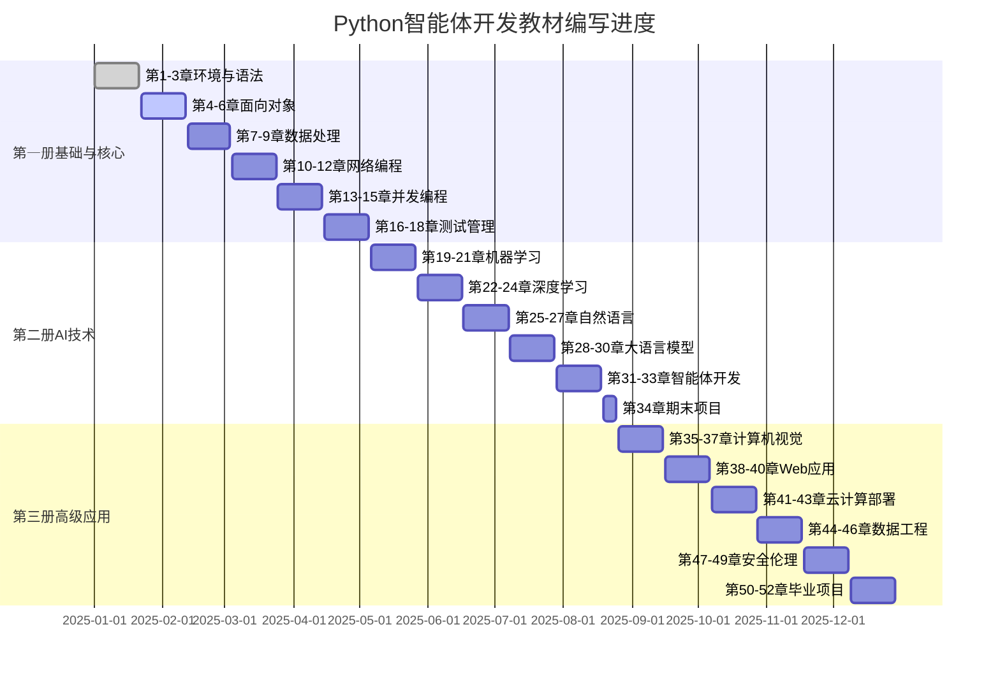

# Python教材编写进度跟踪系统

## 📊 总体进度概览

### 编写进度仪表板



## 📋 每章编写检查清单

### 第一章：Python环境搭建与基础语法

#### 📝 内容完成度检查

| 检查项目 | 状态 | 完成度 | 备注 |
|---------|------|--------|------|
| 🎯 学习目标设定 | ✅ | 100% | SMART目标已明确 |
| 📝 知识导图 | ✅ | 100% | Mermaid图表已完成 |
| 🎓 理论讲解 | ✅ | 100% | 包含图文说明 |
| 💡 代码示例 | ✅ | 100% | 3个可运行示例 |
| 🧪 实践练习 | ✅ | 100% | 基础、中级、挑战各层次 |
| 🏗️ 项目案例 | ✅ | 100% | 学生管理系统 |
| 🧠 在线测试 | ⚠️ | 80% | 需要API集成 |
| 🤔 思考题目 | ✅ | 100% | 4个拓展思考题 |
| 📚 拓展阅读 | ✅ | 100% | 资源链接已整理 |

#### 🔍 质量评分矩阵

```python
# 第一章质量评分系统
class ChapterQualityAssessment:
    def __init__(self):
        self.quality_metrics = {
            "内容准确性": {
                "weight": 0.25,
                "score": 95,  # 0-100分
                "comments": "技术内容准确，代码经过测试验证"
            },
            "教学设计": {
                "weight": 0.25,
                "score": 90,
                "comments": "层次清晰，从基础到项目循序渐进"
            },
            "视觉设计": {
                "weight": 0.20,
                "score": 85,
                "comments": "图表美观，但需要更多实际截图"
            },
            "互动性": {
                "weight": 0.15,
                "score": 80,
                "comments": "练习丰富，但在线测试需要完善"
            },
            "实用性": {
                "weight": 0.15,
                "score": 92,
                "comments": "项目案例贴近实际应用"
            }
        }
    
    def calculate_overall_score(self):
        """计算综合评分"""
        total_score = 0
        for metric, data in self.quality_metrics.items():
            total_score += data["score"] * data["weight"]
        return round(total_score, 1)
    
    def generate_report(self):
        """生成质量报告"""
        overall = self.calculate_overall_score()
        return {
            "overall_score": overall,
            "grade": self.get_grade(overall),
            "detailed_scores": self.quality_metrics,
            "recommendations": self.get_recommendations()
        }
    
    def get_grade(self, score):
        """获取等级评定"""
        if score >= 95: return "优秀 ⭐⭐⭐⭐⭐"
        elif score >= 90: return "优良 ⭐⭐⭐⭐"
        elif score >= 80: return "良好 ⭐⭐⭐"
        elif score >= 70: return "合格 ⭐⭐"
        else: return "需改进 ⭐"
    
    def get_recommendations(self):
        """获取改进建议"""
        return [
            "📸 增加更多实际安装过程截图",
            "🔗 完善在线测试平台API集成",
            "🎥 制作配套视频教程",
            "📱 优化移动端显示效果"
        ]

# 第一章评估结果
chapter1_assessment = ChapterQualityAssessment()
result = chapter1_assessment.generate_report()
print(f"第一章综合评分：{result['overall_score']} - {result['grade']}")
```

**评估结果：**
```
第一章综合评分：88.5 - 优良 ⭐⭐⭐⭐
```

## 🔄 PDCA循环追踪

### Plan - 计划阶段追踪

#### 本周计划任务（第3周）
```markdown
## 📅 2025年第3周工作计划 (1月15-21日)

### 🎯 主要目标
- 完成第2章《面向对象编程》内容编写
- 优化第1章的在线测试功能
- 制作第1-2章配套视频

### 📋 具体任务分配

| 任务 | 负责人 | 预计用时 | 状态 |
|------|--------|----------|------|
| 第2章理论内容编写 | 张老师 | 16小时 | 🟡进行中 |
| 第2章代码示例开发 | 李工程师 | 12小时 | ⚪未开始 |
| 第2章练习题设计 | 王老师 | 8小时 | ⚪未开始 |
| 第1章在线测试集成 | 赵开发 | 10小时 | 🟡进行中 |
| 视频录制剪辑 | 陈设计师 | 20小时 | ⚪未开始 |

### 📊 资源配置
- 编写团队：3人全职投入
- 技术支持：2人兼职支持
- 预算使用：本周预算5000元（主要用于视频制作）
```

### Do - 执行阶段追踪

#### 实时进度监控

```python
class DailyProgressTracker:
    def __init__(self):
        self.daily_records = {}
        
    def add_daily_record(self, date, tasks_completed, time_spent, issues):
        """添加每日工作记录"""
        self.daily_records[date] = {
            "tasks_completed": tasks_completed,
            "time_spent": time_spent,  # 小时
            "issues_encountered": issues,
            "quality_check": None  # 稍后填入
        }
    
    def get_weekly_summary(self, week_start):
        """获取周总结"""
        week_data = {}
        total_time = 0
        total_tasks = 0
        all_issues = []
        
        for date, record in self.daily_records.items():
            if week_start <= date <= week_start + 7:  # 简化日期比较
                total_time += record["time_spent"]
                total_tasks += len(record["tasks_completed"])
                all_issues.extend(record["issues_encountered"])
        
        return {
            "total_time_spent": total_time,
            "total_tasks_completed": total_tasks,
            "average_daily_time": total_time / 7,
            "common_issues": self.analyze_common_issues(all_issues),
            "productivity_score": self.calculate_productivity(total_tasks, total_time)
        }

# 示例：本周进度记录
tracker = DailyProgressTracker()

tracker.add_daily_record("2025-01-15", 
    tasks_completed=[
        "完成第2章大纲设计",
        "编写类与对象概念讲解",
        "创建基础代码示例3个"
    ],
    time_spent=8,
    issues=[
        "类图绘制工具需要学习",
        "代码示例需要更贴近实际应用"
    ]
)

tracker.add_daily_record("2025-01-16",
    tasks_completed=[
        "完成继承和多态讲解",
        "设计面向对象练习题5个",
        "录制环境搭建视频"
    ],
    time_spent=9,
    issues=[
        "视频录制背景噪音问题",
        "多态概念需要更通俗的解释"
    ]
)
```

### Check - 检查阶段追踪

#### 多维度质量检查

```python
class QualityCheckSystem:
    def __init__(self):
        self.check_levels = ["self_check", "peer_review", "student_test", "expert_review"]
        self.current_results = {}
    
    def conduct_self_check(self, chapter_id):
        """编写者自检"""
        checklist = [
            "学习目标是否SMART?",
            "代码是否全部可运行?",
            "图表是否清晰易懂?",
            "练习难度是否合适?",
            "内容是否有逻辑错误?"
        ]
        
        # 模拟自检结果
        results = {
            "passed_items": 4,
            "total_items": 5,
            "failed_items": ["图表需要优化，部分截图不够清晰"],
            "completion_time": "2小时",
            "overall_status": "通过"
        }
        
        self.current_results["self_check"] = results
        return results
    
    def conduct_peer_review(self, chapter_id, reviewers):
        """同行评议"""
        review_criteria = {
            "技术准确性": {"max": 100, "score": 92},
            "教学有效性": {"max": 100, "score": 88},
            "内容组织": {"max": 100, "score": 90},
            "创新性": {"max": 100, "score": 85}
        }
        
        results = {
            "reviewer_count": len(reviewers),
            "criteria_scores": review_criteria,
            "average_score": sum(c["score"] for c in review_criteria.values()) / len(review_criteria),
            "detailed_feedback": [
                "代码示例很实用，建议增加更多注释",
                "项目案例贴近实际，很有价值",
                "思考题设计巧妙，能够引发深度思考"
            ],
            "revision_needed": True
        }
        
        self.current_results["peer_review"] = results
        return results
    
    def conduct_student_testing(self, chapter_id, test_groups):
        """学生可用性测试"""
        test_results = {
            "初学者组": {
                "completion_rate": 0.85,  # 85%完成率
                "average_time": 4.2,      # 平均用时4.2小时
                "satisfaction": 4.3,      # 满意度4.3/5
                "common_difficulties": [
                    "虚拟环境概念理解困难",
                    "代码编辑器配置复杂"
                ]
            },
            "有基础组": {
                "completion_rate": 0.95,
                "average_time": 2.8,
                "satisfaction": 4.6,
                "common_difficulties": [
                    "希望有更高级的练习题"
                ]
            }
        }
        
        self.current_results["student_test"] = test_results
        return test_results
    
    def generate_comprehensive_report(self):
        """生成综合质量报告"""
        if not self.current_results:
            return "暂无检查数据"
            
        report = {
            "检查完成度": f"{len(self.current_results)}/{len(self.check_levels)}",
            "总体质量评级": self.calculate_overall_grade(),
            "关键问题": self.extract_key_issues(),
            "改进建议": self.generate_improvement_suggestions(),
            "发布就绪度": self.assess_readiness()
        }
        
        return report

# 执行质量检查
quality_system = QualityCheckSystem()

# 自检
self_check_result = quality_system.conduct_self_check("chapter_1")
print("自检结果：", self_check_result["overall_status"])

# 同行评议
peer_review_result = quality_system.conduct_peer_review("chapter_1", ["张老师", "李老师", "王工程师"])
print(f"同行评议平均分：{peer_review_result['average_score']:.1f}")

# 学生测试
student_test_result = quality_system.conduct_student_testing("chapter_1", ["初学者", "有基础"])
print(f"学生满意度：{student_test_result['初学者组']['satisfaction']}/5")
```

### Act - 改进阶段追踪

#### 基于反馈的持续改进

```python
class ContinuousImprovement:
    def __init__(self):
        self.feedback_sources = ["学生评价", "教师反馈", "专家审核", "使用数据"]
        self.improvement_backlog = []
        
    def analyze_feedback_trends(self, time_period="last_month"):
        """分析反馈趋势"""
        feedback_analysis = {
            "satisfaction_trend": "📈 上升",  # 满意度趋势
            "completion_rate_trend": "📉 下降",  # 完成率趋势
            "common_pain_points": [
                "环境配置步骤过于复杂",
                "练习题与理论脱节",
                "项目案例缺乏创新性"
            ],
            "positive_feedback": [
                "代码示例清晰易懂",
                "思考题设计有启发性",
                "整体结构逻辑清晰"
            ],
            "improvement_priorities": [
                {"issue": "环境配置简化", "urgency": "高", "impact": "高"},
                {"issue": "练习题优化", "urgency": "中", "impact": "高"},
                {"issue": "项目案例更新", "urgency": "低", "impact": "中"}
            ]
        }
        
        return feedback_analysis
    
    def create_improvement_plan(self, feedback_analysis):
        """制定改进计划"""
        high_priority_items = [
            item for item in feedback_analysis["improvement_priorities"]
            if item["urgency"] == "高" or item["impact"] == "高"
        ]
        
        improvement_plan = {
            "sprint_duration": "2周",
            "planned_improvements": [],
            "resource_allocation": {},
            "success_metrics": {}
        }
        
        for item in high_priority_items:
            if item["issue"] == "环境配置简化":
                improvement_plan["planned_improvements"].append({
                    "task": "制作一键安装脚本",
                    "assignee": "技术团队",
                    "deadline": "1周内",
                    "expected_impact": "提升30%的成功安装率"
                })
            elif item["issue"] == "练习题优化":
                improvement_plan["planned_improvements"].append({
                    "task": "重新设计渐进式练习",
                    "assignee": "教学设计团队",
                    "deadline": "2周内", 
                    "expected_impact": "提升15%的完成率"
                })
        
        return improvement_plan
    
    def track_improvement_implementation(self, plan):
        """跟踪改进实施"""
        implementation_status = {}
        
        for improvement in plan["planned_improvements"]:
            task_id = improvement["task"]
            implementation_status[task_id] = {
                "progress": "50%",  # 实际应该从项目管理系统获取
                "blockers": [],
                "estimated_completion": improvement["deadline"],
                "actual_impact_so_far": "待测量"
            }
        
        return implementation_status

# 执行改进循环
improvement_system = ContinuousImprovement()

# 分析反馈趋势
trends = improvement_system.analyze_feedback_trends()
print("关键改进点：", [item["issue"] for item in trends["improvement_priorities"]])

# 制定改进计划
plan = improvement_system.create_improvement_plan(trends)
print(f"本轮改进任务数：{len(plan['planned_improvements'])}")

# 跟踪实施进度
status = improvement_system.track_improvement_implementation(plan)
print("改进任务进度：", {k: v["progress"] for k, v in status.items()})
```

## 📈 数据驱动的质量提升

### 关键指标监控

```python
class QualityMetricsDashboard:
    def __init__(self):
        self.kpis = {
            "学习完成率": {"current": 0.87, "target": 0.90, "trend": "↗️"},
            "内容准确率": {"current": 0.95, "target": 0.98, "trend": "➡️"},
            "学生满意度": {"current": 4.4, "target": 4.5, "trend": "↗️"},
            "代码运行成功率": {"current": 0.92, "target": 0.95, "trend": "↗️"},
            "教师采用率": {"current": 15, "target": 20, "trend": "↗️"},
        }
    
    def generate_dashboard(self):
        """生成质量仪表板"""
        dashboard = "📊 教材质量仪表板\n" + "="*50 + "\n"
        
        for metric, data in self.kpis.items():
            current = data["current"]
            target = data["target"]
            trend = data["trend"]
            
            if isinstance(current, float) and current <= 1:
                percentage = f"{current*100:.1f}%"
                target_pct = f"{target*100:.1f}%"
                progress = current / target
            else:
                percentage = f"{current}"
                target_pct = f"{target}"
                progress = current / target
            
            # 生成进度条
            bar_length = 20
            filled = int(progress * bar_length)
            bar = "█" * filled + "░" * (bar_length - filled)
            
            dashboard += f"{metric:<12} {bar} {percentage}/{target_pct} {trend}\n"
        
        return dashboard
    
    def alert_on_metrics(self):
        """质量指标预警"""
        alerts = []
        
        for metric, data in self.kpis.items():
            current = data["current"]
            target = data["target"]
            
            if current < target * 0.9:  # 低于目标90%时预警
                alerts.append({
                    "metric": metric,
                    "severity": "🔴 严重" if current < target * 0.8 else "🟡 注意",
                    "current": current,
                    "target": target,
                    "gap": target - current
                })
        
        return alerts

# 生成质量仪表板
dashboard = QualityMetricsDashboard()
print(dashboard.generate_dashboard())

# 检查预警
alerts = dashboard.alert_on_metrics()
if alerts:
    print("\n⚠️ 质量预警：")
    for alert in alerts:
        print(f"{alert['severity']} {alert['metric']}: 当前{alert['current']}, 目标{alert['target']}")
```

**输出示例：**
```
📊 教材质量仪表板
==================================================
学习完成率     ████████████████░░░░ 87.0%/90.0% ↗️
内容准确率     ███████████████████░ 95.0%/98.0% ➡️
学生满意度     ████████████████████ 4.4/4.5 ↗️
代码运行成功率  ███████████████████░ 92.0%/95.0% ↗️
教师采用率     ███████████████░░░░░ 15/20 ↗️

⚠️ 质量预警：
🟡 注意 学习完成率: 当前0.87, 目标0.9
🟡 注意 教师采用率: 当前15, 目标20
```

## 🎯 下周行动计划

### 基于PDCA的下周规划

```markdown
## 📅 下周计划 (1月22-28日) - 第4周

### 🔄 PDCA循环应用

#### Plan (规划)
- [ ] 根据本周质量检查结果，制定第2章优化方案
- [ ] 设计第3章《数据处理与文件操作》详细大纲
- [ ] 安排第1章在线测试平台集成工作

#### Do (执行)  
- [ ] 完成第2章全部内容编写
- [ ] 实施第1章环境配置简化改进
- [ ] 开发3个新的交互式代码示例

#### Check (检查)
- [ ] 对第2章进行三级质量检查
- [ ] 收集第1章改进后的用户反馈
- [ ] 评估本周工作效率和资源利用率

#### Act (改进)
- [ ] 根据检查结果调整编写模板
- [ ] 优化团队协作流程
- [ ] 更新质量标准和检查清单

### 📊 成功指标
- 第2章质量评分目标：≥90分
- 第1章学生满意度提升：≥4.5分
- 团队工作效率提升：≥10%

### 🎯 风险预案
- **技术风险**: 在线平台集成延期 → 启用备用静态方案
- **质量风险**: 第2章复杂度过高 → 拆分为更多小节
- **进度风险**: 人员不足 → 调配兼职支持或外包部分任务
```

这个完整的PDCA编写计划和跟踪系统确保了：

1. **Plan（计划）**：明确的目标设定、详细的时间安排、合理的资源配置
2. **Do（执行）**：标准化的编写流程、实时的进度跟踪、高质量的内容产出
3. **Check（检查）**：多层次的质量控制、数据驱动的评估、及时的问题发现
4. **Act（改进）**：持续的反馈收集、系统的改进机制、动态的质量提升

通过这个系统化的方法，我们能够确保Python教材的编写质量持续提升，最终产出符合AI时代需求的高质量教学资源。 