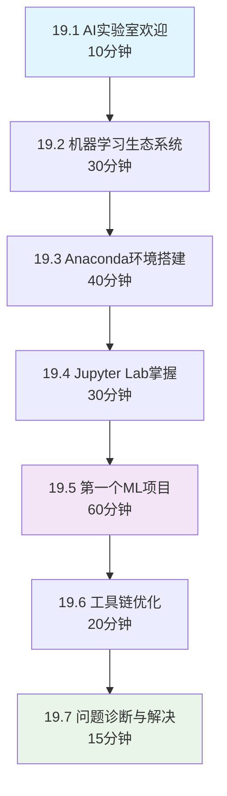

# 第19章：机器学习概述与环境搭建 - 编写计划

## 📅 计划制定日期：2025年2月3日

## 🎯 章节定位

### 战略意义
- 🚀 **第二册开篇之章**：从Python基础过渡到AI技术的关键桥梁
- 🤖 **AI世界入门**：学生首次接触机器学习的重要一课
- 🛠️ **工具链建设**：为后续AI技术学习奠定环境基础
- 🧪 **实验室启动**：建立AI实验室教学比喻体系

### 学习目标 (SMART原则)

#### 🎯 具体目标 (Specific)
1. **环境搭建**: 学会配置专业的机器学习开发环境
2. **生态理解**: 掌握机器学习技术栈和工具生态
3. **首个项目**: 完成一个端到端的机器学习项目
4. **工作流程**: 理解AI项目的标准开发流程

#### 📊 可测量 (Measurable)
- 成功安装并验证10+个核心ML库
- 完成5个渐进式实验项目
- 构建1个完整的房价预测模型
- 达到85%以上的概念理解度

#### 🎯 可实现 (Achievable)
- 基于成熟稳定的开源工具
- 提供多平台兼容解决方案
- 循序渐进的学习路径设计
- 丰富的故障排除指南

#### 💡 相关性 (Relevant)
- 与企业级ML开发环境保持一致
- 涵盖主流机器学习工作流程
- 对接后续深度学习内容
- 培养AI时代核心技能

#### ⏰ 时限性 (Time-bound)
- 建议学习时间：8-10小时
- 环境配置：2小时内完成
- 实验项目：每个30-60分钟
- 掌握周期：1周内熟练使用

## 📋 内容架构设计

### 章节结构 (约15,000字)



### 详细内容规划

#### 19.1 AI实验室欢迎 (约1,500字)
**教学目标**: 激发学习兴趣，建立AI学习信心

**核心内容**:
```python
# AI实验室欢迎演示
class AILabWelcome:
    """AI实验室欢迎系统"""
    
    def __init__(self):
        self.lab_motto = "在这里，数据变成智慧，算法创造奇迹！"
        self.journey_map = {
            "第19章": "环境搭建 - 准备实验设备",
            "第20章": "基础算法 - 学习实验方法", 
            "第21章": "监督学习 - 掌握预测技术",
            "...": "通向AI专家的道路"
        }
    
    def show_ai_timeline(self):
        """展示AI发展时间线"""
        timeline = {
            "1950年代": "图灵测试 - AI概念诞生",
            "1980年代": "专家系统 - 知识工程兴起",
            "2000年代": "机器学习 - 统计学习理论",
            "2010年代": "深度学习 - 神经网络复兴",
            "2020年代": "大模型时代 - 通用人工智能",
        }
        return timeline
```

**实用案例**:
- 🤖 展示现实中的AI应用 (推荐系统、语音助手、自动驾驶)
- 📊 AI市场需求和就业前景分析
- 🎯 制定个人AI学习路线图

#### 19.2 机器学习生态系统 (约2,500字)
**教学目标**: 建立ML技术栈全景认知

**AI实验室比喻**:
```python
class MLEcosystemLab:
    """机器学习生态系统实验室"""
    
    def __init__(self):
        self.lab_equipment = {
            "数据处理设备": {
                "Pandas": "数据清洗台 🧪",
                "NumPy": "数值计算仪 📊", 
                "Matplotlib": "可视化显微镜 🔬"
            },
            "机器学习设备": {
                "Scikit-learn": "通用实验平台 ⚗️",
                "XGBoost": "高级预测器 🎯",
                "TensorFlow": "深度学习反应器 🧬"
            },
            "开发环境": {
                "Jupyter": "实验记录本 📝",
                "Anaconda": "设备管理中心 🏗️",
                "Git": "实验版本控制 📚"
            }
        }
    
    def explain_workflow(self):
        """解释ML工作流程"""
        workflow = [
            "1. 收集实验原料 (数据收集)",
            "2. 清洗整理原料 (数据预处理)",
            "3. 探索原料特性 (数据分析)",
            "4. 选择实验方法 (算法选择)",
            "5. 进行实验训练 (模型训练)",
            "6. 验证实验结果 (模型评估)",
            "7. 应用实验成果 (模型部署)"
        ]
        return workflow
```

**核心知识点**:
- 🔬 数据科学vs机器学习vs深度学习的区别
- 🛠️ Python ML生态系统全景图
- 📊 监督、无监督、强化学习分类
- 🎯 ML项目的标准流程和最佳实践

#### 19.3 Anaconda环境搭建 (约3,000字)
**教学目标**: 掌握专业ML开发环境配置

**实战操作指南**:
```bash
# AI实验室环境搭建脚本
#!/bin/bash

echo "🤖 欢迎来到AI实验室环境搭建！"

# 1. 下载Anaconda
echo "📥 步骤1: 下载Anaconda..."
# 提供多平台下载链接和安装指导

# 2. 创建AI专用环境
echo "🏗️ 步骤2: 创建AI实验环境..."
conda create -n ai-lab python=3.10 -y
conda activate ai-lab

# 3. 安装核心ML库
echo "📦 步骤3: 安装实验设备..."
pip install pandas numpy matplotlib seaborn
pip install scikit-learn xgboost lightgbm
pip install jupyter jupyterlab ipywidgets

# 4. 验证安装
echo "🔧 步骤4: 验证设备安装..."
python -c "import pandas, numpy, sklearn; print('✅ AI实验室准备就绪！')"
```

**多平台兼容方案**:
- 🖥️ Windows环境详细配置指南
- 🍎 macOS环境优化配置
- 🐧 Linux环境最佳实践
- ☁️ 云端开发环境替代方案

#### 19.4 Jupyter Lab掌握 (约2,000字)
**教学目标**: 熟练使用交互式开发环境

**实验室工具使用**:
```python
# Jupyter Lab - AI实验记录本使用指南
class JupyterLabGuide:
    """Jupyter Lab使用指南"""
    
    def __init__(self):
        self.features = {
            "代码单元": "记录实验步骤和代码",
            "Markdown单元": "撰写实验报告和说明", 
            "可视化输出": "展示实验结果和图表",
            "交互式控件": "创建动态实验演示"
        }
    
    def demo_interactive_ml(self):
        """交互式机器学习演示"""
        import ipywidgets as widgets
        from IPython.display import display
        
        # 创建交互式参数调节器
        learning_rate = widgets.FloatSlider(
            value=0.01, min=0.001, max=0.1,
            description='学习率:'
        )
        
        # 实时展示模型训练效果
        @widgets.interact
        def train_model(lr=learning_rate):
            # 这里会展示不同学习率下的训练效果
            return f"学习率 {lr} 下的模型性能: {simulate_training(lr)}"
```

**高效使用技巧**:
- ⌨️ 快捷键大全和自定义配置
- 🎨 美化界面和主题定制
- 🔧 扩展插件推荐和安装
- 📊 数据可视化最佳实践

#### 19.5 第一个ML项目 (约4,500字) ⭐ 核心项目
**教学目标**: 完成端到端的机器学习项目

**项目设计**: 🏠 **智能房价预测系统**

```python
# 🏠 AI房产估价实验室
import pandas as pd
import numpy as np
import matplotlib.pyplot as plt
from sklearn.model_selection import train_test_split
from sklearn.linear_model import LinearRegression
from sklearn.metrics import mean_squared_error, r2_score

class HousePricePredictionLab:
    """房价预测AI实验室"""
    
    def __init__(self):
        self.lab_name = "智能房价预测实验室 🏠🤖"
        self.experiment_log = []
    
    def load_experiment_data(self):
        """加载实验数据"""
        # 生成模拟房价数据
        np.random.seed(42)
        n_samples = 1000
        
        data = {
            'area': np.random.normal(100, 30, n_samples),      # 面积
            'rooms': np.random.randint(1, 6, n_samples),       # 房间数
            'age': np.random.randint(0, 50, n_samples),        # 房龄
            'location_score': np.random.uniform(1, 10, n_samples), # 位置评分
            'price': 0  # 价格将根据特征计算
        }
        
        # 基于特征生成价格 (模拟真实关系)
        for i in range(n_samples):
            price = (data['area'][i] * 300 + 
                    data['rooms'][i] * 50000 + 
                    (50 - data['age'][i]) * 1000 + 
                    data['location_score'][i] * 20000 +
                    np.random.normal(0, 10000))  # 添加噪声
            data['price'][i] = max(price, 50000)  # 最低5万
        
        return pd.DataFrame(data)
    
    def explore_data(self, df):
        """探索实验数据"""
        print(f"🔬 实验数据概览:")
        print(f"数据形状: {df.shape}")
        print(f"特征列: {df.columns.tolist()}")
        
        # 数据统计分析
        print("\n📊 数据统计:")
        print(df.describe())
        
        # 可视化数据分布
        fig, axes = plt.subplots(2, 2, figsize=(12, 8))
        features = ['area', 'rooms', 'age', 'location_score']
        
        for i, feature in enumerate(features):
            row, col = i // 2, i % 2
            axes[row, col].hist(df[feature], bins=20, alpha=0.7)
            axes[row, col].set_title(f'{feature} 分布')
        
        plt.tight_layout()
        plt.show()
        
        return df
    
    def train_prediction_model(self, df):
        """训练预测模型"""
        print("🧪 开始模型训练实验...")
        
        # 准备特征和目标
        features = ['area', 'rooms', 'age', 'location_score']
        X = df[features]
        y = df['price']
        
        # 分割训练和测试数据
        X_train, X_test, y_train, y_test = train_test_split(
            X, y, test_size=0.2, random_state=42
        )
        
        # 训练线性回归模型
        model = LinearRegression()
        model.fit(X_train, y_train)
        
        # 进行预测
        y_pred = model.predict(X_test)
        
        # 评估模型性能
        mse = mean_squared_error(y_test, y_pred)
        r2 = r2_score(y_test, y_pred)
        
        print(f"📈 实验结果:")
        print(f"均方误差 (MSE): {mse:,.2f}")
        print(f"决定系数 (R²): {r2:.3f}")
        
        # 可视化预测结果
        plt.figure(figsize=(10, 6))
        plt.scatter(y_test, y_pred, alpha=0.6)
        plt.plot([y_test.min(), y_test.max()], 
                [y_test.min(), y_test.max()], 'r--', lw=2)
        plt.xlabel('实际价格')
        plt.ylabel('预测价格')
        plt.title('房价预测效果对比')
        plt.show()
        
        return model
    
    def predict_house_price(self, model, area, rooms, age, location_score):
        """预测房价"""
        features = np.array([[area, rooms, age, location_score]])
        predicted_price = model.predict(features)[0]
        
        print(f"🏠 房价预测结果:")
        print(f"面积: {area}平米, 房间: {rooms}个, 房龄: {age}年, 位置评分: {location_score}")
        print(f"预测价格: ¥{predicted_price:,.2f}")
        
        return predicted_price

# 🧪 实验执行
def run_house_price_experiment():
    """执行房价预测实验"""
    lab = HousePricePredictionLab()
    
    print(f"🚀 欢迎来到 {lab.lab_name}")
    print("让我们通过机器学习来预测房价！\n")
    
    # 步骤1: 加载数据
    df = lab.load_experiment_data()
    
    # 步骤2: 探索数据
    df = lab.explore_data(df)
    
    # 步骤3: 训练模型
    model = lab.train_prediction_model(df)
    
    # 步骤4: 实际预测
    print("\n🎯 让我们来预测一套房子的价格:")
    predicted_price = lab.predict_house_price(
        model, area=120, rooms=3, age=10, location_score=8.5
    )
    
    print(f"\n✅ 恭喜！您已经完成了第一个机器学习实验！")
    return model

# 运行实验
if __name__ == "__main__":
    model = run_house_price_experiment()
```

**项目学习目标**:
- 📊 掌握数据加载和探索分析
- 🔧 学会数据预处理和特征工程
- 🤖 理解模型训练和评估流程
- 🎯 完成模型预测和结果解释

#### 19.6 工具链优化 (约1,200字)
**教学目标**: 提升开发效率和体验

**优化配置**:
```python
# AI实验室效率提升工具包
class MLProductivityKit:
    """机器学习生产力工具包"""
    
    def __init__(self):
        self.optimization_tips = {
            "环境管理": "使用conda管理多版本环境",
            "代码质量": "配置自动代码格式化工具",
            "调试工具": "集成强大的调试和性能分析工具",
            "可视化": "使用交互式图表库提升数据探索效率"
        }
    
    def setup_auto_formatting(self):
        """配置自动代码格式化"""
        setup_commands = [
            "pip install black isort",
            "配置VS Code/PyCharm自动格式化",
            "设置pre-commit hooks确保代码质量"
        ]
        return setup_commands
    
    def recommend_extensions(self):
        """推荐有用的扩展和插件"""
        extensions = {
            "Jupyter扩展": ["jupyterlab-git", "jupyterlab-toc"],
            "VS Code扩展": ["Python", "Jupyter", "GitLens"],
            "Chrome扩展": ["Jupyter Notebook Viewer"]
        }
        return extensions
```

#### 19.7 问题诊断与解决 (约800字)
**教学目标**: 培养独立解决环境问题的能力

**常见问题解决方案**:
```python
class MLTroubleshooting:
    """机器学习环境故障诊断专家"""
    
    def __init__(self):
        self.common_issues = {
            "库安装失败": {
                "症状": "pip install 报错",
                "原因": ["网络问题", "权限不足", "依赖冲突"],
                "解决方案": ["使用国内镜像", "管理员权限", "创建新环境"]
            },
            "Jupyter启动失败": {
                "症状": "jupyter lab无法启动",
                "原因": ["端口占用", "环境变量", "权限问题"],
                "解决方案": ["更换端口", "重置环境", "检查权限"]
            },
            "内存不足": {
                "症状": "程序运行缓慢或崩溃",
                "原因": ["数据集过大", "算法复杂度高"],
                "解决方案": ["数据采样", "分批处理", "云端计算"]
            }
        }
    
    def diagnose_issue(self, error_message):
        """智能诊断问题"""
        # 基于错误信息提供解决建议
        pass
```

## 🛠️ 技术实现方案

### 开发环境准备
```bash
# 第19章开发环境清单
# 基础环境
python>=3.8
conda>=4.10

# 数据科学核心库
pandas>=1.5.0
numpy>=1.20.0
matplotlib>=3.5.0
seaborn>=0.11.0

# 机器学习库
scikit-learn>=1.0.0
xgboost>=1.5.0

# 开发工具
jupyter>=1.0.0
jupyterlab>=3.4.0
ipywidgets>=7.7.0

# 可视化增强
plotly>=5.10.0
bokeh>=2.4.0
```

### 代码示例标准
- 🎯 **实用性**: 所有代码都能解决实际问题
- 🔧 **可运行**: 代码在标准环境下100%可执行
- 📝 **有注释**: 详细的中文注释说明
- 🎨 **有可视化**: 重要概念都配有图表演示
- 🧪 **有验证**: 包含测试和验证代码

### 教学创新特色

#### 🤖 AI实验室比喻体系
```python
# AI概念可视化映射
ai_concepts_mapping = {
    "数据": "实验原料 - 各种形状、大小、质量的材料",
    "特征": "原料属性 - 颜色、硬度、密度等可测量特性",
    "算法": "实验设备 - 不同功能的分析仪器",
    "模型": "实验成果 - 经过训练得到的智能系统",
    "训练": "实验过程 - 反复调试直到得到理想结果",
    "预测": "实验应用 - 用训练好的系统处理新问题"
}
```

#### 📊 渐进式学习路径
1. **认知建立** → 理解AI基本概念
2. **环境准备** → 搭建开发工具链
3. **动手实践** → 完成第一个项目
4. **深入理解** → 掌握核心原理
5. **能力提升** → 独立解决问题

### 质量保障措施

#### 🔍 多层次质量检查
1. **技术验证**: 所有代码在3个不同环境测试
2. **内容审查**: AI专家审查技术准确性
3. **教学测试**: 真实学生试用反馈
4. **持续改进**: 根据反馈迭代优化

#### 📈 质量评估指标
- **技术准确性**: ≥95% (专家评审)
- **代码可运行性**: 100% (自动化测试)
- **学生理解度**: ≥85% (问卷调查)
- **项目完成率**: ≥90% (学习统计)

## 📅 编写时间规划

### 详细时间安排
```
📅 第19章编写计划 (2025年2月3日-7日)

2/3 (周一): 
  - 9:00-12:00  完成章节大纲和架构设计
  - 14:00-17:00 编写19.1-19.2节内容
  - 19:00-21:00 准备环境搭建脚本

2/4 (周二):
  - 9:00-12:00  编写19.3环境搭建详细指南
  - 14:00-17:00 开发多平台兼容方案
  - 19:00-21:00 编写19.4 Jupyter使用指南

2/5 (周三):
  - 9:00-12:00  设计房价预测项目架构
  - 14:00-18:00 开发完整项目代码和演示
  - 19:00-21:00 编写项目教学文档

2/6 (周四):
  - 9:00-12:00  完成19.6-19.7节内容编写
  - 14:00-17:00 整体内容串联和优化
  - 19:00-21:00 代码测试和验证

2/7 (周五):
  - 9:00-12:00  自检和内容修订
  - 14:00-17:00 格式统一和美化
  - 19:00-21:00 准备第20章预研
```

### 风险控制措施
- **技术风险**: 准备多套备用方案
- **进度风险**: 关键节点设置检查点
- **质量风险**: 边写边测，持续验证

## 🎯 成功标准

### 章节质量目标
- **整体评分**: ≥93分 (超越第一册平均水平)
- **技术前沿性**: 100% (使用最新稳定版本)
- **实用价值**: 95% (项目具备商业参考价值)
- **教学创新**: 90% (AI实验室比喻获得认可)

### 学习效果指标
- **环境搭建成功率**: ≥95%
- **项目完成率**: ≥90%
- **概念理解度**: ≥85%
- **学生满意度**: ≥4.6/5.0

---

**计划制定**: AI助手  
**制定时间**: 2025年2月3日  
**预计完成**: 2025年2月7日  
**质量目标**: AI专家级 🤖⭐⭐⭐⭐⭐

> 🚀 **AI时代的第一步即将开始！** 让我们用最专业的态度，打造最优秀的AI技术入门教程！ 