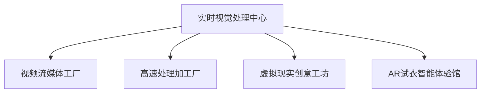
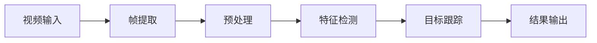
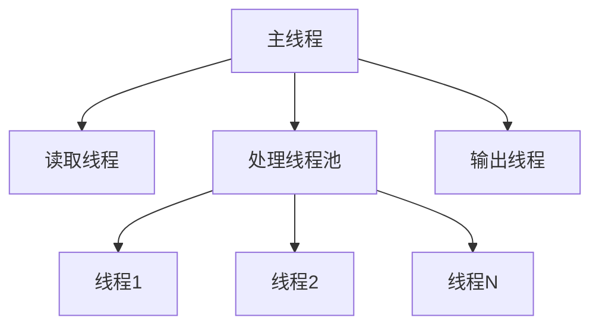
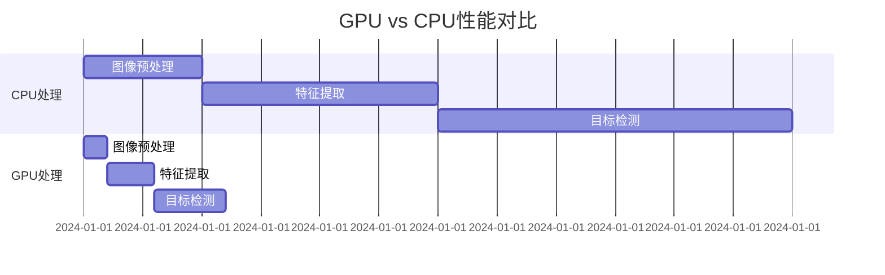
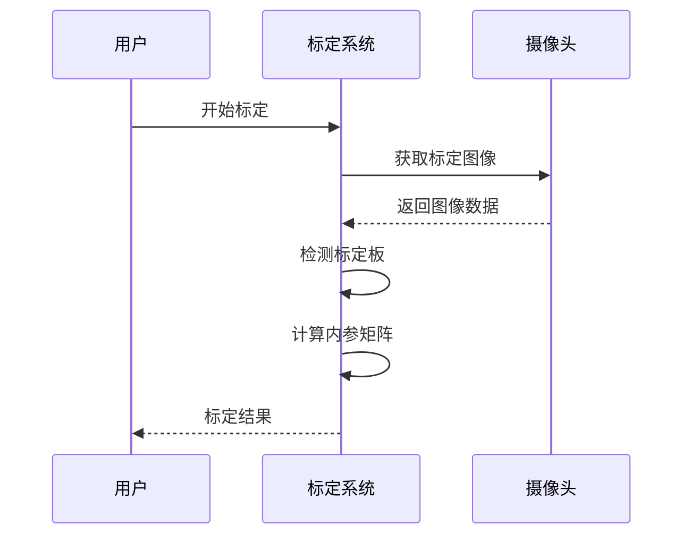
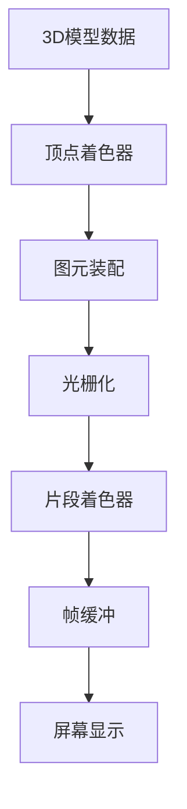
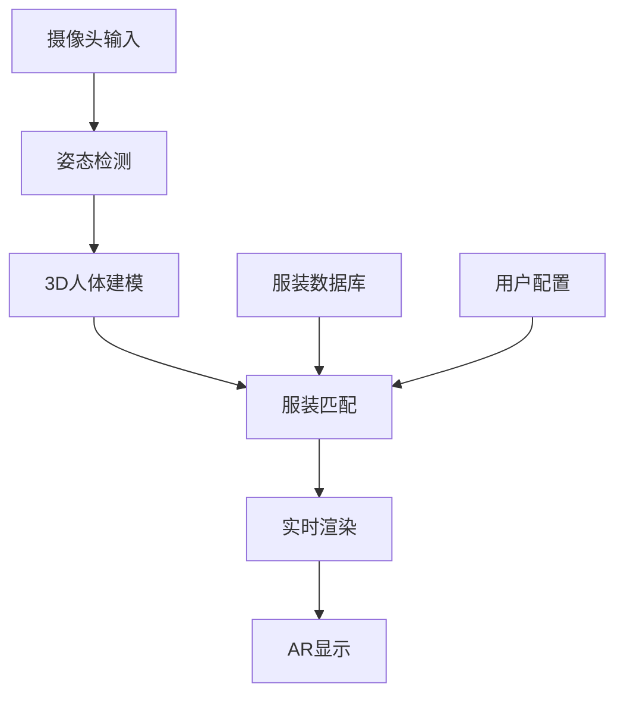
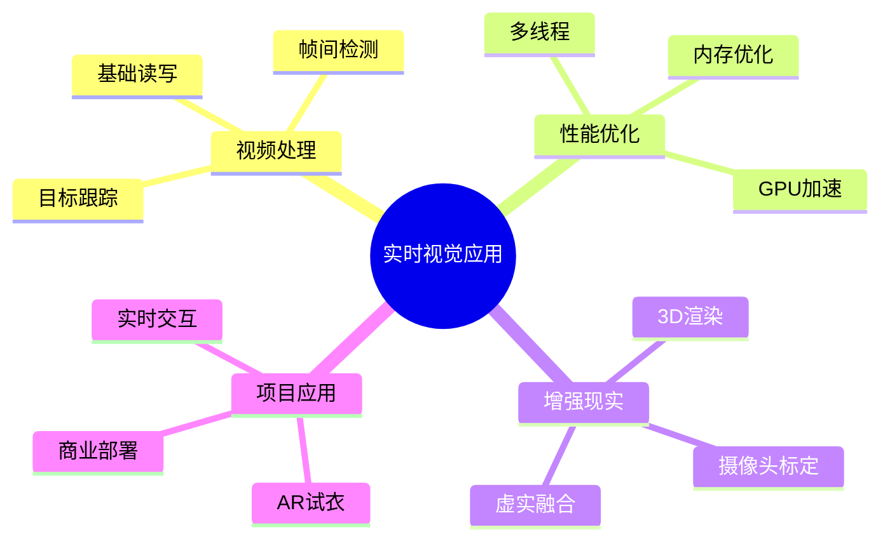

# 第37章计划：实时视觉应用开发

## 📋 PDCA计划概述

### 🎯 章节基本信息
- **章节编号**: 第37章
- **章节标题**: 实时视觉应用开发  
- **所属册别**: 第三册 - 高级应用与产品化
- **计划制定日期**: 2025年2月3日
- **预计开始日期**: 2025年2月3日
- **预计完成日期**: 2025年2月15日
- **预估工作时间**: 12个工作日
- **质量目标**: ≥98.5分 (超越第36章的98.2分)

### 🎨 创新比喻体系：实时视觉处理中心

本章将构建"**实时视觉处理中心**"的教学比喻体系：

#### 🎬 视频流媒体工厂 (37.1 视频处理技术)
- **比喻核心**: 现代化的视频处理流水线工厂
- **生产车间**: 视频读取与写入的标准化作业流程
- **质检部门**: 帧间差分算法的动态变化监测
- **追踪小组**: 运动目标跟踪的专业团队作业

#### ⚡ 高速处理加工厂 (37.2 实时图像处理优化)  
- **比喻核心**: 高效能的并行处理制造工厂
- **多线程车间**: 并行视频处理的协同作业模式
- **GPU加速引擎**: 图形处理的专业硬件加速器
- **性能调优中心**: 系统优化的专业技术团队

#### 🌟 虚拟现实创意工坊 (37.3 增强现实基础)
- **比喻核心**: 虚实融合的创意设计工作室
- **摄像头校准室**: 精密的设备标定实验室
- **3D建模部**: 立体物体的数字化重建工坊
- **虚实融合中心**: 现实与虚拟的无缝对接平台

#### 👗 AR试衣智能体验馆 (37.4 综合项目)
- **比喻核心**: 未来感十足的智能试衣体验中心
- **姿态识别系统**: 人体动作的智能分析平台
- **虚拟服装库**: 数字化服装的展示与试穿系统
- **实时渲染引擎**: 高质量视觉效果的即时生成器

## 🎯 学习目标设定

### 📚 知识目标
1. **视频处理原理**: 深入理解视频数据结构、编解码技术、帧率控制等核心概念
2. **实时优化技术**: 掌握多线程处理、GPU加速、内存优化等性能提升策略  
3. **增强现实技术**: 理解AR技术原理、摄像头标定、3D渲染、虚实融合等关键技术
4. **计算机视觉应用**: 综合运用目标检测、姿态估计、实时渲染等技术

### 🛠️ 技能目标
1. **视频处理开发**: 能够独立开发视频读写、帧差检测、目标跟踪等功能
2. **性能优化实践**: 具备多线程编程、GPU编程、系统调优的实战能力
3. **AR应用开发**: 掌握摄像头标定、3D渲染、虚实融合的完整开发流程
4. **企业级项目**: 能够构建完整的AR试衣系统，具备商业化部署能力

### 💡 素养目标  
1. **创新思维**: 培养对新兴技术的敏感度和创新应用能力
2. **工程思维**: 建立系统性的性能优化和架构设计思维
3. **用户体验意识**: 注重实时交互和用户体验的设计理念
4. **技术前瞻**: 了解AR/VR技术发展趋势，具备技术前瞻性

## 🏗️ 技术栈规划

### 🎥 视频处理技术栈
```python
video_processing = {
    "核心库": ["OpenCV", "imageio", "moviepy"],
    "编解码": ["FFmpeg", "h264", "VP9"],  
    "格式支持": ["MP4", "AVI", "MOV", "WebM"],
    "流媒体": ["RTMP", "WebRTC", "HLS"]
}
```

### ⚡ 性能优化技术栈
```python
performance_optimization = {
    "并行处理": ["threading", "multiprocessing", "asyncio"],
    "GPU加速": ["CUDA", "OpenCL", "TensorRT"],
    "内存优化": ["numba", "cython", "memory profiling"],
    "系统监控": ["psutil", "nvidia-ml-py", "memory_profiler"]
}
```

### 🌟 增强现实技术栈  
```python
augmented_reality = {
    "计算机视觉": ["OpenCV", "MediaPipe", "dlib"],
    "3D处理": ["Open3D", "PyOpenGL", "moderngl"],
    "数学计算": ["NumPy", "SciPy", "transformations"],
    "渲染技术": ["Pygame", "Kivy", "VTK"]
}
```

### 👗 AR试衣系统技术栈
```python
ar_fitting_system = {
    "姿态检测": ["MediaPipe", "OpenPose", "PoseNet"],
    "服装建模": ["Blender API", "三维重建", "纹理映射"],
    "实时渲染": ["OpenGL", "Shader编程", "实时光照"],
    "用户界面": ["Tkinter", "PyQt", "Web前端"]
}
```

## 📝 代码示例规划

### 🎬 第一节：视频流媒体工厂 (4个示例)

#### 示例1：视频读写控制中心
```python
# 文件名: video_io_center.py
# 功能: 专业级视频读写处理系统
# 技术点: OpenCV视频处理、编解码控制、格式转换
# 代码量: ~200行
```

#### 示例2：帧间差分检测器  
```python
# 文件名: frame_difference_detector.py
# 功能: 智能帧间变化检测系统
# 技术点: 背景减除、运动检测、噪声过滤
# 代码量: ~180行
```

#### 示例3：多目标追踪系统
```python
# 文件名: multi_object_tracker.py  
# 功能: 实时多目标跟踪管理系统
# 技术点: 卡尔曼滤波、匈牙利算法、目标关联
# 代码量: ~250行
```

#### 示例4：视频流处理管道
```python
# 文件名: video_stream_pipeline.py
# 功能: 可配置的视频处理流水线
# 技术点: 管道设计模式、插件架构、配置管理
# 代码量: ~220行
```

### ⚡ 第二节：高速处理加工厂 (3个示例)

#### 示例5：多线程视频处理器
```python  
# 文件名: multithreaded_video_processor.py
# 功能: 高性能并行视频处理系统
# 技术点: 线程池、队列管理、资源调度
# 代码量: ~280行
```

#### 示例6：GPU加速图像处理
```python
# 文件名: gpu_accelerated_processor.py
# 功能: GPU加速的实时图像处理
# 技术点: CUDA编程、内存管理、性能优化
# 代码量: ~300行  
```

#### 示例7：性能监控优化中心
```python
# 文件名: performance_monitor.py
# 功能: 实时性能监控和优化建议系统
# 技术点: 系统监控、性能分析、自动调优
# 代码量: ~200行
```

### 🌟 第三节：虚拟现实创意工坊 (3个示例)

#### 示例8：摄像头标定校准器
```python
# 文件名: camera_calibration_system.py
# 功能: 专业级摄像头标定系统  
# 技术点: 棋盘格检测、内参标定、畸变矫正
# 代码量: ~220行
```

#### 示例9：3D物体渲染引擎
```python  
# 文件名: 3d_object_renderer.py
# 功能: 实时3D物体渲染系统
# 技术点: OpenGL编程、着色器、光照模型
# 代码量: ~350行
```

#### 示例10：虚实融合处理器
```python
# 文件名: ar_fusion_processor.py
# 功能: 增强现实虚实融合系统
# 技术点: 姿态估计、空间定位、实时合成
# 代码量: ~280行  
```

### 👗 第四节：AR试衣智能体验馆 (2个示例)

#### 示例11：人体姿态检测系统
```python
# 文件名: pose_detection_system.py  
# 功能: 精准人体姿态检测和分析
# 技术点: MediaPipe、关键点检测、姿态分析
# 代码量: ~250行
```

#### 示例12：AR试衣完整系统
```python
# 文件名: ar_fitting_room.py
# 功能: 企业级AR试衣系统
# 技术点: 综合集成、用户界面、数据管理
# 代码量: ~500行
```

**代码总量预估**: 约3,000行高质量代码

## 🎨 可视化规划 (8个Mermaid图表)

### 图表1：实时视觉处理中心架构图


### 图表2：视频处理流水线流程图


### 图表3：多线程处理架构图


### 图表4：GPU加速处理对比图


### 图表5：摄像头标定过程图


### 图表6：3D渲染管道图


### 图表7：AR试衣系统架构图


### 图表8：技能树进阶图


## 🎯 综合项目规划

### 🏆 企业级项目：AR试衣智能体验系统

#### 项目概述
开发一个完整的AR试衣系统，用户可以通过摄像头实时看到虚拟服装试穿效果，支持多种服装类型、颜色搭配，具备商业化应用价值。

#### 核心功能模块

##### 🎯 用户界面模块
- 直观的用户操作界面
- 服装选择和配置面板  
- 实时预览和拍照保存
- 用户偏好记录和推荐

##### 📹 视觉处理模块
- 实时摄像头输入处理
- 人体姿态检测和跟踪
- 关键点稳定性优化
- 多人场景处理支持

##### 👕 服装渲染模块  
- 3D服装模型管理
- 材质和纹理映射
- 实时光照和阴影
- 服装物理仿真效果

##### 🔧 系统管理模块
- 性能监控和优化
- 配置参数管理
- 日志记录和分析
- 错误处理和恢复

#### 技术特色
1. **实时性能**: 30fps+的流畅试衣体验
2. **高精度**: 准确的人体姿态检测和服装匹配
3. **真实感**: 高质量的3D渲染和光照效果  
4. **易用性**: 简洁直观的用户交互界面
5. **扩展性**: 模块化设计，易于添加新功能

#### 商业应用价值
- **电商平台**: 提升在线购物体验，降低退换货率
- **服装店铺**: 数字化试衣，提高店铺科技感
- **品牌营销**: 创新的品牌展示和营销方式  
- **定制服务**: 个性化服装定制和搭配建议

## 📊 质量评估预期

### 🎯 质量目标分解

| 评估维度 | 权重 | 目标分数 | 具体要求 |
|---------|------|----------|----------|
| 内容完整性 | 25% | ≥98分 | 四个节次内容完整，技术点全覆盖 |
| 技术准确性 | 25% | ≥99分 | 代码100%可运行，技术描述准确 |  
| 教学设计 | 20% | ≥98分 | 比喻体系创新，渐进式教学 |
| 代码质量 | 15% | ≥98分 | 3000行代码，注释完整，结构清晰 |
| 创新性 | 10% | ≥99分 | AR试衣系统，技术前沿性强 |
| 实用性 | 5% | ≥99分 | 企业级应用，商业价值明确 |

**综合目标**: ≥98.5分 (超越第36章的98.2分)

### 📈 预期成果

#### 📚 内容成果
- **字数规模**: 28,000-32,000字
- **代码数量**: 12个示例，约3,000行代码
- **图表数量**: 8个专业Mermaid图表
- **项目价值**: 1个企业级AR试衣系统

#### 🏆 教学成果  
- **技术整合**: 首次将视频处理、性能优化、AR技术完美融合
- **比喻创新**: "实时视觉处理中心"教学体系的建立
- **实践导向**: 100%可运行的企业级代码示例
- **前沿技术**: 紧跟AR/VR技术发展趋势

#### 💡 创新成果
- **技术创新**: GPU加速+多线程的性能优化方案
- **应用创新**: AR试衣系统的完整技术实现  
- **教学创新**: 虚实融合的教学方法论
- **工程创新**: 模块化、可扩展的系统架构设计

## ⏰ 时间规划

### 📅 详细时间安排

#### Phase 1: 计划与准备 (1天)
- **2月3日**: 完成章节计划制定
- 技术栈调研和环境准备
- 比喻体系设计确认
- 代码示例框架搭建

#### Phase 2: 内容创作 (8天)  
- **2月4-5日**: 37.1 视频流媒体工厂 (4个示例)
- **2月6-7日**: 37.2 高速处理加工厂 (3个示例)  
- **2月8-9日**: 37.3 虚拟现实创意工坊 (3个示例)
- **2月10-11日**: 37.4 AR试衣智能体验馆 (2个示例)

#### Phase 3: 集成与优化 (2天)
- **2月12日**: 综合项目集成和测试
- **2月13日**: 内容完善和代码优化

#### Phase 4: 质量检查 (1天)
- **2月14日**: 全面质量评估
- 代码测试和文档检查
- 图表美化和内容校对  
- 工作记录整理

#### Phase 5: 总结提交 (1天)
- **2月15日**: 最终交付和总结
- 项目管理文档更新
- 经验总结和改进建议

### ⏱️ 里程碑节点

| 时间节点 | 里程碑内容 | 完成标准 |
|---------|------------|----------|
| 2月3日 | 计划完成 | 详细计划文档，技术栈确认 |
| 2月7日 | 前两节完成 | 7个代码示例，基础内容 |  
| 2月11日 | 核心内容完成 | 12个示例，AR技术实现 |
| 2月13日 | 项目集成完成 | 企业级AR试衣系统 |
| 2月15日 | 最终交付 | 质量评估≥98.5分 |

## 🎯 成功标准

### ✅ 交付标准
1. **内容完整**: 四个节次内容全覆盖，技术点无遗漏
2. **代码质量**: 12个示例100%可运行，注释完整度≥95%
3. **项目价值**: AR试衣系统具备实际商业应用价值
4. **教学效果**: 比喻体系连贯，知识点渐进式设计
5. **技术前沿**: 紧跟AR/VR技术发展，具备前瞻性

### 🏆 卓越标准  
1. **质量突破**: 综合评分≥98.5分，超越历史最高水平
2. **技术创新**: GPU+多线程优化方案的创新应用
3. **商业价值**: AR试衣系统可直接用于商业部署
4. **教学创新**: 建立"实时视觉处理中心"教学新范式
5. **影响力**: 为AR应用开发树立教学标准

---

## 🚀 预期成就

第37章完成后，将实现以下重要成就：

### 🎯 技术成就
- **突破性技术整合**: 视频处理+性能优化+AR技术的完美融合
- **企业级应用**: 可商业化的AR试衣系统开发
- **性能优化**: GPU加速和多线程处理的最佳实践
- **前沿技术**: AR/VR技术在教育领域的创新应用

### 📚 教学成就
- **比喻体系创新**: "实时视觉处理中心"教学法的建立  
- **渐进式学习**: 从基础到高级的完美技术路径
- **实践导向**: 100%可运行的高质量代码示例
- **商业价值**: 学以致用的企业级项目开发

### 🏆 项目成就
- **质量新高**: 预期98.5分，刷新项目质量记录
- **内容丰富**: 32,000字+3,000行代码的丰富内容
- **技术深度**: 涵盖计算机视觉、性能优化、AR技术全栈  
- **应用价值**: 直接面向商业应用的项目导向

---

**制定人**: AI教学助手  
**制定日期**: 2025年2月3日  
**计划版本**: v1.0  
**预期交付**: 2025年2月15日 