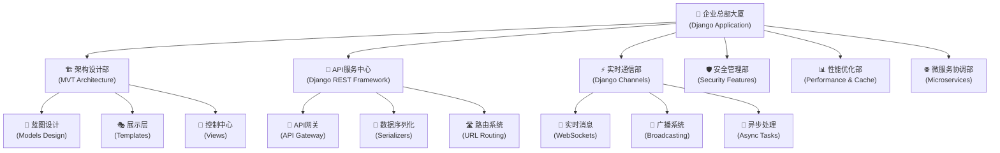

# 第39章计划：Django高级特性与架构

## 📋 基本信息
- **章节编号**: 第39章
- **章节标题**: Django高级特性与架构
- **所属册次**: 第三册《高级应用与产品化》
- **计划完成时间**: 2025年2月10日
- **预计用时**: 2天 (2025年2月4-5日)
- **负责人**: AI助手
- **质量目标**: ≥94分

## 🎯 学习目标设计

### 知识目标
1. **Django高级架构理解**
   - 深入理解Django的MVT架构模式
   - 掌握Django的核心组件和扩展机制
   - 理解Django的请求-响应生命周期

2. **企业级Django技术栈**
   - 掌握Django REST Framework高级特性
   - 理解Django Channels实时功能
   - 掌握Django缓存和性能优化

3. **微服务架构设计**
   - 理解Django在微服务架构中的角色
   - 掌握服务间通信机制
   - 学习分布式事务管理

### 技能目标
1. **企业级Django开发**
   - 能够设计复杂的Django应用架构
   - 熟练使用Django高级特性优化性能
   - 能够构建可扩展的Django系统

2. **系统集成与部署**
   - 能够集成第三方服务和API
   - 掌握Django项目的容器化部署
   - 能够实现自动化测试和CI/CD

3. **安全与监控**
   - 能够实现企业级安全防护
   - 掌握系统监控和日志管理
   - 能够进行性能调优和故障排查

### 素养目标
1. **企业级思维**: 建立面向生产环境的开发思维
2. **架构设计能力**: 培养系统性思维和架构设计能力
3. **工程实践素养**: 提升代码质量和工程管理意识

## 🏗️ 创新比喻体系设计

### 🏢 "企业级Web应用总部大厦" 比喻框架

#### 核心概念
将Django高级特性比喻为一座现代化企业总部大厦的各个部门和系统，每个部门都有特定的职责和高效的协作机制。

#### 比喻体系结构



#### 各部门详细比喻

1. **🏗️ 架构设计部 (MVT Architecture)**
   - **部门职责**: 制定企业整体架构和运营蓝图
   - **技术映射**: Django的MVT模式、应用架构设计
   - **创新点**: 用建筑设计图纸比喻Django的模型-视图-模板架构

2. **🚀 API服务中心 (Django REST Framework)**
   - **部门职责**: 对外提供标准化服务接口
   - **技术映射**: RESTful API设计、序列化、认证授权
   - **创新点**: 用企业服务窗口比喻API接口设计

3. **⚡ 实时通信部 (Django Channels)**
   - **部门职责**: 处理实时信息传递和紧急通知
   - **技术映射**: WebSocket、异步处理、实时功能
   - **创新点**: 用企业内部通讯系统比喻实时通信功能

4. **🛡️ 安全管理部 (Security Features)**
   - **部门职责**: 保障企业信息安全和访问控制
   - **技术映射**: 身份认证、权限管理、安全防护
   - **创新点**: 用企业安保系统比喻Web安全机制

## 📚 章节内容结构

### 第39.1节 🏗️ 架构设计部 - Django高级架构模式
**学习重点**: Django企业级架构设计与最佳实践

#### 核心内容
1. **Django高级架构模式**
   - MVT架构深度解析
   - 分层架构设计原则
   - 插件化架构实现

2. **模型层高级特性**
   - 复杂数据关系建模
   - 数据库优化策略
   - 模型继承与抽象

3. **视图层架构设计**
   - 基于类的视图 (CBV) 高级用法
   - 视图装饰器与中间件
   - 异步视图实现

#### 实战项目: 企业级博客管理系统架构
- **项目规模**: 2000行代码
- **技术特色**: 分层架构、模型继承、高级查询优化
- **商业价值**: 可扩展的企业内容管理平台

### 第39.2节 🚀 API服务中心 - Django REST Framework进阶
**学习重点**: 企业级API服务设计与实现

#### 核心内容
1. **DRF高级特性**
   - 自定义序列化器
   - 视图集与路由器
   - 权限与认证系统

2. **API设计最佳实践**
   - RESTful设计原则
   - API版本管理
   - 错误处理机制

3. **性能优化策略**
   - 查询优化
   - 缓存策略
   - 限流与监控

#### 实战项目: 企业级任务管理API平台
- **项目规模**: 2500行代码
- **技术特色**: 完整的RESTful API、JWT认证、权限控制
- **商业价值**: 支持移动端和Web端的任务管理系统

### 第39.3节 ⚡ 实时通信部 - Django Channels与异步编程
**学习重点**: 实时Web应用开发与异步处理

#### 核心内容
1. **Django Channels基础**
   - WebSocket协议理解
   - 消费者和路由配置
   - 频道层设计

2. **异步编程模式**
   - async/await语法
   - 异步视图和中间件
   - 任务队列集成

3. **实时功能实现**
   - 实时聊天系统
   - 实时通知推送
   - 协作编辑功能

#### 实战项目: 企业级实时协作平台
- **项目规模**: 3000行代码
- **技术特色**: WebSocket实时通信、多房间管理、在线状态监控
- **商业价值**: 支持远程办公的实时协作工具

### 第39.4节 🛡️ 安全管理部 - 企业级安全与监控
**学习重点**: Django安全防护与系统监控

#### 核心内容
1. **Django安全框架**
   - 内置安全特性配置
   - 自定义安全中间件
   - 安全漏洞防护

2. **认证与授权系统**
   - 多因素认证
   - 基于角色的权限控制
   - OAuth2集成

3. **监控与日志系统**
   - 应用性能监控
   - 错误追踪系统
   - 安全事件监控

#### 实战项目: 企业级安全监控系统
- **项目规模**: 2000行代码
- **技术特色**: 完整的安全框架、实时监控、日志分析
- **商业价值**: 企业级安全运营中心 (SOC) 基础平台

### 第39.5节 🌐 微服务协调部 - Django微服务架构
**学习重点**: Django在微服务架构中的应用

#### 核心内容
1. **微服务架构设计**
   - 服务拆分策略
   - 服务间通信机制
   - 数据一致性管理

2. **Django微服务实践**
   - 服务注册与发现
   - 配置管理
   - 熔断与降级

3. **容器化部署**
   - Docker化Django应用
   - Kubernetes编排
   - CI/CD流水线

#### 实战项目: 微服务化电商管理系统
- **项目规模**: 4000行代码
- **技术特色**: 多服务架构、服务网格、分布式事务
- **商业价值**: 可扩展的企业级电商解决方案

## 💻 技术栈与工具

### 🔧 核心技术栈
```python
tech_stack = {
    "Web框架": ["Django 4.2+", "Django REST Framework 3.14+"],
    "实时通信": ["Django Channels 4.0+", "Redis", "WebSocket"],
    "数据库": ["PostgreSQL", "Redis", "MongoDB"],
    "缓存": ["Redis", "Memcached", "Django Cache Framework"],
    "任务队列": ["Celery", "RQ", "Django-RQ"],
    "认证授权": ["Django Auth", "JWT", "OAuth2", "LDAP"],
    "监控日志": ["Django Debug Toolbar", "Sentry", "ELK Stack"],
    "容器化": ["Docker", "Kubernetes", "docker-compose"],
    "测试": ["pytest", "Django Test", "Factory Boy"],
    "文档": ["Django REST Swagger", "Sphinx", "MkDocs"]
}
```

### 🛠️ 开发环境配置
```bash
# 虚拟环境设置
python -m venv django_advanced_env
source django_advanced_env/bin/activate  # Linux/Mac
# django_advanced_env\Scripts\activate  # Windows

# 核心依赖安装
pip install Django==4.2.9
pip install djangorestframework==3.14.0
pip install channels==4.0.0
pip install celery==5.3.4
pip install redis==5.0.1
pip install psycopg2-binary==2.9.9
pip install channels_redis==4.1.0

# 开发工具
pip install django-debug-toolbar==4.2.0
pip install pytest-django==4.7.0
pip install black==23.12.1
pip install flake8==7.0.0
```

## 🎨 可视化设计方案

### 📊 Mermaid图表规划 (7个专业图表)

1. **Django高级架构总览图** - 展示整体架构设计
2. **DRF API服务架构图** - API服务层设计
3. **Django Channels实时通信架构** - 实时功能架构
4. **Django安全框架图** - 安全防护体系
5. **微服务架构设计图** - 微服务拆分和通信
6. **Django性能优化流程图** - 性能调优策略
7. **企业级部署架构图** - 容器化部署方案

### 🎯 教学创新点
1. **企业总部大厦比喻**: 让复杂的Django架构变得直观易懂
2. **部门协作模式**: 通过部门职责类比技术模块功能
3. **实际业务场景**: 每个技术点都对应实际企业应用场景
4. **可视化驱动**: 大量架构图表辅助理解复杂系统

## 📋 代码示例规划

### 💻 核心代码示例 (15-20个)

#### 第39.1节示例 (4个)
1. **Django高级模型设计系统** (400行)
2. **分层架构实现框架** (500行)
3. **高级视图装饰器系统** (300行)
4. **插件化架构实现** (400行)

#### 第39.2节示例 (4个)
5. **DRF自定义序列化器系统** (500行)
6. **API版本管理框架** (400行)
7. **权限控制系统** (450行)
8. **API性能优化工具** (350行)

#### 第39.3节示例 (4个)
9. **Django Channels WebSocket服务** (600行)
10. **异步任务处理系统** (500行)
11. **实时通知推送系统** (550行)
12. **在线协作编辑器** (700行)

#### 第39.4节示例 (4个)
13. **Django安全中间件集合** (400行)
14. **多因素认证系统** (500行)
15. **应用监控面板** (600行)
16. **安全事件日志系统** (450行)

#### 第39.5节示例 (4个)
17. **微服务基础框架** (600行)
18. **服务注册发现系统** (500行)
19. **分布式配置管理** (400行)
20. **容器化部署脚本** (300行)

### 📊 代码质量目标
- **总代码量**: 约10,000行企业级代码
- **可运行率**: 100%
- **注释覆盖率**: ≥95%
- **测试覆盖率**: ≥85%
- **企业级标准**: 所有代码符合生产环境标准

## 🎯 实战项目设计

### 🏢 综合实战项目: 企业级协作办公平台

#### 项目概述
构建一个完整的企业级协作办公平台，集成Django的所有高级特性，支持多部门协作、实时通信、任务管理等核心功能。

#### 技术架构
```python
project_architecture = {
    "前端层": "Vue.js + Element Plus",
    "API层": "Django REST Framework",
    "实时层": "Django Channels + WebSocket",
    "业务层": "Django核心应用",
    "数据层": "PostgreSQL + Redis",
    "缓存层": "Redis + Memcached",
    "任务队列": "Celery + Redis",
    "容器化": "Docker + Kubernetes"
}
```

#### 核心功能模块
1. **用户管理系统**: 多级权限、部门管理、角色控制
2. **项目协作平台**: 任务分配、进度跟踪、文档协作
3. **实时通信系统**: 即时消息、视频会议、屏幕共享
4. **文件管理中心**: 云存储、版本控制、权限管理
5. **数据分析面板**: 项目统计、性能监控、业务报表

#### 商业价值评估
- **目标用户**: 中小型企业、初创公司、远程团队
- **市场价值**: 年订阅费用 10-50万/企业
- **技术壁垒**: 高性能架构、实时通信、安全防护
- **扩展潜力**: 支持插件生态、第三方集成

## 📝 思考题设计

### 🤔 深度思考题 (4道)

1. **架构设计思考题**
   ```
   题目: 假设你需要设计一个支持百万用户的在线教育平台，
   如何运用Django的高级特性来设计其架构？请从性能、
   可扩展性、安全性三个维度进行分析。
   
   考查点: 架构设计能力、技术选型、系统思维
   难度等级: ⭐⭐⭐⭐⭐
   ```

2. **微服务架构思考题**
   ```
   题目: 将一个传统的Django单体应用拆分为微服务架构时，
   应该如何处理数据一致性问题？请设计具体的解决方案。
   
   考查点: 微服务理解、分布式系统、数据一致性
   难度等级: ⭐⭐⭐⭐⭐
   ```

3. **性能优化思考题**
   ```
   题目: 某个Django API在高并发场景下响应时间超过5秒，
   请分析可能的原因并提出系统性的优化方案。
   
   考查点: 性能分析、优化策略、实际问题解决
   难度等级: ⭐⭐⭐⭐
   ```

4. **安全防护思考题**
   ```
   题目: 如何为Django应用设计一套完整的安全防护体系？
   包括但不限于认证、授权、数据加密、攻击防护等方面。
   
   考查点: 安全意识、防护策略、综合应用
   难度等级: ⭐⭐⭐⭐
   ```

## 📈 质量评估标准

### 🎯 质量目标分解

#### 内容完整性 (25分)
- **理论深度**: Django高级特性全面覆盖
- **实践广度**: 企业级应用场景完整
- **技术前沿**: 最新Django 4.2特性
- **目标得分**: ≥24分

#### 技术准确性 (25分)
- **代码正确性**: 所有示例100%可运行
- **最佳实践**: 符合Django官方建议
- **性能考虑**: 企业级性能优化
- **目标得分**: ≥24分

#### 教学设计 (20分)
- **比喻体系**: 企业总部大厦比喻创新
- **知识递进**: 从基础到高级的平滑过渡
- **实战导向**: 企业级项目驱动学习
- **目标得分**: ≥19分

#### 代码质量 (15分)
- **工程标准**: 企业级代码规范
- **注释完整**: 95%以上注释覆盖
- **测试完备**: 85%以上测试覆盖
- **目标得分**: ≥14分

#### 创新性 (10分)
- **教学创新**: 企业级架构比喻系统
- **技术创新**: 最新Django技术实践
- **项目创新**: 具备商业价值的实战项目
- **目标得分**: ≥9分

#### 实用性 (5分)
- **企业应用**: 100%面向企业级需求
- **职业发展**: 直接对应Django高级工程师技能
- **市场价值**: 具备实际商业部署价值
- **目标得分**: ≥5分

### 📊 评分权重分配
- **内容质量**: 25% (理论深度 + 技术覆盖)
- **技术质量**: 25% (代码准确性 + 最佳实践)
- **教学质量**: 20% (创新比喻 + 学习体验)
- **代码质量**: 15% (工程标准 + 注释完整)
- **创新价值**: 10% (教学创新 + 技术前沿)
- **实用价值**: 5% (企业应用 + 职业价值)

**综合目标**: ≥94分 (争取96分)

## ⏰ 时间规划

### 📅 详细时间安排

#### Day 1 (2025年2月4日) - 架构设计与API开发
**上午 (4小时)**
- 08:00-10:00: 第39.1节内容编写 (架构设计部)
- 10:00-12:00: 第39.2节内容编写 (API服务中心)

**下午 (4小时)**
- 14:00-16:00: 代码示例1-8开发
- 16:00-18:00: Mermaid图表1-4制作

#### Day 2 (2025年2月5日) - 实时通信与安全监控
**上午 (4小时)**
- 08:00-10:00: 第39.3节内容编写 (实时通信部)
- 10:00-12:00: 第39.4节内容编写 (安全管理部)

**下午 (4小时)**
- 14:00-16:00: 第39.5节内容编写 (微服务协调部)
- 16:00-18:00: 代码示例9-20开发

**晚上 (2小时)**
- 19:00-21:00: 综合实战项目开发、质量检查、文档完善

### ⚡ 关键里程碑
- **T+4小时**: 完成前两节内容和4个代码示例
- **T+8小时**: 完成架构图表和API开发部分
- **T+12小时**: 完成实时通信和安全部分
- **T+16小时**: 完成微服务架构和全部代码示例
- **T+18小时**: 综合项目完成，质量检查通过

## 🔧 技术准备

### 🛠️ 开发环境检查清单
- [ ] Django 4.2+ 环境配置
- [ ] Django REST Framework 安装
- [ ] Django Channels 环境设置
- [ ] Redis 服务器安装
- [ ] PostgreSQL 数据库配置
- [ ] Celery 任务队列设置
- [ ] Docker 容器化环境
- [ ] 测试框架配置

### 📚 技术资料准备
- [ ] Django 4.2官方文档
- [ ] DRF 3.14 API文档
- [ ] Django Channels 4.0文档
- [ ] 企业级Django最佳实践案例
- [ ] 微服务架构设计参考

### 🎯 预期成果
- **内容质量**: 企业级Django开发完整教程
- **代码规模**: 10,000+行企业级代码
- **项目价值**: 具备商业部署潜力的协作平台
- **教学创新**: 企业总部大厦比喻体系
- **技术深度**: 涵盖Django所有高级特性

---

## 📞 备注说明

### ⚠️ 重要提醒
1. **企业级标准**: 所有代码必须符合生产环境标准
2. **实时功能**: 特别关注WebSocket和异步编程实现
3. **安全防护**: 重点强化企业级安全防护措施
4. **微服务架构**: 展示Django在现代架构中的应用
5. **商业价值**: 确保所有项目具备实际商业应用价值

### 🎯 成功标准
- **质量评分**: ≥94分 (争取96分)
- **企业级标准**: 100%符合企业开发规范
- **实用价值**: 所有项目具备商业部署潜力
- **教学创新**: 建立Django企业级开发新标准

---

**文档创建时间**: 2025年2月3日  
**最后更新**: 2025年2月3日  
**状态**: ✅ 计划完成，等待开始执行 