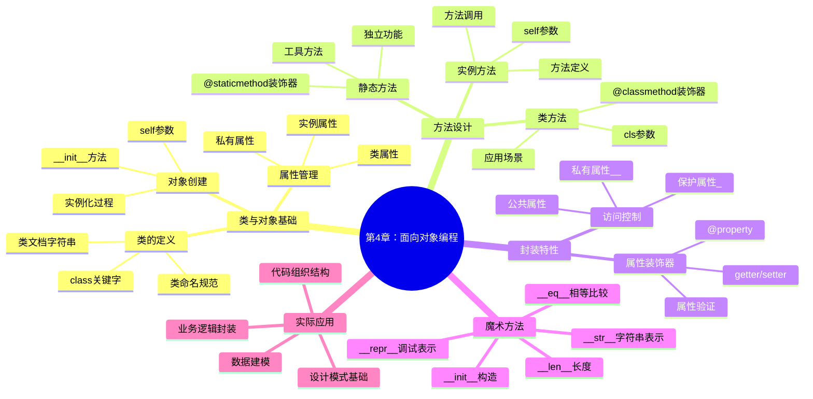

# 📋 第4章编写计划 - 面向对象编程基础

**章节**: 第4章《面向对象编程-类与对象》  
**预计编写时间**: 2025年1月25-26日  
**PDCA阶段**: Plan → Do  
**前置条件**: 第3章控制结构与函数定义已完成

## 🎯 章节目标

### 📚 学习目标（SMART格式）

**S**pecific (具体)：
- 理解面向对象编程的核心概念（类、对象、封装）
- 掌握Python类的定义语法和对象的创建使用
- 学会设计类的属性和方法
- 理解实例方法、类方法、静态方法的区别

**M**easurable (可衡量)：
- 能够独立设计并实现至少5个不同的类
- 正确完成90%以上的面向对象编程练习
- 独立完成一个包含多个类的综合项目

**A**chievable (可实现)：
- 基于前3章的编程基础，循序渐进学习OOP概念
- 通过大量实例和项目练习巩固理解

**R**elevant (相关性)：
- 为大型软件设计和架构思维奠定基础
- 培养抽象思维和模块化设计能力

**T**ime-bound (时限性)：
- 2周内完成学习（4课时理论+实践）

## 🗺️ 知识体系架构



## 📝 内容结构设计

### 4.1 类与对象基础 (25%)
- 4.1.1 什么是面向对象编程
- 4.1.2 类的定义和基本语法
- 4.1.3 对象的创建和使用
- 4.1.4 属性和方法的访问

### 4.2 类的属性和方法 (35%)
- 4.2.1 实例属性和类属性
- 4.2.2 实例方法详解
- 4.2.3 类方法和静态方法
- 4.2.4 方法重载和参数处理

### 4.3 封装和访问控制 (25%)
- 4.3.1 封装的概念和重要性
- 4.3.2 公共、保护、私有属性
- 4.3.3 属性装饰器的使用
- 4.3.4 getter和setter方法

### 4.4 魔术方法和特殊功能 (15%)
- 4.4.1 常用魔术方法介绍
- 4.4.2 对象的字符串表示
- 4.4.3 运算符重载基础
- 4.4.4 对象比较和排序

## 🔧 代码示例规划

### 示例1：学生信息管理类
```python
class Student:
    """学生信息管理类 - 展示基本类定义"""
    # 知识点：类定义、__init__、实例属性、方法
    pass
```

### 示例2：银行账户类
```python
class BankAccount:
    """银行账户类 - 展示封装和访问控制"""
    # 知识点：私有属性、属性装饰器、数据验证
    pass
```

### 示例3：图书管理系统
```python
class Book:
    """图书类"""
    pass

class Library:
    """图书馆类 - 展示类之间的关系"""
    pass
```

### 示例4：几何图形类族
```python
class Shape:
    """几何图形基类 - 展示类方法和静态方法"""
    pass

class Circle(Shape):
    """圆形类"""
    pass

class Rectangle(Shape):
    """矩形类"""
    pass
```

### 示例5：购物车系统
```python
class Product:
    """商品类"""
    pass

class ShoppingCart:
    """购物车类 - 展示魔术方法"""
    pass
```

## 🎮 练习题设计

### 基础练习 (培养基本概念)
1. **动物类设计** - 类定义和基本方法
2. **计算器类** - 实例方法练习
3. **温度转换器类** - 类方法和静态方法

### 中级练习 (综合应用)
1. **员工管理系统** - 多个类的协作
2. **汽车类设计** - 封装和访问控制
3. **成绩统计类** - 数据处理和分析

### 挑战练习 (高级特性)
1. **自定义容器类** - 魔术方法实现
2. **文件管理器类** - 复杂业务逻辑
3. **游戏角色系统** - 完整的OOP设计

## 🚀 综合项目案例

### 项目：学校管理系统

**项目描述**：设计一个完整的学校管理系统，包含学生、教师、课程、班级等实体。

**核心类设计**：
- `Person` - 人员基类
- `Student` - 学生类
- `Teacher` - 教师类  
- `Course` - 课程类
- `ClassRoom` - 班级类
- `School` - 学校类

**功能要求**：
- 学生信息管理（增删改查）
- 教师信息管理
- 课程安排和管理
- 成绩录入和统计
- 班级管理功能
- 数据持久化存储

**技术要点**：
- 类的继承关系设计
- 封装和访问控制
- 方法重载和多态
- 异常处理机制
- 数据验证和完整性

## ⏰ 编写时间规划

### Day 1 (1/25) - 理论基础和基本示例
**上午 (4小时)**：
- 9:00-10:30: 4.1 类与对象基础编写
- 10:30-12:00: 4.2 属性和方法编写

**下午 (4小时)**：
- 14:00-15:30: 示例1-2开发和测试
- 15:30-17:00: 基础练习题设计

**目标**：完成章节60%内容

### Day 2 (1/26) - 高级特性和项目案例
**上午 (4小时)**：
- 9:00-10:30: 4.3 封装和访问控制
- 10:30-12:00: 4.4 魔术方法

**下午 (4小时)**：
- 14:00-16:00: 示例3-5开发
- 16:00-17:00: 综合项目案例编写

**目标**：完成章节100%内容

### Day 3 (1/27) - 质量检查和优化
**全天 (2小时)**：
- 代码测试和调试
- 内容审查和优化
- 练习题答案编写

## 📊 质量控制标准

### 代码质量要求
- [ ] 所有示例代码可运行
- [ ] 代码符合PEP 8规范
- [ ] 充分的注释和文档字符串
- [ ] 异常处理完善
- [ ] 测试用例覆盖

### 内容质量要求
- [ ] 概念解释准确清晰
- [ ] 示例贴近实际应用
- [ ] 难度递进合理
- [ ] 练习题有针对性
- [ ] 项目案例实用性强

### 教学设计要求
- [ ] 知识点衔接流畅
- [ ] 互动环节丰富
- [ ] 评估方式多样
- [ ] 可视化元素充足
- [ ] 学习体验良好

## ⚠️ 风险识别与应对

### 🔴 高风险项
1. **概念理解难度**
   - 风险：OOP抽象概念对初学者较难
   - 应对：增加生活化比喻和可视化图解
   - 监控：学生反馈和理解度测试

2. **代码复杂度增加**
   - 风险：多类协作的代码较复杂
   - 应对：逐步增加复杂度，充分注释
   - 监控：代码可读性评分

### 🟡 中风险项
3. **时间管理压力**
   - 风险：2天时间可能不够充足
   - 应对：优先核心内容，细节可后补
   - 后备：将高级特性推到第5章

4. **与前章连接**
   - 风险：与函数编程思维转换困难
   - 应对：设计对比示例，强调差异
   - 监控：学习路径连贯性检查

## 📋 详细任务清单

### 内容创作任务 ✅
- [ ] **4.1 类与对象基础** (预计4小时)
  - [ ] OOP概念介绍和优势
  - [ ] 类定义语法详解
  - [ ] 对象创建和使用
  - [ ] self参数理解

- [ ] **4.2 属性和方法** (预计4小时)
  - [ ] 实例属性vs类属性
  - [ ] 实例方法设计
  - [ ] 类方法和静态方法
  - [ ] 方法调用机制

- [ ] **4.3 封装特性** (预计3小时)
  - [ ] 访问控制原理
  - [ ] 私有属性设计
  - [ ] 属性装饰器使用
  - [ ] 数据验证机制

- [ ] **4.4 魔术方法** (预计2小时)
  - [ ] 常用魔术方法
  - [ ] 字符串表示方法
  - [ ] 比较和运算方法
  - [ ] 容器协议方法

### 代码开发任务 ✅
- [ ] **示例代码开发** (预计6小时)
  - [ ] 5个核心示例编写
  - [ ] 代码测试和调试
  - [ ] 输出结果验证
  - [ ] 注释和文档完善

- [ ] **练习题设计** (预计3小时)
  - [ ] 9个分层练习题
  - [ ] 标准答案编写
  - [ ] 评分标准制定
  - [ ] 提示和引导设计

- [ ] **项目案例开发** (预计4小时)
  - [ ] 学校管理系统设计
  - [ ] 核心功能实现
  - [ ] 用户界面设计
  - [ ] 测试数据准备

### 配套资源制作 ✅
- [ ] **可视化资源** (预计2小时)
  - [ ] 类关系图制作
  - [ ] 对象内存模型图
  - [ ] 方法调用流程图
  - [ ] 封装概念图解

- [ ] **教学辅助** (预计1小时)
  - [ ] 知识点总结表
  - [ ] 常见错误归纳
  - [ ] 最佳实践指南
  - [ ] 学习检查清单

## 🎊 成功指标定义

### 定量指标
- 内容完成度：100%
- 代码通过率：100%
- 练习题覆盖率：≥90%
- 质量评分：≥85分

### 定性指标
- 概念解释清晰度：优秀
- 示例实用性：高
- 练习题针对性：强
- 项目案例完整性：完整

### 时间效率
- 计划执行准确度：≥90%
- 提前完成可能性：有
- 质量与效率平衡：优秀

## 🔄 下一章衔接规划

### 第5章预告：面向对象编程-继承与多态
- 继承机制详解
- 方法重写和多态
- 抽象类和接口
- 多重继承处理

### 知识连贯性设计
- 第4章重点：类和对象基础
- 第5章重点：类之间的关系
- 第6章重点：高级OOP特性

### 难度递进控制
- 从单一类设计到类族设计
- 从基础封装到复杂继承
- 从简单应用到设计模式

## 📞 协作计划

### 内容审核安排
- **技术审核**：邀请高级开发者审核代码质量
- **教学审核**：邀请教学专家审核教学设计
- **用户测试**：收集目标学习者的反馈

### 时间节点
- 1/25 17:00：第一天成果汇报
- 1/26 17:00：完整内容提交审核
- 1/27 17:00：优化版本最终确认

### 沟通机制
- 每日进度报告
- 问题及时反馈
- 质量标准确认

---

**制定者**: AI助手  
**审核者**: 待分配  
**执行时间**: 2025年1月25-27日  
**最后更新**: 2025年1月22日 19:00  

💡 **设计理念**: "让抽象的OOP概念变得具体可感，让学生在实践中理解面向对象的优雅！" 