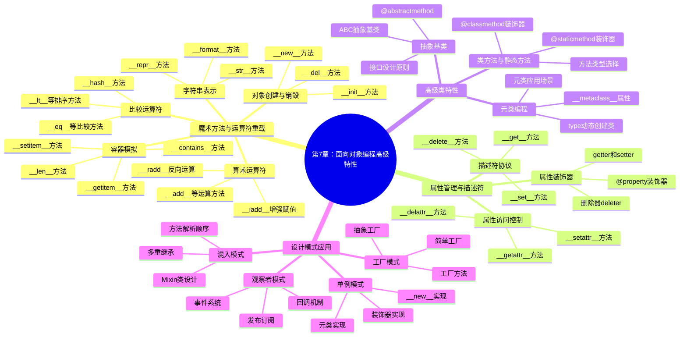

# 第7章计划：面向对象编程高级特性

## 📋 SMART学习目标

**S**pecific (具体)：
- 掌握Python面向对象的高级特性和设计模式
- 学会使用属性装饰器、描述符和元类
- 熟练运用抽象基类和混入(Mixin)模式
- 掌握运算符重载和魔术方法的应用
- 学会设计可扩展、可维护的类体系

**M**easurable (可衡量)：
- 能够正确使用至少10个魔术方法
- 设计并实现至少3个设计模式
- 熟练使用属性装饰器管理对象状态
- 独立完成一个包含高级特性的完整类体系

**A**chievable (可实现)：
- 基于前5章的面向对象基础，深入学习高级特性
- 通过实际项目案例理解高级特性的应用场景
- 结合设计模式和最佳实践进行综合应用

**R**elevant (相关性)：
- 为编写高质量、可维护的Python程序奠定基础
- 培养面向对象设计思维和架构能力
- 为后续模块开发和框架使用做准备

**T**ime-bound (时限性)：
- 2天内完成学习（4课时理论+实践）
- 1月30-31日编写完成

## 🗂️ 知识体系架构



## ⏰ 时间规划

### 1月30日（第1天）- 8小时
- **上午 (4小时)**
  - 09:00-10:30 魔术方法与运算符重载
  - 10:45-12:15 属性管理与描述符

- **下午 (4小时)**  
  - 13:30-15:00 高级类特性详解
  - 15:15-16:45 设计模式应用实践

### 1月31日（第2天）- 8小时
- **上午 (4小时)**
  - 09:00-10:30 元类编程深入
  - 10:45-12:15 综合案例开发

- **下午 (4小时)**
  - 13:30-15:00 练习题设计和解答
  - 15:15-16:45 项目案例完善

## 🎯 技术要点

### 核心魔术方法
- 对象生命周期：__new__, __init__, __del__
- 字符串表示：__str__, __repr__, __format__
- 比较运算：__eq__, __lt__, __hash__
- 算术运算：__add__, __sub__, __mul__, __truediv__
- 容器模拟：__len__, __getitem__, __iter__

### 属性管理技术
- property装饰器的完整用法
- 描述符协议的三个方法
- 属性访问拦截和控制
- 计算属性和缓存属性

### 高级类设计
- 抽象基类的设计和使用
- 类方法和静态方法的选择
- 混入模式的最佳实践
- 元类的应用场景

### 设计模式实现
- 单例模式的多种实现方式
- 工厂模式的层次化设计
- 观察者模式的事件系统
- 装饰器模式的应用

## 💻 代码示例规划

### 示例1：完整的魔术方法演示
```python
class Vector:
    """二维向量类，演示魔术方法的完整使用"""
    
    def __init__(self, x, y):
        self.x = x
        self.y = y
    
    def __str__(self):
        return f"Vector({self.x}, {self.y})"
    
    def __repr__(self):
        return f"Vector(x={self.x}, y={self.y})"
    
    def __eq__(self, other):
        if not isinstance(other, Vector):
            return False
        return self.x == other.x and self.y == other.y
    
    def __add__(self, other):
        return Vector(self.x + other.x, self.y + other.y)
    
    def __mul__(self, scalar):
        return Vector(self.x * scalar, self.y * scalar)
    
    def __abs__(self):
        return (self.x ** 2 + self.y ** 2) ** 0.5
```

### 示例2：属性装饰器高级应用
```python
class Temperature:
    """温度类，演示属性装饰器的高级用法"""
    
    def __init__(self, celsius=0):
        self._celsius = celsius
    
    @property
    def celsius(self):
        return self._celsius
    
    @celsius.setter
    def celsius(self, value):
        if value < -273.15:
            raise ValueError("温度不能低于绝对零度")
        self._celsius = value
    
    @property
    def fahrenheit(self):
        return self._celsius * 9/5 + 32
    
    @fahrenheit.setter
    def fahrenheit(self, value):
        self.celsius = (value - 32) * 5/9
```

### 示例3：描述符协议实现
```python
class ValidatedAttribute:
    """验证描述符，演示描述符协议"""
    
    def __init__(self, validation_func, error_msg):
        self.validation_func = validation_func
        self.error_msg = error_msg
        self.name = None
    
    def __set_name__(self, owner, name):
        self.name = name
    
    def __get__(self, obj, objtype=None):
        if obj is None:
            return self
        return obj.__dict__.get(self.name)
    
    def __set__(self, obj, value):
        if not self.validation_func(value):
            raise ValueError(self.error_msg)
        obj.__dict__[self.name] = value
```

### 示例4：抽象基类设计
```python
from abc import ABC, abstractmethod

class DataProcessor(ABC):
    """数据处理器抽象基类"""
    
    @abstractmethod
    def process(self, data):
        """处理数据的抽象方法"""
        pass
    
    @abstractmethod
    def validate(self, data):
        """验证数据的抽象方法"""
        pass
    
    def execute(self, data):
        """模板方法，定义处理流程"""
        if self.validate(data):
            return self.process(data)
        else:
            raise ValueError("数据验证失败")
```

### 示例5：设计模式综合应用
```python
class EventSystem:
    """事件系统，演示观察者模式"""
    
    def __init__(self):
        self._observers = {}
    
    def subscribe(self, event_type, callback):
        """订阅事件"""
        if event_type not in self._observers:
            self._observers[event_type] = []
        self._observers[event_type].append(callback)
    
    def unsubscribe(self, event_type, callback):
        """取消订阅"""
        if event_type in self._observers:
            self._observers[event_type].remove(callback)
    
    def emit(self, event_type, *args, **kwargs):
        """发布事件"""
        if event_type in self._observers:
            for callback in self._observers[event_type]:
                callback(*args, **kwargs)
```

## 🏋️‍♀️ 练习题设计

### 基础练习
1. **魔术方法实现**：为自定义类实现完整的比较和运算方法
2. **属性装饰器**：设计带验证的属性管理系统
3. **描述符应用**：实现类型检查描述符

### 中级练习  
4. **抽象基类设计**：设计图形类层次结构
5. **单例模式**：用三种方法实现单例模式
6. **工厂模式**：设计数据库连接工厂

### 高级练习
7. **元类编程**：实现ORM映射元类
8. **混入模式**：设计功能组合的混入类
9. **观察者模式**：实现完整的事件驱动系统

## 🎯 综合项目案例

### 项目：高级ORM系统设计
设计一个简化的ORM（对象关系映射）系统，包含：

**核心功能**：
- 模型类的自动映射
- 字段类型验证和转换
- 查询构建器设计
- 数据库操作封装

**高级特性要求**：
- 使用元类自动注册模型
- 描述符实现字段管理
- 抽象基类定义接口
- 混入模式扩展功能

**设计模式应用**：
- 单例模式管理连接池
- 工厂模式创建查询对象
- 观察者模式处理模型事件
- 装饰器模式增强功能

## 📊 质量标准

### 内容质量标准
- **准确性**：≥90分 (高级特性概念准确)
- **完整性**：≥85分 (覆盖完整的高级特性体系)
- **实用性**：≥90分 (贴近实际开发场景)
- **可读性**：≥85分 (结构清晰，易于理解)

### 代码质量标准
- **可运行性**：100% (所有示例可独立运行)
- **设计质量**：≥90% (遵循面向对象设计原则)
- **最佳实践**：≥85分 (遵循Python编程规范)
- **注释完整**：≥90% (关键代码有详细说明)

### 教学设计标准
- **渐进性**：≥90分 (从基础到高级合理递进)
- **互动性**：≥85分 (练习题和案例充足)
- **实践性**：≥90分 (理论结合实践)
- **可操作性**：≥85分 (学生可以跟做练习)

## ⚠️ 风险识别与应对

### 内容风险
1. **概念抽象性**
   - 风险：高级特性概念较为抽象
   - 应对：增加具体应用场景和代码示例

2. **复杂度控制**
   - 风险：内容可能过于复杂
   - 应对：循序渐进，重点突出核心概念

3. **实用性平衡**
   - 风险：理论与实践脱节
   - 应对：每个特性都配合实际应用案例

### 技术风险
1. **兼容性问题**
   - 风险：不同Python版本的特性差异
   - 应对：明确版本要求，说明差异

2. **性能考虑**
   - 风险：高级特性可能影响性能
   - 应对：说明性能影响和使用场景

### 时间风险
1. **内容量控制**
   - 风险：高级特性内容可能过多
   - 应对：重点突出常用特性，其他作为扩展

2. **示例复杂度**
   - 风险：复杂示例可能耗时较长
   - 应对：分层设计，先简后繁

## 🎯 成功标准

### 学习成果检验
- [ ] 能够熟练使用常见魔术方法
- [ ] 能够设计和实现描述符
- [ ] 能够应用设计模式解决实际问题
- [ ] 能够设计可扩展的类体系
- [ ] 能够进行元类编程

### 项目交付标准
- [ ] 章节内容完整，符合SMART目标
- [ ] 代码示例丰富，覆盖核心知识点
- [ ] 练习题分层设计，难度递进
- [ ] 综合项目案例完整可运行
- [ ] 文档结构清晰，便于学习

### 质量验收标准
- [ ] 内容准确性≥90分
- [ ] 代码质量≥90分  
- [ ] 教学设计≥85分
- [ ] 学生反馈≥85分

---

**计划制定完成时间**：1月30日 09:00  
**预计开始执行**：1月30日 09:30  
**目标完成时间**：1月31日 17:00  

准备开始第7章的深度技术内容编写！🚀 