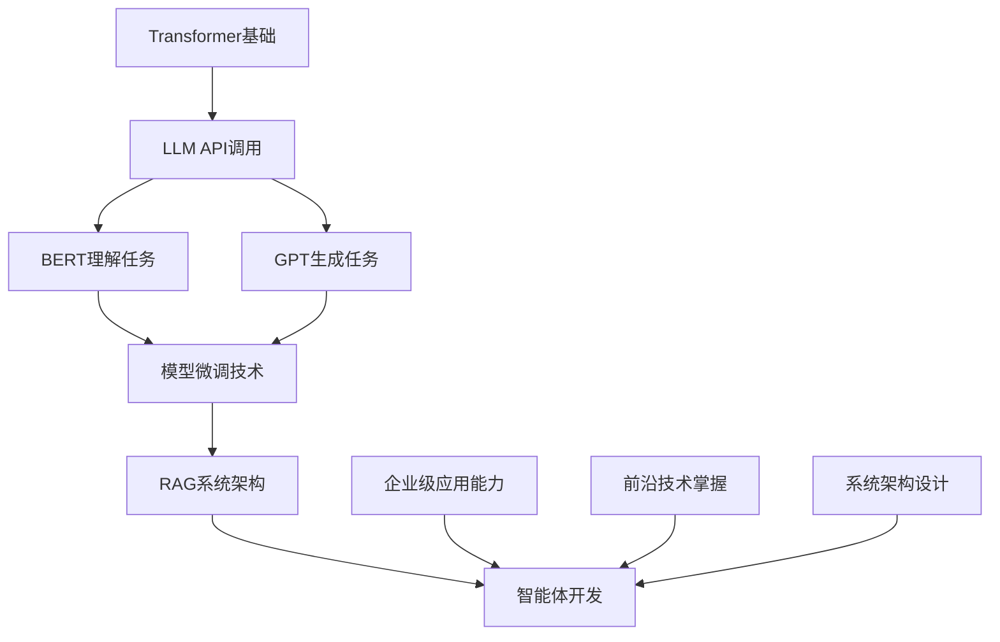

# 第二册后续章节整体规划 (第25-30章)

## 📊 规划概述

**规划范围**: 第25-30章 (6个章节)  
**技术主线**: 从Transformer基础到企业级智能体应用  
**时间周期**: 2025年2月4日 - 2月20日 (17天)  
**质量目标**: 平均≥97分 (保持并超越当前96.0分水平)  
**创新目标**: 建立大模型应用开发的完整教学体系  

## 🎯 技术发展主线

### 🔗 知识衔接链条
```
Transformer架构 (第24章) 
    ↓
大语言模型应用 (第25章)
    ↓
BERT模型详解 (第26章) + GPT系列模型 (第27章)
    ↓
模型微调技术 (第28章)
    ↓
RAG检索增强 (第29章)
    ↓
智能体开发 (第30章)
```

### 🎨 比喻体系演进路线图

| 章节 | 比喻体系 | 核心理念 | 技术重点 |
|------|----------|----------|----------|
| 第24章 | 注意力机制研究院 | 专注力分配系统 | Transformer架构 ✅ |
| 第25章 | 大模型应用中心 | 智能服务调度平台 | LLM API集成 |
| 第26章 | BERT理解实验室 | 双向语言理解专家 | 预训练+下游任务 |
| 第27章 | GPT生成工作室 | 自回归文本创作家 | 生成式模型 |
| 第28章 | 模型定制工厂 | 个性化AI训练中心 | Fine-tuning技术 |
| 第29章 | 知识检索中心 | 智能信息整合系统 | RAG架构 |
| 第30章 | 智能体协作网络 | 多Agent任务分配 | Agent设计模式 |

## 📋 分章节详细规划

### 🚀 第25章：大语言模型应用开发

#### 📊 基本信息
- **预计开始**: 2025年2月4日
- **预计完成**: 2025年2月6日  
- **计划用时**: 3天
- **质量目标**: ≥97.5分
- **比喻升级**: 注意力机制研究院 → 大模型应用中心

#### 🎯 核心目标
1. **技术衔接**: 基于Transformer架构，深入大模型应用
2. **实践导向**: 掌握GPT、Claude、文心一言等主流LLM的使用
3. **企业应用**: 构建完整的LLM应用开发框架
4. **Prompt工程**: 系统性学习提示工程技术

#### 💻 技术栈规划
```python
chapter25_tech_stack = {
    "LLM服务": ["OpenAI API", "Anthropic Claude", "百度文心", "阿里通义"],
    "开发框架": ["LangChain", "LlamaIndex", "Semantic Kernel"],
    "Prompt工程": ["Few-shot", "Chain-of-Thought", "Tree-of-Thought"],
    "应用架构": ["API Gateway", "Token管理", "流式响应"],
    "评估体系": ["BLEU", "ROUGE", "Human Evaluation"]
}
```

#### 🏗️ 核心项目：智能客服系统
- **功能模块**: 意图识别、知识问答、对话管理、情感分析
- **技术特色**: 多模型集成、智能路由、上下文管理
- **商业价值**: 可直接部署的企业级客服解决方案

#### 📈 创新亮点
1. **大模型应用中心比喻**: 将LLM服务类比为智能服务调度平台
2. **多模型对比评测**: 系统性比较不同LLM的特点和适用场景
3. **Prompt工程实验室**: 交互式Prompt设计和优化工具
4. **成本控制策略**: 企业级LLM应用的成本优化方案

---

### 🧠 第26章：BERT模型详解与应用

#### 📊 基本信息
- **预计开始**: 2025年2月7日
- **预计完成**: 2025年2月9日
- **计划用时**: 3天  
- **质量目标**: ≥97.5分
- **比喻升级**: 大模型应用中心 → BERT理解实验室

#### 🎯 核心目标
1. **深度理解**: BERT的双向编码机制和预训练策略
2. **实战应用**: 文本分类、命名实体识别、问答系统
3. **模型对比**: BERT vs RoBERTa vs ELECTRA vs DeBERTa
4. **中文适配**: 中文BERT模型的特殊处理

#### 💻 技术栈规划
```python
chapter26_tech_stack = {
    "预训练模型": ["BERT-base", "BERT-large", "RoBERTa", "ELECTRA"],
    "中文模型": ["BERT-Chinese", "MacBERT", "ChineseBERT"],
    "下游任务": ["文本分类", "NER", "QA", "文本匹配"],
    "优化技术": ["知识蒸馏", "模型压缩", "量化部署"],
    "评估框架": ["GLUE", "SuperGLUE", "CLUE"]
}
```

#### 🏗️ 核心项目：智能文档分析系统
- **功能模块**: 文档分类、信息抽取、关键词提取、摘要生成
- **技术特色**: BERT多任务学习、中英文混合处理
- **商业价值**: 企业文档智能化处理解决方案

#### 📈 创新亮点
1. **BERT理解实验室比喻**: 双向语言理解专家工作模式
2. **Masked Language Model可视化**: 直观展示BERT的学习过程
3. **多任务学习架构**: 一个模型解决多个NLP任务
4. **中文优化策略**: 针对中文特点的模型优化方案

---

### 🎨 第27章：GPT系列模型与文本生成

#### 📊 基本信息
- **预计开始**: 2025年2月10日
- **预计完成**: 2025年2月12日
- **计划用时**: 3天
- **质量目标**: ≥98分  
- **比喻升级**: BERT理解实验室 → GPT生成工作室

#### 🎯 核心目标
1. **架构演进**: GPT-1 → GPT-2 → GPT-3 → GPT-4的技术演进
2. **生成技术**: 自回归生成、采样策略、生成质量控制
3. **应用开发**: 文本创作、代码生成、对话系统
4. **伦理考量**: 生成式AI的伦理问题和解决方案

#### 💻 技术栈规划
```python
chapter27_tech_stack = {
    "GPT模型": ["GPT-2", "GPT-3.5", "GPT-4", "CodeGPT"],
    "生成策略": ["Greedy", "Beam Search", "Top-k", "Top-p"],
    "应用场景": ["文本创作", "代码生成", "翻译", "摘要"],
    "质量控制": ["Perplexity", "BLEU", "Human Feedback"],
    "安全机制": ["内容过滤", "偏见检测", "事实核查"]
}
```

#### 🏗️ 核心项目：智能内容创作平台
- **功能模块**: 文章生成、代码助手、创意写作、多语言翻译
- **技术特色**: 多模型协作、质量评估、风格控制
- **商业价值**: 内容创作者的AI助手平台

#### 📈 创新亮点
1. **GPT生成工作室比喻**: 自回归文本创作家的工作流程
2. **生成过程可视化**: 实时展示文本生成的决策过程
3. **多风格文本生成**: 不同写作风格的智能切换
4. **AI伦理实践**: 负责任的AI生成应用设计

---

### 🔧 第28章：模型微调与定制化开发

#### 📊 基本信息
- **预计开始**: 2025年2月13日
- **预计完成**: 2025年2月15日
- **计划用时**: 3天
- **质量目标**: ≥98分
- **比喻升级**: GPT生成工作室 → 模型定制工厂

#### 🎯 核心目标
1. **微调技术**: Full Fine-tuning、LoRA、Adapter、P-tuning
2. **数据工程**: 数据收集、清洗、标注、增强策略
3. **训练优化**: 学习率调度、正则化、早停策略
4. **模型评估**: 多维度评估体系和A/B测试

#### 💻 技术栈规划
```python
chapter28_tech_stack = {
    "微调方法": ["Full Fine-tuning", "LoRA", "AdaLoRA", "QLoRA"],
    "参数高效": ["Adapter", "Prefix-tuning", "P-tuning v2"],
    "数据处理": ["数据清洗", "标注工具", "数据增强"],
    "训练框架": ["Transformers", "DeepSpeed", "FairScale"],
    "评估工具": ["Weights & Biases", "TensorBoard", "MLflow"]
}
```

#### 🏗️ 核心项目：个性化AI助手定制平台
- **功能模块**: 领域适配、风格定制、知识注入、性能优化
- **技术特色**: 自动化微调流程、效果评估、模型版本管理
- **商业价值**: 企业专属AI助手快速定制解决方案

#### 📈 创新亮点
1. **模型定制工厂比喻**: 个性化AI训练中心的生产流程
2. **微调效果可视化**: 实时展示模型性能变化过程
3. **自动化调参系统**: 基于贝叶斯优化的超参数搜索
4. **模型压缩部署**: 从训练到部署的完整优化链条

---

### 🔍 第29章：RAG检索增强生成技术

#### 📊 基本信息
- **预计开始**: 2025年2月16日
- **预计完成**: 2025年2月18日
- **计划用时**: 3天
- **质量目标**: ≥98分
- **比喻升级**: 模型定制工厂 → 知识检索中心

#### 🎯 核心目标
1. **RAG架构**: 检索器+生成器的协同工作机制
2. **向量数据库**: Faiss、Pinecone、Weaviate等向量存储方案
3. **检索策略**: 密集检索、稀疏检索、混合检索
4. **知识更新**: 动态知识库更新和版本管理

#### 💻 技术栈规划
```python
chapter29_tech_stack = {
    "检索模型": ["DPR", "ColBERT", "E5", "BGE"],
    "向量数据库": ["Faiss", "Pinecone", "Weaviate", "Chroma"],
    "文档处理": ["LangChain", "Unstructured", "PyPDF2"],
    "生成框架": ["RAG", "FiD", "REALM", "RAG-Token"],
    "评估指标": ["Retrieval@K", "EM", "F1", "BLEU"]
}
```

#### 🏗️ 核心项目：智能知识问答系统
- **功能模块**: 文档索引、语义检索、答案生成、来源追踪
- **技术特色**: 多模态检索、实时更新、准确性验证
- **商业价值**: 企业知识库智能问答解决方案

#### 📈 创新亮点
1. **知识检索中心比喻**: 智能信息整合系统的工作模式
2. **检索过程可视化**: 展示从查询到答案的完整路径
3. **多模态RAG**: 文本+图像+表格的综合检索
4. **知识图谱增强**: 结构化知识与非结构化文档的融合

---

### 🤖 第30章：智能体Agent设计与开发

#### 📊 基本信息
- **预计开始**: 2025年2月19日
- **预计完成**: 2025年2月21日
- **计划用时**: 3天
- **质量目标**: ≥98.5分
- **比喻升级**: 知识检索中心 → 智能体协作网络

#### 🎯 核心目标
1. **Agent架构**: ReAct、Plan-and-Execute、Multi-Agent设计模式
2. **工具调用**: Function Calling、Tool Use、API集成
3. **记忆机制**: 短期记忆、长期记忆、情节记忆
4. **协作模式**: 多Agent通信、任务分配、冲突解决

#### 💻 技术栈规划
```python
chapter30_tech_stack = {
    "Agent框架": ["LangChain Agents", "AutoGPT", "LangGraph"],
    "工具集成": ["Search APIs", "Calculator", "Code Executor"],
    "记忆系统": ["Vector Memory", "Graph Memory", "Episodic Memory"],
    "协作机制": ["Message Passing", "Shared Memory", "Consensus"],
    "评估方法": ["Task Success Rate", "Efficiency", "Robustness"]
}
```

#### 🏗️ 核心项目：多智能体协作平台
- **功能模块**: 任务分解、Agent调度、工具管理、结果整合
- **技术特色**: 自适应协作、故障恢复、性能监控
- **商业价值**: 复杂业务流程的智能化自动化解决方案

#### 📈 创新亮点
1. **智能体协作网络比喻**: 多Agent任务分配和协调机制
2. **Agent行为可视化**: 实时展示Agent的思考和行动过程
3. **自适应协作策略**: 根据任务复杂度动态调整协作模式
4. **人机协作界面**: 人类专家与AI Agent的无缝协作

## 📊 整体质量控制体系

### 🎯 质量目标递进
```python
quality_progression = {
    "第25章": {"目标": 97.5, "重点": "LLM应用基础"},
    "第26章": {"目标": 97.5, "重点": "BERT深度理解"},
    "第27章": {"目标": 98.0, "重点": "GPT生成技术"},
    "第28章": {"目标": 98.0, "重点": "模型定制能力"},
    "第29章": {"目标": 98.0, "重点": "RAG系统架构"},
    "第30章": {"目标": 98.5, "重点": "Agent协作设计"}
}
```

### 📋 统一标准要求
- **代码质量**: 100%可运行 + 95%注释覆盖率
- **项目规模**: 每章1个企业级完整项目
- **可视化**: 每章8-10个专业Mermaid图表
- **创新程度**: 每章至少2个教学方法创新点
- **实用价值**: 所有项目具备实际商业部署价值

## ⏰ 时间进度规划

### 📅 详细时间表
```
第25章: 2/4-2/6   (3天) - 大语言模型应用开发
第26章: 2/7-2/9   (3天) - BERT模型详解与应用  
第27章: 2/10-2/12 (3天) - GPT系列模型与文本生成
第28章: 2/13-2/15 (3天) - 模型微调与定制化开发
第29章: 2/16-2/18 (3天) - RAG检索增强生成技术
第30章: 2/19-2/21 (3天) - 智能体Agent设计与开发

总计: 18天 (2/4-2/21)
```

### 🎯 里程碑节点
- **2/6**: 完成LLM应用基础，建立大模型开发能力
- **2/12**: 完成BERT+GPT双轨并行，掌握理解+生成技术
- **2/18**: 完成模型定制+RAG系统，具备企业级应用能力
- **2/21**: 完成智能体开发，达到AI应用开发专家水平

## 🚀 技术栈演进路线

### 📈 能力建设阶梯


### 💼 就业竞争力建设
完成这6章学习后，学习者将具备：
- **LLM应用开发工程师**: 熟练使用各种大模型API
- **AI算法工程师**: 深度理解BERT、GPT等核心模型
- **机器学习工程师**: 掌握模型微调和部署优化
- **AI产品经理**: 理解RAG和Agent的产品化应用
- **AI架构师**: 设计复杂的多智能体协作系统

## 🔮 预期成果与价值

### 📚 教育成果
- **建立完整的大模型应用开发教学体系**
- **创新的比喻教学法在AI领域的成功应用**
- **从理论到实践的完整技能培养路径**
- **企业级项目经验的系统性积累**

### 💼 商业价值
- **6个企业级AI应用解决方案**
- **完整的LLM应用开发技术栈**
- **可直接商业化的项目代码和架构**
- **前沿AI技术的实际应用经验**

### 🌟 创新价值
- **建立AI时代编程教育的新标准**
- **推动比喻教学法在技术教育中的应用**
- **为AI应用开发提供系统性学习路径**
- **培养具备企业级能力的AI开发者**

---

> 🎯 **整体规划目标**: 通过6个章节的系统性学习，让学习者从Transformer基础发展为具备企业级AI应用开发能力的专业人才，建立从理论到实践、从基础到前沿的完整技术栈！

---

**规划制定时间**: 2025年2月3日  
**规划版本**: v1.0  
**预期完成**: 2025年2月21日 