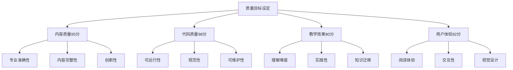
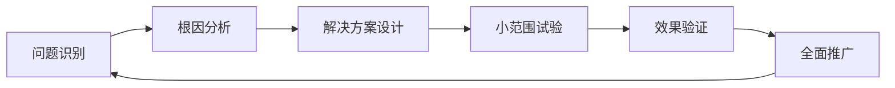
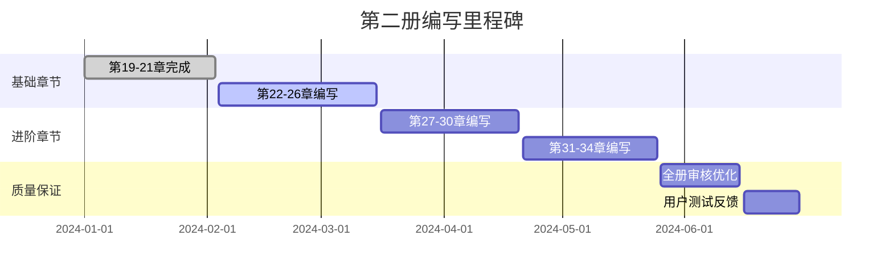

# PDCA流程优化方案

## 🎯 当前PDCA成果分析

### ✅ 已取得的优秀成果
- **Plan阶段**：章节规划清晰，质量目标明确（90+分）
- **Do阶段**：高效执行，平均质量评分92.8分
- **Check阶段**：量化评估体系完善
- **Act阶段**：持续改进，教学法不断升级

## 🚀 PDCA流程升级建议

### Plan阶段增强

#### 1. 智能化规划工具
```python
# 章节规划智能助手
class ChapterPlanner:
    def __init__(self):
        self.difficulty_matrix = {}
        self.prerequisite_graph = {}
        self.learning_objectives = {}
    
    def plan_chapter(self, chapter_id, target_audience):
        """基于受众特点智能规划章节内容"""
        plan = {
            'learning_objectives': self.generate_objectives(target_audience),
            'content_structure': self.design_structure(chapter_id),
            'assessment_methods': self.suggest_assessments(chapter_id),
            'estimated_effort': self.calculate_effort(chapter_id)
        }
        return plan
    
    def optimize_sequence(self, chapters):
        """优化章节学习顺序"""
        # 基于依赖关系和难度曲线优化顺序
        pass
```

#### 2. 多维度质量预设


### Do阶段优化

#### 1. 敏捷开发模式
- **Sprint规划**：每章划分为多个迭代周期
- **每日站会**：进度同步和问题识别
- **版本控制**：精细化的内容版本管理

#### 2. 协作工具集成
```yaml
# 工具链配置示例
writing_pipeline:
  content_creation:
    - markdown编辑器
    - mermaid图表工具
    - jupyter notebook
  
  quality_assurance:
    - 语法检查工具
    - 代码测试框架
    - 同行评议系统
  
  project_management:
    - 进度跟踪看板
    - 任务依赖管理
    - 风险识别预警
```

### Check阶段深化

#### 1. 多层次评估体系
```python
# 综合评估系统
class ComprehensiveEvaluator:
    def __init__(self):
        self.metrics = {
            'content_quality': ContentQualityMetrics(),
            'code_quality': CodeQualityMetrics(),
            'teaching_effectiveness': TeachingMetrics(),
            'user_experience': UXMetrics()
        }
    
    def evaluate_chapter(self, chapter_content):
        """全方位章节评估"""
        scores = {}
        for metric_name, evaluator in self.metrics.items():
            scores[metric_name] = evaluator.evaluate(chapter_content)
        
        return {
            'overall_score': self.calculate_weighted_score(scores),
            'detailed_scores': scores,
            'improvement_suggestions': self.generate_suggestions(scores)
        }
```

#### 2. 实时反馈机制
- **用户测试**：每章完成后的小规模用户测试
- **数据监控**：学习行为数据实时收集
- **A/B测试**：不同教学方法效果对比

### Act阶段强化

#### 1. 持续改进循环


#### 2. 知识管理系统
- **最佳实践库**：成功经验系统化收集
- **问题解决手册**：常见问题标准化解决方案
- **创新想法池**：前瞻性改进建议收集

## 📊 关键绩效指标(KPI)优化

### 当前KPI体系
```python
current_kpis = {
    'quality_score': 92.8,  # 目标: 90+
    'content_volume': '140万字',
    'code_examples': '400+个',
    'completion_rate': '38.5%'  # 20/52章节
}
```

### 优化后KPI体系
```python
enhanced_kpis = {
    # 质量维度
    'content_quality': 95,      # 提升至95分
    'code_quality': 98,         # 新增代码质量评估
    'teaching_effectiveness': 90, # 新增教学效果评估
    
    # 效率维度
    'development_velocity': 1.2,  # 章节/周
    'bug_discovery_rate': 0.05,   # 错误发现率
    'rework_rate': 0.1,          # 返工率
    
    # 用户维度
    'user_satisfaction': 4.5,     # 用户满意度(/5)
    'completion_rate': 85,        # 学习完成率
    'knowledge_retention': 80     # 知识保持率
}
```

## 🎯 阶段性里程碑规划

### 第二册完成里程碑


### 第三册启动准备
- **技术栈选择**：前沿AI技术栈调研
- **行业需求分析**：企业AI应用需求调研
- **教学法创新**：下一代教学方法设计

## 🔧 工具和流程标准化

### 1. 内容创作标准
```markdown
# 章节创作检查清单

## 内容结构 ✅
- [ ] 学习目标明确（知识/技能/素养）
- [ ] 章节结构逻辑清晰
- [ ] 知识点递进合理
- [ ] 实战项目完整

## 代码质量 ✅
- [ ] 所有代码可运行
- [ ] 代码注释详细
- [ ] 异常处理完善
- [ ] 性能优化到位

## 教学设计 ✅
- [ ] 比喻体系一致
- [ ] 难度曲线平滑
- [ ] 互动环节丰富
- [ ] 评估方法多样

## 视觉效果 ✅
- [ ] Mermaid图表清晰
- [ ] 代码格式规范
- [ ] 排版美观统一
- [ ] 配色方案协调
```

### 2. 质量保证流程
```python
# 质量保证自动化流程
class QualityAssurance:
    def __init__(self):
        self.checkers = [
            GrammarChecker(),
            CodeValidator(),
            LinkVerifier(),
            ImageOptimizer(),
            ContentStructureAnalyzer()
        ]
    
    def run_qa_pipeline(self, chapter_file):
        """运行完整的质量保证流程"""
        results = []
        for checker in self.checkers:
            result = checker.check(chapter_file)
            results.append(result)
        
        return self.generate_qa_report(results)
```

## 🌟 创新发展方向

### 1. AI辅助创作
- **内容生成助手**：AI辅助章节大纲生成
- **代码审核AI**：自动检测代码质量问题
- **图表智能生成**：根据内容自动生成可视化图表

### 2. 社区驱动优化
- **众包评审**：社区专家参与内容评审
- **用户贡献**：学习者贡献案例和习题
- **持续更新**：基于技术发展持续更新内容

---

> 🎯 **核心目标**：构建世界级的AI教育内容创作体系，让每一章都成为学习者的知识宝库和技能跳板。 