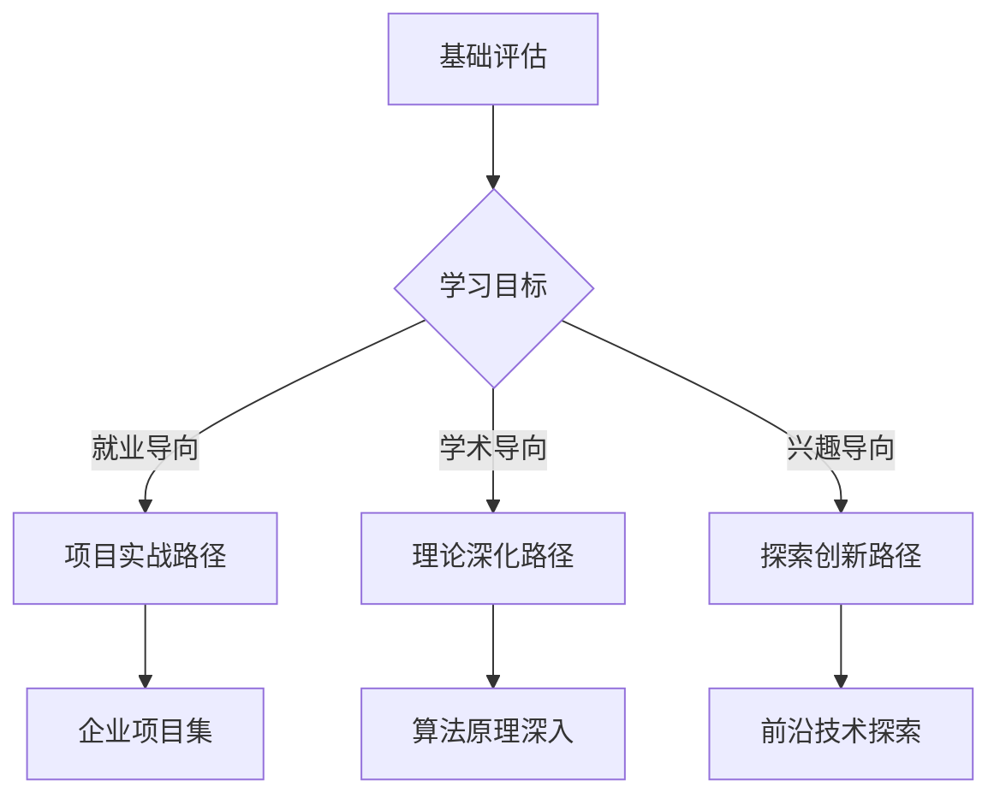

# 教材内容优化建议

## 🎯 优化目标
- 提升学习体验和知识吸收效率
- 增强内容的可操作性和实用性
- 建立更完善的知识体系

## 📖 内容结构优化

### 1. 知识图谱建设
- **创建章节关联图**：使用Mermaid展示知识点依赖关系
- **技能树设计**：为每册建立技能发展路径图
- **前置知识检查**：每章开始前的知识储备自测

### 2. 学习路径个性化


### 3. 内容模块化
- **核心概念模块**：可独立学习的知识单元
- **实践项目模块**：可组合的项目案例库
- **扩展阅读模块**：深度学习资源推荐

## 🔧 技术实现优化

### 1. 交互式学习环境
- **在线代码执行**：集成Jupyter环境
- **即时反馈系统**：代码运行结果实时显示
- **错误诊断助手**：常见错误自动诊断和建议

### 2. 学习进度跟踪
```python
# 学习进度管理系统示例
class LearningProgress:
    def __init__(self, student_id):
        self.student_id = student_id
        self.chapters_completed = []
        self.projects_finished = []
        self.skills_acquired = []
    
    def track_chapter(self, chapter_id, score):
        """跟踪章节完成情况"""
        self.chapters_completed.append({
            'chapter': chapter_id,
            'score': score,
            'timestamp': datetime.now()
        })
    
    def recommend_next(self):
        """推荐下一步学习内容"""
        # 基于完成情况推荐学习路径
        pass
```

### 3. 评估体系完善
- **多维度评估**：知识理解、代码实现、创新思维
- **同行评议**：学习者互相评价项目作品
- **实战能力测试**：模拟企业场景的技能测试

## 🎨 用户体验优化

### 1. 视觉设计提升
- **统一设计语言**：建立一致的视觉风格指南
- **信息层次清晰**：重点内容突出显示
- **移动端适配**：响应式设计适应不同设备

### 2. 学习辅助工具
- **智能搜索**：基于语义的内容搜索
- **笔记系统**：支持markdown的学习笔记
- **讨论社区**：学习者交流互动平台

## 📊 数据驱动改进

### 1. 学习分析系统
```python
# 学习行为分析示例
class LearningAnalytics:
    def analyze_reading_pattern(self, user_data):
        """分析阅读行为模式"""
        return {
            'avg_reading_time': self.calc_avg_time(user_data),
            'difficult_sections': self.identify_difficult_parts(user_data),
            'optimal_study_time': self.predict_best_time(user_data)
        }
    
    def generate_insights(self, cohort_data):
        """生成学习洞察报告"""
        return {
            'completion_rates': self.calc_completion_rates(cohort_data),
            'common_challenges': self.identify_challenges(cohort_data),
            'improvement_suggestions': self.suggest_improvements(cohort_data)
        }
```

### 2. 内容质量监控
- **用户反馈收集**：实时收集学习体验反馈
- **内容使用统计**：跟踪最受欢迎和最具挑战性的内容
- **持续优化机制**：基于数据定期更新内容

## 🔮 未来发展方向

### 1. AI赋能教学
- **个性化学习路径**：AI推荐最适合的学习内容
- **智能答疑系统**：自动回答常见学习问题
- **代码智能评估**：AI评价代码质量和给出改进建议

### 2. 产业连接
- **企业合作项目**：真实企业场景的实战项目
- **行业专家讲座**：定期邀请业界专家分享
- **就业指导服务**：职业规划和面试准备

### 3. 社区生态建设
- **学习者社区**：构建活跃的学习交流社区
- **导师制度**：经验丰富的学习者指导新手
- **开源贡献**：鼓励学习者参与开源项目

## 🎯 实施建议

### 短期目标（1-2个月）
1. 完善现有章节的Mermaid图表系统
2. 建立统一的代码示例规范
3. 添加章节间的知识关联指引

### 中期目标（3-6个月）
1. 开发在线学习平台MVP版本
2. 建立学习进度跟踪系统
3. 构建初步的学习者社区

### 长期目标（6-12个月）
1. 集成AI智能教学助手
2. 建立完整的学习分析系统
3. 形成可持续的内容更新机制

---

> 💡 **核心理念**：从"内容提供者"向"学习体验设计师"转变，创造真正以学习者为中心的教育产品。 